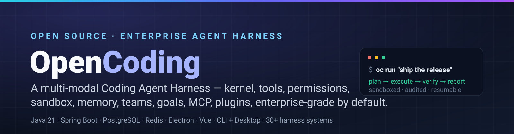
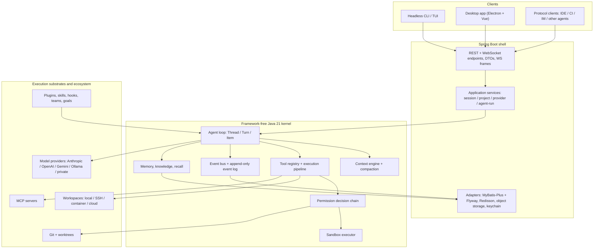

<div align="center">
  
</div>

<div align="center">

**An enterprise-grade, multi-modal Coding Agent Harness** — kernel · tools · permissions · sandbox · context · memory · knowledge · teams · goals · schedules · MCP · skills · plugins · A2A — designed from first principles and benchmarked source-by-source against the state of the art.

[](https://openjdk.org/projects/jdk/21/)
[](https://spring.io/projects/spring-boot)
[](https://www.postgresql.org/)
[](https://redis.io/)
[](open-coding-client)
[](pom.xml)
[](docs/harness)
[](./CONTRIBUTING.md)
[](LICENSE)

**English** · [简体中文](README.zh-CN.md)

</div>

---

## Project status — design-complete, implementation in progress

> **This repository currently ships a complete, audited design — not a finished runtime.** Every claim below is backed by a file in `docs/harness/`. The implementation is at **M0**: the module skeleton and the contract layer (`docs/harness/impl/00-contracts/`) are ready to build against. The README will be updated as milestones land; the status table is the honest contract.

| Layer | State | Evidence |
| --- | --- | --- |
| Target-state design (36 volumes, appendices A–D) | **Complete & audited** | `docs/harness/README.md` · 420 registered decisions · `DECISIONS.md` · `AUDIT.md` |
| Competitor source-level research (9 products) | **Complete** | `docs/harness/research/` · 24 dimensions each · `[E1]`–`[E4]` evidence grading |
| Per-system implementation specs (35) | **Complete** | `docs/harness/impl/01…35-*-impl.md` · requirements → M×N comparison → diagrams → data model → DoD |
| Per-component specs (36 managers/executors/registries) | **Complete** | `docs/harness/impl/components/C01…C36` |
| Contract layer (the "can we start coding?" set) | **Complete** | `docs/harness/impl/00-contracts/` · module manifest, kernel ports, core data model, error-code catalog, zero-credential run recipe |
| Self-review campaign | **Complete** | 25 review reports, rounds R1–R10b · 606/606 diagrams machine-validated · 40 sampled source claims re-verified |
| Runtime implementation | **In progress (M0)** | Module skeleton in `open-coding-core/*`, contract classes in `open-coding-core-api`, bootstrap app in `open-coding-bootstrap` |

---

## Why OpenCoding

Most coding agents are products. OpenCoding is being built as a **harness** — the layer that everything else (CLI, desktop, IDE, CI, other agents) plugs into.

- **Kernel without a framework.** The agent loop, context engine, tool system, permission chain and event log are plain Java 21 (virtual threads), with zero Spring/ORM dependencies — fully unit-testable, embeddable, and reused verbatim by every client. Spring Boot lives only in the shell.
- **Enterprise by default, not by plugin.** Multi-tenancy, SSO/SCIM, three-tier audit with tamper-evident hash chains, quota and cost attribution, DLP, air-gapped deployment and private model providers are part of the core design — our research found these to be the market's largest blind spot.
- **Everything is an event.** State changes are append-only events; UI, audit, metering and crash recovery all consume the same stream. Any long-running flow resumes from the last committed checkpoint.
- **Everything is extendable.** 30+ extension classes / 100+ extension points across the full lifecycle: tools, models, permissions, hooks, skills, MCP, storage, UI, commands — with versioned stability tiers.
- **One core, three surfaces.** Headless CLI, Electron + Vue desktop and IDE/CI/IM protocol clients share the same session protocol — differences live only in presentation.
- **Researched, not guessed.** Before writing a line of design we read the source of Claude Code (via the open replication), OpenCode, Codex, DeepSeek Harness, MiniMax Code, Grok Build, Qoder, Gemini CLI and seven second-tier harnesses — 18 repositories cloned, every finding graded by evidence strength, and the reversible choices recorded with their fallback triggers.

---

## What's inside the harness

> 30 domains, each with a design volume, an implementation spec and — where it is a manager/executor/registry — a dedicated component spec. `→ 卷 NN` links to the design volume, `→ impl/NN` to the implementation spec.

<table>
<tr><td width="33%" valign="top">

**Kernel & intelligence**

| System | Highlights |
| --- | --- |
| Kernel runtime → [卷01](docs/harness/01-harness-architecture.md) · [impl](docs/harness/impl/01-kernel-runtime-impl.md) | daemon + embedded modes, sessions, queues, crash recovery |
| Model gateway → [卷02](docs/harness/02-model-gateway.md) · [impl](docs/harness/impl/02-model-gateway-impl.md) | Anthropic / OpenAI Responses / Gemini / Ollama native, capability negotiation, decorator chain |
| Context engine → [卷03](docs/harness/03-context-system.md) · [impl](docs/harness/impl/03-context-engine-impl.md) | 9-section budget, 4-level compaction, cache affinity |
| Prompt system → [卷04](docs/harness/04-prompt-system.md) | 5 asset classes, layered overrides, canary + rollback |
| Tool system → [卷05](docs/harness/05-tool-system.md) · [impl](docs/harness/impl/05-tool-system-impl.md) | 3-channel contracts, 10-step pipeline, conflict scheduling |
| Permissions → [卷06](docs/harness/06-permission-system.md) | R0–R5 risk grading, ordered decision chain, approval orchestration |
| Sandbox → [卷07](docs/harness/07-sandbox-security.md) | L0/L0+/L1/L2/L3 isolation, fail-closed, runtime witnesses |
| Skills → [卷08](docs/harness/08-skill-system.md) | package format, 4 sources, 4 activation modes, eval gates |
| MCP → [卷09](docs/harness/09-mcp-system.md) | 4 transports, 6 capability mappings, self-healing, gateway |

</td><td width="33%" valign="top">

**Collaboration & autonomy**

| System | Highlights |
| --- | --- |
| Agent core → [卷12](docs/harness/12-agent-core.md) | Thread/Turn/Item, sub-agents, parallel fan-out, guards |
| Agent teams → [卷13](docs/harness/13-agent-teams.md) | 6 topologies, claiming, blackboard, budget circuit-breakers |
| Tasks & plans → [卷14](docs/harness/14-task-and-plan.md) | unified WorkItem model, DAG, evidence-based acceptance |
| Goals & schedules → [卷15](docs/harness/15-goal-and-schedule.md) | autonomous ticks, drift detection, 5 trigger classes |
| Memory → [卷10](docs/harness/10-memory-system.md) | 4 tiers, candidate writes, hybrid recall, compliant deletion |
| Knowledge → [卷11](docs/harness/11-knowledge-system.md) | connectors, structure-aware chunking, 3-way retrieval, repo symbol graph |
| Events → [卷16](docs/harness/16-event-system.md) | envelope + schema governance, dual channels, replay |
| Hooks → [卷17](docs/harness/17-hooks-system.md) | 8 classes / 30+ points, observe / block / rewrite |
| Plugins → [卷18](docs/harness/18-plugin-extension.md) | extension catalog, 3 plugin forms, isolation, SDK |
| Automation → [卷34](docs/harness/34-automation-templates.md) | 12 built-in playbooks (dependency upgrades, PR sweep, docs sync…) |
| Augmentation → [卷35](docs/harness/35-intelligent-augmentation.md) | PR descriptions, review bot, test generation, drift detection |

</td><td width="33%" valign="top">

**Platform & operations**

| System | Highlights |
| --- | --- |
| Persistence → [卷19](docs/harness/19-persistence-migration-recovery.md) | expand-contract migrations, generation-based session logs, PITR, export/import |
| Workspaces → [卷20](docs/harness/20-workspace-system.md) | local / SSH / container / cloud backends, pooling, reconnect |
| Git & worktrees → [卷21](docs/harness/21-git-and-worktree.md) | on-demand isolation, merge queue, guardrails |
| Clients → [卷22](docs/harness/22-clients-cli-desktop.md) | CLI/TUI + desktop information architecture, accessibility |
| A2A & ACP → [卷23](docs/harness/23-agent2agent-interop.md) | agent-to-agent protocol, ACP-compatible ingress/egress |
| Enterprise ops → [卷24](docs/harness/24-enterprise-operations.md) | tenants, SSO/SCIM, audit, quota, deployment forms |
| Security engineering → [卷30](docs/harness/30-security-engineering.md) | threat model, key lifecycle, supply chain, abuse defence |
| Quality & evaluation → [卷26](docs/harness/26-quality-evaluation-roadmap.md) | fake model, fault injection, recorded replay, scorecards |
| Frontier → [卷25](docs/harness/25-frontier-exploration.md) | 12 trackable research directions with exit criteria |

</td></tr>
</table>

Full index: [`docs/harness/README.md`](docs/harness/README.md) · component inventory (137 components): [`appendix-d`](docs/harness/appendix-d-component-inventory.md)

---

## Architecture



Invariants that every design decision must satisfy (full list in [卷 01 §4.5](docs/harness/01-harness-architecture.md)):
contract-first · framework-free kernel · everything is an event · everything is extendable · everything is recoverable · least privilege with explicit authorization · one core many surfaces · enterprise defaults · measurable · migratable data.

---

## Design goals, measured against the state of the art

From our [source-level competitor study](docs/harness/research/CROSS-COMPARISON.md) (9 products, 18 repositories, 270-cell capability matrix — every cell carries an evidence grade). Read as **design targets**, not shipped features:

| Capability | Typical state of the art | OpenCoding design target |
| --- | --- | --- |
| Multi-tenant / SSO / SCIM / quota / audit | Largely absent in open harnesses (8 of 9 groups: no observable support) | First-class, in the core, with tamper-evident audit chains |
| Cross-session, cross-project memory | Experimental or file-based only (7 of 9 groups) | 4-tier memory with candidate writes, hybrid recall, compliant deletion |
| Worktree-level isolation for parallel agents | Reported as absent across the studied set | On-demand worktrees + merge queue + lost-commit recovery |
| Agent interoperability | One product ships A2A; six converge on ACP | ACP-compatible ingress/egress **and** A2A federation |
| Permission model | Mode switches, coarse allow/deny | R0–R5 risk grading, ordered policy sources, precedented approvals, replayable decisions |
| Sandbox honesty | Sandbox claims often unverifiable at runtime | Five isolation tiers with runtime witnesses and fail-closed degradation |
| Crash recovery | Session resume only | Event-sourced recovery from any checkpoint, with an idempotency key per effect |

---

## Repository layout

```
OpenCoding/
├── docs/
│   ├── harness/                       # ★ The deliverable: complete target-state design
│   │   ├── README.md                  #   index · method · coverage audit
│   │   ├── 00…35-*.md                 #   36 design volumes
│   │   ├── appendix-a…d-*.md          #   domain model · interface contracts · glossary · component inventory
│   │   ├── DECISIONS.md               #   420 registered decisions with fallbacks
│   │   ├── ALTERNATIVES.md            #   rejected branches + revisit triggers
│   │   ├── ITERATIONS.md              #   review rounds (Phase A ×25, Phase B ×11)
│   │   ├── AUDIT.md                   #   objective → artifact traceability, verified counts
│   │   ├── research/                  #   9 competitor reports + cross-comparison + adoption ledger
│   │   ├── impl/                      #   35 system specs + components/ (36) + 00-contracts/ (5)
│   │   ├── reviews/                   #   25 review reports (R01–R10b)
│   │   └── archive/                   #   superseded drafts (kept for history)
│   └── design/                        # v1 frozen contract (migration reference)
├── open-coding-common/                # pure enums & utilities (no Spring)
├── open-coding-core/                  # framework-free core
│   ├── open-coding-core-api/          #   all contracts + SPI
│   ├── open-coding-core-model/        #   provider adapters (vendor SDKs isolated here)
│   ├── open-coding-core-agent/        #   agent loop, compaction, permission chain
│   ├── open-coding-core-tool/         #   built-in tools
│   └── open-coding-core-implementation/ # default implementations + wiring
├── open-coding-domain/                # entities, mappers, Flyway, DB-backed SPI
├── open-coding-infrastructure/        # Redis, filesystem, media, crypto
├── open-coding-application/           # use-case orchestration
├── open-coding-interfaces/            # REST + WebSocket endpoints
├── open-coding-bootstrap/             # @AutoConfiguration, config binding, entrypoint
├── open-coding-plugin/                # plugin SDK + sample plugins
└── open-coding-client/                # React 19 + Vite web client
```

The **target** module structure (59 modules, build order, v1 coexistence rules) is frozen in [`impl/00-contracts/MODULE-MANIFEST.md`](docs/harness/impl/00-contracts/MODULE-MANIFEST.md).

---

## Quick start

### Requirements

JDK 21+ · Maven 3.9+ · PostgreSQL 14+ · Redis 7+ · Node.js 22+ (client only)

### Local infrastructure

```bash
docker run -d --name oc-postgres -e POSTGRES_DB=opencoding -e POSTGRES_PASSWORD=postgres -p 5432:5432 postgres:16
docker run -d --name oc-redis -p 6379:6379 redis:7
```

### Build and run

```bash
cp .env.example .env          # all keys documented; secrets stay out of git
mvn clean install             # full multi-module build
mvn -pl open-coding-bootstrap -am spring-boot:run
```

Then:

| Endpoint | Purpose |
| --- | --- |
| `http://localhost:8080/api/health` | health probe |
| `http://localhost:8080/swagger-ui.html` | Swagger UI |
| `http://localhost:8080/actuator/health` | actuator health |
| `http://localhost:8080/v3/api-docs` | OpenAPI JSON |

Frontend:

```bash
cd open-coding-client && npm install && npm run dev
```

Configuration resolves from OS env → IDE `.env` plugin → project-root `.env` (see [`.env.example`](.env.example)); `.env` is git-ignored by design.

### Build *from* the design (recommended)

The fastest way to contribute is to implement against the contract layer:

1. [`impl/00-contracts/README.md`](docs/harness/impl/00-contracts/README.md) — reading order, authority rules
2. [`MODULE-MANIFEST.md`](docs/harness/impl/00-contracts/MODULE-MANIFEST.md) — module names, coordinates, build order
3. [`KERNEL-PORTS.md`](docs/harness/impl/00-contracts/KERNEL-PORTS.md) — kernel interfaces + the 24-class M0 starter set
4. [`CORE-DATA-MODEL.md`](docs/harness/impl/00-contracts/CORE-DATA-MODEL.md) — first Flyway migrations (B1: 46 tables)
5. [`ERROR-CODE-CATALOG.md`](docs/harness/impl/00-contracts/ERROR-CODE-CATALOG.md) — 253 error codes with retry semantics
6. [`LOCAL-RUN-RECIPE.md`](docs/harness/impl/00-contracts/LOCAL-RUN-RECIPE.md) — 7 commands to a running session with **no model credentials** (fake provider)

---

## Documentation map

| If you want to… | Read |
| --- | --- |
| Understand the product and its full capability matrix | [卷 00](docs/harness/00-vision-and-product.md) |
| See every design decision and what was rejected | [`DECISIONS.md`](docs/harness/DECISIONS.md) · [`ALTERNATIVES.md`](docs/harness/ALTERNATIVES.md) |
| Know how a system will be implemented (class/sequence/state diagrams) | [`impl/01…35`](docs/harness/impl) |
| Read a specific manager's spec (session, loop, permissions, sandbox…) | [`impl/components/`](docs/harness/impl/components) |
| Start coding today | [`impl/00-contracts/`](docs/harness/impl/00-contracts) |
| See what competitors actually do (with source citations) | [`research/`](docs/harness/research) |
| Check how thoroughly this was reviewed | [`reviews/`](docs/harness/reviews) · [`AUDIT.md`](docs/harness/AUDIT.md) |
| Plan the build order | [卷 27 技术路径](docs/harness/27-technical-path.md) · [卷 26 roadmap](docs/harness/26-quality-evaluation-roadmap.md) |

---

## Engineering rigor

This design was produced the way we intend the product to work: with evidence, adversarial review and machine checks.

- **M×N decision matrices.** Every fork (286 in the design phase + 277 implementation decisions) lists its candidate branches, scores them on completeness / UX / stability / maintainability (30/20/25/25), and records the chosen branch **with the fallback trigger** that would reverse it.
- **Evidence-graded research.** Competitor findings are tagged `[E1]` read-the-source → `[E4]` inference. 40 sampled `[E1]` claims were re-verified against the cloned repositories; the ones that failed were corrected in place (two required downgrades).
- **Adversarial reviews.** 25 review reports across rounds R1–R10b: contradiction sweeps, gap hunts, security bypass hunts (24 bypass classes found and fixed), crash-point matrices, enterprise-readiness audits, implementability walkthroughs.
- **Machine-validated artifacts.** 606/606 Mermaid diagrams parse locally (`mermaid@11`), zero placeholders, REQ/I-decision IDs unique and cross-referenced in a ledger with two-way diffs at zero.
- **Traceability.** `AUDIT.md` maps every original requirement to its artifact and the command that verifies it.

---

## Roadmap

| Phase | Scope | Status |
| --- | --- | --- |
| **M0** | Module skeleton, contract layer, first migration batch (B1), fake-model local loop | In progress |
| **M1** | Kernel + model gateway + context engine; CLI sessions end-to-end | Designed |
| **M2** | Tools, permissions, sandbox, hooks; approval flows | Designed |
| **M3** | Persistence, recovery, events, migration tooling | Designed |
| **M4** | Memory, knowledge, MCP, skills, plugins | Designed |
| **M5** | Desktop client, teams, tasks, goals & schedules | Designed |
| **M6** | Enterprise: tenants, SSO/SCIM, audit, quota & cost | Designed |
| **M7** | A2A/ACP interop, distribution, telemetry, SDKs & ecosystem | Designed |
| **M8** | Frontier tracks (multimodal, computer use, self-evolution) | Explored |

Detailed sequencing: [卷 27 · 20-step implementation sequence](docs/harness/27-technical-path.md).

---

## Contributing

Contributions are welcome — the design is written to be implemented by many hands.

- **Design-first rule:** any behavior change updates `docs/harness/` **before** the code, and conflicts with the contract layer follow the authority order in [`impl/00-contracts/README.md`](docs/harness/impl/00-contracts/README.md).
- **Commit style:** Conventional Commits with a Chinese description (see `git log`).
- **Java style:** enforced by [`.qoder/rules/`](.qoder/rules) — comments/JavaDoc contracts, no magic values, unified exceptions, structured logging, transactional discipline.
- **Before opening a PR:** `mvn -pl <module> -am test` green, new diagrams validated, new decisions registered in the ledger with a fallback trigger.
- **Good first issues** will be seeded from [`impl/00-contracts/LOCAL-RUN-RECIPE.md`](docs/harness/impl/00-contracts/LOCAL-RUN-RECIPE.md) (the M0 path) and section Ⅺ of each implementation spec (their acceptance lists).

A `CONTRIBUTING.md` and issue templates will land together with the first runnable milestone.

---

## License

**MIT** — see [`LICENSE`](LICENSE). Free to use, modify, distribute and use commercially; keeping the copyright and permission notice is the only requirement.

---

## Star history

[](https://star-history.com/#HK-hub/OpenCoding&Date)

<div align="center">
<sub>Built in the open as a harness, not a demo. <a href="docs/harness/README.md">Read the design</a> · <a href="docs/harness/impl/00-contracts/README.md">Start building</a> · <a href="docs/harness/research/CROSS-COMPARISON.md">See the research</a></sub>
</div>
