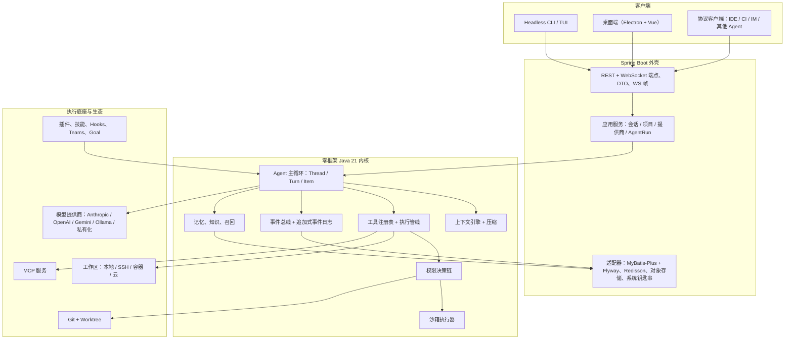

<div align="center">
  
</div>

<div align="center">

**企业级多模态 Coding Agent Harness** —— 内核 · 工具 · 权限 · 沙箱 · 上下文 · 记忆 · 知识库 · 团队 · 目标 · 计划 · MCP · 技能 · 插件 · A2A，全部从第一性原理重新设计，并对标业界前沿逐源码级研究。

[](https://openjdk.org/projects/jdk/21/)
[](https://spring.io/projects/spring-boot)
[](https://www.postgresql.org/)
[](https://redis.io/)
[](open-coding-client)
[](pom.xml)
[](docs/harness)
[](./CONTRIBUTING.md)
[](LICENSE)

[English](README.md) · **简体中文**

</div>

---

## 项目状态 —— 设计已完整交付，实现进行中

> **本仓库当前交付的是一套完整且经过审计的设计，而不是已经完成的运行时。** 下文每一条主张都能在 `docs/harness/` 中找到对应文件。实现处于 **M0**：模块骨架与契约层（`docs/harness/impl/00-contracts/`）已就绪，可直接开工。README 会随里程碑推进持续更新——下面这张状态表就是诚实的契约。

| 层 | 状态 | 证据 |
| --- | --- | --- |
| 目标态设计（36 卷 + 附录 A–D） | **完成且已审计** | `docs/harness/README.md` · 420 条决策登记 · `DECISIONS.md` · `AUDIT.md` |
| 竞品源码级研究（9 家产品） | **完成** | `docs/harness/research/` · 每家 24 维度 · `[E1]`–`[E4]` 证据分级 |
| 逐系统实现方案（35 份） | **完成** | `docs/harness/impl/01…35-*-impl.md` · 需求 → M×N 比选 → 各类图 → 数据模型 → 验收 |
| 逐组件方案（36 个 manager/执行器/注册表） | **完成** | `docs/harness/impl/components/C01…C36` |
| 契约补全层（"能不能开工"的那一组） | **完成** | `docs/harness/impl/00-contracts/` · 模块清单、内核端口、核心数据模型、错误码目录、零凭证运行配方 |
| 自审查 | **完成** | 25 份评审报告，R1–R10b 轮次 · 606/606 图通过机器校验 · 40 条源码断言抽样复核 |
| 运行时实现 | **进行中（M0）** | `open-coding-core/*` 模块骨架、`open-coding-core-api` 契约类、`open-coding-bootstrap` 启动应用 |

---

## 为什么是 OpenCoding

大多数编码 Agent 是"产品"。OpenCoding 要做的是 **Harness（挂载平台）** —— 让 CLI、桌面端、IDE、CI、其他 Agent 都能接入的那一层。

- **内核不依赖框架。** Agent 循环、上下文引擎、工具系统、权限决策链、事件日志全部是纯 Java 21（虚拟线程），零 Spring/ORM 依赖——可纯单测、可嵌入、被所有端原样复用；Spring Boot 只出现在外壳。
- **企业级是默认值，不是插件。** 多租户、SSO/SCIM、三级审计（哈希链防篡改）、配额与成本归因、DLP、离线（air-gapped）部署、私有化模型——我们的研究显示这正是当前市场最大的空白。
- **一切皆事件。** 状态变更只写追加式事件；UI、审计、计量、崩溃恢复消费同一条流。任何长流程都能从最后一个已提交检查点恢复。
- **一切可扩展。** 全生命周期 30+ 类 / 100+ 个扩展点：工具、模型、权限、钩子、技能、MCP、存储、界面、命令——并带版本化稳定性分级。
- **一个内核，三种界面。** Headless CLI、Electron + Vue 桌面端、IDE/CI/IM 协议客户端共用同一套会话协议——差异只在表现层。
- **研究在先，不做臆断。** 写设计之前，我们读了 Claude Code（经开源复刻）、OpenCode、Codex、DeepSeek Harness、MiniMax Code、Grok Build、Qoder、Gemini CLI 以及 7 家二线 Harness 的源码——克隆 18 个仓库，每条发现标注证据等级，每个可逆选择都写清回退触发条件。

---

## Harness 里有什么

> 30 个域，每个域都有设计卷、实现方案；凡是 manager/执行器/注册表级的组件，另有独立组件方案。`→ 卷 NN` 指向设计卷，`→ impl/NN` 指向实现方案。

<table>
<tr><td width="33%" valign="top">

**内核与智能层**

| 系统 | 要点 |
| --- | --- |
| 内核运行时 → [卷01](docs/harness/01-harness-architecture.md) · [impl](docs/harness/impl/01-kernel-runtime-impl.md) | 常驻/内嵌双档、会话、队列、崩溃恢复 |
| 模型接入层 → [卷02](docs/harness/02-model-gateway.md) · [impl](docs/harness/impl/02-model-gateway-impl.md) | Anthropic / OpenAI Responses / Gemini / Ollama 原生，能力协商，装饰器链 |
| 上下文引擎 → [卷03](docs/harness/03-context-system.md) · [impl](docs/harness/impl/03-context-engine-impl.md) | 九区段预算、四级压缩、缓存亲和 |
| 提示词系统 → [卷04](docs/harness/04-prompt-system.md) | 五类资产、分层覆盖、灰度与回滚 |
| 工具系统 → [卷05](docs/harness/05-tool-system.md) · [impl](docs/harness/impl/05-tool-system-impl.md) | 三通道契约、十步管线、资源冲突调度 |
| 权限系统 → [卷06](docs/harness/06-permission-system.md) | R0–R5 风险分级、有序决策链、审批编排 |
| 沙箱安全 → [卷07](docs/harness/07-sandbox-security.md) | L0–L3 五档隔离、fail-closed、运行期见证 |
| Skill 系统 → [卷08](docs/harness/08-skill-system.md) | 技能包格式、四源发现、四种激活、评测门禁 |
| MCP 系统 → [卷09](docs/harness/09-mcp-system.md) | 四传输、六类能力映射、自愈、企业网关 |

</td><td width="33%" valign="top">

**协作与自治**

| 系统 | 要点 |
| --- | --- |
| Agent 内核 → [卷12](docs/harness/12-agent-core.md) | Thread/Turn/Item、子代理、并行扇出、循环护栏 |
| Agent Teams → [卷13](docs/harness/13-agent-teams.md) | 六类拓扑、认领、黑板、预算熔断 |
| 任务与计划 → [卷14](docs/harness/14-task-and-plan.md) | 统一 WorkItem 模型、DAG、证据验收 |
| Goal 与 Schedule → [卷15](docs/harness/15-goal-and-schedule.md) | 自治 Tick、漂移检测、五类触发器 |
| 记忆系统 → [卷10](docs/harness/10-memory-system.md) | 四层记忆、候选写入、混合召回、合规删除 |
| 知识库 → [卷11](docs/harness/11-knowledge-system.md) | 连接器、结构感知切分、三路检索、仓库符号图 |
| 事件系统 → [卷16](docs/harness/16-event-system.md) | 信封与 Schema 治理、双通道、回放 |
| Hooks → [卷17](docs/harness/17-hooks-system.md) | 8 类 30+ 钩子点、观察/阻断/改写 |
| 插件化 → [卷18](docs/harness/18-plugin-extension.md) | 扩展点目录、三形态插件、隔离与 SDK |
| 自动化模板库 → [卷34](docs/harness/34-automation-templates.md) | 12 个内置模板（依赖升级、PR 巡检、文档同步…） |
| 智能增强包 → [卷35](docs/harness/35-intelligent-augmentation.md) | PR 描述、审查机器人、测试生成、文档漂移检测 |

</td><td width="33%" valign="top">

**平台与运维**

| 系统 | 要点 |
| --- | --- |
| 持久化/迁移/恢复 → [卷19](docs/harness/19-persistence-migration-recovery.md) | expand-contract 迁移、代际式会话日志、PITR、导入导出 |
| 工作区 → [卷20](docs/harness/20-workspace-system.md) | 本地 / SSH / 容器 / 云四类后端、连接池、断线重连 |
| Git 与 Worktree → [卷21](docs/harness/21-git-and-worktree.md) | 按需隔离、合并队列、危险操作护栏 |
| 双端形态 → [卷22](docs/harness/22-clients-cli-desktop.md) | CLI/TUI 与桌面端信息架构、无障碍 |
| A2A 与 ACP → [卷23](docs/harness/23-agent2agent-interop.md) | Agent 间协议、ACP 兼容进出口 |
| 企业运维 → [卷24](docs/harness/24-enterprise-operations.md) | 租户、SSO/SCIM、审计、配额、部署形态 |
| 安全工程 → [卷30](docs/harness/30-security-engineering.md) | 威胁模型、密钥生命周期、供应链、防滥用 |
| 质量与评测 → [卷26](docs/harness/26-quality-evaluation-roadmap.md) | 假模型、故障注入、录制回放、评分基线 |
| 前沿探索 → [卷25](docs/harness/25-frontier-exploration.md) | 12 个可跟踪方向，带退出判据 |

</td></tr>
</table>

完整索引：[`docs/harness/README.md`](docs/harness/README.md) · 组件清单（137 项）：[`appendix-d`](docs/harness/appendix-d-component-inventory.md)

---

## 架构



所有设计必须同时满足的铁律（完整清单见 [卷 01 §4.5](docs/harness/01-harness-architecture.md)）：
契约先行 · 内核零框架 · 一切皆事件 · 一切可扩展 · 一切可恢复 · 最小权限 + 显式授权 · 一个内核多端同源 · 企业级默认 · 可评测 · 数据可迁移。

---

## 设计目标：与业界现状的对照

来自我们的[竞品源码级研究](docs/harness/research/CROSS-COMPARISON.md)（9 家产品、18 个仓库、270 格能力矩阵，每格都带证据等级）。以下读作**设计目标**，而非已交付功能：

| 能力 | 业界典型现状 | OpenCoding 设计目标 |
| --- | --- | --- |
| 多租户 / SSO / SCIM / 配额 / 审计 | 开源 Harness 普遍缺失（9 家中 8 家无可观测支持） | 核心内置，含防篡改审计链 |
| 跨会话、跨项目记忆 | 仅实验性或文件级（9 家中 7 家） | 四层记忆 + 候选写入 + 混合召回 + 合规删除 |
| 并行 Agent 的 worktree 级隔离 | 在所研究范围内被报告为普遍缺失 | 按需 worktree + 合并队列 + 丢提交恢复 |
| Agent 互操作 | 仅 1 家提供 A2A；6 家收敛到 ACP | 同时支持 ACP 兼容进出口 + A2A 联邦 |
| 权限模型 | 模式开关、粗粒度允许/拒绝 | R0–R5 分级、策略源有序、先例审批、决策可回放 |
| 沙箱诚实性 | 沙箱声明常在运行期无法验证 | 五档隔离 + 运行期见证 + 降级即 fail-closed |
| 崩溃恢复 | 仅会话恢复 | 任意检查点事件溯源恢复，每个副作用带幂等键 |

---

## 仓库结构

```
OpenCoding/
├── docs/
│   ├── harness/                       # ★ 交付主体：完整的目标态设计
│   │   ├── README.md                  #   总索引 · 方法 · 覆盖审计
│   │   ├── 00…35-*.md                 #   36 个设计卷
│   │   ├── appendix-a…d-*.md          #   领域模型 · 接口契约 · 术语表 · 组件清单
│   │   ├── DECISIONS.md               #   420 条决策登记（含回退触发）
│   │   ├── ALTERNATIVES.md            #   被放弃分支 + 重启条件
│   │   ├── ITERATIONS.md              #   审查轮次（Phase A ×25、Phase B ×11）
│   │   ├── AUDIT.md                   #   目标 → 交付物可追溯性，实测计数
│   │   ├── research/                  #   9 份竞品报告 + 交叉对比 + 采纳台账
│   │   ├── impl/                      #   35 份系统方案 + components/（36）+ 00-contracts/（5）
│   │   ├── reviews/                   #   25 份评审报告（R01–R10b）
│   │   └── archive/                   #   被取代草案（保留历史）
│   └── design/                        # v1 冻结契约（迁移参考）
├── open-coding-common/                # 纯枚举与工具类（无 Spring）
├── open-coding-core/                  # 零框架内核
│   ├── open-coding-core-api/          #   全部契约 + SPI
│   ├── open-coding-core-model/        #   提供商适配器（厂商 SDK 仅隔离于此）
│   ├── open-coding-core-agent/        #   Agent 循环、压缩、权限链
│   ├── open-coding-core-tool/         #   内置工具
│   └── open-coding-core-implementation/ # 默认实现与装配
├── open-coding-domain/                # 实体、Mapper、Flyway、DB 版 SPI
├── open-coding-infrastructure/        # Redis、文件系统、媒体、加密
├── open-coding-application/           # 用例编排
├── open-coding-interfaces/            # REST + WebSocket 端点
├── open-coding-bootstrap/             # @AutoConfiguration、配置绑定、启动入口
├── open-coding-plugin/                # 插件 SDK + 示例插件
└── open-coding-client/                # React 19 + Vite Web 客户端
```

**目标**模块结构（59 个模块、构建顺序、与 v1 共存规则）已冻结在 [`impl/00-contracts/MODULE-MANIFEST.md`](docs/harness/impl/00-contracts/MODULE-MANIFEST.md)。

---

## 快速开始

### 环境要求

JDK 21+ · Maven 3.9+ · PostgreSQL 14+ · Redis 7+ · Node.js 22+（仅前端）

### 本地基础设施

```bash
docker run -d --name oc-postgres -e POSTGRES_DB=opencoding -e POSTGRES_PASSWORD=postgres -p 5432:5432 postgres:16
docker run -d --name oc-redis -p 6379:6379 redis:7
```

### 构建与运行

```bash
cp .env.example .env          # 全部键已注释说明；密钥不入库
mvn clean install             # 全模块构建
mvn -pl open-coding-bootstrap -am spring-boot:run
```

随后：

| 端点 | 用途 |
| --- | --- |
| `http://localhost:8080/api/health` | 健康探针 |
| `http://localhost:8080/swagger-ui.html` | Swagger UI |
| `http://localhost:8080/actuator/health` | Actuator 健康 |
| `http://localhost:8080/v3/api-docs` | OpenAPI JSON |

前端：

```bash
cd open-coding-client && npm install && npm run dev
```

配置解析顺序：OS 环境变量 → IDE `.env` 插件 → 项目根 `.env`（见 [`.env.example`](.env.example)）；`.env` 有意不入库。

### 按设计开工（推荐）

最快的贡献路径是直接对着契约层实现：

1. [`impl/00-contracts/README.md`](docs/harness/impl/00-contracts/README.md) —— 阅读顺序与权威性规则
2. [`MODULE-MANIFEST.md`](docs/harness/impl/00-contracts/MODULE-MANIFEST.md) —— 模块名、坐标、构建顺序
3. [`KERNEL-PORTS.md`](docs/harness/impl/00-contracts/KERNEL-PORTS.md) —— 内核接口 + 24 类 M0 开工集
4. [`CORE-DATA-MODEL.md`](docs/harness/impl/00-contracts/CORE-DATA-MODEL.md) —— 首批 Flyway 迁移（B1：46 张表）
5. [`ERROR-CODE-CATALOG.md`](docs/harness/impl/00-contracts/ERROR-CODE-CATALOG.md) —— 253 条错误码与重试语义
6. [`LOCAL-RUN-RECIPE.md`](docs/harness/impl/00-contracts/LOCAL-RUN-RECIPE.md) —— **7 条命令**跑通会话，零模型凭证（假模型）

---

## 文档地图

| 你想…… | 读 |
| --- | --- |
| 了解产品与完整能力矩阵 | [卷 00](docs/harness/00-vision-and-product.md) |
| 查看全部设计决策与被否决方案 | [`DECISIONS.md`](docs/harness/DECISIONS.md) · [`ALTERNATIVES.md`](docs/harness/ALTERNATIVES.md) |
| 看某系统将如何实现（类图/时序图/状态机） | [`impl/01…35`](docs/harness/impl) |
| 看某个 manager 的独立方案（会话、循环、权限、沙箱…） | [`impl/components/`](docs/harness/impl/components) |
| 今天就开工 | [`impl/00-contracts/`](docs/harness/impl/00-contracts) |
| 看竞品到底怎么做（带源码引用） | [`research/`](docs/harness/research) |
| 检查评审有多彻底 | [`reviews/`](docs/harness/reviews) · [`AUDIT.md`](docs/harness/AUDIT.md) |
| 规划实施顺序 | [卷 27 技术路径](docs/harness/27-technical-path.md) · [卷 26 路线图](docs/harness/26-quality-evaluation-roadmap.md) |

---

## 工程严谨性

这套设计是按我们希望产品本身工作的方式产出的：证据、对抗性评审、机器校验。

- **M×N 决策矩阵。** 每个分叉（设计期 286 条 + 实现期 277 条）都列出候选分支，按功能完整度/体验/落地稳定性/可维护性（30/20/25/25）加权评分，并记录选定分支**以及会推翻它的回退触发条件**。
- **分级证据的研究。** 竞品结论按 `[E1]` 读到源码 → `[E4]` 推断 标注。抽检 40 条 `[E1]` 断言回仓库复核，不成立的当场修正（其中 2 条被降级）。
- **对抗性评审。** R1–R10b 共 25 份评审报告：跨文档矛盾清扫、缺口猎捕、安全绕过猎捕（发现并修复 24 类绕过）、崩溃点矩阵、企业就绪审计、可开工性走查。
- **机器校验的产物。** 606/606 张 Mermaid 图本地解析通过（`mermaid@11`），零占位符，REQ/I-决策编号唯一且与台账双向 diff 为零。
- **可追溯。** `AUDIT.md` 把每条原始需求映射到交付物与验证命令。

---

## 路线图

| 阶段 | 范围 | 状态 |
| --- | --- | --- |
| **M0** | 模块骨架、契约层、首批迁移（B1）、假模型本地闭环 | 进行中 |
| **M1** | 内核 + 模型接入层 + 上下文引擎；CLI 会话端到端 | 已设计 |
| **M2** | 工具、权限、沙箱、Hooks；审批流 | 已设计 |
| **M3** | 持久化、恢复、事件、迁移工具 | 已设计 |
| **M4** | 记忆、知识库、MCP、技能、插件 | 已设计 |
| **M5** | 桌面端、Teams、任务、Goal 与 Schedule | 已设计 |
| **M6** | 企业能力：租户、SSO/SCIM、审计、配额与成本 | 已设计 |
| **M7** | A2A/ACP 互操作、分发、遥测、SDK 与生态 | 已设计 |
| **M8** | 前沿方向（多模态、计算机使用、自进化） | 已探索 |

详细排序：[卷 27 · 20 步实现序列](docs/harness/27-technical-path.md)。

---

## 贡献指南

欢迎贡献——这套设计本来就是写给"很多人一起实现"的。

- **文档先行：** 任何行为变更**先改** `docs/harness/` 再改代码；与契约层冲突时按 [`impl/00-contracts/README.md`](docs/harness/impl/00-contracts/README.md) 的权威顺序处理。
- **提交信息：** Conventional Commits + 中文描述（见 `git log`）。
- **Java 规范：** 由 [`.qoder/rules/`](.qoder/rules) 强制——注释/JavaDoc 契约、无魔法值、统一异常、结构化日志、事务纪律。
- **提 PR 前：** `mvn -pl <module> -am test` 全绿，新增图通过校验，新决策登记入台账并写清回退触发条件。
- **适合新手的任务**将从 [`impl/00-contracts/LOCAL-RUN-RECIPE.md`](docs/harness/impl/00-contracts/LOCAL-RUN-RECIPE.md)（M0 路径）与各实现方案的 §⑪ 验收清单中生成。

`CONTRIBUTING.md` 与 Issue 模板将随第一个可运行里程碑一并落地。

---

## 许可证

本项目采用 **MIT 许可证** —— 见 [`LICENSE`](LICENSE)。

```
Copyright (c) 2026 HK-hub
```

可自由使用、修改、分发与商用，仅需保留版权与许可声明。

---

## Star 趋势

[](https://star-history.com/#HK-hub/OpenCoding&Date)

<div align="center">
<sub>以 Harness 的方式开源，而不是又一个演示。 <a href="docs/harness/README.md">读设计</a> · <a href="docs/harness/impl/00-contracts/README.md">开始实现</a> · <a href="docs/harness/research/CROSS-COMPARISON.md">看研究</a></sub>
</div>
