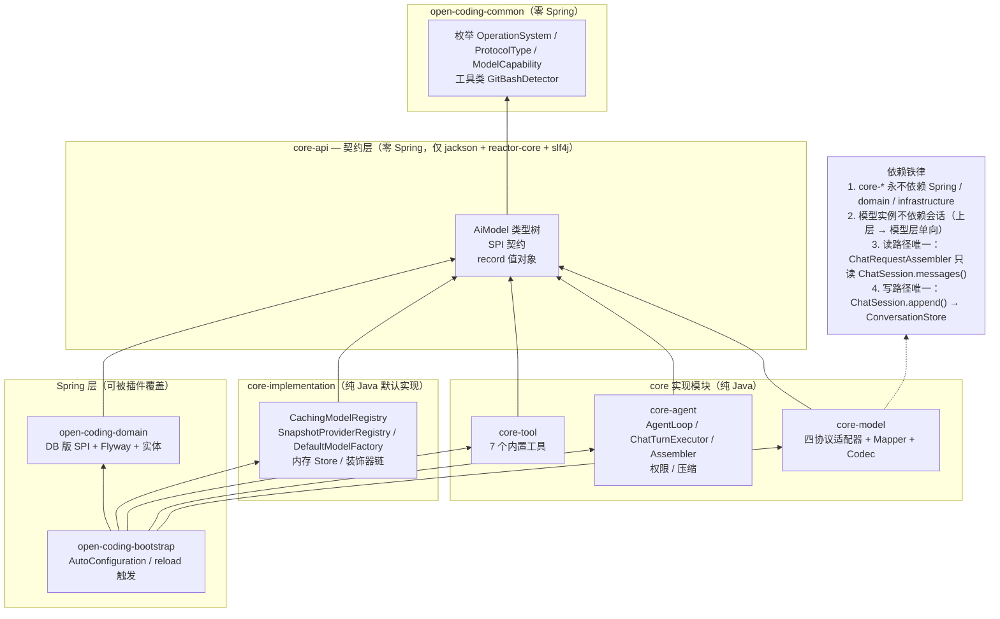
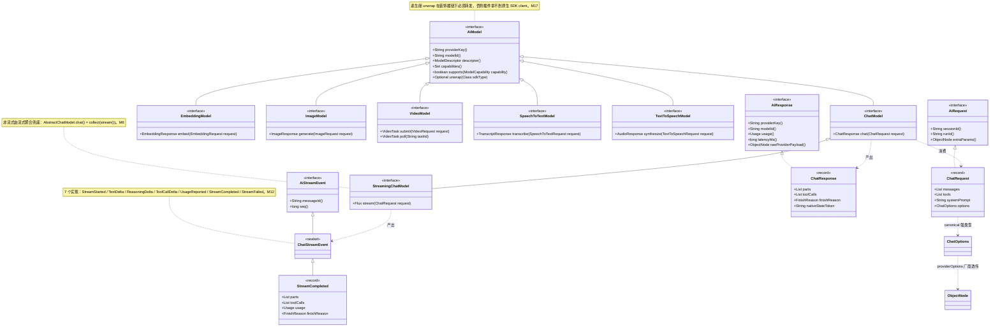
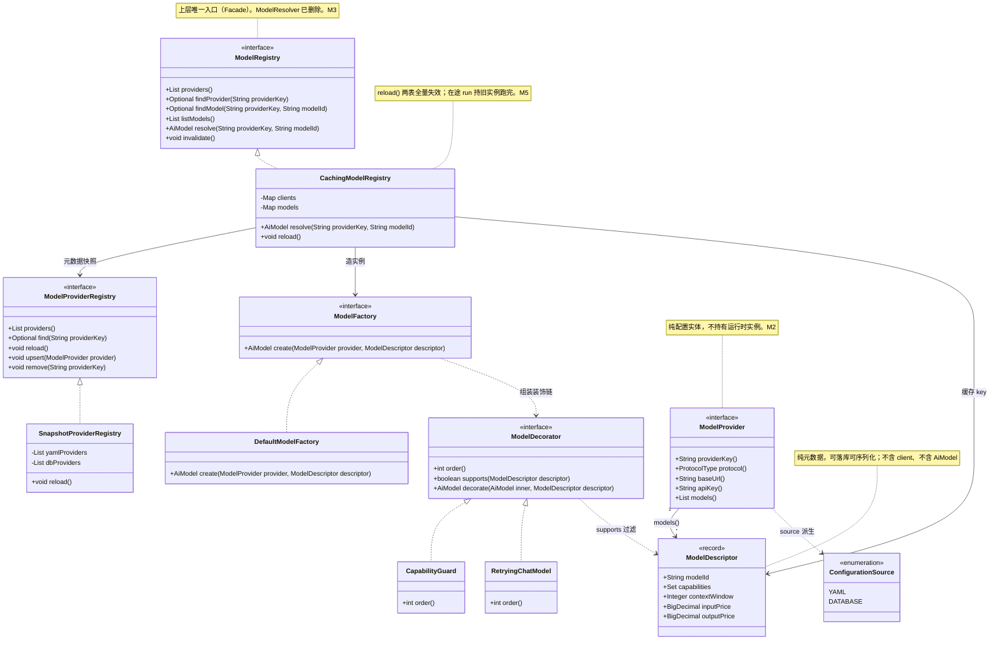
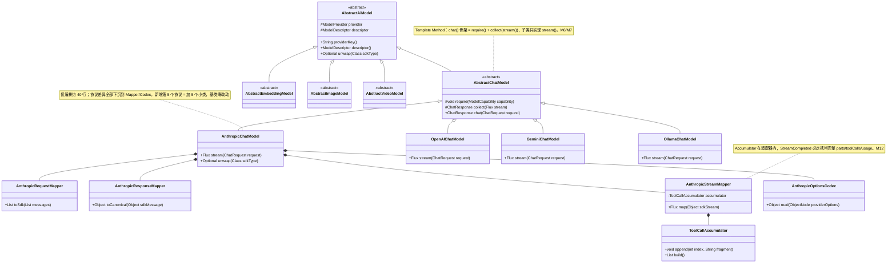
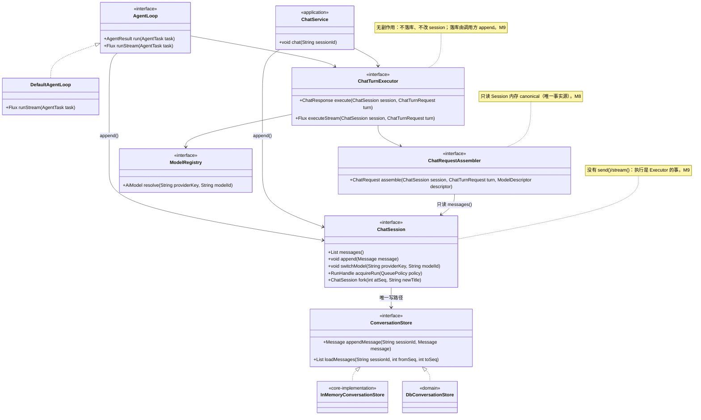
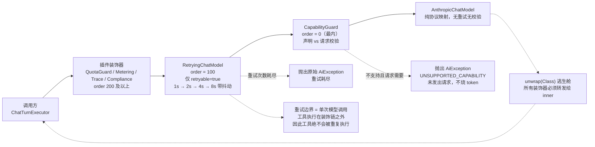
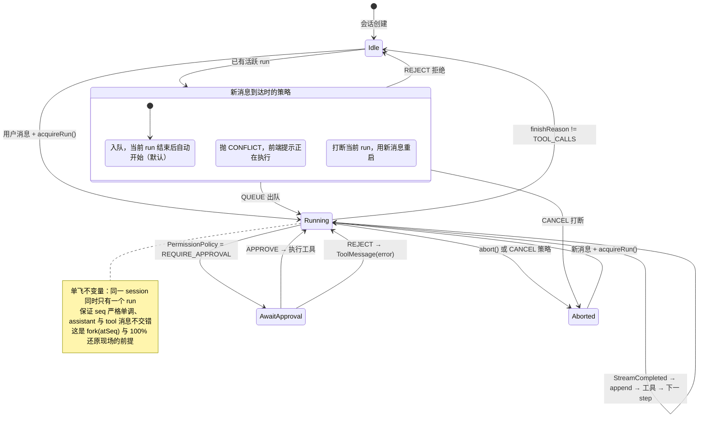
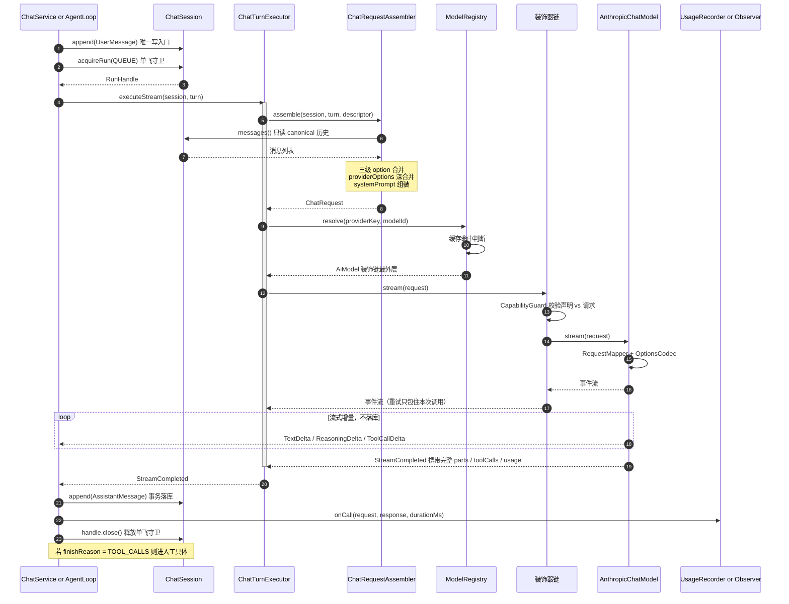

# OpenCoding Core 契约层与模型适配层 — Goal 目标方案 v1.0

> 状态：**已定稿待实施**（经 5 轮 grilling，35 项决策全部落定）
> 日期：2026-09-14
> 范围：`open-coding-core`（api / model / agent / tool / implementation）+ `open-coding-domain` 持久化 + 装配与前端通道

> **文档关系**：模型抽象层（core-api 模型契约 + core-model 适配器 + 单轮执行侧）已经 4 轮 grilling 重新设计，以 **`docs/design/model-abstraction-layer.md`** 为准；本文件 §5.2–§5.5 与 §6.2 仅保留指向说明，其余章节（分层、持久化、M0 缺陷清单、交付顺序）仍为权威。
> **配图**：8 张 Mermaid 图已内联于本文件 —— §3.2 依赖关系图、§3.4 类图 1–4、§7.1 图6 装饰器链、§7.4 图8 会话单飞、§10 图7 全链路时序；`.mmd` 源文件在 `docs/design/diagrams/`。

---

## 1. 目标

把当前"模块拆了、契约没立住"的 `open-coding-core` 建成**企业级多模态 Coding Agent 的唯一契约层**：

- **契约层（core-api）**：一次定义，四个协议实现共用。零 Spring 依赖，纯 Java + jackson + reactor-core。
- **模型适配层（core-model）**：屏蔽 Anthropic / OpenAI（含全部 OpenAI 兼容厂商）/ Gemini / Ollama Native 的协议差异，对外只暴露 canonical 的 `ChatRequest → ChatResponse / Flux<ChatStreamEvent>`。
- **可还原现场（domain）**：会话、消息、内容块、工具调用、审批、决策、用量全量落库，支撑 fork / resume / export / import 100% 还原。
- **可扩展（SPI + 插件）**：provider、工具、存储、权限策略均可被插件覆盖，默认实现来自 `core-implementation`，DB 实现来自 `open-coding-domain`。

**v1 交付形态**：常驻 Server（React 客户端 + REST/WS）+ headless CLI（同一 Spring 容器，`web-application-type=none` 单次执行）。交互式 TUI 归 v2。

---

## 2. 决策日志（D1–D36）

> 模型抽象层的 19 项追加决策（M1–M19）见 `docs/design/model-abstraction-layer.md` §1，与本文 D1–D36 同等效力；两者冲突时以 M 系列为准（模型层）。

| # | 决策 | 结论 |
|---|---|---|
| D1 | 产品定位 | 企业级多模态 Coding Agent（对标 Claude Code / opencode / Codex），coding + work + design |
| D2 | 能力范围 | A（Agent 产品）与 B（通用模型框架）**同时完整具备**，五类能力契约一个不砍、不废弃、不标记 |
| D3 | Provider 语义 | 供应商配置实体：绑定一种底层协议 + 模型列表 + 运行时切换 |
| D4 | 配置来源 | yaml 声明 + DB 覆盖，reload 后合并进 Registry |
| D5 | 调用范式 | 阻塞 `ChatResponse` + 流式 `Flux<ChatStreamEvent>`（api 层引入 reactor-core） |
| D6 | 客户端 SDK | specific 包内用**厂商官方 SDK**；OpenAI 兼容厂商复用 OpenAI SDK（仅 baseUrl 不同）；无 SDK 的自封装 HTTP 兜底 |
| D7 | 模型层厚度 | 薄模型层（LangChain4j 路线），**不执行工具**，ReAct 在 AgentLoop |
| D8 | SDK 依赖组织 | 单 fat 模块 `core-model` |
| D9 | 会话建模 | 顶层有状态会话（`ChatSession` 持有 canonical 历史） |
| D10 | 消息层级 | sealed 消息层级 |
| D11 | 流式事件 | sealed 流式事件层级 |
| D12 | 审批方式 | 阻塞式等待（不是回调式） |
| D13 | 缓存/推理 | 声明式缓存 hint + ReasoningEffort |
| D14 | 容错 | **仅退避重试，无 fallback 链**（对齐 Claude Code / opencode） |
| D15 | 会话归属 | api 出 `ChatSession` + `SessionManager` + `ConversationStore`；domain 出持久化与会话域 |
| D16 | 执行上下文 | `OpenCodingContext` 是 Spring 单例 bean（非 ThreadLocal），存放进程环境信息；多会话安全靠显式传参 |
| D17 | 装配 | `@AutoConfiguration` 统一装配；CLI 也是独立 Spring 容器 |
| D18 | 持久化范围 | v1 **全量落库**：会话/消息/决策/action/tool call/response/result 全部可还原 |
| D19 | 表前缀 | `oc_`（不用 `ai_`，不加多余前缀） |
| D20 | 拆表 | `oc_content_part`、`oc_tool_call` **独立成表**（为知识库/RAG 预留） |
| D21 | JSONB 约束 | 仅允许参数、扩展字段用 JSONB，禁止为省事把结构化数据塞 JSONB |
| D22 | fork | v1 实现 |
| D23 | project | v1 必须建表，**但 session 不强制挂 project**（D34） |
| D24 | 消息可变性 | append-only；压缩采用**标记式**（不删原消息） |
| D25 | 审批恢复 | 不做跨重启恢复，但审批记录不丢 |
| D26 | 运行形态 | Server + headless CLI 为 v1；TUI 推迟 v2 |
| D27 | 分层 | api 契约/SPI、model/agent/tool 纯 Java、implementation 内存默认实现 + 装配、domain 出 DB 版 SPI、bootstrap 出 AutoConfiguration |
| D28 | 插件覆盖 | ServiceLoader（无 Spring 兜底）+ Spring `@ConditionalOnMissingBean`（优先级更高） |
| D29 | 压缩 | v1 做简单压缩：超 contextWindow 80% 触发，摘要成 SystemMessage，工具调用配对不拆散 |
| D30 | 权限模型 | v1 全做，粒度：**询问审批（默认）/ 自动审批 / 接受编辑 / 完全访问** |
| D31 | Agent 模式 | `PLAN` / `BUILD` 是 **Agent 模式**，不是权限模式；不同 Agent 模式适配不同权限模型 |
| D32 | MCP | v1 不做，v1.1 做；契约侧只保证 `ToolProvider` 聚合不受来源影响 + 配置段预留 |
| D33 | 错误/用量/通道 | `AiException(ErrorCode…)`；`Usage` 四分段 + `UsageRecorder` + `oc_usage_record`；前端 **WebSocket** |
| D34 | 事件建模 | **状态表 + 审计事件表**（非事件溯源）；流式 delta 不落库 |
| D35 | 媒体存储 | **全局目录** `~/.opencoding/media/`（非 workspace 内），DB 只存引用；<4KB 才 INLINE |
| D36 | export/import | 版本化 JSON + zip（`session.json + media/*`）；媒体**共享**（引用计数二期）；import 一律新建 project |

---

## 3. 模块分层与依赖方向

### 3.1 目标分层

| 模块 | 职责 | Spring? |
|---|---|---|
| `open-coding-common` | 纯枚举与工具类（OperationSystem、GitBashDetector、lifecycle 事件基类） | ❌ |
| `open-coding-core-api` | **全部契约 + SPI**：message / content / model / provider / request / response / session / agent / tool / permission / error / extension | ❌ 仅 jackson + reactor-core + slf4j |
| `open-coding-core-model` | 四协议 SDK 适配器、请求/响应映射器、ModelFactory、实例缓存 | ❌ |
| `open-coding-core-agent` | AgentLoop（ReAct）、上下文压缩、权限决策链、审批编排、重试装饰 | ❌ |
| `open-coding-core-tool` | 内置工具（依赖 nexec / pty4j） | ❌ |
| `open-coding-core-implementation` | 纯 Java 默认实现（内存 store、no-op recorder、内存 registry）+ ServiceLoader 插件装配 | ❌ |
| `open-coding-domain` | `oc_*` 实体 + Mapper + Flyway + **DB 版 SPI 实现** | ✅ |
| `open-coding-infrastructure` | 技术设施（Redis 缓存、文件系统、媒体存储、加密） | ✅ |
| `open-coding-application` | 用例编排：SessionService / ProjectService / ProviderService / AgentRunService | ✅ |
| `open-coding-interfaces` | REST + WebSocket 端点、DTO、WS 帧协议 | ✅ |
| `open-coding-bootstrap` | `@AutoConfiguration`、配置绑定与合并、context 装配 | ✅ |
| `open-coding-plugin` | 插件 SDK（SPI 扩展包）+ 示例插件 | ❌ |

### 3.2 依赖方向铁律

```
common ← core-api ← core-model / core-agent / core-tool / core-implementation
                              ↑
                        domain → application → interfaces → bootstrap
```

- **core 系列绝不依赖 domain / infrastructure / Spring**。DB 版 SPI 实现住在 `domain`，由 bootstrap 装配时按 `@ConditionalOnMissingBean` 优先注入。
- 现状违反：`open-coding-core/pom.xml` 依赖 `open-coding-infrastructure` —— **必须删除**（层级倒挂）。
- `open-coding-domain` 需新增依赖 `open-coding-core-api`（当前只有 common）。
- root `dependencyManagement` 中把 `open-coding-core`（packaging=pom 的聚合模块）当依赖项管理 —— 应改为管理 `-api / -model / -agent / -tool / -implementation` 五个叶子模块。

依赖关系可视化（含四条铁律）：



### 3.3 需新增的依赖

| 模块 | 新增 | 坐标 |
|---|---|---|
| core-api | reactor-core（版本由 spring-boot-dependencies BOM 管理）、jackson-databind、slf4j-api | `io.projectreactor:reactor-core` |
| core-model | Anthropic SDK（已管理 2.57.0）、OpenAI SDK、Gemini SDK | `com.anthropic:anthropic-java`、`com.openai:openai-java:4.63.1`、`com.google.genai:google-genai:1.71.0` |
| core-tool | nexec 0.1.0、pty4j 0.13.12（已管理） | `io.github.haiderkagalwala:nexec`、`org.jetbrains.pty4j:pty4j` |
| core-agent | reactor-core（透传） | — |

> `spring-boot-dependencies` 3.5.16 已 import reactor-bom，`reactor-core` 无需显式版本。
> 两个新 SDK 需在 root pom 补 `<openai-java.version>` / `<google-genai.version>` 属性 + dependencyManagement 条目。

### 3.4 模型抽象层类图（Mermaid）

> 决策编号 M1–M20 出自 `model-abstraction-layer.md`；本节是这些决策的图形化版本，源文件在 `docs/design/diagrams/*.mmd`（可用 `mmdc` 导出 PNG/SVG）。

**图1 · 契约层类型树（core-api）** —— `AiModel` 基座 + 7 个模态接口（唯一派生层 `StreamingChatModel`）+ 三个公共基座



**图2 · 配置 / 元数据 / 实例 / 装配** —— `ModelRegistry`（Facade）向下协作 `ModelProviderRegistry` / `ModelFactory` / `ModelDecorator`



**图3 · 适配器实现树（core-model）** —— 两层基座 + 每协议 Model 仅编排 + 三件套 Mapper/Codec



**图4 · 调用侧依赖** —— 会话 / 执行 / 组装 / 存储的单向链



---

## 4. 设计原则

1. **数据是值对象，行为才用接口**。`ChatRequest / ChatResponse / Message / ContentPart / ModelDescriptor / Usage` 等全部是 `record`（不可变）；`ChatModel / Tool / ConversationStore / PermissionPolicy` 等行为边界才用 interface。当前把 `ChatRequest / ChatResponse / ContentPart` 做成 interface 是错误方向，会让每个适配器都去实现数据载体。
2. **契约层无 Spring**。core-api 里不得出现 `@Component / @Resource / jakarta.annotation`；装配只在 bootstrap。
3. **reactor 只做流抽象**。应用是 servlet + 虚拟线程（`spring.threads.virtual.enabled=true`），阻塞调用不贵；`Flux` 仅作为流式事件的返回类型，不引入 WebFlux。
4. **不做静默降级**。请求声明了 `toolCall / vision / reasoning / structuredOutput` 而目标模型不支持时，抛 `AiException(UNSUPPORTED_CAPABILITY)`，由上层决定换模型，绝不悄悄丢掉能力。
5. **能力探测用 `instanceof` + capability 集合双轨**。`instanceof StreamingChatModel` 判流式能力；`model.supports(ModelCapability.X)` 判厂商特性。
6. **错误必须可重试可分类**。所有适配器把 SDK 异常翻译成 `AiException(ErrorCode)`，重试装饰器只认 `ErrorCode.retryable`。

---

## 5. core-api 全接口清单

包结构：`com.hk.opencoding.core.api.{message, content, model, model.capable, provider, request, response, session, agent, tool, permission, error, extension, spi}`

### 5.1 消息与内容

```java
// ── message ──
public sealed interface Message
        permits SystemMessage, UserMessage, AssistantMessage, ToolMessage {
    String id();                       // 未落库时为 null，落库后回填
    MessageRole role();
    List<ContentPart> parts();
    MessageMetadata metadata();
    Instant createdAt();
    default Optional<String> text() { /* 拼接 TEXT part */ }
    default List<ToolCall> toolCalls() { return List.of(); }
}

public record SystemMessage(String id, List<ContentPart> parts,
                            MessageMetadata metadata, Instant createdAt) implements Message {}

public record UserMessage(String id, List<ContentPart> parts,
                          MessageMetadata metadata, Instant createdAt) implements Message {}

public record AssistantMessage(String id, List<ContentPart> parts, List<ToolCall> toolCalls,
                               FinishReason finishReason, String rawFinishReason,
                               Usage usage, String providerKey, String modelId,
                               String nativeStateToken,
                               MessageMetadata metadata, Instant createdAt) implements Message {}

public record ToolMessage(String id, String toolCallId, String toolName,
                          List<ContentPart> parts, boolean success, boolean truncated,
                          String errorCode, String errorMessage, long durationMs,
                          MessageMetadata metadata, Instant createdAt) implements Message {}

public record MessageMetadata(String traceId, String parentMessageId,
                              Map<String, Object> extensions) {
    public static MessageMetadata empty() { ... }
}

public record ToolCall(String id, String functionName, String argumentsJson,
                       ToolRiskLevel riskLevel) {}

// ── content ──
public sealed interface ContentPart
        permits TextPart, ReasoningPart, ImagePart, AudioPart, VideoPart, FilePart {
    ContentPartType type();
    int index();
}

public record TextPart(int index, String text) implements ContentPart {}
public record ReasoningPart(int index, String text, String signature) implements ContentPart {}
public record ImagePart(int index, MediaRef media, String detail) implements ContentPart {}
public record AudioPart(int index, MediaRef media, String format) implements ContentPart {}
public record VideoPart(int index, MediaRef media) implements ContentPart {}
public record FilePart(int index, MediaRef media, String fileName) implements ContentPart {}

/** 三种来源统一表达：已入库 / 远程 url / 内联 base64 */
public record MediaRef(String mediaId, String mimeType, String url,
                       String base64Inline, Long byteSize) {
    public static MediaRef ofUrl(String url, String mimeType) { ... }
    public static MediaRef ofInline(String base64, String mimeType) { ... }
    public static MediaRef ofStored(String mediaId, String mimeType, Long byteSize) { ... }
}

/** record 工厂，取代 MessageBuilder + 消失的 MessageBuilderFactory 静态 SPI */
public final class Messages {
    public static UserMessage user(String text) { ... }
    public static UserMessage user(List<ContentPart> parts) { ... }
    public static SystemMessage system(String text) { ... }
    public static AssistantMessage assistant(List<ContentPart> parts, List<ToolCall> calls,
                                            FinishReason reason, Usage usage) { ... }
    public static ToolMessage tool(String toolCallId, String toolName, List<ContentPart> parts) { ... }
}
```

**枚举变更（common）**：`ContentPartType` 从 `TEXT / IMAGE_URL / IMAGE_BASE64 / AUDIO_URL / VIDEO_URL / FILE_URL` 收敛为
`TEXT / REASONING / IMAGE / AUDIO / VIDEO / FILE`（存储方式属于 `MediaRef` 与 `oc_media.storage_type`，不属于 part 类型）。

### 5.2–5.5 模型契约 / Provider / 请求响应 / 会话

> ⚠ **本节已被 `docs/design/model-abstraction-layer.md` 全面取代**（该文件是模型抽象层的唯一权威依据）。
> 重构要点（详设见该文件 §1 决策日志 M1–M19）：
>
> - `AiModel` 类型树：删除 `model/capable/*`；`StreamingChatModel extends ChatModel`，非流式由流式聚合兜底（`AbstractChatModel.chat() = collect(stream())`）。
> - 三层职责切分：`ModelDescriptor`（元数据 record）/ `ModelProvider`（配置实体，**不持有实例**）/ `AiModel`（运行时实例）。
> - 上层唯一入口 `ModelRegistry`；`ModelProviderRegistry` 管 yaml+DB 合并；`ModelFactory` 为 SPI；**`ModelResolver` 已删除**。
> - 厂商特有参数走 `ObjectNode providerOptions` 透传，`previousResponseId` 等协议字段**移出 canonical**。
> - `ChatSession` **不再有 `send()/stream()`**，退化为状态容器 + 落库门面；执行归 `ChatTurnExecutor`，组装归 `ChatRequestAssembler`（只读 Session 内存 canonical）。
> - 装饰器链 `CapabilityGuard → RetryingChatModel → [插件] → 适配器`，重试边界 = 单次模型调用。
> - 会话级单飞守卫 `ChatSession.acquireRun()`（`QUEUE`/`REJECT`/`CANCEL`）。
> - 保留 `AiRequest` / `AiResponse` / `AiStreamEvent` 三个公共基座作为计量与审计的唯一接缝。

### 5.6 Agent

```java
public interface AgentLoop {
    AgentResult run(AgentTask task);                 // 阻塞（虚拟线程）
    Flux<AgentEvent> runStream(AgentTask task);      // 流式
}

public record AgentTask(String sessionId, String runId,
                        List<ContentPart> userParts,
                        AgentMode agentMode, PermissionMode permissionMode,
                        List<ToolDefinition> tools, ChatOptions options) {}

public sealed interface AgentEvent
        permits RunStarted, ModelTurnStarted, AgentTextDelta, AgentReasoningDelta,
                ToolCallRequested, ApprovalRequired, ApprovalDecided,
                ToolStarted, ToolCompleted, ModelTurnCompleted,
                CompactionPerformed, ModelSwitched, RunAborted, RunFailed, RunCompleted {
    String sessionId(); String runId(); long seq(); Instant at();
}
// 关键载荷（其余同名字段一一对应）：
// ToolCallRequested(callId, toolName, argumentsJson, riskLevel)
// ApprovalRequired(approvalId, callId, toolName, argumentsJson, preview, riskLevel, expiresAt)
// ApprovalDecided(approvalId, decision, decidedBy, note)
// ToolCompleted(callId, success, preview, truncated, durationMs, errorCode)
// CompactionPerformed(fromSeq, toSeq, summaryMessageId, tokensBefore, tokensAfter)
// RunAborted(reason) / RunFailed(errorCode, message) / RunCompleted(finishReason, usage, steps)
```

### 5.7 权限模型（D30 + D31）

```java
/** Agent 模式与权限模式是两个正交维度 */
public enum AgentMode { PLAN, BUILD }                 // v1；WORK / DESIGN 后续扩展
public enum PermissionMode {
    ASK,              // 询问审批 —— 默认
    AUTO_APPROVE,     // 自动审批
    ACCEPT_EDITS,     // 接受编辑
    FULL_ACCESS       // 完全访问
}
public enum ToolRiskLevel { READ_ONLY, WRITE_LOCAL, EXECUTE, NETWORK, DESTRUCTIVE }
public enum PermissionDecision { AUTO_ALLOW, REQUIRE_APPROVAL, DENY }

/** Agent 模式 → 允许的权限模式集合 + 强制限制 */
public record AgentModeProfile(AgentMode mode,
                               Set<PermissionMode> allowedPermissionModes,
                               PermissionMode defaultPermissionMode,
                               Set<ToolRiskLevel> deniedRiskLevels,
                               boolean readOnly) {
    public static AgentModeProfile of(AgentMode mode) {
        // PLAN : readOnly=true, denied={WRITE_LOCAL,EXECUTE,DESTRUCTIVE}, allowed={ASK,AUTO_APPROVE}
        // BUILD: readOnly=false, denied={}, allowed={ASK,ACCEPT_EDITS,AUTO_APPROVE,FULL_ACCESS}, default=ASK
    }
}

public interface PermissionPolicy {
    PermissionDecision decide(PermissionContext context);
}

public record PermissionContext(AgentMode agentMode, PermissionMode permissionMode,
                                ToolRiskLevel riskLevel, String toolName,
                                String argumentsJson, String workspacePath) {}

/** 决策矩阵（默认策略）：
 *  AgentMode 不在 allowedPermissionModes 内 → 回落到该模式的 default
 *  risk ∈ deniedRiskLevels                 → DENY
 *  permissionMode=ASK          & risk≥WRITE_LOCAL → REQUIRE_APPROVAL
 *  permissionMode=ACCEPT_EDITS & risk=WRITE_LOCAL → AUTO_ALLOW；其余 ≥EXECUTE → REQUIRE_APPROVAL
 *  permissionMode=AUTO_APPROVE & risk<DESTRUCTIVE → AUTO_ALLOW
 *  permissionMode=FULL_ACCESS                     → AUTO_ALLOW
 */

public interface ApprovalGateway {
    ApprovalOutcome await(ApprovalRequest request, Duration timeout);   // 阻塞等待（D12）
}
public record ApprovalOutcome(boolean approved, String decidedBy,
                              String note, Instant decidedAt) {}
```

### 5.8 工具

```java
public record ToolDefinition(String name, String description,
                             List<ToolParam> params, ObjectNode inputSchema,
                             ToolRiskLevel riskLevel) {}

public record ToolParam(String name, String type, String description,
                        boolean required, ObjectNode schema) {}   // 兼容旧 ToolParam

public interface Tool {
    ToolDefinition definition();
    ToolResult execute(ToolCall call, ToolExecutionContext context);
}

public record ToolExecutionContext(String sessionId, String runId, String cwd,
                                   Path workspace, OpenCodingContext openCodingContext,
                                   PermissionMode permissionMode, Map<String, Object> extensions) {}

// ★ 双通道（见 model-abstraction-layer.md M13）：
//   modelParts 进 canonical 历史并发给模型；displayPayload 只落库 + 推前端
public record ToolResult(String toolCallId, boolean success,
                         List<ContentPart> modelParts,
                         ObjectNode displayPayload,
                         String errorCode, String errorMessage,
                         long durationMs, boolean truncated) {}

public interface ToolProvider {
    String sourceId();                 // BUILTIN | PLUGIN:<id> | MCP:<server>
    List<Tool> tools();
    default int order() { return 100; }
}

public interface ToolRegistry {
    List<Tool> tools();
    Optional<Tool> find(String name);
    List<ToolDefinition> definitions();
}
```

**v1 内置 7 工具（core-tool）**：`read_file`、`write_file`、`edit_file`、`list_dir`、`grep`、`execute_command`、`fetch_url`。
风险分级：`READ_ONLY` = read_file/list_dir/grep；`WRITE_LOCAL` = write_file/edit_file；`EXECUTE` = execute_command；`NETWORK` = fetch_url。

> 现状 `core-api/tool/command/*` 与 `core-tool/builtin/command/*` 是**两套重复的命令工具骨架**，实施时删除 `core-api` 侧（契约层不放实现）。

### 5.9 错误模型

```java
public class AiException extends RuntimeException {
    private final ErrorCode code;
    private final String providerKey;
    private final Integer httpStatus;
    private final boolean retryable;
    public AiException(ErrorCode code, String message, String providerKey,
                       Integer httpStatus, Throwable cause) { ... }
}

public enum ErrorCode {
    INVALID_REQUEST(false), AUTHENTICATION_FAILED(false), PERMISSION_DENIED(false),
    RATE_LIMITED(true), QUOTA_EXCEEDED(false), CONTEXT_LENGTH_EXCEEDED(false),
    CONTENT_FILTERED(false), MODEL_NOT_FOUND(false), UNSUPPORTED_CAPABILITY(false),
    PROVIDER_UNAVAILABLE(true), NETWORK_ERROR(true), TIMEOUT(true),
    STREAM_INTERRUPTED(true), TOOL_EXECUTION_FAILED(false),
    APPROVAL_DENIED(false), ABORTED(false), INTERNAL_ERROR(false);

    private final boolean retryable;
    public boolean retryable() { return retryable; }
}
```

### 5.10 其余 SPI

```java
public interface UsageRecorder   { void record(UsageRecord record); }
public interface AgentEventRecorder { void record(AgentEventRecord record); }

public record UsageRecord(String sessionId, String runId, String messageId,
                          String providerKey, String modelId, Usage usage,
                          BigDecimal inputPrice, BigDecimal outputPrice, BigDecimal cost) {}
public record AgentEventRecord(String sessionId, String runId, long seq,
                               AgentEventType eventType, ObjectNode payload) {}

public enum AgentEventType {
    RUN_STARTED, MODEL_SWITCHED, PERMISSION_MODE_CHANGED, AGENT_MODE_CHANGED,
    COMPACTION_PERFORMED, APPROVAL_REQUESTED, APPROVAL_DECIDED, TOOL_DENIED,
    TOOL_EXECUTED, RUN_ABORTED, RUN_FAILED, RUN_COMPLETED,
    SESSION_FORKED, SESSION_EXPORTED, SESSION_IMPORTED
}

public interface MediaStore {
    MediaRef store(InputStream in, String fileName, String mimeType, MediaOrigin origin);
    Optional<MediaRef> find(String mediaId);
    InputStream open(String mediaId);
    void delete(String mediaId);                    // 引用计数二期
}
public enum MediaOrigin { UPLOAD, PASTE, MODEL_OUTPUT, TOOL_OUTPUT }

public interface ContextCompactor {
    boolean shouldCompact(List<Message> messages, ModelDescriptor model);
    CompactionResult compact(List<Message> messages, ModelDescriptor model);
}
public record CompactionResult(List<Message> messages, String summaryMessageId,
                               int fromSeq, int toSeq,
                               int estimatedTokensBefore, int estimatedTokensAfter) {}

public interface TokenEstimator { int estimate(List<Message> messages); }

/** 插件入口：任何 jar 实现此接口，ServiceLoader 或 Spring Bean 双发现 */
public interface OpenCodingExtension {
    String extensionId();
    default int order() { return 100; }
    default void contributeProviders(ModelProviderRegistry registry) {}
    default void contributeTools(ToolRegistry registry) {}
    default void contributePermissionPolicy(List<PermissionPolicy> chain) {}
    default void contributeStores(StoreRegistry registry) {}
    /** 横切装饰器：配额 / 计量 / trace / 合规前置（见 model-abstraction-layer.md M19） */
    default void contributeDecorators(List<ModelDecorator> decorators) {}
    /** 替换请求组装策略（自定义 systemPrompt / RAG 注入） */
    default ChatRequestAssembler assembleOverride() { return null; }
}

// ★ 以下三个契约同样属于模型抽象层，签名见 model-abstraction-layer.md §4.5 / §4.7
//   ModelDecorator          : order() / supports(desc) / decorate(inner, desc)
//   ChatTurnExecutor        : execute(session, turn) / executeStream(session, turn)
//   ChatRequestAssembler    : assemble(session, turn, descriptor)
```

### 5.11 会话导出模型

```java
public record SessionExport(String format, String version,       // "opencoding-session-export" / "v1"
                            Instant exportedAt,
                            SessionSnapshot session, List<MessageSnapshot> messages,
                            List<RunSnapshot> runs, List<ApprovalSnapshot> approvals,
                            List<AgentEventRecord> events, UsageSummary usage,
                            List<MediaDescriptor> media) {}

public record ExportOptions(boolean includeMedia, boolean includeRawPayload, boolean prettyJson) {}
public record ImportOptions(boolean createNewProject, String targetProjectId, boolean remapIds) {}
```

---

## 6. core-model 适配层设计
> ⚠ 本章的类结构已被 `docs/design/model-abstraction-layer.md` §3.3 / §4 / §7 取代；下方 §6.1 协议矩阵与 §6.3 差异映射表仍然有效，作为 Mapper 的实现依据。


### 6.1 协议矩阵与选型

| ProtocolType | 实现类 | 客户端 | v1 |
|---|---|---|---|
| `OPENAI` | `OpenAIChatModel` | `com.openai:openai-java:4.63.1` | ✅ |
| `OPENAI_COMPATIBLE` | 同 `OpenAIChatModel`（差异化 baseUrl / authHeader / extraBody） | 同上 | ✅ |
| `ANTHROPIC` | `AnthropicChatModel` | `com.anthropic:anthropic-java:2.57.0` | ✅ |
| `GEMINI` | `GeminiChatModel` | `com.google.genai:google-genai:1.71.0` | ✅ |
| `OLLAMA_NATIVE` | `OllamaChatModel` | `java.net.http.HttpClient` 自封装（`/api/chat` NDJSON） | ✅ |
| `OLLAMA_COMPATIBLE` | 走 `OpenAI_COMPATIBLE` | — | ✅ |
| `COHERE` / `QIANFAN` / `VOLCENGINE_ARK` | 走 OpenAI 兼容端点 | — | v1.1 |

> `ProviderBaseUrl.OLLAMA_COMPATIBLE` 的 baseUrl 常量当前带反引号（`` `http://127.0.0.1:11434/v1` ``），是脏数据，必须修正。

### 6.2 类结构（已重设计）

> ⚠ **本节已被 `docs/design/model-abstraction-layer.md` §3.3 取代**。
>
> - 类结构：两层基座（`AbstractAiModel` + 每模态 `AbstractXxxModel`）+ 每协议 `Model` 仅编排 + **三件套 Mapper**（`XxxRequestMapper` / `XxxResponseMapper` / `XxxStreamMapper`）+ `XxxOptionsCodec`。
> - 删除 `AbstractStreamingChatModel`；协议差异不再写在 Model 类里，而下沉到 Mapper。
> - 流式累加器（`ToolCallAccumulator`）移入 `XxxStreamMapper` 内部；`StreamCompleted` 必定携带完整 parts/toolCalls/usage。
> - 新增 `AiModel.unwrap(Class<T>)` 逃生舱（装饰器必须透传给 inner）。
> - 新增第 5 个协议 = 新增 5 个小类，基类与 Registry 零改动。

### 6.3 差异屏蔽规则（canonical ↔ 厂商）

| 维度 | canonical | OpenAI | Anthropic | Gemini | Ollama Native |
|---|---|---|---|---|---|
| system 提示 | `ChatRequest.systemPrompt` | `messages[0].role=system`（Chat Completions）/ `instructions`（Responses） | 顶层 `system` 参数 | `systemInstruction` | `messages[0].role=system` |
| 多模态 | `ImagePart(MediaRef)` | `image_url`（url 或 `data:` base64） | `source.type=base64/url` | `inlineData` / `fileData` | `images[].base64` |
| 工具定义 | `ToolDefinition.inputSchema` | `tools[].function` | `tools[].input_schema` | `functionDeclarations`（**JSON Schema 子集，需剥离 `$schema` / `additionalProperties` 等）** | `tools[].function` |
| 工具调用 | `ToolCall(argumentsJson)` | `tool_calls[].function.arguments`（字符串） | `tool_use.input`（对象→序列化） | `functionCall.args`（对象→序列化） | `message.tool_calls` |
| 工具结果 | `ToolMessage` | `role=tool, tool_call_id` | `role=user` + `tool_result` block | `functionResponse` part | `role=tool` |
| 推理 | `ReasoningEffort` + `ReasoningPart` | `reasoning.effort`；`reasoning_summary` → delta | `thinking.type=enabled, budget_tokens`；`thinking` block + `signature` | `thinkingConfig.thinkingBudget` | 无（不支持则 `UNSUPPORTED_CAPABILITY`） |
| 缓存 hint | `enableCache` | 自动（不额外传，记录 `cached_tokens`） | `cache_control: {type: ephemeral}` | 忽略（v1 不做 cachedContent） | 忽略 |
| 结构化输出 | `ResponseFormat` | `response_format` | 无原生 → 提示词约束 + 校验 | `responseMimeType` + `responseSchema` | `format` |
| 原生状态 | `nativeStateToken` | Responses: `previous_response_id` | null | null | null |
| 结束原因 | `FinishReason.from(raw)`（已实现） | `stop/length/tool_calls/content_filter` | `end_turn/max_tokens/tool_use` | `STOP/MAX_TOKENS` | `stop/length` |
| 用量 | `Usage` 四分段 | `prompt_tokens_details.cached_tokens`、`completion_tokens_details.reasoning_tokens` | `cache_read_input_tokens`、`cache_creation_input_tokens` | `usageMetadata.{promptTokenCount,candidatesTokenCount,thoughtsTokenCount}` | `prompt_eval_count/eval_count` |

**关键规则**

1. **工具调用流式累加**：`ToolCallDelta` 分片必须由适配器内的 `ToolCallAccumulator` 按 `index` 累加 `argumentsFragment`，`StreamCompleted` 才给出完整 `ToolCall`。
2. **原生状态 + 全量重放的降级**：`nativeStateToken` 只用于 OpenAI Responses 加速；模型切换、token 失效、或协议不支持时**自动回落为全量重放 canonical 历史**（canonical 历史永远是事实源）。
3. **能力校验前置**：`AbstractChatModel.chat/stream` 先做 `supports(...)` 校验，不支持则抛 `UNSUPPORTED_CAPABILITY`。
4. **实例缓存**：`ModelInstanceCache` 按 `(providerKey, modelId)` 缓存模型实例（SDK client 复用连接池），provider 变更后 `reload()` 清缓存。

---

## 7. core-agent 设计

### 7.1 AgentLoop（ReAct）

```
run(task):
  1. load session → appendUserMessage → ConversationStore（oc_message: USER）
  2. 创建 oc_agent_run(RUNNING) → 发 RunStarted / oc_agent_event(RUN_STARTED)
  3. loop step = 1..maxSteps:
       a. shouldCompact? → ContextCompactor.compact() → 标记式摘要 SystemMessage 落库
          → 发 CompactionPerformed / oc_agent_event(COMPACTION_PERFORMED)
       b. 发 ModelTurnStarted → executor.executeStream(session, turn)
          （Executor 内部：Assembler 读 session.messages() 组装 ChatRequest
            → registry.resolve() → 装饰器链 → 适配器；**AgentLoop 不组装请求**）
       c. 下游消费事件流：TextDelta/ReasoningDelta 直接转发（**不落库**）
       d. 收到 StreamCompleted（必定携带完整 parts/toolCalls/usage）
          → session.append(AssistantMessage) 事务落库（oc_message + oc_content_part + oc_tool_call）
          → usageRecorder.record → 发 ModelTurnCompleted
       e. finishReason != TOOL_CALLS → break
       f. for each toolCall:
            - PermissionPolicy.decide()
              · DENY → 记 oc_tool_call(DENIED) + oc_agent_event(TOOL_DENIED)，回 ToolMessage(error)
              · REQUIRE_APPROVAL → 建 oc_approval_request(PENDING) → 发 ApprovalRequired
                → ApprovalGateway.await() 阻塞 → 发 ApprovalDecided
                → oc_agent_event(APPROVAL_REQUESTED/APPROVAL_DECIDED)
              · AUTO_ALLOW → 直接执行
            - ToolRegistry 解析 → Tool.execute() → ToolMessage 落库
              → 发 ToolStarted/ToolCompleted → oc_agent_event(TOOL_EXECUTED)
       g. append ToolMessage(们) 到 canonical 历史，进入下一 step
  4. 无 tool call → run COMPLETED，session rollup（tokens/cost/message_count）更新
  5. 异常 → RunFailed / RUN_ABORTED（用户 abort）→ run 状态落库
```

**重试**：装饰器链 `CapabilityGuard → RetryingChatModel → [插件装饰器] → 适配器`（装配在 `CachingModelRegistry.resolve()` 内，见 `model-abstraction-layer.md` M11/M19）。`RetryingChatModel` 只对 `ErrorCode.retryable=true` 重试，指数退避 + 抖动，`max-attempts=5`；**重试边界严格卡在单次模型调用**，工具绝不会被重复执行。**不做 fallback 链**（D14）。

装饰器链的装配顺序、短路点与重试边界：



### 7.2 压缩策略（D29）

- 触发：`TokenEstimator.estimate(messages) > model.contextWindow * 0.8`。
- **token 估算修正**：不要直接用"字符数/4"——中文按 **CJK 字符 ≈ 1 token、非 CJK ≈ 字符数/4** 混合估算，否则中文会话会严重低估、压缩永不触发。
- 动作：把最老的一段消息摘要成一条 `SystemMessage`（标记 `is_compaction_summary=true`, `compaction_from_seq`, `compaction_to_seq`），原消息**不删除**，只由 `compacted_by_message_id` 反向标记。
- 约束：**tool call 与对应 tool result 不可拆散**（配对完整性优先，宁可少压缩一轮）。
- 压缩本身也是一次模型调用，其用量正常计费并落 `oc_usage_record`。

### 7.3 权限决策链

```java
PermissionPolicy defaultChain() {
    return new CompositePermissionPolicy(List.of(
        new AgentModeGuardPolicy(),      // 越权模式回落 + deniedRiskLevels → DENY
        new WorkspaceBoundaryPolicy(),   // 写/执行必须落在 session.workspace 内
        new RiskTablePolicy(),           // D30 的四模式 × 风险等级矩阵
        new PluginPolicyChain()          // 插件追加策略（默认空）
    ));
}
```

### 7.4 会话并发单飞（Mermaid）

> 单飞守卫由 `ChatSession.acquireRun(policy)` 提供，AgentLoop 每条 run 前获取；不变量是 seq 严格单调、历史不交错 —— 这是 `fork(atSeq)` 与"100% 还原现场"的前提（M18）。



---

## 8. 持久化设计（PostgreSQL，`oc_` 前缀）

### 8.1 建模原则

- **状态表是事实源，审计事件表只记离散决策点**（D34）。流式 text delta **不落库**，最终聚合进 `oc_message` —— 这是唯一有损点，已确认接受。
- **消息 append-only**，唯一允许变更的字段是 `status`（`STREAMING → COMPLETE/ABORTED/FAILED`）与 rollup 汇总列。
- **JSONB 白名单**：`arguments`（工具参数）、`extra_body`、`custom_headers`、`metadata`、`model_options`、`oc_agent_event.payload`、`raw_payload`。其余全部关系化。
- 主键统一 `VARCHAR(32)`（ULID，应用生成）：排序友好、无 DB 往返、export/import 重映射简单。需把 MyBatis-Plus 全局 `id-type: ASSIGN_ID` 改为实体显式 `IdType.ASSIGN_UUID`（或自定义 ULID 生成器）。
- 所有含软删的表带 `deleted SMALLINT NOT NULL DEFAULT 0`（`application.yml` 已配置 `logic-delete-field: deleted`）。

### 8.2 Flyway 迁移 `V1__core_schema.sql`

```sql
-- ── 1. project ─────────────────────────────────────────────
CREATE TABLE oc_project (
    id                      VARCHAR(32)  PRIMARY KEY,
    name                    VARCHAR(255) NOT NULL,
    workspace_path          VARCHAR(1024) NOT NULL,
    git_remote              VARCHAR(1024),
    git_branch              VARCHAR(255),
    default_provider_key    VARCHAR(128),
    default_model_id        VARCHAR(255),
    default_agent_mode      VARCHAR(32)  NOT NULL DEFAULT 'BUILD',
    default_permission_mode VARCHAR(32)  NOT NULL DEFAULT 'ASK',
    status                  VARCHAR(32)  NOT NULL DEFAULT 'ACTIVE',
    tenant_id               VARCHAR(32),
    created_by              VARCHAR(64),
    created_at              TIMESTAMPTZ  NOT NULL DEFAULT now(),
    updated_at              TIMESTAMPTZ  NOT NULL DEFAULT now(),
    deleted                 SMALLINT     NOT NULL DEFAULT 0
);
-- Windows 路径大小写不敏感，唯一键用 lower() 
CREATE UNIQUE INDEX uq_oc_project_workspace ON oc_project (lower(workspace_path)) WHERE deleted = 0;

-- ── 2. session ─────────────────────────────────────────────
CREATE TABLE oc_session (
    id                        VARCHAR(32)  PRIMARY KEY,
    project_id                VARCHAR(32),                      -- 可空（D34 不强制）
    parent_session_id         VARCHAR(32),                      -- fork 来源
    forked_at_seq             INTEGER,
    title                     VARCHAR(512),
    agent_mode                VARCHAR(32)  NOT NULL DEFAULT 'BUILD',
    permission_mode           VARCHAR(32)  NOT NULL DEFAULT 'ASK',
    provider_key              VARCHAR(128),
    model_id                  VARCHAR(255),
    model_options             JSONB,                            -- 会话级参数覆盖
    cwd                       VARCHAR(1024),
    workspace_path            VARCHAR(1024),
    status                    VARCHAR(32)  NOT NULL DEFAULT 'ACTIVE',
    message_count             INTEGER      NOT NULL DEFAULT 0,
    last_message_at           TIMESTAMPTZ,
    total_input_tokens        BIGINT       NOT NULL DEFAULT 0,
    total_cached_input_tokens BIGINT       NOT NULL DEFAULT 0,
    total_output_tokens       BIGINT       NOT NULL DEFAULT 0,
    total_reasoning_tokens    BIGINT       NOT NULL DEFAULT 0,
    total_cost                NUMERIC(18,6) NOT NULL DEFAULT 0,
    tenant_id                 VARCHAR(32),
    created_by                VARCHAR(64),
    created_at                TIMESTAMPTZ  NOT NULL DEFAULT now(),
    updated_at                TIMESTAMPTZ  NOT NULL DEFAULT now(),
    deleted                   SMALLINT     NOT NULL DEFAULT 0
);
CREATE INDEX idx_oc_session_project ON oc_session (project_id, last_message_at DESC) WHERE deleted = 0;
CREATE INDEX idx_oc_session_parent  ON oc_session (parent_session_id);
CREATE INDEX idx_oc_session_status  ON oc_session (status) WHERE deleted = 0;

-- ── 3. message（append-only） ──────────────────────────────
CREATE TABLE oc_message (
    id                      VARCHAR(32) PRIMARY KEY,
    session_id              VARCHAR(32) NOT NULL,
    seq                     INTEGER     NOT NULL,
    run_id                  VARCHAR(32),
    step_index              INTEGER,
    role                    VARCHAR(32) NOT NULL,               -- SYSTEM/USER/ASSISTANT/TOOL
    status                  VARCHAR(32) NOT NULL DEFAULT 'COMPLETE',
    provider_key            VARCHAR(128),
    model_id                VARCHAR(255),
    finish_reason           VARCHAR(32),
    raw_finish_reason       VARCHAR(64),
    input_tokens            INTEGER NOT NULL DEFAULT 0,
    cached_input_tokens     INTEGER NOT NULL DEFAULT 0,
    output_tokens           INTEGER NOT NULL DEFAULT 0,
    reasoning_tokens        INTEGER NOT NULL DEFAULT 0,
    latency_ms              BIGINT,
    native_state_token      VARCHAR(512),
    -- 压缩标记（D24：不删原消息）
    is_compaction_summary   BOOLEAN NOT NULL DEFAULT FALSE,
    compaction_from_seq     INTEGER,
    compaction_to_seq       INTEGER,
    compacted_by_message_id VARCHAR(32),
    -- role=TOOL 时的工具结果元数据
    tool_call_id            VARCHAR(128),
    tool_name               VARCHAR(128),
    tool_success            BOOLEAN,
    tool_truncated          BOOLEAN,
    metadata                JSONB,
    raw_payload             JSONB,                              -- capture-raw-payload 开关控制
    created_at              TIMESTAMPTZ NOT NULL DEFAULT now()
);
CREATE UNIQUE INDEX uq_oc_message_seq ON oc_message (session_id, seq);
CREATE INDEX idx_oc_message_run        ON oc_message (run_id, step_index);
CREATE INDEX idx_oc_message_compaction ON oc_message (session_id, is_compaction_summary);

-- ── 4. content_part（拆表：RAG 切片来源） ──────────────────
CREATE TABLE oc_content_part (
    id                  VARCHAR(32) PRIMARY KEY,
    message_id          VARCHAR(32) NOT NULL,
    session_id          VARCHAR(32) NOT NULL,                   -- 冗余：按会话扫描/切片免 join
    seq                 INTEGER     NOT NULL,
    part_type           VARCHAR(32) NOT NULL,                   -- TEXT/REASONING/IMAGE/AUDIO/VIDEO/FILE
    text_content        TEXT,                                   -- TEXT/REASONING；未来 chunk 来源
    media_id            VARCHAR(32),
    media_url           VARCHAR(2048),
    reasoning_signature TEXT,                                   -- Anthropic thinking signature
    detail              VARCHAR(32),                            -- 图片 detail
    metadata            JSONB,
    created_at          TIMESTAMPTZ NOT NULL DEFAULT now()
);
CREATE UNIQUE INDEX uq_oc_content_part_seq ON oc_content_part (message_id, seq);
CREATE INDEX idx_oc_content_part_session ON oc_content_part (session_id, part_type);
CREATE INDEX idx_oc_content_part_media   ON oc_content_part (media_id);

-- ── 5. tool_call（拆表） ──────────────────────────────────
CREATE TABLE oc_tool_call (
    id                VARCHAR(32) PRIMARY KEY,
    session_id        VARCHAR(32) NOT NULL,
    message_id        VARCHAR(32) NOT NULL,                     -- 发起调用的 assistant 消息
    run_id            VARCHAR(32),
    seq               INTEGER     NOT NULL,
    call_id           VARCHAR(128) NOT NULL,                    -- 厂商侧 tool_call id
    function_name     VARCHAR(128) NOT NULL,
    arguments         JSONB,
    risk_level        VARCHAR(32),
    status            VARCHAR(32) NOT NULL DEFAULT 'PENDING',   -- PENDING/APPROVED/RUNNING/SUCCESS/ERROR/DENIED/ABORTED
    result_message_id VARCHAR(32),
    error_code        VARCHAR(64),
    error_message     TEXT,
    duration_ms       BIGINT,
    truncated         BOOLEAN NOT NULL DEFAULT FALSE,
    created_at        TIMESTAMPTZ NOT NULL DEFAULT now(),
    updated_at        TIMESTAMPTZ NOT NULL DEFAULT now()
);
CREATE UNIQUE INDEX uq_oc_tool_call_id ON oc_tool_call (session_id, call_id);
CREATE INDEX idx_oc_tool_call_message ON oc_tool_call (message_id, seq);
CREATE INDEX idx_oc_tool_call_status  ON oc_tool_call (status);

-- ── 6. agent_run（一次 ReAct 循环） ───────────────────────
CREATE TABLE oc_agent_run (
    id                 VARCHAR(32) PRIMARY KEY,
    session_id         VARCHAR(32) NOT NULL,
    trigger_message_id VARCHAR(32),
    agent_mode         VARCHAR(32) NOT NULL,
    permission_mode    VARCHAR(32) NOT NULL,
    provider_key       VARCHAR(128),
    model_id           VARCHAR(255),
    status             VARCHAR(32) NOT NULL DEFAULT 'RUNNING',  -- RUNNING/COMPLETED/FAILED/ABORTED
    step_count         INTEGER NOT NULL DEFAULT 0,
    model_call_count   INTEGER NOT NULL DEFAULT 0,
    tool_call_count    INTEGER NOT NULL DEFAULT 0,
    compaction_count   INTEGER NOT NULL DEFAULT 0,
    error_code         VARCHAR(64),
    error_message      TEXT,
    started_at         TIMESTAMPTZ NOT NULL DEFAULT now(),
    ended_at           TIMESTAMPTZ,
    duration_ms        BIGINT
);
CREATE INDEX idx_oc_agent_run_session ON oc_agent_run (session_id, started_at DESC);

-- ── 7. approval_request ──────────────────────────────────
CREATE TABLE oc_approval_request (
    id            VARCHAR(32) PRIMARY KEY,
    session_id    VARCHAR(32) NOT NULL,
    run_id        VARCHAR(32),
    tool_call_id  VARCHAR(32),
    tool_name     VARCHAR(128) NOT NULL,
    risk_level    VARCHAR(32) NOT NULL,
    arguments     JSONB,
    preview       TEXT,                                         -- 展示给用户的 diff / 命令预览
    status        VARCHAR(32) NOT NULL DEFAULT 'PENDING',       -- PENDING/APPROVED/REJECTED/EXPIRED/ABORTED
    decided_by    VARCHAR(64),
    decided_at    TIMESTAMPTZ,
    decision_note TEXT,
    expires_at    TIMESTAMPTZ,
    created_at    TIMESTAMPTZ NOT NULL DEFAULT now()
);
CREATE INDEX idx_oc_approval_session ON oc_approval_request (session_id, created_at DESC);
CREATE INDEX idx_oc_approval_pending ON oc_approval_request (status) WHERE status = 'PENDING';

-- ── 8. agent_event（审计：离散决策点） ────────────────────
CREATE TABLE oc_agent_event (
    id         VARCHAR(32) PRIMARY KEY,
    session_id VARCHAR(32) NOT NULL,
    run_id     VARCHAR(32),
    seq        BIGINT      NOT NULL,
    event_type VARCHAR(64) NOT NULL,
    payload    JSONB,
    created_at TIMESTAMPTZ NOT NULL DEFAULT now()
);
CREATE UNIQUE INDEX uq_oc_agent_event_seq ON oc_agent_event (session_id, seq);
CREATE INDEX idx_oc_agent_event_type ON oc_agent_event (session_id, event_type);

-- ── 9. usage_record ─────────────────────────────────────
CREATE TABLE oc_usage_record (
    id                  VARCHAR(32) PRIMARY KEY,
    session_id          VARCHAR(32) NOT NULL,
    run_id              VARCHAR(32),
    message_id          VARCHAR(32),
    provider_key        VARCHAR(128),
    model_id            VARCHAR(255),
    input_tokens        INTEGER NOT NULL DEFAULT 0,
    cached_input_tokens INTEGER NOT NULL DEFAULT 0,
    output_tokens       INTEGER NOT NULL DEFAULT 0,
    reasoning_tokens    INTEGER NOT NULL DEFAULT 0,
    input_price         NUMERIC(12,6),
    output_price        NUMERIC(12,6),
    cost                NUMERIC(18,6),
    created_at          TIMESTAMPTZ NOT NULL DEFAULT now()
);
CREATE INDEX idx_oc_usage_session ON oc_usage_record (session_id, created_at DESC);
CREATE INDEX idx_oc_usage_message ON oc_usage_record (message_id);

-- ── 10. media（全局媒体目录的索引） ────────────────────────
CREATE TABLE oc_media (
    id           VARCHAR(32) PRIMARY KEY,
    checksum     VARCHAR(64) NOT NULL,                          -- sha256，天然去重
    file_name    VARCHAR(512) NOT NULL,
    mime_type    VARCHAR(128) NOT NULL,
    byte_size    BIGINT      NOT NULL,
    storage_type VARCHAR(32) NOT NULL,                          -- LOCAL_FILE/INLINE/OSS
    storage_path VARCHAR(1024),                                 -- 相对 ${OPENCODING_HOME}/media
    inline_data  TEXT,                                          -- < 4KB 直接内联
    origin       VARCHAR(32),                                   -- UPLOAD/PASTE/MODEL_OUTPUT/TOOL_OUTPUT
    ref_count    INTEGER NOT NULL DEFAULT 0,                    -- 引用计数（GC 二期）
    metadata     JSONB,
    created_at   TIMESTAMPTZ NOT NULL DEFAULT now()
);
CREATE UNIQUE INDEX uq_oc_media_checksum ON oc_media (checksum);
CREATE INDEX idx_oc_media_origin ON oc_media (origin);

-- ── 11. provider（DB 覆盖源） ────────────────────────────
CREATE TABLE oc_provider (
    id                 VARCHAR(32) PRIMARY KEY,
    provider_key       VARCHAR(128) NOT NULL,
    provider_name      VARCHAR(255) NOT NULL,
    protocol           VARCHAR(32)  NOT NULL,
    base_url           VARCHAR(512),
    api_key_enc        TEXT,                                     -- AES-GCM，密钥来自 env
    auth_header        VARCHAR(128),
    custom_headers     JSONB,
    timeout_ms         INTEGER,
    connect_timeout_ms INTEGER,
    extra_body         JSONB,
    proxy              VARCHAR(512),
    enabled            BOOLEAN NOT NULL DEFAULT TRUE,
    sort_order         INTEGER NOT NULL DEFAULT 0,
    created_at         TIMESTAMPTZ NOT NULL DEFAULT now(),
    updated_at         TIMESTAMPTZ NOT NULL DEFAULT now(),
    deleted            SMALLINT NOT NULL DEFAULT 0
);
CREATE UNIQUE INDEX uq_oc_provider_key ON oc_provider (provider_key) WHERE deleted = 0;

-- ── 12. model ───────────────────────────────────────────
CREATE TABLE oc_model (
    id                         VARCHAR(32) PRIMARY KEY,
    provider_key               VARCHAR(128) NOT NULL,
    model_id                   VARCHAR(255) NOT NULL,
    model_name                 VARCHAR(255),
    description                TEXT,
    capabilities               VARCHAR(512),                     -- 逗号分隔：CHAT,MULTIMODAL
    context_window             INTEGER,
    max_output_tokens          INTEGER,
    supports_streaming         BOOLEAN NOT NULL DEFAULT TRUE,
    supports_tool_call         BOOLEAN NOT NULL DEFAULT FALSE,
    supports_vision            BOOLEAN NOT NULL DEFAULT FALSE,
    supports_reasoning         BOOLEAN NOT NULL DEFAULT FALSE,
    supports_structured_output BOOLEAN NOT NULL DEFAULT FALSE,
    input_price                NUMERIC(12,6),
    output_price               NUMERIC(12,6),
    default_temperature        NUMERIC(4,3),
    default_top_p              NUMERIC(4,3),
    default_top_k              INTEGER,
    extra_body                 JSONB,
    enabled                    BOOLEAN NOT NULL DEFAULT TRUE,
    created_at                 TIMESTAMPTZ NOT NULL DEFAULT now(),
    updated_at                 TIMESTAMPTZ NOT NULL DEFAULT now(),
    deleted                    SMALLINT NOT NULL DEFAULT 0
);
CREATE UNIQUE INDEX uq_oc_model_key ON oc_model (provider_key, model_id) WHERE deleted = 0;
```

> v1 不建 `oc_mcp_server`（D32，MCP 归 v1.1）；配置段与 SPI 位置预留。

### 8.3 fork / export / import 语义

**fork（`forkSession(sessionId, atSeq, newTitle)`）**

- 单事务内深拷贝 `seq <= atSeq` 的 `oc_message` + `oc_content_part` + `oc_tool_call` + `oc_agent_run` + `oc_approval_request` 到新 `session_id`，**新主键**，`seq` 原样保留。
- **媒体共享**：`oc_media` 不复制，新 part 指向同一 `media_id`，`ref_count += 1`（GC 二期再做）。
- 新 session 写 `parent_session_id` / `forked_at_seq`，并记 `oc_agent_event(SESSION_FORKED, {from, to, atSeq})`。
- fork 点之后的消息不拷贝；新 session 可继续 append（`nextSeq = atSeq + 1`）。

**export**

- 版本化 JSON 文档 `format="opencoding-session-export"`, `version="v1"`：`session.json`（session 元数据 + project 快照 + 全部 message/part/tool_call/run/approval/event + usage 汇总）+ `media/*` 二进制，打成 zip。
- `includeMedia=false` 时只导出引用（`MediaDescriptor`），用于体积敏感场景。

**import**

- 反向解析 → **所有 id 重映射**（session/message/part/tool_call/media）→ 媒体经 `MediaStore.store()` 落到全局目录 → 按原 `seq` 重建消息链。
- `ImportOptions.createNewProject=true` 时**一律新建 project**（默认，幂等安全）；否则并入 `targetProjectId`。
- 导入完成记 `SESSION_IMPORTED`；同名 session 允许共存（新 id）。
- 附赠 `exportMarkdown()` 人类可读格式（衍生，不用于还原）。

### 8.4 媒体策略（D35）

- 根目录：`${OPENCODING_HOME:~/.opencoding}/media/<checksum前2位>/<checksum>.<ext>`，**全局去重**（`uq_oc_media_checksum`），跨 project/session 共享。
- 阈值：`byte_size < 4096` → `storage_type=INLINE`（base64 进 `inline_data`）；否则 `LOCAL_FILE`；`OSS` 预留。
- **工具输出过大**（如 `grep` 命中上万行）也走 media：截断后在 `ToolResult` 里保留预览 part + 落 media 的完整输出，`truncated=true`。

---

## 9. 配置模型

### 9.1 yaml（修正后）

```yaml
open-coding:
  ai:
    providers:                       # ← 列表形式（现状是 Map，绑不上 List<LLMProviderProperty>）
      - provider-key: anthropic-main
        provider-name: Anthropic
        protocol: ANTHROPIC
        base-url: ${ANTHROPIC_BASE_URL:https://api.anthropic.com}
        api-key: ${ANTHROPIC_API_KEY:}
        auth-header: x-api-key
        timeout: 60000
        connect-timeout: 10000
        enable: true
        models:
          - model-id: claude-sonnet-4-5
            model-name: Claude Sonnet 4.5
            capabilities: [CHAT, MULTIMODAL]
            context-window: 200000
            max-output-tokens: 64000
            supports-streaming: true
            supports-tool-call: true
            supports-vision: true
            supports-reasoning: true
            supports-structured-output: true
            input-price: 3.0          # 每百万 token
            output-price: 15.0
            default-temperature: 0.7
      - provider-key: openai-main
        provider-name: OpenAI
        protocol: OPENAI
        base-url: ${OPENAI_BASE_URL:https://api.openai.com/v1}
        api-key: ${OPENAI_API_KEY:}
        models: [...]

  agent:
    max-steps: 100
    default-agent-mode: BUILD
    default-permission-mode: ASK
    capture-raw-payload: false         # raw_payload 落库开关
    compaction:
      enabled: true
      trigger-ratio: 0.8
    retry:
      max-attempts: 5
      initial-backoff: 1s
      multiplier: 2.0
      max-backoff: 60s
    approval:
      timeout: 10m
      expire-on-timeout: REJECT       # 超时视为拒绝
    tool-output:
      inline-max-bytes: 65536          # 超过则截断 + 落 media

  session:
    auto-create-project: true          # 按 workspace 自动 upsert（不强制关联）
    default-title-max-length: 60

  storage:
    home: ${OPENCODING_HOME:~/.opencoding}
    media-root: ${OPENCODING_MEDIA_ROOT:~/.opencoding/media}
    inline-threshold-bytes: 4096

  security:
    api-key-enc-secret: ${OPENCODING_API_KEY_ENC_SECRET:}   # oc_provider.api_key_enc 的加密密钥
```

### 9.2 绑定与合并

- `OpenCodingProperty`（domain）改为 `record`/`@ConfigurationProperties` 纯数据类，**去掉 `@Component`**，改由 `@EnableConfigurationProperties` 或 `@ConfigurationPropertiesScan` 激活（现状 domain 层带 `@Component` 是分层污染）。
- `LLMProviderProperty` 增加 `providerKey` 字段；`ModelCapability` 在 yaml 中用 `Set<ModelCapability>` 绑定。
- **合并规则**：先加载 yaml → 按 `provider_key` 用 DB 行**逐字段覆盖**（DB 非空字段优先）→ 构建 `ModelProviderRegistry`；`reload()` 幂等可重复调用；provider/model 的 `source` 由是否命中 DB 派生。
- `reload()` 触发点：启动完成、provider/model CRUD 之后、`POST /api/providers/reload`。
- api-key：yaml 走 env 占位符；DB 走 `api_key_enc`（AES-GCM，密钥来自 `OPENCODING_API_KEY_ENC_SECRET`），API 返回时**脱敏**（`sk-***abc`）。

### 9.3 `.env.example` 需补充

```
OPENAI_API_KEY=
OPENAI_BASE_URL=https://api.openai.com/v1
GEMINI_API_KEY=
OPENCODING_HOME=~/.opencoding
OPENCODING_MEDIA_ROOT=~/.opencoding/media
OPENCODING_API_KEY_ENC_SECRET=
```

---

## 10. 事件流时序与前端通道（D33）

先看一次 stream 调用的全链路（含装饰器链、增量转发点与落库收口点）：



### 10.1 WebSocket `/ws/agent/{sessionId}`

**下行（服务端 → 客户端）**：`AgentEvent` 原样序列化
```json
{"type":"run_started","sessionId":"01J...","runId":"01J...","seq":1,"at":"2026-09-14T10:00:00Z"}
{"type":"agent_text_delta","text":"我来看看这个文件..."}
{"type":"tool_call_requested","callId":"call_1","toolName":"read_file","argumentsJson":"{\"path\":\"pom.xml\"}","riskLevel":"READ_ONLY"}
{"type":"approval_required","approvalId":"01J...","callId":"call_2","toolName":"write_file","preview":"--- a/pom.xml\n+++ b/pom.xml\n...","riskLevel":"WRITE_LOCAL","expiresAt":"..."}
{"type":"tool_completed","callId":"call_2","success":true,"preview":"updated 12 lines","truncated":false,"durationMs":42}
{"type":"run_completed","finishReason":"STOP","usage":{...},"steps":4}
```

**上行（客户端 → 服务端）**
```json
{"type":"user_message","parts":[{"type":"TEXT","text":"帮我修这个 bug"}]}
{"type":"approve","approvalId":"01J...","decision":"APPROVE","note":"ok"}
{"type":"abort"}
{"type":"permission_mode_change","mode":"ACCEPT_EDITS"}
{"type":"agent_mode_change","mode":"PLAN"}
{"type":"model_switch","providerKey":"openai-main","modelId":"gpt-5"}
{"type":"compact"}
```

### 10.2 REST `/api/**`（interfaces 模块）

| 方法 | 路径 | 用途 |
|---|---|---|
| GET/POST | `/api/projects` | project 列表 / 创建（workspace 自动 upsert） |
| GET/POST | `/api/sessions` | 会话分页 / 创建 |
| GET/PATCH/DELETE | `/api/sessions/{id}` | 详情 / 改名·归档 / 删除 |
| GET | `/api/sessions/{id}/messages?fromSeq=&toSeq=` | 消息分页（含 part/tool_call 组装） |
| POST | `/api/sessions/{id}/fork?atSeq=` | fork |
| GET | `/api/sessions/{id}/export?includeMedia=` | 导出 zip |
| POST | `/api/sessions/import` | 导入 |
| GET/POST/PUT/DELETE | `/api/providers`、`/api/providers/{key}/models` | provider/model CRUD |
| POST | `/api/providers/reload` | 重载合并 yaml + DB |
| GET | `/api/usage?sessionId=&from=&to=` | 用量与成本 |
| GET | `/api/approvals?status=PENDING` | 待审批（重连恢复用） |

### 10.3 重连恢复语义

- 断线期间：已落库的 `oc_message / oc_tool_call / oc_approval_request / oc_agent_event` 完整可查，前端按 `seq` 拉齐。
- **正在流式的文本不落库**，重连后以"最终落库的完整消息"为准（D34 已接受的取舍）；`status=STREAMING` 的消息在 run 结束时会被置为 `COMPLETE/ABORTED`。
- `PENDING` 的审批在重连后由 `GET /api/approvals` 或 `ApprovalRequired` 事件重放恢复（同进程内可继续等待；进程重启后按 D25 不恢复执行，但记录不丢）。

---

## 11. v1 交付清单与实施顺序

| 里程碑 | 内容 | 验收标准 |
|---|---|---|
| **M0 现状修复** | 删除悬空 import（见 §12）、修 `OpenCodingAutoConfiguration`/`OpenCodingToolsConfiguration` 的 `common.context` 引用、`core/pom.xml` 去掉 infrastructure 依赖、修正 yaml 绑定为 list + `providerKey`、修正 mybatis `com.hk.coding.*` 包名、补 `classpath:db/migration` 目录、加 reactor/两 SDK 依赖管理 | `mvn -q clean compile` 全绿 |
| **M1 core-api 契约层** | §5 全部类型 + **模型抽象层详设 `model-abstraction-layer.md` §11 的 M1.1–M1.4**（含 `unwrap` / 三个公共基座 / 四条 SPI） | 单元测试覆盖 record 构造/相等性/`Messages` 工厂；core-api 无 Spring 依赖（`mvn dependency:tree` 验证）；sealed 穷举编译通过 |
| **M2 core-model OpenAI + Anthropic** | 按 `model-abstraction-layer.md` §11 M2.1–M2.6 执行：两层基座（含 `collect` 兜底）→ 装饰器链 + `CachingModelRegistry` → Anthropic（Model + 三件套 Mapper + Codec）→ OpenAI → Assembler/Executor → Session 单飞 | 只实现 `stream()` 的假适配器也能跑 `chat()`；不支持能力时不发请求；429 重试、401 不重试；真实 key 跑通流式/tool/vision；切模型后 `previous_response_id` 为 null |
| **M3 core-tool 7 内置工具** | read/write/edit/list/grep/execute_command/fetch_url + `ToolRegistry` + 风险分级 + 输出截断落 media | 工具单测 + 在临时 workspace 端到端跑通 read→edit→grep |
| **M4 core-agent** | AgentLoop（阻塞 + 流式）、`CompositePermissionPolicy`、`AgentModeProfile`、审批阻塞编排、压缩、`RetryingChatModel` | 假模型（stub ChatModel）驱动完整 ReAct 循环单测：工具往返、DENY、REQUIRE_APPROVAL→APPROVE/REJECT、压缩触发、重试、abort |
| **M5 open-coding-domain** | Flyway `V1__core_schema.sql` + 12 张表实体/Mapper + DB 版 `ConversationStore`/`ProjectStore`/`UsageRecorder`/`MediaStore`/`AgentEventRecorder` | Testcontainers PostgreSQL：建表、消息 append、seq 唯一约束、fork 深拷贝、rollup 汇总 |
| **M6 application + interfaces** | SessionService / ProjectService / ProviderService / AgentRunService + REST + WS 帧处理 | MockMvc/WS 集成测试：创建会话→发消息→WS 收事件→审批放行→历史可查 |
| **M7 bootstrap + CLI** | `@AutoConfiguration` 装配（内存实现 vs DB 实现的 `@ConditionalOnMissingBean` 优先级）、provider 合并装配、headless CLI 入口（`web-application-type=none` + 单次执行） | Server 起得来；CLI `opencoding run "..."` 在同一容器内单会话跑完退出 |
| **M8 fork/export/import + 插件 SPI + Gemini/Ollama** | `SessionExport`/`import` + zip 媒体打包 + ServiceLoader 插件发现 + Gemini/Ollama 适配器 | fork 后历史一致；export→删库→import 还原 100%；插件 jar 丢 classpath 即生效 |

**v1 不做**：TUI、MCP、Embedding/RAG 落地（契约保留）、Cohere/Qianfan/Ark 原生协议、媒体 GC、多租户隔离。

---

## 12. 现存缺陷与修复清单（M0）

| # | 位置 | 问题 | 修复 |
|---|---|---|---|
| 1 | `core-api/request/ChatRequest.java:4-5`、`core-api/model/StreamingChatModel.java:3-4`、`core-api/model/VideoModel.java:3-4`、`core-model/base/Abstract{Chat,StreamingChat,Embedding,Image,Video}Model.java`（**共 8 文件 17 处 import**） | import 已不存在的 `com.hk.opencoding.core.llm.*` / `core.tools.*` | 改为新包路径 |
| 2 | `bootstrap/configuration/OpenCodingAutoConfiguration.java:5-6`、`OpenCodingToolsConfiguration.java:3-4`、`application/event/OpenCodingLifecycleEventListener.java:3` | 引用已迁移的 `com.hk.opencoding.common.context.*`、`core.tools.command.*` | 改引 `core.api.state.*` / `core.tool.builtin.command.*` |
| 3 | `open-coding-tool/DefaultCommandTools.java`、`core-api/tool/command/DefaultCommandTool.java` | 引用 `common.context.OpenCodingContext` | 改引 `core.api.state.OpenCodingContext`；且**删除 core-api 侧重复骨架** |
| 4 | `open-coding-core/pom.xml` | 依赖 `open-coding-infrastructure`（层级倒挂） | 删除该依赖 |
| 5 | root `pom.xml` dependencyManagement | 把聚合模块 `open-coding-core` 当依赖管理 | 改为管理 5 个叶子模块 |
| 6 | `application.yml: open-coding.ai.providers` | Map 写法绑不上 `List<LLMProviderProperty>`；条目无 `providerKey` | 改 list + 补 `provider-key` |
| 7 | `application.yml: mybatis-plus.type-aliases-package`、`logging.level.com.hk.coding` | 旧包名 `com.hk.coding.*` | 改为 `com.hk.opencoding.*` |
| 8 | `common/enums/ProviderBaseUrl.java: OLLAMA_COMPATIBLE` | baseUrl 带反引号，脏数据 | 去掉反引号 |
| 9 | `core-api/message/MessageBuilder.java` | 静态 `MessageBuilderFactory.getInstance()` 不存在 | 删除 Builder/Factory，改 `Messages` 工厂 + record |
| 10 | `domain/properties/OpenCodingProperty.java` | domain 层 `@Component` + 配置类 | 去 `@Component`，改 `@ConfigurationPropertiesScan` |
| 11 | `open-coding-core-agent/src` | 空模块（无 Java 文件） | M4 填充 |
| 12 | Flyway `classpath:db/migration` | 仓库无该目录 | M5 建 `bootstrap/src/main/resources/db/migration` |
| 13 | `common/enums/ContentPartType.java` | `IMAGE_URL/IMAGE_BASE64` 等冗余粒度 | 收敛为 `TEXT/REASONING/IMAGE/AUDIO/VIDEO/FILE` |

---

## 13. 风险与取舍

| 风险 | 影响 | 处置 |
|---|---|---|
| 中文 token 低估（"字符数/4"） | 压缩永不触发，长中文会话直接撞上下文上限 | 用 CJK 加权估算（§7.2） |
| Gemini `functionDeclarations` 只支持 JSON Schema 子集 | 复杂工具参数（嵌套/枚举）可能被拒 | 定义 schema 降级器：剥离 `$schema`/`additionalProperties`/`oneOf`，必要时转"提示词 + 校验" |
| OpenAI 双 API（Chat Completions vs Responses） | 两套映射维护成本 | v1 以 Chat Completions 为主线；Responses 仅作 native state 加速的可选实现 |
| 流式 delta 不落库 | 断线重连丢失"正在生成"的内容 | 已确认接受（D34）；UI 文案需明确"以最终消息为准" |
| ServiceLoader 插件拥有完整 JVM 权限 | 恶意插件可读任意文件 | JVM SecurityManager 已废弃；靠"信任边界 + 文档声明 + 企业场景白名单加载"，不承诺沙箱 |
| 插件与默认实现同 id 冲突 | 装配不确定 | 显式优先级：Spring `@ConditionalOnMissingBean`（低 order 插件不覆盖显式 bean） > ServiceLoader `order()` 升序 |
| 权限模式与 Agent 模式在 UI 上联动 | 用户困惑"为什么改不了权限模式" | `AgentModeProfile.allowedPermissionModes` 由后端下发，前端只渲染可用项 |
| `oc_` 前缀用实体 `@TableName` 显式声明 | 全局 prefix 策略可能误伤其他表 | 不用 MyBatis-Plus 全局 `table-prefix`，逐实体声明 |

---

## 14. 本方案的落点

- 本文件即 v1 实施的**唯一权威依据**；任何偏离需先在决策日志追加条目。
- 实施顺序严格按 M0 → M8，M0 必须先做（当前仓库编译不过）。
- M1 完成前不写任何适配器代码——契约是地基。
