# OpenCoding 工具体系 — 详细设计 v2.0（完全体）

> 状态：**设计已定稿（D37–D45，四部分合并版），待审阅确认；契约骨架已部分落盘，实现未开始**
> 日期：2026-09-17（v1.0 = 总体设计；v2.0 合入三个子系统专册）
> 构成：**第一部分 总体设计** ｜ **第二部分 ToolSchemaGenerator 体系**（声明侧：Java 类型/注解 → canonical schema）｜ **第三部分 ToolHandler 执行体系**（执行侧：raw 参数 → 具体方法调用）｜ **第四部分 ToolArgumentsValidator 校验体系**（信任边界：arguments 校验与回喂）
> 定位：本文是工具体系的**唯一权威依据**，覆盖并取代 `core-api-contract-and-model-adapter.md` §5.8（工具契约、书写面、注册与运行）。
> 与 `model-abstraction-layer.md` 的分工：`ToolResult` 双通道形状以该文 §4.8（M13）为准；本文定义其**生产侧**（谁、如何产出）、工具契约、注解书写面、注册流水线与运行期校验。
> 范围：`core-api` 工具契约 + 注解 + authoring toolkit；`core-implementation` 注册流水线；`core-tool` 内置工具；`core-agent` 校验回环；`core-model` schema 降级接缝。
> 关系：第二至四部分细化第一部分 §4 / §5 / §7 / §8；同主题描述冲突时以专册（第二至四部分）为准。

---

## 总目录

- **第一部分 · 总体设计** —— 需求（§1）｜决策日志 D37–D45（§2）｜三通道架构（§3）｜契约与类图（§4）｜注解书写面规范（§5）｜注册流水线（§6）｜运行期总览（§7）｜Schema 规范与协议降级（§8）｜模块落点（§9）｜设计模式（§10）｜实施顺序（§11）｜风险与开放项（§12）｜附录 A
- **第二部分 · ToolSchemaGenerator 体系** —— 职责（§1）｜结构（§2）｜API（§3）｜生成流水线（§4）｜类型映射矩阵（§5）｜名称与描述（§6）｜required 推断（§7）｜结构上限（§8）｜canonical 规范（§9）｜端到端样例（§10）｜错误清单（§11）｜确定性与测试（§12）｜模块（§13）｜决策索引（§14）｜扩展位（§15）
- **第三部分 · ToolHandler 执行体系** —— 职责（§1）｜结构（§2）｜API（§3）｜绑定转换器矩阵（§4）｜调用链（§5）｜错误与结果语义（§6）｜执行上下文（§7）｜线程模型（§8）｜模块（§9）｜决策索引（§10）｜样例（§11）｜扩展位（§12）
- **第四部分 · ToolArgumentsValidator 校验体系** —— 职责（§1）｜API（§2）｜校验算法（§3）｜判定规则矩阵（§4）｜回喂文案（§5）｜自纠回环与失败升级（§6）｜性能（§7）｜可测试性（§8）｜模块（§9）｜决策索引（§10）｜扩展位（§11）

---

# 第一部分 · 总体设计

> 本部分为工具体系的总体架构、契约与决策基线；第二至四部分为其子系统专册（细化 §4 / §5 / §7 / §8）。

## 1. 需求整理

### 1.1 功能需求（用户目标）

| # | 需求 | 说明 |
|---|---|---|
| R1 | **注解式注册** | 支持 `@Tool` / `@ToolParam` 声明即注册使用工具；启动时自动生成 `ToolDefinition`（含 `inputSchema`） |
| R2 | **类型化实现** | 工具实现类可以保留**具体、明确的方法签名**（如 `read(String path, String model, Integer beginLine)`）；框架负责把模型返回的 raw JSON 绑定到方法参数并调用 |
| R3 | **显式逃生门** | 支持 Builder/Generator 手工构建 schema、definition（复杂参数、动态工具、特殊场景） |

### 1.2 约束需求（沿用既有决策）

| # | 约束 | 依据 |
|---|---|---|
| C1 | canonical 保守子集（四协议交集），唯一自检点 `ToolSchemaChecker` | D37、主文档 §6.3 映射表 |
| C2 | 注册期构建一次、冻结缓存、每 step 复用 | D37 |
| C3 | `argumentsJson` 不可信；校验失败 → `ToolResult` 回喂自纠，不抛异常 | D38 |
| C4 | `riskLevel` 必填无默认；漏标 = 编译错误（权限语义不容静默默认） | D39 |
| C5 | **参数名知识只允许存在于两处**：声明侧（schema）与消费侧（handler/方法签名）；中间层零知识 | 本文 §3 |
| C6 | 依赖铁律：core 系列零 Spring；core-api 预算 jackson（databind + datatype-jsr310）+ slf4j | 主文档 §3.1、D45 |
| C7 | 不引第三方 schema 生成器（victools 等）；`-parameters` 只作兜底不作隐性前提 | D42、对照 Spring AI/LangChain4j 的否决理由 |

---

## 2. 决策日志（D37–D45，并入主文档决策日志）

| # | 决策 | 结论 |
|---|---|---|
| D37 | 事实源与书写面 | `ToolDefinition.inputSchema`（canonical `ObjectNode`）为**唯一事实源**；注解与 `ToolSchemaBuilder` Builder 均为书写面，产物必须过 `ToolSchemaChecker`；注册期构建一次 → 深拷贝冻结 → 缓存 |
| D38 | 运行期校验回环 | 执行前按 schema 校验 `argumentsJson`；失败 → `ToolResult(success=false, errorCode=INVALID_TOOL_ARGUMENTS)` 作为 ToolMessage 回喂模型自纠，**不抛异常**；同一 toolCall 连续 3 次失败升级 ERROR 日志（常量） |
| D39 | 注解书写面 | 自研 `@Tool` / `@ToolParam`（core-api、纯 Java、零依赖）；定义决议顺序：`getToolDefinition()` override（非 `UNSPECIFIED`）> 注解生成 > Fail-Fast；两者并存 WARN 以 override 为准；`riskLevel` 必填无默认 |
| D40 | 执行接缝 | 一切执行体统一为 `ToolHandler`；`Tool.of(definition, handler)` 工厂；`Tool.execute` 保留为契约方法（转发 handler）。通道 A 由框架生成 handler、通道 B 手写、通道 C 直供 |
| D41 | 方法级绑定 | `@Tool` 方法**签名即 schema**；注册期生成参数绑定计划（name → position/type/converter）；简单类型走 `ToolParameter` 强类型 getter，对象/数组走 Jackson `convertValue`（递归类型矩阵：嵌套 record / `List<T>` / `T[]`，上限见 §5.2）；`Map`/`Set`/`Optional`/`LocalTime`/`Duration` 等注册期 Fail-Fast 并给出替代写法（指引显式通道）；`LocalDate`/`LocalDateTime` 等时间类型原生支持（D45） |
| D42 | 参数名来源 | 显式 `@ToolParam(name)` > 字节码参数名（父 pom 统一开启 `-parameters`）> Fail-Fast（错误信息给出修复指引）；不把 `-parameters` 当作隐性前提 |
| D43 | 执行语义补全 | `ToolCall.riskLevel` 由 AgentLoop 路由后回填（适配层置空）；`ToolResult.toolCallId` 由 AgentLoop 组装 `ToolMessage` 时回填；工具内部异常由 AgentLoop 统一转 `TOOL_EXECUTION_FAILED`（handler 解包 `InvocationTargetException` 后原样抛出）；新增错误码 `INVALID_TOOL_ARGUMENTS` / `TOOL_NOT_FOUND` |
| D44 | 模块落点 | authoring toolkit（`ToolSchemaGenerator` / `ToolSchemaBuilder` / `ToolSchemaChecker` / `AnnotatedToolFactory` / `ToolHandlers`）住 `core-api`（书写面定位；先例：LangChain4j `ToolSpecifications`、Spring AI `ToolDefinitions.builder` 均在自己 core 模块）；注册流水线实现 `DefaultToolRegistry` 住 `core-implementation` |
| D45 | 时间类型支持 | `LocalDate` → `string` + `format: date`；`LocalDateTime` / `Instant` / `OffsetDateTime` / `ZonedDateTime` → `string` + `format: date-time`；canonical 开放 `format` 白名单（仅 `string`、值 ∈ {`date`, `date-time`}，ToolSchemaChecker 执行）；绑定引入 `jackson-datatype-jsr310`（core-api 预算新增）；校验含 format 可解析性；`LocalTime` / `Duration` / `Period` 排除（无跨协议 format）→ String。对齐依据：Spring AI 工具链整体支持时间类型参数（LocalDate→`format: date`、LocalTime→`time`、Instant/OffsetDateTime/ZonedDateTime→`date-time`；其生成器对 LocalDateTime 按 RFC 3339 语义刻意不带 format——我们仍保留提示性 `date-time`、校验接受带/不带偏移）；LangChain4j 将 java.time 反射为对象形态（year/month/day），不作为对齐目标 |

---

## 3. 总体设计：三条通道、一个接缝、一个事实源

**三条注册通道 → 同一注册流水线 → 同一运行时契约**：

- **通道 A · 注解方法式**（推荐默认；内置工具与插件）：POJO + `@Tool` 方法 + `@ToolParam` 参数。注册期反射生成 **定义 + 绑定计划**，产出 `Tool`（无需 implements）。
- **通道 B · 工具类式**：`implements Tool`，`execute` 手写（复杂工具、需要完全控制执行流程的场景）。定义来自 `getToolDefinition()` override 或类级注解。
- **通道 C · 显式注册式**：`Tool.of(definition, handler)`（Builder 构建 schema + lambda/`ToolHandlers.bind` 提供执行体；动态工具与特殊场景）。

**一个接缝**：`ToolHandler`（raw 参数 → 具体方法调用）。通道 A 由框架生成、通道 B 是 `execute` 本体、通道 C 手写；将来任何"绑定生成器"替换的也只是这个接缝的实现方式，契约不变。

**一个事实源**：`ToolDefinition.inputSchema`。注解、Builder 都只是书写面，产物形状相同（canonical 子集），走同一条自检与冻结流水线。

### 结构图

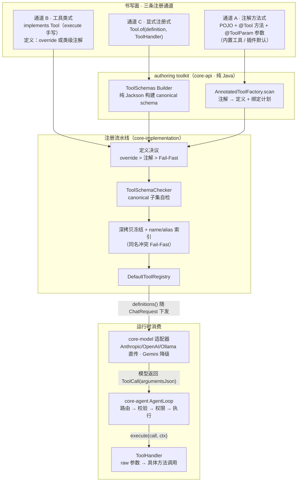

---

## 4. 契约与类图

### 4.1 核心契约（core-api）

```java
/** 工具契约：定义 + 执行。执行体统一为 ToolHandler（D40）。 */
public interface Tool {

    /** 工具定义；默认返回 UNSPECIFIED 占位哨兵，触发注解兜底生成（D39）。 */
    default ToolDefinition getToolDefinition() {
        return ToolDefinition.UNSPECIFIED;
    }

    ToolResult execute(ToolCall call, ToolExecutionContext context);

    /** 显式注册工厂（通道 C）：definition 由 Builder 构建，handler 为 lambda / bind 产物。 */
    static Tool of(ToolDefinition definition, ToolHandler handler) { ... }
}

/** 执行体唯一接缝：raw 参数 → 具体实现调用。 */
@FunctionalInterface
public interface ToolHandler {
    ToolResult handle(ToolParameter parameters, ToolExecutionContext context);
}
```

```java
/** 工具定义：name/description/riskLevel 手写或注解生成；inputSchema 为唯一事实源（canonical 子集）。 */
public class ToolDefinition {
    public static final ToolDefinition UNSPECIFIED = new ToolDefinition();   // 占位哨兵（identity 判定）
    private String name;
    private List<String> aliasNames;
    private String description;
    private ObjectNode inputSchema;
    private ToolRiskLevel riskLevel;
}

/** 工具调用参数（运行期访问器）：统一封装模型返回的 function_call arguments。 */
public interface ToolParameter {
    String getRawJson();
    JsonNode getJsonNode();
    Optional<String> getString(String key);
    Optional<Integer> getInteger(String key);
    Optional<Long> getLong(String key);
    Optional<Double> getDouble(String key);
    Optional<Boolean> getBoolean(String key);
    Optional<ToolParameter> getObject(String key);
    List<ToolParameter> getArray(String key);
    <T> T as(Class<T> type);
    boolean isEmpty();
    boolean containsKey(String key);
}
```

`ToolResult` 形状见 `model-abstraction-layer.md` §4.8（M13 双通道），本体系只约定生产规则（D43）。
`ToolExecutionContext` 字段沿用主文档 §5.8：`(sessionId, runId, cwd, workspace, openCodingContext, permissionMode, extensions)`。

```java
/** 工具来源聚合；BUILTIN | PLUGIN:<id> | MCP:<server>（v1.1）。 */
public interface ToolProvider {
    String sourceId();
    List<Tool> tools();
    default int order() { return 100; }
}

/** 工具注册表：读（find/definitions）+ 写（register，供 provider 与插件提交）。 */
public interface ToolRegistry {
    void register(Tool... tools);
    List<Tool> tools();
    Optional<Tool> find(String name);        // 索引 name + aliasNames
    List<ToolDefinition> definitions();      // 冻结缓存，每 step 复用
}
```

### 4.2 注解（core-api · `tool/annotation`）

```java
@Documented
@Retention(RUNTIME)
@Target({TYPE, METHOD})
public @interface Tool {

    /** 工具名（协议线上值，蛇形命名，如 read_file）。 */
    String name();

    /** 模型选工具的依据（按提示词产品文案标准编写）。 */
    String description();

    /** 风险级别（必填：漏标 = 编译错误，权限语义不容静默默认，D39）。 */
    ToolRiskLevel riskLevel();

    /** 别名（模型幻觉名兼容/改名过渡）；注册期并入索引，冲突 Fail-Fast。 */
    String[] aliasNames() default {};

    /** 预留元数据，不进 schema；v1 仅保留字段。 */
    String version() default "1.0.0";
}
```

```java
@Documented
@Retention(RUNTIME)
@Target({PARAMETER, TYPE})
@Repeatable(ToolParams.class)
public @interface ToolParam {

    /** 参数名。空 → 取字节码参数名（需 -parameters），再失败 Fail-Fast（D42）。 */
    String name() default "";

    /** schema 类型。方法参数可推断；类级（TYPE）使用必须显式，INFER → Fail-Fast。 */
    ToolParamType type() default ToolParamType.INFER;

    /** 仅 type=ARRAY 时生效：数组元素类型（标量）。元素为枚举/对象 → 用方法签名或 Builder。 */
    ToolParamType items() default ToolParamType.INFER;

    /** 仅 type=STRING 时生效：格式化提示，白名单 {date, date-time}（如 ISO-8601 日期）。 */
    String format() default "";

    /** 是否必填。方法参数：primitive 恒必填（注解无效，改为装箱类型表达可选）；引用类型默认 false。 */
    boolean required() default false;

    /** 参数描述（模型填参准确率的关键，写清格式与默认值约定）。 */
    String description() default "";

    /** 枚举取值（仅 STRING 类型）；Java enum 参数自动取常量名。 */
    String[] enumValues() default {};
}

@Documented
@Retention(RUNTIME)
@Target({PARAMETER, TYPE})
public @interface ToolParams {
    ToolParam[] value();
}

/**
 * 注解面类型 token —— 类级注解 DSL 的简写，不是类型系统本尊（类型系统 = §5.2 canonical 子集）。
 * 不含 OBJECT：Java 注解禁止循环引用（cyclic annotation element type），对象结构无法在注解内自嵌套，
 * 由方法签名 record 推断或 Builder 显式表达。
 */
public enum ToolParamType { STRING, INTEGER, NUMBER, BOOLEAN, ARRAY, INFER }
```

### 4.3 authoring toolkit（core-api · `tool/authoring`，D44）

```java
/** schema 生成引擎：注解 / 方法签名 → canonical schema（完整规范见第二部分）。 */
public final class ToolSchemaGenerator {
    public static ToolDefinition definitionFromMethod(Method method) { ... }
    public static ToolDefinition definitionFromType(Class<?> toolClass) { ... }
    public static ObjectNode schemaFromRecord(Class<?> recordType) { ... }
}

/** schema 构建 DSL（通道 C / 类级注解内部复用；纯 Jackson、零新依赖）。 */
public final class ToolSchemas {
    public static ObjectBuilder object() { ... }
}

/** canonical 子集唯一自检点：不合法 → 注册期异常（启动失败）。 */
public final class ToolSchemaChecker {
    public static void check(ObjectNode schema) { ... }
}

/** 注解扫描：POJO → 定义 + 绑定计划 → Tool 列表（通道 A）。 */
public final class AnnotatedToolFactory {
    public static List<Tool> scan(Object toolObject) { ... }
    /** 类级注解（TYPE）的定义生成（通道 B 兜底）。 */
    public static ToolDefinition fromAnnotatedType(Class<?> toolClass) { ... }
}

/** 单 record 参数的零手写绑定（可选语法糖）。 */
public final class ToolHandlers {
    public static <A> ToolHandler bind(Function<A, ToolResult> fn, Class<A> argsType) { ... }
}
```

### 4.4 类图

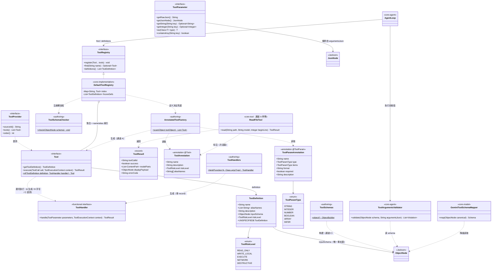

---

## 5. 注解书写面规范（R1 + R2）

> 本节为规范概要；类型映射矩阵、名称解析、required 推断与结构上限的完整规范见**第二部分**。

### 5.1 支持的方法形态（v1）

**A1 · 多参形态**（每参一个 property，声明顺序 = property 顺序）：

```java
public class ReadFileTool {   // 普通 POJO，无需 implements 任何接口

    @Tool(name = "read_file", description = "读取文件内容，支持按行号偏移", riskLevel = ToolRiskLevel.READ_ONLY)
    public ToolResult read(
            @ToolParam(description = "文件绝对路径，如 /repo/src/Main.java") String path,
            @ToolParam(description = "目标模型名，仅日志用途") String model,
            @ToolParam(description = "起始行号，1 起") Integer beginLine) {
        ...
    }
}
```

**A2 · 单 record 形态**（参数多 / 想要编译期字段安全；record 组件名天然可反射，不依赖 `-parameters`）：

```java
public record ReadArgs(
        @ToolParam(description = "文件绝对路径，如 /repo/src/Main.java") String path,
        @ToolParam(description = "起始行号，1 起") Integer beginLine) {}

public class ReadFileTool {
    @Tool(name = "read_file", description = "...", riskLevel = ToolRiskLevel.READ_ONLY)
    public ToolResult read(ReadArgs args) { ... }   // 注册：ToolHandlers.bind(fileOps::read, ReadArgs.class) 亦可直供
}
```

record 可**递归嵌套**（对象 / 数组任意组合，见 §5.2 矩阵）：

```java
public record GrepArgs(
        @ToolParam(description = "ripgrep 语法表达式") String pattern,
        @ToolParam(description = "搜索根目录列表，省略表示工作区根") List<String> paths,
        @ToolParam(description = "输出行数上限，省略默认 200") Integer limit,
        @ToolParam(description = "文件过滤条件") Filter filter) {}

public record Filter(
        @ToolParam(description = "glob 白名单，如 **/*.java") List<String> include,
        @ToolParam(description = "glob 黑名单") List<String> exclude) {}
```

两个形态在注册期产出等价的 `ToolDefinition` 与 `ToolHandler`；**同一对象可有多个 `@Tool` 方法 → 多个工具**。

### 5.2 类型映射矩阵（方法签名推断，递归）

| Java 类型 | schema | 备注 |
|---|---|---|
| `String` / `char` / `Character` | `string` | |
| `int` / `Integer` / `short` / `Short` / `byte` / `Byte` / `long` / `Long` / `BigInteger` | `integer` | primitive 恒必填 |
| `double` / `Double` / `float` / `Float` / `BigDecimal` | `number` | |
| `boolean` / `Boolean` | `boolean` | |
| Java `enum` | `string` + `enumValues`（常量名） | 出现在任意嵌套层级均生效 |
| `record` | `object`（组件 → properties，**递归**） | 组件可用 `@ToolParam` 标注描述/必填；可嵌套 record，组件名无需 `-parameters` |
| `List<T>` / `T[]` | `array` + `items`（**递归**：标量/枚举/record/数组皆可） | 嵌套数组同样支持 |
| `LocalDate` | `string` + `format: date` | ISO-8601 日期（RFC 3339 full-date） |
| `LocalDateTime` / `Instant` / `OffsetDateTime` / `ZonedDateTime` | `string` + `format: date-time` | RFC 3339；绑定自动 parse |
| 其他（见下方排除项） | — | **注册期 Fail-Fast**，错误信息给出替代写法 |

**明确排除项与替代写法**：

| 排除类型 | 原因与替代 |
|---|---|
| `Map<K,V>` | JSON 对象语义与 `additionalProperties:false` 的强类型模型冲突（模型无法得知 key 集合）→ 改用 `List<KVRecord>`（record 含 key/value 字段）或 Builder 显式 properties |
| `Set<T>` | 顺序不稳定且对模型无增量语义 → 改用 `List<T>` |
| `Optional<T>` | 可选性已由 `required` 表达（引用类型默认可选、`required=true` 必填）→ 直接用包装类型字段 |
| `LocalTime` / `OffsetTime` / `Duration` / `Period` | 无跨协议标准 `format`（OpenAPI 仅定义 `date` / `date-time`）→ 改用 `String`，在 `description` 约定格式 |
| 二进制（`byte[]` / `InputStream`） | 模型无法构造二进制字面量 → 改用 `String`（base64 约定）或媒体通道 |
| 泛型通配（`T` / `?`） | 无法确定具体 schema → 具化为上述支持类型 |

**结构上限**（注册期检查，常量）：嵌套深度 ≤ 5、单工具属性总数 ≤ 50 —— 防 schema 爆炸与模型注意力稀释。

**类级注解（TYPE）表达力边界**：标量（`string` 可附 `format`）+ 标量数组（`type=ARRAY` + `items`）；数组元素为枚举/对象、或任意嵌套结构 → 走方法签名（通道 A）或 Builder（通道 C）——Java 注解禁止循环引用，注解内无法表达对象结构（见 §4.2）。

### 5.3 required 推断规则

| 场景 | 规则 |
|---|---|
| primitive 参数 | **恒必填**（`@ToolParam(required=false)` 不生效；要可选请用装箱类型） |
| 引用类型参数 | 默认可选；`@ToolParam(required=true)` 声明必填 |
| 类级（TYPE）声明 | `required()` 直接生效（无 Java 类型可推断；`type()` 必须显式） |

### 5.4 名称解析顺序（D42）

1. `@ToolParam(name = "...")` 显式名；
2. 字节码参数名（父 pom 统一 `<maven.compiler.parameters>true</maven.compiler.parameters>`）；
3. 皆不可得（如 `arg0`）→ **注册期 Fail-Fast**，错误信息含"为该参数补充 name 或开启 -parameters"。

> 参数名是协议契约：改名 = 改 schema = 历史对话中的旧工具调用失配，按破坏性变更处理。

### 5.5 定义决议顺序（通道 B / 并存，D39）

```
getToolDefinition() 返回非 UNSPECIFIED  → 以其为准
类上存在 @Tool 注解                     → AnnotatedToolFactory.fromAnnotatedType 生成
两者并存                                → 以 override 为准 + 启动期 WARN
皆无                                    → Fail-Fast（错误信息含类名）
```

### 5.6 Builder 逃生门（通道 C / R3）

```java
ObjectNode schema = ToolSchemas.object()
        .property("path", s -> s.string().required().description("文件绝对路径"))
        .property("beginLine", s -> s.integer().description("起始行号，1 起"))
        .build();

Tool tool = Tool.of(
        ToolDefinition.of("read_file", "读取文件内容", schema, ToolRiskLevel.READ_ONLY),
        (params, ctx) -> fileOps.read(params.as(ReadArgs.class)));
```

---

## 6. 注册流水线（启动期一次）

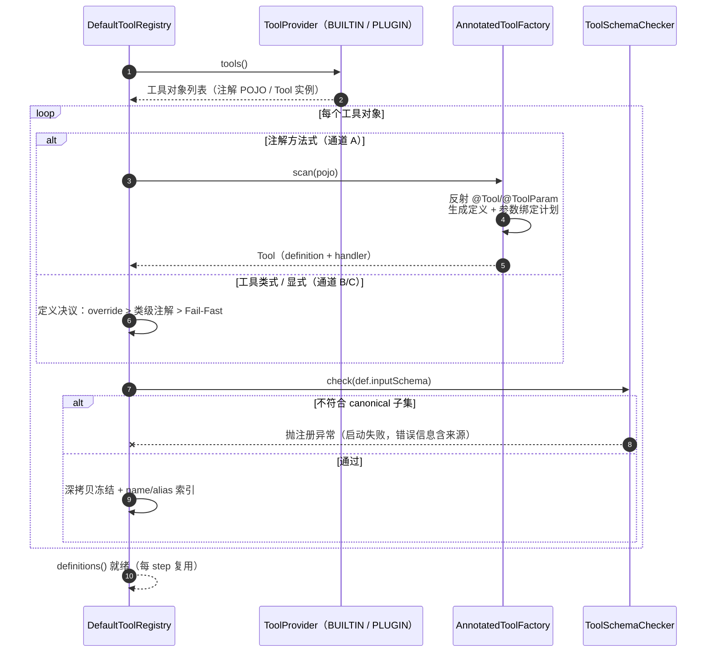

冻结后的不变量：注册完成起 `definitions()` 只读；同名或同别名（含跨 provider）→ Fail-Fast 并列出双方 `sourceId`（覆盖机制留 v1.1 显式配置）。

---

## 7. 运行期：路由 → 校验 → 权限 → 执行（core-agent）

> 执行侧（绑定与调用）细节见**第三部分**；校验规则完整矩阵见**第四部分**。

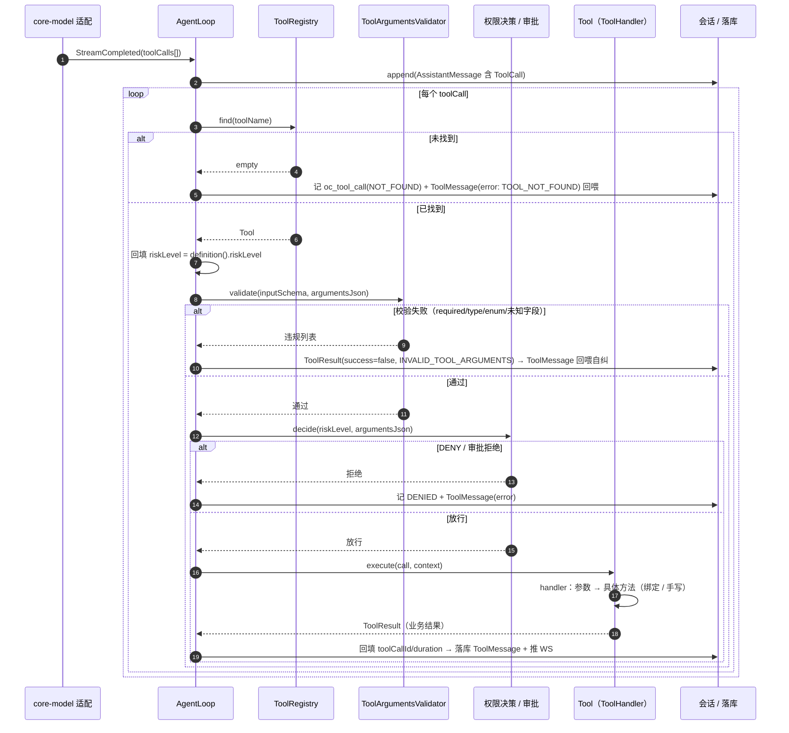

关键规则：

1. **校验先于权限**：不让"垃圾参数"触发人工审批弹窗；审批预览看到的一定是通过校验的参数。
2. **一切失败可回喂**：`INVALID_TOOL_ARGUMENTS` / `TOOL_NOT_FOUND` / 审批拒绝均以 ToolMessage(error) 返回模型继续推理；工具内部异常 → AgentLoop 捕获转 `TOOL_EXECUTION_FAILED`，不向上抛。
3. **风险级别回填层**：适配层创建 `ToolCall` 时 `riskLevel` 置空（适配层无工具知识），AgentLoop 路由后回填（D43）。

---

## 8. Schema 规范与四协议降级

### 8.1 canonical 子集（`ToolSchemaChecker` 判定）

| 允许 | 禁止（注册期拒绝） |
|---|---|
| 根 `type: "object"`、`properties`、`required`、`description`、`enum`、`items`、`additionalProperties: false`、`format`（仅 `string` 且 ∈ {`date`, `date-time`}） | `$schema` / `$ref` / `$defs` / `oneOf` / `anyOf` / `allOf` / `const` / `patternProperties` / `dependent*` |

校验细则：`required ⊆ properties`；`enum` 仅允许出现在 `string` 类型上；`format` 仅白名单值且必须挂在 `string` 上；`additionalProperties` 必须显式 `false`（模型编造参数名在运行期被拒）。

### 8.2 适配层降级（发送侧）

| 协议 | 处理 |
|---|---|
| Anthropic / OpenAI / Ollama | canonical 直传（`input_schema` / `function.parameters`） |
| Gemini | `GeminiToolSchemaMapper`：剥离 `$schema`/`additionalProperties`、`enum` 平移、`format` 原样保留（genai `Schema` 原生支持 date/date-time）；无法映射 → 拍平 + 提示词约束（主文档 §6.3 风险行） |

> `format` 属提示性关键字：Anthropic / OpenAI / Ollama 直传，不承诺 provider 端强校验；合法性由运行期校验兜底（§8.3）。OpenAI strict 模式（可选开关，v1 未启用）启用前需评估其子集对 `format` 的接受度。

### 8.3 运行期校验（`ToolArgumentsValidator`，D38）

> 完整算法与判定规则矩阵见**第四部分**。

按 schema 通用遍历校验 `argumentsJson`：required 缺参、类型不符（严格：数字不做字符串宽容）、enum 越界、未知字段（`additionalProperties:false` 语义）、对象/数组**递归**（任意嵌套深度，与 §5.2 上限一致）、`format` 可解析性（`date` 按 ISO_LOCAL_DATE；`date-time` 接受带/不带时区偏移）。违规列表作为回喂文案（中文、含字段名与期望值）。

---

## 9. 模块落点与依赖

| 内容 | 模块 | 依赖 |
|---|---|---|
| 工具契约（Tool/ToolHandler/ToolDefinition/ToolParameter/ToolResult/ToolProvider/ToolRegistry） | `core-api`（`tool`） | jackson（databind + datatype-jsr310）+ slf4j |
| 注解（`@Tool`/`@ToolParam`/`@ToolParams`/`ToolParamType`） | `core-api`（`tool/annotation`） | 零依赖 |
| authoring toolkit（ToolSchemaGenerator / ToolSchemas / ToolSchemaChecker / AnnotatedToolFactory / ToolHandlers） | `core-api`（`tool/authoring`，D44） | jackson（databind + datatype-jsr310） |
| 注册流水线（DefaultToolRegistry + 索引/冻结） | `core-implementation` | core-api |
| 内置 7 工具 | `core-tool` | core-api（+ nexec/pty4j） |
| 校验回环（ToolArgumentsValidator + AgentLoop 接线） | `core-agent` | core-api |
| 协议降级（GeminiToolSchemaMapper 等） | `core-model` | core-api + 厂商 SDK |

> 注：core-api 出现"带逻辑"的 authoring 五件类，是**书写面 SDK** 定位而非执行链实现（先例：LangChain4j / Spring AI 均把定义构建器放在自己 core 模块）；执行链实现（registry、loop、validator）不进 core-api。

---

## 10. 设计模式与原则清单

| 模式 / 原则 | 落点 |
|---|---|
| 单一事实源（Single Source of Truth） | `inputSchema`；注解/Builder 仅为书写面 |
| 接缝（Strategy/Command） | `ToolHandler`：三通道收敛点，绑定机制可替换 |
| 空对象哨兵（Null Object） | `ToolDefinition.UNSPECIFIED` + identity 判定 |
| 注册表 + 冻结（Registry + Immutable Snapshot） | `DefaultToolRegistry`：注册后只读、缓存复用 |
| 双轨书写面（Facade over One Source） | 注解（简洁）与 Builder（表达力）等价产出 |
| 知识收敛原则 | 参数名只存在于 schema 声明与 handler 消费侧（C5） |
| Fail-Fast | 名称缺失/子集违规/同名冲突/不支持类型 → 注册期终止启动 |

---

## 11. 实施顺序（对齐主文档 §14 M0–M8）

| 步骤 | 内容 | 归属 | 验收 |
|---|---|---|---|
| T1 | 契约冻结：Tool/ToolHandler/ToolDefinition/ToolParameter/注解/authoring 五件套落 core-api；删除 core-api 侧重复 command 骨架（主文档 §12-3） | M1 批次 | `mvn -pl open-coding-core-api compile` |
| T2 | DefaultToolRegistry（provider 聚合/决议/自检/冻结/索引） | M3 前 | 单测：三通道注册、子集违规 Fail-Fast、同名冲突 Fail-Fast |
| T3 | 内置 7 工具以**通道 A** 实现（dogfood；复杂者回退通道 B） | M3 | schema 快照测试 + 绑定往返测试（read→edit→grep 端到端） |
| T4 | ToolArgumentsValidator + AgentLoop 接线（校验先于权限、失败回喂、riskLevel 回填） | M4 | 假模型驱动：非法参数回喂自纠、DENY/审批/拒绝全路径 |
| T5 | 插件样例（ServiceLoader + `contributeTools` + 注解扫描） | M8 | 插件 jar 丢 classpath 即生效，注解工具可注册 |
| T6 | 协议侧：直传 + Gemini 降级器 | 随 M2/M8 | Gemini 真实调用工具往返通过 |

---

## 12. 风险与开放项

| 风险 | 缓解 |
|---|---|
| 注解生成输出漂移 | 映射表即契约；schema 快照测试入库 |
| 忘记 `-parameters` | 父 pom 统一开启 + 显式 name 优先 + 注册期明确报错 |
| 参数超出注解表达力 | Fail-Fast 指引通道 B/C（逃生门），不静默降级 |
| 插件同名工具 | 注册期 Fail-Fast（列双方 sourceId） |
| 反射与原生镜像 | v1 不做 native-image；后置登记反射配置 |
| 模型乱传参数 | 校验回环（D38），连续 3 次升级 ERROR |
| `format` 为提示性关键字（provider 端未必强校验） | 运行期 format 可解析性校验兜底 + 回喂（§8.3） |

**开放项（待审阅确认）**：① `@Tool.version` 的展示用途（当前仅保留字段）；② 嵌套深度/属性数上限的具体取值（暂定 5 / 50）；③ 插件显式覆盖内置同名工具的开关（v1.1）。

---

## 附录 A · `read_file` 注解式完整样例（含生成产物）

```java
@Setter
public class ReadFileTool {

    private WorkspaceService workspaceService;

    @Tool(name = "read_file",
          description = "读取文件内容。返回带行号的文本；文件不存在或越界行号返回明确错误。",
          riskLevel = ToolRiskLevel.READ_ONLY)
    public ToolResult read(
            @ToolParam(description = "文件绝对路径，必须位于会话工作区内，如 /repo/src/Main.java")
            String path,
            @ToolParam(description = "起始行号，1 起；省略表示从第 1 行开始")
            Integer beginLine,
            @ToolParam(description = "最大读取行数，省略默认 2000")
            Integer limit) {

        // 1. 参数与边界校验（validator 已保证 presence/type，这里只做业务约束）
        // 2. 加载文件（工作区归属校验）
        // 3. 截取行区间并组装带行号文本（超长走 media 截断，truncated=true）
        // 4. 组装 ToolResult（modelParts + displayPayload）
        ...
    }
}
```

注册期生成的 `inputSchema`（快照测试基准）：

```json
{
  "type": "object",
  "properties": {
    "path":      { "type": "string",  "description": "文件绝对路径，必须位于会话工作区内，如 /repo/src/Main.java" },
    "beginLine": { "type": "integer", "description": "起始行号，1 起；省略表示从第 1 行开始" },
    "limit":     { "type": "integer", "description": "最大读取行数，省略默认 2000" }
  },
  "required": ["path"],
  "additionalProperties": false
}
```

---

# 第二部分 · ToolSchemaGenerator 体系（声明侧）

> 归属：本文档第一部分 §4（契约）/ §5（书写面）的子系统细化；决策 D37–D45 全部适用。
> 定位：工具体系的 **schema 生成引擎**——「Java 类型 / 注解 → canonical `inputSchema`」的唯一转换器，并与 schema **同源**产出参数绑定计划（绑定消费见第三部分）。
> 模块：`core-api` · `tool/authoring`（纯 Java + Jackson，零 Spring）；**注册期使用一次**（schema 扫描无运行期成本；`method.invoke` 的逐次反射属执行侧，见第三部分）。

---

## 1. 职责与边界

| 做 | 不做 |
|---|---|
| Java 方法签名 / record / 类级注解 → canonical `ObjectNode` | 执行工具（`ToolHandler` / `execute` 的职责，D40） |
| 参数名解析、描述收集、required 推断、`format` / `enumValues` 映射 | 四协议降级（`GeminiToolSchemaMapper` 等，core-model，D37） |
| 同源产出 `BindingPlan`（name → position → type → converter） | 运行期参数校验（`ToolArgumentsValidator`，第四部分，D38） |
| 结构上限检查；自检委托给 `ToolSchemaChecker` | 手写 schema 的构建（`ToolSchemaBuilder` Builder，通道 C） |

**两条铁律**：

1. **单一事实源**：产物 `inputSchema` 是唯一权威；生成器、Builder、手写定义三条路汇聚到同一形状（canonical 子集），同走 `ToolSchemaChecker` → 深拷贝冻结 → `definitions()` 缓存。
2. **同源扫描**：schema 与绑定计划由**同一次反射扫描**产出（不重复扫描、不双份维护），从机制上消除「schema 说 `path`、绑定拼错 `pth`」类漂移。

---

## 2. 体系结构

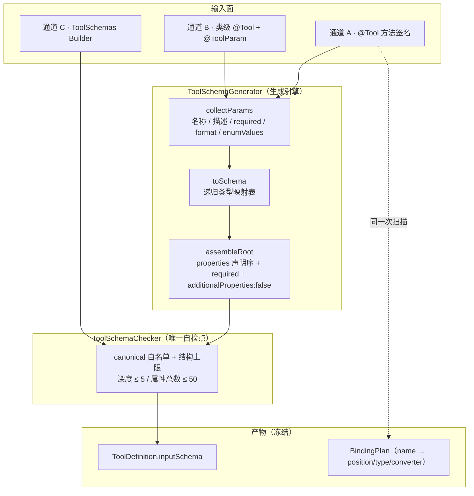

### 类图（authoring toolkit 全貌）

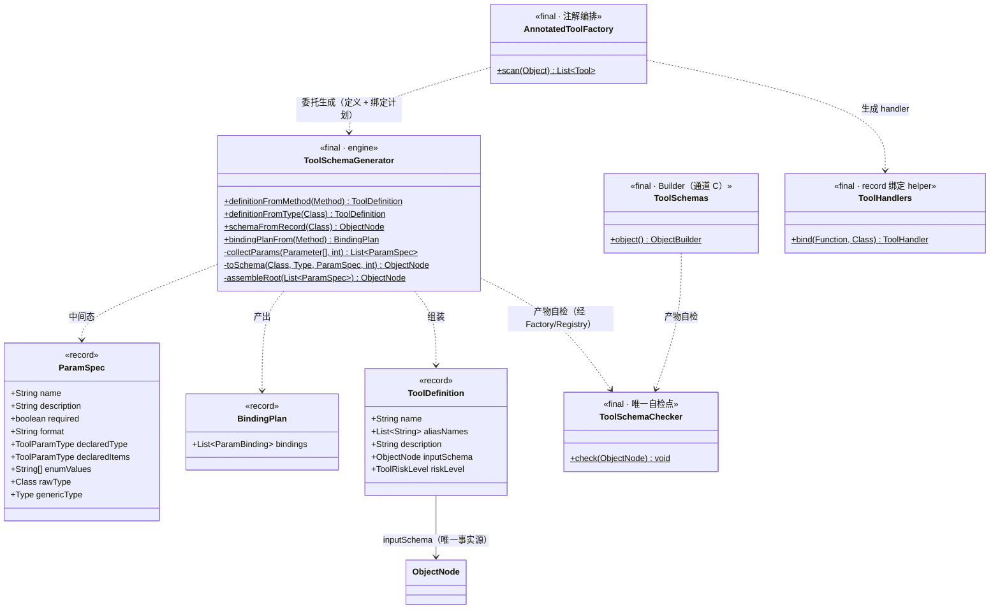

---

## 3. 核心 API（core-api · `tool/authoring`）

```java
/**
 * schema 生成引擎：Java 类型 / 注解 → canonical inputSchema 的唯一转换器。
 * 注册期调用一次；产物冻结（schema 扫描无运行期成本）。
 */
public final class ToolSchemaGenerator {

    private ToolSchemaGenerator() {
    }

    // ── 对外入口 ──

    /** 通道 A：@Tool 方法 → 完整定义（含 inputSchema，与绑定计划同源扫描）。 */
    public static ToolDefinition definitionFromMethod(Method method);

    /** 通道 B：类级 @Tool + repeatable @ToolParam → 定义（execute 手写场景，仅生成定义）。 */
    public static ToolDefinition definitionFromType(Class<?> toolClass);

    /** 单 record 形态：record 组件 → object schema（组件上的 @ToolParam 生效）。 */
    public static ObjectNode schemaFromRecord(Class<?> recordType);

    /** 与 schema 同源的绑定计划（供 AnnotatedToolFactory 生成 handler，消费见第三部分）。 */
    public static BindingPlan bindingPlanFrom(Method method);

    // ── 内部阶段（示意，非公开契约） ──

    static List<ParamSpec> collectParams(Parameter[] parameters, int depth);   // 阶段一
    static ObjectNode toSchema(Class<?> rawType, Type genericType,             // 阶段二
                               ParamSpec spec, int depth);
    static ObjectNode assembleRoot(List<ParamSpec> params);                    // 阶段三
    static String resolveName(Parameter parameter);                            // 注解 name > 字节码名 > Fail-Fast
    static boolean inferRequired(Class<?> rawType, Boolean declared);          // primitive 恒必填；引用默认可选
}

/** 参数声明：三阶段之间传递的规范化中间态。 */
record ParamSpec(String name, String description, boolean required,
                 String format, ToolParamType declaredType, ToolParamType declaredItems,
                 String[] enumValues, Class<?> rawType, Type genericType) {
}

/** 绑定计划：与 schema 同源产出；AnnotatedToolFactory 依此生成 ToolHandler。 */
record BindingPlan(List<ParamBinding> bindings) {

    /** 单个参数的绑定条目。 */
    record ParamBinding(String name, int position,
                        Class<?> rawType, Type genericType, boolean primitive) {
    }
}
```

---

## 4. 生成流水线（注册期一次）

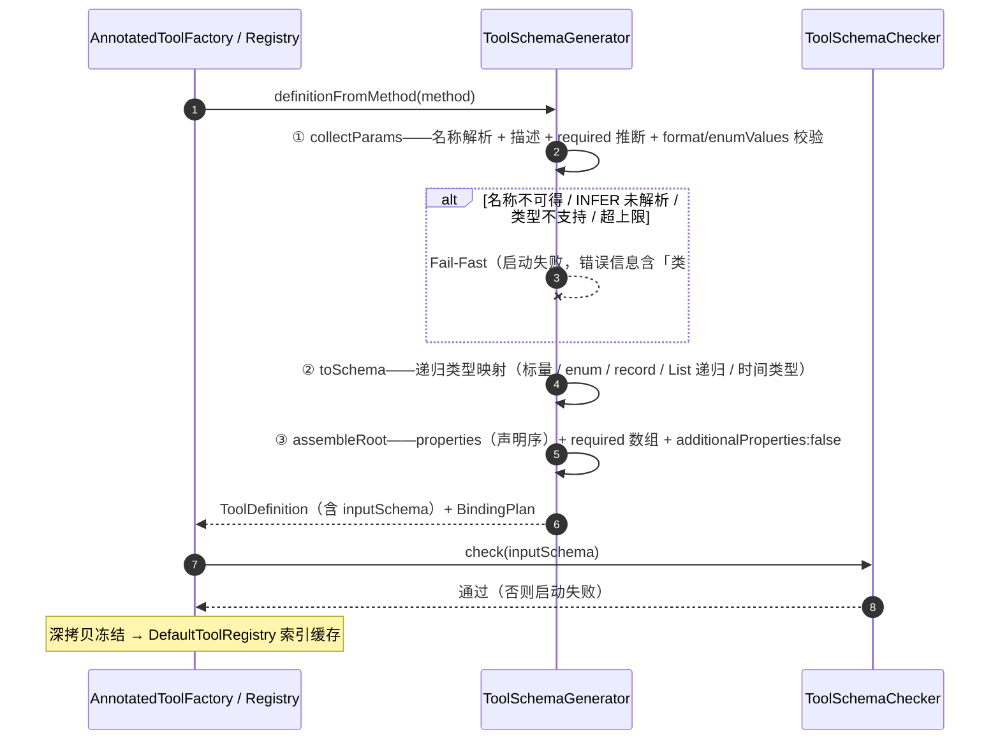

**阶段说明**：

| 阶段 | 输入 | 输出 | 关键动作 |
|---|---|---|---|
| ① collectParams | `Parameter[]` + 注解 | `List<ParamSpec>` | 名称解析（§6）；required 推断（§7）；`format` 白名单预校；`enumValues` 与类型匹配校验 |
| ② toSchema | `ParamSpec` | 单参数 schema 片段 | 递归类型映射表（§5）；深度计数；叶子到根自底向上 |
| ③ assembleRoot | `List<ParamSpec>` | 完整 `ObjectNode` | `properties` 按**声明序**写入（LinkedHashMap，快照稳定）；`required` 收集；每层 object 显式 `additionalProperties:false` |

---

## 5. 类型映射矩阵（唯一转换表）

### 5.1 支持类型（递归）

| Java 类型 | schema | 备注 |
|---|---|---|
| `String` / `char` / `Character` / `CharSequence` | `{"type":"string"}` | |
| `int` / `Integer` / `short` / `Short` / `byte` / `Byte` / `long` / `Long` / `BigInteger` | `{"type":"integer"}` | primitive 恒必填（§7） |
| `double` / `Double` / `float` / `Float` / `BigDecimal` | `{"type":"number"}` | |
| `boolean` / `Boolean` | `{"type":"boolean"}` | |
| Java `enum` | `{"type":"string","enum":[常量名…]}` | 任意嵌套层级生效；常量名即取值 |
| `@ToolParam(enumValues=…)` + `STRING` | `{"type":"string","enum":[…]}` | 非 Java enum 场景的显式枚举 |
| `record` | `{"type":"object", properties:{组件…}, required:[…], additionalProperties:false}`（**递归**） | 组件上的 `@ToolParam` 生效；组件名天然可反射（无需 `-parameters`） |
| `List<T>` / `T[]` | `{"type":"array","items":{…}}`（**递归**） | 元素可为标量 / 枚举 / record / 数组 |
| `LocalDate` | `{"type":"string","format":"date"}` | RFC 3339 full-date |
| `LocalDateTime` / `Instant` / `OffsetDateTime` / `ZonedDateTime` | `{"type":"string","format":"date-time"}` | LocalDateTime 保留提示性 format（D45 决策） |
| 单 record 形态的方法参数 | 同 `record` 行 | 通道 A2：`read(ReadArgs args)` |

### 5.2 排除类型 → Fail-Fast（附替代写法，错误信息原文含替代建议）

| 排除类型 | 原因 | 替代写法 |
|---|---|---|
| `Map<K,V>` | JSON 对象语义与 `additionalProperties:false` 强类型模型冲突（模型无法得知 key 集合） | `List<KVRecord>`，或通道 C Builder 显式 `properties` |
| `Set<T>` | 顺序不稳定、对模型无增量语义 | `List<T>` |
| `Optional<T>` | 可选性已由 `required` 表达 | 直接用包装类型 |
| `LocalTime` / `OffsetTime` / `Duration` / `Period` | 无跨协议标准 `format`（OpenAPI 仅 date / date-time） | `String` + `description` 约定格式 |
| `byte[]` / `InputStream` 等二进制 | 模型无法构造二进制字面量 | `String`（base64 约定）或媒体通道 |
| 泛型通配 `T` / `?` | 无法确定具体 schema | 具化为上述支持类型 |
| 未知自定义类型（非 record） | v1 不支持 POJO 反射 | record 化，或通道 C Builder |

---

## 6. 名称解析与描述规范

### 6.1 名称解析顺序（D42）

```
1. @ToolParam(name = "…") 显式名
2. 字节码参数名（父 pom 统一 <maven.compiler.parameters>true</maven.compiler.parameters>）
3. 皆不可得（arg0 形态）→ 注册期 Fail-Fast
   错误文案示例：参数名不可用：ReadFileTool#read 第 1 个参数 ——
   请补 @ToolParam(name=...) 或启用 -parameters 编译开关
```

- 参数名是**协议契约**：改名 = 改 schema = 历史 tool call 失配，按破坏性变更处理。
- record 组件名可反射获得，不依赖 `-parameters`（组件形态无需显式 name，但建议写描述）。

### 6.2 描述规范（description = 提示词文案）

- 每个参数 description 必写：格式示例（如「绝对路径，如 /repo/src/Main.java」）、取值范围、默认值约定。
- 工具级 description 写「做什么 + 何时用」，不写实现细节。
- description 缺失不 Fail-Fast，但纳入代码评审门禁（文案标准）。

### 6.3 `format` / `enumValues` 校验

- `format` 仅允许 `{"", "date", "date-time"}`，且必须挂在 `STRING` 上，否则 Fail-Fast。
- `enumValues` 仅允许挂在 `STRING` 上；Java enum 参数自动取常量名，无需声明。

---

## 7. required 推断规则

| 场景 | 规则 | 依据 |
|---|---|---|
| primitive（`int`/`long`/`double`/`boolean`/`char` 等） | **恒必填**；`@ToolParam(required=false)` 不生效 | 无法表达"缺席" |
| 引用类型（`String`/`Integer`/`record`/`List`/时间类型…） | 默认可选；`@ToolParam(required=true)` 强制必填 | 缺席 = `null` |
| 类级（TYPE）注解（通道 B，无 Java 类型可推断） | `required()` 直接生效 | D39 |
| record 组件 | 同方法参数规则（primitive 恒必填；引用默认可选） | 同一套推断 |

> 要"可选 int"→ 用 `Integer`；要"必填字符串"→ `required = true`。

---

## 8. 结构上限（防 schema 爆炸）

| 上限 | 值 | 触发点 |
|---|---|---|
| 嵌套深度（object/array 层数） | ≤ 5 | `toSchema` 递归计数 |
| 单工具属性总数（含嵌套） | ≤ 50 | `collectParams` 累计 |

超限 Fail-Fast，错误信息给出当前值与上限。上限为常量（取值属开放项，见第一部分 §12）。

---

## 9. canonical 输出规范（`ToolSchemaChecker` 判定）

| 允许 | 禁止（注册期拒绝） |
|---|---|
| 根 `type: "object"`、`properties`、`required`、`description`、`enum`、`items`、`additionalProperties: false`、`format`（仅 `string` 且 ∈ {`date`, `date-time`}） | `$schema` / `$ref` / `$defs` / `oneOf` / `anyOf` / `allOf` / `const` / `patternProperties` / `dependent*` |

**校验细则**：

1. `required ⊆ properties`；
2. `enum` 仅允许出现在 `string` 类型上；
3. `format` 仅白名单值且必须挂在 `string` 上；
4. **每一层 object（根与嵌套 record）都显式 `additionalProperties: false`**——模型编造的字段在任意深度都会被运行期校验拒绝；
5. 违规 → 注册期异常（启动失败），错误信息含工具名与违规路径。

---

## 10. 端到端样例

### 10.1 输入（通道 A · 单 record 形态）

```java
public class GrepTool {

    @Tool(name = "grep", description = "按 ripgrep 语法搜索文件内容", riskLevel = ToolRiskLevel.READ_ONLY)
    public ToolResult grep(
            @ToolParam(description = "ripgrep 语法表达式") String pattern,
            @ToolParam(description = "搜索根目录列表，省略表示工作区根") List<String> paths,
            @ToolParam(description = "输出行数上限，省略默认 200") Integer limit,
            @ToolParam(description = "只搜该日期之后修改的文件") LocalDate since,
            @ToolParam(description = "文件过滤条件") Filter filter) {
        ...
    }

    public record Filter(
            @ToolParam(description = "glob 白名单，如 **/*.java") List<String> include,
            @ToolParam(description = "glob 黑名单") List<String> exclude) {
    }
}
```

### 10.2 生成产物（inputSchema）

```json
{
  "type": "object",
  "properties": {
    "pattern": { "type": "string", "description": "ripgrep 语法表达式" },
    "paths":   { "type": "array", "items": { "type": "string" },
                 "description": "搜索根目录列表，省略表示工作区根" },
    "limit":   { "type": "integer", "description": "输出行数上限，省略默认 200" },
    "since":   { "type": "string", "format": "date", "description": "只搜该日期之后修改的文件" },
    "filter":  {
      "type": "object",
      "properties": {
        "include": { "type": "array", "items": { "type": "string" },
                     "description": "glob 白名单，如 **/*.java" },
        "exclude": { "type": "array", "items": { "type": "string" },
                     "description": "glob 黑名单" }
      },
      "additionalProperties": false
    }
  },
  "required": ["pattern"],
  "additionalProperties": false
}
```

### 10.3 同源 BindingPlan

| name | position | javaType | genericType | converter |
|---|---|---|---|---|
| pattern | 0 | String | — | 强类型 getter（required，校验已保证存在） |
| paths | 1 | List | `List<String>` | Jackson `convertValue`（TypeReference） |
| limit | 2 | Integer | — | 强类型 getter（缺席 → null） |
| since | 3 | LocalDate | — | Jackson + `jackson-datatype-jsr310`（缺席 → null） |
| filter | 4 | Filter | — | Jackson `convertValue`（递归 record） |

### 10.4 生成的 handler（伪码，执行细节见第三部分）

```java
(params, ctx) -> {
    Object[] args = new Object[5];
    args[0] = params.getString("pattern").orElseThrow(...);   // 校验前置，理论不缺
    args[1] = convert(params, "paths", new TypeReference<List<String>>() {});
    args[2] = params.getInteger("limit").orElse(null);
    args[3] = convert(params, "since", LocalDate.class);
    args[4] = convert(params, "filter", Filter.class);
    return (ToolResult) method.invoke(target, args);          // InvocationTargetException 解包后原样抛出（D43）
}
```

---

## 11. 错误处理清单（Fail-Fast，全部发生在注册期）

| # | 场景 | 错误信息要点 |
|---|---|---|
| 1 | `@Tool` 方法返回类型非 `ToolResult` | 类#方法 + 期望返回类型 |
| 2 | 参数名不可得（arg0） | 参数位置 + 补 `name` 或开 `-parameters` |
| 3 | 不支持类型（§5.2） | 类型名 + 替代写法 |
| 4 | `type=INFER` 未解析（类级注解） | 参数名 + 提示显式声明 type |
| 5 | `enumValues` / `format` 挂错类型或非法值 | 参数名 + 白名单 |
| 6 | 深度 > 5 / 属性数 > 50 | 当前值 + 上限 |
| 7 | record 组件重复名 | 组件列表 |
| 8 | `@Tool` 名称缺失或与同源冲突 | 工具名 + 冲突来源（Registry 层） |

**不 Fail-Fast（有意为之）**：`description` 缺失（走评审）；primitive 上 `required=false`（不生效，文档明示）。

---

## 12. 确定性与可测试性

1. **参数顺序 = classfile 声明序 = properties 顺序** → schema 输出逐字节确定，可做**快照测试**（每次生成与入库快照比对，任何映射表改动都产生可见 diff）。
2. **映射表即契约**：§5 的表格是唯一权威；修改映射表 = 契约变更，需同步更新快照与设计文档。
3. **生成只在注册期发生一次**：结果深拷贝冻结；每 ReAct step 复用缓存定义（schema 扫描无运行期成本）。

---

## 13. 模块落点与依赖

| 组件 | 模块 | 依赖 |
|---|---|---|
| `ToolSchemaGenerator` / `ToolSchemaBuilder` / `ToolSchemaChecker` / `AnnotatedToolFactory` / `ToolHandlers` | `core-api` · `tool/authoring`（D44） | jackson（databind + datatype-jsr310）、零 Spring |
| 注解面 `@Tool` / `@ToolParam` / `ToolParamType` | `core-api` · `tool/annotation` | 零依赖 |
| 调用方（注册流水线） | `core-implementation` · `DefaultToolRegistry` | core-api |

> `jackson-datatype-jsr310` 为时间类型绑定所需（D45）；core-api 依赖预算唯一新增项。

---

## 14. 决策索引

| 决策 | 与本体系的关系 |
|---|---|
| D37 | 单一事实源 + 自检 + 冻结缓存：本体系的核心不变量 |
| D39 | 注解书写面与定义决议顺序（override > 注解 > Fail-Fast） |
| D41 | 方法级绑定：签名即 schema；递归类型矩阵与结构上限 |
| D42 | 名称解析顺序与 `-parameters` 兜底策略 |
| D44 | authoring toolkit 住 core-api 的落点决策 |
| D45 | 时间类型映射与 `format` 白名单 |

---

## 15. 扩展位（v1.1+，均不阻塞当前实现）

1. 类级注解的数组元素扩展（`ARRAY` + `items` 目前仅标量；数组枚举/对象走方法签名）；
2. `LocalTime` / `OffsetTime` → `format: time` 的跨协议评估；
3. 结构上限常量的配置化（当前为常量 5 / 50）；
4. `@ToolParam(defaultValue)`（当前缺省语义由工具方法体处理，canonical 不含 `default` 关键字）；
5. record 之外的 POJO 支持评估（当前 Fail-Fast 指引 record 化）。

---

# 第三部分 · ToolHandler 执行体系（执行侧）

> 归属：本文档第一部分 §7（运行期总览）的子系统细化；决策 D38 / D40 / D41 / D43 全部适用。
> 定位：工具体系的 **执行侧**——「raw JSON 参数 → 具体 Java 方法调用 → ToolResult」的唯一通路；与**第二部分**共用同一次反射扫描（schema 与绑定计划同源）。
> 模块：`core-api`（tool / authoring 接缝）+ `core-implementation`（handler 装配）+ `core-agent`（调用编排）；零 Spring。

---

## 1. 职责与边界

| 做 | 不做 |
|---|---|
| handler 装配：三通道（注解生成 / 手写 execute / 显式 lambda）收敛为 `Tool` | schema 生成（第二部分的职责） |
| 参数绑定：`ToolParameter` raw 值 → 声明类型的 Java 实参 | 运行期参数校验（`ToolArgumentsValidator`，D38——**校验前置，绑定信任校验**） |
| 反射调用与异常解包（D43） | 权限决策 / 审批（`PermissionPolicy` / `ApprovalGateway`） |
| `ToolResult` 装配约定与字段回填规则 | 四协议映射（core-model） |
| 执行上下文（`ToolExecutionContext`）传递 | 重试（重试边界 = 单次模型调用，工具绝不被重试波及，D14） |

**一条铁律**：handler 是"参数适配"的**唯一接缝**——写死的就这一个位置；未来任何新的绑定机制（新注解、脚本工具、MCP 代理）都只是产出另一种 `ToolHandler`，AgentLoop 无感（D40）。

---

## 2. 体系结构

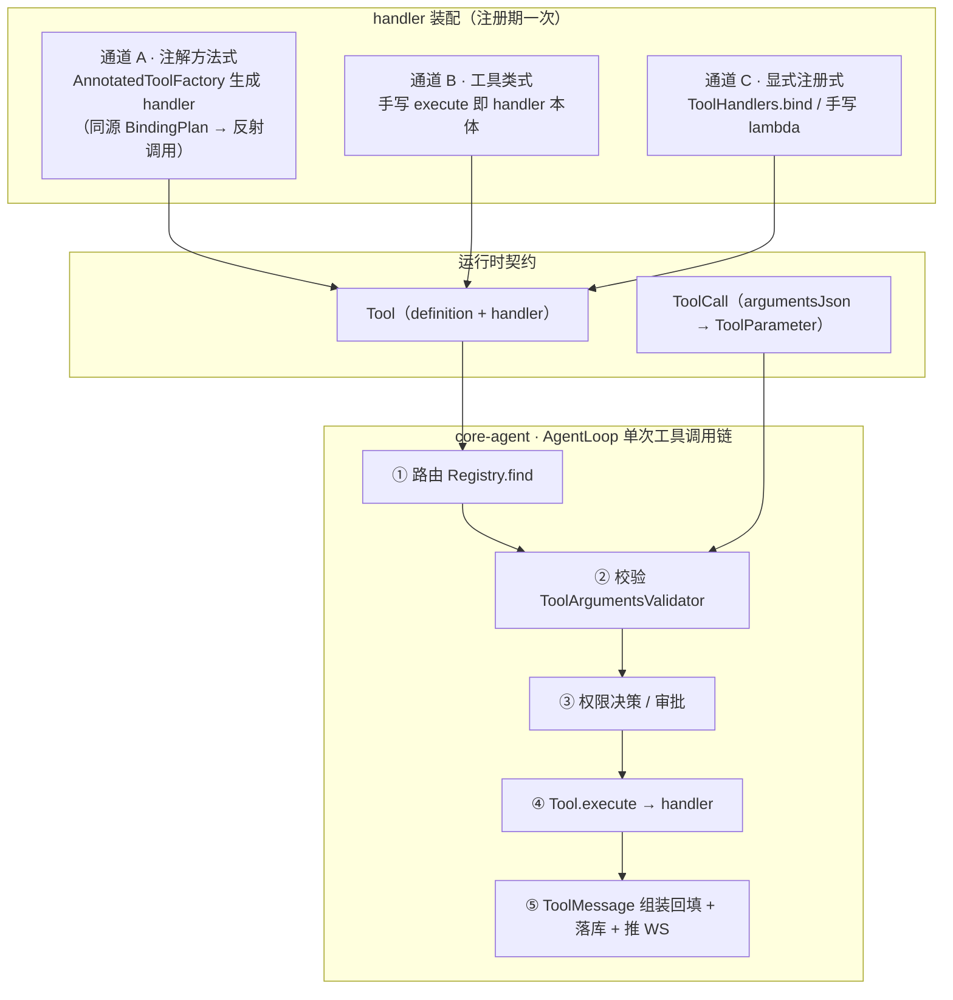

### 类图（执行侧全貌）

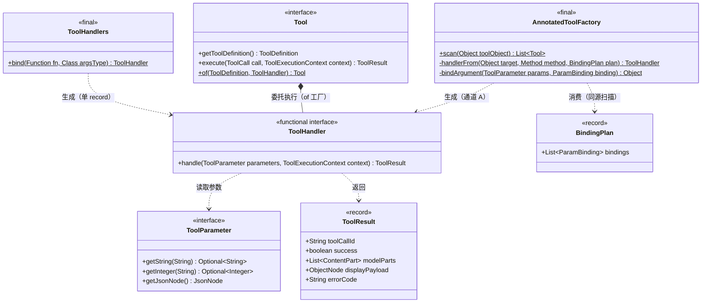

---

## 3. 核心 API

```java
/** 执行体唯一接缝：raw 参数 → 具体实现调用（D40）。 */
@FunctionalInterface
public interface ToolHandler {
    ToolResult handle(ToolParameter parameters, ToolExecutionContext context);
}

public interface Tool {

    /** 默认返回 UNSPECIFIED 占位哨兵，触发注解兜底生成（D39）。 */
    default ToolDefinition getToolDefinition() {
        return ToolDefinition.UNSPECIFIED;
    }

    ToolResult execute(ToolCall call, ToolExecutionContext context);

    /** 显式注册工厂（通道 C）：execute 转发 handler。 */
    static Tool of(ToolDefinition definition, ToolHandler handler) {
        return new Tool() {
            @Override
            public ToolDefinition getToolDefinition() {
                return definition;
            }

            @Override
            public ToolResult execute(ToolCall call, ToolExecutionContext context) {
                return handler.handle(call.getParameters(), context);
            }
        };
    }
}
```

```java
/** 单 record 参数的零手写绑定（语法糖；内部即 p.as(argsType)）。 */
public final class ToolHandlers {

    public static <A> ToolHandler bind(Function<A, ToolResult> fn, Class<A> argsType) {
        return (parameters, context) -> fn.apply(parameters.as(argsType));
    }
}
```

```java
/** 注解扫描：同一次扫描产出「定义 + 绑定计划 + handler」（通道 A）。 */
public final class AnnotatedToolFactory {

    /** 扫描 POJO：每个 @Tool 方法 → 一个 Tool（一对象可多工具）。 */
    public static List<Tool> scan(Object toolObject);

    // ── 内部：handler 生成 ──

    static ToolHandler handlerFrom(Object target, Method method, BindingPlan plan) {
        return (parameters, context) -> {
            Object[] args = new Object[plan.bindings().size()];
            for (BindingPlan.ParamBinding binding : plan.bindings()) {
                args[binding.position()] = bindArgument(parameters, binding);
            }
            try {
                return (ToolResult) method.invoke(target, args);
            } catch (InvocationTargetException e) {
                Throwable cause = e.getCause();          // 解包后原样抛出（D43），由 AgentLoop 统一转错误码
                if (cause instanceof RuntimeException re) {
                    throw re;
                }
                if (cause instanceof Error err) {
                    throw err;
                }
                throw new IllegalStateException("工具方法声明了受检异常（注册期应已拦截）", cause);
            } catch (IllegalAccessException e) {
                throw new IllegalStateException("工具方法不可访问：" + method, e);
            }
        };
    }
}
```

---

## 4. 参数绑定转换器矩阵

绑定**信任校验前置**（D38）：`ToolArgumentsValidator` 已保证 required/type/enum/format 合法，因此绑定按类型直取；唯一允许的"缺席"是**可选参数**（→ `null`）。

| Java 类型 | 绑定方式 | 缺席语义 |
|---|---|---|
| `String` | `parameters.getString(name)` 强类型 getter | 可选 → `null` |
| `int` / `Integer` | `getInteger(name)` | primitive 恒必填（不变量）；`Integer` 可空 |
| `long` / `Long` | `getLong(name)` | 同上 |
| `double` / `Double` / `float` / `Float` | `getDouble(name)` | 同上 |
| `boolean` / `Boolean` | `getBoolean(name)` | 同上 |
| Java `enum` | `getString(name)` → `Enum.valueOf` | 可选 → `null` |
| `record`（单 record 或嵌套组件） | Jackson `convertValue(node, JavaType)`（jsr310 已注册） | 可选 → `null` |
| `List<T>` / `T[]` | Jackson `convertValue` + `TypeFactory`（保泛型） | 可选 → `null` |
| `LocalDate` / `LocalDateTime` / `Instant` 等 | Jackson + `jackson-datatype-jsr310` | 可选 → `null` |

**不变量检查**：primitive 参数在绑定期缺席 = 校验层与 schema 失配（内部 bug）→ 抛 `IllegalStateException`（ERROR 日志，不静默补默认值）。这正是"绑定信任校验"的边界：信任，但保留断言。

---

## 5. 运行期调用链（core-agent · AgentLoop）

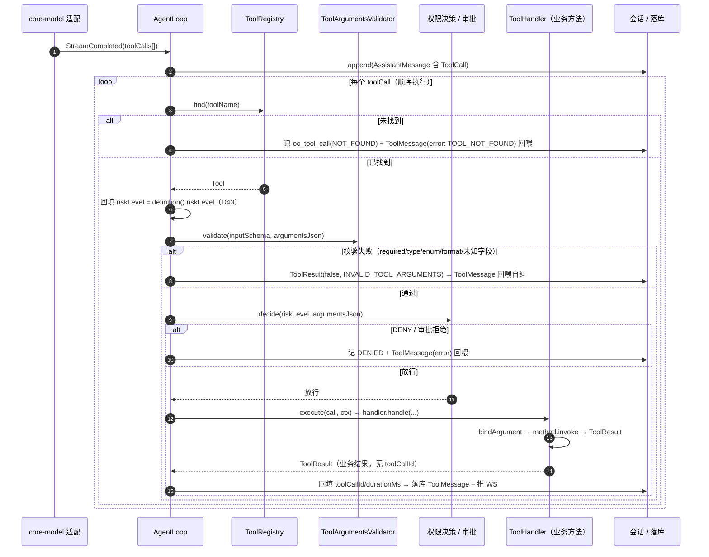

**顺序执行而非并行**（v1 明确取舍）：多个 toolCall 逐个执行——保证确定性、审批顺序可解释、工具副作用（写文件/执行命令）不互相踩踏；并行化留扩展位（§12）。

---

## 6. 错误与结果语义

### 6.1 错误码与处理（全部**回喂**，不向上抛炸循环）

| 场景 | 产出 | 记录 |
|---|---|---|
| 工具名未找到 | `ToolMessage(error: TOOL_NOT_FOUND)` | `oc_tool_call(status=NOT_FOUND)` |
| 参数校验失败 | `ToolResult(false, INVALID_TOOL_ARGUMENTS, 违规列表)` | 同上；同工具连续 3 次失败升级 ERROR 日志（D38，计数语义见第四部分 §6） |
| 权限 DENY / 审批拒绝 | `ToolMessage(error)` | `oc_tool_call(DENIED)` + `oc_agent_event(TOOL_DENIED)` |
| 业务方法抛 `RuntimeException`（解包后原样抛） | `ToolResult(false, TOOL_EXECUTION_FAILED, message)` | ERROR 日志含完整堆栈（D43） |
| 绑定不变量破坏（primitive 缺席等内部 bug） | 同上（错误码不变） | ERROR 日志标注「内部不变量破坏」 |

### 6.2 `ToolResult` 字段回填规则（谁填什么）

| 字段 | 填充方 | 规则 |
|---|---|---|
| `toolCallId` | **AgentLoop**（组装 ToolMessage 时） | handler 不填（避免每个工具搬运 id，D43） |
| `success` / `errorCode` / `errorMessage` | handler（业务失败）/ AgentLoop（框架侧失败） | 错误码使用统一枚举/常量 |
| `modelParts` | 业务方法 | 进 canonical 历史、发给模型（M13 双通道） |
| `displayPayload` | 业务方法 | **只落库 + 推前端，永不进上下文**（M13 类型级保证） |
| `durationMs` | AgentLoop | execute 前后计时 |
| `truncated` | 业务方法 | 输出截断（超长落 media）标志 |

建议提供工厂方法：`ToolResult.success(parts)` / `ToolResult.failure(errorCode, message)` / `ToolResult.modelOnly(callId, parts)`（M13 §4.8）。

---

## 7. 执行上下文（`ToolExecutionContext`）

沿用主设计（第一部分 §4）：`(sessionId, runId, cwd, workspace, openCodingContext, permissionMode, extensions)`。

约定：

- 全部为**显式传参**（`OpenCodingContext` 为 Spring 单例进程信息，非 ThreadLocal；多会话安全靠显式传递，D16）；
- `workspace` 是工具做归属校验的根（越界写 → 工具层拒绝）；
- `extensions` 为插件私有数据逃生位（Map，不承诺稳定结构）。

---

## 8. 线程模型、超时与取消

| 维度 | v1 语义 |
|---|---|
| 执行线程 | 工具在 AgentLoop 调用线程内**同步执行**（阻塞）；阻塞式审批（D12）同线程等待 |
| 会话并发 | 会话级单飞守卫（M18）：同一 session 同时只有一个 run；工具不会并发重入 |
| 框架级超时 | **无**——超时由工具自身控制（如 `execute_command` 的 timeout 参数）；框架不中断线程 |
| abort 语义 | run abort → 循环在**下一个检查点**停止；已启动的工具执行完当前调用（不强杀线程）；结果仍落库 |
| 重复执行保证 | 重试边界严格卡在单次模型调用（D14），工具请求绝不被重试波及 |

---

## 9. 模块落点与依赖

| 组件 | 模块 | 依赖 |
|---|---|---|
| `ToolHandler` / `Tool.of` / `ToolHandlers` | `core-api` · `tool` / `tool/authoring`（D44） | 零新依赖 |
| `AnnotatedToolFactory`（handler 生成 + `bindArgument`） | `core-api` · `tool/authoring` | jackson（databind + datatype-jsr310，D45） |
| `DefaultToolRegistry`（装配、冻结、索引） | `core-implementation` | core-api |
| `AgentLoop`（路由 → 校验 → 权限 → 执行 → 回填） | `core-agent` | core-api |

> 注：注册期扫描/schema 生成零运行期成本；`method.invoke` 属**逐次调用的反射**（Spring AI / LangChain4j 同做法，开销可忽略）——如需极致可换 `MethodHandle`（§12）。

---

## 10. 决策索引

| 决策 | 与本体系的关系 |
|---|---|
| D38 | 校验前置 + 失败回喂：绑定"信任校验"的边界 |
| D40 | ToolHandler 接缝 + `Tool.of`：三通道收敛点 |
| D41 | 方法级绑定：`BindingPlan` 的生成与消费 |
| D43 | 异常解包 / 错误码 / `toolCallId` 与 `riskLevel` 回填层 |

---

## 11. 端到端样例

### 11.1 注解式（通道 A）

```java
public class GrepTool {

    @Tool(name = "grep", description = "按 ripgrep 语法搜索文件内容", riskLevel = ToolRiskLevel.READ_ONLY)
    public ToolResult grep(@ToolParam(description = "ripgrep 语法表达式") String pattern,
                           @ToolParam(description = "搜索根目录列表") List<String> paths) {
        ...
    }
}

// 注册：new AnnotatedToolFactory().scan(new GrepTool())
//  → Tool { definition=grep 定义（schema 见第二部分 §10）,
//           handler=生成 handler（BindingPlan: pattern→0/String, paths→1/List<String>） }
```

模型返回 `{"pattern":"TODO","paths":["/repo/src"]}` 时：

```
AgentLoop → validator 通过 → 权限（READ_ONLY 自动放行）→ handler
  args[0] = params.getString("pattern").orElse(null)        → "TODO"
  args[1] = convertValue(node.paths, List<String>)          → ["/repo/src"]
  method.invoke(grepTool, args) → ToolResult
→ AgentLoop 回填 toolCallId/durationMs → ToolMessage(modelParts) 落库 + 下一 step
```

### 11.2 单 record（`ToolHandlers.bind`）

```java
Tool grep = Tool.of(GREP_DEFINITION, ToolHandlers.bind(fileOps::grep, GrepArgs.class));
```

### 11.3 显式 lambda（通道 C）

```java
Tool read = Tool.of(READ_DEF, (params, ctx) ->
        fileOps.read(params.getString("path").orElseThrow(),
                     params.getInteger("beginLine").orElse(1)));
```

---

## 12. 扩展位（v1.1+，均不阻塞当前实现）

1. **`MethodHandle` 绑定**：`method.invoke` → `MethodHandle.asSpreader`，去逐次反射（性能优化位，非正确性需求）；
2. **多 toolCall 并行执行**：需先解决审批独立性、workspace 写冲突与事件顺序，v1 顺序执行；
3. **框架级工具超时/中断**：评估 `Future` + 协作式取消（工具需响应中断信号）；
4. **handler 装饰器位**：在 `Tool.of` 外侧包装饰（计量/审计），复用 `ModelDecorator` 同款模式；
5. **工具级重试**：明确不做（幂等无法框架级保证，D14 精神：重试只包模型调用）。

---

# 第四部分 · ToolArgumentsValidator 校验体系（信任边界）

> 归属：本文档第一部分 §8.3 的子系统细化；决策 D38 为主决策（D37 / D45 联动）。
> 定位：工具体系的**运行期信任边界**——「模型产出的 `argumentsJson` ⇔ canonical `inputSchema`」的对照检查器。失败即回喂，绝不抛异常炸循环。
> 模块：`core-agent`（纯 Java + Jackson，零 Spring，零额外依赖）。
> 与 schema 侧的关系：`ToolSchemaChecker` 管**声明侧**自检（注册期一次）；本校验器管**数据侧**校验（每次调用一次）——同一份 canonical 规范的两次检查。

---

## 1. 职责与边界

| 做 | 不做 |
|---|---|
| 按 canonical schema 递归校验 `argumentsJson`（required / type / enum / format / 未知字段） | 类型转换与绑定（信任校验前置；执行侧 `bindArgument` 的职责，见第三部分） |
| 产出结构化违规列表 + 中文回喂文案 | schema 生成 / 注册期自检（`ToolSchemaGenerator` / `ToolSchemaChecker`） |
| 防 DoS 守卫（raw 大小上限，先于解析） | 权限决策、审批（`PermissionPolicy`） |
| 失败计数上报（供 AgentLoop 升级告警） | 修复或猜测模型意图（**只报告，不修复**） |

**两条设计原则**：

1. **严格拒绝 + 回喂**，不做 Jackson 式自动 coerce（`"3"` 不会变成 `3`）——把格式学习交给模型自纠，把转换留给已通过校验的数据（执行侧绑定因此可"信任校验"）。
2. **校验器无状态（纯函数）**：`(schema, rawJson) → violations`；失败计数等有状态逻辑归 AgentLoop。

**位置（调用链 ②）**：路由 ① → **校验 ②** → 权限 ③ → 执行 ④。校验先于权限的原因：不让"垃圾参数"触发人工审批弹窗——审批预览看到的一定是已通过校验的参数。

---

## 2. 核心 API

```java
/**
 * 运行期参数校验器：schema 驱动、纯函数、无状态。
 * 不抛异常——包括解析失败在内的一切问题都表达为违规列表。
 */
public final class ToolArgumentsValidator {

    /** 单次 arguments 大小上限（常量，防 DoS；超限直接 MALFORMED_JSON）。 */
    static final int MAX_ARGUMENTS_BYTES = 256 * 1024;

    /** 违规列表封顶（防回喂文案爆炸；超出追加「另有 N 条」）。 */
    static final int MAX_VIOLATIONS = 20;

    /**
     * 校验入口。
     *
     * @param schema       注册期冻结的 canonical schema（注册期已自检，运行期视为可信）
     * @param argumentsJson 模型返回的原始 JSON 字符串
     * @return 违规列表；空列表 = 通过
     */
    public static List<Violation> validate(ObjectNode schema, String argumentsJson);

    /** 违规记录：JSON Path 定位 + 类型 + 可直接回喂的中文文案。 */
    public record Violation(String path, ViolationType type, String message) {
    }

    /** 违规类型全集。 */
    public enum ViolationType {
        MALFORMED_JSON,    // 非合法 JSON，或超过大小上限
        ROOT_NOT_OBJECT,   // 根不是 JSON 对象
        MISSING_REQUIRED,  // 必填字段缺失（或显式 null）
        TYPE_MISMATCH,     // 类型不符（严格，不做字符串宽容）
        ENUM_MISMATCH,     // 取值不在枚举列表
        FORMAT_INVALID,    // date / date-time 不可解析
        UNKNOWN_FIELD      // additionalProperties:false 语义：未声明字段
    }

    /** 汇总回喂文案（供 ToolResult.errorMessage / displayPayload 共用）。 */
    public static String summarize(List<Violation> violations);
}
```

**schema 可信假设**：本校验器不做 schema 自身的合法性检查（注册期 `ToolSchemaChecker` 已保证）。若运行期发现 schema 结构异常（不可能场景）→ 抛 `IllegalStateException`（内部 bug 信号，Fail Loud，不算模型违规）。

---

## 3. 校验算法

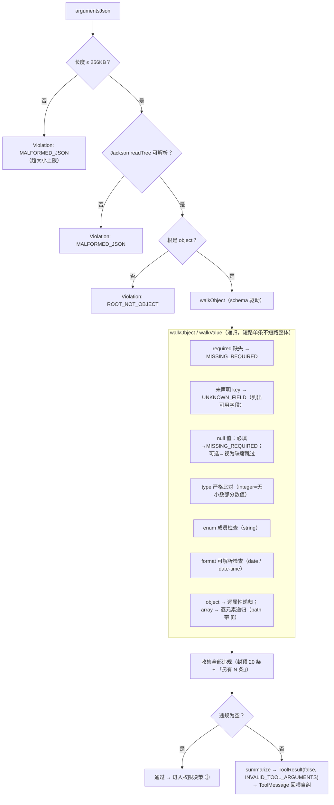

**为什么收集全部而非短路第一条**：一次回喂把问题说到位，减少模型往返次数；封顶 20 条防文案爆炸。

**递归方向**：**schema 驱动遍历**（walk schema、按需取 data）——保证"schema 里有什么就查什么"，`additionalProperties:false` 的未知字段检查天然成立；复杂度与 schema 属性数 + 数据节点数线性相关。

---

## 4. 判定规则矩阵（边界场景逐一明确）

| # | 场景 | 判定 |
|---|---|---|
| 1 | 必填字段缺失 | `MISSING_REQUIRED` |
| 2 | 必填字段显式 `null` | `MISSING_REQUIRED`（视同缺失；文案注明「不能为 null」） |
| 3 | 可选字段缺失 | **通过**（执行侧绑定为 `null`） |
| 4 | 可选字段显式 `null` | **通过**（视为缺席，语义等价） |
| 5 | `integer` 收到字符串 `"3"` | `TYPE_MISMATCH`（严格，不 coerce） |
| 6 | `integer` 收到 `3.0` | **通过**（值语义：无小数部分） |
| 7 | `integer` 收到 `3.5` | `TYPE_MISMATCH` |
| 8 | `boolean` 收到 `"true"` | `TYPE_MISMATCH` |
| 9 | 未声明字段 | `UNKNOWN_FIELD`（文案列出**可用字段**） |
| 10 | 嵌套 object 内违规 | 递归报告，path 带前缀（`filter.include[2]`） |
| 11 | array 元素违规 | 递归报告，path 带下标 |
| 12 | `date` 收到 `"2026/01/01"` | `FORMAT_INVALID`（期望 `YYYY-MM-DD`） |
| 13 | `date-time` 收到不带偏移 | **通过**（接受带/不带偏移，D45） |
| 14 | `date-time` 收到 `"2026-13-01T99:99"` | `FORMAT_INVALID` |
| 15 | raw 非 JSON / 超大小上限 | `MALFORMED_JSON`（短路返回） |
| 16 | 根是数组 / 标量 | `ROOT_NOT_OBJECT`（短路返回） |

**format 校验实现**：直接用 `java.time` 解析（`ISO_LOCAL_DATE`；date-time 先试 `OffsetDateTime.parse` 再退 `LocalDateTime.parse`）——**校验器不依赖 Jackson 模块**（无 jsr310 依赖；绑定侧才需要）。

---

## 5. 回喂文案规范

文案三要素：**JSON Path + 期望 + 实际（截断）**。示例（`summarize` 输出模板）：

```
参数校验失败（3 处）：
1. path：必填字段缺失
2. limit：期望 integer，实际是 string（"200"）
3. mode：取值必须是 [read, write] 之一，实际是 "rw"
4. filter.include[2]：期望 string，实际是 number（3）
另有 2 处违规已省略
```

- 中文；实际值超过 40 字符截断加 `…`；
- 未知字段文案必须附**可用字段清单**（模型据此改名）；
- `ToolResult` 组装：`ToolResult.failure(INVALID_TOOL_ARGUMENTS, summarize(...))`；同一文案进 `displayPayload`（前端展示"为什么这轮没执行"）。

---

## 6. 自纠回环与失败升级（D38 落地）

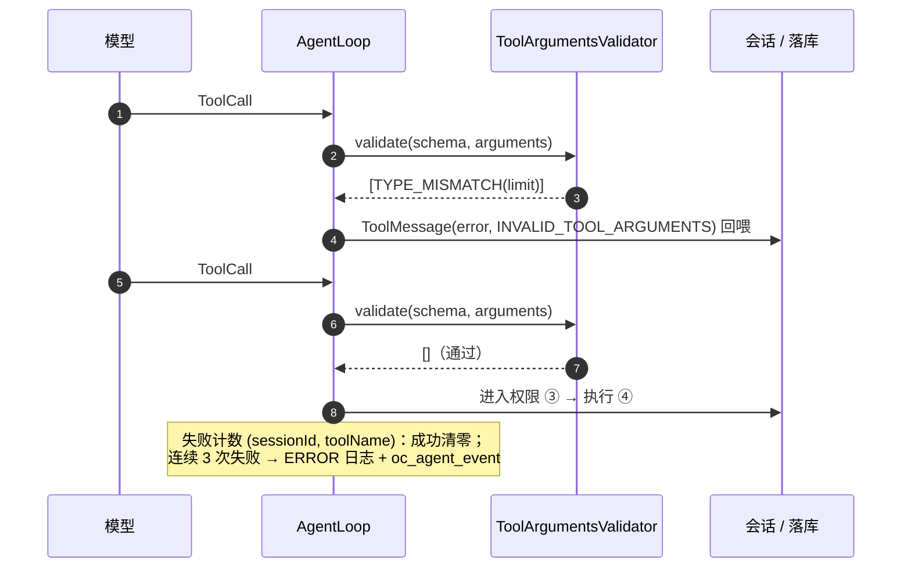

**计数语义说明（对 D38 的落地细化）**：同一 `callId` 天然只会被校验一次（模型自纠会产生**新的** callId），因此"连续失败升级"落地为 **(sessionId, toolName) 维度的连续失败计数**：任一调用该工具成功即清零，连续 3 次失败（常量 `REPEATED_FAILURE_THRESHOLD = 3`）→ ERROR 日志 + `oc_agent_event(TOOL_ARGS_REPEATED_FAILURE)`（提示"模型卡在该工具"）。计数逻辑住 AgentLoop，校验器保持无状态。

---

## 7. 性能与热路径

| 关注点 | 措施 |
|---|---|
| 调用频度 | 每 step 每 toolCall 一次；schema 为注册期冻结对象，零重建 |
| 大 JSON DoS | `MAX_ARGUMENTS_BYTES` 守卫在解析**之前** |
| 分配 | walker 复用局部 StringBuilder 组装文案；违规列表小（封顶 20） |
| 复杂度 | O(schema 属性数 + 数据节点数)；无正则、无反射 |

---

## 8. 可测试性（本体系是纯函数，测试成本最低）

1. **表格驱动矩阵**：§4 的 16 条边界逐条一测（输入 JSON + schema → 期望 ViolationType）；
2. **嵌套递归测试**：三层 record 内分别触发 type/enum/unknown，验证 path 格式；
3. **快照联动**：从注册 schema 快照直接生成校验用例（schema 与校验器永远同源演进）；
4. **回喂文案快照**：`summarize` 输出快照锁定，防止文案回归（文案是模型自纠的输入，属契约面）。

---

## 9. 模块落点与依赖

| 组件 | 模块 | 依赖 |
|---|---|---|
| `ToolArgumentsValidator` + `Violation` | `core-agent` | jackson-databind（JSON 解析）+ JDK `java.time`（format 校验）；**无新增依赖** |
| 失败计数（`(sessionId, toolName)` 连续计数） | `core-agent` · AgentLoop | 常量阈值 |

---

## 10. 决策索引

| 决策 | 与本体系的关系 |
|---|---|
| D38 | 本体系的主决策：校验前置、失败回喂、连续失败升级 |
| D37 | canonical 子集定义 = 校验规则的唯一来源（本校验器只实现该子集的判定） |
| D45 | `format` 白名单与可解析性规则 |

---

## 11. 扩展位（v1.1+，均不阻塞当前实现）

1. **完整 JSON Schema 支持**：若 v1.1 引入 MCP 动态 schema（工具自带任意 schema），本校验器的手写子集解析器替换位是 `networknt/json-schema-validator`（D38 备注保留）——**契约不变，仅实现替换**；
2. **文案多语言**：v1 中文；若对外产品化再评估 i18n（文案属回喂契约，改动需快照升级）；
3. **部分修复建议**：当前只报告不修复；"找近似字段名"（Levenshtein 建议）作为文案增强候选，v1 不做（避免猜测）；
4. **配额与限流**：连续失败计数目前仅告警；未来可接入熔断（连续失败 N 次后本 run 内禁用该工具）——需与 AgentMode 策略联动，v1 不做。

---

> **文档完结** — 本文由四个部分构成（总体设计 / ToolSchemaGenerator / ToolHandler / ToolArgumentsValidator）；图源位于 `docs/design/diagrams/`（09–20）。
