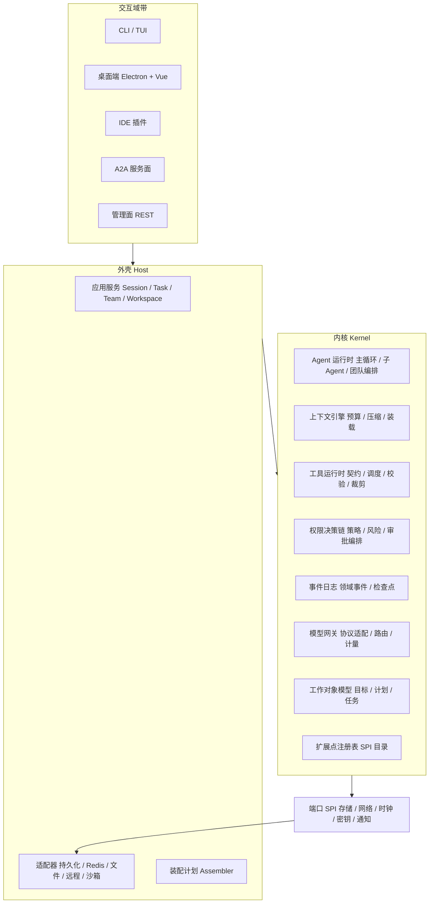
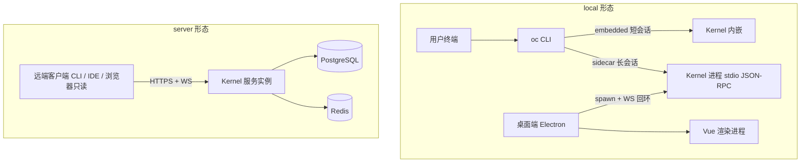
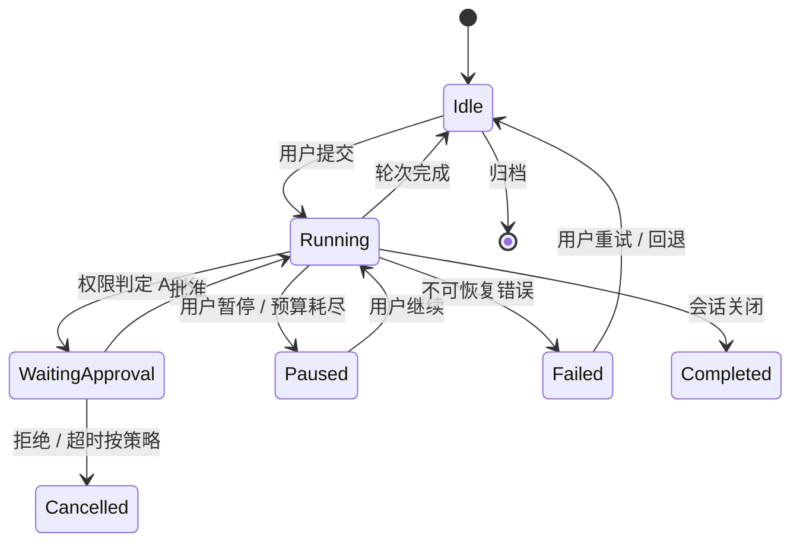
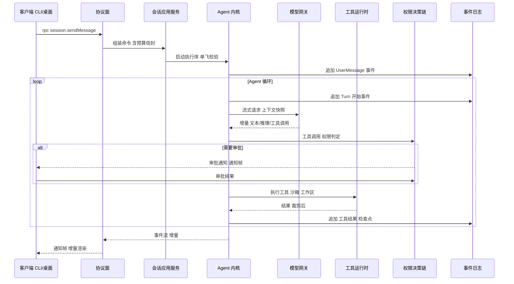
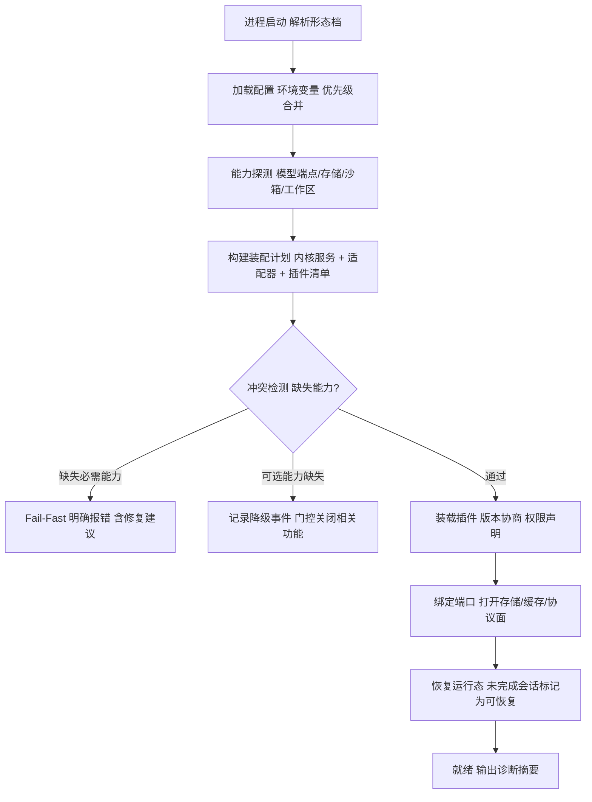

# 卷 01 · Harness 总体架构

> 本卷把卷 00 的需求基线翻译成**可落地的架构骨架**：内核（Kernel）与外壳（Host）的边界、域划分、进程与通信拓扑、并发与恢复模型、技术基座、部署形态、模块依赖铁律。
>
> 本卷是全部后续卷的「承载面」：其他卷只描述域内设计，不得重复定义分层与依赖规则。

---

## 1. 本卷定位

- **解决**：怎么把 24 个功能域装进一个可长期演进的工程结构；CLI / 桌面端 / 服务端如何共享同一内核；数据、事件、并发、恢复的全局模型。
- **不解决**：任一战功域的内部设计（见卷 02–26）；数据表与接口明细（见附录 A/B）。
- **边界**：本卷定「骨架与铁律」，卷 18 定「扩展点目录」，卷 19 定「持久化与迁移」，卷 24 定「部署与企业运维」。

## 2. 需求与质量属性

| 来源 | 需求 | 架构含义 |
| --- | --- | --- |
| REQ-INT-2 | Server 常驻 + headless CLI 同源 | 内核必须与 Web 容器解耦，可在无 HTTP 场景运行 |
| REQ-INT-3 | 每次调用持久化、可 fork/resume/export/import | 事件日志作为事实源 + 检查点机制 |
| REQ-INT-7 | 会话并发单飞 + 队列策略 | 会话级串行执行器 + 可配队列与背压 |
| REQ-INT-11 | 契约先行 | 内核契约独立模块，版本化演进 |
| REQ-SESS-11 | 多端会话同步与接管 | 统一会话协议 + 增量事件推送 + 快照对齐 |
| REQ-PLG-1/4 | 全生命周期插件化、可协商装载 | 内核暴露 SPI + 能力声明 + 装配计划 |
| REQ-MDL-12 | 私有模型/离线内网 | 出网能力集中管控，可全局禁用 |
| REQ-TEAM-6/ENT-5 | 预算与配额贯穿 | 上下文传递「预算信封」，所有调用点可归因 |
| NFR-P-1…10 | 延迟/吞吐/恢复指标 | 并发模型、缓存层次、批量写入策略 |
| NFR-R-1…5 | 可用性与恢复 | 检查点 + 幂等重放 + 投影重建 |
| NFR-M-1…5 | 可维护与演进 | 端口-适配器、版本协商、可观测贯穿 |

**架构级质量属性排序**（用于比选打分）：可演进性 > 可靠性 > 性能 > 开发效率。

## 3. 设计空间（M×N）

### D-ARC-1 内核与外壳的边界

| 分支 | 描述 | 优点 | 代价 |
| --- | --- | --- | --- |
| B1 单体 | 全部逻辑放同一可执行体，UI 与内核直接调用 | 起步快 | 无法多端复用；测试需启动容器；插件无从下手 |
| B2 分层内核 | 内部分层（domain/service/infra），但内核仍依赖框架 | 结构清晰 | Spring 依赖外溢到 Agent 循环，CLI 冷启动与嵌入受阻 |
| B3 微内核 + 外壳 | 内核 = 纯契约 + 运行时（无框架、无存储实现）；外壳 = 应用服务 + 适配器 + 入口 | 多端复用、可嵌入、可单测、插件天然有边界面 | 需要端口-适配器纪律，前期脚手架成本高 |

| 分支 | F | U | S | M | 加权 | 结论 |
| --- | --- | --- | --- | --- | --- | --- |
| B1 | 5 | 6 | 7 | 3 | 52.5 | 淘汰 |
| B2 | 6 | 7 | 7 | 5 | 62.5 | 备选 |
| **B3** | **9** | **8** | **8** | **9** | **86.5** | **选定** |

**选定 B3 的代价与回退**：需要维护「内核契约」版本；若内核契约类型数量失控（> 400 公开类型），按子域拆分内核模块（H-003 回退触发）。

### D-ARC-2 领域划分方式

| 分支 | 描述 | 结论 |
| --- | --- | --- |
| B1 按技术层划（controller/service/dao） | 传统三层，域边界消失，团队协作冲突高 | 淘汰（M=3） |
| B2 纯按能力域划（35 域平铺） | 边界清晰，但缺少平台与端的区分 | 备选（M=7） |
| **B3 三带划分：内核域带 / 平台域带 / 交互域带** | 内核域（模型、上下文、工具、权限、Agent、事件…）无框架；平台域（持久化、缓存、工作区、知识库、企业能力）独立演进；交互域（协议、CLI、桌面、IDE、A2A）面向用户与外部 | **选定**（F=9 U=8 S=9 M=9 → 87.5） |

**域到带映射**：

| 带 | 域 | 特征 |
| --- | --- | --- |
| 内核域带 | 模型接入、上下文、提示词、工具、权限决策、Agent 内核、任务/计划/目标/调度（模型层）、事件（模型层）、记忆（模型层）、Skill 模型、MCP 契约 | 纯 Java、可单测、无 IO 实现 |
| 平台域带 | 持久化与迁移、Redis 运行态、工作区、Git、沙箱、知识库、记忆存储、企业（多租户/审计/计量）、插件装载 | 有 IO、可替换适配器 |
| 交互域带 | 协议面（REST/WS/JSON-RPC）、CLI/TUI、桌面端、IDE 插件、A2A 服务面、只读跟随端 | 面向接入方，可多实现 |

### D-ARC-3 内核宿主形态

| 分支 | 描述 | 优点 | 代价 |
| --- | --- | --- | --- |
| B1 内嵌 JVM | 内核与前端同进程（CLI 内嵌、桌面端嵌入 JVM） | 延迟最低、部署简单 | 前端崩溃即内核崩溃；多端无法共享会话 |
| B2 sidecar 进程 | 内核作为独立 JVM 进程，前端通过本地管道/回环连接 | 崩溃隔离、多端共享、可后台常驻 | IPC 开销、进程生命周期管理 |
| B3 远程服务 | 内核只跑在服务器 | 团队共享 | 个人场景延迟与隐私不符；离线不可用 |

| 分支 | F | U | S | M | 加权 | 结论 |
| --- | --- | --- | --- | --- | --- | --- |
| B1 | 6 | 9 | 5 | 5 | 61.5 | 作为内嵌档保留 |
| **B2** | **9** | **8** | **9** | **9** | **87.5** | **选定（默认）** |
| B3 | 8 | 6 | 8 | 8 | 75.5 | server 形态复用 |

**组合策略**（对齐 H-002）：同一内核支持三种宿主档 —— `embedded`（CLI 短会话，<300ms 冷启动要求）、`sidecar`（桌面端与 CLI 长会话，默认）、`remote`（server/enterprise 形态）。三档共用同一套协议与内核 API，仅装配不同。

### D-ARC-4 并发模型

| 分支 | 描述 | 结论 |
| --- | --- | --- |
| B1 线程池 + 阻塞 IO | 成熟但线程数与连接数绑定，长任务易饥饿 | 备选（S=6） |
| B2 全响应式（Reactor） | 高吞吐，但内核逻辑被迫响应式化，调试与插件友好度差 | 淘汰（M=4） |
| **B3 虚拟线程 + 结构化并发 + 显式背压** | Java 21 虚拟线程承载 IO 阻塞；结构化并发管理任务树（取消传播）；队列与信号量实现背压；流式用拉取式迭代器 | **选定**（F=9 U=8 S=8 M=9 → 85.5） |

要点：
- **每会话一个结构化并发作用域**：会话内所有 Agent 循环、子 Agent、工具调用都属于同一作用域；取消会话 = 取消作用域。
- **单飞 + 队列**（REQ-INT-7）：同一会话的执行体同一时刻仅一个运行；新请求进入队列，队列策略（`queue` / `interrupt` / `reject` / `coalesce`）可配。
- **背压**：事件写入、模型流读取、工具输出均使用有界通道；满则阻塞生产者而非丢弃（丢弃仅用于遥测事件）。

### D-ARC-5 通信与协议

| 分支 | 描述 | 结论 |
| --- | --- | --- |
| B1 纯 REST | 简单，但双向事件需轮询 | 淘汰 |
| B2 REST + WebSocket（自研帧） | 双向实时；命令/事件分离 | 备选 |
| **B3 REST（管理面）+ JSON-RPC over WS/stdio（会话面）+ SSE（只读跟随）** | 命令-响应语义严格（请求/响应/通知三类帧）；stdio 让 CLI 与桌面复用同一客户端库；REST 负责资源管理（项目、工作区、配置）；SSE 给只读端 | **选定**（F=9 U=8 S=9 M=9 → 87.5） |

**协议不变量**：
1. 所有会话语义（消息、工具、审批、事件）只走 JSON-RPC 会话面；REST 不承载会话语义。
2. 每个请求带 `requestId`、`sessionId`、`traceId`；通知不要求响应但必须有序。
3. 断线续传：客户端持有 `lastEventSeq`，重连时请求 `resume(fromSeq)`，缺失区间用快照对齐（D-ARC-10）。

### D-ARC-6 状态与恢复模型

| 分支 | 描述 | 结论 |
| --- | --- | --- |
| B1 纯事件溯源 | 一致性强，但会话状态重建慢、事件风暴影响读路径 | 备选 |
| B2 纯状态快照 | 读快，但无审计与重放能力（违反 REQ-INT-3） | 淘汰 |
| **B3 事件日志（事实源）+ 检查点快照（加速恢复）+ 读模型投影（查询）** | 三者职责分离：事件不可变、检查点可重建、投影可丢弃重建 | **选定**（F=9 U=8 S=9 M=9 → 87.5） |

要点：
- **事件粒度**：轮次（Turn）、模型调用、工具调用、审批、计划变更、任务状态、记忆写入、权限决策均为事件；流式文本增量不入库（REQ-INT-4），只存最终消息 + 关键增量摘要。
- **检查点**：每轮结束、每 N 次工具调用、每次用户介入后写入检查点（含上下文摘要、计划快照、工作区版本指针）。
- **幂等重放**：工具调用带幂等键；重放时已完成且幂等的结果直接复用，非幂等的副作用标记为「已发生，需人工确认」。

### D-ARC-7 部署单元

| 分支 | 描述 | 结论 |
| --- | --- | --- |
| B1 单体 | 简单 | 备选（S=7 M=4） |
| **B2 模块化单体（可选择性拆出工作节点）** | 一个可执行体 + 严格模块边界；未来按需拆出「执行节点」「知识索引节点」 | **选定**（F=8 U=8 S=9 M=8 → 82.5） |
| B3 微服务 | 独立伸缩，但运维与调试成本高，个人形态不适用 | 淘汰 |

### D-ARC-8 多租户隔离实现

| 分支 | 描述 | 结论 |
| --- | --- | --- |
| B1 行级隔离（tenant_id 列 + 强制过滤） | 成本最低，隔离强度中，需防遗漏 | **选定（默认）**（F=8 U=8 S=8 M=8 → 80） |
| B2 Schema 隔离 | 隔离强，迁移成本高 | 备选（企业专属部署档） |
| B3 实例隔离 | 最强，成本最高 | 备选（金融级客户） |

**决策**：默认 B1 + 防线双保险（持久层强制注入 tenant 条件 + 集成测试校验无遗漏）；高隔离客户通过部署档切换到 B2/B3，**代码不变**（数据访问端口按租户上下文路由）。

### D-ARC-9 装配与扩展装载

| 分支 | 描述 | 结论 |
| --- | --- | --- |
| B1 框架自动配置扫描 | 便利，但装配顺序与冲突不可预测，插件无法参与 | 淘汰 |
| B2 显式装配计划（能力驱动的装配图 + 冲突检测） | 启动确定、可预测、可诊断；插件声明能力参与装配 | **选定**（F=9 U=7 S=9 M=9 → 86.5） |
| B3 插件容器自治 | 灵活但缺少全局一致性 | 淘汰 |

### D-ARC-10 前端状态同步

| 分支 | 描述 | 结论 |
| --- | --- | --- |
| B1 全量快照轮询 | 简单，实时性差 | 淘汰 |
| B2 纯增量事件 | 实时，但断线/丢包后状态漂移 | 备选 |
| **B3 增量事件 + 快照对齐（resume token）** | 常态增量推送；重连时对比 `lastEventSeq` 与保留窗口，窗口内补发，窗口外快照重建 | **选定**（F=8 U=9 S=9 M=9 → 87.5） |

### D-ARC-11 契约版本化

| 分支 | 描述 | 结论 |
| --- | --- | --- |
| B1 无版本 | 破坏性变更多 | 淘汰 |
| B2 单一版本号跟踪全局 | 粒度粗，小改动也需全量升级 | 备选 |
| **B3 契约面版本矩阵 + 能力协商** | 每个契约面（会话协议、插件 SPI、A2A、事件 Schema）独立版本；连接时协商，兼容期 ≥ 2 个小版本 | **选定**（F=9 U=7 S=8 M=9 → 84） |

## 4. 选定方案详设

### 4.1 分层总览

**内核的「零依赖」纪律**：内核只依赖 JDK 与内核契约；所有 IO（存储、网络、时钟、随机、文件）通过端口注入。内核产出的是**事件与命令**，而不是直接写库。

### 4.2 三带与域映射（终态目录）

### 4.3 进程拓扑与形态矩阵

| 形态 | 内核宿主 | 数据面 | 网络 | 典型场景 |
| --- | --- | --- | --- | --- |
| `local-lite` | 内嵌进程 | 嵌入式仓储（本地文件/SQLite 类）+ 可选 PG | 仅模型端点 | 快速 CLI 短会话 |
| `local` | sidecar 常驻 | PG（本地实例或嵌入式）+ Redis（可选，降级为进程内） | 模型端点 + 用户授权的外网 | 个人桌面端与长会话 |
| `server` | 服务进程 | PG + Redis + 对象存储 | 内网 + 模型端点 | 团队共享实例 |
| `enterprise-server` | 集群（模块化单体 × N） | PG 主从 + Redis 集群 + 对象存储 + KMS | 企业出口代理 | 多租户 + SSO + 审计 |
| `air-gapped` | 服务进程（离线包） | 全部本地 | 全禁外网，模型走内网端点 | 内网/涉密 |

### 4.4 技术基座（明确选型，供实现落地）

| 层 | 选型 | 理由与约束 |
| --- | --- | --- |
| 语言与运行时 | Java 21（LTS） | 虚拟线程、结构化并发、record/模式匹配支撑内核契约表达 |
| 内核 | 纯 Java 模块（无 Spring、无 ORM） | H-003 |
| 外壳容器 | Spring Boot 3.4+（IoC、配置、Web、事务） | 仅出现在平台域带与交互域带 |
| 持久化 | PostgreSQL 16+（事务、JSONB、全文、扩展向量能力） | H-005；迁移工具 Flyway |
| 缓存/队列 | Redis 7+（缓存、锁、限流、Stream 轻量队列） | H-005；**必须有进程内降级实现**供 local-lite |
| 前端 | Electron + Vue 3 + TypeScript + Pinia + 组件库（Naive UI / Element Plus 二选一，见卷 22） | H-015 |
| 会话协议 | JSON-RPC 2.0 over WebSocket（本机 stdio 同构） | D-ARC-5 |
| 管理面 | REST + OpenAPI | D-ARC-5 |
| CLI/TUI | JLine3（终端能力）+ Picocli（命令解析）；与内核同 JVM | 冷启动目标 NFR-P-6 |
| 构建 | Maven 多模块（`harness-*` 前缀）；前端 pnpm | 对齐现有工程习惯（Maven + 独立前端工程） |
| 打包 | jpackage / 分平台安装包；服务器侧容器镜像（多架构）+ Helm Chart | 卷 24 |
| 可观测 | OpenTelemetry 语义约定 + Prometheus 指标 + 结构化 JSON 日志 | 卷 24 |
| 测试 | JUnit 5 + 测试容器（PG/Redis）+ 前端 Vitest + Playwright（桌面端 E2E） | 卷 26 |

**被显式排除**：内核不引入响应式栈；不引入重型工作流引擎；不引入分布式事务；不允许在核心链路使用反射式魔法装配（插件装载除外，且需显式清单）。

### 4.5 模块与依赖铁律

1. **依赖方向**：`harness-core（契约+运行时）← harness-platform ← harness-host`；`harness-surface` 只依赖 core 契约与前两者暴露的门面。禁止反向依赖与循环依赖（构建期用依赖检查插件强制）。
2. **内核零框架**：`harness-core` 不得依赖 Spring/Jackson/ORM/Redis 客户端/HTTP 客户端。
3. **端口-适配器**：跨带交互只能经由 `harness-core` 中定义的端口接口；适配器实现位于平台域带。
4. **契约单源**：会话协议、事件 Schema、插件 SPI 均来自同一契约模块，禁止各端各自定义。
5. **无隐式全局态**：内核禁止静态可变状态（除不可变常量）；一切状态经会话/运行时上下文传递（便于测试与并行）。
6. **前端禁越权**：桌面端与 CLI 不得直接访问存储，必须走协议面（含本地形态）。
7. **租户贯穿**：任何仓储调用必须携带租户上下文；缺失即 Fail-Fast。
8. **预算贯穿**：任何模型/工具调用必须携带预算信封（token/成本/时间/工具次数上限），超限即中断并生成事件。

### 4.6 关键运行时模型

**会话执行体（Session Runner）**：每个活跃会话对应一个结构化并发作用域，内部包含：Agent 循环、工具执行器、事件追加器、审批协调器。状态机如下：

**一次用户消息的端到端时序**（协议面 → 内核 → 外壳）：

### 4.7 启动与装配

**装配三原则**：显式优于隐式；失败优于降级（必需能力缺失直接拒绝启动）；降级必须留痕（生成 `capability.degraded` 事件并在界面呈现）。

### 4.8 数据平面总览

| 数据类别 | 存储 | 一致性 | 生命周期 |
| --- | --- | --- | --- |
| 事件日志（事实源） | PG 分区表（按租户/时间） | 强一致（追加） | 长期保留，可归档冷存 |
| 检查点/快照 | PG + 对象存储（大对象） | 强一致 | 跟随会话保留 |
| 读模型投影 | PG 物化视图/投影表 + Redis 热态 | 最终一致（≤5s） | 可重建 |
| 会话热态（流缓冲、锁、限流） | Redis | 弱一致（可丢） | 秒级 TTL |
| 媒体/大对象 | 对象存储/文件系统（内容寻址） | 强一致 | 引用计数 + 生命周期策略 |
| 知识索引 | 向量/全文索引存储 + PG 元数据 | 最终一致 | 与工作区版本绑定 |
| 审计与计量 | PG 只追加表 + 导出通道 | 强一致 | 按合规留存 |
| 配置与密钥 | 配置文件 + KMS/密钥服务 | 强一致 | 版本化 |

### 4.9 错误、降级与能力门控

| 类别 | 处理 |
| --- | --- |
| 用户错误（参数/权限/状态） | 统一业务错误码 + 中文文案 + 可选恢复动作；不进入重试 |
| 外部依赖错误（模型/网络/沙箱） | 分类：可重试（指数退避 + 抖动）、需换路（降级到备选模型/后端）、不可恢复；每次重试生成事件 |
| 内核不变量破坏 | 立即失败并落 `system.invariant.violated` 事件，携带诊断包（上下文摘要 + 最近事件） |
| 能力缺失 | 门控关闭对应功能 + 界面显式提示（产品铁律 1） |
| 插件故障 | 熔断插件能力并隔离（卷 18），不影响内核 |

### 4.10 可观测与追踪

- **trace 贯穿**：客户端请求 → 协议面 → 应用服务 → 内核 → 模型/工具 → 沙箱，统一 `traceId`；`spanId` 层级与轮次/工具调用对齐。
- **指标命名**：`oc_<域>_<对象>_<指标>`，如 `oc_model_request_latency_ms`、`oc_tool_exec_total`、`oc_event_append_latency_ms`、`oc_session_active`。
- **事件即日志**：业务语义日志由事件派生，避免双写不一致；技术日志（堆栈、依赖调用）走结构化日志并与 traceId 关联。
- **诊断摘要**：`oc doctor` / 桌面端「诊断」面板输出装配计划、能力门控、插件健康、存储连通性。

### 4.11 离线能力矩阵（air-gapped 与断网降级）

| 能力 | 完全离线（air-gapped） | 临时断网（< 24h） |
| --- | --- | --- |
| 会话与编辑、文件操作、Git 本地操作 | ✅ 可用 | ✅ 可用 |
| 模型推理 | 仅本地/内网端点（未配置则不可用，显式提示） | 同左；恢复后自动续传 |
| 工具（读/写/命令/测试） | ✅ 可用（沙箱本地） | ✅ 可用 |
| 知识检索 | ✅ 本地索引可用；远端连接器暂停同步（标记滞后） | 同左 |
| 记忆 | ✅ 本地可用；组织记忆仅缓存副本（标记可能过期） | 同左 |
| 插件/技能安装、更新分发 | ❌ 需介质/私仓（离线包） | ❌ 待恢复后执行（排队） |
| 遥测/崩溃上报 | ❌ 本地累积（可导出） | 队列缓存（上限后丢弃最旧） |
| 许可校验 | 离线宽限期（默认 30 天）→ 到期只读 | 自动重试；宽限期不受影响 |
| 外部调用（A2A/MCP 远程） | ❌（显式错误与降级建议） | 重试 + 熔断 |
| 团队协作（跨实例） | ❌（单实例内可用） | 恢复后事件合并（幂等） |

**规则**：任何降级都必须显式提示（产品铁律 1）；离线期间产生的数据在恢复后必须可安全合并（幂等键 + 事件序号）；`air-gapped` 形态在装配期即断开外部通道（不依赖运行时探测）。

## 5. 扩展点（供卷 18 汇总）

| 扩展点 | 说明 | 稳定性 |
| --- | --- | --- |
| `StoragePort` | 仓储实现（PG/嵌入式/远端） | 稳定 |
| `RuntimeStorePort` | 热态、锁、限流、队列 | 稳定 |
| `HostAdapterPort` | 内核宿主（embedded/sidecar/remote） | 稳定 |
| `ProtocolCodec` | 协议帧编解码（JSON-RPC 变体） | 稳定 |
| `ClockPort` / `IdPort` / `RandomPort` | 可测性端口（时间、ID、随机） | 稳定 |
| `CapabilityProbe` | 启动期能力探测扩展 | 演进 |
| `AssemblerContributor` | 向装配计划贡献服务/适配器/插件 | 演进 |
| `SurfaceRenderer` | 新增端形态（只读跟随、机器人端） | 演进 |

## 6. 事件与可观测（本域事件）

| 事件 | 触发 | 消费者 |
| --- | --- | --- |
| `system.started` / `system.ready` | 启动与就绪 | 审计、诊断、前端 |
| `system.capability.probed` / `system.capability.degraded` | 能力探测结果 | 前端门控、审计 |
| `system.assembly.plan.created` | 装配计划生成 | 诊断包 |
| `system.invariant.violated` | 不变量破坏 | 告警、诊断 |
| `session.runner.state.changed` | 执行体状态机变更 | 前端、审计 |

## 7. 非功能设计要点

- **性能预算分配**（首 token P95 ≤ 1.5s 的拆解）：协议往返 ≤ 20ms、上下文组装 ≤ 80ms（含缓存命中）、模型首字节外部依赖、事件追加 ≤ 10ms（异步批量但必须可确认）、工具调度 ≤ 20ms。
- **容量**：事件表按月分区 + 冷热分层；投影表可重建；Redis 仅存热态（避免成为事实源）。
- **水平扩展**：会话亲和（同一会话固定实例，经会话路由表）；无状态管理面可任意扩展；执行节点可独立扩容（卷 20/24）。
- **降级矩阵**：Redis 不可用 → 进程内缓存与本地队列（单实例语义）；PG 不可用 → 只读模式（禁止写入并显式提示）；对象存储不可用 → 媒体延迟加载、事件仍可写。
- **安全**：内核不直接持有密钥明文，密钥经 `SecretPort` 按需获取，使用后立即释放（卷 07）。

## 8. 完成定义（DoD）

- [ ] 三带边界与 35 域（D01–D35）归属映射完成，且每域归属唯一（无跨带歧义）。
- [ ] 模块依赖铁律 8 条可被构建期检查（依赖检查插件规则列表）。
- [ ] 三种宿主档（embedded/sidecar/remote）共用协议与内核 API 的验证用例存在。
- [ ] 会话执行体状态机与端到端时序在实现中有对应契约与测试（状态迁移全覆盖）。
- [ ] 装配计划可输出为可读诊断文件（含冲突与降级结论）。
- [ ] 性能预算六段拆解均有埋点，且可生成分解报告。
- [ ] 降级矩阵每格有对应测试用例。

## 9. 域内决策汇总（D-ARC）

| ID | 主题 | 选定 |
| --- | --- | --- |
| D-ARC-1 | 内核与外壳边界 | 微内核 + 外壳（端口-适配器） |
| D-ARC-2 | 域划分 | 三带划分（内核域/平台域/交互域） |
| D-ARC-3 | 内核宿主形态 | sidecar 默认 + embedded/remote 两档同源 |
| D-ARC-4 | 并发模型 | 虚拟线程 + 结构化并发 + 显式背压 |
| D-ARC-5 | 通信协议 | REST 管理面 + JSON-RPC 会话面 + SSE 只读 |
| D-ARC-6 | 状态与恢复 | 事件日志 + 检查点 + 可重建投影 |
| D-ARC-7 | 部署单元 | 模块化单体（可按需拆执行/索引节点） |
| D-ARC-8 | 多租户隔离 | 行级默认 + 部署档可切 schema/实例 |
| D-ARC-9 | 装配方式 | 能力驱动的显式装配计划 |
| D-ARC-10 | 前端同步 | 增量事件 + 快照对齐 |
| D-ARC-11 | 契约版本化 | 版本矩阵 + 连接期能力协商 |

## 10. 开放问题与默认决策

| 项 | 默认决策 |
| --- | --- |
| local-lite 的嵌入式仓储 | 默认实现为「本地 PG 轻量实例优先，其次嵌入式关系库适配器」；接口不变，按探测结果择优 |
| 会话路由表存储 | server 形态放 Redis；local 形态进程内 |
| 事件分区键 | `(tenantId, sessionId)` 哈希 + 时间二级分区 |
| 内核 SPI 的二进制兼容 | JVM 内以源码兼容为主，兼容期 ≥ 2 个小版本；跨进程插件走协议版本协商 |
| 是否引入 GraalVM 原生镜像 | 默认不引入（保留为 local-lite 冷启动优化备选，需评测后决策） |
