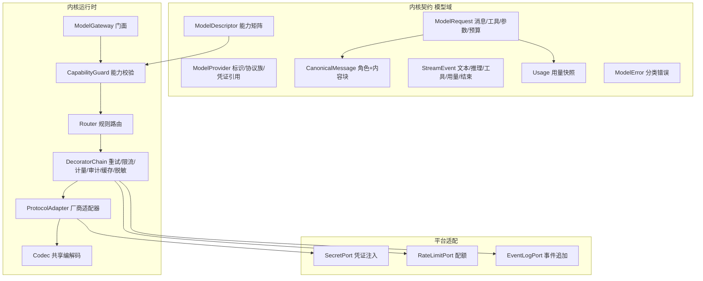
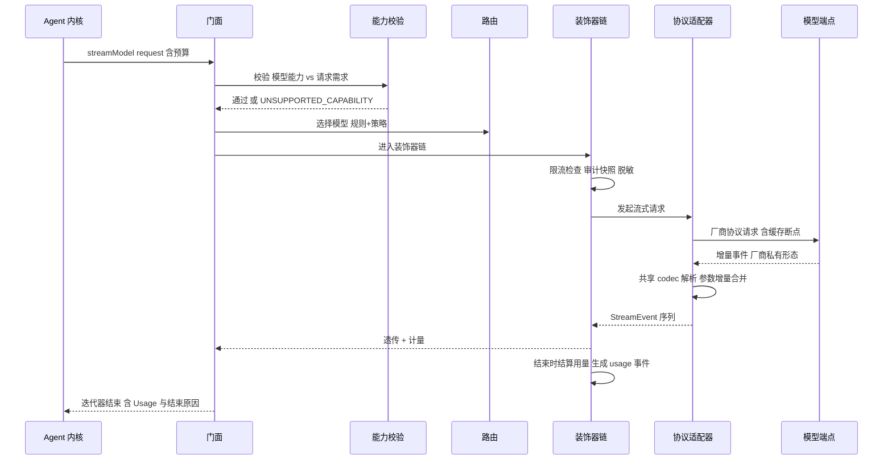

# 卷 02 · 模型接入层（Model Gateway）

> 自封装的大模型接入层：把「千差万别的厂商协议」收敛为一套内核语义（消息、工具调用、流式、用量、错误），并在此之上提供路由、降级、限流、缓存、计量、审计与多模态能力。
>
> 需求来源：REQ-MDL-1…17（卷 00 §5.2）；全局约束：H-003（内核零框架）、H-014（工具契约单源）、REQ-INT-9（不静默降级）。

---

## 1. 本卷定位

- **解决**：模型怎么接、怎么流、怎么失败、怎么计量、怎么换模型而不动上层。
- **不解决**：上下文怎么拼（卷 03）、提示词怎么组装（卷 04）、工具怎么执行（卷 05）、配额的企业侧治理（卷 24）。
- **边界**：本卷只管「一次模型调用」的完整生命周期与多厂商差异消除；不承担 Agent 循环语义（卷 12）。

## 2. 需求与竞品对照

| 需求 ID | 需求 | 竞品参照 |
| --- | --- | --- |
| REQ-MDL-1 | 多协议适配（Anthropic / OpenAI / Gemini / Ollama / 兼容端点） | Codex 自有协议；Claude Code/Qoder/DeepSeek 多模型 |
| REQ-MDL-2 | 能力矩阵驱动（上下文、工具、视觉、推理、缓存、结构化输出） | Claude Code 模型选择器 + 能力探测 |
| REQ-MDL-3 | 三段流式（文本 / 工具参数 / 推理） | Codex 流事件流；Claude Code 交错推理 |
| REQ-MDL-4 | 工具调用（并行/多工具/参数流式） | 全体 |
| REQ-MDL-5 | 提示词缓存与计费优化 | Codex prefix cache 实践（REQ-CMP-5 同源诉求） |
| REQ-MDL-6 | 推理强度控制 | Claude Code/Qoder 的思考档位 |
| REQ-MDL-7 | 结构化输出 | 全体（JSON 模式/工具约束） |
| REQ-MDL-8 | 路由与降级 | Qoder 多模型切换 |
| REQ-MDL-9 | 错误翻译与可重试分类 | 全体（错误可读性差异大） |
| REQ-MDL-10 | 配额与限流 | 企业侧为 Qoder/Codex 的计费面 |
| REQ-MDL-11 | 用量计量与成本归因 | 全体（成本透明是用户刚需） |
| REQ-MDL-12 | 私有模型与自建网关 | DeepSeek 自托管友好；本项为 OpenCoding 企业卖点 |
| REQ-MDL-15/16 | 嵌入/重排、多模态生成 | Qoder 多模态；Claude Code 图像输入 |

## 3. 设计空间（M×N）

### D-MDL-1 抽象层次

| 分支 | 描述 | 优点 | 代价 |
| --- | --- | --- | --- |
| B1 统一规范模型（canonical） | 内核只认一套消息/工具/流语义，厂商差异在适配器内消除 | 上层简单、可测试、可换厂商 | 厂商独有能力需要扩展位 |
| B2 厂商原生透传 | 上层直接构造厂商请求 | 能力零损失 | 上层被厂商绑架，工具/上下文层需 N 套逻辑 |
| B3 双模（canonical + `providerOptions` 逃生门） | 95% 走 canonical，5% 走厂商专有参数 | 兼顾统一与能力 | 需要约束逃生门使用范围 |

| 分支 | F | U | S | M | 加权 | 结论 |
| --- | --- | --- | --- | --- | --- | --- |
| B1 | 7 | 7 | 8 | 8 | 75 | 备选 |
| B2 | 8 | 6 | 5 | 3 | 54 | 淘汰 |
| **B3** | **9** | **8** | **9** | **9** | **87.5** | **选定** |

**约束**：`providerOptions` 只允许「采样/推理/缓存/安全」类参数，且必须声明能力键；内核逻辑（工具、上下文、权限）禁止读取厂商字段。

### D-MDL-2 协议适配实现方式

| 分支 | 描述 | 结论 |
| --- | --- | --- |
| B1 每厂商独立适配器 | 清晰，但重复代码多 | 备选 |
| B2 声明式协议映射表（配置驱动） | 新增厂商零代码，但复杂语义（工具增量、缓存）难表达 | 淘汰（工具与流式表达力不足） |
| **B3 适配器 + 共享编解码内核（codec 复用，差异点模板化）** | 公共流解析、SSE/JSONL 处理、工具增量合并复用；厂商只写差异（字段映射、终止条件、错误表） | **选定**（F=9 U=8 S=8 M=9 → 85.5） |

### D-MDL-3 流式模型

| 分支 | 描述 | 结论 |
| --- | --- | --- |
| B1 回调监听器 | 简单，但难以组合与传播取消 | 淘汰 |
| B2 响应式流 | 组合性强，但与内核阻塞式风格冲突 | 淘汰（H-003/D-ARC-4） |
| **B3 拉取式增量迭代器（阻塞迭代）+ 取消信号 + 背压** | 与虚拟线程天然契合；取消可传播；背压由消费速率决定 | **选定**（F=8 U=8 S=9 M=9 → 85.5） |

### D-MDL-4 工具调用映射

| 分支 | 描述 | 结论 |
| --- | --- | --- |
| B1 每次全量工具列表 + 逐厂商投射 | 简单直接 | 备选 |
| **B2 全量投射 + 增量参数合并 + 并行调用支持 + 参数修复** | 处理「参数分片流式」「索引并列多工具」「空参数/畸形 JSON」三类现实问题；畸形参数交给卷 05 的校验器产生可回喂错误 | **选定**（F=9 U=8 S=8 M=8 → 82.5） |
| B3 只支持顺序单工具 | 实现最简，体验差（不能并行读文件） | 淘汰 |

### D-MDL-5 能力协商与降级

| 分支 | 描述 | 结论 |
| --- | --- | --- |
| B1 静默降级（自动去掉不支持的工具/图片） | 用户无感但结果不可预期，违反 REQ-INT-9 | 淘汰 |
| **B2 能力矩阵 + 显式失败 + 可选降级建议** | 调用前校验（工具/图片/推理/结构化输出是否支持）；不支持则报 `UNSUPPORTED_CAPABILITY` 并给出可切换模型建议；用户/策略明确允许时才降级，且降级生成事件 | **选定**（F=9 U=8 S=8 M=9 → 85） |
| B3 只做运行时失败 | 浪费一次调用与成本 | 淘汰 |

### D-MDL-6 路由策略

| 分支 | 描述 | 结论 |
| --- | --- | --- |
| B1 静态绑定（会话级选模型） | 简单可预期 | 基线能力（保留） |
| **B2 规则路由（任务类型/复杂度/成本上限/租户策略）+ 显式回退链** | 例：轻任务用快模型、长上下文任务用大窗口模型、私有数据强制本地模型；规则可被租户策略收窄 | **选定**（F=9 U=7 S=8 M=8 → 81.5） |
| B3 学习型路由（历史成功率/成本自动优化） | 上限高，但可解释性差、冷启动难 | 备选（P3 实验，需评测支撑） |

### D-MDL-7 横切能力组织

| 分支 | 描述 | 结论 |
| --- | --- | --- |
| B1 网关内部 if 分支堆叠 | 快速，但不可插拔 | 淘汰 |
| **B2 装饰器链（重试 / 限流 / 计量 / 审计 / 脱敏 / 缓存 / 观测）** | 每层单一职责、可独立开关与测试、插件可插入自定义层 | **选定**（F=9 U=8 S=9 M=9 → 87.5） |
| B3 独立代理进程 | 隔离好，但本地形态成本高 | 备选（企业出口代理场景） |

### D-MDL-8 提示词缓存策略

| 分支 | 描述 | 结论 |
| --- | --- | --- |
| B1 不管理（交给厂商自动缓存） | 简单 | 备选 |
| **B2 稳定前缀编排 + 缓存断点标记 + 命中率观测** | 由卷 03 提供「稳定区/易变区」边界，本层负责标记与命中统计；缓存未命中时提示上下文层调整 | **选定**（F=8 U=8 S=8 M=8 → 80） |
| B3 自建 KV 缓存（跨厂商复用） | 不现实（不同厂商不可复用） | 淘汰 |

### D-MDL-9 密钥与凭证

| 分支 | 描述 | 结论 |
| --- | --- | --- |
| B1 配置文件明文 | 违反 NFR-S-3 | 淘汰 |
| B2 环境变量 / 密钥服务（平台级） | 安全，满足个人与小团队 | 基线 |
| **B3 分层凭证（平台凭证 / 租户 BYOK / 会话临时凭证）+ 引用式传递** | 内核只见「凭证引用」，真实密钥由 `SecretPort` 在发起请求前注入；支持 OAuth 刷新与短期凭证；密钥永不进入上下文与日志 | **选定**（F=9 U=8 S=9 M=9 → 88） |

### D-MDL-10 计量与成本归因

| 分支 | 描述 | 结论 |
| --- | --- | --- |
| B1 仅总量统计 | 无法定位成本来源 | 淘汰 |
| **B2 事件化用量（按调用）+ 多维归因（租户/项目/会话/任务/团队/模型/凭证）+ 缓存折扣单独计量** | 每次调用产出 `usage` 事件，含输入/输出/缓存读/缓存写/推理 token；支持聚合与预算告警 | **选定**（F=9 U=8 S=9 M=9 → 88） |
| B3 事后离线对账 | 延迟太高 | 淘汰 |

### D-MDL-11 多模态消息规范化

| 分支 | 描述 | 结论 |
| --- | --- | --- |
| B1 各厂商各自消息体 | 上层分叉 | 淘汰 |
| **B2 内容块模型（text / image / audio / video / file / tool_use / tool_result / thinking / cache_marker）+ 按厂商能力投射** | 统一的块模型让上下文层与 UI 只处理一种结构；不支持块类型时报显式错误或按策略降级（如仅文本摘要） | **选定**（F=9 U=8 S=8 M=9 → 85.5） |
| B3 仅文本 + 图片附件 | 覆盖不足（设计/音视频场景） | 淘汰 |

### D-MDL-12 结构化输出

| 分支 | 描述 | 结论 |
| --- | --- | --- |
| B1 厂商原生 JSON Schema 约束 | 最强保证，但支持面不齐 | 基线 |
| B2 提示词约定 + 解析 | 最弱 | 淘汰 |
| **B3 双保险：原生约束优先，缺能力时用「工具式输出 + 校验修复重试」** | 全厂商可用；失败最多修复 2 次并记录 | **选定**（F=9 U=7 S=8 M=8 → 81.5） |

### D-MDL-13 模型灰度与 A/B

| 分支 | 描述 | 结论 |
| --- | --- | --- |
| B1 全量切换 | 风险高 | 淘汰 |
| **B2 按租户/项目/会话哈希分桶灰度 + 评测绑定** | 可控上线；与卷 26 的评测集联动，指标劣化自动回滚 | **选定**（F=8 U=7 S=9 M=8 → 80.5） |
| B3 人工切换 | 无法规模化 | 淘汰 |

## 4. 选定方案详设

### 4.1 领域模型

**核心类型清单**（契约，非实现）：

| 类型 | 职责 | 关键字段 |
| --- | --- | --- |
| `ModelProvider` | 一个可调用的模型来源 | id、协议族（anthropic/openai/gemini/ollama/compatible）、baseUrl、凭证引用、超时与重试覆盖 |
| `ModelDescriptor` | 模型能力与元数据 | modelId、上下文窗口、最大输出、能力位（tools/parallelTools/vision/audio/video/thinking/structuredOutput/cache/embeddings）、定价（入/出/缓存读/缓存写）、限流参数、区域与数据驻留标记 |
| `CanonicalMessage` | 统一消息 | role（system/user/assistant/tool）、contentBlocks[]、名称、工具调用 ID、时间戳、来源标记（用户/模型/系统注入） |
| `ContentBlock` | 统一内容块 | 类型 + 载荷（文本、二进制引用、工具调用、工具结果、思考、缓存标记） |
| `ModelRequest` | 一次调用请求 | 目标模型、消息序列、工具定义集、采样参数、推理档位、结构化输出模式、`providerOptions`、预算信封、幂等键、traceId |
| `StreamEvent` | 流式增量 | 类型（文本/推理/工具参数/工具开始/工具结束/用量/结束/错误）+ 序号 + 载荷 |
| `Usage` | 用量 | 输入/输出/缓存读/缓存写/推理 token、请求耗时、首字节耗时、估算成本 |
| `ModelError` | 统一错误 | 分类（认证/配额/限流/内容策略/上下文超限/网络/服务端/协议/能力不支持/取消）+ 可重试标记 + 厂商原始码（脱敏） |

### 4.2 能力矩阵（`ModelDescriptor` 关键能力位）

| 能力位 | 影响 | 不支持时的显式行为 |
| --- | --- | --- |
| `tools` | 工具调用 | 无工具执行能力 → 该模型不可用于编码模式（装配期拒绝） |
| `parallelTools` | 并行工具调用 | 降级为顺序调用（生成 `capability.degraded`） |
| `vision` / `audio` / `video` | 多模态输入 | 报 `UNSUPPORTED_CAPABILITY`，并给出「切换模型 / 转为文本摘要」建议 |
| `thinking` | 推理增量 | 隐藏思考面板，不降级提示词 |
| `structuredOutput` | 结构化输出 | 走 D-MDL-12 的工具式输出兜底 |
| `cache` | 提示词缓存 | 关闭缓存断点标记，计量照常 |
| `longContext` | 超长窗口 | 路由层避免分配长上下文任务 |
| `embeddings` | 向量化 | 知识库改用其它嵌入模型（卷 11） |

### 4.3 一次带工具调用的流式调用（时序）

### 4.4 装饰器链（顺序固定，从外到内）

**顺序铁律**：脱敏先于任何出站与留痕（审计/观测/适配器）；预算守卫先于资源占用（限流/重试）；计量结算最后（无论成败都必须结算）。

| 顺序 | 装饰器 | 职责 | 失败策略 |
| --- | --- | --- | --- |
| 1 | 预算守卫 | 检查预算信封（token/成本/时间剩余） | 超限直接拒绝（业务错误） |
| 2 | 限流 | 按租户/凭证/模型多维限流 | 排队或拒绝（策略可配），生成 `model.throttled` |
| 3 | 脱敏 | 出站内容敏感信息处理（卷 07 规则） | 失败阻断（安全优先） |
| 4 | 审计快照 | 记录请求元数据 + **已脱敏**正文副本（按策略开关）供复现 | 失败仅告警（不阻断） |
| 5 | 重试 | 按错误分类重试（指数退避 + 抖动 + 上限） | 不可重试错误直接上抛 |
| 6 | 观测 | trace/span、延迟分解、首字节时延 | 失败仅告警 |
| 7 | 适配器 | 协议编解码与流解析 | 协议错误翻译为 `ModelError` |
| 8 | 计量结算 | 结束时生成 `usage` 事件（缓存折扣单列） | **有意失败仅告警**（M19 同类：观测上报不阻断主流程） |

### 4.5 错误分类与处理矩阵

| 分类 | 示例 | 可重试 | 处理 |
| --- | --- | --- | --- |
| 认证 | 密钥无效/过期 | 否（可刷新一次） | 触发凭证刷新；仍失败则报错并标记凭证异常 |
| 配额 | 账户额度耗尽 | 否 | 报业务错误 + 建议切换凭证/模型（路由不自动换） |
| 限流 | 429 | 是（带 `Retry-After`） | 退避重试；持续失败则触发降级路由（若策略允许） |
| 内容策略 | 被安全策略拦截 | 否 | 报错并提示修改输入；生成审计事件 |
| 上下文超限 | 超出窗口 | 否 | 返回给上下文引擎触发压缩（卷 03），重试一次 |
| 网络 | 连接中断/超时 | 是 | 退避重试；流中断时尝试「续读」或整体重试（幂等键保障） |
| 服务端 | 5xx | 是 | 同上；连续失败触发熔断（按端点） |
| 协议 | 响应不符合预期 | 是（限次） | 记录原始片段（脱敏）供诊断 |
| 能力不支持 | 工具/图片不支持 | 否 | `UNSUPPORTED_CAPABILITY` + 建议 |
| 取消 | 用户中断 | 否 | 清理并生成取消事件 |

### 4.6 配置面（示例，命名风格统一 `open-coding.*`）

| 配置键 | 含义 | 默认 |
| --- | --- | --- |
| `open-coding.model.providers[]` | 提供方清单（协议族、端点、凭证引用、超时） | 空 |
| `open-coding.model.routing.rules[]` | 规则路由（条件 → 目标模型/回退链） | 空（等价于会话内静态选择） |
| `open-coding.model.routing.default-model` | 默认模型 | 必填 |
| `open-coding.model.limits.*` | 并发、RPM/TPM、单请求最大输出 | 保守值 |
| `open-coding.model.retry.*` | 重试次数、退避基数、上限、抖动 | 3 / 500ms / 10s |
| `open-coding.model.cache.enabled` | 缓存断点标记 | true |
| `open-coding.model.audit.request-body` | 是否保存脱敏请求体 | false（企业可按需开启） |
| `open-coding.model.credentials.*` | 凭证引用定义（不存明文；指向环境变量/密钥服务/BYOK） | 空 |

> 敏感项全部通过 `SecretPort` 解析；配置文件只允许出现引用名。

### 4.7 多模态规范化映射（节选）

| 内核块类型 | Anthropic | OpenAI 兼容 | Gemini | Ollama |
| --- | --- | --- | --- | --- |
| text | `text` 块 | `text` content | `text` part | `content` 字符串 |
| image | `image`(base64/url) | `image_url` | `inline_data` | `images[]`（有限） |
| audio | 不支持（显式报错） | `input_audio` | `inline_data` audio | 不支持 |
| video | 不支持 | 部分支持 | `inline_data` video | 不支持 |
| file | `document`（部分） | `file`（部分） | `inline_data` | 不支持 |
| tool_use | `tool_use` | `tool_calls` | `function_call` | `tool_calls` |
| tool_result | `tool_result` | `tool` role | `function_response` | `tool` |
| thinking | `thinking` | `reasoning` | `thought` | 无 |
| cache_marker | `cache_control` | 无（自动） | `cached_content` | 无 |

**规则**：不支持块类型一律「显式失败 + 建议」，禁止静默丢弃（除非策略显式允许 `downgrade.to-text`）。

## 5. 扩展点（供卷 18 汇总）

| 扩展点 | 说明 | 稳定性 |
| --- | --- | --- |
| `ProtocolAdapterSPI` | 新增厂商/私有协议 | 稳定 |
| `RouterRuleSPI` | 自定义路由规则提供者（企业策略） | 稳定 |
| `DecoratorSPI` | 插入自定义横切层（如企业内容审查） | 稳定 |
| `UsageSinkSPI` | 用量数据出口（数据湖/计费系统） | 稳定 |
| `SecretResolverSPI` | 自定义凭证来源（KMS/Vault/内部服务） | 稳定 |
| `EmbeddingProviderSPI` | 嵌入/重排模型接入（供卷 11） | 演进 |
| `ContentSanitizerSPI` | 出站脱敏与合规改写 | 演进 |

## 6. 事件与可观测

| 事件 | 载荷要点 | 消费者 |
| --- | --- | --- |
| `model.request.started` | 模型、消息数、工具数、预算、缓存断点数 | 前端、审计、计量 |
| `model.delta` | 增量类型与序号（**不落库**，仅实时推送） | 前端 |
| `model.request.completed` | `Usage`、耗时分解、结束原因 | 计量、成本看板 |
| `model.request.failed` | 错误分类、重试次数、厂商码（脱敏） | 告警、诊断 |
| `model.route.selected` | 规则命中、候选与回退链 | 审计、调优 |
| `model.cache.observed` | 缓存命中/未命中 token 数 | 成本优化 |
| `model.credential.refreshed` | 凭证引用与结果（无明文） | 安全审计 |

**指标**：`oc_model_request_latency_ms`（含首字节）、`oc_model_tokens_total{class=input|output|cache_read|cache_write|reasoning}`、`oc_model_error_total{class}`、`oc_model_retry_total`、`oc_model_cache_hit_ratio`、`oc_model_cost_estimate_total`。

## 7. 非功能设计

- **延迟**：门面 + 装饰器链自身开销 ≤ 15ms（P95），不含网络；能力校验走本地矩阵（内存缓存）。
- **并发**：适配器使用虚拟线程池；单凭证并发上限可配；流式迭代器在消费端取消时 1s 内释放连接。
- **容量**：模型目录（Descriptor）进程内缓存，热更新经事件通知；调用快照默认按 TTL 保留（企业可延长）。
- **安全**：密钥仅存在于 `SecretPort` 返回的短期句柄中；出站内容脱敏先于审计快照；审计快照默认脱敏存储。
- **成本**：缓存断点由上下文层声明，本层负责投射与统计；成本估算按目录定价，货币与折扣可配。
- **多租户**：每次调用必须携带租户上下文；凭证解析、限流、计量均按租户维度隔离。

## 8. 完成定义（DoD）

- [ ] 四协议适配器（Anthropic/OpenAI/Gemini/Ollama）具备一致的行为测试集（流式、工具、错误、取消、用量）。
- [ ] 能力矩阵覆盖 8 个能力位，且每个「不支持」路径有显式错误与测试。
- [ ] 装饰器链 8 层可独立开启/关闭，且有单测；计量装饰器失败不阻断主流程。
- [ ] 错误分类 10 类与重试矩阵实现一致，且有故障注入测试。
- [ ] 凭证不落盘、不进日志、不进上下文的自动化校验（扫描 + 用例）。
- [ ] 用量事件可从会话/任务/团队任一维度聚合，误差 ≤ 1%（与厂商账单抽样对齐）。
- [ ] 模态映射表每个「不支持」项有显式失败用例（无静默丢弃路径）。
- [ ] 灰度分桶可按租户/项目稳定复现（同输入同分桶）。

## 9. 域内决策汇总（D-MDL）

| ID | 主题 | 选定 |
| --- | --- | --- |
| D-MDL-1 | 抽象层次 | canonical + providerOptions 逃生门 |
| D-MDL-2 | 适配实现 | 适配器 + 共享 codec |
| D-MDL-3 | 流式模型 | 拉取式增量迭代器 + 取消传播 + 背压 |
| D-MDL-4 | 工具调用映射 | 全量投射 + 增量合并 + 并行 + 参数修复 |
| D-MDL-5 | 能力协商 | 能力矩阵 + 显式失败 + 授权降级留痕 |
| D-MDL-6 | 路由 | 规则路由 + 显式回退链（学习型为 P3 实验） |
| D-MDL-7 | 横切组织 | 装饰器链（8 层固定顺序） |
| D-MDL-8 | 缓存 | 稳定前缀 + 断点标记 + 命中观测 |
| D-MDL-9 | 凭证 | 三层凭证 + 引用式传递 + SecretPort 注入 |
| D-MDL-10 | 计量 | 事件化 + 多维归因 + 缓存单列 |
| D-MDL-11 | 多模态 | 内容块模型 + 厂商投射 + 显式不支持 |
| D-MDL-12 | 结构化输出 | 原生约束优先 + 工具式兜底 + 修复重试 ≤2 |
| D-MDL-13 | 灰度 | 稳定分桶 + 评测绑定 + 自动回滚 |

## 10. 开放问题与默认决策

| 项 | 默认决策 |
| --- | --- |
| 模型目录来源 | 内置目录（主流模型）+ 用户自定义目录 + 端点探测（`/models`）三源合并，用户配置优先 |
| 定价表更新频率 | 随版本内置，可远程覆盖（离线形态禁用） |
| 流中断续读 | 默认不支持厂商级续读；靠整体重试 + 幂等键避免重复计费 |
| 学习型路由 | 列为 P3 实验，需卷 26 评测支撑后开启 |
| 嵌入模型默认 | 默认使用与对话模型同厂商的嵌入模型；不可用时门控关闭知识库语义检索 |
