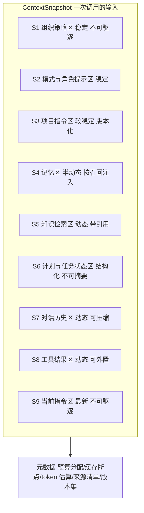
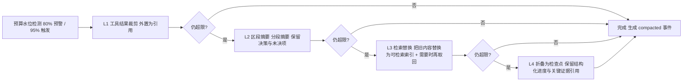
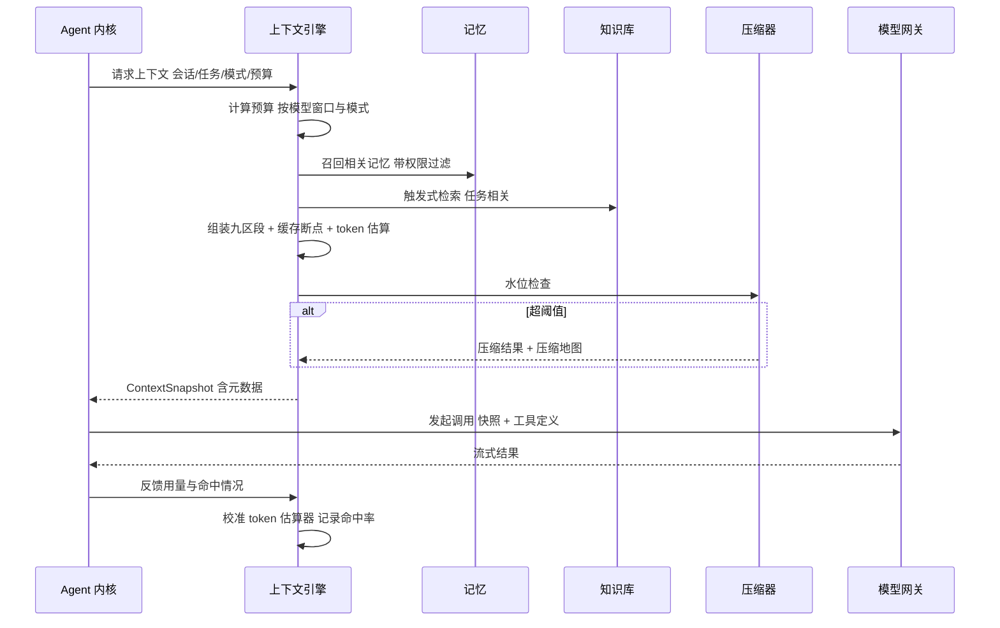

# 卷 03 · 上下文系统（Context Engine）

> 上下文是 Agent 的「工作记忆」：本卷定义上下文的**组织模型、预算模型、压缩管线、装载与检索、检查点与安全隔离**，目标是「长任务不丢关键信息、短任务不浪费预算、缓存命中率可观测」。
>
> 需求来源：REQ-CTX-1…12（卷 00 §5.3）；竞品参照：REQ-CMP-4（指令分层）、REQ-CMP-5（压缩一等机制）。

---

## 1. 本卷定位

- **解决**：每轮送给模型的上下文如何组成、超预算怎么办、如何压缩、如何注入检索结果、如何防注入。
- **不解决**：提示词资产与版本（卷 04）、记忆的写入与召回策略（卷 10）、知识库索引（卷 11）、模型侧缓存实现（卷 02）。
- **边界**：本卷产出「上下文快照（ContextSnapshot）」，作为模型调用的唯一输入形态；一切注入内容必须可溯源。

## 2. 需求与冲突点

| 需求 | 关键冲突 |
| --- | --- |
| REQ-CTX-1 分层预算 | 严格预算 vs 模型上下文窗口差异（能力矩阵驱动，卷 02） |
| REQ-CTX-2 多级压缩 | 压缩质量 vs 压缩成本（压缩本身消耗模型调用） |
| REQ-CTX-3 工具结果裁剪 | 保留信息 vs 丢失可回溯性 → 采用「引用外置 + 按需再读」 |
| REQ-CTX-5 检索增强 | 注入越多越贵、越可能引入噪声 → 需相关度门限与预算配额 |
| REQ-CTX-6 缓存亲和 | 稳定前缀 vs 内容时效（动态内容需后置） |
| REQ-CTX-12 注入安全 | 便利注入 vs 提示注入攻击面 |

## 3. 设计空间（M×N）

### D-CTX-1 上下文组织模型

| 分支 | 描述 | 结论 |
| --- | --- | --- |
| B1 扁平消息序列 | 简单，但无法精细预算与压缩（只能整体截断） | 淘汰 |
| B2 分区段（section）但无预算 | 结构清晰，超限仍只能粗暴裁剪 | 备选 |
| **B3 分层区段 + 每区段预算 + 优先级（可驱逐等级）** | 每区段独立预算、独立压缩与独立驱逐；快照可诊断、可回放 | **选定**（F=9 U=8 S=8 M=9 → 85.5） |

### D-CTX-2 压缩策略

| 分支 | 描述 | 结论 |
| --- | --- | --- |
| B1 单级摘要（把历史整体摘要） | 简单，但细节一次性丢失 | 淘汰 |
| B2 固定顺序裁剪（先删旧工具结果） | 便宜，但可能删掉关键证据 | 备选 |
| **B3 多级压缩管线：① 工具结果裁剪 → ② 区段摘要 → ③ 检索替换（把旧内容替换为可检索索引）→ ④ 折叠为检查点** | 逐级渐进，先省最廉价的空间；每级可单独触发、可观测、可撤销（保留原文引用） | **选定**（F=9 U=8 S=8 M=9 → 85.5） |

**规则**：压缩必须**保真优先**——① 用户显式指令与约束永不压缩；② 计划/任务状态永不摘要（结构化保留）；③ 未完成任务的工具证据先降级为引用，不删除。

### D-CTX-3 工具结果处理

| 分支 | 描述 | 结论 |
| --- | --- | --- |
| B1 原样入上下文 | 简单，大输出直接爆窗 | 淘汰 |
| B2 截断（取头尾） | 便宜，破坏语义 | 淘汰 |
| **B3 结果分级：小结果内联 / 大结果结构化摘要内联 + 完整内容外置为可寻址引用（可再读、可搜索、可分页）** | 既省预算又保可回溯；模型可主动「再读第 N 段」 | **选定**（F=9 U=9 S=8 M=9 → 87.5） |

### D-CTX-4 文件与代码上下文选择

| 分支 | 描述 | 结论 |
| --- | --- | --- |
| B1 仅显式 @ 指定 | 可控，但模型常缺必要背景 | 基线 |
| B2 全自动检索注入 | 便利，但噪声与成本不可控 | 淘汰 |
| **B3 混合：显式指定 + 自动候选（带相关度与理由）+ 模型可请求更多** | 用户与模型双通道；候选必须显示来源与相关度；注入量受区段预算约束 | **选定**（F=9 U=9 S=8 M=8 → 85.5） |

### D-CTX-5 检索注入时机

| 分支 | 描述 | 结论 |
| --- | --- | --- |
| B1 每轮全量预取 | 命中率高，成本高 | 淘汰 |
| B2 仅工具按需检索（模型决定） | 成本低，但模型常忘记检索 | 备选 |
| **B3 触发式预取（任务开始 / 话题切换 / 显式请求）+ 工具按需补充** | 在关键节点自动注入，其余交给模型工具调用；触发条件可配可观测 | **选定**（F=8 U=8 S=8 M=8 → 80） |

### D-CTX-6 缓存亲和编排

| 分支 | 描述 | 结论 |
| --- | --- | --- |
| B1 无编排（按逻辑顺序拼装） | 动态内容前置导致缓存频繁失效 | 淘汰 |
| **B2 稳定前缀分区（策略/项目/工具定义 → 静态内容；会话与检索 → 动态尾部）+ 缓存断点标记** | 与卷 02 的断点标记配合，最大化命中；漂移检测提示「缓存断点被破坏」 | **选定**（F=8 U=8 S=8 M=9 → 82.5） |
| B3 极致的全静态化（牺牲时效） | 命中率最高，但会话状态陈旧 | 淘汰 |

### D-CTX-7 压缩触发与人工介入

| 分支 | 描述 | 结论 |
| --- | --- | --- |
| B1 仅阈值自动触发 | 无感，但可能压缩掉用户在意内容 | 基线 |
| B2 全部人工确认 | 安全，但打断流程 | 淘汰 |
| **B3 阈值自动 + 关键节点预览（长任务/高风险任务可按策略要求确认）+ 压缩后摘要可编辑** | 默认自动保流畅；用户可回看与修正摘要（REQ-CTX-9） | **选定**（F=8 U=9 S=8 M=8 → 82.5） |

### D-CTX-8 检查点粒度

| 分支 | 描述 | 结论 |
| --- | --- | --- |
| B1 仅轮次结束 | 粒度过粗（长轮次丢进度） | 备选 |
| **B2 事件驱动（轮次结束 / N 次工具调用 / 用户介入 / 计划变更 / 压缩后）** | 恢复点密集且不冗余；检查点写入异步、幂等 | **选定**（F=8 U=8 S=9 M=8 → 83） |
| B3 每次工具调用 | 过密，写入放大 | 淘汰 |

### D-CTX-9 指令分层装载

| 分支 | 描述 | 结论 |
| --- | --- | --- |
| B1 单文件 | 简单 | 淘汰 |
| **B2 五级分层：组织策略 → 用户偏好 → 项目指令 → 目录/模块指令 → 会话临时指令** | 对齐 REQ-CMP-4；冲突按「更具体者优先、企业策略不可被覆盖」；每级来源可追溯 | **选定**（F=9 U=8 S=8 M=9 → 85.5） |
| B3 仅项目级 | 覆盖不足（多仓/多模块） | 淘汰 |

### D-CTX-10 注入安全

| 分支 | 描述 | 结论 |
| --- | --- | --- |
| B1 无差别拼接 | 攻击面最大（工具输出/网页/仓库文件均可注入指令） | 淘汰 |
| B2 关键词过滤 | 易绕过 | 淘汰 |
| **B3 可信度分级 + 来源标记 + 指令隔离（工具/外部内容一律标记为「数据，非指令」）+ 高危动作前置权限校验（卷 06 兜底）+ 检测器（可选插件）** | 多层防御：即使注入成功，越权动作仍被权限层拦截 | **选定**（F=9 U=7 S=9 M=9 → 86.5） |

### D-CTX-11 上下文可视化

| 分支 | 描述 | 结论 |
| --- | --- | --- |
| B1 不提供 | 用户无法理解成本 | 淘汰 |
| **B2 分区段占用分解 + 压缩历史 + 缓存命中标注 + 逐段来源可点开** | 支撑「成本可解释」（产品铁律 4/5）；桌面端面板 + CLI `oc context show` | **选定**（F=8 U=9 S=8 M=8 → 82.5） |

## 4. 选定方案详设

### 4.1 上下文快照结构（ContextSnapshot）

| 区段 | 默认预算占比 | 驱逐等级 | 压缩方式 | 缓存属性 |
| --- | --- | --- | --- | --- |
| S1 组织策略 | 5% | 不可驱逐 | 无 | 稳定前缀 |
| S2 模式/角色提示 | 10% | 不可驱逐 | 无（资产版本化） | 稳定前缀 |
| S3 项目指令 | 10% | 低 | 目录级裁剪 | 较稳定 |
| S4 记忆 | 5% | 中 | 按相关度截断 | 半动态 |
| S5 知识检索 | 10% | 中 | 引用化 | 动态尾部 |
| S6 计划/任务状态 | 5% | 不可驱逐 | 无（结构化） | 动态 |
| S7 对话历史 | 30% | 高 | 多级压缩主体 | 动态 |
| S8 工具结果 | 20% | 高 | 外置引用 + 摘要 | 动态 |
| S9 当前指令 | 5% | 不可驱逐 | 无 | 尾部 |

> 比例是默认值，按模式（编码/计划/审查/研究）与模型窗口自动缩放；用户与租户可覆盖。

### 4.2 压缩管线

**压缩保真规则**（不可违反）：
1. 用户显式约束、验收标准、安全策略永不压缩；
2. 计划/任务结构（ID、状态、依赖）结构化保留，不做自然语言摘要；
3. 未验证的假设与未完成结论必须标注状态（`unverified`）；
4. 每次压缩产出「压缩地图」（哪段被替换成什么），支持回看与撤销。

### 4.3 组装与调用时序

### 4.4 token 估算与校准

| 机制 | 说明 |
| --- | --- |
| 估算器 | 按模型分词器族近似（内置族表 + 字符启发式兜底）；插件可替换 |
| 校准 | 每次调用后用真实 `Usage` 反推偏差系数，按模型/区段滚动更新 |
| 安全余量 | 估算值 × 1.1 + 固定余量用于触发压缩，避免超限失败 |
| 外置阈值 | 单工具结果 > 4k token 默认外置；可在策略中调整 |

### 4.5 引用外置（Artifact 引用模型）

| 类型 | 表示 | 再读方式 |
| --- | --- | --- |
| 工具大输出 | `artifact://tool-call/<id>#section=n` | 工具 `read_artifact` 分页读取或子 Agent 摘要 |
| 文件片段 | `file://<workspace>/<path>#L120-L260` | 读文件工具 + 行范围 |
| 检索结果 | `kb://<docId>#chunk=n` | 知识检索工具定向取回 |
| 会话历史段 | `checkpoint://<session>/<seq>` | 历史检索工具（全文/语义） |

**设计要点**：外置内容仍受权限与租户约束；引用 ID 不含敏感信息；再读时重新鉴权（防越权借旧引用）。

### 4.6 检查点结构

| 字段 | 说明 |
| --- | --- |
| `checkpointId` / `sessionId` / `seq` | 定位 |
| 计划与任务快照 | 结构化（卷 14 模型） |
| 工作区版本指针 | 提交/暂存/Dirty 摘要（卷 21） |
| 上下文摘要 | 分区段摘要（含压缩地图引用） |
| 未决问题列表 | 需人工输入项 |
| 预算消耗 | token/成本/时间 |
| 工具副作用账本 | 已发生的非幂等动作（防重放重复执行） |

## 5. 扩展点（供卷 18 汇总）

| 扩展点 | 说明 |
| --- | --- |
| `TokenizerEstimatorSPI` | 自定义 token 估算 |
| `SectionProviderSPI` | 自定义区段贡献者（如企业内部规范注入） |
| `CompressorSPI` | 自定义压缩器（如企业私有摘要模型） |
| `RetrievalAugmentorSPI` | 自定义检索注入源 |
| `InjectionDetectorSPI` | 注入检测器（规则/模型/混合） |
| `ContextViewSPI` | 自定义可视化视图（桌面端面板） |

## 6. 事件与可观测

| 事件 | 载荷 | 消费者 |
| --- | --- | --- |
| `context.assembled` | 区段 token 明细、缓存断点数、来源清单、版本集 | 前端可视化、成本分析 |
| `context.compacted` | 触发级别、前后 token、压缩地图引用、耗时 | 审计、质量分析 |
| `context.budget.exceeded` | 超限区段与策略决策 | 告警、调优 |
| `context.retrieval.injected` | 来源、条数、相关度分布 | 质量分析 |
| `context.reference.read` | 引用再读（谁、何权限） | 审计 |
| `context.injection.detected` | 检测器结论与处置 | 安全审计 |

**指标**：`oc_context_snapshot_tokens{section}`、`oc_context_compaction_total{level}`、`oc_context_cache_breakpoints`、`oc_context_retrieval_precision`（人工抽样）、`oc_context_reference_read_total`。

## 7. 非功能设计

- **性能**：组装 ≤ 80ms（P95，不含检索 IO）；检索并行发起；压缩异步不阻塞流式输出（NFR-P-10）。
- **成本**：压缩本身使用模型调用 → 默认使用低成本模型档；压缩调用同样计量（可在预算中单列）。
- **一致性**：快照与事件序号绑定，可复现同一轮次的上下文（审计与回放要求）。
- **安全**：所有外部内容带来源标记；注入检测与权限层双保险；引用再读重新鉴权。
- **多模型适配**：同一快照可投射到不同模型（窗口/缓存/模态不同），投射过程不修改快照本体。

## 8. 完成定义（DoD）

- [ ] 九区段模型与预算表在实现中有对应结构与配置；每个区段有独立测试。
- [ ] 压缩四级各有单测与「保真规则」断言（用户约束不被压缩等）。
- [ ] 长任务回归：10 万 token 会话在压缩后仍能正确回答初始约束类问题（评测项）。
- [ ] 引用外置与再读链路端到端可用，且再读鉴权有效（越权用例被拒绝）。
- [ ] 缓存断点稳定：同一会话连续 5 轮，前缀断点位置稳定（除内容变更外）。
- [ ] 上下文可视化能逐段显示 token 与来源，且与真实用量误差 ≤ 10%。
- [ ] 注入安全：内置攻击用例集（10 类）全部被拦截或降级为数据。

## 9. 域内决策汇总（D-CTX）

| ID | 主题 | 选定 |
| --- | --- | --- |
| D-CTX-1 | 组织模型 | 分层区段 + 每段预算 + 驱逐等级 |
| D-CTX-2 | 压缩策略 | 四级压缩管线 |
| D-CTX-3 | 工具结果 | 分级内联 + 外置引用 + 可再读 |
| D-CTX-4 | 上下文选择 | 显式 + 自动候选（带理由）混合 |
| D-CTX-5 | 检索时机 | 触发式预取 + 工具按需补充 |
| D-CTX-6 | 缓存亲和 | 稳定前缀分区 + 断点标记 |
| D-CTX-7 | 压缩介入 | 自动 + 关键节点预览 + 摘要可编辑 |
| D-CTX-8 | 检查点 | 事件驱动（轮次/N 工具/介入/计划变更/压缩后） |
| D-CTX-9 | 指令装载 | 五级分层，企业策略不可覆盖 |
| D-CTX-10 | 注入安全 | 可信度分级 + 隔离标记 + 权限兜底 + 检测器 |
| D-CTX-11 | 可视化 | 区段分解 + 压缩历史 + 来源可点开 |

## 10. 开放问题与默认决策

| 项 | 默认决策 |
| --- | --- |
| 压缩模型选择 | 默认取「会话模型的低成本同厂档」；缺失时用默认快模型 |
| 历史检索工具 | 作为内置工具提供（卷 05），默认开启 |
| 区段预算用户可调范围 | 允许调整 S4/S5/S7/S8，其余固定（保证策略与安全区不被挤出） |
| 多仓场景 | 项目指令按「主仓 + 关联仓」聚合，冲突按声明顺序 |
