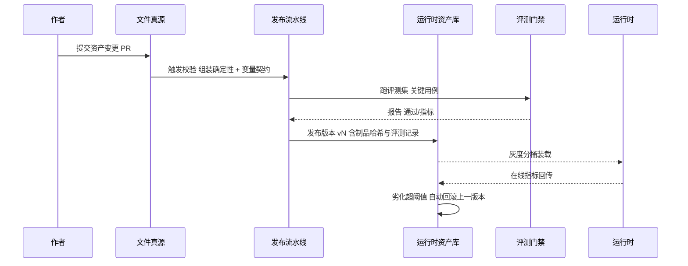

# 卷 04 · 提示词管理系统（Prompt System）

> 提示词是 Agent 行为的「源代码」：本卷定义提示词**资产模型、组装流水线、版本与发布、覆盖与灰度、安全护栏、评测绑定**，让提示词可评审、可回滚、可解释。
>
> 需求来源：REQ-PRM-1…12（卷 00 §5.4）；全局约束：H-013（版本化资产 + 组合式组装）。

---

## 1. 本卷定位

- **解决**：Agent 的人格与规则从哪来、怎么组合、怎么改、怎么验证、怎么回滚。
- **不解决**：上下文区段预算与压缩（卷 03）；记忆内容（卷 10）；知识内容（卷 11）；模型参数（卷 02）。
- **边界**：提示词系统产出「已渲染的提示词片段 + 溯源元数据」，由上下文引擎装配进快照（S1/S2/S9 区段）。

## 2. 需求分解

| 需求 | 设计含义 |
| --- | --- |
| REQ-PRM-1 资产模型 | 需要区分「片段（片段文本）」「模板（带变量）」「策略（规则与约束）」「角色（人格与能力边界）」「模式（任务类型行为）」 |
| REQ-PRM-2 组装流水线 | 组装必须是**确定性函数**：同样输入 → 同样输出（含 hash），便于复现与评测 |
| REQ-PRM-3 变量与条件 | 变量需类型（字符串/枚举/列表/结构化）与默认值；条件需可解释 |
| REQ-PRM-4/6 版本与回滚 | 会话必须记录「使用了哪套提示词版本」，否则无法复现历史行为 |
| REQ-PRM-5 灰度 | 分桶必须稳定；指标劣化自动回滚 |
| REQ-PRM-7 多租户覆盖 | 企业策略 > 项目 > 用户；不可覆盖项需显式声明 |
| REQ-PRM-8 评测绑定 | 资产发布前必须通过评测集（卷 26 门禁） |
| REQ-PRM-11 安全护栏 | 护栏本身是提示词资产的一部分，且不可被用户资产覆盖 |

## 3. 设计空间（M×N）

### D-PRM-1 资产模型

| 分支 | 描述 | 结论 |
| --- | --- | --- |
| B1 单一大提示词文件 | 简单，无法复用与差异化 | 淘汰 |
| B2 模板文件集合（每角色一个文件） | 结构稍好，仍难组合 | 备选 |
| **B3 五类资产：片段 / 模板 / 策略 / 角色 / 模式，均带元数据与作用域** | 组合自由度高；片段可跨模板复用（如「提交规范」「安全边界」） | **选定**（F=9 U=7 S=8 M=9 → 83.5） |

### D-PRM-2 组装机制

| 分支 | 描述 | 结论 |
| --- | --- | --- |
| B1 字符串拼接 | 不可控、易错 | 淘汰 |
| B2 通用模板引擎（如字符串模板语法） | 表达力强，但注入与安全风险（表达式可执行） | 淘汰 |
| **B3 结构化组装器：资产 AST + 阶段化流水线 + 变量契约校验（无任意表达式执行）** | 确定性、可校验、可插桩、可 diff；渲染结果带溯源块 | **选定**（F=9 U=8 S=9 M=9 → 88） |

### D-PRM-3 版本与真源

| 分支 | 描述 | 结论 |
| --- | --- | --- |
| B1 仅文件（Git 真源） | 可评审、可回溯；但运行时无灰度与多租户覆盖能力 | 基线 |
| B2 仅数据库资产 | 支持灰度与覆盖；但评审体验差、易腐化 | 淘汰 |
| **B3 双源模型：文件为「开发真源」，发布到「运行时资产库」（带版本号与制品哈希）** | 开发期评审（PR）→ 发布产物 → 运行时按版本装载；两处可对照（漂移检测） | **选定**（F=9 U=8 S=8 M=9 → 85.5） |

### D-PRM-4 覆盖与继承

| 分支 | 描述 | 结论 |
| --- | --- | --- |
| B1 后加载覆盖前者（无规则） | 冲突不可预期 | 淘汰 |
| **B2 作用域继承链 + 显式覆盖声明 + 不可覆盖清单** | 组织策略与安全护栏不可被覆盖；覆盖关系可查询（「为什么这条生效」） | **选定**（F=9 U=8 S=8 M=9 → 85.5） |
| B3 完全隔离（每作用域独立） | 复用差 | 淘汰 |

### D-PRM-5 灰度与 A/B

| 分支 | 描述 | 结论 |
| --- | --- | --- |
| B1 无灰度 | 风险高 | 淘汰 |
| **B2 稳定分桶（租户/项目/会话哈希）+ 指标门控 + 自动回滚** | 与 D-MDL-13 同构；评测与在线指标双门槛 | **选定**（F=8 U=7 S=9 M=8 → 80.5） |
| B3 灰度但无门控 | 需人工盯盘 | 淘汰 |

### D-PRM-6 变量与条件

| 分支 | 描述 | 结论 |
| --- | --- | --- |
| B1 自由文本替换 | 易注入 | 淘汰 |
| **B2 类型化变量 + 条件块（声明式谓词）+ 缺失变量 Fail-Fast** | 变量来源受限（内核上下文/环境/配置），不允许来自工具输出原文（防注入） | **选定**（F=8 U=8 S=9 M=8 → 82.5） |
| B3 允许任意表达式 | 灵活，安全风险大 | 淘汰 |

### D-PRM-7 调试与预览

| 分支 | 描述 | 结论 |
| --- | --- | --- |
| B1 无 | 排障困难 | 淘汰 |
| **B2 渲染预览（含逐段来源与变量注入）+ 与上一版本 diff + 在会话中对比** | 桌面端面板 + CLI 预览命令 | **选定**（F=8 U=9 S=8 M=8 → 82.5） |
| B3 仅导出文本 | 体验一般 | 淘汰 |

### D-PRM-8 安全护栏

| 分支 | 描述 | 结论 |
| --- | --- | --- |
| B1 无独立护栏资产 | 靠人写 | 淘汰 |
| **B2 内建护栏层：越权防护（与卷 06 呼应）/ 注入防护（与卷 03 呼应）/ 泄密防护（与卷 07 呼应）+ 语言与风格约束** | 护栏在组装流水线的固定位置注入，不可被覆盖；可通过策略增补（增补同样过评测） | **选定**（F=9 U=7 S=9 M=9 → 86.5） |

### D-PRM-9 多语言

| 分支 | 描述 | 结论 |
| --- | --- | --- |
| B1 单语言资产 | 出海受限 | 淘汰 |
| **B2 资产多语言变体 + 缺省回退链（zh-CN → en-US → 默认）** | 与 UI 语言解耦（模型回答语言由会话设置决定） | **选定**（F=8 U=8 S=8 M=8 → 80） |

### D-PRM-10 分发与共享

| 分支 | 描述 | 结论 |
| --- | --- | --- |
| B1 不共享 | 组织内重复劳动 | 淘汰 |
| **B2 组织内资产库（模板/角色/模式可发布为可复用资产，带署名与评测记录）** | 生态基础；企业可私有部署 | **选定**（F=8 U=8 S=8 M=8 → 80） |

## 4. 选定方案详设

### 4.1 资产模型

| 资产类型 | 作用 | 关键字段 |
| --- | --- | --- |
| Fragment 片段 | 可复用文本单元（规则、规范、示例） | id、文本、标签、适用模式、语言、变量、优先级、不可覆盖标记 |
| Template 模板 | 由片段与文本组合出的结构 | id、引用片段、结构（有序块）、变量契约、条件块 |
| Policy 策略 | 行为约束（何时必须做/禁止做） | 规则列表（谓词 + 动作）、作用域、强制级别 |
| Role 角色 | 人格与能力边界（如「架构评审者」「测试工程师」） | 名称、语气、能力声明、允许工具集、默认模式 |
| Mode 模式 | 任务类型的行为装配（编码/计划/审查/调试/研究/设计） | 引用的角色与模板、默认权限模式、上下文预算覆盖、工具集覆盖 |

### 4.2 组装流水线（五阶段）

**溯源块**：渲染结果中每个片段以不可见注释锚点标记（`<!--seg:id@version-->`），供：
① 上下文可视化区分来源；② 事后解释「这条规则来自哪个资产」；③ 评测时按片段定位劣化来源。

### 4.3 版本、发布与回滚

### 4.4 覆盖优先级（冲突解析）

| 层级 | 说明 | 可否被覆盖 |
| --- | --- | --- |
| L0 安全护栏 | 越权/注入/泄密防护 | **不可** |
| L1 组织策略 | 企业规范、合规要求 | 仅组织管理员 |
| L2 项目资产 | 仓库内声明的规范与角色 | 用户可覆盖 |
| L3 用户偏好 | 个人风格与语言 | 项目可收窄 |
| L4 会话临时 | 本次会话特殊指令 | 最高优先级（但不越过 L0/L1 的强制项） |

**解析规则**：同键冲突按「具体者覆盖宽泛者」；强制项（`enforced: true`）不被下级覆盖，冲突时生成 `prompt.override.denied` 事件并在界面提示。

### 4.5 与上下文引擎的接口

| 接口 | 方向 | 内容 |
| --- | --- | --- |
| `PromptAssemblyRequest` | 上下文引擎 → 提示词系统 | 模式、角色、语言、作用域链、变量集、预算提示 |
| `PromptArtifact` | 提示词系统 → 上下文引擎 | 渲染文本、溯源锚点、制品哈希、版本集合（供会话记录） |
| `PromptVersionSet` | 会话元数据 | 用于复现与审计（「这次回答用的是哪套提示词」） |

## 5. 扩展点（供卷 18 汇总）

| 扩展点 | 说明 |
| --- | --- |
| `AssetSourceSPI` | 资产来源（文件/数据库/远程资产库/插件内置） |
| `FragmentProviderSPI` | 动态片段提供者（如注入当前环境信息） |
| `PolicyRuleSPI` | 自定义策略谓词与动作 |
| `AssemblyStageSPI` | 组装流水线扩展阶段（企业自定义校验） |
| `EvalHookSPI` | 发布前后评测挂钩 |

## 6. 事件与可观测

| 事件 | 说明 |
| --- | --- |
| `prompt.asset.published` | 新版本发布（含哈希、评测结论） |
| `prompt.asset.rolled_back` | 自动/手动回滚（含原因与指标） |
| `prompt.assembled` | 每次组装（版本集合、哈希、片段数、耗时） |
| `prompt.override.denied` | 覆盖被拒绝（安全护栏或组织策略） |
| `prompt.gray.assigned` | 分桶结果（用于复现） |
| `prompt.drift.detected` | 文件真源与运行时库漂移 |

**指标**：`oc_prompt_assembly_latency_ms`、`oc_prompt_artifact_hash_mismatch_total`、`oc_prompt_gray_metric{arm}`、`oc_prompt_rollback_total`。

## 7. 非功能设计

- **性能**：组装 ≤ 30ms（P95，含缓存）；产物哈希缓存命中率 ≥ 95%（相同输入同输出）。
- **确定性**：同一 `(版本集, 变量集, 作用域链)` 必须产生字节级一致的产物（用于复现与缓存）。
- **安全**：变量值一律转义；变量来源白名单；护栏不可覆盖；资产发布需签名（企业档）。
- **多租户**：资产按租户隔离；组织资产可被下级引用但不可修改；跨租户共享需显式导出/导入。

## 8. 完成定义（DoD）

- [ ] 五类资产模型落地，且片段可跨模板复用（示例：同一「安全边界」片段被 3 个模式引用）。
- [ ] 流水线确定性验证：随机 100 组输入重复渲染，产物哈希一致。
- [ ] 覆盖规则 L0–L4 有完整冲突用例（含 `override.denied`）。
- [ ] 发布会话记录 `PromptVersionSet`，任意历史会话可一键查看当时提示词版本。
- [ ] 灰度分桶稳定且指标门控可自动回滚（演练用例）。
- [ ] 安全护栏在 10 类攻击用例下不被绕过。
- [ ] 调试预览与 diff 可用（桌面端 + CLI 各一条命令路径）。

## 9. 域内决策汇总（D-PRM）

| ID | 主题 | 选定 |
| --- | --- | --- |
| D-PRM-1 | 资产模型 | 五类资产（片段/模板/策略/角色/模式） |
| D-PRM-2 | 组装机制 | 结构化组装器（无表达式执行） |
| D-PRM-3 | 版本真源 | 文件真源 + 运行时资产库双源 |
| D-PRM-4 | 覆盖继承 | 作用域继承 + 不可覆盖清单 |
| D-PRM-5 | 灰度 | 稳定分桶 + 指标门控 + 自动回滚 |
| D-PRM-6 | 变量条件 | 类型化变量 + 声明式条件 + Fail-Fast |
| D-PRM-7 | 调试 | 渲染预览 + 版本 diff + 会话对比 |
| D-PRM-8 | 安全护栏 | 内建护栏层（不可覆盖） |
| D-PRM-9 | 多语言 | 变体 + 回退链 |
| D-PRM-10 | 分发 | 组织内资产库（可私有部署） |

## 10. 开放问题与默认决策

| 项 | 默认决策 |
| --- | --- |
| 资产文件格式 | 默认 Markdown + YAML 头（人可读、可 diff）；结构化资产用 YAML |
| 是否允许用户自定义「模式」 | 允许（用户级模式仅影响自身会话，且不得削弱 L0/L1） |
| 评测集门槛 | 发布必须跑「核心用例集」，通过率不得低于上一版本（卷 26 定义） |
| 资产库存储 | 运行时库落 PostgreSQL（带版本表）；local-lite 形态落本地文件库（同接口） |
