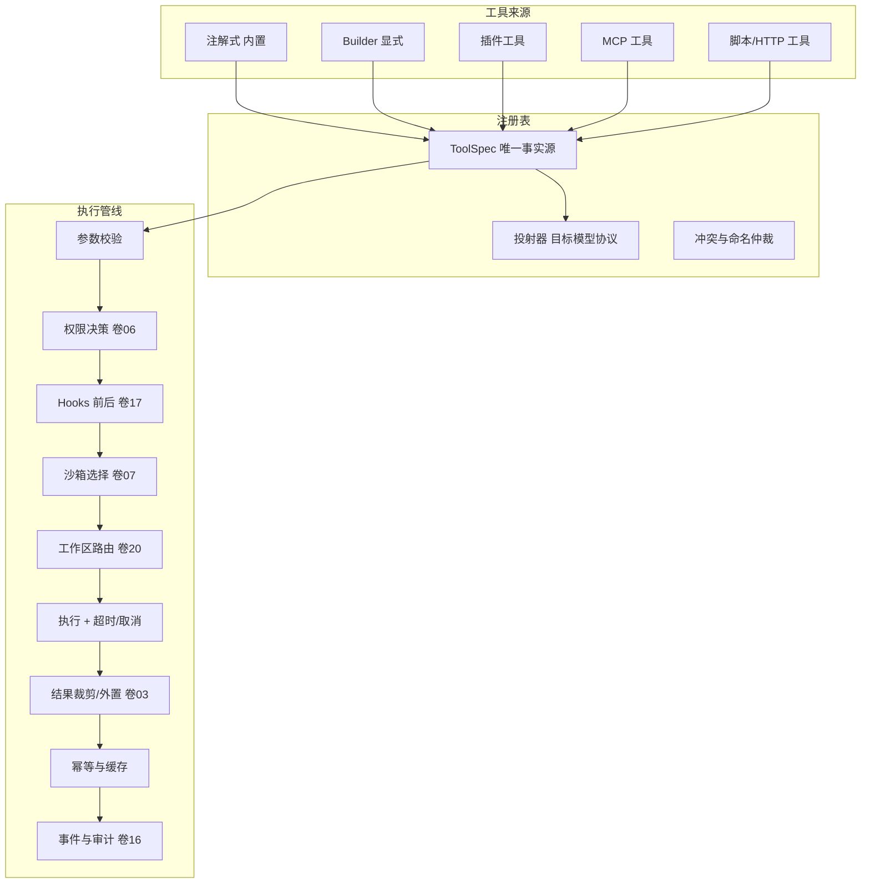
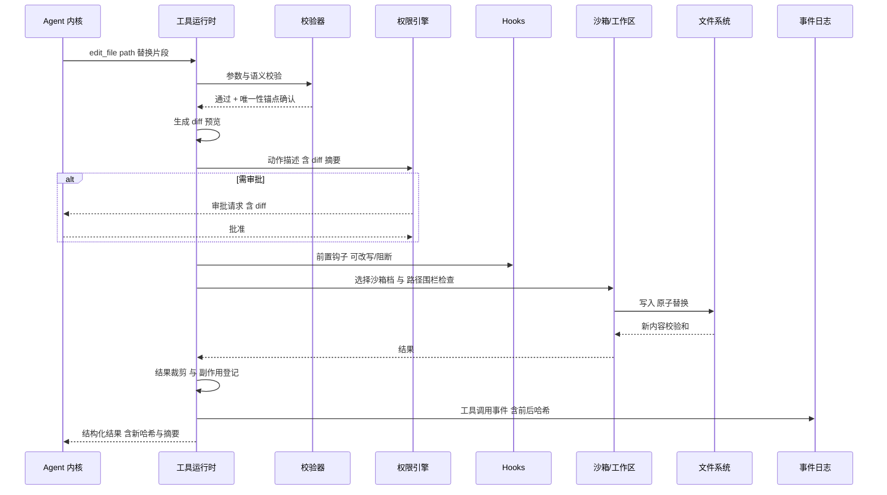

# 卷 05 · 工具系统（Tool Runtime）

> 工具是 Agent 的「手脚」：本卷定义工具的**契约三通道、Schema 单一事实源、执行管线、并发与冲突模型、结果与外置策略、内置工具族、外部工具接入与工具生态**。
>
> 需求来源：REQ-TOOL-1…18（卷 00 §5.5）；全局约束：H-014（单一语义契约 + 多协议投射 + 三段校验）、REQ-INT-8。

---

## 1. 本卷定位

- **解决**：工具如何被声明、注册、校验、调度、执行、裁剪、回喂；内置与外部工具如何统一。
- **不解决**：权限判定（卷 06）、沙箱实现（卷 07）、工作区/文件系统后端（卷 20）、MCP 协议（卷 09）。
- **边界**：工具运行时是**唯一**能触发副作用的内核组件；所有副作用必须经它进出。

## 2. 需求与冲突点

| 需求 | 冲突/要点 |
| --- | --- |
| REQ-TOOL-1 契约 Fail-Fast | 注册期失败优于运行期失败 → 所有类型/命名/描述问题在启动期拒绝 |
| REQ-TOOL-2 单一管线 | 任何工具（内置/MCP/插件/脚本）走同一条管线，不允许旁路 |
| REQ-TOOL-3 并发安全 | 读可并行、写必须串行 → 需要**资源冲突模型** |
| REQ-TOOL-5 精确编辑 | 大文件不能整体重写 → 差异化编辑 + 校验 |
| REQ-TOOL-6 大仓检索 | 纯内存扫描不可行 → 依赖索引（卷 11）与增量 |
| REQ-TOOL-11 代码理解 | LSP 式查询与简单 grep 的能力分层 |
| REQ-TOOL-16 错误回喂 | 错误必须「可被模型修复」，而非仅报错 |

## 3. 设计空间（M×N）

### D-TOOL-1 工具声明形态

| 分支 | 描述 | 结论 |
| --- | --- | --- |
| B1 仅注解式 | 书写友好，但动态/外部工具无法表达 | 备选 |
| B2 仅显式 Schema（手写 JSON Schema） | 表达完整，但重复且易漂移 | 备选 |
| **B3 三通道：① 注解式（内置首选）② 显式 Builder（复杂工具）③ 外部声明（MCP/插件/脚本，运行期注册）** | 覆盖全部来源；三通道产出同一种 `ToolSpec`（唯一事实源） | **选定**（F=9 U=8 S=9 M=9 → 88） |

### D-TOOL-2 Schema 与投射

| 分支 | 描述 | 结论 |
| --- | --- | --- |
| B1 每个厂商各写工具描述 | 维护爆炸 | 淘汰 |
| **B2 单一 `ToolSpec` + 多协议投射器 + canonical 子集校验（发送前降级、运行期强校验）** | 与 H-014 一致；不同模型协议能力差异（如不支持 enum/嵌套）在投射期处理 | **选定**（F=9 U=8 S=8 M=9 → 85.5） |
| B3 只支持最简 schema 子集 | 表达力受限 | 淘汰 |

### D-TOOL-3 执行模型

| 分支 | 描述 | 结论 |
| --- | --- | --- |
| B1 全同步阻塞 | 简单；长任务阻塞循环 | 备选 |
| B2 全异步任务化 | 复杂；短任务开销大 | 淘汰 |
| **B3 混合：默认同步（虚拟线程阻塞）；超过阈值的任务转后台任务（返回任务句柄，可选等待/轮询/通知）** | 交互简单 + 长任务不阻塞；后台任务纳入卷 14 工作对象模型 | **选定**（F=9 U=9 S=8 M=8 → 85.5） |

### D-TOOL-4 并发与冲突模型

| 分支 | 描述 | 结论 |
| --- | --- | --- |
| B1 全串行 | 安全，慢（读文件也被串行） | 淘汰 |
| B2 全并行 | 快，写冲突与命令竞争导致数据损坏 | 淘汰 |
| **B3 资源声明 + 冲突图调度：工具声明其资源（文件路径、目录、git 索引、端口、工作区全局锁…）；调度器按冲突图决定并行或串行** | 读并行、写串行、跨工作区并行；冲突检测可解释 | **选定**（F=9 U=8 S=9 M=9 → 88） |

### D-TOOL-5 结果处理

| 分支 | 描述 | 结论 |
| --- | --- | --- |
| B1 原样回喂 | 爆窗 | 淘汰 |
| **B2 分级：小内联 / 大结构化摘要 + 外置引用（与卷 03 引用模型一致）/ 二进制仅存路径与元数据** | 保真与预算兼得 | **选定**（F=9 U=8 S=8 M=9 → 85.5） |
| B3 统一截断 | 丢信息 | 淘汰 |

### D-TOOL-6 工具集装配

| 分支 | 描述 | 结论 |
| --- | --- | --- |
| B1 全量暴露（所有工具都给模型） | 简单；但工具列表本身吃上下文并降低选择准确率 | 淘汰 |
| **B2 模式驱动子集 + 工具组按需加载（deferred loading）+ 语义检索工具发现** | 每模式暴露核心集；长尾工具通过「工具检索」或分组激活；工具列表 token 可控 | **选定**（F=9 U=8 S=8 M=8 → 83） |
| B3 全量 + 模型自选 | 同 B1 问题 | 淘汰 |

### D-TOOL-7 内置工具粒度

| 分支 | 描述 | 结论 |
| --- | --- | --- |
| B1 大而全的复合工具（如 `do_everything`） | 模型难用、权限难分级、审计粒度差 | 淘汰 |
| **B2 单一职责工具 + 显式组合宏（宏对权限透明，逐步展开为原子调用）** | 权限与审计按原子粒度；组合通过宏与 Agent 计划实现 | **选定**（F=9 U=8 S=8 M=9 → 85.5） |

### D-TOOL-8 文件编辑策略

| 分支 | 描述 | 结论 |
| --- | --- | --- |
| B1 整文件覆盖写 | 简单；大文件昂贵且易丢内容 | 淘汰 |
| B2 仅字符串替换 | 便宜；易歧义（多处匹配） | 备选 |
| **B3 多形态编辑：精确片段替换（含上下文锚点与唯一性校验）/ 结构化补丁（带行号与校验和）/ 整文件写（小文件或新建）+ 写后校验（语法/格式/差异预览）** | 覆盖不同编辑场景；写前预览用于审批（REQ-TOOL-12） | **选定**（F=9 U=9 S=8 M=9 → 88） |

### D-TOOL-9 错误语义

| 分支 | 描述 | 结论 |
| --- | --- | --- |
| B1 原始异常文本 | 模型难以恢复 | 淘汰 |
| **B2 结构化错误：类别 + 人类可读信息 + 修复建议 + 可重试性 + 相关引用（如正确路径候选/相似符号）** | 全部回喂给模型（不抛炸循环）；同一工具同一错误连续 N 次触发策略（提示/换路/求援） | **选定**（F=9 U=9 S=8 M=9 → 88） |
| B3 抛异常终止轮次 | 体验差 | 淘汰 |

### D-TOOL-10 幂等与缓存

| 分支 | 描述 | 结论 |
| --- | --- | --- |
| B1 无 | 重放/重试会重复副作用 | 淘汰 |
| **B2 只读工具结果缓存（按参数 + 工作区版本键）+ 写工具幂等键（重放时跳过已发生副作用）** | 支撑 D-ARC-6 幂等重放；缓存命中生成事件 | **选定**（F=8 U=8 S=9 M=8 → 83） |
| B3 全量缓存 | 语义错误风险 | 淘汰 |

### D-TOOL-11 外部工具接入

| 分支 | 描述 | 结论 |
| --- | --- | --- |
| B1 各自适配 | 分裂 | 淘汰 |
| **B2 统一经 `ToolSpec` 注册（MCP 工具、插件工具、脚本工具、HTTP 工具皆同构），共享管线与权限** | 一处治理 | **选定**（F=9 U=8 S=8 M=9 → 85.5） |

### D-TOOL-12 工具生态

| 分支 | 描述 | 结论 |
| --- | --- | --- |
| B1 无生态 | 扩展靠核心 | 淘汰 |
| **B2 工具包（bundle）：可版本化、可签名、可声明权限与资源需求、可市场分发；支持组织内私有仓库** | 与卷 18 插件体系共用打包与签名机制 | **选定**（F=8 U=8 S=8 M=9 → 82.5） |

## 4. 选定方案详设

### 4.1 契约三段模型

| 段 | 内容 | 时机 |
| --- | --- | --- |
| 声明（Spec） | 名称、描述（提示词文案）、参数 Schema（canonical）、返回 Schema、风险标注、资源需求、并发语义、超时与限额、幂等策略、能力需求（视觉/网络/沙箱档） | 注册期生成，Fail-Fast |
| 绑定（Binding） | 参数绑定与类型转换、执行体（Java 方法 / 进程脚本 / MCP 调用 / HTTP 调用）、上下文注入（工作区、预算、取消令牌） | 注册期生成 |
| 校验（Validate） | 运行期参数强校验（类型/范围/枚举/嵌套深度/大小）+ 语义校验（路径存在性、权限预检）+ 结果结构校验 | 每次调用 |

### 4.2 执行管线（固定顺序，不可跳过）

**顺序铁律**（与卷 17 §4.3 一致）：① 改写类钩子必须先于权限决策（改写后按**最终形态**鉴权，防止绕过）；② 权限决策后只允许**观察类**钩子；③ 结果脱敏必须先于结果裁剪与外置（防止脱敏遗漏）；④ 幂等与事件写入必须先于回喂（先落账再回喂）。

| 步骤 | 说明 | 失败行为 |
| --- | --- | --- |
| 1 定位与解析 | 工具名/别名解析（含模型幻觉名 → 相似名建议） | 回喂结构化错误（含候选名） |
| 2 参数校验 | 类型/必填/范围/深度/大小；语义预校验 | 回喂校验错误（含字段级信息） |
| 3 Hooks 前置（`tool.call.before`） | 可阻断、可改写参数（改写字段白名单，卷 17 D-HOOK-3） | 阻断 → 回喂原因 |
| 4 权限决策 | 基于**改写后**的动作生成 `ActionDescriptor` 交卷 06 | DENY → 回喂拒绝原因；ASK → 进入审批 |
| 5 Hooks 权限后（`permission.decision.after`） | **仅观察**（记录/通知），可参与审计但不可放宽权限 | 失败仅告警 |
| 6 沙箱与工作区路由 | 依风险与策略选隔离档；解析目标工作区 | 不可用 → 显式错误 + 降级建议 |
| 7 执行 | 超时、取消传播、输出流限量、资源限制 | 超时/取消 → 结构化结果 |
| 8 结果处理 | 顺序固定：Hooks 结果改写（`tool.result.before`，白名单字段）→ 结构校验 → **脱敏** → 裁剪/外置 | 结构不符 → 结构化错误 |
| 9 幂等与缓存 | 写工具登记副作用账本；只读工具写缓存 | — |
| 10 事件与审计 | 调用开始/结束/耗时/用量/决策引用（含改写 diff） | 事件失败仅告警 |
| 11 Hooks 后置（`tool.call.after`） | 观察/通知/格式化等追加处理 | 失败仅告警 |

### 4.3 内置工具族（v1 目标清单）

| 工具族 | 工具 | 风险级 | 资源声明 | 说明 |
| --- | --- | --- | --- | --- |
| 文件读取 | `read_file`（含行范围/大文件分页）、`list_dir`、`file_stat` | 读 | 路径(读) | 支持二进制识别与图片返回引用 |
| 文件写入 | `write_file`（新建/覆盖，小文件）、`edit_file`（片段替换 + 唯一性校验）、`apply_patch`（结构化补丁）、`move_path`、`delete_path` | 写 | 路径(写) | 写前生成 diff 供预览/审批 |
| 搜索 | `glob_files`、`grep_search`（正则/上下文行/分页）、`find_symbol`（符号索引）、`semantic_search`（代码语义） | 读 | 工作区(读) | 大仓走索引（卷 11），索引缺失自动降级并留痕 |
| 命令 | `run_command`（一次性）、`start_process`（长任务/后台）、`pty_session`（交互式）、`kill_process`、`read_process_output` | 执行 | 进程/端口/工作区(执行) | 与卷 07 沙箱、卷 20 工作区联动 |
| 版本控制 | `git_status/diff/log/branch/commit/checkout/stash/merge/rebase/worktree_*` | 执行/写 | Git 索引/工作区 | 危险操作（reset --hard、push --force）风险级提升 |
| 代码质量 | `run_tests`、`run_build`、`run_linter`、`format_code` | 执行 | 工作区(执行) | 结果结构化（失败用例/位置） |
| 任务与计划 | `task_create/update/list`、`plan_update`、`goal_update`、`todo_write` | 元操作 | 会话状态 | 与卷 14/15 同源模型 |
| 协作 | `ask_user`（结构化选项）、`request_approval`（显式）、`delegate_subagent`（卷 12）、`team_message`（卷 13） | 元操作/读 | 会话 | 交互类工具在无界面形态降级为阻塞等待或拒绝 |
| 检索与记忆 | `kb_search`、`memory_recall`、`memory_write`、`read_artifact`、`history_search` | 读/写 | 知识/记忆 | 记忆写入受策略约束（卷 10） |
| 网络 | `web_fetch`、`web_search`、`download` | 外发 | 网络 | 默认受网络策略限制（卷 07），带域名白名单与审计 |
| 多模态 | `view_image`、`extract_document`（PDF/表格/字幕）、`screenshot`（前沿） | 读 | 媒体 | 输出为结构化摘要 + 媒体引用 |
| 诊断 | `diagnose_env`、`capability_report`、`context_report` | 读 | 无 | 支撑可解释性（产品铁律 5） |

> 工具总量按模式动态装配（D-TOOL-6）：编码模式暴露核心 18–24 个；其余通过工具组激活或检索发现。

### 4.4 并发冲突矩阵（节选）

| 组合 | 判定 | 说明 |
| --- | --- | --- |
| 读 + 读（不同路径） | 并行 | 默认 |
| 读 + 读（同路径） | 并行（共享缓存） | — |
| 写 + 写（同路径） | 串行（按调用序号） | 避免丢更新 |
| 写 + 读（同路径） | 串行 | 读必须在写前后一致点执行 |
| 命令 + 命令（同工作区） | 默认并行，若声明 `workspaceLock` 则串行 | 例子：`git checkout` 声明索引锁 |
| 不同工作区任意组合 | 并行 | 跨仓并行是 Teams 的基础（卷 13） |
| 外发网络类 | 受并发上限约束 | 防雪崩 |

### 4.5 一次编辑类工具调用的时序

### 4.6 结果裁剪策略

| 结果类型 | 策略 |
| --- | --- |
| 文本 < 4k token | 内联 |
| 文本 ≥ 4k token | 外置 + 结构化头部（计数、范围、关键行） |
| 表格/JSON | 结构保留 + 行数超限转外置（提供分页读取） |
| 二进制/图片 | 媒体引用 + 元数据（尺寸/类型）；模型支持视觉时可选择内联（受预算） |
| 命令输出 | 退出码 + 尾部 N 行 + 错误摘录；完整日志外置（可用 `read_process_output` 分页） |
| 测试结果 | 结构化（通过/失败/跳过计数 + 失败用例与位置） |

## 5. 扩展点（供卷 18 汇总）

| 扩展点 | 说明 |
| --- | --- |
| `ToolProviderSPI` | 注册一批工具（插件主要入口） |
| `ToolDecoratorSPI` | 工具调用前后的通用增强（审计、指标、改写） |
| `ToolResultRendererSPI` | 自定义结果裁剪/渲染 |
| `ConflictResolverSPI` | 自定义资源冲突判定（新资源类型） |
| `ToolAliasSPI` | 别名与兼容映射（跨模型/跨版本） |
| `SandboxPolicyContributorSPI` | 按工具/参数贡献沙箱要求 |

## 6. 事件与可观测

| 事件 | 说明 |
| --- | --- |
| `tool.call.started` | 工具、参数摘要（脱敏）、资源声明、预算影响 |
| `tool.call.completed` | 耗时、结果大小、是否外置、缓存命中 |
| `tool.call.failed` | 错误类别、是否回喂、重试建议 |
| `tool.call.blocked` | 被权限或钩子阻断（引用决策 ID） |
| `tool.cache.hit` / `tool.cache.miss` | 只读缓存 |
| `tool.concurrency.serialized` | 因冲突而串行（用于调优） |
| `tool.artifact.created` | 结果外置（供上下文层追踪） |

**指标**：`oc_tool_call_total{tool,status}`、`oc_tool_latency_ms{tool}`、`oc_tool_serialized_total`、`oc_tool_error_rate{tool}`、`oc_tool_result_tokens{tool}`。

## 7. 非功能设计

- **性能**：管线开销 ≤ 20ms（NFR-P-3）；参数校验对大 schema 使用预编译校验器；结果裁剪流式处理（不全量载入内存）。
- **安全**：所有副作用必经管线；路径规范化防穿越（`..`/符号链接）；命令经沙箱策略；网络工具经网络策略；结果脱敏在回喂前完成。
- **可靠性**：写操作记录「前后哈希」用于审计与回滚建议；非幂等副作用登记账本以支持安全重放。
- **可扩展**：新增工具不改内核；新增资源类型仅需注册冲突语义。
- **可测**：工具契约支持「录制-回放」测试夹具（离线测试 Agent 行为）。

## 8. 完成定义（DoD）

- [ ] 三通道注册全部可用，且产出同一 `ToolSpec`（同一工具三通道产物哈希一致）。
- [ ] 注册期 Fail-Fast 清单（命名/类型/描述/嵌套深度/大小）全部有拒绝用例。
- [ ] 40+ 内置工具按清单落地（含每工具的参数校验与行为测试）。
- [ ] 冲突矩阵每格有并发测试（含丢更新反例证明串行有效）。
- [ ] 结果外置与 `read_artifact` 再读链路可用，且再读鉴权有效。
- [ ] 错误回喂：10 类典型错误（路径不存在、匹配不唯一、语法错误、权限拒绝、超时…）均产生可修复建议。
- [ ] 幂等重放：会话中断重放不重复执行写操作（用例证明）。
- [ ] 工具审计可回放：给定调用 ID 还原参数、决策、结果摘要与哈希。

## 9. 域内决策汇总（D-TOOL）

| ID | 主题 | 选定 |
| --- | --- | --- |
| D-TOOL-1 | 声明形态 | 三通道（注解/Builder/外部）→ 统一 ToolSpec |
| D-TOOL-2 | Schema 与投射 | 单源 + 投射器 + canonical 校验 |
| D-TOOL-3 | 执行模型 | 混合（同步默认 + 长任务后台化） |
| D-TOOL-4 | 并发冲突 | 资源声明 + 冲突图调度 |
| D-TOOL-5 | 结果处理 | 分级 + 外置引用 |
| D-TOOL-6 | 工具集装配 | 模式子集 + 工具组按需加载 |
| D-TOOL-7 | 内置粒度 | 单一职责 + 显式宏 |
| D-TOOL-8 | 编辑策略 | 多形态编辑 + 写后校验 + diff 预览 |
| D-TOOL-9 | 错误语义 | 结构化错误 + 修复建议 + 全部回喂 |
| D-TOOL-10 | 幂等缓存 | 只读缓存 + 写幂等键 + 副作用账本 |
| D-TOOL-11 | 外部工具 | 统一注册、共享管线与权限 |
| D-TOOL-12 | 工具生态 | 工具包（bundle）+ 签名 + 私有仓库 |

## 10. 开放问题与默认决策

| 项 | 默认决策 |
| --- | --- |
| 工具别名策略 | 保留旧名映射表（兼容期 ≥ 2 版本），映射变更生成事件 |
| 工具说明文档 | 每个工具必须提供「描述（提示词文案）+ 示例 + 常见错误」三件套，缺一不合格 |
| 后台任务等待 | 默认「不等」，返回句柄；模式可配为「等待至阈值时间」 |
| 宏（组合工具） | v1 仅提供少量内置宏（如「初始化项目环境」），用户自定义宏 P2 |
