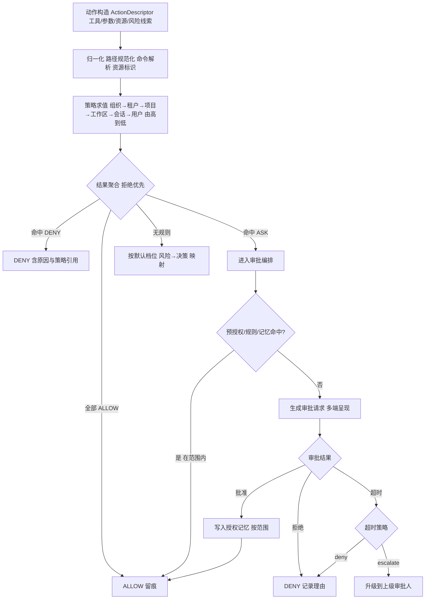
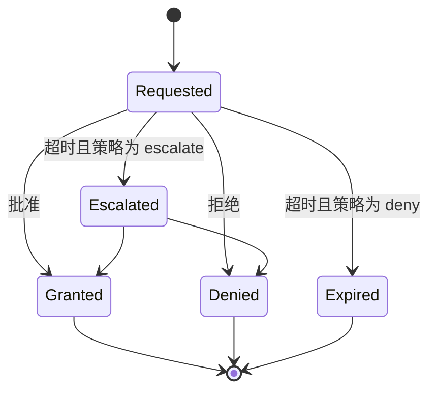

# 卷 06 · 权限与审批系统（Permission & Approval）

> 权限是 Agent 的「刹车与授权书」：本卷定义**风险分级、策略引擎、决策链、审批编排、批量授权、企业基线与审计回放**，确保自治能力与安全边界同时成立。
>
> 需求来源：REQ-PERM-1…12（卷 00 §5.6）；竞品参照：REQ-CMP-1（Codex 的 sandbox × approval 双轴）；全局约束：H-008。

---

## 1. 本卷定位

- **解决**：一个动作该不该做、由谁批准、如何记住、如何审计、如何回放。
- **不解决**：隔离执行本身（卷 07）、工具实现（卷 05）、企业身份与角色（卷 24）、钩子机制（卷 17）。
- **边界**：权限是**决策层**，沙箱是**执行层**——两者纵深防御：权限拒绝则不执行；权限放行但沙箱仍可二次拦截（例如路径围栏、网络策略）。

## 2. 需求与冲突点

| 需求 | 冲突/要点 |
| --- | --- |
| REQ-PERM-1 风险分级 | 静态标注（工具级）不足 → 需**参数级**判定（`rm -rf /` 与 `ls` 同为命令工具） |
| REQ-PERM-3 可解释 | 决策必须给出「为什么」与「哪条策略生效」 |
| REQ-PERM-6 自动批准 | 便利 vs 风险：规则必须可审计、可回滚、默认收紧 |
| REQ-PERM-9 企业基线 | 个人便利 vs 组织合规：基线锁定需技术强制而非约定 |
| REQ-PERM-11 越权阻断 | 提示注入成功后的兜底（与卷 03 注入防护互补） |
| REQ-PERM-12 回放 | 决策依赖输入（参数、策略版本、上下文）→ 需完整记录 |

## 3. 设计空间（M×N）

### D-PERM-1 权限模型

| 分支 | 描述 | 结论 |
| --- | --- | --- |
| B1 工具级白名单 | 简单；粒度太粗（无法区分 `ls` 与 `rm -rf`） | 淘汰 |
| B2 纯能力令牌（capability token，按资源发放） | 精确；但用户理解成本高，且需大量交互发放 | 备选（企业强隔离档） |
| **B3 风险分级 + 动作描述（ActionDescriptor）+ 多层策略求值 + 可选能力令牌（对高风险资源）** | 兼顾易用与精确：默认按风险与资源模式决策；高风险资源（生产库、密钥、发布通道）走令牌 | **选定**（F=9 U=9 S=8 M=9 → 88） |

### D-PERM-2 策略表达

| 分支 | 描述 | 结论 |
| --- | --- | --- |
| B1 代码内硬编码 | 变更需发版 | 淘汰 |
| B2 纯声明式配置（YAML 规则） | 易写易审；复杂条件表达受限 | 基线 |
| **B3 双层：声明式规则（覆盖 95% 场景）+ 策略扩展点（代码/插件实现复杂判定，如「工作日外禁止部署」）** | 常规场景无需写代码；复杂场景可编程且可测试 | **选定**（F=9 U=8 S=9 M=9 → 88） |

### D-PERM-3 决策入口

| 分支 | 描述 | 结论 |
| --- | --- | --- |
| B1 工具内部各自判断 | 分散、易漏、不可审计 | 淘汰 |
| B2 工具运行时统一拦截 | 好，但仍可能被新入口绕过（如 MCP 直连、插件后台任务） | 备选 |
| **B3 内核统一「动作网关」（Action Gateway）：所有副作用必须构造 ActionDescriptor 并经决策链；插件与 MCP 同样受限；旁路检测（审计层扫描未登记副作用）** | 单一入口 + 旁路监控，形成闭环 | **选定**（F=9 U=8 S=9 M=9 → 88） |

### D-PERM-4 决策结果

| 分支 | 描述 | 结论 |
| --- | --- | --- |
| B1 二值（允许/拒绝） | 无法表达「需确认」 | 淘汰 |
| **B2 四值：ALLOW / ALLOW_ONCE（本次且不留存） / ASK（需审批） / DENY，附原因与策略引用** | 语义清晰；ALLOW_ONCE 用于一次性敏感操作 | **选定**（F=9 U=8 S=9 M=9 → 88） |

### D-PERM-5 审批交互通道

| 分支 | 描述 | 结论 |
| --- | --- | --- |
| B1 仅终端内联 | CLI 友好，桌面端体验差 | 备选 |
| **B2 通道无关的审批协议：CLI 内联 / 桌面端卡片（含 diff 与解释）/ 远程（A2A 回调）/ IM 机器人 / 超时默认策略** | 一处编排，多端呈现；无人值守场景按预授权策略处理 | **选定**（F=9 U=9 S=8 M=9 → 88） |
| B3 仅桌面端 | CLI 场景不可用 | 淘汰 |

### D-PERM-6 记住与批量授权

| 分支 | 描述 | 结论 |
| --- | --- | --- |
| B1 不记住（每次询问） | 打扰过多，用户会习惯性批准（安全反效果） | 淘汰 |
| B2 全局记住 | 权限过宽 | 淘汰 |
| **B3 分级记忆：本次（once）/ 本会话 / 本项目 / 本工作区 / 模式化（按命令模式如 `npm test`）/ 目录模式（`src/**` 写）** | 授权范围可视、可撤销、可审计；企业策略可限制可选范围 | **选定**（F=8 U=9 S=8 M=9 → 85.5） |

### D-PERM-7 自动批准规则

| 分支 | 描述 | 结论 |
| --- | --- | --- |
| B1 无规则（全人工） | 高频操作体验差 | 淘汰 |
| **B2 规则即代码：谓词（工具 / 路径模式 / 命令模式 / 参数约束 / 时段 / 环境）+ 动作（ALLOW / DENY）+ 到期时间 + 记录人** | 可评审、可过期、可审计；企业可下发 | **选定**（F=9 U=8 S=9 M=9 → 88） |
| B3 隐式学习（从历史批准推断） | 不可解释、风险高 | 淘汰（可作为 P3 建议器：只建议不自动生效） |

### D-PERM-8 委托与升级

| 分支 | 描述 | 结论 |
| --- | --- | --- |
| B1 无升级路径 | 管理员无法介入 | 淘汰 |
| **B2 升级链：会话所有者 → 团队管理员 → 平台管理员；带 SLA（超时自动 DENY 或按预授权）；支持「申请理由」与审批留痕** | 企业治理必需 | **选定**（F=8 U=8 S=8 M=9 → 82.5） |

### D-PERM-9 权限模式（预置档位）

| 模式 | 语义 | 适用 |
| --- | --- | --- |
| `readonly` | 只读：仅允许读类工具 | 探索、审计、新人熟悉代码 |
| `plan` | 计划：只允许分析与计划工具，禁止副作用；提交计划需批准 | 大改动前置规划 |
| `default` | 默认：写与执行按风险 ASK | 日常 |
| `acceptEdits` | 自动接受文件编辑，执行类仍 ASK | 高频编辑 |
| `autonomous` | 自治：在预授权边界内自动执行（企业策略定义边界），越界 ASK/ DENY | 长任务、无人值守 |
| `yolo`（受限） | 全部放行（仅限沙箱内/一次性容器），**默认对企业租户禁用** | 极端场景 |

> 模式是「起点」，策略可**收窄**模式权限（不可放宽）——收窄规则由租户/项目/工作区定义。

### D-PERM-10 企业基线

| 分支 | 描述 | 结论 |
| --- | --- | --- |
| B1 约定式基线（文档要求） | 可被绕过 | 淘汰 |
| **B2 技术强制基线：锁定层级（组织/租户）策略不可被下级覆盖；违规尝试生成安全事件并阻断；基线版本化、变更需审批** | 满足审计与合规 | **选定**（F=9 U=7 S=9 M=9 → 86.5） |

### D-PERM-11 越权检测

| 分支 | 描述 | 结论 |
| --- | --- | --- |
| B1 仅决策链 | 单层防御 | 淘汰 |
| **B2 三层：决策链（事前）+ 沙箱围栏（事中，卷 07）+ 审计扫描（事后，检测未登记副作用与异常模式）** | 纵深防御；事后扫描能发现「绕过管线的尝试」 | **选定**（F=9 U=7 S=9 M=9 → 86.5） |

### D-PERM-12 决策回放

| 分支 | 描述 | 结论 |
| --- | --- | --- |
| B1 仅记录结果 | 无法复现「为什么」 | 淘汰 |
| **B2 记录完整输入（动作描述 + 策略版本 + 求值轨迹 + 上下文摘要引用）+ 提供重放命令** | 可审计、可调优、可写回归测试（把真实决策固化为用例） | **选定**（F=9 U=8 S=8 M=9 → 85.5） |

## 4. 选定方案详设

### 4.1 风险分级矩阵

| 风险类 | 判定依据（示例） | 默认决策 | 说明 |
| --- | --- | --- | --- |
| R0 只读 | 读文件、检索、查看状态 | ALLOW | 审计留痕 |
| R1 受控写 | 工作区内文件写、格式、创建目录 | ALLOW 或 ASK（按模式） | 有 diff 预览 |
| R2 执行 | 运行命令、测试、构建 | ASK（`autonomous` 下白名单内 ALLOW） | 沙箱 + 资源限制 |
| R3 外发 | 网络请求、上传、推送、发消息 | ASK（域名白名单内可 ALLOW） | 出网审计 |
| R4 破坏性 | 删除、`reset --hard`、`push --force`、批量改写、生产资源操作 | 强 ASK / DENY（企业） | 需显式确认与理由 |
| R5 敏感 | 密钥读取、凭证使用、跨租户数据访问 | DENY 或令牌制 | 默认禁止，例外需授权 |

**参数级判定**：`run_command` 的参数经命令解析（AST 级）映射到 R0–R5；无法解析的命令默认按 R2/R4 取高；沙箱档位随风险提升（D-SBOX）。

### 4.2 决策链（单一入口）

**求值规则**：① 拒绝优先（任一命中 DENY 即拒绝）；② 更具体者覆盖更宽泛者；③ 强制项不可被下级放宽；④ 全部求值轨迹记录（用于回放）。

### 4.3 审批请求结构（跨端统一）

| 字段 | 说明 |
| --- | --- |
| `approvalId` / `sessionId` / `taskId` | 定位 |
| 动作摘要 | 工具、目标资源、人类可读描述 |
| 预览 | 文件 diff / 命令全文 / 网络目标 / 影响面估计 |
| 风险类与理由 | R0–R5 + 触发规则 |
| 可选范围 | 本次 / 会话 / 项目 / 目录模式 / 命令模式（依策略可选项） |
| 超时 | 默认时长与超时动作 |
| 上下文链接 | 关联会话消息与计划（供审批者理解意图） |
| 责任记录 | 谁请求（用户/Agent/子 Agent/外部调用方） |

### 4.4 审批编排状态机

**不可变审计**：每次状态迁移写入事件（含审批者身份与理由），仅追加、不可修改。

### 4.5 与 Hooks、沙箱、模式的关系

| 关系 | 说明 |
| --- | --- |
| Hooks（卷 17） | 在权限决策**之前**运行（可改写参数、可直接拒绝）；钩子不能放宽权限（只能收窄） |
| 沙箱（卷 07） | 权限放行后，沙箱仍按策略执行围栏（路径/网络/资源）；沙箱拒绝生成 `sandbox.denied` 安全事件 |
| 模式（D-PERM-9） | 模式是默认档；策略可收窄；模式切换生成事件且需记录（审计关心「当时是什么模式」） |
| 上下文（卷 03） | 注入防护降低「被诱导发起动作」概率；真正兜底在权限与沙箱 |

## 5. 扩展点（供卷 18 汇总）

| 扩展点 | 说明 |
| --- | --- |
| `PolicyProviderSPI` | 策略来源（配置/数据库/企业策略服务） |
| `PolicyRuleSPI` | 编程式规则（复杂条件） |
| `RiskAssessorSPI` | 自定义风险评估（如结合企业资产库判定「生产资源」） |
| `ApprovalChannelSPI` | 审批呈现与回收通道（IM/工单/邮件） |
| `ApprovalPolicySPI` | 审批路由与超时策略 |
| `AuditSinkSPI` | 审计出海（SIEM/数据湖） |
| `CapabilityTokenSPI` | 能力令牌发放与校验 |

## 6. 事件与可观测

| 事件 | 说明 |
| --- | --- |
| `permission.decision` | 动作、结果、命中规则、求值轨迹引用、耗时 |
| `permission.approval.requested` / `granted` / `denied` / `expired` / `escalated` | 审批全生命周期 |
| `permission.memory.written` / `revoked` | 授权记忆变更（含范围与来源） |
| `permission.policy.changed` | 策略变更（含差异与操作者） |
| `permission.override.denied` | 下级试图放宽被拒（安全事件） |
| `permission.bypass.detected` | 审计扫描发现未登记副作用 |

**指标**：`oc_permission_decision_latency_ms`、`oc_permission_ask_ratio`、`oc_permission_denied_total`、`oc_approval_latency_ms{dimension=human|auto}`、`oc_approval_timeout_total`、`oc_permission_memory_size`。

## 7. 非功能设计

- **性能**：决策 ≤ 10ms（P95）；策略预编译 + 变更失效；记忆查找索引化（工具 × 资源模式）。
- **可靠性**：审批请求持久化（进程重启后仍可见并可回应）；审批结果幂等。
- **安全**：策略与审计数据完整性保护（哈希链）；审批人身份强校验；跨租户绝不共享策略缓存。
- **可用性**：审批通道不可用时按 `fail-closed`（默认拒绝）并显式提示；`autonomous` 模式依赖预授权基线，通道不可用仍可运行在边界内。
- **可解释**：任何决策都能回答「哪条策略 + 哪条规则 + 为什么」。

## 8. 完成定义（DoD）

- [ ] R0–R5 风险矩阵落到工具与参数级判定，含 30+ 条判定用例（含 `rm -rf`、`push --force`、生产资源操作）。
- [ ] 决策链实现「拒绝优先 + 具体覆盖宽泛 + 强制项不可放宽」，并有冲突用例。
- [ ] 四种审批通道（CLI/桌面/远程/IM）至少 CLI 与桌面端可用，远程通道协议就绪。
- [ ] 授权记忆 6 类范围全部可写、可查、可撤销，且撤销立即生效（用例）。
- [ ] 自动批准规则支持过期时间与记录人，且规则变更审计可查。
- [ ] 企业基线锁定：下级覆盖尝试被阻断并生成安全事件（用例）。
- [ ] 决策回放：给定决策 ID 重放求值轨迹并与原结果一致。
- [ ] 旁路检测：模拟未登记副作用被审计扫描发现（用例）。

## 9. 域内决策汇总（D-PERM）

| ID | 主题 | 选定 |
| --- | --- | --- |
| D-PERM-1 | 权限模型 | 风险分级 + 动作描述 + 多层策略 + 可选能力令牌 |
| D-PERM-2 | 策略表达 | 声明式规则为主 + 编程扩展点 |
| D-PERM-3 | 决策入口 | 内核统一动作网关 + 旁路检测 |
| D-PERM-4 | 决策结果 | ALLOW / ALLOW_ONCE / ASK / DENY |
| D-PERM-5 | 审批通道 | 通道无关协议 + 多端呈现 + 超时策略 |
| D-PERM-6 | 记忆授权 | 六级范围（once/session/project/workspace/pattern/dir） |
| D-PERM-7 | 自动批准 | 规则即代码（谓词 + 动作 + 到期 + 记录人） |
| D-PERM-8 | 委托升级 | 三级升级链 + SLA + 留痕 |
| D-PERM-9 | 权限模式 | 六档（readonly/plan/default/acceptEdits/autonomous/yolo） |
| D-PERM-10 | 企业基线 | 技术强制不可覆盖 + 版本化 + 变更审批 |
| D-PERM-11 | 越权检测 | 三层纵深（决策/沙箱/审计扫描） |
| D-PERM-12 | 决策回放 | 完整输入 + 求值轨迹 + 重放命令 |

## 10. 开放问题与默认决策

| 项 | 默认决策 |
| --- | --- |
| 审批默认超时 | 5 分钟；超时动作默认 `deny`（企业可配 `escalate`） |
| `yolo` 模式 | 仅 local 形态可用，默认关闭；企业档强制禁用 |
| 规则语言 | YAML 谓词 DSL（字段：tool/resource/path/command/time/env/risk）+ 表达式白名单函数 |
| 授权记忆存储 | 项目级及以上落持久化（PG）；会话级落热态（Redis） |
| 审批通知去重 | 同一动作 30s 内合并为一条（可配），避免刷屏 |
