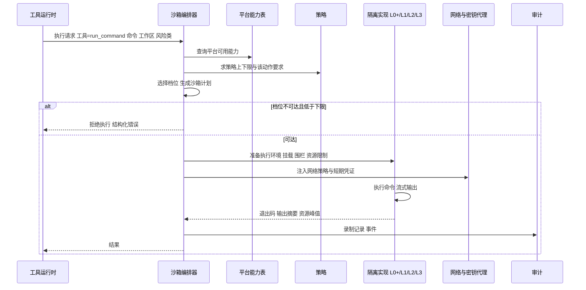

# 卷 07 · 沙箱与安全执行环境（Sandbox & Secure Execution）

> 沙箱是「最后一道物理边界」：即使模型被诱导、权限被误批，执行环境仍能限制爆炸半径。本卷定义**分级隔离档位、跨平台能力矩阵、文件/网络/密钥/资源四类边界、危险操作拦截、供应链与录制审计、快照恢复**。
>
> 需求来源：REQ-SBOX-1…12（卷 00 §5.7）；全局约束：H-009（分级隔离）、NFR-S-1（逃逸零容忍）。

---

## 1. 本卷定位

- **解决**：命令与副作用在什么边界内执行；边界如何跨平台一致；违规如何被发现与审计。
- **不解决**：该不该执行（卷 06 决策）、在哪执行（卷 20 工作区）、工具语义（卷 05）。
- **边界**：沙箱只做「执行约束与观测」，不做业务判断；所有拒绝都产出安全事件并可解释。

## 2. 需求与冲突点

| 需求 | 冲突/要点 |
| --- | --- |
| REQ-SBOX-1 分级隔离 | 个人桌面无虚拟化能力 vs 企业强隔离要求 → 能力矩阵 + 策略上限 |
| REQ-SBOX-2 文件围栏 | Agent 需要写工作区，但不得越界；符号链接与硬链接是绕过点 |
| REQ-SBOX-3 网络策略 | 依赖安装需要网络 vs 数据外泄风险 → 白名单 + 审计代理 |
| REQ-SBOX-5 密钥隔离 | 命令需要凭证（如 `git push`）vs 密钥不得落地 → 密钥代理注入 |
| REQ-SBOX-7 供应链 | 依赖安装天然危险 → 审计 + 锁文件 + 来源校验 + 可选离线仓库 |
| REQ-SBOX-9 恶意内容 | 仓库文件/网页可能含注入指令（与卷 03/06 互补） |
| REQ-SBOX-11 录制 | 全量录制成本高 vs 审计要求 → 分级录制 |

## 3. 设计空间（M×N）

### D-SBOX-1 隔离技术栈

| 分支 | 描述 | 优点 | 代价 |
| --- | --- | --- | --- |
| B1 OS 原生隔离 | Linux（namespaces/seccomp/Landlock/cgroups）、macOS（Seatbelt/sandbox-exec）、Windows（Job Objects/AppContainer/低完整性令牌） | 无额外依赖、启动快、个人形态友好 | 各平台能力不同、策略需分别实现 |
| B2 容器 | 一致性强、社区成熟 | 需要容器运行时；桌面端可用性不稳定；Windows 需要 WSL2 |
| B3 微虚拟机 | 隔离最强 | 资源重、启动慢、平台要求高 |
| B4 远程节点 | 隔离与算力解耦 | 网络依赖、延迟 |

| 分支 | F | U | S | M | 加权 | 结论 |
| --- | --- | --- | --- | --- | --- | --- |
| B1 | 8 | 9 | 7 | 7 | 77.5 | 作为 L0/L0+ 基础 |
| B2 | 9 | 6 | 8 | 8 | 79 | 作为 L1 |
| B3 | 9 | 4 | 8 | 7 | 72.5 | 作为 L2（企业档） |
| B4 | 9 | 5 | 7 | 8 | 74.5 | 作为 L3（远程执行节点） |
| **组合 B1+B2+B3+B4（统一接口、档位策略）** | **10** | **8** | **9** | **9** | **90** | **选定** |

**结论**：不做单一技术选型，而是**统一 `ExecutionIsolationPort` + 四类实现**，按平台能力与策略选档（D-SBOX-2）。

### D-SBOX-2 档位选择

| 分支 | 描述 | 结论 |
| --- | --- | --- |
| B1 静态配置 | 简单；不同风险动作体验割裂 | 备选 |
| **B2 风险驱动自动选档 + 策略上下限（下限=最少要求，上限=最大开销）** | R0/R1 用 L0+，R2 起用 L1（可用时），R4/R5 强制 L2/L3；策略可强制提高下限 | **选定**（F=9 U=8 S=8 M=9 → 85.5） |
| B3 全动作最高隔离 | 安全但极慢，依赖不可用 | 淘汰 |

### D-SBOX-3 文件系统模型

| 分支 | 描述 | 结论 |
| --- | --- | --- |
| B1 白名单挂载（只挂载需要路径） | 最安全；但路径常需动态发现，漏挂载导致失败 | 备选 |
| B2 只读根 + 显式读写区 | 兼顾可用与经济性 | **选定**（F=8 U=8 S=8 M=9 → 82.5） |
| B3 复制工作区到沙箱 | 隔离强；同步成本高 | 备选（L2/L3 使用，配合增量同步） |

**反绕过规则**：路径规范化（解析 `..`、符号链接、大小写不敏感文件系统、Windows 8.3 短名）后判定；挂载点以只读方式暴露系统目录；禁止在读写区创建指向区外的硬链接（写后用扫描校验）。

### D-SBOX-4 网络模型

| 分支 | 描述 | 结论 |
| --- | --- | --- |
| B1 全禁 | 最安全；依赖安装/拉取失败频繁 | 基线（R4/R5 强制） |
| B2 域名白名单 | 可用性与安全平衡 | **选定默认**（F=8 U=8 S=8 M=8 → 80） |
| B3 审计代理（全部流量经代理记录） | 可观测最强；实现复杂 | **选定叠加**（企业与 `autonomous` 模式默认开启） |
| B4 全开 | 仅隔离档与一次性容器内允许 | 受限选项 |

**组合策略**：默认「白名单 + 代理审计」；白名单可按工具族（包管理器域名、模型域名、Git 平台域名）自动生成候选并需用户/策略确认；出网事件全部记录（域名、方法、字节数、判定）。

### D-SBOX-5 密钥处理

| 分支 | 描述 | 结论 |
| --- | --- | --- |
| B1 环境变量注入明文 | 简单；易被 `env` 泄漏、进日志 | 淘汰 |
| B2 不注入（命令失败） | 安全；但 `git push` 等场景不可用 | 备选 |
| **B3 密钥代理：受控命令经代理注入短期凭证；密钥仅在代理内存；支持伪造环境（如 `GIT_ASKPASS` 指向代理）** | 既可用又不落地；全程审计 | **选定**（F=9 U=8 S=9 M=9 → 88） |

### D-SBOX-6 资源限制实现

| 分支 | 描述 | 结论 |
| --- | --- | --- |
| B1 无限制 | 失控风险 | 淘汰 |
| **B2 平台原生资源控制（cgroups v2 / Windows Job Objects / rlimit）+ 虚拟层兜底（超时、输出限额、进程数上限）** | 覆盖全平台；能力缺失时至少超时和输出限额 | **选定**（F=8 U=8 S=8 M=8 → 80） |

### D-SBOX-7 危险操作拦截

| 分支 | 描述 | 结论 |
| --- | --- | --- |
| B1 正则黑名单 | 易绕过 | 淘汰 |
| B2 Shell AST 解析 + 规则（可识别 `rm -rf $HOME`、`> /dev/sda`、`curl | bash`） | 强，但需多 Shell 方言支持 | 基线 |
| B3 B2 + 模型判定（二次确认高风险命令语义） | 覆盖未知模式；引入延迟与成本 | **选定（组合）**（F=9 U=8 S=8 M=9 → 85.5） |
| B4 仅依赖权限审批 | 人可能误批 | 淘汰 |

**实现**：拦截分层——① 词法/语法解析（POSIX sh、bash、PowerShell、cmd）；② 规则库（内置 + 企业扩展）；③ 高风险模式（管道到解释器、重定向到设备、批量删除、权限提升）触发模型二次判定或强制审批。

### D-SBOX-8 供应链安全

| 分支 | 描述 | 结论 |
| --- | --- | --- |
| B1 不干预 | 风险最高 | 淘汰 |
| **B2 组合：锁文件强制（有锁则用锁）+ 依赖清单差异审计（新增依赖需记录）+ 来源校验（私有 registry 优先）+ 安装后扫描（已知漏洞与可疑脚本）** | 平衡 | **选定**（F=9 U=7 S=8 M=8 → 81.5） |
| B3 完全离线（仅私有仓库） | 最安全；企业内网形态可选 | 备选（air-gapped 默认） |

### D-SBOX-9 执行录制

| 分支 | 描述 | 结论 |
| --- | --- | --- |
| B1 仅命令文本 | 便宜；证据不足 | 淘汰 |
| **B2 分级：默认记录命令 + 退出码 + 输出摘要（尾部/错误）+ 资源峰值；高风险或企业策略开启全量 IO 录制（外置为工件）** | 成本可控、证据充分 | **选定**（F=9 U=7 S=9 M=9 → 86.5） |
| B3 全量录屏/录 IO | 成本高、隐私风险 | 淘汰（仅按需临时开启） |

### D-SBOX-10 快照与恢复

| 分支 | 描述 | 结论 |
| --- | --- | --- |
| B1 无快照 | 破坏后无法恢复 | 淘汰 |
| **B2 工作区内容寻址增量快照（仅记录变更文件 + 元数据；大对象去重）+ 文件系统级快照（平台支持时）** | 快速回滚、可对比 | **选定**（F=9 U=8 S=8 M=9 → 85.5） |
| B3 全量复制 | 简单；成本高 | 淘汰 |

### D-SBOX-11 跨平台策略

| 分支 | 描述 | 结论 |
| --- | --- | --- |
| B1 只支持 Linux | 与「个人桌面（Windows/macOS）」目标冲突 | 淘汰 |
| **B2 能力矩阵 + 降级留痕：每平台声明可用隔离能力；不可用档位降级到可用档并生成 `sandbox.degraded` 事件，界面显式提示** | 可用性与透明度兼顾 | **选定**（F=9 U=8 S=8 M=8 → 82.5） |
| B3 各平台独立实现、语义不一致 | 维护灾难 | 淘汰 |

## 4. 选定方案详设

### 4.1 隔离档位表

| 档位 | 技术 | 隔离强度 | 启动开销 | 适用 |
| --- | --- | --- | --- | --- |
| L0 | 进程内受控（路径围栏 + 资源限额 + 环境清洗 + 危险命令拦截） | 低 | ~0ms | 只读与受控写（R0/R1） |
| L0+ | L0 + 强制访问控制（Linux Landlock/seccomp、macOS Seatbelt、Windows 低完整性令牌/AppContainer） | 中 | < 20ms | 默认执行档（R2 轻量） |
| L1 | 容器（OCI 镜像，按工作区类型预置） | 中高 | 0.5–2s（预热可 > 复 用） | 依赖安装、构建、测试（R2） |
| L2 | 微虚拟机（Kata/Firecracker 类） | 高 | 1–5s | 高风险执行、不可信代码（R4/R5） |
| L3 | 远程执行节点（独立主机/集群，网络隔离） | 最高 | 网络延迟 | 企业算力池、air-gapped、跨租户隔离 |

**选择算法**：`档位 = clamp(策略下限, 风险映射(风险类, 平台能力, 工作区类型), 策略上限)`；不满足下限 → 拒绝执行（不降级），满足但达不到风险映射 → 取可达档 + 生成降级事件。

### 4.2 平台能力矩阵（示例）

| 能力 | Linux | macOS | Windows |
| --- | --- | --- | --- |
| 文件系统围栏 | Landlock / mount ns / chroot 风格绑定 | Seatbelt profile | AppContainer / 低完整性 + ACL |
| 系统调用过滤 | seccomp-bpf | Seatbelt | 无直接等价（依赖 AppContainer 与 ETW 监控） |
| 资源限制 | cgroups v2 | rlimit + 进程组 | Job Objects |
| 网络隔离 | netns + nftables / 代理 | Seatbelt network 规则 + 代理 | Windows Firewall 规则 + 代理 / WSL2 netns |
| 容器 | 原生 | Docker Desktop / Colima | WSL2 后端 |
| 微虚拟机 | KVM + Cloud Hypervisor | Virtualization.framework | Hyper-V |
| 文件系统快照 | btrfs/zfs/LVM 快照 | APFS 快照 | VSS 快照 / 复制 |

### 4.3 执行决策与时序

### 4.4 网络与密钥代理

| 组件 | 职责 |
| --- | --- |
| 出网策略判定 | 域名/端口/IP 白名单与黑名单；按工具族与租户策略求值 |
| 审计代理 | 记录请求元数据（域名、方法、大小、时间、发起命令 ID）；可对响应做敏感信息扫描 |
| 凭证注入 | 按目标域名匹配凭证引用，注入短期令牌（OAuth token / SSH agent 转发 / Git 凭据帮助器） |
| 伪造环境 | 提供 `GIT_ASKPASS`、`NPM_TOKEN`（短期）等受控变量名；真实值仅存于代理 |
| 外泄检测 | 出站内容与已知敏感模式匹配；命中则阻断并告警 |

### 4.5 快照与回滚

| 能力 | 说明 |
| --- | --- |
| 快照触发 | 每轮次结束、执行高风险动作前、进入计划模式前、用户显式请求 |
| 快照内容 | 变更文件（内容寻址）+ 目录结构 + 元数据（权限/时间）+ 忽略规则（构建产物可排除） |
| 恢复粒度 | 会话级 / 任务级 / 单文件 / 单工具调用（前后对比） |
| 与 Git 关系 | 快照独立于 Git（可覆盖未提交状态）；Git 提交作为「语义化检查点」补充（卷 21） |
| 存储治理 | 增量去重 + TTL + 引用计数（被会话/任务引用则保留） |

### 4.6 审计与违规处置

| 违规类型 | 处置 |
| --- | --- |
| 路径越界尝试 | 立即拒绝 + `sandbox.violation`（含规范化路径与来源命令）；重复则提升风险并通知 |
| 网络策略拒绝 | 拒绝 + 事件；若为包管理器域名，提示「可申请加入白名单」 |
| 资源超限 | 终止进程组 + 事件 + 输出摘要 |
| 危险命令命中 | 阻断或强制审批（依策略）；记录模型判定结论 |
| 密钥使用异常（注入后尝试批量读取） | 阻断 + 高优先级安全事件 |
| 检测到沙箱逃逸迹象 | 立即终止沙箱 + 冻结会话 + 告警（NFR-S-1） |

## 5. 扩展点（供卷 18 汇总）

| 扩展点 | 说明 |
| --- | --- |
| `IsolationProviderSPI` | 新增隔离实现（自定义容器运行时/远程节点） |
| `DangerRuleSPI` | 自定义危险命令规则（企业扩展规则库） |
| `NetworkPolicySPI` | 网络策略来源与判定（企业出口网关联动） |
| `CredentialBrokerSPI` | 凭证代理实现（Vault/KMS/内部服务） |
| `SnapshotProviderSPI` | 快照实现（文件系统快照/复制/远端） |
| `ExecutionRecorderSPI` | 录制与回放格式扩展 |

## 6. 事件与可观测

| 事件 | 说明 |
| --- | --- |
| `sandbox.selected` | 档位、平台、策略依据、降级信息 |
| `sandbox.degraded` | 目标档不可达而降级（含原因） |
| `sandbox.denied` | 策略拒绝（含规则引用） |
| `sandbox.violation` | 越界尝试（路径/网络/资源） |
| `sandbox.command.blocked` | 危险命令拦截（规则或模型判定） |
| `sandbox.snapshot.created` | 快照创建（范围、大小、去重率） |
| `sandbox.resource.exceeded` | 资源超限（峰值与上限） |
| `sandbox.escalated` | 检测到逃逸迹象并升级处置 |

**指标**：`oc_sandbox_exec_total{tier}`、`oc_sandbox_startup_ms{tier}`、`oc_sandbox_violation_total{kind}`、`oc_sandbox_blocked_total`、`oc_sandbox_snapshot_bytes`、`oc_sandbox_network_egress_bytes{domain}`。

## 7. 非功能设计

- **性能**：L0/L0+ 附加开销 ≤ 20ms；L1 容器池化预热（首次 0.5–2s，复用 < 200ms）；L2 用于高风险动作，允许秒级启动。
- **可靠性**：沙箱进程崩溃不影响内核；沙箱状态与内核状态分离；被终止的执行产生结构化结果（非异常）。
- **安全**：默认拒绝（网络、路径、凭证均白名单）；最小内核能力；审计哈希链防篡改；沙箱镜像与依赖来源校验。
- **隐私**：录制内容默认脱敏（密钥、token、PII）；录制保留期可配。
- **可用性**：平台能力缺失时降级且显式提示，不静默；企业可强制「不达标即拒绝执行」。

## 8. 完成定义（DoD）

- [ ] 四类隔离实现（L0+ / L1 / L2 / L3）至少 L0+ 与 L1 在三平台可用，L2/L3 在 Linux/server 可用。
- [ ] 档位选择算法有完整单元测试（含下限不满足即拒绝、上限钳制、降级留痕）。
- [ ] 路径反绕过用例集（软链、硬链、`..`、Windows 短名、大小写）全部通过。
- [ ] 网络策略：白名单生效、代理审计记录完整、外泄检测用例通过。
- [ ] 密钥代理：`git push` 等场景在无明文密钥注入下可用，且日志无泄漏（扫描验证）。
- [ ] 危险命令库覆盖 30+ 模式（含管道到解释器、设备重定向、批量删除、提权），含误报控制（正常命令不误拦）。
- [ ] 快照创建/恢复端到端可用，恢复后工作区哈希一致（除忽略项）。
- [ ] 逃逸演练：模拟越界与逃逸迹象，处置链路（终止+冻结+告警）全通。

## 9. 域内决策汇总（D-SBOX）

| ID | 主题 | 选定 |
| --- | --- | --- |
| D-SBOX-1 | 隔离技术栈 | 统一接口 + 四类实现（OS 原生/容器/微虚拟机/远程） |
| D-SBOX-2 | 档位选择 | 风险驱动自动 + 策略上下限 |
| D-SBOX-3 | 文件系统 | 只读根 + 显式读写区 + 反绕过规范化 |
| D-SBOX-4 | 网络 | 白名单默认 + 代理审计叠加 |
| D-SBOX-5 | 密钥 | 密钥代理注入短期凭证（不落地） |
| D-SBOX-6 | 资源限制 | 平台原生控制 + 虚拟层兜底 |
| D-SBOX-7 | 危险拦截 | 解析 + 规则库 + 高风险模型二次判定 |
| D-SBOX-8 | 供应链 | 锁文件 + 差异审计 + 来源校验 + 安装后扫描 |
| D-SBOX-9 | 录制 | 分级录制（默认摘要，高风险全量外置） |
| D-SBOX-10 | 快照 | 内容寻址增量 + 平台级快照可选 |
| D-SBOX-11 | 跨平台 | 能力矩阵 + 降级留痕 + 可强制拒绝 |

## 10. 开放问题与默认决策

| 项 | 默认决策 |
| --- | --- |
| 默认隔离档（个人桌面） | L0+（能力可用时）；Windows 无 AppContainer 权限时退 L0 并提示 |
| 默认网络策略 | 白名单（包管理域名 + Git 平台 + 模型端点）；其余拒绝 |
| 容器镜像来源 | 内置基础镜像清单 + 企业私有镜像仓库；镜像需签名校验 |
| 快照保留 | 默认 14 天或随会话生命周期（取长者）；企业可配 |
| 全量录制的开启方式 | 企业策略或用户临时开启（会话级，界面显式提示） |
