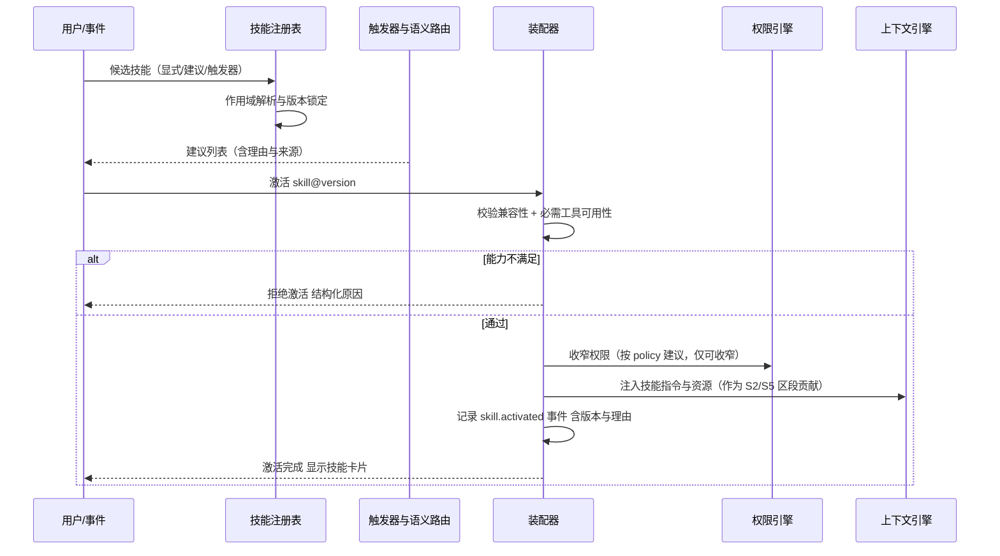
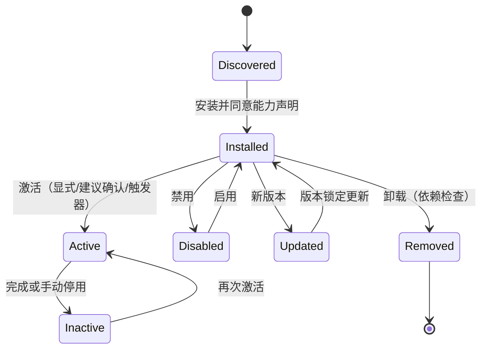

# 卷 08 · Skill 系统（Skills）

> Skill 是「可复用的专家能力包」：把提示词、流程、脚本、工具集与验收标准打包成可发现、可组合、可评测、可分发的单元——让 Agent 不必每次从零理解某类任务。
>
> 需求来源：REQ-SKILL-1…10（卷 00 §5.8）；竞品参照：REQ-CMP-6（Claude Code Skill）、REQ-CMP-9（Plugin 打包）、REQ-CMP-14（一切皆插件）。

---

## 1. 本卷定位

- **解决**：技能如何定义、被发现、被激活、如何与工具/提示词/子 Agent 组合、如何版本化与分发。
- **不解决**：提示词资产版本机制（卷 04，技能复用其资产系统）、工具实现（卷 05）、插件装载机制（卷 18，技能是插件可携带的内容之一）。
- **边界**：Skill 是**内容层**（知识 + 流程 + 资源），Plugin 是**代码层**（可执行扩展）；一个插件可携带多个 Skill，一个 Skill 也可独立于插件存在。

## 2. 需求与冲突点

| 需求 | 冲突/要点 |
| --- | --- |
| REQ-SKILL-1 定义格式 | 表达力 vs 可读可评审：需要「人可读 + 机可解析」的双重性 |
| REQ-SKILL-3 激活机制 | 自动激活便利 vs 上下文污染：自动激活必须可解释、可关闭 |
| REQ-SKILL-4 组合 | 技能可声明工具/子 Agent，但工具与权限必须经统一治理（卷 05/06） |
| REQ-SKILL-6 权限声明 | 技能可要求网络/执行权限 → 安装即授权风险 → 需最小权限与显式同意 |
| REQ-SKILL-7 评测 | 技能质量参差 → 需要自带用例与评分（卷 26） |
| REQ-SKILL-8 分发 | 生态需要市场，但恶意技能风险 → 签名 + 权限声明 + 沙箱约束 |

## 3. 设计空间（M×N）

### D-SKILL-1 技能形态

| 分支 | 描述 | 结论 |
| --- | --- | --- |
| B1 纯提示词片段 | 简单；无法携带脚本与资源 | 基线（最小技能） |
| B2 指令 + 资源 + 脚本 + 工具声明 | 表达力强；需要治理 | **选定**（F=9 U=8 S=8 M=9 → 85.5） |
| B3 可执行程序（技能即二进制） | 最强；风险与治理成本最高 | 备选（通过插件形态承载） |

**组成（技能包）**：

| 组成 | 说明 | 必需 |
| --- | --- | --- |
| `skill.md` | 主指令（面向模型的过程知识与决策规则） | 是 |
| `manifest.yaml` | 元数据（名称/版本/作用域/兼容性/权限声明/触发条件） | 是 |
| `resources/` | 模板、示例、检查清单、代码片段、参考文档 | 否 |
| `scripts/` | 可执行脚本（经沙箱执行，声明所需权限） | 否 |
| `tools.yaml` | 技能携带或依赖的工具声明（可引用内置/MCP/插件工具） | 否 |
| `tests/` | 技能自带评测用例（含输入、期望行为、断言） | 否（发布到市场必需） |
| `policy.yaml` | 推荐权限模式与策略收窄建议 | 否 |

### D-SKILL-2 发现与装载

| 分支 | 描述 | 结论 |
| --- | --- | --- |
| B1 固定目录约定 | 简单；难做依赖与版本 | 基线 |
| B2 注册表（本地索引 + 远端 registry） | 可查询、可版本化 | **选定（组合）**（F=9 U=8 S=8 M=9 → 85.5） |
| B3 仅市场（必须远程） | 离线不可用 | 淘汰 |

**四源发现**（优先级从低到高）：内置技能（随产品）→ 组织技能（企业 registry）→ 项目技能（仓库内 `.oc/skills/`）→ 用户技能（用户目录）。同名覆盖遵循卷 04 的覆盖规则（组织强制项不可覆盖）。

### D-SKILL-3 激活机制

| 分支 | 描述 | 结论 |
| --- | --- | --- |
| B1 仅显式调用（`/skill-name`） | 可控；发现性差 | 基线 |
| B2 语义路由（按用户意图自动匹配） | 便利；可能误触发 | **选定（叠加）** |
| B3 触发器（文件模式/命令/事件/模式） | 精准（如「改 Dockerfile 时激活容器技能」） | **选定（叠加）** |
| B4 模型自选（模型读到技能目录后自行决定） | 灵活；成本与不确定性 | **选定（叠加）** |

**最终策略**：四机制并存，**默认「显式 + 建议」**：语义路由与触发器只**建议**（在界面显示「检测到适合的技能，是否启用」），用户可开启「自动激活」；自动激活必须生成 `skill.activated` 事件并在会话中可见（可回溯「为什么这条技能生效」）。

### D-SKILL-4 与工具/子 Agent 的关系

| 分支 | 描述 | 结论 |
| --- | --- | --- |
| B1 仅提示词层（不涉及工具） | 治理简单；能力受限 | 淘汰 |
| **B2 技能可声明：所需工具集（收窄）、必需工具（缺失则拒绝激活）、可选子 Agent 定义、验收清单** | 技能成为「任务装配单元」，可复用卷 05/12 能力 | **选定**（F=9 U=8 S=8 M=9 → 85.5） |
| B3 技能可任意定义新工具 | 治理失控 | 淘汰（必须走插件机制） |

### D-SKILL-5 版本与依赖

| 分支 | 描述 | 结论 |
| --- | --- | --- |
| B1 无版本 | 不可复现 | 淘汰 |
| **B2 语义化版本 + 依赖锁定（技能可依赖其他技能/插件/工具包，生成锁文件）+ 兼容性声明（内核版本、模型能力）** | 可复现；安装时可校验 | **选定**（F=9 U=8 S=9 M=9 → 88） |

### D-SKILL-6 权限声明与安装授权

| 分支 | 描述 | 结论 |
| --- | --- | --- |
| B1 无声明 | 用户不知情 | 淘汰 |
| **B2 manifest 声明「需要的能力」（网络域名、命令执行、文件写入范围、密钥引用）+ 安装时展示并需同意 + 运行期仍受卷 06 治理** | 最小权限 + 双重把关 | **选定**（F=9 U=8 S=9 M=9 → 88） |

### D-SKILL-7 测试与评测

| 分支 | 描述 | 结论 |
| --- | --- | --- |
| B1 无 | 质量不可控 | 淘汰 |
| **B2 技能自带用例（可离线运行）+ 市场发布要求评测记录（通过率/成本/时长）+ 使用后在线反馈** | 质量为重 | **选定**（F=9 U=8 S=8 M=9 → 85.5） |

### D-SKILL-8 分发与市场

| 分支 | 描述 | 结论 |
| --- | --- | --- |
| B1 无分发（本地文件） | 生态无从建立 | 淘汰 |
| **B2 三层分发：本地目录 / 组织内私仓 / 公共市场；均支持签名与校验；企业可禁用公共市场** | 兼顾生态与合规 | **选定**（F=9 U=8 S=8 M=9 → 85.5） |

### D-SKILL-9 创作器

| 分支 | 描述 | 结论 |
| --- | --- | --- |
| B1 纯手写 | 门槛高 | 基线 |
| **B2 从会话提炼（把成功流程导出为技能草稿）+ 技能模板脚手架 + 一键跑用例** | 降低创作门槛；自进化入口（REQ-FR-3） | **选定**（F=8 U=9 S=7 M=8 → 79.5） |
| B3 自动生成并自动发布 | 风险高 | 淘汰（必须人工评审后发布） |

### D-SKILL-10 效果度量

| 分支 | 描述 | 结论 |
| --- | --- | --- |
| B1 无 | 无法优化 | 淘汰 |
| **B2 使用统计（激活次数/成功率/成本/时长/用户反馈）+ 与无技能基线对比** | 数据驱动优化；劣化技能可自动降级为「建议」 | **选定**（F=8 U=8 S=8 M=8 → 80） |

## 4. 选定方案详设

### 4.1 技能包结构（示例）

```text
skills/dockerfile-optimizer/
  skill.md            # 主指令：过程知识、检查清单、决策规则、输出规范
  manifest.yaml       # 元数据与声明
  resources/
    checklist.md
    examples/good.Dockerfile
  scripts/
    lint_dockerfile.sh
  tools.yaml          # 依赖 read_file / edit_file / run_command(仅 docker 相关)
  tests/
    case-01.yaml      # 输入 + 期望行为 + 断言
  policy.yaml         # 建议权限模式：acceptEdits + 网络白名单
```

### 4.2 manifest 关键字段

| 字段 | 说明 |
| --- | --- |
| `name` / `version` / `description` | 标识与语义化版本 |
| `compatibility` | 内核版本区间、必需模型能力（tools/vision/thinking） |
| `scope` | builtin / org / project / user |
| `triggers` | 触发条件（文件模式、命令前缀、模式、事件类型、关键词） |
| `capabilities` | 所需能力（网络域名、命令执行、文件写入范围、密钥引用、子 Agent 派生） |
| `tools.required` / `tools.optional` | 必需与可选工具（缺失必需工具 → 拒绝激活） |
| `permissions.recommended-mode` | 建议权限模式（不得放宽用户当前模式） |
| `acceptance` | 验收清单（技能完成的判定条件，供 Agent 自检与用户确认） |
| `eval` | 评测元数据（用例入口、基线指标） |
| `signature` | 发布签名（组织/市场分发必填） |

### 4.3 激活与装配



### 4.4 与其它系统的装配关系

| 系统 | 关系 |
| --- | --- |
| 提示词系统（卷 04） | 技能指令以「片段 + 模板」形式进入资产系统；技能版本锁定 ⇒ 提示词版本集合包含技能版本 |
| 上下文（卷 03） | 技能注入到 S2（模式与角色）与 S5（知识检索）区段；资源文件按需引用（不默认全量注入） |
| 工具（卷 05） | 技能收窄工具集；技能脚本作为「脚本工具」注册（受限权限） |
| 权限（卷 06） | 技能声明的能力在安装时授权；运行期仍逐动作决策 |
| 子 Agent（卷 12） | 技能可声明专用子 Agent（如「安全审查者」），用于技能内部委派 |
| 插件（卷 18） | 插件可携带技能；插件禁用连带技能失效（依赖关系） |
| 评测（卷 26） | 技能自带用例进入评测集；发布门禁要求达标 |

### 4.5 技能生命周期



**依赖保护**：卸载被其它技能依赖的技能时，提示依赖链并要求显式强制（记录原因）。

## 5. 扩展点（供卷 18 汇总）

| 扩展点 | 说明 |
| --- | --- |
| `SkillSourceSPI` | 技能来源（目录/registry/插件内置） |
| `SkillTriggerSPI` | 自定义触发器（新事件源/新模式） |
| `SkillRouterSPI` | 语义路由实现（可接入企业模型） |
| `SkillAssemblerSPI` | 装配钩子（企业统一注入规范） |
| `SkillEvalSPI` | 评测运行器扩展 |
| `SkillPublisherSPI` | 发布通道（私仓/市场） |

## 6. 事件与可观测

| 事件 | 说明 |
| --- | --- |
| `skill.discovered` / `installed` / `removed` / `updated` | 生命周期 |
| `skill.activated` / `deactivated` | 含版本、激活方式与理由 |
| `skill.suggested` / `suggestion.accepted` / `rejected` | 建议链路（用于调优路由） |
| `skill.capability.denied` | 能力声明未获授权导致拒绝激活 |
| `skill.eval.completed` | 用例执行结果 |
| `skill.dependency.conflict` | 版本冲突（含解决结论） |

**指标**：`oc_skill_active_total`、`oc_skill_activation_total{how}`、`oc_skill_eval_pass_ratio`、`oc_skill_cost_per_run`、`oc_skill_suggestion_accept_ratio`。

## 7. 非功能设计

- **性能**：装载与解析 ≤ 100ms/技能（懒加载）；技能索引启动期构建 ≤ 300ms（1k 技能）。
- **安全**：脚本在沙箱内执行（卷 07）；能力声明与卷 06 策略交叉校验；签名校验失败禁止装载；企业可禁用未签名技能。
- **可移植**：技能目录可整体复制到其他实例（含锁文件），跨实例行为一致。
- **可维护**：技能文本可 diff、可评审（与卷 04 文件真源一致）；破损技能（语法/清单错误）在装载期隔离并告警，不影响其他技能。

## 8. 完成定义（DoD）

- [ ] 技能包结构落地，含全部 7 类组成；缺必需文件在装载期 Fail-Fast。
- [ ] 四源发现与优先级、覆盖规则有完整用例。
- [ ] 四种激活方式可用；自动激活可开关且每次产生可解释事件。
- [ ] 能力声明授权链路端到端可用（安装同意 → 运行期决策）。
- [ ] 版本与依赖锁文件可生成并复现（同锁文件同行为）。
- [ ] 技能自带用例可离线运行（≥ 3 个内置技能提供示例用例）。
- [ ] 分发三通道（本地/私仓/市场）签名校验可用，禁用未签名技能有效。
- [ ] 创作器可从会话导出技能草稿并通过用例（人工评审后发布）。

## 9. 域内决策汇总（D-SKILL）

| ID | 主题 | 选定 |
| --- | --- | --- |
| D-SKILL-1 | 技能形态 | 指令 + 资源 + 脚本 + 工具声明（含验收清单） |
| D-SKILL-2 | 发现装载 | 四源（内置/组织/项目/用户）+ 本地索引与 registry |
| D-SKILL-3 | 激活机制 | 显式 + 建议默认；触发器与模型自选可开启 |
| D-SKILL-4 | 组合能力 | 可声明工具集/必需工具/子 Agent/验收清单 |
| D-SKILL-5 | 版本依赖 | 语义化版本 + 依赖锁定 + 兼容性声明 |
| D-SKILL-6 | 权限声明 | 能力声明 + 安装授权 + 运行期治理 |
| D-SKILL-7 | 评测 | 自带用例 + 发布门禁 + 在线反馈 |
| D-SKILL-8 | 分发 | 本地/私仓/市场 + 签名 + 可禁用公网 |
| D-SKILL-9 | 创作器 | 会话提炼 + 脚手架 + 用例运行（人工评审发布） |
| D-SKILL-10 | 效果度量 | 使用统计 + 基线对比 + 劣化降级为建议 |

## 10. 开放问题与默认决策

| 项 | 默认决策 |
| --- | --- |
| 技能主指令长度上限 | 默认 8k token（超出提示拆分到 resources 按需引用） |
| 技能市场审核 | 公共市场默认「自动扫描 + 人工抽检」；企业私仓默认「管理员审核」 |
| 技能与模式的关系 | 技能可建议模式切换，但切换需用户确认（`autonomous` 下可按预授权） |
| 脚本语言 | 默认 Shell/Python（环境探测决定）；其它语言经容器隔离执行 |
| 技能命名空间 | `org.team.skill-name` 三段式，防止命名冲突 |
