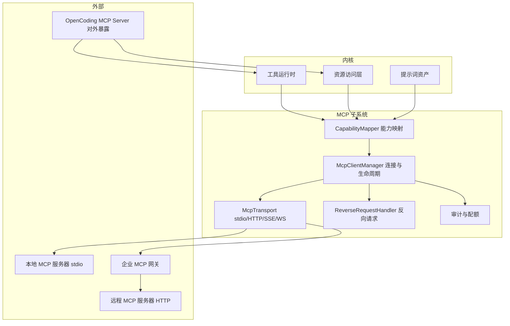
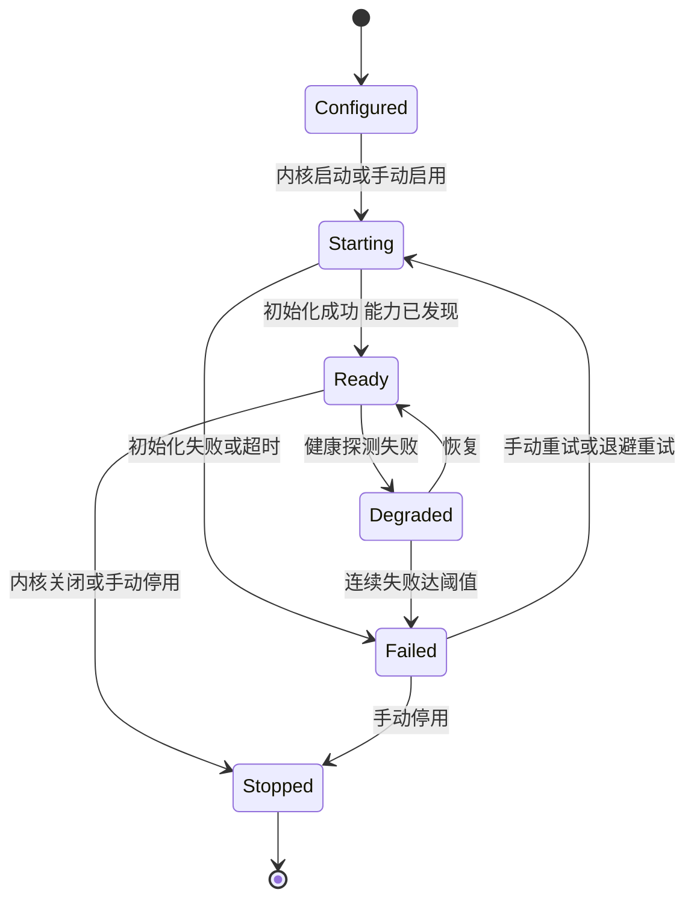

# 卷 09 · MCP 系统（Model Context Protocol）

> MCP 是 Agent 与外部能力之间的开放接线标准：本卷定义**客户端（接入外部 MCP 服务器）、服务端（把 OpenCoding 能力暴露给外部）、企业网关（集中治理）**三面，以及传输、认证、能力映射、故障隔离与审计。
>
> 需求来源：REQ-MCP-1…10（卷 00 §5.9）；竞品参照：Claude Code / Codex / DeepSeek 均支持 MCP 作为工具接入标准；全局约束：H-014（统一工具契约）、H-018（双向互操作）。

---

## 1. 本卷定位

- **解决**：外部工具/资源/提示词如何安全接入；我方能力如何被其他 Agent 复用。
- **不解决**：工具管线与权限（卷 05/06）、插件治理（卷 18）、A2A 任务级互操作（卷 23）。
- **边界**：MCP 工具接入后与内置工具**完全同构**（同一 `ToolSpec`、同一管线、同一权限）；MCP 资源与提示词的语义由本卷定义映射规则。

## 2. 需求与冲突点

| 需求 | 冲突/要点 |
| --- | --- |
| REQ-MCP-1 多传输 | stdio 简单但只适合本地进程；HTTP/SSE/WS 适合远程但需认证与网络策略 |
| REQ-MCP-2 生命周期 | 服务器可能崩溃/挂起 → 必须隔离且可自愈；启动顺序影响工具可用性 |
| REQ-MCP-3 能力发现 | 动态变化（工具增删）→ 需刷新机制与上下文同步 |
| REQ-MCP-4 认证 | OAuth 流程需要浏览器交互；无界面形态（CLI/服务）需要设备码或服务凭证 |
| REQ-MCP-5 企业网关 | 集中白名单与审计 vs 个人直连的便利 |
| REQ-MCP-7 沙箱 | 本地 stdio 服务器是任意代码 → 必须纳入沙箱与权限治理 |
| REQ-MCP-9 反向请求 | sampling（请求我方模型采样）与 elicitation（请求用户输入）会打破「工具单向调用」模型 |

## 3. 设计空间（M×N）

### D-MCP-1 传输支持

| 分支 | 描述 | 结论 |
| --- | --- | --- |
| B1 仅 stdio | 简单安全（本地进程） | 基线 |
| B2 stdio + Streamable HTTP | 覆盖远程 | **选定（叠加）** |
| B3 stdio + HTTP + SSE + WS 全量 | 覆盖最广；维护成本 | **选定（全量，SSE/WS 作为兼容层）** |

**结论**：传输抽象为 `McpTransport`，实现四类；默认按服务器声明优先级协商（HTTP 优先于 SSE）；本地服务器默认 stdio。

### D-MCP-2 服务器生命周期

| 分支 | 描述 | 结论 |
| --- | --- | --- |
| B1 内核托管（随内核启停） | 体验好；复杂度高 | **选定（默认，含健康检查与自动重启）** |
| B2 用户自管（外部启动） | 简单；体验差（需手动） | 支持（配置为 external 模式） |
| B3 集群托管（独立服务） | 企业规模；运维成本 | 备选（企业网关形态） |

**策略**：默认托管但**不阻塞内核启动**（并行启动 + 就绪通知）；启动失败即隔离并降级（其工具不可用，显式提示），支持手动重试与自动指数退避重启（上限后停止并告警）。

### D-MCP-3 能力映射

| 分支 | 描述 | 结论 |
| --- | --- | --- |
| B1 仅映射 tools | 简单；资源与提示词浪费 | 淘汰 |
| **B2 全映射：tools → ToolSpec；resources → 可读资源（经资源工具访问）；prompts → 提示词资产（只读导入）；roots 约定 → 工作区暴露；sampling/elicitation → 受控反向请求** | 能力不失真 | **选定**（F=9 U=8 S=8 M=9 → 85.5） |

**映射表**：

| MCP 能力 | 内核映射 | 权限处理 |
| --- | --- | --- |
| `tools` | `ToolSpec`（来源标记 `mcp:<server>`），走统一管线 | 逐调用决策（风险按工具描述 + 参数推断，服务器可声明风险提示） |
| `resources` | 虚拟资源（`mcp://<server>/<uri>`）；通过 `read_resource` 工具访问；可订阅变更 | 读权限 + 服务器访问控制；订阅变更生成事件 |
| `prompts` | 只读提示词资产（导入为 Fragment/Template，版本跟随服务器） | 无副作用；导入需用户确认 |
| `roots` | 工作区路径暴露协商（服务器可声明其根） | 路径围栏校验（卷 07） |
| `sampling` | 反向请求：服务器请求我方模型采样；生成「反向请求」事件，按策略允许/询问（可能消耗预算） | 视为模型调用，计量与预算约束 |
| `elicitation` | 反向请求：服务器请求用户输入；映射为 `ask_user` 类交互 | 需用户在场；无人值守时按策略拒绝或排队 |

### D-MCP-4 命名与冲突

| 分支 | 描述 | 结论 |
| --- | --- | --- |
| B1 直接用原始名 | 冲突风险 | 淘汰 |
| **B2 命名空间 `server.tool`，展示名可映射；与内置工具冲突时内置优先并生成告警；别名表支持模型友好名** | 可预期 | **选定**（F=8 U=8 S=9 M=8 → 82.5） |

### D-MCP-5 认证

| 分支 | 描述 | 结论 |
| --- | --- | --- |
| B1 环境变量密钥 | 简单；管理弱 | 基线 |
| **B2 OAuth 2.0 授权码 + PKCE（有界面）/ 设备码（无界面）/ 服务凭证（企业）+ 令牌存储于 `SecretPort`** | 覆盖多形态 | **选定**（F=9 U=8 S=8 M=9 → 85.5） |
| B3 仅静态密钥 | 不满足企业 SSO 要求 | 淘汰 |

### D-MCP-6 企业网关

| 分支 | 描述 | 结论 |
| --- | --- | --- |
| B1 无网关（客户端直连） | 简单；治理弱 | 基线 |
| **B2 网关模式：所有 MCP 流量经企业网关（白名单、审计、DLP、配额、统一凭证）** | 集中治理；个人形态可关闭 | **选定（企业默认开启）**（F=9 U=7 S=8 M=9 → 83.5） |

### D-MCP-7 我方作为 MCP 服务器

| 分支 | 描述 | 结论 |
| --- | --- | --- |
| B1 不暴露 | 生态单向 | 淘汰 |
| **B2 暴露能力面：工具（受权限约束的只读优先）、资源（工作区/知识库摘要）、提示词（组织资产）；写类工具默认不暴露，可由策略开启** | 被外部 Agent 复用，形成「能力提供者」角色 | **选定**（F=9 U=8 S=8 M=9 → 85.5） |

### D-MCP-8 故障隔离

| 分支 | 描述 | 结论 |
| --- | --- | --- |
| B1 无隔离（调用即阻塞） | 单点拖垮内核 | 淘汰 |
| **B2 每服务器独立执行域：超时、并发上限、熔断（连续失败）、输出限额、崩溃自动重启与退避、健康探测** | 韧性 | **选定**（F=9 U=8 S=9 M=9 → 88） |

### D-MCP-9 反向请求处理

| 分支 | 描述 | 结论 |
| --- | --- | --- |
| B1 全部拒绝 | 兼容性差（许多服务器依赖 sampling） | 基线 |
| **B2 策略化：sampling 默认「询问一次后按会话记忆」；无人值守下按预授权边界；elicitation 需交互，无界面时排队并通知** | 兼容与安全平衡 | **选定**（F=8 U=8 S=8 M=8 → 80） |

### D-MCP-10 版本与能力协商

| 分支 | 描述 | 结论 |
| --- | --- | --- |
| B1 固定单版本 | 兼容性差 | 淘汰 |
| **B2 协议版本矩阵 + 初始化协商 + 能力子集降级（不支持的能力显式关闭并留痕）** | 与 D-ARC-11 一致 | **选定**（F=9 U=7 S=9 M=9 → 86.5） |

## 4. 选定方案详设

### 4.1 架构

### 4.2 生命周期状态机

### 4.3 工具接入与上下文同步

| 环节 | 机制 |
| --- | --- |
| 发现 | 服务器 `tools/list` → 映射为 `ToolSpec`（描述保留原文 + 风险提示解析） |
| 变更 | `tools/list_changed` 通知 → 内核刷新工具集 → 影响后续轮次（当前轮次保持稳定，避免中途变更） |
| 上下文 | 工具描述进入上下文 S2 区段的工具清单；数量上限与裁剪由 D-TOOL-6 决定 |
| 别名 | 服务器工具名与内置冲突 → 命名空间化；模型友好别名可配置 |

### 4.4 安全模型

| 维度 | 要求 |
| --- | --- |
| 执行隔离 | 本地 stdio 服务器在沙箱内启动（卷 07），受资源限制与路径围栏 |
| 网络 | 远程服务器域名纳入网络白名单；网关模式强制代理 |
| 凭证 | 服务器凭证经 `SecretPort` 注入；不进入上下文与日志 |
| 权限 | MCP 工具与内置工具同权治理；高风险参数量级由风险推断（R0–R5） |
| 数据外发 | 调用参数可能含工作区内容 → 按外发风险（R3）判定与审计；企业可配置「禁止外发源代码」类 DLP 规则 |
| 反向请求 | sampling 消耗预算需计量；elicitation 需用户在场 |
| 供应链 | 服务器安装来源（npm/pip/容器镜像）记录并校验；企业可要求签名或私有源 |

### 4.5 对外暴露（OpenCoding as MCP Server）

| 暴露项 | 默认 | 说明 |
| --- | --- | --- |
| 只读工具（读文件/检索/知识/记忆召回） | 开启（需认证） | 供外部 Agent 复用 |
| 资源（工作区文件树、知识摘要） | 需显式授权 | 支持按 scope 授权 |
| 提示词资产（组织级） | 关闭 | 企业可开启共享 |
| 写类工具（编辑/命令） | 关闭 | 开启需策略 + 每次审批 |
| 会话控制（提交任务） | 关闭（走 A2A 卷 23） | 与 A2A 分工：MCP 提供「能力」，A2A 提供「任务」 |

## 5. 扩展点（供卷 18 汇总）

| 扩展点 | 说明 |
| --- | --- |
| `McpTransportSPI` | 新传输实现 |
| `McpAuthSPI` | 自定义认证（企业 SSO 对接） |
| `McpCapabilityMapperSPI` | 自定义能力映射策略 |
| `McpPolicySPI` | 服务器准入与数据外发策略 |
| `McpExposureSPI` | 对外暴露能力的选择器 |

## 6. 事件与可观测

| 事件 | 说明 |
| --- | --- |
| `mcp.server.state.changed` | 状态迁移（含失败原因） |
| `mcp.capability.discovered` / `changed` | 能力刷新 |
| `mcp.tool.invoked` / `mcp.tool.failed` | 调用审计（映射到工具事件，另加 server 维度） |
| `mcp.resource.read` / `mcp.resource.changed` | 资源访问与订阅 |
| `mcp.reverse.request` | 反向请求（类型、预算影响、用户决定） |
| `mcp.auth.completed` / `failed` | 认证链路 |
| `mcp.policy.denied` | 准入或外发策略拒绝 |

**指标**：`oc_mcp_server_up{server}`、`oc_mcp_request_latency_ms{server,method}`、`oc_mcp_error_total{server}`、`oc_mcp_restart_total`、`oc_mcp_egress_bytes{server}`。

## 7. 非功能设计

- **性能**：stdio 调用附加开销 ≤ 10ms；远程调用受网络限制；连接复用（HTTP keep-alive / 长连接）。
- **可靠性**：连接池与重试（幂等只读方法可重试；写方法按幂等键）；熔断阈值默认「5 次失败 / 60s 窗口」。
- **安全**：默认不接受未知服务器（需显式配置或网关白名单）；本地服务器默认沙箱；凭证不落地。
- **可维护**：服务器配置集中管理（项目级 + 用户级 + 组织级），支持一键诊断（握手、能力列表、延迟）。

## 8. 完成定义（DoD）

- [ ] 四类传输实现并有互操作测试（对接至少 3 个真实 MCP 服务器）。
- [ ] 六类能力映射全部落地，且反向请求（sampling/elicitation）有策略与用例。
- [ ] 生命周期状态机与自愈（重启/退避/熔断）在故障注入下通过。
- [ ] 企业网关模式可用（白名单 + 审计 + DLP 规则）。
- [ ] 作为 MCP Server 暴露只读能力，且被外部客户端成功调用（互操作用例）。
- [ ] 命名冲突与别名映射用例通过。
- [ ] 审计可回溯：任一 MCP 调用可查到服务器、方法、参数摘要（脱敏）、外发字节数与决策引用。

## 9. 域内决策汇总（D-MCP）

| ID | 主题 | 选定 |
| --- | --- | --- |
| D-MCP-1 | 传输 | stdio + HTTP 默认，全量支持 SSE/WS |
| D-MCP-2 | 生命周期 | 内核托管默认（并行启动、自愈），支持外部与集群托管 |
| D-MCP-3 | 能力映射 | 全映射（tools/resources/prompts/roots/sampling/elicitation） |
| D-MCP-4 | 命名冲突 | 命名空间 + 内置优先 + 别名表 |
| D-MCP-5 | 认证 | OAuth 授权码/设备码 + 服务凭证 + SecretPort |
| D-MCP-6 | 企业网关 | 企业默认经网关（白名单/审计/DLP/配额） |
| D-MCP-7 | 对外暴露 | 只读优先，写类默认关闭；任务级走 A2A |
| D-MCP-8 | 故障隔离 | 独立执行域 + 超时/熔断/重启/限额 |
| D-MCP-9 | 反向请求 | 策略化（询问一次记忆 / 无人值守按预授权 / elicitation 排队） |
| D-MCP-10 | 版本协商 | 版本矩阵 + 初始化协商 + 能力子集降级留痕 |

## 10. 开放问题与默认决策

| 项 | 默认决策 |
| --- | --- |
| 默认是否启用 MCP | 启用框架，但默认无服务器；首次添加服务器需用户显式配置 |
| 服务器配置来源 | 组织策略 + 项目配置 + 用户配置（三级合并，组织可锁定） |
| 服务器安装方式 | 默认「已有命令」；可管理「内置安装」（记录来源与版本） |
| sampling 预算 | 计入会话预算；单服务器限额可配 |
| 对外暴露的认证 | 默认 API Key + scope；企业可接 OAuth |
