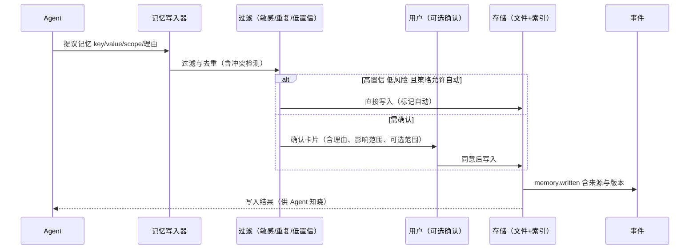

# 卷 10 · 记忆系统（Memory）

> 记忆让 Agent「认识你、认识这个项目、认识这个组织」：本卷定义**四层记忆模型、写入策略、召回管线、冲突与遗忘、隐私合规、治理与评测**。
>
> 需求来源：REQ-MEM-1…11（卷 00 §5.10）；竞品参照：REQ-CMP-10（记忆文件化可评审）、REQ-CMP-12（Repo Wiki 型项目知识）。

---

## 1. 本卷定位

- **解决**：什么值得记住、记到哪里、何时召回、如何删除、如何治理。
- **不解决**：知识文档索引（卷 11）、会话历史持久化与检索（卷 16/19，历史检索属「事实回溯」而非「记忆」）、提示词资产（卷 04）。
- **边界（关键）**：**记忆 ≠ 知识 ≠ 历史**。记忆是「跨会话可复用的偏好、约定与结论」；知识是「外部文档与代码的索引」；历史是「发生过什么的完整记录」。三者互不替代，检索时分别召回并带来源标注。

## 2. 需求与冲突点

| 需求 | 冲突/要点 |
| --- | --- |
| REQ-MEM-2 写入策略 | 自动写入便利 vs 污染风险 → 默认候选 + 确认 |
| REQ-MEM-3 召回 | 召回过多挤占上下文（S4 区段仅 5%）→ 需打分与预算裁剪 |
| REQ-MEM-4 文件化 | 可评审 vs 与 DB 双写一致性 → 文件为源、DB 为索引 |
| REQ-MEM-6 遗忘 | 合规删除必须能穿透备份与投影（NFR-S-6） |
| REQ-MEM-8 隐私 | PII 识别与脱敏；组织记忆涉及他人数据 |
| REQ-MEM-10 组织记忆 | 治理需要审批与署名；错误记忆影响面大 |

## 3. 设计空间（M×N）

### D-MEM-1 分层模型

| 分支 | 描述 | 结论 |
| --- | --- | --- |
| B1 单层（全部塞一处） | 简单；无法治理 | 淘汰 |
| **B2 四层：工作记忆（任务黑板）/ 会话记忆 / 项目记忆 / 组织记忆** | 每层有明确生命周期、权限与存储位置 | **选定**（F=9 U=8 S=8 M=9 → 85.5） |

| 层 | 内容 | 生命周期 | 存储 | 典型条目 |
| --- | --- | --- | --- | --- |
| 工作记忆 | 当前任务的中间结论、假设、待验证项 | 任务结束即释放 | 内存 + 事件 | 「假设 A 成立，待验证」 |
| 会话记忆 | 跨轮摘要、决策、用户偏好（本会话） | 会话存活期 | 会话存储 | 「用户偏好小步提交」 |
| 项目记忆 | 仓库约定、架构决策、约定俗成 | 长期（随项目） | 文件化（`.oc/memory/`）+ 索引 | 「本项目禁止直接操作生产库」 |
| 组织记忆 | 跨项目规范、组织偏好、共享结论 | 长期（组织） | 组织库（权限受控） | 「发布必须走双人评审」 |

### D-MEM-2 写入策略

| 分支 | 描述 | 结论 |
| --- | --- | --- |
| B1 全自动写入 | 便利；噪声与污染 | 淘汰 |
| B2 仅显式指令写入（用户说「记住」） | 干净；覆盖率低 | 基线 |
| **B3 候选机制：Agent 提议 → 策略过滤（敏感/重复/低置信）→ 用户确认（可配置自动批准阈值）→ 落库；高置信且低风险可自动写入但必须可追溯与可撤销** | 平衡覆盖率与洁净度 | **选定**（F=9 U=8 S=8 M=9 → 85.5） |

### D-MEM-3 存储与格式

| 分支 | 描述 | 结论 |
| --- | --- | --- |
| B1 纯 DB | 治理强；评审与版本化弱 | 基线 |
| B2 纯文件 | 可评审；检索与权限弱 | 淘汰 |
| **B3 文件为源（项目/组织层）+ DB 为索引与元数据（含向量）+ 双向同步（文件变更 → 索引重建；界面编辑 → 写文件）** | 兼得 | **选定**（F=9 U=8 S=8 M=9 → 85.5） |

### D-MEM-4 召回管线

| 分支 | 描述 | 结论 |
| --- | --- | --- |
| B1 关键词匹配 | 简单；召回质量差 | 淘汰 |
| B2 纯向量 | 语义好；精确项（路径、命令、版本号）易漏 | 基线 |
| **B3 混合召回：规则优先（scope/标签/路径）+ 全文 + 向量，重排后按预算裁剪，全部带来源与置信度** | 精度与召回兼得 | **选定**（F=9 U=8 S=8 M=9 → 85.5） |

### D-MEM-5 冲突检测与合并

| 分支 | 描述 | 结论 |
| --- | --- | --- |
| B1 后写覆盖 | 危险（丢失历史结论） | 淘汰 |
| B2 全部保留（矛盾共存） | 模型困惑 | 淘汰 |
| **B3 冲突检测（同键不同值/语义矛盾）+ 分级处置：低风险提示、高风险进入合并确认；保留历史版本（可审计）** | 安全演进 | **选定**（F=8 U=8 S=8 M=8 → 80） |

### D-MEM-6 遗忘与删除

| 分支 | 描述 | 结论 |
| --- | --- | --- |
| B1 软删（标记） | 简单；不满足合规 | 基线 |
| **B2 分级：TTL 过期自动归档 → 用户删除（软删 + 索引清理）→ 合规删除（穿透备份与投影，生成删除证明）** | 满足 NFR-S-6 | **选定**（F=9 U=8 S=8 M=9 → 85.5） |

### D-MEM-7 隐私与脱敏

| 分支 | 描述 | 结论 |
| --- | --- | --- |
| B1 无处理 | 违规风险 | 淘汰 |
| **B2 写入前 PII 检测（可配置类型）+ 脱敏或拒绝 + 加密存储（敏感类）+ 访问审计** | 合规 | **选定**（F=8 U=7 S=8 M=9 → 81） |

### D-MEM-8 组织记忆治理

| 分支 | 描述 | 结论 |
| --- | --- | --- |
| B1 自由写入 | 污染组织记忆 | 淘汰 |
| **B2 提案-评审-发布流程：署名、理由、影响范围、评审人；版本化；可回滚；过期复审提醒** | 组织知识资产化 | **选定**（F=9 U=7 S=8 M=9 → 84） |

### D-MEM-9 与知识库的边界

| 分支 | 描述 | 结论 |
| --- | --- | --- |
| B1 合并为一个大库 | 概念混淆、治理混乱 | 淘汰 |
| **B2 保持分离：记忆=简短可执行结论（偏好/约定/决策）；知识=文档与代码索引；召回时分别标注来源类型** | 概念清晰 | **选定**（F=8 U=8 S=8 M=9 → 82.5） |

### D-MEM-10 质量评测

| 分支 | 描述 | 结论 |
| --- | --- | --- |
| B1 无 | 无法发现污染 | 淘汰 |
| **B2 指标：召回命中率、误用率（用户纠正次数）、过期率、冲突率；支持「错误记忆一键纠正并反哺规则」** | 持续改进 | **选定**（F=8 U=8 S=8 M=8 → 80） |

### D-MEM-11 导入导出与迁移

| 分支 | 描述 | 结论 |
| --- | --- | --- |
| B1 不支持 | 数据锁定 | 淘汰 |
| **B2 全量导出/导入（含版本与来源），跨实例迁移，格式开放（Markdown + JSON）** | 满足产品铁律 10 | **选定**（F=8 U=8 S=8 M=8 → 80） |

## 4. 选定方案详设

### 4.1 记忆条目模型

| 字段 | 说明 |
| --- | --- |
| `memoryId` / `scope`（work/session/project/org） | 定位与归属 |
| `key` / `value` | 可执行的简短结论（value 限制长度，超长转知识库） |
| `tags` / `paths` | 便于规则召回（模块、语言、工作区路径） |
| `confidence` | 置信度（来源：用户确认 > Agent 提议 > 推断） |
| `source` | 来源（会话/任务/工具/导入）与引用 |
| `ttl` / `reviewAt` | 过期与复审时间 |
| `status` | active / superseded / archived / deleted |
| `supersedes` / `supersededBy` | 版本链 |
| `sensitivity` | 公开/内部/敏感（影响加密与展示） |
| `author` | 作者（用户/Agent/团队） |

### 4.2 写入流程

### 4.3 召回管线

### 4.4 项目记忆文件化

| 方面 | 设计 |
| --- | --- |
| 位置 | 工作区 `.oc/memory/*.md`（随仓库版本化，可评审） |
| 格式 | Markdown + YAML 头（key/scope/tags/ttl/status） |
| 同步 | 启动与文件监听变更 → 重建索引；界面编辑 → 写回文件（避免双写冲突，以文件为准） |
| 冲突 | 文件被外部修改与 DB 版本不一致 → 提示并以文件为准（记录 `memory.drift.detected`） |
| 隐私 | 项目记忆入库前过 PII 检查；敏感项默认不写入文件（仅本地 DB） |

### 4.5 遗忘与合规删除

| 级别 | 行为 | 证明 |
| --- | --- | --- |
| TTL 过期 | 转 archived（不再召回，仍可查） | 事件 |
| 用户删除 | 软删 + 索引清理（不可召回） | 事件 + 界面可查 |
| 合规删除 | 软删 + 备份标记（后续备份自动排除）+ 索引清除 + 向量清除 + 生成删除证明（含时间、范围、执行者） | 删除证明可供审计导出 |

## 5. 扩展点（供卷 18 汇总）

| 扩展点 | 说明 |
| --- | --- |
| `MemoryStoreSPI` | 记忆后端（文件/DB/远端组织库） |
| `MemoryWriterSPI` | 写入策略（企业自定义审批流） |
| `MemoryRankerSPI` | 召回打分与重排 |
| `PiiDetectorSPI` | PII 识别（企业规则/模型） |
| `MemorySyncSPI` | 外部系统同步（如企业内部 Wiki/Notion） |

## 6. 事件与可观测

| 事件 | 说明 |
| --- | --- |
| `memory.proposed` / `memory.written` / `memory.rejected` | 写入链路（含理由） |
| `memory.recalled` | 召回（条目 ID、分数、是否被使用） |
| `memory.conflict.detected` / `resolved` | 冲突 |
| `memory.expired` / `deleted` / `compliance_deleted` | 生命周期 |
| `memory.corrected` | 用户纠正（反哺规则） |
| `memory.drift.detected` | 文件与索引不一致 |

**指标**：`oc_memory_write_total{how}`、`oc_memory_recall_total`、`oc_memory_precision`（抽样）、`oc_memory_correction_total`、`oc_memory_conflict_total`、`oc_memory_compliance_delete_total`。

## 7. 非功能设计

- **性能**：召回 P95 ≤ 150ms（含向量检索）；写入异步（不阻塞对话，确认卡片可延迟出现）。
- **容量**：单项目记忆条目默认上限 5k；超限提示归档；组织记忆 ≥ 100k 条目仍可检索。
- **一致性**：文件为项目/组织层真源；索引最终一致（≤ 5s）；漂移可检测可修复。
- **安全**：敏感条目加密存储；召回严格按权限过滤（跨租户零共享）；删除可证明。
- **可用性**：记忆系统不可用时降级为「无记忆」模式（显式提示，功能可用）。

## 8. 完成定义（DoD）

- [ ] 四层记忆落地，且每层有明确的写入、召回、过期用例。
- [ ] 候选写入链路（含自动批准阈值）可用，且每次写入可追溯到来源。
- [ ] 混合召回实现并有质量基线（召回命中率 ≥ 目标值，由卷 26 定义）。
- [ ] 项目记忆文件化双向同步可用；漂移检测有效。
- [ ] 合规删除穿透备份与向量（演练证明），并生成删除证明。
- [ ] PII 检测与脱敏覆盖配置类型（手机号、邮箱、证件、密钥）。
- [ ] 组织记忆提案-评审-发布流程可用，含版本与回滚。
- [ ] 记忆纠正可反哺（纠正后同类提议被拦截或降级）。

## 9. 域内决策汇总（D-MEM）

| ID | 主题 | 选定 |
| --- | --- | --- |
| D-MEM-1 | 分层 | 工作/会话/项目/组织四层 |
| D-MEM-2 | 写入 | 候选机制 + 策略过滤 + 可配置自动批准 |
| D-MEM-3 | 存储 | 文件为源（项目/组织）+ DB 索引与元数据 |
| D-MEM-4 | 召回 | 规则 + 全文 + 向量混合，重排后预算裁剪 |
| D-MEM-5 | 冲突 | 检测 + 分级处置 + 版本链保留 |
| D-MEM-6 | 遗忘 | TTL 归档 / 软删 / 合规删除（含证明） |
| D-MEM-7 | 隐私 | PII 检测 + 脱敏 + 加密 + 访问审计 |
| D-MEM-8 | 组织治理 | 提案-评审-发布 + 复审提醒 |
| D-MEM-9 | 与知识边界 | 分离并标注来源类型 |
| D-MEM-10 | 质量评测 | 命中/误用/过期/冲突指标 + 纠正反哺 |
| D-MEM-11 | 迁移 | 开放格式全量导入导出 |

## 10. 开放问题与默认决策

| 项 | 默认决策 |
| --- | --- |
| 工作记忆存储 | 仅内存 + 事件（不持久化为记忆，检查点中已有结构化保存） |
| 自动写入阈值 | 默认关闭自动写入（全候选确认）；用户可开启「低风险自动」 |
| 项目记忆默认是否入库 | 默认不入库（尊重仓库隐私）；用户可在项目内启用 |
| 记忆注入位置 | 固定注入 S4 区段，且带「仅供参考，可能过期」标注 |
| 组织记忆的可见范围 | 默认全组织可见（不含敏感级）；敏感级按角色 |
