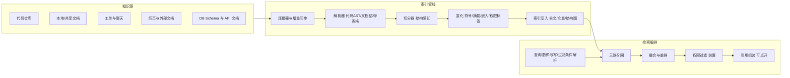

# 卷 11 · 知识库系统（Knowledge Base）

> 知识库让 Agent「知道代码与文档里的事实」：本卷定义**连接器、解析与切分、三类索引、混合检索与重排、权限过滤、引用溯源、项目知识页与知识治理**。
>
> 需求来源：REQ-KB-1…10（卷 00 §5.11）；竞品参照：REQ-CMP-12（Repo Wiki 型项目知识）、H-017（混合检索）。

---

## 1. 本卷定位

- **解决**：从哪儿取知识、怎么切、怎么索引、怎么检索、怎么保证「只给有权限的人看」、怎么让人信（引用）。
- **不解决**：记忆（卷 10）、上下文注入预算（卷 03，知识只是 S5 区段来源之一）、工作区文件操作（卷 20）。
- **边界**：知识库只提供「检索与引用」，不直接修改工作区；任何由知识驱动的代码改动仍走工具与权限链路。

## 2. 需求与冲突点

| 需求 | 冲突/要点 |
| --- | --- |
| REQ-KB-3 三类索引 | 存储与维护成本 vs 检索质量 → 逐路可降级 |
| REQ-KB-4 混合检索 | 延迟预算（P95 ≤ 300ms）vs 重排质量 → 异步重排 + 流式返回 |
| REQ-KB-5 权限过滤 | 后置过滤会泄漏（存在性侧信道）→ 必须**前置过滤** |
| REQ-KB-7 索引健康 | 大仓重建成本高 → 增量 + 可恢复 + 后台重建 |
| REQ-KB-8 知识页 | 生成内容可能过时 → 需版本与过期标记 |

## 3. 设计空间（M×N）

### D-KB-1 范围与形态

| 分支 | 描述 | 结论 |
| --- | --- | --- |
| B1 仅工作区代码索引 | 简单；无法服务文档知识 | 基线 |
| B2 仅企业文档库 | 缺失代码理解 | 淘汰 |
| **B3 统一知识平台：多源（代码/文档/工单/聊天/网页/DB Schema）统一接入、统一检索、按来源标注** | 覆盖「编码 + 办公 + 设计」多模态定位 | **选定**（F=9 U=8 S=8 M=9 → 85.5） |

### D-KB-2 索引存储

| 分支 | 描述 | 结论 |
| --- | --- | --- |
| B1 全部落 PostgreSQL（FTS + 向量扩展 + 邻接表图） | 单栈运维、事务一致、企业已有 PG | **选定（默认）**（F=8 U=8 S=9 M=9 → 85） |
| B2 专用检索引擎（如 Elasticsearch/OpenSearch） | 检索能力强；运维成本、部署复杂度 | 备选（规模阈值触发） |
| B3 专用向量库 | 向量性能好；再引一套运维 | 备选（向量规模阈值触发） |

**决策**：默认 B1（PG 全文 + 向量扩展 + 图以「边表」形式存储）；当单租户文档块 > 500 万 或 检索 P95 超预算时，通过 `IndexStorePort` 切换 B2/B3（接口不变，配置切换）。

### D-KB-3 切分策略

| 分支 | 描述 | 结论 |
| --- | --- | --- |
| B1 固定窗口切分 | 简单；破坏语义 | 淘汰 |
| B2 结构感知切分（代码按 AST 节点/函数/类；文档按标题层级；表格整块；聊天按会话窗口） | 语义完整、引用精确 | **选定**（F=9 U=8 S=8 M=9 → 85.5） |
| B3 语义切分（模型判断边界） | 质量略高；成本与不确定性 | 叠加（对长文档可用，作为可选富化） |

### D-KB-4 检索路径

| 分支 | 描述 | 结论 |
| --- | --- | --- |
| B1 仅全文 | 精确匹配强；语义弱 | 基线 |
| B2 仅向量 | 语义强；精确符号/路径易漏 | 基线 |
| **B3 三路混合：全文（BM25）+ 向量 + 代码符号/结构（符号名、调用关系、路径模式）；融合排序 + 重排模型（可选）** | 代码场景最优 | **选定**（F=9 U=8 S=8 M=9 → 85.5） |

### D-KB-5 代码理解深度

| 分支 | 描述 | 结论 |
| --- | --- | --- |
| B1 文件级切分 | 浅 | 基线 |
| B2 符号级（函数/类/变量定义与引用） | 中 | 基线 |
| **B3 符号级 + 结构图（导入/调用/继承/依赖边）+ 模块摘要** | 支持「谁调用我、改这里会影响谁」类问题 | **选定**（F=9 U=8 S=7 M=8 → 80.5） |

### D-KB-6 增量索引

| 分支 | 描述 | 结论 |
| --- | --- | --- |
| B1 定时全量重建 | 简单；大仓不可行 | 淘汰 |
| B2 变更检测增量（文件哈希 + 差异解析） | 可行 | **选定（组合）** |
| B3 事件驱动（文件系统监听 + Git 钩子 + 提交事件） | 实时；平台差异 | **选定（组合）** |

**策略**：三源触发（初次全量、文件监听、Git 变更事件）+ 合并去抖（同文件多次变更合并）+ 后台批量提交索引；索引与工作区版本（提交哈希）绑定，保证引用可解释。

### D-KB-7 权限过滤

| 分支 | 描述 | 结论 |
| --- | --- | --- |
| B1 后置过滤（检索后过滤） | 简单；存在侧信道泄漏与结果数不足 | 淘汰 |
| **B2 前置过滤（权限标签进索引，检索时按租户/项目/ACL 过滤候选集）** | 安全 | **选定**（F=9 U=7 S=8 M=9 → 83.5） |
| B3 索引物理隔离（每租户独立索引） | 最强；成本高 | 备选（企业高隔离档） |

### D-KB-8 连接器

| 分支 | 描述 | 结论 |
| --- | --- | --- |
| B1 少量内置（本地文件 + 仓库） | 起步 | 基线 |
| **B2 连接器框架 + 内置连接器族（本地/仓库/工单/聊天/网页/对象存储/DB Schema/API 文档），支持增量同步与凭据隔离** | 企业知识入口完整 | **选定**（F=9 U=8 S=8 M=9 → 85.5） |

### D-KB-9 引用与溯源

| 分支 | 描述 | 结论 |
| --- | --- | --- |
| B1 无引用 | 不可信 | 淘汰 |
| **B2 强制引用：每条检索结果携带来源（文件+行号/文档+块 ID/URL+抓取时间）与版本（提交哈希/文档版本）；注入上下文时保留可点开链接** | 可信与可验证 | **选定**（F=9 U=9 S=8 M=9 → 88） |

### D-KB-10 项目知识页

| 分支 | 描述 | 结论 |
| --- | --- | --- |
| B1 不生成 | 无此能力 | 淘汰 |
| **B2 生成项目知识页（架构概览/模块地图/关键流程/术语表/常见变更点），随代码版本更新，标注生成时间与来源，可人工编辑并回写** | 对标 REQ-CMP-12 | **选定**（F=8 U=9 S=7 M=8 → 79.5） |
| B3 自动持续重写 | 噪声与漂移 | 淘汰 |

### D-KB-11 知识治理

| 分支 | 描述 | 结论 |
| --- | --- | --- |
| B1 无治理 | 陈旧知识误导 | 淘汰 |
| **B2 陈旧检测（引用失效/版本落后/长期未访问）+ 审核流（组织知识）+ 贡献度量 + 过期降权** | 长期质量 | **选定**（F=8 U=8 S=8 M=9 → 82.5） |

### D-KB-12 多租户与容量

| 分支 | 描述 | 结论 |
| --- | --- | --- |
| B1 共享索引 + 租户字段 | 成本低 | **选定（默认）** |
| B2 独立索引实例 | 隔离强；成本高 | 备选（高隔离客户） |

## 4. 选定方案详设

### 4.1 架构

### 4.2 检索管线与延迟预算

| 阶段 | 预算 | 说明 |
| --- | --- | --- |
| 查询理解（改写/过滤解析） | ≤ 30ms | 规则优先；模型改写可选（命中缓存） |
| 三路召回 | ≤ 100ms | 并行发起 |
| 融合 + 重排 | ≤ 120ms | 重排可异步（先返回初排，再补精排） |
| 权限过滤 + 引用组装 | ≤ 50ms | 前置过滤在召回内完成，此处为最终校验 |
| 总计 | ≤ 300ms（P95） | 与 NFR-P-8 对齐 |

### 4.3 引用模型

| 来源类型 | 引用形式 | 可点开行为 |
| --- | --- | --- |
| 代码 | `repo://<workspace>/<path>#L120-L160@<commit>` | 打开文件并高亮行；若已变更提示差异 |
| 文档 | `doc://<docId>#chunk=n@v<ver>` | 打开文档并定位块 |
| 网页 | `url://<url>#captured=<ts>` | 打开链接 + 显示抓取快照 |
| 工单/聊天 | `ticket://<id>#comment=n` / `chat://<id>#msg=n` | 打开原始条目（受权限） |
| 知识页 | `wiki://<pageId>@v<ver>` | 打开知识页（含生成元数据） |

**规则**：注入上下文的每条知识必须带引用；无引用的内容不得标注为「知识」（可标注为「推测」）。

### 4.4 项目知识页生成

| 方面 | 设计 |
| --- | --- |
| 触发 | 首次索引完成、重大提交（阈值可配）、用户显式请求、定期（可配） |
| 内容 | 架构概览、模块地图、依赖关系、关键流程（入口/主链路）、术语表、常见变更点、测试与构建方式 |
| 生成方式 | 检索 + 符号图 + 模型总结；输出结构化文档（Markdown + 元数据） |
| 溯源 | 每个结论附来源（文件/符号/提交）；无法溯源的结论标注「待确认」 |
| 维护 | 可人工编辑；编辑后不再被自动覆盖（仅提示可能过时）；版本化（可对比） |
| 存储 | 作为知识库中的特殊文档类型（`wiki://`），参与检索 |

### 4.5 权限与多租户

| 机制 | 说明 |
| --- | --- |
| 权限标签 | 索引时写入（租户、项目、可见范围、文档 ACL 摘要） |
| 前置过滤 | 所有召回路径在检索条件中带权限约束（杜绝后置过滤的侧信道） |
| 凭据隔离 | 连接器凭据经 `SecretPort`；不同数据源独立凭证 |
| 审计 | 检索与引用打开均记录（谁、何时、查了什么、返回了哪些来源） |
| 跨租户 | 默认零共享；企业可配置「共享知识域」（需显式授权与审计） |

### 4.6 知识治理

| 机制 | 说明 |
| --- | --- |
| 陈旧检测 | 引用失效（文件/符号不存在）、版本落后（提交差 > N）、长期未访问（> 90 天）、被新版本取代 |
| 降权 | 陈旧项检索排序降权，并在引用中标注「可能过时（最后验证于 X）」 |
| 审核 | 组织知识需评审发布；审核记录入库 |
| 贡献度量 | 按来源与作者统计使用频次与采纳率（供团队评估知识资产价值） |
| 失效反馈 | 用户/Agent 标记「此知识有误」→ 进入修复队列，修复后回写索引 |

## 5. 扩展点（供卷 18 汇总）

| 扩展点 | 说明 |
| --- | --- |
| `ConnectorSPI` | 新知识源连接器 |
| `ParserSPI` | 新格式解析器 |
| `ChunkerSPI` | 自定义切分策略 |
| `EmbeddingProviderSPI` | 嵌入模型来源（与卷 02 共用） |
| `RerankerSPI` | 重排模型与策略 |
| `IndexStoreSPI` | 索引存储后端（PG/检索引擎/向量库） |
| `KnowledgePolicySPI` | 知识可见性与治理策略 |

## 6. 事件与可观测

| 事件 | 说明 |
| --- | --- |
| `kb.source.added` / `removed` / `sync.completed` | 连接器生命周期与同步结果 |
| `kb.index.progress` / `kb.index.completed` / `kb.index.failed` | 索引过程（含块数、耗时、失败原因） |
| `kb.query.executed` | 查询、召回路数、命中数、延迟分解、权限过滤数 |
| `kb.citation.opened` | 引用打开（审计） |
| `kb.stale.detected` / `kb.feedback.reported` | 治理 |
| `kb.wiki.generated` / `kb.wiki.edited` | 知识页 |

**指标**：`oc_kb_index_chunks_total{source}`、`oc_kb_index_lag_seconds`、`oc_kb_query_latency_ms{phase}`、`oc_kb_recall_hit_ratio`、`oc_kb_citation_open_total`、`oc_kb_stale_ratio`。

## 7. 非功能设计

- **性能**：100k 文件首次索引 ≤ 10min（NFR-P-8）；增量索引延迟 ≤ 30s（从文件变更到可检索）。
- **容量**：单租户 ≥ 500 万块；向量维度与存储按模型固定并记录版本（换模型需重建，后台渐进迁移）。
- **可靠性**：索引失败可断点续传；索引与工作区版本绑定，落后者可识别；索引损坏可从源重建。
- **安全**：前置权限过滤；连接器凭据隔离；代码外发（外部嵌入服务）默认禁用，须显式开启（air-gapped 强制本地嵌入）。
- **成本**：嵌入调用计量并计入预算；大仓可配置「仅索引变更与关键路径」。

## 8. 完成定义（DoD）

- [ ] 连接器框架与 ≥ 4 个内置连接器（本地/仓库/文档/DB Schema）可用，支持增量同步。
- [ ] 三路检索全部可用，且任一路不可用时降级不报错（显式标注）。
- [ ] 权限前置过滤有效：越权用例无法通过检索「探测」到无权文档（含计数侧信道测试）。
- [ ] 引用模型 5 类来源全部可跳转，且失效引用能检测与标注。
- [ ] 项目知识页可生成、可编辑、可对比，且结论带溯源标注。
- [ ] 陈旧检测与降权生效（用例：删除被引用文件后知识被标记过时）。
- [ ] 增量索引延迟 ≤ 30s（大仓抽样验证）。
- [ ] 换嵌入模型时的渐进迁移路径可用（新旧索引并存期检索可用）。

## 9. 域内决策汇总（D-KB）

| ID | 主题 | 选定 |
| --- | --- | --- |
| D-KB-1 | 范围 | 统一知识平台（多源统一检索） |
| D-KB-2 | 索引存储 | PG 默认（全文+向量+边表），规模触发切换专用引擎 |
| D-KB-3 | 切分 | 结构感知（代码 AST/文档结构），长文档可选语义切分 |
| D-KB-4 | 检索 | 三路混合 + 融合重排 |
| D-KB-5 | 代码理解 | 符号级 + 结构图 + 模块摘要 |
| D-KB-6 | 增量 | 变更检测 + 事件驱动 + 去抖合并 |
| D-KB-7 | 权限 | 前置过滤（标签进索引） |
| D-KB-8 | 连接器 | 框架 + 内置连接器族 |
| D-KB-9 | 引用 | 强制引用 + 版本绑定 + 可打开 |
| D-KB-10 | 知识页 | 版本化生成 + 可编辑 + 溯源标注 |
| D-KB-11 | 治理 | 陈旧检测 + 降权 + 审核 + 贡献度量 |
| D-KB-12 | 多租户 | 共享索引 + 租户字段（高隔离可切独立实例） |

## 10. 开放问题与默认决策

| 项 | 默认决策 |
| --- | --- |
| 默认嵌入模型 | 取已配置模型目录中的嵌入模型；无则语义路关闭（显式提示） |
| 大文件处理 | > 5MB 或 > 2 万行文件按结构切分并抽样索引（保留符号） |
| 二进制/媒体 | 仅索引元数据与可提取文本（PDF/Office 经解析器） |
| 索引存储位置 | local 形态落本地 PG；server 形态落共享 PG（可切检索引擎） |
| 多仓工作区 | 每仓独立索引命名空间，检索时按工作区集合合并 |
