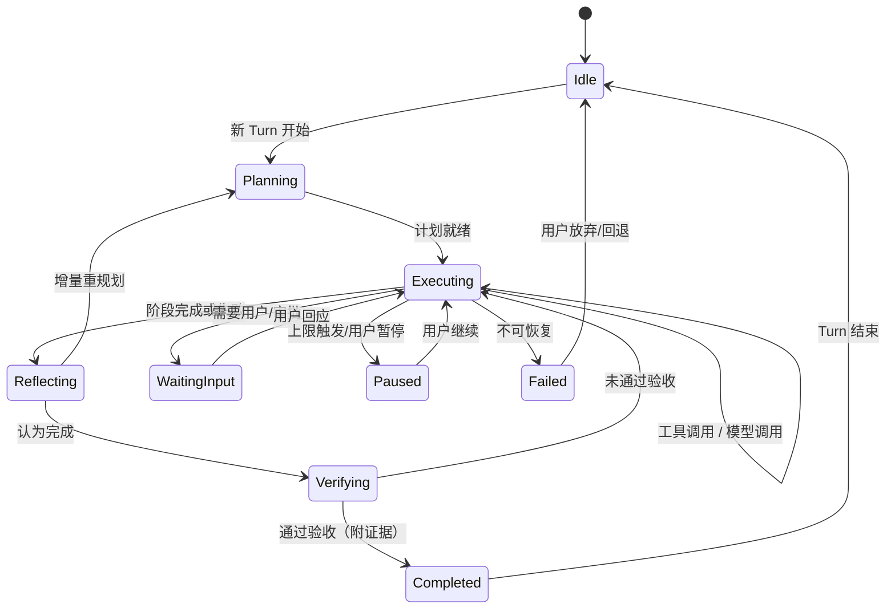
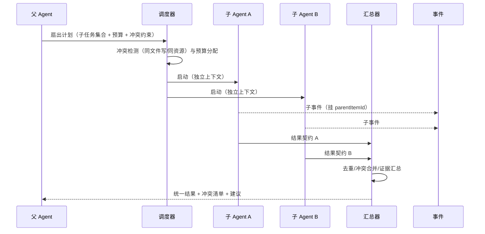

# 卷 12 · Agent 内核（Agent Runtime）

> Agent 内核是 Harness 的心脏：本卷定义**主循环范式、Thread/Turn/Item 生命周期原语、计划-执行-反思耦合、SubAgent 派生与隔离、并发扇出与汇总、人工介入、失败恢复、循环防护、自主度、自检验收、长任务与轨迹**。
>
> 需求来源：REQ-AG-1…14（卷 00 §5.12）；竞品参照：REQ-CMP-2（Thread/Turn/Item 原语）、REQ-CMP-7（SubAgent 独立上下文与权限）。

---

## 1. 本卷定位

- **解决**：一次「干活」如何被组织成可观测、可中断、可恢复、可评测的过程。
- **不解决**：模型调用细节（卷 02）、上下文装配（卷 03）、工具执行（卷 05）、团队级编排（卷 13）、任务/计划持久模型（卷 14）。
- **边界**：内核负责「单会话内的智能行为」；跨会话/跨角色的编排属于卷 13 与卷 14/15。

## 2. 需求与冲突点

| 需求 | 冲突/要点 |
| --- | --- |
| REQ-AG-1 主循环 | 灵活（ReAct）vs 可控（计划先行）→ 需要**模式化**而非二选一 |
| REQ-AG-2 检查点 | 恢复精度 vs 存储成本（与卷 03/19 协同） |
| REQ-AG-4/5 SubAgent | 上下文隔离（省预算、防污染）vs 信息共享（避免重复劳动） |
| REQ-AG-6 人工介入 | 随时可插话 vs 状态一致性（介入点需定义） |
| REQ-AG-8 失败恢复 | 重试（可能重复副作用）vs 回滚（可能丢失进展） |
| REQ-AG-9 循环防护 | 步数硬上限（简单粗暴）vs 进展度量（复杂但精准） |
| REQ-AG-11 自检 | 模型自评（可能自欺）vs 外部验证（测试/构建）→ 以外部为主 |

## 3. 设计空间（M×N）

### D-AG-1 循环范式

| 分支 | 描述 | 结论 |
| --- | --- | --- |
| B1 纯 ReAct（思考-行动-观察循环） | 简单；长任务易漂移、缺少全局视野 | 基线 |
| B2 计划-执行-反思（Plan-Execute-Reflect 严格三段） | 结构强；小任务过重 | 基线 |
| **B3 混合状态机 + 可插拔策略：默认「轻计划 + 执行 + 周期反思」，可切换为严格计划模式或纯 ReAct；状态机保证任一策略下都可中断/恢复** | 覆盖短任务与长任务；策略可按模式配置 | **选定**（F=9 U=8 S=8 M=9 → 85.5） |

### D-AG-2 生命周期原语

| 分支 | 描述 | 结论 |
| --- | --- | --- |
| B1 消息流（Chat 语义） | 简单；难以表达阶段与统计 | 淘汰 |
| **B2 Thread / Turn / Item 三段原语：Thread=会话主线；Turn=一次用户意图到完成（可含多次模型调用与工具调用）；Item=原子输入输出（消息、工具调用、审批、检查点、系统通知）** | 与事件日志天然对齐；UI 可分层渲染；统计可按 Turn 归因（成本/时长/工具数） | **选定**（F=10 U=8 S=9 M=9 → 90） |
| B3 自定义树（探索式分支） | 灵活；复杂 | 备选（P3 探索：多分支推理） |

### D-AG-3 计划与执行的耦合

| 分支 | 描述 | 结论 |
| --- | --- | --- |
| B1 严格先计划后执行 | 可预测；前期开销大 | 模式可选 |
| B2 完全边做边计划 | 灵活；长任务易失控 | 模式可选 |
| **B3 自适应：任务复杂度评估决定初始计划深度；执行中按触发条件（新信息、失败、用户变更、偏离检测）增量重规划** | 成本与可控平衡 | **选定**（F=9 U=9 S=8 M=9 → 87.5） |

**复杂度评估维度**（用于决定初始计划深度）：涉及文件数估计、是否跨模块、是否含不可逆动作、验收标准是否明确、历史同类任务成功率。

### D-AG-4 SubAgent 派生形态

| 分支 | 描述 | 结论 |
| --- | --- | --- |
| B1 同一会话内的「角色切换」 | 简单；上下文无法隔离 | 淘汰 |
| **B2 子会话（独立 Thread，共享工作区与事件主链，独立上下文与预算）** | 隔离与共享兼得；可在 UI 中折叠展开 | **选定**（F=9 U=8 S=9 M=9 → 88） |
| B3 独立进程/沙箱会话 | 隔离最强；成本高 | 备选（不可信任务或跨机并行） |

### D-AG-5 SubAgent 上下文隔离策略

| 分支 | 描述 | 结论 |
| --- | --- | --- |
| B1 完全隔离（仅传任务描述） | 省预算、防污染；信息可能不足 | 基线 |
| B2 完全继承（共享全部上下文） | 信息足；预算爆炸与污染 | 淘汰 |
| **B3 选择性继承：任务简报（结构化，由父 Agent 生成）+ 显式引用（文件/知识/工件）+ 只读约束；子 Agent 不能写父上下文** | 可控且高效 | **选定**（F=9 U=8 S=8 M=9 → 85.5） |

### D-AG-6 并发派生

| 分支 | 描述 | 结论 |
| --- | --- | --- |
| B1 顺序派生 | 简单；慢 | 基线 |
| **B2 并行扇出 + 汇总（fan-out/fan-in）：声明式定义子任务集，调度器按资源与预算并行执行，结果结构化合并且去重；冲突检测（同文件写）前置拦截** | 大任务提速关键 | **选定**（F=9 U=8 S=8 M=9 → 85.5） |
| B3 无限并行 | 资源与成本失控 | 淘汰 |

### D-AG-7 人工介入

| 分支 | 描述 | 结论 |
| --- | --- | --- |
| B1 仅审批点介入 | 介入机会少 | 基线 |
| **B2 三类介入：① 即时插话（steer，在轮次边界的下一个安全点生效）② 暂停/接管（暂停后编辑计划或手动执行）③ 审批（工具/动作级）** | 覆盖不同颗粒度 | **选定**（F=9 U=9 S=8 M=8 → 85.5） |
| B3 随时硬中断 | 状态不一致风险 | 淘汰 |

**安全点定义**：一次模型调用结束、一次工具调用前后、检查点写入后。插话在安全点生效，保证事件序列一致。

### D-AG-8 失败恢复策略

| 分支 | 描述 | 结论 |
| --- | --- | --- |
| B1 一律重试 | 简单；可能重复副作用 | 淘汰 |
| B2 一律回滚 | 安全；进展丢失 | 淘汰 |
| **B3 分级：① 可重试（幂等或只读）→ 退避重试；② 需换路（如模型错误、工具不可用）→ 切换备选（模型/工具/沙箱档）；③ 需回退（副作用已发生且失败）→ 回滚到检查点（依据副作用账本）；④ 需人工（不确定）→ 暂停并请求决策** | 与 D-ARC-6 幂等重放一致 | **选定**（F=9 U=8 S=9 M=9 → 88） |

### D-AG-9 循环与漂移防护

| 分支 | 描述 | 结论 |
| --- | --- | --- |
| B1 仅步数上限 | 简单；保护不足 | 基线 |
| **B2 多维防护：步数/时长/成本三重硬上限 + 进展度量（新增信息量、完成度变化）+ 重复动作检测（相同工具+参数重复 N 次）+ 目标漂移检测（与初始意图相似度）** | 保护成本与结果质量 | **选定**（F=9 U=8 S=8 M=9 → 85.5） |

**越界处置**：触发上限 → 暂停并给出「做了什么/卡在哪/建议下一步」摘要，请求用户决策（不静默终止）。

### D-AG-10 自主度

| 分支 | 描述 | 结论 |
| --- | --- | --- |
| B1 固定（配置文件决定） | 简单 | 基线 |
| **B2 三档：建议（每步确认）/ 协作（默认，风险动作确认）/ 自治（预授权边界内自动，越界请求） + 会话内可动态调整 + 与权限模式（卷 06）对齐** | 与用户信任曲线匹配（产品铁律 9） | **选定**（F=9 U=9 S=8 M=9 → 88） |

### D-AG-11 自检与验收

| 分支 | 描述 | 结论 |
| --- | --- | --- |
| B1 模型自评 | 便宜；自欺风险 | 基线 |
| **B2 三级验证：① 静态检查（语法/格式/编译）② 可执行验证（测试/构建/运行）③ 语义验证（对照验收标准逐条核对，输出证据）** | 以客观证据为主，模型判断为辅 | **选定**（F=9 U=8 S=8 M=9 → 85.5） |

**规则**：声称「完成」必须附证据（命令与输出、测试结果、差异摘要）；无法验证的结论必须标注为「未验证」（产品铁律 5 与卷 03 压缩保真规则一致）。

### D-AG-12 长任务执行

| 分支 | 描述 | 结论 |
| --- | --- | --- |
| B1 单次运行（进程内） | 简单；崩溃即丢 | 淘汰 |
| **B2 检查点 + 心跳 + 可暂停续跑：定期落检查点；心跳事件供 UI 与监督；支持跨进程重启、跨端接管、跨天执行** | 与卷 15 Goal 模式共用 | **选定**（F=9 U=8 S=9 M=9 → 88） |

### D-AG-13 自定义 Agent 定义

| 分支 | 描述 | 结论 |
| --- | --- | --- |
| B1 仅内置角色 | 灵活度低 | 淘汰 |
| **B2 声明式定义（文件/资产）：名称、职责、系统提示词引用、工具集、权限边界、默认模式、可派生性、预算上限；四级作用域（内置/组织/项目/用户）** | 用户可定制专家 Agent；与卷 08 Skill 组合 | **选定**（F=9 U=8 S=8 M=9 → 85.5） |

### D-AG-14 轨迹记录

| 分支 | 描述 | 结论 |
| --- | --- | --- |
| B1 仅最终结果 | 无法复盘/评测 | 淘汰 |
| **B2 全量轨迹：事件级（思考摘要、工具调用、证据、决策）+ 可导出标准格式（供评测/训练/审计）+ 可重放** | 支撑卷 26 评测与持续改进 | **选定**（F=9 U=8 S=8 M=9 → 85.5） |

## 4. 选定方案详设

### 4.1 原语与状态机

| 原语 | 定义 | 关键字段 |
| --- | --- | --- |
| Thread | 会话主线（跨 Turn 持续） | threadId、工作区、模式、自主度、预算总量 |
| Turn | 一次用户意图的处理周期 | turnId、意图、计划引用、状态、开始/结束时间、用量汇总 |
| Item | 原子输入输出 | itemId、类型（user_message/assistant_message/tool_call/tool_result/approval/checkpoint/notice）、载荷引用、时间 |

### 4.2 主循环（阶段化）

| 阶段 | 行为 | 产出 |
| --- | --- | --- |
| 意图解析 | 理解用户意图、澄清缺失信息（必要时用 `ask_user`）、确定验收标准 | 意图与验收清单 |
| 复杂度评估 | 评估范围与风险 → 决定计划深度与自主度建议 | 计划深度、初始自主度 |
| 规划 | 产出/更新计划（卷 14 模型：目标→步骤→任务） | 计划条目（可编辑） |
| 执行 | 逐步执行：上下文装配 → 模型调用 → 工具调用 → 观察 | Item 事件流 |
| 反思 | 周期性检查：进展、阻碍、假设修正、计划调整 | 反思摘要 + 计划更新 |
| 验证 | 三级验证（静态/可执行/语义） | 证据清单 |
| 收尾 | 汇总变更、生成报告、清理临时资源、写记忆候选 | Turn 报告 |

### 4.3 SubAgent 协议

| 维度 | 设计 |
| --- | --- |
| 派生接口 | `delegate_subagent(task, contextBrief, tools, budget, isolation, returnContract)` |
| 任务简报（brief） | 结构化：目标、验收标准、已知信息、约束、相关文件/知识引用、禁止事项 |
| 上下文 | 独立快照（不继承父对话）；brief + 显式引用；父上下文变更不影响子 |
| 工具与权限 | 默认继承父的**收窄子集**；不可获得父未授予的权限（防止权限放大） |
| 预算 | 独立预算信封（token/时间/工具次数），从父预算中划拨；超限即暂停并回报 |
| 结果契约 | 结构化返回：结论、证据（命令/文件/引用）、产出物列表、未决问题、置信度、耗时与用量摘要 |
| 生命周期 | 可取消（父取消 → 级联取消子，并触发清理）；可并行；可嵌套（深度上限默认 3） |
| 可见性 | UI 中以子会话卡片呈现，可展开查看完整轨迹；事件主链保留 `parentItemId` 关联 |
| 失败处理 | 子失败不炸父：父收到结构化失败并决定重试/换路/自行处理 |

### 4.4 并行扇出与汇总

### 4.5 校验与「完成」判定

| 级别 | 手段 | 通过标准 | 未通过处理 |
| --- | --- | --- | --- |
| L1 静态 | 语法/格式/类型检查/编译 | 无错误 | 修复后重试（计次） |
| L2 可执行 | 测试/构建/运行/静态扫描 | 目标测试通过、构建成功 | 进入反思，修复或换路 |
| L3 语义 | 对照验收清单逐条核对，输出证据映射 | 每条有证据 | 标注未达标项并请求决策 |

**完成报告模板**：变更摘要、证据清单（命令+输出摘要+引用）、未验证项、风险与后续建议、用量与成本。

### 4.6 中断、暂停与恢复

| 场景 | 行为 |
| --- | --- |
| 用户中断（Ctrl+C / 停止按钮） | 在当前安全点停止；已完成的工具调用结果保留；生成「已停止」摘要 |
| 用户插话（steer） | 下一个安全点注入新指令；不丢失已有进展 |
| 预算/步数超限 | 暂停 + 摘要 + 请求决策（继续/调整预算/停止） |
| 进程崩溃 | 重启后从最近检查点恢复；依据副作用账本避免重复动作（卷 03 §4.6） |
| 跨端接管 | 会话可被另一客户端接续（事件流重放 + 快照对齐，D-ARC-10） |

### 4.7 自定义 Agent 定义（示例字段）

| 字段 | 说明 |
| --- | --- |
| `name` / `description` | 标识与用途 |
| `promptRole` | 引用的角色资产（卷 04） |
| `tools.allow` / `tools.deny` | 工具子集（收窄） |
| `permissions.mode` / `permissions.ceiling` | 默认模式与权限上限 |
| `delegation` | 是否可派生 SubAgent；可派生的最大深度与数量 |
| `budget.default` | 默认预算（token/时长/工具次数） |
| `scope` | builtin/org/project/user |
| `handoff` | 何时建议移交人类或上级 Agent |

## 5. 扩展点（供卷 18 汇总）

| 扩展点 | 说明 |
| --- | --- |
| `LoopStrategySPI` | 自定义循环策略（新范式） |
| `PlanningStrategySPI` | 计划深度与重规划策略 |
| `SubAgentPolicySPI` | 派生策略（预算/隔离/深度上限） |
| `VerificationProviderSPI` | 自定义验证器（企业检查工具） |
| `ProgressMetricSPI` | 进展度量与漂移检测 |
| `AgentDefinitionSourceSPI` | 自定义 Agent 定义来源 |
| `TrajectoryExporterSPI` | 轨迹导出格式 |

## 6. 事件与可观测

| 事件 | 说明 |
| --- | --- |
| `agent.turn.started` / `agent.turn.completed` | Turn 生命周期（含用量汇总） |
| `agent.phase.changed` | 阶段迁移（解析/规划/执行/反思/验证/收尾） |
| `agent.plan.updated` | 计划变更（含理由） |
| `agent.reflection.produced` | 反思摘要 |
| `agent.subagent.started` / `completed` / `failed` / `cancelled` | 子 Agent 生命周期 |
| `agent.verification.completed` | 验证结果（各级别与证据引用） |
| `agent.limit.reached` | 上限触发（类型与处置） |
| `agent.steering.applied` | 用户插话生效点 |

**指标**：`oc_agent_turn_duration_ms`、`oc_agent_turns_total{outcome}`、`oc_agent_tool_calls_per_turn`、`oc_agent_subagent_total`、`oc_agent_verification_pass_ratio`、`oc_agent_cost_per_turn`。

## 7. 非功能设计

- **延迟**：阶段切换开销 ≤ 5ms；插话生效延迟 ≤ 1s（安全点语义下）。
- **可靠性**：任一阶段失败均可恢复；检查点写入异步但不丢（写入确认后才声明进展）。
- **成本**：三重上限（步数/时长/成本）+ 子 Agent 预算划拨；反思与验证调用计入预算并单列。
- **安全**：子 Agent 权限只减不增；不可信任务（外部输入驱动）默认在更强沙箱档运行。
- **可解释**：每个阶段切换与计划变更都有理由字段；「为什么这样做」可追溯。

## 8. 完成定义（DoD）

- [ ] Thread/Turn/Item 原语落地，且 UI 与事件日志可按三层渲染与统计。
- [ ] 三种循环策略可切换（轻计划/严格计划/纯 ReAct）且共享同一状态机与恢复能力。
- [ ] SubAgent：派生、隔离、预算划拨、结果契约、级联取消、嵌套深度限制全部有测试。
- [ ] 并行扇出：冲突检测（同文件写）有效；汇总去重正确。
- [ ] 人工介入三类均可用（插话在安全点生效、暂停接管、审批）。
- [ ] 失败恢复四类分级实现，且崩溃恢复不重复副作用（用例证明）。
- [ ] 循环防护：步数/时长/成本上限触发后输出摘要并暂停（不静默终止）。
- [ ] 三级验证可用；「完成」必须附证据，未验证项被显式标注。
- [ ] 轨迹可导出并用于评测（格式与卷 26 对齐）。
- [ ] 自定义 Agent 定义可加载并生效（含权限收窄验证）。

## 9. 域内决策汇总（D-AG）

| ID | 主题 | 选定 |
| --- | --- | --- |
| D-AG-1 | 循环范式 | 混合状态机 + 可插拔策略（三策略） |
| D-AG-2 | 生命周期原语 | Thread / Turn / Item |
| D-AG-3 | 计划耦合 | 自适应（复杂度驱动 + 触发式重规划） |
| D-AG-4 | SubAgent 形态 | 子会话（独立 Thread，共享工作区与主事件链） |
| D-AG-5 | 上下文隔离 | 选择性继承（结构化简报 + 显式引用） |
| D-AG-6 | 并发派生 | 并行扇出 + 结构化汇总 + 冲突前置拦截 |
| D-AG-7 | 人工介入 | 插话（安全点）/ 暂停接管 / 审批 |
| D-AG-8 | 失败恢复 | 四级（重试/换路/回退/人工） |
| D-AG-9 | 循环防护 | 多维上限 + 进展度量 + 重复检测 + 漂移检测 |
| D-AG-10 | 自主度 | 三档（建议/协作/自治）动态可调 |
| D-AG-11 | 自检验收 | 三级验证（静态/可执行/语义）+ 证据强制 |
| D-AG-12 | 长任务 | 检查点 + 心跳 + 可暂停续跑 + 跨端接管 |
| D-AG-13 | 自定义 Agent | 声明式定义 + 四级作用域 |
| D-AG-14 | 轨迹 | 全量事件级 + 标准导出 + 可重放 |

## 10. 开放问题与默认决策

| 项 | 默认决策 |
| --- | --- |
| 默认循环策略 | 轻计划 + 执行 + 周期反思（长任务自动升格为严格计划） |
| SubAgent 嵌套深度 | 默认 3；企业可配 |
| 反思频率 | 每 N 次工具调用或阶段切换时（默认 N=8）；失败时立即反思 |
| 子 Agent 数量上限 | 单轮默认 4（并行）；可配 |
| 计划是否需要用户批准 | `plan` 模式下必须；其他模式默认「展示可跳过」 |
| 轨迹保留 | 随事件日志保留策略（卷 19）；评测导出为独立快照 |
