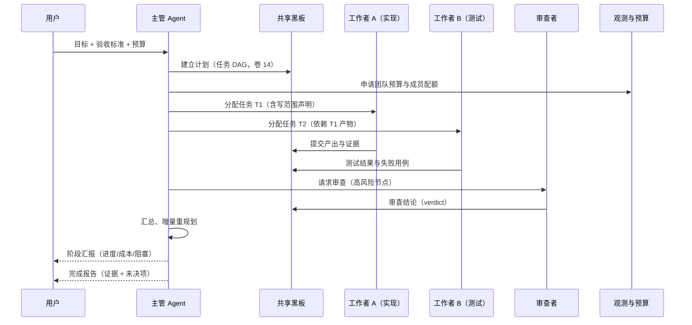

# 卷 13 · Agent Teams 与多智能体编排（Agent Teams）

> 单个 Agent 受限于上下文与串行速度；Teams 用**多角色并行 + 结构化协作**把一个仓库级目标拆成可并行的工程。本卷定义**团队编制、编排拓扑、任务认领、通信模型、冲突仲裁、预算治理、人机混合、观测与治理**。
>
> 需求来源：REQ-TEAM-1…11（卷 00 §5.13）；竞品参照：REQ-CMP-11（Claude Code Agent Teams）、REQ-CMP-17（worktree 隔离支撑并行）。

---

## 1. 本卷定位

- **解决**：多个 Agent 如何组成团队、如何分工、如何不互相踩脚、如何控制成本、如何被人监督。
- **不解决**：单 Agent 内部循环（卷 12）、任务模型本体（卷 14）、工作区与 worktree 实现（卷 20/21）、跨实例协作（卷 23）。
- **边界**：Teams 是**编排层**：它读写卷 14 的任务模型、调用卷 12 的 Agent 运行时、依赖卷 21 的隔离能力。

## 2. 需求与冲突点

| 需求 | 冲突/要点 |
| --- | --- |
| REQ-TEAM-2 拓扑 | 不同任务适合不同拓扑 → 拓扑应可声明可切换，而非固定 |
| REQ-TEAM-3 分配 | 中心分配（全局最优，主管负担重）vs 认领（去中心，可能重复/饥饿） |
| REQ-TEAM-4 通信 | 全联通消息风暴 vs 黑板单点（易成瓶颈） |
| REQ-TEAM-5 冲突 | 同文件并发写必然冲突 → 必须**隔离优先**（worktree）而非事后合并 |
| REQ-TEAM-6 预算 | 团队总额固定 → 需要动态再分配与熔断，防止单成员耗尽全队预算 |
| REQ-TEAM-7 观测 | 多 Agent 并行时人无法跟踪 → 必须可视化与摘要化 |

## 3. 设计空间（M×N）

### D-TEAM-1 团队编制

| 分支 | 描述 | 结论 |
| --- | --- | --- |
| B1 固定角色（架构/实现/测试/审查） | 简单；任务不匹配时浪费 | 基线 |
| **B2 声明式编制 + 可组合角色库：从角色库（实现者/测试者/审查者/文档者/安全审查者/性能专家/数据专家…）按任务装配，允许自定义角色（卷 12 的 Agent 定义）** | 适配不同任务 | **选定**（F=9 U=8 S=8 M=9 → 85.5） |
| B3 动态招募（按需从市场拉 Agent） | 灵活；治理与成本不可控 | 备选（P3） |

### D-TEAM-2 编排拓扑

| 拓扑 | 描述 | 适用 | 代价 |
| --- | --- | --- | --- |
| 主管-工作者（Supervisor-Worker） | 主管分解与分派，工作者执行并回报 | 目标明确、可分解 | 主管成为瓶颈与单点 |
| 流水线（Pipeline） | 阶段串接（设计→实现→测试→审查） | 阶段清晰 | 串行延迟 |
| 并行扇出（Fan-out/Fan-in） | 同质任务并行 | 批量重构、批量测试 | 合并冲突 |
| 市场/竞标（Market） | 成员竞标任务 | 需要多方案对比 | 成本翻倍 |
| 辩论/评审（Debate/Review） | 多角色互评以提升质量 | 高风险决策 | 成本与时长 |
| 混合（推荐） | 主管分派 + 关键阶段流水线 + 同质阶段扇出 + 高风险辩论 | 综合场景 | 编排复杂度 |

| 分支 | 结论 |
| --- | --- |
| B1 单一固定拓扑 | 淘汰 |
| **B2 拓扑可声明 + 混合编排（默认主管 + 阶段流水线 + 同质扇出，高风险节点插入辩论）** | **选定**（F=9 U=8 S=8 M=9 → 85.5） |
| B3 全自动拓扑优化（学习型） | 备选（P3，需要评测支撑） |

### D-TEAM-3 任务分配

| 分支 | 描述 | 结论 |
| --- | --- | --- |
| B1 全部中心分配 | 简单；主管负载高 | 基线 |
| **B2 中心分配 + 认领混合：主管分配边界清晰的任务；不确定或可并行的任务进入「任务池」由成员认领；认领需登记（防重复）** | 兼顾效率与负载 | **选定**（F=8 U=8 S=8 M=8 → 80） |
| B3 纯认领市场 | 可能饥饿与重复 | 淘汰 |

### D-TEAM-4 通信模型

| 分支 | 描述 | 结论 |
| --- | --- | --- |
| B1 全联通消息 | 简单；消息爆炸 | 淘汰 |
| B2 仅共享黑板（任务板） | 无消息；协调粒度粗 | 基线 |
| **B3 三层：① 结构化工件（黑板：计划/任务/证据，唯一事实源）② 定向消息（成员↔主管、成员↔成员，用于协商/求助）③ 公告（团队级通知：阻塞、风险、结论）** | 结构化优先、消息按需 | **选定**（F=9 U=8 S=8 M=9 → 85.5） |

**消息类型**（结构化，禁止自由文本泛滥）：`handoff`（交接）、`question`（求助）、`blocker`（阻塞）、`proposal`（方案提议）、`review_request`、`verdict`（裁决）、`budget_alert`。

### D-TEAM-5 冲突仲裁

| 分支 | 描述 | 结论 |
| --- | --- | --- |
| B1 事后合并 | 合并成本高、易丢改动 | 淘汰 |
| **B2 隔离优先 + 前置声明 + 主管裁决：① 每成员独立 worktree（卷 21）② 任务开始前声明「写范围」（文件/模块）③ 范围重叠 → 调度器串行化或拆分 ④ 语义冲突（设计决策冲突）交主管裁决并记录** | 把冲突消灭在执行前 | **选定**（F=9 U=8 S=9 M=9 → 88） |
| B3 文件锁（全局） | 简单；并行度塌陷 | 基线 |

### D-TEAM-6 预算与配额

| 分支 | 描述 | 结论 |
| --- | --- | --- |
| B1 无团队预算 | 成本失控 | 淘汰 |
| **B2 团队总预算 + 按成员初始分配 + 动态再分配（成员完成/闲置可回收）+ 熔断（单成员超限暂停、团队超限整体暂停并汇报）** | 可控 | **选定**（F=9 U=8 S=8 M=9 → 85.5） |

### D-TEAM-7 观测

| 分支 | 描述 | 结论 |
| --- | --- | --- |
| B1 纯日志 | 人无法跟踪 | 淘汰 |
| **B2 三视图：① 拓扑视图（成员/状态/当前任务/依赖）② 时间线（并行泳道 + 事件）③ 成本瀑布（按成员/任务/模型）＋ 主管摘要（定期自然语言汇报）** | 可监督、可介入 | **选定**（F=9 U=9 S=8 M=9 → 88） |

### D-TEAM-8 人机混合

| 分支 | 描述 | 结论 |
| --- | --- | --- |
| B1 人类仅作为审批者 | 简单 | 基线 |
| **B2 人类可作为成员加入（承担任务/审阅产出/提供决策），人类成员的任务在事件流中与 Agent 同构** | 混合协作 | **选定**（F=8 U=9 S=7 M=8 → 79.5） |

### D-TEAM-9 团队模板

| 分支 | 描述 | 结论 |
| --- | --- | --- |
| B1 无 | 每次重配 | 淘汰 |
| **B2 团队模板（编制 + 拓扑 + 预算 + 角色库 + 验收策略），可组织内共享与版本化；从成功团队运行中提炼模板** | 复用沉淀 | **选定**（F=8 U=8 S=8 M=9 → 82.5） |

### D-TEAM-10 团队权限与审计

| 分支 | 描述 | 结论 |
| --- | --- | --- |
| B1 继承会话权限 | 简单；越权风险（成员放大） | 淘汰 |
| **B2 团队权限上限（成员权限 ⊆ 团队上限 ⊆ 会话上限）+ 责任链（任务→成员→人类委托者）+ 团队级审计（谁在何时以何权限做了什么）** | 企业治理 | **选定**（F=9 U=7 S=9 M=9 → 86.5） |

### D-TEAM-11 跨团队协作与升级

| 分支 | 描述 | 结论 |
| --- | --- | --- |
| B1 团队隔离（不互通） | 简单 | 基线 |
| **B2 上级团队/协调者：多团队共享一个更高层协调者；冲突由协调者裁决；支持升级到人类；跨实例团队走 A2A（卷 23）** | 大规模协作 | **选定**（F=8 U=7 S=7 M=8 → 75.5） |

## 4. 选定方案详设

### 4.1 团队领域模型

| 实体 | 说明 | 关键字段 |
| --- | --- | --- |
| Team | 团队实例 | teamId、模板引用、拓扑、预算总额/已用、状态、所属会话与目标 |
| Member | 团队成员 | memberId、角色引用（Agent 定义）、类型（Agent/人类）、worktree 引用、预算配额、当前任务、状态 |
| Board | 共享黑板 | 任务列表（卷 14 模型）、证据库、决策记录、阻塞清单 |
| Channel | 通信 | 消息类型 + 收件人（定向/团队）+ 关联任务 |
| Arbitration | 仲裁记录 | 争议点、参与者观点、裁决与理由、影响范围 |

### 4.2 典型运行流程

### 4.3 隔离与合并

| 环节 | 机制 |
| --- | --- |
| 隔离 | 每成员独立 worktree（卷 21），分支命名含团队与任务标识 |
| 写范围声明 | 任务创建时声明预期写范围（路径模式）；调度器据此并行/串行 |
| 提交策略 | 成员在自身 worktree 内原子提交；合并由主管或合并队列串行执行 |
| 合并冲突 | 优先「重放变更到最新基线」；冲突需人工或审查者裁决；禁止强行覆盖 |
| 回滚 | 任务级可回滚（丢弃该 worktree 分支）；团队级回滚到检查点 |

### 4.4 消息与工件约定

| 类型 | 方向 | 载荷 | 处理 |
| --- | --- | --- | --- |
| `handoff` | 成员 → 成员 | 任务、产出引用、注意事项 | 接方确认后任务状态转移 |
| `question` | 成员 → 成员/主管 | 问题、已尝试、需要的输入 | 回复或升级为 blocker |
| `blocker` | 成员 → 主管 | 阻塞原因、影响、建议 | 主管裁决或升级人类 |
| `proposal` | 成员 → 团队 | 方案、权衡、影响 | 主管/审查者决策并记录 |
| `review_request` | 成员 → 审查者 | 变更集、验收清单 | 审查者输出 verdict |
| `verdict` | 审查者 → 团队 | 结论（通过/驳回）、理由、必改项 | 决定任务是否完成 |
| `budget_alert` | 观测 → 团队 | 消耗率、预测超支 | 主管调整分配或暂停 |

### 4.5 成本与熔断

| 机制 | 说明 |
| --- | --- |
| 初始分配 | 按任务复杂度与角色权重分配（主管可手工调整） |
| 动态回收 | 成员完成任务后剩余预算回池 |
| 消耗预测 | 按历史同任务类型的单位成本预测，超阈值预警 |
| 熔断 | 单成员超限 → 暂停该成员任务并请求决策；团队超限 → 暂停全部并生成汇报 |
| 成本归因 | 每次模型/工具调用绑定 `teamId/memberId/taskId`，支持成本瀑布 |

### 4.6 人机混合

| 场景 | 设计 |
| --- | --- |
| 人类认领任务 | 任务卡在桌面端出现「认领」按钮；认领后状态与 Agent 任务一致（进行中/阻塞/完成） |
| 人类产出 | 通过界面提交（修改文件、上传产物、填写结论），仍走事件与审计 |
| 人类决策 | 裁决类消息可指定人类成员为收件人；决策记录进黑板 |
| 超时 | 人类任务可设 SLA，超时提醒或转派 Agent |

## 5. 扩展点（供卷 18 汇总）

| 扩展点 | 说明 |
| --- | --- |
| `RoleLibrarySPI` | 角色库来源（内置/组织/项目） |
| `TopologySPI` | 自定义编排拓扑 |
| `AssignmentStrategySPI` | 任务分配策略 |
| `ArbitrationPolicySPI` | 仲裁规则（企业自定义） |
| `TeamBudgetPolicySPI` | 预算分配与熔断策略 |
| `TeamViewSPI` | 观测视图扩展（桌面端面板） |

## 6. 事件与可观测

| 事件 | 说明 |
| --- | --- |
| `team.created` / `team.completed` / `team.aborted` | 团队生命周期 |
| `team.member.joined` / `left` / `state.changed` | 成员 |
| `team.task.assigned` / `claimed` / `completed` | 任务分配（含写范围） |
| `team.message.sent` | 七类消息（类型 + 方向 + 关联任务） |
| `team.arbitration.resolved` | 仲裁结论 |
| `team.budget.allocated` / `reallocated` / `exhausted` | 预算 |
| `team.merge.started` / `conflict` / `completed` | 合并 |
| `team.report.published` | 阶段/完成汇报 |

**指标**：`oc_team_active`、`oc_team_members{state}`、`oc_team_task_throughput`、`oc_team_cost_total{member}`、`oc_team_conflict_total`、`oc_team_merge_queue_depth`、`oc_team_wait_time_ms`。

## 7. 非功能设计

- **性能**：黑板操作 ≤ 20ms；消息投递 ≤ 100ms；支持 16 成员/团队、20 团队/实例（NFR-C-4）。
- **可靠性**：成员崩溃不影响团队（任务重新分配）；主管崩溃可从黑板恢复（黑板为事实源）；预算与配额持久化。
- **成本**：团队预算是硬约束；所有成员调用计入归因；闲置成员自动回收。
- **安全**：权限上限单调（成员 ⊆ 团队 ⊆ 会话）；跨成员信息可见性受任务与租户约束；审计覆盖全部消息与裁决。
- **可解释**：任务为何分配给某成员、为何裁决——均记录理由。

## 8. 完成定义（DoD）

- [ ] 六类拓扑可声明与执行（至少主管、流水线、扇出、辩论四类有端到端测试）。
- [ ] 成员隔离：每成员独立 worktree，合并队列串行化，冲突检测有效（用例）。
- [ ] 写范围声明与重叠检测在调度层生效（重叠任务被串行化）。
- [ ] 七类消息与黑板事实源落地，消息风暴防护（限流 + 结构校验）。
- [ ] 预算分配/回收/熔断在压力测试下生效（单成员超限不影响团队，团队超限整体暂停）。
- [ ] 三视图观测可用（拓扑/时间线/成本瀑布），主管摘要每 N 分钟产出。
- [ ] 人类成员可认领与提交产出，且事件与审计与 Agent 同构。
- [ ] 团队模板可从运行中提炼并可复用（同模板在另一仓库跑通）。
- [ ] 权限上限单调性有测试（成员无法获得团队未授予的权限）。

## 9. 域内决策汇总（D-TEAM）

| ID | 主题 | 选定 |
| --- | --- | --- |
| D-TEAM-1 | 编制 | 声明式编制 + 可组合角色库 |
| D-TEAM-2 | 拓扑 | 可声明 + 混合编排（主管 + 流水线 + 扇出 + 辩论） |
| D-TEAM-3 | 分配 | 中心分配 + 任务池认领（混合） |
| D-TEAM-4 | 通信 | 三层（板 + 定向消息 + 公告），七类结构消息 |
| D-TEAM-5 | 冲突 | 隔离优先 + 写范围声明 + 主管裁决 |
| D-TEAM-6 | 预算 | 总额 + 分配 + 回收 + 熔断 |
| D-TEAM-7 | 观测 | 拓扑/时间线/成本瀑布 + 主管摘要 |
| D-TEAM-8 | 人机混合 | 人类可作成员（认领/产出/决策） |
| D-TEAM-9 | 模板 | 团队模板 + 从运行提炼 |
| D-TEAM-10 | 权限审计 | 权限上限单调 + 责任链 + 团队级审计 |
| D-TEAM-11 | 跨团队 | 上级协调者 + 升级人类 + 跨实例走 A2A |

## 10. 开放问题与默认决策

| 项 | 默认决策 |
| --- | --- |
| 默认团队规模 | 3–5 名（实现/测试/审查 + 可选专家） |
| 主管是否可为 Agent | 是；也可由人类担任（人机混合） |
| 团队是否跨工作区 | 支持（每成员绑定工作区），默认单工作区多 worktree |
| 团队结束后的产出 | 合并到目标分支（需审批）+ 生成团队报告（含成本与证据） |
| 辩论拓扑的使用门槛 | 仅高风险节点（接口变更、破坏性操作、安全相关）默认启用 |
