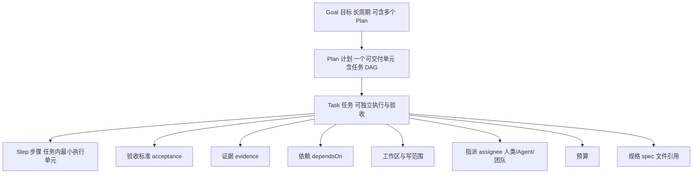
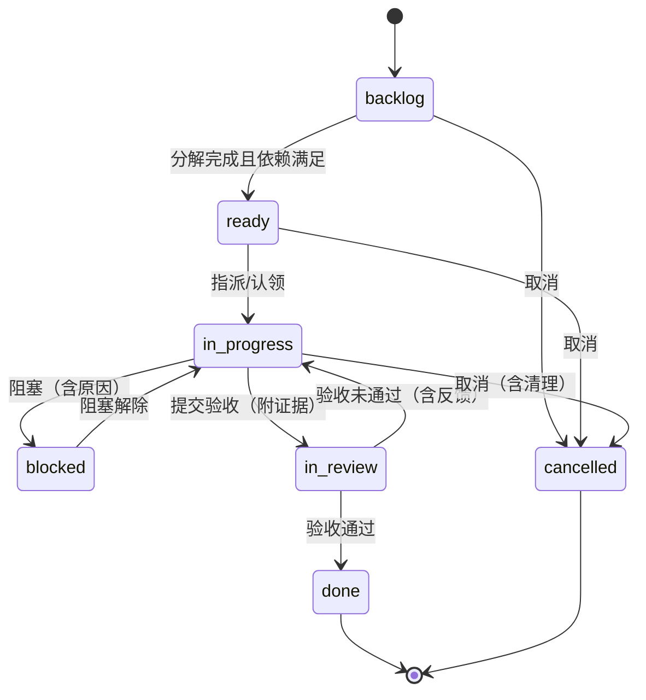

# 卷 14 · 任务与计划系统（Task / Plan / Todo）

> 任务与计划是 Agent 的「工程管理骨架」：本卷定义**统一工作对象模型（Goal → Plan → Task → Step 同源）、分解与依赖、状态机、规格驱动、绑定与追踪、跨会话延续、看板视图**。
>
> 需求来源：REQ-TASK-1…12（卷 00 §5.14）；竞品参照：REQ-CMP-13（Quest 式任务执行）；全局约束：REQ-INT-3（全量持久化与恢复）。

---

## 1. 本卷定位

- **解决**：工作如何被描述、拆解、排序、追踪、恢复、复盘；Agent 与人类如何共用同一套对象。
- **不解决**：长期目标与自动化触发（卷 15）、团队编排（卷 13）、Git 与分支（卷 21）。
- **边界**：本卷定义**模型与语义**；执行由卷 12（Agent 循环）与卷 13（团队调度）驱动。

## 2. 需求与冲突点

| 需求 | 冲突/要点 |
| --- | --- |
| REQ-TASK-1 统一模型 | 四类对象若各自建模会出现语义打架 → 统一聚合、分层表达 |
| REQ-TASK-2 分解 | AI 分解快但可能错；人工分解准但慢 → 人机协同 + 模板 |
| REQ-TASK-6 恢复 | 任务进度必须与事件日志一致（不能两套真相） |
| REQ-TASK-7 进度 | 百分比易失真 → 证据驱动（完成的判定依据） |
| REQ-TASK-9 跨会话 | 任务不能绑死在会话上（会话可关闭、可多端） |
| REQ-TASK-12 优先级与抢占 | 抢占会打断执行 → 需定义「可中断点」与恢复语义 |

## 3. 设计空间（M×N）

### D-TASK-1 对象模型

| 分支 | 描述 | 结论 |
| --- | --- | --- |
| B1 四类对象独立（Goal/Plan/Task/Todo 各一套） | 概念重叠、状态同步困难 | 淘汰 |
| B2 两层（Task + Subtask） | 简单；无法表达长期目标与调度 | 淘汰 |
| **B3 统一聚合 `WorkItem` + 四种层级化类型：Goal（目标，长周期）→ Plan（计划，一个交付单元）→ Task（可执行任务）→ Step（任务内步骤）；同源模型、统一状态机骨架、各自扩展** | 一处建模、多视图呈现、可递归分解 | **选定**（F=10 U=8 S=8 M=9 → 88.5） |

### D-TASK-2 分解方式

| 分支 | 描述 | 结论 |
| --- | --- | --- |
| B1 全自动 AI 分解 | 快；可能偏离意图 | 基线 |
| B2 全人工分解 | 准；慢 | 基线 |
| **B3 人机协同：AI 产出候选分解（含理由与风险标记）→ 人类可编辑（增删改、调整依赖、设验收）→ 模板加速常见任务（重构/迁移/加功能/修 Bug）** | 质量与效率兼得 | **选定**（F=9 U=9 S=8 M=9 → 88） |

### D-TASK-3 依赖与调度

| 分支 | 描述 | 结论 |
| --- | --- | --- |
| B1 线性列表 | 简单；无法并行 | 淘汰 |
| **B2 DAG（依赖 + 关键路径）+ 资源约束（写范围/工作区/成员）** | 支持并行与关键路径优化 | **选定**（F=9 U=8 S=8 M=9 → 85.5） |
| B3 完整项目调度（资源平衡算法） | 过度工程 | 淘汰 |

### D-TASK-4 状态机

| 分支 | 描述 | 结论 |
| --- | --- | --- |
| B1 三态（待办/进行/完成） | 过简（无阻塞、取消、验证） | 淘汰 |
| **B2 七态：`backlog`（待规划）→ `ready`（可执行）→ `in_progress` → `blocked`（阻塞，含原因）→ `in_review`（待验收）→ `done`（验收通过）→ `cancelled`；失败态与重试由 `blocked`/`in_progress` 内的 failed 标记表达** | 覆盖真实工程状态；与卷 12 验证挂钩 | **选定**（F=9 U=8 S=8 M=9 → 85.5） |

### D-TASK-5 持久化与一致性

| 分支 | 描述 | 结论 |
| --- | --- | --- |
| B1 仅状态快照 | 简单；无法追溯变更 | 淘汰 |
| **B2 事件为源 + 状态快照（读模型）：每次状态/字段变更产出事件；快照用于快速读取与恢复；二者一致性可校验** | 与 H-006 一致 | **选定**（F=9 U=8 S=9 M=9 → 88） |

### D-TASK-6 任务与工作区/分支绑定

| 分支 | 描述 | 结论 |
| --- | --- | --- |
| B1 不绑定 | 无法追溯 | 淘汰 |
| B2 1:1 绑定（每任务一个分支/worktree） | 清晰；任务多时分支爆炸 | 基线 |
| **B3 逻辑绑定 + 物理按需：任务声明「工作区 + 写范围」；worktree/分支按需创建（并行任务才创建），支持多任务共享 worktree（写范围不重叠时）** | 平衡隔离与开销 | **选定**（F=8 U=8 S=8 M=8 → 80） |

### D-TASK-7 进度与验收

| 分支 | 描述 | 结论 |
| --- | --- | --- |
| B1 人工百分比 | 失真 | 淘汰 |
| **B2 证据驱动：每个 Task 定义验收标准（可检验）；进度由「已通过验收的子项比例 + 证据完整度」推导；`done` 必须附证据（卷 12 三级验证）** | 可信 | **选定**（F=9 U=8 S=8 M=9 → 85.5） |

### D-TASK-8 视图

| 分支 | 描述 | 结论 |
| --- | --- | --- |
| B1 仅文本列表（CLI） | 简单 | 基线 |
| **B2 多视图：CLI 树形/列表视图；桌面端看板（列=状态）+ 甘特式时间线 + 依赖图；会话内联计划卡片** | 覆盖不同使用场景 | **选定**（F=8 U=9 S=8 M=8 → 82.5） |

### D-TASK-9 规格驱动

| 分支 | 描述 | 结论 |
| --- | --- | --- |
| B1 无规格（口述即任务） | 快；不可评审 | 淘汰 |
| **B2 任务规格文件（可选但推荐）：目标、验收标准、约束、影响范围、测试计划；可评审（PR 化）、可版本化；Agent 以其为执行依据** | 提升可预测性与可协作性 | **选定**（F=9 U=8 S=8 M=9 → 85.5） |

### D-TASK-10 跨会话延续

| 分支 | 描述 | 结论 |
| --- | --- | --- |
| B1 任务属会话（会话关闭即失效） | 简单；不可协作 | 淘汰 |
| **B2 任务属项目（独立生命周期）+ 会话作为「执行者」附着：任务可被多会话/多成员/多端接续，执行历史完整保留** | 支撑协作与延续 | **选定**（F=9 U=9 S=8 M=9 → 88） |

### D-TASK-11 优先级与抢占

| 分支 | 描述 | 结论 |
| --- | --- | --- |
| B1 仅排序（不抢占） | 简单；紧急任务需等待 | 基线 |
| **B2 优先级 + 可中断点抢占：抢占仅发生在安全点（卷 12）；被抢占任务保留检查点，可恢复；抢占需记录理由** | 兼顾紧急与安全 | **选定**（F=8 U=8 S=8 M=8 → 80） |

### D-TASK-12 任务模板与复用

| 分支 | 描述 | 结论 |
| --- | --- | --- |
| B1 无模板 | 重复劳动 | 淘汰 |
| **B2 模板库：常见任务类型（新增 API、重构模块、修 Bug、依赖升级、文档同步、迁移）含标准步骤、验收清单与风险提示；组织可共享** | 效率与一致性 | **选定**（F=8 U=8 S=8 M=9 → 82.5） |

## 4. 选定方案详设

### 4.1 统一工作对象模型

| 层 | 必需字段 | 说明 |
| --- | --- | --- |
| Goal | 目标陈述、验收标准、约束、预算、终止条件、状态 | 见卷 15（自治循环） |
| Plan | 名称、目标引用、任务集合、DAG、里程碑、状态 | 一个交付单元（如「完成 X 特性」） |
| Task | 标题、描述、验收标准、依赖、工作区+写范围、指派、优先级、预算、规格引用、状态 | 可独立执行与验收 |
| Step | 描述、预期结果、工具提示、状态 | 任务内步骤（可由 Agent 动态细化） |

### 4.2 状态机（统一骨架）

**规则**：状态迁移全部产出事件（含操作者与理由）；`done` 必须附证��（卷 12 三级验证结果）；任何状态可挂 `metadata.failed` 标记以表达运行失败（不等于任务失败）。

### 4.3 依赖与并行

| 机制 | 说明 |
| --- | --- |
| 依赖类型 | `finish_to_start`（默认）、`artifact`（需要产物存在）、`decision`（需要裁决结果） |
| 关键路径 | 计算关键路径用于时间预估与调度优先级 |
| 并行度 | 受资源约束（写范围重叠、工作区数量、成员数量、预算）与策略（最大并行数） |
| 循环依赖 | 建立时检测并拒绝（给出环路径） |
| 依赖变更 | 变更需记录理由并重算关键路径与受影响任务 |

### 4.4 任务规格文件（spec）

| 项 | 设计 |
| --- | --- |
| 位置 | 工作区 `.oc/tasks/<task-id>.md`（可入库评审）或项目任务库 |
| 结构 | 背景 → 目标 → 验收标准（可检验条目）→ 约束 → 影响范围 → 技术方案要点 → 测试计划 → 风险 |
| 绑定 | Task 记录 spec 引用与版本（提交哈希）；执行时作为提示词来源之一（S5/S6 区段） |
| 变更 | spec 变更触发任务「重规划」提示；旧版本保留（审计） |

### 4.5 与其它系统的接口

| 系统 | 接口 |
| --- | --- |
| Agent（卷 12） | Task 作为 Turn 的载体：一个 Turn 可推进一个 Task；Task 的验收标准进入验证阶段 |
| Teams（卷 13） | Board 即任务集合；分配/认领/写范围声明通过任务字段表达 |
| Git（卷 21） | Task 关联分支/提交/PR；完成时生成提交与变更摘要 |
| 事件（卷 16） | 任务事件进入主事件流；支持从事件重建任务状态（校验） |
| 权限（卷 06） | 「任务级」授权范围（如「允许本任务在 src/ 内写」） |
| Goal/Schedule（卷 15） | Goal 分解为 Plan；Schedule 触发 Task 或 Plan 模板 |
| 知识库（卷 11） | 任务检索相关代码与文档；任务完成后可生成知识条目 |

### 4.6 CLI 与桌面端视图

| 视图 | 端 | 要点 |
| --- | --- | --- |
| 树形列表 | CLI | `task list --tree`；状态着色；阻塞原因内联 |
| 会话内联计划卡 | CLI + 桌面 | 当前 Turn 的计划与进度 |
| 看板 | 桌面 | 列=状态；卡片=任务；拖拽改状态（需权限）；过滤（指派/优先级/工作区） |
| 时间线 | 桌面 | 并行泳道（成员 × 时间）+ 里程碑 + 依赖箭头 |
| 依赖图 | 桌面 | DAG 渲染；关键路径高亮；环检测提示 |
| 报告 | 两端 | 任务完成报告（证据/成本/时长/变更） |

## 5. 扩展点（供卷 18 汇总）

| 扩展点 | 说明 |
| --- | --- |
| `WorkItemTypeSPI` | 自定义工作对象类型（扩展 Step 语义） |
| `DecompositionStrategySPI` | 自定义分解策略 |
| `PriorityPolicySPI` | 优先级与抢占策略 |
| `AcceptanceValidatorSPI` | 自定义验收校验（企业检查项） |
| `TaskTemplateProviderSPI` | 任务模板来源 |
| `WorkItemViewSPI` | 视图扩展 |

## 6. 事件与可观测

| 事件 | 说明 |
| --- | --- |
| `workitem.created` / `updated` / `state.changed` / `deleted` | 全类型通用（含层级与理由） |
| `workitem.dependency.changed` | 依赖变更（含环检测结果） |
| `workitem.assigned` / `claimed` | 指派与认领 |
| `workitem.evidence.attached` | 证据挂载 |
| `workitem.acceptance.evaluated` | 验收结果 |
| `workitem.preempted` / `resumed` | 抢占与恢复 |
| `workitem.spec.linked` / `spec.changed` | 规格关联与变更 |

**指标**：`oc_workitem_active{level}`、`oc_workitem_cycle_time_ms{level}`、`oc_workitem_blocked_total{reason}`、`oc_workitem_acceptance_pass_ratio`、`oc_workitem_rework_rate`。

## 7. 非功能设计

- **性能**：任务树 10k 节点加载 ≤ 500ms（分页/懒加载）；状态变更写入 ≤ 10ms（事件追加）。
- **一致性**：快照与事件可校验（定期校验任务）；恢复时以事件为准重建。
- **容量**：单项目任务 ≥ 100 万（含历史）；归档策略按完成时间与引用。
- **安全**：任务的写范围声明参与权限判定（卷 06 的「任务级授权」）；跨租户不可见。
- **可用性**：任务系统不可用时 Agent 仍可运行（降级为「无持久计划」模式，显式提示）。

## 8. 完成定义（DoD）

- [ ] 统一模型落地：Goal/Plan/Task/Step 四层同源，且递归分解可用。
- [ ] 七态状态机与迁移规则实现（含非法迁移拒绝与理由记录）。
- [ ] DAG 依赖与关键路径计算可用；环检测拒绝；依赖变更重算。
- [ ] 证据驱动进度：`done` 无证据时被拒绝（用例）。
- [ ] 规格文件绑定与版本记录可用；spec 变更触发重规划提示。
- [ ] 跨会话延续：任务在多端/多会话接续，历史完整（用例）。
- [ ] 抢占在安全点生效，被抢占任务可从检查点恢复（用例）。
- [ ] 四种视图（CLI 树/看板/时间线/依赖图）至少 CLI 与看板可用。
- [ ] 事件重建任务状态与快照一致（校验工具通过）。

## 9. 域内决策汇总（D-TASK）

| ID | 主题 | 选定 |
| --- | --- | --- |
| D-TASK-1 | 对象模型 | 统一聚合 WorkItem（Goal/Plan/Task/Step 四层） |
| D-TASK-2 | 分解 | 人机协同 + 模板加速 |
| D-TASK-3 | 依赖调度 | DAG + 关键路径 + 资源约束 |
| D-TASK-4 | 状态机 | 七态（含 blocked/in_review） |
| D-TASK-5 | 持久化 | 事件为源 + 状态快照 |
| D-TASK-6 | 绑定 | 逻辑绑定（工作区+写范围）+ worktree 按需 |
| D-TASK-7 | 进度验收 | 证据驱动 + 验收标准强制 |
| D-TASK-8 | 视图 | CLI 树/列表 + 桌面看板/时间线/依赖图 |
| D-TASK-9 | 规格驱动 | 规格文件（可评审、版本化） |
| D-TASK-10 | 生命周期 | 任务属项目，会话附着 |
| D-TASK-11 | 优先级 | 优先级 + 安全点抢占 |
| D-TASK-12 | 模板 | 模板库 + 组织共享 |

## 10. 开放问题与默认决策

| 项 | 默认决策 |
| --- | --- |
| 是否需要「史诗（Epic）」层 | 用 Plan 表达，不新增层级 |
| 任务 ID 形式 | 人类可读短 ID（如 `T-7f3a`）+ 全局 UUID |
| 任务默认验收标准 | 若用户未给，Agent 生成候选并经用户确认 |
| 历史任务归档 | 完成后 90 天归档（可配），归档仍可检索 |
| 任务与 Goal 的关系 | 独立 Task 可后挂在 Goal 下（允许先做后归因） |
