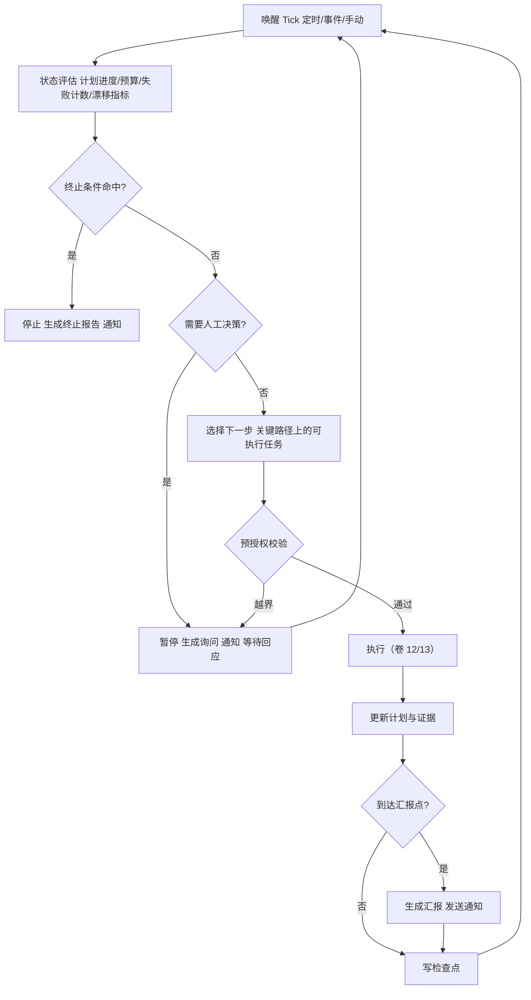
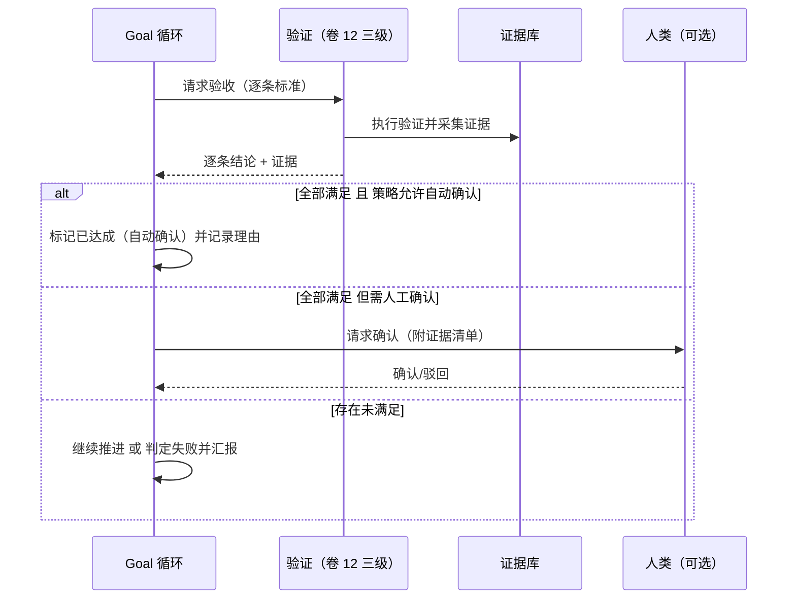

# 卷 15 · Goal 目标模式与 Schedule 计划模式

> 两者是「无人值守」的两条路径：**Goal 模式**让 Agent 围绕一个目标长期自治推进；**Schedule 模式**让 Agent 按时间/事件被自动唤起执行既定计划。本卷定义**目标契约、自治循环、达成判定与漂移检测、触发器模型、无人值守安全、通知与熔断**。
>
> 需求来源：REQ-GOAL-1…5、REQ-SCH-1…7（卷 00 §5.15）。

---

## 1. 本卷定位

- **解决**：长时间无人盯着时，Agent 怎么持续正确工作、怎么安全地自动执行、怎么在需要时找人。
- **不解决**：单次执行循环（卷 12）、任务模型（卷 14）、团队编排（卷 13）、审批与权限（卷 06）。
- **边界**：Goal 与 Schedule 都是**触发与治理层**：它们决定「何时、以什么约束，启动哪套计划/任务」，执行仍由卷 12/13 承担。

## 2. 需求与冲突点

| 需求 | 冲突/要点 |
| --- | --- |
| REQ-GOAL-4 达成判定 | 模型自评容易「假完成」→ 必须以验收证据为主 |
| REQ-GOAL-3 漂移检测 | 长期执行目标易漂移 → 需要周期性对照目标与验收标准 |
| REQ-SCH-3 无人值守审批 | 无人批准 vs 越权风险 → 预授权边界 + 熔断 + 事后审计 |
| REQ-SCH-4 通知 | 打扰 vs 知情 → 分级通知与聚合 |
| REQ-SCH-5 熔断 | 连续失败需自停，避免烧钱与破坏 |

## 3. 设计空间（M×N）

### D-GOAL-1 自治程度

| 分支 | 描述 | 结论 |
| --- | --- | --- |
| B1 纯建议（Agent 只提方案） | 安全；价值有限 | 基线 |
| B2 半自治（关键节点找人） | 平衡 | 基线 |
| **B3 分档自治：按「任务类型 × 风险级别 × 用户信任配置」决定自治级别；高风险动作永远需要确认（预授权可覆盖但受企业基线约束）** | 与卷 06 权限模式、卷 12 自主度统一 | **选定**（F=9 U=9 S=8 M=9 → 88） |

### D-GOAL-2 终止条件

| 分支 | 描述 | 结论 |
| --- | --- | --- |
| B1 仅人工终止 | 简单；可能无限跑 | 淘汰 |
| **B2 多重终止：验收达成 / 预算耗尽 / 时间上限 / 连续失败 / 目标被撤销 / 风险事件触发；任一触发即停止并汇报** | 安全可控 | **选定**（F=9 U=8 S=9 M=9 → 88） |

### D-GOAL-3 达成判定

| 分支 | 描述 | 结论 |
| --- | --- | --- |
| B1 模型自评 | 便宜；不可信 | 淘汰 |
| B2 人工确认 | 可信；阻塞 | 基线 |
| **B3 证据优先 + 人工确认（可配置豁免）：逐条验收标准必须有可检验证据；全部满足 → 标记「已达成（待确认）」；无人值守场景按预授权策略自动确认（仅限低风险目标）** | 可信且不阻塞 | **选定**（F=9 U=8 S=8 M=9 → 85.5） |

### D-GOAL-4 漂移检测

| 分支 | 描述 | 结论 |
| --- | --- | --- |
| B1 无 | 风险大 | 淘汰 |
| **B2 周期对照：每 N 步对照「目标 + 验收标准 + 约束」评估当前方向；检测手段：验收项进展变化、产出与目标语义相似度、约束违反扫描；检测到漂移 → 暂停并汇报** | 及时纠偏 | **选定**（F=9 U=8 S=8 M=9 → 85.5） |

### D-GOAL-5 汇报机制

| 分支 | 描述 | 结论 |
| --- | --- | --- |
| B1 仅结束时汇报 | 过程不可见 | 淘汰 |
| **B2 分级汇报：节点汇报（阶段完成/阻塞/风险，即时）+ 周期汇报（默认每 30 分钟或每 N 步，可配）+ 结束汇报（完整报告）** | 既能监督又不刷屏 | **选定**（F=8 U=9 S=8 M=8 → 82.5） |

### D-GOAL-6 人工介入点

| 分支 | 描述 | 结论 |
| --- | --- | --- |
| B1 仅审批介入 | 介入粒度粗 | 基线 |
| **B2 显式介入点 + 随时介入：目标可声明「必须人工确认的节点」（如上线前、数据迁移前）；同时保留随时插话/接管能力（卷 12）** | 兼顾计划性与灵活性 | **选定**（F=8 U=9 S=8 M=8 → 82.5） |

### D-SCH-1 触发器模型

| 分支 | 描述 | 结论 |
| --- | --- | --- |
| B1 仅 cron | 简单；不够 | 基线 |
| **B2 五类触发器统一模型：① 时间（cron/间隔）② 事件（仓库提交、PR 更新、工单变更、外部 webhook）③ 条件（如「依赖有新版」「测试失败率超阈值」）④ 手动（一键/命令）⑤ 组合（AND/OR + 去抖/节流）** | 覆盖常见自动化 | **选定**（F=9 U=8 S=8 M=9 → 85.5） |

### D-SCH-2 触发对象

| 分支 | 描述 | 结论 |
| --- | --- | --- |
| B1 仅固定提示词 | 简单；不可复用 | 淘汰 |
| **B2 可触发四类对象：任务模板 / 计划模板 / Goal / 会话模板（含工作区、模式、权限、模型）** | 复用与组合 | **选定**（F=9 U=8 S=8 M=9 → 85.5） |

### D-SCH-3 并发与幂等

| 分支 | 描述 | 结论 |
| --- | --- | --- |
| B1 重叠则并行 | 资源冲突与重复劳动 | 淘汰 |
| **B2 策略化：同计划重叠 → `skip`（默认）/ `queue` / `replace` / `parallel`；触发携带幂等键（触发源 + 目标 + 输入哈希），重复触发去重** | 可预期 | **选定**（F=8 U=8 S=9 M=8 → 82.5） |

### D-SCH-4 无人值守安全

| 分支 | 描述 | 结论 |
| --- | --- | --- |
| B1 全放行 | 危险 | 淘汰 |
| B2 全需人工 | 无人值守失去意义 | 淘汰 |
| **B3 预授权边界（Allowlist Policy）：计划声明所需操作类型；触发前由策略校验是否在预授权清单内；越界 → 暂停并通知；企业基线不可被计划放宽；全部动作审计** | 安全且可用 | **选定**（F=9 U=8 S=9 M=9 → 88） |

### D-SCH-5 通知渠道

| 分支 | 描述 | 结论 |
| --- | --- | --- |
| B1 仅界面内 | 无人值守时无人知 | 淘汰 |
| **B2 多通道：桌面通知 / CLI 输出 / 邮件 / IM 机器人 / Webhook；按事件级别路由；支持聚合与静默时段** | 覆盖真实场景 | **选定**（F=8 U=9 S=8 M=8 → 82.5） |

### D-SCH-6 熔断与告警

| 分支 | 描述 | 结论 |
| --- | --- | --- |
| B1 无 | 连续失败烧钱 | 淘汰 |
| **B2 熔断：连续失败 N 次（默认 3）/ 单位时间失败率超阈值 / 预算消耗异常 → 自动暂停该计划并告警；需人工确认后恢复** | 控制损失 | **选定**（F=9 U=8 S=9 M=9 → 88） |

### D-SCH-7 日历与资源冲突

| 分支 | 描述 | 结论 |
| --- | --- | --- |
| B1 无视图 | 冲突不可见 | 淘汰 |
| **B2 计划日历视图 + 资源冲突检测（同工作区/同分支/同环境/同预算池）；冲突时提示并提供错峰建议** | 运维友好 | **选定**（F=7 U=8 S=8 M=8 → 77.5） |

## 4. 选定方案详设

### 4.1 Goal 契约

| 字段 | 说明 |
| --- | --- |
| `objective` | 目标陈述（自然语言 + 可选结构化指标） |
| `acceptanceCriteria[]` | 验收标准（可检验条目，每条定义验证方式） |
| `constraints[]` | 约束（不得修改的模块、必须遵守的规范、时间窗、成本上限） |
| `budget` | token / 成本 / 时长 / 工具调用次数 / 最多迭代步数 |
| `autonomyLevel` | 建议 / 协作 / 自治（受企业基线钳制） |
| `interventionPoints[]` | 必须人工确认的节点（如上线前） |
| `reportingPolicy` | 节点/周期/结束汇报的渠道与频率 |
| `termination` | 终止条件集合（达成/预算/时间/失败/撤销/风险） |
| `stateRef` | 当前 Plan 引用与进度 |

### 4.2 自治循环（Tick 模型）

**Tick 频率**：定时唤醒（默认 1 分钟，仅做评估）+ 事件唤醒（子任务完成/失败即时推进）+ 空闲退避（无进展时长间隔加大，节省资源）。

### 4.3 达成判定流程

### 4.4 Schedule 计划模型

| 字段 | 说明 |
| --- | --- |
| `scheduleId` / `name` / `enabled` | 标识与开关 |
| `triggers[]` | 五类触发器（含组合、时区、去抖/节流、幂等键规则） |
| `target` | 触发对象（任务模板/计划模板/Goal/会话模板） |
| `inputs` | 触发时注入的参数（分支、路径、范围、阈值） |
| `workspaceBinding` | 目标工作区（可动态解析，如「PR 所在仓库」） |
| `permissions` | 预授权操作清单（Allowlist）与权限上限 |
| `concurrencyPolicy` | skip / queue / replace / parallel |
| `notifications` | 通知路由（级别 → 渠道） |
| `circuitBreaker` | 失败阈值、告警对象、恢复方式 |
| `retention` | 运行记录保留期 |

### 4.5 无人值守安全模型

| 层 | 机制 |
| --- | --- |
| 触发前 | 计划必须声明所需操作类型；策略校验授权；企业基线优先 |
| 执行中 | 权限链路照常（卷 06）；越界动作 → 暂停 + 通知（不静默跳过） |
| 资源 | 预算硬上限 + 并发上限 + 熔断 |
| 变更面 | 高风险动作（发布、删除、外发）默认不在预授权范围，除非企业显式开启且带人工确认点 |
| 事后 | 完整审计（触发源、决策、动作、结果）；可一键回滚（若涉及提交则按卷 21 回滚策略） |

### 4.6 与其它系统的关系

| 系统 | 关系 |
| --- | --- |
| 任务（卷 14） | Schedule 触发任务/计划模板；Goal 推进任务 DAG |
| Agent（卷 12） | 每次 Tick 的执行由 Agent 运行时承担 |
| Teams（卷 13） | 复杂计划可启动团队执行（预算与观测复用） |
| 事件（卷 16） | 触发源可以是事件；执行过程全量事件化 |
| 权限（卷 06） | 预授权清单与权限模式协同；企业基线钳制 |
| 通知（卷 24） | 通知渠道由企业配置（邮件/IM/Webhook） |

## 5. 扩展点（供卷 18 汇总）

| 扩展点 | 说明 |
| --- | --- |
| `TriggerSPI` | 自定义触发器（新事件源/外部系统） |
| `AutonomyPolicySPI` | 自治级别判定策略（企业治理） |
| `ReportFormatterSPI` | 汇报格式与模板 |
| `NotificationChannelSPI` | 通知渠道实现 |
| `GoalProgressMetricSPI` | 目标进展与漂移度量 |
| `CircuitBreakerPolicySPI` | 熔断策略 |

## 6. 事件与可观测

| 事件 | 说明 |
| --- | --- |
| `goal.created` / `started` / `paused` / `resumed` / `achieved` / `failed` / `cancelled` | Goal 生命周期 |
| `goal.tick` | 每轮评估（进度、预算、漂移指标） |
| `goal.drift.detected` | 漂移检测（含证据） |
| `goal.report.published` | 分级汇报 |
| `schedule.triggered` / `skipped` / `deduplicated` | 触发（含原因） |
| `schedule.run.started` / `completed` / `failed` | 运行 |
| `schedule.circuit.open` / `closed` | 熔断 |
| `schedule.preauth.denied` | 预授权越界（安全事件） |

**指标**：`oc_goal_active`、`oc_goal_progress_ratio`、`oc_goal_cost_total`、`oc_goal_ticks_total`、`oc_schedule_runs_total{outcome}`、`oc_schedule_skip_total{reason}`、`oc_schedule_circuit_open_total`、`oc_schedule_notify_total{channel}`。

## 7. 非功能设计

- **性能**：Tick 评估 ≤ 200ms（不含模型调用）；触发到启动 ≤ 500ms。
- **可靠性**：调度器支持多实例（分布式租约，避免重复触发）；触发记录持久化；崩溃后按租约恢复。
- **成本**：预算硬上限 + 熔断 + 空闲退避；周期汇报本身计入预算。
- **安全**：预授权 + 权限 + 沙箱三重；通知内容脱敏；越界即停。
- **可用性**：通知渠道不可用时降级为界面内提示与日志；调度器不可用时手动触发仍可用。

## 8. 完成定义（DoD）

- [ ] Goal 契约与自治循环落地，支持暂停/恢复/取消与终止条件（六类）。
- [ ] 达成判定：验收标准逐条验证 + 证据采集 + 自动确认策略（低风险）可用；「假完成」用例被拦截。
- [ ] 漂移检测触发并暂停（用例：执行偏离目标时被检出）。
- [ ] 五类触发器全部可用（cron/间隔/事件/条件/手动），组合与去抖生效。
- [ ] 并发策略四种（skip/queue/replace/parallel）可配且行为正确。
- [ ] 预授权校验：越界触发被拒绝并通知（用例），企业基线不可被计划放宽。
- [ ] 熔断：连续失败自动暂停并告警，恢复需人工确认。
- [ ] 通知五通道至少三通道可用（桌面/邮件/IM/Webhook 任三）。
- [ ] 计划日历与资源冲突检测可用。

## 9. 域内决策汇总

| ID | 主题 | 选定 |
| --- | --- | --- |
| D-GOAL-1 | 自治程度 | 分档（建议/协作/自治），受企业基线钳制 |
| D-GOAL-2 | 终止条件 | 多重终止（达成/预算/时间/失败/撤销/风险） |
| D-GOAL-3 | 达成判定 | 证据优先 + 人工确认（低风险可自动确认） |
| D-GOAL-4 | 漂移检测 | 周期对照（验收进展 + 语义相似 + 约束扫描） |
| D-GOAL-5 | 汇报 | 节点 + 周期 + 结束三级汇报 |
| D-GOAL-6 | 介入 | 显式介入点 + 随时介入 |
| D-SCH-1 | 触发器 | 五类统一模型（时间/事件/条件/手动/组合） |
| D-SCH-2 | 触发对象 | 任务/计划/Goal/会话模板四类 |
| D-SCH-3 | 并发幂等 | 策略化重叠处理 + 幂等键去重 |
| D-SCH-4 | 无人值守 | 预授权边界 + 越界即停 + 全审计 |
| D-SCH-5 | 通知 | 五通道 + 级别路由 + 聚合静默 |
| D-SCH-6 | 熔断 | 失败阈值/失败率/预算异常 → 自动暂停告警 |
| D-SCH-7 | 日历冲突 | 日历视图 + 资源冲突检测与错峰建议 |

## 10. 开放问题与默认决策

| 项 | 默认决策 |
| --- | --- |
| Goal 是否必须有验收标准 | 必须（若无则先进入「澄清」阶段，由 Agent 生成候选并请用户确认；无人值守场景使用模板默认标准） |
| 默认汇报频率 | 30 分钟或每 10 步（先到者为准） |
| 默认 Tick 间隔 | 1 分钟（无进展时退避至 5 分钟） |
| Schedule 时区 | 默认用户时区；可显式声明 |
| 自动确认的适用条件 | 仅限「低风险 + 验收全部有证据 + 预算未逼近上限」三者同时满足 |
