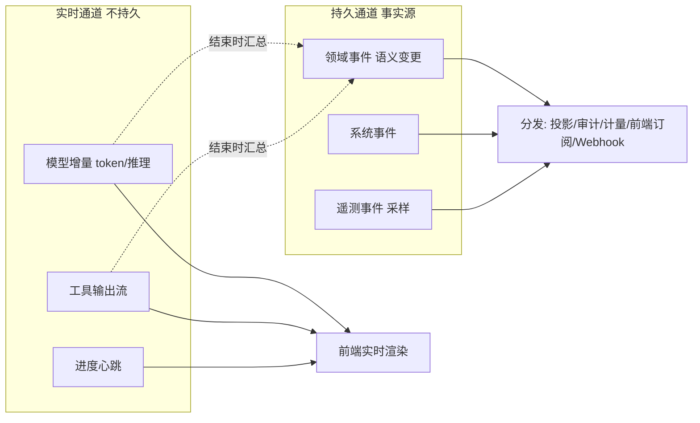
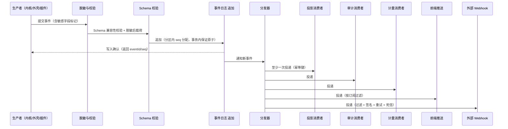

# 卷 16 · 全生命周期事件系统（Event System）

> 事件是 Harness 的「时间轴与事实源」：所有状态变更、决策、计量、审计、恢复都从同一条事件流派生。本卷定义**事件分类法、信封与 Schema 治理、总线与投递语义、顺序与分区、订阅与投影、回放、留存归档、加密脱敏、追踪与外部导出**。
>
> 需求来源：REQ-EVT-1…11（卷 00 §5.16）；全局约束：H-006（追加日志 + 投影）、REQ-INT-3/4（全量持久化，流式增量不入库）。

---

## 1. 本卷定位

- **解决**：什么算事件、事件长什么样、怎么可靠投递、怎么回放、怎么被各系统消费。
- **不解决**：各域语义（见各卷「事件与可观测」节）、存储引擎细节（卷 19）、指标看板（卷 24）。
- **边界**：事件系统是**基础设施**：只提供「写入、分发、回放、导出」能力，不解释业务语义。

## 2. 需求与冲突点

| 需求 | 冲突/要点 |
| --- | --- |
| REQ-EVT-2 Schema 演进 | 消费者众多 → 必须向后兼容策略 |
| REQ-EVT-3 总线 | 进程内低延迟 vs 持久化可靠 vs 跨实例 |
| REQ-EVT-4 流式推送 | 高频增量（token 级）不入库，但前端要实时 → 双通道：实时通道（不持久）+ 语义事件（持久） |
| REQ-EVT-5 回放 | 回放可能触发副作用 → 必须**只读回放**（重建读模型）与**审计回放**分离 |
| REQ-EVT-10 脱敏 | 事件是最全的数据 → 脱敏必须发生在写入之前 |

## 3. 设计空间（M×N）

### D-EVT-1 事件分类法

| 分支 | 描述 | 结论 |
| --- | --- | --- |
| B1 单一类型（全部一种事件） | 简单；无法区分保留与脱敏策略 | 淘汰 |
| **B2 三类：① 领域事件（Domain：会话/任务/工具/权限/计划，持久、可回放、可审计）② 系统事件（System：启动/装配/降级/熔断，持久、可审计）③ 遥测事件（Telemetry：延迟/用量/指标样本，采样、可聚合、可短保留）** | 差异化保留与脱敏；避免全量持久化高频数据 | **选定**（F=9 U=8 S=9 M=9 → 88） |

### D-EVT-2 Schema 治理

| 分支 | 描述 | 结论 |
| --- | --- | --- |
| B1 无 Schema（自由 JSON） | 消费者脆弱 | 淘汰 |
| **B2 Schema Registry（声明式定义 + 版本 + 兼容性校验）：新增字段可选、删除/改义需新版本；消费者按版本解析；CI 校验兼容性** | 演进安全 | **选定**（F=9 U=7 S=9 M=9 → 86.5） |

### D-EVT-3 总线实现

| 分支 | 描述 | 结论 |
| --- | --- | --- |
| B1 纯进程内 | 快；不可靠、不跨实例 | 基线 |
| B2 纯持久化（写入后轮询分发） | 可靠；延迟高 | 基线 |
| **B3 双阶段：写入路径 = 追加日志（强一致）；分发路径 = 进程内快速分发 + 跨实例经存储层（轮询/通知）+ 外部经 Webhook/导出** | 低延迟 + 可靠 | **选定**（F=9 U=8 S=9 M=9 → 88） |

### D-EVT-4 投递语义

| 分支 | 描述 | 结论 |
| --- | --- | --- |
| B1 至多一次 | 简单；可能丢 | 淘汰 |
| **B2 至少一次 + 消费者幂等（幂等键 = 事件 ID + 消费者组）+ 进度位点（offset）持久化** | 可靠且实现简单 | **选定**（F=8 U=8 S=9 M=9 → 85） |
| B3 精确一次（分布式事务） | 复杂且昂贵 | 淘汰 |

### D-EVT-5 顺序保证

| 分支 | 描述 | 结论 |
| --- | --- | --- |
| B1 全局有序 | 实现复杂、吞吐受限 | 淘汰 |
| **B2 分区有序：以「会话（或团队/计划）」为分区键，分区内严格有序（`seq` 单调）；跨分区无序但可比较时间戳** | 满足业务需要（同会话因果有序） | **选定**（F=9 U=8 S=9 M=9 → 88） |

### D-EVT-6 订阅模型

| 分支 | 描述 | 结论 |
| --- | --- | --- |
| B1 仅内部消费者 | 生态受限 | 淘汰 |
| **B2 四类订阅：① 内部消费者（投影/审计/计量/前端推送）② 插件订阅（卷 18）③ 外部 Webhook（按事件类型过滤 + 签名 + 重试）④ 数据导出（批量到数据湖）** | 全覆盖 | **选定**（F=9 U=8 S=8 M=9 → 85.5） |

### D-EVT-7 回放

| 分支 | 描述 | 结论 |
| --- | --- | --- |
| B1 单一回放（重放会触发副作用） | 危险 | 淘汰 |
| **B2 三类回放：① 投影重建（只读，用于读模型修复与新投影上线）② 会话重放（供 UI/审计逐步展示历史，不触发执行）③ 环境重放（在沙箱内重新执行，用于复现问题，隔离且可丢弃）** | 安全且用途清晰 | **选定**（F=9 U=8 S=9 M=9 → 88） |

### D-EVT-8 留存与归档

| 分支 | 描述 | 结论 |
| --- | --- | --- |
| B1 永久保留全部 | 成本高 | 淘汰 |
| **B2 分类留存：领域事件按租户策略（默认 1 年，可延长至永久）；遥测默认 30 天；归档到冷存储（对象存储，可查询）；合规删除可穿透** | 成本与合规平衡 | **选定**（F=8 U=7 S=9 M=9 → 84） |

### D-EVT-9 加密与脱敏

| 分支 | 描述 | 结论 |
| --- | --- | --- |
| B1 写后处理 | 已泄漏 | 淘汰 |
| **B2 写入前脱敏（规则引擎：字段级 + 模式级）+ 敏感事件字段加密（信封加密，密钥经 KMS）+ 明文禁止项清单（密钥/令牌/密码）** | 安全 | **选定**（F=9 U=7 S=9 M=9 → 86.5） |

### D-EVT-10 追踪贯穿

| 分支 | 描述 | 结论 |
| --- | --- | --- |
| B1 仅日志 | 排障困难 | 淘汰 |
| **B2 事件携带 trace/span 上下文（与 OpenTelemetry 语义对齐），事件与 trace 可互查** | 端到端可观测 | **选定**（F=9 U=8 S=8 M=9 → 85.5） |

### D-EVT-11 外部导出

| 分支 | 描述 | 结论 |
| --- | --- | --- |
| B1 无 | 企业集成受限 | 淘汰 |
| **B2 三种出口：Webhook（实时，过滤+签名+重试+死信）、批量导出（Parquet/JSONL 到对象存储或数据湖）、查询 API（按条件查询历史事件，受权限约束）** | 企业可集成 | **选定**（F=9 U=8 S=8 M=9 → 85.5） |

## 4. 选定方案详设

### 4.1 事件信封

| 字段 | 说明 |
| --- | --- |
| `eventId` | 全局唯一（UUIDv7，含时间序） |
| `type` | 事件类型（命名规范见 §4.2） |
| `version` | Schema 版本 |
| `category` | domain / system / telemetry |
| `tenantId` / `projectId` | 租户与项目（强制） |
| `partitionKey` | 分区键（会话/团队/计划 ID） |
| `seq` | 分区内单调序号 |
| `occurredAt` / `recordedAt` | 发生时间 / 写入时间 |
| `actor` | 发起者（user/agent/subagent/plugin/system/external）含 ID |
| `traceId` / `spanId` / `parentSpanId` | 追踪上下文 |
| `correlationId` | 业务关联（如 approvalId、taskId、toolCallId） |
| `payload` | 类型化载荷（已脱敏） |
| `sensitivity` | normal / internal / sensitive（决定加密与访问） |
| `schemaRef` | Schema 定义引用 |

### 4.2 命名规范

`<域>.<对象>.<动作>`，全小写点分，动作用过去式或状态词：

| 域前缀 | 示例 |
| --- | --- |
| `session` | `session.created`、`session.runner.state.changed` |
| `agent` | `agent.turn.started`、`agent.subagent.completed` |
| `model` | `model.request.completed`、`model.error` |
| `context` | `context.assembled`、`context.compacted` |
| `prompt` | `prompt.asset.published` |
| `tool` | `tool.call.completed`、`tool.call.blocked` |
| `permission` | `permission.decision`、`permission.approval.granted` |
| `sandbox` | `sandbox.selected`、`sandbox.violation` |
| `skill` / `mcp` | `skill.activated`、`mcp.server.state.changed` |
| `memory` / `kb` | `memory.written`、`kb.query.executed` |
| `workitem` / `goal` / `schedule` / `team` | `workitem.state.changed`、`team.task.assigned` |
| `workspace` / `git` / `plugin` | `workspace.created`、`git.commit.created`、`plugin.loaded` |
| `system` / `audit` | `system.ready`、`audit.export.completed` |

### 4.3 双通道模型（关键设计）

**规则**（对齐 REQ-INT-4）：高频流式增量不落库；结束时只落「结果 + 摘要 + 用量」等语义事件；重放时凭这些语义事件重建最终呈现（不重建逐字动画）。

### 4.4 写入与分发管线

**关键约束**：写入确认是「进展」的判定点——内核只有拿到写入确认才认为该步骤已提交（对齐卷 03 检查点与卷 19 恢复）。

### 4.5 消费者与投影

| 消费者 | 输入 | 输出 | 幂等键 |
| --- | --- | --- | --- |
| 会话投影 | 会话/轮次/条目事件 | 会话读模型（列表/详情/统计） | `eventId` |
| 任务投影 | workitem 事件 | 任务树/看板数据 | `eventId` |
| 计量投影 | model/tool/session 事件 | 用量与成本聚合 | `eventId` |
| 审计投影 | 权限/工具/审批/系统事件 | 审计视图与导出 | `eventId` |
| 前端推送 | 订阅集合 | WS 通知帧 | `seq`（断线续传） |
| 记忆挖掘 | 会话与任务事件 | 记忆候选 | `eventId` + 窗口 |
| 知识挖掘 | 任务完成事件 | 知识页更新候选 | `eventId` |
| 评测采集 | 全量轨迹 | 评测样本 | `eventId` |

### 4.6 回放

| 类型 | 用途 | 机制 | 副作用 |
| --- | --- | --- | --- |
| 投影重建 | 修复读模型 / 上线新投影 | 从头（或从快照）消费，只写投影 | 无（只读） |
| 会话重放 | UI 历史浏览 / 审计查看 | 按 seq 顺序渲染，支持变速与跳转 | 无 |
| 环境重放 | 复现问题 / 回归 | 在隔离沙箱中重放工具调用（读操作实际执行，写操作按账本模拟或重定向到临时工作区） | 隔离（可丢弃） |
| 审计重放 | 合规检查 | 决策链重放（卷 06 D-PERM-12） | 无 |

### 4.7 留存、归档与删除

| 类别 | 在线保留 | 归档 | 删除 |
| --- | --- | --- | --- |
| 领域事件 | 默认 1 年（租户可调，最高永久） | 超期转对象存储（Parquet，索引保留元数据） | 合规删除穿透（生成删除证明） |
| 系统事件 | 1 年 | 同上 | 同上 |
| 遥测事件 | 30 天 | 聚合后丢弃原始 | 自动 |
| 审计事件 | 默认 3 年（合规可配更久） | 长期归档（不可变存储） | 仅按法规要求 |

### 4.8 与追踪、指标的关系

| 方面 | 设计 |
| --- | --- |
| Trace | 事件携带 trace/span；一次 Turn 一个 span 树；工具调用与模型调用为子 span |
| Metrics | 指标由事件派生（流式聚合），指标与事件可互查（指标点 → 相关事件） |
| Logs | 技术日志（异常堆栈等）走结构化日志，携带同样 trace 上下文；业务语义不重复记日志（避免双写不一致） |

## 5. 扩展点（供卷 18 汇总）

| 扩展点 | 说明 |
| --- | --- |
| `EventProducerSPI` | 外部事件源接入（视为系统事件） |
| `EventConsumerSPI` | 插件订阅事件 |
| `ProjectionSPI` | 自定义投影（新读模型） |
| `RedactionRuleSPI` | 脱敏规则扩展（企业字段清单） |
| `EventExportSinkSPI` | 导出目标（数据湖/SIEM/自建） |
| `ReplayPolicySPI` | 重放策略（哪些工具可在环境重放中真实执行） |

## 6. 事件与可观测（元事件）

| 事件 | 说明 |
| --- | --- |
| `system.eventlog.appended` | 写入（含分区、seq、延迟） |
| `system.eventlog.consumer.lag` | 消费者滞后（超过阈值告警） |
| `system.eventlog.schema.rejected` | Schema 校验拒绝（开发者可见） |
| `system.eventlog.deadletter` | 死信（Webhook 或消费者连续失败） |
| `system.eventlog.archive.completed` | 归档完成 |
| `audit.export.completed` | 审计导出 |

**指标**：`oc_event_append_latency_ms`、`oc_event_append_total{category}`、`oc_event_consumer_lag_seconds{consumer}`、`oc_event_deadletter_total`、`oc_event_archive_bytes`、`oc_event_replay_active`。

## 7. 非功能设计

- **性能**：追加 P95 ≤ 10ms（NFR-P-4）；批量场景 ≥ 50k EPS；前端推送端到端 ≤ 200ms。
- **容量**：单会话 ≥ 100 万事件可流畅导航（NFR-C-1）；分区 + 归档支撑 ≥ 10 亿条。
- **可靠性**：至少一次 + 幂等；消费者滞后可观测；死信可重放；写入确认后才算提交。
- **安全**：写入前脱敏；敏感字段加密；访问按租户与敏感级；审计事件不可篡改（哈希链）。
- **可维护**：Schema Registry + CI 兼容性校验；事件目录文档化（每域事件表汇总于本卷附录 B/各卷）。

## 8. 完成定义（DoD）

- [ ] 事件信封与命名规范落地；三类事件（领域/系统/遥测）差异化策略生效。
- [ ] Schema Registry 与兼容性 CI 校验可用（破坏性变更被拒绝）。
- [ ] 双通道模型验证：token 增量不入库且前端实时渲染正常；语义事件完整可回放。
- [ ] 分区有序性测试：同会话事件 seq 单调且重放顺序一致。
- [ ] 消费者幂等：重复投递不产生重复副作用（用例）。
- [ ] 四类订阅可用；Webhook 签名、重试、死信全通。
- [ ] 三类回放可用；环境重放不污染真实工作区（用例）。
- [ ] 留存/归档/合规删除可用（穿透证明）。
- [ ] 脱敏：密钥类字段绝不出现在事件载荷（扫描校验）。

## 9. 域内决策汇总（D-EVT）

| ID | 主题 | 选定 |
| --- | --- | --- |
| D-EVT-1 | 分类法 | 领域 / 系统 / 遥测 三类 |
| D-EVT-2 | Schema 治理 | Registry + 版本 + 兼容校验 |
| D-EVT-3 | 总线 | 双阶段（追加日志 + 快速分发 + 跨实例/外部） |
| D-EVT-4 | 投递 | 至少一次 + 幂等 + 位点 |
| D-EVT-5 | 顺序 | 分区有序（会话/团队/计划为键） |
| D-EVT-6 | 订阅 | 四类（内部/插件/Webhook/导出） |
| D-EVT-7 | 回放 | 三类（投影重建/会话重放/环境重放）+ 审计重放 |
| D-EVT-8 | 留存 | 分类留存 + 冷归档 + 合规穿透删除 |
| D-EVT-9 | 安全 | 写入前脱敏 + 信封加密 + 敏感度分级 |
| D-EVT-10 | 追踪 | trace/span 贯穿 + 事件与 trace 互查 |
| D-EVT-11 | 导出 | Webhook + 批量 + 查询 API |

## 10. 开放问题与默认决策

| 项 | 默认决策 |
| --- | --- |
| 事件日志存储 | PostgreSQL 分区表（local 形态可用嵌入式实现）；超大规模切专用日志存储（接口不变） |
| 前端订阅粒度 | 默认订阅「当前会话 + 任务列表 + 审批」集合；可扩展 |
| 遥测采样率 | 默认 100% 计数类，延迟类 10% 采样（可配） |
| 事件压缩 | 归档时压缩（Parquet + zstd）；在线不压缩（延迟优先） |
| 跨实例推送 | 默认轮询（1s）；Redis 可用时用发布订阅降低延迟 |
