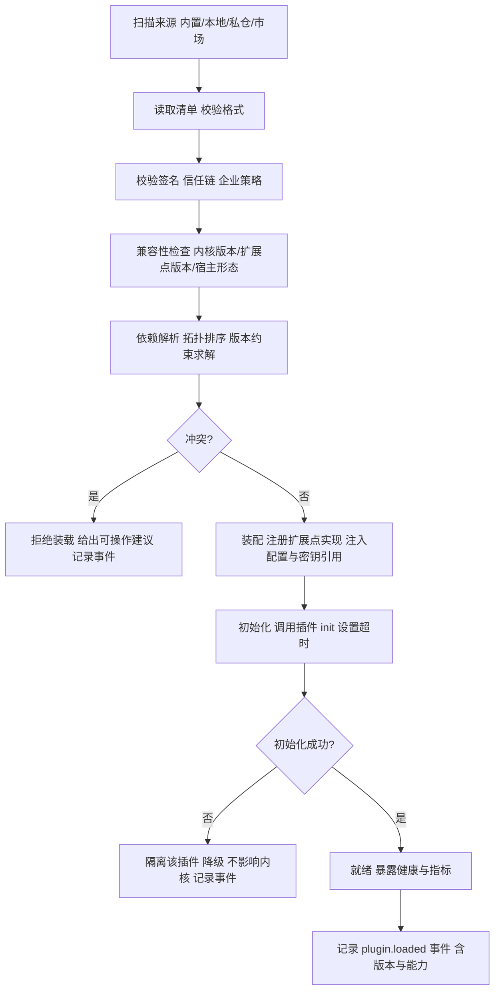

# 卷 18 · 插件化与扩展体系（Plugin & Extension）

> 「一切皆插件」不是口号，而是一张**扩展点目录 + 插件生命周期 + 权限与隔离**的工程契约：本卷把卷 02–17 暴露的全部扩展点汇总成可治理的目录，并定义插件的形态、装载、隔离、授权、市场与开发套件。
>
> 需求来源：REQ-PLG-1…12（卷 00 §5.18）；竞品参照：REQ-CMP-14（DeepSeek Harness「一切皆插件」）、REQ-CMP-9（Claude Code Plugins 打包分发）。

---

## 1. 本卷定位

- **解决**：扩展点有哪些、插件怎么写、怎么装、怎么隔离、怎么授权、怎么升级、怎么分发、怎么不被插件拖垮。
- **不解决**：各扩展点的业务语义（分散在各卷）、工具契约（卷 05）、权限决策（卷 06）。
- **边界**：插件是**代码扩展**（可执行）；Skill 是**内容扩展**（卷 08）；Hooks 是**轻量干预**（卷 17）。三者共用一套打包、签名与治理机制。

## 2. 需求与冲突点

| 需求 | 冲突/要点 |
| --- | --- |
| REQ-PLG-1 扩展点覆盖 | 扩展点越多越灵活，但越难保持兼容 → 需要稳定性分级与版本协商 |
| REQ-PLG-5 隔离 | 进程内性能好但风险高；进程外安全但通信成本 → 双模按需 |
| REQ-PLG-6 生命周期 | 热重载体验好，但状态一致性难 → 明确「可热重载」边界 |
| REQ-PLG-7 权限 | 插件能力强大 → 必须声明 + 授权 + 运行期约束 |
| REQ-PLG-8 市场 | 生态红利 vs 供应链风险 → 签名 + 审核 + 企业私仓 |

## 3. 设计空间（M×N）

### D-PLG-1 扩展点目录组织

| 分支 | 描述 | 结论 |
| --- | --- | --- |
| B1 少量稳定 SPI（10 个以内） | 兼容好；覆盖不足 | 淘汰 |
| **B2 目录化 + 稳定性分级：`stable`（跨大版本兼容）/ `evolving`（小版本可增删）/ `experimental`（可破坏）；每点标注与内核版本兼容区间** | 灵活且可治理 | **选定**（F=9 U=7 S=9 M=9 → 86.5） |

### D-PLG-2 插件形态

| 分支 | 描述 | 结论 |
| --- | --- | --- |
| B1 仅进程内 JAR | 快；崩溃与越权影响内核 | 基线 |
| B2 仅外部进程 | 安全；性能与部署成本高 | 基线 |
| **B3 双模 + 远程：① 进程内（可信、性能敏感，如模型适配/工具）② 外部进程（不可信或需隔离，如企业私有服务）③ 远程服务（HTTP/gRPC，企业集中部署）** | 按信任与性能选择 | **选定**（F=9 U=8 S=9 M=9 → 88） |

### D-PLG-3 清单与能力声明

| 分支 | 描述 | 结论 |
| --- | --- | --- |
| B1 无清单（自动扫描） | 简单；不可治理 | 淘汰 |
| **B2 显式清单：id/版本/作者/签名/所需扩展点/所需权限/资源需求（CPU/内存/网络域名/文件访问）/配置 Schema/依赖（插件与内核版本）/提供的 UI 扩展/可热重载标记** | 安装可见、启动可校验、运行可约束 | **选定**（F=9 U=8 S=9 M=9 → 88） |

### D-PLG-4 装载与依赖解析

| 分支 | 描述 | 结论 |
| --- | --- | --- |
| B1 顺序加载（目录顺序） | 不可预测 | 淘汰 |
| **B2 依赖图 + 拓扑排序 + 版本约束求解 + 冲突报告：启动期解析；冲突无法解决则拒绝并给出可操作建议（禁用/升级/降级）** | 确定性启动 | **选定**（F=9 U=8 S=9 M=9 → 88） |

### D-PLG-5 隔离模型

| 分支 | 描述 | 结论 |
| --- | --- | --- |
| B1 无隔离（同一类加载器） | 冲突风险高 | 淘汰 |
| **B2 分层隔离：进程内插件用独立类加载器 + 受限 API 面（不暴露内部实现）+ 权限门面；进程外插件用进程边界；两者统一以「能力接口」交互** | 冲突与越权可控 | **选定**（F=9 U=8 S=8 M=9 → 85.5） |

### D-PLG-6 生命周期

| 分支 | 描述 | 结论 |
| --- | --- | --- |
| B1 仅启动时加载 | 简单；升级需重启 | 基线 |
| **B2 全生命周期：安装（校验签名与清单）→ 启用（装配）→ 禁用（卸载装配、保留配置）→ 升级（版本迁移 + 兼容校验）→ 卸载（清理 + 依赖检查）→ 回滚（回上一版本）；`reloadable: true` 的插件支持热重载（先禁用后启用，状态需自管）** | 可运维 | **选定**（F=9 U=8 S=8 M=9 → 85.5） |

### D-PLG-7 权限模型

| 分支 | 描述 | 结论 |
| --- | --- | --- |
| B1 插件全权（等同内核） | 危险 | 淘汰 |
| **B2 能力授权：清单声明 → 安装时用户/管理员授权 → 运行期经权限门面访问（越权即拒绝并审计）；插件权限不得超过安装者权限（无权限放大）** | 与卷 06 一致 | **选定**（F=9 U=8 S=9 M=9 → 88） |

### D-PLG-8 市场与供应链

| 分支 | 描述 | 结论 |
| --- | --- | --- |
| B1 无市场 | 生态受限 | 淘汰 |
| **B2 三层分发：本地文件 / 组织私仓 / 公共市场；全部要求签名（公钥信任链）；公共市场需审核与自动扫描；企业可禁用公共市场、强制私仓白名单** | 生态与合规并重 | **选定**（F=9 U=8 S=8 M=9 → 85.5） |

### D-PLG-9 开发套件

| 分支 | 描述 | 结论 |
| --- | --- | --- |
| B1 仅文档 | 门槛高 | 淘汰 |
| **B2 完整 SDK：脚手架（生成清单/骨架/示例）、测试夹具（模拟内核环境、假模型与假工具）、本地调试（热重载 + 断点）、契约测试工具（兼容性校验）、打包与签名工具、发布命令** | 生态基础 | **选定**（F=9 U=9 S=8 M=9 → 88） |

### D-PLG-10 可观测与熔断

| 分支 | 描述 | 结论 |
| --- | --- | --- |
| B1 无 | 插件故障难定位 | 淘汰 |
| **B2 健康状态（初始化/就绪/降级/故障）+ 隔离日志（按插件分文件/命名空间）+ 指标（调用量/延迟/错误率）+ 熔断（错误率或超时超阈值 → 停用该扩展点并告警）** | 韧性 | **选定**（F=9 U=8 S=9 M=9 → 88） |

### D-PLG-11 配置与密钥

| 分支 | 描述 | 结论 |
| --- | --- | --- |
| B1 插件自管 | 散落、不安全 | 淘汰 |
| **B2 统一配置：插件声明配置 Schema（类型/默认值/校验/是否敏感）→ 界面自动生成配置表单 → 密钥经 `SecretPort` 注入（插件只见引用与运行时句柄）→ 配置版本化与审计** | 一致治理 | **选定**（F=9 U=9 S=8 M=9 → 88） |

### D-PLG-12 UI 扩展

| 分支 | 描述 | 结论 |
| --- | --- | --- |
| B1 不支持 UI 扩展 | 生态受限（无法提供专属面板） | 基线 |
| **B2 UI 扩展面：面板（新视图）、命令（命令面板项）、设置页、状态栏项、会话内联卡片（自定义渲染）、通知模板；以声明式描述 + 沙箱化渲染（不直接访问 DOM 全权）** | 生态体验 | **选定**（F=8 U=9 S=7 M=8 → 79.5） |

## 4. 选定方案详设

### 4.1 扩展点目录（汇总卷 02–17）

| 域 | 扩展点 | 稳定性 | 进程内/外 |
| --- | --- | --- | --- |
| 架构（卷 01） | StoragePort、RuntimeStorePort、HostAdapterPort、ProtocolCodec、ClockPort/IdPort、CapabilityProbe、AssemblerContributor、SurfaceRenderer | stable / evolving | 内 |
| 模型（卷 02） | ProtocolAdapter、RouterRule、Decorator、UsageSink、SecretResolver、EmbeddingProvider、ContentSanitizer | stable | 内 / 外 |
| 上下文（卷 03） | TokenizerEstimator、SectionProvider、Compressor、RetrievalAugmentor、InjectionDetector、ContextView | evolving | 内 / 外 |
| 提示词（卷 04） | AssetSource、FragmentProvider、PolicyRule、AssemblyStage、EvalHook | evolving | 内 |
| 工具（卷 05） | ToolProvider、ToolDecorator、ToolResultRenderer、ConflictResolver、ToolAlias、SandboxPolicyContributor | stable | 内 / 外 |
| 权限（卷 06） | PolicyProvider、PolicyRule、RiskAssessor、ApprovalChannel、ApprovalPolicy、AuditSink、CapabilityToken | stable | 内 / 外 |
| 沙箱（卷 07） | IsolationProvider、DangerRule、NetworkPolicy、CredentialBroker、SnapshotProvider、ExecutionRecorder | evolving | 外（多数） |
| Skill（卷 08） | SkillSource、SkillTrigger、SkillRouter、SkillAssembler、SkillEval、SkillPublisher | evolving | 内 |
| MCP（卷 09） | McpTransport、McpAuth、McpCapabilityMapper、McpPolicy、McpExposure | evolving | 内 / 外 |
| 记忆（卷 10） | MemoryStore、MemoryWriter、MemoryRanker、PiiDetector、MemorySync | evolving | 内 / 外 |
| 知识（卷 11） | Connector、Parser、Chunker、EmbeddingProvider、Reranker、IndexStore、KnowledgePolicy | evolving | 内 / 外 |
| Agent（卷 12） | LoopStrategy、PlanningStrategy、SubAgentPolicy、VerificationProvider、ProgressMetric、AgentDefinitionSource、TrajectoryExporter | evolving | 内 |
| Teams（卷 13） | RoleLibrary、Topology、AssignmentStrategy、ArbitrationPolicy、TeamBudgetPolicy、TeamView | experimental | 内 |
| 任务（卷 14） | WorkItemType、DecompositionStrategy、PriorityPolicy、AcceptanceValidator、TaskTemplateProvider、WorkItemView | evolving | 内 |
| Goal/Schedule（卷 15） | Trigger、AutonomyPolicy、ReportFormatter、NotificationChannel、GoalProgressMetric、CircuitBreakerPolicy | evolving | 内 / 外 |
| 事件（卷 16） | EventProducer、EventConsumer、Projection、RedactionRule、EventExportSink、ReplayPolicy | stable | 内 / 外 |
| Hooks（卷 17） | HookPoint、HookImpl、HookMatcher、HookPolicy、HookTemplateProvider | evolving | 内 / 外 |
| 工作区（卷 20） | WorkspaceProvider、FileSyncStrategy、EnvironmentProbe、ProcessSupervisor | stable | 外 |
| Git（卷 21） | GitHostProvider（GitHub/GitLab/内网）、MergeStrategy、ConflictResolver、CommitPolicy | evolving | 内 / 外 |
| 端（卷 22） | UI 面板/命令/设置页（见 D-PLG-12）、RendererExtension | experimental | 外（前端） |
| 企业（卷 24） | IdentityProvider（SSO）、BillingSink、ComplianceReport、FeatureFlagProvider | stable | 内 / 外 |
| 前沿（卷 25） | ExperimentProvider、ComputerUseAdapter | experimental | 外 |

> 合计 30+ 类、100+ 个具体扩展点。

### 4.2 插件清单示例

```yaml
id: com.acme.k8s-ops
name: K8s 运维扩展
version: 2.3.1
author: ACME Platform Team
signature: <base64>
kernel:
  compatible: ">=1.2 <2.0"
  hostMode: in-process        # in-process | out-of-process | remote
capabilities:
  extensions:
    - tool.provider           # 提供工具
    - permission.policy       # 提供策略规则
    - ui.panel                # 提供面板
  permissions:
    - tool.execute:commands
    - network:egress:[api.acme.internal]
    - workspace:read
    - secret:ref:acme.k8s.token
resources:
  maxMemoryMb: 256
  maxConcurrency: 4
configSchema:
  cluster: { type: string, required: true }
  namespace: { type: string, default: default }
  tokenRef: { type: secret, required: true }
reloadable: true
dependencies:
  plugins: []
  skills: [acme.k8s-basics@^1.0]
```

### 4.3 装载流水线



### 4.4 隔离与权限门面

| 维度 | 进程内插件 | 进程外插件 |
| --- | --- | --- |
| 类加载 | 独立类加载器，仅暴露 SDK API 包 | 独立进程，无类耦合 |
| 资源限制 | 线程/内存约束（软限制） | 进程级硬限制（卷 07） |
| 崩溃影响 | 捕获并禁用该插件（可能导致扩展点失效） | 进程重启，不影响内核 |
| 权限 | 经门面接口（每次调用校验） | 经协议（令牌 + 能力声明） |
| 数据访问 | 仅经 SDK 提供的仓储/查询接口（不直连 DB） | 同上（经协议） |
| 通信开销 | 方法调用（纳秒级） | 序列化 + IPC（微秒~毫秒） |

**硬约束**：任何插件**不得直连数据库/Redis**，必须经内核提供的端口（保证租户隔离与审计不被绕过）。

### 4.5 开发套件

| 工具 | 说明 |
| --- | --- |
| `oc-plugin init` | 生成脚手架（清单 + 骨架 + 示例扩展点 + 测试） |
| 测试夹具 | 内存内核 + 假模型（可编程响应）+ 假工具 + 假事件总线；支持断言扩展点行为 |
| 本地调试 | `oc-plugin dev` 启动内核并热重载插件；支持断点 |
| 契约测试 | 校验插件与目标内核版本的兼容性（自动跑扩展点契约用例） |
| 打包签名 | `oc-plugin package`（产物 + 清单 + 签名）；`oc-plugin publish`（私仓/市场） |
| 兼容性矩阵 | 展示插件 × 内核版本的支持矩阵 |

## 5. 扩展点（元扩展）

| 扩展点 | 说明 |
| --- | --- |
| `PluginSourceSPI` | 插件来源（本地/私仓/市场/内置） |
| `PluginTrustPolicySPI` | 信任与签名策略（企业） |
| `PluginConfigRendererSPI` | 配置表单渲染扩展 |
| `PluginLifecycleHookSPI` | 插件生命周期钩子（安装/启用/禁用/卸载） |

## 6. 事件与可观测

| 事件 | 说明 |
| --- | --- |
| `plugin.installed` / `removed` / `enabled` / `disabled` / `updated` / `rolled_back` | 生命周期（含签名与授权记录） |
| `plugin.loaded` / `failed` | 装载结果 |
| `plugin.capability.registered` | 扩展点注册（含稳定性级别） |
| `plugin.permission.denied` | 插件越权（安全事件） |
| `plugin.circuit.open` / `closed` | 熔断 |
| `plugin.health.changed` | 健康状态 |

**指标**：`oc_plugin_loaded_total`、`oc_plugin_init_latency_ms`、`oc_plugin_call_total{plugin,extension}`、`oc_plugin_error_total{plugin}`、`oc_plugin_circuit_open_total`、`oc_plugin_memory_bytes{plugin}`。

## 7. 非功能设计

- **性能**：装载总时长 ≤ 1.5s（10 个插件，延迟加载可更短）；进程内扩展点调用开销 ≤ 100µs；进程外 ≤ 5ms。
- **可靠性**：插件故障隔离（不影响内核）；扩展点失效自动降级到内置实现（若存在）；熔断自动恢复探测。
- **安全**：签名 + 授权 + 门面 + 沙箱；插件不可直连存储；不可跨租户；越权审计。
- **可维护**：扩展点稳定性分级 + 兼容期（≥ 2 小版本）；契约测试；弃用流程（先标记 evolving→deprecated→移除）。
- **可移植**：插件产物跨平台（JVM 字节码或二进制 + 平台标记）。

## 8. 完成定义（DoD）

- [ ] 扩展点目录落地并版本化（≥ 30 类、100+ 点，注明稳定性）。
- [ ] 三形态插件（进程内/进程外/远程）各有示例与端到端测试。
- [ ] 清单校验、签名校验、兼容性检查、依赖解析、冲突报告全部可用。
- [ ] 生命周期六操作（安装/启用/禁用/升级/卸载/回滚）可用；可热重载插件生效。
- [ ] 权限门面：插件越权被拒绝并审计（用例）；插件无法直连存储（用例）。
- [ ] 熔断：错误率超阈值自动停用扩展点并告警。
- [ ] 配置 Schema 自动生成表单；密钥经引用注入（无明文）。
- [ ] 开发套件可用：脚手架 → 本地调试（热重载）→ 契约测试 → 打包签名 → 发布私仓，全链路跑通。
- [ ] UI 扩展（面板 + 命令）在桌面端可用，且渲染沙箱化。

## 9. 域内决策汇总（D-PLG）

| ID | 主题 | 选定 |
| --- | --- | --- |
| D-PLG-1 | 扩展点目录 | 目录化 + 三级稳定性 + 版本区间 |
| D-PLG-2 | 插件形态 | 双模 + 远程（进程内/进程外/远程） |
| D-PLG-3 | 清单声明 | 显式清单（扩展点/权限/资源/配置/依赖） |
| D-PLG-4 | 装载解析 | 依赖图 + 拓扑排序 + 版本求解 + 冲突报告 |
| D-PLG-5 | 隔离 | 类加载隔离 + 受限 API 面 + 统一能力接口 |
| D-PLG-6 | 生命周期 | 六操作 + 热重载（可选） |
| D-PLG-7 | 权限 | 能力授权 + 无权限放大 + 运行期门面 |
| D-PLG-8 | 市场 | 三层分发 + 签名 + 私仓白名单 |
| D-PLG-9 | 开发套件 | 脚手架 + 夹具 + 热重载调试 + 契约测试 + 发布 |
| D-PLG-10 | 可观测 | 健康 + 隔离日志 + 指标 + 熔断 |
| D-PLG-11 | 配置密钥 | 统一 Schema + 表单生成 + SecretPort 引用 |
| D-PLG-12 | UI 扩展 | 面板/命令/设置/卡片 + 沙箱化渲染 |

## 10. 开放问题与默认决策

| 项 | 默认决策 |
| --- | --- |
| 默认是否允许进程内插件 | 允许，但仅限签名且来自可信来源；企业可强制进程外 |
| 扩展点弃用流程 | 标记 deprecated（≥ 2 小版本）→ 运行时告警 → 下一个大版本移除 |
| 插件版本升级策略 | 默认手动确认；企业可配自动升级（仅补丁版本） |
| 插件市场默认状态 | 关闭（企业与个人均需显式开启）；组织私仓默认可用 |
| UI 扩展技术形态 | 声明式描述 + 受控渲染（Web 组件/沙箱 iframe 由卷 22 细化） |
