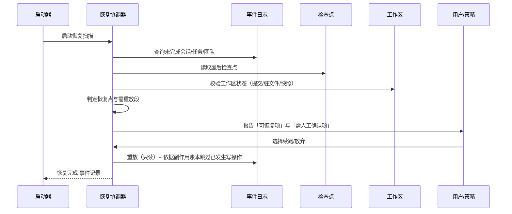

# 卷 19 · 持久化、迁移与恢复（Persistence / Migration / Recovery）

> 企业级系统的底线是「数据不丢、可迁移、可恢复、可证明」：本卷定义**数据分域与所有权、Schema 演进（expand-contract）、备份与时间点恢复、检查点与崩溃恢复、导入导出（厂商中立格式）、保留与合规删除、灾备、一致性校验**。
>
> 需求来源：REQ-PERS-1…11（卷 00 §5.19）；全局约束：H-005（PG 事实源 + Redis 运行态 + 对象存储）、REQ-INT-3（全量持久化）。

---

## 1. 本卷定位

- **解决**：数据放哪、怎么演进、怎么备份、崩溃后怎么恢复、怎么导出迁移、怎么合规删除。
- **不解决**：事件语义（卷 16）、检查点内容定义（卷 03）、快照实现（卷 07/20/21 提供内容，本卷定义编排与存储）。
- **边界**：本卷是**数据生命周期**的唯一权威；任何域新增表/字段都必须回写本卷的数据分域表与迁移规范。

## 2. 需求与冲突点

| 需求 | 冲突/要点 |
| --- | --- |
| REQ-PERS-2 迁移 | 停机迁移 vs 在线迁移 → 必须在线（企业不能停） |
| REQ-PERS-3 备份 | 备份成本 vs 恢复目标（RPO ≤ 1min, RTO ≤ 15min） |
| REQ-PERS-5 崩溃恢复 | 恢复精度 vs 重放成本 → 检查点 + 幂等重放（卷 03/12） |
| REQ-PERS-6 导入导出 | 完整性与可移植 → 厂商中立格式 + 引用完整性校验 |
| REQ-PERS-7 合规删除 | 与备份/归档/投影的矛盾 → 删除标记贯通各层 |

## 3. 设计空间（M×N）

### D-PERS-1 数据分域与所有权

| 分支 | 描述 | 结论 |
| --- | --- | --- |
| B1 一张大库无规则 | 演进失控 | 淘汰 |
| **B2 分域（Schema/表族） + 单一写入者原则：每个域的数据只由其领域服务写入；跨域只读（或经事件投影）** | 边界清晰、迁移可分批 | **选定**（F=9 U=7 S=9 M=9 → 86.5） |

### D-PERS-2 迁移机制

| 分支 | 描述 | 结论 |
| --- | --- | --- |
| B1 手工 SQL | 不可控 | 淘汰 |
| B2 声明式 Schema diff（框架自动生成） | 便利；风险不可控（可能生成破坏性语句） | 淘汰 |
| **B3 版本化脚本（迁移即代码）：每个迁移带唯一版本号、前向脚本、校验和、可选的逆向脚本与数据回填步骤；CI 校验（禁止破坏性操作除非显式标记）；执行记录入库** | 可控、可审计 | **选定**（F=9 U=8 S=9 M=9 → 88） |

### D-PERS-3 兼容策略

| 分支 | 描述 | 结论 |
| --- | --- | --- |
| B1 直接改（改列类型/删除列） | 在线迁移会破坏在读实例 | 淘汰 |
| **B2 expand-contract 三阶段：① 扩展（加新列/新表，双写）② 迁移（回填 + 校验 + 读切换）③ 收缩（停写旧字段，观察期后删除）** | 零停机、可回滚 | **选定**（F=9 U=8 S=9 M=9 → 88） |

### D-PERS-4 备份策略

| 分支 | 描述 | 结论 |
| --- | --- | --- |
| B1 仅逻辑导出（pg_dump） | 简单；RPO 大、恢复慢 | 基线 |
| **B2 物理备份 + WAL 归档（PITR）+ 逻辑导出（用于跨版本/跨厂商迁移）** | 满足 RPO/RTO | **选定**（F=9 U=8 S=9 M=9 → 88） |
| B3 仅存储快照 | 依赖底层存储；跨环境弱 | 备选 |

### D-PERS-5 恢复目标

| 分支 | 描述 | 结论 |
| --- | --- | --- |
| B1 无明确目标 | 无法验收 | 淘汰 |
| **B2 明确 SLO：RPO ≤ 1min（WAL 连续归档）、RTO ≤ 15min（自动化恢复脚本 + 演练）；对象存储与索引可重建（RTO 放宽至小时级，不阻塞核心）** | 可验证 | **选定**（F=8 U=8 S=9 M=9 → 85） |

### D-PERS-6 会话/工作区快照

| 分支 | 描述 | 结论 |
| --- | --- | --- |
| B1 全量打包 | 简单；成本高 | 基线 |
| **B2 内容寻址增量：快照 = 清单（文件 → 内容哈希）+ 去重内容存储；元数据（权限/时间）单独记录；恢复按清单重建** | 省空间、可对比 | **选定**（F=9 U=8 S=8 M=9 → 85.5） |

### D-PERS-7 崩溃恢复编排

| 分支 | 描述 | 结论 |
| --- | --- | --- |
| B1 依赖数据库自身恢复 | 业务状态可能不一致 | 淘汰 |
| **B2 恢复协调器：启动时扫描「未完成会话/任务/团队」→ 校验最后一个检查点与事件位点 → 标记可恢复 → 由用户/策略决定续跑（或自动续跑，若处于自治模式）→ 依据副作用账本避免重复动作** | 业务级恢复 | **选定**（F=9 U=8 S=9 M=9 → 88） |

### D-PERS-8 导入导出格式

| 分支 | 描述 | 结论 |
| --- | --- | --- |
| B1 私有二进制格式 | 锁定 | 淘汰 |
| **B2 厂商中立包：`manifest.json`（版本/校验/依赖）+ `events.jsonl`（语义事件）+ `workitems.json`（任务/计划）+ `memory/`（记忆文件）+ `artifacts/`（外置内容，内容寻址）+ `workspace-refs.json`（工作区引用，不含代码）+ 校验清单（哈希）** | 可迁移、可审计、可校验 | **选定**（F=9 U=8 S=8 M=9 → 85.5） |

### D-PERS-9 保留与合规删除

| 分支 | 描述 | 结论 |
| --- | --- | --- |
| B1 统一保留期 | 不满足差异化合规 | 淘汰 |
| **B2 分级保留（按域与租户策略）+ 合规删除贯通（在线表 + 归档 + 投影 + 索引 + 备份标记）+ 删除证明** | 合规可证明 | **选定**（F=9 U=7 S=8 M=9 → 84） |

### D-PERS-10 灾备

| 分支 | 描述 | 结论 |
| --- | --- | --- |
| B1 无 | 风险 | 淘汰 |
| **B2 主备/多副本 + 跨区备份 + 定期演练（每季度恢复演练 + 演练报告）；对象存储跨区复制** | 企业级 | **选定**（F=8 U=7 S=9 M=8 → 81.5） |

### D-PERS-11 一致性校验与修复

| 分支 | 描述 | 结论 |
| --- | --- | --- |
| B1 无 | 漂移不可发现 | 淘汰 |
| **B2 校验工具：事件 ↔ 投影（抽样重建对比）、事件 ↔ 快照（序号与状态比对）、引用完整性（artifact/媒体/索引）、索引 ↔ 工作区版本；发现偏差可自动修复（重建投影/重放）** | 数据可信 | **选定**（F=9 U=8 S=8 M=9 → 85.5） |

### D-PERS-12 大对象与媒体治理

| 分支 | 描述 | 结论 |
| --- | --- | --- |
| B1 与数据库混存 | 膨胀、备份慢 | 淘汰 |
| **B2 内容寻址对象存储（media/artifacts/snapshots 三类命名空间）+ 引用计数 + 生命周期（冷热分层、TTL）+ 去重 + 加密** | 成本与性能兼得 | **选定**（F=9 U=8 S=8 M=9 → 85.5） |

### D-PERS-13 迁移自动化测试

| 分支 | 描述 | 结论 |
| --- | --- | --- |
| B1 手工验证 | 事故高发 | 淘汰 |
| **B2 每次迁移必须通过：① 空库迁移 ② 生产样本数据迁移（脱敏副本）③ 迁移后回归（核心读路径 + 一致性校验）④ 回滚演练（若声明可回滚）** | 迁移安全 | **选定**（F=9 U=7 S=9 M=9 → 87） |

## 4. 选定方案详设

### 4.1 数据分域表

| 域 | 主要数据 | 存储 | 写入者 | 保留 |
| --- | --- | --- | --- | --- |
| 事件日志 | 领域/系统/遥测事件 | PG 分区表（+ 冷存归档） | 事件系统 | 领域 1 年+（可永久）；遥测 30 天 |
| 会话与条目 | 会话、轮次、条目索引、读模型 | PG（投影表） | 会话域 | 随租户策略 |
| 检查点 | 检查点元数据 + 摘要 | PG + 对象存储（大对象） | 上下文域 | 随会话 |
| 任务/计划/目标 | WorkItem、依赖、证据 | PG | 工作对象域 | 长期 |
| 团队 | 团队、成员、消息、黑板 | PG | Teams 域 | 长期 |
| 权限与审计 | 策略、授权记忆、决策轨迹、审批 | PG（只追加为主） | 权限域 | 审计 3 年+ |
| 计量与成本 | 用量聚合、账单 | PG（聚合表） | 计量域 | 3 年 |
| 记忆 | 记忆条目与版本 | PG + 文件（项目/组织层） | 记忆域 | 按条目 TTL |
| 知识 | 文档元数据、块、索引、图边 | PG（+ 可选专用引擎） | 知识域 | 随源 |
| 提示词/Skill/插件 | 资产、包、清单、版本 | PG + 文件 + 对象存储 | 各自域 | 长期 |
| 工作区与 Git 引用 | 工作区定义、连接、快照清单 | PG + 对象存储 | 工作区域 | 随租户 |
| 媒体与工件 | 上传媒体、工具外置结果 | 对象存储（内容寻址） | 多域（经统一服务） | 引用计数 + TTL |
| 运行态 | 热态、锁、限流、队列、订阅位点 | Redis（可降级进程内） | 各域（经端口） | 秒~小时级 |
| 配置与密钥 | 配置版本、密钥引用 | 配置文件 + PG + KMS | 平台域 | 版本化 |

### 4.2 迁移流水线


**规则**：破坏性操作（删列/改类型/删表）必须显式标记并经审批，且必须在 expand-contract 流程下执行；迁移脚本禁止引用应用代码（保证独立性）。

### 4.3 崩溃恢复序列



### 4.4 导入导出包结构

```text
oc-export-<session|project>-<id>-<ts>/
  manifest.json          # 版本、内核版本、导出时间、条目计数、哈希清单
  events.jsonl           # 语义事件（分区有序）
  workitems.json         # 任务/计划/目标（含依赖与证据引用）
  memory/                # 记忆文件（Markdown + YAML 头）
  prompts/               # 相关提示词资产版本快照（可选）
  artifacts/             # 外置内容（内容寻址，按需包含）
    index.json
  workspace-refs.json    # 工作区引用（仓库地址 + 提交哈希 + 分支）
  checksums.txt          # 全量校验
```

**导入规则**：版本不兼容时先迁移后导入；引用缺失（如工作区提交不存在）时给出明确报告并支持「部分导入」；导入生成 provenance 事件（来源实例、导出时间、导入者）。

### 4.5 一致性校验矩阵

| 校验对 | 方法 | 偏差处理 |
| --- | --- | --- |
| 事件 ↔ 投影 | 抽样会话重建投影并对比 | 重建投影（安全） |
| 事件 ↔ 快照 | 序号与关键状态比对 | 以事件为准，刷新快照 |
| 引用完整性 | artifact/媒体/索引引用计数与存在性 | 标记缺失引用，重建或清理 |
| 索引 ↔ 工作区版本 | 索引记录的提交哈希与实际对比 | 触发增量索引 |
| 记忆文件 ↔ 索引 | 文件与 DB 不一致 | 以文件为准重建索引（卷 10） |
| 审计链 | 哈希链校验 | 告警（不可自动修复） |

### 4.6 保留与合规删除贯通

| 层 | 处理 |
| --- | --- |
| 在线表 | 逻辑删除标记 + 后台物理清理 |
| 投影 | 同步删除（投影为派生数据） |
| 索引（知识/记忆向量） | 删除对应向量与文档块 |
| 归档/冷存 | 记录删除标记（后续读取时过滤）；支持「重写归档」彻底清除（按合规要求） |
| 备份 | 标记（恢复时按标记过滤）；超过合规期限的备份轮换后自然消亡 |
| 证明 | 生成删除证明（范围、执行者、时间、各层处理结果） |

## 5. 扩展点（供卷 18 汇总）

| 扩展点 | 说明 |
| --- | --- |
| `MigrationSourceSPI` | 迁移脚本来源（内嵌/外部目录/企业中央库） |
| `BackupSinkSPI` | 备份目标（本地/对象存储/企业备份系统） |
| `ArchiveTierSPI` | 归档分层策略 |
| `ConsistencyCheckerSPI` | 自定义一致性检查 |
| `ExportFormatSPI` | 导出格式扩展（如企业标准包） |
| `RetentionPolicySPI` | 保留策略来源（企业合规） |

## 6. 事件与可观测

| 事件 | 说明 |
| --- | --- |
| `system.migration.started` / `completed` / `failed` / `rolled_back` | 迁移生命周期（含版本与耗时） |
| `system.backup.started` / `completed` / `failed` | 备份 |
| `system.restore.verified` | 恢复演练结果 |
| `system.recovery.scan.completed` | 启动恢复扫描（可恢复项统计） |
| `system.consistency.check.completed` | 一致性校验（偏差数） |
| `system.retention.purged` | 保留清理（数量与范围） |
| `audit.compliance.delete.executed` | 合规删除（含证明引用） |

**指标**：`oc_db_migration_duration_ms`、`oc_db_migration_failures_total`、`oc_backup_age_seconds`、`oc_wal_archive_lag_seconds`、`oc_restore_drill_success_ratio`、`oc_consistency_drift_total`、`oc_retention_purged_rows_total`、`oc_object_store_bytes{namespace}`。

## 7. 非功能设计

- **性能**：迁移对在线影响可控（大表回填分批 + 限速 + 可暂停）；一致性校验抽样运行（默认每日）。
- **可靠性**：迁移失败可重复执行（幂等）；备份可验证（校验和 + 抽样恢复）；恢复流程脚本化、可演练。
- **安全**：备份与导出加密；样本数据脱敏；迁移脚本评审；删除可证明。
- **可维护**：数据分域表与事件目录是同源文档；每次 Schema 变更同步更新附录 A。
- **容量**：事件表分区 + 冷存；对象存储生命周期；索引可重建（不纳入关键备份，降低备份成本）。

## 8. 完成定义（DoD）

- [ ] 数据分域表落地且每个域有唯一写入者（架构测试可校验越界写入）。
- [ ] 迁移框架（版本化脚本 + 校验和 + 执行记录）可用；破坏性操作需标记与审批。
- [ ] expand-contract 三阶段流程在至少一次真实字段变更中走通（零停机）。
- [ ] 备份（物理 + WAL 归档 + 逻辑导出）可用；RPO ≤ 1min 达标（验证）。
- [ ] 恢复演练：RTO ≤ 15min 达标，并输出演练报告。
- [ ] 崩溃恢复：模拟进程被杀，重启后未完成会话可恢复到检查点且不重复副作用（用例）。
- [ ] 导入导出包可用：跨实例导入成功，哈希校验通过，引用缺失有明确报告。
- [ ] 一致性校验六类全部可用，偏差可自动修复（除审计链）。
- [ ] 合规删除贯通六层并生成证明（演练）。
- [ ] 迁移自动化测试四项（空库/样本/回归/回滚）在 CI 中强制。

## 9. 域内决策汇总（D-PERS）

| ID | 主题 | 选定 |
| --- | --- | --- |
| D-PERS-1 | 数据分域 | 分域 + 单一写入者 |
| D-PERS-2 | 迁移机制 | 版本化脚本（迁移即代码）+ CI 校验 |
| D-PERS-3 | 兼容策略 | expand-contract 三阶段 |
| D-PERS-4 | 备份 | 物理 + WAL（PITR）+ 逻辑导出 |
| D-PERS-5 | 恢复目标 | RPO ≤ 1min / RTO ≤ 15min，索引可重建 |
| D-PERS-6 | 快照 | 内容寻址增量 + 清单重建 |
| D-PERS-7 | 崩溃恢复 | 恢复协调器 + 检查点 + 幂等重放 |
| D-PERS-8 | 导入导出 | 厂商中立包 + 哈希校验 + 部分导入 |
| D-PERS-9 | 保留删除 | 分级保留 + 六层贯通 + 删除证明 |
| D-PERS-10 | 灾备 | 副本/跨区 + 季度演练 |
| D-PERS-11 | 一致性 | 六类校验 + 自动修复 |
| D-PERS-12 | 大对象 | 内容寻址对象存储 + 引用计数 + 分层 |
| D-PERS-13 | 迁移测试 | 四项强制（空库/样本/回归/回滚） |

## 10. 开放问题与默认决策

| 项 | 默认决策 |
| --- | --- |
| local 形态的嵌入式存储 | 默认本地 PG 实例；不可用时降级到嵌入式关系库适配器（同端口） |
| 事件保留默认值 | 领域事件 1 年；审计 3 年；遥测 30 天 |
| 对象存储默认实现 | 本地文件系统（local）/ S3 兼容（server/企业） |
| 备份加密 | 默认开启（密钥由 KMS 管理；local 形态用本地密钥文件） |
| 索引是否纳入备份 | 不纳入；仅备份源数据与索引版本元数据（重建） |
