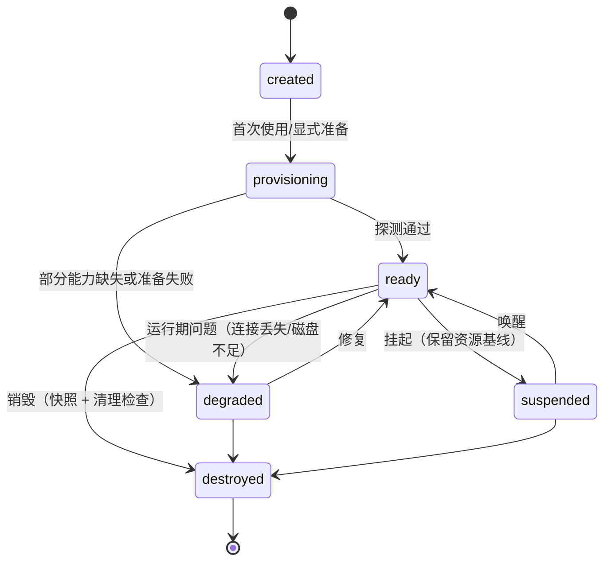
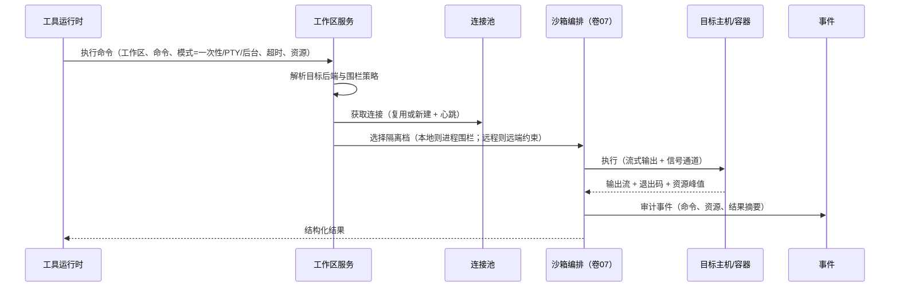

# 卷 20 · 工作区系统（Workspace：本地 / SSH / 容器 / 云）

> 工作区是 Agent 的「作业现场」：本卷用统一抽象抹平**本地目录、SSH 远程主机、容器、云沙箱**四类后端差异，并定义**生命周期、环境探测、文件与命令能力、快照、多工作区、远程连接治理、资源配额与安全**。
>
> 需求来源：REQ-WS-1…12（卷 00 §5.20）；全局约束：H-010（统一 Workspace 抽象）、REQ-INT-6（媒体独立存储）。

---

## 1. 本卷定位

- **解决**：代码在哪里、怎么读写、怎么跑命令、环境是什么、怎么隔离、怎么恢复。
- **不解决**：隔离策略本身（卷 07 提供执行隔离；本卷选路）、Git 语义（卷 21）、沙箱网络策略细节（卷 07）。
- **边界**：工作区提供**文件与进程能力**；工具（卷 05）消费这些能力；一切副作用仍经权限（卷 06）与沙箱（卷 07）。

## 2. 需求与冲突点

| 需求 | 冲突/要点 |
| --- | --- |
| REQ-WS-1 四类后端 | 接口统一 vs 能力差异（如 SSH 无文件监听、容器无持久盘）→ 能力矩阵 + 显式降级 |
| REQ-WS-4 文件操作 | 大文件/二进制/大目录 → 流式与分页，禁止全量载入 |
| REQ-WS-5 命令执行 | 交互式（PTY）与一次性命令语义不同 → 双模式 |
| REQ-WS-9 远程连接 | 稳定性（断线重连）与延迟（每命令一次握手不可接受）→ 持久会话（连接复用） |
| REQ-WS-12 环境一致性 | 本地与 CI 差异 → 环境清单 + 校验 |

## 3. 设计空间（M×N）

### D-WS-1 后端抽象

| 分支 | 描述 | 结论 |
| --- | --- | --- |
| B1 直接操作本地文件系统 | 简单；无法远程 | 淘汰 |
| B2 每类后端各写一套工具 | 重复、行为不一致 | 淘汰 |
| **B3 统一 `WorkspaceProvider` 接口（文件/命令/Git/快照/探测）+ 四类实现（LocalFS / SSH / Container / CloudSandbox）+ 能力矩阵声明** | 一处抽象、按能力降级 | **选定**（F=9 U=8 S=9 M=9 → 88） |

### D-WS-2 生命周期

| 分支 | 描述 | 结论 |
| --- | --- | --- |
| B1 隐式（首次使用时创建） | 简单；资源泄漏 | 淘汰 |
| **B2 显式生命周期：`created`（定义）→ `provisioning`（准备环境）→ `ready` → `degraded`（能力缺失）→ `suspended`（挂起保资源）→ `destroyed`；销毁前做快照与清理检查** | 可控、可回收 | **选定**（F=8 U=8 S=9 M=9 → 85） |

### D-WS-3 环境探测

| 分支 | 描述 | 结论 |
| --- | --- | --- |
| B1 不探测 | Agent 盲目尝试命令 | 淘汰 |
| **B2 结构化探测：语言与版本、包管理器、构建工具、测试框架、Git 状态、容器运行时、网络可达性、磁盘与内存；结果写入「环境档案」并注入上下文（S2 区段）** | 显著减少试错 | **选定**（F=9 U=9 S=8 M=9 → 88） |

### D-WS-4 文件操作

| 分支 | 描述 | 结论 |
| --- | --- | --- |
| B1 全量读写 | 大文件爆内存 | 淘汰 |
| **B2 流式与分页：读（行范围/字节范围/编码探测）、写（原子替换 + 校验和）、目录（分页/忽略规则）、监听（变更事件，能力允许时）、搜索（委托索引卷 11）** | 大仓可用 | **选定**（F=9 U=8 S=8 M=9 → 85.5） |

### D-WS-5 命令执行模型

| 分支 | 描述 | 结论 |
| --- | --- | --- |
| B1 仅一次性命令（执行到结束） | 简单；无法交互 | 基线 |
| **B2 双模式：① 一次性（捕获输出/退出码/超时/资源）② PTY 会话（交互式：REPL、密码提示、长任务；支持写入 stdin、resize、信号）③ 后台任务（长任务返回句柄，可查输出、可终止，纳入任务系统）** | 覆盖真实场景 | **选定**（F=9 U=9 S=8 M=9 → 88） |

### D-WS-6 环境准备

| 分支 | 描述 | 结论 |
| --- | --- | --- |
| B1 无准备（用户自理） | 门槛高、失败多 | 淘汰 |
| **B2 可选环境准备：预置镜像（容器/云）、依赖缓存与预热、环境清单文件（`.oc/env.yaml`）声明依赖与初始化命令；首次准备结果缓存复用** | 提速且可复现 | **选定**（F=9 U=8 S=8 M=9 → 85.5） |

### D-WS-7 快照与恢复

| 分支 | 描述 | 结论 |
| --- | --- | --- |
| B1 无 | 不可恢复 | 淘汰 |
| **B2 工作区快照（与卷 19 D-PERS-6 一致）：内容寻址增量；恢复支持全量/单文件/目录；与 Git 状态解耦（可保存未提交状态）** | 可回滚 | **选定**（F=9 U=8 S=8 M=9 → 85.5） |

### D-WS-8 多工作区

| 分支 | 描述 | 结论 |
| --- | --- | --- |
| B1 单工作区/会话 | 简单；多仓协作不可行 | 基线 |
| **B2 多工作区：会话可绑定多个工作区（主 + 关联），跨工作区引用（读/搜索/指令路由需显式指定目标）；团队可为成员分配不同工作区** | 多仓工程必需 | **选定**（F=8 U=8 S=8 M=9 → 82.5） |

### D-WS-9 远程连接治理

| 分支 | 描述 | 结论 |
| --- | --- | --- |
| B1 每次命令新建连接 | 延迟高、易被限流 | 淘汰 |
| **B2 持久连接池（复用 + 心跳 + 断线重连 + 重认证）+ 连接配置集中管理（主机/跳板/密钥引用/超时）+ 连接健康与降级** | 稳定 | **选定**（F=9 U=8 S=9 M=9 → 88） |

### D-WS-10 资源与配额

| 分支 | 描述 | 结论 |
| --- | --- | --- |
| B1 无监控 | 磁盘打满等事故 | 淘汰 |
| **B2 监控与配额：磁盘使用、CPU/内存（容器/云可强限；SSH 仅观测）、网络流量、inode/文件数；超阈值告警与暂停执行；工作区级配额（企业）** | 防事故 | **选定**（F=8 U=7 S=9 M=8 → 81.5） |

### D-WS-11 安全

| 分支 | 描述 | 结论 |
| --- | --- | --- |
| B1 依赖用户环境 | 不可控 | 淘汰 |
| **B2 四重：路径围栏（卷 07）、命令沙箱（卷 07）、密钥引用注入（卷 07）、连接凭证托管（不落盘、经 SecretPort）+ 审计** | 安全 | **选定**（F=9 U=8 S=9 M=9 → 88） |

### D-WS-12 环境一致性

| 分支 | 描述 | 结论 |
| --- | --- | --- |
| B1 无 | 「在我机器上能跑」 | 淘汰 |
| **B2 环境清单 + 差异检测：清单声明期望版本与工具；探测结果与清单对比 → 差异报告（UI 提示 + 可选一键准备）；CI 与本地使用同一清单** | 减少环境事故 | **选定**（F=8 U=8 S=8 M=9 → 82.5） |

## 4. 选定方案详设

### 4.1 工作区模型

| 实体 | 说明 | 关键字段 |
| --- | --- | --- |
| Workspace | 工作区实例 | workspaceId、类型（local/ssh/container/cloud）、名称、绑定项目、状态、能力矩阵、环境档案引用、配额、所属租户 |
| WorkspaceBinding | 会话/任务与工作区绑定 | 主体 ID（会话/任务/团队）、工作区 ID、角色（主/关联）、写范围 |
| ConnectionProfile | 连接配置（SSH/容器/云） | 主机/镜像/端点、跳板、凭证引用、超时、重试、标签 |
| EnvProfile | 环境档案（探测结果） | 语言/版本、工具链、包管理器、Git 状态、资源、探测时间、差异标记 |
| Snapshot | 快照 | 清单引用、来源工作区、时间、大小、去重率 |

### 4.2 能力矩阵（四类后端）

| 能力 | LocalFS | SSH | Container | CloudSandbox |
| --- | --- | --- | --- | --- |
| 读/写/编辑文件 | ✔ | ✔ | ✔ | ✔ |
| 目录监听（变更事件） | ✔ | ✖（轮询代替） | ✔（可挂载） | 部分 |
| 一次性命令 | ✔ | ✔ | ✔ | ✔ |
| PTY 交互 | ✔ | ✔ | ✔ | 部分 |
| 强隔离（卷 07 档位） | L0/L0+ | L0（远端主机围栏有限 → 强制更严网络策略：默认全禁出站，仅白名单；禁止提权命令） | L1 | L2/L3 |
| 快照 | ✔（内容寻址） | ✔（增量） | ✔（镜像层 + 差异） | ✔（平台快照） |
| 资源强限 | 部分 | 仅观测 | ✔ | ✔ |
| 离线可用 | ✔ | ✖ | 取决于镜像源 | ✖ |

**降级规则**：能力缺失时显式提示并给出替代（如 SSH 目录监听 → 轮询 + 手动刷新）；不允许静默降级。

### 4.3 生命周期与准备

### 4.4 命令执行管线

### 4.5 远程连接治理

| 方面 | 设计 |
| --- | --- |
| 连接复用 | 每目标主机一个连接池（SSH 复用连接与隧道；容器复用运行时句柄） |
| 心跳 | 默认 30s；失败标记连接不健康 |
| 断线重连 | 指数退避（上限 5 次）；重连后恢复 PTY 会话（若支持）或标记会话丢失 |
| 凭证 | SSH 密钥/密码经 SecretPort；支持跳板与代理；OAuth 型云凭证自动刷新 |
| 多路复用 | SSH ControlMaster 风格复用；并发命令上限可配（防打爆目标机） |
| 审计 | 每条命令记录目标主机、用户、命令、资源、退出码（脱敏） |

### 4.6 与其它系统的关系

| 系统 | 关系 |
| --- | --- |
| 工具（卷 05） | 文件/命令工具经工作区能力执行；工具结果外置到媒体/工件存储 |
| 沙箱（卷 07） | 本地工作区使用进程级隔离；容器/云工作区自带更强隔离；策略可要求「必须在 L1+ 执行」 |
| Git（卷 21） | Git 操作在工作区内执行（含 worktree 创建）；SSH/容器工作区同样支持（需 git 可用） |
| 知识库（卷 11） | 索引以工作区文件为源；远程工作区需同步策略（拉取索引源或远端建索引） |
| 持久化（卷 19） | 快照与媒体存储；工作区引用记录在导出包中 |
| 事件（卷 16） | 工作区与命令事件进入主事件流 |
| 权限（卷 06） | 动作描述含工作区与目标路径；跨工作区访问需显式授权 |

## 5. 扩展点（供卷 18 汇总）

| 扩展点 | 说明 |
| --- | --- |
| `WorkspaceProviderSPI` | 新工作区后端（如 K8s Pod、远程开发环境） |
| `FileSyncStrategySPI` | 文件同步策略（镜像/缓存/双向） |
| `EnvironmentProbeSPI` | 环境探测扩展（新语言/工具链） |
| `ProcessSupervisorSPI` | 进程监管（资源限制/信号处理/日志管道） |
| `ConnectionAuthSPI` | 新认证方式（企业跳板/证书体系） |

## 6. 事件与可观测

| 事件 | 说明 |
| --- | --- |
| `workspace.created` / `provisioned` / `ready` / `degraded` / `suspended` / `destroyed` | 生命周期 |
| `workspace.env.probed` / `workspace.env.drift.detected` | 环境档案与差异 |
| `workspace.file.changed` | 文件变更（监听或轮询） |
| `workspace.command.started` / `completed` / `failed` | 命令执行（含模式与资源） |
| `workspace.connection.state.changed` / `reconnected` | 连接健康 |
| `workspace.snapshot.created` / `restored` | 快照 |
| `workspace.quota.exceeded` | 配额告警 |

**指标**：`oc_workspace_active{type}`、`oc_workspace_provision_ms{type}`、`oc_workspace_command_latency_ms{type,mode}`、`oc_workspace_connection_errors_total{type}`、`oc_workspace_disk_used_ratio`、`oc_workspace_snapshot_bytes`、`oc_workspace_reconnect_total`。

## 7. 非功能设计

- **性能**：本地文件操作 ≤ 5ms（小文件）；远程操作受网络限制（默认超时可配）；命令启动延迟：本地 ≤ 50ms，SSH ≤ 300ms（连接复用后），容器 ≤ 800ms。
- **可靠性**：连接池与重连；命令执行可取消（信号）；进程组清理（防僵尸）；崩溃恢复（卷 19）时工作区状态校验。
- **安全**：路径围栏 + 命令沙箱 + 凭证托管 + 审计；远程工作区默认限制网络出站（企业策略）。
- **容量**：单会话工作区数 ≥ 20；单工作区文件数 ≥ 50 万（分页/索引支撑）；快照去重率目标 ≥ 60%。
- **可用性**：后端不可用时标记 `degraded` 并提示；会话可切换工作区或等待恢复。

## 8. 完成定义（DoD）

- [ ] 四类后端至少三类（LocalFS/SSH/Container）端到端可用，CloudSandbox 有至少一家实现。
- [ ] 能力矩阵落地，缺失能力有显式降级路径与提示（无静默降级）。
- [ ] 环境探测覆盖 6 类信息并注入上下文（Agent 不再盲目试命令，由评测验证）。
- [ ] 命令三模式（一次性/PTY/后台）全部可用；后台任务纳入任务系统可查可停。
- [ ] 远程连接池、心跳、断线重连、多路复用、并发上限全部生效（故障注入测试）。
- [ ] 快照创建/恢复/单文件恢复可用，去重率达标。
- [ ] 多工作区绑定与跨工作区访问授权生效（用例）。
- [ ] 资源监控与配额告警可用；磁盘超阈值时暂停执行（用例）。
- [ ] 环境差异检测可用（本地 vs 清单 vs CI 差异报告）。

## 9. 域内决策汇总（D-WS）

| ID | 主题 | 选定 |
| --- | --- | --- |
| D-WS-1 | 后端抽象 | 统一 Provider + 四类实现 + 能力矩阵 |
| D-WS-2 | 生命周期 | 六态显式生命周期 |
| D-WS-3 | 环境探测 | 结构化探测 + 环境档案注入 |
| D-WS-4 | 文件操作 | 流式与分页 + 原子写 + 监听（能力允许） |
| D-WS-5 | 命令执行 | 三模式（一次性/PTY/后台） |
| D-WS-6 | 环境准备 | 预置镜像 + 缓存 + 清单驱动准备 |
| D-WS-7 | 快照 | 内容寻址增量 |
| D-WS-8 | 多工作区 | 主 + 关联，跨区访问需显式授权 |
| D-WS-9 | 远程连接 | 持久连接池 + 心跳 + 重连 + 复用 |
| D-WS-10 | 资源配额 | 监控 + 配额 + 超限暂停 |
| D-WS-11 | 安全 | 围栏 + 沙箱 + 凭证托管 + 审计 |
| D-WS-12 | 环境一致性 | 清单 + 差异检测 + 一键准备 |

## 10. 开放问题与默认决策

| 项 | 默认决策 |
| --- | --- |
| 默认工作区类型 | 本地（local 形态）；server 形态默认容器 |
| SSH 目录监听替代 | 默认轮询（2s，可配），并提示「非实时」 |
| 容器镜像来源 | 内置基础镜像 + 企业私有仓库；镜像签名校验可选强制 |
| 云沙箱默认供应商 | 不绑定；通过 `WorkspaceProviderSPI` 接入（默认提供本地容器实现） |
| 媒体存储位置 | 全局内容寻址存储（不在工作区内），工作区仅存引用（REQ-INT-6） |
