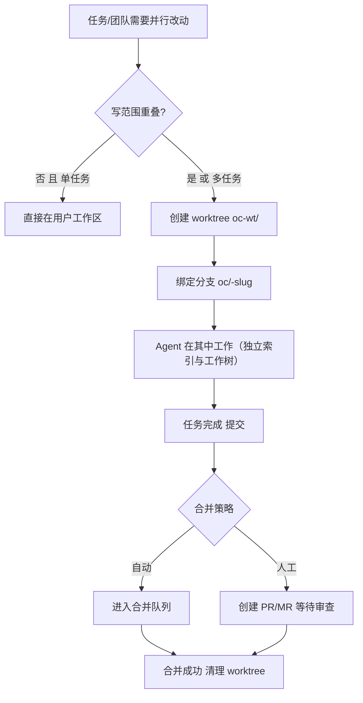
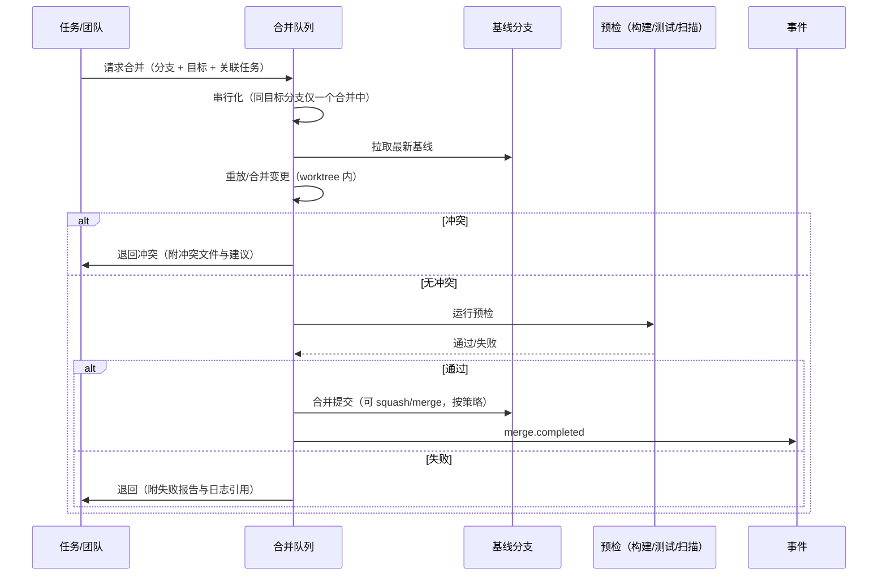

# 卷 21 · Git 系统与 Worktree 隔离（Git & Worktree）

> Git 是 Agent 的「存档点与协作通道」：本卷定义**Git 操作能力、worktree 隔离、提交规范与追溯、分支模型、合并治理、冲突解决、危险操作防护、大仓优化、平台集成与审查流**。
>
> 需求来源：REQ-GIT-1…12（卷 00 §5.21）；竞品参照：REQ-CMP-17（worktree 隔离支撑并行 Agent）。

---

## 1. 本卷定位

- **解决**：Agent 的改动如何落到版本库、如何并行不打架、如何安全回滚、如何与人协作审查。
- **不解决**：文件读写（卷 20）、沙箱（卷 07）、任务模型（卷 14，仅通过字段关联）。
- **边界**：Git 系统是**受治理的版本控制访问层**：所有写操作（提交/推送/分支变更）经权限与审计；禁止绕过。

## 2. 需求与冲突点

| 需求 | 冲突/要点 |
| --- | --- |
| REQ-GIT-2 Worktree 隔离 | 隔离保证并行安全 vs worktree 数量与磁盘成本 → 按需创建 + 复用 + 清理 |
| REQ-GIT-3 提交策略 | 频繁提交利于回滚 vs 提交噪声 → 任务边界提交 + 规范消息 |
| REQ-GIT-6 栈式提交 | 大改动可评审 vs 复杂度 → 可选能力 |
| REQ-GIT-7 安全回滚 | 用户可能误操作 → 护栏 + reflog 快照 |
| REQ-GIT-9 合并治理 | 并行成果合并冲突 → 合并队列 + 预检 + 基线重放 |
| REQ-GIT-11 提交前扫描 | 安全 vs 速度 → 增量扫描 + 缓存 |

## 3. 设计空间（M×N）

### D-GIT-1 Git 实现方式

| 分支 | 描述 | 结论 |
| --- | --- | --- |
| B1 调用系统 `git` CLI | 行为与用户一致、性能好、支持全部特性（worktree/hooks/LFS） | 基线 |
| B2 内嵌 JGit 库 | 无外部依赖、可精细控制 | 基线 |
| B3 混合：默认 CLI；无 git 环境或需细粒度控制时用库实现；两者行为一致性由契约测试保证 | 覆盖广 | **选定**（F=9 U=8 S=8 M=9 → 85.5） |

### D-GIT-2 Worktree 隔离策略

| 分支 | 描述 | 结论 |
| --- | --- | --- |
| B1 不使用 worktree（直接在用户工作区改） | 简单；并行必冲突 | 淘汰 |
| B2 每任务一个 worktree | 隔离清晰；数量多 | 基线 |
| **B3 按需分层：默认在用户工作区工作（单任务）；多任务/团队并行时按任务或按成员创建 worktree；只读型任务共享（只读不需要隔离）；用后清理（可保留 N 天或保留到合并）** | 平衡隔离与成本 | **选定**（F=9 U=8 S=9 M=9 → 88） |

### D-GIT-3 提交策略

| 分支 | 描述 | 结论 |
| --- | --- | --- |
| B1 不自动提交（留给用户） | 安全；无法回滚中间状态 | 基线 |
| B2 每步自动提交 | 回滚粒度细；噪声大 | 基线 |
| **B3 任务边界提交（默认）：任务/步骤完成时提交，消息规范（Conventional Commits 风格 + 追溯尾注）；高风险改动（删除大量文件、修改配置/CI）提交前需确认；用户可配置为「仅暂存」模式** | 可回滚且干净 | **选定**（F=9 U=9 S=8 M=9 → 88） |

### D-GIT-4 分支模型

| 分支 | 描述 | 结论 |
| --- | --- | --- |
| B1 直接在主分支工作 | 简单；破坏保护分支规则 | 淘汰 |
| B2 每任务一分支（`oc/<task-id>-<slug>`） | 清晰；PR 友好 | **选定（默认）** |
| B3 栈式分支（stacked diffs） | 大改动友好；复杂 | 可选（企业/大改动场景） |

**规则**：主分支保护（禁止直接推送）；分支命名规范；分支与任务/会话关联；完成后可创建 PR/MR。

### D-GIT-5 合并治理

| 分支 | 描述 | 结论 |
| --- | --- | --- |
| B1 各自合并 | 冲突与破坏风险 | 淘汰 |
| **B2 合并队列（单机串行/分布式租约）：入队 → 拉取最新基线 → 重放变更 → 运行预检（构建/测试/扫描）→ 通过则合并 → 失败则退回并附报告** | 保证目标分支始终健康 | **选定**（F=9 U=8 S=9 M=9 → 88） |

### D-GIT-6 冲突解决

| 分支 | 描述 | 结论 |
| --- | --- | --- |
| B1 盲目取一方 | 丢改动 | 淘汰 |
| **B2 三方合并 + 语义分析 + AI 辅助建议 + 人工确认（高风险/语义冲突必须人工）；冲突解决过程与结论入库（可审计）** | 安全且高效 | **选定**（F=9 U=8 S=8 M=9 → 85.5） |

### D-GIT-7 危险操作防护

| 分支 | 描述 | 结论 |
| --- | --- | --- |
| B1 无护栏 | 数据丢失风险 | 淘汰 |
| **B2 护栏清单 + 自动快照：① 危险操作（`reset --hard`、`push --force`、`clean -fd`、`rebase` 已推送历史、删除分支）需权限确认 ② 操作前自动创建 reflog 快照/临时引用 ③ 提供一键恢复（`oc git undo`）④ 保护分支与远端分支额外校验** | 可恢复 | **选定**（F=9 U=9 S=9 M=9 → 90） |

### D-GIT-8 大仓性能

| 分支 | 描述 | 结论 |
| --- | --- | --- |
| B1 全量克隆 | 慢、占盘 | 基线 |
| **B2 优化：部分克隆（blobless/treeless）+ 稀疏检出（按工作区需要）+ 索引加速（`git status --porcelain=v2`、fsmonitor 可选）+ 并行 fetch + 提交图（commit-graph）+ 大文件走 LFS；大规模仓库首次准备后台化并显示进度** | 大仓可用 | **选定**（F=9 U=8 S=8 M=9 → 85.5） |

### D-GIT-9 平台集成

| 分支 | 描述 | 结论 |
| --- | --- | --- |
| B1 仅本地 Git | 无法审查协作 | 淘汰 |
| **B2 多平台适配器：GitHub / GitLab / Gitea / 内网自建（含 Gerrit 可选）；能力：创建 PR/MR、评论、审查状态、CI 状态查询、Webhook 事件接收；凭据经 SecretPort；企业可禁用某平台** | 覆盖企业实际 | **选定**（F=9 U=8 S=8 M=9 → 85.5） |

### D-GIT-10 提交前安全检查

| 分支 | 描述 | 结论 |
| --- | --- | --- |
| B1 无 | 泄漏风险 | 淘汰 |
| **B2 增量扫描：密钥模式（高熵串、私钥头、云凭证）、大文件（> 阈值）、敏感路径（`.env`/证书/生产配置）、依赖清单变更告警；命中即阻断并给出修复建议；扫描结果缓存（按 blob 哈希）** | 安全 | **选定**（F=9 U=8 S=8 M=9 → 85.5） |

### D-GIT-11 提交追溯

| 分支 | 描述 | 结论 |
| --- | --- | --- |
| B1 无 | 无法归因 | 淘汰 |
| **B2 追溯尾注：提交消息附带结构化尾注（会话 ID、任务 ID、团队 ID、模型、Agent 角色、审批引用）；可配置（企业可要求强制）；署名遵循用户 Git 配置，可选「Co-authored-by Agent」** | AI 产出的可审计性 | **选定**（F=9 U=7 S=8 M=9 → 84） |

### D-GIT-12 审查流

| 分支 | 描述 | 结论 |
| --- | --- | --- |
| B1 无审查 | 质量风险 | 淘汰 |
| **B2 三层审查：① Agent 自审（对照验收标准与 diff）② 团队审查（审查者角色，卷 13）③ 人类审查（PR/MR + 评论闭环）；审查意见可回流为任务（修订项）** | 质量与协作 | **选定**（F=9 U=8 S=8 M=9 → 85.5） |

## 4. 选定方案详设

### 4.1 Worktree 编排



| 方面 | 设计 |
| --- | --- |
| 位置 | `${OPENCODING_HOME}/worktrees/<repo>/<task-id>`（与用户工作区分离，避免误删） |
| 生命周期 | 创建（含基线选择）→ 使用 → 合并/放弃 → 清理（默认合并后 24h 清理，可配保留期） |
| 磁盘治理 | 统计与配额；超限提示并提供批量清理；引用未合并分支的 worktree 不自动删 |
| 用户可见性 | UI 展示全部 worktree（任务、分支、状态、大小）；可一键打开/清理 |

### 4.2 提交消息规范

```text
<type>(<scope>): <简短描述>

<正文：为什么这么改，影响面，如何验证>

Refs: task=T-7f3a session=S-1b2c team=TM-9d
Agent: role=implementer model=claude-sonnet-4.5
Approval: ar-4f21 (若涉及高风险动作)
```

| type | 用途 |
| --- | --- |
| `feat` / `fix` / `refactor` / `perf` / `test` / `docs` / `chore` / `build` / `ci` | 与团队习惯对齐（可配置映射） |

### 4.3 合并队列



**策略可配**：`squash`（默认，保持历史干净）/ `merge-commit` / `rebase-then-merge`（企业可选）；预检命令来自项目配置（`.oc/ci.yaml`）。

### 4.4 危险操作护栏清单

| 操作 | 护栏 |
| --- | --- |
| `reset --hard` | 需确认（含丢失提交清单）；自动临时引用 `oc/backup/<ts>` |
| `push --force`（含 `--force-with-lease`） | 需确认；默认仅允许非保护分支；企业可禁用 |
| `clean -fd` | 需确认（列出将删除文件，含未跟踪） |
| `rebase` 已推送历史 | 需确认 + 警告协作者影响 |
| 删除分支/tag | 需确认（含未合并提示） |
| 丢弃未提交改动 | 需确认（可选自动快照） |
| 修改已推送提交（amend） | 需确认 |

**一键恢复**：`oc git undo` 基于操作日志与临时引用恢复；操作日志保留（默认 30 天）。

### 4.5 平台集成能力

| 能力 | GitHub | GitLab | Gitea | 内网自建 |
| --- | --- | --- | --- | --- |
| 创建 PR/MR | ✔ | ✔ | ✔ | 视实现 |
| 评论与审查 | ✔ | ✔ | ✔ | 视实现 |
| CI 状态 | ✔ | ✔ | ✔ | 视实现 |
| Webhook 事件（PR 更新/评论） | ✔ | ✔ | ✔ | 视实现 |
| 凭据 | Token/App | Token/OAuth | Token | 自定义 |

### 4.6 与其它系统的关系

| 系统 | 关系 |
| --- | --- |
| 任务（卷 14） | 分支与提交关联任务；任务完成依赖提交与验收 |
| Teams（卷 13） | 成员隔离靠 worktree；合并走合并队列 |
| 沙箱（卷 07） | Git 命令在沙箱内执行；推送凭证经密钥代理 |
| 权限（卷 06） | 推送/强制操作属 R3/R4；企业可禁用特定操作 |
| 事件（卷 16） | Git 事件进入主事件流（分支/提交/合并/冲突） |
| 知识库（卷 11） | 提交触发索引增量更新 |

## 5. 扩展点（供卷 18 汇总）

| 扩展点 | 说明 |
| --- | --- |
| `GitHostProviderSPI` | 新代码托管平台适配 |
| `MergeStrategySPI` | 自定义合并策略 |
| `ConflictResolverSPI` | 自定义冲突解决（语义合并） |
| `CommitPolicySPI` | 提交消息规范与校验（企业） |
| `PreCommitScannerSPI` | 提交前扫描规则扩展 |
| `WorktreePlacementSPI` | worktree 存放位置策略 |

## 6. 事件与可观测

| 事件 | 说明 |
| --- | --- |
| `git.repo.opened` / `git.fetch.completed` | 仓库准备与同步 |
| `git.branch.created` / `deleted` | 分支 |
| `git.commit.created` | 提交（含哈希、文件数、追溯尾注） |
| `git.push.completed` / `git.force_push.blocked` | 推送与阻断 |
| `git.merge.queued` / `started` / `completed` / `conflict` / `rejected` | 合并队列 |
| `git.worktree.created` / `cleaned` | worktree |
| `git.dangerous_operation.confirmed` / `git.undo.performed` | 危险操作与撤销 |
| `git.secret_scan.blocked` | 提交前扫描阻断 |

**指标**：`oc_git_commit_total`、`oc_git_merge_queue_depth`、`oc_git_merge_duration_ms`、`oc_git_conflict_total`、`oc_git_worktree_active`、`oc_git_worktree_disk_bytes`、`oc_git_scan_blocked_total`、`oc_git_undo_total`。

## 7. 非功能设计

- **性能**：`status`/`diff` 大仓 ≤ 500ms（索引优化后）；worktree 创建 ≤ 2s（部分克隆下可更慢，异步化）；合并队列吞吐 ≥ 10 次/分钟。
- **可靠性**：合并队列持久化（重启恢复）；进行中的合并有租约与超时；所有写操作幂等（可重试）。
- **安全**：推送凭证经 SecretPort 与密钥代理；提交前扫描；保护分支校验；危险操作护栏与快照。
- **容量**：单仓 worktree ≤ 20（可配）；总磁盘配额；超限拒绝新 worktree 并提示清理。
- **可移植**：Git 操作在四类工作区（卷 20）均可用（能力矩阵声明）。

## 8. 完成定义（DoD）

- [ ] Git 基础能力（状态/差异/提交/分支/标签/储藏/日志）全端可用且行为一致（契约测试）。
- [ ] worktree 按需创建与清理生效；并行任务互不干扰（用例：两任务改同一文件不冲突）。
- [ ] 任务边界提交 + 消息规范 + 追溯尾注落地；高风险改动需确认。
- [ ] 合并队列串行化 + 预检 + 冲突退回全通（故障注入测试）。
- [ ] 危险操作 7 类护栏全部生效；`oc git undo` 可恢复（用例）。
- [ ] 大仓优化：部分克隆 + 稀疏检出 + commit-graph 生效，100k 文件仓库 status ≤ 500ms。
- [ ] 平台集成 ≥ 2 家（GitHub + GitLab 或内网）PR/评论/CI 状态可用。
- [ ] 提交前扫描：密钥/大文件/敏感路径三类用例可阻断。
- [ ] 审查流三层可用，审查意见可回流为任务修订项。

## 9. 域内决策汇总（D-GIT）

| ID | 主题 | 选定 |
| --- | --- | --- |
| D-GIT-1 | 实现方式 | CLI 为主 + 库兜底 + 契约测试保证一致 |
| D-GIT-2 | Worktree 隔离 | 按需分层（单任务原地，多任务/团队隔离，只读共享） |
| D-GIT-3 | 提交策略 | 任务边界提交 + 规范消息 + 高风险确认 |
| D-GIT-4 | 分支模型 | 每任务一分支（主分支保护），栈式可选 |
| D-GIT-5 | 合并治理 | 合并队列（串行 + 预检 + 退回报告） |
| D-GIT-6 | 冲突解决 | 三方合并 + AI 辅助 + 高风险人工确认 |
| D-GIT-7 | 危险防护 | 护栏清单 + 自动快照 + 一键撤销 |
| D-GIT-8 | 大仓优化 | 部分克隆 + 稀疏检出 + 索引加速 + LFS |
| D-GIT-9 | 平台集成 | 多平台适配器（GitHub/GitLab/Gitea/内网） |
| D-GIT-10 | 提交扫描 | 增量扫描（密钥/大文件/敏感路径）+ 阻断 |
| D-GIT-11 | 追溯 | 结构化提交尾注（会话/任务/团队/模型/审批） |
| D-GIT-12 | 审查流 | 三层审查（自审/团队/人类） |

## 10. 开放问题与默认决策

| 项 | 默认决策 |
| --- | --- |
| 默认合并方式 | squash（保持目标分支线性历史） |
| worktree 清理默认保留期 | 合并后 24h；未合并保留至放弃或 14 天 |
| 是否允许 Agent 直接推送主分支 | 禁止（除非策略显式允许且分支非保护） |
| 大文件策略 | 默认提示并可配置为 LFS；> 100MB 阻断提交 |
| 提交署名 | 使用用户 Git 配置；可选追加 `Co-authored-by: OpenCoding Agent` |
