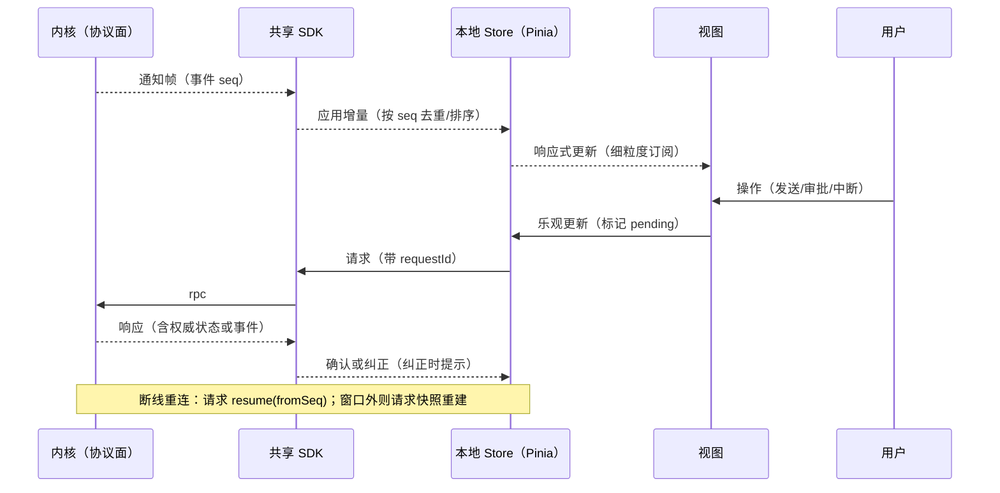

# 卷 22 · 端形态：CLI/TUI 与桌面端（Electron + Vue）

> 端是用户唯一能感知的部分：本卷定义**双端能力对齐、CLI 命令面与 TUI 布局、桌面端信息架构与交互规范、协议复用与前端状态模型、通知、快捷键、可访问性、国际化、IDE 集成**。
>
> 需求来源：REQ-UI-1…12（卷 00 §5.22）；全局约束：H-015（Electron + Vue 双端）、D-ARC-10（增量事件 + 快照对齐）、产品铁律 6（双端等价）。

---

## 1. 本卷定位

- **解决**：终端与桌面各自如何呈现 Agent 的思考、动作、审批、计划、团队与成本；两端如何同步同一会话。
- **不解决**：协议语义（卷 01 §4.5）、事件定义（卷 16）、权限决策（卷 06）。
- **边界**：端只做「呈现与输入」，不含业务规则；所有能力经协议面调用内核。

## 2. 需求与冲突点

| 需求 | 冲突/要点 |
| --- | --- |
| REQ-UI-1/3 双端等价 | 桌面端有多面板优势，CLI 有脚本化优势 → 能力对齐表 + 终端降级呈现 |
| REQ-UI-2 TUI 体验 | 流式输出 + 多面板 vs 终端兼容性（Windows/macOS/Linux、有/无序言）→ 能力探测 + 渐进增强 |
| REQ-UI-4 通知 | 打扰 vs 知情 → 分级 + 静默时段 |
| REQ-UI-6 多会话 | 资源占用 vs 并行工作 → 会话切换 + 轻量会话列表 |
| REQ-UI-7 可访问性 | 视觉丰富 vs 可访问 → 键盘全可达 + 对比度 + 动效可关 |

## 3. 设计空间（M×N）

### D-UI-1 CLI 技术形态

| 分支 | 描述 | 结论 |
| --- | --- | --- |
| B1 纯参数解析 + 打印 | 简单；无交互体验 | 基线 |
| **B2 Picocli（命令面）+ JLine3（TUI 与行编辑）+ 内嵌内核或 sidecar 连接** | 命令清晰 + 终端体验好 + 冷启动可控 | **选定**（F=9 U=9 S=8 M=9 → 88） |
| B3 自研终端框架 | 可控；成本高 | 淘汰 |

### D-UI-2 TUI 布局

| 分支 | 描述 | 结论 |
| --- | --- | --- |
| B1 单面板流式（类似对话） | 简单；信息密度低 | 基线 |
| **B2 混合：主对话区 + 可折叠侧栏（计划/任务/工具调用/文件变更）+ 底部输入与状态栏 + 快捷键切换全屏视图（diff/团队/成本）** | 桌面级信息密度且终端可用 | **选定**（F=9 U=9 S=7 M=8 → 83.5） |
| B3 固定多面板（始终三栏） | 信息全；小终端不可用 | 淘汰 |

**终端能力探测**：色彩深度（truecolor/256/16）、Unicode 宽度、真链接（OSC 8）、鼠标支持；不支持则降级（纯文本输出 + 分页）。

### D-UI-3 桌面端技术栈

| 分支 | 描述 | 结论 |
| --- | --- | --- |
| B1 Electron + 原生 HTML/CSS | 轻；无组件生态 | 淘汰 |
| **B2 Electron + Vue 3 + TypeScript + Pinia（状态）+ 组件库（Naive UI 或 Element Plus）+ Vite 构建** | 组件生态成熟、类型安全、构建快 | **选定**（F=9 U=9 S=8 M=9 → 88） |
| B3 Tauri（系统 WebView） | 包体小；跨平台渲染差异与 Rust 依赖 | 备选（H-015 回退触发条件满足时评估） |

### D-UI-4 桌面端信息架构

| 分支 | 描述 | 结论 |
| --- | --- | --- |
| B1 单窗口单会话 | 简单；并行不便 | 基线 |
| **B2 工作台模型：左侧导航（会话/任务/团队/知识/插件/设置）+ 主工作区（可多标签）+ 右侧上下文面板（成本/上下文/权限/证据）+ 底部状态栏** | 覆盖复杂工作流 | **选定**（F=9 U=9 S=8 M=9 → 88） |

### D-UI-5 协议复用

| 分支 | 描述 | 结论 |
| --- | --- | --- |
| B1 各端各自实现协议 | 重复、易漂移 | 淘汰 |
| **B2 共享 TypeScript SDK（由契约自动生成类型与客户端）：CLI 若用 JVM 则用 Java SDK，桌面端用 TS SDK；两端共享同一份协议定义与错误码** | 一致且高效 | **选定**（F=9 U=8 S=9 M=9 → 88） |

### D-UI-6 通知与状态

| 分支 | 描述 | 结论 |
| --- | --- | --- |
| B1 仅应用内 | 长时间任务无人知 | 淘汰 |
| **B2 分级通知：系统通知（需人工介入/完成/失败）+ 托盘状态（进度/待审批计数）+ 声音（可关）+ 外部通道（卷 15 邮件/IM/Webhook）** | 及时知情且不打扰 | **选定**（F=8 U=9 S=8 M=8 → 82.5） |

### D-UI-7 命令与快捷键

| 分支 | 描述 | 结论 |
| --- | --- | --- |
| B1 固定快捷键 | 简单；不可定制 | 基线 |
| **B2 命令面板（Cmd/Ctrl+K）+ 可定制键位 + 命令与 CLI 命令同名（双端心智一致）+ 命令可绑定技能与插件（卷 08/18）** | 高效且可扩展 | **选定**（F=8 U=9 S=8 M=9 → 84） |

### D-UI-8 多会话与多窗口

| 分支 | 描述 | 结论 |
| --- | --- | --- |
| B1 单窗口单会话 | 简单 | 基线 |
| **B2 多标签（同窗口多会话） + 可选多窗口（跨屏工作）+ 会话列表（暂停/归档/搜索）+ 从 CLI 接管同一会话** | 并行工作流 | **选定**（F=8 U=9 S=8 M=8 → 82.5） |

### D-UI-9 主题与可访问性

| 分支 | 描述 | 结论 |
| --- | --- | --- |
| B1 固定深色主题 | 简单；不满足可访问性 | 淘汰 |
| **B2 主题（深/浅/跟随系统 + 高对比度）+ 键盘全可达（无鼠标完成所有操作）+ 焦点可见 + 屏幕阅读器语义（ARIA）+ 动效可关 + 字号缩放** | 企业合规 | **选定**（F=8 U=9 S=8 M=9 → 84） |

### D-UI-10 国际化

| 分支 | 描述 | 结论 |
| --- | --- | --- |
| B1 仅中文 | 受限 | 淘汰 |
| **B2 中英双语（可扩展）+ 术语表统一（附录 C）+ 日期/数字/时区本地化 + 代码与命令标识符不翻译** | 覆盖目标市场 | **选定**（F=8 U=8 S=8 M=8 → 80） |

### D-UI-11 IDE 集成

| 分支 | 描述 | 结论 |
| --- | --- | --- |
| B1 不做 | 生态缺失 | 淘汰 |
| **B2 插件形态（VS Code / JetBrains）：连接内核协议面，提供会话面板、内联 diff 应用、审批、上下文引用；不重写 Agent 逻辑** | 复用内核与桌面端能力 | **选定**（F=8 U=9 S=8 M=8 → 82.5） |

### D-UI-12 只读跟随端

| 分支 | 描述 | 结论 |
| --- | --- | --- |
| B1 不做 | 无法移动查看 | 基线 |
| **B2 只读跟随：Web/移动浏览器通过 SSE 查看会话进度与审批（可批准/拒绝，不可改代码）** | 便利且安全 | **选定**（F=7 U=8 S=8 M=7 → 75） |

### D-UI-13 输入增强

| 分支 | 描述 | 结论 |
| --- | --- | --- |
| B1 仅文本 | 多模态定位无法体现 | 淘汰 |
| **B2 多模态输入：图片粘贴/拖拽、文件拖拽、屏幕区域截图（桌面端）、语音转写（可选）、@ 引用（文件/技能/会话/知识）** | 与产品定位一致 | **选定**（F=8 U=9 S=7 M=8 → 79.5） |

### D-UI-14 前端状态模型

| 分支 | 描述 | 结论 |
| --- | --- | --- |
| B1 全量拉取 | 简单；实时性差 | 淘汰 |
| B2 仅事件流 | 实时；断线漂移 | 基线 |
| **B3 事件流 + 快照对齐（D-ARC-10）：本地 store 按 `lastEventSeq` 应用增量；断线重连请求补发/快照；UI 乐观更新仅限输入类操作（发送消息/点击审批），服务端确认为准；冲突以服务端为准并提示** | 稳定一致 | **选定**（F=9 U=8 S=9 M=9 → 88） |

## 4. 选定方案详设

### 4.1 双端能力对齐表

| 能力 | CLI/TUI | 桌面端 | 对齐方式 |
| --- | --- | --- | --- |
| 会话（创建/切换/发送/中断/插话） | `oc chat`、快捷键 | 会话面板 | 同协议、同语义 |
| 审批 | 内联提示（y/n/a/d + 理由） | 审批卡片（含 diff） | 桌面更丰富，CLI 完整可用 |
| Diff 预览 | 分页文本 diff（可着色） | 并排/内联 diff | 同数据源 |
| 计划与任务 | `oc task` 树/列表；会话内计划卡 | 看板/时间线/依赖图 | 桌面额外视图 |
| 团队 | `oc team`（状态/消息/成员） | 拓扑/时间线/成本瀑布 | 桌面可视化 |
| 成本与上下文 | `oc cost`、`oc context show` | 右侧面板 | 同指标 |
| 知识库 | `oc kb search/status` | 检索面板 + 引用跳转 | 引用模型一致 |
| 记忆 | `oc memory list/edit` | 记忆面板 | 同模型 |
| 技能/插件管理 | `oc skill`、`oc plugin` | 市场/管理页 | 同清单 |
| 工作区/远程 | `oc ws connect/ls/exec` | 工作区管理页 | 同生命周期 |
| Git | `oc git`（含 undo） | 变更/提交/PR 面板 | 同护栏 |
| Goal/Schedule | `oc goal`、`oc schedule` | 目标卡 + 日历 | 同预览与策略 |
| 只读跟随 | 无（终端已够） | Web/移动链接 | — |

### 4.2 桌面端信息架构

```mermaid
graph LR
  subgraph Nav["左侧导航"]
    N1["会话"]
    N2["任务与计划"]
    N3["团队"]
    N4["知识库"]
    N5["技能与插件"]
    N6["工作区"]
    N7["设置与诊断"]
  end
  subgraph Main["主工作区 可多标签"]
    M1["会话视图 流式/工具/审批/计划卡"]
    M2["Diff 与文件变更"]
    M3["任务看板与时间线"]
    M4["团队拓扑与成本瀑布"]
    M5["知识检索与引用"]
  end
  subgraph Right["右侧上下文面板"]
    R1["上下文占用分解"]
    R2["成本与用量"]
    R3["权限与授权记忆"]
    R4["证据与验收"]
  end
  subgraph Bottom["状态栏"]
    B1["连接状态 内核/工作区"]
    B2["待审批计数"]
    B3["当前模型与模式"]
    B4["后台任务进度"]
  end
  Nav --> Main --> Right --> Bottom
```



### 4.3 关键界面规范

| 界面 | 规范要点 |
| --- | --- |
| 会话流 | 三类条目视觉分层（用户/助手/系统）；工具调用折叠为可展开卡片（摘要 + 耗时 + 结果引用）；推理（thinking）默认折叠；错误红标 + 修复建议按钮 |
| 审批卡片 | 顶部风险徽标（R0–R5）+ 动作摘要 + diff/命令预览（可全屏）+ 授权范围选择（本次/会话/项目/模式）+ 超时倒计时 + 拒绝并填理由 |
| Diff 视图 | 并排/内联切换；按变更块接受/拒绝；与工作区实时同步（外部修改提示）；大文件分页加载 |
| 计划/任务 | 看板（列=状态，拖拽需权限）+ 每卡显示验收进度环（证据驱动）+ 阻塞原因内联 |
| 团队视图 | 拓扑图（成员/状态/当前任务）+ 时间线泳道 + 成本瀑布（可下钻到调用）+ 消息流（按类型过滤） |
| 上下文面板 | 九区段占用条（悬停显示来源）+ 压缩历史时间线 + 缓存命中标注 + 「为什么这么贵」解释入口 |
| 知识引用 | 引用 chip（来源类型图标）+ 点击打开原文（编辑器内或外部）+ 失效引用标红并提示 |
| 设置 | 分组（模型/权限/工作区/通知/外观/高级）+ 每项含影响说明与默认值；危险设置二次确认 |
| 诊断 | 装配计划、能力门控、插件健康、连接状态、最近错误（一键导出脱敏诊断包） |

### 4.4 CLI 命令面（节选）

```text
oc                       # 进入交互式 TUI（默认会话）
oc chat [--workspace W] [--mode M] [--model X] [--continue|--resume ID]
oc run "<指令>" [-—yes]          # 一次性执行（headless 友好的非交互模式）
oc session ls|show|fork|export|import|rm
oc task ls|show|create|update|run|board
oc plan show|edit|approve
oc goal create|status|pause|resume|report
oc schedule ls|add|enable|disable|run-now|logs
oc team ls|show|message|abort
oc skill ls|install|remove|update|test
oc plugin ls|install|enable|disable|update|dev
oc mcp ls|add|remove|health|auth
oc kb add|sync|search|status|wiki
oc memory ls|edit|rm|export|import
oc ws ls|add|connect|exec|snapshot|clean
oc git status|diff|commit|branch|pr|merge|undo|worktree
oc permit ls|explain|revoke|policy
oc cost [--by session|task|team|model|day]
oc context show|compact
oc hooks ls|test|disable
oc doctor [--export]             # 诊断
oc config get|set|list
```

**脚本友好**：所有命令支持 `--json` 输出、非零退出码语义、`--quiet`；管道输入（如 `git diff | oc review`）。

### 4.5 快捷键（桌面端，节选）

| 快捷键 | 功能 |
| --- | --- |
| `Cmd/Ctrl+K` | 命令面板 |
| `Cmd/Ctrl+N` / `Cmd/Ctrl+Shift+N` | 新会话 / 新窗口 |
| `Cmd/Ctrl+Enter` | 发送 / 提交审批 |
| `Esc` | 中断当前执行（安全点） |
| `Cmd/Ctrl+.` | 停止并暂停 |
| `Cmd/Ctrl+Shift+D` | 打开 Diff 视图 |
| `Cmd/Ctrl+Shift+T` | 打开任务看板 |
| `Cmd/Ctrl+Shift+P` | 打开计划视图 |
| `Cmd/Ctrl+Shift+C` | 成本与上下文面板 |
| `Alt+↑/↓` | 切换会话标签 |
| `Cmd/Ctrl+Shift+A` | 待审批列表 |

### 4.6 前端状态模型与更新管线



**双通道约束（引用卷 16 §4.3）**：桌面端只渲染实时通道（token/推理/进度），持久通道（语义事件）用于状态与历史；**流式增量不入库**，重连后凭语义事件重建最终呈现，不重放逐字动画。

### 4.7 可访问性与国际化清单

| 项 | 要求 |
| --- | --- |
| 键盘 | 全功能可达；焦点可见（≥ 3:1 对比）；无键盘陷阱 |
| 读屏 | 语义化标签、动态区域（live region）通报流式状态、按钮有可读名称 |
| 对比度 | 正文 ≥ 4.5:1；大字与图标 ≥ 3:1 |
| 动效 | 全局「减少动效」开关；流式渲染不依赖动画 |
| 字号 | 支持缩放（含终端字号建议与桌面端 UI 缩放） |
| 语言 | 中英；术语表统一；命令与代码标识符保留原文 |
| 时区 | 全部时间按本地时区展示，可切换 UTC |

## 5. 扩展点（供卷 18 汇总）

| 扩展点 | 说明 |
| --- | --- |
| `UiPanelSPI` | 插件注册新面板（桌面端） |
| `UiCommandSPI` | 插件注册命令（命令面板 + CLI 同名命令） |
| `UiRendererSPI` | 会话内联卡片自定义渲染（如专属工具结果） |
| `ThemeProviderSPI` | 主题与配色提供者 |
| `NotificationChannelSPI` | 通知通道（与卷 15 共用） |
| `CliCompletionSPI` | CLI 补全扩展（插件提供子命令补全） |

## 6. 事件与可观测（前端）

| 事件 | 说明 |
| --- | --- |
| `ui.view.opened` / `ui.command.invoked` | 使用分析（匿名，可关闭） |
| `ui.approval.responded` | 审批响应（含耗时，用于体验优化） |
| `ui.error.surfaced` | 前端错误上报（脱敏） |
| `ui.follow.readonly.joined` | 只读跟随端接入 |

**指标**：`oc_ui_frame_drop_ratio`、`oc_ui_render_latency_ms`、`oc_ui_reconnect_total`、`oc_ui_command_latency_ms`、`oc_ui_stream_stall_total`。

## 7. 非功能设计

- **性能**：桌面端空闲内存 ≤ 350MB（NFR-P-7）；流式滚动 ≥ 55fps（2000 行）；CLI 冷启动 ≤ 300ms（NFR-P-6）；事件到界面 ≤ 200ms。
- **可靠性**：断线自动重连（指数退避）；重连后事件补发与快照对齐；本地草稿保护（崩溃后恢复未发送输入）。
- **可维护**：共享 SDK 由契约生成（协议变更自动反映）；UI 与协议解耦；组件库统一。
- **安全**：令牌存储于系统密钥链；渲染沙箱（插件面板 iframe/受控组件）；外链默认确认。
- **打包**：桌面端安装包（Windows/macOS/Linux）；CLI 跨平台包（含 JRE 或要求本地 JRE，见卷 24）。

## 8. 完成定义（DoD）

- [ ] 双端能力对齐表逐项可用（抽测 12 项核心能力两端行为一致）。
- [ ] CLI：TUI 主界面（流式 + 侧栏 + 输入 + 状态栏）在三大平台终端可用；降级模式可用。
- [ ] 桌面端：工作台信息架构落地（导航/多标签/右侧面板/状态栏）；关键界面规范 9 项实现。
- [ ] 审批卡片含 diff/命令预览、风险徽标、授权范围与倒计时。
- [ ] 断线重连与快照对齐：模拟断网 30s 后状态一致（用例）。
- [ ] 通知分级与静默时段生效；托盘状态正确。
- [ ] 快捷键与命令面板可用；CLI 命令 `--json` 输出可被脚本消费。
- [ ] 可访问性清单全项通过（键盘全可达 + 对比度 + 读屏 + 减少动效）。
- [ ] 国际化中英切换无硬编码文案（扫描校验）。
- [ ] IDE 插件（至少 VS Code）可连接内核并应用内联 diff。

## 9. 域内决策汇总（D-UI）

| ID | 主题 | 选定 |
| --- | --- | --- |
| D-UI-1 | CLI 形态 | Picocli + JLine3（内嵌/sidecar 双模） |
| D-UI-2 | TUI 布局 | 混合（主对话 + 可折叠侧栏 + 状态栏 + 全屏视图切换） |
| D-UI-3 | 桌面栈 | Electron + Vue 3 + TS + Pinia + 组件库 |
| D-UI-4 | 信息架构 | 工作台（导航 + 多标签 + 右侧面板 + 状态栏） |
| D-UI-5 | 协议复用 | 契约生成共享 SDK（TS/Java） |
| D-UI-6 | 通知 | 分级通知 + 托盘 + 外通道 |
| D-UI-7 | 命令快捷键 | 命令面板 + 可定制 + 双端同名 |
| D-UI-8 | 多会话 | 多标签 + 多窗口 + 列表管理 + 跨端接管 |
| D-UI-9 | 主题可访问 | 深浅/高对比 + 键盘可达 + 读屏 + 动效可关 |
| D-UI-10 | 国际化 | 中英 + 术语表 + 本地化格式 |
| D-UI-11 | IDE 集成 | VS Code/JetBrains 插件连接协议面 |
| D-UI-12 | 只读跟随 | Web/移动只读 + 审批能力 |
| D-UI-13 | 输入增强 | 图片/文件/截图/语音/@ 引用 |
| D-UI-14 | 状态模型 | 事件流 + 快照对齐 + 服务端权威 |

## 10. 开放问题与默认决策

| 项 | 默认决策 |
| --- | --- |
| 组件库选择 | Naive UI（默认，Vue 3 原生、主题能力强）；Element Plus 为备选（团队熟悉度优先） |
| 桌面端自动更新 | 默认开启（可关闭；企业可由私服分发） |
| CLI 是否内嵌 JRE | 默认要求本地 JRE ≥ 21；提供含 JRE 的发行包（体积换便利） |
| 遥测 | 默认关闭；开启需用户显式同意（企业可强制开启于内部实例） |
| 移动端 | 仅只读跟随（Web），不做原生 App |
