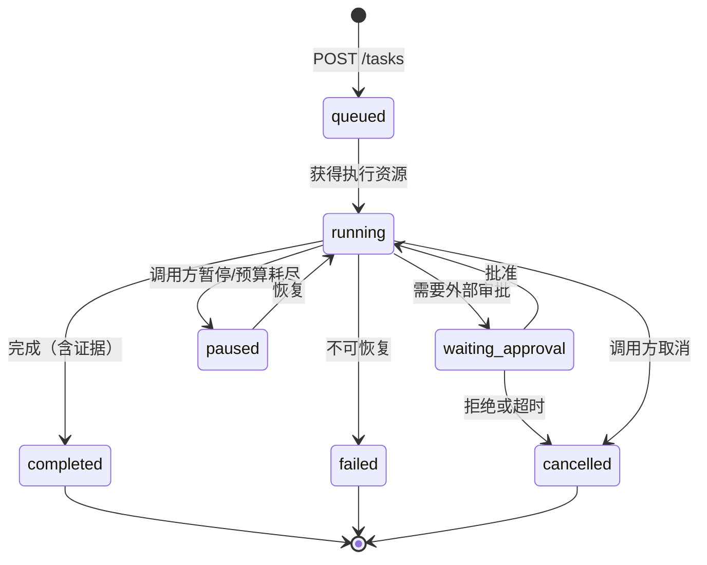
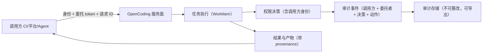

# 卷 23 · Agent2Agent 互操作（A2A）

> Agent 不该是孤岛：本卷定义 OpenCoding **作为服务被其他系统与其他 Coding Agent 调用**（服务面），以及**作为客户端调用其他 Agent/Harness**（客户端面），并给出协议、认证、任务生命周期、事件流、审批回调、幂等、责任边界与企业联邦。
>
> 需求来源：REQ-A2A-1…10（卷 00 §5.23）；全局约束：H-018（双向互操作）、REQ-CMP-15（开放 harness 平台化）。

---

## 1. 本卷定位

- **解决**：外部如何驱动 OpenCoding 干活、我方如何驱动外部 Agent 干活、跨界如何授权与追责。
- **不解决**：内部会话协议（卷 01 §4.5）、MCP 能力接入（卷 09）、团队内部编排（卷 13）。
- **边界**：MCP 提供「能力」（工具/资源/提示词）；A2A 提供「任务」（提交、跟踪、取消、取结果）。两者互补，不互相替代。

## 2. 需求与冲突点

| 需求 | 冲突/要点 |
| --- | --- |
| REQ-A2A-1/3 任务协议 | 简单（提交-查询-结果）vs 丰富（流式事件、审批、产物）→ 分层协议 |
| REQ-A2A-2 认证 | 多种调用方（CI/平台/其他 Agent）→ 多认证方式 + scope |
| REQ-A2A-7 远程审批 | 调用方需参与审批 → 审批回调协议 |
| REQ-A2A-8 责任边界 | 谁授权、谁负责 → 审计链贯穿调用方 |
| REQ-A2A-9 不可信调用方 | 外部输入不可信 → 沙箱化 + 权限收窄 + 预算隔离 |

## 3. 设计空间（M×N）

### D-A2A-1 服务面协议风格

| 分支 | 描述 | 结论 |
| --- | --- | --- |
| B1 自定义 REST + 轮询 | 简单；实时性差 | 基线 |
| B2 完全遵循某第三方标准（如 A2A 规范） | 互通性好；受标准约束 | 基线 |
| **B3 双栈：核心协议自研（REST + SSE/WS，语义完整）+ 适配器实现第三方标准（A2A 风格 Agent Card/任务接口、ACP 风格）；适配器可独立演进** | 自主可控 + 互通 | **选定**（F=9 U=8 S=8 M=9 → 85.5） |

### D-A2A-2 认证与授权

| 分支 | 描述 | 结论 |
| --- | --- | --- |
| B1 静态 API Key | 简单；租户与 scope 弱 | 基线 |
| **B2 组合：API Key（服务对服务）+ OAuth 2.0 Client Credentials/JWT（企业）+ mTLS（高安全）+ scope 与租户绑定 + 调用方配额** | 覆盖企业 | **选定**（F=9 U=8 S=9 M=9 → 88） |

### D-A2A-3 任务协议

| 分支 | 描述 | 结论 |
| --- | --- | --- |
| B1 同步阻塞（一次请求等到完成） | 简单；长任务不可行 | 淘汰 |
| **B2 异步任务 + 流式订阅：`submit`（返回 taskId）→ `subscribe`（SSE/WS 事件流）→ `status`/`result`/`cancel`；支持幂等键、优先级、预算声明、审批回调地址** | 生产可用 | **选定**（F=9 U=9 S=9 M=9 → 90） |

### D-A2A-4 外部任务与内部模型映射

| 分支 | 描述 | 结论 |
| --- | --- | --- |
| B1 直接执行（无内部对象） | 简单；不可追踪 | 淘汰 |
| **B2 映射为内部工作对象：外部 Task ↔ 内部 WorkItem（Plan/Task）；外部请求者视为「外部成员」；预算、权限、审计按其身份归因** | 复用全部治理能力 | **选定**（F=9 U=8 S=9 M=9 → 88） |

### D-A2A-5 能力发现

| 分支 | 描述 | 结论 |
| --- | --- | --- |
| B1 无（文档说明） | 无法自动编排 | 淘汰 |
| **B2 Agent Card/Manifest 端点：声明能力（工具/模式/技能/语言/模型档）、约束（租户）、认证要求、端点列表、速率限制；可签名** | 可被平台自动发现 | **选定**（F=8 U=8 S=8 M=9 → 82.5） |

### D-A2A-6 客户端模式（调用外部 Agent）

| 分支 | 描述 | 结论 |
| --- | --- | --- |
| B1 不做 | 无法编排外部能力 | 淘汰 |
| **B2 统一 `RemoteAgent` 抽象：注册外部端点（协议类型 + 认证 + 能力）→ 以内部工具/子 Agent 形式暴露（如 `remote_agent.invoke`）→ 事件与结果回流；参与预算与审计** | 反向集成 | **选定**（F=8 U=8 S=8 M=9 → 82.5） |

### D-A2A-7 审批回调

| 分支 | 描述 | 结论 |
| --- | --- | --- |
| B1 仅内部审批 | 远程调用方无法参与 | 淘汰 |
| **B2 审批回调协议：推送审批请求到调用方（webhook 或事件流）→ 调用方返回决定（批准/拒绝/授权范围）→ 结果入库与审计；超时按策略（默认拒绝）** | 远程可控 | **选定**（F=8 U=8 S=9 M=9 → 85） |

### D-A2A-8 幂等与重试

| 分支 | 描述 | 结论 |
| --- | --- | --- |
| B1 无 | 重复任务 | 淘汰 |
| **B2 幂等键（调用方提供）+ 结果缓存（TTL）+ 重试语义（只重试可重试错误）+ 去重窗口；重复提交返回既有任务** | 可靠 | **选定**（F=8 U=8 S=9 M=9 → 85） |

### D-A2A-9 不可信调用方隔离

| 分支 | 描述 | 结论 |
| --- | --- | --- |
| B1 与内部同权 | 危险 | 淘汰 |
| **B2 三层收窄：① 权限（外部角色默认只读+受限写，需显式扩大）② 沙箱（外部任务默认 L1+，卷 07）③ 资源（独立预算与并发上限，按调用方维度）** | 安全 | **选定**（F=9 U=8 S=9 M=9 → 88） |

### D-A2A-10 企业联邦

| 分支 | 描述 | 结论 |
| --- | --- | --- |
| B1 单实例 | 无法多团队/多区域 | 基线 |
| **B2 联邦目录 + 路由：多实例注册到目录（能力/租户/区域）；请求按策略路由（数据驻留约束优先）；跨实例任务可追踪；目录可签名与审核** | 企业规模 | **选定**（F=8 U=7 S=7 M=8 → 75.5） |

## 4. 选定方案详设

### 4.1 服务面 API（核心协议）

| 端点 | 方法 | 说明 |
| --- | --- | --- |
| `/a2a/v1/manifest` | GET | Agent Card（能力/约束/端点/认证/限流） |
| `/a2a/v1/tasks` | POST | 提交任务（幂等键、目标工作区、模式、预算、审批回调、优先级） |
| `/a2a/v1/tasks/{id}` | GET | 任务状态与摘要 |
| `/a2a/v1/tasks/{id}/events` | GET (SSE) / WS | 事件流（进度/工具/审批/产物/日志摘要） |
| `/a2a/v1/tasks/{id}/result` | GET | 最终结果（含证据与产物引用） |
| `/a2a/v1/tasks/{id}/cancel` | POST | 取消（安全点语义） |
| `/a2a/v1/tasks/{id}/messages` | POST | 追加指令（插话）/回复审批 |
| `/a2a/v1/tasks` | GET | 列表（按状态/时间过滤，分页） |
| `/a2a/v1/artifacts/{id}` | GET | 取产物（受权限） |

**事件类型**（外部可见的精简集）：`task.queued`、`task.started`、`phase.changed`、`plan.updated`、`tool.summary`、`approval.requested`、`approval.resolved`、`artifact.created`、`task.completed`、`task.failed`、`task.cancelled`。

### 4.2 任务生命周期映射

**映射规则**：外部 `task` ↔ 内部 `WorkItem`（Plan 或 Task）；外部 approuval ↔ 内部 `permission.approval.*`；外部事件流为内部事件流的**过滤投影**（不是原始全量事件，避免泄漏内部细节与敏感信息）。

### 4.3 客户端模式（RemoteAgent）

| 方面 | 设计 |
| --- | --- |
| 注册 | 端点 URL、协议类型（核心/A2A 风格/自定义）、认证引用、能力声明、预算上限、可信级别 |
| 暴露 | 作为工具（`remote_agent.invoke`）或子 Agent（卷 12 的 SubAgent 实现之一），可被计划直接使用 |
| 执行 | 提交任务 → 订阅事件（映射为本地子事件）→ 结果映射（结论/产物/证据） |
| 审批 | 远程审批请求可路由到本地用户（本地方为最终授权者） |
| 安全 | 出站数据受 DLP 与网络策略约束（卷 07）；不可信远程 Agent 的产出默认标记「未验证」 |
| 失败 | 超时/断连按可重试分类处理；结果不完整时标记部分成功 |

### 4.4 认证与租户

| 调用方类型 | 推荐认证 | 默认权限 | 配额 |
| --- | --- | --- | --- |
| CI/CD 流水线 | API Key（项目级） | 受限写（指定分支/路径） | 并发 2，预算上限 |
| 企业平台（工单/门户） | OAuth JWT（用户委托） | 继承委托用户权限（可收窄） | 按用户配额 |
| 其他 Agent（可信） | mTLS + API Key | 只读 + 指定工具 | 独立预算 |
| 其他 Agent（不可信） | API Key（受限） | 只读 + 沙箱 L1+ | 严格上限 |
| 内部服务（本人实例） | 本地回环 + 令牌 | 全权（等同用户） | 无 |

### 4.5 责任边界与审计链

**原则**：每一次动作都能回答「谁（调用方/委托用户）在何时以何权限触发了它，谁批准了它」；跨 Agent 调用时，责任链跨系统保留（通过 `correlationId` 与 provenance 字段）。

### 4.6 性能与限流

| 项 | 设计 |
| --- | --- |
| 提交延迟 | ≤ 300ms（不含排队） |
| 事件流延迟 | ≤ 500ms（跨网络） |
| 限流 | 按调用方（RPM/并发/日预算）；超限返回 429 + `Retry-After` |
| 队列 | 任务排队可见（位置与前序预估）；高优先级可插队（受配额与策略） |
| 大产物 | 通过引用下载（签名 URL，有效期），不内联进事件 |

## 5. 扩展点（供卷 18 汇总）

| 扩展点 | 说明 |
| --- | --- |
| `A2AProtocolAdapterSPI` | 新协议适配（A2A 风格/自定义企业协议） |
| `A2AClientTransportSPI` | 客户端传输（HTTP/消息队列） |
| `A2AApprovalChannelSPI` | 远程审批通道 |
| `A2AFederationDirectorySPI` | 联邦目录实现 |

## 6. 事件与可观测

| 事件 | 说明 |
| --- | --- |
| `a2a.task.submitted` / `accepted` / `rejected` | 接收侧（含调用方身份与幂等命中） |
| `a2a.task.progress` / `completed` / `failed` / `cancelled` | 执行侧 |
| `a2a.approval.forwarded` / `resolved` | 审批回调 |
| `a2a.client.invoked` / `client.failed` | 客户端模式 |
| `a2a.federation.routed` | 联邦路由 |
| `a2a.ratelimit.exceeded` | 限流 |

**指标**：`oc_a2a_tasks_total{caller,outcome}`、`oc_a2a_task_duration_ms`、`oc_a2a_queue_depth`、`oc_a2a_event_lag_ms`、`oc_a2a_ratelimit_total{caller}`、`oc_a2a_client_latency_ms`。

## 7. 非功能设计

- **性能**：见 §4.6；单实例支持 ≥ 200 并发外部任务（可水平扩展）。
- **可靠性**：任务状态持久化；事件流断线可续（`Last-Event-ID`）；幂等键保证重复提交安全。
- **安全**：多认证 + scope + 租户隔离 + 沙箱 + 预算；产物访问签名 URL；不可信调用方默认最严。
- **合规**：跨系统审计链；数据驻留（联邦路由遵守）；出站 DLP。
- **可维护**：协议适配器独立版本化；外部可见事件集是稳定契约（内部事件可自由演进）。

## 8. 完成定义（DoD）

- [ ] 服务面 9 个端点可用；Agent Card 可发现并签名。
- [ ] 任务生命周期 10 态与内部 WorkItem 映射正确（用例：外部取消即内部安全点停止）。
- [ ] 事件流（SSE/WS）可断线续传；外部事件集不含敏感内部细节（审计验证）。
- [ ] 五类调用方认证与配额策略生效；限流返回 429 且带 `Retry-After`。
- [ ] 审批回调协议可用（远程批准/拒绝/超时默认拒绝）。
- [ ] 客户端模式：注册外部 Agent → 以工具/子 Agent 调用 → 结果回流（互操作用例）。
- [ ] 幂等：重复提交返回既有任务（用例）。
- [ ] 不可信调用方：权限收窄 + 沙箱 L1+ + 独立预算（用例）。
- [ ] 审计链完整：任一外部任务可还原调用方、委托者、决策与批准。
- [ ] 联邦目录与路由可用（两实例间任务路由与数据驻留约束）。

## 9. 域内决策汇总（D-A2A）

| ID | 主题 | 选定 |
| --- | --- | --- |
| D-A2A-1 | 服务面协议 | 核心协议（REST+SSE/WS）+ 第三方标准适配器 |
| D-A2A-2 | 认证授权 | API Key / OAuth / mTLS + scope + 租户 + 配额 |
| D-A2A-3 | 任务协议 | 异步任务 + 流式订阅 + 幂等 + 预算声明 |
| D-A2A-4 | 模型映射 | 外部任务 → 内部 WorkItem，请求者为外部成员 |
| D-A2A-5 | 能力发现 | Agent Card/Manifest（可签名） |
| D-A2A-6 | 客户端 | 统一 RemoteAgent 抽象（工具/子 Agent 形态） |
| D-A2A-7 | 审批回调 | 推送审批 + 远程决定 + 超时默认拒绝 |
| D-A2A-8 | 幂等重试 | 幂等键 + 结果缓存 + 去重窗口 |
| D-A2A-9 | 不可信隔离 | 权限收窄 + 沙箱 L1+ + 独立预算 |
| D-A2A-10 | 企业联邦 | 联邦目录 + 路由 + 数据驻留约束 |

## 10. 开放问题与默认决策

| 项 | 默认决策 |
| --- | --- |
| 默认是否开启服务面 | 关闭（local 形态默认仅回环）；server/企业形态开启 |
| 外部事件可见粒度 | 摘要级（工具名 + 结果摘要 + 引用），不含完整参数与内部提示词 |
| 远程审批默认超时 | 10 分钟；超时默认拒绝 |
| 产物下载有效期 | 签名 URL 15 分钟；可续签 |
| 跨 Agent 调用链深度 | 默认 ≤ 3 跳（防循环调用），可配 |
