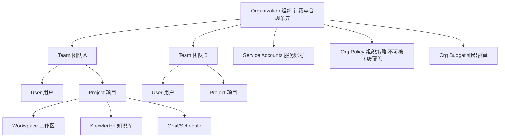
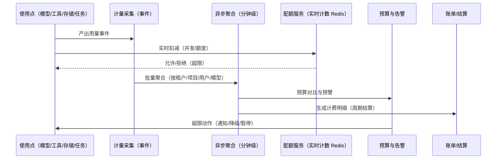
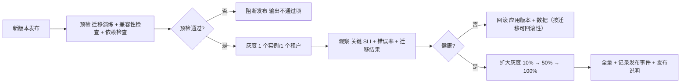

# 卷 24 · 企业级运维与治理（Enterprise Operations）

> 企业采购不看功能清单，看**能不能安全地交给一千个人用**：本卷定义**多租户与组织模型、身份与角色、审计与合规、配额与计费、成本治理、可观测、部署与升级、特性开关、数据驻留与加密、模型与内容治理、诊断与支持**。
>
> 需求来源：REQ-ENT-1…12（卷 00 §5.24）；全局约束：H-004（同源五形态）、H-019（三级租户 + 配额）、NFR-S/R/M 系列。

---

## 1. 本卷定位

- **解决**：规模化使用时的身份、权限、成本、审计、部署、升级与治理问题。
- **不解决**：功能域业务逻辑（见各卷）；权限决策算法（卷 06）；数据迁移（卷 19）。
- **边界**：本卷是**平台运营层**：面向管理员与运维，而非终端用户。

## 2. 需求与冲突点

| 需求 | 冲突/要点 |
| --- | --- |
| REQ-ENT-3 RBAC | 角色简单 vs 细粒度资源 → 角色模板 + 资源级覆盖 |
| REQ-ENT-4 审计 | 记录全 vs 存储成本与隐私 → 分级审计 + 可导出 + 脱敏 |
| REQ-ENT-5 计量 | 精确 vs 性能 → 事件化 + 异步聚合（容忍秒级误差） |
| REQ-ENT-8 升级 | 快速 vs 安全 → 灰度 + 回滚 + 迁移演练 |
| REQ-ENT-11 内容治理 | 安全 vs 体验 → 可配置策略 + 明确提示（不静默拦截） |

## 3. 设计空间（M×N）

### D-ENT-1 多租户模型

| 分支 | 描述 | 结论 |
| --- | --- | --- |
| B1 单租户（实例即租户） | 简单；成本高 | 备选（高隔离客户） |
| **B2 三级模型：组织（Organization）→ 团队（Team）→ 用户（User），数据行级隔离 + 资源配额按级继承；可跨团队共享（显式授权）** | 覆盖企业组织形态 | **选定**（F=9 U=8 S=8 M=9 → 85.5） |
| B3 两级（租户 + 用户） | 简单；不匹配企业组织 | 淘汰 |

### D-ENT-2 身份与目录

| 分支 | 描述 | 结论 |
| --- | --- | --- |
| B1 本地账号 | 简单；企业不可管 | 基线 |
| **B2 多源：本地账号 + OIDC/SAML SSO + LDAP/AD 目录 + SCIM 自动provisioning/deprovisioning + 服务账号（CI/Agent）** | 企业刚需 | **选定**（F=9 U=8 S=8 M=9 → 85.5） |

### D-ENT-3 角色与权限模型

| 分支 | 描述 | 结论 |
| --- | --- | --- |
| B1 固定角色（管理员/成员） | 简单；粒度粗 | 基线 |
| **B2 角色模板 + 资源级覆盖：内置角色（Owner/Admin/Developer/Reviewer/Auditor/Viewer/ServiceAccount）+ 自定义角色（权限点组合）+ 资源级覆盖（项目/工作区/知识库/模型凭证）** | 灵活可治理 | **选定**（F=9 U=8 S=8 M=9 → 85.5） |

**权限点示例**：`session.create`、`task.assign`、`team.create`、`workspace.manage`、`git.push`、`plugin.install`、`policy.edit`、`audit.read`、`billing.read`、`model.credential.manage`。

### D-ENT-4 审计与合规

| 分支 | 描述 | 结论 |
| --- | --- | --- |
| B1 仅操作日志 | 不满足合规 | 淘汰 |
| **B2 分级审计：① 安全审计（认证/权限/密钥/沙箱/策略变更，长留存、哈希链、可导出）② 业务审计（任务/提交/审批，按租户策略）③ 使用审计（功能使用与成本）** | 覆盖合规与运营 | **选定**（F=9 U=8 S=8 M=9 → 85.5） |

### D-ENT-5 配额与计费

| 分支 | 描述 | 结论 |
| --- | --- | --- |
| B1 无限制 | 成本失控 | 淘汰 |
| **B2 多维配额（并发会话/并发任务/token/成本/存储/工具调用/外部任务）+ 按组织/团队/用户继承 + 超限策略（拒绝/排队/降级）+ 计量事件用于计费（内部结算或对外账单）** | 可控 | **选定**（F=9 U=8 S=9 M=9 → 88） |

### D-ENT-6 成本治理

| 分支 | 描述 | 结论 |
| --- | --- | --- |
| B1 仅事后查看 | 无法预防 | 淘汰 |
| **B2 预算与预警：按维度设预算（组织/团队/项目/用户/计划）→ 消耗率监控 → 阈值预警（50/80/100%）→ 超限动作（通知/降级到低价模型/暂停自治任务）；成本归因到任务/团队/会话** | 可预防 | **选定**（F=9 U=8 S=8 M=9 → 85.5） |

### D-ENT-7 可观测栈

| 分支 | 描述 | 结论 |
| --- | --- | --- |
| B1 仅日志文件 | 排障低效 | 淘汰 |
| **B2 三支柱：指标（Prometheus 语义）+ 结构化日志（JSON，含 trace）+ 分布式追踪（OpenTelemetry）+ 内置看板（健康/成本/性能/质量）+ 告警规则（可导入 Prometheus 规则）** | 企业标准 | **选定**（F=9 U=8 S=9 M=9 → 88） |

### D-ENT-8 部署与升级

| 分支 | 描述 | 结论 |
| --- | --- | --- |
| B1 手工部署 | 不可复制 | 淘汰 |
| **B2 全形态交付：容器镜像（多架构）+ Helm Chart（server/enterprise）+ 离线包（air-gapped：镜像 + 依赖 + 迁移工具）+ 桌面端安装包 + CLI 包；升级流程：预检（迁移演练 + 兼容性）→ 灰度（按实例/租户）→ 全量 → 回滚预案** | 可运维 | **选定**（F=9 U=8 S=9 M=9 → 88） |

### D-ENT-9 特性开关与灰度

| 分支 | 描述 | 结论 |
| --- | --- | --- |
| B1 无 | 风险集中 | 淘汰 |
| **B2 能力门控 + 特性开关：按部署形态/租户/团队/用户/百分比灰度；开关变更审计；实验功能默认关闭（卷 25）；开关与版本解耦（配置化）** | 风险可控 | **选定**（F=9 U=8 S=9 M=9 → 88） |

### D-ENT-10 数据驻留与加密

| 分支 | 描述 | 结论 |
| --- | --- | --- |
| B1 无声明 | 合规风险 | 淘汰 |
| **B2 数据驻留声明（租户级区域）+ 传输与静态加密 + 字段级加密（敏感字段，KMS 管理密钥）+ BYOK 支持 + 跨区传输显式放行与审计** | 合规 | **选定**（F=9 U=7 S=8 M=9 → 83.5） |

### D-ENT-11 模型与内容治理

| 分支 | 描述 | 结论 |
| --- | --- | --- |
| B1 无 | 数据外泄风险 | 淘汰 |
| **B2 治理组合：模型白名单（可用模型/端点）+ 数据外发策略（DLP：禁止外发源码/密钥/客户数据模式）+ 出站审查（可选模型审查）+ 审计与告警；越界即阻断并提示** | 安全可用 | **选定**（F=9 U=8 S=9 M=9 → 88） |

### D-ENT-12 诊断与支持

| 分支 | 描述 | 结论 |
| --- | --- | --- |
| B1 手工收集 | 支持低效 | 淘汰 |
| **B2 一键诊断包：装配计划 + 能力门控 + 插件健康 + 连接状态 + 最近错误（脱敏）+ 指标快照 + 事件片段；支持按需包含指定会话轨迹；脱敏规则可在导出前预览** | 支持效率 | **选定**（F=8 U=8 S=8 M=9 → 82.5） |

## 4. 选定方案详设

### 4.1 组织模型

| 实体 | 说明 | 关键关系 |
| --- | --- | --- |
| Organization | 计费、合规、组织策略、审计留存策略 | 含多个 Team |
| Team | 协作单元（成员、角色、团队预算、团队记忆与知识） | 含多个 Project |
| Project | 代码与工作的边界（工作区集合、任务、目标、知识） | 绑定 Worktree 与仓库 |
| User / ServiceAccount | 身份（人 / 机器） | 属于组织，可属多个团队 |
| Role | 权限点集合（内置 + 自定义） | 绑定到 (User/SA, Scope) |

### 4.2 内置角色矩阵（节选）

| 权限点 | Owner | Admin | Developer | Reviewer | Auditor | Viewer | ServiceAccount |
| --- | --- | --- | --- | --- | --- | --- | --- |
| session.create / task.run | ✔ | ✔ | ✔ | ✔ | ✖ | ✖ | ✔（受限） |
| git.push / merge | ✔ | ✔ | ✔ | ✖ | ✖ | ✖ | ✔（受限分支） |
| team.create / member.manage | ✔ | ✔ | ✖ | ✖ | ✖ | ✖ | ✖ |
| workspace.manage | ✔ | ✔ | ✔（自有） | ✖ | ✖ | ✖ | ✖ |
| plugin.install / policy.edit | ✔ | ✔ | ✖ | ✖ | ✖ | ✖ | ✖ |
| audit.read / billing.read | ✔ | ✔ | ✖ | ✖ | ✔ | ✖ | ✖ |
| model.credential.manage | ✔ | ✔ | ✖ | ✖ | ✖ | ✖ | ✖ |

**资源级覆盖**：可在 Project/Workspace 粒度追加或收窄（不可突破组织策略）。

### 4.3 审计事件范围（安全审计）

| 类别 | 事件 |
| --- | --- |
| 身份 | 登录/登出、SSO 绑定、SCIM 变更、令牌签发/撤销、失败尝试 |
| 权限 | 决策（拒绝优先记录）、审批（请求/批准/拒绝/超时）、策略变更、授权记忆写入/撤销 |
| 密钥 | 凭证创建/轮换/使用（引用级）、密钥访问失败 |
| 沙箱 | 档位选择、违规、命令拦截、逃逸告警 |
| 数据 | 导出、导入、合规删除、跨区传输、DLP 阻断 |
| 配置 | 模型/路由/插件/钩子/特性开关变更（含差异） |

### 4.4 配额与计费管线

**精度说明**：实时计数用于准入（允许少量误差，秒级最终一致）；聚合用于计费（对账误差 ≤ 0.5%）。

### 4.5 部署形态与拓扑

| 形态 | 组件 | 说明 |
| --- | --- | --- |
| local | 内核 sidecar + 桌面端 + CLI + 本地 PG/文件 | 单用户，无外部依赖 |
| server | 内核服务（容器）+ PG + Redis + 对象存储 + 反向代理 | 团队共享；可选 HTTPS 暴露 |
| enterprise-server | 上述 + SSO/SCIM 对接 + 审计导出 + 多副本 + KMS + 网关（模型出口） | 多租户；SLA |
| air-gapped | 离线包安装（镜像 + 依赖 + 模型端点内网）+ 全禁外网 | 涉密/内网 |

**水平扩展**：协议面无状态（会话亲和路由）；执行节点可独立扩容；事件消费者可多实例（分区消费）；索引节点可独立部署（卷 11）。

### 4.6 升级与回滚流程

**规则**：不可回滚的迁移必须先走 expand-contract（卷 19）；灰度期间新旧版本兼容（协议版本协商与数据双读）。

### 4.7 SLO / SLI 表（节选）

| SLI | SLO |
| --- | --- |
| 协议面可用性 | ≥ 99.9%/月 |
| 首 token 延迟 P95 | ≤ 1.5s（本地/内网模型） |
| 事件写入 P95 | ≤ 10ms |
| 会话恢复成功率 | ≥ 99.5% |
| 审计事件完整率 | 100%（缺失即告警） |
| 备份成功率 | 100%（每日校验） |
| 恢复演练通过率 | 100%（季度） |

### 4.8 模型与内容治理（DLP）

| 规则类型 | 示例 | 动作 |
| --- | --- | --- |
| 模型白名单 | 仅允许内网 vLLM 与指定云模型 | 拒绝其他模型（含提示与审计） |
| 数据外发 | 禁止含私钥/身份证/客户数据模式的出站请求 | 阻断 + 告警 + 建议（脱敏后重试） |
| 目录限制 | 禁止将 `secrets/`、`prod-config/` 内容送入上下文 | 上下文层过滤（卷 03）+ 审计 |
| 工具限制 | 禁止外网命令/上传 | 权限拒绝 + 审计 |
| 内容审查 | 可选模型审查出站内容 | 阻断或标记 |

### 4.9 诊断包内容

| 项 | 说明 |
| --- | --- |
| 环境摘要 | 版本、形态、平台、资源、依赖版本 |
| 装配计划 | 服务与适配器清单、能力门控、降级项 |
| 插件健康 | 装载状态、熔断、错误统计 |
| 连接状态 | 模型端点、数据库、Redis、工作区连通性与延迟 |
| 最近错误 | 结构化错误（脱敏，含 traceId） |
| 指标快照 | 关键指标区间值 |
| 事件片段 | 可选（按时间与类型过滤，脱敏） |
| 脱敏预览 | 导出前逐项预览可脱敏内容，支持自定义排除 |

### 4.10 租户化改造清单（逐域）

> 新增任何功能时按本表核对：**每一行都必须能在实现中被验证**（缺项即视为租户隔离缺陷）。

| 域（卷） | 必须租户化 | 常见遗漏 |
| --- | --- | --- |
| 事件（16） | 信封强制 `tenantId`；分区键含租户；查询自动过滤 | 全局消费者忘记过滤（投影泄漏） |
| 会话/条目（01/12） | 会话属租户；跨端 attach 校验租户 | 分享链接越租户 |
| 上下文（03） | 检索注入按租户过滤；引用再读重新鉴权 | 缓存键未含租户（跨租户命中） |
| 记忆（10） | 四层各自作用域；组织记忆按角色 | 向量索引共享导致串味 |
| 知识（11） | 索引标签含租户；前置过滤 | 连接器凭据跨租户复用 |
| 工具（05） | 工作区路由属租户；缓存键含租户 | 只读缓存跨租户命中 |
| 权限（06） | 策略/授权记忆按租户；企业基线不可跨租户 | 策略缓存未分区 |
| 沙箱（07） | 执行域按租户隔离（L2/L3 强制） | 容器复用导致环境残留 |
| 工作区/Git（20/21） | 连接配置与凭证按租户；worktree 目录按租户分根 | 临时目录共享 |
| 团队（13） | 成员、黑板、消息按租户 | 跨租户成员误加入 |
| 自动化（34）/增强（35） | 模板与运行按租户；预算按租户 | 报告外发到错误接收人 |
| 计量（24/31） | 归因必含租户；看板默认按租户过滤 | 聚合表缺少租户维度 |
| 遥测/许可（28） | 租户级同意与席位 | 遥测载荷混租户 |
| 插件/技能（18/08） | 安装与配置按租户；市场缓存分区 | 全局插件配置被单租户修改 |

**跨租户红线（硬约束）**：
1. 任何查询不得缺少租户条件——由持久层强制注入 + 集成测试扫描（无租户条件即测试失败）。
2. 跨租户数据移动必须经显式导出/导入流程并留审计；不存在「直接读取」路径。
3. 缓存/索引/对象存储键必须含租户前缀；跨租户命中视为安全事件（SEV2）。
4. 共享知识域（如企业统一规范）必须显式声明并在索引中标注「共享」标签。

### 4.11 组织协作与知识传承

| 机制 | 约定 |
| --- | --- |
| 所有权（Ownership） | 每个模块/卷册有明确 Owner（1 主 1 备）；Owner 变更写审计；无 Owner 模块进入「待认领」清单并季度清理 |
| 设计评审节奏 | 双周架构评审（变更提案 + 决策台账更新）；重大变更（新增域/破坏性契约）需 2 名评审人 |
| 决策留痕 | 每个决策登记 `DECISIONS.md`（含被放弃分支与回退条件，`ALTERNATIVES.md`）；口头决策视为无效 |
| 新人上手（Onboarding） | 第 1 天：跑通最小旅程（读→改→测→提交）；第 1 周：读完 README + 本卷 + 角色相关 3 卷并提交一处文档改进；第 1 月：独立完成一个模板级任务（卷 34） |
| 知识传承 | 关键流程必须有 Runbook（卷 32）；关键决策必须有 ADR 条目；关键模块必须有架构图与不变量说明 |
| 复盘机制 | 事故复盘（卷 32 §6）+ 季度决策复盘（哪些选定分支被证明错误、是否切换）|
| 文档即契约 | 代码与文档不一致时以文档为准并立即修复其一（README §7-1）；文档陈旧率纳入季度健康度 |
| 贡献度量 | 文档改进、评测用例新增、Runbook 补充均计入贡献（不只看代码） |

**反模式**：① 只有一个人懂的模块；② 只在聊天里达成的设计共识；③ 没有 Owner 的子系统；④ 决策变更未更新台账。

## 5. 扩展点（供卷 18 汇总）

| 扩展点 | 说明 |
| --- | --- |
| `IdentityProviderSPI` | 新身份源（OIDC/SAML/LDAP/自定义） |
| `RolePolicySPI` | 自定义角色与权限点 |
| `BillingSinkSPI` | 计费系统对接（内部结算/对外账单） |
| `ComplianceReportSPI` | 合规报告模板（SOC2/等保等） |
| `FeatureFlagProviderSPI` | 特性开关来源（配置/远端/企业平台） |
| `AuditSinkSPI` | 审计出海（SIEM/数据湖） |
| `DlpRuleSPI` | DLP 规则扩展 |
| `DeploymentProbeSPI` | 部署预检项扩展 |

## 6. 事件与可观测

| 事件 | 说明 |
| --- | --- |
| `ent.tenant.created` / `org.updated` / `team.member.changed` | 组织与团队变更 |
| `ent.identity.login` / `logout` / `sso.bound` / `scim.synced` | 身份 |
| `ent.quota.exceeded` / `ent.budget.threshold.reached` / `ent.budget.enforced` | 配额与预算 |
| `ent.audit.exported` | 审计导出 |
| `ent.dlp.blocked` / `ent.model.denied` | 治理阻断 |
| `ent.featureflag.changed` / `ent.upgrade.gray.progressed` | 发布与开关 |
| `ent.diagnostic.exported` | 诊断包 |

**指标**：`oc_tenant_active`、`oc_quota_utilization{scope,kind}`、`oc_cost_total{scope,model}`、`oc_budget_burn_rate{scope}`、`oc_audit_events_total{category}`、`oc_dlp_block_total`、`oc_deploy_version{instance}`、`oc_slo_burn_rate{slo}`。

## 7. 非功能设计

- **性能**：配额判定 ≤ 5ms（本地计数）；审计写入异步（不阻塞主流程，失败告警）；看板查询 ≤ 2s（预聚合）。
- **可靠性**：多副本无单点；配额与预算服务降级为「宽松放行 + 告警」（避免影响可用性，除高风险租户可配严格模式）。
- **安全**：管理操作强制 MFA（可配）；审计不可篡改；密钥集中管理；最小权限默认。
- **合规**：审计留存与导出、数据驻留、字段加密、删除证明（卷 19）、DLP（本卷 §4.8）。
- **可维护**：一切变更审计；配置版本化；灰度与回滚标准化；诊断自动化。

## 8. 完成定义（DoD）

- [ ] 三级组织模型与行级隔离落地；跨团队共享需显式授权（用例）。
- [ ] SSO（OIDC/SAML 任一）+ SCIM 同步可用；本地账号保留为兜底。
- [ ] 内置 7 角色 + 自定义角色 + 资源级覆盖可用；组织策略不可被下级突破（用例）。
- [ ] 三类审计（安全/业务/使用）落地，安全审计哈希链可验证，可导出（含脱敏）。
- [ ] 多维配额与超限策略（拒绝/排队/降级）生效；计量误差 ≤ 0.5%。
- [ ] 预算与预警（50/80/100%）和超限动作（通知/降级/暂停）可用。
- [ ] 可观测三支柱落地；内置看板（健康/成本/性能/质量）可用；告警规则可导入。
- [ ] 四种部署形态交付物就绪（容器 + Helm + 离线包 + 桌面/CLI 包）。
- [ ] 升级流程演练通过：预检 → 灰度 → 全量 → 回滚（含迁移回滚）。
- [ ] 特性开关按租户/团队/百分比灰度生效，变更审计可查。
- [ ] DLP 五类规则可配置并阻断（含提示与审计）。
- [ ] 一键诊断包可用，脱敏预览有效（无敏感明文）。

## 9. 域内决策汇总（D-ENT）

| ID | 主题 | 选定 |
| --- | --- | --- |
| D-ENT-1 | 多租户 | 组织/团队/用户三级 + 行级隔离 + 级联配额 |
| D-ENT-2 | 身份 | 本地 + OIDC/SAML + LDAP/AD + SCIM + 服务账号 |
| D-ENT-3 | 角色 | 内置模板 + 自定义角色 + 资源级覆盖 |
| D-ENT-4 | 审计 | 三级审计（安全/业务/使用）+ 哈希链 + 导出 |
| D-ENT-5 | 配额计费 | 多维配额 + 实时准入 + 异步聚合计费 |
| D-ENT-6 | 成本治理 | 预算 + 预警 + 超限动作 + 归因 |
| D-ENT-7 | 可观测 | 指标/日志/追踪三支柱 + 内置看板 + 告警 |
| D-ENT-8 | 部署升级 | 四形态交付 + 预检/灰度/回滚 |
| D-ENT-9 | 特性开关 | 能力门控 + 多维灰度 + 变更审计 |
| D-ENT-10 | 驻留加密 | 驻留声明 + 全链路加密 + 字段级加密 + BYOK |
| D-ENT-11 | 内容治理 | 模型白名单 + DLP + 出站审查 + 审计 |
| D-ENT-12 | 诊断支持 | 一键诊断包 + 脱敏预览 |

## 10. 开放问题与默认决策

| 项 | 默认决策 |
| --- | --- |
| 计费模式 | 默认「用量计量 + 可对接内部结算」；SaaS 计费为可插拔出口 |
| 审计默认留存 | 安全审计 3 年；业务审计 1 年；使用审计 90 天 |
| MFA 强制范围 | 默认要求 Admin/Owner 强制 MFA；企业可要求全体 |
| 离线包更新方式 | 介质导入 + 预检脚本 + 分阶段执行（含回滚介质） |
| 多区域部署 | 默认单区域；跨区域由联邦（卷 23）与驻留策略支持 |
