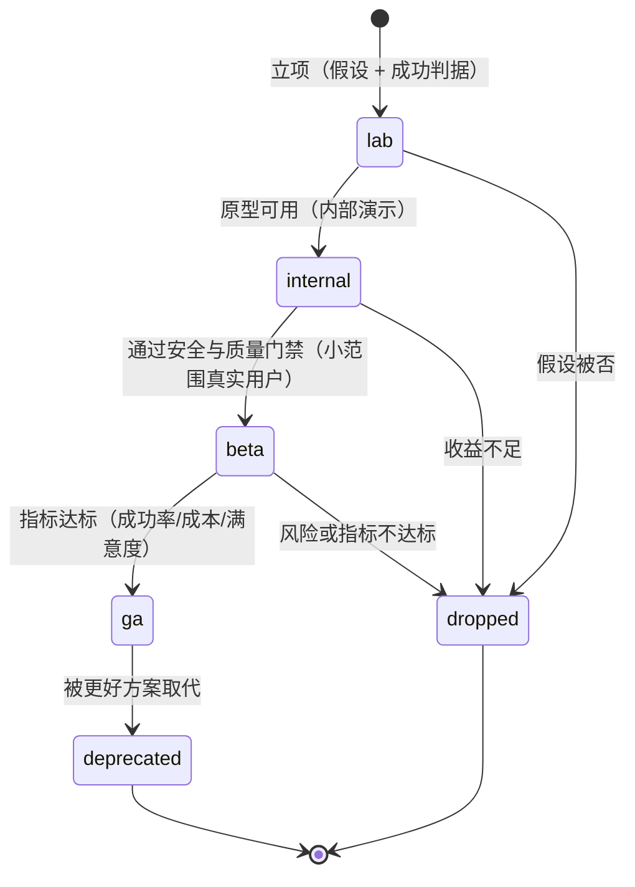

# 卷 25 · 前沿探索（Frontier Exploration）

> 前沿不是「加个新按钮」，而是一条**可控的探索流水线**：本卷为 12 个前沿方向定义假设、方法、入口、成功判据、风险与退出条件，并给出从实验室到 GA（或下线）的五级阶梯与治理机制。
>
> 需求来源：REQ-FR-1…12（卷 00 §5.25）；全局约束：D-PROD-6（实验开关 + 内测框架 + 可下线）、REQ-FR-12（研究通道）。

---

## 1. 本卷定位

- **解决**：前沿能力如何做、怎么评估、怎么上线、怎么下线而不污染主线。
- **不解决**：已确定功能的设计（见各卷）；评测体系本体（卷 26）。
- **边界**：本卷的每个方向都必须能通过现有扩展点落地（卷 18），**不得为核心引入未验证的强耦合**。

## 2. 探索治理：五级阶梯

| 级别 | 入口条件 | 可见性 | 开关 | 数据 |
| --- | --- | --- | --- | --- |
| lab | 假设 + 成功判据书面化 | 仅开发者 | 硬编码开关 | 不上报 |
| internal | 原型可演示 + 已知限制清单 | 团队内 | 实验开关 | 匿名使用统计 |
| beta | 通过安全红队 + 质量基线 | 白名单用户/租户 | 租户级开关 | 全量指标 + 反馈收集 |
| ga | 指标达标 + 运维就绪（监控/告警/文档） | 全量（可配） | 默认开启 | 全量 |
| dropped/deprecated | 退出条件触发 | 关闭 + 公告 + 迁移建议 | 移除路径明确 | 归档 |

**硬性规则**：
1. 每个实验必须声明**退出条件**（指标不达标/风险不可接受/成本过高）——无退出条件不得进入 beta。
2. 实验不得绕过安全基线（权限/沙箱/审计/DLP 一律照常）。
3. 实验数据默认匿名；涉及用户数据必须显式同意。
4. 实验关闭后，其产生的数据与产物保留策略明确（可导出、可删除）。

## 3. 十二个方向的设计空间与选定

### D-FR-1 多模态协作深度

| 分支 | 描述 | 结论 |
| --- | --- | --- |
| B1 仅输入（图片/PDF 理解） | 已有能力（卷 02） | 基线 |
| **B2 双向多模态：设计稿/截图 → 代码实现（含视觉对比迭代）→ 截图回评 → 差异修复；视频/录屏理解（缺陷复现）；生成图示（架构图/流程图）用于沟通** | 差异化定位「编码 + 办公 + 设计」 | **选定**（F=9 U=9 S=7 M=8 → 82.5） |
| B3 生成式设计（直接产出设计稿） | 超出当前定位 | 备选（lab） |

**入口**：`view_image` / `extract_document` 工具 + 会话输入增强（卷 22）+ 视觉对比验证器（卷 12 验证器之一）。
**成功判据**：设计稿还原任务在内部基准上的结构正确率 ≥ 80%、视觉差异可量化并收敛。

### D-FR-2 计算机使用（GUI 自动化）

| 分支 | 描述 | 结论 |
| --- | --- | --- |
| B1 不做 | 保守 | 基线 |
| **B2 沙箱内 GUI 自动化：在虚拟显示/容器内操作浏览器与桌面应用（截图 + 坐标/元素定位 + 输入），用于端到端验证与界面任务；与卷 07 强隔离绑定** | 扩展「验证」能力（不只跑测试，还能真点一遍） | **选定**（F=8 U=8 S=6 M=7 → 72.5） |
| B3 直接操作用户桌面 | 风险高（不可控、不可审计） | 淘汰 |

**成功判据**：内部端到端用例（10 个典型 WEB 流程）自动化通过率 ≥ 70%，且无越界操作。

### D-FR-3 自进化（从失败中学习）

| 分支 | 描述 | 结论 |
| --- | --- | --- |
| B1 不做 | 保守 | 基线 |
| **B2 受控自进化：从失败轨迹中提炼（a）技能草稿（卷 08 创作器）（b）评测用例（补充基准）（c）提示词改进建议（卷 04 灰度验证）；全部人工评审后发布** | 组织能力随时间增强 | **选定**（F=8 U=8 S=7 M=8 → 77.5） |
| B3 自动发布改进 | 风险不可控 | 淘汰 |

**成功判据**：每季度沉淀 ≥ 20 条有效改进（被采纳且指标提升）。

### D-FR-4 评测驱动开发（EDD）

| 分支 | 描述 | 结论 |
| --- | --- | --- |
| B1 手工回归 | 不可扩展 | 淘汰 |
| **B2 基准驱动：内部任务基准（含成功率/成本/时长/轨迹评分）+ 变更门禁 + 模型 A/B；基准与真实会话采样联动（从失败会话提炼新用例）** | 质量可持续 | **选定**（F=9 U=8 S=8 M=9 → 85.5） |

（体系细节见卷 26。）

### D-FR-5 Agent 与技能市场

| 分支 | 描述 | 结论 |
| --- | --- | --- |
| B1 无市场 | 生态弱 | 淘汰 |
| **B2 三类市场：技能（卷 08）、插件（卷 18）、团队模板（卷 13）；统一签名、评分、评论、安装量、安全扫描；企业可私有市场并镜像公共内容** | 生态飞轮 | **选定**（F=8 U=8 S=7 M=8 → 77.5） |
| B3 开放交易与分成 | 商业化探索（lab） | 备选 |

### D-FR-6 跨 Harness 联邦

| 分支 | 描述 | 结论 |
| --- | --- | --- |
| B1 不做 | 单机思维 | 基线 |
| **B2 联邦协作：通过 A2A（卷 23）与其他 Coding Agent/Harness 组成「能力联邦」——我方可调用外部专家 Agent（如安全审计 Agent），也可被编排为执行节点；共享任务与证据，不共享上下文** | 生态互操作 | **选定**（F=8 U=7 S=7 M=8 → 75.5） |

### D-FR-7 个人助理化

| 分支 | 描述 | 结论 |
| --- | --- | --- |
| B1 不做 | 保守 | 基线 |
| **B2 主动建议（可关）：基于记忆与日程（卷 15）在合适时机提出建议（如「依赖有安全更新」「你在改的模块有相关历史决策」）；严格隐私边界（本地优先，默认关闭云端推理以上下文）** | 提升日常价值 | **选定**（F=7 U=8 S=7 M=7 → 72.5） |

### D-FR-8 端侧/小模型辅助

| 分支 | 描述 | 结论 |
| --- | --- | --- |
| B1 不做 | 成本曲线不改善 | 基线 |
| **B2 分层推理：轻任务（摘要、分类、检索重排、简单编辑）走端侧/小模型（Ollama/本地量化模型），重任务走大模型；路由依据成本与任务类型（卷 02 D-MDL-6）** | 显著降本 | **选定**（F=8 U=8 S=8 M=8 → 80） |
| B3 全端侧 | 能力受限 | 淘汰 |

### D-FR-9 形式化验证辅助

| 分支 | 描述 | 结论 |
| --- | --- | --- |
| B1 不做 | 保守 | 基线 |
| **B2 关键路径增强：对关键算法/并发代码提供不变量检查、属性测试生成、模型检查辅助（以工具形式接入，不内置证明器）** | 高价值但投入大 | **选定（lab 起步）**（F=7 U=6 S=6 M=7 → 65） |

### D-FR-10 组织知识图谱

| 分支 | 描述 | 结论 |
| --- | --- | --- |
| B1 不做 | 知识仍碎片 | 基线 |
| **B2 人-代码-决策图谱：从提交、任务、审查、记忆与知识页构建关系图（谁决策了什么、哪个模块由谁负责、变更影响链）；用于路由（找对人）与影响分析** | 企业洞察 | **选定**（F=8 U=7 S=6 M=8 → 73） |

### D-FR-11 自主运维

| 分支 | 描述 | 结论 |
| --- | --- | --- |
| B1 不做 | 运维自动化缺失 | 基线 |
| **B2 自诊断与自愈：内核自检（装配/连接/性能）→ 常见故障自动修复（重连、降级、清理）→ 疑难问题生成诊断报告；自升级演练（预检 + 演练）** | 降低运维负担 | **选定**（F=8 U=8 S=8 M=8 → 80） |
| B3 全自主运维（自动变更线上） | 风险高 | 淘汰 |

### D-FR-12 研究通道

| 分支 | 描述 | 结论 |
| --- | --- | --- |
| B1 无 | 实验散落 | 淘汰 |
| **B2 制度化：实验清单（本卷）+ 开关框架（卷 24 D-ENT-9）+ 评测挂钩（卷 26）+ 下线流程 + 每季度评审（保留/推进/终止）** | 探索有序 | **选定**（F=8 U=7 S=8 M=9 → 80.5） |

## 4. 探索项统一模板

每个实验在 `docs/harness/experiments/<id>.md` 登记（或在项目 issue 系统），包含：

| 字段 | 说明 |
| --- | --- |
| `id` / `title` | 标识 |
| `hypothesis` | 假设（若 X 则 Y，因为 Z） |
| `entry` | 落地入口（扩展点/工具/模式） |
| `scope` | 影响面（哪些域） |
| `successCriteria` | 可测量判据（成功率/成本/时长/满意度） |
| `risks` | 风险（安全/成本/体验）与缓解 |
| `exitCriteria` | 退出条件 |
| `level` | lab / internal / beta / ga |
| `owner` / `reviewDate` | 负责与评审时间 |
| `metricsRef` | 指标看板链接 |

## 5. 与主线的关系

| 关系 | 规则 |
| --- | --- |
| 代码隔离 | 实验中能力通过扩展点实现（卷 18），核心代码只允许「显式能力门控」分支 |
| 数据隔离 | 实验数据单独命名空间（可整体清理） |
| 安全 | 实验不得绕过卷 06/07/16 的任何约束 |
| 文档 | 实验必须登记；GA 后并入相应卷册（并回写本卷状态） |
| 下线 | 下线时提供迁移说明；产物与数据按策略归档或清除 |

## 6. 事件与可观测

| 事件 | 说明 |
| --- | --- |
| `experiment.registered` / `level.changed` / `dropped` | 实验生命周期 |
| `experiment.metric.evaluated` | 判据评估结果 |
| `experiment.rollout.changed` | 灰度范围变更 |

**指标**：`oc_experiment_active{level}`、`oc_experiment_success_ratio{id}`、`oc_experiment_cost_total{id}`。

## 7. 非功能设计

- **成本控制**：实验预算独立（不占用户配额）；超预算自动降级或暂停。
- **可回退**：每个实验可一键关闭（开关 + 数据保留说明）。
- **可解释**：实验能力在界面显式标记（如「实验」徽标），用户可关闭。
- **可维护**：实验数量上限（默认 ≤ 8 个活跃实验），避免维护面爆炸。

## 8. 完成定义（DoD）

- [ ] 12 个方向全部登记（假设/入口/判据/退出条件/级别）。
- [ ] 五级阶梯流程落地（含开关、面板、评审节奏）。
- [ ] 至少 3 个方向进入 internal（多模态协作、端侧小模型、评测驱动开发）。
- [ ] 实验数据隔离与一键关闭可用。
- [ ] 每季度评审机制运行（保留/推进/终止记录）。
- [ ] GA 实验并入卷册（文档回写）流程可用。

## 9. 域内决策汇总（D-FR）

| ID | 主题 | 选定 |
| --- | --- | --- |
| D-FR-1 | 多模态协作 | 双向多模态（设计稿↔代码 ↔截图回评 ↔图示生成） |
| D-FR-2 | 计算机使用 | 沙箱内 GUI 自动化（验证用途优先） |
| D-FR-3 | 自进化 | 受控（草稿 + 人工评审发布） |
| D-FR-4 | 评测驱动 | 基准 + 门禁 + A/B + 失败提炼 |
| D-FR-5 | 市场 | 技能/插件/团队模板三市场 + 私有镜像 |
| D-FR-6 | 联邦 | A2A 能力联邦（共享任务与证据，不共享上下文） |
| D-FR-7 | 助理化 | 主动建议（可关，本地优先） |
| D-FR-8 | 端侧模型 | 分层推理（轻任务端侧，重任务云端） |
| D-FR-9 | 形式化验证 | 关键路径增强（lab 起步，工具形态接入） |
| D-FR-10 | 知识图谱 | 人-代码-决策图谱（路由与影响分析） |
| D-FR-11 | 自主运维 | 自诊断 + 自愈 + 演练（不做自主变更） |
| D-FR-12 | 研究通道 | 制度化（清单 + 开关 + 评测 + 季度评审） |

## 10. 开放问题与默认决策

| 项 | 默认决策 |
| --- | --- |
| 实验的用户可见性 | beta 及以上默认可见并标注「实验」；internal 不暴露给终端用户 |
| 实验预算来源 | 独立实验预算池（不占团队配额）；超限自动暂停 |
| 端侧模型默认 | 不预装；检测到本地 Ollama 等运行时后可选启用 |
| 主动建议默认 | 关闭（用户显式开启，且默认仅本地推理） |
| 形式化验证投入 | lab 阶段采用外部工具集成，不内置证明器 |
