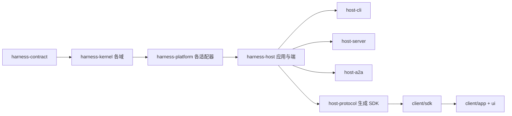
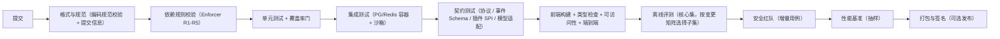

# 卷 27 · 技术路径与实施蓝图（Technical Path & Implementation Blueprint）

> 本卷把前 26 卷的设计**翻译成工程落地路径**：仓库与模块结构、依赖与构建顺序、设计到代码的映射、数据迁移批次、关键机制实现序列、CI 门禁、开发环境、以及与既有 v1 代码的迁移策略。
>
> 定位：这是「设计 → 实现」的桥。它不新增业务设计，只定义**怎么把它建起来、按什么顺序建、每步如何验收**。

---

## 1. 本卷定位

- **解决**：从哪开始写代码、模块怎么分、依赖怎么排、数据怎么迁、CI 怎么卡、v1 代码怎么处理。
- **不解决**：功能与机制设计（卷 00–26）。
- **边界**：本卷只约束**工程结构与顺序**；任何与本卷冲突的模块划分视为工程缺陷。

## 2. 工程约束（来自既有环境与决策）

| 来源 | 约束 |
| --- | --- |
| H-003 | 内核零框架依赖；Spring 仅在外壳与平台层 |
| H-004 | 五形态同源，装配期能力驱动 |
| H-015 | 前端 Electron + Vue + TS 独立工程 |
| D-ARC-4 | Java 21（虚拟线程、结构化并发） |
| 既有仓库习惯 | Maven 多模块、独立前端工程、`.env`（模板入库、实际不入库）、先文档后代码 |
| 既有规范 | `.qoder/rules/*` 五条编码规范在实现期强制（注释/配置/常量/异常/日志） |
| 团队规模假设 | 2–8 人并行开发，模块边界需支持并行不冲突 |

## 3. 设计空间（M×N）

### D-PATH-1 仓库组织

| 分支 | 描述 | 结论 |
| --- | --- | --- |
| B1 单仓单模块 | 简单；边界消失、并行冲突 | 淘汰 |
| **B2 单仓多模块（后端 Maven 多模块 + 前端独立 pnpm 工程）** | 边界清晰、构建增量、并行友好 | **选定**（F=8 U=7 S=9 M=9 → 84） |
| B3 多仓（按模块拆库） | 隔离强；跨仓改造成本高 | 备选（团队 > 20 人时评估） |

### D-PATH-2 后端模块粒度

| 分支 | 描述 | 结论 |
| --- | --- | --- |
| B1 按技术层拆（api/service/model） | 传统；域边界消失 | 淘汰 |
| B2 内核单模块（所有域塞一起） | 简单；编译期边界弱 | 淘汰 |
| **B3 四段式：`harness-contract`（纯契约）→ `harness-kernel`（域运行时）→ `harness-platform`（适配器）→ `harness-host`（应用/协议/端）** | 契约稳定、内核可单测、适配器可替换、外壳可多形态 | **选定**（F=9 U=8 S=9 M=9 → 88） |

### D-PATH-3 契约与 SDK

| 分支 | 描述 | 结论 |
| --- | --- | --- |
| B1 手写 Java + TS 两份 | 易漂移 | 淘汰 |
| **B2 单一来源（契约定义）→ 生成 Java/TS 类型与客户端 + 手写语义部分** | 一致且高效 | **选定**（F=9 U=8 S=8 M=9 → 85.5） |
| B3 仅 Java（前端手写） | 前端易漂移 | 淘汰 |

### D-PATH-4 构建与依赖管理

| 分支 | 描述 | 结论 |
| --- | --- | --- |
| **B1 Maven（Enforcer 校验依赖规则 + 版本 BOM）** | 与既有习惯一致；企业友好；依赖检查插件成熟 | **选定**（F=8 U=8 S=9 M=9 → 85） |
| B2 Gradle | 构建灵活；团队熟悉度与既有仓不一致 | 备选 |

### D-PATH-5 前端工程组织

| 分支 | 描述 | 结论 |
| --- | --- | --- |
| B1 单体 SPA | 简单；SDK 无法复用给 IDE 插件 | 淘汰 |
| **B2 pnpm workspace 三包：`app`（Electron 主/渲染）、`ui`（组件与主题）、`sdk`（协议客户端，IDE 插件复用）** | 复用与边界 | **选定**（F=8 U=8 S=8 M=8 → 80） |
| B3 微前端 | 过度设计 | 淘汰 |

### D-PATH-6 CI 与门禁

| 分支 | 描述 | 结论 |
| --- | --- | --- |
| B1 平台绑定（仅某 CI） | 迁移成本 | 淘汰 |
| **B2 平台无关脚本（`./scripts/ci/*.sh`）+ 任意 CI 调用；本地可跑同一套门禁** | 可移植、本地可复现 | **选定**（F=8 U=8 S=9 M=9 → 85） |

### D-PATH-7 与 v1 代码的关系

| 分支 | 描述 | 结论 |
| --- | --- | --- |
| B1 全部重写（丢弃 v1） | 干净；浪费可复用资产 | 淘汰 |
| B2 增量改造（在 v1 上改） | 快；但 v1 契约与目标态冲突，改造面大 | 淘汰 |
| **B3 契约先行 + 逐域替换（strangler）：新建目标模块与契约，v1 中语义保留的域按映射迁移（代码裁剪入新结构），其余废弃** | 复用精华、避免负资产 | **选定**（F=9 U=7 S=8 M=9 → 83.5） |

### D-PATH-8 交付节奏

| 分支 | 描述 | 结论 |
| --- | --- | --- |
| B1 大爆炸（全部做完再演示） | 风险极高 | 淘汰 |
| **B2 垂直切片：每 2 周一个端到端可演示切片（内核→协议→CLI→桌面）** | 早期反馈、风险前置 | **选定**（F=9 U=9 S=8 M=8 → 85.5） |

## 4. 选定方案详设

### 4.1 仓库结构

> 模块清单权威版本见 `impl/00-contracts/MODULE-MANIFEST.md`（坐标、聚合器、扩展模块登记、v1 并存规则均以该文件为准）。

```text
OpenCoding/
  pom.xml                       # 聚合 POM（BOM + 依赖规则）
  harness-contract/             # 纯契约：接口/枚举/record/事件 Schema/错误码（零依赖）
    src/main/java/.../contract/...
    src/main/resources/schema/  # 事件 Schema、协议定义（生成 SDK 的来源）
  harness-kernel/               # 域运行时（零框架、零 IO 实现）
    kernel-model/               # 卷 02 模型网关
    kernel-context/             # 卷 03 上下文引擎
    kernel-prompt/              # 卷 04 提示词资产
    kernel-tool/                # 卷 05 工具运行时
    kernel-permission/          # 卷 06 权限决策链
    kernel-agent/               # 卷 12 Agent 运行时（含 SubAgent）
    kernel-work/                # 卷 14/15 工作对象与自治循环
    kernel-event/               # 卷 16 事件模型（不含存储实现）
  harness-platform/             # 适配器与服务（Spring 允许）
    platform-persistence/       # 卷 19 仓储/迁移/备份
    platform-runtime-store/     # Redis 与进程内降级
    platform-workspace/         # 卷 20 四类工作区
    platform-sandbox/           # 卷 07 五档隔离
    platform-vcs/               # 卷 21 Git 与 worktree
    platform-knowledge/         # 卷 11 索引与检索
    platform-memory/            # 卷 10 记忆存储
    platform-enterprise/        # 卷 24 租户/审计/配额/DLP
    platform-plugin/            # 卷 18 插件装载与沙箱
    platform-mcp/               # 卷 09 MCP 子系统
    platform-skill/             # 卷 08 技能装载与分发
    platform-hooks/             # 卷 17 钩子执行
  harness-host/                 # 外壳装配与端
    host-app/                   # 应用服务（用例编排）
    host-protocol/              # 卷 01 协议面（JSON-RPC/REST/SSE）+ SDK 生成
    host-cli/                   # 卷 22 CLI/TUI
    host-server/                # 服务形态入口（Spring Boot 应用）
    host-a2a/                   # 卷 23 服务面与客户端
    host-bootstrap/             # 装配计划与启动入口
  client/                       # 前端 pnpm workspace（卷 22）
    packages/app/               # Electron 主进程 + 渲染进程
    packages/ui/                # 组件库、主题、可访问性
    packages/sdk/               # 协议客户端（由契约生成 + 手写封装）
  docs/
    harness/                    # 本套设计（契约，先改文档后改代码）
    design/                     # v1 冻结契约（迁移对照）
  scripts/ci/                   # 平台无关门禁脚本
  tools/                        # 开发工具（假模型、种子数据、契约生成）
```

### 4.2 模块依赖与构建顺序



**构建顺序**（Maven reactor 自动推导，但门禁按此顺序执行）：
`contract → kernel-* → platform-* → host-* → SDK 生成 → 前端构建 → 端到端测试`

**依赖规则（Enforcer 强制）**：

| 规则 | 说明 |
| --- | --- |
| R1 | `harness-kernel` 不得依赖 Spring/Jackson/JDBC/Redis/HTTP 客户端/`harness-platform` |
| R2 | `harness-platform` 不得依赖 `harness-host` |
| R3 | `client/*` 只能经 SDK 调用，不得直连存储 |
| R4 | 任何模块不得依赖 `harness-design`（v1）包路径 |
| R5 | 禁止循环依赖与 `*` 版本范围（版本由 BOM 锁定） |

### 4.3 设计 → 代码映射（按卷）

| 卷 | 落点模块 | 首要产出物 |
| --- | --- | --- |
| 01 架构 | `harness-contract`（协议与端口）+ `host-bootstrap`（装配） | 端口接口、装配计划、能力探测 |
| 02 模型 | `kernel-model` + `platform-*`（凭证/限流适配） | Provider 契约、四协议适配器、装饰器链 |
| 03 上下文 | `kernel-context` | 九区段模型、压缩管线、token 估算器 |
| 04 提示词 | `kernel-prompt` | 资产模型、组装流水线、版本库 |
| 05 工具 | `kernel-tool` | ToolSpec 三通道、执行管线、内置工具族 |
| 06 权限 | `kernel-permission` | 动作网关、决策链、审批编排 |
| 07 沙箱 | `platform-sandbox` | 五档隔离实现与策略 |
| 08 技能 | `platform-skill` | 装载、激活、评测挂钩 |
| 09 MCP | `platform-mcp` | 传输、能力映射、生命周期 |
| 10 记忆 | `platform-memory` + `kernel-*`（召回模型） | 四层存储、写入候选、召回管线 |
| 11 知识 | `platform-knowledge` | 连接器、切分、三路检索、引用 |
| 12 Agent | `kernel-agent` | 主循环、SubAgent、验证、轨迹 |
| 13 Teams | `kernel-agent`（编排队列）+ `host-app`（编排服务） | 团队模型、拓扑、黑板与消息 |
| 14 任务 | `kernel-work` | WorkItem、状态机、DAG、证据 |
| 15 Goal/Schedule | `kernel-work` + `host-server`（调度器） | 自治循环、触发器、熔断 |
| 16 事件 | `kernel-event` + `platform-persistence` | 信封、总线、投影、回放 |
| 17 Hooks | `platform-hooks` | 钩子点、四形态执行、熔断 |
| 18 插件 | `platform-plugin` + `harness-contract`（SPI） | 扩展点目录、装载器、权限门面、SDK |
| 19 持久化 | `platform-persistence` | 迁移框架、仓储、备份恢复、导出包 |
| 20 工作区 | `platform-workspace` | 四后端、连接池、快照 |
| 21 Git | `platform-vcs` | worktree、合并队列、护栏 |
| 22 端 | `host-cli` + `client/*` | TUI、桌面端、SDK |
| 23 A2A | `host-a2a` | 服务面、客户端、联邦目录 |
| 24 企业 | `platform-enterprise` | 租户、审计、配额、DLP、诊断 |
| 25 前沿 | 各模块的 `experimental` 包 + 开关 | 实验实现（独立命名空间） |
| 26 质量 | `scripts/ci/*` + `tools/eval` | 门禁脚本、评测运行器 |

### 4.4 数据迁移与落地批次

| 批次 | 内容 | 依赖 | 验收 |
| --- | --- | --- | --- |
| B1 | 租户/身份/项目/工作区/会话基础表 + 事件日志分区表 | 契约冻结 | 空库迁移 + 样本迁移通过 |
| B2 | 模型调用/用量/凭证引用 + 工具调用/结果 | B1 | 计量聚合正确（对账 ≤ 0.5%） |
| B3 | 权限（策略/决策/审批/记忆）+ 审计 | B1 | 决策回放一致 |
| B4 | 工作对象（WorkItem/依赖/证据）+ 团队 + 调度记录 | B1 | 事件重建状态一致 |
| B5 | 记忆/知识（源/文档/块/边/知识页）+ 索引元数据 | B1 | 检索质量基线达标 |
| B6 | 插件/Skill/Hook/MCP + 企业（配额/预算/特性开关） | B1–B5 | 插件装载与门禁通过 |

**规则**：每批次独立可回滚（expand-contract）；批次之间不阻塞开发（接口先行，存储后置）。

### 4.5 关键机制实现顺序（20 步）

| # | 机制 | 依赖 | 为什么这个顺序 |
| --- | --- | --- | --- |
| 1 | 契约模块骨架 + 依赖规则 Enforcer | — | 先立边界，后续不返工 |
| 2 | 事件信封 + 写入端口 + 内存实现 | 1 | 一切状态变更的事实源 |
| 3 | 模型网关（先 1 个协议）+ 假模型工具 | 2 | 可跑通最小循环 |
| 4 | 工具运行时（read/edit/command 三工具） | 2,3 | 最小工具闭环 |
| 5 | Agent 主循环（单策略）+ 检查点 | 2,3,4 | 可完成真实任务 |
| 6 | 上下文引擎（预算 + 裁剪，压缩后置） | 5 | 长会话可用 |
| 7 | 权限决策链（风险映射 + ASK）+ 审批（CLI） | 4 | 安全边界到位 |
| 8 | 协议面（JSON-RPC）+ CLI 基础 | 5,6,7 | 端到端可演示 |
| 9 | 持久化（PG 仓储 + 迁移框架 + 事件表） | 2 | 可恢复、可审计 |
| 10 | 上下文压缩四级 + 引用外置 | 6,9 | 长任务质量 |
| 11 | 沙箱（L0+，路径/网络围栏） | 4 | 执行安全 |
| 12 | 工作区（Local + SSH；容器后置） | 4,11 | 远程可用 |
| 13 | Git + worktree + 合并队列 | 12 | 改动可交付 |
| 14 | 任务/计划模型 + 规格文件 | 5,9 | 结构化工作 |
| 15 | 桌面端（会话 + 审批 + diff + 成本面板） | 8 | 双端体验 |
| 16 | 记忆（项目级 + 文件化）与知识库（代码索引） | 6,9 | 长期上下文 |
| 17 | Skill（装载 + 激活 + 用例）与 MCP（client） | 4,14 | 扩展能力 |
| 18 | 插件体系（扩展点目录 + 装载 + 门面 SDK） | 17 | 生态基础 |
| 19 | Teams + Goal + Schedule（自治与编排） | 14,16,18 | 高阶自治 |
| 20 | 企业（多租户/SSO/审计/配额/DLP）+ A2A + 发布流水线 | 9,15,19 | 规模化交付 |

### 4.6 CI 流水线与门禁



**本地可复现**：`./scripts/ci/all.sh` 在本地跑与 CI 相同的门禁集合（差异仅在于是否发布产物）。

### 4.7 开发环境

| 项 | 方案 |
| --- | --- |
| 依赖服务 | 容器编排：PG + Redis +（可选）对象存储 +（可选）容器运行时；无容器时支持本地 PG/Redis |
| 假模型 | `tools/fake-llm`：可编程响应（固定/流式/工具调用/错误注入），供离线测试与评测 |
| 种子数据 | `tools/seed`：示例租户/项目/仓库/任务/知识源 |
| 契约生成 | `./scripts/gen-sdk.sh`：由契约生成 Java/TS 类型与客户端（CI 校验生成物一致） |
| 前端 | pnpm workspace；`pnpm dev` 启动 Electron + 热重载；Vitest/Playwright |
| 一键启动 | `./scripts/dev/up.sh`（依赖 + 服务 + 前端） |
| 调试 | 内核支持内嵌启动（CLI `--embedded`）；桌面端可连接外部内核（便于断点） |

### 4.8 与 v1 代码的迁移映射

| v1 模块 | 目标落点 | 策略 |
| --- | --- | --- |
| `open-coding-common`（枚举/工具） | `harness-contract` | 保留语义，重写为契约与枚举（去 Spring） |
| `open-coding-core/open-coding-core-api` | `harness-contract` + `kernel-*` | 契约保留、按域拆分；工具契约按卷 05 重写三通道 |
| `open-coding-core/open-coding-core-model`（四协议适配） | `kernel-model` + `platform-*` | 适配器实现保留（裁剪依赖），协议差异按卷 02 补齐（能力矩阵/装饰器链） |
| `open-coding-core/open-coding-core-agent` | `kernel-agent` | 循环重写（Thread/Turn/Item + 阶段化），保留可用的重试/压缩思路 |
| `open-coding-core/open-coding-core-tool` | `kernel-tool` + `platform-*` | 内置工具迁移到统一管线；命令执行移入工作区/沙箱层 |
| `open-coding-core/open-coding-core-implementation` | `host-bootstrap`（装配） | 由显式装配计划替代（D-ARC-9） |
| `open-coding-domain`（实体/Mapper/Flyway） | `platform-persistence` | 表族重构（附录 A.6）、迁移脚本重排为批次 B1–B6 |
| `open-coding-infrastructure` | `platform-*`（拆分为多适配器） | 按域拆分（缓存/文件/媒体/加密） |
| `open-coding-application` | `host-app` | 用例编排保留思路，接口对齐会话协议 |
| `open-coding-interfaces` | `host-protocol` + `host-server` | REST/WS 面按卷 01 分层（管理面/会话面） |
| `open-coding-bootstrap` | `host-bootstrap` | 装配计划 + 能力门控 |
| `open-coding-plugin` | `platform-plugin` + SDK | 扩展点目录化（卷 18） |
| `open-coding-client` | `client/app` | 重写为工作台信息架构（卷 22） |
| `docs/design/*`（v1 契约） | 对照保留 | 迁移期参考；实现完成后归档为历史 |

**迁移纪律**：先建目标契约（`harness-contract`）→ 迁移一个域 → 该域端到端测试通过 → 删除 v1 对应实现（避免双实现长期共存）。

### 4.8.1 v1 → v2 迁移执行手册（逐模块）

| 阶段 | 动作 | 产出 | 退出条件 |
| --- | --- | --- | --- |
| S0 契约冻结 | 建立 `harness-contract` 模块与依赖规则；定义端口 | 契约模块可编译 + Enforcer 生效 | 依赖规则 R1–R5 在 CI 强制 |
| S1 并行运行 | v1 与 v2 并存：v2 通过**适配层**读取 v1 数据（只读） | 适配层（v1 表 → v2 仓储端口） | 关键读路径在 v2 可用 |
| S2 双写期 | v2 写入新表族，同时按需回写 v1 表（兼容旧客户端）；双写由**同一事务内的写入器**保证 | 双写开关（按表族独立开） | 双写一致性校验连续 7 天无偏差 |
| S3 切读 | 读路径切到 v2；v1 仅保留回写 | 切读记录（含回滚命令） | 读延迟与错误率不劣化 |
| S4 停写 | 关闭 v1 回写；v1 表转为只读归档 | 归档快照 + 校验和 | 旧客户端完全下线（版本门槛生效） |
| S5 清理 | 删除 v1 代码与表（保留 git 历史与归档） | 清理提交 + 归档说明 | 依赖检查确认无引用 |

**数据映射要点（v1 → v2）**：

| v1 数据 | v2 落点 | 处理 |
| --- | --- | --- |
| v1 会话/消息（`oc_*` 早期结构） | 事件日志 + 会话投影 | 以「导入事件」形式重放生成（保证事件为源）；不直接搬表 |
| v1 工具调用/结果 | `oc_tool_call` / `oc_tool_result` | 直接搬迁 + 补齐租户与分区键；补幂等键（缺失者标记 `legacy`） |
| v1 模型调用与用量 | `oc_usage_record`（按新归因维度） | 搬迁 + 按模型目录重算成本（历史成本标记为估算） |
| v1 权限模式与会话状态 | 权限决策/授权记忆 | 模式映射到六档（卷 06 D-PERM-9）；无法映射的规则转「待人工确认」清单 |
| v1 媒体文件 | 内容寻址存储 | 计算哈希去重后入库；路径改为引用 |
| v1 配置（yml/env） | 新配置命名空间 | 迁移脚本 + 环境变量模板同步（`.env.example`） |

**硬性规则**：① 迁移期间不得双实现同一业务逻辑（适配层只做数据形态转换）；② 每个阶段必须有可执行回滚（`oc migrate rollback --to=Sx`）；③ 数据搬迁必须可断点续跑（幂等键）；④ 每阶段结束产出「阶段报告」（数据量、偏差、性能、遗留项）。

### 4.9 工程规范（强制）

| 项 | 规则 |
| --- | --- |
| 编码规范 | 沿用 `.qoder/rules/*` 五条（注释/配置/常量/异常/日志），实现期逐模块核对 |
| 提交信息 | Conventional Commits + 中文描述；关联任务 ID 与设计章节 |
| 分支策略 | 主干开发 + 短生命周期特性分支（`feat/<task-id>-<slug>`）；保护主分支 |
| 评审门禁 | 每 PR 必须：依赖规则通过 + 测试通过 + 门禁通过 + 至少 1 人评审；涉及安全/迁移的变更需领域负责人评审 |
| 文档同步 | 代码变更涉及契约面时**先改本套文档**（README §7-1） |
| 生成物 | SDK 与 Schema 生成物入库并在 CI 校验一致性（防止漂移） |

## 5. 可观测（工程效能）

| 指标 | 目标 |
| --- | --- |
| 本地全量构建 | ≤ 3 分钟（增量 ≤ 30s） |
| CI 全门禁（不含评测全集） | ≤ 15 分钟 |
| 单元测试套件 | ≤ 2 分钟 |
| 契约测试 | ≤ 5 分钟 |
| 端到端 12 旅程 | ≤ 20 分钟 |
| 覆盖率（核心域） | ≥ 80% 行 / ≥ 70% 分支 |
| 主分支红时长 | ≤ 1 小时（告警 + 优先修复） |

## 6. 非功能设计

- **可复现构建**：锁定依赖版本（BOM + lock 文件）、固定 JDK/Node 版本（`.tool-versions` 风格声明）、容器化 CI 环境。
- **构建缓存**：Maven 本地仓库缓存 + 前端 pnpm store；CI 层缓存构建产物。
- **并行开发**：模块边界支持并行；契约冻结前不得并行实现同域；跨域变更走接口先行 + 桩实现。
- **降级开发**：无容器环境可开发（本地 PG/Redis + L0 沙箱 + 假模型）。

## 7. 完成定义（DoD）

- [ ] 四段式模块结构建立，Enforcer 规则 R1–R5 在构建中强制（违规构建立即失败）。
- [ ] 契约模块 + 生成 SDK 流程可用（Java/TS 生成物一致，CI 校验）。
- [ ] 假模型与种子数据可用，离线可跑通「读 → 改 → 跑测试 → 提交」最小旅程。
- [ ] CI 门禁脚本可本地复现（`scripts/ci/all.sh`）。
- [ ] 数据迁移 B1 批次（含事件分区表）落地并通过空库/样本测试。
- [ ] 关键机制 20 步中第 1–9 步完成（内核闭环可演示）。
- [ ] v1 迁移映射表逐项处理（迁移/重写/废弃各有结论与提交记录）。
- [ ] 工程效能指标达标（构建/测试时长、覆盖率）。
- [ ] 生成物一致性校验在 CI 中阻断漂移。

## 8. 域内决策汇总（D-PATH）

| ID | 主题 | 选定 |
| --- | --- | --- |
| D-PATH-1 | 仓库组织 | 单仓多模块 + 前后端双工程 |
| D-PATH-2 | 模块粒度 | 四段式（contract/kernel/platform/host） |
| D-PATH-3 | 契约 SDK | 单一来源生成（Java/TS） |
| D-PATH-4 | 构建工具 | Maven + BOM + Enforcer |
| D-PATH-5 | 前端工程 | pnpm workspace（app/ui/sdk） |
| D-PATH-6 | CI 门禁 | 平台无关脚本 + 本地同源 |
| D-PATH-7 | v1 迁移 | 契约先行 + 逐域替换（strangler） |
| D-PATH-8 | 交付节奏 | 垂直切片（2 周可演示） |

## 9. 开放问题与默认决策

| 项 | 默认决策 |
| --- | --- |
| 是否保留 v1 的 `open-coding-*` 目录名 | 默认新建 `harness-*` 目录，v1 目录在迁移完成后删除（保留 git 历史） |
| 前端构建工具 | Vite（Electron 侧用 electron-vite 或等价方案） |
| 依赖规则实现 | Maven Enforcer + 自定义规则（或 ArchUnit 测试作为补充） |
| 假模型实现语言 | Java（与内核同进程）+ 可选独立进程（用于协议测试） |
| 评测运行器位置 | `tools/eval`（独立 CLI，消费轨迹导出格式） |
| 首个垂直切片范围 | 会话 → 读文件 → 编辑 → 跑测试 → 提交（CLI 端） |
