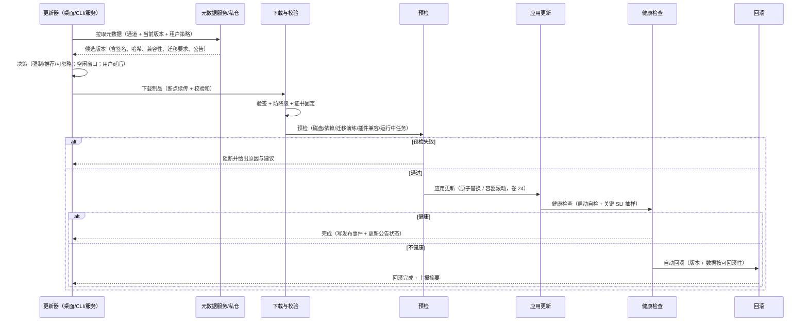

# 卷 28 · 更新、分发与遥测（Distribution / Update / Telemetry / License）

> 一个装到用户机器上的产品，必须能**安全地升级、可证明地回滚、可控地上报、可合规地授权**。本卷定义版本与通道、更新交付与校验、回滚、离线/内网分发、遥测与崩溃上报、诊断包、许可与席位、通知聚合、沙箱镜像分发、公告与迁移引导。
>
> 来源：迭代轮次 2「组件缺失扫描」；需求 ID 见卷 00 §5.27（D27 更新与分发、D28 遥测与诊断上报）。

---

## 1. 本卷定位

- **解决**：升级与分发（含离线内网）、遥测与隐私边界、许可与席位、通知聚合、镜像与公告。
- **不解决**：部署拓扑与灰度（卷 24 D-ENT-8）、崩溃后的会话恢复（卷 19）、崩溃时的诊断信息内容（卷 24 §4.9）。
- **边界**：本卷是**交付与运营面**：不改变任何业务域的语义；所有对外行为（检查更新、上报）默认最小化且可关闭。

## 2. 需求与冲突点

| 需求 | 冲突/要点 |
| --- | --- |
| 自动更新 | 便利 vs 中断风险（升级中正在跑任务）→ 更新必须「空闲窗口 + 可延后 + 可回滚」 |
| 离线/内网 | 无外网仍要能升级与分发 → 介质包 + 私仓 |
| 遥测 | 产品改进 vs 隐私与合规 → 默认关、分级、脱敏、企业可强制/可禁 |
| 崩溃上报 | 定位效率 vs 数据外泄 → 本地转储 + 按需上传 + 白名单 |
| 许可与席位 | 商业约束 vs 离线可用 → 离线宽限期 + 在线校验可选 |
| 通知 | 知情 vs 打扰 → 聚合、去重、静默时段、优先级路由（卷 15 复用） |

## 3. 设计空间（M×N）

### D-DIST-1 版本与通道模型

| 分支 | 描述 | 结论 |
| --- | --- | --- |
| B1 单通道（latest） | 简单；稳定性风险 | 淘汰 |
| **B2 三通道 + 兼容矩阵：`stable` / `beta` / `nightly`；每个构件（内核/CLI/桌面/插件 SDK）独立语义化版本 + 兼容区间；企业可锁定主版本并只收补丁** | 覆盖个人尝鲜与企业稳健 | **选定**（F=9 U=8 S=9 M=9 → 88） |
| B3 每用户自定义通道（过于灵活） | 支持组合爆炸 | 淘汰 |

### D-DIST-2 更新交付方式

| 分支 | 描述 | 结论 |
| --- | --- | --- |
| B1 手动下载安装 | 简单；版本碎片 | 基线（离线形态） |
| **B2 内置更新器（应用内检查/下载/应用）+ 包管理器（winget/brew/apt 等）可选 + 企业私仓（内网分发）** | 覆盖三形态 | **选定**（F=9 U=9 S=8 M=9 → 88） |
| B3 仅包管理器 | 桌面端体验差 | 淘汰 |

### D-DIST-3 更新安全

| 分支 | 描述 | 结论 |
| --- | --- | --- |
| B1 仅下载 HTTPS | 不足以防供应链攻击 | 淘汰 |
| **B2 签名元数据 + 制品哈希 + 防降级（anti-rollback）+ 通道绑定 + 证书固定；企业可要求「仅私仓签名」** | 供应链安全基线 | **选定**（F=9 U=7 S=9 M=9 → 86.5） |
| B3 完整 TUF 式框架（多角色密钥、快照/时间戳角色） | 最强；实现成本高 | 备选（企业版可升级到 B3，接口不变） |

### D-DIST-4 回滚策略

| 分支 | 描述 | 结论 |
| --- | --- | --- |
| B1 不回滚 | 升级事故无法恢复 | 淘汰 |
| **B2 保留前 N 版本（默认 2）+ 一键回滚 + 回滚前自动数据快照（涉及迁移时按卷 19 可回滚性判定）+ 健康检查失败自动回滚** | 可恢复 | **选定**（F=9 U=8 S=9 M=9 → 88） |

### D-DIST-5 离线与内网分发

| 分支 | 描述 | 结论 |
| --- | --- | --- |
| B1 仅在线 | 内网不可用 | 淘汰 |
| **B2 介质包（全量 + 增量）+ 私仓镜像（同步官方元数据）+ 离线激活与离线许可宽限** | 内网/涉密可交付 | **选定**（F=9 U=8 S=8 M=9 → 85.5） |

### D-DIST-6 遥测范围与默认

| 分支 | 描述 | 结论 |
| --- | --- | --- |
| B1 默认开启全量 | 隐私风险，企业拒绝 | 淘汰 |
| **B2 默认关闭 + 分级同意：L1 匿名使用统计（功能计数）、L2 性能采样（延迟分布）、L3 崩溃与错误上报；逐级独立开关；企业可强制（L1/L3 可开、L2 可关）或全禁；所有载荷脱敏并可在本地预览** | 隐私优先、合规可配 | **选定**（F=8 U=8 S=8 M=9 → 82.5） |

### D-DIST-7 崩溃与错误上报

| 分支 | 描述 | 结论 |
| --- | --- | --- |
| B1 不收集 | 定位困难 | 淘汰 |
| **B2 本地转储（默认保留 N 天）+ 摘要自动上报（无载荷）+ 完整转储需用户确认上传（可勾选「总是允许」）+ 脱敏白名单过滤** | 平衡 | **选定**（F=8 U=8 S=9 M=8 → 82.5） |

### D-DIST-8 诊断包上传

| 分支 | 描述 | 结论 |
| --- | --- | --- |
| B1 仅本地导出 | 支持效率低 | 基线 |
| **B2 本地导出（默认）+ 可选上传到支持通道（脱敏预览 + 一次性链接 + 过期自动删除）+ 企业可指定内部接收端点** | 支持效率与合规 | **选定**（F=8 U=8 S=8 M=9 → 82.5） |

### D-DIST-9 许可与席位

| 分支 | 描述 | 结论 |
| --- | --- | --- |
| B1 无许可（纯开源） | 无法支撑商业版 | 基线（社区版） |
| **B2 混合：社区版无许可能力门控；企业版在线校验 + 离线许可文件（含宽限期，默认 30 天）+ 席位绑定（按活跃用户）+ 计量上报（用量对账）** | 商业可用且不阻塞离线 | **选定**（F=8 U=8 S=8 M=9 → 82.5） |

### D-DIST-10 通知投递与聚合

| 分支 | 描述 | 结论 |
| --- | --- | --- |
| B1 直推（每条即发） | 打扰 | 淘汰 |
| **B2 聚合中心：按（事件类型 × 对象）聚合、去重、优先级路由（即时/摘要/静默）、静默时段、多通道（桌面/邮件/IM/Webhook）；用户可订阅粒度** | 可治理 | **选定**（F=8 U=9 S=8 M=9 → 84） |

### D-DIST-11 沙箱镜像分发

| 分支 | 描述 | 结论 |
| --- | --- | --- |
| B1 运行时拉取公网镜像 | 内网不可用、供应链风险 | 淘汰 |
| **B2 预置镜像清单（内置基础镜像 + 预热）+ 私有 registry 优先 + 签名校验 + 本地缓存与清理 + 离线介质携带镜像** | 可用且安全 | **选定**（F=9 U=8 S=8 M=9 → 85.5） |

### D-DIST-12 公告与迁移引导

| 分支 | 描述 | 结论 |
| --- | --- | --- |
| B1 无公告 | 用户不知变更 | 淘汰 |
| **B2 公告系统：目标人群（全部/租户/通道）+ 级别（信息/重要/强制）+ 载体（应用内横幅、发布说明、CLI 启动提示）+ 迁移引导（破坏性变更给一键迁移命令与文档）+ 强制门槛（低于最低兼容版本拒绝连接服务端）** | 平滑演进 | **选定**（F=8 U=9 S=8 M=9 → 84） |

## 4. 选定方案详设

### 4.1 版本与兼容矩阵

| 构件 | 版本策略 | 兼容要求 |
| --- | --- | --- |
| 内核（Kernel） | 语义化 | 与协议面共享主版本；插件 SPI 兼容 ≥ 2 小版本（卷 18） |
| 协议面（Session/REST/A2A） | 独立版本 | 连接期能力协商（附录 B.8） |
| CLI / 桌面端 | 独立版本 | 与内核协议兼容区间声明；低版本客户端可连高版本内核（仅用交集能力） |
| 插件 SDK | 独立版本 | 与内核兼容矩阵；SDK 发布物含兼容声明 |
| 事件 Schema | 只追加 | 永久向后兼容（卷 16） |
| 数据 Schema | 迁移脚本版本 | expand-contract + 可回滚性判定（卷 19） |

### 4.2 更新流程

**更新时机规则**：默认「空闲窗口」（无运行中任务/会话）+ 允许延后（最多 N 天，安全补丁除外）；企业可设维护窗口与强制升级门槛。

### 4.3 更新元数据（清单摘要）

| 字段 | 说明 |
| --- | --- |
| `version` / `channel` / `platform` | 定位 |
| `artifacts[]` | 制品（哈希、大小、URL、签名） |
| `compatibility` | 内核/协议/数据兼容区间 |
| `migration` | 是否含数据迁移、可回滚性、预估耗时 |
| `plugins` | 插件兼容提示（受影响插件清单） |
| `announcement` | 关联公告 ID 与级别 |
| `signature` / `signedAt` / `expiresAt` | 签名与有效期（防重放） |
| `minVersion` | 允许升级的最低版本（跨大版本需先升中间版本） |

### 4.4 遥测分级与载荷

| 级别 | 内容 | 默认 | 说明 |
| --- | --- | --- | --- |
| L1 使用统计 | 功能计数、命令使用频次、模式使用、错误码计数（不含内容） | 关 | 匿名 ID（可轮换）；企业可强制 |
| L2 性能采样 | 延迟分布、token 用量分布、工具耗时分布（不含内容） | 关 | 采样率可配（默认 10%） |
| L3 崩溃与错误 | 崩溃摘要、堆栈（脱敏）、错误分类 | 关（摘要可配为默认开） | 完整转储需确认 |
| 禁止项 | 代码内容、提示词正文、文件路径原文（可哈希）、密钥、用户标识明文 | — | 硬约束（扫描校验） |

**本地可预览**：设置页可查看「将上报的最近 N 条」并支持一键清除（卷 33 交互细则）。

### 4.5 崩溃上报管线

### 4.6 许可与席位

| 项 | 设计 |
| --- | --- |
| 社区版 | 无许可校验；企业能力门控关闭（卷 24 D-PROD-4） |
| 企业版在线 | 许可服务校验（签名许可 + 席位上限 + 到期时间）；短周期续期（默认 7 天）；失败宽限 30 天 |
| 企业版离线 | 许可文件（含签名、席位、到期、设备绑定可选）；宽限期默认 30 天，超期只读（可读不可写、可导出） |
| 席位 | 绑定「活跃用户」（30 天内有活动），超出上限时新激活被拒并提示（不中断既有会话） |
| 计量对账 | 用量事件定期汇总上报（可关）；与在线账单对账（卷 24 §4.4） |
| 降级行为 | 许可失效 → 只读 + 导出可用 + 明确提示（不静默锁定） |

### 4.7 通知聚合器

| 维度 | 设计 |
| --- | --- |
| 聚合键 | `(事件类型, 对象ID)`（如同一任务的多次进度合并为一条） |
| 去重窗口 | 默认 5 分钟（可配） |
| 优先级 | P0 即时（需人工介入/失败/安全）、P1 摘要（完成/汇报）、P2 静默（统计类） |
| 路由 | 桌面通知 / 邮件 / IM 机器人 / Webhook（按优先级与用户订阅） |
| 静默时段 | 用户可设（P0 可穿透，可配置） |
| 订阅粒度 | 按事件类型 × 项目/团队 × 优先级 |
| 幂等 | 通知 ID 幂等（防重复投递）；投递失败重试（上限 + 死信） |

### 4.8 公告与强制门槛

| 类型 | 载体 | 行为 |
| --- | --- | --- |
| 信息 | 应用内横幅 / 发布说明 | 可关闭 |
| 重要 | 应用内 + 邮件/IM | 需确认已读（记录） |
| 强制 | 阻断式（低于最低兼容版本） | 拒绝连接服务端 / 拒绝启动自治任务，给出升级路径 |
| 迁移引导 | 公告内嵌命令/文档链接 | 一键执行迁移（`oc upgrade --migrate`），失败可回滚 |

## 5. 扩展点（供卷 18 汇总）

| 扩展点 | 说明 |
| --- | --- |
| `UpdateSourceSPI` | 更新来源（官方/私仓/介质包） |
| `UpdateChannelPolicySPI` | 通道与升级策略（企业） |
| `TelemetrySinkSPI` | 遥测接收端（自建收集） |
| `CrashSinkSPI` | 崩溃接收端（企业自建） |
| `LicenseProviderSPI` | 许可来源（在线/离线/自研） |
| `ImageRegistrySPI` | 沙箱镜像仓库 |
| `AnnouncementSourceSPI` | 公告来源 |
| `NotificationChannelSPI` | 通知通道（与卷 15/24 共用） |

## 6. 事件与可观测

| 事件 | 说明 |
| --- | --- |
| `update.check.completed` / `update.available` | 检查结果 |
| `update.download.started` / `completed` / `failed` | 下载 |
| `update.applied` / `update.rolled_back` | 应用与回滚（含原因） |
| `update.blocked` | 预检阻断（含原因） |
| `telemetry.consent.changed` | 遥测同意变更（审计） |
| `telemetry.exported` / `crash.captured` / `crash.uploaded` | 遥测与崩溃 |
| `license.state.changed` / `license.grace.started` / `license.expired` | 许可 |
| `notification.aggregated` / `notification.delivered` / `notification.failed` | 通知 |
| `image.pulled` / `image.verified` / `image.purged` | 镜像 |

**指标**：`oc_update_success_ratio{channel}`、`oc_update_rollback_total`、`oc_update_check_latency_ms`、`oc_telemetry_upload_total{level}`、`oc_crash_fingerprint_top`、`oc_license_seats_used`、`oc_notification_delivery_latency_ms{channel}`、`oc_image_cache_bytes`。

## 7. 非功能设计

- **性能**：检查更新 ≤ 1s（缓存 + 条件请求）；增量包优先（差分下载，体积目标 ≤ 30% 全量）；更新应用 ≤ 60s（桌面）/滚动 ≤ 5min（服务）。
- **可靠性**：下载断点续传；应用原子性（失败即恢复旧版本）；回滚目标 ≤ 2 分钟；私仓不可用时降级到官方源（若允许）。
- **安全**：签名 + 哈希 + 防降级 + 证书固定；遥测与崩溃上报强制脱敏；许可文件签名校验；镜像签名校验。
- **隐私**：默认全关；本地可预览与清除；企业可强制或全禁；匿名 ID 可轮换。
- **可用性**：离线宽限 30 天；许可过期只读而不锁死；通知失败可见且可重试。

## 8. 完成定义（DoD）

- [ ] 三通道版本与兼容矩阵落地；跨大版本升级需中间版本的门槛生效。
- [ ] 内置更新器（桌面/CLI/服务）三形态可用：检查 → 下载 → 预检 → 应用 → 健康检查 → 回滚（故障注入验证）。
- [ ] 签名、哈希、防降级、证书固定四道校验生效（篡改用例被拒）。
- [ ] 回滚：保留前 2 版本，一键回滚 ≤ 2 分钟，含数据可回滚性判定（用例）。
- [ ] 离线分发：介质包（全量 + 增量）安装与升级可用；私仓同步可用。
- [ ] 遥测三级开关、本地预览、一键清除、企业强制/全禁全部可用；禁止项扫描为 0 命中。
- [ ] 崩溃上报：摘要自动 + 完整需确认；上传链接过期删除可用。
- [ ] 许可：在线校验 + 离线许可 + 30 天宽限 + 席位绑定 + 过期只读（每项用例）。
- [ ] 通知聚合：去重、优先级路由、静默时段、失败重试与死信全通。
- [ ] 镜像：预置清单 + 私仓优先 + 签名校验 + 缓存清理可用。
- [ ] 公告四级与强制门槛生效；迁移引导一键执行并可回滚。

## 9. 域内决策汇总（D-DIST）

| ID | 主题 | 选定 |
| --- | --- | --- |
| D-DIST-1 | 版本模型 | 三通道 + 兼容矩阵 + 企业主版本锁定 |
| D-DIST-2 | 交付方式 | 内置更新器 + 包管理器可选 + 企业私仓 |
| D-DIST-3 | 更新安全 | 签名 + 哈希 + 防降级 + 固定（可选升级 TUF） |
| D-DIST-4 | 回滚 | 保留前 2 版本 + 一键回滚 + 健康检查自动回滚 |
| D-DIST-5 | 离线分发 | 介质包 + 私仓镜像 + 离线激活 |
| D-DIST-6 | 遥测 | 默认关 + 三级同意 + 企业可强制/全禁 |
| D-DIST-7 | 崩溃上报 | 本地转储 + 摘要自动 + 完整需确认 |
| D-DIST-8 | 诊断包 | 本地导出 + 可选上传（脱敏预览） |
| D-DIST-9 | 许可席位 | 混合（在线 + 离线宽限 30 天 + 席位 + 对账） |
| D-DIST-10 | 通知聚合 | 聚合中心 + 优先级路由 + 静默时段 |
| D-DIST-11 | 镜像分发 | 预置 + 私仓优先 + 签名 + 缓存治理 |
| D-DIST-12 | 公告引导 | 四级公告 + 强制门槛 + 一键迁移 |

## 10. 开放问题与默认决策

| 项 | 默认决策 |
| --- | --- |
| 默认通道 | stable |
| 强制升级门槛 | 仅当协议/数据不兼容时启用 |
| 遥测服务端 | 官方收集端默认可用；企业可替换为自建（`TelemetrySinkSPI`） |
| 崩溃转储保留 | 本地默认 14 天 |
| 席位判定 | 30 天活跃口径（企业可配） |
| 增量包策略 | 优先差分；差分不可用时回退全量 |
