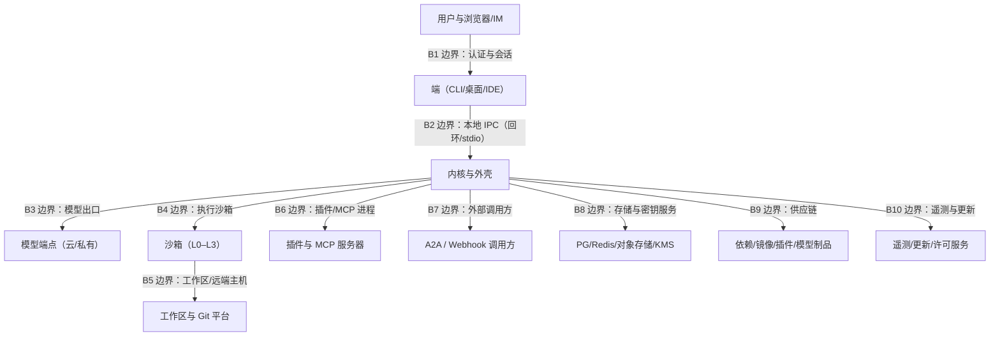
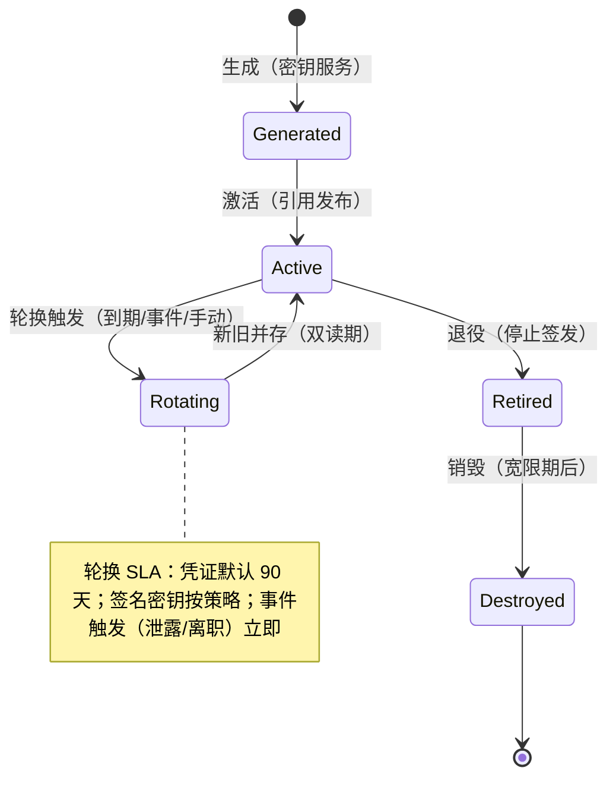

# 卷 30 · 安全工程与威胁模型（Security Engineering）

> 卷 06 定义「怎么判权」、卷 07 定义「怎么隔离」，本卷回答**「谁在攻击我们、从哪进来、我们靠什么挡住、怎么证明挡住了」**：资产分级、信任边界、STRIDE 矩阵、密钥生命周期、证书与代理、供应链、安全测试、漏洞响应、合规映射、隐私工程、安全事件响应、防滥用。
>
> 来源：迭代轮次 6（安全工程贯通）；需求 ID 见卷 00 §5.30（D30 安全工程）。

---

## 1. 本卷定位

- **解决**：威胁建模与安全工程化（设计期、构建期、运行期、响应期四个阶段的安全活动）。
- **不解决**：权限判定算法（卷 06）、沙箱实现（卷 07）、DLP 具体规则（卷 24 §4.8）、审计存储（卷 16/19）。
- **边界**：本卷是**安全工程的主索引**：任何安全机制必须在 §4.3 的威胁矩阵中有对应行，否则视为缺口。

## 2. 资产与信任边界

### 2.1 资产分级（D-SEC-2）

| 级别 | 资产 | 泄露影响 | 保护要求 |
| --- | --- | --- | --- |
| A0 极敏感 | 凭证/密钥、许可私钥、签名密钥、KMS 主密钥 | 灾难级（可横向移动） | 硬件/密钥服务托管；永不出服务端安全域；使用留痕 |
| A1 敏感 | 源代码、客户数据、会话内容、提示词资产、审计日志 | 高（商业/合规） | 加密存储与传输；租户隔离；访问审计；DLP 出站管控 |
| A2 内部 | 任务/计划/团队/知识元数据、用量与成本、插件配置 | 中 | 鉴权 + 租户隔离 + 审计 |
| A3 公开 | 文档、市场元数据、公告 | 低 | 完整性保护（防篡改） |

### 2.2 信任边界（D-SEC-3）

| 边界 | 不信任方 | 主要控制 |
| --- | --- | --- |
| B1 | 客户端输入、第三方 IM/浏览器 | 强认证（OAuth/MFA）、CSRF/CORS、参数校验、速率限制 |
| B2 | 本机其他进程（同用户恶意程序） | 本地令牌 + 回环绑定 + 目录权限（0700）+ 短时效令牌 |
| B3 | 模型输出（不可信内容） | 输出视为数据；工具调用经权限与沙箱；提示注入防护（卷 03/04） |
| B4 | 被执行的代码与命令 | 五档隔离、围栏、资源限制、录制（卷 07） |
| B5 | 远端主机与仓库内容 | 路径围栏 + 内容检测 + 提交扫描（卷 21） |
| B6 | 插件与 MCP 服务器 | 签名、权限门面、沙箱、不可直连存储（卷 18/09） |
| B7 | 外部调用方 | 认证 + scope + 配额 + 沙箱化被调用（卷 23） |
| B8 | 基础设施侧攻击者 | 最小权限账号、加密、网络分段、审计 |
| B9 | 上游制品被投毒 | 签名/哈希/来源校验/扫描（§4.5） |
| B10 | 中间人 | TLS + 证书固定 + 签名元数据 + 遥测脱敏 |

## 3. 设计空间（M×N）

### D-SEC-1 威胁建模方法

| 分支 | 描述 | 结论 |
| --- | --- | --- |
| B1 仅 STRIDE | 覆盖广；对隐私与滥用覆盖弱 | 基线 |
| **B2 STRIDE + LINDDUN（隐私）+ 滥用用例（Anti-abuse）+ 攻击树（关键路径）组合** | 覆盖安全/隐私/滥用三类威胁 | **选定**（F=9 U=7 S=8 M=9 → 83.5） |

### D-SEC-4 密钥生命周期

| 分支 | 描述 | 结论 |
| --- | --- | --- |
| B1 配置文件 + 环境变量 | 简单；旋转与审计弱 | 基线（local-lite） |
| **B2 分层密钥服务：OS 钥匙串（本地）/ KMS（服务端）/ 企业 HSM（高安全）；密钥分级（主密钥/数据密钥/凭证）；生成→存储→使用→轮换→销毁全链路留痕；引用式使用（内核不见明文）** | 企业级 | **选定**（F=9 U=8 S=9 M=9 → 88） |

### D-SEC-5 证书与企业代理

| 分支 | 描述 | 结论 |
| --- | --- | --- |
| B1 仅系统信任链 | 企业 MITM 代理下失败 | 基线 |
| **B2 支持自定义 CA（系统信任 + 显式配置）+ 代理（HTTP/HTTPS/SOCKS + 认证）+ 例外清单（模型端点可固定证书）+ 诊断（TLS 握手信息可查）** | 企业网络可用且可控 | **选定**（F=8 U=8 S=8 M=9 → 82.5） |

### D-SEC-6 供应链安全

| 分支 | 描述 | 结论 |
| --- | --- | --- |
| B1 仅依赖锁定 | 不足 | 基线 |
| **B2 四类制品治理：依赖（锁文件 + 漏洞扫描 + 许可证检查）、镜像（签名 + 基础镜像白名单）、插件/技能（签名 + 权限声明 + 扫描）、模型（来源白名单 + 摘要校验）** | 覆盖投毒面 | **选定**（F=9 U=7 S=8 M=9 → 83.5） |

### D-SEC-7 安全测试体系

| 分支 | 描述 | 结论 |
| --- | --- | --- |
| B1 仅人工评审 | 不可扩展 | 淘汰 |
| **B2 分层：SAST（含密钥扫描）+ 依赖/镜像扫描 + 秘钥泄漏检测（提交前）+ DAST（协议面/管理面）+ 模糊测试（解析器/协议/schema）+ 红队（卷 26 §4.3）+ 威胁建模评审（每次架构变更）** | 覆盖构建到运行 | **选定**（F=9 U=7 S=8 M=9 → 83.5） |

### D-SEC-8 漏洞响应

| 分支 | 描述 | 结论 |
| --- | --- | --- |
| B1 无流程 | 响应混乱 | 淘汰 |
| **B2 分级 SLA（严重 24h 内缓解 / 高 7 天 / 中 30 天 / 低 90 天）+ 安全公告通道（含私密报告入口）+ 补丁通道（稳定通道优先 + 可强制升级）+ CVE 申请 + 复盘** | 可承诺 | **选定**（F=8 U=8 S=9 M=9 → 85） |

### D-SEC-9 合规映射

| 分支 | 描述 | 结论 |
| --- | --- | --- |
| B1 不做映射 | 采购受阻 | 淘汰 |
| **B2 控制项映射表：等保 2.0（三级）/ ISO 27001 / SOC 2（安全/可用/保密）/ GDPR / 个保法 → 对应设计落点与证据（审计日志/演练报告/加密证明）** | 采购可交付 | **选定**（F=8 U=7 S=8 M=9 → 80） |

### D-SEC-10 隐私工程

| 分支 | 描述 | 结论 |
| --- | --- | --- |
| B1 事后补救 | 合规风险 | 淘汰 |
| **B2 隐私默认：数据最小化（默认不采集）、目的限制（用途声明）、PII 识别与脱敏、可导出与可删除、跨境传输清单与放行、遥测本地预览** | 合规且可信 | **选定**（F=8 U=8 S=8 M=9 → 82.5） |

### D-SEC-11 安全事件响应

| 分支 | 描述 | 结论 |
| --- | --- | --- |
| B1 无预案 | 处置失序 | 淘汰 |
| **B2 分级响应（SEV1–SEV4）+ 明确角色（指挥/处置/沟通/记录）+ 冻结与隔离手段（会话冻结/插件熔断/凭证吊销/租户限流）+ 取证（事件链 + 快照）+ 复盘与改进项闭环** | 可运营 | **选定**（F=9 U=7 S=9 M=9 → 86.5） |

### D-SEC-12 防滥用

| 分支 | 描述 | 结论 |
| --- | --- | --- |
| B1 无 | 被滥用（刷量/挖矿/代理攻击） | 淘汰 |
| **B2 多维检测与处置：异常用量模式、异常工具调用（如大量外发）、账号共享检测（多设备/多地）、沙箱内挖矿特征、滥用量级熔断与人工复核** | 保护服务与客户 | **选定**（F=8 U=7 S=8 M=8 → 77.5） |

## 4. 选定方案详设

### 4.1 资产分级与控制落点

| 级别 | 存储 | 传输 | 使用 | 销毁 |
| --- | --- | --- | --- | --- |
| A0 | 密钥服务/HSM；不落普通存储 | 仅进程内句柄 | 引用式；使用留痕；不可导出 | 密钥销毁流程 + 证明 |
| A1 | 加密（信封）+ 租户隔离 | TLS + 固定（外部） | 权限 + 审计 + DLP | 合规删除（卷 19 §4.6） |
| A2 | 常规加密 | TLS | 鉴权 | 保留策略 |
| A3 | 常规 | TLS | 公开 | — |

### 4.2 密钥生命周期

| 类型 | 存储位置 | 轮换 | 使用方式 |
| --- | --- | --- | --- |
| 主密钥（KMS 主密钥） | KMS/HSM | 年度或按合规 | 仅用于包装数据密钥 |
| 数据密钥（信封加密） | 加密后随数据 | 90 天 | 加解密数据 |
| 模型凭证 | 钥匙串/KMS/企业凭证服务 | 90 天或按厂商 | SecretPort 运行时注入 |
| Git/SSH 凭证 | 同上 | 90 天 | 密钥代理注入（卷 07 §4.4） |
| 签名密钥（插件/更新/许可） | HSM/KMS（私钥不可导出） | 年度 | 签名服务 API |
| 会话令牌 | 内存/状态存储 | 短时效（≤ 24h） | 校验签名 + 绑定租户 |

### 4.3 STRIDE 威胁矩阵（按信任边界）

| 边界 | Spoofing | Tampering | Repudiation | Info Disclosure | DoS | Elevation |
| --- | --- | --- | --- | --- | --- | --- |
| B1 客户端↔端 | 强认证 + MFA + 设备绑定 | 输入校验 + CSP/CSRF | 操作审计 + 会话绑定 | 最小返回字段 | 速率限制 + 队列 | 角色校验（服务端强制） |
| B2 端↔内核 | 本地令牌（短时效、绑定用户） | 消息签名（可选） | 本地操作审计 | 回环绑定 + 目录权限 | 连接数上限 | 命令白名单 + 权限链 |
| B3 内核↔模型 | 端点证书固定 + 凭证 | 响应校验（schema） | 请求留痕（脱敏） | 出站脱敏 + DLP | 超时 + 熔断 + 预算 | 模型输出视为数据（不执行） |
| B4 沙箱 | 沙箱身份隔离（每执行独立） | 只读根 + 内容寻址 | 执行录制 | 围栏 + 密钥代理 | 资源限制 + 超时 | 不可提权 + 能力最小化 |
| B5 工作区/远端 | 主机密钥校验（SSH） | 提交扫描 + 校验和 | Git 追溯尾注 | 网络策略 + 最小检出 | 连接池 + 并发上限 | 远端账户最小权限 |
| B6 插件/MCP | 签名 + 信任链 | 清单校验 + 完整性 | 插件调用审计 | 权限门面 + 不可直连存储 | 熔断 + 资源限制 | 无权限放大（卷 18） |
| B7 外部调用方 | API Key/OAuth/mTLS | 幂等键 + 签名 body | 审计链（调用方↔委托者） | 结果最小化 + 引用下载 | 配额 + 限流 + 队列 | scope 收窄 + 沙箱化 |
| B8 存储/密钥 | 服务账号绑定 | 完整性（哈希链） | 访问日志 | 加密 + 分段 + 最小权限 | 副本 + 限流 | 无直连、仅经端口 |
| B9 供应链 | 签名验证 | 哈希校验 | 制品来源记录 | 私有源优先 | — | 基础镜像白名单 |
| B10 遥测/更新 | TLS + 固定 + 签名元数据 | 防降级 + 时间戳 | 更新事件审计 | 默认关 + 脱敏 + 本地预览 | 本地缓存元数据 | 仅白名单端点 |

**验证方式**：每行至少对应一条红队用例（卷 26 §4.3 的 10 类映射到本矩阵）。

### 4.4 供应链检查清单

| 类别 | 检查项 | 失败动作 |
| --- | --- | --- |
| 依赖（Maven/前端） | 锁文件一致、无已知高危 CVE、许可证白名单、无未批准的新增直接依赖 | 阻断构建 |
| 镜像 | 来源白名单、签名验证、基础镜像最小化、无 root 运行、定期重建 | 拒绝拉取/构建 |
| 插件/技能 | 签名、权限声明合理性、静态扫描（外发/执行/读取范围）、安装量异常检测 | 拒绝装载 + 下架流程 |
| 模型制品 | 来源白名单（官方/私有）、摘要校验、失败样本抽检 | 拒绝启用 |

### 4.5 漏洞响应与公告

| 阶段 | 动作 | 时限（严重级） |
| --- | --- | --- |
| 接收 | 私密报告通道（邮件/PGP）+ 确认回执 | ≤ 24h |
| 分级 | CVSS + 影响面（是否可远程、是否需交互） | ≤ 48h |
| 缓解 | 临时对策（配置/策略/禁用开关）+ 用户通告 | ≤ 24h（缓解） |
| 修复 | 补丁 + 回归 + 红队复测 | ≤ 7 天（高） / 30 天（中） / 90 天（低） |
| 公告 | 安全公告（影响版本、缓解、修复版本）+ CVE | 与修复同步 |
| 复盘 | 根因 + 改进项（进入卷 26 反馈闭环） | ≤ 14 天 |

### 4.6 合规映射（节选）

| 控制项（等保 2.0 / ISO 27001 / SOC 2） | 设计落点 | 证据 |
| --- | --- | --- |
| 身份鉴别（8.1.4.1） | 卷 24 D-ENT-2 + MFA | 登录审计 + MFA 强制配置 |
| 访问控制（8.1.4.2） | 卷 06 决策链 + 卷 24 RBAC | 权限用例 + 审计导出 |
| 安全审计（8.1.4.3） | 卷 16 §4.7 + 卷 24 §4.3 | 审计哈希链校验 + 导出报告 |
| 数据完整性（8.1.4.8） | 事件哈希链 + 提交签名 | 校验工具报告 |
| 数据保密性（8.1.4.7） | 加密 + DLP + 密钥生命周期 | 加密证明 + 密钥轮换记录 |
| 可用性（A1.3） | 卷 24 §4.5 部署 + 卷 19 备份恢复 | 演练报告 + SLO 看板 |
| 隐私（GDPR/个保法） | D-SEC-10 + 卷 19 合规删除 | 删除证明 + 数据处理清单 |

### 4.7 安全事件响应（SEV 分级）

| 级别 | 判定 | 首要动作 |
| --- | --- | --- |
| SEV1 | 确认的逃逸/越权批量数据访问/凭证泄露 | 冻结受影响会话与租户写操作、吊销凭证、启动取证、通知客户与监管（如需） |
| SEV2 | 单租户数据越权/沙箱违规成功/审计链断裂 | 隔离影响面、修复、通告 |
| SEV3 | 可疑尝试被拦截、异常用量 | 调查 + 加严策略 |
| SEV4 | 理论风险/低危配置问题 | 排期修复 |

**共同要求**：指挥/处置/沟通/记录四角色；全部动作产生审计事件；复盘产出「设计变更或新用例」——不允许「仅口头改进」。

### 4.8 防滥用

| 模式 | 检测 | 处置 |
| --- | --- | --- |
| 用量异常（突增、夜间持续） | 配额与用量基线偏离检测 | 限流 + 人工复核 |
| 外发异常（大量出网/上传） | DLP + 字节量阈值 | 阻断 + 告警 |
| 计算滥用（挖矿、代理转发） | 沙箱内进程特征 + 网络目标特征 | 终止 + 冻结 + 通报 |
| 账号共享 | 多设备/多地并发特征 | 二次验证 + 席位合规检查 |
| 市场滥用（刷评/刷量） | 行为频率 + 图谱分析 | 降权 + 下架 + 封禁 |

## 5. 扩展点（供卷 18 汇总）

| 扩展点 | 说明 |
| --- | --- |
| `ThreatModelProviderSPI` | 威胁模型与对策扩展（企业自定义） |
| `SecretStoreSPI` | 密钥存储后端（KMS/HSM/钥匙串/自研） |
| `CertTrustSPI` | 自定义 CA 与证书固定策略 |
| `SupplyChainScannerSPI` | 制品扫描器（新类型） |
| `VulnFeedSPI` | 漏洞情报源 |
| `AbuseDetectorSPI` | 滥用检测规则 |

## 6. 事件与可观测

| 事件 | 说明 |
| --- | --- |
| `sec.asset.classified` | 资产分级标记（新增数据类型） |
| `sec.credential.rotated` / `sec.credential.revoked` | 凭证生命周期 |
| `sec.cert.trust.changed` | 信任链变更（审计） |
| `sec.supplychain.blocked` | 供应链检查阻断 |
| `sec.vuln.reported` / `mitigated` / `fixed` | 漏洞生命周期 |
| `sec.incident.opened` / `contained` / `closed` | 安全事件 |
| `sec.abuse.detected` / `mitigated` | 滥用 |

**指标**：`oc_sec_high_cve_open`、`oc_sec_patch_latency_hours{severity}`、`oc_sec_credentials_due_rotation`、`oc_sec_trust_failures_total`、`oc_sec_abuse_blocks_total`、`oc_sec_incidents_open{sev}`。

## 7. 非功能设计

- **深度防御**：任一边界被突破不应直接导致 A0/A1 资产泄露（至少两层控制）。
- **最小权限**：服务账号与插件权限按需授予；默认拒绝。
- **可证明**：审计、删除、加密、演练均可出具证据（采购与合规要求）。
- **性能**：安全控制不得破坏延迟预算（脱敏/扫描在关键路径上 ≤ 10ms，重扫描异步）。
- **可用性**：安全服务（KMS/扫描）不可用时按 fail-closed 处理敏感操作，其余降级并告警。

## 8. 完成定义（DoD）

- [ ] 资产分级表落地（每类数据在元数据中标记级别）。
- [ ] 10 条信任边界全部有对应控制且有红队用例（威胁矩阵每行 ≥ 1 用例）。
- [ ] 密钥生命周期六态实现；轮换 SLA 可观测；A0 资产不落普通存储（用例）。
- [ ] 企业代理与自定义 CA 可用；证书固定与例外清单生效。
- [ ] 供应链四类检查在 CI/运行时强制，违规可阻断。
- [ ] 安全测试六层落地（SAST/依赖/镜像/DSAT/模糊/红队）并在门禁中运行。
- [ ] 漏洞响应 SLA 与公告通道可用（演练一次完整流程）。
- [ ] 合规映射表完成（≥ 20 控制项）且每项有可导出证据。
- [ ] 隐私工程：数据最小化默认、PII 脱敏、导出/删除可用（演练）。
- [ ] 安全事件响应：一次 SEV2 桌面演练（含冻结/吊销/取证/复盘）。
- [ ] 防滥用五类检测中的三类上线并有处置记录。

## 9. 域内决策汇总（D-SEC）

| ID | 主题 | 选定 |
| --- | --- | --- |
| D-SEC-1 | 威胁建模 | STRIDE + LINDDUN + 滥用 + 攻击树 |
| D-SEC-2 | 资产分级 | A0–A3 四级 |
| D-SEC-3 | 信任边界 | 10 条边界定义与控制 |
| D-SEC-4 | 密钥生命周期 | 分层密钥服务 + 六态 + 引用式使用 |
| D-SEC-5 | 证书代理 | 自定义 CA + 代理支持 + 固定与例外 |
| D-SEC-6 | 供应链 | 依赖/镜像/插件/模型四类治理 |
| D-SEC-7 | 安全测试 | 六层（SAST/依赖/镜像/DAST/模糊/红队） |
| D-SEC-8 | 漏洞响应 | 分级 SLA + 公告 + 补丁通道 |
| D-SEC-9 | 合规映射 | 控制项 → 落点 → 证据 |
| D-SEC-10 | 隐私工程 | 最小化 + 目的限制 + 可删 + 跨境清单 |
| D-SEC-11 | 事件响应 | SEV1–4 + 四角色 + 取证 + 复盘闭环 |
| D-SEC-12 | 防滥用 | 五类检测 + 熔断 + 人工复核 |

## 10. 开放问题与默认决策

| 项 | 默认决策 |
| --- | --- |
| 密码学算法基线 | AES-256-GCM、SHA-256、Ed25519/RSA-3072、TLS 1.3（禁 ≤ 1.1） |
| 密钥服务默认实现 | local：OS 钥匙串 + 本地密钥文件（0600）；server：云 KMS 或 Vault 类 |
| 漏洞披露 | 默认 90 天协调披露窗口 |
| 数据跨境 | 默认不允许；需显式策略放行并记录 |
| 安全演练频率 | 每季度一次（红队 + SEV 桌面演练交替） |
