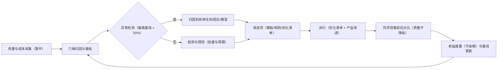

# 卷 31 · 容量与成本模型（Capacity & Cost Model）

> 企业级系统的生死线是「算得清」：本卷给出**容量模型（事件/存储/带宽/token/索引/并发）、成本模型（token/工具/沙箱/存储/人力）、优化清单（按 ROI 排序）、配额智能化、单位经济性与容量告警阈值**，让每个数字都能被复核与预测。
>
> 来源：迭代轮次 5/12（容量与成本量化）；需求 ID 见卷 00 §5.31（D31 容量与成本）。

---

## 1. 本卷定位

- **解决**：需要多少资源、钱花在哪里、怎么省、什么时候会撑爆、如何提前预警。
- **不解决**：性能基准（卷 26 §4.4）、配额机制实现（卷 24 §4.4）、模型定价来源（卷 02 §4.6）。
- **边界**：本卷是**量化模型**：所有公式与系数都可被实测替换；设计目标以「量级正确」为准，实现期用真实数据校准。

## 2. 假设与口径

| 变量 | 取值 | 说明 |
| --- | --- | --- |
| `U` 活跃用户 | 10,000（示例租户） | 每日至少一次会话 |
| `T` 每人每日轮次 | 50 | 一次用户意图 = 1 轮（含若干工具调用） |
| `E_r` 每轮事件数 | 60 | 模型 2 + 工具 12 + 审批 2 + 上下文/压缩 6 + 检查点 2 + 状态与遥测 36 |
| `S_e` 单事件字节 | 1.5 KB | 脱敏 JSON 载荷（未压缩）；压缩后约 0.35 KB |
| `K_r` 每轮输入 token | 30k（含缓存读 70%） | 上下文快照 + 工具结果 |
| `O_r` 每轮输出 token | 5k | 含推理 token（单列） |
| `F_c` 缓存读占比 | 70% | 稳定前缀命中 |
| `N_file` 单仓文件 | 100,000 | 大仓口径 |
| `C_chunk` 文件块数 | 8 / 文件 | 结构感知切分 |
| `D_vec` 向量维度 | 1024 × 4B | 单块 4 KB |

## 3. 设计空间（M×N）

### D-CAP-1 容量建模方法

| 分支 | 描述 | 结论 |
| --- | --- | --- |
| B1 经验估算（拍数字） | 快；不可复核 | 淘汰 |
| **B2 基准驱动建模（公式 + 系数可测 + 定期校准）+ 关键路径排队论校验（并发与延迟）** | 可复核、可预测 | **选定**（F=9 U=7 S=8 M=9 → 83.5） |

### D-CAP-2 存储分层

| 分支 | 描述 | 结论 |
| --- | --- | --- |
| B1 单一热存储 | 成本高 | 淘汰 |
| **B2 三层：热（PG 分区，近 30 天）/ 温（PG 归档表或廉价块存储，30 天–1 年）/ 冷（对象存储 Parquet，> 1 年）；读取路径统一（冷数据按需加载）** | 成本可控 | **选定**（F=8 U=8 S=8 M=9 → 82.5） |

### D-CAP-3 事件量控制

| 分支 | 描述 | 结论 |
| --- | --- | --- |
| B1 全量持久化所有事件 | 成本线性增长 | 淘汰 |
| **B2 分层策略：领域事件全量（必要）；遥测采样（延迟 10%、用量 100%）+ 批量聚合写；高频中间态折叠（只保留状态迁移与最终值）** | 保真与成本平衡 | **选定**（F=9 U=8 S=8 M=9 → 85.5） |

### D-CAP-4 索引容量策略

| 分支 | 描述 | 结论 |
| --- | --- | --- |
| B1 全仓全量向量化 | 成本高（大仓） | 淘汰 |
| **B2 分级索引：符号与全文全量；向量仅对「高频访问 + 变更频繁 + 关键路径」文件；大仓默认抽样向量化（可配全量）** | 成本下降 40–70% | **选定**（F=8 U=8 S=8 M=8 → 80） |

### D-CAP-5 成本归因粒度

| 分支 | 描述 | 结论 |
| --- | --- | --- |
| B1 仅账号级 | 无法优化 | 淘汰 |
| **B2 六维归因：租户 / 项目 / 团队 / 会话 / 任务 / 模型；模型与工具调用均可回溯到触发者；缓存折扣单列** | 可定位可优化 | **选定**（F=9 U=8 S=8 M=9 → 85.5） |

### D-CAP-6 成本优化优先级

| 分支 | 描述 | 结论 |
| --- | --- | --- |
| B1 事后降配 | 被动 | 淘汰 |
| **B2 ROI 排序的优化清单（§4.4），每项含预估收益、实施成本、风险；按季度评审执行** | 主动 | **选定**（F=9 U=8 S=8 M=9 → 85.5） |

### D-CAP-7 配额智能化

| 分支 | 描述 | 结论 |
| --- | --- | --- |
| B1 静态配额 | 简单；体验与成本冲突 | 基线 |
| **B2 静态基线 + 预测式动态：按历史用量预测（P95）动态分配临时额度；超额走申请；团队内可再分配（卷 13 D-TEAM-6）；异常突增触发熔断** | 兼顾体验与成本 | **选定**（F=8 U=9 S=7 M=8 → 79.5） |

### D-CAP-8 单位经济性

| 分支 | 描述 | 结论 |
| --- | --- | --- |
| B1 不建模 | 商业决策盲区 | 淘汰 |
| **B2 按版本（社区/专业/企业）建成本结构 + 每席成本 + 每任务成本目标 + 毛利敏感度（模型价/缓存命中/端侧占比三因素）** | 可决策 | **选定**（F=8 U=7 S=8 M=9 → 80.5） |

### D-CAP-9 容量告警与扩缩容

| 分支 | 描述 | 结论 |
| --- | --- | --- |
| B1 阈值告警 | 滞后 | 基线 |
| **B2 阈值 + 趋势预测（线性外推 + 季节性）：容量水位 ≥ 80% 告警、≥ 90% 阻断高成本新任务；扩缩容建议（含成本影响）** | 提前 | **选定**（F=8 U=8 S=8 M=8 → 80） |

### D-CAP-10 成本治理机制

| 分支 | 描述 | 结论 |
| --- | --- | --- |
| B1 无组织机制 | 优化不可持续 | 淘汰 |
| **B2 月度成本评审（异常归因 + 优化项推进）+ 成本看板（六维）+ 预算责任到团队 + 优化收益度量** | 可持续 | **选定**（F=8 U=7 S=8 M=9 → 80.5） |

## 4. 选定方案详设

### 4.1 容量公式与示例测算

**事件与存储**

| 量 | 公式 | 10k 用户测算 |
| --- | --- | --- |
| 日事件数 | `U × T × E_r` | 10,000 × 50 × 60 = **3.0×10⁷ /天** |
| 日事件字节（原始） | `日事件数 × S_e` | 45 GB/天 |
| 日事件字节（压缩后，归档） | `× 0.23` | ≈ 10.5 GB/天 → **3.8 TB/年** |
| 在线热数据（30 天） | 压缩前保留热副本 | ≈ 1.35 TB（含索引 ≈ 1.8 TB） |
| 会话与消息 | `U × T × 4 × 2KB` | ≈ 4 GB/天 |
| 检查点增量（开启） | `U × T × 0.2MB × 去重 0.25` | ≈ 25 GB/天（**默认仅并行/团队任务开启** → ≈ 5 GB/天） |
| 媒体与工件 | 取决于用户上传；内容寻址去重率 60% | 按容量配额控制 |
| 索引（代码，单仓） | `N_file × C_chunk × (D_vec + 源文本)` | 800k 块 × (4KB + 2KB) ≈ **4.8 GB/仓** |

**结论**：单实例热数据 2 TB 内、冷数据 4 TB/年为设计基准；**必须**分区 + 冷热分层 + 遥测采样，否则 10k 用户规模会击穿单库。

**并发与吞吐**

| 量 | 公式 | 结论 |
| --- | --- | --- |
| 并发活跃会话 | `U × 峰值系数(0.05) × 平均时长占比` | ≈ 500 活跃（峰值）；按 NFR-P-9 需 ≥ 500（集群） |
| 模型调用 QPS | `并发会话 / 平均轮次时长(90s) × 每轮模型调用(2)` | ≈ 11 QPS 峰值（可水平扩展） |
| 事件写入 EPS | `日事件数 / 有效工作时长(8h) × 峰值系数(4)` | ≈ 4.2k EPS 峰值（NFR-P-4 要求 ≥ 50k，余量充足） |
| 工具调用并发 | `并发会话 × 每轮工具(12) / 90s` | ≈ 67 QPS |

### 4.2 成本模型

**token 成本**（单轮示例，模型价 $3/M 输入、$15/M 输出、缓存读 $0.3/M）：

```
成本/轮 = K_r × [F_c × 缓存价 + (1 - F_c) × 输入价] + O_r × 输出价
        = 0.030 × [0.7 × 0.3 + 0.3 × 3] + 0.005 × 15
        = 0.030 × 1.11 + 0.075
        = 0.0333 + 0.075 = $0.108/轮
```

| 口径 | 值 | 说明 |
| --- | --- | --- |
| 每用户日成本 | 50 × $0.108 ≈ **$5.4/天** | 纯对话成本（未含工具/沙箱/存储） |
| 每任务成本目标 | 简单 ≤ $0.5 / 中等 ≤ $5 / 大型 ≤ $50 | 与任务分级挂钩（卷 14） |
| 缓存失效惩罚 | 输入成本 ×2.7 | 命中率从 70% 降到 0% 时输入成本上升 170% |
| 推理 token 占比 | 10–25% 输出 | 需单列（卷 02 §4.2） |

**非 token 成本**

| 项 | 估算 | 说明 |
| --- | --- | --- |
| 工具执行（沙箱） | L1 容器 0.5–2s 启动 + 运行；按 CPU·s 计 | 企业自有算力时计入机时 |
| 存储 | 热 $0.15/GB·月、冷 $0.01/GB·月（示例价） | 事件冷存 3.8 TB/年 ≈ $38/月 |
| 索引 | 向量库存储 + 嵌入调用 | 嵌入调用是主要成本（可用批处理降 50%） |
| 观测与遥测 | 指标基数 + 日志量 | 控制标签基数（禁止高基数标签） |
| 更新与分发 | CDN 流量 | 增量包优先 |

### 4.3 成本归因与看板

| 维度 | 用途 | 典型问题回答 |
| --- | --- | --- |
| 租户 | 计费与配额 | 哪个客户不赚钱 |
| 项目 | 研发效能 | 哪个项目最贵 |
| 团队 | 责任与优化 | 哪个团队用量异常 |
| 会话/任务 | 单次成本 | 这个任务为什么花了 $12 |
| 模型 | 路由优化 | 换模型能省多少 |
| 工具 | 工具性价比 | 哪个工具调用最贵（外发/长时命令） |

**看板要求**：日/周/月趋势 + 异常检测（相对基线偏离 > 50% 告警）+ 下钻到单次调用（含缓存命中标记）。

### 4.4 优化清单（按 ROI 排序）

| # | 手段 | 预估收益 | 实施成本 | 风险 | 依赖 |
| --- | --- | --- | --- | --- | --- |
| 1 | 提示词缓存（稳定前缀 + 断点） | 输入成本 ↓ 40–60% | 低 | 低（缓存失效可观测） | 卷 03/02 |
| 2 | 规则路由到廉价模型（轻任务） | 总成本 ↓ 20–40% | 低 | 中（质量回归需评测门禁） | 卷 02 D-MDL-6 |
| 3 | 上下文压缩（四级管线） | 输入 token ↓ 15–30% | 中 | 中（保真规则） | 卷 03 |
| 4 | 工具结果外置 + 按需再读 | 输入 token ↓ 10–25% | 低 | 低 | 卷 03/05 |
| 5 | 端侧/小模型分层（摘要/重排/分类） | 轻任务边际成本 → 0 | 中 | 中（本地资源占用） | 卷 25 D-FR-8 |
| 6 | 嵌入批处理 + 缓存（知识索引） | 嵌入成本 ↓ 50% | 低 | 低 | 卷 11 |
| 7 | 媒体/快照内容寻址去重 | 存储 ↓ 60% | 中 | 低 | 卷 19/20 |
| 8 | 遥测采样与聚合 | 遥测存储 ↓ 80% | 低 | 低（指标精度） | 卷 16 |
| 9 | 团队预算动态回收（闲置成员） | 团队成本 ↓ 10–20% | 中 | 低 | 卷 13 |
| 10 | 缓存亲和重排（减少前缀漂移） | 缓存命中 ↑ 10–20pp | 中 | 低 | 卷 03 D-CTX-6 |

**度量要求**：每项优化必须给出「优化前/后同评测集」的对比报告（防止以质量换成本）。

### 4.5 配额智能化

| 机制 | 说明 |
| --- | --- |
| 静态基线 | 按版本/角色默认配额（并发、token/日、成本/日、存储） |
| 预测式临时额度 | 基于历史 P95 用量与当前任务规模预测，自动放宽 ≤ 30%（可配） |
| 团队内再分配 | 成员闲置额度回池（卷 13 D-TEAM-6） |
| 超额申请 | 一键申请 + 审批（自动规则可批小额） |
| 异常熔断 | 突增（相对基线 × 3）→ 暂停自治任务并告警；不影响人工会话 |
| 降级策略 | 超限时可选：拒绝 / 排队 / 降级到廉价模型（用户可配偏好） |

### 4.6 单位经济性

| 版本 | 主要成本项 | 成本结构（示例占比） | 备注 |
| --- | --- | --- | --- |
| 社区版 | 模型（用户自付 BYO Key）为主 | 模型 0（用户承担）+ 存储/基础设施 | 无许可成本 |
| 专业版（席位制） | 模型 token + 存储 + 支持 | 模型 60% / 存储 15% / 基础设施与支持 25% | 需控制每席日成本 |
| 企业版（私有化） | 客户自建算力；厂商收许可与支持 | 许可 + 支持为主 | 成本主要在交付与运维 |

**敏感度分析**（专业版每席）：模型价 ×1.5 → 成本 ↑ 30%；缓存命中率 +20pp → 成本 ↓ 12%；端侧分流 20% 轻任务 → 成本 ↓ 9%。

### 4.7 容量告警阈值

| 对象 | 阈值 | 动作 |
| --- | --- | --- |
| 事件表分区 | 单分区 > 50 GB 或 > 30 天未归档 | 告警 + 触发归档 |
| 消费者滞后 | > 60s（P95） | 告警；> 300s 阻断非关键写入 |
| 热存储水位 | ≥ 80% / ≥ 90% | 告警 / 阻断高成本新任务（保留人工会话） |
| Redis 内存 | ≥ 75% / ≥ 90% | 告警 / 淘汰非关键缓存 |
| 索引滞后 | 增量 > 30s | 告警（NFR 对齐） |
| 成本预算 | 50% / 80% / 100% | 通知 / 降级可用 / 熔断 |
| 并发会话 | ≥ 80% 配额 | 告警 + 排队策略生效 |
| 沙箱资源 | 单租户 CPU·s 超配额 | 限流 + 告警 |

### 4.8 成本治理闭环（D-CAP-10 落地）



| 机制 | 约定 |
| --- | --- |
| 月度评审 | 固定议程：异常归因（Top 3）→ 优化项进展 → 预算与配额调整 → 下月目标 |
| 优化项跟踪 | 每项含：手段、预估收益、责任人、截止日、验证方式（同评测集对比报告） |
| 预算责任 | 预算按团队分配；超支需说明（自动生成「超支说明草案」供修改） |
| 收益度量 | 节省额 = (优化前单任务成本 − 优化后) × 任务量；按季度累计并公示 |
| 反作弊 | 不允许通过降低质量/跳过验证达成成本下降（评测门禁强制，卷 26 §4.2） |
| 定价联动 | 模型目录价格更新 → 自动重算单位经济性与路由建议（卷 02 §4.6） |

**成本回归门禁（与卷 26 §4.2 联动）**：任何触及上下文/提示词/路由的变更，必须在同评测集上验证**成本不劣化 > 10%**，否则需显式豁免（记录理由与恢复计划）。

## 5. 扩展点（供卷 18 汇总）

| 扩展点 | 说明 |
| --- | --- |
| `CostAttributionSPI` | 自定义归因维度（如成本中心） |
| `QuotaPolicySPI` | 配额与预测策略 |
| `StorageTierPolicySPI` | 分层与归档策略 |
| `CapacityModelSPI` | 容量模型参数与校准 |

## 6. 事件与可观测

| 事件 | 说明 |
| --- | --- |
| `cap.usage.sampled` | 用量采样（按小时聚合） |
| `cap.quota.dynamic.adjusted` | 动态额度调整（含理由） |
| `cap.storage.tier.moved` | 分层迁移（量级与成本节省） |
| `cap.cost.anomaly.detected` | 成本异常（含偏离幅度） |
| `cap.alert.threshold.reached` | 阈值告警（对象与级别） |

**指标**：`oc_cap_events_per_day`、`oc_cap_hot_storage_bytes`、`oc_cap_cold_storage_bytes`、`oc_cap_cost_per_user_day`、`oc_cap_cost_per_task{level}`、`oc_cap_cache_hit_ratio`、`oc_cap_quota_utilization{dimension}`、`oc_cap_optimization_savings_total{measure}`。

## 7. 非功能设计

- **可校准**：所有系数（`S_e`/`F_c`/去重率等）带版本与实测来源；季度校准一次。
- **可核算**：任一月账单可下钻到会话级；误差 ≤ 1%（与厂商账单抽样对齐）。
- **不牺牲质量**：任何降本措施必须过评测门禁（卷 26 §4.2）；不允许以质量换成本的无记录操作。
- **容量规划前置**：新特性上线前必须填写「容量与成本影响评估」（模板：增量用量、存储、成本、阈值影响）。
- **多租户公平**：单租户不得因异常消耗影响其他租户（隔离配额 + 熔断）。

## 8. 完成定义（DoD）

- [ ] 容量公式与系数落地（文档 + 配置），并用真实环境抽样校准一次（误差 ≤ 30%）。
- [ ] 成本归因六维可用；任一账单可下钻到单次调用。
- [ ] 成本看板（趋势 + 异常检测 + 下钻）可用；异常告警在测试中触发。
- [ ] 优化清单 10 项各有一份「前后对比报告」（至少完成 5 项）。
- [ ] 配额智能化：预测式额度、团队再分配、超额申请、异常熔断全部可用。
- [ ] 单位经济性表更新至最新定价；敏感度分析可一键重算。
- [ ] 容量告警阈值表全部接入监控并演练触发（含阻断动作）。
- [ ] 新特性「容量与成本影响评估」模板进入研发流程（PR 模板必填项）。

## 9. 域内决策汇总（D-CAP）

| ID | 主题 | 选定 |
| --- | --- | --- |
| D-CAP-1 | 建模方法 | 基准驱动公式 + 定期校准 + 排队论校验 |
| D-CAP-2 | 存储分层 | 热/温/冷三层 + 统一读取路径 |
| D-CAP-3 | 事件量控制 | 领域全量 + 遥测采样 + 状态折叠 |
| D-CAP-4 | 索引容量 | 分级索引（全文/符号全量，向量按热度） |
| D-CAP-5 | 成本归因 | 六维 + 缓存单列 |
| D-CAP-6 | 优化优先级 | ROI 排序清单 + 季度评审 |
| D-CAP-7 | 配额智能 | 静态 + 预测式 + 再分配 + 熔断 |
| D-CAP-8 | 单位经济性 | 三版本成本结构 + 敏感度分析 |
| D-CAP-9 | 容量告警 | 阈值 + 趋势预测 + 分级动作 |
| D-CAP-10 | 治理机制 | 月度评审 + 看板 + 预算责任 + 收益度量 |

## 10. 开放问题与默认决策

| 项 | 默认决策 |
| --- | --- |
| 检查点默认开启范围 | 并行任务/团队任务默认开；单任务默认仅关键节点 |
| 遥测保留 | 30 天（聚合后 1 年） |
| 冷数据可读性 | 冷数据查询需显式加载（异步，分钟级），界面提示 |
| 降级默认偏好 | 用户可选「省成本优先」或「质量优先」，默认「平衡」 |
| 容量评估模板 | 作为 PR 必填项（缺失则 CI 提醒，不阻断） |
