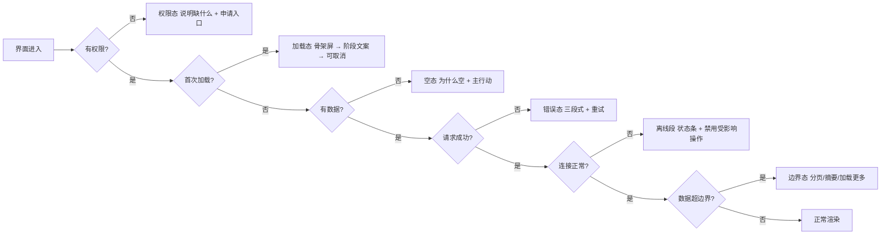

# 卷 33 · 交互细则（Interaction Details & Microcopy）

> 卷 22 定义「有哪些界面」，本卷定义**「每个界面在每种状态下到底怎么表现」**：状态矩阵、文案规范、错误呈现、引导、键盘全流程、无障碍细则、长任务交互、危险操作确认、通知文案、只读分享视图。
>
> 来源：迭代轮次 7；需求 ID 见卷 00 §5.33（D33 交互细则）。

---

## 1. 本卷定位

- **解决**：写下每一个状态的表现与每一句用户可见文案的标准，避免实现期自由发挥。
- **不解决**：界面结构与组件（卷 22）、无障碍技术实现细节（卷 22 §4.7）、CLI 命令语义（卷 22 §4.4）。
- **边界**：本卷是**验收依据**——设计评审与实现验收均按此表的条目核对。

## 2. 状态矩阵（D-UX-1）

**适用范围**：卷 22 §4.3 的 9 类关键界面，每类必须覆盖 6 态。

| 状态 | 定义 | 呈现要求 | 必须提供 |
| --- | --- | --- | --- |
| 空（Empty） | 无数据但功能正常 | 说明「为什么空」+ 主行动按钮（如「新建会话」）+ 可选学习入口 | 行动入口、帮助链接 |
| 加载（Loading） | 首次加载 | 骨架屏（≤ 1s 不显示文字）；> 1s 显示阶段文案；> 5s 显示「仍在加载 + 可取消」 | 可取消、进度可感知 |
| 错误（Error） | 请求失败 | 三段式：发生了什么 / 为什么 / 怎么办；提供重试与诊断入口 | 重试、复制诊断、上报 |
| 离线（Offline） | 内核/网络不可达 | 顶部持续状态条 + 受影响功能禁用（不静默失败） + 自动重连倒计时 | 重连、离线可用范围说明 |
| 权限（Permission） | 无权访问 | 明确「缺哪个权限」+ 申请路径（审批/联系管理员） | 申请入口 |
| 边界（Edge Data） | 超长/超大/超量（10 万条事件、5 万字符消息） | 分页/折叠/摘要 + 加载更多；不卡顿（≥ 55fps） | 分页、跳转、折叠 |

**逐界面清单（示例节选）**

| 界面 | 空态 | 加载态 | 错误态要点 | 离线段 | 边界态 |
| --- | --- | --- | --- | --- | --- |
| 会话列表 | 「还没有会话」+「新建会话」+ 示例任务 | 骨架屏 3 行 | 「无法加载会话列表」+ 重试 + 诊断 | 显示本地缓存 + 禁用新建 | 1 万条以上用虚拟滚动 + 时间分组 |
| 会话流 | 「开始对话」+ 模式建议 | 流式首 token 前显示「思考中」 | 「模型调用失败」+ 重试 + 切模型 | 输入框禁用 + 明确提示 | 长消息折叠 + 工具结果折叠 |
| 审批列表 | 「没有待审批」+ 说明何时会出现 | 骨架屏 | 「审批加载失败」+ 重试 | 不可审批（安全约束） | 批量选择 + 分组 |
| 计划/任务看板 | 「还没有任务」+ 从模板创建 | 列骨架 | 「任务加载失败」+ 重试 | 只读 | 单列 1000+ 卡片虚拟化 |
| 团队视图 | 「未运行团队」+ 启动向导 | 拓扑占位 | 「团队状态获取失败」+ 重试 | 只读最后状态 | 16 成员拓扑自动布局 |
| 成本面板 | 「暂无用量」+ 说明采集延迟 | 数字骨架 | 「用量查询失败」+ 重试 | 显示本地估算 | 按维度下钻 + 分页 |
| 知识检索 | 「输入关键词」+ 最近查询 | 结果骨架 | 「检索失败」+ 重试 + 降级提示（仅关键词） | 提示仅本地索引 | 结果分页 + 引用折叠 |
| 诊断页 | 「运行诊断」按钮 | 逐项进度 | 「诊断失败」+ 复制报告 | 本地诊断可用 | 长日志分页 + 下载 |

## 3. 文案规范（D-UX-2）

| 规则 | 要求 | 反例 |
| --- | --- | --- |
| 语言 | 中文优先，术语遵循附录 C；代码/命令/路径不翻译 | 「Run 一下 test」 |
| 按钮 | 动词开头，≤ 6 字；同一动作全网同词 | 「确定」（应「批准」「保存」「重试」） |
| 错误 | 三段式：发生了什么 / 为什么 / 怎么办 | 「操作失败」 |
| 权限 | 说清缺什么 + 怎么拿 | 「无权限」 |
| 状态 | 说明「正在做什么」而非「加载中」 | 「Loading...」 |
| 时间 | 相对时间（< 24h）+ 绝对时间 tooltip；UTC 存储本地展示 | 「3 天前」无绝对时间 |
| 数字 | 千分位；成本保留 4 位小数（<$0.01 显示 <$0.01）；token 用 k/M | 0.1083729 元 |
| 危险动作 | 说明后果 + 是否可撤销 + 需要输入确认（高风险） | 「确定删除？」 |
| 品牌语气 | 直接、克制、不卖萌、不道歉过度 | 「哎呀出错了呢~」 |
| 长度 | 标题 ≤ 40 字；描述 ≤ 120 字；超长折叠 | 大段说明塞进提示 |

**标准文案库（20 条节选）**

| 场景 | 文案 |
| --- | --- |
| 首次运行 | 开始第一次会话 — 我会先读代码，再提方案，改动前会请你确认。 |
| 空会话列表 | 还没有会话。可以从一个示例任务开始：「解释这个项目的架构」。 |
| 模型调用失败 | 模型调用失败：端点响应超时。已自动重试 2 次。可切换备用模型重试。 |
| 上下文压缩 | 上下文接近上限，已压缩历史（保留约束与未决项）。查看压缩详情。 |
| 权限拒绝 | 该操作被策略拒绝：需要「执行命令」权限（风险 R2）。可申请临时授权。 |
| 审批超时 | 审批已超时（5 分钟），按策略已拒绝。可重新发起或调整策略。 |
| 离线 | 与内核连接中断，正在重连（3s）。当前可编辑草稿，恢复后自动发送。 |
| 预算耗尽 | 本次任务的预算已用尽（$5.00）。可追加预算或改为只读继续。 |
| 沙箱降级 | 容器沙箱不可用，已降级为本地受控执行（L0+）。网络与路径限制仍然生效。 |
| 会话恢复 | 上次执行被中断，已恢复到最近检查点（第 12 步）。是否继续？ |
| 更新可用 | 新版本 v1.8.0 可用（含安全修复）。将在空闲时安装，也可立即更新。 |
| 许可宽限 | 许可服务不可达，进入离线宽限期（剩余 27 天）。功能不受影响。 |
| 危险操作 | 这会丢弃 3 个未提交的改动且不可撤销。输入 DISCARD 确认。 |
| 记忆写入 | 记住「本项目提交信息使用中文」？仅应用于此项目，可随时删除。 |
| 技能激活 | 已启用技能「Dockerfile 优化」（来源：项目）。它将收窄权限为只读 + 建议编辑。 |
| 团队阻塞 | 成员「测试者」被阻塞：缺少测试数据库凭证。等待你的处理。 |
| 成本预警 | 本周用量已达预算 82%（$410/$500）。主要来源：重构任务（$180）。 |
| 索引滞后 | 代码索引滞后 45s，检索结果可能不含最近改动。 |
| 插件熔断 | 插件「k8s-ops」因连续失败已停用。查看日志 / 重新启用。 |
| 无结果 | 没有匹配结果。试试更短的关键词，或扩大范围到「整个工作区」。 |

## 4. 错误呈现（D-UX-3）

| 错误类别 | 呈现位置 | 视觉 | 必含动作 |
| --- | --- | --- | --- |
| 输入校验 | 字段内联 | 红色描边 + 说明 | 修正建议 |
| 业务规则（状态冲突） | 操作区顶部 | 警告色 + 说明 | 刷新/重试 |
| 权限 | 动作处 | 锁形图标 + 原因 | 申请授权 |
| 依赖不可用 | 全局状态条 + 局部 | 中性色（非红色，非用户错） | 重试、切换、查看状态 |
| 系统错误 | 全局 toast + 详情抽屉 | 错误色 | 复制诊断、上报 |
| 安全拦截 | 阻断式对话框 | 强警示 | 查看策略原因、申诉 |

**规则**：错误必须携带 `traceId` 且可一键复制；同一错误在 5 秒内去重（避免刷屏）；不可恢复错误禁用重试按钮并给替代路径。

## 5. 引导与教学（D-UX-4）

| 层 | 形式 | 触发 |
| --- | --- | --- |
| L1 首次运行 | 向导（卷 29 §4.6） | 首次启动 |
| L2 情境提示（Coach mark） | 一次性气泡（每功能 ≤ 1 次，可永久关闭） | 首次遇到该功能 |
| L3 内联帮助 | 「?」图标 + 侧栏说明（含影响与默认值） | 用户主动 |
| L4 深度文档 | 文档站（外部） | 用户主动 |
| L5 示例任务库 | 一键运行的示例（安全只读） | 空态 / 帮助入口 |

**禁令**：不叠加多个引导；不在危险操作附近弹教学；任何提示可永久关闭（记忆于用户配置）。

## 6. 键盘全流程（D-UX-5）

| 层 | 按键 | 说明 |
| --- | --- | --- |
| 全局 | `Cmd/Ctrl+K` 命令面板、`Cmd/Ctrl+Enter` 提交、`Esc` 安全点中断、`Cmd/Ctrl+.` 暂停 | 与卷 22 §4.5 一致 |
| 导航 | `Alt+↑/↓` 会话切换、`Cmd/Ctrl+1..9` 面板直达 | 面板固定顺序 |
| 会话 | `↑` 编辑上一条、`Tab` 切换输入模式（文本/多模态/@ 引用）、`Shift+Enter` 换行 | — |
| 审批 | `A` 批准、`R` 拒绝、`D` 查看 diff、`Tab` 切换授权范围 | 审批卡片聚焦时生效 |
| 列表/看板 | `J/K` 上下、`Enter` 打开、`X` 选择、`Shift+X` 批量 | 与常见 Vim 习惯兼容 |
| 无障碍 | 全流程 Tab 可达；`Cmd/Ctrl+Shift+P` 跳读屏公告区 | — |

**规则**：所有鼠标操作必有等价键盘路径（可访问性硬要求）；自定义键位冲突检测；提示以 `?` 面板展示。

## 7. 无障碍细则（D-UX-6）

| 项 | 要求 |
| --- | --- |
| 焦点 | 可见焦点环（≥ 3:1 对比）；模态框焦点陷阱 + 关闭后焦点归位；`Esc` 关闭 |
| 动态内容 | 流式输出用 `aria-live="polite"` 节流通告（≥ 500ms 合并），不逐 token 播报 |
| 语义 | 表格/列表/树使用语义角色；图标按钮有 `aria-label`；标题层级有序 |
| 对比度 | 正文 ≥ 4.5:1；大字/图标 ≥ 3:1；错误/警告色不单独承载信息（配图标/文字） |
| 动效 | 遵循「减少动效」；无自动播放动画；加载动画 ≤ 1 次/秒闪烁 |
| 键盘陷阱 | 无不可退出的焦点区；自定义控件支持方向键 |
| 表单 | 标签与控件关联；错误与字段关联（`aria-describedby`）；必填显式标注 |
| 读屏 | 关键状态（审批出现、任务完成、错误）有可闻提示且不重复 |

## 8. 长任务交互（D-UX-7）

| 场景 | 表现 |
| --- | --- |
| 不确定时长 | 活动指示 + 阶段文案（`正在规划 → 正在执行第 3/8 步 → 正在验证`），不显示虚假百分比 |
| 可估算 | 进度条 + ETA（基于历史同类任务），ETA 抖动 > 50% 时隐藏 ETA 只留阶段 |
| 后台继续 | 「转到后台」后状态栏常驻进度；完成/失败通知（卷 28 §4.7 聚合） |
| 暂停 | 显示「在安全点暂停」；暂停后给出「继续 / 查看计划 / 放弃」 |
| 超时/卡住 | > 2× 预期时长未更新 → 显示「可能卡住」+ 建议（查看日志/中断/继续等待） |
| 长输出 | 流式 + 自动跟随（可关闭）；暂停滚动时显示「回到最新」按钮 |

## 9. 危险操作与确认（D-UX-8）

| 风险 | 确认方式 |
| --- | --- |
| 低（可撤销） | 直接执行 + 撤销按钮（默认 10 秒内可撤销） |
| 中（不可撤销但有快照） | 确认对话框（含影响面 + 快照说明） |
| 高（不可撤销、影响外部） | 输入确认词（如 `DISCARD`/`PUSH`）+ 影响清单 + 延迟执行（3 秒倒计时） |
| 极高（生产/多租户） | 二次确认（两名用户或管理员审批）+ 操作窗口限制 |

**规则**：危险操作前默认创建快照（卷 07 §4.5）；确认文案必须说明「不可撤销的原因」。

## 10. 通知文案与只读视图（D-UX-9 / D-UX-10）

| 通知类型 | 标题模板 | 正文要点 | 动作按钮 |
| --- | --- | --- | --- |
| 需人工介入 | 「需要你确认：<动作摘要>」 | 风险级别 + 影响面 + 一句理由 | 批准 / 拒绝 / 查看 |
| 任务完成 | 「任务完成：<任务名>」 | 结果摘要 + 证据链接 + 成本 | 查看报告 / 应用变更 |
| 任务失败 | 「任务失败：<任务名>」 | 失败原因 + 已回滚与否 + 建议 | 查看日志 / 重试 |
| 目标进展 | 「目标进展：<目标名>」 | 进度 + 下一步 + 阻塞项 | 查看 / 调整预算 |
| 成本预警 | 「成本预警：本周 82%」 | 主要来源 + 建议 | 查看明细 / 调整预算 |
| 安全事件 | 「安全事件：<类型>」 | 已采取措施 + 需用户动作 | 查看 / 联系管理员 |

**只读分享视图**：分享链接默认只读、可设过期与密码；隐藏工具参数细节与成本；仅展示结论与证据引用；打开行为记入审计。

## 11. 完成定义（DoD）

- [ ] 9 类界面 × 6 态矩阵完成，且每格有至少一条实现验收用例。
- [ ] 文案规范落地为「文案检查清单」，CI 可扫描硬编码文案（i18n 键缺失即失败）。
- [ ] 标准文案库 ≥ 20 条，且 6 类错误呈现路径实现（含 traceId 复制）。
- [ ] 引导五层中至少 L2/L3/L5 可用；所有提示可永久关闭。
- [ ] 键盘全流程：无鼠标完成「新建会话 → 提问 → 审批 → 查看 diff → 提交」。
- [ ] 无障碍细则 8 项全部通过（含读屏 live region 与焦点管理）。
- [ ] 长任务四类表现（不确定/可估算/后台/卡住）实现并有截图验收。
- [ ] 危险操作四级确认实现；高风险默认快照；撤销窗口可用。
- [ ] 六类通知模板可用且经聚合去重（卷 28 §4.7）。
- [ ] 只读分享视图可用，且分享内容不含成本与工具参数细节（用例校验）。

## 12. 域内决策汇总（D-UX）

| ID | 主题 | 选定 |
| --- | --- | --- |
| D-UX-1 | 状态矩阵 | 6 态 × 9 界面的强制矩阵 |
| D-UX-2 | 文案规范 | 中文优先 + 术语一致 + 三段式错误 + 标准文案库 |
| D-UX-3 | 错误呈现 | 6 类错误 × 呈现位置/视觉/动作 |
| D-UX-4 | 引导 | 五层引导，禁止叠加，全部可永久关闭 |
| D-UX-5 | 键盘 | 六层键位 + 鼠标等价 + 冲突检测 |
| D-UX-6 | 无障碍 | 8 项细则（焦点/live region/对比/动效/陷阱/表单/读屏） |
| D-UX-7 | 长任务 | 四类表现（不确定/可估算/后台/卡住） |
| D-UX-8 | 危险确认 | 四级确认 + 默认快照 + 撤销窗口 |
| D-UX-9 | 通知文案 | 六类模板 + 聚合去重 + 动作按钮 |
| D-UX-10 | 只读分享 | 默认只读 + 隐藏敏感细节 + 审计 |

## 13. 开放问题与默认决策

| 项 | 默认决策 |
| --- | --- |
| 文案语言 | 中英双语；术语表（附录 C）为唯一权威 |
| 引导次数上限 | 每个功能一次性提示，最多 3 个未关闭提示并存 |
| 撤销窗口 | 默认 10 秒（可在设置调整 5–30 秒） |
| 分享默认有效期 | 7 天 |
| 通知免打扰 | 默认 22:00–08:00 静默（P0 可穿透） |
