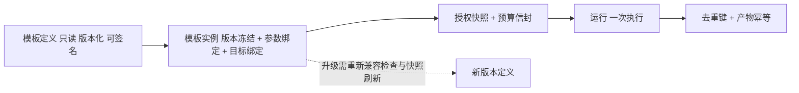
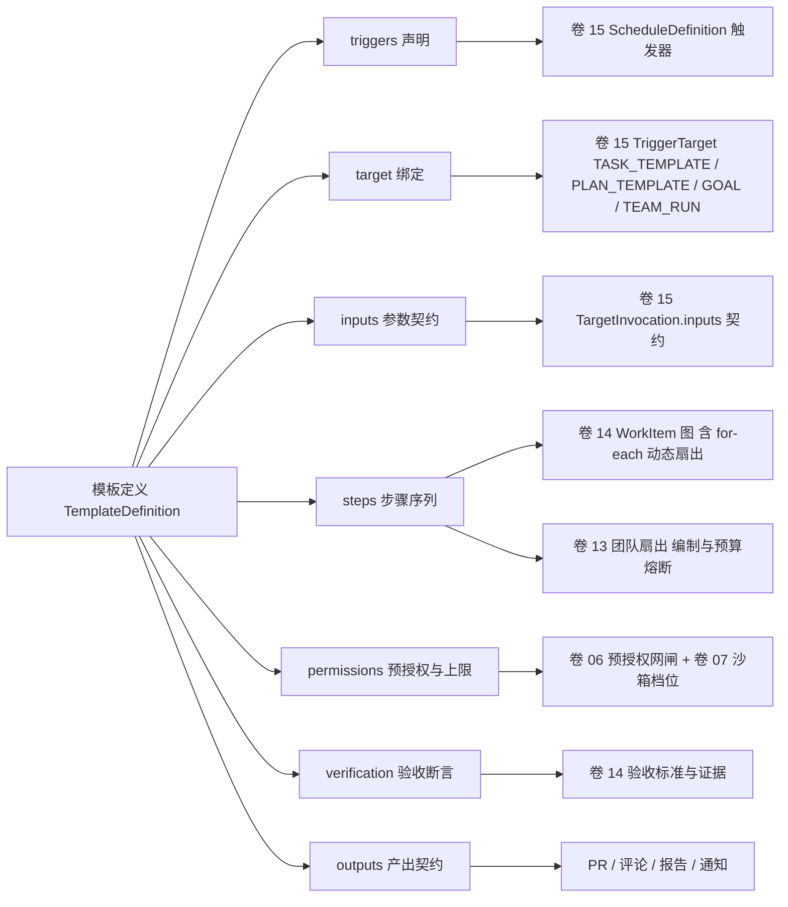
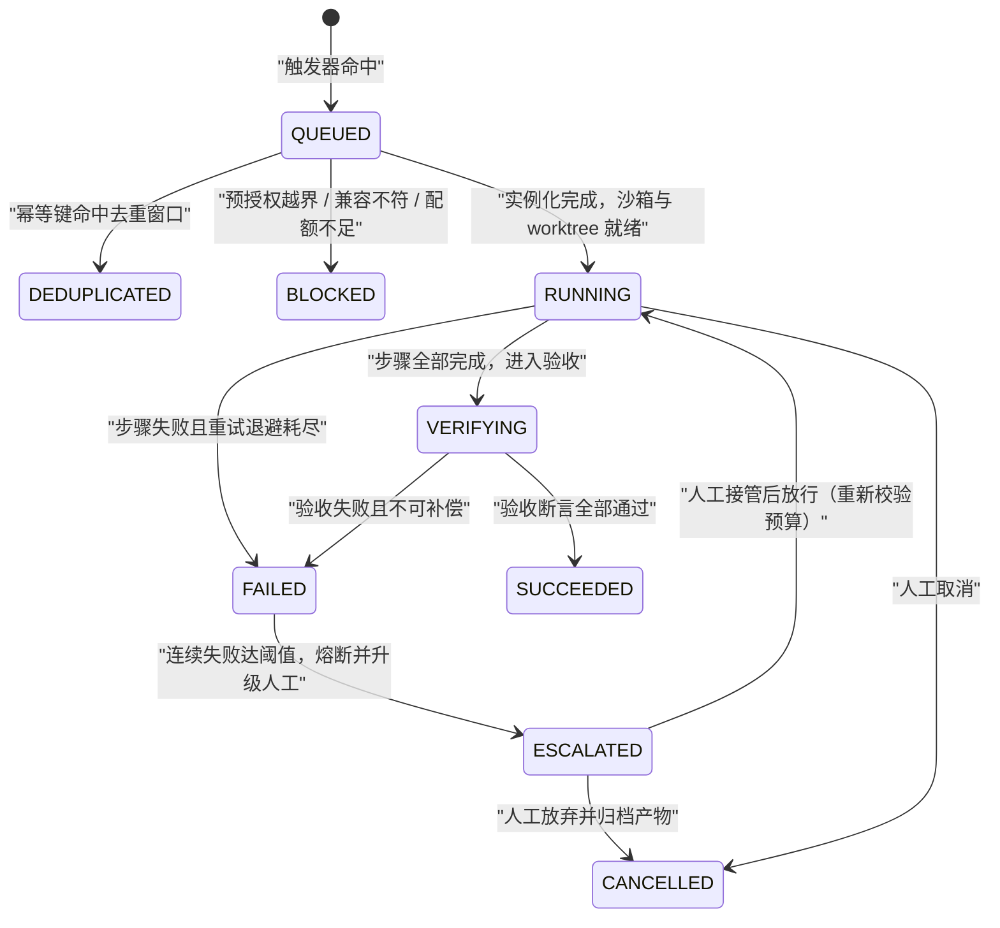

# 卷 34 · 自动化模板库（Automation Template Library）

> 本卷把「可复用的自动化工作流」做成一等资产：**模板 = 声明式编排 + 触发条件 + 参数契约 + 验收断言 + 呈现方式**。
> 卷 15 提供「何时触发、以什么约束启动、失败怎么熔断」的机制，本卷提供**可购买、可验证、可度量、可共享的场景资产**：模板模型 + 12 个内置模板族 + 权限上限 + 失败升级 + 效果度量。
>
> 需求来源：卷 00 §5.34（D34 自动化模板库，迭代轮次 3「真实工作流走查」与轮次 8「自动化场景库」）；竞品增量见 §2（Goose Recipe `[E1]`、DeepSeek Harness `workflow`/`webhookRuntime` `[E1]`、Claude Code hooks 与 Skill 化斜杠命令 `[E1][E2]`）。

---

## 1. 本卷定位

- **解决**：让「无人值守价值」可被直接启用与验证——把「依赖升级 / PR 巡检 / 文档同步 / 发布说明 / 事故复盘 / 技术债 / 周报 / 测试补齐 / Flaky / 许可证 / 汇总 / 仓库健康」这类高频场景做成**声明式、带验收、带权限上限**的模板，用户三步（装、配、启）即得结果。
- **不解决**：触发与调度机制（卷 15）、任务模型与依赖图（卷 14）、权限决策链（卷 06）、沙箱隔离技术（卷 07）、模板分发通道与签名基础设施（卷 29 Registry）、单点智能能力本体（卷 35）。
- **边界铁律**：**模板是配置，不是新的执行路径**。模板声明的每一步最终都必须落回「工具 → 权限决策 → 沙箱执行」链路；任何模板不得绕过卷 06/07，也不得请求卷 06 风险分级中的高危动作（见 §5.7 上限清单）。
- **与相邻卷的边界**：

| 相邻卷 | 卷 34 负责 | 相邻卷负责 |
| --- | --- | --- |
| 卷 15 Goal/Schedule | 模板的 `triggers[]` / `target` / `permissions` / `budget` 声明与实例化 | 触发求值、jitter、幂等键唯一约束、并发策略、熔断器状态机、通知路由 |
| 卷 14 Task/Plan | 每一步 → WorkItem、`for-each` → 动态扇出、验收断言 → 验收标准 | WorkItem 七态状态机、DAG 求解、证据收集与验收判定 |
| 卷 13 Teams | 模板声明「是否团队扇出、扇出上限、角色需求」 | 编制与角色库、拓扑、黑板、预算熔断 |
| 卷 06 / 07 | 模板声明预授权清单与上限；实例化时生成授权快照 | 决策链裁决、六档模式、企业基线、沙箱档位与执行隔离 |
| 卷 35 智能增强 | 编排、触发、权限、验收、呈现（场景层） | PR 描述、测试生成、Flaky 归类、文档漂移检测等单点能力（能力层） |

## 2. 原始意图与需求（REQ-AUTO-n）

| 需求 | 描述 | 来源 | 优先级 | 验收要点 |
| --- | --- | --- | --- | --- |
| REQ-AUTO-1 | 模板即一等资产：可声明、可版本化、可导出导入、来源可追溯（内置/私仓/市场） | 轮次 8；卷 00 §5.34 | P0 | 模板可导出为单文件包并在他租户导入；`provenance` 与 `version` 可查 |
| REQ-AUTO-2 | 模板结构完整且装载期 Fail-Fast：缺 `steps`/`verification`/`permissions`/`budget` 任一字段即拒绝装载 | 轮次 8；L-046 风险项（响应与验收须统一） | P0 | 非法模板装载抛业务异常并给出中文字段级原因 |
| REQ-AUTO-3 | 触发面完备：时间 / 事件 / 条件 / 手动 / 组合五类触发器 + 深链发起 | 卷 15 D-SCH-1/2；Goose `scheduler.rs` cron + deeplink `[E1]`（S12） | P0 | 同模板可配多触发器；深链发起需签名 + 二次确认（卷 29 D-ECO-11） |
| REQ-AUTO-4 | 参数与产出契约化：输入 schema（类型/枚举/范围/来源）+ 输出 schema（结构化产出），**同一份契约同时驱动参数校验与验收判定** | Goose `Recipe.parameters` / `response(JSON schema)` `[E1]`（L-046） | P0 | 缺参/越界给出中文提示；产出断言直接引用输出 schema 字段 |
| REQ-AUTO-5 | 预授权与权限上限：模板声明所需动作清单，动作仍走决策链；**模板不可自我提权**，且不得请求上限清单外动作 | 卷 06 D-PERM-1/6；卷 15 D-SCH-4 | P0 | 请求 `force-push`/生产写/密钥读取的模板在装载期被拒并产安全事件 |
| REQ-AUTO-6 | 幂等与去重：幂等键（模板 + 版本 + 目标 + 输入哈希）+ 去重窗口 + 「已存在产物则更新而非重复创建」 | 卷 15 D-SCH-3；轮次 8 | P0 | 重复触发不产生第二个 PR/报告；`automation.run.deduplicated` 事件可查 |
| REQ-AUTO-7 | 失败分级与人工接管：退避重试 → 换路降级 → 丢弃产物并报告 → 连续失败熔断；每档都有明确的人可介入点 | 卷 15 D-SCH-6；DeepSeek `GoalPhase.blocked` 需人类根权威 `[E1]` | P0 | 四级各自有用例；熔断打开后可一键接管或关闭 |
| REQ-AUTO-8 | 产物与呈现：PR / 评论 / 报告 / 通知四类产物，呈现格式按模板声明（摘要/详细/仅异常），通知走聚合中心不刷屏 | 轮次 8；卷 28 D-DIST-10 | P1 | 同一模板重复运行的评论为「更新」而非新增；通知可按级别静默 |
| REQ-AUTO-9 | 效果度量：节省人力时长、发现问题数、产物采纳率、单位成本四指标 | 轮次 8 | P1 | 四指标可在模板详情与周报中查询，且标注数据缺口 |
| REQ-AUTO-10 | 模板分发与升级：内置 + 组织私仓 + 签名市场；升级须兼容检查，且**不自动改动运行中实例** | 卷 29 Registry；卷 18 D-PLG-5 | P1 | 未签名模板在强制模式下被拒；升级给出兼容结论与实例影响面 |
| REQ-AUTO-11 | 模板发布门禁：干跑（dry-run）+ 沙箱试运行 + 产出断言，三者通过才可启用 | 轮次 8；卷 26 门禁矩阵 | P0 | 干跑报告含每步预期动作与权限；断言失败不可启用 |
| REQ-AUTO-12 | 默认只提 PR 不合并 + 独立 worktree 隔离 + 每运行独立分支 | 卷 21 D-GIT-2；轮次 8 | P0 | 自动化运行不得直接推主干；合并由人或 CI 门禁承担 |
| REQ-AUTO-13 | 组合编排：模板可链式（前序产出作为后序输入）、可团队扇出（多仓/多模块） | DeepSeek `workflow` 工具扇出子 agent `[E1]`；卷 13 | P1 | 链式编排在图上可视化；扇出受上限与预算钳制 |
| REQ-AUTO-14 | 审计与内容外发管控：每次运行全量事件化（触发源、步骤、决策、产出、成本）；模板不得外发代码内容（除声明的模型调用） | 卷 24 三级审计；卷 30 §4.7 | P0 | 运行详情可回放；未声明外发通道的模板尝试外发即拒绝并产安全事件 |
| REQ-AUTO-15 | 入站触发适配器：外部 Webhook 等事件经适配器注册规则转为本平台的运行实例（认证与签名绑定在适配器侧） | DeepSeek `ctx.webhookRuntime.register(rule)/dispatch(delivery)` `[E1]` | P2 | 未注册来源的投递被拒；适配器不可绕过模板权限上限 |
| REQ-AUTO-16 | 模板消费底层扩展机制（hooks / skills）而非自建钩子与命令体系 | Claude Code：hooks 五形态 + `PermissionRequest` 钩子不可绕过 deny；斜杠命令已并入 Skill `[E1][E2]` | P2 | 模板不引入第二套钩子点；能力扩展优先以 Skill/工具形式提供 |

**需求增量说明（竞品对标得到的四条新增，逐条给出采纳方式与理由）**

| 增量 | 竞品事实（证据等级） | 采纳方式 |
| --- | --- | --- |
| 模板 = 可调度资产（指令 + 提示 + 参数 + 响应 schema + 子模板 + cron + 深链） | Goose `Recipe{version,title,description,instructions,prompt,extensions,settings,parameters,response,sub_recipes}` + `scheduled_recipes/` + `schedule.json` + 深链 `[E1]`（对应 S12 / L-046） | 字段集对齐并升级为 REQ-AUTO-3/4/13：`inputs`/`outputs` 契约化、`triggers` 复用卷 15、深链必须签名 + 二次确认（卷 29 D-ECO-11） |
| 编排脚本化：把多次工具调用从模型回合搬到程序中，且子调用**重新进入完整受守卫管线** | DeepSeek `workflow` 工具（`agent()/parallel()/pipeline()/phase()`）与 PTC `run_code`（`maxParallelSubCalls` 限并发，权限/审计/沙箱不旁路）`[E1]` | 采纳为 REQ-AUTO-13 的团队扇出与链式编排：模板步骤等价于编排脚本，但**步骤类型受限**且子调用必经权限链与沙箱（D-AUTO-1-B2 + §5.7 能力单调收窄） |
| 入站触发适配器与「外部事件起会话」 | DeepSeek `ctx.webhookRuntime.register(rule)/dispatch(delivery)`，内建动作仅「创建普通根会话」，认证属适配器包 `[E1]` | 采纳为 REQ-AUTO-15：适配器只做「事件 → 运行实例」映射，规则与认证在适配器侧，模板权限上限不受适配器影响 |
| 会话本地调度与显式时区（最小间隔、绝对/相对/重复三种语义） | DeepSeek `schedule` 工具：`after_seconds` / 绝对 `at` / `every_seconds`（**至少 5 分钟**）、统一规范化 RFC 3339 UTC、显式时区 `[E1]` | 采纳为 REQ-AUTO-3 的时区与最小间隔约束（默认最小 5 分钟，模板可声明更短但受组织基线钳制），避免秒级抖动风暴 |
| 钩子与命令是自动化底座而非平行体系 | Claude Code：27–31 个钩子事件、五形态（命令/HTTP/MCP/提示词/子 Agent）、`PermissionRequest` 放行前重跑规则与计划校验、斜杠命令并入 Skill `[E1][E2]` | 采纳为 REQ-AUTO-16：模板不引入第二套钩子点；模板运行中的关键节点经卷 17 既有钩子暴露给组织策略 |

## 3. 设计空间（M×N）

### D-AUTO-1 模板格式

| 分支 | 描述 | 优点 | 代价与风险 | 得分 |
| --- | --- | --- | --- | --- |
| B1 纯 JSON | 严格结构，机器友好 | 校验简单、无歧义 | 无注释、可读性差，人工编写与评审成本高 | 61.0 |
| **B2 YAML + JSON Schema 校验 + 受限脚本步骤白名单** | 声明式 YAML 为主，步骤类型受限枚举，必要时允许「沙箱内受限脚本」作为单一 `run` 步骤 | 可读、可 diff、可静态治理；治理粒度到步骤类型 | 需自建校验器与错误文案 | **87.5** |
| B3 TS/JS 脚本 | 表达力最强，逻辑任意 | 复杂场景不设限 | 执行即任意代码：不可静态审计、权限面失控、企业无法治理 | 61.5 |
| B4 自然语言草图 DSL | 用户口述意图，模型补全 | 上手最快 | 不可复现、版本漂移、无法做权限前置校验 | 62.0 |

### D-AUTO-2 触发模型

| 分支 | 描述 | 优点 | 代价与风险 | 得分 |
| --- | --- | --- | --- | --- |
| B1 仅时间触发 | 只支持 cron/间隔 | 实现最简、可预测 | 无法响应仓库事件，价值打折 | 67.0 |
| **B2 五类触发器统一 + 深链发起** | 时间/事件/条件/手动/组合（复用卷 15 D-SCH-1），并支持签名深链一键发起（二次确认） | 覆盖真实工作流；与 Schedule 同源不新增机制 | 事件风暴与重复触发需去重与 jitter 兜底 | **90.5** |
| B3 模型自主触发 | 由 Agent 自主决定何时运行模板 | 灵活 | 不可审计、易烧钱、与「无人值守可控」冲突 | 45.5 |

### D-AUTO-3 权限与预授权

| 分支 | 描述 | 优点 | 代价与风险 | 得分 |
| --- | --- | --- | --- | --- |
| B1 继承发起者全权 | 用运行发起者的权限直接跑 | 零额外配置 | 越权面最大；无人值守场景等于长期开放全权 | 67.0 |
| **B2 预授权清单 + 权限上限 + 企业基线钳制** | 模板声明所需动作，实例化时生成授权快照；上限清单（禁 force-push/删除/生产写/密钥读取）不可突破；每个动作仍走卷 06 决策链 | 无人值守可用且可审计；越界即停 | 声明生成需向导预填，否则用户难写 | **90.5** |
| B3 每个动作逐项人工审批 | 最安全 | 完全失去无人值守价值 | 与产品定位冲突 | 63.0 |

### D-AUTO-4 参数化与响应 schema

| 分支 | 描述 | 优点 | 代价与风险 | 得分 |
| --- | --- | --- | --- | --- |
| B1 无参数 | 场景写死 | 使用零成本 | 同一模板无法跨仓/跨范围复用 | 61.5 |
| B2 弱类型键值参数 | 自由 `Map<String,Object>` | 表达随意 | 无约束易错，验收无法机械判定 | 70.0 |
| **B3 输入契约 + 输出契约双 schema** | 输入 schema 驱动参数校验与来源（用户/探测/上下文）；输出 schema 与验收断言共用同一份契约 | 一份契约两处用，杜绝「两套契约漂移」 | 契约维护成本上升，需模板作者教育 | **85.5** |

### D-AUTO-5 可见性与共享

| 分支 | 描述 | 优点 | 代价与风险 | 得分 |
| --- | --- | --- | --- | --- |
| B1 仅内置模板 | 官方维护 12 个 | 质量可控 | 组织无法沉淀自己的自动化资产 | 64.5 |
| B2 内置 + 组织私仓 | 组织可发布内部模板 | 可沉淀、可管控 | 无生态，模板质量参差 | 80.0 |
| **B3 内置 + 私仓 + 签名市场** | 三层来源，签名 + 准入 + 强制模式（未签名拒绝）+ 企业白名单 | 生态最大，长期护城河 | 供应链风险，须准入与隔离配套 | **88.0** |

### D-AUTO-6 执行沙箱与资源配额

| 分支 | 描述 | 优点 | 代价与风险 | 得分 |
| --- | --- | --- | --- | --- |
| B1 复用交互会话沙箱档位 | 用发起者当前档位 | 实现零成本 | 交互档位与批量运行需求错配（如交互允许 L2 写而巡检只需只读） | 79.0 |
| **B2 模板级独立档位 + 运行配额 + 独立 worktree** | 每模板声明最小档位（只读探测 L1 / 可写 L2）；运行配额（时长、工具调用、成本、扇出）；每运行独立 worktree 与分支 | 风险与需求匹配；资源可预算 | 启动开销上升 | **83.5** |
| B3 无隔离直连宿主 | 性能最好 | 与卷 07 铁律冲突 | 直接淘汰 | 37.5 |

### D-AUTO-7 失败升级

| 分支 | 描述 | 优点 | 代价与风险 | 得分 |
| --- | --- | --- | --- | --- |
| B1 固定次数重试 | 失败即重试 N 次 | 简单 | 放大损失（如对已损坏仓库反复重跑） | 64.5 |
| **B2 四级分级 + 人工接管入口** | 可重试 → 退避；需换路 → 降级（如从「升级依赖」降级为「只出报告」）；不可恢复 → 丢弃产物并报告；连续失败 → 熔断并升级人工 | 损失有界、路径清晰 | 分级判定需模板作者声明（提供默认值） | **87.5** |
| B3 首次失败即放弃 | 最保守 | 瞬时故障即失败，产出率低 | 可用性不足 | 63.0 |

### D-AUTO-8 效果度量与发布门禁

| 分支 | 描述 | 优点 | 代价与风险 | 得分 |
| --- | --- | --- | --- | --- |
| B1 无度量 | 装上就跑 | 零成本 | 价值不可证，无法优化与续购 | 52.0 |
| **B2 发布门禁 + 在线四指标** | 干跑 + 沙箱试运行 + 产出断言构成发布门禁；上线后采集节省时长/发现问题数/采纳率/单位成本 | 可证价值、可回归、可治理 | 度量需事件与计量打通 | **85.5** |
| B3 仅发布前测试 | 有门禁无度量 | 上线安全 | 无法回答「值不值得留」 | 67.5 |

## 4. 比选矩阵与选定

### 4.1 加权总分汇总（权重 F30 / U20 / S25 / M25）

| 决策 | 选定分支 | 加权总分 | 次优分支（分差） |
| --- | --- | --- | --- |
| D-AUTO-1 模板格式 | B2 YAML + Schema 校验 + 受限步骤 | 87.5 | B4 草图 DSL（62.0） |
| D-AUTO-2 触发模型 | B2 五类触发器统一 + 深链 | 90.5 | B1 仅时间（67.0） |
| D-AUTO-3 权限与预授权 | B2 预授权清单 + 上限 + 基线钳制 | 90.5 | B1 继承全权（67.0） |
| D-AUTO-4 参数化与响应 schema | B3 输入/输出双契约 | 85.5 | B2 弱类型（70.0） |
| D-AUTO-5 可见性与共享 | B3 内置 + 私仓 + 签名市场 | 88.0 | B2 内置 + 私仓（80.0） |
| D-AUTO-6 沙箱与配额 | B2 模板级档位 + 运行配额 + 独立 worktree | 83.5 | B1 复用交互档位（79.0） |
| D-AUTO-7 失败升级 | B2 四级分级 + 人工接管 | 87.5 | B1 固定重试（64.5） |
| D-AUTO-8 度量与门禁 | B2 门禁 + 四指标 | 85.5 | B3 仅发布前测试（67.5） |

**唯一最佳分支结论**：八维全部取加权最高分支，且两处并列（D-AUTO-2 与 D-AUTO-3 同为 90.5）不涉及同维比较；无违反全局铁律的分支入选（如 D-AUTO-6-B3「无隔离」在比选阶段即以违反卷 07 铁律淘汰）。

**比选矩阵维度核验（R02）**：本卷 §3/§4 比选覆盖 **8 个决策维度**（D-AUTO-1…8，每维 2–4 个候选分支），满足「比选矩阵 ≥5 决策维度」硬性要求；实现侧（`impl/31-automation-library-impl.md`）逐维登记 I-AUTO-1…8 一一对应，无维度遗漏。

**REQ 编号使用说明（R02）**：本卷 §2 的 `REQ-AUTO-1…16` 为权威号；实现方案 `impl/31` 的 `REQ-AUTO-1…16` **严格同号同义引用**本表（仅补实现级验收加强），另有 `REQ-AUTO-17/18` 两条 impl 层新增需求（本卷无同号），不存在同串不同义。

### 4.2 域内决策登记（D-AUTO-1…8）

| 分叉维度 | 候选分支 | 选定 | 理由（F/U/S/M 加权） | 回退触发 |
| --- | --- | --- | --- | --- |
| **D-AUTO-1 模板格式** | ① 纯 JSON ② **YAML + JSON Schema 校验 + 受限脚本步骤白名单** ③ TS/JS 脚本 ④ 自然语言草图 DSL | ② | F：覆盖 12 场景且留扩展位；S：静态可校验、无任意代码执行面；M：可 diff、可评审、可签名；U：人工可写可读。③ 在企业审计面不可接受，④ 不可复现，① 可读性差 | Schema 误报率 > 2% 或 3 个以上模板受表达力阻塞 → 扩展受限脚本步骤白名单（仍不把脚本升为一等形态） |
| **D-AUTO-2 触发模型** | ① 仅时间触发 ② **五类触发器统一 + 深链发起** ③ 模型自主触发 | ② | F：覆盖「定时 + 仓库事件 + 条件 + 手动」全场景；S：完全复用卷 15 机制，零新增调度器；M：触发源可审计；U：深链一键发起降门槛。③ 与「可审计的无人值守」冲突 | 事件触发风暴（重复触发率 > 10%）→ 收紧为「定时 + 手动」，事件降级为条件探针（先依赖卷 15 jitter 与去重） |
| **D-AUTO-3 权限与预授权** | ① 继承发起者全权 ② **预授权清单 + 权限上限 + 企业基线钳制（动作仍走决策链）** ③ 逐项人工审批 | ② | F：无人值守可用；S：复用卷 06 决策链与卷 15 预授权，双保险（静态门 + 动态链）；M：授权快照可审计可回放；U：免逐项打断。① 越权不可控，③ 与定位冲突 | 预授权静态校验误报 > 1%（合法模板被拒）→ 改为「实例化时校验 + 首运行审批」两步放行，后续运行沿用快照 |
| **D-AUTO-4 参数化与响应 schema** | ① 无参数 ② 弱类型键值参数 ③ **输入契约 + 输出契约双 schema** | ③ | F：一套契约同时驱动参数校验、探测补全与验收判定；S：校验器离线可测；M：契约可版本化、可兼容检查；U：错误提示精确到字段。② 无法机械验收 | 输出 schema 覆盖不了报告类自由文本产出 → 允许 `outputs` 声明 `freeform` 类型，仅校验最小字段与长度上限，但验收断言仍须引用结构化字段 |
| **D-AUTO-5 可见性与共享** | ① 仅内置 ② 内置 + 组织私仓 ③ **内置 + 私仓 + 签名市场（白名单 + 强制模式）** | ③ | F：生态与组织沉淀兼得；M：三层来源 + 签名 + 准入形成长期护城河；S：复用卷 29 Registry 与卷 18 供应链能力；U：市场即装即用。① 无法沉淀，② 无生态 | 市场模板发生 1 起质量或安全事件 → 强制模式默认开启，白名单改为默认最小集，市场同步频率降为手动 |
| **D-AUTO-6 沙箱与资源配额** | ① 复用交互会话档位 ② **模板级独立档位 + 运行配额 + 独立 worktree** ③ 无隔离直连宿主 | ② | F：档位与场景匹配（巡检只读、升级可写）；S：复用卷 07 五档与卷 21 隔离；M：配额可预算、可审计；U：失败可控。③ 违反卷 07 铁律直接淘汰 | 沙箱启动开销使调度 P95 > 5s → 允许同模板复用预热会话（仍强制独立 worktree 与分支，成本记入运行账本） |
| **D-AUTO-7 失败升级** | ① 固定次数重试 ② **四级分级（退避重试/换路降级/丢弃产物与报告/连续失败熔断）+ 人工接管** ③ 首次失败即放弃 | ② | F：损失有界且产出率可保；S：熔断复用卷 15 D-SCH-6；M：每档可观测可审计；U：接管入口明确。① 放大损失，③ 产出率过低 | 人工接管积压（待接管 > 24h 未处理）→ 降级为「自动归档 + 日报聚合 + 告警」，并暂停该模板后续触发 |
| **D-AUTO-8 度量与发布门禁** | ① 无度量 ② **干跑 + 沙箱试运行 + 产出断言（发布门禁）+ 在线四指标** ③ 仅发布前测试 | ② | F：价值可证、可持续优化；S：干跑成本低（不产生真实副作用）；M：四指标接入门禁矩阵（卷 26）；U：用户看得到收益。① 不可证价值，③ 无法回答去留 | 度量数据缺口 > 20% → 只保留运行级统计（次数/成功率/成本），取消「节省人力时长」估算并明示口径 |

> **编号说明（供 `DECISIONS.md` 同步）**：本卷重发行版本将域内决策收敛为 D-AUTO-1…8。早前草案中的「模板测试」「组合编排」「通知汇报」「与 CI 分工」四项主题分别并入 D-AUTO-8（门禁）、D-AUTO-2/5（触发与共享）、D-AUTO-8（度量）、D-AUTO-3/7（权限与失败升级），无主题丢失。早期草案（原 `34-automation-playbooks.md`，D-AUTO-1…10）已归档为 `docs/harness/archive/34-automation-playbooks.superseded.md`（不删除、无约束力）；其独有内容与逐条决策归属映射见文末附录。

### 4.3 被放弃分支的代价与回退路径

| 被放弃分支 | 放弃代价 | 回退路径（触发条件见 4.2 末列） |
| --- | --- | --- |
| D-AUTO-1-B3 脚本模板 | 放弃「任意逻辑表达力」，复杂编排只能靠步骤枚举组合 | 扩展受限脚本步骤白名单 + 提升步骤类型数量；不改为一等脚本形态 |
| D-AUTO-2-B3 模型自触发 | 放弃「模型自主发现该自动化的时机」 | 以条件触发器 + 事件探针近似（仍受幂等与预算钳制） |
| D-AUTO-3-B3 逐项审批 | 放弃最严格的人工把关（改为静态上限 + 决策链 + 首运行确认） | 企业基线可将高风险模板强制回退为「首运行逐项审批」模式 |
| D-AUTO-6-B3 无隔离 | 放弃宿主直连的低延迟 | 不提供回退（违反卷 07 铁律）；性能问题以预热会话解决 |
| D-AUTO-8-B3 仅发布前测试 | 放弃上线后度量（改为门禁 + 四指标并行） | 数据管道故障时降级为运行级统计（见 D-AUTO-8 回退触发） |

## 5. 选定方案详设

### 5.1 模板模型（TemplateDefinition）

| 字段 | 说明 | 必填 |
| --- | --- | --- |
| `id` / `name` / `version` | 全局唯一标识 + 展示名 + 语义化版本（模板实例绑定版本，升级不自动迁移） | 是 |
| `summary` / `why` | 一句话说明 + 价值主张（用于产品页与向导推荐） | 是 |
| `category` / `tags` | 场景分类（依赖/巡检/文档/发布/运维/质量/治理）与检索标签 | 是 |
| `riskLevel` | 声明的风险级别（R0–R3），装载期与 `permissions` 交叉校验：声明与实际动作不匹配即拒绝 | 是 |
| `inputs[]` | 参数契约：名称、类型、枚举/范围、默认值、来源（用户/探测/上下文）、是否必填 | 是 |
| `outputs[]` | 产出契约：类型（`pr`/`comment`/`report`/`notification`/`file`）、schema 引用、存放位置、`freeform` 标记 | 是 |
| `triggers[]` | 五类触发器声明（含时区、防抖、节流），映射为卷 15 `TriggerSpec` | 是 |
| `target` | 触发对象绑定：任务模板 / 计划模板 / Goal / 会话模板 / 团队运行 | 是 |
| `steps[]` | 声明式步骤序列：`detect`/`filter`/`for-each`/`apply`/`run`/`verify`/`open-pr`/`report` 等受限类型 | 是 |
| `permissions` | 预授权动作清单（`allow[]`）+ 权限上限（`ceiling`） | 是 |
| `budget` | 默认预算：成本上限、时长上限、工具调用上限、扇出上限 | 是 |
| `verification` | 验收断言：引用 `outputs` schema 字段或可执行断言（构建/测试/扫描结果），必须可机械判定 | 是 |
| `failure` | 四级失败策略声明（重试退避参数 / 降级目标 / 丢弃产物规则 / 熔断阈值） | 是 |
| `presentation` | 呈现声明：汇报格式（摘要/详细/仅异常）、呈现位（PR/评论/报告/通知/看板）、语言 | 是 |
| `metrics` | 度量声明：四指标的采集口径与目标值 | 否 |
| `compat` | 兼容区间：所需内核契约版本、所需工具/技能集合 | 是 |
| `provenance` / `signature` | 来源（builtin/org-repo/market）+ 发布签名（市场与私仓分发必填） | 否 |

### 5.2 三层模型与幂等身份



- **模板定义（TemplateDefinition）**：只读、版本化、可签名；同一 `id` 可有多个 `version` 并存。
- **模板实例（TemplateInstance）**：`定义版本 + 参数绑定 + 目标绑定 + 授权快照 + 预算` 的冻结体；实例可暂停/恢复/升级（升级须重新做兼容检查与授权快照刷新）。
- **运行（TemplateRun）**：实例的一次具体执行，持有触发源、幂等键、步骤账本、产物引用与成本。
- **幂等身份**：`idempotencyKey = hash(templateId, version, targetRef, inputsDigest)`；去重窗口内重复触发直接落 `DEDUPLICATED`；产物侧再做一次「已存在则更新」的二次幂等（同 PR 评论复用同一条评论）。`inputsDigest` 只对**影响行为**的参数取哈希（如 `scope`、`max_prs`），展示类参数（语言、汇报格式）不参与，避免仅改格式即绕过去重。

### 5.3 与 Goal / Schedule / Teams / Task 的绑定



| 绑定对象 | 绑定方式 | 关键约束 |
| --- | --- | --- |
| 卷 15 Schedule | 模板 `triggers[]` → `TriggerSpec`；`target` → `TriggerTarget.TEMPLATE`（经 `TargetInvocation` 携带参数与授权快照） | 模板不自建定时器；幂等键、jitter、并发策略、熔断全部由卷 15 承担 |
| 卷 14 Task | 每个 `step` → 一个 WorkItem；`for-each` → 运行动态生成子 WorkItem（扇出上限来自 `budget`）；`verification` → 验收标准与证据 | 待人工的降级分支产 `BLOCKED` 类任务，不静默丢弃 |
| 卷 13 Teams | `steps` 中声明 `fanout: team` 的步骤 → 团队运行（角色需求 + 黑板 + 预算熔断） | 团队扇出上限并入运行预算；团队产出必须回填到模板 `outputs` 契约 |
| 卷 12 Agent | 每个 `apply`/`run` 步骤 = 一次受限 Turn（会话模板 + 步骤级能力收窄） | 步骤不得扩大能力集（单调收窄，见 §5.7） |
| 卷 21 Git | `open-pr` 步骤经提交/推送/PR 通道执行 | 独立 worktree + 独立分支；禁 force-push；默认不合并 |

### 5.4 运行机制（主路径）

1. **触发**：卷 15 求值命中 → 生成 `runId` 与幂等键 → 去重判定。
2. **前置校验**：模板启用状态、兼容区间、许可证与配额、预授权静态校验（越界即 `BLOCKED` 并产事件）。
3. **实例化**：参数绑定（用户输入 + 探测补全 + 上下文推导）→ 生成授权快照与预算信封。
4. **环境准备**：按模板档位申请沙箱会话 + 独立 worktree + 分支。
5. **步骤展开**：`steps[]` → WorkItem 图（含扇出与依赖），步骤级能力收窄。
6. **执行与自检**：逐步执行；关键步骤后运行局部断言（构建/测试/扫描），失败进入失败策略。
7. **验收**：`verification` 断言对产出做机械判定；全部通过 → `SUCCEEDED`。
8. **呈现与度量**：产物落位（PR/评论/报告）→ 按 `presentation` 格式汇报（经通知聚合）→ 采集四指标。

**异常与补偿分支（与 §5.5 状态机一一对应）**

| 分支点 | 触发 | 处置 |
| --- | --- | --- |
| 触发即重复 | 幂等键命中窗口 | 落 `DEDUPLICATED`，不启动沙箱；事件保留触发源与命中的历史 `runId`，便于解释「为什么没跑」 |
| 前置校验失败 | 预授权越界 / 兼容不符 / 配额不足 | 落 `BLOCKED`；**不消耗预算**；通知级别「需处理」并给出一键修正入口（改实例参数或申请授权） |
| 环境准备失败 | 沙箱不可用 / 工作区不可达 / 无权限建分支 | 退避重试（次数与间隔来自 `failure` 声明）；仍失败 → `FAILED`，不产生半成品产物 |
| 步骤失败 | 构建/测试/扫描失败或工具异常 | 优先重试（幂等步骤）→ 需换路则降级（如「升级依赖」降为「只出报告」）→ 不可恢复则丢弃分支与临时产物，仅保留报告 |
| 验收失败 | 断言实际值不符 | 落 `VERIFYING → FAILED`；证据（断言、实际值、日志引用）随报告呈现；连续失败达阈值 → 熔断 + 升级人工 |
| 人工取消 | 运行中人工介入 | 落 `CANCELLED`；默认丢弃分支、保留报告；正在执行的步骤等待安全点退出（不强杀） |

**幂等与并发点**：① 触发层——卷 15 幂等键唯一约束（DB）+ Redis 去重标记（快速路径）；② 实例层——同实例串行（单实例同时仅一个活跃运行）；③ 产物层——`(模板, 目标, 幂等键)` 唯一定位，更新而非新建；④ 预算层——成本记账幂等（同 `runId` 重复上报去重）。

### 5.5 运行状态机



**模板本身的生命周期**：`INSTALLED → ENABLED / DISABLED → DEPRECATED → REMOVED`；`ENABLED` 与 `DISABLED` 之间由人工或熔断驱动；`DEPRECATED` 必须给出替代模板建议；运行中实例不随模板升级自动迁移。

### 5.6 十二个内置模板族

| # | 模板 | 触发 | 关键步骤 | 权限与上限 | 产物与失败策略 |
| --- | --- | --- | --- | --- | --- |
| 1 | **依赖升级**（deps-upgrade） | 周定时 + 依赖过期事件 | 检测过期依赖 → 安全优先过滤 → 逐个升级 → 构建与测试 → 提 PR（限 `max_prs`） | 工作区写 + 构建/测试 + 分支/提交/推送 + PR；禁 force-push | PR × N + 报告；构建失败丢弃分支并报告；超限停止 |
| 2 | **PR 巡检**（pr-triage） | PR 创建/更新事件 | 读 diff → 规则检查（规范/测试/危险模式/敏感信息/许可证头）→ 产出 SARIF/JSON → 单条评论更新 | 只读 + 评论；禁写代码 | 审查评论；分析失败仅标注「未完成分析」（不产出错误结论） |
| 3 | **文档同步**（docs-sync） | 主分支合并事件（路径过滤） | 检测代码/API/配置/命令变化 vs 文档（知识库漂移检测）→ 生成修订 PR 或报告 | 只读 + 写文档目录 | 文档 PR / 报告；冲突转人工并标注冲突位置 |
| 4 | **发布说明**（release-notes） | 标签/发布事件 | 收集提交 → 归类 feat/fix/breaking → 生成发布说明（双语）→ 更新 CHANGELOG | 只读 + 写 CHANGELOG | 发布说明 + CHANGELOG 更新；分类置信度低 → 标记待确认 |
| 5 | **事故复盘**（incident-postmortem） | 事故关闭事件 | 事件总线回放聚合时间线（事件/变更/告警）→ 按卷 32 §6 模板生成复盘草稿 → 待人工完善 | 只读 | 复盘草稿；数据缺口 → 列缺口清单，不臆造时间线 |
| 6 | **技术债巡检**（tech-debt-scan） | 周定时 | 扫描（重复率/超长函数/陈旧 TODO/过时依赖/覆盖率下降）→ 排序 → 报告（可选转链式清理模板） | 只读（产出 PR 需扩展授权） | 技术债报告（+ 候选清理 PR）；扫描超时 → 分模块续跑 |
| 7 | **指标周报**（metrics-weekly） | 周定时 | 聚合活力/成本/质量/自动化收益指标（含环比）→ 生成周报 | 只读 | 周报（Markdown / IM / 邮件）；数据不全 → 标注缺失来源 |
| 8 | **测试补齐**（test-gap-fill） | 覆盖率下降事件 + 周定时 | 定位未覆盖关键路径 → 生成测试（卷 35 能力）→ 沙箱运行验证 → 提 PR | 写测试文件 + 运行 | 测试 PR + 覆盖率变化；生成测试不通过 → 丢弃并报告 |
| 9 | **Flaky 检测**（flaky-hunt） | 测试失败事件（含重跑判定） | 识别不稳定用例 → 归因（时序/网络/共享状态）→ 报告 + 低风险修复 PR | 只读 + 写测试文件 | 报告 + 修复 PR；无法判定 → 进入观察清单（不误改） |
| 10 | **依赖许可证审计**（license-audit） | 月定时 + 依赖变更事件 | 收集依赖许可证 → 对照组织白名单 → 违规清单 + 替代建议 | 只读 | 合规报告；白名单缺失 → 全部标「待定级」而非放行 |
| 11 | **周报汇总**（weekly-digest） | 周定时（依赖其它模板产出） | 聚合本周各模板运行结果与人工进度 → 单份汇总（含自动化收益章节） | 只读 | 汇总报告 + 通知；上游数据缺失 → 标注并降级为部分汇总 |
| 12 | **仓库健康巡检**（repo-health） | 周定时 | 检查构建状态/过期分支/大文件/worktree 残留/CI 时长/依赖陈旧度 → 健康分 + 建议清单 | 只读 | 健康报告（可选看板卡片）；单检查项失败 → 该项标记「未采集」 |

**价值主张示例**（用于向导推荐与产品页）：依赖升级每周每仓节省 1–3 小时人工并把安全补丁暴露窗口中位数从 14 天压到 2 天；PR 巡检减少 20–30% 评审往返；事故复盘准备时间从 2 小时降到 15 分钟。

**十二个模板的档位、预算与失败映射**

| # | 模板 | 声明风险 | 沙箱档位 | 默认预算（成本/时长/调用/扇出） | 失败四级映射 | 度量主指标 |
| --- | --- | --- | --- | --- | --- | --- |
| 1 | 依赖升级 | R2 | L2 可写 | $20 / 60min / 400 / 1 | 重试构建 → 降级报告 → 丢弃分支 → 熔断 | 节省时长、PR 采纳率 |
| 2 | PR 巡检 | R1 | L1 只读 | $3 / 15min / 120 / 1 | 重试分析 → 降级「未完成分析」 → 不产结论 | 发现问题数 |
| 3 | 文档同步 | R2 | L2 可写（限文档目录） | $10 / 40min / 240 / 1 | 重试生成 → 冲突转人工 → 丢弃文档 PR | 节省时长、报告采纳率 |
| 4 | 发布说明 | R1 | L1 只读 | $5 / 20min / 150 / 1 | 重试归类 → 低置信标记待确认 | 节省时长 |
| 5 | 事故复盘 | R0 | L1 只读 | $4 / 20min / 120 / 1 | 数据缺口列清单（不重试臆造） | 节省时长 |
| 6 | 技术债巡检 | R1 | L1 只读 | $8 / 30min / 200 / 1 | 超时 → 分模块续跑 | 发现问题数 |
| 7 | 指标周报 | R0 | L1 只读 | $2 / 10min / 80 / 1 | 数据不全 → 标注缺失来源 | 单位成本 |
| 8 | 测试补齐 | R2 | L2 可写（限测试目录） | $15 / 45min / 300 / 4 | 生成测试不通过 → 丢弃并报告 → 熔断 | PR 采纳率、发现问题数 |
| 9 | Flaky 检测 | R2 | L2 可写（限测试目录） | $12 / 40min / 260 / 4 | 无法判定 → 观察清单（不误改） | 发现问题数 |
| 10 | 许可证审计 | R0 | L1 只读 | $3 / 15min / 100 / 1 | 白名单缺失 → 全量待定级（不放行） | 发现问题数 |
| 11 | 周报汇总 | R0 | L1 只读 | $2 / 10min / 80 / 1 | 上游缺失 → 部分汇总 + 标注 | 单位成本 |
| 12 | 仓库健康巡检 | R0 | L1 只读 | $6 / 25min / 180 / 1 | 单项失败 → 标记「未采集」 | 发现问题数 |

**模板声明片段（两个示例，展示「非运行定义」的写法）**

```yaml
id: builtin.pr-triage
version: 1.4.0
category: review
riskLevel: R1
why: "首轮人工评审前自动发现规范、测试与安全类问题，减少往返"
inputs:
  severityFloor: { type: string, enum: [info, warn, error], default: warn, source: user }
  pathFilter:    { type: string, default: "**/*", source: user }
outputs:
  - type: comment
    schema: pr-triage-comment@1
    when: always          # 单条评论更新，不重复创建
triggers:
  - event: { source: platform, kind: pull_request.opened | pull_request.updated }
permissions:
  allow: [workspace.read, repo.comment]
  ceiling: read-only
budget: { costUsd: 3, durationMin: 15, toolCalls: 120, fanout: 1 }
verification:
  - assert: comment.created
  - assert: findings.every(f => f.evidenceRef != null)
failure:
  onAnalysisError: { retry: 1, degradeTo: "comment:analysis-incomplete" }
presentation: { format: summary, language: follow-user }
```

```yaml
id: builtin.deps-upgrade
version: 2.1.0
category: dependency
riskLevel: R2
inputs:
  scope:  { type: string, enum: [patch, minor], default: patch, source: user }
  maxPrs: { type: integer, min: 1, max: 10, default: 3, source: user }
outputs:
  - type: pr
    schema: deps-upgrade-pr@2
  - type: report
    schema: deps-upgrade-report@2
steps:
  - detect: outdated-dependencies
  - filter: { severity: security-first, scope: "${scope}" }
  - for-each: candidate
    - apply: upgrade
    - run: [build, test]
    - verify: no-regression
    - open-pr: { title: "chore(deps): bump ${pkg}", labels: [automated, deps] }
permissions:
  allow: [workspace.write, command.build, command.test, git.branch, git.commit, git.push, pr.create]
  ceiling: no-force-push
budget: { costUsd: 20, durationMin: 60, toolCalls: 400, fanout: 1 }
verification:
  - assert: build.success && test.success
  - assert: diff.touchedOnly(["**/package.json", "**/package-lock.json"])
failure:
  onBuildFailed: { action: discard-branch-and-report }
  onLimitExceeded: { action: stop-and-report }
```

> 说明：`${scope}`、`${pkg}` 等占位符在**参数校验之后**展开，展开值进入命令行前必须转义（见 §5.7 输入校验）；模板声明中不允许出现 shell 管道、重定向与网络下载。

### 5.7 权限与安全约束（跨模板）

| 约束 | 说明 |
| --- | --- |
| 不自我提权 | 模板只能在**实例化时由授权主体授予**的权限集内行动；模板自身无法修改权限、无法提升上限、无法安装其它模板 |
| 上限清单（不可请求） | `force-push`、删除他分支、生产环境写、密钥/凭据读取、审计日志改写、权限与策略修改、模板自修改 |
| 动作仍走决策链 | 预授权只是静态门；每个动作仍需卷 06 决策链裁决，`deny` 不可被模板声明覆盖 |
| 能力单调收窄 | 步骤级能力集 ⊆ 运行级授权快照 ⊆ 实例化时授予集；任何一步不得扩大 |
| 默认不合并 | 自动化只提 PR；合并由人或 CI 门禁执行 |
| 分支与工作区隔离 | 每运行独立 worktree 与分支；失败默认丢弃分支（保留运行日志与报告） |
| 预算硬上限 | 成本/时长/工具调用/扇出四项硬上限；超限即停并报告 |
| 输入校验 | 参数进入命令行前必须转义（防注入）；来源非用户的参数需标记 `probe` |
| 内容外发管控 | 模板不得外发代码内容（除声明的模型调用与 PR 通道）；报告外发须显式配置 |
| 审计 | 每次运行产生完整事件链（触发源、步骤、决策、产物、成本），可回放 |

### 5.8 产物、呈现与度量

| 维度 | 设计 |
| --- | --- |
| 产物类型 | `pr`（代码类）、`comment`（评审类）、`report`（分析类，Markdown + JSON 双份）、`notification`（提醒类）、`file`（落盘附件） |
| 幂等更新 | 产物按 `(模板, 目标, 幂等键)` 唯一定位：已存在则更新（评论更新、PR 追加提交、报告覆盖版本） |
| 呈现格式 | 模板声明「摘要 / 详细 / 仅异常」；异常呈现必须含失败步骤、原因、已采取动作、建议动作与运行链接 |
| 通知路由 | 走卷 28 通知聚合中心：级别（信息/需关注/需处理）→ 渠道；同源重复通知合并；可静默窗口 |
| 效果度量 | ① 节省人力时长（任务基准时长 × 完成次数，缺基准时标注估算）② 发现问题数（按类型与严重度）③ 产物采纳率（PR 合并率 / 报告被引用率）④ 单位成本（成本 ÷ 有效产出） |

## 6. 扩展点与插件面（供卷 18 汇总）

| 扩展点 | 形态 | 稳定性 | 说明 |
| --- | --- | --- | --- |
| `TemplateFormatSPI` | 进程内 | stable | 新增模板声明格式（默认仅 YAML 一种；扩展格式须自带校验器并禁用脚本求值） |
| `TemplateLintRuleSPI` | 进程内 | evolving | 组织自定义静态校验规则（命名规范、必填标签、成本上限） |
| `TemplateStepSPI` | 进程内 | stable | 新增受限步骤类型；注册须声明风险级别与权限需求，供装载期交叉校验 |
| `ParameterSourceSPI` | 进程内 | evolving | 参数来源扩展（仓库探测、环境探测、知识库推导）；返回值进入契约校验 |
| `VerificationAssertSPI` | 进程内 | stable | 验收断言扩展（构建/测试/扫描/自定义断言器）；必须有确定性输出 |
| `ArtifactRendererSPI` | 进程内 | evolving | 产物呈现器（PR 评论模板、报告版式、看板卡片、IM 富文本） |
| `AutomationMetricsSPI` | 进程内 | evolving | 度量采集扩展（外部制指标源）；失败不得影响运行主链路 |
| `AutomationTriggerAdapterSPI` | 进程内 / 进程外 | evolving | 入站触发适配器（Webhook、IM 指令、CI 回调）；认证与签名在适配器侧完成 |
| `AutomationApprovalSPI` | 进程内 / 远程 | evolving | 人工接管与审批通道（界面、IM、工单系统）；缺省通道不可用时 fail-closed |

## 7. 事件与可观测

| 事件 | 触发时机 |
| --- | --- |
| `automation.template.installed` / `enabled` / `disabled` / `deprecated` / `removed` | 模板生命周期（含来源与签名结论） |
| `automation.template.selfmodify.denied` | 模板尝试修改自身或提升权限（安全事件） |
| `automation.instance.created` / `updated` / `paused` / `resumed` | 实例生命周期（含授权快照摘要） |
| `automation.run.started` / `step.started` / `step.completed` | 运行与步骤进度（供 UI 与诊断） |
| `automation.run.verification.failed` | 验收失败（含断言、实际值、证据引用） |
| `automation.run.completed` / `failed` / `escalated` / `cancelled` / `deduplicated` / `blocked` | 运行终态（含原因与成本） |
| `automation.artifact.created` / `updated` | 产物落位（类型、位置、幂等更新标记） |
| `automation.value.measured` | 四指标采集（含数据缺口标记） |
| `automation.market.synced` / `market.sync.failed` | 市场与私仓同步结果 |

**指标**：`oc_automation_runs_total{template,outcome}`、`oc_automation_run_duration_seconds{template}`、`oc_automation_success_ratio{template}`、`oc_automation_cost_usd_total{template}`、`oc_automation_artifact_adopt_ratio{template}`、`oc_automation_findings_total{template,severity}`、`oc_automation_takeover_backlog`。

**日志与审计**：装载/校验/实例化/每次运行的关键步骤均按 `.qoder/rules/logging-rules.md` 打点（中文、占位符、异常传 `Throwable`）；审计面记录「谁在何时授予了什么权限快照、运行对哪些目标做了哪些动作」。

**追踪（trace）**：`automation.run` 为根 span，子 span 覆盖「触发求值 → 去重 → 预授权校验 → 沙箱与 worktree 准备 → 每个步骤 → 验收 → 产物提交 → 通知」；步骤 span 必须携带 `templateId`/`version`/`runId`/`stepIndex`，便于跨「调度—执行—产物」归因。

**审计记录（保留期对齐卷 24 三级审计）**

| 审计项 | 内容 | 级别 |
| --- | --- | --- |
| 授权快照 | 授予人、授予时间、动作清单、上限、企业基线版本 | 强制（不可关闭） |
| 模板来源与签名 | 来源（内置/私仓/市场）、签名主体、哈希、安装人 | 强制 |
| 运行动作 | 每步实际工具调用与文件/仓库影响面（含被拒绝动作） | 强制 |
| 内容外发 | 外发的目标通道、字段范围（脱敏后摘要） | 条件（按组织 DLP 策略） |
| 度量上报 | 上报字段与缺口标记 | 可关闭（企业可强制关闭遥测） |

> **实现落点与批次（R07 可落地性登记）**：本卷的实现落点为 `harness-contract`（包 `contract/automation`）+ `harness-kernel/kernel-work/automation` + `harness-platform/{platform-persistence,platform-runtime-store}` + `harness-host/host-automation`（**扩展模块**，待卷 27 §4.1 登记；未登记前落 `host-app` + `host-protocol` 的 `automation.*` 面）——详见 `impl/31-automation-library-impl.md` §1.5「落地登记」。
> **实施顺序**：卷 27 §4.5 第 17 步（Skill 装载/激活邻域）至第 19 步（Teams/Goal/Schedule）之间，**不得早于第 14 步**（任务/计划模型与 WorkItem 租约是运行引擎前置）。
> **数据迁移批次**：`oc_automation_*` 表族未在卷 27 §4.4 的 B1–B6 明列 → 建议新增批次 **B10 自动化、智能增强与前沿实验**（登记见 `reviews/R07-scope-build-platform.md` §2，不改本卷）。

## 8. 非功能设计

- **性能**：单模板解析 + 校验 ≤ 50ms；模板仓列表查询 P95 ≤ 80ms；触发到实例化调度开销 P95 ≤ 2s（与卷 15 I-GOAL-2 一致）；干跑在只读模式下 ≤ 60s（可配）。
- **并发**：单租户并发运行数默认 4（可配，上限 32）；同一模板并发默认 1（避免互相踩分支）；团队扇出 ≤ 8、跨仓批量扇出 ≤ 32；超限排队而非拒绝，排队超时给「已排队 + 预计位次」。
- **容量**：单运行事件量 ≤ 3 + 步骤数 × 2（默认 ≤ 120 条）；运行账本按月分区，保留期默认 90 天（度量聚合保留 3 年，成本数据跟随卷 31 口径）。
- **安全**：模板即不可信输入（即便来自私仓）——装载期校验 + 沙箱内运行 + 能力单调收窄 + 上限清单 + 内容外发管控；市场模板强制签名校验，未签名在强制模式直接拒绝。
- **降级**：市场不可用 → 用本地缓存模板集并标记「离线」；通知通道不可用 → 降级为界面提示与日志；模型不可用 → 报告类模板降级为「数据摘要 + 待人工分析」，可写类模板直接 `FAILED`（不产生半成品 PR）；Redis 不可用 → 去重依赖 DB 唯一约束（时延变差，语义不丢）。
- **多租户**：模板可见性（私有/项目/组织/市场）与实例、运行、产物、度量全部按 `tenant_id` 隔离；跨租户共享以「导出包 + 导入」显式进行，导出包必须剥离凭证与内部路径。
- **缓存策略**：模板定义与校验结论按 `(tenantId, templateId, version, digest)` 缓存（进程内 Caffeine + Redis 二级，TTL 10 分钟）；模板仓列表按租户短 TTL（60s）缓存并在模板变更时主动失效；市场目录缓存 1 小时，离线时以缓存与本地包继续可用；**缓存键必须含租户**（卷 24 §4.10 红线）。

## 9. 完成定义（DoD）与验收

- [ ] 模板结构 17 行字段（22 个字段名，见 §5.1 字段表）完整；缺 `steps`/`verification`/`permissions`/`budget` 任一即装载期 Fail-Fast（含中文原因）。
- [ ] 12 个内置模板全部可启用，且各自通过「干跑 + 沙箱试运行 + 产出断言」门禁。
- [ ] 权限上限清单生效：请求 `force-push`/生产写/密钥读取/权限修改的模板在装载期被拒并产 `automation.template.selfmodify.denied` 类安全事件。
- [ ] 能力单调收窄可验证：任意运行中步骤的能力集不超出实例化授权快照（断言 + 用例）。
- [ ] 幂等：重复触发不产生第二个 PR/评论（评论为更新）；重复运行落 `DEDUPLICATED` 且事件可查。
- [ ] 失败四级全部有用例；连续失败熔断打开后可人工接管或关闭；接管积压超阈值触发暂停与告警。
- [ ] 输入/输出双契约生效：参数越界给出字段级中文提示；验收断言直接引用输出 schema 字段，无第二套契约。
- [ ] 端到端：示例仓库跑通「依赖升级」（≤ 3 个 PR，构建测试全绿）与「PR 巡检」（单条评论更新）。
- [ ] 效果度量四指标可查，周报汇总模板含自动化收益章节，且数据缺口被显式标注。
- [ ] 市场与私仓：安装签名校验通过；强制模式下未签名被拒；升级给出兼容结论且不自动迁移运行中实例。
- [ ] 评测接入卷 26 门禁矩阵（自动化模板门禁项）；故障注入（模型不可用、通知不可用、Redis 不可用、沙箱不可用）全部有既定行为。
- [ ] 干跑严格只读：不写分支、不提 PR、不发通知（用例断言副作用为零），产出「预期动作 + 权限清单」报告。
- [ ] 模板导出/导入：导出包可在他租户导入并通过校验；导入包中不含凭证、绝对路径与内部地址（扫描用例）。
- [ ] 入站触发适配器：未注册来源的投递被拒；适配器触发的运行同样受上限清单与预算约束（用例）。
- [ ] 缓存键含租户：跨租户读取模板定义/校验结论必须 miss（安全用例）。
- [ ] 文档与文案齐备：模板详情页按卷 33 文案规范展示「触发/权限/预算/失败策略/度量」五项，空态与错误态文案齐备。

## 10. 开放问题与默认决策

| 项 | 默认决策（不询问用户，直接执行） |
| --- | --- |
| 默认启用哪些模板 | 全部默认关闭；向导按语言栈与仓库特征推荐 2–3 个（只读类优先） |
| 触发时区 | 按租户时区；模板可显式覆盖，覆盖值随模板版本走 |
| 报告语言 | 跟随发起者语言设置；组织可强制统一语言 |
| 模板升级策略 | 默认人工确认；补丁版本（修复类）可配自动升级，但仅对「无运行中实例」的模板生效 |
| 失败通知对象 | 默认项目负责人 + 模板订阅者；接管请求必须在「需处理」级别且不静默 |
| 成本口径 | 模板运行成本独立记账（可归因到模板/实例/租户），不计入交互会话配额，但共享租户总预算 |
| 市场默认信任级别 | 默认「需显式信任」；企业已启用强制签名模式时，市场模板默认仅展示不自动启用 |
| 干跑是否产生副作用 | 干跑严格只读：不写分支、不提 PR、不发送通知，仅产出「预期动作与权限清单」报告 |
| 与卷 35 的边界 | 卷 34 只做编排与呈现；任何「生成内容」的能力一律调用卷 35 提供的工具/技能，不在本卷重复实现 |
| 模板包内脚本 | 仅允许作为单一 `run` 步骤在沙箱内执行；禁止模板携带安装脚本、构建钩子或网络下载逻辑（可用性由组织白名单控制） |

---

## 附录 · 既有草稿决策对齐（D-AUTO 早期分支）

> 背景：本卷定稿前存在早期草案（约 170 行，决策号 D-AUTO-1…10，模板结构 13 字段）。早期草案**不删除**，已归档为 `docs/harness/archive/34-automation-playbooks.superseded.md`（无约束力、不得作为契约引用）；本卷（`34-automation-templates.md`）是卷 34 的唯一权威版本。
>
> 本附录保留草案中未被本卷正文逐条吸收的独有内容，并给出逐条决策归属映射（编号收敛说明同步见 §4.2 尾注）。

### 附 A.1 早期「模板结构」13 字段表（草案 §2 原文）

| 字段 | 说明 | 必填 |
| --- | --- | --- |
| `id` / `name` / `version` | 标识与语义化版本 | 是 |
| `summary` / `why` | 一句话说明 + 为什么值得自动化（价值主张） | 是 |
| `triggers[]` | 触发（时间/事件/条件/手动/组合，卷 15 D-SCH-1） | 是 |
| `target` | 触发对象（任务模板/计划模板/Goal/会话模板） | 是 |
| `inputs` | 参数（含默认值、约束、来源：探测/用户/上下文） | 是 |
| `steps[]` | 步骤（工具调用序列 + 判定分支 + 产出） | 是 |
| `permissions` | 预授权清单（所需操作类型）+ 权限上限 | 是 |
| `verification` | 验收（如何判定成功，必须可执行） | 是 |
| `outputs` | 产出（PR/报告/文件/通知）+ 存放位置 | 是 |
| `failure` | 失败处理（重试/升级/熔断/回滚） | 是 |
| `budget` | 默认预算（token/时长/工具次数/成本上限） | 是 |
| `metrics` | 效果度量指标（节省时间/发现问题数/采纳率） | 否 |
| `signature` | 发布签名（组织/市场分发时） | 否 |

**与 §5.1 的差异（本卷字段集为其超集，草案语义全部保留）**：本卷扩展为 17 行字段集——新增 `category`/`tags`、`riskLevel`、`presentation`、`compat`；`signature` 并入 `provenance` / `signature`；`outputs` 升级为产出契约（类型 + schema 引用）；`triggers` 明确五类触发器与卷 15 `TriggerSpec` 映射。

### 附 A.2 早期 YAML 示例（草案 §2 原文）

```yaml
id: org.deps-upgrade
name: 依赖升级
triggers:
  - cron: "0 3 * * 1"        # 每周一 03:00
  - event: repo.dependency.outdated
target: task-template:deps-upgrade
inputs:
  scope: { default: patch, enum: [patch, minor] }
  max_prs: { default: 3, max: 10 }
steps:
  - detect: outdated-dependencies
  - filter: { severity: security-first, scope: "${scope}" }
  - for-each: candidate
    - apply: upgrade
    - run: [build, test]
    - verify: no-regression
    - open-pr: { title: "chore(deps): bump ${pkg} to ${ver}", labels: [automated, deps] }
permissions:
  allow: [workspace.read, workspace.write, command.build, command.test, git.branch, git.commit, git.push, pr.create]
  ceiling: no-force-push
budget: { costUsd: 20, durationMin: 60, toolCalls: 400 }
verification: "构建与测试全绿；无新增高危漏洞；变更仅限依赖清单与锁文件"
outputs: [pr, report]
failure: { on: build-failed, action: discard-branch-and-report }
```

> 本卷 §5.6 的两个样例（`builtin.pr-triage` / `builtin.deps-upgrade`）为其超集：`verification` 由字符串升级为断言数组，`failure` 由单条 `on/action` 升级为四级策略声明，`outputs` 由类型列表升级为契约；草案示例中的 cron + 事件双触发与 `target` 绑定语义由本卷 §5.1 与 §5.3 承接。

### 附 A.3 早期决策表（草案 §3 原文，D-AUTO-1…10）

| ID | 主题 | 选定分支 | 被放弃分支与理由 |
| --- | --- | --- | --- |
| D-AUTO-1 | 模板形态 | **声明式 YAML + 可选脚本步骤** | 纯脚本（不可治理/不可审计） |
| D-AUTO-2 | 模板来源 | **内置 12 个 + 组织私仓 + 社区市场（签名）** | 仅内置（生态受限） |
| D-AUTO-3 | 权限模型 | **模板声明预授权清单 + 上限（no-force-push / no-delete / no-prod）** | 继承用户全权（越权风险） |
| D-AUTO-4 | 幂等去重 | **幂等键（模板+目标+输入哈希）+ 去重窗口 + 已存在 PR 检测** | 无去重（重复 PR 泛滥） |
| D-AUTO-5 | 失败处理 | **分级：可重试→退避；需换路→降级；不可恢复→丢弃分支+报告；连续失败→熔断（卷 15 D-SCH-6）** | 统一重试（放大损失） |
| D-AUTO-6 | 通知汇报 | **模板声明汇报格式（摘要/详细/仅异常）+ 走通知聚合（卷 28 §4.7）** | 直发（打扰） |
| D-AUTO-7 | 与 CI 分工 | **默认「自动化只提 PR，CI 负责合并门禁」；可配置为「CI 内运行」（headless 模式）** | 自动化直接合并（风险） |
| D-AUTO-8 | 效果度量 | **四指标：节省人力时长、发现问题数、产出采纳率、单位成本** | 无度量（价值不可证） |
| D-AUTO-9 | 模板测试 | **干跑（dry-run）+ 沙箱执行 + 断言产出（模板发布前必须通过）** | 直接上线（事故） |
| D-AUTO-10 | 组合编排 | **模板可链式（前序产出作为后序输入）+ 团队模式下可并行扇出** | 仅单模板（价值受限） |

### 附 A.4 早期 ID → 本卷归属映射（逐条）

| 早期 ID | 含义 | 本卷归属（D-AUTO-n / 已覆盖 / 不采纳+理由） |
| --- | --- | --- |
| D-AUTO-1 | 模板形态（YAML + 可选脚本） | **D-AUTO-1**（YAML + JSON Schema + 受限步骤白名单；草案结论保留并加严——脚本不得升为一等形态） |
| D-AUTO-2 | 模板来源（内置 + 私仓 + 市场） | **已覆盖 → D-AUTO-5 可见性与共享**（内置 + 私仓 + 签名市场 + 强制模式） |
| D-AUTO-3 | 权限模型（预授权 + 上限） | **D-AUTO-3**（预授权清单 + 权限上限 + 企业基线钳制 + 能力单调收窄） |
| D-AUTO-4 | 幂等去重 | **已覆盖**（REQ-AUTO-6 + §5.2 幂等身份与四层幂等点；未单列决策维度） |
| D-AUTO-5 | 失败处理（四级 + 熔断） | **D-AUTO-7**（四级分级 + 人工接管入口） |
| D-AUTO-6 | 通知汇报（模板声明格式 + 聚合） | **已覆盖**（REQ-AUTO-8 + §5.8 通知路由；按 §4.2 尾注记为并入 D-AUTO-8） |
| D-AUTO-7 | 与 CI 分工（只提 PR） | **已覆盖**（REQ-AUTO-12 + §5.7「默认不合并」；按 §4.2 尾注记为并入 D-AUTO-3/7） |
| D-AUTO-8 | 效果度量（四指标） | **D-AUTO-8**（发布门禁 + 在线四指标；草案度量主题与本卷门禁合并为一维） |
| D-AUTO-9 | 模板测试（干跑 + 沙箱 + 断言） | **已覆盖 → D-AUTO-8**（干跑 + 沙箱试运行 + 产出断言构成发布门禁，且干跑严格只读） |
| D-AUTO-10 | 组合编排（链式 + 扇出） | **已覆盖 → REQ-AUTO-13**（链式与团队扇出，扇出受上限与预算钳制；按 §4.2 尾注记为并入 D-AUTO-2/5） |

### 附 A.5 早期十二模板清单（草案 §4 原文）

| # | 模板 | 触发 | 关键步骤 | 权限 | 产出 | 失败处理 |
| --- | --- | --- | --- | --- | --- | --- |
| 1 | **依赖升级** | 周定时 + 过期事件 | 检测 → 过滤（安全优先）→ 逐个升级 → 构建测试 → 提 PR（限流 max_prs） | 写工作区/构建/测试/分支/提交/推送/PR | PR × N + 报告 | 构建失败丢弃分支；超限停止并报告 |
| 2 | **安全补丁** | 漏洞情报事件 + 日定时 | 匹配受影响依赖/版本 → 升级或打补丁 → 安全测试 → 高优 PR + 通知 | 同上 + 安全扫描 | 高优 PR + 安全说明 | 无法修复 → 生成缓解建议（升级前先通告） |
| 3 | **PR 巡检** | PR 创建/更新事件 | 读取 diff → 按规范检查（风格/测试/危险模式/敏感信息）→ 生成评论（SARIF/JSON） | 只读 + 评论 | 审查评论 | 分析失败仅评论「未完成分析」 |
| 4 | **文档同步** | 代码合并事件（按路径过滤） | 检测文档漂移（API/配置/命令变化 vs 文档）→ 生成修订 PR 或报告 | 只读 + 写文档目录 | 文档 PR / 报告 | 冲突 → 转人工并标注 |
| 5 | **发布说明** | 标签/发布事件 | 收集提交 → 归类（feat/fix/breaking）→ 生成发布说明（双语）→ 更新 CHANGELOG | 只读 + 写 CHANGELOG | 发布说明 + CHANGELOG 更新 | 分类置信度低 → 标记待确认 |
| 6 | **事故复盘** | 事故关闭事件 | 汇总时间线（事件/变更/告警）→ 生成复盘草稿（模板 §卷 32 §6）→ 待人工完善 | 只读 | 复盘草稿 | 数据缺失 → 列出缺口清单 |
| 7 | **技术债巡检** | 周定时 | 扫描（重复代码/超长函数/陈旧 TODO/过时依赖/覆盖率下降）→ 排序 → 报告 + 可选 PR | 只读（PR 需扩展） | 技术债报告 + 候选 PR | 扫描超时 → 分模块续跑 |
| 8 | **指标周报** | 周定时 | 汇总（活力/成本/质量/自动化收益）→ 生成周报（含环比）→ 推送 | 只读 | 周报（Markdown/邮件/IM） | 数据不全 → 标注缺失来源 |
| 9 | **Flaky 测试治理** | 测试失败事件（重跑判定） | 识别 flaky（不稳定用例）→ 归因（时序/网络/共享状态）→ 报告 + 修复 PR（低风险） | 只读 + 写测试文件 | 报告 + 修复 PR | 无法判定 → 标记观察清单 |
| 10 | **无用代码清理** | 月定时 + 手动 | 静态分析（未引用导出/死代码/未使用依赖）→ 生成删除 PR（小步） | 写工作区 + 分支/PR | 清理 PR | 不确定项仅报告 |
| 11 | **测试覆盖率提升** | 覆盖率下降事件 + 周定时 | 定位未覆盖关键路径 → 生成测试 → 运行验证 → 提 PR | 写测试 + 运行 | 测试 PR + 覆盖率变化 | 生成测试不通过 → 丢弃并报告 |
| 12 | **许可证审计** | 月定时 + 依赖变更事件 | 收集依赖许可证 → 对照组织白名单 → 报告违规项 + 建议替代 | 只读 | 合规报告 | — |

**与 §5.6 的差异（草案独有条目的去向，均无丢失）**

| 草案条目 | 本卷归属 |
| --- | --- |
| #2 安全补丁（漏洞情报事件 + 高优 PR + 缓解建议） | 安全升级路径并入本卷 #1 依赖升级（`severity: security-first` 过滤与高优 PR）；漏洞/许可证合规并入 #10 依赖许可证审计 |
| #10 无用代码清理 | 并入本卷 #6 技术债巡检（「可选转链式清理模板」即该条目语义） |
| #11 测试覆盖率提升 | 并入本卷 #8 测试补齐（覆盖率缺口驱动） |
| #9 Flaky 测试治理 | 本卷 #9 Flaky 检测（归因判据由卷 35 §5.3④ 三法交叉提供） |
| — | 本卷新增 #11 周报汇总、#12 仓库健康巡检（草案未覆盖；草案 #8 指标周报由 #7 指标周报 + #11 周报汇总拆分承接） |
| 草案 §4 的「模板价值主张示例」三条 | 已吸收进本卷 §5.6 价值主张示例（同口径：1–3 小时/仓·周、20–30% 往返、2 小时 → 15 分钟） |

### 附 A.6 早期权限与安全约束（草案 §5 原文）

| 约束 | 说明 |
| --- | --- |
| 默认不合并 | 自动化只提 PR；合并需人类或 CI 门禁（D-AUTO-7） |
| 上限清单 | 任何模板不得请求：force-push、删除分支（除自身分支）、生产环境写、密钥读取 |
| 分支隔离 | 每模板运行使用独立 worktree 与分支（卷 21 D-GIT-2） |
| 预算硬上限 | 模板自带预算；超限即停并报告（卷 31 §4.5） |
| 输入校验 | 模板输入（如 `scope`）必须校验，防注入（进入命令行前转义） |
| 内容外发 | 模板不得外发代码内容（除声明的模型调用）；报告外发需配置 |
| 审计 | 每次运行产出事件（触发源、步骤、决策、产出、成本） |

> 七行约束已全部被本卷 §5.7 吸收并强化（新增「不自我提权」「动作仍走决策链」「能力单调收窄」三行；「上限清单」扩充为七项禁请求动作）。此处保留原文仅为逐字溯源。

### 附 A.7 早期事件与指标命名（草案 §6 原文，命名已被本卷 §7 取代）

| 事件 | 说明 |
| --- | --- |
| `playbook.installed` / `enabled` / `disabled` / `updated` | 模板生命周期 |
| `playbook.run.started` / `completed` / `failed` / `skipped` | 运行（含触发源与去重结果） |
| `playbook.step.changed` | 步骤级进度（供 UI 展示与诊断） |
| `playbook.output.created` | 产出（PR/报告/文件） |
| `playbook.verification.failed` | 验收失败（含证据） |
| `playbook.value.measured` | 效果度量（节省时长/发现问题数/采纳率） |

**指标**：`oc_playbook_runs_total{id,outcome}`、`oc_playbook_success_ratio{id}`、`oc_playbook_cost_total{id}`、`oc_playbook_pr_merge_ratio{id}`、`oc_playbook_time_saved_minutes{id}`、`oc_playbook_findings_total{id,severity}`。

**命名承接映射**：定稿已统一为 `automation.*` 与 `oc_automation_*`（§7）——`playbook.step.changed` → `automation.run.step.started` / `step.completed`；`playbook.run.skipped` → `automation.run.deduplicated` / `blocked`；`playbook.output.created` → `automation.artifact.created` / `updated`；`oc_playbook_pr_merge_ratio` → `oc_automation_artifact_adopt_ratio`（PR 合并率计入产物采纳率）。

**其余草案章节的覆盖说明（无遗漏主题）**：草案 §7 非功能（性能/可靠性/安全/成本/可维护）已并入本卷 §8（其中「大仓分批与续跑」由 §5.6 #6「分模块续跑」承接、「产出幂等」由 §5.8 承接）；草案 §8 DoD 9 条已并入本卷 §9（更严：端到端「3 个 PR」用例、模板升级不自动迁移运行中实例）；草案 §10 开放问题 5 项已并入本卷 §10（其中「模板升级策略」加严为「自动升级仅对无运行中实例的模板生效」）。
