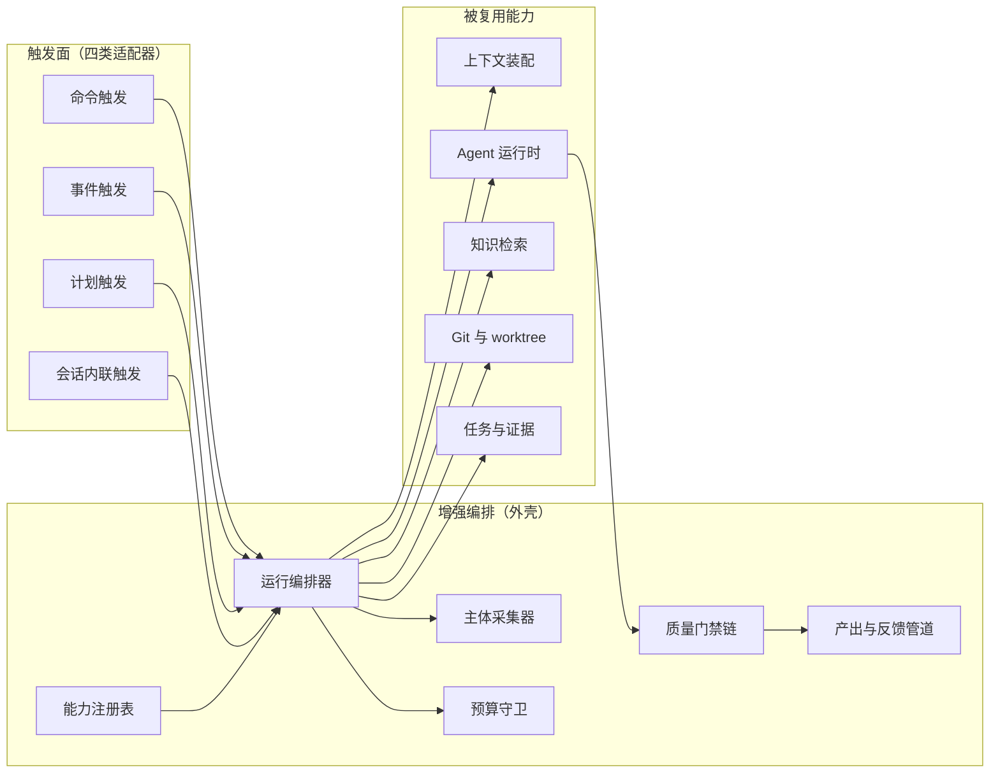
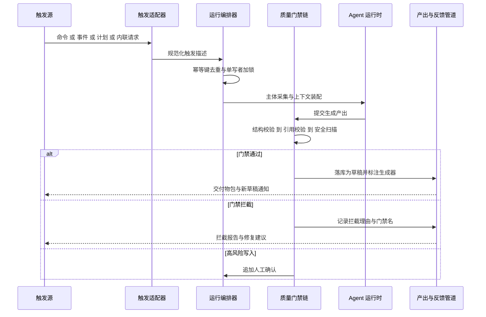
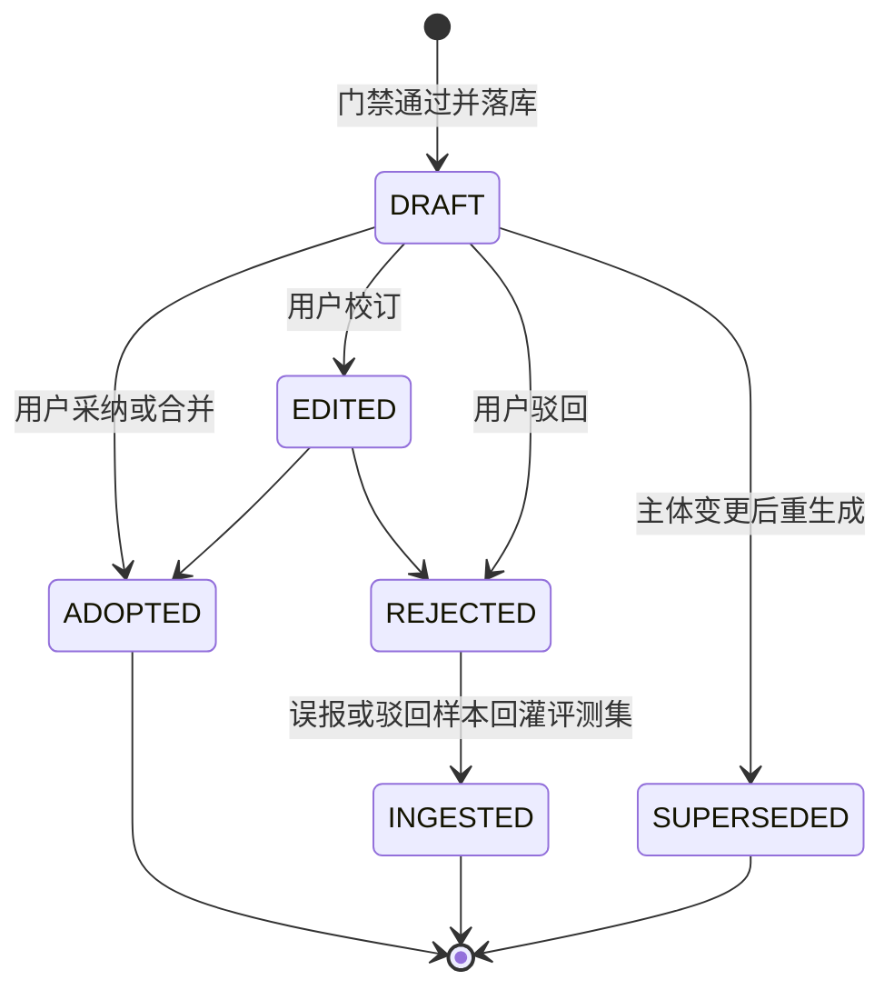

# 卷 35 · 智能增强包（Intelligent Augmentation Pack）

> 本卷把模型能力封装成**随任务而动的增强能力包**：不新增执行链路，而是把既有的上下文（卷 03）、工具（卷 05）、知识检索（卷 11）、Agent 内核（卷 12）、任务与证据（卷 14）、事件（卷 16）、Git 与 worktree（卷 21）、模板库（卷 34）按「一次增强运行」重新编排，产出**可审阅、可校订、可度量**的增强结果。四类形态：**生成（Generate）/ 审查（Review）/ 检测（Detect）/ 汇总（Digest）**。
>
> 来源：迭代轮次 9（智能增强特性）；需求 ID 见卷 00 §5.35（D35 智能增强包）；域内决策号 `D-INTEL-1…8`（§11）。
> 与卷 25（前沿探索）的边界：**本卷是产品化近端特性**（可交付、可度量、可回退）；卷 25 是实验阶梯（lab → beta → ga 五级治理），两者不共享开关体系与验收口径。
> 与早期草案的关系：定稿前存在 12 项特性的**清单级**草案（原 `35-ai-enhancements.md`，决策号 D-AI-0…12），**不删除**，已归档为 `docs/harness/archive/35-ai-enhancements.superseded.md`（无约束力）；本卷（`35-intelligent-augmentation.md`）是卷 35 的唯一权威版本，对其中 8 项（四类核心能力）做**设计级**深化并引入能力包框架、质量门禁链与反馈回灌闭环（承接关系见 §1.4，逐条映射与原文摘录见文末附录）。

---

## 1. 本卷定位

### 1.1 解决什么问题

模型能力在本设计集中是**原料**（上下文、工具、循环），用户要的却是**成品**：一份能直接贴进 PR 的描述、一条能被采纳的审查意见、一份能证明漂移的比对报告。本卷解决「原料 → 成品」的三道缺口：

1. **封装缺口**：同一件事（写 PR 描述）在 CLI、桌面端、CI、模板库里各写一遍提示词 → 行为漂移、无法统一治理。本卷用**能力包描述符 + 统一输出契约**收敛为一份实现。
2. **信任缺口**：模型输出没有质量判据、没有引用、没有成本上限 → 用户不敢用、企业不敢开。本卷用**三层质量门禁 + 强制引用 + 预算熔断**把「可信任」变成机制而非承诺。
3. **价值缺口**：增强能力最容易被质疑「到底有没有用」。本卷把**采纳率 / 误报率 / 节省时长 / 单位成本**四项指标做成一次运行即产出的事实，并让误报样本**回流评测集**（对接卷 26）。

### 1.2 不解决什么问题

| 不解决 | 归属 |
| --- | --- |
| 任务编排、DAG、依赖求解、证据验收 | 卷 14（增强运行以 WorkItem 形态被编排或独立执行） |
| 触发器语义（cron / 事件 / 计划）与自治循环 | 卷 15；卷 34（模板库提供步骤序列） |
| 代码审查的**合并门禁**、PR 合并队列、冲突治理 | 卷 21（本卷只产出发现与修订，不决定合并） |
| 评测基座（假模型、回放、基准运行器） | 卷 26 与 `33-quality-eval-impl.md`（本卷只对接其用例注册与门禁） |
| 模型接入、路由、计量与配额原语 | 卷 02 / 卷 31（本卷调用其预算守卫与计量器） |
| 检索内核（切分 / 三路混合 / 重排） | 卷 11（本卷只定义「哪些检索结果可被引用」） |
| 界面呈现（卡片、通知、空态文案） | 卷 22 / 卷 33 |

### 1.3 四类能力与 8 项能力映射

| 类别 | 语义 | 本卷能力 | 主要写权限 |
| --- | --- | --- | --- |
| 生成 Generate | 产出新的文本 / 代码 / 变更集 | ① PR 描述与变更日志 ② 测试生成与覆盖补强 ③ 代码迁移助手 | ②③ 受限写 + 只提 PR |
| 审查 Review | 对既有变更给出判断与修复 | ④ 审查机器人（多轮对话式修复） | 只提 PR / 只评论 |
| 检测 Detect | 发现「基线 vs 现状」的偏差 | ⑤ Flaky 检测与隔离 ⑥ 文档漂移检测 | 隔离标记 / 仅文档目录 |
| 汇总 Digest | 把事件与知识聚合成人可读结论 | ⑦ Standup / 周报汇总 ⑧ 仓库知识问答 | 只读 |

**共性约束（对 8 项全部生效，逐条可校验）**：

| # | 约束 | 校验点 |
| --- | --- | --- |
| C1 | 产出必须标注「AI 生成 + 模型 + 提示词版本」 | 产出体中 `generator` 字段缺失即被质量门禁拦截 |
| C2 | 产出为**草稿**，人工可校订；不得覆盖人类既有内容（冲突并排展示） | 写路径的前置比对（文档漂移 / 迁移 / 测试生成三处） |
| C3 | **不自动合并**：只提 PR / 评论 / 隔离标记，合并权始终在人 | 权限上限 + 能力描述符 `writeScopes` 白名单 |
| C4 | 结论类输出**必须带引用**（文件 + 行 / 文档 + 版本 / 事件 ID），无引用标注「推断」 | 引用门禁（`CitationGate`） |
| C5 | 每次运行上报成本；超预算即停并保留已完成部分 | 预算守卫 + `ai.budget.exhausted` 事件 |
| C6 | 默认只读；写入按能力声明与预授权 | 卷 06 决策链 + `open-coding.intel.*` 上限 |
| C7 | 四项质量度量（采纳率 / 误报率 / 节省时长 / 单位成本）可查 | 卷 26 在线指标面 |
| C8 | 误报与驳回样本回流评测集，命中阈值的规则自动降级 | `oc_ai_feedback` → `oc_ai_eval_case` → 规则权重下调 |

### 1.4 与既有 12 项特性草案（D-AI）的承接

> 权威声明（最终结论）：早期草案 `35-ai-enhancements.md` 已归档为 `docs/harness/archive/35-ai-enhancements.superseded.md`（不删除、无约束力）；卷 35 的唯一权威文件是本卷 `35-intelligent-augmentation.md`。草案 D-AI-0…12 与本卷 D-INTEL-1…8 的逐条归属映射、共性约束原文及两处外移条目（事故时间线 → 卷 32；智能检测 → 卷 26/29/24/30）见文末「附录 · 既有草稿决策对齐（D-AI-0…12）」。

| 既有特性（REQ-AI-n） | 本卷能力 | 承接关系 |
| --- | --- | --- |
| REQ-AI-1 PR 描述 / REQ-AI-2 变更日志 | ① | 合并为「一次运行、双产出」（同一 diff 主体，双输出格式） |
| REQ-AI-3 审查机器人 | ④ | 深化为**多轮对话式修复**线程，且发现带置信度与规则降级 |
| REQ-AI-4 测试生成 | ② | 增加「覆盖率缺口驱动」与「假测试检测」判据 |
| REQ-AI-5 Flaky | ⑤ | 增加隔离运行与三法交叉判定（重跑 / 统计 / 隔离） |
| REQ-AI-6 文档漂移 | ⑥ | 增加「可共编资产」语义（人工修订受保护 + 反向同步） |
| REQ-AI-7 Standup / REQ-AI-8 问答 | ⑦⑧ | 合并入「汇总」类，共享客观事实层（不可编造）与引用门禁 |
| REQ-AI-9 迁移助手 | ③ | 深化为「规格驱动 + 分批 + 每批验证 + 断点续跑」 |
| REQ-AI-10 事故时间线 / REQ-AI-11 四类智能检测 | — | **不在本卷**：时间线归卷 32 复盘流程；智能检测按域拆分（性能 → 卷 26、依赖 → 卷 29、配置 → 卷 24、安全 → 卷 30） |
| REQ-AI-12 共性约束 | C1–C8 | 扩展为 8 条并增加「可共编」「反馈回灌」两项 |

---

## 2. 原始意图与需求

### 2.1 原始意图（三条）

1. **能力要「随任务而动」**：增强不是另一个聊天窗口，而是挂在真实工作对象上（diff、批次、测试运行、文档目录、时间窗口）；离开工作对象的增强等于聊天。
2. **质量优先于自动化程度**：可以做「只给建议」的保守形态，但不能做「建议不可追溯」。任何自动化升级都必须先有评测证据（误报率、采纳率）。
3. **成本必须可见且可停**：增强运行是**额外**的模型开销，用户有权知道花了多少、也有权一键关停。

### 2.2 竞品对标得到的需求增量

| 证据 | 来源与等级 | 增量结论 |
| --- | --- | --- |
| 审查与修复是**循环**而非一次性意见：`tools/review_on_submit_m` 把 `<diff>` 注入复核消息并要求「重跑复现脚本、回滚测试文件改动、再次提交」 | `09` §2.6 / §③ `[E1]` `config/default.yaml` | 审查输出必须能**驱动一次真实修复**，且修复后必须重新验证同一发现 |
| 提交/变更日志生成有**成文归属契约**：模型生成提交信息 + `aider:` 前缀 + `Co-authored-by` trailer，`/undo` 直接回退 | `09` §2.1 `[E1]` `base_coder.py:2375`、`repo.py:131` | 生成物必须带**归属标注**（谁生成、哪个模型），且回退路径必须存在 |
| 生成式知识资产必须**可共编**：Repo Wiki 落盘 `.qoder/repowiki`，由 `wiki_plan.yaml` 控制页面白名单与模板，**手工修改被标记保护、不被自动更新覆盖**，支持 Git 反向同步 | `07` §③ / §⑤ 第 13 条 `[E2]` | 文档类增强产出是**可共编资产**，不是只读产物：人工修订优先级高于模型重生成 |
| 质量需要**快照式期望输出基座**：`vitest.expected.config.ts`（期望输出快照）+ `DSH_SNAPSHOT=refresh` 刷新 + `snapshots/` 8.2 MB 落盘 | `04` §③ / §⑦ `[E1]` | 增强能力的输出必须可**快照回归**（同一输入 → 期望输出），否则调提示词即不可控 |
| 交付物与反馈是**一等构件**：`deliverables/presented` 事件 + 客户端「交付物」插件面；`feedback/message-feedback`、`feedback/command-feedback` 独立包与匿名安装身份关联 | `04` §4 / §7 `[E1]` `packages/feedback/*` | 本卷需要「交付物包」与「反馈包」两个显式契约，反馈必须能归因到具体产出 |
| 能力形态可走 **Skill 渐进披露**：`SKILL.md` frontmatter 全可选、正文仅在使用时加载，自定义斜杠命令已合并进 Skill 体系 | `01` §4.8 `[E2]` | 能力包以 Skill 形态分发（按需加载），避免把 8 套提示词常驻系统提示 |
| 静态安全规则库是**清单工程**：`bashSecurity.ts` 2590 行覆盖 zsh 危险模块、heredoc 替换、`jq` 危险 flag、IFS 注入等独立检测项 | `01` §4.3 `[E1]` | 审查机器人的确定性通道必须来自**可枚举规则清单**，而非几条正则 |
| 反面证据：第二梯队 7 家中「分支合并队列 / 冲突治理」**均未观测到**；无审批、无策略、无沙箱为共性 | `09` §④.2 `[E1][E4]` | 增强能力必须在**已有治理面之内**运行（权限 / 沙箱 / 审计照常），不得自成旁路 |

### 2.3 需求清单（REQ-INTEL-n）

| ID | 需求 | 来源 | 优先级 | 验收要点 |
| --- | --- | --- | --- | --- |
| REQ-INTEL-1 | 能力包框架：能力描述符（触发面 / 输入契约 / 输出契约 / 工具依赖 / 写范围 / 门禁档 / 预算） | 卷 00 D35；卷 18 | P0 | 缺字段即注册失败（Fail-Fast）；描述符可导出为 Skill 清单 |
| REQ-INTEL-2 | 触发面四类：命令（`oc ai <verb>`）/ 事件（提交、PR、CI 结果、测试运行）/ 计划（cron）/ 会话内联 | 卷 00 §5.35 | P0 | 同一能力四种触发产出同构；幂等键去重 |
| REQ-INTEL-3 | 三层质量门禁链：结构校验 → 引用校验 → 安全扫描（+ 条件人工门） | 卷 26 D-QA-5 | P0 | 任一层不通过即拦截，不进入人类视野 |
| REQ-INTEL-4 | 成本控制：模型分级路由 + 单次预算 + 单日预算 + 降级阶梯 + 上下文缓存 | 卷 31 | P0 | 超预算即停且保留已完成部分；成本入事件 |
| REQ-INTEL-5 | PR 描述与变更日志生成（双产出 + 引用强制 + 未覆盖项） | REQ-AI-1/2 | P1 | 引用覆盖率 ≥ 90%；内联场景 ≤ 30s |
| REQ-INTEL-6 | 审查机器人：规则通道 + 模型通道 + 置信度 + **多轮对话式修复** | REQ-AI-3；`09` `[E1]` | P0 | 每条发现可对话、可修复、可复验；低置信不阻塞合并 |
| REQ-INTEL-7 | 测试生成与覆盖补强：变更驱动 + 缺口驱动；**生成即运行**；假测试检测 | REQ-AI-4 | P1 | 不通过即丢弃；覆盖率提升可量化 |
| REQ-INTEL-8 | Flaky 检测与隔离：重跑 + 统计 + 隔离运行三法交叉；归因六类 | REQ-AI-5 | P1 | 判定带置信度；隔离默认只建议 |
| REQ-INTEL-9 | 文档漂移检测：结构化提取比对 + **可共编**（人工修订受保护）+ 反向同步 | REQ-AI-6；`07` `[E2]` | P1 | 修订 PR 仅触及允许写路径 |
| REQ-INTEL-10 | Standup / 周报汇总：客观事实层（事件聚合）+ 标注主观层 + 环比 + 数据缺口清单 | REQ-AI-7 | P2 | 客观层字段无事件来源即为门禁失败 |
| REQ-INTEL-11 | 仓库知识问答：混合检索 + **强制引用** + 无依据明确拒答 + 权限严格继承 | REQ-AI-8 | P0 | 无依据回答率 → 0；引用可打开且可追溯版本 |
| REQ-INTEL-12 | 代码迁移助手：规格驱动 + 影响面分析 + 小批（≤ 50 文件）+ 每批验证 + 断点续跑 | REQ-AI-9；`09` `[E1]` | P1 | 失败批次隔离回滚；已完成批次不受影响 |
| REQ-INTEL-13 | 交付物包契约：一次运行产出可打包（含证据引用与生成器元数据），供 CLI/桌面/CI 消费 | `04` `[E1]` | P1 | 包结构稳定；`presented` 事件可审计 |
| REQ-INTEL-14 | 反馈包契约：采纳 / 编辑 / 驳回 / 误报四类反馈可归因到产出与运行 | `04` `[E1]` | P0 | 反馈 → 评测集回流路径可用 |
| REQ-INTEL-15 | 归属与回退：生成物带生成器标注与版本；生成类变更可一键撤销 | `09` `[E1]` | P0 | 撤销后工作区与提交状态一致 |
| REQ-INTEL-16 | 快照回归：能力输出可录制期望输出并在提示词/模型变更时回归比对 | `04` `[E1]` | P2 | 提示词改版必须先过快照回归 |
| REQ-INTEL-17 | 权限与治理不旁路：增强运行照常过卷 06 决策链、卷 07 沙箱、卷 24 审计与 DLP | `09` §④.2 `[E1]` | P0 | 无 `bypass` 路径；审计含运行 ID |
| REQ-INTEL-18 | 度量与看板：采纳率 / 误报率 / 节省时长 / 单位成本四项按能力可查 | 卷 26 | P1 | 指标缺失即视为能力未交付 |

---

## 3. 设计空间（M×N）

8 个决策维度（对应 §11 的 `D-INTEL-1…8`），每维先全量展开分支，再进入 §4 比选。

### 3.1 D-INTEL-1 能力形态

| 分支 | 描述 | 优点 | 代价 | 风险 |
| --- | --- | --- | --- | --- |
| B1 内置能力 | 8 项全部硬编码进外壳服务 | 实现最快、行为最可控 | 无法裁剪、无法租户定制；CLI 冷启动变重 | 企业要求「只开 2 项」时需改代码 |
| B2 技能包（Skill） | 每项能力 = 一个技能包（提示词 + 工具声明 + 门禁档），按需加载 | 渐进披露、用户可读可改、可市场分发 | 需卷 08 技能体系成熟；技能与代码版本易漂移 | 用户改坏技能包 → 需签名与基线回退 |
| B3 插件 | 每项能力 = 插件，走卷 18 隔离与依赖求解 | 隔离最好、可第三方提供 | 进程/权限成本高；8 项全插件 → 启动与调试负担 | 插件生态未起时无收益 |
| B4 模板步骤 | 能力作为卷 34 模板的一步被调用 | 复用已有的模板治理与权限上限 | 只能被自动化触发，缺「用户主动问」入口 | 交互式场景（问答）无法表达 |

### 3.2 D-INTEL-2 触发方式

| 分支 | 描述 | 优点 | 代价 | 风险 |
| --- | --- | --- | --- | --- |
| B1 仅手动命令 | 用户显式 `oc ai <verb>` | 成本完全可控、误解最少 | 发现性差、容易被遗忘 | 价值无法被感知 → 采纳率低 |
| B2 仅事件驱动 | 提交 / PR / CI 结果自动触发 | 零操作、贴合工作流 | 噪声与成本不可控；误报直接打扰 | 事件风暴时批量产生垃圾产出 |
| B3 仅计划任务 | cron 定期执行（周报、漂移扫描） | 节奏稳定、适合汇总与检测 | 与真实变更脱节（改完 3 天才报） | 报告过期 → 用户不信 |
| B4 四类混合 | 命令 + 事件 + 计划 + 会话内联，按能力矩阵声明可用触发面 | 场景覆盖完整；每能力只开合适触发面 | 需统一幂等与去重；触发面越多越难测试 | 同主体多触发并发 → 需锁与幂等键 |

### 3.3 D-INTEL-3 质量门禁

| 分支 | 描述 | 优点 | 代价 | 风险 |
| --- | --- | --- | --- | --- |
| B1 无门禁 | 直接返回模型输出 | 零延迟、实现最简 | 无引用、无结构、可能含密钥 | 一次泄密即摧毁信任 |
| B2 单层：结构校验 | 只校验输出 schema | 成本低、能防格式崩溃 | 引用与安全仍裸奔 | 「结构对的胡话」照样出现 |
| B3 两层：结构 + 引用 | 校验 schema + 引用存在性 | 显著降低幻觉 | 安全模式仍靠模型自觉 | 生成代码可能引入密钥/危险 API |
| B4 三层 + 条件人工门 | 结构 → 引用 → 安全扫描；高风险动作再加人工确认 | 可信任；与卷 06 审批自然衔接 | 增加延迟（安全扫描 100–400ms）与实现量 | 门禁误伤优质产出 → 需可解释的拦截理由 |

### 3.4 D-INTEL-4 人机分工

| 分支 | 描述 | 优点 | 代价 | 风险 |
| --- | --- | --- | --- | --- |
| B1 只给建议 | 产出只进会话，不改仓库 | 绝对安全 | 用户需手工搬运 → 节省时长难以体现 | 价值感弱 |
| B2 草稿可改 | 产出为草稿，用户在 UI/编辑器确认后落地 | 安全与效率平衡 | 需草稿生命周期与冲突展示 | 草稿堆积无人处理 |
| B3 自动提交 PR | 直接开 PR，人等审查 | 节省最多、最贴近自动化 | 需权限上限与幂等去重 | 误报变成 PR 噪声 |
| B4 自动合并 | 门禁全绿即合并 | 极致自动化 | 与 C3「不自动合并」直接冲突 | 不可接受 |

### 3.5 D-INTEL-5 评测方式

| 分支 | 描述 | 优点 | 代价 | 风险 |
| --- | --- | --- | --- | --- |
| B1 人工评分 | 抽检打分 | 成本低 | 不可回归、无统计意义 | 改提示词无法判断好坏 |
| B2 离线基准集 | 能力级 golden cases（含期望输出快照） | 可回归、可比较模型与提示词 | 维护成本；与真实仓差异 | 过拟合基准集 |
| B3 在线指标 | 采纳率 / 误报率 / 节省时长 | 反映真实价值 | 噪声大、滞后 | 为指标而优化（刷采纳率） |
| B4 混合 + 反馈回灌 | 离线基准 + 在线指标 + 误报样本自动入集 + 规则降级 | 闭环收敛，越用越准 | 实现量最大（三方数据打通） | 自动降级误伤规则 → 需人工复核队列 |

### 3.6 D-INTEL-6 成本控制

| 分支 | 描述 | 优点 | 代价 | 风险 |
| --- | --- | --- | --- | --- |
| B1 不限 | 用会话同模型、无上限 | 质量上限最高 | 批量场景成本失控 | 一次迁移可能烧掉整月预算 |
| B2 固定档位 | 全部走低成本档 | 可预测 | 复杂能力（迁移）质量不足 | 产出无用 = 白花钱 |
| B3 预算上限 + 熔断 | 单次与单日上限，超限即停 | 成本可控 | 停在半途需保留已完成部分 | 熔断太早 → 半成品 |
| B4 B3 + 分级路由 + 缓存 + 降级阶梯 | 按能力与阶段分级选模型；上下文指纹缓存；降级为「只报告不修复」 | 成本最优且质量可控 | 需成本模型与缓存失效策略 | 缓存击穿导致成本回弹 |

### 3.7 D-INTEL-7 能力包框架形态

| 分支 | 描述 | 优点 | 代价 | 风险 |
| --- | --- | --- | --- | --- |
| B1 各能力独立实现 | 8 套独立服务/类，各自处理触发与产出 | 单点简单 | 重复实现门禁、预算、审计 → 必然漂移 | 治理面缺口出现在最弱的一项上 |
| B2 统一框架 + 描述符注册 | 一个编排服务 + 能力描述符（SPI）+ 共享门禁/预算/审计/产出管道 | 治理一致、新增能力成本低、可裁剪 | 框架抽象需一次设计到位 | 抽象过度 → 特殊能力受限（用 `capabilityOverrideHooks` 缓解） |
| B3 每能力独立服务 | 独立进程/容器 | 隔离最好、可独立扩缩 | 运维成本高、与「单机 CLI 可跑」冲突 | 违背 H-002 的 local 形态 |

### 3.8 D-INTEL-8 产出生命周期与反馈

| 分支 | 描述 | 优点 | 代价 | 风险 |
| --- | --- | --- | --- | --- |
| B1 一次性输出 | 产出即结束，无状态 | 最简 | 无法度量、无法校订、无法回退 | 价值不可证 |
| B2 草稿 + 采纳状态 | 产出入库为草稿，记录采纳/驳回 | 可度量、可校订 | 需状态机与保留策略 | 状态膨胀 |
| B3 B2 + 反馈回灌 + 规则降级 | 反馈入评测集；连续误报的规则自动降权 | 闭环收敛 | 自动降权可能漏检 | 需「降权需人工复核」的两段式 |

---

## 4. 比选矩阵

评分沿用 `README.md` §4：**F 30% / U 20% / S 25% / M 25%**；加权总分 = `30F+20U+25S+25M` / 10。

### 4.1 评分与选定

| 维度 | 分支 | 描述 | F | U | S | M | 加权 | 结论 |
| --- | --- | --- | --- | --- | --- | --- | --- | --- |
| D-INTEL-1 能力形态 | B1 | 内置能力（全硬编码） | 6 | 8 | 9 | 6 | 71.5 | 淘汰（不可裁剪） |
| | B2 | **技能包优先 + 内置兜底**（描述符可导出为 Skill；未装 Skill 时用内置默认实现） | 9 | 9 | 8 | 9 | **87.5** | **选定** |
| | B3 | 全部插件化 | 7 | 7 | 6 | 8 | 70.0 | 淘汰（隔离成本不匹配近端特性） |
| | B4 | 仅模板步骤 | 6 | 7 | 8 | 7 | 69.5 | 淘汰（缺交互入口） |
| D-INTEL-2 触发方式 | B1 | 仅手动 | 6 | 7 | 9 | 7 | 71.5 | 淘汰 |
| | B2 | 仅事件 | 7 | 8 | 7 | 7 | 72.0 | 淘汰（噪声不可控） |
| | B3 | 仅计划 | 6 | 7 | 8 | 8 | 71.0 | 淘汰（与变更脱节） |
| | B4 | **四类混合 + 能力触发矩阵**（每能力声明可用触发面） | 9 | 9 | 8 | 9 | **87.5** | **选定** |
| D-INTEL-3 质量门禁 | B1 | 无门禁 | 4 | 6 | 9 | 4 | 57.0 | 淘汰 |
| | B2 | 结构校验 | 6 | 7 | 9 | 6 | 70.0 | 淘汰 |
| | B3 | 结构 + 引用 | 8 | 8 | 8 | 8 | 80.0 | 淘汰（安全模式无覆盖） |
| | B4 | **三层 + 条件人工门**（安全扫描常开；高风险动作追加确认） | 9 | 8 | 8 | 9 | **85.5** | **选定** |
| D-INTEL-4 人机分工 | B1 | 只给建议 | 6 | 7 | 9 | 7 | 71.5 | 淘汰（节省时长不可证） |
| | B2 | 草稿可改 | 8 | 8 | 9 | 8 | 82.5 | 保留（问答 / 汇总类形态） |
| | B3 | **分级：只读能力自动产出；写入能力只提 PR（草稿可改）；合并永不由 AI 决定** | 9 | 9 | 8 | 9 | **87.5** | **选定** |
| | B4 | 自动合并 | 5 | 6 | 5 | 3 | 47.0 | 淘汰（违反 C3） |
| D-INTEL-5 评测方式 | B1 | 人工评分 | 5 | 7 | 9 | 5 | 63.0 | 淘汰 |
| | B2 | 离线基准集 | 8 | 7 | 9 | 8 | 81.5 | 淘汰（缺真实价值信号） |
| | B3 | 在线指标 | 7 | 8 | 8 | 7 | 74.5 | 淘汰（不可回归） |
| | B4 | **混合 + 误报回灌 + 规则两段式降级** | 9 | 8 | 7 | 9 | **83.5** | **选定** |
| D-INTEL-6 成本控制 | B1 | 不限 | 6 | 7 | 8 | 4 | 62.0 | 淘汰 |
| | B2 | 固定低档 | 6 | 7 | 9 | 7 | 71.5 | 淘汰（复杂能力质量不足） |
| | B3 | 预算 + 熔断 | 8 | 8 | 8 | 8 | 80.0 | 淘汰（易停在半成品） |
| | B4 | **B3 + 分级路由 + 上下文缓存 + 降级阶梯（报告 → 建议 → 修复）** | 9 | 8 | 8 | 9 | **85.5** | **选定** |
| D-INTEL-7 框架形态 | B1 | 各能力独立实现 | 7 | 7 | 8 | 5 | 68.5 | 淘汰（治理漂移） |
| | B2 | **统一框架 + 描述符注册 + 共享门禁/预算/审计/产出管道** | 9 | 9 | 8 | 9 | **87.5** | **选定** |
| | B3 | 每能力独立服务 | 7 | 7 | 5 | 7 | 65.0 | 淘汰（与 local 单机形态冲突） |
| D-INTEL-8 产出生命周期 | B1 | 一次性输出 | 5 | 6 | 9 | 4 | 59.5 | 淘汰 |
| | B2 | 草稿 + 采纳状态 | 8 | 8 | 8 | 8 | 80.0 | 淘汰（无闭环） |
| | B3 | **B2 + 反馈回灌评测集 + 规则两段式降级 + 保留策略** | 9 | 8 | 8 | 9 | **85.5** | **选定** |

### 4.2 唯一最佳分支结论

**能力形态：技能包优先 + 内置兜底；触发方式：四类混合 + 能力触发矩阵；门禁：三层 + 条件人工门；人机分工：分级（只读自动 / 写入提 PR / 合并不由 AI）；评测：混合 + 回灌 + 两段式降级；成本：预算熔断 + 分级路由 + 缓存 + 降级阶梯；框架：统一框架 + 描述符注册；生命周期：草稿状态机 + 反馈回灌。**

理由（按权重）：统一框架（D-INTEL-7）是其余七个维度的**乘数**——门禁、预算、审计、产出管道只实现一次，8 项能力共享，因此 F/M 均为 9；「不自动合并」（D-INTEL-4 B3）保住了与卷 06/21/34 的一致性，避免增强体系自成旁路（对齐 `09` §④.2 的反面证据）；三层门禁（D-INTEL-3 B4）与反馈回灌（D-INTEL-5/8）共同构成信任闭环，是「用户敢开、企业敢批」的前提。

**比选矩阵维度核验（R02）**：本卷 §3/§4 比选覆盖 **8 个决策维度**（D-INTEL-1…8，每维 3–4 个候选分支），满足「比选矩阵 ≥5 决策维度」硬性要求；实现侧（`impl/32-intelligent-augmentation-impl.md`）登记 I-INTEL-1…10 与八维一一映射（另含多轮修复/内联子集两条实现级分叉），无维度遗漏。

**REQ 编号使用说明（R02）**：本卷 §2.3 的 `REQ-INTEL-1…18` 为 Phase A 权威号；实现方案 `impl/32` 采用**独立局部号段** `REQ-INTEL-I01…I24`（impl 层重排与合并后的需求），与本表平行且互不覆盖——引用本卷需求时写全称「卷 35 REQ-INTEL-n」，实现层需求写 `REQ-INTEL-I<n>`（逐条溯源映射见 `impl/32` §②）。

### 4.3 被放弃分支的代价与回退触发

| 维度 | 选定要点 | 被放弃分支代价 | 回退触发 |
| --- | --- | --- | --- |
| D-INTEL-1 | 描述符可导出 Skill（渐进披露）；未装 Skill 走内置默认实现 | 放弃 B1 的简单性：需维护「Skill 清单 ↔ 内置实现」一致性校验 | Skill 与内置实现产出差异率 > 5% → 关闭 Skill 覆盖层，仅保留内置 |
| D-INTEL-2 | 每能力声明可用触发面；统一幂等键 `(capabilityId, subjectRef, subjectDigest, promptVersion)` | 放弃 B1 的成本确定性：事件触发需配额与去重 | 单能力事件触发日频 > 200 次 → 自动降级为「手动 + 计划」 |
| D-INTEL-3 | 安全扫描常开；高风险写入追加人工确认 | 放弃 B1/B2 的零延迟：内联场景增加 100–400ms | 内联场景 P95 > 30s → 安全扫描改为异步后置（先出草稿再拦截落盘） |
| D-INTEL-4 | 只读能力自动产出；写入能力只提 PR；合并永不由 AI 决定 | 放弃 B3 的「自动提交」效率：需人工点确认 | 采纳率 < 30% 且连续 2 周 → 降级为「只给建议」，重新收集反馈 |
| D-INTEL-5 | 离线基准 + 在线指标 + 误报回灌；规则降级需人工复核 | 放弃纯在线指标的实时性：回灌有批处理延迟 | 回灌队列积压 > 1000 条 → 暂停自动入集，仅保留人工标注 |
| D-INTEL-6 | 预算守卫 + 分级路由 + 上下文指纹缓存 + 三级降级 | 放弃 B1 的质量上限：默认使用中低成本档 | 单能力成本超预算 150% → 该能力自动触发关闭（需人工重开） |
| D-INTEL-7 | 统一编排服务 + 描述符 SPI；契约在 `harness-contract`，实现在外壳 | 放弃 B1 的单点简单性：框架抽象需一次到位 | 能力数 > 24 或出现跨租户隔离硬要求 → 抽独立 `intel-worker` 进程（接口不变） |
| D-INTEL-8 | 草稿状态机 + 反馈回灌 + 保留策略（草稿 30 天，采纳永久） | 放弃 B1 的无状态简单性：需状态机与保留任务 | 草稿表行数 > 500 万 → 缩短保留窗口并归档至对象存储 |

---

## 5. 选定方案详设

### 5.1 能力包领域模型

**核心构件语义**：

| 构件 | 职责 | 关键不变量 |
| --- | --- | --- |
| 能力注册表 | 装载能力描述符，校验字段完整性，导出 Skill 清单 | 缺任一必填字段（触发面 / 输出契约 / 门禁档 / 写范围）即注册失败 |
| 运行编排器 | 一次运行的唯一生命周期拥有者：幂等 → 主体采集 → 上下文装配 → 生成 → 门禁 → 产出 | 一次运行只有一个 Writer（进程内单写者 + 分布式锁） |
| 主体采集器 | 把触发源规范化为 `SubjectRef`（diff / 测试运行 / 文档目录 / 时间窗口 / 问题） | 主体必须可解析为**稳定摘要**（用于幂等与缓存） |
| 质量门禁链 | 结构 → 引用 → 安全；条件人工门 | 三层顺序固定；任一层失败即停 |
| 预算守卫 | 单次与单日预算、分级路由、成本上报 | 超限即中断并可恢复（保留已完成部分） |
| 产出与反馈管道 | 草稿状态机、采纳/驳回/编辑/误报四类反馈、评测集回流 | 产出必须带生成器标注；反馈必须可归因到运行 |

### 5.2 运行机制

**并发与幂等**：同一 `(capabilityId, subjectRef)` 同时只允许一次运行（分布式锁 + 幂等键唯一约束）；主体摘要变化（新提交）时旧运行产物标记 `SUPERSEDED` 并保留引用，不覆盖人工已校订版本（对齐 `07` 「手工修改受保护」）。

### 5.3 八项能力详设

#### ① PR 描述与变更日志生成（Generate）

| 项 | 设计 |
| --- | --- |
| 输入 | 分支 diff、提交列表、任务与计划引用、测试证据、审查评论、模板骨架 |
| 输出 | 双产出：PR 描述（摘要 / 动机 / 影响面 / 验证方式 / 风险与回滚 / 未覆盖项）+ 变更日志条目（分类 + 双语 + 升级指引） |
| 触发 | 事件（PR 创建 / 提交推送）、命令、模板步骤 |
| 质量判据 | 引用覆盖率 ≥ 90%（每条摘要指向文件或提交）；「未覆盖项」非空则高亮；breaking 与 security 条目必须人工确认 |
| 失败处理 | diff 过大（> 400 文件）→ 只出标题与摘要 + 明确列出未分析范围；模型失败 → 回退纯模板骨架并标注「生成降级」；分类不确定 → 标「未分类」交人工 |

#### ② 审查机器人（Review，多轮对话式修复）

| 项 | 设计 |
| --- | --- |
| 输入 | diff、仓库约定（AGENTS 类规则文件）、历史发现与处置、规则清单、既有审查线程 |
| 输出 | 发现列表（`ruleId` / 位置 / 严重度 / 置信度 / 依据 / 修复建议）+ SARIF + 内联评论；可对话追问与「请修复」指令 |
| 触发 | 事件（PR / 提交 / CI 结果）、命令、会话内联 |
| 质量判据 | 规则通道确定性优先；模型通道必须给依据（引用行 + 规则名）；低置信默认折叠；高置信安全问题可请求变更但需人工确认 |
| 失败处理 | 单轮超时 → 保留已产出发现、线程可续；修复后复验失败 → 回滚该修复并标记线程 `BLOCKED` 交人工；误报反馈 → 规则两段式降权（先降权、人工复核后停用） |

#### ③ 测试生成与覆盖补强（Generate）

| 项 | 设计 |
| --- | --- |
| 输入 | 变更 diff、覆盖率报告与缺口、被测模块公共接口、既有测试风格样例 |
| 输出 | 测试 PR（单元 / 集成 / 属性测试三分策略）+ 覆盖率变化 + 未覆盖残余说明 |
| 触发 | 命令、事件（覆盖率门禁未过 / 新函数无测试）、模板步骤 |
| 质量判据 | **生成即运行**：不通过即丢弃并报告；假测试检测（无断言、恒真断言、只测 getter）拒收；新增用例不得修改既有测试期望 |
| 失败处理 | 运行环境缺失 → 标记 `skipped` 不产 PR；拒绝率 > 50% → 自动降级为「只给测试要点清单」；单文件生成上限默认 20 例 |

#### ④ Flaky 检测与隔离（Detect）

| 项 | 设计 |
| --- | --- |
| 输入 | 测试事件（含重跑）、执行环境信息、历史方差、失败签名 |
| 输出 | 观察清单（低置信）+ 归因结论（时序 / 网络 / 共享状态 / 随机 / 资源竞争 / 顺序依赖）+ 隔离建议 + 修复 PR（仅高置信、低风险改动） |
| 触发 | 事件（测试运行结束）、计划（每日汇总）、命令 |
| 质量判据 | 三法交叉：同一提交重跑不一致 / 跨运行方差超阈值 / 隔离运行后稳定；单次失败不得标记 flaky；置信度与证据一并输出 |
| 失败处理 | 重跑不可用 → 退化为统计法并降置信度；隔离默认只建议（企业可开自动标记）；修复 PR 连续 2 次失败 → 停止自动修复，转观察清单 |

#### ⑤ 文档漂移检测（Detect）

| 项 | 设计 |
| --- | --- |
| 输入 | 代码侧结构化提取（公开接口 / 配置项 / 环境变量 / CLI 命令）、文档侧声明、文档归属与白名单计划 |
| 输出 | 差异清单（缺失 / 过时 / 多余）+ 修订 PR（仅允许写路径）+ 文档所有者通知 |
| 触发 | 计划（每日或每周）、事件（代码合并后）、命令 |
| 质量判据 | 结构化比对优先、语义检索补充；修订 PR 仅触及文档目录；**人工已校订段落受保护**（重生成不覆盖，冲突并排展示） |
| 失败处理 | 文档侧无解析能力（非结构化）→ 只报告不修订；写路径越界 → 整体拒绝并告警；同一文档连续 3 次修订被驳回 → 转「只报告」模式 |

#### ⑥ Standup / 周报汇总（Digest）

| 项 | 设计 |
| --- | --- |
| 输入 | 任务状态变化、提交与 PR、审查活动、事故与告警、自动化收益、上一周期报告 |
| 输出 | 客观事实层（每条带事件来源）+ 主观摘要层（标注 AI 生成）+ 环比 + 「需要关注」清单 + 数据缺口清单 |
| 触发 | 计划（每日 / 每周）、命令、模板步骤 |
| 质量判据 | 客观层字段无事件来源即为门禁失败；主观层必须标注；不得出现无来源的量化断言 |
| 失败处理 | 数据源缺失 → 明确输出「数据缺口」而非推断；无事件 → 输出空报告并说明；交付通道失败 → 本地留档并重试一次 |

#### ⑦ 仓库知识问答（Digest）

| 项 | 设计 |
| --- | --- |
| 输入 | 自然语言问题、检索范围约束（仓库 / 文档 / 历史会话）、用户权限上下文 |
| 输出 | 回答 + 引用列表（文件 + 行 / 文档 + 版本）+ 可「作为上下文引用」进入会话 |
| 触发 | 会话内联、命令 |
| 质量判据 | **强制引用**；无依据时明确回答「未找到依据」并给出检索范围；引用必须可打开且版本可追溯 |
| 失败处理 | 引用不可达 → 标注并降置信；权限不足 → 明确拒绝并说明缺失权限（不静默降级为公共知识）；缓存命中必须校验权限指纹 |

#### ⑧ 代码迁移助手（Generate）

| 项 | 设计 |
| --- | --- |
| 输入 | 迁移规格（规则 + 正反例 + 验收命令）、目标模式、影响面分析结果、批次状态 |
| 输出 | 分批 PR（每批独立分支与提交）+ 每批验证结果 + 迁移报告（自动迁移比例 / 人工干预点）+ 断点续跑状态 |
| 触发 | 命令、模板步骤（长任务形态） |
| 质量判据 | 每批必须通过规格声明的验收命令（构建 / 测试）；不改变公开行为（除规格要求）；批次大小默认 ≤ 50 文件（可配 10–200） |
| 失败处理 | 批次失败 → 回滚该批、生成诊断、**停止后续批次**并保留已完成批次；规格存在歧义 → 暂停并列出待澄清项（不猜测）；续跑从失败批次重建分支 |

### 5.4 数据模型（概览）

表族（在附录 A §A.9 已登记 `oc_ai_run` / `oc_ai_output` / `oc_ai_finding` / `oc_ai_feedback` 基础上，本卷增补 3 张，**须同步附录 A（登记为 Phase A 增量建议）**）：

| 表 | 用途 | 关键约束 |
| --- | --- | --- |
| `oc_ai_capability` | 能力注册与租户级开关、配置覆盖 | 唯一 `(tenant_id, capability_id)`；`enabled` 与预算档在此覆盖默认 |
| `oc_ai_run` | 一次运行（触发面 / 主体摘要 / 状态 / 成本 / 门禁结果 / 模型与提示词版本） | 唯一幂等键；`subject_digest` 索引；状态索引 |
| `oc_ai_output` | 草稿产出（类型 / 载荷位置 / 生成器元数据 / 生命周期状态） | 大载荷入对象存储，表内保留引用；`SUPERSEDED` 不删除 |
| `oc_ai_finding` | 审查与检测发现（规则 ID / 位置 / 严重度 / 置信度 / 依据 / 处置） | 与 `oc_ai_run` 外键；误报标记 |
| `oc_ai_feedback` | 四类反馈（采纳 / 编辑 / 驳回 / 误报） | 归因到 `output` 或 `finding`；进入回灌队列 |
| `oc_ai_eval_case` | 回灌生成的评测用例（输入摘要 + 期望处置 + 来源运行） | 与卷 26 用例注册对接；标注来源与置信 |
| `oc_ai_review_thread` | 多轮修复线程（发现关联 / 轮次 / 修复提交 / 复验结果） | 线程与工作区 HEAD 关联，漂移即标记「基于旧版本」 |
| `oc_ai_migration_batch` | 迁移批次（规格 ID / 批次号 / 状态 / 验证命令结果 / 续跑点） | 唯一 `(plan_id, batch_no)` |

> **实现落点与批次（R07 可落地性登记）**：落点 = `harness-contract`（包 `contract/intel`，**单模块**）+ `harness-platform/platform-intel` + `harness-host/host-intel`（后两者为**扩展模块**，待卷 27 §4.1 登记）——详见 `impl/32-intelligent-augmentation-impl.md` 头部与 §1.4。
> **实施顺序**：卷 27 §4.5 第 20 步之后（依赖第 9/15 步；八项能力另消费第 4/14/17 步产物）。
> **数据迁移批次**：`oc_ai_*` 表族未在 §4.4 明列 → 建议新增批次 **B10 自动化、智能增强与前沿实验**；`oc_ai_eval_case` 与卷 26 评测用例同源（用例台账口径权威在 `impl/33` 的 `oc_qa_*`，本卷不建第二套用例表）。
> **限定词提醒**：`impl/32` 头部原「B5 批次」指 `00-research-plan.md` 研究规划批次，**不是**卷 27 §4.4 的数据迁移批次，跨文件引用必须带限定词。

Redis Key（经统一 Key 工厂生成，格式 `open-coding:intel:{type}:{business}`）：`run-progress:{runId}`、`idempotent:{capabilityId}:{subjectDigest}`、`lock:{capabilityId}:{subjectRef}`、`budget:{tenantId}:{capabilityId}:{day}`、`cache:{capabilityId}:{contextDigest}`。
对象存储前缀：`intel/{tenantId}/{capabilityId}/{yyyy}/{MM}/{runId}/`（报告、时间线、覆盖率快照）。
事件类型：见 §7。

### 5.5 配置面（概览）

| 配置项 | 默认值 | 必填 | 说明 |
| --- | --- | --- | --- |
| `open-coding.intel.enabled` | `true` | 否 | 增强能力总开关（企业可强制关闭） |
| `open-coding.intel.default-model-tier` | `efficient` | 否 | 默认模型档位（可覆盖为与主会话同模型） |
| `open-coding.intel.run-budget-usd` | `2.0` | 否 | 单次运行预算上限 |
| `open-coding.intel.daily-budget-usd` | `50.0` | 否 | 租户日预算上限 |
| `open-coding.intel.max-concurrent-runs` | `4` | 否 | 并发运行上限 |
| `open-coding.intel.inline-timeout-seconds` | `30` | 否 | 内联场景时延上限 |
| `open-coding.intel.review.min-confidence-to-comment` | `MEDIUM` | 否 | 审查最低评论置信度 |
| `open-coding.intel.review.max-turns` | `6` | 否 | 修复线程最大轮次 |
| `open-coding.intel.test-gen.coverage-target-percent` | `80` | 否 | 覆盖率补强目标 |
| `open-coding.intel.flaky.rerun-count` | `3` | 否 | 重跑判定次数 |
| `open-coding.intel.doc-drift.allowed-write-paths` | `docs/**` | 否 | 文档修订允许写路径白名单 |
| `open-coding.intel.migration.batch-size` | `50` | 否 | 迁移批次大小（范围 10–200） |
| `open-coding.intel.feedback.auto-downweight-threshold` | `3` | 否 | 规则连续误报降权阈值 |

敏感项（模型凭据）一律环境变量注入并在启动时 Fail-Fast；新增项必须同步 `.env.example`。状态机定义、能力 ID、规则 ID、事件类型名**禁止配置化**（按 `config-extraction-rules.md` §8）。

### 5.6 错误与边界

| 场景 | 处理 |
| --- | --- |
| 能力未注册 / 已禁用 | 明确拒绝 + 可用能力清单（不静默降级到其他能力） |
| 主体已过期（新提交） | 拒绝并提示刷新主体后重试（对齐乐观锁语义） |
| 门禁拦截 | 返回拦截层名与理由；不输出半成品给人类 |
| 预算耗尽 | 中断运行、保留已完成部分、发 `ai.budget.exhausted` |
| 依赖不可用（Git / 检索 / 测试环境） | 能力级降级（报告 → 建议），并在产出中标注降级原因 |
| 权限不足 | 拒绝并说明缺失权限；不返回无权内容（含引用） |
| 并发运行同一主体 | 返回「运行中」并附已有运行 ID（幂等命中，不重复计费） |

---

## 6. 扩展点与插件面

| 扩展点 | 语义 | 落点（卷 18 目录） |
| --- | --- | --- |
| `AugmentationCapabilityProvider` | 注册新增强能力（描述符 + 实现） | 能力与技能类 |
| `QualityGateProvider` | 追加门禁层（企业自定义合规检查） | 治理类 |
| `SubjectCollector` | 新增主体类型（如设计稿、数据库迁移） | 采集类 |
| `TriggerAdapterProvider` | 新增触发面（如 IM 指令、看板事件） | 集成类 |
| `CitationResolver` | 新增引用来源（维基、需求系统） | 检索类 |
| `ArtifactPublisher` | 新增产出目的地（IM、工单、评审系统） | 集成类 |
| `CostPolicyProvider` | 自定义成本策略与降级阶梯 | 治理类 |
| `MigrationSpecProvider` | 迁移规格解析（多规格格式支持） | 迁移类 |

扩展的权限与治理：扩展只能**收窄**不能放宽（写范围取交集、预算取下限、门禁只增不减）；插件声明的写范围超出能力描述符上限时注册失败。

---

## 7. 事件与可观测

| 事件 | 触发 | 关键字段 |
| --- | --- | --- |
| `ai.capability.registered` / `.disabled` | 注册 / 关闭 | capabilityId、version、触发面集合 |
| `ai.run.started` / `.completed` / `.failed` | 运行生命周期 | runId、capabilityId、subjectDigest、触发面、模型与提示词版本 |
| `ai.gate.blocked` | 门禁拦截 | runId、层名、理由码 |
| `ai.artifact.produced` | 草稿落库 | artifactId、类型、引用覆盖率、成本 |
| `ai.artifact.adopted` / `.rejected` / `.edited` / `.superseded` | 用户处置 | artifactId、编辑差异摘要 |
| `ai.finding.reported` / `.resolved` / `.false_positive` | 发现生命周期 | findingId、ruleId、置信度、severity |
| `ai.review.thread.opened` / `.fixed` / `.blocked` | 修复线程 | threadId、findingId、修复提交 |
| `ai.review.reverified` | 修复后复验 | threadId、结果、残余问题 |
| `ai.migration.batch.completed` / `.failed` | 迁移批次 | planId、batchNo、文件数、验证结果 |
| `ai.eval.case.ingested` | 反馈回灌 | caseId、来源运行、标签 |
| `ai.budget.exhausted` | 预算熔断 | runId、已花费、上限 |

指标：`oc_ai_run_total{capability,outcome}`、`oc_ai_adoption_ratio{capability}`、`oc_ai_false_positive_ratio{capability}`、`oc_ai_time_saved_minutes{capability}`、`oc_ai_cost_usd_total{capability}`、`oc_ai_gate_block_total{gate}`、`oc_ai_citation_coverage_ratio{capability}`、`oc_ai_run_duration_seconds{capability}`。
日志：每次运行入参与返回值中文打点（对齐 `logging-rules.md`）；提示词与产出的敏感字段脱敏后入审计（经 DLP）。

---

## 8. 非功能设计

- **性能预算**：内联场景（PR 描述 / 问答首字节）P95 ≤ 30s；批量场景（迁移 / 覆盖补强）异步 + 进度可查（≤ 1s 刷新）。
- **并发模型**：运行编排使用虚拟线程承载 I/O 等待；单机并发上限默认 4（`max-concurrent-runs`），超出排队不拒绝；同一主体串行化。
- **容量**：单运行产出上限 1 MB 入库、超出入对象存储；草稿保留 30 天（采纳后永久）；评测用例保留 1 年。
- **成本**：默认中低成本档；上下文指纹缓存 TTL 900s；三级降级（完整修复 → 只给建议 → 只报告）；单能力成本异常自动关停。
- **安全**：写入走卷 06 决策链与卷 34 权限上限（禁 force-push / 删分支 / 生产写 / 密钥读）；知识问答不缓存跨权限内容；日志与产出过 DLP。
- **多租户**：能力开关、预算、产出、评测用例全部按租户隔离；跨租户共享仅限「能力实现」不含数据。
- **降级**：模型不可用 → 规则/模板降级路径；Git 不可用 → 只读能力可用、写入能力暂停；检索不可用 → 问答拒答而非无依据回答。

---

## 9. 完成定义（DoD）

- [ ] 8 项能力全部可用，且四种触发面中每能力至少声明并跑通其适用的一种。
- [ ] 能力描述符缺字段即注册失败（用例）；描述符可导出为 Skill 清单且与内置实现一致性校验通过。
- [ ] 三层门禁对 8 项能力全部生效：无引用、无生成器标注、含密钥模式三类产出均被拦截（用例）。
- [ ] 反馈闭环可用：误报 → 评测集 → 规则降权 → 人工复核 全链路走通（用例）。
- [ ] 成本可控：超单次预算中断且保留已完成部分；超日预算拒绝新运行（用例）。
- [ ] 审查机器人：多轮修复线程 ≥ 1 个端到端用例（发现 → 修复 → 复验通过）。
- [ ] 测试生成：生成即运行生效；假测试（无断言 / 恒真断言）被拒（用例）。
- [ ] Flaky 检测：三法交叉判定输出归因；单次失败不标记（用例）。
- [ ] 文档漂移：结构化比对产出差异清单；修订 PR 越界写路径被拒；人工校订段落不被覆盖（用例）。
- [ ] Standup：客观层无来源字段被门禁拦截（用例）。
- [ ] 知识问答：无依据问题明确拒答；权限不足明确拒绝（用例）。
- [ ] 迁移助手：分批 + 每批验证 + 失败批次隔离回滚 + 断点续跑（示例迁移跑通）。
- [ ] 快照回归：至少 4 项能力具备期望输出快照，提示词改版前必须通过回归。
- [ ] 四项指标（采纳率 / 误报率 / 节省时长 / 单位成本）按能力可查并进入看板。

---

## 10. 开放问题与默认决策

| 项 | 默认决策 |
| --- | --- |
| 默认启用的能力 | PR 描述与变更日志、审查机器人、仓库知识问答默认开启；其余默认关闭（按需开启） |
| 兼容与命名 | 本卷 `D-INTEL-1…8` 与既有 `D-AI-0…12` 为一对多承接关系（§1.4）；`DECISIONS.md` 登记以 `D-AI` 为主，本卷决策作为实现级细化 |
| 能力 ID 命名 | 稳定、点分、不可重命名（`pr.description`、`review.bot`、`test.gen`、`flaky.detect`、`doc.drift`、`digest.standup`、`repo.qa`、`code.migrate`） |
| 新增第 9 项能力的门槛 | 必须同时满足：有主体（工作对象）、有质量判据、有反馈出口；否则不进本卷 |
| 与卷 25 的关系 | 本卷能力不得引用 lab 级实验能力；实验能力毕业（beta/ga）后按本卷框架重新注册 |
| 迁移规格的初始来源 | 优先从仓库既有约束文件与团队约定提取；无规格不得启动迁移 |
| 成本口径 | 成本含模型调用与工具执行（构建/测试）时长折算；单位成本 = 成本 / 被采纳产出数 |
| 人工门超时 | 默认 24 小时；超时按「未确认」处理（保留草稿，不落地） |

---

## 11. 域内决策汇总（D-INTEL-1…8）

| ID | 分叉维度 | 候选分支 | 选定 | 理由（F/U/S/M） | 回退触发 |
| --- | --- | --- | --- | --- | --- |
| D-INTEL-1 | 能力形态 | 内置能力 / 技能包 / 插件 / 模板步骤 | **技能包优先 + 内置兜底**（描述符可导出 Skill，渐进披露） | F9 U9 S8 M9 = 87.5：既满足用户可读可改与市场分发，又不依赖技能体系成熟即可交付 | Skill 与内置实现产出差异率 > 5% → 关闭 Skill 覆盖层 |
| D-INTEL-2 | 触发方式 | 仅手动 / 仅事件 / 仅计划 / 四类混合 | **四类混合 + 能力触发矩阵** | F9 U9 S8 M9 = 87.5：覆盖主动与自动两个场景；矩阵限制噪声面 | 单能力事件触发日频 > 200 → 降级为手动 + 计划 |
| D-INTEL-3 | 质量门禁 | 无 / 结构 / 结构+引用 / 三层+人工门 | **三层 + 条件人工门**（安全扫描常开） | F9 U8 S8 M9 = 85.5：引用门禁治幻觉、安全门禁防泄密，代价可控 | 内联 P95 > 30s → 安全扫描改异步后置 |
| D-INTEL-4 | 人机分工 | 只给建议 / 草稿可改 / 自动提 PR / 自动合并 | **分级：只读自动、写入只提 PR、合并永不由 AI** | F9 U9 S8 M9 = 87.5：与卷 06/21/34 治理面一致，无旁路 | 采纳率 < 30% 连续 2 周 → 降级为只给建议 |
| D-INTEL-5 | 评测方式 | 人工 / 离线基准 / 在线指标 / 混合+回灌 | **混合 + 误报回灌 + 规则两段式降级** | F9 U8 S7 M9 = 83.5：离线可回归、在线反映价值、反馈驱动收敛 | 回灌队列积压 > 1000 → 暂停自动入集 |
| D-INTEL-6 | 成本控制 | 不限 / 固定档 / 预算熔断 / 熔断+路由+缓存+降级 | **预算守卫 + 分级路由 + 上下文缓存 + 三级降级** | F9 U8 S8 M9 = 85.5：既控制上限又不至于停在半成品 | 单能力成本超预算 150% → 自动关停待人工重开 |
| D-INTEL-7 | 能力包框架形态 | 各能力独立 / 统一框架+描述符 / 每能力独立服务 | **统一框架 + 描述符注册**（门禁/预算/审计/产出共享） | F9 U9 S8 M9 = 87.5：治理只实现一次，新增能力边际成本最低 | 能力数 > 24 或跨租户硬隔离 → 抽独立 worker（接口不变） |
| D-INTEL-8 | 产出生命周期 | 一次性 / 草稿+采纳 / 草稿+采纳+回灌+降级 | **草稿状态机 + 反馈回灌 + 保留策略** | F9 U8 S8 M9 = 85.5：价值可证、可回退、可收敛 | 草稿行数 > 500 万 → 缩短保留并归档对象存储 |

---

## 附录 · 既有草稿决策对齐（D-AI-0…12）

> 背景：本卷定稿前存在早期草案（约 227 行，决策号 D-AI-0…12，12 项特性清单，含「共性约束」表）。早期草案**不删除**，已归档为 `docs/harness/archive/35-ai-enhancements.superseded.md`（无约束力、不得作为契约引用）；本卷（`35-intelligent-augmentation.md`）是卷 35 的唯一权威版本。
>
> 承接关系摘要见 §1.4；`DECISIONS.md` 的登记口径（以 D-AI 为主登记、D-INTEL 作为实现级细化）见 §10「兼容与命名」。本附录保留草案独有内容并给出逐条归属映射。

### 附 B.1 早期「共性约束」表（草案 §2 原文，D-AI-0，逐字保留）

| 约束 | 说明 |
| --- | --- |
| 标注 | 所有 AI 生成物必须显式标注「AI 生成」并提供模型与提示词版本（可追溯） |
| 可校订 | 生成物一律**草稿**形态，人类可编辑后提交；不得直接覆盖人类已有内容（冲突时并排展示） |
| 不自动合并 | 涉及代码/配置的产出只提 PR，合并不由 AI 决定（卷 34 §5） |
| 引用强制 | 结论类输出必须带来源引用（文件/行/提交/事件），无引用标注「推断」 |
| 成本可见 | 每次运行报告成本；超预算即停（卷 31） |
| 权限最小 | 默认只读；需要写入时按能力声明与预授权（卷 06） |
| 质量度量 | 采纳率、误报率、节省时长三项必须可查（卷 26 §4.1 在线指标） |

> 本表已被 §1.3 的 C1–C8 吸收并扩展：C2 增加「可共编」语义（人工校订受保护）、C8 新增「误报与驳回样本回流评测集 + 规则两段式降级」、「质量度量」由三项扩展为四项（增加单位成本）。

### 附 B.2 早期决策表（草案 §3 原文，D-AI-1…12）

| ID | 主题 | 选定 | 被放弃分支与理由 |
| --- | --- | --- | --- |
| D-AI-1 | 特性组织 | **双形态：内联（在会话/审查流中即时可用）+ 命令（`oc ai <verb>` / 模板步骤）** | 仅命令（发现性差） |
| D-AI-2 | PR 描述生成 | **变更驱动 + 模板约束（含验收与测试证据）**，并附「未覆盖项」提示 | 纯模板填空（无信息量） |
| D-AI-3 | 变更日志/发布说明 | **提交分类 + 语义 diff 双源 + 人工校对门**（breaking 必须人工确认） | 纯提交分类（漏语义变更） |
| D-AI-4 | 审查机器人 | **规则优先（确定性高）+ 模型补充（语义/设计问题）+ 置信度标注** | 纯模型（误报高） |
| D-AI-5 | 测试生成 | **变更驱动 + 覆盖率缺口驱动；属性测试用于纯函数；生成即运行验证** | 无验证生成（垃圾用例） |
| D-AI-6 | Flaky 检测 | **重跑判定 + 统计（同用例跨运行方差）+ 隔离运行（依赖外部资源标记）** | 单次失败即标记（误判） |
| D-AI-7 | 文档漂移检测 | **代码符号/API 提取 vs 文档声明比对 + 语义检索补充** | 纯检索（漏结构化差异） |
| D-AI-8 | Standup/周报 | **事件与任务聚合（客观）+ 摘要（主观，标注）+ 环比** | 纯模型编（不可信） |
| D-AI-9 | 代码库问答 | **RAG + 强制引用 + 「未找到依据」明确回答** | 无引用自由回答（幻觉） |
| D-AI-10 | 代码迁移助手 | **规格驱动 + 小步批次 + 每批验证（构建/测试）+ 断点续跑** | 一次性大改（不可控） |
| D-AI-11 | 事故时间线 | **事件/变更/告警多源聚合 + 去重 + 因果标注（相关≠因果）** | 单源（信息不全） |
| D-AI-12 | 智能检测 | **四类：性能回归、依赖风险、配置漂移、安全模式（均带基线对比与阈值）** | 无基线检测（噪声） |

### 附 B.3 早期 ID → 本卷归属映射（逐条）

| 早期 ID | 含义 | 本卷归属（D-INTEL-n / 已覆盖 / 不采纳+理由） |
| --- | --- | --- |
| D-AI-0 | 共性约束（7 条） | **已覆盖并扩展 → §1.3 C1–C8**（新增可共编、反馈回灌；质量度量扩为四项） |
| D-AI-1 | 特性组织（内联 + 命令双形态） | **D-INTEL-1**（技能包优先 + 内置兜底）与 **D-INTEL-2**（四类触发面，含会话内联与 `oc ai <verb>` 命令） |
| D-AI-2 | PR 描述生成 | **已覆盖 → §5.3①**（双产出之一：PR 描述；保留「未覆盖项」提示） |
| D-AI-3 | 变更日志/发布说明 | **已覆盖 → §5.3①**（双产出之一：变更日志；breaking 与 security 人工门保留） |
| D-AI-4 | 审查机器人 | **已覆盖并深化 → §5.3②**（规则 + 模型双通道升级为多轮对话式修复线程） |
| D-AI-5 | 测试生成 | **已覆盖 → §5.3③**（补假测试检测与覆盖率缺口驱动；生成即运行保留） |
| D-AI-6 | Flaky 检测 | **已覆盖 → §5.3④**（三法交叉判定 + 六类归因 + 隔离默认只建议） |
| D-AI-7 | 文档漂移检测 | **已覆盖并深化 → §5.3⑤**（增加可共编资产语义：人工修订受保护 + 反向同步） |
| D-AI-8 | Standup / 周报 | **已覆盖 → §5.3⑥**（客观事实层 + 引用门禁 + 数据缺口清单） |
| D-AI-9 | 代码库问答 | **已覆盖 → §5.3⑦**（强制引用 + 无依据明确拒答 + 权限严格继承） |
| D-AI-10 | 代码迁移助手 | **已覆盖 → §5.3⑧**（规格驱动 + 分批 + 每批验证 + 断点续跑） |
| D-AI-11 | 事故时间线 | **不采纳（外移）**：时间线归卷 32 §6 复盘流程——本卷只做「可校订草稿」形态的增强产出，时间线是复盘流程的输入构件，其「不生成因果结论」约束随条目移交卷 32（见 §1.4） |
| D-AI-12 | 智能检测（四类） | **不采纳（按域拆分）**：性能回归 → 卷 26；依赖风险 → 卷 29；配置漂移 → 卷 24；安全模式 → 卷 30——检测对象分属各域既有基线体系，集中于本卷会重复建设（见 §1.4） |

### 附 B.4 早期特性详设中本卷未逐项承接的口径（原文摘录）

> 说明：草案 §4.1–4.9 已由本卷 §5.3①–⑧ 深化承接（触发、质量判据、失败处理均在）；以下摘录为其**本卷未重复声明**的独有口径（度量、分类、检查类矩阵）与两处外移条目（4.10/4.11），实现与验收时不得丢失。

**① PR 描述生成 — 采纳度量行（草案 §4.1）**

| 项 | 设计 |
| --- | --- |
| 采纳度量 | 描述被直接使用比例、被编辑比例 |

**② 变更日志与发布说明 — 分类与版本建议（草案 §4.2）**

| 项 | 设计 |
| --- | --- |
| 分类 | feat / fix / perf / refactor / breaking / security / docs / internal |
| 版本建议 | 语义化版本建议（含 breaking → major），人工最终决定 |

**④ 审查机器人 — 检查类矩阵（草案 §4.3）**

| 检查类 | 规则（确定性） | 模型补充（语义） |
| --- | --- | --- |
| 风格/格式 | 格式化、命名、导入顺序 | — |
| 正确性 | 空指针模式、未处理错误、边界 | 逻辑漏洞、竞态、错误处理缺失 |
| 测试 | 新逻辑无测试、断言缺失 | 测试是否真正覆盖意图 |
| 安全 | 密钥模式、注入模式、危险 API | 权限绕过、越权访问设计 |
| 设计 | 循环依赖、分层违规 | 抽象泄漏、职责混乱 |
| 输出 | SARIF + 内联评论；每条带置信度（高/中/低）与依据 | 低置信度默认折叠 |

**⑤ Flaky 检测 — 度量（草案 §4.5）**：flaky 数量趋势、平均修复时长。
**⑥ 文档漂移检测 — 度量（草案 §4.6）**：漂移项数量趋势、修复率。
**⑦ Standup / 周报 — 度量（草案 §4.7）**：阅读率、被引用次数、用户评分。
**⑧ 代码库问答 — 度量（草案 §4.8）**：引用打开率、追问率、满意度。
**⑨ 代码迁移助手 — 场景与度量（草案 §4.9）**

| 项 | 设计 |
| --- | --- |
| 场景 | 框架升级、语言版本升级、API 弃用替换、测试框架迁移 |
| 度量 | 自动迁移比例、人工干预率、回归率 |

**⑩ 事故时间线（草案 §4.10 原文，外移卷 32）**

| 项 | 设计 |
| --- | --- |
| 数据源 | 事件日志（发布/配置/告警/错误率）、变更记录、审批、通知历史 |
| 输出 | 时间线（精确到分钟）+ 相关性标注（明确「相关≠因果」）+ 数据缺口清单 |
| 用途 | 复盘输入（卷 32 §6）、改进项生成 |
| 禁令 | 不得生成因果结论（仅呈现事实与相关性） |

**⑪ 四类智能检测（草案 §4.11 原文，按域外移）**

| 检测 | 基线 | 触发 | 输出 |
| --- | --- | --- | --- |
| 性能回归 | 历史 P95/基准（卷 26 §4.4） | 超过阈值或趋势劣化 | 报告 + 定位建议（可疑提交/查询） |
| 依赖风险 | 漏洞库 + 维护活跃度 + 许可证白名单 | 新增或恶化 | 报告 + 升级/替代建议 |
| 配置漂移 | 期望配置（`.oc/env.yaml`、IaC、策略） | 与期望不符 | 报告 + 修复 PR（低风险配置） |
| 安全模式 | 安全用例库 + 代码模式 | 命中模式 | 告警 + 修复建议（可能触发红队用例） |

### 附 B.5 早期系统关系、事件与开放问题（草案 §5/§6/§10 原文，命名已被取代）

**与其它系统的关系（草案 §5）**

| 系统 | 关系 |
| --- | --- |
| 卷 34 模板 | 增强特性可作为模板步骤（如「依赖升级 → 生成 PR 描述」）；模板复用增强的权限与预算模型 |
| 卷 26 评测 | 增强特性的质量（采纳率/误报率）进入在线指标与回归门禁；误报样本进入评测集 |
| 卷 12 Agent | 增强特性内部使用 SubAgent（如影响面分析）；预算与轨迹纳入会话 |
| 卷 16 事件 | 所有增强运行事件化（可审计、可用于效果度量） |
| 卷 06 权限 | 写入类增强（测试/文档/迁移 PR）按模板权限上限治理 |

**事件与可观测（草案 §6，命名承接见下）**

| 事件 | 说明 |
| --- | --- |
| `ai.feature.invoked` / `ai.feature.completed` / `ai.feature.failed` | 特性生命周期（含模型与提示词版本） |
| `ai.output.created` | 产出（草稿/PR/报告）+ 成本 |
| `ai.output.adopted` / `ai.output.rejected` / `ai.output.edited` | 用户处置（质量度量核心） |
| `ai.finding.reported` | 检测类发现（含置信度） |
| `ai.finding.false_positive` | 误报反馈 |
| `ai.migration.batch.completed` | 迁移批次进度 |

> 命名承接：`ai.feature.*` → `ai.capability.*` + `ai.run.*`（§7）；`ai.output.*` → `ai.artifact.*`；`ai.finding.false_positive` → `ai.finding.false_positive` + `ai.eval.case.ingested`（反馈回灌）；草案指标 `oc_ai_invocation_total` → `oc_ai_run_total`、`oc_ai_citation_coverage` → `oc_ai_citation_coverage_ratio`（§7）。

**开放问题与默认决策（草案 §10）**

| 项 | 默认决策 |
| --- | --- |
| 默认启用特性 | 仅 PR 描述与审查机器人默认开启（可在向导关闭） |
| 增强使用的模型档 | 默认中低成本档；可配置为与主会话同模型 |
| 迁移批大小 | 默认 ≤ 50 文件/批（可配 10–200） |
| 误报处理 | 反馈进入评测集；同一规则连续误报超阈值自动降级为「建议」 |
| 生成物保留 | 草稿保留 30 天；被采纳的转为正式产出并保留 |

> 本节以本卷 §5.5/§8/§10 为准（已覆盖并细化）：默认启用能力调整为「PR 描述与变更日志、审查机器人、仓库知识问答」；误报处理并入 C8 与 §4.3（D-INTEL-5 回退触发）；草稿保留 30 天保留于 §8。草案 §7 非功能五项（质量门/成本/时延/隐私/可解释）分别由本卷 §5.1 门禁链、§5.5/§8、C4 引用门禁与 §8 承接；草案 §8 DoD 12 条由本卷 §9 DoD 14 条覆盖为超集。
