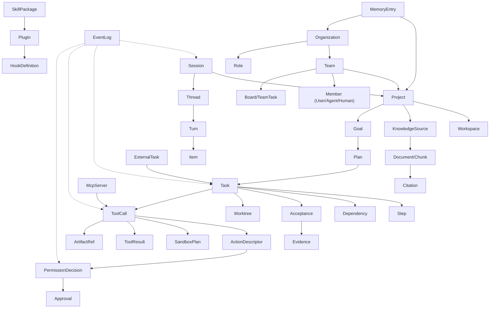

# 附录 A · 领域模型总览（Domain Model）

> 本附录汇总全部域的**核心实体、聚合边界、关键关系、命名与状态机**，作为数据建模（表结构）与接口设计的共同依据。字段级明细在各卷详设中；本附录保证**跨域一致性**。

---

## A.1 命名与标识约定

| 项 | 约定 |
| --- | --- |
| 表前缀 | 统一 `oc_`（OpenCoding），如 `oc_session`、`oc_event_log` |
| 主键 | 内部：`BIGINT` 雪花/序列；对外：不可猜测 ID（UUIDv7 或短码） |
| 短 ID | 人类可读前缀：`S-`（会话）、`T-`（任务）、`P-`（计划）、`G-`（目标）、`TM-`（团队）、`AR-`（审批）、`TC-`（工具调用）、`WS-`（工作区）、`K-`/`KB-`（知识）、`H-`（钩子）、`PL-`（插件） |
| 时间 | 统一 UTC 存储（`timestamptz`）；展示层本地化 |
| 枚举 | 存 `code`（大写蛇形），不存描述；描述由代码映射（可本地化） |
| 租户 | 所有业务表含 `tenant_id`，且强制过滤；分区键含 `tenant_id` |
| 软删 | `deleted_at`（业务可恢复）；合规删除另走流程（卷 19） |
| 审计字段 | `created_by`、`created_at`、`updated_by`、`updated_at`、`version`（乐观锁） |

## A.2 核心实体与聚合边界

| 域 | 聚合根 | 实体（聚合内） | 关键关系 |
| --- | --- | --- | --- |
| 组织（ENT） | Organization | Team、Membership、Role、ServiceAccount、Budget、Quota | Team 含 Project；Project 含 Workspace/Knowledge/Goal |
| 身份（ENT） | Identity | Credential、Session（登录）、SsoBinding、ScimSync | Identity ↔ Membership（多团队） |
| 会话（SESS） | Session | Thread、Turn、Item、AttachmentRef、Checkpoint、SessionRunnerState | Session → Project（弱关联）、Workspace（绑定） |
| 事件（EVT） | EventLog（分区） | Event、SchemaRef、ConsumerOffset、DeadLetter | 所有域产事件；投影表派生 |
| 模型（MDL） | Provider | ModelDescriptor、CredentialRef、RouteRule、UsageRecord | Provider → Credential（引用） |
| 上下文（CTX） | ContextSnapshot | Section、CompactMap、ArtifactRef、TokenEstimate | Snapshot → Session/Turn |
| 提示词（PRM） | PromptAsset | Fragment、Template、Policy、Role、Mode、AssetVersion、GrayAssignment | AssetVersion ↔ Session（PromptVersionSet） |
| 工具（TOOL） | ToolSpec | ParamSchema、RiskProfile、ResourceClaim、ToolCall、ToolResult、IdempotencyRecord | ToolCall → ActionDescriptor → PermissionDecision |
| 权限（PERM） | Policy | Rule、RiskAssessment、Decision、Approval、GrantMemory、PolicyVersion | Decision → ActionDescriptor；Approval → Session/Turn |
| 沙箱（SBOX） | SandboxPlan | IsolationTier、Fence、NetworkPolicy、CredentialLease、ExecutionRecord、Snapshot | SandboxPlan → ToolCall；Snapshot → Workspace |
| 技能（SKILL） | SkillPackage | Manifest、Capability、DependencyLock、EvalCase、ActivationRecord | SkillPackage ↔ Plugin（可携带） |
| MCP（MCP） | McpServer | Transport、AuthState、CapabilitySet、HealthState | McpServer → ToolSpec（映射） |
| 记忆（MEM） | MemoryEntry | Scope、Version、Source、Conflict、RecallRecord | MemoryEntry → Project/Org；文件真源 |
| 知识（KB） | KnowledgeSource | Document、Chunk、IndexEntry、GraphEdge、Citation、WikiPage | Chunk → Source；WikiPage → Project |
| Agent（AG） | AgentDefinition | LoopState、PhaseTransition、SubAgentLink、Verification、Trajectory | AgentDefinition ↔ Role（提示词） |
| 团队（TEAM） | Team | Member、Board、TeamTask、Message、Arbitration、BudgetAllocation | Member → Worktree；TeamTask → WorkItem |
| 工作对象（TASK） | WorkItem | Goal/Plan/Task/Step、Dependency、Acceptance、Evidence、SpecRef、Assignment | Task → Workspace/WriteScope；Plan → Goal |
| 自动化（GOAL） | Goal | Termination、InterventionPoint、ReportingPolicy、TickRecord | Goal → Plan；Schedule → Target（Plan/Task/Goal/Session） |
| 调度（GOAL） | Schedule | Trigger、RunRecord、CircuitBreaker、NotificationRoute | Schedule → WorkItem |
| Hooks（HOOK） | HookDefinition | Point、Matcher、Capability、Impl、ExecutionRecord | HookDefinition → Scope（org/project/user/session） |
| 插件（PLG） | Plugin | Manifest、Signature、ExtensionRegistration、ConfigSchema、HealthState | Plugin → ExtensionPoint（多对多） |
| Git（GIT） | Repository | Branch、Commit、Worktree、MergeQueueEntry、ConflictRecord、OperationLog | Worktree → Task/Team；Commit → WorkItem |
| 工作区（WS） | Workspace | ConnectionProfile、EnvProfile、SnapshotRef、QuotaUsage、SessionRecord | Workspace ↔ Project；Workspace ↔ Session/Task |
| A2A（A2A） | ExternalTask | CallerIdentity、TaskMapping、ApprovalForward、ArtifactGrant | ExternalTask → WorkItem |
| 持久化（PERS） | BackupJob | MigrationRecord、RestoreDrill、ConsistencyCheck、RetentionPolicy | 全库级 |

## A.3 概念 ER 图（跨域主干）

## A.4 状态机清单（跨域汇总）

| 对象 | 状态集合 | 定义卷 |
| --- | --- | --- |
| SessionRunner | Idle / Running / WaitingApproval / Paused / Failed / Completed | 01 §4.6 |
| Turn | start → phase → complete / abort | 12 §4.1 |
| ToolCall | pending → validating → deciding → awaiting_approval → executing → completed / failed / blocked / cancelled | 05 §4.2 |
| PermissionDecision | allow / ask / deny（含 reason 与 policyRef） | 06 §4.2 |
| Approval | Requested → Granted / Denied / Expired / Escalated | 06 §4.4 |
| SandboxPlan | selected → preparing → executing → completed / denied / violated | 07 §4.3 |
| Skill | Discovered → Installed → Active ⇄ Inactive → Disabled → Updated → Removed | 08 §4.5 |
| McpServer | Configured → Starting → Ready ⇄ Degraded → Failed → Stopped | 09 §4.2 |
| Agent Phase | Parse → Assess → Plan → Execute → Reflect → Verify → Wrap | 12 §4.2 |
| WorkItem | backlog → ready → in_progress ⇄ blocked → in_review → done / cancelled | 14 §4.2 |
| Goal | created → started ⇄ paused → achieved / failed / cancelled | 15 §4.2 |
| Team | created → running → completed / aborted | 13 §4.4 |
| Workspace | created → provisioning → ready ⇄ degraded → suspended → destroyed | 20 §4.3 |
| Plugin | installed → enabled ⇄ disabled → updated → removed（含 rolled_back） | 18 §4.3 |
| A2A Task | queued → running ⇄ waiting_approval → completed / failed / cancelled | 23 §4.2 |
| Dependency | ready → blocked → satisfied | 14 §4.3 |

## A.5 关键不变量（跨域）

| # | 不变量 | 违反后果 |
| --- | --- | --- |
| INV-1 | 任何副作用必经工具运行时 → 动作网关 → 权限决策 | 安全事件 + 会话冻结 |
| INV-2 | 任何状态变更必有事件；事件写入确认后才算提交 | 恢复不一致 |
| INV-3 | 租户上下文缺失即拒绝（Fail-Fast） | 数据越界风险 |
| INV-4 | 成员权限 ⊆ 团队权限 ⊆ 会话权限 ⊆ 租户策略 ⊆ 组织基线 | 权限放大 |
| INV-5 | 预算信封随调用传递，任何模型/工具调用不得缺失 | 成本失控 |
| INV-6 | 检查点与副作用账本必须同序写入（先账本后检查点） | 重放重复副作用 |
| INV-7 | 引用的外置工件（artifact/media）必须在其引用者生命周期内存在或可重建 | 引用失效 |
| INV-8 | 插件与 MCP 不得直连存储；必须经端口 | 隔离失效 |
| INV-9 | 密钥明文不得进入上下文、事件、日志、提交 | 合规事故 |
| INV-10 | 完成声明必须附证据（`done` 无证据即非法） | 假完成 |

## A.6 数据分域到表族映射（概要）

| 域 | 表族（示例名） |
| --- | --- |
| 组织/身份 | `oc_org`、`oc_team`、`oc_member`、`oc_role`、`oc_identity`、`oc_credential` |
| 会话 | `oc_session`、`oc_thread`、`oc_turn`、`oc_item`、`oc_checkpoint` |
| 事件 | `oc_event_log`（分区）、`oc_projection_offset`、`oc_dead_letter` |
| 模型 | `oc_provider`、`oc_model_descriptor`、`oc_usage_record`、`oc_route_rule` |
| 上下文 | `oc_context_snapshot`、`oc_compact_map`、`oc_artifact_ref` |
| 提示词 | `oc_prompt_asset`、`oc_prompt_version`、`oc_prompt_gray` |
| 工具/权限 | `oc_tool_call`、`oc_tool_result`、`oc_policy`、`oc_permission_decision`、`oc_approval`、`oc_grant_memory` |
| 沙箱 | `oc_sandbox_plan`、`oc_execution_record`、`oc_sandbox_violation` |
| 技能/插件 | `oc_skill_package`、`oc_skill_activation`、`oc_plugin`、`oc_extension_registry` |
| MCP | `oc_mcp_server`、`oc_mcp_capability` |
| 记忆/知识 | `oc_memory_entry`、`oc_memory_version`、`oc_kb_source`、`oc_kb_document`、`oc_kb_chunk`、`oc_kb_edge`、`oc_kb_wiki_page` |
| Agent/团队 | `oc_agent_definition`、`oc_team`、`oc_team_member`、`oc_team_message`、`oc_arbitration` |
| 工作对象/自动化 | `oc_workitem`、`oc_workitem_dep`、`oc_evidence`、`oc_goal`、`oc_schedule`、`oc_schedule_run` |
| Hooks | `oc_hook`、`oc_hook_execution` |
| Git | `oc_repo`、`oc_worktree`、`oc_merge_queue`、`oc_git_operation_log` |
| 工作区 | `oc_workspace`、`oc_connection_profile`、`oc_env_profile`、`oc_snapshot` |
| A2A | `oc_external_task`、`oc_a2a_caller`、`oc_agent_endpoint` |
| 运维 | `oc_audit_event`、`oc_quota_usage`、`oc_budget`、`oc_migration_record`、`oc_backup_job` |

## A.7 建模规则（强制）

1. 聚合内强一致、跨聚合最终一致（经事件）；跨聚合禁止直接写对方表。
2. 大对象（> 64KB）不入主表，转对象存储并保留引用。
3. 高频事件与低频业务表物理分离（分区策略见卷 19）。
4. 枚举字段必须与代码枚举一一对应（CI 校验）。
5. 外键仅在同一聚合内使用；跨聚合用逻辑引用（ID + 校验工具）。
6. 任何字段新增必须同时更新：本附录、迁移脚本、事件 Schema（如相关）、DoD 用例。

## A.8 索引与分区设计

**原则**：索引由「查询模式」驱动，不是越多越好；每个索引必须能指回一条真实查询（否则删除）。高基数标签禁止进索引/指标。

| 表族 | 主要查询模式 | 索引设计 | 分区/保留 |
| --- | --- | --- | --- |
| `oc_event_log` | 按会话顺序读、按 seq 续传、按类型聚合、按时间归档 | `(tenant_id, partition_key, seq)` 主索引；`(tenant_id, type, occurred_at)` 辅助；**不建** payload 上的索引（JSONB 仅用于罕见排障，走 GIN 可选） | 按 `(tenant_id, occurred_at)` 月分区；热 30 天 → 温 1 年 → 冷归档 |
| `oc_item`（会话条目） | 按会话时间序读、按类型过滤 | `(session_id, seq)`；`(session_id, item_type)` | 随会话；归档随事件 |
| `oc_checkpoint` | 取最近检查点、按会话列举 | `(session_id, seq DESC)` | 随会话 |
| `oc_tool_call` / `oc_tool_result` | 按会话/任务查、按工具聚合、按时间排障 | `(session_id, seq)`、`(tenant_id, tool_name, started_at)` | 随事件归档 |
| `oc_permission_decision` / `oc_approval` | 按会话、按状态（待审批）、按对象 | `(tenant_id, state, created_at)` 部分索引（仅 pending）；`(session_id, seq)` | 审计保留 |
| `oc_grant_memory` | 按（工具 × 资源模式）命中 | `(tenant_id, scope, tool_name, resource_pattern)` 唯一 | 长期 |
| `oc_workitem` | 按项目树、按状态、按指派、按依赖 | `(project_id, parent_id, status)`、`(assignee_id, status)`；DAG 边在 `oc_workitem_dep`：`(from_id)`、`(to_id)` 双向 | 项目生命周期 |
| `oc_goal` / `oc_schedule*` | 按状态、按下次触发时间 | `(tenant_id, state)`、`(next_fire_at)`（调度扫描） | 长期 |
| `oc_team*` | 按团队、按成员、按消息任务 | `(team_id, created_at)`、`(task_id)` | 长期 |
| `oc_kb_chunk` | 向量近邻、全文检索、按文档 | 向量索引（HNSW/IVF 由存储后端提供）；全文 GIN(`tsvector`)；`(document_id, chunk_no)` | 随源；与工作区版本绑定 |
| `oc_memory_entry` | 按键查、按标签召回、按状态 | `(tenant_id, scope, key)` 唯一；标签 GIN | TTL/复审 |
| `oc_usage_record` | 按六维聚合、按时间窗口 | `(tenant_id, scope_key, model, occurred_at)`；预聚合表 `oc_usage_hourly` | 明细 90 天，聚合 3 年 |
| `oc_audit_event` | 按时间、按类别、按操作者 | `(tenant_id, category, occurred_at)`；哈希链 `prev_hash` 顺序扫描 | 安全 3 年+ |
| `oc_session`（投影） | 列表排序、搜索、过滤 | `(tenant_id, owner_id, updated_at DESC)`；标题全文（可选） | 随租户策略 |
| `oc_update_record` / `oc_license` / `oc_playbook_run` / `oc_ai_output` | 按状态与时间 | `(tenant_id, created_at DESC)` + 状态部分索引 | 明细 1 年 |

**反模式清单（禁止）**：① 在事件 payload 上建通用 GIN 索引（写放大）；② 无租户前缀的索引（跨租户扫描）；③ 用 offset 深分页（改 cursor）；④ 在高频更新列上建多列复合索引；⑤ 用 `LIKE '%x%'` 做全文（改 FTS/向量）。

## A.9 新增域表族（卷 28–35）

| 域 | 表族 | 说明 |
| --- | --- | --- |
| 更新与分发（28） | `oc_update_channel`、`oc_update_artifact`、`oc_update_record`、`oc_announcement`、`oc_image_cache` | 通道/制品/执行记录/公告/镜像缓存 |
| 遥测与许可（28） | `oc_telemetry_consent`、`oc_crash_report`、`oc_license`、`oc_seat_assignment`、`oc_notification`、`oc_notification_route` | 同意记录/崩溃/许可/席位/通知与路由 |
| 生态与集成（29） | `oc_sdk_client`、`oc_import_job`、`oc_import_report`、`oc_registry_entry`、`oc_registry_sync`、`oc_feedback`、`oc_deeplink_audit`、`oc_im_binding` | 客户端/导入/Registry/反馈/深链/IM 绑定 |
| 安全工程（30） | `oc_asset_classification`、`oc_secret_ref`、`oc_secret_rotation`、`oc_trust_config`、`oc_vuln_record`、`oc_incident`、`oc_abuse_signal` | 分级/密钥引用与轮换/信任链配置/漏洞/事件/滥用 |
| 容量与成本（31） | `oc_capacity_sample`、`oc_cost_attribution`、`oc_quota_dynamic`、`oc_optimization_record` | 采样/归因/动态额度/优化记录 |
| 运维（32） | `oc_alert_rule`、`oc_alert_event`、`oc_runbook_ref`、`oc_drill_record`、`oc_postmortem` | 告警/演练/复盘 |
| 交互（33） | `oc_ui_preference`、`oc_coachmark_state`、`oc_share_link` | 偏好/引导状态/分享链接 |
| 自动化（34） | `oc_playbook`、`oc_playbook_run`、`oc_playbook_step`、`oc_playbook_output` | 模板/运行/步骤/产出 |
| 智能增强（35） | `oc_ai_run`、`oc_ai_output`、`oc_ai_finding`、`oc_ai_feedback` | 运行/产出/发现/反馈 |

**统一约束**：所有新表含 `tenant_id`、`created_at/by`、`deleted_at`（如适用）；大载荷（报告/时间线）入对象存储并在表中保留引用；新表必须进入卷 19 的迁移批次（B1–B6 之外的批次 B7 收录卷 28–35 相关表）。
