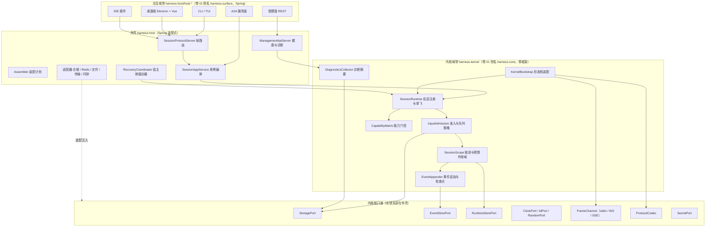
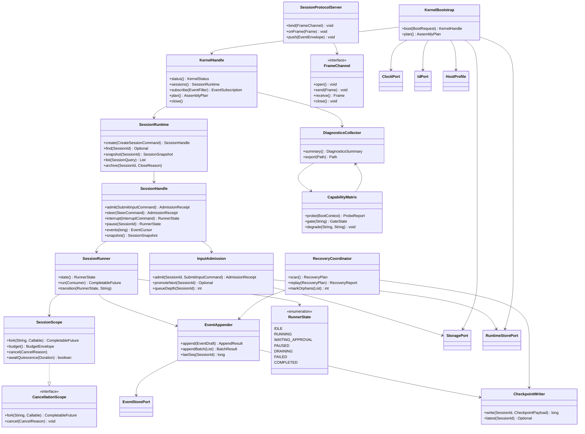
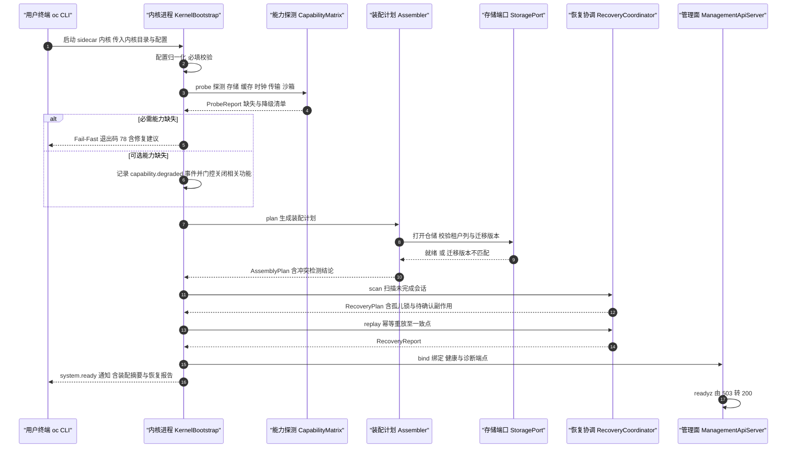
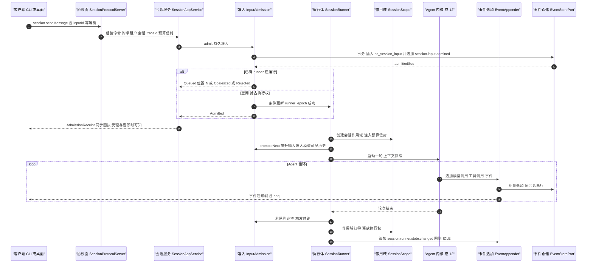
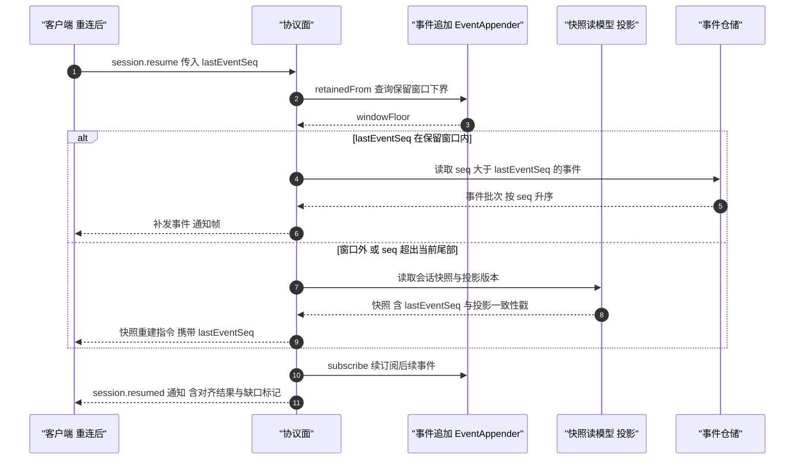
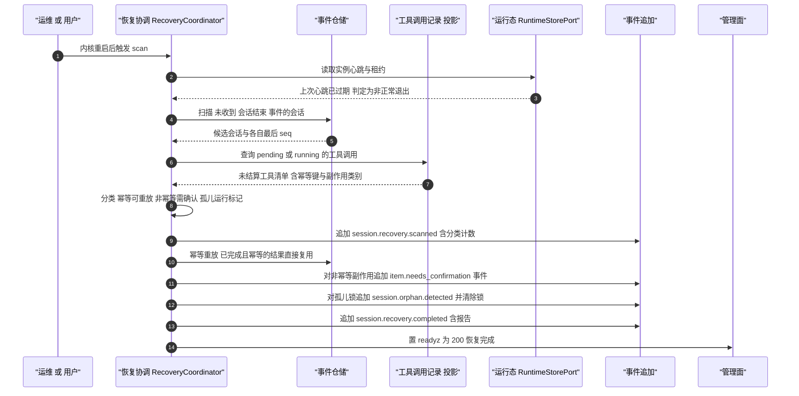
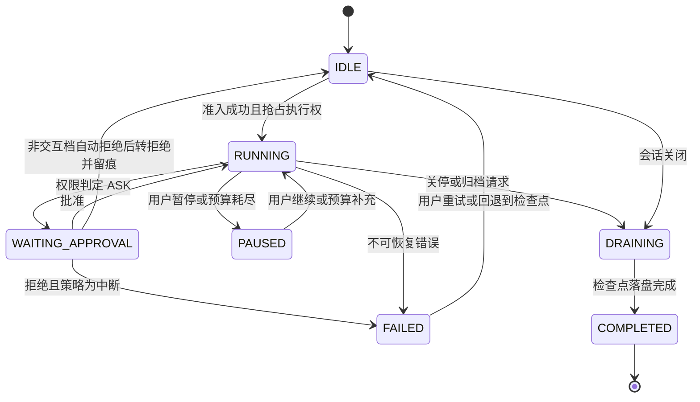
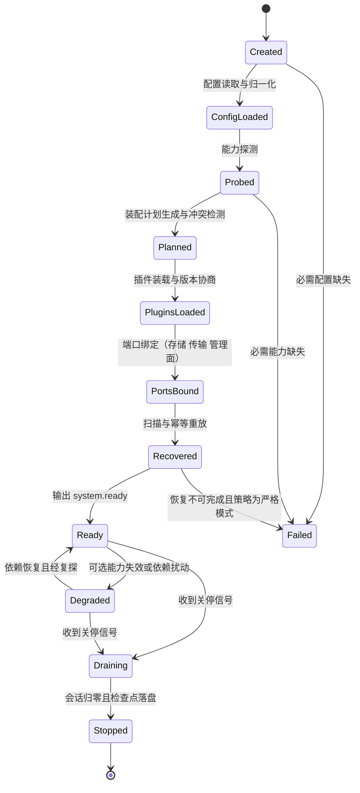

# 01 · 内核与运行时实现技术方案（Kernel Runtime Implementation）

> 上游契约：`docs/harness/01-harness-architecture.md`（卷 01，D-ARC-1…11）+ `DECISIONS.md`（H-001…H-020）+ `appendix-d`（内核域组件清单）。
> 本文件定位：Phase B 的**怎么做（how）**——内核/外壳分层落地、启动档与进程拓扑、会话运行时、并发与队列、崩溃恢复、IPC 协议、内核契约面（插件 SPI 稳定面）、冒烟与健康探针。
> 模板：严格遵循 `docs/harness/research/00-research-plan.md` §3 的 11 节结构；每个技术分叉给出结论并登记 `I-ARC-<n>`。


## 1. 实现目标与范围

### 1.1 本组件解决什么

把 Phase A 卷 01 的架构骨架落成**可编译、可测试、可嵌入、可常驻**的 Java 21 运行时：

1. **内核与外壳的物理边界**：内核（`com.hk.opencoding.kernel.*`）不依赖 Spring / ORM / Redis 客户端 / HTTP 客户端 / JSON 库；一切 IO 经端口注入（D-ARC-1、H-003）。
2. **三种宿主档同源**：`embedded`（CLI 短会话）、`sidecar`（桌面端与长会话，默认）、`remote`（server/enterprise）共用同一内核 API 与同一套会话协议（D-ARC-3、H-002、H-004）。
3. **会话运行时**：每会话一个执行体（Session Runner），承担单飞、队列、状态机、检查点与取消传播（REQ-INT-7、REQ-SESS-15、D-ARC-4/6）。
4. **崩溃恢复协调**：进程被杀后，重启扫描 + 孤儿标记 + 幂等重放 + 未完成副作用显式确认（REQ-PERS-5、NFR-R-3）。
5. **IPC 与协议面装配**：本地 stdio JSON-RPC、回环 WebSocket、SSE 只读跟随三通道由同一 `SessionProtocolServer` 装配（D-ARC-5）。
6. **内核契约面治理**：内核公开类型即插件 SPI 稳定面，含类型计数门禁与版本矩阵（H-003 回退红线、附录 B.8）。
7. **冒烟与健康探针**：`/healthz`、`/readyz`、`/api/v1/diagnostics`、可选合成探针（卷 01 §4.10，本文件落地见 §9.2 与 §10.2）。

### 1.2 本组件不解决

- 不定义领域语义：Agent 主循环（卷 12）、上下文组装（卷 03）、工具执行管线（卷 05）、权限决策链（卷 06）、事件 Schema 细节（卷 16）。
- 不实现存储：仓储实现、迁移脚本、备份（卷 19）在平台域带（外壳）。
- 不定义端侧交互：CLI/TUI 渲染（卷 22）、桌面端（卷 22/23）在交互域带。
- 不承担多租户治理策略（卷 24）：内核只做**租户上下文贯穿与缺失 Fail-Fast**（卷 01 §4.5 铁律 7；本文件 §10.6 安全第 1 条）。

### 1.3 上游/下游依赖

上游为卷 01 分层铁律、附录 A/B 契约、卷 16 事件信封（内核只产出事件、不直接写库）；下游为卷 12 Agent 运行时（经 `SessionScope` 取取消作用域与预算信封）、卷 18 插件与卷 22/23 各端（经协议面接入）；平台依赖为卷 19 持久化、卷 07 沙箱、卷 20 工作区（经端口注入）。

### 1.4 命名与模块映射（全文统一）

| 本文件用语（卷 01 §4.2 三带别名） | 目标 Maven 模块（卷 27 §4.1，**权威路径**） | v1 仓模块（迁移来源，卷 27 §4.8） | Spring 依赖 |
| --- | --- | --- | --- |
| 内核（`harness-core` 为别名） | `harness-contract`（契约）+ `harness-kernel/kernel-{model,context,prompt,tool,permission,agent,work,event}` | `open-coding-core-api` + `open-coding-core-agent` + `open-coding-core-model` + `open-coding-core-tool` + `open-coding-core-implementation` 收拢 | 禁止 |
| 平台域带 | `harness-platform/platform-{persistence,runtime-store,workspace,sandbox,vcs,knowledge,memory,enterprise,plugin,mcp,skill,hooks}` | `open-coding-domain` + `open-coding-infrastructure` | 允许 |
| 外壳装配 | `harness-host/host-{app,bootstrap,server}` | `open-coding-application` + `open-coding-bootstrap` | 允许 |
| 交互域带（`harness-surface` 为别名） | `harness-host/host-{cli,protocol}` + `client/{app,ui,sdk}` | `open-coding-interfaces` + `open-coding-client` | 允许 |

内核包前缀 `com.hk.opencoding.kernel.*`，子包按域划分（`kernel.session`、`kernel.event`、`kernel.properties`…）；外壳包前缀 `com.hk.opencoding.host.*`。允许内核依赖 `slf4j-api` 与 Lombok（编译期），见 I-ARC-7。

> 命名对齐注（R07 收敛）：`harness-core` / `harness-surface` 是卷 01 §4.2 的**三带别名**，不是 reactor 路径；一切构建、`-pl` 选择器与 enforcer 依赖规则以卷 27 §4.1/§4.2 的 `harness-kernel/*`、`harness-platform/*`、`harness-host/*`、`client/*` 为准（别名与路径一一对应，禁止在 pom/命令中使用 v1 名 `open-coding-*`）。
> 本文件与 impl/01–18 的验收命令均按 reactor 结构书写；v1 仓 → 目标结构映射见卷 27 §4.8.1。

### 落地核对（R07：模块 / 顺序 / 批次 / 门禁 / I-* 落点）

- **模块（卷 27 §4.1 权威名）**：契约 `harness-contract`；会话运行时与状态机 `harness-kernel/kernel-agent`（`session` 子包，零框架）；装配计划 `harness-host/host-bootstrap`；协议面 `harness-host/host-protocol`；三档宿主入口 `harness-host/host-{cli,server}` + `client/app`。**禁止**再出现 `harness-core` / `harness-surface` 作为模块路径。
- **实施顺序（卷 27 §4.5）**：第 1 步「契约骨架 + 依赖规则 Enforcer」+ 第 2 步「事件信封 + 写入端口 + 内存实现」；第 9 步「持久化 PG + 迁移框架」补上 durable 恢复，第 16/19 步不再回改本层接口。与 impl/16 的**互依赖以契约为界**：`EventEnvelope`/追加端口定义在 `harness-contract`，`kernel-agent` 只消费端口（本层不反向依赖 `kernel-event` 实现）。
- **数据批次（卷 27 §4.4）**：`oc_session`、`oc_session_input`、`oc_turn`、`oc_item`、`oc_checkpoint`、`oc_event_log`、`oc_projection_offset`、`oc_dead_letter` → **B1**（租户/身份/项目/工作区/会话基础表 + 事件日志分区表）。`oc_capability_gate` 未在 B1–B6 明列 → 建议归 **B1 扩展**（装配门控记录，随 `oc_session` 同批）；`oc_session_input` 为 Phase A 附录 A 未覆盖实体 → 见 `reviews/R07-scope-build-kernel.md` 的 X 修订项。
- **门禁映射（卷 27 §4.6）**：内核单测 → 「单元测试 + 覆盖率门」；`harness-host` 链路 → 「集成测试（PG/Redis 容器）`」；三档契约用例 → 「契约测试」；`kill -9` 与降级矩阵 → 「集成测试」内的故障注入层；类型计数门禁（H-003）→ 「格式与规范」门（脚本 `scripts/ci/kernel-api-count.sh`）。
- **I-* 落点**：I-ARC-1 → `harness-contract` + `harness-kernel/*`（包级内聚，ArchUnit 规则）；I-ARC-2 → `harness-host/host-cli`（stdio）+ `harness-host/host-server`（WS，`FrameChannel` 适配器）；I-ARC-3 → `harness-kernel/kernel-agent`（`SessionScope`）；I-ARC-4 → `harness-platform/platform-persistence`（`oc_session_input` 准入）+ `kernel-agent`（单飞）；I-ARC-5 → `host-bootstrap`（`RecoveryCoordinator`）+ `platform-persistence`；I-ARC-6 → `host-server`（`/healthz`、`/readyz`）；I-ARC-7 → 全内核（`slf4j-api` + `@Slf4j`）。


## 2. 功能需求清单（REQ-ARC-n）

优先级：P0 = 首个可运行版本必须；P1 = 与 M2 里程碑同批；P2 = 后续演进。

| ID | 需求描述 | 来源 | 优先级 | 验收要点 |
| --- | --- | --- | --- | --- |
| REQ-ARC-1 | 内核零框架、端口-适配器：全部 IO 经端口注入，内核产出事件与命令而非直接写库 | 卷 01 §4.1、卷 01 §4.5、H-003 | P0 | 构建期依赖检查：内核模块 classpath 无 `spring-*`/`mybatis-*`/`jackson-*`/Redis/HTTP 客户端；内核单测不启动 Spring |
| REQ-ARC-2 | 三档宿主形态（embedded / sidecar / remote）共用同一内核 API 与协议 | D-ARC-3、REQ-INT-2、H-002 | P0 | 同一套契约测试用例集在三档下全绿；差异仅在适配器装配 |
| REQ-ARC-3 | 能力驱动的显式装配计划：冲突检测、Fail-Fast、降级留痕 | D-ARC-9、卷 01 §4.7 | P0 | 缺必需能力拒绝启动并给出修复建议；降级生成 `system.capability.degraded` |
| REQ-ARC-4 | 会话执行体状态机契约化（迁移非法即业务异常） | 卷 01 §4.6、REQ-SESS-3 | P0 | 状态迁移全覆盖测试；非法迁移文案含当前态与期望态 |
| REQ-ARC-5 | 会话级串行（单飞）+ 可配队列策略 `queue` / `interrupt` / `reject` / `coalesce` | REQ-INT-7、REQ-SESS-15、D-ARC-4 | P0 | 并发提交 100 次仅 1 个进入执行；四种策略逐一断言（含队列上限与背压） |
| REQ-ARC-6 | 事件日志为事实源 + 检查点加速恢复 + 投影可重建 | D-ARC-6、H-006、REQ-INT-3 | P0 | 追加 P95 ≤ 10ms（NFR-P-4）；删除投影后重建结果与投影比对一致 |
| REQ-ARC-7 | 断线续传 `resume(fromSeq)`：窗口内补发，窗口外快照对齐 | D-ARC-10、REQ-SESS-11 | P0 | 缺口为零；快照重建后 `lastEventSeq` 单调不回退 |
| REQ-ARC-8 | 崩溃恢复：扫描 + 幂等重放 + 非幂等副作用显式标记 | REQ-PERS-5、NFR-R-3 | P0 | `kill -9` 用例；恢复后不重复副作用的用例；需人工确认项生成待办事件 |
| REQ-ARC-9 | 契约面版本矩阵 + 连接期能力协商（兼容期 ≥ 2 小版本） | D-ARC-11、附录 B.8 | P1 | 低版本客户端连高版本内核仅使用交集能力；不兼容时拒绝并提示升级 |
| REQ-ARC-10 | 内核公开类型即插件 SPI 稳定面，含类型计数门禁 | H-003 回退触发、H-007、卷 18 | P1 | CI 统计内核公开类型数；> 400 时告警并进入拆模块评估 |
| REQ-ARC-11 | 装配与运行诊断摘要（`oc doctor` 与 diagnostics 端点） | 卷 01 §4.10 | P1 | 输出装配计划、能力门控、插件健康、存储连通性，可导出诊断包 |
| REQ-ARC-12 | **【增量·竞品】** 提交侧单一入口 + 同步受理回执：提交方即时得知「是否受理」，无需等回合结束 | 03-codex `[E1]` `core/src/session/handlers.rs:471-494`（`oneshot` 回执） | P0 | `session.sendMessage` 返回 `AdmissionReceipt`；拒绝时含 `reasonCode` 与建议 |
| REQ-ARC-13 | **【增量·竞品】** 输入两阶段：先 durable 准入（落库、分配 `admittedSeq`），再「提升」进入模型可见历史；未提升不入上下文 | 02-opencode `[E1]` `specs/v2/session.md:35-37`、`core/src/session/runner/llm.ts:187-196` | P0 | 准入后崩溃重启，队列不丢；未提升输入在上下文快照中不可见 |
| REQ-ARC-14 | **【增量·竞品】** 启动档 profile 化 + 可打印「本机实际装配树」（等价 `--dump-config`） | 04-deepseek `[E1]` `docs/architecture.md:33-39,43-47` | P1 | `oc doctor --print-plan` 输出可复制的实际装配，且每行可被用户配置覆盖 |
| REQ-ARC-15 | **【增量·竞品】** 残留可检测、不谎报完成：有开始无结束的运行标记必须被判为孤儿并显式处理 | 04-deepseek `[E1]` `docs/subsystems/compaction.md`（三事件锁，先解锁最后）、02-opencode `[E1]` `llm.ts:119-139`（`failInterruptedTools`） | P0 | 构造「有 start 无 end」后启动扫描命中孤儿锁；恢复不生成假的完成事件 |
| REQ-ARC-16 | **【增量·竞品】** 非交互档位下审批态自动转拒绝并留痕（ask → deny） | 07-qoder `[E2]` `cli/how-it-works`（Headless 下 ask 转拒绝） | P1 | 无审批通道时审批请求即时拒绝，生成 `approval.denied.headless` 事件并提示可切换交互档 |
| REQ-ARC-17 | **【增量·竞品】** IPC 传输面多元化：stdio 供 SDK/子进程，本地 socket/WS 供常驻，同一客户端库可切换 | 03-codex `[E1]` `app-server-transport/src/lib.rs:36-43`（stdio/unix socket/websocket）、04-deepseek `[E1]` `docs/architecture.md:43-55`（Node IPC + stdio JSON-RPC） | P1 | 客户端切换传输不改业务代码；传输能力差异经握手声明 |


## 3. 技术方案选型（M×N 比选）

评分口径沿用 `00-research-plan.md`：`加权 = 3F + 2U + 2.5S + 2.5M`（满分 100），F=功能覆盖、U=用户体验、S=可演进/可维护、M=成熟度与落地成本。

### 3.1 I-ARC-1 内核模块拆分粒度

| 分支 | 描述 | 优点 | 代价 |
| --- | --- | --- | --- |
| B1 单内核模块 + 包级内聚 | 一个内核模块（卷 01 §4.2 别名 `harness-core`；目标 reactor 路径 `harness-kernel/kernel-*` 聚合），按域分包，契约面用白名单包导出 | 构建最快、跨域重构成本低、依赖方向天然单环 | 模块边界靠纪律与工具（ArchUnit 类规则）守 |
| B2 按子域拆 6 模块 | session / event / agent / model / tool / permission 六个 Maven 模块 | 边界编译期强制，可独立发版 | 每次跨域改动要动多个 pom；构建时间上升 |
| B3 每域一模块（24 个） | 与卷映射一一对应 | 极端清晰 | 模块数量与依赖矩阵爆炸，个人档构建时间不可接受 |

| 分支 | F | U | S | M | 加权 | 结论 |
| --- | --- | --- | --- | --- | --- | --- |
| **B1** | **8** | **7** | **8** | **9** | **80.5** | **选定** |
| B2 | 8 | 6 | 9 | 5 | 72.5 | 备选（H-003 回退触发命中时启用） |
| B3 | 7 | 4 | 8 | 3 | 57.5 | 淘汰 |

**选定 B1 的代价与回退**：边界由 ArchUnit 规则（禁止跨包子域直接引用 SPI 之外的实现类）与「公开类型计数门禁」共同守护；当公开类型 > 400 个（H-003 红线）或内核编译期 > 90s 时，按 B2 拆分为 6 模块（目标名 `harness-kernel/kernel-{session,event,agent,model,tool,permission}`，包路径不变，即卷 01 §4.2 别名 `harness-core` → `harness-kernel/kernel-*` 的正式化），因此上层无感。

### 3.2 I-ARC-2 本地 IPC 传输通道

| 分支 | 描述 | 优点 | 代价 |
| --- | --- | --- | --- |
| B1 stdio JSON-RPC | 内核作为子进程，stdin/stdout 承载帧 | 零端口、零防火墙、进程崩溃即 EOF、跨平台一致 | 需处理 stdout 污染；无法多客户端直连（需宿主代理） |
| B2 回环 WebSocket / UDS | 内核监听本地端口或 Unix 域套接字 | 多客户端并发、与 remote 形态完全同构、SSE 复用同一端口 | 端口分配与占用、Windows 命名管道语义弱 |
| B3 共享内存/命名管道专用通道 | 自研零拷贝通道 | 延迟最低（H-002 回退触发场景） | 平台差异大、调试困难、无协议复用 |

| 分支 | F | U | S | M | 加权 | 结论 |
| --- | --- | --- | --- | --- | --- | --- |
| **B1（默认）** | **8** | **8** | **9** | **10** | **86.5** | **选定为默认** |
| B2（`sidecar` 档自动追加） | 9 | 9 | 9 | 8 | 87.5 | **选定为常驻档并行支持** |
| B3 | 6 | 6 | 4 | 3 | 50 | 淘汰（保留为 H-002 回退预案） |

**落地规则**：`embedded` 档不启传输（进程内直调 `KernelHandle`）；`sidecar` 档默认 stdio（CLI 拉起）并在 `--serve` 时追加回环 WS（桌面端与 IDE 多客户端共享）；`remote` 档仅 WS/HTTPS。三档共用 `SessionProtocolServer` 与 `ProtocolCodec`，传输仅是实现 `FrameChannel` 的适配器。**stdout 纪律**：内核进程 stdout 只承载协议帧，所有日志经 stderr（这是 stdio 档的硬不变量，见 §10.6）。

### 3.3 I-ARC-3 结构化并发的落地方式

| 分支 | 描述 | 优点 | 代价 |
| --- | --- | --- | --- |
| B1 `StructuredTaskScope`（Java 21 preview） | 直接用 JDK 结构化并发 API | 语义标准、取消传播免费 | Java 21 下需 `--enable-preview`，与「企业 JDK 策略保守」冲突；升级到转正版还有 API 变更风险 |
| B2 自研 `SessionScope`（端口 + 父子任务树） | 以 `CancellationScope` 端口封装父子 Future 树、取消传播、预算归属 | 零 preview 依赖、可单测、可观测（每任务带 span）；语义与结构化并发一致 | 需自己实现取消/结果聚合边界（约 400 行 + 测试） |
| B3 裸 `ExecutorService` + 手动 `Future` 集合 | 最熟悉 | 取消泄漏、异常易被吞、测试困难 | 直接违反 D-ARC-4 的取消传播要求 |

| 分支 | F | U | S | M | 加权 | 结论 |
| --- | --- | --- | --- | --- | --- | --- |
| B1 | 9 | 7 | 6 | 5 | 68 | 备选（JDK 转正后） |
| **B2** | **9** | **8** | **9** | **8** | **86** | **选定** |
| B3 | 4 | 5 | 4 | 9 | 52 | 淘汰 |

**回退触发**：① JDK 25 及以后结构化并发转正且企业基线升级 → 以适配器方式替换为 `StructuredTaskScope` 实现（`SessionScope` 保持接口不变）；② 若自研作用域在 8 小时长任务压测中出现取消泄漏（活动线程未归零），退化为 B1 并接受 `--enable-preview`（企业档单独开关）。

### 3.4 I-ARC-4 会话准入与队列的落点

| 分支 | 描述 | 优点 | 代价 |
| --- | --- | --- | --- |
| B1 进程内内存队列 | 队列与单飞锁都在内核堆内 | 延迟最低（微秒级）、实现最简 | 崩溃丢队列、违反 REQ-INT-3；`embedded` 与 `sidecar` 语义分叉 |
| B2 PG 事务化 durable 准入 + 单飞行锁 | 准入写 `oc_session_input`（唯一 `input_id`），执行权由条件更新抢占 | 崩溃不丢、跨重启可续、天然幂等 | 热路径多一次事务写；需幂等键防重复投递 |
| B3 Redis Stream 队列 + 异步落库 | 队列走 Redis，事件异步补写 PG | 吞吐高 | Redis 不可用即丢队列（违反持久化铁律）；local-lite 无 Redis 时需降级实现 |

| 分支 | F | U | S | M | 加权 | 结论 |
| --- | --- | --- | --- | --- | --- | --- |
| B1 | 5 | 9 | 4 | 9 | 61.5 | 淘汰（作为 local-lite 的次级降级） |
| **B2** | **9** | **8** | **9** | **8** | **86** | **选定** |
| B3 | 8 | 8 | 6 | 6 | 71 | 备选（server 形态热点分区加速） |

**落地规则**：准入 = 「插入 `oc_session_input` + 追加 `session.input.admitted` 事件」在同一 `TransactionPort` 事务内；执行权 = `oc_session.runner_epoch` 条件更新（`WHERE state IN ('IDLE','PAUSED')`）抢到即成为 runner。`Redis` 仅作**加速索引与租约**（server 多实例形态），丢失不影响正确性——这保证 H-005 的「Redis 必须有进程内降级实现」在 `local-lite` 成立。

### 3.5 I-ARC-5 崩溃恢复协调方式

| 分支 | 描述与取舍 | F | U | S | M | 加权 | 结论 |
| --- | --- | --- | --- | --- | --- | --- | --- |
| B1 启动扫描 + 事件重放 | 启动时扫描未完成会话并重放到一致点；无额外进程、可测试，代价是恢复延迟随事件量增长（需检查点加速） | 9 | 8 | 9 | 9 | 88 | **选定（全部形态基线）** |
| B2 心跳租约 + 自动接管 | 实例心跳入 Redis、租约过期由他实例接管；多实例必需，单机形态属多余复杂度 | 8 | 7 | 8 | 6 | 74.5 | **选定为 server 形态叠加能力** |
| B3 影子监督进程 | 独立进程监控并重启内核；恢复最快但部署面翻倍，桌面端不可接受 | 7 | 9 | 5 | 4 | 61.5 | 淘汰 |

**落地规则**：`RecoveryCoordinator` 在「绑定端口之前、插件装载之后」执行，分四阶段（扫描 → 分类 → 重放 → 标记），阶段间产出 `session.recovery.scanned` / `session.recovery.completed` 事件；`readyz` 在恢复完成前返回 503。server 形态额外用 `oc:arc:host:{instanceId}:heartbeat` 租约做实例接管（B2），租约 TTL 30s、续约间隔 10s。

### 3.6 I-ARC-6 健康与冒烟探针分层

| 分支 | 描述与取舍 | F | U | S | M | 加权 | 结论 |
| --- | --- | --- | --- | --- | --- | --- | --- |
| B1 仅存活探针 | 进程活即 200；零成本但无法表达「存储断开仍 200」的假活 | 4 | 5 | 6 | 10 | 58 | 淘汰 |
| B2 存活 + 就绪 | 就绪含依赖连通与恢复完成（对齐 k8s 原生语义）；覆盖绝大多数运维场景，需控成本（< 50ms） | 9 | 8 | 9 | 9 | 87 | **选定为默认** |
| B3 双探针 + 合成三段冒烟 | 额外跑存储/模型/工具三段真实冒烟以发现「能连不能写」类故障；有成本与副作用，不能默认开 | 9 | 8 | 8 | 7 | 81 | **选定为可选叠加（默认关闭）** |

**落地规则**：`/healthz` = 进程心跳 + 事件追加器存活（不触外部依赖）；`/readyz` = 装配完成 ∧ 恢复完成 ∧ 存储可写探测（一次轻量写-删或事务回滚探针）∧ 必需模型端点可达（仅探测 DNS/TCP，不做推理）；合成探针 `/readyz?smoke=full` 或 `oc doctor --smoke` 才执行三段真实冒烟，且每次生成 `system.probe.synthetic` 事件。

### 3.7 I-ARC-7 内核日志接入方式

| 分支 | 描述与取舍 | F | U | S | M | 加权 | 结论 |
| --- | --- | --- | --- | --- | --- | --- | --- |
| B1 `slf4j-api` + Lombok `@Slf4j` | 内核直接用日志外观：与 `.qoder/rules/logging-rules.md` 完全一致（占位符/Throwable/脱敏单点）；代价是内核多一个外观依赖 | 9 | 8 | 8 | 10 | 88 | **选定** |
| B2 自研 `LogPort` + 外壳适配 | 内核零第三方运行时依赖；但违反 logging-rules 的 `@Slf4j` 要求，脱敏与级别控制要重做 | 7 | 6 | 7 | 5 | 63.5 | 备选（若内核被要求零第三方依赖） |
| B3 `java.util.logging` | JDK 自带零依赖；与外壳日志体系割裂，企业采集困难 | 4 | 4 | 5 | 8 | 51 | 淘汰 |

**说明**：H-003 的「零框架」清单明确为 Spring / Jackson / ORM / Redis 客户端 / HTTP 客户端；`slf4j-api` 属日志外观而非框架，Lombok 为编译期注解处理器。内核日志与外壳共用同一 Logback 配置与 `MaskingConverter`，因此「敏感信息脱敏」（logging-rules §6）只有一处实现。**回退触发**：内核被嵌入到禁止任何第三方 jar 的环境（如受限 Applet 类沙箱）时切 B2。

### 3.8 决策登记表（I-ARC）

| ID | 维度 | 候选分支 | 选定 | 理由（加权） | 回退触发 |
| --- | --- | --- | --- | --- | --- |
| I-ARC-1 | 内核模块拆分粒度 | 单模块 / 拆 6 模块 / 拆 24 模块 | 单内核模块 + 包级内聚（80.5） | 构建快、依赖单环、跨域重构便宜；边界由 ArchUnit + 类型计数门禁守 | 公开类型 > 400 或编译 > 90s → 拆 6 模块（包路径不变） |
| I-ARC-2 | 本地 IPC 传输 | stdio / 回环 WS+UDS / 共享内存 | stdio 默认 + 回环 WS 并行（86.5 / 87.5） | 与 remote 同协议、零端口冲突、崩溃可检测；多客户端走 WS | 增量延迟 P95 > 50ms（H-002 红字）→ 启用共享内存通道 |
| I-ARC-3 | 结构化并发落地 | `StructuredTaskScope` / 自研 `SessionScope` / 裸 ExecutorService | 自研 `SessionScope`（86） | 零 preview 依赖、取消与预算可观测、可单测 | JDK 转正 → 适配器切换；取消泄漏 → 退化 B1 |
| I-ARC-4 | 会话准入与队列落点 | 内存队列 / PG durable 准入 / Redis Stream | PG durable 准入 + 单飞条件更新（86） | 崩溃不丢、可续跑、幂等；Redis 仅加速不承载正确性 | 准入写延迟 P95 > 15ms → Redis Stream 先行 + 异步落库（server 档） |
| I-ARC-5 | 崩溃恢复协调 | 启动扫描 / 心跳租约接管 / 影子进程 | 启动扫描为基线，server 叠加租约（88 / 74.5） | 全形态可用、可测试；多实例由租约补齐 | 恢复耗时 > 5s（10k 事件）→ 前置检查点懒加载 + 并行重放 |
| I-ARC-6 | 健康与冒烟探针 | 仅存活 / 存活+就绪 / 三段合成冒烟 | 存活+就绪默认，合成冒烟可选关闭（87 / 81） | 语义标准、成本可控；冒烟有副作用故默认关 | 合成探针失败率误报 > 1% → 收窄为仅 TCP 探活 |
| I-ARC-7 | 内核日志接入 | slf4j-api + Lombok / 自研 LogPort / JUL | `slf4j-api` + `@Slf4j`（88） | 与项目日志规范一致、脱敏单点实现 | 环境禁第三方 jar → 切自研 `LogPort` |


## 4. 总体架构图



**内核 vs 外壳的判定线**：凡涉及「时间、随机、ID、存储、网络、文件、密钥」的调用必属外壳实现；内核只持有端口引用。`KernelBootstrap` 是唯一允许把端口实例绑进内核的位置（构造注入，无静态可变状态）。


## 5. 类图



### 5.1 关键 Java 21 签名（内核契约，全部无语义框架依赖）

启动门面只有一个方法：`KernelHandle boot(BootRequest request)`。`BootRequest` 为 record（形态档、内核目录、原始配置映射、能力禁用集），`boot` 内的六步装配顺序见 §6.1 流程 A；必需能力缺失时抛 `HarnessException(ErrorCode.UNSUPPORTED_CAPABILITY, …)` 并以退出码 78 终止（Fail-Fast，不做静默兜底）。

```java
package com.hk.opencoding.kernel.session;

/** 宿主形态档：EMBEDDED 冷启动 ≤ 300ms、SIDECAR 默认、REMOTE 多实例租约接管；三档共用同一 API 仅装配不同（D-ARC-3）。 */
public enum HostProfile { EMBEDDED, SIDECAR, REMOTE }

/**
 * 会话输入准入结果。
 * 采用 sealed 层次而非状态码字段集合，使「未受理」无法被误读为「已受理」。
 */
public sealed interface AdmissionOutcome
        permits Admitted, Queued, Coalesced, Rejected {

    /** 输入标识，幂等键载体 */
    String inputId();
}

/** 已受理并立即执行（单飞空闲）。 */
record Admitted(String inputId, long admittedSeq, long runnerEpoch) implements AdmissionOutcome { }

/** 已受理但排队；position 用于前端展示与超时策略。 */
record Queued(String inputId, long admittedSeq, int position, long enqueuedAtMillis)
        implements AdmissionOutcome { }

/** 与同会话既有排队输入合并（仅当策略为 COALESCE 且幂等键一致）。 */
record Coalesced(String inputId, String mergedIntoInputId) implements AdmissionOutcome { }

/** 拒绝受理；必须携带可读原因与建议（REQ-ARC-12）。 */
record Rejected(String inputId, ErrorCode code, String reason, String suggestion)
        implements AdmissionOutcome { }
```

```java
package com.hk.opencoding.kernel.concurrency;

/**
 * 会话取消作用域：结构化并发语义的自研落地（I-ARC-3）。
 * 所有子任务必须经 fork 注册，取消时自顶向下传播；作用域内活动任务归零后方可释放。
 */
public interface SessionScope extends AutoCloseable {

    /**
     * 派生子任务并纳入取消树。
     *
     * @param name 任务名（日志与追踪用，会话内唯一），必填
     * @param task 任务体；不得为 null，不得捕获 CancellationException
     * @return 子任务结果；父作用域取消时以 CancellationException 完成
     */
    <T> CompletableFuture<T> fork(String name, Callable<T> task);

    /**
     * 取消作用域（幂等）。
     *
     * @param reason 取消原因（用户中断 / 预算耗尽 / 宿主关停），必填
     */
    void cancel(CancelReason reason);

    /**
     * 等待作用域内任务归零。
     *
     * @param timeout 最长等待时间，必须为正
     * @return 归零返回 true；超时返回 false（调用方须告警并强制释放）
     */
    boolean awaitQuiescence(Duration timeout);
}
```

事务边界端口 `TransactionPort.required(Supplier<T>)`：内核不做注解式事务（零框架约束），事务原子性由外壳实现保证——外壳实现必须在方法上标注 `@Transactional(rollbackFor = Exception.class)`，且事务体内抛出的任何异常都必须导致回滚，禁止 try-catch 吞异常。

**异常命名与错误码纪律（全文统一）**：内核层（framework-free core，无 Spring，含本域全部示例）业务失败统一抛 `HarnessException(ErrorCode code, String message)`——必须携带错误码与中文文案，禁止裸 `RuntimeException` / `IllegalArgumentException` / `NullPointerException` 表达业务失败；域内专用异常（如 `AiException`、`MemoryException`、`SandboxException`、`McpException`）一律声明为 `HarnessException` 的子类，不另立平行异常体系。外壳层（Spring 分层：domain / application / interfaces）业务失败抛 `BusinessException`（同携带 `ErrorCode`）；外壳的全局异常处理器负责把内核上抛的 `HarnessException` 按 `ErrorCode` 映射为统一错误响应（HTTP 状态码 + 错误体），因此内核异常不得直接穿透到协议面。可重试语义只由 `ErrorCode.retryable` 决定（与卷 02 D14 同源），禁止按异常类型或文案判定重试。**契约缺口指针（X-82）**：异常类名（`HarnessException`/`BusinessException`）与冻结卷册 `ErrorCode` 映射的登记缺口已列为修订建议 **X-82**（`impl/IMPL-DECISIONS.md` §4「Phase A 修订建议汇总」；台账登记由编排方执行，本文件不改台账）。


## 6. 核心流程时序图

### 6.1 流程 A：sidecar 启动 → 装配 → 就绪 → 冒烟探针


- **前置条件**：内核目录可写；PG（或 local-lite 嵌入仓储）可达；迁移版本与应用版本匹配；无第二个内核进程持锁；**主路径**：配置校验 → 能力探测 → 装配计划 → 存储打开 → 恢复扫描/重放 → 绑定端口 → `system.ready`；**异常与补偿**：必需能力缺失 → 退出码 78 且 stdout 不输出协议帧；可选能力缺失 → 门控关闭 + `system.capability.degraded`；存储迁移版本落后 → 拒绝启动并提示执行 `oc migrate`；**幂等与并发点**：内核目录单实例锁（文件锁 + 进程内静态防线）；恢复重放按 `seq` 去重天然幂等；探针可重复执行无副作用。

### 6.2 流程 B：sendMessage 的 durable 准入 → 单飞执行 → 事件推送


- **前置条件**：会话存在且未归档；客户端已完成协议握手与能力协商；租户上下文完整；**主路径**：同步准入回执 → 提升 → Agent 循环 → 事件流 → 状态回 IDLE；队列非空自动续跑（消费新输入而非重跑旧输入）；**异常与补偿**：队列满（`queue-max`）→ 按策略 `reject`（`RATE_LIMITED` / `CONFLICT`）并附建议；`interrupt` 策略 → 旧输入标记 `DROPPED` 并生成 `session.input.dropped`；执行中异常 → runner 进 `FAILED`，可重试且不重复副作用；**幂等与并发点**：`inputId` 唯一索引保证重复投递只准入一次；执行权以 `runner_epoch` 条件更新抢占，更新行数必须为 1，否则按「已被并发抢占」处理（不视为错误，直接转 Queued）；事件追加按 `(sessionId, seq)` 唯一约束串行化。

### 6.3 流程 C：断线续传 `resume(fromSeq)` 与快照对齐


- **前置条件**：客户端持有 `lastEventSeq`；会话未归档；协议版本兼容；**主路径**：判定窗口 → 窗口内补发 / 窗口外快照重建 → 续订阅；**异常与补偿**：`lastEventSeq` 大于服务端当前尾部（客户端状态漂移）→ 返回 `CONFLICT` 并附服务端尾部 seq，客户端丢弃本地未确认队列后重放；保留窗口配置过小导致频繁重建 → 告警并提升保留阈值；**幂等与并发点**：补发为只读可重入；快照读取不阻塞写入（读已提交 + 投影最终一致 ≤ 5s，NFR-R-4）；同一客户端重复 resume 以最后一次为准（无状态）。

### 6.4 流程 D：崩溃恢复（`kill -9` 后重启扫描与孤儿标记）


- **前置条件**：事件日志完整可读；工具调用记录携带幂等键与副作用分类；上次进程未正常关停（心跳过期或无 `system.stopped` 事件）；**主路径**：心跳判定 → 未完成会话扫描 → 未结算工具分类 → 幂等重放 → 待确认标记 → 孤儿清除 → 报告；**异常与补偿**：事件日志尾部撕裂 → 以最后一个完整帧为界截断并记录 `session.truncated`；幂等键缺失的旧记录一律标记「需人工确认」，绝不自动重放；重放再次失败 → 会话进 `FAILED` 并保留现场；**幂等与并发点**：重放以 `(sessionId, seq)` 唯一约束保证不重复消费；单会话重放由 `runner_epoch` 单飞保护；多实例由心跳租约判定接管权，同一会话不会被两个实例同时重放。


## 7. 状态机

### 7.1 会话执行体状态机（对齐卷 01 §4.6 并补充 DRAINING）



**迁移表（实现为静态不可变 Map，非法迁移抛 `HarnessException(ErrorCode.CONFLICT, …)`）**：

| 当前态 | 允许目标 | 触发 | 备注 |
| --- | --- | --- | --- |
| IDLE | RUNNING / DRAINING | 准入成功 / 会话关闭 | IDLE 是唯一可被抢占执行权的状态 |
| RUNNING | WAITING_APPROVAL / PAUSED / DRAINING / FAILED | 审批 ASK / 暂停或预算耗尽 / 关停 / 不可恢复错误 | 预算耗尽只暂停不失败（可补充后继续） |
| WAITING_APPROVAL | RUNNING / FAILED / IDLE | 批准 / 拒绝且中断 / 非交互档自动拒绝 | 非交互档拒绝是「可恢复的未执行」，故回 IDLE |
| PAUSED | RUNNING / DRAINING | 继续 / 关停 | 暂停期间不接受新输入提升，但接受准入（入队列） |
| DRAINING | COMPLETED | 检查点完成 | 排空阶段禁止新工具调用 |
| FAILED | IDLE | 用户重试 | 重试前必须重新加载检查点 |
| COMPLETED | （终态） | — | 仅允许归档操作，不再迁移 |

### 7.2 宿主进程启动状态机




## 8. 数据模型

### 8.1 表（`oc_*`，内核写入路径全部经仓储端口）

**类型约定（本节各表通用；逐列 DDL 以卷 19 的 Flyway 迁移脚本为准）**：内部主键 `id BIGINT`（Snowflake）或复合主键（如 `(tenant_id, …)`）；对外暴露的引用 ID 用不透明字符串 / `UUID`（防遍历）；时间列统一 `TIMESTAMPTZ`（UTC 存储、展示层本地化）；枚举列存 `VARCHAR(32)` 的 **code**（禁止存 desc）；结构化与可变结构用 `JSONB`；布尔列 `BOOLEAN NOT NULL DEFAULT false`；敏感字段（密钥 / Token）只存引用名 `*_ref`，明文永不入库；大对象（快照 / 录制 / 工件）外置并留指针；各表字段语义见「关键字段」列，索引与唯一约束见末列。

| 表 | 用途 | 关键字段 | 索引/约束 | 生命周期 |
| --- | --- | --- | --- | --- |
| `oc_session` | 会话主记录与投影 | `id`、`tenant_id`、`owner_id`、`title`、`state`、`runner_epoch`、`last_event_seq`、`workspace_ref`、`model_ref`、`permission_mode` | PK `id`；`(tenant_id, owner_id, updated_at DESC)`；`runner_epoch` 乐观锁条件列 | 随租户策略（归档/回收站） |
| `oc_session_input` | **准入队列**（I-ARC-4 落地；Phase A 附录 A 未覆盖此实体，登记为修订建议） | `id`、`tenant_id`、`session_id`、`input_id`（幂等键）、`admitted_seq`、`state`、`policy`、`priority`、`payload`、`trace_id`、`created_at`、`promoted_at`、`turn_id`、`dropped_reason` | PK `id`；UNIQUE `(session_id, input_id)`；`(session_id, admitted_seq)`；部分索引 `state='QUEUED'` | 随会话；`DROPPED` 后保留 7 天供排障 |
| `oc_turn` | 轮次 | `id`、`session_id`、`seq`、`state`、`started_at`、`ended_at`、`usage_ref` | PK `id`；`(session_id, seq)` 唯一 | 随会话 |
| `oc_item` | 会话条目（消息/工具/审批） | `id`、`session_id`、`seq`、`item_type`、`ref_id`、`summary` | `(session_id, seq)`；`(session_id, item_type)` | 随事件归档 |
| `oc_checkpoint` | 检查点 | `id`、`session_id`、`seq`、`payload_ref`、`workspace_version`、`created_at` | `(session_id, seq DESC)` | 随会话 |
| `oc_event_log` | 事实源（分区表） | `event_id`、`tenant_id`、`partition_key`、`seq`、`type`、`version`、`occurred_at`、`actor`、`trace_id`、`payload`、`sensitivity` | PK `(tenant_id, partition_key, seq)`；`(tenant_id, type, occurred_at)`；月分区 | 热 30 天 → 温 1 年 → 冷归档 |
| `oc_projection_offset` / `oc_dead_letter` | 投影进度与消费者死信 | 投影：`projector`/`last_seq`；死信：`event_id`/`consumer`/`reason`/`retry_count` | PK `(projector, tenant_id)`；`(consumer, created_at)` | 长期 / 90 天 |

**写入纪律**：内核只调用 `EventAppender.append` 与 `StoragePort`；所有插入/更新必须在 `TransactionPort.required(...)` 内；更新 `oc_session` 的执行权抢占必须是**条件更新 + 行数校验**：

```java
// 执行权抢占：仅当会话处于 IDLE/PAUSED 且 epoch 未被他人推进时才允许成为 runner
int updated = storage.updateRunnerEpoch(
        new RunnerEpochCas(sessionId, expectedEpoch, expectedEpoch + 1,
                Set.of(RunnerState.IDLE, RunnerState.PAUSED)));
log.info("会话执行权抢占，sessionId={}, 期望 epoch={}, 更新行数={}", sessionId, expectedEpoch, updated);
if (updated != 1) {
    // 并发抢占语义：不是错误，转入排队分支，由调用方返回 Queued
    log.warn("会话执行权已被并发抢占，sessionId={}, 期望 epoch={}", sessionId, expectedEpoch);
    throw new HarnessException(ErrorCode.CONFLICT, "会话正在执行，请稍候或使用中断以抢占");
}
```

### 8.2 Redis Key（全部经统一 Key 工厂生成，禁止业务侧拼串）

| 逻辑用途 | Key 形态（`RedisKeys` 静态方法） | TTL | 丢失影响 |
| --- | --- | --- | --- |
| 会话执行权租约（server 多实例） | `oc:arc:session:{sessionId}:lease` | 30s（续约 10s） | 重新竞争执行权，正确性由 DB 条件更新兜底 |
| 实例心跳 | `oc:arc:host:{instanceId}:heartbeat` | 45s | 触发接管判定 |
| 准入去重加速索引 | `oc:arc:input:{sessionId}:{inputId}` | 1h | 回退到 DB 唯一索引，仅性能下降 |
| 队列深度计数 | `oc:arc:queue:{sessionId}:depth` | 会话生命周期 | 回退到 DB `COUNT`，仅性能下降 |
| 契约面协商缓存 / 恢复扫描进度 | `oc:arc:proto:{peerKind}:{peerVersion}`、`oc:arc:recovery:scan:{runId}` | 10min / 24h | 重新握手 / 全量重扫 |

**Redis 降级实现**：`RuntimeStorePort` 必须提供进程内实现（`ConcurrentHashMap` + 虚拟线程定时器），在 Redis 不可用或 `local-lite` 档自动装配（H-005）。降级时生成 `system.capability.degraded{capability="runtime-store"}`。

### 8.3 事件类型清单（本域产出）

| 事件类型 | 触发 | 关键载荷 | 消费者 |
| --- | --- | --- | --- |
| `system.started` | 进程启动 | 形态档、版本、PID、内核目录 | 审计、诊断 |
| `system.ready` | 就绪（恢复完成后） | 装配摘要、能力缺口、恢复报告引用 | 前端、诊断、SLO |
| `system.capability.probed` | 能力探测完成 | 各能力状态与探测耗时 | 前端门控、审计 |
| `system.capability.degraded` | 可选能力缺失或失效 | 能力名、原因、影响功能、恢复条件 | 前端（显式提示）、告警 |
| `system.assembly.plan.created` | 装配计划生成 | 计划条目、冲突检测结论 | 诊断包 |
| `system.invariant.violated` | 内核不变量破坏 | 不变量 ID、诊断引用 | 告警、诊断 |
| `session.runner.state.changed` | 状态迁移 | 旧态、新态、原因、epoch | 前端、审计 |
| `session.input.admitted` | 输入持久准入 | `inputId`、`admittedSeq`、策略、队列位置 | 前端、计量 |
| `session.input.promoted` | 输入被提升进入模型可见历史 | `inputId`、`turnId` | 上下文层、审计 |
| `session.input.dropped` | 输入被 `interrupt` 策略丢弃 | `inputId`、原因 | 前端（明确告知） |
| `session.recovery.scanned` | 恢复扫描完成 | 分类计数（可重放/需确认/孤儿） | 审计、诊断 |
| `session.recovery.completed` | 恢复重放完成 | 重放事件数、耗时、待确认清单 | 审计、前端提示 |
| `session.orphan.detected` | 检测到孤儿锁/未结算工具 | 锁 ID、工具调用 ID、副作用类别 | 前端（需人工确认）、审计 |
| `session.truncated` | 事件尾部撕裂被截断 | 截断位置、丢弃字节数 | 审计、告警 |
| `approval.denied.headless` | 非交互档审批自动拒绝（REQ-ARC-16） | 审批 ID、工具名、原因 | 前端、审计 |

**事件写入不变量**（另有 `system.probe.synthetic`、`session.queue.backpressure` 两个运维向事件，载荷分别为「三段探针结果与耗时」「队列深度/上限/策略」）：① 同一会话事件按 `seq` 严格递增且无空洞（撕裂除外，撕裂必留 `session.truncated`）；② 任何状态迁移先落事件再改内存态，避免「内存已改、事件丢失」；③ 流式文本增量不入库（REQ-INT-4），仅存最终消息与摘要。


## 9. 接口与扩展点

### 9.1 会话协议面（JSON-RPC 2.0 over stdio / WS）

本域负责的帧契约（其余方法见附录 B.2，由对应域提供 handler）：

| 方法 | 方向 | 入参要点 | 出参要点 | 错误码 |
| --- | --- | --- | --- | --- |
| `session.create` | C→S | 工作区、模式、模型、权限模式、自主度、`Idempotency-Key` | `sessionId`、`lastEventSeq`、`protocolVersion` | `INVALID_ARGUMENT`、`NOT_FOUND`（工作区） |
| `session.attach` | C→S | `sessionId`、客户端能力声明 | 快照 + `lastEventSeq` + 队列深度 | `NOT_FOUND`、`CONFLICT`（已归档） |
| `session.resume` | C→S | `sessionId`、`fromSeq` | 补发事件序列 / 快照重建指令 | `CONFLICT`（seq 漂移） |
| `session.sendMessage` | C→S | 多模态块、附件引用、预算覆盖、`inputId` 幂等键 | `AdmissionReceipt`（受理与否即时返回） | `RATE_LIMITED`、`CONFLICT`、`PERMISSION_DENIED` |
| `session.steer` | C→S | 文本、目标安全点 | `AdmissionReceipt` | 同 `sendMessage` |
| `session.interrupt` | C→S | `sessionId`、原因 | 迁移后 `RunnerState` | `CONFLICT`（已终态） |
| `session.pause` / `session.resumeRun` | C→S | `sessionId` | `RunnerState` | `CONFLICT` |
| `session.close` / `session.archive` | C→S | `sessionId`、保留策略 | `RunnerState`（DRAINING → COMPLETED） | `CONFLICT` |
| `diagnostics.get` | C→S | 是否含诊断包 | 装配计划、能力门控、插件健康、存储连通性 | `INTERNAL_ERROR` |
| `event`（通知） | S→C | `seq`、类型、载荷、`sensitivity` | — | — |
| `approval.requested` | S→C | 审批 ID、预览、倒计时、可选决策 | — | — |
| `agent.phase` | S→C | 阶段、进度 | — | — |
| `error` | S→C | 错误码、文案、`recoverable`、`traceId` | — | — |

**帧不变量**：① 每帧含 `requestId`/`sessionId`/`traceId`；② 通知帧不要求响应但**必须按 seq 有序**；③ 断线补发与实时推送共用同一 seq 空间；④ stdio 档 stdout 仅协议帧（日志走 stderr）。

### 9.2 管理面 REST（Thin，仅健康与诊断）

| 端点 | 方法 | 说明 | 权限点 |
| --- | --- | --- | --- |
| `/healthz` | GET | 存活：进程心跳 + 事件追加器存活（不触外部依赖） | 内网白名单 |
| `/readyz` | GET | 就绪：装配完成 ∧ 恢复完成 ∧ 存储可写 ∧ 必需模型端点 TCP 可达；`?smoke=full` 触发合成三段冒烟 | 内网白名单 |
| `/metrics` | GET | Prometheus 指标（§10.5） | 内网白名单 |
| `/api/v1/diagnostics` | GET | 装配计划、能力门控、插件健康、恢复报告 | `diagnostics.read` |
| `/api/v1/diagnostics/export` | POST | 导出诊断包（脱敏） | `diagnostics.read` |

### 9.3 内核端口与扩展点（= 插件 SPI 稳定面，对接卷 18 目录）

| 端口/扩展点 | 稳定性 | 说明 | 默认实现（平台域带） |
| --- | --- | --- | --- |
| `StoragePort` | 稳定 | 会话/输入/事件/检查点读写（只暴露领域操作，不暴露 SQL） | PG 仓储；`local-lite` 嵌入式仓储 |
| `EventStorePort` | 稳定 | 事件追加、按 seq 读、保留窗口查询、投影位点 | PG 分区表 |
| `RuntimeStorePort` | 稳定 | 热态、锁、租约、计数器 | Redis；进程内降级实现 |
| `TransactionPort` | 稳定 | 事务边界（内核无注解事务） | Spring `@Transactional` 适配器 |
| `ClockPort` / `IdPort` / `RandomPort` | 稳定 | 可测性端口（时间、ID、随机） | 系统实现 + 测试固定实现 |
| `FrameChannel` | 稳定 | 本地 IPC 通道（stdio / 回环 WS / SSE） | 传输适配器 |
| `ProtocolCodec` | 稳定 | 帧编解码（JSON-RPC 变体，契约单源） | 交互域带实现（禁止内核自带 JSON 库） |
| `HostAdapterPort` | 稳定 | 宿主形态（embedded/sidecar/remote）行为差异 | 三档适配器 |
| `SecretPort` | 稳定 | 短期凭证明文句柄（用完即弃） | 钥匙串/KMS/Vault 适配 |
| `CapabilityProbe` | 演进 | 启动期能力探测扩展 | 内置探测集 + 插件扩展 |
| `AssemblerContributor` | 演进 | 向装配计划贡献服务/适配器/插件 | 内核内置 + 插件 |
| `SurfaceRenderer` | 演进 | 新增端形态（只读跟随、机器人端） | SSE 跟随端 |

**SPI 稳定性纪律**：标「稳定」的端口变更属于破坏性变更，必须走附录 B.8 的流程（公告 ≥ 1 小版本 → 双栈 → 弃用告警 → 移除）；内核公开类型计数纳入 CI（REQ-ARC-10）。

### 9.4 配置项（`open-coding.kernel.*`）与环境变量

| 配置键 | 含义 | 默认 | 必填 | 环境变量 |
| --- | --- | --- | --- | --- |
| `open-coding.kernel.profile` | 宿主形态档 | `sidecar` | 否 | `OC_KERNEL_PROFILE` |
| `open-coding.kernel.home` | 内核目录（锁、日志、缓存、诊断） | `~/.opencoding` | 否 | `OC_HOME` |
| `open-coding.kernel.ipc.transport` | 本地传输（`stdio` / `ws` / `both`） | `stdio` | 否 | `OC_KERNEL_IPC_TRANSPORT` |
| `open-coding.kernel.ipc.ws-port` | 回环 WS 端口（0 = 随机并写端口文件） | `0` | 否 | `OC_KERNEL_WS_PORT` |
| `open-coding.kernel.ipc.frame-max-bytes` | 单帧上限（防超大帧） | `1048576` | 否 | `OC_KERNEL_FRAME_MAX_BYTES` |
| `open-coding.kernel.session.queue-policy` | 队列策略 | `queue` | 否 | `OC_SESSION_QUEUE_POLICY` |
| `open-coding.kernel.session.queue-max` | 单会话队列上限 | `32` | 否 | `OC_SESSION_QUEUE_MAX` |
| `open-coding.kernel.session.max-active` | 单实例活跃会话上限（背压） | `50` | 否 | `OC_SESSION_MAX_ACTIVE` |
| `open-coding.kernel.session.max-active-server` | server 形态活跃上限 | `500` | 否 | `OC_SESSION_MAX_ACTIVE_SERVER` |
| `open-coding.kernel.event.append-batch-size` | 事件批量追加批大小 | `64` | 否 | `OC_EVENT_APPEND_BATCH` |
| `open-coding.kernel.event.flush-interval-ms` | 批量刷盘间隔上限 | `200` | 否 | `OC_EVENT_FLUSH_INTERVAL_MS` |
| `open-coding.kernel.recovery.scan-on-boot` | 启动即扫描未完成会话 | `true` | 否 | `OC_RECOVERY_SCAN_ON_BOOT` |
| `open-coding.kernel.recovery.replay-batch-size` | 重放批大小 | `500` | 否 | `OC_RECOVERY_REPLAY_BATCH` |
| `open-coding.kernel.recovery.strict-mode` | 恢复不可完成时是否拒绝启动 | `false` | 否 | `OC_RECOVERY_STRICT` |
| `open-coding.kernel.probe.synthetic.enabled` | 合成三段冒烟 | `false` | 否 | `OC_PROBE_SYNTHETIC` |
| `open-coding.kernel.probe.timeout-ms` | 就绪探针超时 | `2000` | 否 | `OC_PROBE_TIMEOUT_MS` |
| `open-coding.kernel.shutdown.timeout-seconds` | 优雅关停上限 | `30` | 否 | `OC_SHUTDOWN_TIMEOUT_SECONDS` |
| `open-coding.kernel.headless.approval-policy` | 非交互档审批态（`deny` / `fail`） | `deny` | 否 | `OC_HEADLESS_APPROVAL_POLICY` |
| `open-coding.server.bind-address` | 管理面与 WS 绑定地址 | `127.0.0.1` | remote 档必填 | `OC_BIND_ADDRESS` |

**配置纪律**：所有键在 `application.yml` 中以 `${ENV_VAR:default}` 形式声明；新增键必须同步 `.env.example`（模板是唯一权威）；敏感项一律留空由环境变量注入；`profile`、`queue-policy` 等枚举值非法时启动期 Fail-Fast（不做静默兜底）。


## 10. 非功能与工程细节

### 10.1 并发模型（虚拟线程 + 自研结构化作用域）

| 线程角色 | 承载方式 | 数量上界 | 说明 |
| --- | --- | --- | --- |
| 会话执行体（runner） | 每会话一个**平台线程**（`Thread.ofPlatform`） | `max-active`（默认 50） | 不用虚拟线程：runner 生命周期长且需可控栈与诊断可见性；平台线程更利于线程转储排障 |
| 事件追加器 | 单虚拟线程 + 有界队列 | 1/进程 | 批量写、`(sessionId, seq)` 唯一约束兜底串行 |
| Agent 循环与模型流读取 | 每会话一个虚拟线程（由 `SessionScope.fork`） | `max-active` | 阻塞式流读取，虚拟线程天然适配（D-ARC-4） |
| 工具执行 | 每工具调用一个虚拟线程 | 并发工具数 × 会话数，受信号量 `Semaphore` 限制 | 有界并发防工具风暴 |
| 协议面连接 | 每连接一个虚拟线程（读）+ 写由事件追加器统一推送 | 连接数 | 写路径串行保证帧有序 |
| 恢复扫描/重放 | 1 虚拟线程 + 分批 | 1 | 与就绪探针并发，`readyz` 在此之前 503 |

**背压策略**：事件写入队列（有界，满载阻塞生产者而非丢弃）；模型流读取按消费速率拉动（拉取式迭代器）；工具输出超阈值外置为 artifact 引用（卷 03），仅传引用。**唯一允许丢弃的是遥测事件**（卷 28 遥测队列有上限，满则丢最旧）。

### 10.2 性能预算（数字级门禁）

| 指标 | 目标 | 对应需求 | 埋点 |
| --- | --- | --- | --- |
| embedded 内核冷启动（含装配，不含模型） | ≤ 300ms P95 | NFR-P-6、H-001 回退线 | `oc_kernel_boot_seconds{profile}` |
| sidecar 启动到 `system.ready`（本地 PG 已就绪） | ≤ 1.2s P95；恢复场景 ≤ 3s（进程级启动+恢复整体预算，与 NFR-P-5 的「单会话冷加载 ≤ 2s」不同口径） | REQ-ARC-2 | 同上 + `oc_kernel_recovery_seconds` |
| 协议面往返（本地） | stdio ≤ 5ms；回环 WS ≤ 20ms P95 | 卷 01 §7（协议往返 ≤ 20ms） | `oc_ipc_roundtrip_ms{transport}` |
| 事件追加（含持久化确认） | ≤ 10ms P95；批量 ≥ 50k EPS | NFR-P-4 | `oc_event_append_latency_ms` |
| 会话恢复（10k 事件） | ≤ 2s P95 | NFR-P-5 | `oc_session_restore_ms` |
| 准入（含事务与事件） | ≤ 15ms P95（回退触发线） | I-ARC-4 | `oc_input_admit_ms` |
| 执行权抢占（条件更新） | ≤ 5ms P95 | REQ-ARC-5 | `oc_runner_acquire_ms` |
| 活跃会话 | ≥ 50（server ≥ 500） | NFR-P-9 | `oc_session_active{state}` |
| 就绪探针耗时 | ≤ 50ms（合成冒烟除外） | I-ARC-6 | `oc_probe_latency_ms` |

### 10.3 容量估算（单实例 server 档）

- 事件体量：50 并发会话 × 平均 80 事件/轮 × 6 轮/小时 ≈ 24k 事件/小时/实例；峰值 50k EPS 由批量追加与小批次并行覆盖。
- 存储：单事件平均 1.2KB → 约 29MB/小时/实例 → 月分区表按 700MB/实例/月规划；热 30 天可容纳 ~21GB，超出走冷归档。
- 内存：每活跃会话常驻预估 6–10MB（含上下文快照引用与事件缓冲），50 会话 ≈ 500MB 堆；堆上限建议 `-Xmx2g` 并开启 `-XX:MaxRAMPercentage=70`。
- Redis 与连接：每会话热键 ≤ 8 个、单键 ≤ 4KB（50 会话 ≈ 1.6MB，server 档 5000 会话 ≈ 160MB）；每客户端 1 读线程 + 共享写路径，单实例 200 连接为设计上限，超出由管理面拒绝并提示扩容。

### 10.4 缓存策略

装配计划与能力门控为进程内不可变对象，仅在复探（`Ready → Degraded → Ready`）时替换；会话快照（供 resume/attach）走进程内 LRU + Redis 可选缓存，事件追加时按 `sessionId` 失效；契约面协商结果缓存 10min，对端重连或版本变化即失效；投影读模型为「PG 物化视图/投影表 + Redis 热态」，最终一致 ≤ 5s（NFR-R-4）。

### 10.5 失败与降级矩阵（对齐卷 01 §4.11 并落到实现）

| 故障 | 表现 | 降级行为 | 事件 |
| --- | --- | --- | --- |
| Redis 不可用 | 租约/计数/缓存失效 | 切换进程内降级实现（单实例语义）；server 档禁用多实例接管并告警 | `system.capability.degraded` |
| PG 不可用 | 写入失败 | 进入只读模式：拒绝新准入（`DEPENDENCY_UNAVAILABLE`），运行中会话在检查点后暂停 | `system.capability.degraded` |
| 对象存储不可用 | 媒体/工件读取失败 | 媒体延迟加载；事件仍可写；工具输出外置失败改为截断 + 提示 | `system.capability.degraded` |
| 模型端点不可达 / 传输断开 | 首字节超时 / 客户端断连 | 不新建模型调用，会话进 `PAUSED` 且不静默换模型（REQ-INT-9）；断连后会话继续执行至安全点，事件保留在日志供重连补发 | `model.request.failed` / 无额外事件 |
| 关停信号 | 收到 SIGTERM/UI 关停 | 进 `DRAINING`：完成当前工具调用、写检查点、拒绝新准入；超时强制 | `system.stopped` |
| 内核不变量破坏 | 检测到违反 | 立即失败并落 `system.invariant.violated` + 诊断包 | `system.invariant.violated` |

### 10.6 安全

1. **租户贯穿 Fail-Fast**：`StoragePort` 的每个方法签名都要求 `TenantContext`；缺失时由外壳适配器抛 `BusinessException`（外壳层，按 §5.1 异常纪律映射为统一响应；内核侧入口则抛 `HarnessException(ErrorCode.INVALID_ARGUMENT, …)`），不是返回空，集成测试覆盖「无租户调用必失败」（卷 01 铁律 7、H-019）。
2. **密钥不入内核**：内核只持有 `SecretRef`（引用名），真实密钥由外壳 `SecretPort` 在发起外部调用前注入，且以 `SecretLease` 短期句柄传递，请求结束即失效（D-MDL-9 的内核侧约束）。
3. **stdout 隔离**：stdio 档下 stdout 只允许协议帧；任何 `System.out` 使用被构建期规则（Forbidden-apis / ArchUnit）禁止，日志一律 stderr——防止协议污染造成的安全边界错位。
4. **本地绑定默认回环**：`bind-address` 默认 `127.0.0.1`；remote 档必须在配置中显式指定并启用认证（卷 24 的 IAM 面），未配置认证即拒绝启动。
5. **诊断包脱敏**：导出前经统一脱敏（密钥、Token、手机号、绝对路径中的用户名）；脱敏规则与 logging-rules §6 同源实现。
6. **越权与降级**：能力门控关闭的功能在协议层返回 `UNSUPPORTED_CAPABILITY`，不允许通过降级路径绕过（对齐 REQ-INT-9）。

### 10.7 可观测（指标 / 日志 / 追踪）

| 类别 | 内容 |
| --- | --- |
| 指标 | `oc_kernel_boot_seconds{profile}`、`oc_ipc_roundtrip_ms{transport}`、`oc_event_append_latency_ms`、`oc_event_append_batch_size`、`oc_session_active{state}`、`oc_session_queue_depth`、`oc_input_admit_ms`、`oc_runner_acquire_ms`、`oc_session_restore_ms`、`oc_recovery_duration_seconds`、`oc_probe_latency_ms{kind}`、`oc_capability_gate{capability,state}` |
| 日志打点 | 启动各阶段（配置/探测/装配/装载/绑定/恢复/就绪）各一条 INFO 含耗时；状态迁移 INFO（旧态→新态、原因）；准入 WARN（拒绝/背压）；恢复 WARN（孤儿/撕裂）；异常 ERROR 必带 `Throwable`；全部中文文案 + `{}` 占位符 |
| 追踪 span | `kernel.boot` → `assembly.plan` → `storage.open` → `recovery.scan` / `recovery.replay`；`session.input.admit` → `session.runner.run` → `agent.turn`（跨域）→ `model.request`（卷 02）→ `tool.exec`（卷 05）；span 属性含 `tenantId`（哈希化）、`sessionId`、`runnerEpoch`、`traceId` |
| 诊断摘要 | `oc doctor` 输出：形态档、版本矩阵、装配计划、能力门控与降级项、插件健康、存储连通与迁移版本、最近恢复报告、队列水位 |


### 10.8 错误矩阵（错误 → ErrorCode → 可重试 → 用户可见文案 → 恢复动作）

内核只产出 `HarnessException(ErrorCode, message)`；下表是内核侧唯一权威映射，外壳按 ErrorCode 转 HTTP / JSON-RPC 错误体（协议面错误码见 §9.1）。

| 错误场景 | ErrorCode | retryable | 用户可见文案（中文，含业务编号） | 恢复动作 |
| --- | --- | --- | --- | --- |
| 配置项缺失或枚举非法 | `INVALID_ARGUMENT` | 否 | 「启动失败：配置项 `<key>` 取值非法，期望 `<allowed>`」 | 修正配置或环境变量后重启（退出码 78） |
| 必需能力缺失（存储 / 时钟 / 传输） | `UNSUPPORTED_CAPABILITY` | 否 | 「本机缺少必需能力 `<capability>`；可选替代：`<alternatives>`」 | Fail-Fast 退出；提供 `oc doctor` 诊断包 |
| 可选能力缺失（Redis / 对象存储 / 合成探针） | `UNSUPPORTED_CAPABILITY` | 否 | 「能力 `<cap>` 已降级，相关功能已门控关闭」 | 自动降级 + `system.capability.degraded`；恢复依赖后自动重探 |
| 数据库迁移版本落后于应用 | `DEPENDENCY_UNAVAILABLE` | 否 | 「数据库结构版本 `<v>` 落后，请先执行 `oc migrate`」 | 拒绝启动，不进入只读兜底 |
| 存储不可写（PG 故障 / 磁盘满） | `DEPENDENCY_UNAVAILABLE` | 是 | 「存储暂不可用，新输入已被拒绝，运行中会话将在检查点后暂停」 | 只读模式；恢复后自动探活转 `Ready` |
| 内核目录已被其他实例持锁 | `CONFLICT` | 是 | 「内核目录 `<home>` 已被实例 `<pid>` 占用」 | 终止旧实例或改用其他 `OC_HOME` |
| 会话队列满（策略 `queue`） | `RATE_LIMITED` | 是 | 「会话队列已满（上限 `<queue-max>`），请稍后重试」 | 客户端按 `retryAfterMs` 退避；或改用 `interrupt` 策略 |
| 执行权被并发抢占 | `CONFLICT` | 是（非错误语义） | 「会话正在执行，已排队（位置 N）」 | 转排队；如需抢占由客户端显式 `interrupt` |
| `resume(fromSeq)` 越界或位点漂移 | `CONFLICT` | 否 | 「客户端位点超前（本地 `<x>` > 服务端 `<y>`），已下发快照重建」 | 丢弃本地未确认队列后按快照重放 |
| 事件日志尾部撕裂 | `INTERNAL_ERROR` | 否 | 「检测到事件日志尾部损坏，已截断至最后完整帧」 | 记 `session.truncated`；恢复至完整帧后继续 |
| 状态迁移非法（含外部直接改库） | `CONFLICT` | 否 | 「会话状态已变更：当前 `<cur>`，期望 `<expected>`，请刷新后重试」 | 重新加载会话快照后重试 |
| 恢复期间重放再次失败 | `INTERNAL_ERROR` | 否 | 「会话恢复失败，已保留现场，可人工确认后继续」 | 会话进 `FAILED`；导出诊断包并保留事件日志 |
| 租户上下文缺失（越权防线） | `INVALID_ARGUMENT` | 否 | 「请求缺少租户上下文，已拒绝」 | 修复调用方 / 网关配置；审计留痕 |
| 请求帧超出 `frame-max-bytes` | `INVALID_ARGUMENT` | 否 | 「单帧超限（`<n>` > 上限 `<max>`），请分片或改用引用传递」 | 客户端分片；大内容走 artifact 引用 |

**纪律**：① 上表文案不得出现英文错误码直出（码只在协议字段与日志中出现）；② 任何新增 ErrorCode 必须同步本节与附录 B 错误码表；③ `retryable=true` 仅表示「同参数重试可能成功」，禁止在重试失败后静默换路径（对齐 REQ-INT-9）。

### 10.9 与竞品对照的取舍

内核域的形态取舍建立在竞品实测事实之上，取舍原则是「学机制、不学耦合」：

1. **学习 Codex 的受理回执（REQ-ARC-12）**：`core/src/session/handlers.rs:471-494` 用 `oneshot` 让提交方即刻知道「是否受理」`[E1]`。我们采纳该语义，但落到 **durable 准入 + 事件化**（`oc_session_input` + `session.input.admitted`），代价是热路径多一次事务写（P95 ≤ 15ms）；换成 Codex 的进程内通道可省这笔开销，但会丢掉「崩溃不丢输入」。
2. **学习 OpenCode 的两阶段输入（REQ-ARC-13）**：`specs/v2/session.md:35-37` 与 `runner/llm.ts:187-196` 把「准入」与「提升进模型可见历史」分离`[E1]`。我们采纳两条状态（`ADMITTED → PROMOTED`），并额外要求「未提升不可见」有对拍用例，因为这是恢复期不重放用户输入的关键前提。
3. **学习 DeepSeek 的可打印装配树（REQ-ARC-14）与残留检测（REQ-ARC-15）**：`docs/architecture.md:33-47` 的启动档 profile 与 `docs/subsystem/compaction.md` 的三事件锁 `[E1]`。我们把「实际装配树」做成可复制输出（`oc doctor --print-plan`），把残留全部收敛为 `session.orphan.detected`，且**拒绝谎报完成**（无 end 事件的 run 一律判孤儿）。
4. **反面对照 Qoder headless**：其非交互档把 ask 直接转拒绝 `[E2]`；我们保留该行为但要求生成 `approval.denied.headless` 事件与切换交互档的提示，避免「静默失败」体验。
5. **与 Codex 传输面多元化的差异**：Codex 的 `app-server-transport` 同时支持 stdio / unix socket / websocket `[E1]`；我们保持同一 `FrameChannel` 抽象，但把 **stdio 设为默认**并把「stdout 只承载协议帧」写成硬不变量（零端口、零防火墙），牺牲多客户端直连能力，换取本地部署的确定性。

## 11. 测试与验收（DoD）

### 11.1 用例清单

| 层级 | 用例 | 断言要点 |
| --- | --- | --- |
| 单元 | 状态机迁移表全覆盖（合法 + 全部非法）；配置解析非法枚举/缺失必填 | 非法迁移抛 `HarnessException(ErrorCode.CONFLICT, …)` 含当前态与目标态；配置错误在启动期失败且文案含键名 |
| 单元 | 队列策略四态（`queue` / `interrupt` / `reject` / `coalesce`） | 每种策略的受理回执、队列深度、丢弃事件断言 |
| 单元 | 幂等：同 `inputId` 重复投递 100 次 | 仅 1 条 `oc_session_input`、1 条 `session.input.admitted` |
| 单元 | `SessionScope` 取消传播与泄漏检测 | 取消后 1s 内活动任务归零；无未捕获 `CancellationException` |
| 集成 | 三档形态同用例集（embedded / sidecar / remote） | 同一套契约测试全绿；仅装配差异 |
| 集成 | 准入并发压测（500 并发提交同一会话） | 恰 1 个 `RUNNING`，其余 `Queued`；无重复执行 |
| 集成 | 断线续传（窗口内 / 窗口外） | 补发无缺口；窗口外快照重建后 `lastEventSeq` 一致 |
| 契约 | 协议帧 schema 兼容性（新内核 ↔ 旧客户端） | 旧客户端仅使用交集能力且不报错 |
| 契约 | 内核公开类型计数 | ≤ 400（超限告警，见 REQ-ARC-10） |
| 回放 | 事件日志回放一致性；投影删除后重建 | 回放后投影与在线投影一致（含检查点折叠）；重建结果与删除前逐字段一致 |
| 故障注入 | `kill -9`（RUNNING / WAITING_APPROVAL / DRAINING 三态各一） | 恢复后：幂等副作用不重复；非幂等项标记待确认；孤儿锁被清除 |
| 故障注入 | Redis 不可用 / PG 只读 / 对象存储不可用 | 降级矩阵三行行为与事件断言 |
| 故障注入 | 事件写尾部撕裂（写一半断电模拟） | `session.truncated` 生成；恢复到最后一个完整帧 |
| 性能 | §10.2 全部指标 | 达到目标值；CI 门禁失败即阻断合并 |

### 11.2 可执行验收命令

```bash
# 门禁映射（卷 27 §4.6）：第 1/2 条 →「单元测试 + 覆盖率门」；第 3/4 条 →「集成测试」+「契约测试」

# 内核单测（零 Spring 上下文；`harness-kernel` 为聚合选择器，命中全部 kernel-* 子模块）
mvn -pl harness-kernel -am test

# main 链路（含引导与装配：host-bootstrap + host-server + host-protocol）
mvn -pl harness-host/host-bootstrap,harness-host/host-protocol,harness-host/host-server -am test

# 三档形态契约测试（卷 27 §4.6「契约测试」门；本机需 PG 与 Redis；local-lite 走嵌入式仓储）
mvn -pl harness-host -am test -Dgroups=contract -Dkernel.profile.embedded=true

# 故障注入与恢复用例（卷 27 §4.6「集成测试」门；测试容器提供 PG/Redis）
mvn -pl harness-host -am verify -Dgroups=fault-injection

# 诊断与探针手工验证
oc doctor --print-plan
curl -sS http://127.0.0.1:8080/healthz
curl -sS http://127.0.0.1:8080/readyz
```

### 11.3 DoD 清单（对齐卷 01 §8 并落到实现）

- [ ] 三带边界与 24 域映射在代码结构上可验证（ArchUnit 规则全绿），依赖铁律 8 条全部有对应规则。
- [ ] 三档形态（embedded/sidecar/remote）共用同一协议与内核 API，契约用例集在三档下全绿。
- [ ] 会话执行体状态机与端到端时序在图与代码中一一对应，状态迁移全覆盖测试。
- [ ] 装配计划可导出为可读诊断文件（`oc doctor --print-plan`），含冲突与降级结论。
- [ ] 性能预算六段拆解均有埋点与分解报告；降级矩阵每格有测试用例，且每次降级生成事件并在界面显式提示。
- [ ] `kill -9` 恢复用例通过：不重复副作用、孤儿锁可检测、待确认项可呈现。
- [ ] 内核公开类型计数门禁接入 CI；I-ARC-1…7 全部决策在代码中有对应结构与注释锚点。
