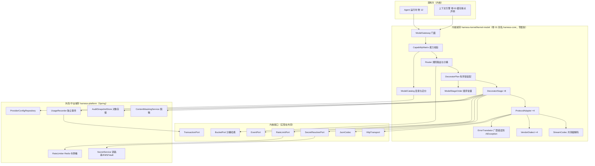
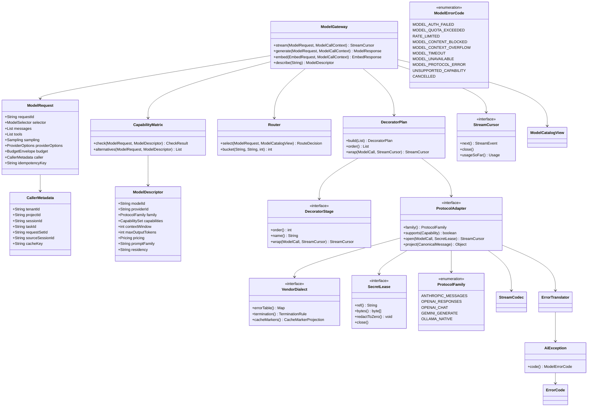
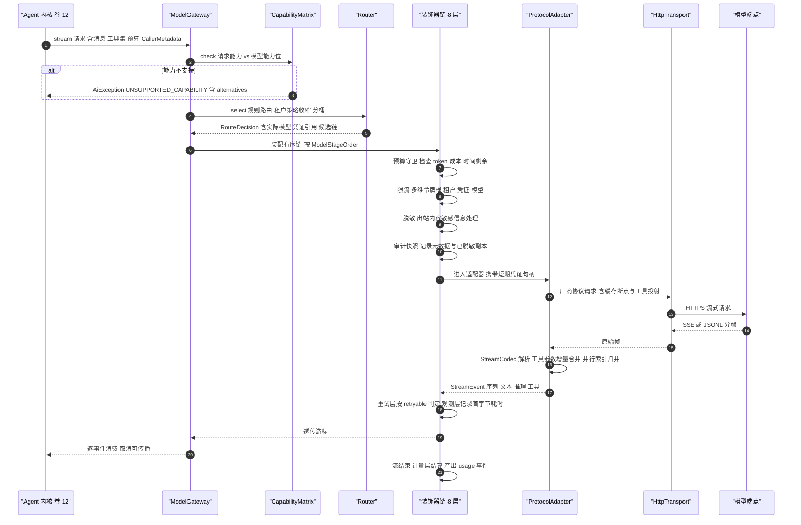
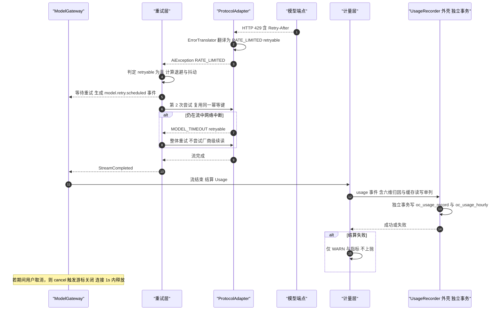
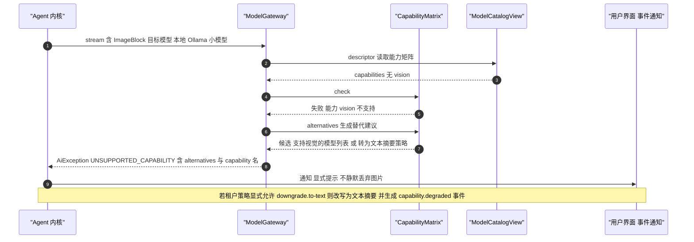
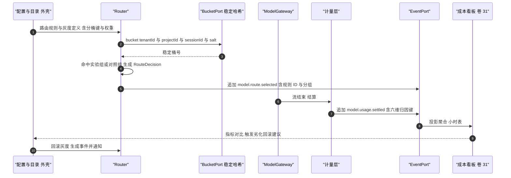
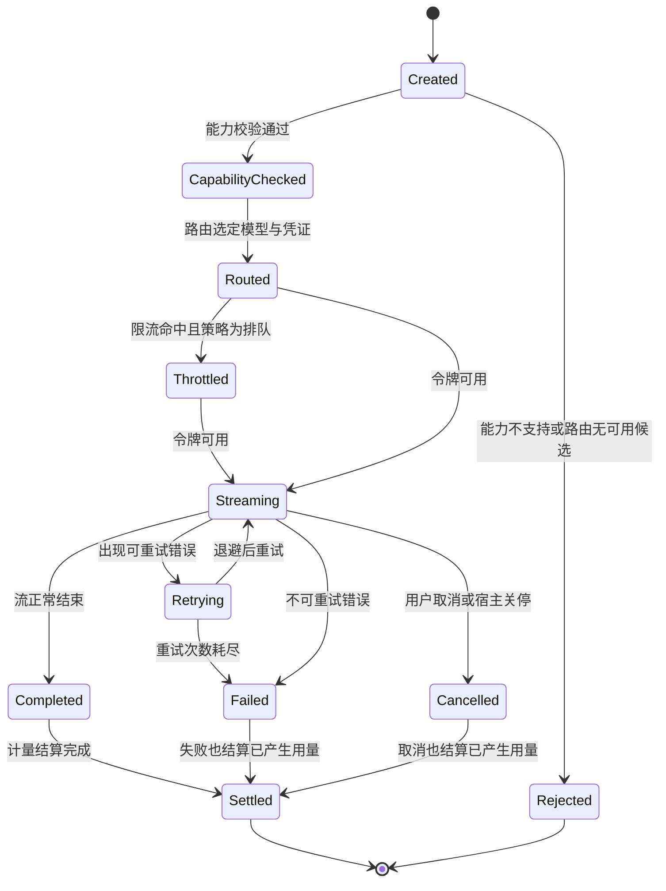
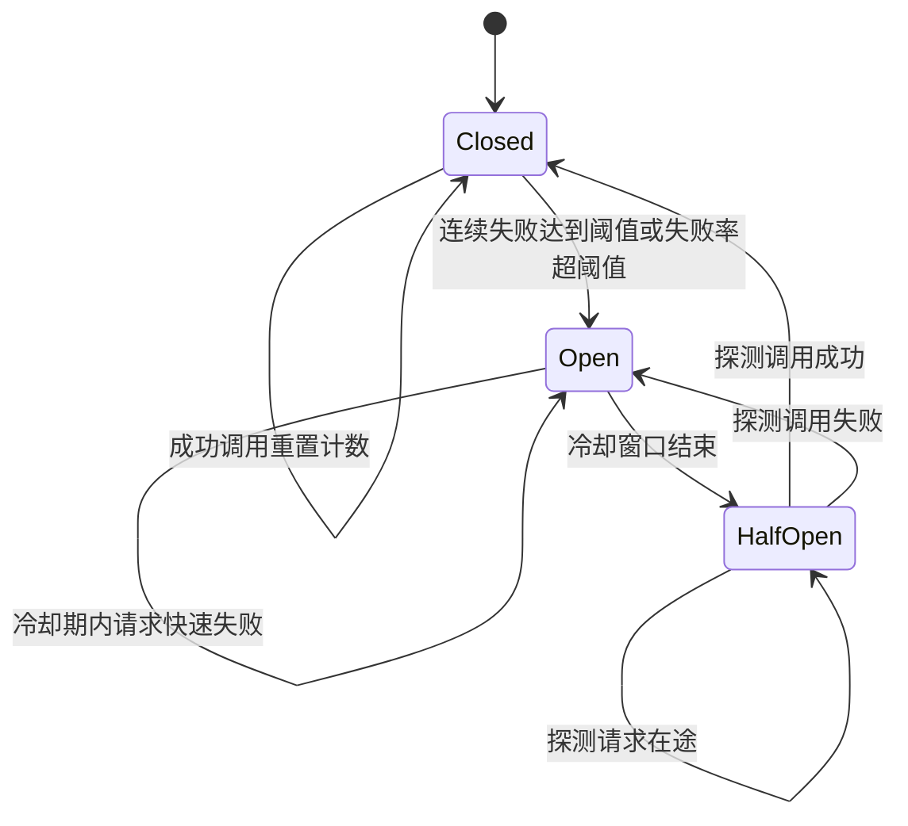

# 02 · 模型网关实现技术方案（Model Gateway Implementation）

> 上游契约：`docs/harness/02-model-gateway.md`（卷 02，D-MDL-1…13）+ `DECISIONS.md`（H-003/H-014/H-005）+ `AGENTS.md` 第四节（模型/适配层异常必须翻译为 `AiException(ErrorCode)`；重试只认 `ErrorCode.retryable`，不做 fallback 链）。
> 本文件定位：Phase B 的**怎么做（how）**——Provider 抽象与四协议适配器、能力协商矩阵、流式与工具调用协议转换、八层装饰器链、路由与私有化、模型目录、配额计量边界、错误矩阵与重试判定。
> 模板：严格遵循 `docs/harness/research/00-research-plan.md` §3 的 11 节结构；每个技术分叉给出结论并登记 `I-MDL-<n>`。

## 1. 实现目标与范围

### 1.1 本组件解决什么

把卷 02 的模型接入层落成内核中可独立测试、可替换厂商、可计量可审计的运行时：

1. **一次模型调用的完整生命周期**：能力校验 → 路由选择 → 装饰器链 → 协议编解码 → 流式增量解析 → 用量结算 → 事件产出（D-MDL-1/2/3/7/10）。
2. **四协议适配**：Anthropic Messages、OpenAI（Responses 与 Chat Completions 兼容端点）、Gemini（generateContent/streamGenerateContent）、Ollama 原生；厂商差异只在适配器内消除，内核语义统一（REQ-MDL-1）。
3. **能力协商矩阵**：卷 02 §4.2 全部 10 项能力位的调用前校验；不支持时**显式失败 + 可选替代建议**，绝不静默降级（D-MDL-5、REQ-INT-9）。
4. **工具调用协议转换**：全量投射 + 增量参数合并 + 并行调用索引 + 畸形参数修复（转交卷 05 校验器产生可回喂错误）（D-MDL-4）。
5. **装饰器链**：预算守卫 → 限流 → 脱敏 → 审计快照 → 重试 → 观测 → 适配器 → 计量，八层顺序固定、可独立开关、可被插件插入（D-MDL-7）。
6. **路由与私有化**：规则路由 + 租户策略收窄 + 稳定分桶灰度；本地端点与自建网关一等公民；出网能力可全局禁用（REQ-MDL-12、REQ-MDL-13、D-MDL-6/13）。

7. **计量与归因边界**：调用级 `usage` 事件 + 六维归因（租户/项目/会话/任务/团队/模型）+ 缓存折扣单列（D-MDL-10、卷 31）。
8. **错误矩阵与重试判定**：10 类错误分类、只认 `ErrorCode.retryable` 的重试判定、退避与抖动参数配置化（卷 02 §4.5 矩阵，本文件 §10.7 给出实现级映射与 §9.5 配置项）。

### 1.2 本组件不解决

- 不组装上下文（卷 03）：本层只消费「稳定前缀 + 易变区」的缓存断点声明（D-MDL-8）。
- 不组装提示词（卷 04）：本层只透传 `promptFamily` 与系统段结构。
- 不执行工具（卷 05）：本层只投射工具声明、合并参数增量、产出调用意图。
- 不做企业侧配额治理（卷 24）与 Agent 循环决策（卷 12）：只做调用前的多维限流检查与用量上报；不做隐式模型切换、不做 fallback 链（见 I-MDL-6）。

### 1.3 上游/下游依赖与模块归属

上游为卷 02 契约（`ModelProvider`/`ModelDescriptor`/`CanonicalMessage`/`ModelRequest`/`StreamEvent`/`Usage`/`ModelError`）、卷 16 事件信封、卷 04 的 `promptFamily` 声明；下游为卷 12（Agent 循环调用 `ModelGateway.stream`）、卷 03（消费 `context overflow` 错误触发压缩）、卷 11（嵌入/重排经 `EmbeddingProviderSPI`）、卷 31（成本归因）。

模块归属：`ModelGateway`/`CapabilityMatrix`/`DecoratorChain`/`ProtocolAdapter ×4` 属**内核**（`harness-kernel/kernel-model`，包 `com.hk.opencoding.kernel.model.*`，零框架）；`SecretResolver`、`UsageRecorder`、`RateLimitPort`、`HttpTransport`、模型目录仓储属**平台域带**——`harness-platform/platform-enterprise`（BYOK 引用与租户策略/审计）、`harness-platform/platform-runtime-store`（限流桶与目录缓存）、`harness-platform/platform-persistence`（`oc_provider`/`oc_model_descriptor`/`oc_usage_record` 落库），装配在 `harness-host/host-bootstrap`。内核不允许自带 HTTP 客户端与 JSON 库：厂商请求体构造与响应解析通过 `HttpTransport` + `JsonCodec` 两个端口注入（这是 H-003 在模型层的具体落点）。

### 落地核对（R07：模块 / 顺序 / 批次 / 门禁 / I-* 落点）

- **模块（卷 27 §4.1 权威名）**：`harness-kernel/kernel-model`（网关/装饰器/四协议适配器）+ `harness-contract`（`ModelProvider`/`CanonicalMessage`/`Usage`/`ModelError` 契约）+ `harness-platform/platform-{enterprise,runtime-store,persistence}` + `harness-host/host-bootstrap`（装配）。`harness-core` 为卷 01 §4.2 别名，禁作路径。
- **实施顺序（卷 27 §4.5）**：第 3 步「模型网关（先 1 个协议）+ 假模型工具」，依赖第 2 步事件写入端口；四协议在封冻「契约测试」门后补齐。**与 impl/04 的前置关系**：`promptFamily` 只作声明字段（枚举入 `harness-contract`），不构成对 `kernel-prompt` 实现的编译依赖，故 02 与 04 可并行开发。
- **数据批次（卷 27 §4.4）**：`oc_provider`、`oc_model_descriptor`、`oc_route_rule`、`oc_credential`、`oc_model_call`、`oc_usage_record`、`oc_usage_hourly` → **B2**（模型调用/用量/凭证引用 + 工具调用/结果），依赖 B1 的 `oc_session`/`oc_event_log`。
- **门禁映射（卷 27 §4.6）**：kernel-model 单测 → 「单元测试 + 覆盖率门」；`-Dgroups=protocol-contract` → 「契约测试（模型适配）」；fake-llm 驱动的装配链路 → 「集成测试」；成本对账抽样 → 「性能基准（抽样）」。
- **I-* 落点**：I-MDL-1 → `harness-contract`（canonical 模型）+ `kernel-model`（`VendorDialect` 白名单）；I-MDL-2 → `kernel-model`（`StreamCodec`/`ProtocolAdapter`）；I-MDL-3 → `kernel-model`（`DecoratorChain` + `ModelStageOrder`）；I-MDL-4 → `kernel-model`（`ErrorTranslator`）+ `harness-contract`（`AiException`/`ErrorCode`）；I-MDL-5 → `kernel-model`（`CapabilityMatrix`）+ `platform-enterprise`（BYOK 引用）；I-MDL-6 → `kernel-model`（`Router`）+ `harness-host/host-bootstrap`（规则装配）；I-MDL-7 → `platform-persistence`（`oc_usage_record`）+ `platform-enterprise`（计量归因）。

## 2. 功能需求清单（REQ-MDL-n）

| ID | 需求描述 | 来源 | 优先级 | 验收要点 |
| --- | --- | --- | --- | --- |
| REQ-MDL-1 | 四协议适配器行为一致：流式、工具、错误、取消、用量五组行为测试套件对四协议全绿 | 卷 02 §2 REQ-MDL-1、D-MDL-2 | P0 | 同一套契约用例驱动四个适配器；差异只允许出现在 `VendorDialect` 白名单内 |
| REQ-MDL-2 | canonical 统一模型 + `providerOptions` 逃生门（仅采样/推理/缓存/安全类，需声明能力键） | D-MDL-1 | P0 | 静态检查：内核逻辑（工具/上下文/权限）不读取任何厂商字段 |
| REQ-MDL-3 | 能力矩阵（卷 02 §4.2 的 10 项能力位）调用前校验，不支持即显式失败并给建议 | D-MDL-5、REQ-INT-9 | P0 | 每条「不支持」路径返回 `UNSUPPORTED_CAPABILITY` + `alternatives[]` |
| REQ-MDL-4 | 三段流式（文本 / 推理 / 工具参数）+ 拉取式迭代器 + 取消传播 + 背压 | D-MDL-3、卷 02 REQ-MDL-3 | P0 | 取消后 1s 内释放连接；下游消费慢时阻塞生产者而非丢弃事件 |
| REQ-MDL-5 | 工具调用映射：全量投射 + 增量参数合并 + 并行索引 + 畸形参数修复 | D-MDL-4 | P0 | 畸形 JSON 参数产出可回喂模型的错误项，网关自身不抛未翻译异常 |
| REQ-MDL-6 | 八层装饰器链固定顺序、可独立开关、可被插件插层 | D-MDL-7、卷 02 §4.4 | P0 | 每层单测独立通过；顺序断言（预算 ≤ 限流 ≤ 脱敏 ≤ 审计 ≤ 重试 ≤ 观测 ≤ 适配器 ≤ 计量） |
| REQ-MDL-7 | 三层凭证（平台 / 租户 BYOK / 会话临时）+ 引用式传递 + 短期句柄注入 | D-MDL-9 | P0 | 自动化扫描：密钥不落盘、不进日志、不进上下文；请求结束句柄失效 |
| REQ-MDL-8 | 用量事件化 + 六维归因 + 缓存读/写 token 单列 + 成本估算 | D-MDL-10、卷 31 | P0 | 与厂商账单抽样对齐误差 ≤ 1%；归因可下钻到任务与团队 |
| REQ-MDL-9 | 错误 10 类分类 + 重试判定只认 `ErrorCode.retryable` + 退避抖动参数配置化 | 卷 02 §4.5、AGENTS.md 第四节 | P0 | 故障注入覆盖 10 类；不可重试错误不产生额外调用（成本可断言） |
| REQ-MDL-10 | 多模态内容块投射（text/image/audio/video/file/tool_use/tool_result/thinking/cache_marker） | D-MDL-11 | P0 | 每项「不支持」有显式失败用例；无静默丢弃路径 |
| REQ-MDL-11 | 结构化输出双保险：原生约束优先，缺能力时工具式输出 + 校验修复 ≤ 2 次 | D-MDL-12 | P1 | 修复次数与失败原因写入事件；两轮修复仍失败则显式报错 |
| REQ-MDL-12 | 规则路由（任务类型/复杂度/成本上限/租户策略，只可收窄） | D-MDL-6 | P1 | 越权放宽被拒（`POLICY_OVERRIDE_DENIED`）且命中规则可解释 |
| REQ-MDL-13 | 稳定分桶灰度（评测绑定、劣化自动回滚） | D-MDL-13 | P1 | 同输入同分桶可复现，回滚留痕并保留对照 |
| REQ-MDL-14 | 私有化与离线：本地端点、自建网关、出网集中管控、air-gapped 装配期禁网 | REQ-MDL-12、卷 01 §4.11 | P0 | air-gapped 档下外部 provider 在装配期被剔除并留痕 |
| REQ-MDL-15 | 提示词缓存与缓存身份：稳定前缀 + 断点标记投射 + 命中观测（未命中回馈上下文层） | D-MDL-8 | P1 | 每协议断点投射正确；命中率与未命中原因指标可观测 |
| REQ-MDL-16 | 嵌入/重排接入（供卷 11）：能力不支持时门控关闭语义检索并显式提示 | 卷 02 REQ-MDL-15、卷 02 REQ-MDL-16 | P2 | 门控关闭生成 `system.capability.degraded` |
| REQ-MDL-17 | **【增量·竞品】** 由会话派生的稳定 cache key（含子会话父标识）随请求下发，保证跨轮缓存亲和与子会话不串味 | D-MDL-8；02-opencode `[E1]` `core/src/session/runner/llm.ts:204-214`（`promptCacheKey` 由 session 派生 + `x-session-affinity`） | P1 | 同会话跨轮 cache key 恒定且子会话带 parent 标识；父/子会话 cache key 不互撞（负向用例） |
| REQ-MDL-18 | **【增量·竞品】** 调用级归因元数据随请求携带：`request_id` / `session_id` / `task_id` / `request_set_id` / `source_session_id` | 07-qoder `[E1]` 分发包 `bundle/proto/chat.proto`（`ContextMetadata`） | P0 | 成本可归因到任务与来源会话，无需事后拼接；字段在调用事件中完整留存 |
| REQ-MDL-19 | **【增量·竞品】** 能力接缝：`ProviderSeam` 静态能力描述符 + 发起前校验 + 响亮拒绝 | 04-deepseek `[E1]` `docs/subsystems/subagent.md`（6 个 provider 描述符与启动前拒绝）、`docs/capability-seams.md` | P1 | 请求与描述符不一致时抛 `UNSUPPORTED_CAPABILITY`（对齐 D33），不做能力探测式试探 |
| REQ-MDL-20 | **【增量·竞品】** 档位（Tier）作为稳定用户接口：档位与模型解耦，下线走显式错误 + 兼容映射 + ≥1 版本过渡 | 07-qoder `[E2]` `release-notes/lite-model-tier-retirement-notice`（Lite 下线时 headless 直接报错）、`[E2]` `user-guide/chat/model-tier-selector` | P1 | 档位解析失败给兼容映射；headless 与 UI 对档位下线的处置一致 |
| REQ-MDL-21 | **【增量·竞品·反面证据】** 不得收敛为单一 wire protocol：四协议原生并存（Codex 已只剩 Responses，属反例） | 03-codex `[E1]` `model-provider-info/src/lib.rs:95-129`（`WireApi` 单变体 + `CHAT_WIRE_API_REMOVED_ERROR`） | P0 | 适配器矩阵 CI 覆盖四协议；不存在「仅 Responses」的系统级收敛 |

## 3. 技术方案选型（M×N 比选）

评分口径沿用 `00-research-plan.md`：`加权 = 3F + 2U + 2.5S + 2.5M`（满分 100）。

### 3.1 I-MDL-1 内容块与消息的建模方式

| 分支 | 描述 | 优点 | 代价 |
| --- | --- | --- | --- |
| B1 `sealed interface` + permits records（每块一 record，同包分组） | 用模式匹配消费，非法块无法构造 | 类型安全、`switch` 穷尽性由编译器保证、无隐式字段 | 新增块类型需改 permits 列表（属预期成本） |
| B2 单一 record + 类型枚举 + `Map<String,Object>` 载荷 | 新增块类型零代码 | 无类型安全，消费方到处强转，测试难覆盖 | 与「显式优于隐式」冲突 |
| B3 class 层次 + visitor | 老派可扩展 | 冗长、switch 表达力弱于 sealed、易漏分支 | Java 21 下无必要 |

| 分支 | F | U | S | M | 加权 | 结论 |
| --- | --- | --- | --- | --- | --- | --- |
| **B1** | **9** | **8** | **9** | **9** | **88** | **选定** |
| B2 | 6 | 6 | 4 | 8 | 59 | 淘汰 |
| B3 | 7 | 6 | 6 | 7 | 65 | 淘汰 |

**选定 B1 的代价与回退**：`ContentBlock` 的 permits 列表是**内核公开契约**，新增块类型属契约演进，需走附录 B.8 流程并同步四适配器投射器；若某厂商引入无法归类的专有块（如私有 citation 块），优先放入 `providerOptions` 逃生门（D-MDL-1 约束），**不得**新增 canonical 块类型。

### 3.2 I-MDL-2 适配器复用结构

| 分支 | 描述 | 优点 | 代价 |
| --- | --- | --- | --- |
| B1 模板方法骨架 + 方言钩子 | `AbstractSseProtocolAdapter` 固化公共流程（连接、SSE/JSONL 分帧、增量合并、终止判定、错误表），厂商只实现 `VendorDialect`（字段映射、终止条件、错误码表、缓存断点投射） | 公共流解析零重复；厂商差异集中在单文件；新增厂商成本最低 | 骨架版本升级需回归四方言（由契约用例集兜住） |
| B2 组合式 Codec + 无继承 | 各适配器自由组合 codec 工具类 | 灵活 | 公共流程重复，行为易漂移（四协议一致性目标受威胁） |
| B3 每厂商独立完整实现 | 最直白 | 重复代码最多，修复要改四处 | 与 D-MDL-2 的「共享编解码内核」冲突 |

| 分支 | F | U | S | M | 加权 | 结论 |
| --- | --- | --- | --- | --- | --- | --- |
| **B1** | **9** | **8** | **8** | **9** | **85.5** | **选定** |
| B2 | 8 | 7 | 6 | 7 | 70.5 | 备选 |
| B3 | 7 | 6 | 4 | 8 | 61.5 | 淘汰 |

**回退触发**：某厂商方言与骨架冲突点 > 3 处（例如流式语义不是线性增量而是分段重写）时，允许该厂商脱离骨架独立实现，但必须在 `VendorDialect` 注册表中登记例外原因，并单独跑一致性用例。

### 3.3 I-MDL-3 流式增量的载体

| 分支 | 描述 | 优点 | 代价 |
| --- | --- | --- | --- |
| B1 拉取式阻塞迭代器 + 取消句柄 | `StreamCursor.next()` 阻塞取下一个 `StreamEvent`；取消即关闭底层连接 | 与虚拟线程天然契合（D-ARC-4）；背压由消费速率决定；实现简单可测 | 单消费者（多路复用需显式包一层广播） |
| B2 `CompletableFuture` 链 + 回调 | 组合性强 | 回调地狱、异常传播难、取消语义弱 | 与 D-MDL-3 淘汰理由一致 |
| B3 响应式流（Flow/Reactor） | 背压与组合最强 | 与内核阻塞式风格冲突（H-003/D-ARC-4） | 内核被响应式化，插件友好度差 |

| 分支 | F | U | S | M | 加权 | 结论 |
| --- | --- | --- | --- | --- | --- | --- |
| **B1** | **8** | **8** | **9** | **9** | **85.5** | **选定** |
| B2 | 6 | 6 | 4 | 7 | 56 | 淘汰 |
| B3 | 8 | 7 | 8 | 4 | 69 | 淘汰（H-003 禁响应式栈） |

**回退触发**：若需要多个消费者（例如 UI 实时渲染 + 审计采样同时消费），不改载体，而是提供 `BroadcastCursor` 包装（内部有界队列扇出），保持 `StreamCursor` 单一契约。

### 3.4 I-MDL-4 装饰器链的装配方式

| 分支 | 描述 | 优点 | 代价 |
| --- | --- | --- | --- |
| B1 硬编码嵌套构造 | `new Metering(new Observability(new Retry(...)))` | 直观 | 不可插层、顺序易被改错、每层不可单独关闭 |
| B2 有序 Stage 列表 + 显式计划 | 每层声明 `order()`；`DecoratorPlan` 排序并校验唯一性/完整性；可开关、可插插件层 | 内核零框架即可实现；可测可诊断（`oc doctor` 打印实际链） | 需自建顺序校验（约 80 行） |
| B3 Spring AOP / HandlerInterceptor | 复用容器能力 | 对外壳友好但是**框架依赖**，违反 H-003；AOP 顺序隐式难诊断 | 内核不可能采用 |

| 分支 | F | U | S | M | 加权 | 结论 |
| --- | --- | --- | --- | --- | --- | --- |
| B1 | 6 | 6 | 5 | 9 | 61.5 | 淘汰 |
| **B2** | **9** | **8** | **9** | **9** | **88** | **选定** |
| B3 | 8 | 8 | 8 | 2 | 66 | 淘汰（内核零框架） |

**顺序铁律（不可配置）**：脱敏先于任何出站与留痕（审计/观测/适配器）；预算守卫先于资源占用（限流/重试）；计量结算最后（无论成败都结算）。顺序值定义在内核常量类 `ModelStageOrder` 中，**禁止配置化**（config-extraction-rules §8：框架固定行为禁止配置化）。

### 3.5 I-MDL-5 计量与成本结算边界

| 分支 | 描述与取舍 | F | U | S | M | 加权 | 结论 |
| --- | --- | --- | --- | --- | --- | --- | --- |
| B1 请求结束时同步写 PG | 实时性强；但把外部调用路径与 DB 事务绑在一起（违反「外部调用移出事务」），故障时阻塞主流程 | 7 | 8 | 6 | 7 | 70 | 淘汰 |
| B2 事件化 + 异步聚合 + 小时预聚合 | `model.usage.settled` 事件 → 明细 `oc_usage_record` + 小时表 `oc_usage_hourly`；结算失败仅 WARN 不阻断；代价是明细延迟（≤ 5s）与幂等去重需求 | 9 | 8 | 9 | 9 | 88 | **选定** |
| B3 内存批量 flush | 写入吞吐最高；崩溃丢用量、对账缺口不可接受 | 6 | 7 | 7 | 6 | 64.5 | 淘汰 |

**落地规则**：计量装饰器（order=8）在流结束时**必须**产出一次 `model.usage.settled`（含 `Usage` 与归因键）；写入由外壳 `UsageRecorder` 在独立事务中完成；该写入失败按 M19 同类处理（有意吞异常 + WARN + 计入 `oc_model_usage_write_failed_total`），**不得**上抛影响本次调用结果。

### 3.6 I-MDL-6 重试与换路（fallback）语义

| 分支 | 描述与取舍 | F | U | S | M | 加权 | 结论 |
| --- | --- | --- | --- | --- | --- | --- | --- |
| B1 装饰器内自动 fallback 链 | 失败即换下一个模型，可用性看起来最好；但成本不可预测、结果不可解释（用户以为用 A 实际用 B），与 REQ-INT-9 冲突 | 7 | 6 | 5 | 6 | 61 | 淘汰 |
| B2 仅 retryable 同模型重试 + 路由期显式候选 | 成本与结果可预测、重试语义单一，与「不做 fallback 链」一致；代价是端点整体故障时表现为失败（由路由期候选弥补） | 9 | 8 | 9 | 9 | 88 | **选定** |
| B3 人工介入切换 | 最保守；无人值守场景不可用，仅作企业策略开关 | 5 | 4 | 8 | 9 | 60.5 | 备选（企业强管控档） |

**与 Phase A D-MDL-6 的对齐说明**：D-MDL-6 的「显式回退链」在本实现中定义为**路由期声明**（规则可声明 `candidates[]` 与顺序，路由装饰链前的 `Router` 依序选择第一个可用候选），而**不是执行期隐式切换**：一旦选定并已发起调用，任何失败都只按 `retryable` 重试或失败上抛。若租户策略显式开启「执行期换路」，必须满足三条：① 生成 `model.route.fallback` 事件（含原因与成本影响）；② 换路后重算预算（不得复用已消耗预算）；③ 在 UI 显式提示当前实际模型。

### 3.7 I-MDL-7 凭证句柄的生命周期

| 分支 | 描述与取舍 | F | U | S | M | 加权 | 结论 |
| --- | --- | --- | --- | --- | --- | --- | --- |
| B1 请求期短期句柄（`SecretLease`） | 明文只在单次调用窗口存在、请求结束即失效；泄漏面最小，OAuth 刷新可按租户单飞；代价是每次调用解析一次（引用→值 缓存 5s） | 9 | 8 | 9 | 9 | 88 | **选定** |
| B2 长驻通道单例持有明文 | 零解析开销；明文长期驻留内存、崩溃转储即泄漏，违反 NFR-S-3 | 8 | 9 | 4 | 8 | 71 | 淘汰 |
| B3 每请求重新登录/换取 | 最严格；延迟高、端点上不去量，仅 air-gapped 特殊场景 | 7 | 5 | 8 | 6 | 65.5 | 备选（离线特殊档） |

**落地规则**：`SecretLease.bytes()` 返回的数组在使用后立即 `Arrays.fill(..., (byte) 0)`；序列化层禁止 `toString` 输出句柄（`SecretLease` 的 `toString` 固定返回 `SecretLease[REDACTED]`）；审计与日志只允许出现**引用名**（如 `tenant:acme/model/anthropic-b`）。

### 3.8 决策登记表（I-MDL）

| ID | 维度 | 候选分支 | 选定 | 理由（加权） | 回退触发 |
| --- | --- | --- | --- | --- | --- |
| I-MDL-1 | 内容块建模 | sealed+records / 单 record+Map / class 层次 | `sealed interface ContentBlock` + permits records（88） | 编译期穷尽性、无隐式字段、契约清晰 | 出现无法归类的厂商专有块 → 走 `providerOptions`，不新增 canonical 块 |
| I-MDL-2 | 适配器复用 | 模板方法+方言 / 组合 Codec / 各自完整实现 | 模板方法骨架 + `VendorDialect`（85.5） | 公共流解析零重复、差异集中、新厂商成本最低 | 某方言冲突 > 3 处 → 该厂商独立实现并登记例外 |
| I-MDL-3 | 流式载体 | 拉取迭代器 / Future 链+回调 / 响应式 | `StreamCursor` 拉取式 + 取消句柄（85.5） | 虚拟线程友好、背压天然、可测 | 多消费者 → 包 `BroadcastCursor`，不改契约 |
| I-MDL-4 | 装饰器装配 | 硬编码嵌套 / 有序 Stage 列表 / AOP | 有序 `DecoratorStage` + 显式计划（88） | 内核零框架可实现、顺序可诊断、可插层 | 插件层顺序冲突 → 拒绝装配并显式报错（不静默覆盖） |
| I-MDL-5 | 计量结算边界 | 同步写库 / 事件化+异步聚合 / 内存批量 | 事件化 + 异步聚合 + 小时预聚合（88） | 主流程零阻塞、可重建、与事件模型一致 | 明细延迟 > 30s → 提升聚合批大小并告警（不改同步写） |
| I-MDL-6 | 重试与换路 | 装饰器内 fallback / 仅 retryable + 路由期候选 / 人工切换 | 仅 `retryable` 重试，换路只在路由期声明（88） | 成本与结果可预测，与「不做 fallback 链」一致 | 租户显式开启执行期换路 → 事件留痕 + 预算重算 + UI 提示三条件齐备 |
| I-MDL-7 | 凭证句柄生命周期 | 请求期短期句柄 / 长驻单例 / 每请求登录 | `SecretLease` 短期句柄 + 引用式传递（88） | 明文窗口最小、满足三项不泄露约束 | 高频调用的解析开销 > 5ms/次 → 仅缓存「引用→值」5s，仍不驻留长明文 |

## 4. 总体架构图



**关键边界**：内核**不持有** provider 配置与密钥，只持有不可变 `ModelCatalogView`（由目录事件热更新）与 `SecretRef`；所有出站字节都必须经由 `HttpTransport`（便于 air-gapped 档在装配期替换为「拒绝出网」实现，见 REQ-MDL-14）。

## 5. 类图



### 5.1 关键 Java 21 签名（内核契约）

```java
package com.hk.opencoding.kernel.model.block;

/**
 * 统一内容块（D-MDL-11）：厂商专有块不得进入 canonical 模型，只能经 providerOptions 逃生门传递。
 */
public sealed interface ContentBlock
        permits TextBlock, ImageBlock, AudioBlock, VideoBlock, DocumentBlock,
                ToolUseBlock, ToolResultBlock, ThinkingBlock, CacheMarkerBlock {

    /** 块的模态类型，用于能力校验与计量（不含厂商字段）。 */
    BlockKind kind();
}

// 其余块（TextBlock/ImageBlock/AudioBlock/VideoBlock/DocumentBlock/ToolResultBlock/ThinkingBlock）
// 形状同下：record + 覆盖 kind()，构造期即保证不可变与必填字段非空。

/** 工具调用块；`argumentsJson` 为合并完成的完整 JSON（流式分片已合并）。 */
record ToolUseBlock(String toolCallId, String toolName, String argumentsJson, int parallelIndex)
        implements ContentBlock {
    @Override
    public BlockKind kind() {
        return BlockKind.TOOL_USE;
    }
}

/** 缓存断点标记块：投射为各协议缓存语义（D-MDL-8）。 */
record CacheMarkerBlock(String markerId, int stablePrefixSegmentIndex) implements ContentBlock {
    @Override
    public BlockKind kind() {
        return BlockKind.CACHE_MARKER;
    }
}
```

```java
package com.hk.opencoding.kernel.model.stream;

/**
 * 三段流式增量（D-MDL-3）：TextDelta / ThinkingDelta / ToolCallStarted / ToolCallDelta /
 * ToolCallFinished / UsageReported / StreamCompleted / StreamFailed 八种，序列号单调且不入库（REQ-INT-4）。
 */
public sealed interface StreamEvent
        permits TextDelta, ThinkingDelta, ToolCallStarted, ToolCallDelta,
                ToolCallFinished, UsageReported, StreamCompleted, StreamFailed {

    /** 会话内单调递增的增量序号，用于前端排序与丢帧检测。 */
    long seq();
}

/** 拉取式流游标：单消费者、阻塞语义、取消即关闭底层连接（1s 内释放）。 */
public interface StreamCursor extends AutoCloseable {

    /**
     * 拉取下一个增量事件。
     *
     * @return 事件；正常结束返回 `StreamCompleted`，失败返回 `StreamFailed`（不抛厂商异常）
     * @throws AiException 仅本层无法翻译的协议错误（携带 `MODEL_PROTOCOL_ERROR`）
     */
    StreamEvent next();

    /** 已观测用量（未结束时可为部分值，缓存读写 token 单列）。 */
    Usage usageSoFar();

    /** 关闭游标并释放连接（幂等）；取消原因由 `CancelReason` 记录。 */
    @Override
    void close();
}
```

```java
package com.hk.opencoding.kernel.model;

/**
 * 模型域错误码（10 类，卷 02 §4.5 矩阵；本文件 §10.7 错误矩阵给出实现级映射）。
 * 命名 `ModelErrorCode` 与域内约定一致（`ToolErrorCode`/`SandboxErrorCode`/…），避免与契约层全局
 * `ErrorCode` 同简名冲突；两者按 code 一一映射（映射表见 §10.7），`retryable` 是重试判定的
 * **唯一依据**（AGENTS.md 第四节）：禁止在重试装饰器内按文案或厂商码判断。
 */
public enum ModelErrorCode {
    MODEL_AUTH_FAILED(false), MODEL_QUOTA_EXCEEDED(false), RATE_LIMITED(true),
    MODEL_CONTENT_BLOCKED(false), MODEL_CONTEXT_OVERFLOW(false), MODEL_TIMEOUT(true),
    MODEL_UNAVAILABLE(true), MODEL_PROTOCOL_ERROR(true), UNSUPPORTED_CAPABILITY(false),
    CANCELLED(false);

    private final boolean retryable;

    ModelErrorCode(boolean retryable) {
        this.retryable = retryable;
    }

    /** 是否可重试：重试装饰器的唯一判定入口（禁止按文案或厂商码判断）。 */
    public boolean retryable() {
        return retryable;
    }

    /** 中文文案：统一由错误文案常量类提供（`ModelErrorMessages.of(code)`），避免散落字面量。 */
    public String message() {
        return ModelErrorMessages.of(this);
    }
}
```

```java
package com.hk.opencoding.kernel.model.decorate;

/**
 * 装饰器层（D-MDL-7 / I-MDL-4）。
 * 顺序固定：预算守卫 → 限流 → 脱敏 → 审计快照 → 重试 → 观测 → 适配器 → 计量。
 */
public interface DecoratorStage {

    /** 层序（取值见 `ModelStageOrder` 常量，禁止在实现中硬编码数字）。 */
    int order();

    /** 层名（用于诊断与指标标签）。 */
    String name();

    /**
     * 包装下游调用。
     *
     * @param call 调用上下文（含 `CallerMetadata`、预算信封、凭证引用），必填
     * @param next 下游游标工厂；实现须保证「至多消费一次」或按自身语义决定重试
     * @return 包装后的游标
     * @throws AiException 预算超限、限流拒绝、脱敏失败（安全优先，阻断）时抛出
     */
    StreamCursor wrap(ModelCall call, StreamCursorFactory next);
}
```

```java
package com.hk.opencoding.kernel.model.adapter;

/**
 * 协议适配器（四协议各一实现，共享 {@link StreamCodec}）。
 * 厂商原始异常必须在本接口实现内翻译为 {@code AiException(ModelErrorCode)}（AGENTS.md 第四节：SDK/协议异常不得外溢）。
 * 命名分层（全套统一）：本域属内核层，业务失败一律抛 {@code AiException}——它是内核基类 {@code HarnessException}
 * 的子类（携带域内 `ModelErrorCode`，按 code 映射契约层全局 {@code ErrorCode}），禁止裸 {@code RuntimeException} / {@code IllegalArgumentException}；
 * 外壳层（domain/application/interfaces）见同一全局 `ErrorCode` 时抛 {@code BusinessException}，
 * 并由外壳全局异常处理器把 {@code AiException} / {@code HarnessException} 按 {@code ErrorCode} 映射为统一响应。
 */
public interface ProtocolAdapter {

    /** 协议族标识（含 OpenAI Responses 与 Chat Completions 两个变体）。 */
    ProtocolFamily family();

    /** 该协议对某能力位的支持情况（驱动能力矩阵，不改内核逻辑）。 */
    Support supports(Capability capability);

    /**
     * 发起流式调用。
     *
     * @param call   调用上下文（含已脱敏消息、工具投射结果），必填
     * @param secret 凭证短期句柄；实现必须在请求结束后立即失效
     * @return 拉取式流游标
     * @throws AiException 端点错误、协议错误、能力不支持时抛出
     */
    StreamCursor open(ModelCall call, SecretLease secret);
}
```

> **契约缺口指针（X-82）**：异常类名（内核 `HarnessException`/`AiException` 与外壳 `BusinessException`）与冻结卷册 `ErrorCode` 映射的登记缺口已列为修订建议 **X-82**（`impl/IMPL-DECISIONS.md` §4；台账登记由编排方执行，本文件不改台账）。

## 6. 核心流程时序图

### 6.1 流程 A：带工具调用的流式调用（能力校验 → 路由 → 装饰器链 → 适配器）



- **前置条件**：`ModelRequest` 已含完整 `CallerMetadata`（租户/项目/会话/任务/来源会话，REQ-MDL-18）与预算信封；工具集已由卷 05 投射为 canonical 声明；上下文层已给出稳定前缀与缓存断点。
- **主路径**：能力校验 → 路由选择 → 八层链 → 适配器编码 → 流式解析与增量合并 → 逐事件消费 → 结算。
- **异常与补偿**：能力不支持在最前拦截（不浪费一次调用，D-MDL-5）；限流按策略排队或拒绝（`RATE_LIMITED` 含 `retryAfterMs`）；脱敏失败**阻断**（安全优先）；审计快照失败仅告警不阻断；流中断按卷 02 §4.5 矩阵（本文件 §10.7）处理（可重试错误整体重试，幂等键防重复计费）。
- **幂等与并发点**：`requestId` 唯一 + `idempotencyKey` 参与：重试复用同一幂等键，端点侧可去重；单凭证并发上限由限流层的信号量控制，超限排队而非无限放大并发。

### 6.2 流程 B：限流与网络中断的重试、取消与结算



- **前置条件**：重试参数（次数/退避基数/上限/抖动）来自配置 `open-coding.model.retry.*`；端点未处于熔断打开状态。
- **主路径**：`retryable` 判定 → 退避等待 → 同模型重试（复用幂等键）→ 成功后结算。
- **异常与补偿**：不可重试错误（认证/配额/内容策略/上下文超限/能力不支持）**立即上抛**，不消耗额外成本；连续失败触发端点熔断（按端点维度，§7.2）；取消路径生成 `CANCELLED` 且**不重试**。
- **幂等与并发点**：重试**不换模型**（I-MDL-6）；幂等键在整条重试序列中恒定，端点侧与本地计量侧都按 `requestId` 去重（避免重试导致的重复计费记录）；结算与调用结果解耦（M19 同类）。

### 6.3 流程 C：能力不支持路径（本地 Ollama 收到图片输入）



- **前置条件**：请求含多模态块；目标模型由路由选定或用户显式指定；能力矩阵为本地内存缓存（目录版本号驱动热更新）。
- **主路径**：读取描述符 → 校验 → 生成替代建议 → 显式失败（业务异常上抛，不发起调用）。
- **异常与补偿**：唯一允许的「降级」是租户策略显式开启 `downgrade.to-text`（仅针对 image/video/file），此时必须满足三条：生成 `system.capability.degraded` 事件、在 UI 提示已降级、在 `usage` 中标记降级原因。**默认关闭**（REQ-INT-9）。
- **幂等与并发点**：能力校验为纯函数（无 IO），可并发重入；`alternatives` 计算走目录内存视图，不产生额外模型调用（避免「试探式探测」）。

### 6.4 流程 D：灰度路由与六维归因计量边界



- **前置条件**：灰度定义有版本号；评测集（卷 26）已绑定；分桶盐固定（改盐即等权重洗牌，需审批）。
- **主路径**：稳定分桶 → 分组决策 → 事件留痕 → 结算 → 聚合对比 → 劣化回滚。
- **异常与补偿**：分桶输入缺失（如匿名会话无 projectId）时按会话 ID 分桶并记录降级标记；劣化检测命中阈值（如错误率上升 > 20% 或 P95 首字节上升 > 30%）自动回滚并生成 `model.route.rollback` 事件。
- **幂等与并发点**：同输入同盐必然同桶（可复现，D-MDL-13 DoD）；结算事件的 `requestId` 唯一保证聚合不重复计数；看板聚合允许最终一致（≤ 5s）。

## 7. 状态机

### 7.1 一次模型调用的生命周期



**迁移要点**：`Failed` / `Cancelled` 同样进入 `Settled`（部分用量必须计费，否则成本口径不符）；`Rejected` 不产生任何计费（能力校验在发起前）；`Retrying` 期间**不释放调用上下文**（保留预算占用，避免重试导致预算穿透）。

### 7.2 端点熔断器状态机（按 provider + endpoint 维度）



**参数（全部配置化，禁止硬编码）**：`open-coding.model.circuit.failure-threshold`（默认 5 次）、`failure-rate`（默认 0.5，样本 ≥ 20）、`cooldown-seconds`（默认 30）、`half-open-probes`（默认 1）。熔断打开时请求快速失败为 `MODEL_UNAVAILABLE`（retryable=true，但重试装饰器在冷却期内不重试，直接上抛并在文案中给出冷却剩余时间）。

## 8. 数据模型

### 8.1 表（`oc_*`）

**类型约定（本节各表通用；逐列 DDL 以卷 19 的 Flyway 迁移脚本为准）**：内部主键 `id BIGINT`（Snowflake）或复合主键（如 `(tenant_id, …)`）；对外暴露的引用 ID 用不透明字符串 / `UUID`（防遍历）；时间列统一 `TIMESTAMPTZ`（UTC 存储、展示层本地化）；枚举列存 `VARCHAR(32)` 的 **code**（禁止存 desc）；结构化与可变结构用 `JSONB`；布尔列 `BOOLEAN NOT NULL DEFAULT false`；敏感字段（密钥 / Token）只存引用名 `*_ref`，明文永不入库；大对象（快照 / 录制 / 工件）外置并留指针；各表字段语义见「关键字段」列，索引与唯一约束见末列。

| 表 | 用途 | 关键字段 | 索引/约束 |
| --- | --- | --- | --- |
| `oc_provider` | 提供方定义 | `id`、`tenant_id`、`protocol_family`、`base_url`、`credential_ref`、`egress_policy`、`timeout_ms`、`enabled` | PK `id`；`(tenant_id, enabled)`；`credential_ref` 只存引用名 |
| `oc_model_descriptor` | 模型目录与能力矩阵 | `model_id`、`provider_id`、`context_window`、`max_output`、`capabilities`（JSONB 位集）、`pricing`、`prompt_family`、`residency`、`catalog_version` | PK `(provider_id, model_id)`；`(catalog_version)` |
| `oc_route_rule` | 规则路由与灰度 | `id`、`tenant_id`、`priority`、`condition`、`candidates`、`gray`（分桶键/权重/盐）、`version` | PK `id`；`(tenant_id, priority)` |
| `oc_usage_record` + `oc_usage_hourly` | 调用级明细 + 小时预聚合 | `id`、`tenant_id`、`request_id`（唯一）、`request_set_id`、`task_id`、`source_session_id`、`session_id`、`project_id`、`team_id`、`model_id`、`credential_ref`、`input_tokens`、`output_tokens`、`cache_read_tokens`、`cache_write_tokens`、`reasoning_tokens`、`cost_minor`、`currency`、`occurred_at` | UNIQUE `(request_id)`；`(tenant_id, project_id, occurred_at)`、`(tenant_id, task_id)`、`(tenant_id, model_id, occurred_at)`；小时表 PK `(tenant_id, bucket_hour, model_id, project_id)` |
| `oc_model_call` | **调用级审计快照元数据**（Phase B 新增；正文经脱敏后存对象存储） | `id`、`tenant_id`、`request_id`、`provider_id`、`model_id`、`endpoint`、`attempt_no`、`outcome`、`error_code`、`ttfb_ms`、`total_ms`、`snapshot_ref`、`redaction_level` | UNIQUE `(request_id, attempt_no)`；`(tenant_id, occurred_at)`；保留期按策略（默认 30 天） |

**凭证引用**复用组织/身份域的 `oc_credential`（`scope` 取 platform/byok/session，`secret_ref` 只存引用名）。

**写入纪律**：`oc_usage_record` 与 `oc_model_call` 由外壳 `UsageRecorder`/`AuditSnapshotStore` 在**独立事务**中写入（方法标注 `@Transactional(rollbackFor = Exception.class)`），不与任何业务事务绑定（外部调用必须移出事务边界）；两表写入失败只告警不阻断（M19 同类：异常在事务方法之外的调用点捕获并 `log.warn` 计数，不重抛、不回滚后续流程）。`oc_model_descriptor` 的目录热更新必须**事件化**（`model.catalog.updated`），内核只读 `ModelCatalogView`。

### 8.2 Redis Key（经 `RedisKeys` 工厂统一生成）

| 逻辑用途 | Key 形态 | TTL | 丢失影响 |
| --- | --- | --- | --- |
| 多维限流令牌桶 | `oc:mdl:ratelimit:{tenantId}:{credentialRef}:{modelId}:{window}` | 窗口长度 | 回退进程内桶（单实例语义），仅精度下降 |
| 单凭证并发信号量 | `oc:mdl:concurrency:{credentialRef}` | 会话级 TTL | 回退进程内信号量 |
| 端点熔断状态 | `oc:mdl:circuit:{providerId}:{endpointHash}` | 冷却期 | 回退进程内状态（多实例下各自熔断） |
| 目录版本戳 / 幂等去重 | `oc:mdl:catalog:{tenantId}:version`、`oc:mdl:idem:{tenantId}:{requestId}` | 长期 / 24h | 回退 DB 查询版本与唯一索引 |
| 凭证值短期缓存 | `oc:mdl:secret:{secretRef}:v` | **5s**（值经加密存储，仅存哈希校验位用于失效比对） | 每次都向密钥服务解析，仅延迟上升 |

**安全约束**：`oc:mdl:secret:*` 即使存在也只允许存放**加密封装**（由 `SecretService` 决定实现）；内核侧禁止直接读写该键（内核只持有 `SecretLease`）。

### 8.3 事件类型清单（本域产出）

| 事件类型 | 触发 | 关键载荷 | 消费者 |
| --- | --- | --- | --- |
| `model.request.started` | 进入适配器前 | 模型、消息数、工具数、预算、缓存断点数 | 前端、审计、计量 |
| `model.delta` | 增量产生 | 增量类型与序号（**不落库**，仅实时推送） | 前端 |
| `model.request.completed` | 流正常结束 | `Usage`、耗时分解、结束原因、`attempt_no` | 计量、成本看板 |
| `model.request.failed` | 失败上抛 | 错误码、重试次数、厂商码（脱敏）、熔断状态 | 告警、诊断 |
| `model.route.selected` | 路由决策 | 命中规则 ID、分组、候选链、实际模型 | 审计、调优 |
| `model.route.fallback` | 执行期换路（仅策略显式开启时） | 原模型、新模型、原因、成本影响 | 审计、前端显式提示 |
| `model.route.rollback` | 灰度劣化自动回滚 | 规则 ID、劣化指标、回滚版本 | 审计、发布系统 |
| `model.retry.scheduled` | 可重试错误后 | `attempt_no`、退避毫秒、错误码 | 告警、调优 |
| `model.cache.observed` | 流结束 | 缓存读/写 token、命中比、cache key 指纹 | 成本优化、卷 03 |
| `model.credential.refreshed` | OAuth/BYOK 刷新 | 凭证引用与结果（无明文） | 安全审计 |
| `model.usage.settled` | 计量结算 | 六维归因键、token 分解、成本估算（最小货币单位） | 卷 31、计费 |
| `model.capability.mismatch` / `model.catalog.updated` | 能力校验失败 / 目录热更新 | 前者：能力名、模型、`alternatives` 数量；后者：版本号、变更条目数 | 前端提示、调优；内核目录视图刷新 |

## 9. 接口与扩展点

### 9.1 内核服务接口

| 接口 | 方法 | 说明 |
| --- | --- | --- |
| `ModelGateway` | `stream(ModelRequest, ModelCallContext) StreamCursor` | 流式调用（唯一创作入口，含能力校验/路由/装饰链） |
| `ModelGateway` | `generate(ModelRequest, ModelCallContext) ModelResponse` | 非流式（内部由流式聚合实现，保证行为一致） |
| `ModelGateway` | `embed(EmbedRequest, ModelCallContext) EmbedResponse` | 嵌入/重排（供卷 11，经 `EmbeddingProviderSPI`） |
| `ModelGateway` | `describe(String modelId) ModelDescriptor` | 目录查询（纯读，不触发 IO 探测）；`ModelCatalogView.byTier(Tier)` 提供档位解析（REQ-MDL-20） |

### 9.2 SPI 扩展点（对接卷 18 目录）

| 扩展点 | 稳定性 | 说明 | 默认实现 |
| --- | --- | --- | --- |
| `ProtocolAdapterSPI` | 稳定 | 新增厂商/私有协议（含自建网关） | 四协议适配器（内核） |
| `VendorDialectSPI` | 稳定 | 已有协议族的私有变体（字段差异、错误表） | 四方言（内核） |
| `RouterRuleSPI` | 稳定 | 企业自定义路由规则提供者（只可收窄） | 配置驱动规则（平台域带） |
| `DecoratorSPI` | 稳定 | 插入自定义横切层（如企业内容审查） | 无（默认八层由内核装配） |
| `UsageSinkSPI` | 稳定 | 用量数据出口（数据湖/计费系统） | PG 明细 + 小时预聚合 |
| `SecretResolverSPI` | 稳定 | 自定义凭证来源（KMS/Vault/内部服务） | 环境变量 + 系统钥匙串 |
| `EmbeddingProviderSPI` / `ContentSanitizerSPI` / `BucketSaltProvider` | 演进 | 嵌入与重排（供卷 11）/ 出站脱敏与合规改写 / 灰度分桶盐来源（企业可固定盐复现分桶） | 同厂商嵌入模型 / 统一脱敏服务（与日志脱敏同源）/ 配置提供 |

**SPI 纪律**：`DecoratorSPI` 插入的层**不得**改变八层相对顺序（只能插入到两层之间），也不得访问 `ModelRequest` 之外的业务上下文（保持内核逻辑不读厂商字段的约束）。

### 9.3 流式推送面与会话协议的关系

流式增量（文本/推理/工具参数）**不经 REST**：内核产出 `model.delta` 事件后，由会话协议面以通知帧（WS / stdio JSON-RPC）推送，REST 只承载资源管理与查询（附录 B.9 规则 1）。因此本域不新增 WS 端点，而是复用 `event` 通知帧通道（载荷含 `seq` 与增量类型）。

### 9.4 REST 管理面（节选，均为外壳实现）

| 端点 | 方法 | 说明 | 权限点 |
| --- | --- | --- | --- |
| `/api/v1/providers` | CRUD | 提供方与凭证引用（不含明文） | `model.credential.manage` |
| `/api/v1/providers/{id}/test` | POST | 连通性与最小推理探测（结果脱敏后返回） | `model.credential.manage` |
| `/api/v1/models` | GET | 模型目录（能力矩阵/定价/驻留地） | `model.read` |
| `/api/v1/models/catalog/sync` | POST | 目录热更新（内置 + 自定义 + 端点探测三源合并） | `model.manage` |
| `/api/v1/routes` | CRUD | 路由规则与灰度定义 | `model.route.manage` |
| `/api/v1/usage` | GET | 用量与成本（六维过滤、cursor 分页） | `billing.read` |
| `/api/v1/usage/attribution` | GET | 归因下钻（任务/来源会话/request_set） | `billing.read` |

### 9.5 配置项（`open-coding.model.*`）与环境变量

| 配置键 | 含义 | 默认 | 必填 | 环境变量 |
| --- | --- | --- | --- | --- |
| `open-coding.model.providers[]` | 提供方清单（协议族、端点、凭证引用、超时覆盖、出网策略） | 空 | 至少 1 个可用于编码模式 | `OC_MODEL_PROVIDERS` |
| `open-coding.model.routing.default-model` | 默认模型 | 空 | 必填 | `OC_DEFAULT_MODEL` |
| `open-coding.model.routing.rules[]` | 规则路由（条件 → 候选链） | 空（等价静态绑定） | 否 | `OC_MODEL_ROUTE_RULES` |
| `open-coding.model.routing.tier-mapping` | 档位（Auto/Ultimate/Performance/Efficient）到模型的映射 | 内置 | 否 | `OC_MODEL_TIERS` |
| `open-coding.model.limits.max-concurrency-per-credential` | 单凭证并发上限 | `8` | 否 | `OC_MODEL_MAX_CONCURRENCY` |
| `open-coding.model.limits.rpm` / `tpm` | 每分钟请求/Token 上限（按凭证/模型维度覆盖） | 未设（不限） | 否 | `OC_MODEL_RPM` / `OC_MODEL_TPM` |
| `open-coding.model.retry.max-attempts` | 重试次数（含首次） | `3` | 否 | `OC_MODEL_RETRY_MAX` |
| `open-coding.model.retry.backoff-base-ms` / `backoff-max-ms` / `jitter-ratio` | 退避基数/上限/抖动 | `500` / `10000` / `0.2` | 否 | `OC_MODEL_RETRY_BACKOFF_*` |
| `open-coding.model.circuit.failure-threshold` / `cooldown-seconds` | 熔断阈值与冷却 | `5` / `30` | 否 | `OC_MODEL_CIRCUIT_*` |
| `open-coding.model.audit.request-body` / `retention-days` | 是否保存脱敏请求体 / `oc_model_call` 保留期 | `false` / `30` | 否 | `OC_MODEL_AUDIT_BODY` / `OC_MODEL_AUDIT_RETENTION_DAYS` |
| `open-coding.model.credentials.*` | 凭证引用定义（指向环境变量/密钥服务/BYOK） | 空 | P0 场景必填 | 见下 |
| `open-coding.model.cache.enabled` / `egress.mode` / `downgrade.to-text` | 缓存断点投射 / 出网策略（`direct`/`proxy`/`disabled`）/ 多模态降级到文本摘要 | `true` / `direct` / `false` | 否 | `OC_MODEL_CACHE_ENABLED` / `OC_MODEL_EGRESS_MODE` / `OC_MODEL_DOWNGRADE_TO_TEXT` |

**凭证环境变量族**（值只允许在环境变量或密钥服务中，配置里只写引用名）：`ANTHROPIC_API_KEY`、`OPENAI_API_KEY`、`GEMINI_API_KEY`、`OLLAMA_BASE_URL`（无需密钥场景）、`OC_BYOK_<TENANT>_<PROVIDER>`（租户自带密钥）。新增变量必须同步 `.env.example`。

## 10. 非功能与工程细节

### 10.1 并发模型

- 适配器与流读取运行在**虚拟线程**上（每调用一个虚拟线程，阻塞式读 SSE/JSONL）；并发上限由「单凭证信号量 × 全局并发上限」双重约束。
- 限流装饰器（order=2）在进入适配器前获取令牌，超限按策略「排队（有界，P95 等待 ≤ 2s）或快速失败」，队列满即拒绝（`RATE_LIMITED`）；计量结算走独立虚拟线程 + 有界队列（容量 4096），满时降级为丢弃并计数（`oc_model_usage_dropped_total` 兜底），绝不允许阻塞调用路径。
- 取消传播：`StreamCursor.close()` → 取消虚拟线程 → 关闭 HTTP 连接（keep-alive 连接直接丢弃而非复用，避免残留半包数据）；目标 1s 内释放。

### 10.2 性能预算（数字级门禁）

| 指标 | 目标 | 说明 |
| --- | --- | --- |
| 门面 + 装饰器链自身开销（不含网络） | ≤ 15ms P95 | 卷 02 §7 明确指标 |
| 能力校验（本地矩阵） | ≤ 1ms P95 | 内存视图，无 IO |
| 路由决策（含分桶哈希） | ≤ 2ms P95 | 规则数 ≤ 200 时 |
| 帧解析与增量合并 | ≤ 3ms/帧 P95；文本吞吐 ≥ 2MB/s | `StreamCodec` |
| 首次字节呈现（本地/局域网端点）；取消到连接释放 | ≤ 1.5s P95（NFR-P-1，含外部依赖）；取消 ≤ 1s P95 | 网关侧对首字节贡献 ≤ 20ms；取消是硬约束 |
| 用量结算延迟 / 目录热更新生效 | ≤ 5s / ≤ 2s P95 | 异步聚合；事件驱动刷新 |

### 10.3 容量与缓存

**容量估算口径（单实例，含压测与容量规划依据）**：

- 目录容量：典型 5 个提供方 × 100 模型 = 500 条描述符（含定价）≈ 1MB 内存；端点探测（`/models`）结果合并且按 `catalog_version` 失效。
- 调用量：按卷 31 §4.1 口径（并发会话 ÷ 90s × 每轮 2 次），单实例 50 并发会话模型调用均值 ≈ 1–2 QPS、峰值按 4× 留量 ≈ 5 QPS（受限于人工交互节奏）；企业档按 500 会话 ≈ 11 QPS 峰值规划，网关侧以每调用一虚拟线程 + 信号量约束（默认单凭证 8 并发）控制上游压力。
- 审计快照与 Redis：请求体留存默认关闭（`audit.request-body=false`），开启后按 4KB/调用估算、30 天约 1.2GB（存对象存储而非 PG）；限流键按窗口过期（1min/1day 两级，单键 ≤ 200B），熔断键数 = 端点数 × 模型（通常 < 50）。

### 10.4 失败与降级

| 故障 | 表现 | 降级行为 | 事件/文案 |
| --- | --- | --- | --- |
| 单端点 5xx 连续失败 | 熔断打开 | 冷却期内快速失败；若路由规则声明了候选，由**路由期**选择候选 | `model.request.failed` + `MODEL_UNAVAILABLE`（含冷却剩余时间） |
| Redis 不可用 | 限流/熔断状态不可用 | 回退进程内实现（单实例语义）；多实例下各自熔断（宁可多熔断不可穿透） | `system.capability.degraded{capability="model-ratelimit"}` |
| 密钥服务不可用 / 审计与计量写入失败 | 凭证解析失败 / 快照与明细缺失 | 前者不发起调用且明确提示「凭证服务不可用」而非「模型不可用」；后者仅告警计数、调用继续，小时聚合由补偿任务重试 | `MODEL_AUTH_FAILED`；`oc_model_audit_write_failed_total` / `oc_model_usage_write_failed_total` |
| 出网被禁（air-gapped） | 外部端点不可达 | 装配期即剔除外部 provider 并在界面显示门控状态 | `system.capability.degraded{capability="model-egress"}` |
| 上下文超限 | 端点返回超窗错误 | 翻译为 `MODEL_CONTEXT_OVERFLOW` 并回传卷 03 触发压缩，压缩后**允许一次**重试 | `model.request.failed`（含 `overflow=true`） |

### 10.5 安全

1. **密钥三不**：不落盘（配置只存引用）、不进日志（脱敏转换器 + `SecretLease.toString()` 固定脱敏）、不进上下文（canonical 模型无凭证字段，静态检查保证）。
2. **出站脱敏先于留痕**：脱敏层（order=3）严格先于审计快照（order=4）与观测（order=6），保证任何持久化副本都已脱敏。
3. **越权与放宽；数据驻留**：租户策略只能收窄路由（违反即 `POLICY_OVERRIDE_DENIED` 并留痕）；`ModelDescriptor.residency` 参与路由过滤（数据不出境租户仅可路由到境内端点），air-gapped 档 `egress.mode=disabled` 装配期强制生效。
5. **提示注入与内容策略**：`MODEL_CONTENT_BLOCKED` 不自动改写输入后重试（避免绕过厂商安全策略）；生成审计事件供合规复盘。

### 10.6 可观测（指标 / 日志 / 追踪）

| 类别 | 内容 |
| --- | --- |
| 指标 | `oc_model_request_latency_ms{model,ttfb,total}`、`oc_model_tokens_total{class=input/output/cache_read/cache_write/reasoning}`、`oc_model_error_total{class}`、`oc_model_retry_total{code}`、`oc_model_circuit_state{provider,endpoint}`、`oc_model_cache_hit_ratio{model}`、`oc_model_cost_estimate_total{currency}`、`oc_model_usage_write_failed_total`、`oc_model_usage_dropped_total`、`oc_model_facade_overhead_ms` |
| 日志打点与追踪诊断 | `model.gateway.stream` → `model.capability.check` / `model.route.select` / `model.decorate`（每层一个子 span）/ `model.adapter.open` / `model.http.exchange`；span 属性含 `tenantId`（哈希）、`model`、`protocolFamily`、`attemptNo`、`cacheKeyFingerprint`（不含明文 key）。`oc doctor` 输出提供方连通性、目录版本、灰度分组、熔断状态、装饰链实际顺序与限流水位 |

### 10.7 错误矩阵（10 类错误 → ErrorCode → 可重试 → 用户可见文案 → 恢复动作）

错误分类与 `ErrorCode` 的映射是重试判定的**唯一来源**：装饰器只读 `ErrorCode.retryable`，不看异常类型、不看厂商错误码、不看文案（D14：不做 fallback 链）。

| 错误类（厂商表现） | ErrorCode | retryable | 用户可见文案（脱敏后） | 恢复动作 |
| --- | --- | --- | --- | --- |
| 传输失败 / 连接重置 / 5xx | `DEPENDENCY_UNAVAILABLE` | 是 | 「模型服务暂不可用（第 N 次尝试），已自动重试」 | 退避重试（≤ `retry.max-attempts`）；达上限后按熔断打开处理 |
| 429 限流（含 `Retry-After`） | `RATE_LIMITED` | 是 | 「请求过于频繁，已按服务端建议等待 `<retryAfterMs>`ms 后重试」 | 尊重 `Retry-After`；本地令牌桶同步降速 |
| 首字节超时 / 流空闲超时 | `DEPENDENCY_UNAVAILABLE` | 是 | 「模型响应超时，已自动重试」 | 重试一次后仍失败则整体失败（不换模型） |
| 上下文超限（含超窗错误码） | `MODEL_CONTEXT_OVERFLOW` | 否（由上层压缩后**允许一次**重试） | 「上下文超出模型窗口，已触发压缩，压缩后可重试一次」 | 回传卷 03 触发压缩；压缩后重试一次，二次溢出即失败 |
| 内容被安全策略阻断 | `MODEL_CONTENT_BLOCKED` | 否 | 「内容被模型安全策略拦截，未自动改写输入」 | 不自动改写（避免绕过厂商安全策略）；告知用户，生成审计事件 |
| 能力不支持（多模态 / 工具 / 结构化输出） | `UNSUPPORTED_CAPABILITY` | 否 | 「当前模型不支持 `<capability>`；可选替代：`<alternatives>`」 | 由调用方显式换模型 / 转文本（**不静默降级**，REQ-INT-9） |
| 认证失败 / 凭证过期（刷新后仍失败） | `MODEL_AUTH_FAILED` | 否 | 「凭证无效或已过期，请检查 `<credentialRef>` 配置」 | 刷新一次；仍失败即明确报凭证问题（不报“模型不可用”） |
| 熔断打开（冷却期内） | `MODEL_UNAVAILABLE` | 是（但冷却期内不重试） | 「模型端点已熔断，冷却剩余 `<n>` 秒」 | 冷却期内快速失败；窗口结束后半开探测 |
| 厂商协议畸形 / 不可解析响应 | `MODEL_PROTOCOL_ERROR` | 否（可尝试一次整请求重试，见下） | 「模型返回内容无法解析，已中止本次调用」 | 记 `model.request.failed`；同请求至多整重试一次（防重复计费由幂等键保证） |
| 本地脱敏 / 守卫失败 | `INTERNAL_ERROR` | 否 | 「请求被本地安全策略阻断」 | 阻断调用（安全优先），告警并保留审计快照 |
| 归因策略越权放宽（企业） | `POLICY_OVERRIDE_DENIED` | 否 | 「路由策略仅可收窄，本次放宽已被拒绝」 | 拒绝并留痕；提示管理员修改组织策略 |

**纪律**：① 每次重试必须复用同一幂等键（`request_id`），禁止因重试产生第二条 `oc_usage_record`；② 不可重试错误不得消耗退避预算（成本可断言：故障注入用例断言「不产生额外调用」）；③ 熔断状态与 `retryable` 解耦——`retryable=true` 仍可能在冷却期被快速失败拒绝。

### 10.8 与竞品对照的取舍

模型网关的四项关键取舍都可追溯到竞品实测：

1. **不做单一 wire protocol（REQ-MDL-21，反面证据）**：Codex 已把 `WireApi` 收敛为单一变体并直接报 `CHAT_WIRE_API_REMOVED_ERROR` `[E1]`（`model-provider-info/src/lib.rs:95-129`）。我们选择**四协议原生并存**，代价是 4 套方言与 4 套契约测试的维护量；收益是国产/私有端点（Ollama、自建网关）与企业存量 OpenAI 兼容端点不需要中间翻译层。
2. **能力接缝前置（REQ-MDL-19）**：DeepSeek 用 6 个 provider 静态描述符 + 启动前拒绝 `[E1]`（`docs/subsystems/subagent.md`、`docs/capability-seams.md`）。我们采纳「静态描述符 + 发起前校验 + 响亮拒绝」，明确放弃「探测式试探」——试探会浪费一次调用并污染用量归因。
3. **档位作为稳定 UI 接口（REQ-MDL-20）**：Qoder 在 Lite 档下线时 headless 直接报错 `[E2]`，说明档位一旦暴露就是契约。我们把档位与模型解耦并提供兼容映射表 + ≥1 版本过渡；代价是多一层映射维护，收益是用户配置不因模型下线而失效。
4. **cache key 由会话派生（REQ-MDL-17）**：OpenCode 用 `promptCacheKey` + `x-session-affinity` 表达会话亲和 `[E1]`（`runner/llm.ts:204-214`）。我们采纳该机制并补充**子会话 parent 标识**与不串味负向用例；不同点是断点投射按协议方言实现（Anthropic `cache_control`、Gemini `cachedContent`、OpenAI 隐式前缀），由适配器的 `VendorDialect` 白名单兜住差异。
5. **调用级归因元数据（REQ-MDL-18）**：Qoder 在 `ContextMetadata` 中随请求携带 `request_id` / `session_id` / `task_id` / `request_set_id` / `source_session_id` `[E1]`。我们采纳同等字段，但强调「归因键必须在调用事件中完整留存」，使成本可**事后**下钻而不依赖请求头快照。

## 11. 测试与验收（DoD）

### 11.1 用例清单

| 层级 | 用例 | 断言要点 |
| --- | --- | --- |
| 单元 | 四协议 `VendorDialect` 的字段映射与终止条件 | 同一 canonical 请求投射结果符合各协议 golden 样本 |
| 单元 | `StreamCodec` 增量合并（文本分片、工具参数分片、并行索引归并） | 合并结果与整包响应等价；乱序分片按 index 归位 |
| 单元 | 能力矩阵全量能力位（10 项）× 5 协议族 | 每条「不支持」路径产出 `UNSUPPORTED_CAPABILITY` + `alternatives` |
| 单元 | 八层装饰器顺序断言与单层开关；`ErrorCode.retryable` 全表；多模态不支持路径（Ollama + image） | 仅 4 类可重试且不可重试错误不进入退避；能力不支持显式失败并生成 `model.capability.mismatch`，默认不降级 |
| 单元 | 脱敏先于留痕 | 审计快照与观测 span 中不存在明文敏感值（含密钥、Token、手机号） |
| 集成 | 一条完整流式调用（四协议各一，假端点）；工具调用并行（两工具参数交错分片） | 事件序列完整（started → delta* → completed → usage.settled）；两个 `ToolUseBlock` 参数各自完整、`parallelIndex` 正确 |
| 集成 | 私有化路由（本地端点 + 数据驻留过滤） | 驻留不匹配的候选被剔除并留痕 |
| 契约 | 目录三源合并；档位解析与下线兼容（REQ-MDL-20） | 用户配置优先且冲突生成事件；未知档位 → 显式错误 + 兼容映射建议，headless 与 UI 处置一致 |
| 故障注入 | 429 / 5xx / 连接重置 / 流中断 / 超时五类；密钥失效 → 刷新一次 → 仍失败 | 按 retryable 重试且不换模型、幂等键恒定、熔断按阈值打开；刷新后仍失败报 `MODEL_AUTH_FAILED` 且不重试 |
| 安全与回放 | 密钥三不扫描（源码 + 日志 + 事件载荷 + 上下文档）；用量结算事件回放 | 零命中且 `SecretLease.toString()` 恒为脱敏值；六维聚合与在线聚合一致，重复投递不重复计数 |

### 11.2 可执行验收命令

```bash
# 门禁映射（卷 27 §4.6）：第 1/2 条 →「单元测试 + 覆盖率门」+「集成测试」；第 3 条 →「契约测试（模型适配）」；第 4 条 →「集成测试」全链路
# 注：`-Dtest` 过滤跨 `-am` 上游模块时必须带 -DfailIfNoTests=false，否则无匹配用例的模块会导致构建失败
# 内核模型域单测（零 Spring、无网络）与故障注入（429/5xx/流中断/取消）
mvn -pl harness-kernel/kernel-model -am test
mvn -pl harness-kernel/kernel-model -am verify -Dgroups=fault-injection

# 四协议一致性契约套件（本地假端点服务器；无凭证、无出网）
mvn -pl harness-kernel/kernel-model -am test -Dgroups=protocol-contract

# main 链路（含网关装配与用量结算）
mvn -pl harness-host/host-bootstrap -am test

```

### 11.3 DoD 清单（对齐卷 02 §8）

- [ ] 四协议适配器具备一致行为测试集（流式、工具、错误、取消、用量）且全绿。
- [ ] 能力矩阵覆盖卷 02 §4.2 全部能力位（10 项），每个「不支持」路径有显式错误、`alternatives` 与测试。
- [ ] 八层装饰器可独立开启/关闭且有单测；计量结算失败不阻断主流程（M19 同类）。
- [ ] 错误 10 类与重试矩阵实现一致，且有故障注入测试；`retryable` 是唯一判定依据。
- [ ] 凭证不落盘、不进日志、不进上下文的自动化校验（扫描 + 用例）通过；用量事件可从会话/任务/团队任一维度聚合，误差 ≤ 1%，六维归因键完整（REQ-MDL-18）。
- [ ] 模态映射表每个「不支持」项有显式失败用例（无静默丢弃路径）；降级仅在策略显式允许时发生且留痕。
- [ ] 私有化与灰度：air-gapped 档下外部端点被装配期剔除（不仅运行时探测）、本地端点全链路可用；灰度分桶同输入同分桶且劣化回滚路径有测试。
- [ ] I-MDL-1…7 全部决策在代码中有对应结构与注释锚点；`ModelStageOrder` 顺序常量禁止配置化。
