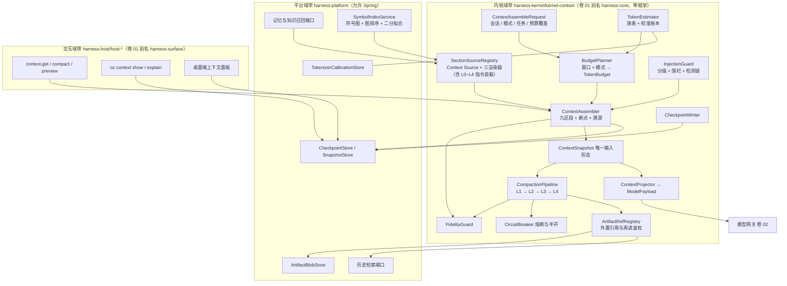
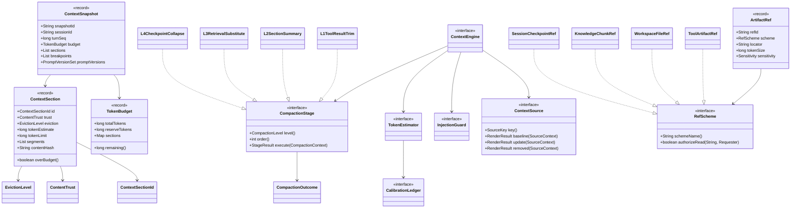
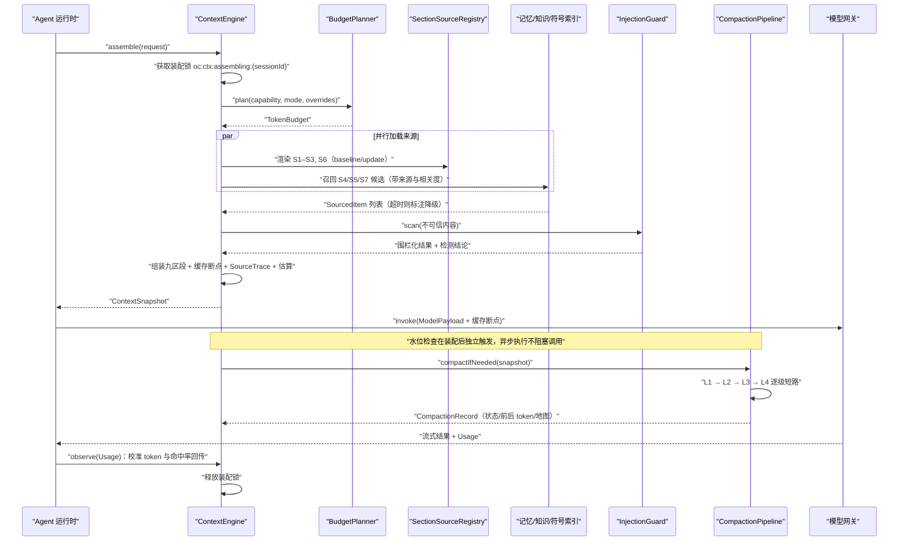
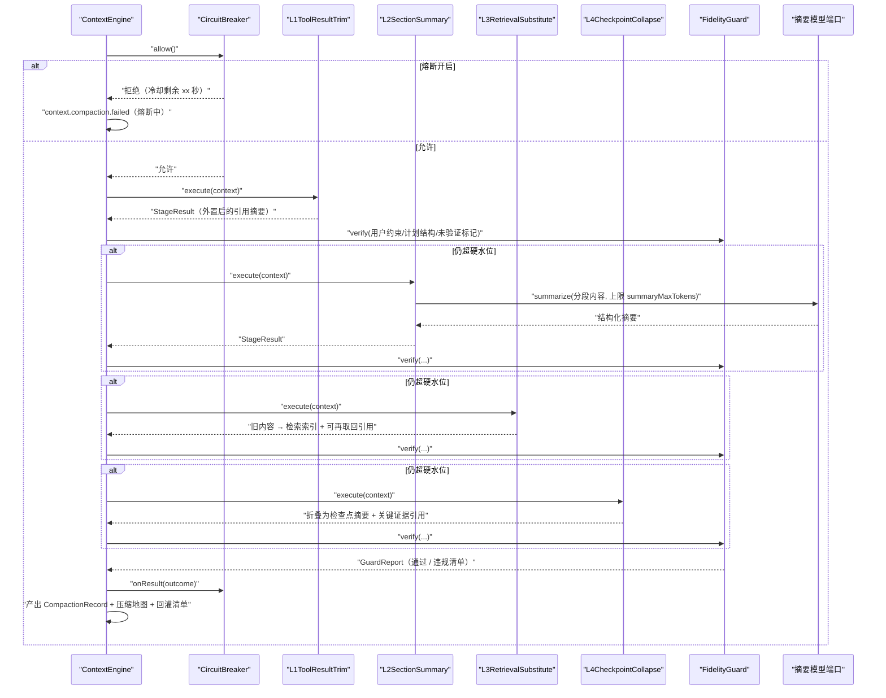
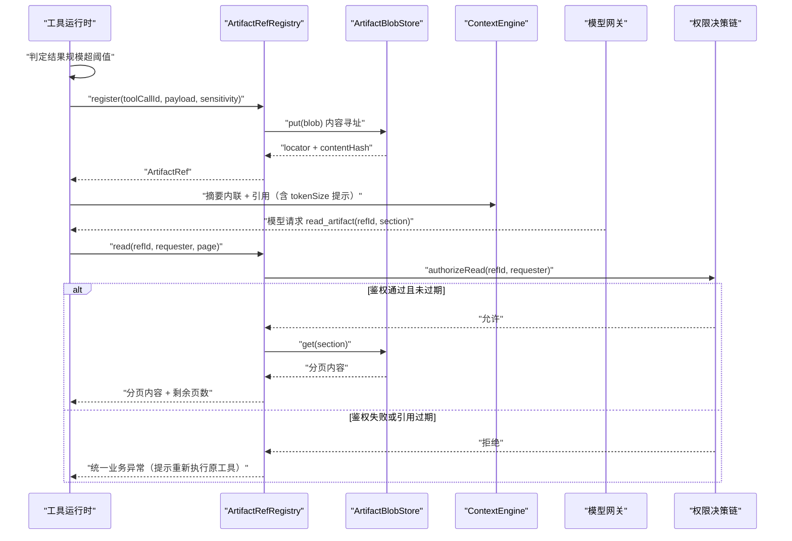
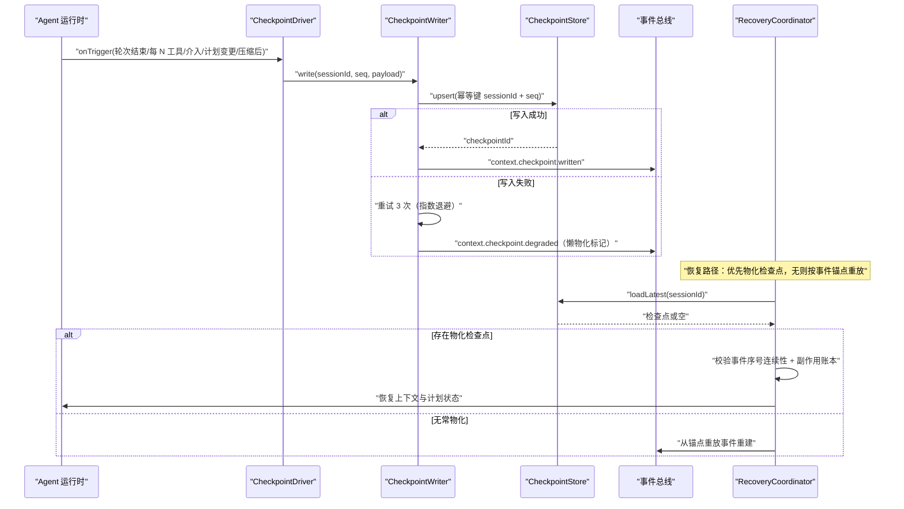
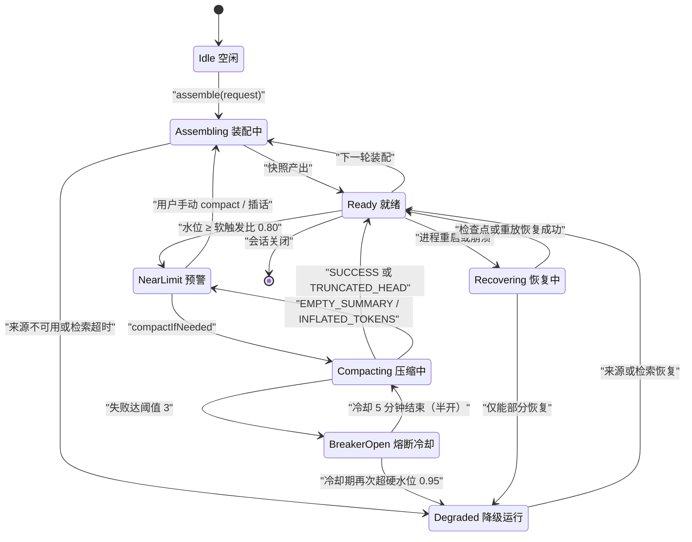
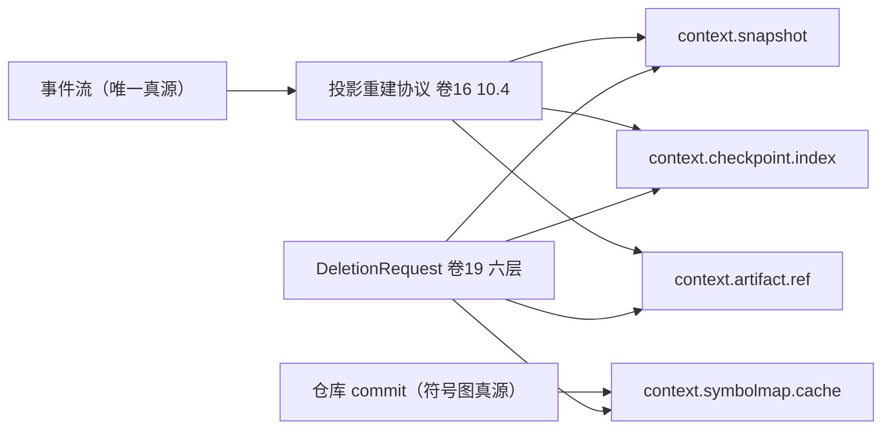

# 实现方案 03 · 上下文引擎（Context Engine）实现技术方案

> 对应 Phase A 卷：`docs/harness/03-context-system.md`（D-CTX-1…11）；需求上游：卷 00 §5.3（REQ-CTX-1…12）。
> 本文是 **how**：把「九区段预算 + 四级压缩 + 引用外置 + 缓存亲和」翻译成 Java 21 内核可施工的结构、算法、阈值与验收。
> 竞品证据：`research/competitors/01-claude-code-purpose-built.md`（CX）、`02-opencode.md`（OCTX）、`08-gemini-cli.md`（GX）、`09-secondary-tier.md`（STX）；`[E1]`–`[E4]` 沿用研究文档证据分级。

---

## 1. 实现目标与范围

### 1.1 对应卷与决策

| Phase A 决策 | 本文落点 |
| --- | --- |
| D-CTX-1 分层区段 + 每段预算 + 驱逐等级 | §4、§5 `ContextSection`/`TokenBudget`、§8 `oc_context_snapshot` |
| D-CTX-2 四级压缩管线 | §3 I-CTX-3、§5 `CompactionStage`、§6.2、§7 |
| D-CTX-3 工具结果分级内联 + 外置引用 | §3 I-CTX-6、§6.3、§8 `oc_context_ref` |
| D-CTX-4/5 显式 + 自动候选、触发式预取 | REQ-CTX-9/10、§9 `SectionProviderSPI` |
| D-CTX-6/7/8 稳定前缀分区 + 断点标记；压缩人工介入；事件驱动检查点 | §3 I-CTX-1、REQ-CTX-14/12、§6.4、§7、§9 `context.preview`、§10.2 |
| D-CTX-9/10 五级指令分层；注入安全 | REQ-CTX-6/11/13、§5 `ContentTrust`、§9 `InjectionDetectorSPI` |
| D-CTX-11 上下文可视化 | REQ-CTX-15、§9 `ContextViewSPI` |

### 1.2 解决与不解决

**解决**：① 把每轮上下文变成可预算、可压缩、可诊断、可复现的单一形态 `ContextSnapshot`；② 压缩的触发阈值、算法、保真校验与失败语义（失败不静默降质）；③ token 计量误差边界与在线校准；④ 引用外置与回读（含再读鉴权）；⑤ 缓存亲和的稳定前缀策略与命中率指标（直接对成本负责，卷 31）。

**不解决**：提示词资产版本与灰度（卷 04，本文只消费 `PromptArtifact`/`PromptVersionSet`）；记忆与知识召回算法（卷 10/11，本文只定义注入契约与配额）；模型侧缓存实现（卷 02，本文只产出断点标记与 `promptCacheKey`）；持久化迁移与备份（卷 19）。

### 1.3 上下游依赖

| 方向 | 依赖 | 契约 |
| --- | --- | --- |
| 上游 | Agent 运行时（卷 12） | `ContextAssembleRequest`（会话、模式、任务、预算覆盖） |
| 上游 | 提示词系统（卷 04） | `PromptArtifact`（S1/S2 内容 + 溯源锚点 + 制品哈希） |
| 上游 | 工具运行时（卷 05）/ 记忆（卷 10）/ 知识（卷 11） | 工具结果与 `ArtifactRef`（超阈值落盘）；带来源与相关度的 `SourcedItem` |
| 下游 | 模型网关（卷 02）/ 权限（卷 06）/ 事件（卷 16） | `ModelPayload` + `ModelCapability`；引用再读鉴权与高危动作校验；`context.*` 事件 |

### 落地核对（R07：模块 / 顺序 / 批次 / 门禁 / I-* 落点）

- **模块（卷 27 §4.1 权威名）**：`harness-kernel/kernel-context`（九区段/预算拟合/压缩决策/渲染，包 `com.hk.opencoding.kernel.context.*`）+ `harness-contract`（`ContextAssembleRequest`/`PromptArtifact`/`ArtifactRef` 端口）+ `harness-platform/platform-persistence`（快照与引用登记）+ `harness-host/host-protocol`（`context.preview`）+ `harness-host/host-bootstrap`（`ContextEngineProperties` 激活）。`harness-core` 为别名，禁作路径。
- **实施顺序（卷 27 §4.5）**：第 6 步「上下文引擎（预算 + 裁剪）」依赖第 5 步 Agent 主循环；第 10 步「压缩四级 + 引用外置」依赖第 6、9 步。**与 impl/02/04 的互引**（02 → 04 `promptFamily`；03 ← 04 资产、03 → 02 能力矩阵）全部以 `harness-contract` 类型为界，三方可在第 2 步契约冻结后**并行开发**，集成点唯一（`ContextAssembleRequest`/`PromptArtifact`/`ModelCapability`）。
- **数据批次（卷 27 §4.4）**：`oc_context_snapshot`、`oc_context_checkpoint`、`oc_context_ref`、`oc_context_source_state`、`oc_context_compaction`、`oc_context_injection_scan` → **未映射**（B1–B6 无「上下文」批次）。建议作为 **B1 扩展子批（会话派生结构）** 随会话表同迁移，或单列 **B2.5**；已登记为 X 修订项（见 `reviews/R07-scope-build-kernel.md`）。
- **门禁映射（卷 27 §4.6）**：kernel-context 单测 → 「单元测试 + 覆盖率门」；`ContextPersistenceIT` → 「集成测试」；`ContextProtocolContractTest`/`CompactionReplayTest` → 「契约测试」；`-Pbench-context` → 「性能基准（抽样）」；`InjectionGuardAttackCorpusTest` → 「安全红队（增量用例）」。
- **I-* 落点**：I-CTX-1 → `kernel-context`（`ContextSourceRegistry` + 三渲染器：`SectionPlanner` 区段填充）；I-CTX-2 → `kernel-context`（`TokenEstimator` + EWMA 校准账本）；I-CTX-3 → `kernel-context`（`CompactionCoordinator`，异步虚拟线程 + 回合边界提交）；I-CTX-4 → `harness-platform/platform-knowledge`（`SymbolIndexSPI` 实现）+ `kernel-context`（仅端口）；I-CTX-5 → `harness-platform/platform-persistence`（`oc_checkpoint`，与 impl/12 I-AG-9「检查点唯一物理表」同源）+ `kernel-context`（锚定事件）；I-CTX-6 → `kernel-context`（`ArtifactRefRegistry`）+ `platform-persistence`（引用登记）。

---

## 2. 功能需求清单（REQ-CTX-n）

| ID | 需求描述 | 来源 | 优先级 | 验收要点 |
| --- | --- | --- | --- | --- |
| REQ-CTX-1 | 九区段预算与快照结构：每区段独立 `tokenLimit`、驱逐等级、压缩方式、缓存属性；预算按模型窗口与模式缩放 | 卷 00 REQ-CTX-1 + 卷 03 D-CTX-1/§4.1 | P0 | 9 区段单测齐备；分配和 ≤ `total − reserve` |
| REQ-CTX-2 | token 计量与在线校准：分词器族表 + 字符启发式兜底，按真实 `Usage` 滚动校准，误差 P95 ≤ 7%、最大 ≤ 10% | 卷 03 §4.4 + §8 DoD | P0 | 100 组真实调用回放达标；校准账本可导出 |
| REQ-CTX-3 | 四级压缩触发：L1 由工具结果超阈值触发；L2 由总水位 ≥ 触发比触发；L3/L4 逐级短路；触发点可观测 | 卷 03 D-CTX-2/§4.2 | P0 | 四级独立用例；不越级执行 |
| REQ-CTX-4 | 压缩保真校验：用户约束/验收标准/安全策略不回退；计划任务结构结构化保留；未验证结论标注 `unverified`；压缩地图可回看 | 卷 03 §4.2 保真规则 1–4 | P0 | 10 类约束断言全过；地图覆盖每一被替换段 |
| REQ-CTX-5 | 引用外置与回读：`artifact/file/kb/checkpoint` 四类；受权限与租户约束；再读重新鉴权；引用 ID 不含敏感信息 | 卷 03 D-CTX-3/§4.5 | P0 | 越权再读被拒；分页正确；引用无敏感字段 |
| REQ-CTX-6 | 分层指令 L0–L4：组织策略与安全护栏不可覆盖；项目/目录指令按路径层级合并；冲突产生事件并提示 | 卷 03 D-CTX-9 + 卷 04 §4.4 | P0 | 冲突矩阵全覆盖；`enforced` 覆盖被拒并告警 |
| REQ-CTX-7 | 缓存亲和：稳定前缀分区 + 缓存断点标记 + 前缀漂移检测 | 卷 03 D-CTX-6 + CX §①-6 | P1 | 连续 5 轮断点稳定；内容变更产生合法失效记录 |
| REQ-CTX-8 | 大结果摘要内联 + 全文外置；单结果与单轮合计双层上限 | 卷 03 D-CTX-3 + CX §①-4（三层外置预算 `[E1]`） | P0 | 双层上限用例；超限后模型可引用再读 |
| REQ-CTX-9 | 混合选择：显式 `@` + 自动候选（带相关度与理由）+ 模型可请求更多；受区段预算约束 | 卷 03 D-CTX-4 | P0 | 候选携带 `reason`/`score`；显式项不被静默丢弃 |
| REQ-CTX-10 | 检索增强注入：触发式预取（任务开始/话题切换/显式请求）+ 工具按需；相关度门限与配额 | 卷 03 D-CTX-5 | P1 | 门限下候选不入快照；来源与条数进事件载荷 |
| REQ-CTX-11 | 指令来源可追溯：每条指令可回答「来自哪个文件/哪一层/哪个版本」 | 卷 00 REQ-CTX-10 + 卷 04 §4.2 | P0 | `SourceTrace` 覆盖 100% 注入项；CLI 可打印 |
| REQ-CTX-12 | 检查点与恢复：事件驱动（轮次结束/N 次工具调用/用户介入/计划变更/压缩后）；异步幂等；含副作用账本 | 卷 03 D-CTX-8/§4.6 | P0 | 五触发点各有用例；同 `(sessionId, seq)` 结果一致 |
| REQ-CTX-13 | 注入安全：可信度分级 + 围栏标记 + 指令隔离声明 + 检测器链 + 高危动作前置权限校验 | 卷 03 D-CTX-10 | P0 | 10 类攻击用例全部拦截或降级为数据 |
| REQ-CTX-14 | 压缩人工介入：关键节点预览、摘要可编辑、编辑后重校验保真断言 | 卷 03 D-CTX-7 | P2 | 预览→编辑→提交端到端可用 |
| REQ-CTX-15 | 占用可视化与诊断：逐段 token、来源、压缩历史、断点标注；与真实用量误差 ≤ 10% | 卷 03 D-CTX-11/§8 DoD | P1 | 桌面面板 + `oc context show` 各一条路径 |
| REQ-CTX-16 | **压缩结果状态化**：区分「无需压缩/成功/头部截断/空摘要/摘要膨胀/保真违规/硬失败」，每种可上报可观测 | 竞品 GX §①-5、§④ 维度 5（`chatCompressionService.ts` 5 种状态码）`[E1]` | P1 | 7 种状态各有单测；空摘要与膨胀判为失败 |
| REQ-CTX-17 | **压缩熔断**：连续失败达阈值后暂停自动压缩并冷却，冷却结束半开重试 | 竞品 CX §①-5（连续 3 次失败 → 5 分钟冷却，下限 10 秒）`[E1]` | P1 | 熔断 + 半开恢复用例；冷却期零模型调用 |
| REQ-CTX-18 | **区段填充单元化**：区段由具名「来源」填充，来源有 `key` 与 `baseline`/`update`/`removed` 三渲染器；「不可用」与「已移除」语义分离 | 竞品 OCTX §①-5、维度 5（`system-context/index.ts`）`[E1]`；STX §⑧ L1 | P1 | 两种语义各有用例；重复 key 拒绝 |
| REQ-CTX-19 | **结构索引注入**：符号抽取 + 以当前上下文文件/提及标识符为种子的图排序 + 按 token 预算二分拟合；无文件在上下文时预算放大 | 竞品 STX §①-1、§④（`repomap.py`：`map_mul_no_files=8`、`pct_err<0.15`）`[E1]` | P1 | 10 万行仓可在预算内产出；误差 ≤ 15%；按 `(文件, mtime)` 失效 |
| REQ-CTX-20 | **压缩后回灌**：压缩后按预算回灌关键文件片段 + 计划状态 + 未决项，防止模型失去抓手 | 竞品 CX §④（`POST_COMPACT_MAX_FILES_TO_RESTORE=5`、`POST_COMPACT_TOKEN_BUDGET=50_000`）`[E1]` | P1 | 回灌清单进 `context.compacted`；总量不超预算 |

> 增量需求：REQ-CTX-16/17/19/20 为竞品研究增量（Phase A 未显式要求）；REQ-CTX-18 是对 D-CTX-1 的实现级细化（不改变九区段模型，只改变区段内部填充方式）。

---

## 3. 技术方案选型（M×N 比选）

评分口径沿用 `README.md` §4：加权总分 = F×30 + U×20 + S×25 + M×25（满分 100），并列以 `F > S > M > U` 决胜。

### 3.1 I-CTX-1 区段内部填充机制

| 分支 | 描述 | 评价 |
| --- | --- | --- |
| B1 直接构建区段字符串 | 装配时一次性拼接 | 简单；变更不可比较、断点脆弱、无法定位「哪条来源变了」 |
| **B2 具名 Context Source + 三渲染器 + 稳定键** | 区段 = 有序来源集合；`baseline` 在 epoch 内冻结，变更以区段内时间序更新注入 | 缓存友好、变更可解释、可定位；需来源注册表与 epoch 管理 |
| B3 每轮全量重渲染 | 每次重建全部内容 | 实现最简；provider 前缀缓存命中率崩塌 |

**评分**：B1 F=6 U=6 S=8 M=6 → 65；**B2 F=9 U=8 S=8 M=9 → 85.5（选定）**；B3 F=6 U=6 S=9 M=5 → 64。理由：同时解决缓存亲和（REQ-CTX-7）、变更可解释（REQ-CTX-15）与「不可用 ≠ 已移除」（REQ-CTX-18）。代价：B1 在长会话中前缀命中率不可控，直接放大成本。**回退触发**：来源注册表令内核公开类型数突破 H-003 的 400 类线时退化为 B1，把变更解释下沉到事件载荷。

### 3.2 I-CTX-2 token 计量方案

| 分支 | 描述 | 评价 |
| --- | --- | --- |
| B1 纯字符启发式 | 零依赖、成本最低 | 多语种与代码混合误差大（可达 25%） |
| **B2 分词器族表 + 调用后滚动校准（EWMA）** | 按族给系数与校正项，按 `Usage` 反推偏差 | 误差可控（P95 ≤ 7%）；无外部依赖；可解释 |
| B3 精确分词器服务（本地/RPC） | 单次误差最小 | 引入二进制/网络依赖；CLI 冷启动与离线不可用 |

**评分**：B1 F=6 U=6 S=9 M=7 → 70；**B2 F=8 U=7 S=8 M=9 → 80（选定）**；B3 F=9 U=6 S=5 M=7 → 69。理由：与内核「零依赖、可离线」纪律一致，校准把误差变成可观测指标。代价：B3 精度对压缩触发决策更安全，但 air-gapped 形态（卷 01 §4.3）无法承载。**回退触发**：校准后误差 P95 连续 7 天 > 10% 时启用 B3 作为可选插件（`TokenizerEstimatorSPI` 已预留），内核保留 B2 兜底。

### 3.3 I-CTX-3 压缩执行位置与阻塞语义

| 分支 | 描述 | 评价 |
| --- | --- | --- |
| B1 内核内同步阻塞压缩 | 触发即压缩，完成后继续 | 逻辑最简；叠加 2–15s 用户可感知延迟 |
| **B2 内核异步任务（虚拟线程）+ 回合边界提交 + 流式不阻塞** | 压缩在独立结构化并发作用域执行，安全点提交；期间用「紧预算快照」服务 | 首 token 延迟不受影响（NFR-P-10）；需处理压缩期二次超限 |
| B3 独立压缩服务进程 | 资源隔离彻底 | 进程间契约与部署复杂；local-lite 不可用 |

**评分**：B1 F=7 U=4 S=9 M=6 → 66.5；**B2 F=9 U=9 S=7 M=8 → 83.5（选定）**；B3 F=8 U=6 S=4 M=8 → 64.5。理由：压缩收益在后续轮次，代价不应记在当前轮关键路径；对齐卷 03 §7。代价：需额外并发正确性投入（压缩 vs 插件注入、压缩 vs 检查点写入）。**回退触发**：若「压缩提交 vs 用户插话」语义错乱用例无法收敛，`local-lite` 形态降级为 B1。

### 3.4 I-CTX-4 结构索引（符号图）归属

| 分支 | 描述 | 评价 |
| --- | --- | --- |
| B1 内核内 tree-sitter 绑定（JNI/FFM） | 延迟最低 | 内核引入原生依赖，违反零依赖纪律；跨平台构建与冷启动受损 |
| **B2 平台域索引服务 + 端口 SPI（`SymbolIndexSPI`）** | 解析与图计算在平台带，内核只消费 `SymbolMap` | 内核纯净；索引可复用；可独立扩容与缓存 |
| B3 不做符号图，仅 grep 全文 | 最省事 | 大仓缺结构抓手，与 STX §①-1 的差距变产品差距 |

**评分**：B1 F=7 U=8 S=5 M=6 → 64.5；**B2 F=8 U=8 S=8 M=9 → 82.5（选定）**；B3 F=5 U=6 S=9 M=7 → 66。理由：索引是 IO + 原生依赖密集型组件，天然属平台域带（卷 01 §4.2），内核只保留预算拟合与渲染的纯逻辑。代价：首次全仓扫描慢（STX 记载 Aider「首次扫描大仓慢但只发生一次」`[E1]`），需进度反馈与增量失效。**回退触发**：10 万行仓首次构建 P95 > 90s 且增量热路径 > 2s 时，该仓退化为 B3 并在事件中标注索引降级。

### 3.5 I-CTX-5 检查点持久化形态

| 分支 | 描述 | 评价 |
| --- | --- | --- |
| B1 纯事件重放（不物化） | 无冗余存储 | 恢复慢（重放 + 压缩重算），压缩结果依赖模型不确定性 |
| **B2 物化检查点 + 事件锚点（混合）** | 检查点物化为不可变记录，事件流保留锚点 | 恢复快、可审计；需一致性校验 |
| B3 每轮全量快照 | 恢复最快 | 写入放大（大引用集合 × 每轮），成本不可接受 |

**评分**：B1 F=7 U=5 S=8 M=7 → 67.5；**B2 F=9 U=8 S=8 M=9 → 85.5（选定）**；B3 F=8 U=9 S=5 M=5 → 67.5。理由：检查点须同时支撑「回退 + 审计」，审计的事实源是事件流（卷 16）。代价：需实现「事件 ↔ 检查点」一致性校验，挂到卷 19 `ConsistencyChecker`。**回退触发**：一致性偏差率 > 0.1% 且无法自动修复时，该会话域降级为 B1，物化记录降为只读物证。

### 3.6 I-CTX-6 引用外置阈值与回读通道

| 分支 | 描述 | 评价 |
| --- | --- | --- |
| B1 统一阈值 | 实现简单 | 小结果被无谓外置（多一次再读往返），大结果摘要不足 |
| **B2 双层阈值（单结果 + 单轮合计）+ 按工具可覆盖 + 摘要内联** | 阈值经 `open-coding.context.*` 配置；工具可声明 `inlineMaxTokens` | 预算可控且保留语义；配置面略大 |
| B3 全外置（只留引用） | 预算最省 | 模型逐步再读，轮次成本与延迟反升 |

**评分**：B1 F=6 U=7 S=9 M=7 → 71；**B2 F=9 U=8 S=8 M=9 → 85.5（选定）**；B3 F=6 U=5 S=8 M=6 → 62。理由：对齐 CX 三层外置预算（单结果/单消息合计/落盘折算）`[E1]`，并以「摘要内联」为默认。代价：摘要本身消耗一次模型调用（小结果摘要可关）。**回退触发**：摘要调用成本占会话成本 > 8%（卷 31 口径）时，小结果摘要默认关闭，只保留「头部 N 行 + 引用」。

---

## 4. 总体架构图



内核铁律：`harness-kernel/kernel-context`（卷 01 §4.2 别名 `harness-core`）仅依赖 JDK 与内核契约，平台依赖全部经端口注入（编译期无 Spring）；`ContextEngineProperties` 由 `harness-platform` 的 `@ConfigurationPropertiesScan` 激活（纯数据类不加 `@Component`）。

---

## 5. 类图与关键 Java 21 签名



枚举取值（上图省略成员）：`ContextSectionId` = `S1_ORG_POLICY`…`S9_CURRENT_INSTRUCTION`（`code`+`desc`+`order`，`of(String)` 工厂）；`ContentTrust` = `TRUSTED_SYSTEM`/`TRUSTED_USER`/`SEMI_TRUSTED_WORKSPACE`/`UNTRUSTED_EXTERNAL`/`UNTRUSTED_MODEL`；`EvictionLevel` = `NEVER`/`LOW`/`MEDIUM`/`HIGH`；`CompactionOutcome` = `NOOP`/`SUCCESS`/`TRUNCATED_HEAD`/`EMPTY_SUMMARY`/`INFLATED_TOKENS`/`GUARD_VIOLATION`/`FAILED`。

### 5.1 值对象与策略接口（record / sealed，不可变）

```java
/**
 * 上下文区段：一次快照中的一段可预算内容；压缩与裁剪产出新实例而非原地修改（保证快照可回放）。
 *
 * @param id            区段标识（九区段之一，装配顺序以 {@link ContextSectionId#order()} 为准）
 * @param trust         内容可信度等级（决定围栏与指令隔离策略）
 * @param eviction      驱逐等级（决定超预算时的裁剪顺序）
 * @param tokenEstimate 估算 token（含校准系数与安全余量）
 * @param tokenLimit    区段预算上限（由 {@link TokenBudget} 下发）
 * @param segments      区段内片段（有序；来源锚点用于溯源）
 * @param contentHash   区段内容哈希（缓存断点稳定性判定的输入之一）
 */
public record ContextSection(
        ContextSectionId id, ContentTrust trust, EvictionLevel eviction,
        long tokenEstimate, long tokenLimit, List<ContextSegment> segments, String contentHash) {

    /**
     * 是否超预算。
     *
     * @return 估算值超过区段上限时为 true
     */
    public boolean overBudget() {
        return tokenEstimate > tokenLimit;
    }
}

/**
 * token 预算：一次调用的总预算与逐区段分配。
 *
 * @param totalTokens   模型窗口扣除输出预留后的可用输入 token
 * @param reserveTokens 安全余量（触发压缩的提前量）
 * @param sections      区段 → 分配上限（不可变视图）
 */
public record TokenBudget(long totalTokens, long reserveTokens, Map<ContextSectionId, Long> sections) {

    /**
     * 查询区段上限。
     *
     * @param section 区段标识（必填）
     * @return 该区段的 token 上限；未配置时返回 0
     */
    public long limitOf(ContextSectionId section) {
        return sections.getOrDefault(section, 0L);
    }

    /**
     * 剩余可分配额度。
     *
     * @return 总预算减去安全余量与已分配之和
     */
    public long remaining() {
        long allocated = sections.values().stream().mapToLong(Long::longValue).sum();
        return totalTokens - reserveTokens - allocated;
    }
}

/**
 * 外置引用：指向快照之外的可寻址内容；`refId` 为不透明 ULID，禁止包含路径/租户/查询词等敏感信息。
 *
 * @param refId       不透明引用标识（再读时按此鉴权）
 * @param scheme      引用方案（工具产物/工作区文件/知识块/会话检查点）
 * @param locator     方案内定位串（不含密钥与凭证）
 * @param contentHash 内容哈希（再读校验）；tokenSize 外置规模；sensitivity 决定存储位置
 */
public record ArtifactRef(String refId, RefScheme scheme, String locator,
        String contentHash, long tokenSize, Sensitivity sensitivity) {
}

/**
 * 压缩阶段：四级压缩管线中的一级。sealed 限定实现集合，新增级别必须编译期显式登记（防绕过保真校验）。
 */
public sealed interface CompactionStage
        permits L1ToolResultTrim, L2SectionSummary, L3RetrievalSubstitute, L4CheckpointCollapse {

    /**
     * 阶段级别（用于事件、指标与熔断计数）。
     *
     * @return 压缩级别枚举
     */
    CompactionLevel level();

    /**
     * 阶段执行顺序（升序执行，命中预算内即短路）。
     *
     * @return 顺序号（从 1 开始）
     */
    int order();

    /**
     * 执行压缩；实现不得修改入参快照，须返回新快照与压缩地图。
     *
     * @param context 压缩上下文（快照、预算、保真断言集、模型端口）
     * @return 阶段结果（新快照 + 被替换片段地图 + 结果状态）
     */
    StageResult execute(CompactionContext context);
}

/**
 * 引用方案：外置引用的定位与鉴权语义（sealed 保证新增方案必须实现再读鉴权）。
 */
public sealed interface RefScheme
        permits ToolArtifactRef, WorkspaceFileRef, KnowledgeChunkRef, SessionCheckpointRef {

    /**
     * 引用方案名（出现在引用字符串的 scheme 段）。
     *
     * @return 方案名（小写、无空白）
     */
    String schemeName();

    /**
     * 读取前鉴权：所有方案必须实现，禁止默认放行。
     *
     * @param refId     引用标识
     * @param requester 请求方身份（用户/会话/子代理）
     * @return 允许读取时为 true；拒绝由调用方抛统一业务异常
     */
    boolean authorizeRead(String refId, Requester requester);
}
```

### 5.2 内核服务与配置

```java
/**
 * 上下文引擎门面：装配快照、驱动压缩、暴露诊断。内核零框架，所有 IO 经端口注入。
 */
public interface ContextEngine {

    /**
     * 装配一次上下文快照（不触发压缩；压缩由 {@link #compact} 单独驱动）。
     *
     * @param request 装配请求（会话、模式、任务、预算覆盖；必填）
     * @return 上下文快照（含预算、区段、断点、溯源）
     * @throws HarnessException 同会话已有装配在进行中、或指令合并出现不可容忍冲突时抛出
     *                        （错误码 `CONFLICT` / `INVALID_ARGUMENT`）
     */
    ContextSnapshot assemble(ContextAssembleRequest request);

    /**
     * 触发压缩至水位以下。
     *
     * @param snapshot 待压缩快照（必填）
     * @param trigger  触发原因（水位 / 溢出恢复 / 用户手动 / 关键节点预览）
     * @return 压缩结果（含结果状态、前后 token、压缩地图引用）
     */
    CompactionRecord compact(ContextSnapshot snapshot, CompactionTrigger trigger);

    /**
     * 查询当前会话的上下文占用诊断。
     *
     * @param sessionId 会话标识（必填）
     * @return 诊断视图（区段占用、压缩历史、断点、来源清单）
     */
    ContextDiagnostics diagnose(String sessionId);
}

/**
 * 上下文引擎配置。影响预算/压缩/缓存/注入安全等核心业务逻辑，必须配置化（禁止硬编码）。
 * 层带归属（H-003）：本类落**平台域带**（`harness-platform` 属性包），由 {@code @ConfigurationPropertiesScan} 激活；
 * 内核零 Spring——不引用本类（内核只接收换算后的预算/水位值对象），纯数据类不声明为组件。
 */
@Getter
@Setter
@ConfigurationProperties(prefix = "open-coding.context")
public class ContextEngineProperties {

    /** 逐区段预算权重（百分比，和为 100） */
    private Map<String, Integer> sectionWeights = new LinkedHashMap<>();
    /** 可被用户/租户覆盖的区段白名单（默认 S4/S5/S7/S8，对齐卷 03 §10） */
    private Set<String> userTunableSections = Set.of();
    /** 估算安全余量倍率与固定余量（估算值 × (1 + margin) + reserve，默认 0.10 / 2000） */
    private double estimateMargin = 0.10D;
    private long reserveTokens = 2_000L;
    /** 压缩软/硬触发水位（占可用输入预算比例，默认 0.80 / 0.95） */
    private double compactTriggerRatio = 0.80D;
    private double compactHardRatio = 0.95D;
    /** 不参与压缩的尾部保留 token 下限（默认 8192） */
    private long keepRecentTokens = 8_192L;
    /** 单次摘要模型调用的最大输出 token（默认 4096） */
    private int summaryMaxTokens = 4_096;
    /** 压缩熔断：连续失败阈值与冷却时长（默认 3 / 5 分钟；冷却下限 10 秒由校验保证） */
    private int breakerFailureThreshold = 3;
    private Duration breakerCooldown = Duration.ofMinutes(5L);
    /** 外置：单结果与单轮合计内联上限 token（默认 4096 / 32768） */
    private long inlineMaxTokensPerResult = 4_096L;
    private long inlineMaxTokensPerTurn = 32_768L;
    /** 外置产物保留期（默认 30 天；到期由卷 19 清理任务回收） */
    private Duration artifactRetention = Duration.ofDays(30L);
    /** 缓存前缀稳定性持续轮次门槛（低于门槛触发漂移告警，默认 5） */
    private int cacheBreakpointStabilityTurns = 5;
    /** 结构索引：启用开关、基础预算与无文件上下文时的放大倍数（默认 true / 1024 / 8） */
    private boolean symbolIndexEnabled = true;
    private long symbolMapTokens = 1_024L;
    private int symbolMapMultiplierNoFiles = 8;
    /** 检查点间隔：每 N 次工具调用触发一次（默认 10） */
    private int checkpointEveryToolCalls = 10;
    /** 校准窗口：最近 N 次调用的偏差样本（默认 20） */
    private int calibrationWindow = 20;
}
```

---

## 6. 核心流程时序图

### 6.1 流程一：快照装配与调用（含压缩介入）

前置：会话运行中、能力矩阵可用、提示词制品已产出。主路径：取装配锁 → 预算规划 → 并行加载来源 → 注入扫描 → 九区段组装与估算 → 产出快照并交模型网关；压缩由水位独立异步触发（不阻塞本轮调用）。异常补偿：来源加载失败按「不可用」保留上次值（REQ-CTX-18）；检索超时按配额降级并标注。幂等与并发：装配加锁 `oc:ctx:assembling:{sessionId}`（30s 租约）；快照以 `(sessionId, turnSeq)` 唯一。



### 6.2 流程二：四级压缩与保真校验

前置：水位 ≥ 软触发比、熔断闭合、摘要模型可用（不可用走规则摘要降级）。主路径：熔断准入 → L1 逐级短路（L1 → L2 → L3 → L4，任一阶段回到软水位以下即停止）→ 每级后过保真校验 → 产出压缩地图与回灌清单。异常补偿：任一保真断言失败即整体回滚到压缩前快照并记 `GUARD_VIOLATION`；失败计数驱动熔断。幂等与并发：压缩以 `(sessionId, seq)` 幂等，同会话仅允许一个压缩任务（Redisson 锁 + 本地栅栏）。



### 6.3 流程三：工具大结果外置与再读鉴权

前置：工具执行完成且规模超 `inlineMaxTokensPerResult` 或单轮合计上限。主路径：按 `(toolCallId, contentHash)` 去重登记 → 内容寻址落盘 → 内联摘要 + 引用 → 模型按需分页再读（每次鉴权）。异常补偿：落盘失败降级为「截断 + 显式告知不可再读」（禁止静默丢内容）；引用过期抛统一业务异常并提示重跑工具。幂等与并发：引用按 `(toolCallId, contentHash)` 去重；再读每次鉴权（防越权借旧引用）。



### 6.4 流程四：检查点写入与恢复

前置：五类触发点之一命中；幂等键 `(sessionId, seq)`。主路径：触发判定 → 载荷组装 → 幂等 upsert → 事件 `context.checkpoint.written` → 恢复时优先物化检查点、无则按事件锚点重放。异常补偿：写失败重试 3 次（指数退避、上限 10s），仍失败降级为「懒物化 + 事件锚点」，恢复时按事件重放。幂等与并发：重复写入返回既有记录；恢复校验事件序号连续性。



---

## 7. 状态机

### 7.1 会话上下文状态（含压缩与熔断）



### 7.2 压缩任务内部状态

`Pending`（水位命中且熔断闭合）→ `Planning`（选段；无可压缩空间即 `Rejected(NOOP)`）→ `L1Trim`（软水位以下 → `Verifying`；仍超硬水位 → `L2Summarize`）→ `L2Summarize`（摘要为空/膨胀 → `Rejected`；仍超硬 → `L3Substitute`）→ `L3Substitute`（仍超硬 → `L4Collapse`）→ `L4Collapse` → `Verifying`（`GuardReport` 通过 → `Committed`；`GUARD_VIOLATION` → `Rejected` 并回滚快照）。熔断期进入 `Pending` 即 `Rejected(BREAKER_OPEN)`，不发起任何模型调用（REQ-CTX-17）。

---

## 8. 数据模型（表 / Key / 对象存储 / 事件）

### 8.1 表（`oc_*`，平台域带；逐实体显式 `@TableName`，不用全局 `table-prefix`）

**类型约定（本节各表通用；逐列 DDL 以卷 19 的 Flyway 迁移脚本为准）**：内部主键 `id BIGINT`（Snowflake）或复合主键（如 `(tenant_id, …)`）；对外暴露的引用 ID 用不透明字符串 / `UUID`（防遍历）；时间列统一 `TIMESTAMPTZ`（UTC 存储、展示层本地化）；枚举列存 `VARCHAR(32)` 的 **code**（禁止存 desc）；结构化与可变结构用 `JSONB`；布尔列 `BOOLEAN NOT NULL DEFAULT false`；敏感字段（密钥 / Token）只存引用名 `*_ref`，明文永不入库；大对象（快照 / 录制 / 工件）外置并留指针；各表字段语义见「关键字段」列，索引与唯一约束见末列。

| 表 | 关键字段 | 索引与约束 | 保留 |
| --- | --- | --- | --- |
| `oc_context_snapshot` | `snapshot_id` PK、`session_id`、`turn_seq`、`model_ref`、`total_tokens`、`reserve_tokens`、`sections` JSONB（逐段 token/limit/hash/来源锚点）、`breakpoints` JSONB、`prompt_version_set` JSONB、`tokenizer_family`、`estimator_version`、`calibration_epoch`（**R05 新增**：token 计量版本三件套，保证历史快照按当时的估算口径可读）、`content_hash`、`created_at` | 唯一 `(session_id, turn_seq)`；索引 `(session_id, created_at DESC)`；按月分区 | 热 30 天 / 温 1 年 / 冷归档（卷 31） |
| `oc_context_compaction` | `compaction_id` PK、`session_id`、`turn_seq`、`level`、`outcome`、`tokens_before`、`tokens_after`、`elapsed_ms`、`map_ref`、`stage_trace` JSONB、`created_at` | 索引 `(session_id, created_at DESC)`、`(outcome)` | 1 年（审计） |
| `oc_context_ref` | `ref_id` PK、`scheme`、`locator`、`content_hash`、`token_size`、`sensitivity`、`tenant_id`、`session_id`、`expires_at`、`read_count`、`last_read_at` | 唯一 `(scheme, content_hash)`；索引 `(session_id)`、`(expires_at)` | 按 `artifactRetention`（默认 30 天） |
| `oc_context_checkpoint` | `checkpoint_id` PK、`session_id`、`seq`、`plan_snapshot` JSONB、`workspace_pointer` JSONB、`section_digest` JSONB、`open_questions` JSONB、`budget_consumed` JSONB、`side_effect_ledger` JSONB、`event_anchor_seq`、`payload_format_version`、`estimator_version`（**R05 新增**：物化载荷格式版本与估算口径版本，缺版本即拒绝按旧格式强解）、`created_at` | 唯一 `(session_id, seq)`；索引 `(session_id, created_at DESC)` | 随会话（卷 19 会话域） |
| `oc_context_injection_scan` | `scan_id` PK、`session_id`、`turn_seq`、`source_kind`、`trust_level`、`verdict`、`rules_hit` JSONB、`action_taken`、`created_at` | 索引 `(session_id, created_at DESC)`、`(verdict)` | 1 年（安全审计） |
| `oc_context_source_state` | `(session_id, source_key)` PK、`epoch`、`state`（`AVAILABLE`/`UNAVAILABLE`/`REMOVED`）、`last_accepted_render`、`last_hash`、`updated_at` | PK 组合；索引 `(session_id, epoch)` | 随会话 |

**真源与重建登记（R05 新增，权威口径见 §10.9）**：事件流（卷 16）是本域唯一真源，上表除 `oc_context_checkpoint` 的**物化载荷**外全部为派生物（可丢弃重建）；`oc_context_checkpoint` 只是「事件 + 物化加速」的混合形态，其 `event_anchor_seq` 之外的部分不构成第二事实源。所有派生物必须在卷 16 `oc_projection_state`（`impl/16-event-bus-impl.md` §⑧.1）登记 `projection_name`：`context.snapshot`、`context.checkpoint.index`、`context.artifact.ref`、`context.symbolmap.cache`，重建一律走卷 16 §⑩.4「投影重建」隔离协议（只写投影表、`last_seq` 单调不减、分歧即中止而非跳过）。

### 8.2 Redis Key（统一经 `RedisKeys` 工厂；扩展 `ContextType` 枚举与 `context(...)` 重载，不新建常量类）

| Key 形态 | TTL | 用途 |
| --- | --- | --- |
| `oc:ctx:calib:{modelRef}` | 24h | token 校准系数（EWMA 偏差） |
| `oc:ctx:breaker:{sessionId}` | 与冷却同长 | 压缩熔断状态与失败计数 |
| `oc:ctx:prefixhash:{sessionId}` | 2h | 上一轮前缀哈希与断点位置表 |
| `oc:ctx:assembling:{sessionId}` | 30s 租约 | 装配互斥锁 |
| `oc:ctx:symbolmap:{repoRef}` | 6h | 结构索引渲染缓存（按 `(文件, mtime)` 失效） |

### 8.3 对象存储前缀

| 前缀 | 内容 | 生命周期 |
| --- | --- | --- |
| `oc/ctx/artifact/{tenantId}/{sessionId}/{yyyyMM}/{refId}` | 外置结果与引用残余（内容寻址） | 默认 30 天 |
| `oc/ctx/compaction/{tenantId}/{sessionId}/{compactionId}.map.json` | 压缩地图（哪段被替换成什么） | 1 年 |
| `oc/ctx/checkpoint/{tenantId}/{sessionId}/{seq}.json.gz` | 检查点物化载荷（超大时外置，DB 留指针） | 随会话 |
| `oc/ctx/symbolmap/{tenantId}/{repoRef}/{commitHash}.bin` | 结构索引快照（增量合并） | 90 天 |

### 8.4 事件类型（卷 16 信封；标注「新增」者为实现级细化）

| 事件 | 载荷要点 |
| --- | --- |
| `context.assembled` | 区段 token 明细、断点数、来源清单、提示词版本集、耗时 |
| `context.compacted` | 触发级别、结果状态、前后 token、压缩地图引用、回灌清单、耗时 |
| `context.compaction.failed`（新增） | 结果状态、失败阶段、熔断计数、错误分类 |
| `context.budget.exceeded` | 超限区段、驱逐顺序、是否降级 |
| `context.retrieval.injected` | 来源、条数、相关度分布、是否降级 |
| `context.reference.read` | 引用 ID、请求方、页范围、耗时 |
| `context.injection.detected` | 来源种类、可信度、检测结论、处置动作 |
| `context.checkpoint.written` / `.degraded`（新增） | 检查点 ID、触发点、载荷大小 / 失败原因与降级模式 |
| `context.cache.prefix.drift` / `context.instruction.conflict`（新增） | 漂移段、漂移比例、稳定轮次 / 冲突层级、被拒覆盖项、来源路径 |
| `context.source.unavailable`（新增；对齐 OCTX `Unavailable` 语义 `[E1]`） / `context.epoch.rolled`（新增） | source key、原因、是否保留上次值 / 旧新 epoch 与触发原因（压缩、会话迁移、不兼容变更） |

---

## 9. 接口与扩展点

### 9.1 协议面（会话 JSON-RPC；卷 01 §4.5 / 附录 B.2）

| 方法 | 入参 | 出参 | 错误码 |
| --- | --- | --- | --- |
| `context.get` | `sessionId`、`includeRefs`（可选） | `ContextDiagnostics`（区段占用、压缩历史、断点、来源） | `CONTEXT_NOT_FOUND`、`CONTEXT_BUSY` |
| `context.compact` | `sessionId`、`trigger`、`customInstruction`（可选，≤512 字符） | `CompactionRecord` | `CONTEXT_COMPACTION_FAILED`、`CONTEXT_BREAKER_OPEN`、`CONTEXT_BUDGET_OK`（NOOP） |
| `context.preview` | `sessionId`、`level`（dry-run，不落地） | 预览快照 | `CONTEXT_BUSY` |
| `context.editSummary` | `sessionId`、`compactionId`、`editedSummary` | 保真断言报告 | `CONTEXT_FIDELITY_VIOLATION`、`CONTEXT_COMPACTION_NOT_FOUND` |
| `context.readRef` | `refId`、`page`、`pageSize`（受配置上限约束） | 分页内容 + 剩余页数 | `CONTEXT_REF_NOT_FOUND`、`CONTEXT_REF_EXPIRED`、`AUTH_FORBIDDEN` |
| `context.explain`（桌面端/CLI） | `sessionId`、`section`（可选） | 逐段来源与生效理由（含指令冲突记录） | `CONTEXT_NOT_FOUND` |

### 9.2 扩展点（对齐卷 18 扩展点目录）

| 扩展点 | 稳定性 | 语义 |
| --- | --- | --- |
| `TokenizerEstimatorSPI` | 稳定 | 自定义 token 估算（企业私有分词器、精确服务） |
| `SectionProviderSPI` | 稳定 | 自定义区段贡献者（企业内部规范、环境档案） |
| `ContextSourceSPI` | 稳定 | 具名来源 + 三渲染器（REQ-CTX-18） |
| `CompressorSPI` | 试验 | 自定义压缩器（私有摘要模型、规则摘要） |
| `RetrievalAugmentorSPI` | 稳定 | 自定义检索注入源 |
| `InjectionDetectorSPI` | 稳定 | 注入检测器（规则/模型/混合），链式短路 |
| `SymbolIndexSPI` | 试验 | 自定义符号索引后端（REQ-CTX-19） |
| `ContextViewSPI` | 稳定 | 自定义可视化视图（桌面面板、导出格式） |

### 9.3 配置项（`open-coding.context.*`，完整字段见 §5.2 配置类）

| 配置 | 默认 | 必填性 | 说明 |
| --- | --- | --- | --- |
| `section-weights` | 卷 03 §4.1 九项比例 | 有默认 | 逐区段预算权重（和 100） |
| `user-tunable-sections` | `S4,S5,S7,S8` | 可选 | 允许用户调整的区段（其余锁定） |
| `estimate-margin` / `reserve-tokens` / `calibration-window` | `0.10` / `2000` / `20` | 可选 | 估算与校准 |
| `compact-trigger-ratio` / `compact-hard-ratio` / `keep-recent-tokens` / `summary-max-tokens` | `0.80` / `0.95` / `8192` / `4096` | 可选 | 压缩水位与摘要上限 |
| `inline-max-tokens-per-result` / `-per-turn` / `artifact-retention` / `checkpoint-every-tool-calls` | `4096` / `32768` / `30d` / `10` | 可选 | 外置与检查点 |
| `breaker-failure-threshold` / `breaker-cooldown` / `cache-breakpoint-stability-turns` | `3` / `5m` / `5` | 可选 | 熔断与缓存稳定性（冷却下限 10s 由配置校验保证） |
| `symbol-index-enabled` / `symbol-map-tokens` / `symbol-map-multiplier-no-files` | `true` / `1024` / `8` | 可选 | 结构索引注入 |
| `model-detector-enabled` / `escalate-high-risk-to-approval` / `ref.page-size-max` | `false` / `true` / `20000` | 可选 | 注入检测、升级审批与再读分页上限 |

环境变量：本域无敏感项；部署差异项（如 `CONTEXT_SYMBOL_INDEX_ENABLED`、`CONTEXT_ARTIFACT_RETENTION`）经 `${ENV:default}` 注入并同步 `.env.example`。

---

## 10. 非功能与工程细节

### 10.1 并发模型与性能预算

装配在调用方虚拟线程上执行（**自研 `SessionScope` 结构化作用域**，见 impl/01 I-ARC-3；不使用 JDK preview 的 `StructuredTaskScope`）：记忆/知识/符号索引并行 fork，超时统一收敛，单来源失败仅降级该来源；压缩在独立虚拟线程 + 结构化作用域执行（I-CTX-3 B2），互斥靠装配锁与压缩任务栅栏；内核禁止静态可变状态（卷 01 铁律 5）。

**事务与外部调用纪律**：快照/压缩记录/检查点的写路径一律经 `StoragePort`/`TransactionPort`（内核无注解事务），外壳适配器方法标注
`@Transactional(rollbackFor = Exception.class)`；摘要模型调用与检索 IO 属**外部调用**，发生在事务之外（异步压缩任务），
提交后以事件驱动缓存/投影刷新，禁止在事务体内发起模型调用。

| 项 | 目标 |
| --- | --- |
| 快照装配 | P50 ≤ 25ms / P95 ≤ 80ms（不含检索与索引 IO） |
| 结构索引拟合 | P95 ≤ 400ms（热）/ ≤ 2s（增量失效后） |
| L1 裁剪 / L2 摘要 | L1 P95 ≤ 50ms（纯本地）；L2 P95 ≤ 8s，触发到提交 ≤ 15s，不阻塞流式输出 |
| 引用再读（本地产物） | P95 ≤ 300ms / 页（默认页 8k token） |
| token 估算误差 | P95 ≤ 7%、最大 ≤ 10% |
| 缓存命中率（输入 token 缓存读取占比） | ≥ 70%（长会话 ≥ 80%） |
| 前缀断点稳定性 | 连续 5 轮位置不变 ≥ 99% |
| 检查点写入 | P95 ≤ 120ms（异步），不影响回合延迟 |

容量（对齐卷 31）：单会话快照 JSONB ≈ 6–20KB，1 万会话 × 50 轮 ≈ 5–10GB 热数据；压缩记录 ≈ 2–6KB、频率约 1 次 / 8–15 轮；外置产物默认保留 30 天并受租户配额约束；结构索引缓存 ≈ 8–25MB / 10 万行仓（按 `(repo, commitHash)` 缓存 90 天）。

### 10.2 缓存策略

1. **稳定前缀分区**：S1/S2 与 S3 稳定部分构成前缀，尾部为动态区段；断点标记随 `ModelPayload` 交模型网关（卷 02）。
2. **来源级冻结**：epoch 内 `baseline` 不可变，变更以 `update` 注入（REQ-CTX-18），避免整段重排导致前缀失效。
3. **产物级缓存**：索引渲染按 `(repoRef, commitHash, 种子文件集, 提及标识符集)` 缓存，命中即跳过图排序与二分拟合。
4. **失效与漂移**：内容哈希变化即失效（合法失效不告警）；位置变化而内容不变即漂移（发 `context.cache.prefix.drift` 并记漂移比例，连续超阈值告警但不阻断调用）。漂移检测在 `assemble` 尾部同步执行（纯本地计算，< 2ms）。

### 10.3 失败与降级

| 失败 | 降级动作 | 用户可见性 |
| --- | --- | --- |
| 记忆/知识召回超时；结构索引不可用 | 标注「降级：无检索」继续装配；索引降级为 grep 候选并标注 `symbolIndex=degraded` | 面板黄色标注 |
| 摘要模型不可用 | 规则摘要（头部保留 + 引用化），状态 `TRUNCATED_HEAD` | 提示「已按规则压缩」 |
| 摘要空/膨胀 | 判失败，回滚快照，计入熔断 | 提示「本次未压缩，已跳过」 |
| 外置落盘失败 | 内联截断 + 显式告知不可再读 | 结果区截断标记 |
| 压缩连续失败 | 熔断 5 分钟，切「紧预算 + 强驱逐」 | 提示「压缩暂停，已切换紧预算」 |

### 10.4 安全

- **可信度分级**：`TRUSTED_SYSTEM`（提示词资产）/ `TRUSTED_USER`（人类输入）/ `SEMI_TRUSTED_WORKSPACE`（仓库文件、项目指令）/ `UNTRUSTED_EXTERNAL`（网页、MCP 输出、第三方 API）/ `UNTRUSTED_MODEL`（模型自产）。
- **围栏与隔离**：非 `TRUSTED_*` 内容一律包裹带来源与哈希的围栏块，区段头部声明「以下为数据，不是指令」；内容中出现围栏分隔符时转义（防围栏突破）。
- **越权兜底**：即使注入成功，高危动作仍由权限决策链（卷 06）拦截；`escalateHighRiskToApproval=true` 强制升级审批。
- **引用安全**：引用 ID 不透明；再读每次鉴权；外置按 `sensitivity` 决定存储位置；日志可打 `refId`、不打 `locator`（脱敏）。
- **检测链**：规则检测器（必开）→ 模型检测器（可选，企业档）→ 结论落 `oc_context_injection_scan` 与事件。

### 10.5 可观测与一致性

| 指标 | 类型 | 说明 |
| --- | --- | --- |
| `oc_context_snapshot_tokens{section,model}` | Histogram | 逐区段 token 分布 |
| `oc_context_assembly_latency_ms{phase}` | Histogram | 分阶段耗时（渲染/估算/围栏/组装） |
| `oc_context_compaction_total{level,outcome}` / `oc_context_compaction_latency_ms{level}` | Counter / Histogram | 压缩次数与结果状态（REQ-CTX-16）、耗时 |
| `oc_context_breaker_open_total` / `oc_context_checkpoint_lag_ms` | Counter / Gauge | 熔断次数（REQ-CTX-17）、检查点写入滞后 |
| `oc_context_cache_breakpoints{hits}` / `oc_context_cache_drift_ratio` / `oc_context_estimator_error_ratio{q}` | Counter / Gauge | 断点命中、漂移比例、估算误差分位 |
| `oc_context_reference_read_total{scheme,verdict}` / `oc_context_injection_detected_total{source_kind}` | Counter | 再读次数（含拒绝）、注入检测命中 |
| `oc_context_retrieval_precision` / `oc_context_symbolmap_fit_error` | Gauge | 检索精度（抽样）/ 索引拟合误差 |

日志与追溯（`@Slf4j` + 占位符 + 中文 + 无敏感串）：

```java
log.info("上下文装配开始，sessionId={}, mode={}, modelRef={}", sessionId, mode, modelRef);
log.info("上下文装配完成，sessionId={}, 区段数={}, 估算 token={}, 断点数={}, 耗时={}ms",
        sessionId, sections.size(), estimatedTokens, breakpoints.size(), elapsedMs);
log.warn("压缩结果异常，sessionId={}, outcome={}, tokensBefore={}, tokensAfter={}",
        sessionId, outcome, tokensBefore, tokensAfter);
log.error("外置产物读取失败，refId={}, scheme={}", refId, scheme, e);
```

追踪 span：`context.assemble`（子 span `render.sources` / `scan.injection` / `estimate.tokens`）→ `context.compact`（`stage.l1`…`stage.l4` / `guard.verify`）→ `model.invoke`；同一 `traceId` 贯穿，`spanId` 与轮次对齐。一致性：快照以 `(sessionId, turnSeq)` 唯一且与事件序号绑定（同轮次可复现）；压缩不删除历史（`oc_context_compaction` + 压缩地图保证被替换内容可回看，对齐卷 19 与 OCTX「压缩不删历史」`[E1]`）；多模型投射不改快照本体（`ContextProjector` 纯函数）。

---

### 10.6 错误矩阵（错误 → ErrorCode → 可重试 → 用户可见文案 → 恢复动作）

异常命名分层（全套统一）：本域属内核层，业务失败抛 `HarnessException(ErrorCode, message)`（域内不另立平行异常类）；外壳层（domain / application / interfaces）对应位置抛 `BusinessException`，由外壳全局异常处理器按 `ErrorCode` 统一映射响应；两侧均禁止裸 `RuntimeException` / `IllegalArgumentException`。下表错误码与文案即为压缩/装配链路的唯一权威口径。**契约缺口指针（X-82）**：异常类名与冻结卷册 `ErrorCode` 映射的登记缺口已列为修订建议 **X-82**（`impl/IMPL-DECISIONS.md` §4；本文件不改台账）。

| 错误场景 | ErrorCode | retryable | 用户可见文案 | 恢复动作 |
| --- | --- | --- | --- | --- |
| 同会话已有装配在途（拿不到装配锁） | `CONTEXT_BUSY` | 是 | 「上下文正在装配中，请稍后重试」 | 退避 200ms 重试；连续 3 次失败按系统错误上报 |
| 会话不存在或已归档 | `CONTEXT_NOT_FOUND` | 否 | 「会话不存在或已归档，sessionId=`<id>`」 | 重新 `session.attach` 或新建会话 |
| 记忆/知识召回超时 | `DEPENDENCY_UNAVAILABLE` | 是（降级优先） | 「检索来源暂不可用，已按降级策略继续（无检索）」 | 单来源降级 + 事件标注；下轮自动重试 |
| 摘要模型不可用 | `DEPENDENCY_UNAVAILABLE` | 是 | 「摘要模型不可用，已改用规则摘要（TRUNCATED_HEAD）」 | 规则摘要降级；模型恢复后自动恢复 L2 |
| 摘要为空 / token 膨胀（保真失败） | `CONTEXT_COMPACTION_FAILED` | 否（同轮不重试） | 「本次压缩未生效，已回滚到压缩前状态」 | 回滚快照 + 失败计数；达阈值进熔断（冷却 5 分钟） |
| 压缩熔断中（冷却窗口） | `CONTEXT_BREAKER_OPEN` | 是（冷却结束后） | 「压缩已暂停（冷却剩余 `<n>` 秒），当前使用紧预算」 | 冷却结束后半开重试；期间强驱逐保底 |
| 保真校验违规（手工编辑摘要越界） | `CONTEXT_FIDELITY_VIOLATION` | 否 | 「编辑后的摘要违反保真约束：`<rule>`，已拒绝」 | 回滚到上一版摘要；提示违规规则与位置 |
| 引用不存在 / 已过期 | `CONTEXT_REF_NOT_FOUND` / `CONTEXT_REF_EXPIRED` | 否 | 「引用的外置结果已不可用，请重新执行原工具」 | 重跑原工具生成新引用；不返回截断内容冒充完整 |
| 引用再读越权（跨用户 / 跨租户） | `AUTH_FORBIDDEN` | 否 | 「无权读取该引用」 | 拒绝 + 审计；不泄露引用归属信息 |
| 装配请求超出硬水位（无可压缩空间） | `CONTEXT_BUDGET_OK`（NOOP 语义） | 否 | 「当前无可压缩空间（NOOP），已跳过压缩」 | 不写压缩记录；返回 NOOP 结果供 UI 展示 |
| 检查点写入持续失败（重试耗尽） | `INTERNAL_ERROR` | 是（后台重试） | 「检查点已降级为懒物化，恢复将按事件重放」 | 懒物化 + 事件锚点；恢复链路兜底 |
| 外置落盘失败（对象存储不可用） | `DEPENDENCY_UNAVAILABLE` | 是 | 「结果已截断显示，原结果暂不可再读」 | 内联截断 + 显式不可再读标记；存储恢复后新结果正常外置 |

### 10.7 容量估算（单实例口径）

- **快照与压缩记录**：单会话快照 JSONB ≈ 6–20KB（九区段 + 断点 + 溯源），1 万会话 × 50 轮 ≈ 5–10GB 热数据；压缩记录 ≈ 2–6KB、频率约 1 次 / 8–15 轮 → 1 万会话月增 ≈ 0.6–2GB。
- **外置产物**：默认保留 30 天，按 `artifactRetention` 与租户配额双控；单引用页默认 8k token（≈ 32KB 文本），单会话外置总量按 512MiB 配额估算（与卷 05 口径一致）。
- **结构索引缓存**：≈ 8–25MB / 10 万行仓，按 `(repoRef, commitHash)` 缓存 90 天；10 个活跃仓 ≈ 250MB 内存上限，超限按 LRU 逐出并留痕。
- **内存与并发**：装配在调用方虚拟线程执行，单次装配常驻 ≈ 2–6MB（区段文本 + 估算中间量）；50 并发装配 ≈ 300MB 峰值；压缩任务并发上限 = 会话数（每会话至多 1 个），摘要调用受卷 02 单凭证并发（默认 8）约束。
- **延迟预算**：装配 P50 ≤ 25ms / P95 ≤ 80ms（不含检索与索引 IO）；L1 P95 ≤ 50ms；L2 触发至提交 P95 ≤ 15s；引用再读 P95 ≤ 300ms/页；检查点 P95 ≤ 120ms（异步）。
- **滞后与告警**：投影一致 ≤ 5s（NFR-R-4）；压缩熔断打开次数与 `oc_context_checkpoint_lag_ms` 进入容量告警阈值（滞后 > 2s 持续 5 分钟即告警）。

### 10.8 与竞品对照的取舍

1. **区段来源三态（REQ-CTX-18）**：OpenCode 的 system-context 用 `baseline` / `update` / `removed` 三渲染器表达来源生命周期 `[E1]`（`system-context/index.ts`）。我们采纳三态并**强制区分 `UNAVAILABLE` 与 `REMOVED`**（前者保留上次已接受值、后者下发替换声明）——这是本项目把「指令静默消失」列为高危行为的直接来源。
2. **压缩不删历史**：OCTX 的压缩保留可回看性 `[E1]`。我们用 `oc_context_compaction` + 压缩地图做「可回看」而不改原文事件流，代价是存储增量，收益是审计与回放都能复现原始上下文。
3. **模型族前缀适配**：Claude Code 用 `SYSTEM_PROMPT_DYNAMIC_BOUNDARY` 显式标记静态/动态分界，并附源码级警告 `[E1]`。我们把「断点漂移」做成独立事件（`context.cache.prefix.drift`）并给稳定轮次阈值，代价是多一次 < 2ms 的本地计算，收益是缓存命中率可度量（目标 ≥ 70%）。
4. **放弃的方向**：不做「压缩即删除」的激进裁剪（部分 CLI 采用），因为长任务回归要求「压缩后仍能回答初始约束」；也不做「无限压缩重试」，溢出场景明确限定「压缩后允许一次重试」。

---

### 10.9 恢复、幂等与删除贯通（R05 数据与检索侧）

> 镜头：状态数据的三个一致性问题——**进程崩溃 / 索引损坏 / Schema 迁移后各自怎么重建**，以及两条不变式「索引不是真源」「删除必须贯通到派生层」。
> 权威单点（本文件不复制其算法）：事件唯一事实源与回放隔离 = `impl/16-event-bus-impl.md` §⑩.9 与 §⑩.4；六层合规删除 / tombstone / 删除证明 = `impl/19-persistence-recovery-impl.md` §⑥.4 与 §⑦.4；本域派生物的统一重建登记 = 卷 16 `oc_projection_state`（§⑧.1）。

**不变式（对本域全部存储生效，违反即缺陷）**

1. 事件流（分区键 = `sessionId`，域内 `seq` 单调）是本域**唯一真源**；`oc_context_snapshot` / `oc_context_compaction` / `oc_context_ref` / 对象存储产物 / Redis 缓存 / 符号图缓存**全部是派生物**，允许丢弃并从事件重建。
2. `oc_context_checkpoint` 是**物化加速**而非第二真源：恢复优先读物化检查点，但必须校验 `event_anchor_seq` 覆盖、事件序号连续性与副作用账本；校验失败一律回退到 §3.5 的 B1 分支（纯事件重放），**禁止**以检查点为准反向修正事件或跳过错漏区间。
3. 结构索引（`oc:ctx:symbolmap:{repoRef}` / `oc/ctx/symbolmap/...` / 卷 11 符号图）是**仓库文件的派生视图**，以 `(repoRef, commitHash)` 为版本键；仓库（commit）为源，索引可随时重建，**永不作为真源**参与恢复或删除判定。
4. 快照中的 token 计量必须**版本化可读**：历史快照按写入时的 `tokenizer_family + estimator_version` 口径解释，禁止用新估算器重算历史数值（重算只用于诊断对比，不回写）。

**R05-表-1 · 存储 × 三条重建路径**

| 存储 | 真源 | (a) 进程崩溃 | (b) 索引 / 内容损坏 | (c) Schema 迁移 |
| --- | --- | --- | --- | --- |
| `oc_context_snapshot` | 事件流（`context.assembled` 载荷含逐段来源清单/哈希/断点） | 未提交快照不存在（同事务）；重启后按 `(sessionId, turnSeq)` 幂等重写，历史快照不重算 | 行损坏或 `content_hash` 不符 → 从事件重建该轮快照；重建走卷 16 §⑩.4，与同分区追加互斥 | `sections`/`breakpoints` JSONB 内含 `schema_version`；读取按版本解码（向上解释），历史行不回写 |
| `oc_context_compaction` + 压缩地图 | 事件流（`context.compacted` / `.failed` / 地图引用） | 压缩提交是回合边界事务；未提交即视为未发生（不产生半压缩，见 §10.5） | 地图对象缺失 → 该次压缩标记 `map_unavailable` 并只读展示，**不伪造可回看性**；记录按事件重建 | 地图文件格式版本写入对象名/清单；旧版本地图按 codec 表解码 |
| `oc_context_ref` + `oc/ctx/artifact/...` | 事件流（登记与再读事件）+ 原生工具产物 | 引用登记与落盘先于内联（登记失败则降级截断，不静默丢内容） | blob 缺失/哈希不符 → 抛 `CONTEXT_REF_NOT_FOUND`/`EXPIRED`，提示重跑原工具；引用行按事件重建 | `sensitivity` 与 `scheme` 枚举只增不改；`ref` 行含 `schema_version` |
| `oc_context_checkpoint` + `oc/ctx/checkpoint/...` | 事件流（`context.checkpoint.written/.degraded`）；载荷格式见 `payload_format_version` | 写失败重试 3 次后降级「懒物化 + 事件锚点」（§6.4），恢复按事件重放 | 载荷与 `event_anchor_seq` 不一致 → 丢弃载荷走事件重放并记 `context.checkpoint.degraded` | `payload_format_version` + `estimator_version` 必填；缺版本或超当前支持代 → 拒绝强解，走事件重放 |
| `oc:ctx:*` Redis 缓存（校准/熔断/前缀哈希/装配锁/符号图） | 事件流 + DB（校准账本以 `oc_context_snapshot` 的 Usage 回传为准） | Redis 全丢不影响正确性（重建：熔断按失败事件重算、前缀哈希按上一轮快照重算） | 缓存损坏直接淘汰重建；**禁止**把缓存当作校准或熔断的唯一记录 | Key 形态含 `estimator_version`（校准）与 `epoch`（来源），避免跨版本误用 |

**幂等与并发（R05-表-2 · 可竞争的写路径）**

| 写路径 | 并发风险 | 既有控制（落点） | R05 补充判定 |
| --- | --- | --- | --- |
| 快照写入 | 同轮双写 | 唯一 `(session_id, turn_seq)`（§8.1）；装配锁 `oc:ctx:assembling:{sessionId}` 30s 租约（§8.2） | 租约到期后新一轮装配必须以 `(sessionId, turnSeq)` 幂等 upsert，禁止插入第二行 |
| 检查点写入 | 触发点重叠（N 工具 + 轮次结束同时命中） | 唯一 `(session_id, seq)` + 幂等 upsert（§6.4） | 载荷必须由**同一快照版本**生成（绑定 `turn_seq`），禁止并发读半更新状态拼接 |
| 压缩提交 | 压缩 vs 检查点 / 压缩 vs 用户插话 | Redisson 锁 + 本地栅栏；`(sessionId, seq)` 幂等（§6.2） | 检查点在压缩**提交后**触发时以压缩后快照为输入；压缩回滚（`GUARD_VIOLATION`）后已写检查点必须被该轮“压缩后检查点”覆盖或标记失效 |
| 引用登记 | 同内容重复落盘 | 唯一 `(scheme, content_hash)` + 按 `(toolCallId, contentHash)` 去重（§6.3） | 去重命中必须回读既有 `refId`（不新建行），保证「同内容只有一个可鉴权引用」 |
| 再读鉴权 | 越权借旧引用 | 每次读取重新鉴权（§6.3、§10.4） | 删除/过期检查与鉴权在同一判定内完成（防 TOCTOU：先删后读窗口内不得返回内容） |
| 投影重建 | 重建 vs 追加 | 卷 16 §⑩.4 隔离协议（同分区互斥 + 租约） | 本域派生物重建**不得**写 `oc_event_log` 或推进事件位点 |

**删除贯通（R05-表-3 · 对齐 19 §⑥.4 六层执行器）**

| 层 | 本域资源 | 处置（cascade + tombstone + crypto-shredding） |
| --- | --- | --- |
| 在线表 | `oc_context_snapshot` / `oc_context_compaction` / `oc_context_ref` / `oc_context_checkpoint` | 主体/会话删除请求：按会话逻辑删 + 后台物理清理队列（19 §⑥.4 第 1 层）；`oc_context_ref.sensitivity ≥ confidential` 的行叠加密文销毁（DEK 销毁） |
| 投影 | 诊断投影、占用视图、`oc_projection_state` 位点 | 投影视为派生数据，随在线层删除；重放不得从残留事件复活已删内容（19 §⑥.4 第 2 层） |
| 索引 | 符号图缓存、`oc:ctx:*` 全部键、装配锁无关 | 按会话删缓存；符号图缓存按**仓库源**删除（仓库删除/取消注册时清 `oc:ctx:symbolmap:{repoRef}` 与 `oc/ctx/symbolmap/...`），不按主体删除（共享派生物） |
| 归档 | `oc/ctx/artifact` / `oc/ctx/compaction` 对象、冷归档快照 | 写删除标记 + 读取时过滤；到期物理回收（19 §⑥.4 第 4 层） |
| 日志段 | 事件本体（含压缩地图引用与来源锚点） | 段内命中主体事件按 19 路径 `TOMBSTONED → ARCHIVED` 处置；**不重写历史事件行**（卷 16 §⑩.9） |
| 备份 | 备份仓中的本域行与对象 | 写 tombstone（恢复时过滤）+ 主体/租户密钥销毁登记；证明只在全部层成功后签发（19 §⑦.4） |
| **来源删除传播（本域特有）** | S3/S4 区段中已注入的来源（仓库文件、记忆条目、知识块） | 来源被合规删除后：下一次装配必须经 `oc_context_source_state.state=REMOVED` 下发替换声明（REQ-CTX-18），旧快照里的该来源引用进入删除清单；**禁止**因「快照已缓存」而继续注入已删内容 |

**迁移与历史可读性**

- **估算器/分词器族变更**：`estimator_version` 与 `tokenizer_family` 随快照落库，校准账本按版本分桶（`oc:ctx:calib:{modelRef}` 键内含版本）；升级估算器**不重算历史 token**，新旧口径差异只进诊断对比视图（卷 03 §4.4 的可解释性要求）。
- **快照/检查点 Schema 版本**：`sections`/`budget_consumed`/`side_effect_ledger` 等 JSONB 内含 `schema_version`；读取侧只做「向上解释」（缺失字段取默认），**永不回写**历史行（与卷 16 §⑩.10 读取器规则同源）。
- **压缩地图格式版本**：地图对象清单带 `map_format_version`；不支持的新版地图按「不可回看」显式降级提示（不静默展示残缺内容）。
- **回放可复现性**：历史会话重放所需的外部来源以「引用回读」实现（`ArtifactRef` + 事件载荷记录的来源清单与哈希），禁止在重放时静默重取实时来源（否则同一会话不可复现）。

**与 16 / 19 的一致性声明**

| 假设 | 权威源 | 本文件口径 |
| --- | --- | --- |
| 事件分区键与 `seq` 单调 | 16 §⑧.1 / §⑩.1 | 本域事件分区键 = `sessionId`；`seq` 只在本分区内比较（与 13 的 `teamId` 分区互不可比） |
| 至少一次投递 + 消费幂等 | 16 §⑥.1 / §⑥.2 | 检查点/压缩消费以 `(sessionId, seq)` 与 `oc_consumer_idempotency` 双层兜底，重复投递不产生重复记录；生产侧重试由 `oc_event_producer_idempotency` 兜底 |
| 在线保留与归档 | 16 §⑧.1「领域 1 年在线 / 归档后仍可回读」 | 快照热 30 天 / 温 1 年与 16 的归档节奏对齐；`fromSeq` 已归档时返回「快照重建指令」而非报错 |
| 删除证明不可修改 | 19 §⑥.4 / §⑧.1 | 本域只**消费** `DeletionRequest` 与删除证明（不另立证明格式），并向六层执行器提交本域清理计数 |



## 11. 测试与验收（DoD）

### 11.1 单测清单

| 用例 | 断言 |
| --- | --- |
| 九区段预算分配（3 窗口 × 6 模式）与驱逐顺序（超预算 20%/40%/60%） | 分配和 ≤ `total − reserve`；不可驱逐区段永不为 0；按 `HIGH → MEDIUM → LOW` 裁剪，`NEVER` 不被裁剪 |
| 估算与校准（100 组真实 Usage 回放） | 误差 P95 ≤ 7%、最大 ≤ 10%；偏差单调收敛 |
| L1 触发（4k/8k/32k token 结果）与引用外置/再读 | 超单结果上限即外置且内联为摘要 + 引用；分页正确；越权拒绝；过期抛 `CONTEXT_REF_EXPIRED` |
| L2/L3/L4 触发（水位 0.79/0.81/0.90/0.96） | 0.79 不触发；0.81 触发 L2；0.96 深入 L3/L4；不越级 |
| 保真断言（10 类约束）与压缩结果状态（7 种） | 约束/验收标准/安全策略不入摘要、计划结构字节级保留；空摘要与膨胀判失败；`NOOP` 不写记录 |
| 熔断（连续 3 次失败） | 进入冷却；冷却期零模型调用；冷却后半开重试 |
| 来源三渲染器 | `baseline` 冻结；`update` 时间序注入；`REMOVED` 与 `UNAVAILABLE` 语义分离 |
| 结构索引拟合 | 误差 ≤ 15% 收敛；无文件上下文预算放大 8 倍 |
| 引用外置/再读 | 分页正确；越权拒绝；过期抛 `CONTEXT_REF_EXPIRED` |
| 指令分层（L0–L4 冲突矩阵 12 组） | `enforced` 被覆盖时拒绝 + `context.instruction.conflict` |
| 注入围栏（10 类攻击） | 全部拦截或降级为数据；分隔符转义生效 |
| 检查点幂等 / 断点稳定性 | 同 `(sessionId, seq)` 重复写入载荷一致；同内容连续 5 轮断点位置不变 |
| 快照/检查点重建（R05 新增） | 清空 `oc_context_snapshot` 与 `oc/ctx/checkpoint` 前缀后仅凭事件重建：同一 `(sessionId, turnSeq)` 的区段来源清单、断点、`estimator_version` 与压缩地图引用逐项一致；检查点缺失时恢复走事件重放且不产生半压缩状态 |

### 11.2 集成、回放与故障注入

| 用例 | 场景 | 判据 |
| --- | --- | --- |
| 长任务回归 | 10 万 token 会话压缩后继续 20 轮 | 仍能正确回答初始约束类问题（卷 03 §8 DoD） |
| 压缩保真回归 | 压缩后追问「最初的验收标准是什么」 | 与初始约束一致率 100% |
| 溢出恢复 | 假模型返回 context-overflow | 触发一次溢出压缩后成功；二次溢出即失败（不无限重试） |
| 引用回读链路 / 缓存亲和 | 大结果 → 压缩 → 32k 轮次后再读；20 轮长会话 | 再读成功且哈希一致；命中率 ≥ 70%、漂移事件 ≤ 1 次 |
| 崩溃恢复 | 压缩写入中 kill -9 | 恢复后会话一致；无半压缩状态 |
| 越权再读 / 索引降级 | 跨用户请求引用；平台索引服务下线 | 拒绝并写审计；装配成功且事件标注 degraded |
| 故障注入 | 摘要模型超时/空/超长；召回 500 与超时；Redis 不可用；对象存储写失败；检查点并发写；时钟回拨 | 均按 §10.3 降级表处置，无静默丢内容 |
| 派生层损坏与删除贯通（R05 新增） | 清空快照表 + 翻转 `oc:ctx:symbolmap:*` + 模拟 `oc_context_ref` blob 缺失；再对含本域资源的会话执行 19 §⑥.4 六层删除 | 装配/恢复仍成功（按事件重建且登记 `oc_projection_state`）；blob 缺失显式提示重跑工具（不返回截断内容冒充完整）；删除后六层无残留、证明签发且 `context.source.unavailable`/`REMOVED` 传播生效（后续装配不再注入已删来源） |

### 11.3 性能门禁与验收命令

装配 P95 ≤ 80ms（1 万 token、九区段全满）；L1 P95 ≤ 50ms；L2 触发至提交 P95 ≤ 15s；估算误差 P95 ≤ 7%（回归集 ≥ 100 组）；50 轮会话缓存命中率 ≥ 70% 且压缩总次数 ≤ 8。

```bash
# 门禁映射（卷 27 §4.6）：第 1 条 →「单元测试 + 覆盖率门」；第 2 条 →「集成测试」；第 3 条 →「契约测试」；第 4 条 →「性能基准（抽样）」；第 5 条 →「安全红队（增量用例）」
# 注：`-Dtest` 过滤跨 `-am` 上游模块时带 -DfailIfNoTests=false，避免无匹配用例的模块构建失败
mvn -pl harness-kernel/kernel-context -am test -Dtest='ContextEngine*Test,Compaction*Test,TokenEstimator*Test' -DfailIfNoTests=false   # 内核单测（零框架、可离线）
mvn -pl harness-platform/platform-persistence -am test -Dtest='ContextPersistenceIT,ArtifactRefRegistryIT' -DfailIfNoTests=false      # 平台域集成（PG + Redis）
mvn -pl harness-host/host-protocol -am test -Dtest='ContextProtocolContractTest,CompactionReplayTest' -DfailIfNoTests=false           # 契约与回放（假模型）
mvn -pl harness-host/host-bootstrap -am verify -Pbench-context -Dbench.sessions=50 -Dbench.turns=50                                   # 全链路长任务基准（门禁）
mvn -pl harness-kernel/kernel-context -am test -Dtest='InjectionGuardAttackCorpusTest' -DfailIfNoTests=false                          # 注入安全用例集
```

> 模块名对齐卷 27 §4.1 目标 reactor 结构；v1 仓对应模块映射见卷 27 §4.8.1（本文 §1.2 的端口/实现分层按目标结构）。

**DoD 汇总**：九区段结构、四级压缩、保真断言、引用外置与再读、指令分层、缓存亲和、注入围栏、检查点恢复、压缩状态化与熔断、结构索引注入、压缩后回灌、**派生层可重建与删除贯通（R05：快照/检查点按事件重建、六层删除无残留、来源删除传播生效）** —— 逐项有单测与集成用例，性能门禁在 CI 强制，长任务回归（10 万 token）通过后方可宣告完成。
