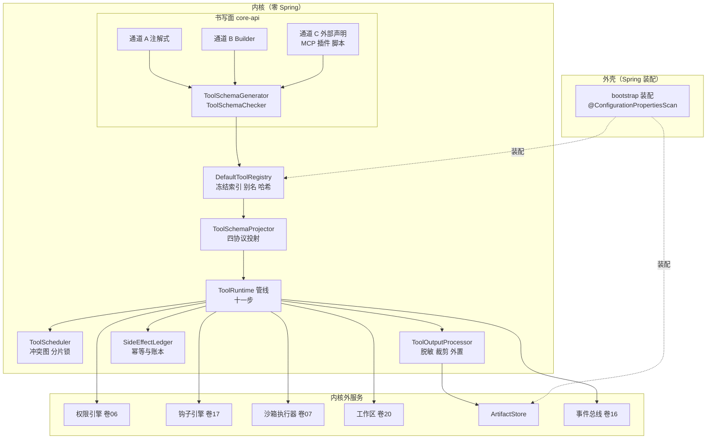
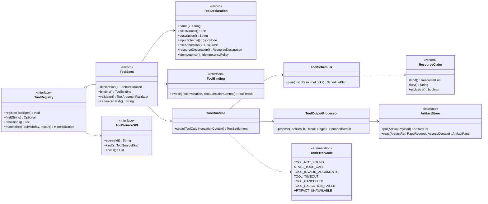
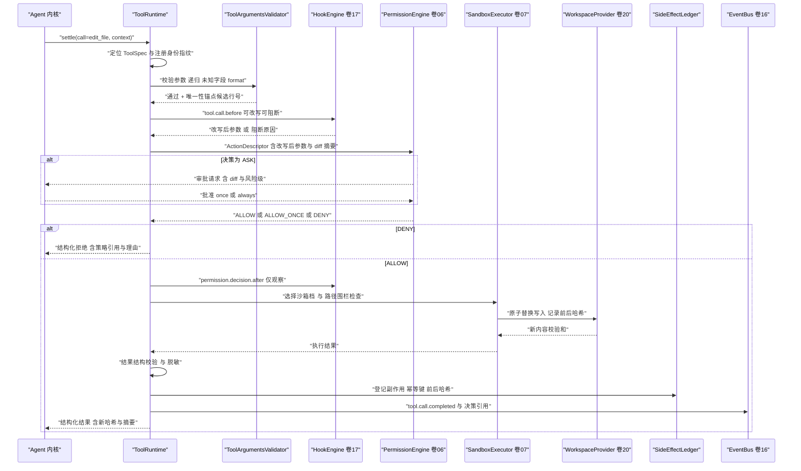
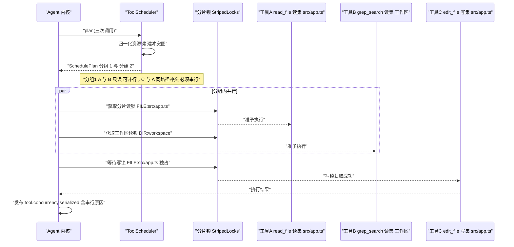
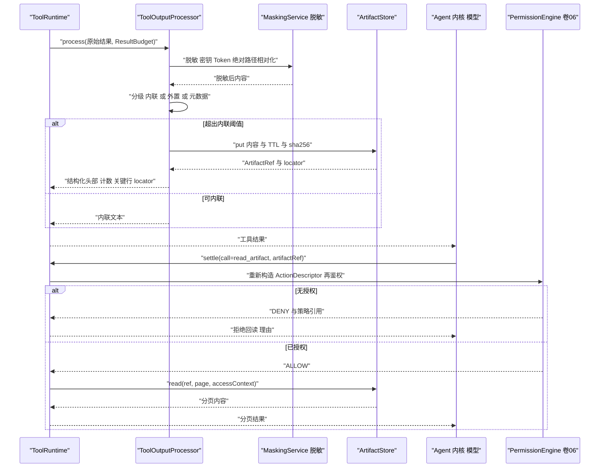
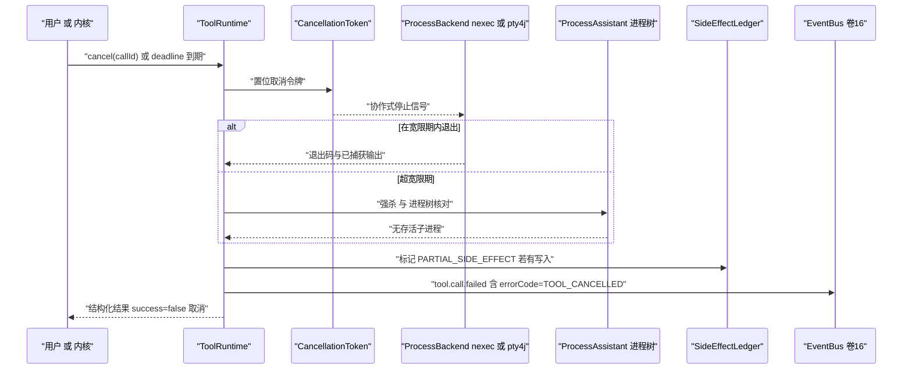
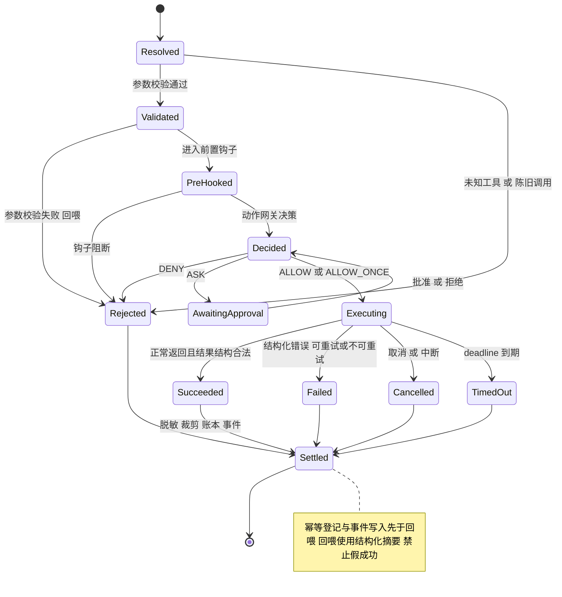

# 卷 05 实现技术方案：工具系统（Tool Runtime）

> 定位：Phase B（怎么做）——把 Phase A 卷 05 的选定分支（D-TOOL-1…12）落为可施工的内核契约、执行管线、调度算法与工具族账本。
> 上游契约：`docs/harness/05-tool-system.md`（唯一事实源）、`docs/harness/17-hooks-system.md`（钩子点与顺序）、`docs/design/tool-system-design.md` v2.0（D37–D45 书写面接缝）。
> 竞品证据：`research/competitors/02-opencode.md`、`03-codex.md`、`04-deepseek-harness.md`、`05-minimax-cli.md`、`08-gemini-cli.md`（下文引用统一用 `[E1]`/`[E2]` 证据分级）。
> 落点铁律：`common ← core-api ← core-agent / core-tool / core-model / core-implementation`，`domain → application → interfaces → bootstrap`；**core 系列零 Spring**。

---

## 1. 实现目标与范围

### 1.1 目标

1. 三通道（注解式 / Builder / 外部声明）产出一**同构** `ToolSpec`，成为工具声明、绑定、校验的单一事实源（D-TOOL-1、D-TOOL-11、D37）。
2. 执行管线**固定十一序**（十步主干 + 后置钩子），任何来源的副作用不得旁路（D-PERM-3 与卷 06 动作网关联动）；十一步为管线**主干粒度**，与卷 17 §4.3 的十二步**全序表**同源——`sandbox.exec.before` 嵌在步骤 6 内部、`tool.result.before/after` 嵌在步骤 8 内部（映射注见 §3.6.3），两处任一处调整必须同步修改另一处。
3. 资源读写集声明 + 冲突图调度，实现「读并行、写串行、跨工作区并行、网络限流」（D-TOOL-4）。
4. 结果分级（内联 / 结构化摘要 + 外置引用 / 二进制仅元数据）与**再读鉴权**闭环（D-TOOL-5）。
5. 内置工具族 40+ 逐个落地，每个工具具备「描述 + 示例 + 常见错误」三件套与独立安全约束（D-TOOL-7、卷 05 §10）。

### 1.2 不解决

- 权限判定算法与审批编排：卷 06 实现方案 `06-permission-system-impl.md`（本卷只定义**插入点**与 `ActionDescriptor` 构造职责）。
- 沙箱隔离实现（卷 07）、工作区/文件系统后端（卷 20）、MCP 协议与传输（卷 09）、钩子匹配与阻断（卷 17）。
- 具体索引实现（卷 11）与语义检索模型（卷 02）；工具只消费索引 SPI。

### 1.3 上游 / 下游依赖

| 方向 | 依赖 | 契约 |
| --- | --- | --- |
| 上游 | 卷 01 内核（会话运行时、虚拟线程池、取消源） | `CancellationToken`、`SessionHandle`、`BudgetLedger` |
| 上游 | 卷 02 模型网关 | `ToolSchemaProjector`（四协议投射）、`ToolCall` 原始参数 |
| 上游 | 卷 17 钩子引擎 | `HookPoint.TOOL_CALL_BEFORE / PERMISSION_DECISION_AFTER / TOOL_RESULT_BEFORE / TOOL_CALL_AFTER` |
| 下游 | 卷 06 权限引擎 | `ActionDescriptor` → `PermissionDecision` |
| 下游 | 卷 07 沙箱执行器 | `SandboxRequirement` → `ExecutionLease` |
| 下游 | 卷 03 上下文引擎 | `ArtifactRef` 与预算裁剪；`read_artifact` 回读 |
| 下游 | 卷 16 事件总线 | `tool.call.*` / `tool.artifact.created` / `tool.concurrency.serialized` |

### 1.4 模块落点（卷 27 §4.1 权威名；v1 列为迁移来源）

| 内容 | 目标模块（卷 27 §4.1/§4.3） | v1 仓模块（迁移来源） | 允许依赖 |
| --- | --- | --- | --- |
| `Tool` / `ToolSpec` / `ToolDeclaration` / `ToolBinding` / `ToolHandler` / `ToolParameter` / `ToolResult` / `ResourceClaim` / SPI | `harness-contract`（`tool` 包） | `open-coding-core-api` | 纯契约 + `slf4j-api` 门面；**零 Jackson**（JSON 经 `JsonCodec` 端口注入，卷 27 R1；v1 仓现存 jackson 依赖随迁移去除） |
| `ToolSchemaGenerator` / `ToolSchemaChecker` / `AnnotatedToolFactory` / `ToolSchemaBuilder` | `harness-kernel/kernel-tool`（`authoring` 子包，纯逻辑） | `open-coding-core-api`（`tool/authoring`，D44） | `harness-contract`（同上零 Jackson，产物为 schema 树 + 端口序列化） |
| `DefaultToolRegistry` / `ToolSchemaProjector` 实现 / `ToolArgumentsValidator` / `ToolOutputProcessor` | `harness-kernel/kernel-tool` | `open-coding-core-implementation` | `harness-contract` |
| `ToolRuntime`（管线）/ `ToolScheduler`（冲突图）/ `SideEffectLedger` / `ArtifactStore` 抽象 | `harness-kernel/kernel-tool`（卷 27 §4.3「执行管线」落点） | `open-coding-core-agent`（v1 放置，迁移期收敛） | `harness-contract` |
| 内置工具族（nexec / pty4j / JDK 文件 API / 索引 SPI 消费） | `harness-kernel/kernel-tool`（命令执行实现经端口下沉 `harness-platform/platform-sandbox`） | `open-coding-core-tool` | `harness-contract`、nexec、pty4j |
| 外置结果存储实现（文件系统 / 对象存储） | `harness-platform/platform-runtime-store`（对象存储可选）+ `harness-platform/platform-workspace`（本地文件） | `open-coding-infrastructure` | `harness-contract` |
| 工具调用审计投影（`oc_tool_call` / `oc_tool_result`） | `harness-platform/platform-persistence` | `open-coding-domain` | `harness-contract` |

> 模块名桥接（R07 收敛）：v1 名 `open-coding-core-*` → `harness-kernel/*`，`open-coding-domain`/`-infrastructure` → `harness-platform/*`，
> `open-coding-interfaces` → `harness-host/*`（对照表见 impl/01 §1.4 与卷 27 §4.3）。**构建与 `-pl` 选择器只允许目标名**；v1 列仅用于迁移期对账。

### 落地核对（R07：模块 / 顺序 / 批次 / 门禁 / I-* 落点）

- **模块（卷 27 §4.1 权威名）**：`harness-contract`（工具契约）+ `harness-kernel/kernel-tool`（注册表/校验/管线/调度/账本/内置工具族）+ `harness-platform/platform-{sandbox,workspace,runtime-store,persistence}` + `harness-host/host-bootstrap`（装配）。`harness-core` 为别名，禁作路径。
- **实施顺序（卷 27 §4.5）**：第 4 步「工具运行时（read/edit/command 三工具）」，依赖第 2 步（事件写入端口）与第 3 步（模型网关的 `ToolSchemaProjector` 契约）。**与 impl/17 的钩子互引为契约先行**：`HookPoint.TOOL_CALL_BEFORE / PERMISSION_DECISION_AFTER / TOOL_RESULT_BEFORE / TOOL_CALL_AFTER` 枚举与决策 record 在第 1/2 步入 `harness-contract`，`kernel-tool` 只发布/消费端口（默认空实现为 no-op）；impl/17 的完整四形态执行在第 11 步（沙箱）后落地——**不构成循环**。
- **数据批次（卷 27 §4.4）**：`oc_tool_call`、`oc_tool_result`、`oc_tool_registration`、`oc_tool_artifact`、`oc_tool_side_effect` → **B2**（工具调用/结果 + 副作用账本），依赖 B1 的 `oc_session`/`oc_event_log`。
- **门禁映射（卷 27 §4.6）**：kernel-tool 单测 → 「单元测试 + 覆盖率门」；`kernel-agent` 协作面 → 「单元测试」；host-bootstrap 链路 → 「集成测试」；审核 `tool.*` 事件 Schema → 「契约测试」；资源冲突矩阵与并发等价性 → 「性能基准（抽样）」。
- **I-* 落点**：I-TOOL-1 → `harness-contract`（`ToolSpec`/`ToolDeclaration`）+ `kernel-tool`（`ToolSchemaGenerator`/`AnnotatedToolFactory`）；I-TOOL-2 → `kernel-tool`（`ToolScheduler` 冲突图 + 分片锁）；I-TOOL-3 → `kernel-tool`（`ArtifactStore` 抽象）+ `platform-workspace`/`platform-runtime-store`（实现）；I-TOOL-4 → `platform-sandbox`（`ProcessBackend`：nexec 默认 / pty4j / ProcessBuilder 兜底）；I-TOOL-5 → `host-bootstrap`（装配计划）+ `kernel-tool`（`DefaultToolRegistry` 模式子集与按需激活）。

---

## 2. 功能需求清单（REQ-TOOL）

### 2.1 需求表

| ID | 需求描述 | 来源 | 优先级 | 验收要点 |
| --- | --- | --- | --- | --- |
| REQ-TOOL-1 | 三通道产出同一 `ToolSpec`；同一工具经三通道注册的 `canonicalHash()` 一致 | 卷 05 D-TOOL-1、§8 DoD-1 | P0 | 三通道哈希比对用例（含注解 / Builder / 外部 JSON 声明） |
| REQ-TOOL-2 | 注册期 Fail-Fast：命名、类型映射、描述三件套、嵌套深度、schema 大小，全部在启动期拒绝 | 卷 05 REQ-TOOL-1、D-TOOL-2、§8 DoD-2 | P0 | 每类违规一条拒绝用例；错误信息含来源 `sourceId` |
| REQ-TOOL-3 | 单一 canonical schema + 四协议投射 + 发送侧降级，运行期强校验兜底 | 卷 05 D-TOOL-2、D37/D38、§8.2 | P0 | Gemini 剥 `additionalProperties` 用例；非法参数回喂用例 |
| REQ-TOOL-4 | 注解书写面「签名即 schema」，递归类型矩阵覆盖嵌套 record / `List<T>` / `T[]`；不支持类型注册期报错并给替代写法 | 卷 05 §4.1、D41/D42/D45 | P0 | 26 类类型映射矩阵逐格用例；`Map`/`Set`/`Optional` 拒绝用例 |
| REQ-TOOL-5 | 参数校验失败**不抛异常**，转结构化错误回喂模型自纠；同一 toolCall 连续 N 次失败升级 ERROR | 卷 05 D-TOOL-9、D38；opencode `settle` 先 `decodeUnknown` 再执行 `[E1] packages/core/src/tool/tool.ts` | P0 | `INVALID_TOOL_ARGUMENTS` 回喂用例 + 阈值升级用例 |
| REQ-TOOL-6 | 执行管线固定顺序：解析 → 校验 → 前置钩子 → 权限 → 权限后钩子 → 沙箱/工作区 → 执行 → 结果处理 → 幂等与账本 → 事件 → 后置钩子 | 卷 05 §4.2 顺序铁律、卷 17 §4.3 | P0 | 顺序断言测试（管线拦截器记录步序） |
| REQ-TOOL-7 | 改写类钩子**先于**权限决策；权限按**改写后**的最终形态鉴权；权限后仅允许观察类钩子 | 卷 05 §4.2① ② | P0 | 「钩子把 `ls` 改写为 `rm -rf`」必须按 R4 判定（安全用例） |
| REQ-TOOL-8 | 结果脱敏**先于**裁剪与外置；外置内容继承脱敏结果 | 卷 05 §4.2③ | P0 | 含 `api_key` 的命令输出外置后回读仍为掩码 |
| REQ-TOOL-9 | 幂等登记与事件写入**先于**回喂（先落账再回喂） | 卷 05 §4.2④、D-TOOL-10 | P0 | 中断注入用例：回喂前崩溃不产生重复副作用 |
| REQ-TOOL-10 | 工具声明资源读写集；调度器据冲突图决定并行/串行（读并行、同路径写串行、跨工作区并行） | 卷 05 D-TOOL-4、§4.4 | P0 | 冲突矩阵每格并发测试 + 丢更新反例证明串行有效 |
| REQ-TOOL-11 | 外发网络类工具受全局并发上限与域名策略约束 | 卷 05 §4.4、卷 05 §4.3 网络族 | P1 | 并发上限压测；超限排队而非拒绝 |
| REQ-TOOL-12 | 结果分级：文本 < 4k token 内联；≥ 4k 外置 + 结构化头部；二进制仅元数据 + 媒体引用 | 卷 05 D-TOOL-5、§4.6 | P0 | 阈值边界用例（3999 / 4000 / 4001 token） |
| REQ-TOOL-13 | 外置结果可经 `read_artifact` 分页回读，且**再读时重新鉴权**（不继承首次授权） | 卷 05 §8 DoD-6 | P0 | 撤销授权后回读被拒用例 |
| REQ-TOOL-14 | 命令类结果结构：退出码 + 尾部 N 行 + 错误摘录；完整日志外置并支持 `read_process_output` 分页 | 卷 05 §4.6；opencode `bash` 上限常量与截断标记 `[E1] packages/core/src/tool/bash.ts` | P0 | 1MB 输出用例：模型可见量与完整日志分离 |
| REQ-TOOL-15 | 超时 / 取消 / 中断三级传播：内核取消 → 工具 → 子进程；子进程强杀有宽限期，结果标记为 `CANCELLED` 而非成功 | 卷 05 §4.2 步骤 7；opencode `forceKillAfter` `[E1]` | P0 | 取消注入用例：无孤儿进程、无假成功 |
| REQ-TOOL-16 | 超过阈值的长任务转后台任务（返回句柄，可选等待/轮询/通知） | 卷 05 D-TOOL-3、§10 默认决策 | P1 | 句柄生命周期与 `kill_process` 用例 |
| REQ-TOOL-17 | 结构化错误：类别 + 人类可读信息 + 修复建议 + 可重试性 + 相关引用（相似路径/相似符号） | 卷 05 D-TOOL-9、§8 DoD-7 | P0 | 10 类典型错误各一条「可修复建议」断言 |
| REQ-TOOL-18 | 同一工具同一错误连续 N 次触发策略（提示 → 换路 → 求援），N 与策略配置化 | 卷 05 D-TOOL-9；deepseek `guard/repeat-tool-reminder` 阈值 3/5/8 `[E1]` | P1 | 阈值触发事件与提示文案用例 |
| REQ-TOOL-19 | 只读工具结果缓存，键 = 参数指纹 + 工作区版本；缓存命中发 `tool.cache.hit` 事件 | 卷 05 D-TOOL-10 | P1 | 写后缓存失效用例（同参数二次读不得命中） |
| REQ-TOOL-20 | 写工具幂等键 + 副作用账本；会话中断重放不重复执行写操作 | 卷 05 D-TOOL-10、§8 DoD-8 | P0 | 重放用例：账本命中直接返回首次结果摘要 |
| REQ-TOOL-21 | 模式驱动工具子集 + 工具组按需激活；编码模式核心集 18–24 个 | 卷 05 D-TOOL-6、§4.3 注 | P1 | 各模式可见工具集快照测试 |
| REQ-TOOL-22 | 延迟加载 / 检索发现必须声明披露完整性（`COMPLETE` / `PARTIAL - n of m`），禁止静默截断目录 | 卷 05 D-TOOL-6；deepseek `catalogBudget` 轮转与完整性声明 `[E1]` | P2 | 预算不足时指令文本含 `PARTIAL` 用例 |
| REQ-TOOL-23 | 内置工具族按 §2.2 账本落地（40+），每工具含参数校验与行为测试 | 卷 05 §4.3、§8 DoD-3 | P0 | 账本逐行对应用例文件 |
| REQ-TOOL-24 | 危险 Git 操作（`reset --hard`、`push --force`、`clean -fdx`）风险级提升至 R4 | 卷 05 §4.3 版本控制行 | P0 | 风险标注断言 + 审批插入点断言 |
| REQ-TOOL-25 | 外部工具（MCP / 插件 / 脚本 / HTTP）经同一注册与同一管线，共享权限与审计 | 卷 05 D-TOOL-11 | P0 | MCP 工具触发审批用例（与内置路径相同） |
| REQ-TOOL-26 | 陈旧调用防护：`materialize` 快照注册身份，身份不匹配返回 `STALE_TOOL_CALL` 且**不执行** handler | opencode `Stale tool call` 不变式 `[E1] specs/v2/tools.md` | P1 | 注册热替换后旧调用被拒用例 |
| REQ-TOOL-27 | 工具可见性裁剪：仅当规则为「全资源 deny」时整条隐藏定义，避免暴露不可用工具 | opencode `whollyDisabled` `[E1] packages/core/src/tool/registry.ts` | P1 | 部分路径 deny 时工具仍可见但调用被拒 |
| REQ-TOOL-28 | 补丁解析防御：空 pattern、`pattern.len() > lines`、匹配三级降级（精确 → 忽略行尾空白 → 忽略首尾空白） | codex `seek_sequence` 越界修复与 eof 回推 `[E1] codex-rs/apply-patch/src/seek_sequence.rs` | P0 | 三类畸形补丁用例不得抛未捕获异常 |
| REQ-TOOL-29 | 别名治理：兼容映射表保留 ≥ 2 版本，映射变更生成事件；模型幻觉名给出相似名候选 | 卷 05 §10、卷 05 §4.2 步骤 1 | P2 | 幻觉名回喂含候选列表用例 |
| REQ-TOOL-30 | 大仓检索优先走索引（卷 11），索引缺失自动降级为精确扫描并留痕 | 卷 05 REQ-TOOL-6、§4.3 搜索行 | P1 | 降级事件 `tool.search.degraded` 断言 |
| REQ-TOOL-31 | 工具注册与应用工具分层：注册表不做权限决策，权限断言由工具/管线编排；输出尺寸由运行时统一约束 | opencode「registry 不注入 `assertPermission`」+ 输出边界归 `ToolOutputStore` `[E1] specs/v2/tools.md` | P0 | 架构测试：core-tool 不得引用权限引擎实现类型 |

### 2.2 内置工具族逐个清单（参数与安全约束）

> 约定：`路径` 类参数默认相对工作区根解析；`command` 字符串一律经 AST 解析后进入风险判定（见卷 06 实现方案 §3.6）；所有工具强制 `additionalProperties: false`。

**文件读取族**

| 工具 | 关键参数 | 安全约束 |
| --- | --- | --- |
| `read_file` | `path`（必填）、`beginLine`、`endLine`、`maxBytes`、`encoding` | 拒绝绝对路径与符号链接逃逸（解析后必须落在工作区根内）；超大文件按行区间分页；二进制返回元数据 + 媒体引用 |
| `list_dir` | `path`、`depth`（默认 1，上限 3）、`cursor` | 目录优先 + 字母序；单层上限 2000 项，超限分页 |
| `file_stat` | `path` | 仅返回大小 / mtime / 类型 / 可执行位；不递归 |

**文件写入族**

| 工具 | 关键参数 | 安全约束 |
| --- | --- | --- |
| `write_file` | `path`、`content`、`mode`（`create` / `overwrite`） | `overwrite` 必须携带写前哈希（防丢更新）；写前生成 diff 供审批（REQ-TOOL-6 步骤 4） |
| `edit_file` | `path`、`oldText`、`newText`、`replaceAll`（默认 false） | **唯一性锚点校验**：`oldText` 命中 0 处或多处直接失败并返回候选上下文；`replaceAll` 需显式 true |
| `apply_patch` | `patch`（unified diff 子集） | 逐 chunk 校验：行号 + 上下文 + 目标文件哈希；失败即整份回滚（不部分应用） |
| `move_path` | `from`、`to`、`overwrite` | 目标存在且 `overwrite=false` → 拒绝；跨设备回退为复制 + 删除并留痕 |
| `delete_path` | `path`、`recursive` | `recursive=true` 需 R4 审批；拒绝删除工作区根与 `.git` 目录 |

**搜索族**

| 工具 | 关键参数 | 安全约束 |
| --- | --- | --- |
| `glob_files` | `pattern`、`root`、`limit`、`includeIgnored` | 默认尊重 `.gitignore`；`includeIgnored=true` 时 `.env*`、密钥文件仍需独立审批 |
| `grep_search` | `pattern`（正则）、`root`、`glob`、`contextLines`、`maxMatches`、`caseSensitive` | 正则编译失败 → 结构化错误含修正建议；命中超限转外置（REQ-TOOL-12） |
| `find_symbol` | `symbol`、`kind`（`class`/`method`/`field`）、`limit` | 走卷 11 符号索引；索引缺失降级并留痕（REQ-TOOL-30） |
| `semantic_search` | `query`、`topK`（上限配置化）、`root` | 需索引可用，否则 `UNSUPPORTED_CAPABILITY`，**不做静默文本降级** |

**命令族（nexec / pty4j）**

| 工具 | 关键参数 | 安全约束 |
| --- | --- | --- |
| `run_command` | `command`、`cwd`、`timeoutMs`（上限配置化）、`envKeys` | 默认同步执行；经沙箱策略选档；`envKeys` 白名单继承，默认排除 `*KEY*`/`*SECRET*`/`*TOKEN*` |
| `start_process` | `command`、`cwd`、`detach`（默认 true）、`gracefulSignal` | 返回进程句柄（job 对象）；后台任务计入工作区进程配额 |
| `pty_session` | `command`、`cols`、`rows`、`sessionKey` | 交互会话绑定会话 ID，闲置超时自动回收；同一 `sessionKey` 串行 |
| `read_process_output` | `handle`、`cursor`、`maxBytes` | 只读已登记句柄；读取不触发新副作用 |
| `kill_process` | `handle`、`signal`、`forceAfterMs` | 先优雅信号，超宽限期强杀（对齐 `forceKillAfter` `[E1]`）；杀后核对进程树无孤儿 |

**版本控制族**

| 工具 | 关键参数 | 安全约束 |
| --- | --- | --- |
| `git_status` / `git_diff` / `git_log` | `repo`、`path`、`range`、`staged` | 只读；`git_diff` 大 diff 转外置 |
| `git_commit` | `repo`、`message`、`paths`、`amend`（默认 false） | `amend` 提升风险级；提交前必须校验 paths 归属当前工作区 |
| `git_checkout` / `git_stash` | `repo`、`ref`、`paths` | 声明 Git 索引锁（`workspaceLock`），与其它 git 命令串行 |
| `git_reset` | `repo`、`mode`、`ref` | `mode=hard` 风险级 R4，强制审批且**禁止规则沉淀**（仅 ALLOW_ONCE） |
| `git_push` | `repo`、`remote`、`refspec`、`force` | `force=true` 风险级 R4；目标远端经域名策略校验 |

**代码质量族**

| 工具 | 关键参数 | 安全约束 |
| --- | --- | --- |
| `run_tests` | `command`（可选，默认项目探测）、`paths`、`timeoutMs` | 结果结构化（通过/失败/跳过 + 失败用例与位置）；超时按 R2 处理 |
| `run_build` / `run_linter` / `format_code` | `target`、`fix`（默认 false） | `fix=true` 视为写操作，声明写集 |

**任务与计划族（与卷 14/15 同源模型）**

| 工具 | 关键参数 | 安全约束 |
| --- | --- | --- |
| `todo_write` | `items[]`（`id`/`text`/`status`） | 仅会话状态；子 Agent 默认 deny（对齐 opencode `todowrite` deny `[E1]`） |
| `task_create` / `task_update` / `task_list` | `title`、`parentId`、`status`、`evidence` | 状态流转校验由卷 14 状态机负责，工具只做参数映射 |
| `plan_update` / `goal_update` | `planId` / `goalId`、`patch` | 元操作，无文件副作用；变更写入事件流 |
| `ask_user` | `question`、`options[]`、`defaultOption` | 无界面形态降级为拒绝（非交互 fail-closed） |
| `delegate_subagent` / `team_message` | `agentRole`、`task`、`budget` | 受嵌套深度配置约束；子会话继承父会话 deny 规则 |

**检索与记忆族**

| 工具 | 关键参数 | 安全约束 |
| --- | --- | --- |
| `kb_search` | `query`、`sourceIds`、`topK` | 只读；结果必须带引用（文件 + 行/页） |
| `memory_recall` / `memory_write` | `key`、`scope`、`content` | 记忆写入受策略约束（卷 10）；敏感内容不落记忆 |
| `read_artifact` | `artifactRef`、`cursor`、`maxBytes` | **再读重新鉴权**（REQ-TOOL-13） |
| `history_search` | `query`、`sessionIds`、`range` | 跨会话检索需显式授权标记 |

**网络族**

| 工具 | 关键参数 | 安全约束 |
| --- | --- | --- |
| `web_fetch` | `url`、`format`（`markdown`/`text`/`html`）、`timeoutMs`、`maxBytes` | 域名白名单 + 协议仅 `https`；响应上限配置化；重定向链逐跳校验 |
| `web_search` | `query`、`topK`、`recency` | 经搜索 provider 配置；返回结果附来源 URL |
| `download` | `url`、`destPath` | 目标路径归属校验 + 大小上限；落盘视为写操作 |

**多模态族**

| 工具 | 关键参数 | 安全约束 |
| --- | --- | --- |
| `view_image` | `path` 或 `artifactRef`、`detail`（`low`/`high`） | 仅模型能力支持视觉时可用，否则 `UNSUPPORTED_CAPABILITY`（不做静默降级，D33） |
| `extract_document` | `path`、`pages`、`format` | PDF / 表格 / 字幕按处理器白名单；解压炸弹防护（页数与时延上限） |
| `screenshot` | `target`、`viewport` | 前沿能力；截图内容按媒体引用处理，不内联二进制 |

**诊断族**

| 工具 | 关键参数 | 安全约束 |
| --- | --- | --- |
| `diagnose_env` | `scope`（`toolchain`/`network`/`workspace`） | 只读；输出脱敏（路径按工作区相对化） |
| `capability_report` / `context_report` | 无 | 只读；支撑可解释性（产品铁律 5） |

### 2.3 三通道统一契约视图

| 通道 | 来源 | 声明 | 绑定 | 校验 | 治理 |
| --- | --- | --- | --- | --- | --- |
| A 注解式 | 内置（`core-tool`） | `@Tool`/`@ToolParam` 反射生成（D39/D41） | 框架生成 handler + 绑定计划 | 生成 schema 校验器 | 注册期 Fail-Fast（REQ-TOOL-2） |
| B 显式 Builder | 内置复杂工具、插件 | `ToolSchemaBuilder` 手写 canonical schema | 手写 `ToolHandler` 或 `Tool.of` | 同一校验器 | 同上 + 描述三件套校验 |
| C 外部声明 | MCP / 插件清单 / 脚本 / HTTP | 运行期 JSON Schema 声明 | 协议适配器（`McpToolBinding` 等） | 投射前先过 `ToolSchemaChecker`，不合格拒绝注册 | 来源签名 + 版本 + 权限声明 |

**统一视图不变量**：三条通道产出的 `ToolSpec` 在注册表内**不可区分**——调度、权限、审计、结果处理全部只依赖 `ToolSpec`，不依赖来源类型（D-TOOL-11）。

---

## 3. 技术方案选型（M×N 比选）

评分口径沿用 README §4：F 功能完整度 30%、U 用户体验 20%、S 落地稳定性 25%、M 企业级可维护性 25%，满分 10，加权总分 100。

### 3.1 维度一：书写面与注册通道落地方式（I-TOOL-1）

| 分支 | 描述 | F | U | S | M | 加权 |
| --- | --- | --- | --- | --- | --- | --- |
| B1 仅运行期反射扫描 | 启动扫包 + 反射生成 | 7 | 8 | 7 | 6 | 70.5 |
| B2 仅显式 Builder | 全部手写 schema | 6 | 6 | 9 | 7 | 69.5 |
| **B3 三通道 + 启动期一次生成 + 深拷贝冻结 + 内容哈希去重** | A 注解 / B Builder / C 外部声明，统一 `ToolSpec`，注册后只读 | 9 | 8 | 9 | 9 | **88.0** |

**被放弃分支代价**：B1 无法表达外部工具且启动扫描易漏（漏注册在运行期才暴露）；B2 书写成本高、描述质量参差。
**回退触发**：若注解生成器在增量编译 / GraalVM 场景出现反射元数据缺失（Fail-Fast 误报），则对受影响工具切 B2 手写 schema（通道 B 始终可用，不推翻架构）。

### 3.2 维度二：资源冲突调度实现（I-TOOL-2）

| 分支 | 描述 | F | U | S | M | 加权 |
| --- | --- | --- | --- | --- | --- | --- |
| B1 全局互斥 | 一把大锁 | 4 | 5 | 9 | 8 | 62.0 |
| B2 读写锁二分（并行/独占） | 对齐 codex `RwLock<()>` `[E1]` | 6 | 7 | 9 | 6 | 70.0 |
| B3 纯拓扑调度（自建 DAG） | 全图依赖求解 | 9 | 8 | 5 | 6 | 72.5 |
| **B4 资源声明 + 冲突图 + 分片锁（striped locks）+ 调用序号定序** | 按资源键分片，冲突即串行；跨工作区天然并行 | 9 | 8 | 8 | 9 | **85.5** |

**被放弃分支代价**：B1 读也被串行，交互时延不可接受；B2 只能表达「可并行/不可并行」，无法解释冲突原因（`tool.concurrency.serialized` 无依据）；B3 图求解复杂、故障面大，且资源键仍需归一化。
**回退触发**：若分片锁在 > 64 并发工具调用下出现锁竞争尾延迟超标（P95 > 50ms），降级 B2（读写锁二分）保底，同时保留资源声明用于解释与审计。

### 3.3 维度三：结果外置介质与回读协议（I-TOOL-3）

| 分支 | 描述 | F | U | S | M | 加权 |
| --- | --- | --- | --- | --- | --- | --- |
| B1 仅内联截断 | 简单，丢信息 | 4 | 5 | 9 | 6 | 61.5 |
| B2 工作区内受管目录 | 与工作区同生命周期 | 8 | 7 | 9 | 7 | 78.5 |
| **B3 抽象 `ArtifactStore` + 本地受管目录默认实现 + 对象存储可选实现 + `oc-artifact://` 定位符** | 一处协议、双实现 | 9 | 8 | 8 | 9 | **85.5** |

**被放弃分支代价**：B1 无法支撑模型回读，导致重复执行昂贵命令；B2 在远程工作区形态（卷 20）失效。
**回退触发**：对象存储实现不可用（网络/凭证故障）→ 自动回落本地受管目录并记 `tool.artifact.fallback` 事件；由配置 `open-coding.tool.artifacts.mode=local|object|auto` 控制。

### 3.4 维度四：命令执行后端（I-TOOL-4）

| 分支 | 描述 | F | U | S | M | 加权 |
| --- | --- | --- | --- | --- | --- | --- |
| B1 JDK `ProcessBuilder` | 零依赖 | 6 | 6 | 9 | 6 | 67.5 |
| B2 仅 nexec | 跨平台一致 | 7 | 7 | 8 | 7 | 73.0 |
| **B3 分层：`ProcessBackend` 抽象 → nexec 默认（一次性命令）+ pty4j（交互会话）+ ProcessBuilder 兜底** | 一抽象三实现 | 9 | 8 | 8 | 9 | **85.5** |

**被放弃分支代价**：B1 在 Windows 上 PTY 与进程树管理能力不足（孤儿进程风险）；B2 缺交互式 TUI 支撑（`pty_session` 不可实现）。
**回退触发**：nexec 在目标平台探测失败（卷 07 能力探测返回 `partial`）→ 该工作区自动降级 B1 并禁用 `pty_session`（能力报告显式标注不可用）。

### 3.5 维度五：工具集装配与延迟加载（I-TOOL-5）

| 分支 | 描述 | F | U | S | M | 加权 |
| --- | --- | --- | --- | --- | --- | --- |
| B1 全量暴露 | 简单，上下文昂贵 | 5 | 5 | 9 | 6 | 62.0 |
| **B2 模式子集 + 工具组按需激活 + 检索发现（含完整性声明）** | 核心 18–24，长尾可检索 | 9 | 8 | 8 | 8 | 83.0 |
| B3 仅检索发现（无静态子集） | 极端省 token | 6 | 4 | 6 | 6 | 56.0 |

**被放弃分支代价**：B1 工具清单本身吃掉上下文并降低选择准确率（卷 05 D-TOOL-6 淘汰理由）；B3 模型必须先检索再调用，短任务链路变长。
**回退触发**：若检索发现命中率（被检索工具实际被调用比例）连续低于阈值（配置 `open-coding.tool.discovery.effective-rate-floor`），对该工具组回退为静态激活。

### 3.6 选定方案详设

#### 3.6.1 Schema 生成与递归类型矩阵（ToolSchemaGenerator，D41/D45）

| Java 类型（含嵌套） | JSON Schema 产物 | 绑定方式 | 上限 |
| --- | --- | --- | --- |
| `String` / `boolean` / `int` / `long` / `double` | 标量 + `description` | 强类型 getter | — |
| `LocalDate` | `string` + `format: "date"` | JSR-310 反序列化 | — |
| `LocalDateTime` / `Instant` / `OffsetDateTime` / `ZonedDateTime` | `string` + `format: "date-time"` | JSR-310 | — |
| 嵌套 `record` | `object`（`additionalProperties: false`） | `JsonCodec` 端口转换（内核零 Jackson，卷 27 R1） | 深度 ≤ 5 |
| `List<T>` / `T[]`（`T` 为可映射类型） | `array` + `items` | 递归绑定计划 | 深度 ≤ 5 |
| `enum`（含 `code`/`desc`） | `string` + `enum`（code 集合） | 按 code 反查枚举 | 枚举值 ≤ 64 |
| `Optional<T>` / `Map` / `Set` / `Duration` / `LocalTime` | 不支持 | 注册期 Fail-Fast + 替代写法建议 | — |

**不变量**：`required ⊆ properties`；`enum` 仅允许挂在 `string` 上；`additionalProperties` 必须显式 `false`；根必须 `type: "object"`；禁止 `$ref`/`$defs`/`oneOf`（canonical 子集，对齐 `docs/design/tool-system-design.md` §8.1）。

#### 3.6.2 参数校验器（ToolArgumentsValidator，D38）判定顺序

1. `required` 缺参 → 收集；2. 未知字段（`additionalProperties:false`）→ 收集；3. 类型严格匹配（数字不做字符串宽容）；4. `enum` 越界；5. `format` 可解析性（`date` 按 ISO_LOCAL_DATE；`date-time` 接受带/不带偏移）；6. 递归对象/数组（深度与节点数上限）；7. 业务级语义预检（路径存在性、目标可写、正则可编译）。
产出为**错误列表**（字段路径 + 期望 + 实际），整体转 `ToolResult(success=false, errorCode=TOOL_INVALID_ARGUMENTS)` 回喂，**不抛异常**；同一 toolCall 连续失败次数达配置阈值（默认 3）升级为 `log.error` 并附带一次模型提示。

#### 3.6.3 执行管线十一步（不可跳序）

| 序 | 步骤 | 实现要点 | 失败行为 |
| --- | --- | --- | --- |
| 1 | 定位与解析 | 名称 → alias → 指纹；幻觉名给相似候选（编辑距离 + 语义索引） | 结构化错误含候选 |
| 2 | 参数校验 | §3.6.2 | 回喂校验错误 |
| 3 | 前置钩子 `tool.call.before` | 可阻断、可改写（字段白名单） | 阻断 → 回喂原因 |
| 4 | 权限决策（动作网关） | 用**改写后**参数构造 `ActionDescriptor` | DENY → 回喂；ASK → 审批 |
| 5 | 权限后钩子 `permission.decision.after` | 仅观察（记录/通知） | 失败仅告警 |
| 6 | 沙箱与工作区路由 | `SandboxRequirement` → `ExecutionLease`；解析目标工作区与路径围栏 | 不可用 → 显式错误 + 降级建议 |
| 7 | 执行 | 虚拟线程 + deadline；输出流限量；取消令牌传播 | 超时/取消 → 结构化结果（非成功） |
| 8 | 结果处理 | 结果钩子（白名单）→ 结构校验 → **脱敏** → 裁剪/外置 | 结构不符 → 结构化错误 |
| 9 | 幂等与账本 | 写工具记副作用账本（幂等键 + 前后哈希）；只读工具写缓存 | 账本写失败 → 中止回喂（不静默） |
| 10 | 事件与审计 | `tool.call.*` + 决策引用 + 改写 diff | 事件失败仅告警 |
| 11 | 后置钩子 `tool.call.after` | 观察/通知/格式化 | 失败仅告警 |

**与卷 17 §4.3 十二步全序表的映射（同一管线，两种粒度，安全顺序由两表共同断言）**：

| 本表步骤 | 卷 17 §4.3 对应步 | 相对位置要点 |
| --- | --- | --- |
| 3 前置钩子 | 2 `tool.call.before` | 改写**先于**权限；改写后按最终形态重鉴权（REQ-TOOL-7） |
| 4 权限决策 | 3（重建 `ActionDescriptor`）+ 4（决策链） | 钩子不可放宽权限；`ask` 不由钩子产生 |
| 5 权限后钩子 | 5 `permission.decision.after` | **仅观察**（N3） |
| 6 沙箱与工作区路由 | 6 `sandbox.exec.before` + 7（执行） | 沙箱策略钩子嵌在本步骤内部、执行之前；只能**收窄** |
| 8 结果处理 | 8 `tool.result.before` → 9（结构校验/脱敏/裁剪）→ 10 `tool.result.after` | 结果**改写**钩子在脱敏前运行但只可见**字段级掩蔽视图**；**观察**类结果钩子在脱敏后（裁定见卷 17 实现方案 §4.7 R1；未声明 `sensitiveAccess` 时敏感字段为占位符） |
| 11 后置钩子 | 12 `tool.call.after` | 仅观察 |

> 顺序不变式：改写型钩子**先于**权限决策，沙箱强制在放行**之后**，权限决策之后只允许观察类钩子；任何一步被跳过即视为管线缺陷（顺序断言测试 REQ-TOOL-6/7 覆盖）。卷 17 的 `OrderContract` 断言与本表映射是同一顺序契约的两处表达，装配期只认卷 17 目录事实源（REQ-HOOK-22）。

#### 3.6.4 资源冲突调度算法

1. 归一化资源键：`FILE:<规范化绝对路径>`、`DIR:<路径>`、`GIT_INDEX:<repoId>`、`PROC:<工作区ID>`、`PORT:<工作区ID>:<port>`、`NET:<域名族>`、`SESSION:<sessionId>`、`WORKSPACE_LOCK:<工作区ID>`。
2. 生成声明：`exclusive=true` 的写/执行声明与任何冲突键构成互斥边。
3. 冲突图联通分量内按调用序号拓扑定序；`exclusive=false` 的读声明共享计数锁（读读并行）。
4. 跨工作区分量天然并行；网络类合并进一个令牌桶（并发上限配置化）。
5. 输出 `SchedulePlan`（分组 + 串行原因），串行发生发 `tool.concurrency.serialized`。

#### 3.6.5 结果外置与回读协议

- 阈值（配置化）：`max-inline-token`（默认 4000；对齐卷 05 §4.6）、`max-capture-bytes`（默认 1MiB）、`retention-days`（默认 7）。
- 外置产物：`ArtifactRef{artifactId, kind, bytes, lineCount, sha256, locator, createdAt, expiresAt}`；定位符形如 `oc-artifact://<sessionId>/<artifactId>`。
- 模型可见部分 = 结构化头部（类型、计数、范围、关键行 / 错误摘录）+ 定位符 + 回读提示。
- **回读鉴权**：`read_artifact` 作为独立工具进入同一管线，第 4 步重新构造 `ActionDescriptor`（资源 = artifact 的原始资源键），不继承首次授权（REQ-TOOL-13）。
- 保留失败（磁盘/配额）时**结算失败而非发出有损成功**（对齐 opencode 设计原则 `[E1] specs/v2/tools.md:157`）。

#### 3.6.6 超时 / 取消 / 中断

- 三级 deadline：工具级（`ToolDeclaration.timeoutMs`，上限配置化）→ 会话级预算 → 内核级总预算；取最小生效。
- 取消令牌为 `CancellationToken`（协作式）+ 强制中断兜底（`Future.cancel(true)`）；进程类工具先发 `gracefulSignal`，超过 `forceAfterMs` 强杀并核对进程树。
- 取消结果固定为 `TOOL_CANCELLED`（`success=false`），**绝不**产生部分成功语义；已发生的写副作用由账本标记 `PARTIAL_SIDE_EFFECT` 并在回喂中显式列出。

---

## 4. 总体架构图



---

## 5. 类图与 Java 21 签名



```java
/**
 * 工具契约：声明 + 绑定 + 校验的单一事实源（D-TOOL-1 / D37）。
 * 三条注册通道（注解 / Builder / 外部声明）产出本类型后，注册表内不可再区分来源。
 *
 * @param declaration 工具声明（name/description/schema/风险标注/资源需求）
 * @param binding     执行绑定（Java 方法 / 进程 / MCP 调用 / HTTP 调用）
 * @param validator   运行期参数校验器（预编译，线程安全）
 * @param canonicalHash 声明段规范化内容的 SHA-256，用于三通道一致性校验（REQ-TOOL-1）
 */
public record ToolSpec(ToolDeclaration declaration,
                       ToolBinding binding,
                       ToolArgumentValidator validator,
                       String canonicalHash) {

    /** 从声明与绑定构建并计算规范化哈希，注册期调用。 */
    public static ToolSpec of(ToolDeclaration declaration, ToolBinding binding) {
        ToolArgumentValidator validator = ToolArgumentValidator.compile(declaration.inputSchema());
        String hash = ToolSpecHasher.hash(declaration);
        return new ToolSpec(declaration, binding, validator, hash);
    }
}
```

```java
/**
 * 工具执行管线（内核唯一副作用入口，REQ-TOOL-6 / D-PERM-3）。
 * 顺序不可跳序：解析 → 校验 → 前置钩子 → 权限 → 权限后钩子 → 沙箱/工作区 →
 * 执行 → 结果处理 → 幂等与账本 → 事件 → 后置钩子。
 */
@Slf4j
public final class ToolRuntime {

    /**
     * 结算一次工具调用。
     *
     * @param call 模型产出的调用（名称、原始参数 JSON、调用序号、注册身份指纹）
     * @param context 调用上下文（会话、工作区、取消令牌、预算、权限模式）
     * @return 结算结果；失败与取消均以结构化结果返回，不向上抛出
     */
    public ToolSettlement settle(ToolCall call, InvocationContext context) {
        log.info("工具调用开始，tool={}, callId={}, sessionId={}",
                call.toolName(), call.callId(), context.sessionId());

        // 1. 定位与解析：注册身份不匹配即拒绝执行（REQ-TOOL-26）
        Materialization materialization = registry.materialize(context.visibility(), context.epoch());
        ToolSpec spec = materialization.resolve(call.toolName());
        if (spec == null) {
            return ToolSettlement.failure(ToolErrorCode.TOOL_NOT_FOUND, ToolErrorHints.similarNames(call.toolName()));
        }

        // 2~10 步由管线阶段对象依次执行（每步独立可测，顺序由 PipelinePlan 固化）
        ToolSettlement settlement = pipeline.execute(spec, call, context);

        log.info("工具调用结束，tool={}, status={}, 耗时ms={}, 外置={}",
                call.toolName(), settlement.status(), settlement.elapsedMillis(), settlement.externalized());
        return settlement;
    }
}
```

> 说明：`pipeline` 为 `PipelinePlan` 的注入实例（阶段列表固定顺序，构造期校验阶段唯一性）；权限引擎、钩子引擎、沙箱执行器均以接口注入，`core-agent` 不依赖其实现类（REQ-TOOL-31）。

> 异常命名分层（全套统一）：本域属内核层（`core-tool`，零 Spring），业务失败统一抛 `HarnessException(ErrorCode, message)`——工具管线的多数失败**不抛异常而是回喂结构化结果**（`TOOL_INVALID_ARGUMENTS` / `PERMISSION_DENIED` / `TOOL_CANCELLED` 等以 `ToolResult(success=false, errorCode=…)` 返回），仅在契约违约（注册期 schema 不合法、阶段顺序被破坏）与不可继续的内部错误上抛 `HarnessException`；外壳层（domain / application / interfaces）对应位置抛 `BusinessException`，由外壳全局异常处理器按 `ErrorCode` 统一映射。两侧均禁止裸 `RuntimeException` / `IllegalArgumentException`。**契约缺口指针（X-82）**：异常类名与冻结卷册 `ErrorCode` 映射的登记缺口已列为修订建议 **X-82**（`impl/IMPL-DECISIONS.md` §4；本文件不改台账）。

---

## 6. 核心流程时序图

### 6.1 一次 `edit_file` 调用：管线十一步全序

**前置条件**：工作区已挂载，会话存在有效权限模式，工具已注册且未被整条 deny 隐藏。
**主路径**：校验 → 唯一性锚点 → 前置钩子 → 权限（含 diff 预览）→ 沙箱 → 原子写 → 去敏 → 账本 → 事件 → 回喂。
**异常与补偿**：锚点不唯一 → 回喂候选上下文；权限 DENY → 回喂理由与策略引用；写后校验和不一致 → 回滚为写前内容并报错。
**幂等与并发点**：幂等键 = `sha256(tool|path|oldText|newText|workspaceVersion)`；写集声明使同路径写串行。



### 6.2 资源冲突调度：读写集声明与并行度

**前置条件**：一轮模型回复产出 N 个工具调用，各自带资源声明。
**主路径**：归一化资源键 → 建冲突图 → 联通分量内按调用序号定序 → 读读并行、写独占。
**异常与补偿**：死锁不可能（无环形等待：分量内按序号全序）；执行期发现声明不足（如命令隐式写文件）→ 记 `tool.resource.undeclared` 告警并降级为独占该工作区执行锁。
**幂等与并发点**：读缓存键含工作区版本，写后版本递增即失效。



### 6.3 结果外置与回读

**前置条件**：命令输出超过内联阈值。
**主路径**：脱敏 → 外置写入 `ArtifactStore` → 返回结构化头部与定位符 → 模型按需 `read_artifact` 分页回读。
**异常与补偿**：外置写入失败 → 结算失败（不回退为有损内联）；保存期过期 → 回读返回 `ARTIFACT_UNAVAILABLE` 并建议重跑。
**幂等与并发点**：`artifactId` 由 `sha256(sessionId|toolCallId|content)` 决定，重复外置幂等复用。



### 6.4 超时 / 取消 / 中断传播

**前置条件**：用户或内核发出中断，或工具级 deadline 到期。
**主路径**：取消令牌置位 → 协作式停止 → 宽限期 → 强杀 → 结果标记 `TOOL_CANCELLED`。
**异常与补偿**：强杀后进程树仍存活 → 记 `tool.process.orphan` 安全事件并尝试二次清理；已发生部分写 → 账本标记 `PARTIAL_SIDE_EFFECT` 且回喂显式列出。
**幂等与并发点**：取消本身幂等（重复取消无副作用）；取消不写只读缓存。



---

## 7. 状态机（工具调用生命周期）



---

## 8. 数据模型

### 8.1 表（`oc_*`，PostgreSQL）

**类型约定（本节各表通用；逐列 DDL 以卷 19 的 Flyway 迁移脚本为准）**：内部主键 `id BIGINT`（Snowflake）或复合主键（如 `(tenant_id, …)`）；对外暴露的引用 ID 用不透明字符串 / `UUID`（防遍历）；时间列统一 `TIMESTAMPTZ`（UTC 存储、展示层本地化）；枚举列存 `VARCHAR(32)` 的 **code**（禁止存 desc）；结构化与可变结构用 `JSONB`；布尔列 `BOOLEAN NOT NULL DEFAULT false`；敏感字段（密钥 / Token）只存引用名 `*_ref`，明文永不入库；大对象（快照 / 录制 / 工件）外置并留指针；各表字段语义见「关键字段」列，索引与唯一约束见末列。

| 表 | 关键字段 | 索引 / 约束 | 分区与保留 |
| --- | --- | --- | --- |
| `oc_tool_call` | `id`、`session_id`、`seq`、`tool_name`、`source_id`、`risk_class`、`decision_id`、`args_digest`、`started_at`、`epoch` | `(session_id, seq)` 唯一；`(tenant_id, tool_name, started_at)` | 随 `oc_event_log` 归档 |
| `oc_tool_result` | `call_id`（FK）、`status`、`error_code`、`externalized`、`artifact_id`、`result_tokens`、`elapsed_ms`、`idempotency_key` | `(call_id)` 唯一 | 明细 90 天 → 聚合 3 年 |
| `oc_tool_artifact` | `id`、`session_id`、`call_id`、`kind`、`bytes`、`line_count`、`sha256`、`locator`、`created_at`、`expires_at` | `(session_id, created_at)`；`(expires_at)` 清理扫描 | TTL 默认 7 天（配置化） |
| `oc_tool_side_effect` | `id`、`idempotency_key`（唯一）、`call_id`、`resource_key`、`before_hash`、`after_hash`、`state`、`created_at` | `(idempotency_key)` 唯一；`(session_id, created_at)` | 随会话审计保留 |
| `oc_tool_registration` | `source_id`、`tool_name`、`canonical_hash`、`spec_json`、`registered_at`、`approved_by` | `(source_id, tool_name)` 唯一 | 长期（审计注册变更） |

### 8.2 Redis Key（统一 `RedisKeys` 工厂，禁止业务拼接）

| 用途 | 生成方法 | TTL |
| --- | --- | --- |
| 只读结果缓存 | `RedisKeys.toolReadCache(workspaceId, toolName, argsDigest)` | 随工作区版本失效 |
| 幂等键（进行中） | `RedisKeys.toolIdempotent(sessionId, idempotencyKey)` | 24h |
| 分片锁 | `RedisKeys.toolResourceLock(workspaceId, resourceKey)` | 租约 30s（配置化） |
| 后台任务句柄 | `RedisKeys.toolJob(sessionId, jobId)` | 随会话 |

### 8.3 对象存储前缀

`oc/{tenantId}/artifacts/{sessionId}/{yyyyMMdd}/{artifactId}.bin`；生命周期策略与 `oc_tool_artifact.expires_at` 对齐。

### 8.4 事件类型

`tool.call.started` / `tool.call.completed` / `tool.call.failed` / `tool.call.blocked` / `tool.cache.hit` / `tool.cache.miss` / `tool.concurrency.serialized` / `tool.artifact.created` / `tool.artifact.fallback` / `tool.search.degraded` / `tool.process.orphan` / `tool.resource.undeclared`。

### 8.5 指标

`oc_tool_call_total{tool,status}`、`oc_tool_latency_ms{tool}`、`oc_tool_serialized_total`、`oc_tool_error_rate{tool}`、`oc_tool_result_tokens{tool}`、`oc_tool_pipeline_overhead_ms`。

---

## 9. 接口与扩展点

### 9.1 协议面

| 面 | 方法 / 路径 | 入参 | 出参 | 错误码 |
| --- | --- | --- | --- | --- |
| 会话协议 | `tool.list`（通知/请求） | `sessionId`、`mode` | 可见工具定义列表（含来源与风险级） | `TOOL_NOT_FOUND` |
| 会话协议 | `tool.explain` | `callId` | 声明、风险级、资源声明、命中策略（脱敏） | `TOOL_NOT_FOUND` |
| 会话协议 | `artifact.read` | `artifactRef`、`cursor` | 分页内容 | `ARTIFACT_UNAVAILABLE`、`PERMISSION_DENIED` |
| 管理面 REST | `GET /api/v1/tools/registry` | `source`、`enabled` | 注册快照（含 `canonicalHash`） | — |
| 管理面 REST | `PUT /api/v1/tools/{name}/enable` | `enabled`、`reason` | 变更结果（写审计） | `POLICY_LOCKED` |

### 9.2 SPI 扩展点（并入卷 18 目录）

| SPI | 职责 | 装配约束 |
| --- | --- | --- |
| `ToolSourceSPI` | 注册一批工具（MCP / 插件 / 脚本） | 注册期 Fail-Fast，不合格整体拒绝；**名称必须携带来源前缀，禁止占用内置保留名（与内置同名即注册期拒绝，不做静默覆盖）**；来源与版本记入 `oc_tool_registration` |
| `ToolDecoratorSPI` | 调用前后通用增强（审计、指标、改写） | 不得放宽权限；改写字段白名单 |
| `ToolResultRendererSPI` | 自定义结果渲染/裁剪 | 必须返回结构化头部 + 内容或引用 |
| `ConflictResolverSPI` | 新资源类型的冲突判定 | 必须提供资源键规范化函数 |
| `ToolAliasSPI` | 别名与兼容映射 | 映射变更需生成事件 |
| `SandboxPolicyContributorSPI` | 按工具/参数贡献沙箱要求 | 只能提高档位，不可降低 |

### 9.3 配置项（`open-coding.tool.*`）

| 配置 | 类型 | 默认 | 必填 | 影响 |
| --- | --- | --- | --- | --- |
| `max-inline-token` | int | 4000 | 否 | 内联与外置分界（REQ-TOOL-12） |
| `max-capture-bytes` | long | 1048576 | 否 | 命令输出内存上限 |
| `timeout.default-ms` / `timeout.max-ms` | long | 120000 / 600000 | 否 | 工具级 deadline 与上限 |
| `artifacts.retention-days` | int | 7 | 否 | 外置保留期 |
| `artifacts.mode` | enum | `auto` | 否 | `local`/`object`/`auto` |
| `scheduler.network-concurrency` | int | 8 | 否 | 外发并发上限（REQ-TOOL-11） |
| `scheduler.read-shard-count` | int | 64 | 否 | 分片锁数量 |
| `discovery.visible-core-count` | int | 24 | 否 | 模式核心集上限（REQ-TOOL-21） |
| `discovery.effective-rate-floor` | double | 0.25 | 否 | 检索发现回退触发阈值 |
| `errors.repeat-thresholds` | list | `3,5,8` | 否 | 重复错误升级阈值（REQ-TOOL-18） |
| `process.graceful-signal` / `process.force-after-ms` | string / long | `TERM` / 3000 | 否 | 进程终止策略 |
| `env.exclude-patterns` | list | `*KEY*,*SECRET*,*TOKEN*` | 否 | 命令环境变量默认排除（对齐 codex `[E1]`） |

敏感项（如对象存储密钥）走环境变量注入 + 启动 Fail-Fast，yml 默认留空。

---

## 10. 非功能与工程细节

- **性能**：管线纯开销 ≤ 20ms（NFR-P-3）；大 schema 预编译校验器（注册期一次）；结果裁剪流式处理（不整份载入内存，1GiB 输出用例内存增量 ≤ 32MiB）；分片锁获取 P99 ≤ 5ms。
- **并发模型**：同步工具用虚拟线程（`Executors.newVirtualThreadPerTaskExecutor`）；后台任务落 `JobRegistry`；网络族经令牌桶；调度器无阻塞等待（结构化作用域语义 + 超时——自研 `SessionScope`，不使用 JDK preview 的 `StructuredTaskScope`，见 impl/01 I-ARC-3）。
- **事务与外部调用纪律**：内核无注解事务——副作用账本、审计投影（`oc_tool_call`/`oc_tool_result`）的落库由外壳/平台适配器承载，方法标注 `@Transactional(rollbackFor = Exception.class)`；工具执行（进程/网络/沙箱）是**外部调用**，粒度上本就在事务之外（执行前后各一次独立短事务），禁止把执行包进数据库事务。
- **容量**：单会话并发工具调用上限 64（配置化）；外置产物按会话配额（默认 512MiB）与全局水位双控。
- **失败与降级**：索引不可用 → 精确扫描降级（留痕）；对象存储不可用 → 本地目录回落；PTY 不可用 → 禁用交互工具并写入能力报告。
- **安全**：路径规范化（`..`、符号链接、Windows 8.3 短名、UNC、大小写折叠）在工具与沙箱**双侧**执行；命令环境变量白名单继承；结果脱敏先于外置；`read_artifact` 再鉴权；工具描述与示例纳入注册期内容审查（防提示注入经描述注入）；**工具结果（文件内容 / 命令输出 / 远端响应）一律按不可信内容回喂并标注来源**，注入检测由卷 03 消费（本卷不自行降级为「可信文本」）；**路径校验与文件打开之间以 fd + inode 复核**（`O_NOFOLLOW` 语义，防 check 与 use 之间的符号链接调包，与卷 07 §10.4 同口径）；**存在 denied-read 路径时禁止脱沙箱执行**（单点谓词在卷 07 §10.3，本卷不重复实现、不得在别处再写等价判断）；名称解析（步骤 1）必须与注册身份指纹绑定，投影名/别名一律查注册表反查，禁止字符串二次切分（防命名空间伪造，MCP 侧细则见卷 09 实现方案 §10.5）。
- **可观测**：`tool.call.started/completed` 为链路主事件；追踪 span 名 `tool.settle`，子 span `tool.validate`/`tool.permission`/`tool.execute`/`tool.result`；日志统一中文占位符，禁止打印密钥与完整环境变量值。
- **可测性**：工具契约支持「录制-回放」夹具（离线跑 Agent 行为，不触网不触盘）。

### 10.1 错误矩阵（错误 → ErrorCode → 可重试 → 用户可见文案 → 恢复动作）

| 错误场景 | ErrorCode | retryable | 用户可见文案（回喂模型 / 面板） | 恢复动作 |
| --- | --- | --- | --- | --- |
| 未知工具名 / 幻觉名 | `TOOL_NOT_FOUND` | 否（回喂候选后可再试） | 「工具 `<name>` 不存在；相近候选：`<candidates>`」 | 回喂候选列表；模型改参数重试 |
| 参数校验失败（required / 类型 / enum / format） | `TOOL_INVALID_ARGUMENTS` | 否（`success=false` 回喂） | 「参数 `<path>` 期望 `<expected>`，实际 `<actual>`」 | 回喂错误列表；同一调用连续失败达阈值（默认 3）升级 `log.error` 并附一次提示 |
| 权限 DENY | `PERMISSION_DENIED` | 否 | 「已被策略拒绝：`<ruleRef>`；建议：`<suggestion>`」 | 回喂理由与策略引用；如需放行由用户改策略 |
| 审批超时 / 通道不可用 | `APPROVAL_UNAVAILABLE` | 否（fail-closed） | 「审批通道不可用，本次调用已按拒绝处理」 | 回喂拒绝；提示恢复交互通道 |
| 沙箱档不可用 / 围栏拒绝 | `SANDBOX_UNAVAILABLE` / `SANDBOX_DENIED` | 部分（降级档可重试） | 「隔离档不可用：`<tier>`；可选替代：`<alternatives>`」 | 按降级地板选择替代档；低于地板即拒绝并给 remediation |
| 路径逃逸 / 越界写 | `WORKSPACE_PATH_DENIED` | 否 | 「目标路径超出工作区围栏：`<path>`」 | 拒绝 + 安全事件；提示改用工作区内路径 |
| 执行超时 / 用户取消 | `TOOL_TIMEOUT` / `TOOL_CANCELLED` | 是（超时）/ 否（取消） | 「执行超时（`<ms>`）」/「已取消」 | 结果标 `success=false`；账本记 `PARTIAL_SIDE_EFFECT`（若有写入） |
| 陈旧工具调用（重放命中旧批次） | `STALE_TOOL_CALL` | 否 | 「该调用属于已作废的回复批次，未执行」 | handler 不被调用；记事件供审计 |
| 幂等键命中（重复写） | 非错误（返回首次摘要） | — | 「已执行过相同操作，返回首次结果」 | 账本命中即复用，副作用计数恒为 1 |
| 外置存储不可用 | `DEPENDENCY_UNAVAILABLE` | 是 | 「结果存储暂不可用，已截断显示」 | 回落本地目录（留痕）；恢复后回读仍可用 |
| 引用再读过期 | `ARTIFACT_UNAVAILABLE` | 是（重跑工具） | 「引用的结果已过期，请重新执行原工具」 | 建议重跑；不返回截断内容冒充完整 |
| 结果脱敏失败 | `INTERNAL_ERROR` | 否 | 「结果处理失败（安全优先），未回喂」 | 阻断回喂；告警并保留原始结果供排障（不入模型历史） |
| 注册期契约违规 | `INVALID_ARGUMENT` | 否（启动期 Fail-Fast） | 管理面：「工具 `<sourceId>/<name>` schema 非法：`<reason>`」 | 拒绝注册该来源的全部工具并列出违规清单 |

### 10.2 容量估算（单实例与单会话口径）

- **工具目录**：单用户档核心可见 24 个（`discovery.visible-core-count`），全量注册含 MCP/插件 ≈ 200–2000 个；单工具 `ToolSpec` 冻结快照 ≈ 2–8KB → 2000 工具 ≈ 8MB 常驻（一次性构建，只读）。
- **会话并发**：单会话并发工具调用上限 64；每调用一个虚拟线程，虚拟线程栈按 KB 级计（不含 handler 自身内存）；50 会话 × 平均 4 并发 ≈ 200 在途调用，受 `Semaphore` 与分片锁约束。
- **结果外置**：内联阈值 4000 token（≈ 16KB 文本）；超出部分按 `oc_tool_artifact` 落盘，单会话配额默认 512MiB、全局水位另设；1GiB 输出用例下处理器内存增量 ≤ 32MiB（流式处理，不整份载入）。
- **缓存**：只读结果缓存键含工作区版本，单条目 ≤ 32KB、单会话 ≤ 64 条 ≈ 2MB；过期随工作区版本失效，避免陈旧读。
- **流水线开销**：纯管线（定位 → 校验 → 钩子 → 权限 → 调度 → 结果处理）≤ 20ms P95；分片锁获取 P99 ≤ 5ms；脱敏与裁剪为流式，1MB 结果额外 ≈ 3–8ms。
- **吞吐上限**：单实例工具执行吞吐受「虚拟线程调度 + 阻塞 IO」决定，读取类工具实测目标 ≥ 200 次/秒（本地文件）；命令类受进程启动开销约束（nexec 冷起 ≈ 20–60ms，PTY ≈ 40–120ms）。

### 10.3 与竞品对照的取舍

1. **注册身份不变式（REQ-TOOL-26 增量）**：OpenCode 规定「同名工具注册=替换，须保持身份稳定」，避免运行中工具定义漂移 `[E1]`。我们采纳为注册期 Fail-Fast（`ToolSpec` 冻结 + `canonicalHash`），代价是动态改 schema 必须重注册，收益是调用侧哈希可对拍。
2. **可见性裁剪（REQ-TOOL-27 增量）**：竞品按模式裁剪可见工具集以省 token。我们采纳「模式子集 + 工具组按需激活 + 检索发现」，但要求**完整性声明**（模型可知自己当前看不到什么），避免「发现不了工具」被误判为「没有能力」。
3. **注册表与权限职责分离（REQ-TOOL-31 增量）**：竞品把注册与授权耦合在一个面里。我们拆为「注册表（能做什么）」与「权限决策（现在能不能做）」，代价是两处都要读才能解释一次调用，收益是注册变更不需要重新做权限审批。
4. **工具描述即注入面**：Codex 对命令环境变量做默认排除（`*KEY*,*SECRET*,*TOKEN*`）`[E1]`。我们把同类纪律前移到注册期（描述与示例内容审查）+ 执行期（环境变量白名单继承），代价是注册期多一道静态检查。
5. **结果外置而非截断**：部分 CLI 直接把超长输出截断。我们选择「外置 + 引用 + 再读鉴权」，代价是存储与一次额外工具往返，收益是模型可以按需取回完整证据（1MiB 输出用例断言「模型可见 ≤ 上限、完整日志可分页」）。

---

## 11. 测试与验收（DoD）

### 11.1 用例矩阵

| 类别 | 用例 | 断言 |
| --- | --- | --- |
| 契约 | 三通道同工具哈希一致（REQ-TOOL-1） | 哈希相等；描述差异导致哈希不等 |
| 契约 | 注册期 Fail-Fast 12 类违规（REQ-TOOL-2） | 每类抛统一业务异常且信息含 `sourceId` |
| 契约 | 递归类型矩阵逐格（REQ-TOOL-4） | 生成 schema 与期望 JSON 等价 |
| 管线 | 步序断言（REQ-TOOL-6/7/8/9） | 管线拦截器记录步序；改写后鉴权用例 |
| 管线 | 脱敏先于外置（REQ-TOOL-8） | 外置文件与回读结果均为掩码 |
| 调度 | 冲突矩阵 8 格 + 丢更新反例（REQ-TOOL-10） | 串行组结果与顺序执行等价 |
| 调度 | 网络并发上限（REQ-TOOL-11） | 峰值并发 ≤ 配置值，排队不拒绝 |
| 结果 | 阈值边界 3999/4000/4001（REQ-TOOL-12） | 分级正确，回读内容与原始一致 |
| 结果 | 回读再鉴权（REQ-TOOL-13） | 撤权后 `PERMISSION_DENIED` |
| 结果 | 1MiB 命令输出（REQ-TOOL-14） | 模型可见 ≤ 上限，完整日志可分页 |
| 生命周期 | 取消与孤儿进程（REQ-TOOL-15） | 无存活子进程，结果 `TOOL_CANCELLED` |
| 生命周期 | 陈旧调用（REQ-TOOL-26） | `STALE_TOOL_CALL` 且 handler 未被调用 |
| 幂等 | 中断重放不重复写（REQ-TOOL-20） | 账本命中返回首次摘要，副作用计数为 1 |
| 错误 | 10 类典型错误（REQ-TOOL-17） | 每条含可执行修复建议 |
| 补丁 | 畸形补丁三类（REQ-TOOL-28） | 无未捕获异常，错误结构化 |
| 安全 | 路径穿越 12 变体（REQ-TOOL 安全约束） | 全部拒绝且记安全事件 |
| 生态 | MCP 工具触发审批（REQ-TOOL-25） | 与内置路径同一 `decision_id` 链路 |
| 降级 | 索引缺失 / 存储不可用（REQ-TOOL-30、I-TOOL-3） | 降级事件与能力报告一致 |
| 故障注入 | 执行中 `kill -9`（只读 / 幂等写 / 非幂等写各一）；执行期发现声明不足（命令隐式写文件） | 账本按 `ABANDONED` / `RETRIED` / `PARTIAL_SIDE_EFFECT` 正确分类；`tool.resource.undeclared` 告警并降级为独占执行 |
| 故障注入 | 沙箱围栏在准备阶段失效；外置存储写入中断；脱敏服务不可用 | 分别走 `SANDBOX_UNAVAILABLE` 显式失败 / 中止结算（不回退为有损内联）/ 阻断回喂（安全优先），均无静默成功 |
| 故障注入 | 工具结果交付前事件总线不可用（`tool.call.completed` 写失败） | 结果仍回喂但记 WARN 与计数（事件非回喂前提），补写任务恢复后补齐 |

### 11.2 门禁命令

```bash
# 门禁映射（卷 27 §4.6）：第 1/2 条 →「单元测试 + 覆盖率门」；第 3 条 →「集成测试」；`tool.*` 事件 Schema 快照 →「契约测试」
mvn -pl harness-kernel/kernel-tool -am test      # 注册/校验/管线（零框架、可离线）
mvn -pl harness-kernel/kernel-agent -am test     # 调度与账本（跨域协作面）
mvn -pl harness-host/host-bootstrap -am test     # main 链路（装配 + 事件 + 持久化）
```

> 模块名对齐卷 27 §4.1 目标 reactor 结构（R07 已把 §1.4 与本块统一为目标名，v1 名仅保留在 §1.4 的「迁移来源」列）。

性能门禁：`ToolPipelineOverheadTest`（管线开销 P95 ≤ 20ms）、`ToolSchedulerContentionTest`（64 并发下锁等待 P99 ≤ 5ms）。

### 11.3 实现级决策登记（I-TOOL）

| ID | 主题 | 选定 | 被放弃分支 / 回退触发 |
| --- | --- | --- | --- |
| I-TOOL-1 | 书写面与注册通道 | 三通道 + 启动期一次生成 + 深拷贝冻结 + 内容哈希 | B1/B2；反射元数据缺失时对受影响工具切 Builder |
| I-TOOL-2 | 冲突调度实现 | 资源声明 + 冲突图 + 分片锁 + 调用序号定序 | B1/B2/B3；锁尾延迟超标降级 B2 |
| I-TOOL-3 | 结果外置介质 | `ArtifactStore` 抽象 + 本地默认 + 对象存储可选 | B1/B2；存储不可用回落本地并留痕 |
| I-TOOL-4 | 命令执行后端 | `ProcessBackend` 抽象：nexec 默认 + pty4j + ProcessBuilder 兜底 | B1/B2；平台探测 `partial` 时禁用 PTY |
| I-TOOL-5 | 工具集装配 | 模式子集 + 工具组按需激活 + 检索发现（含完整性声明） | B1/B3；发现命中率低于阈值回退静态激活 |

**与 Phase A 的一致性**：五个 I 决策均为 D-TOOL-1…6/10 的实现层细化，不改变其选定分支；REQ-TOOL-26/27/31 为竞品证据带来的增量需求（opencode 的注册身份不变式、可见性裁剪、注册表与权限职责分离），登记于本文件并在 `IMPL-DECISIONS.md` 汇总。
