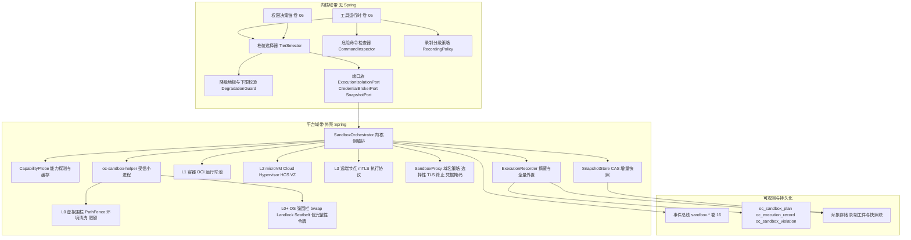
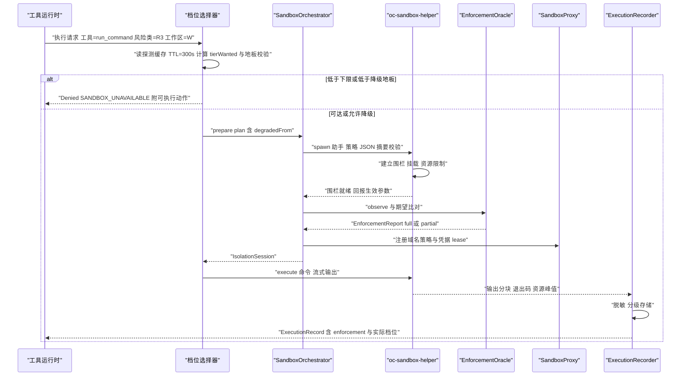
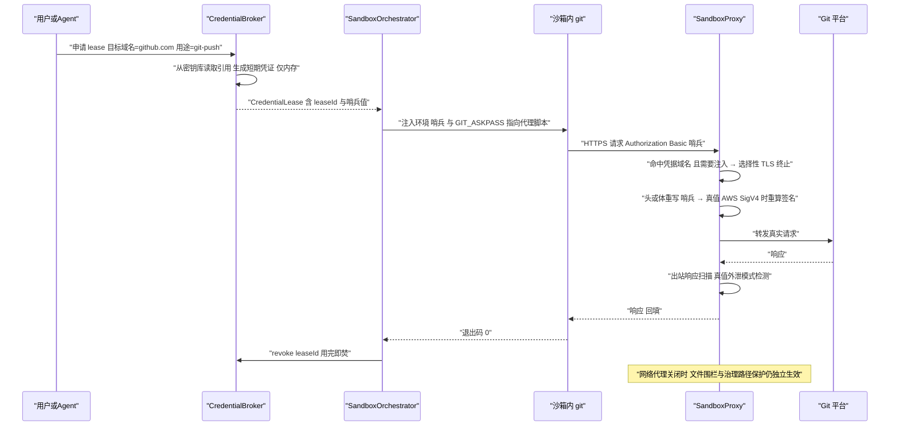
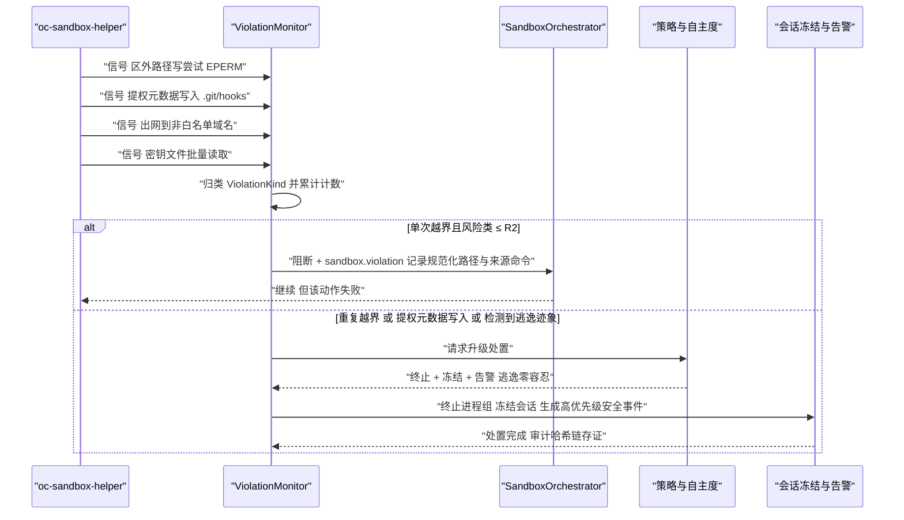
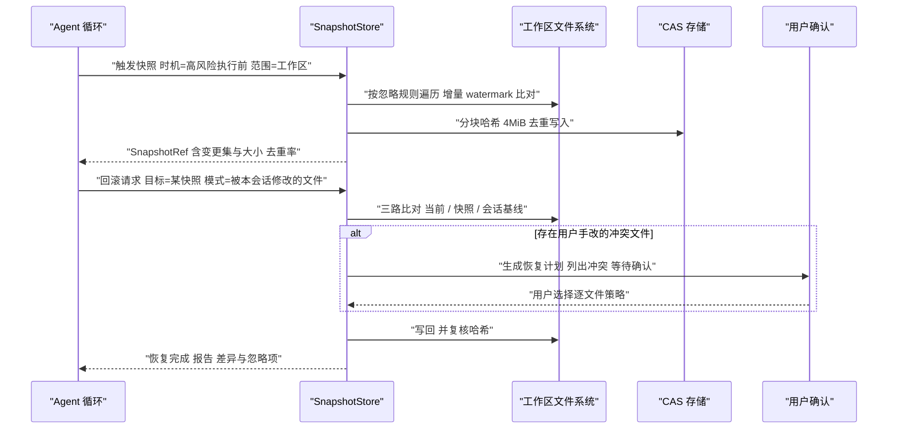
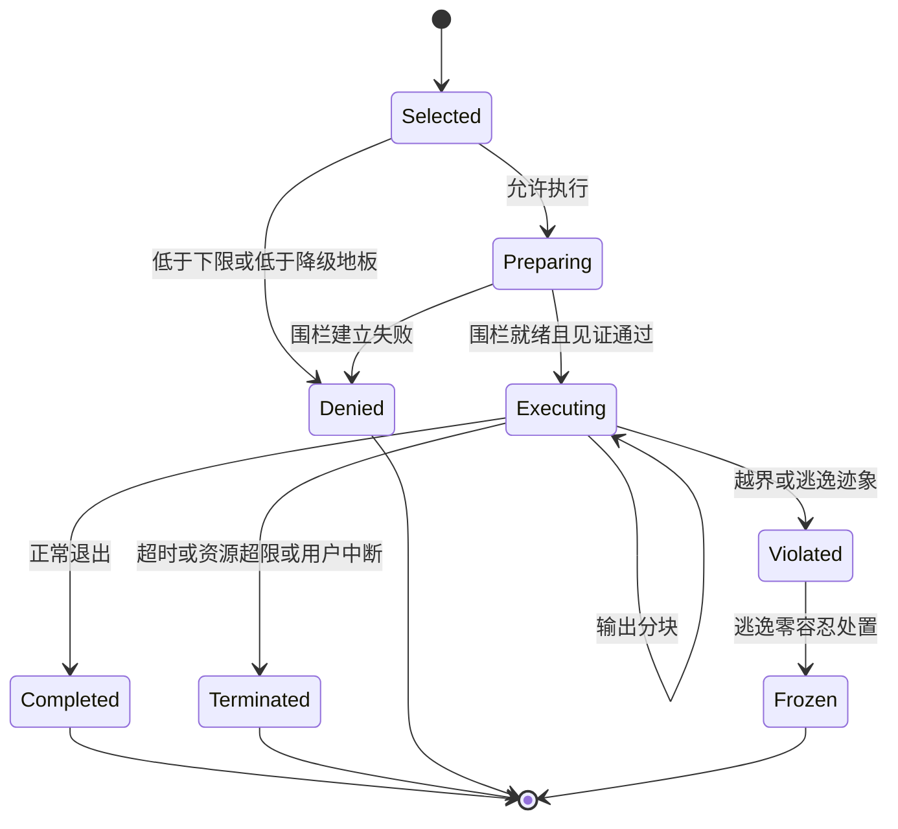
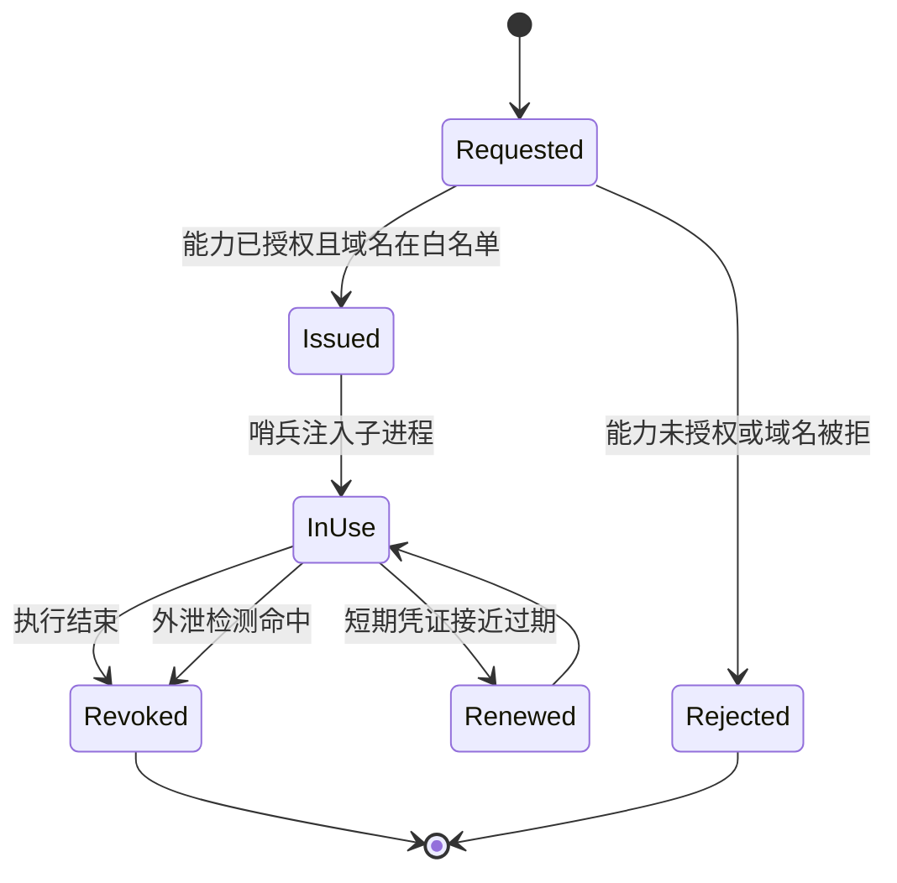

# Phase B 实现方案 07 · 沙箱与安全执行器（Sandbox Executor）

> **上游契约**：Phase A 卷 07《沙箱与安全执行环境》§2–§8（REQ-SBOX-1…12）、决策 D-SBOX-1…11；全局约束 H-009（分级隔离）、NFR-S-1（逃逸零容忍）；卷 06（权限决策）、卷 20（工作区）、卷 19（持久化）、卷 16（事件）。
> **定位**：Phase A 回答「沙箱应具备哪些档位与边界」，本文件回答**「每个档位用什么技术落地、如何证明它在运行期真的生效、失败时用户看到什么」**。
> **竞品证据**：`research/competitors/03-codex.md`（E1：Seatbelt/bwrap/seccomp、`WritableRoot`、denied-read 禁脱沙箱不变式）、`05-minimax-cli.md`（E1：MITM 代理 + 凭据遮蔽 + 违规监控）、`04-deepseek-harness.md`（E1：`SandboxEnforcement = full | partial` 上报）、`08-gemini-cli.md`（E1：`GOVERNANCE_FILES` 写保护 / `SECRET_FILES` 完全隐藏、`GEMINI_SANDBOX` 容器档）、`02-opencode.md`（E1：能力受限的进程内语言沙箱 CodeMode，与无沙箱 bash 的分工）、`01-claude-code-purpose-built.md`（E2：沙箱与权限耦合、`failIfUnavailable`）、`09-secondary-tier.md`（E1：容器内执行是研究型 harness 的唯一隔离手段）。
> **不修改 Phase A**：本文件所有选定分支均与 D-SBOX-1…11 一致；新增实现级决策登记为 `I-SBOX-n`，供 `IMPL-DECISIONS.md` 汇总。

---

## 1. 实现目标与范围

### 1.1 本组件解决什么

1. **执行约束落地**：把「命令 / 脚本 / 依赖安装 / 构建测试 / 不可信代码」放进与风险匹配的物理边界内，并让边界的**强度可被验证**。
2. **四类边界工程化**：文件（读写区、治理路径）、网络（白名单 + 审计代理）、密钥（代理注入、不落地明文）、资源（CPU/内存/磁盘/进程/时长）。
3. **拦截、取证与降级透明**：危险命令与解析歧义分层拦截；分级录制与内容寻址快照使违规可追溯、破坏可回滚；跨平台能力差异不隐藏——降级留痕、界面显式、企业可强制「不达标即拒绝」。

### 1.2 本组件不解决什么

| 不解决 | 归属 |
| --- | --- |
| 该不该执行（风险分级、审批、策略 DSL） | 卷 06 权限系统（本组件只消费 `RiskClass` 与策略求值结果） |
| 在哪执行（本地/SSH/容器工作区、连接池、快照存储治理） | 卷 20 工作区系统（本组件的 L1/L2/L3 复用其 `WorkspaceProvider`） |
| 工具语义与结果规范化；模型注入防护的内容层判定 | 卷 05 工具系统（本组件是 `run_command` 类工具的执行后端之一）；卷 03/06（本组件只提供出网检测与诱捕哨兵作为数据面证据） |

### 1.3 上下游依赖

| 方向 | 依赖方 | 契约 |
| --- | --- | --- |
| 上游 | 卷 06 权限引擎 | `PermissionOutcome` 中携带 `RiskClass` 与策略上下限 `minTier / maxTier`；沙箱**不回退**权限拒绝 |
| 上游 | 卷 05 工具运行时 | `ToolExecutionRequest`（命令、cwd、环境需求、所需能力声明） |
| 上游 | 卷 20 工作区 | `WorkspaceMount`（工作区根、只读子路径、治理文件清单） |
| 下游 | 卷 16 事件总线 | `sandbox.*` 事件（§8.3），全部走事件总线，禁止直发 UI |
| 下游 | 卷 19 / 22 / 23 | `oc_sandbox_*` 表与录制工件对象存储；降级徽章、拒绝原因卡片、`oc sandbox status` |

### 1.4 归属分带与模块落位（卷 27 §4.1 权威名；v1 列为迁移来源）

| 组件 | 带 | 目标模块 | v1 仓模块（迁移来源） | 装配方式 |
| --- | --- | --- | --- | --- |
| 端口与值对象（`ExecutionIsolationPort` 等） | 内核域带 | `harness-contract`（`com.hk.opencoding.contract.sandbox`） | `open-coding-core-api`（`com.hk.opencoding.core.sandbox`） | 零 Spring，纯契约 |
| 档位选择、降级地板、录制分级策略 | 内核域带 | `harness-kernel/kernel-agent`（决策纯函数，无 IO） | `open-coding-core-agent` | 无 Spring，可单测 |
| L0/L0+ 进程围栏、助手调度、代理、快照；L1 容器 / L2 microVM / L3 远端节点 | 平台域带 | `harness-platform/platform-sandbox`；节点注册表落 `harness-platform/platform-persistence` | `open-coding-infrastructure`（`sandbox` 子包）+ `open-coding-domain` | Spring 装配，`@ConditionalOnMissingBean`；由 `harness-host/host-bootstrap` 按能力探测结果条件装配 |
| REST/CLI 状态面 | 交互域带 | `harness-host/host-protocol` | `open-coding-interfaces` | Spring MVC |

> 模块名桥接（R07 收敛）：目标名以卷 27 §4.1/§4.3 为准（卷 07 → `platform-sandbox`）；v1 名列仅供迁移期对账，**构建与 `-pl` 选择器只允许目标名**。

### 落地核对（R07：模块 / 顺序 / 批次 / 门禁 / I-* 落点）

- **实施顺序（卷 27 §4.5）**：第 11 步「沙箱（L0+，路径/网络围栏）」，依赖第 4 步（工具运行时的进程执行面）。L1/L2/L3 档位与快照随第 12 步（工作区）与第 20 步（企业）增量；**第 5 步 Agent 主循环只要求 L0 路径围栏**，不阻塞。
- **数据批次（卷 27 §4.4）**：`oc_sandbox_plan`、`oc_execution_record`、`oc_sandbox_violation`、`oc_sandbox_capability`、`oc_snapshot_ref`、`oc_credential_lease` → **未映射**（B1–B6 无「沙箱执行」批次）。建议并入 **B2**（工具执行面附属）或单列 **B2.5**；已登记为 X 修订项（见 `reviews/R07-scope-build-kernel.md`）。
- **门禁映射（卷 27 §4.6）**：选档/围栏单测 → 「单元测试 + 覆盖率门」；三平台围栏与代理集成 → 「集成测试（PG/Redis 容器 + 沙箱）」；SPI 兼容与事件快照 → 「契约测试」；逃逸演练 → 「安全红队（增量用例）」；启动/新增延迟 → 「性能基准（抽样）」。
- **I-* 落点**：I-SBOX-1 → `platform-sandbox`（外部助手可执行体 + 策略生成器 + 守护通道）；I-SBOX-2 → `platform-sandbox`（选择性 TLS 代理 + L1+ netns 出口策略）；I-SBOX-3 → `platform-sandbox`（代理内存持有 + 哨兵替换 + 签名重算）；I-SBOX-4 → `platform-sandbox`（声明式 Launcher + 探测缓存）；I-SBOX-5 → `platform-sandbox`（内容寻址快照）+ `platform-workspace`（哈希遍历）；I-SBOX-6 → `harness-kernel/kernel-agent`（危险命令规则库 + 降级地板）+ 模型二次判定经 `kernel-model`；I-SBOX-7 → `kernel-agent`（受限解释器 + 显式工具树）。

### 1.5 三个必答问题（结论先行，细节见 §4/§10）

**Q1：究竟什么在沙箱外执行，为什么安全？**

| 执行体 | 是否受 OS 沙箱 | 安全理由（不成立即视为缺陷） |
| --- | --- | --- |
| 内核 JVM（Agent 循环、模型网关、工具调度、权限、事件、持久化） | 否 | 永不执行模型产出的**代码文本**；只执行类型化 Java 逻辑；出网仅经模型网关与沙箱代理；无 shell、无动态求值、无 `ProcessBuilder` 直通 |
| 文件工具（`read_file`/`write_file`/`apply_patch`） | 默认否，走内核 `PathFence` | 需要事务性补丁、差异追踪与回滚；所有路径先经**唯一**的规范化函数（realpath + `..` + 符号链接 + 大小写折叠 + Windows 8.3 短名 + 设备/UNC 拒绝）；治理路径硬拒；企业可切 `file-tool-execution=in-sandbox` 转发进 L1 |
| **L0 档下的 shell 命令** | 否（仅逻辑围栏） | **L0 不是安全边界**：仅允许 R0/R1 与「策略上限 = L0」的显式场景；R2+ 永不允许 L0；UI 必须标注「无 OS 强制隔离」 |
| 用户外壳进程（TUI/桌面/IDE 插件宿主） | 否 | 不执行模型产出，只渲染事件与转发用户输入；沙箱状态由内核上报而非外壳自述 |
| 快照/GC 后台任务、沙箱助手 `oc-sandbox-helper` | 否（助手为 TCB，最小实现） | 后台任务只读元数据 + 写 CAS 存储，不执行工作区代码；助手只做「解析策略 JSON → 建立围栏 → spawn → 采集信号」，无网络、无持久写，发行物摘要校验失败即拒启动（借鉴 Codex bundled bwrap 摘要失败退出码 8 的**拒绝**语义 [E1]） |
| MCP server 子进程 | 是（按来源定档：内置清单声明 ⇒ ≥L0+；第三方 ⇒ L1 或远端） | 与工具同权，且**不继承内核环境**（env 清洗 + 无密钥句柄）；所需凭据一律经代理哨兵注入（§6.2），不向服务器进程注入明文（MCP 侧口径见卷 09 实现方案 §10.5） |

**Q2：执行强度如何在运行期被验证（而不是「配置了就相信」）？**
五道验证依次叠加：**能力探测**（真实创建一次围栏并运行探针，见到预期拒绝才算可用）→ **档位不变式校验**（助手回报实际生效的围栏参数与期望比对）→ **金丝雀行为验证**（区外 canary 未被读取/篡改）→ **网络直连探针**（非白名单出口必须失败）→ **录制完整性校验**（`ExecutionRecord.enforcement` 缺失即视为 `partial`）。任一失败：降级事件 + 按策略拒绝（§4.3、§10.3）。

**Q3：沙箱降级时用户看到什么？**
① 会话内联卡片 `sandbox.degraded`（目标档 → 实际档、原因、影响面、可选动作）；② 常驻「安全状态条」显示当前档位徽章 + `enforcement=full|partial|none` + 网络模式；③ 每条执行记录（工具结果卡片与审计页）标注该次执行的**实际强度**；④ `oc sandbox status` / 桌面端通知（企业强制策略时）；⑤ 拒绝时结构化错误 `SANDBOX_UNAVAILABLE`，附「可执行动作」（启用容器运行时 / 改用远端节点 / 走审批申请策略豁免——豁免不得突破 §4.3 降级地板）。
---

## 2. 功能需求清单（REQ-SBOX-n）

| 编号 | 需求描述 | 来源 | 优先级 | 验收要点 |
| --- | --- | --- | --- | --- |
| REQ-SBOX-1 | 五档隔离 L0/L0+/L1/L2/L3 统一接口、四类实现，按风险与平台能力自动选档 | 卷 07 §2 REQ-SBOX-1、D-SBOX-1/2 | P0 | 选档算法纯函数单测全过；档位表与卷 07 §4.1 一致 |
| REQ-SBOX-2 | 文件围栏：只读根 + 显式读写区 + 治理路径保护 + 反绕过规范化 | 卷 07 §3 D-SBOX-3 | P0 | 软链/硬链/`..`/短名/大小写用例集全过 |
| REQ-SBOX-3 | 网络：默认拒绝 + 域名白名单 + 审计代理；企业可强制出口网关 | 卷 07 §3 D-SBOX-4 | P0 | 白名单外连接被拒；出网事件含域名/方法/字节数 |
| REQ-SBOX-4 | 资源限制：CPU/内存/磁盘/进程数/时长，平台原生 + 虚拟层兜底 | 卷 07 §3 D-SBOX-6 | P0 | 超限终止进程组并产出结构化结果 |
| REQ-SBOX-5 | 密钥：代理注入短期凭证，明文不落地、不进环境、不进日志 | 卷 07 §3 D-SBOX-5 | P0 | `git push` 可用；全日志与录制工件扫描无明文 |
| REQ-SBOX-6 | 危险命令：词法/语法解析 + 规则库 30+ + 高风险模型二次判定 | 卷 07 §3 D-SBOX-7 | P0 | 覆盖管道到解释器、设备重定向、批量删除、提权；正常命令零误拦 |
| REQ-SBOX-7 | 供应链：锁文件强制 + 依赖差异审计 + 来源校验 + 安装后扫描 | 卷 07 §3 D-SBOX-8 | P1 | 新增依赖有记录；私有 registry 优先；离线模式可用 |
| REQ-SBOX-8 | 逃逸与提权防护：最小内核能力、提权元数据路径不可写 | 卷 07 §4.6、NFR-S-1 | P0 | 逃逸演练链路全通；`.git/hooks` 等写入被拒 |
| REQ-SBOX-9 | 恶意内容防护：出站敏感模式检测 + 诱捕哨兵 + 隐蔽信道告警 | 卷 07 §4.4 | P1 | 外泄用例阻断；哨兵出现在非白名单即违规 |
| REQ-SBOX-10 | 快照与恢复：内容寻址增量快照 + 恢复前后工作区哈希一致（除忽略项） | 卷 07 §4.5 | P1 | 恢复后哈希比对通过；3-way 冲突生成恢复计划 |
| REQ-SBOX-11 | 执行审计与录制：分级录制（摘要/全量/仅命令），脱敏后入库 | 卷 07 §3 D-SBOX-9 | P0 | 每次执行必有记录；全量录制外置为工件并脱敏 |
| REQ-SBOX-12 | 合规模式：数据驻留、禁止远端执行、录制保留期可配 | 卷 07 §2 REQ-SBOX-12 | P2 | 驻留策略下 L3 被禁用；保留期到期可证删除 |
| REQ-SBOX-13 | **denied-read ⇒ 禁止脱沙箱执行**实现为**单点可测谓词**，任何提权/规则放行不得绕过 | 竞品增量：03-codex §1 条目 6 [E1]（`unsandboxed_execution_allowed`） | P0 | 谓词单测（含 deny 存在时 `RequireEscalated` 被静默降级为默认档）；集成用例证明无法脱沙箱 |
| REQ-SBOX-14 | 每次执行**上报执行强度** `full / partial / none` 与生效围栏参数，消费者可据此拒绝 | 竞品增量：04-deepseek §1 条目 7 [E1] | P0 | `ExecutionRecord.oracleEnforcement` 全量填充；缺失自动判 `partial` 并告警 |
| REQ-SBOX-15 | 凭据掩码代理：选择性 TLS 终止 + 环境/文件哨兵 + 请求体重写 + 签名重算；**网络代理关闭仍保文件保护** | 竞品增量：05-minimax §1 条目 5 [E1] | P1 | 无明文注入下 `git push`/`npm publish` 可用；代理关闭后 FS 策略探针仍失败 |
| REQ-SBOX-16 | 提供**能力受限的进程内语言沙箱**作为不依赖容器的补充隔离层（编排脚本无 ambient 权限） | 竞品增量：02-opencode §1 条目 7 [E1]（CodeMode） | P2 | 白名单 stdlib 无 `fs/process/net`；`copyIn/copyOut` 纯数据边界用例通过 |
| REQ-SBOX-17 | 语义化文件边界：治理文件写保护、密钥文件**完全隐藏**（非仅拒读） | 竞品增量：08-gemini §1 条目 7 [E1] | P1 | `.env*` 在挂载与文件工具两层都不可见；`.git`/`.gitignore` 写保护 |
| REQ-SBOX-18 | 沙箱与权限耦合：已沙箱动作可免询问放行，脱沙箱作为**独立决策原因**并可审计 | 竞品增量：01-claude-code §1 条目 2 [E2] | P1 | 决策结果含 `sandboxOverride` 原因；审计可回溯 |

> 说明：REQ-SBOX-13…18 是竞品研究带来的增量需求（写作模板 §3 第 2 节要求），其实现分别落在 §3.6、§5、§3.2/§3.3、§3.7、§3.1/§4.2、§4.3 与 §10.4（脱沙箱为独立决策原因，走审批与审计）。

---

## 3. 技术方案选型（M×N 比选）

评分口径沿用 `README §4`：F 功能完备 ×30、U 用户体验 ×20、S 稳定与安全 ×25、M 可维护 ×25（满分 100）。
### 3.1 I-SBOX-1：进程围栏载体

| 分支 | 描述 | F | U | S | M | 加权 | 结论 |
| --- | --- | --- | --- | --- | --- | --- | --- |
| B1 JNI/JNA 直调 OS API | Java 进程内直接 `landlock_create_ruleset` / `sandbox_init` / `CreateRestrictedToken` | 7 | 8 | 7 | 4 | 66.5 | 淘汰：原生编译矩阵与崩溃面过大 |
| B2 外部助手可执行体 + 策略生成器 | Java 生成策略 JSON，spawn `oc-sandbox-helper`（随发行物签名分发，摘要校验）建立围栏并 exec 目标命令 | 9 | 8 | 9 | 8 | 86.5 | **选定** |
| B3 纯虚拟层围栏（无 OS 强制） | 只用路径校验 + 环境清洗 + 资源限额 | 5 | 9 | 3 | 7 | 57.5 | 仅作为 L0（明确非安全边界）保留 |

**选定 B2 的代价**：每次执行多一次 spawn（观测 3–8ms）；用 **常驻助手守护通道**（Unix domain socket / Windows named pipe，seccomp 与 Seatbelt 均有守护模式先例 [E1] 03-codex `seatbelt_daemon`）把稳态开销压回 ≤ 3ms。
**放弃 B1 的代价**：极端低延迟场景（< 1ms 附加）本方案做不到，但该场景不在我们的性能预算内（§10.2）。

### 3.2 I-SBOX-2：网络代理与 TLS 终止范围

| 分支 | 描述 | F | U | S | M | 加权 | 结论 |
| --- | --- | --- | --- | --- | --- | --- | --- |
| B1 全量 MITM | 所有 HTTPS 流量终止解密并审计 | 9 | 5 | 7 | 5 | 68 | 淘汰：隐私与性能代价过大，脱离 TLS 信任边界 |
| B2 选择性 TLS 终止 | 默认 CONNECT 隧道（仅 SNI/域名/字节量审计）；命中凭据域名且需注入时才终止解密 | 8 | 8 | 9 | 8 | 82.5 | **选定** |
| B3 仅隧道不解密 | 零解密，仅域名策略 | 6 | 8 | 8 | 9 | 74.5 | 作为 `privacy=strict` 降级档保留 |

**选定 B2 的代价**：非凭据域名的请求体不可见（外泄检测退化为字节量 + 域名 + 出站模式匹配）；通过「主机出口网关 + DLP」在企业形态补足（卷 24/30）。**附加硬约束**：L0/L0+ 的网络白名单是**约定式**（子进程尊重代理变量），不是强制；因此 `network-enforcement=strict` 时 R2+ 动作**强制 ≥ L1**（容器 `network=none` 或 netns 白名单），否则拒绝执行。

### 3.3 I-SBOX-3：凭据注入形态

| 分支 | 描述 | F | U | S | M | 加权 | 结论 |
| --- | --- | --- | --- | --- | --- | --- | --- |
| B1 环境变量注入明文 | `export GITHUB_TOKEN=...` | 8 | 9 | 3 | 8 | 65.5 | 淘汰（卷 07 D-SBOX-5 已淘汰） |
| B2 代理内存持有 + 哨兵值替换 | 子进程只见 `__OC_CRED_<leaseId>__` 哨兵；代理在出站请求头/体重写为真值 | 9 | 7 | 9 | 8 | 84.5 | **选定** |
| B3 不注入，仅 `git` 协议改写（`GIT_ASKPASS` 直连 helper） | 覆盖 Git 场景但不覆盖 `npm/pip/aws` | 5 | 7 | 8 | 7 | 66 | 作为 B2 的兼容子路径保留 |

**选定 B2 的代价**：需要请求体重写与**签名重算**（AWS SigV4、部分 CI token 的 HMAC），实现复杂度集中在 `CredentialMutator`；兼容子路径 B3 用于无法安全重写的客户端（如证书双向认证场景，直接回退到「不注入 → 命令失败 + 提示」）。

### 3.4 I-SBOX-4：L1/L2 运行时来源

| 分支 | 描述 | F | U | S | M | 加权 | 结论 |
| --- | --- | --- | --- | --- | --- | --- | --- |
| B1 内置运行时（自带容器/VM 引擎） | 完全可控 | 8 | 5 | 8 | 4 | 67.5 | 淘汰：发行物体积与维护面不可接受 |
| B2 复用宿主运行时 + 声明式 Launcher | L1 探测 rootless podman → docker → nerdctl；L2 探测 Cloud Hypervisor/`/dev/kvm`、Windows HCS、macOS Virtualization.framework | 9 | 8 | 8 | 9 | 85.5 | **选定** |
| B3 仅云端远端（无本地 L1/L2） | 隔离最强、本地零依赖 | 6 | 5 | 8 | 7 | 64 | 作为企业远程形态（L3）保留 |

**选定 B2 的代价**：能力探测与降级分支增多（每次探测失败都要产生可解释的降级事件）；用**能力矩阵 + 探测缓存（TTL 300s）+ 探测探针命令化**（§4.2）控制复杂度。

### 3.5 I-SBOX-5：快照实现

| 分支 | 描述 | F | U | S | M | 加权 | 结论 |
| --- | --- | --- | --- | --- | --- | --- | --- |
| B1 仅平台文件系统快照（APFS/VSS/btrfs） | 快且省 IO | 7 | 8 | 6 | 5 | 65.5 | 作为加速项叠加，不作唯一实现（三平台不齐） |
| B2 内核自研内容寻址增量快照 | 跨平台一致、可对比、可搬工作区 | 9 | 8 | 9 | 8 | 86.5 | **选定** |
| B3 依赖 Git 影子仓库 | 复用 Git 生态 | 6 | 6 | 7 | 8 | 66 | 淘汰：无法覆盖未跟踪产物与二进制大对象 |

**选定 B2 的代价**：首次全量哈希在大仓（> 50 万文件）耗时可达分钟级；用忽略规则 + 并行哈希 + 增量 watermark 缓解，并把首快照放在轮次后台而非阻塞用户动作。

### 3.6 I-SBOX-6：危险命令判定与执行强度表达

| 分支 | 描述 | F | U | S | M | 加权 | 结论 |
| --- | --- | --- | --- | --- | --- | --- | --- |
| B1 纯规则库 | 快、可解释 | 7 | 9 | 6 | 8 | 72 | 基线（作为第一层保留） |
| B2 规则 + 远端模型判定（同步阻塞） | 覆盖未知模式 | 8 | 4 | 7 | 6 | 63.5 | 淘汰：交互延迟不可接受 |
| B3 规则 + 异步/超时降级的模型二次判定 | 覆盖未知模式且不阻塞主路径 | 9 | 8 | 8 | 9 | 86 | **选定** |

**降级地板（本文件新增的硬约束，登记为 I-SBOX-6 的附带项）**：降级只能发生在「策略下限 `<` 目标档」时；每风险类另有**降级地板**——R0/R1 地板 = L0，R2 = L0+，R3 = L0+，R4/R5 = L2。地板不可突破：不可达即拒绝（`SANDBOX_UNAVAILABLE`）。

### 3.7 I-SBOX-7：补充隔离层（语言级沙箱）

| 分支 | 描述 | F | U | S | M | 加权 | 结论 |
| --- | --- | --- | --- | --- | --- | --- | --- |
| B1 不提供 | 隔离只靠 OS 档位 | 6 | 7 | 7 | 9 | 70.5 | 基线 |
| B2 进程内受限解释器 + 显式工具树 | 无 ambient 权限；编排多个工具调用为一段程序；审计友好 | 8 | 7 | 8 | 7 | 77.5 | **选定（叠加）** |
| B3 任意脚本（Node `vm`/JSRuntime） | 表达力最强 | 7 | 8 | 4 | 6 | 61.5 | 淘汰（逃逸面大，非真隔离） |

**选定 B2 的代价**：语言子集与 stdlib 白名单需要独立维护（无 `fs/process/net`）；且**资源预算必须有安全默认值**（OpenCode 的三项预算默认不限制是缺陷 [E1]，我们强制默认：超时 30s、工具调用 200 次、输出 1 MiB，可配）。

---

## 4. 总体架构图

### 4.1 组件与数据流



**装配点**：`SandboxAutoConfiguration`（`harness-host/host-bootstrap`）按 `CapabilityProbe` 结果注册 `IsolationProvider` 列表；DB 版节点与记录位于 `harness-platform/platform-persistence`，以 `@ConditionalOnMissingBean` 覆盖内存实现（对齐 AGENTS.md 装配纪律）。
### 4.2 平台能力矩阵与探测

| 能力 | Linux | macOS | Windows | 探测方式（真实动作，非查版本） |
| --- | --- | --- | --- | --- |
| 文件围栏 | Landlock ABI ≥ 3 / mount ns / bwrap | Seatbelt Profile | 低完整性令牌 + ACL / AppContainer | 建立一次围栏并运行「写区外探针文件」的探针，**必须失败** |
| 系统调用过滤 | seccomp-bpf（白名单） | Seatbelt | 无直接等价（依赖 AppContainer + 运行期监控） | 探针执行被禁 syscall（如 `unshare`），检查 EPERM |
| 资源限制 | cgroups v2 / rlimit | rlimit + 进程组 | Job Objects | 创建作业对象并触发一次限额，检查终止信号 |
| 网络强制 | netns + nftables（L1+）/ 代理（L0/L0+） | Seatbelt network 规则 + 代理 | Windows Firewall 规则 + 代理 / WSL2 netns | 直连非白名单地址必须失败，代理隧道必须成功 |
| 容器 | rootless podman → docker → nerdctl | Docker Desktop / Colima | Docker Desktop（WSL2 后端） | `… info` + 启动一次 `--network=none` 空容器跑 `true` |
| 微虚拟机 | Cloud Hypervisor + `/dev/kvm` 可读写 | Virtualization.framework（Apple Silicon） | Hyper-V / HCS 隔离容器 | 启动一次 microVM 并读取 guest 标记 |

探测结果结构：`EnforcementLevel { FULL, PARTIAL, NONE }`——**平台层不假设自己完备**，`partial` 必须携带边界说明（例如「Windows 低完整性令牌对 Everyone 组与硬链接的边界」这类诚实标注，直接对齐 04-deepseek 的上报语义 [E1]）。文件系统级快照（btrfs/zfs/LVM、APFS、VSS）作为可选加速项探测，不影响主实现。

### 4.3 降级规则

```text
tierWanted   = riskTier(riskClass, platformCapability, workspaceType)   // 纯函数
tierClamped  = clamp(tierWanted, policy.minTier, policy.maxTier)
tierReachable= highestReachable(platformCapability, notAbove = tierClamped)
if tierReachable >= tierClamped                     -> 正常执行
else if tierClamped > policy.minTier
        and tierReachable >= degradationFloor(riskClass) -> 降级执行 + sandbox.degraded
                                                            + 风险类 ≥ R2 时强制审批
else                                                -> 拒绝执行 SANDBOX_UNAVAILABLE
```

| 风险类 | 目标档 | 降级地板 | 目标档不可达时的行为 |
| --- | --- | --- | --- |
| R0 只读查看 | L0 | L0 | 正常（L0 恒可用）；不产生降级事件 |
| R1 受控写 | L0+ | L0 | 降 L0 + 事件 + UI 标注「无 OS 强制隔离」；企业 `strict-closed` 下拒绝 |
| R2 常规执行/依赖安装 | L1 优先，L0+ 轻量 | L0+ | 降 L0+ + 强制审批；`network-enforcement=strict` 且仍 < L1 ⇒ 拒绝 |
| R3 高风险变更 | L1 | L0+ | 降 L0+ + 强制审批 + 事件；L0+ 亦不可达 ⇒ 拒绝 |
| R4 不可信代码/敏感数据 | L2 | L2 | L2 不可达 ⇒ 尝试 L3；否则拒绝（**不放宽到 L1**） |
| R5 灾难性/企业强隔离 | L2 或 L3 | L2 | 不可达 ⇒ 拒绝并告警 |

`strict-closed` 语义（企业档）：**任何**降级都视为不可达，直接拒绝。

### 4.4 四类边界的实现要点

| 边界 | L0 | L0+ | L1 | L2/L3 |
| --- | --- | --- | --- | --- |
| 文件 | `PathFence` 规范化 + 只读根逻辑校验 + 治理路径硬拒 | + OS 强制（Landlock/Seatbelt/IL）+ 治理路径首层组件名保护（借鉴 Codex `protected_metadata_names` [E1]） | 只读根挂载 + 显式读写卷 + 治理文件 ro + **密钥文件不挂载** | 工作区按 virtiofs/复制同步；宿主文件系统不可见 |
| 网络 | 代理环境变量（约定式）+ 出网事件记录 | 同 L0（诚实：仍非强制） | `network=none` 默认；白名单模式走宿主代理；企业可接出口网关 | 独立网络栈 + 出口白名单；air-gapped 默认全禁 |
| 密钥 | 无注入（需凭证的命令直接失败） | 哨兵注入 + 代理替换 | 容器内同样只见哨兵；密钥不挂载 | 远端节点本地解析 lease（一次性、短 TTL） |
| 资源 | 时长 + 输出字节 + 进程数（`ProcessHandle`） | + rlimit/cgroups/Job Objects | 容器配额（CPU/mem/pids/磁盘） | VM/节点级配额 + 租户隔离 |

---

## 5. 类图与 Java 21 签名

```mermaid
classDiagram
    class ExecutionIsolationPort {
        <<interface>>
        +select(plan: SandboxPlanRequest) SandboxPlanDecision
        +prepare(plan: SandboxPlan) IsolationSession
        +execute(session: IsolationSession, cmd: Command) ExecutionStream
        +terminate(planId: String, reason: String) void
    }
    class SandboxPlanRequest {
        <<record>>
        +toolCallId: String
        +riskClass: RiskClass
        +command: Command
        +minTier: IsolationTier
        +maxTier: IsolationTier
    }
    class SandboxPlan {
        <<record>>
        +planId: String
        +tier: IsolationTier
        +enforcement: EnforcementLevel
        +degradedFrom: IsolationTier
    }
    class SandboxPlanDecision {
        <<sealed>>
    }
    class Permitted {
        <<record>>
        +plan: SandboxPlan
    }
    class Denied {
        <<record>>
        +code: SandboxErrorCode
        +remediation: String
    }
    class IsolationProvider {
        <<interface>>
        +tier() IsolationTier
        +probe() CapabilityReport
        +available(spec: NetworkSpec) boolean
    }
    class EnforcementOracle {
        <<interface>>
        +observe(session: IsolationSession) EnforcementReport
        +verifyPrefix(listener: ExecutionListener) void
    }
    class CommandInspector {
        <<interface>>
        +inspect(cmd: Command, ctx: InspectionContext) CommandVerdict
    }
    class CommandVerdict {
        <<sealed>>
    }
    class CredentialBrokerPort {
        <<interface>>
        +lease(spec: CredentialLeaseSpec) CredentialLease
        +revoke(leaseId: String) void
    }
    class SnapshotPort {
        <<interface>>
        +capture(scope: SnapshotScope) SnapshotRef
        +restore(ref: SnapshotRef, mode: RestoreMode) RestorePlan
    }
    class SandboxViolation {
        <<record>>
        +kind: ViolationKind
        +handling: HandlingAction
    }

    ExecutionIsolationPort --> SandboxPlanRequest
    ExecutionIsolationPort --> SandboxPlanDecision
    SandboxPlanDecision <|-- Permitted
    SandboxPlanDecision <|-- Denied
    SandboxPlanRequest --> SandboxPlan
    IsolationProvider --> EnforcementOracle
    ExecutionIsolationPort --> IsolationProvider
    ExecutionIsolationPort --> CommandInspector
    ExecutionIsolationPort --> CredentialBrokerPort
    ExecutionIsolationPort --> SnapshotPort
    ExecutionIsolationPort --> SandboxViolation
```



**Java 21 关键签名**（节选；完整形态见 `com.hk.opencoding.core.sandbox`）

```java
/**
 * 沙箱隔离档位。
 * 与 Phase A 卷 07 §4.1 档位表一一对应；声明顺序即强度顺序，比较一律用 {@link #atLeast}，
 * 禁止散落的 ordinal 比较与数值常量。
 */
@Getter
@RequiredArgsConstructor
public enum IsolationTier {
    /** 进程内受控：路径围栏、环境清洗、资源限额、危险命令拦截；<b>不是 OS 强制边界</b> */
    L0("L0", "进程内受控"),
    /** L0 + 平台强制访问控制：Linux Landlock/seccomp、macOS Seatbelt、Windows 低完整性令牌/AppContainer */
    L0_PLUS("L0+", "OS 强制访问控制"),
    /** 容器隔离：OCI 镜像、只读根、显式读写卷 */
    L1("L1", "容器隔离"),
    /** 微虚拟机隔离：独立内核、virtiofs 工作区 */
    L2("L2", "微虚拟机隔离"),
    /** 远程执行节点：独立主机或集群，网络隔离 */
    L3("L3", "远程执行节点");

    /** 档位编码（DB 与事件只存 code，不存 desc） */
    private final String code;

    /** 档位中文描述（界面展示与异常文案） */
    private final String desc;

    /**
     * 判断当前档位强度是否不低于目标档位。
     *
     * @param other 比较目标（必填）
     * @return 当前档位强度 ≥ 目标档位时为 true
     */
    public boolean atLeast(IsolationTier other) {
        return ordinal() >= other.ordinal();
    }
}
```

```java
/**
 * 沙箱执行端口。
 * 工具运行时唯一允许的执行入口；实现按档位注册，禁止工具层直接调用 ProcessBuilder。
 */
public interface ExecutionIsolationPort {

    /**
     * 依据风险类、平台能力与策略上下限选择档位并生成执行计划。
     *
     * @param request 执行请求（必填；含风险类、命令、工作区根与策略上下限）
     * @return 允许时返回 {@link Permitted}，不满足下限或降级地板时返回 {@link Denied}，不抛异常
     */
    SandboxPlanDecision select(SandboxPlanRequest request);

    /**
     * 建立隔离环境（围栏、挂载、资源限制、代理与凭据 lease）。
     *
     * @param plan 已选定的执行计划（必填；由 {@link #select} 产出）
     * @return 可执行会话；调用方必须在 finally 中调用 {@link #terminate}
     * @throws SandboxException 围栏建立失败、能力在准备阶段失效、计划已被取消时抛出
     */
    IsolationSession prepare(SandboxPlan plan);

    /**
     * 执行命令并流式返回输出。
     *
     * @param session 已准备的隔离会话（必填）
     * @param command 命令与参数（必填；已通过危险命令检查）
     * @return 输出分块流（拉取式迭代器，终态块含退出码与资源峰值）
     */
    ExecutionStream execute(IsolationSession session, Command command);

    /**
     * 终止执行并回收隔离资源（幂等）。
     *
     * @param planId 计划编号（必填）
     * @param reason 终止原因（必填；写入执行记录与事件）
     */
    void terminate(String planId, String reason);
}
```

```java
/**
 * 执行强度见证端口。
 * 职责：在运行期**观测**实际生效的围栏参数并与计划期望比对，拒绝「配置即相信」。
 */
public interface EnforcementOracle {

    /**
     * 读取当前会话实际生效的围栏参数。
     *
     * @param session 运行中的隔离会话（必填）
     * @return 见证报告；无法读取关键参数时返回 {@link EnforcementLevel#PARTIAL} 并给出缺失项
     */
    EnforcementReport observe(IsolationSession session);

    /**
     * 执行前置校验：探测缓存、降级地板、网络强制模式、金丝雀投放。
     *
     * @param listener 违规事件监听器（必填；用于产出 {@link SandboxViolation}）
     * @throws SandboxException 校验不通过且策略为 fail-closed 时抛出
     */
    void verifyPrefix(ExecutionListener listener);
}

/**
 * 危险命令检查器。
 * 三层判定：词法/语法解析 → 规则库 → 高风险模型二次判定；解析歧义按风险类收紧处置。
 */
public interface CommandInspector {

    /**
     * 检查命令并给出判决。
     *
     * @param command 规范化后的命令（必填）
     * @param context 判定上下文（必填；含风险类、工作区、自主度、历史违规计数）
     * @return 判决（允许 / 强制审批 / 阻断 / 解析歧义待裁决）
     */
    CommandVerdict inspect(Command command, InspectionContext context);
}
```

> 异常纪律：沙箱拒绝与不可用统一抛 `SandboxException extends HarnessException`（携带 `SandboxErrorCode { SANDBOX_UNAVAILABLE, SANDBOX_DENIED, SANDBOX_VIOLATION }` 映射到内核 `ErrorCode`），由外壳全局异常处理器按附录 B 的三档错误码映射为统一响应；**禁止**裸 `RuntimeException`、禁止在工具层 `try-catch` 后包装错误响应。**异常命名分层（全套统一）**：内核层（framework-free core，本域全部实现）失败抛 `HarnessException` 及其子类 `SandboxException`；外壳层（domain / application / interfaces 的沙箱管理面与录制导出）失败抛 `BusinessException`；两侧文案均为中文并携带业务编号（`planId` / `leaseId`）。**契约缺口指针（X-82）**：异常类名与冻结卷册 `ErrorCode` 映射的登记缺口已列为修订建议 **X-82**（`impl/IMPL-DECISIONS.md` §4；本文件不改台账）。

---

## 6. 核心流程时序图

### 6.1 档位选择 → 围栏建立 → 执行 → 录制



- **前置条件**：命令已过权限决策（非 deny）且已过 `CommandInspector`（非阻断）。
- **主路径**：探测缓存命中 → 选档 → 准备 → 见证 → 执行 → 录制。
- **异常与补偿**：准备失败 ⇒ 回收半成品资源 + `sandbox.denied`；见证为 `partial` 且 `strict-closed` ⇒ 拒绝并报告缺口；执行被终止 ⇒ 产出结构化结果（非异常）。
- **幂等与并发点**：`planId` 全链路幂等；同工作区写型执行串行化（工作区级互斥锁），不同工作区并行。

### 6.2 凭据代理：`git push` 全程无明文



- **前置条件**：lease 的 `capability` 已在安装期授权（卷 06），目标域名在白名单。
- **主路径**：lease → 哨兵注入 → 代理重写 → 转发 → 撤销。
- **异常与补偿**：域名不在白名单 ⇒ 拒绝 + 网络违规事件；响应中出现真实凭证值 ⇒ 阻断 + `sandbox.violation` + 撤销全部 lease；签名无法安全重算 ⇒ 不注入，命令失败并提示「改用兼容子路径或人工操作」。
- **替换范围绑定（防凭据搬运与开放重定向外泄）**：哨兵只在 lease 绑定的**目标域名 + 方法/路径范围**内被替换，跨域重放不替换；重定向逐跳校验，**跨域重定向一律剥离凭据**（对齐 opencode OpenAPI 适配器「凭据主机必须拒绝跨源重定向或剥离凭据」的语义 `[E1]`）；代理不得为未声明域名建立 TLS 终止会话。
- **幂等与并发点**：同一 `leaseId` 在 TTL 内可复用，撤销幂等；并发注入按域名串行化改写上下文。

### 6.3 越界尝试与逃逸迹象处置



- **前置条件**：执行记录与围栏信号通道已建立（`ExecutionListener` 已挂载）。
- **主路径**：信号采集 → 归类 → 处置梯度（观察 → 阻断 → 终止 + 冻结 + 告警）。
- **异常与补偿**：信号通道中断 ⇒ 该次执行降级为 `enforcement=partial` 并强制审批；重复违规 ⇒ 提升该工作区最低档位。
- **幂等与并发点**：同一 `planId` 的重复信号合并计数；处置动作幂等。

### 6.4 快照创建与安全回滚



- **前置条件**：工作区可写；忽略规则已加载（构建产物、VCS 内部对象等）。
- **主路径**：增量扫描 → 分块去重 → 引用登记 → 恢复前 3-way 比对。
- **异常与补偿**：快照写入失败 ⇒ 高风险动作按策略拒绝（快照是高风险前置条件）；恢复中断 ⇒ 断点续做，已写文件保持、未写文件标记待恢复。
- **幂等与并发点**：同一 watermark 的重复快照去重合并；恢复与写型执行互斥；快照**独立于 Git**（可覆盖未提交状态），Git 提交作为语义检查点补充（卷 21）。
---

## 7. 状态机

### 7.1 `SandboxPlan` 生命周期



不变式：(a) 进入 `Executing` 前必须完成 `observe` 并写入 `enforcement`；(b) `Violated` 必须携带至少一条 `SandboxViolation`；(c) 终态必须落库 `oc_sandbox_plan` 且事件已发布（先落库后发事件的顺序保证恢复期可重放）。

### 7.2 `CredentialLease` 生命周期



不变式：lease 明文只在 `CredentialBroker` 内存与密钥库引用中存在；`Revoked` 后任何残留哨兵一律失效（代理拒绝替换）。

**隔离实例池（L1/L2 预热）**：池状态为 `Cold → Warming → Warm ⇄ Leased`，违规实例进 `Quarantined` 后销毁重建，超 TTL 或镜像更新进 `Retired`；探测失败进 `Unavailable` 并按探测周期重试。池化用于满足 L1 复用 < 200ms 的性能预算（卷 07 §7）；**清洁校验**（工作区挂载重建 + 临时区清空 + 进程树归零）未通过即销毁，绝不复用脏实例。

---

## 8. 数据模型

### 8.1 表（`oc_*`）

**类型约定（本节各表通用；逐列 DDL 以卷 19 的 Flyway 迁移脚本为准）**：内部主键 `id BIGINT`（Snowflake）或复合主键（如 `(tenant_id, …)`）；对外暴露的引用 ID 用不透明字符串 / `UUID`（防遍历）；时间列统一 `TIMESTAMPTZ`（UTC 存储、展示层本地化）；枚举列存 `VARCHAR(32)` 的 **code**（禁止存 desc）；结构化与可变结构用 `JSONB`；布尔列 `BOOLEAN NOT NULL DEFAULT false`；敏感字段（密钥 / Token）只存引用名 `*_ref`，明文永不入库；大对象（快照 / 录制 / 工件）外置并留指针；各表字段语义见「关键字段」列，索引与唯一约束见末列。

| 表 | 关键字段 | 索引与约束 |
| --- | --- | --- |
| `oc_sandbox_plan` | `id`、`session_id`、`tool_call_id`、`tier_code`、`degraded_from`、`enforcement`、`risk_class`、`network_mode`、`plan_json`、`created_at` | UK(`tool_call_id`)；IDX(`session_id`,`created_at`)、IDX(`tier_code`,`degraded_from`) |
| `oc_execution_record` | `id`、`plan_id`、`command_digest`、`exit_code`、`duration_ms`、`resource_peak_json`、`output_ref`、`recording_level`、`redaction_applied`、`enforcement`、`created_at` | IDX(`plan_id`)、IDX(`created_at`) 分区按月 |
| `oc_sandbox_violation` | `id`、`plan_id`、`kind`、`normalized_path`、`domain`、`evidence_ref`、`handling`、`occurred_at` | IDX(`kind`,`occurred_at`)、IDX(`plan_id`) |
| `oc_credential_lease` | `id`、`session_id`、`target_domain`、`purpose`、`issued_at`、`expires_at`、`revoked_at`、`broker_ref` | IDX(`session_id`)、IDX(`expires_at`)（过期清理扫描） |
| `oc_snapshot_ref` | `id`、`workspace_id`、`session_id`、`trigger_kind`、`cas_manifest_ref`、`bytes`、`dedup_rate`、`expires_at`、`ref_count` | IDX(`workspace_id`,`created_at`)、IDX(`expires_at`) |
| `oc_sandbox_capability` | `id`、`node_id`、`platform`、`capability_json`、`enforcement`、`probed_at` | UK(`node_id`,`platform`)；探测缓存持久化，重启后仍可解释降级历史 |

**字段约束**：`tier_code`/`enforcement`/`kind`/`recording_level` 全部存**枚举 code**（`IsolationTier`/`EnforcementLevel`/`ViolationKind`/`RecordingLevel`），禁止存 desc。

### 8.2 Redis Key（经统一 Key 工厂，禁止业务侧拼接）

| Key 用途 | 生成方式 | TTL |
| --- | --- | --- |
| 能力探测结果缓存 | `RedisKeys.capability(RedisKeys.Module.SANDBOX, nodeId)` | 300s |
| 工作区执行互斥锁 | `RedisKeys.lock(RedisKeys.Module.SANDBOX, "exec", workspaceId)` | 租约 60s，看门狗续约 |
| 隔离实例池水位 | `RedisKeys.pool(RedisKeys.Module.SANDBOX, tierCode)` | 无 TTL，池管理器维护 |
| 违规计数（用于升档与告警去抖） | `RedisKeys.counter(RedisKeys.Module.SANDBOX, "violation", workspaceId)` | 1h 滚动 |
| 代理本地 CA 句柄引用 | `RedisKeys.handle(RedisKeys.Module.SANDBOX, "ca", sessionId)` | 会话生命周期 |

### 8.3 事件清单（全部经卷 16 事件总线）
| 事件 | 载荷要点 | 消费者 |
| --- | --- | --- |
| `sandbox.selected` / `sandbox.degraded` | tier、degradedFrom、策略依据；降级原因、缺口项、remediation | UI 状态条与内联卡片、审计、企业仪表盘 |
| `sandbox.denied` | SandboxErrorCode、命中规则引用、remediation | UI、权限解释（`permission.explain` 联动） |
| `sandbox.violation` | ViolationKind、规范化路径/域名、来源 planId、handling | 审计、告警 |
| `sandbox.command.blocked` | 规则 ID 或模型判定结论、命令摘要（**脱敏后**） | 审计、审批流 |
| `sandbox.snapshot.created` / `sandbox.resource.exceeded` | snapshotId、范围、字节、去重率；峰值、上限、终止方式 | UI、容量、审计 |
| `sandbox.escalated` | 逃逸证据摘要、处置动作、会话冻结标记 | 安全告警、企业 SOC |

**对象存储前缀**：录制工件 `exec/<sessionId>/<executionRecordId>/`；快照块 `snap/<workspaceId>/<chunkHash>`；证书工件 `sandbox/ca/<sessionId>/`（加密、会话结束即删）。

---

## 9. 接口与扩展点

### 9.1 管理面（REST，权限点见附录 B）

| 端点 | 方法 | 说明 | 权限点 |
| --- | --- | --- | --- |
| `/api/v1/sandbox/capabilities` | GET / `probe` POST | 当前节点三平台能力探测结果与执行强度；POST 强制重探（管理员） | `sandbox.read` / `sandbox.manage` |
| `/api/v1/sandbox/plans` | GET | 执行计划与强度历史（分页） | `audit.read` |
| `/api/v1/sandbox/violations` | GET + `export` | 违规查询与导出 | `audit.read` |
| `/api/v1/sandbox/network-allowlist` | CRUD | 域名白名单（企业策略可覆盖） | `policy.edit` |
| `/api/v1/sandbox/snapshots` | GET + `restore` | 快照列表与恢复 | `workspace.manage` |
| `/api/v1/sandbox/credentials` | GET + `revoke` | lease 列表与撤销（**永不返回明文**） | `model.credential.manage` |

### 9.2 会话面（JSON-RPC）

| 方法 | 方向 | 说明 |
| --- | --- | --- |
| `sandbox.status` | C→S | 当前会话档位、enforcement、网络模式、降级历史、违规列表 |
| `sandbox.explain` | C→S | 解释某次执行的档位选择依据与拦截原因（对齐 `permission.explain`） |
| `sandbox.requestEscalation` | C→S | 请求提升档位（可能触发审批；不得突破降级地板） |
| `sandbox.degraded` | S→C | 通知（降级发生） |

### 9.3 SPI 扩展点（对齐卷 07 §5 与卷 18 目录）

| SPI | 签名要点 | 装配 |
| --- | --- | --- |
| `IsolationProviderSPI` | `IsolationTier tier(); CapabilityReport probe(); IsolationSession prepare(SandboxPlan plan);` | `@ConditionalOnMissingBean`，多实现按 tier 排序 |
| `DangerRuleSPI` | `List<DangerRule> rules();`（企业扩展规则库，规则含 `id`/`severity`/`matcher`/`reason`） | 与内置库合并；企业规则可覆盖但不可禁用内置「提权元数据」类 |
| `NetworkPolicySPI` | `NetworkDecision decide(NetworkRequest request, PolicyContext ctx);` | 企业出口网关联动 |
| `CredentialBrokerSPI` | `CredentialLease lease(CredentialLeaseSpec spec);` | Vault/KMS/内部服务 |
| `SnapshotProviderSPI` / `ExecutionRecorderSPI` | `SnapshotRef capture(SnapshotScope scope);` / `void onChunk(ExecutionChunk chunk);` | 文件系统或远端快照；录制与回放格式扩展 |
| `SupplementalIsolationSPI` | `IsolationDomain domain(); ConfinedRuntime create(ConfinedSpec spec);` | 语言级沙箱（I-SBOX-7），`domain ∈ {COMMAND, SCRIPT}` |

### 9.4 配置项（`open-coding.*` + 环境变量）

```yaml
open-coding:
  sandbox:
    default-tier:
      personal: ${OC_SANDBOX_DEFAULT_TIER_PERSONAL:L0+}   # 个人形态默认档（能力可用时）
      enterprise: ${OC_SANDBOX_DEFAULT_TIER_ENTERPRISE:L0+}
    policy-min-tier: ${OC_SANDBOX_MIN_TIER:L0}            # 显式下限；企业常设 L0+ 或 L1
    policy-max-tier: ${OC_SANDBOX_MAX_TIER:L2}            # 上限=最大可接受开销
    fail-mode: ${OC_SANDBOX_FAIL_MODE:closed}             # closed | closed-with-approval | open
    strict-closed: ${OC_SANDBOX_STRICT_CLOSED:false}      # 企业档：任何降级都拒绝
    network:
      mode: ${OC_SANDBOX_NETWORK_MODE:allowlist}          # allowlist | none | audit-open
      enforcement: ${OC_SANDBOX_NETWORK_ENFORCEMENT:advisory}  # advisory | strict；strict 时 R2+ 强制 ≥ L1
      allowlist-domains: ${OC_SANDBOX_ALLOWLIST:}         # 包管理器/Git/模型端点候选由向导生成并需确认
      mitm-scope: ${OC_SANDBOX_MITM_SCOPE:credential-hosts}    # credential-hosts | all | none
      proxy-port-range: ${OC_SANDBOX_PROXY_PORT_RANGE:41000-41999}
    resources:
      default-timeout-seconds: ${OC_SANDBOX_TIMEOUT_SECONDS:300}
      max-output-bytes: ${OC_SANDBOX_MAX_OUTPUT_BYTES:10485760}
      max-processes: ${OC_SANDBOX_MAX_PROCESSES:256}
      cpu-quota-millicores: ${OC_SANDBOX_CPU_MILLICORES:4000}
      memory-limit-mb: ${OC_SANDBOX_MEMORY_MB:8192}
      disk-limit-mb: ${OC_SANDBOX_DISK_MB:20480}
    recording:
      default-level: ${OC_SANDBOX_RECORDING_LEVEL:summary}   # summary | full | command-only
      tail-lines: ${OC_SANDBOX_RECORDING_TAIL_LINES:200}
      retention-days: ${OC_SANDBOX_RECORDING_RETENTION_DAYS:14}
    snapshot:
      trigger-on-turn-end: ${OC_SANDBOX_SNAPSHOT_TURN:true}
      trigger-before-high-risk: ${OC_SANDBOX_SNAPSHOT_RISK:true}
      retention-days: ${OC_SANDBOX_SNAPSHOT_RETENTION_DAYS:14}
    danger:
      model-second-opinion: ${OC_SANDBOX_DANGER_MODEL:true}
      model-timeout-ms: ${OC_SANDBOX_DANGER_MODEL_TIMEOUT:1200}
      ambiguity-handling: ${OC_SANDBOX_AMBIGUITY:approval}   # approval | block | allow-with-log
    confined-script:
      enabled: ${OC_SANDBOX_CONFINED_SCRIPT:true}
      default-timeout-seconds: ${OC_SANDBOX_CONFINED_TIMEOUT:30}
      max-tool-calls: ${OC_SANDBOX_CONFINED_TOOL_CALLS:200}
      max-output-bytes: ${OC_SANDBOX_CONFINED_OUTPUT:1048576}
```

**必填校验（Fail-Fast）**：`policy-min-tier` ≤ `policy-max-tier`；`fail-mode=open` 仅允许与 `policy-min-tier=L0` 组合且必须在启动日志 WARN；`strict-closed` 与 `fail-mode=open` 互斥（启动失败）。

---

## 10. 非功能与工程细节

### 10.1 并发模型与容量

- 每会话一个结构化并发作用域（**自研 `SessionScope`**，见 impl/01 I-ARC-3；不使用 JDK preview 的 `StructuredTaskScope`）；取消会话 = 取消作用域 = 终止全部隔离实例。
- **事务与外部调用纪律**：`oc_sandbox_plan` 等终态落库由平台适配器以 `@Transactional(rollbackFor = Exception.class)` 实现（先落库后发事件，见 §7 不变式 c）；隔离实例的启动/执行/快照/代理转发全部是**外部调用**，不得包进任何数据库事务（记录写入与执行分离为独立短事务）。
- 每个隔离实例一个虚拟线程做流式读取；输出经**有界通道**（背压：读满即暂停子进程 stdout 消费，超限则截断并标记 `truncated=true`）。
- 工作区级写互斥（Redis 锁，租约 + 看门狗）；不同工作区并行执行上限 = `min(CPU 核数, 策略并发度)`；隔离实例池每档默认 `max(2, CPU/4)`，空闲 TTL 15 分钟。
- 录制工件与快照受 `retention-days` 与租户配额双重约束，超配额优先丢弃旧工件并告警；探测缓存 TTL 300s + 事件失效（安装/卸载运行时）。

### 10.2 性能预算（可测门槛）

| 指标 | 预算 | 测量点 |
| --- | --- | --- |
| L0/L0+ 附加开销 | ≤ 20ms（P95） | `sandbox.selected` → `Executing` |
| 助手守护通道稳态开销 | ≤ 3ms/次 | spawn 计数与耗时直方图 |
| L1 池化复用 | ≤ 200ms；冷启动 0.5–2s | 池租借耗时 |
| L2 冷启动 / 快照增量捕获 | ≤ 5s；10 万文件 ≤ 3s（增量）、首次 ≤ 60s（后台） | microVM 就绪耗时、`snapshot.created` 载荷 |
| 代理新增延迟 | ≤ 15ms/请求（隧道）/ ≤ 35ms（TLS 终止） | 代理侧 span |

### 10.3 失败与降级（fail-closed 语义）

| 触发 | `fail-mode=closed` | `closed-with-approval` | `open`（仅 L0 允许） |
| --- | --- | --- | --- |
| 能力探测失败 / 助手摘要校验失败 | 拒绝执行 | 拒绝 | 记录降级后执行 |
| 围栏见证为 `partial` | 拒绝（企业 strict-closed 恒拒绝） | 强制审批后执行 | 执行 + 标注 |
| 代理启动失败 | 拒绝（需网络的命令）/ 无网命令降级 | 强制审批 | 记录后执行 |
| 快照不可用（高风险前置） | 拒绝高危动作 | 强制审批 | 记录后执行 |
| 违规计数超阈值 | 拒绝该工作区后续执行直至复审 | 强制审批 | 记录后执行 |

**关键不变式（REQ-SBOX-13）**：

```java
/**
 * 判断本次执行是否允许脱离沙箱（提权、规则放行或用户显式绕过）。
 * 语义：一旦策略包含 denied-read 路径，脱沙箱会静默放开这些读取，因此必须整体禁止。
 *
 * @param plan 执行计划（必填）
 * @return 允许脱沙箱时为 true；存在 denied-read 路径时恒为 false
 */
public boolean unsandboxedExecutionAllowed(SandboxPlan plan) {
    // 存在被拒读路径时禁止脱沙箱（单点谓词，禁止在别处再写等价判断）
    return plan.deniedReadPaths().isEmpty();
}
```

禁止清单：不得新增第二条等价的「能否脱沙箱」判断；不得把 `deniedReadPaths` 为空判断改成宽松逻辑；`requestEscalation` 命中该谓词为 false 时**静默降级**为默认档执行（借鉴 Codex `sandbox_permissions_preserving_denied_reads` 的语义 [E1]）。

### 10.4 安全与逃逸检测（拒绝清单）

- 逃逸检测信号面：① 围栏违反（Landlock/seccomp EPERM 计数、Seatbelt deny、AppContainer 拒绝）；② 提权元数据写入尝试（`.git/hooks`、shell rc、PATH 目录、服务注册）；③ 进程树异常（exec 新二进制、daemon 化、ptrace、namespace 创建）；④ 网络异常（绕过代理的直连、非白名单 DNS、隧道特征）；⑤ 密钥异常（批量读取密钥文件、环境哨兵外发）。处置梯度：观察 → 阻断 → 终止进程组 + 冻结会话 + 告警（逃逸零容忍）；`seccomp` 不可记录时降级为「EPERM 计数 + 诊断模式采样」。
- 禁止把真实凭证写入 yml、命令行参数、环境（除哨兵）、日志（日志仅打印 `leaseId` 与域名）；录制工件写前必过 `SecretRedactor`（租约值、`sk-*`、`AKIA*`、`ghp_*`、JWT 三段、私钥头）。
- 禁止沿 PATH 查找围栏可执行体（助手与 macOS `sandbox-exec` 使用绝对路径，防 PATH 注入 [E1] 03-codex）；禁止「解析失败即跳过」（按 `ambiguity-handling` 处理，默认强制审批）；禁止非白名单域名出网（L1+ 由 netns 强制；L0/L0+ 为约定式，必须在 `sandbox.selected` 中标注 `enforcement=partial`）。
- 禁止在「路径校验」与「文件打开/写入」之间留下未受控窗口：文件类操作以 `O_NOFOLLOW` 语义打开后按 **fd + inode** 复核（对齐卷 06 §3.7.3 的 canonical + inode 双键），拒绝在 check 与 use 之间跟随符号链接调包（TOCTOU）；对已打开句柄的操作不得再按路径二次解析。
- 禁止把代理 CA 私钥 / leaf 私钥落普通存储（A0 资产：仅密钥库引用与内存句柄，卷 30 §4.1）；凭据哨兵值、lease 真值不得写入日志、录制工件与事件载荷（录制前必过 `SecretRedactor`，见上一段）；`sandbox.explain` 与状态面只输出档位、enforcement 与域名，不输出命令中的凭证片段。

### 10.5 可观测

- 指标：`oc_sandbox_exec_total{tier,enforcement}`、`oc_sandbox_startup_ms{tier}`、`oc_sandbox_violation_total{kind}`、`oc_sandbox_blocked_total`、`oc_sandbox_snapshot_bytes`、`oc_sandbox_network_egress_bytes{domain}`、`oc_sandbox_degraded_total{from_tier,to_tier}`。
- 日志打点：选档（`log.info("沙箱档位选定，planId={}, 目标档={}, 实际档={}, 风险类={}", …)`）、降级与见证缺失（`log.warn`）、违规（`log.warn` 附 planId 与规范化路径）、逃逸处置（`log.error` 附证据引用）。
- 追踪 span：`sandbox.select` / `sandbox.prepare` / `sandbox.execute` / `sandbox.proxy` / `sandbox.snapshot` / `sandbox.enforce.verify`，全部挂到工具调用 span 之下。

---

### 10.6 错误矩阵（错误 → ErrorCode → 可重试 → 用户可见文案 → 恢复动作）

| 错误场景 | ErrorCode | retryable | 用户可见文案 | 恢复动作 |
| --- | --- | --- | --- | --- |
| 目标档位低于策略下限 / 低于降级地板 | `SANDBOX_UNAVAILABLE`（`UNSUPPORTED_CAPABILITY` 语义） | 否 | 「本机无法提供要求的隔离档（需求 `<tier>`，可达 `<best>`）；可选动作：`<remediation>`」 | 拒绝执行 + 给出可执行动作（安装运行时 / 降低风险类 / 改人工执行） |
| 能力探测失败 | `SANDBOX_UNAVAILABLE` | 是（重探） | 「隔离能力探测失败，已按 `fail-mode=<mode>` 处置」 | 按 fail-mode 拒绝 / 强制审批 / 记录执行；探测周期重试 |
| 围栏见证为 `partial`（strict-closed） | `SANDBOX_UNAVAILABLE` | 否 | 「围栏见证不完整（缺口：`<gaps>`），企业档已拒绝」 | 拒绝；提示补齐运行时或改用更高档 |
| 围栏建立失败 | `SANDBOX_DENIED` | 是（换档重试一次） | 「隔离环境建立失败，已回收集半成品资源」 | 回收资源 + `sandbox.denied`；按策略降级或拒绝 |
| 越界写 / 非白名单出网 | `SANDBOX_DENIED`（`sandbox.violation`） | 否 | 「操作超出沙箱边界（`<kind>`：`<normalizedPath/domain>`），已阻断」 | 该动作失败；单次越界继续，重复越界升档或终止 |
| 逃逸迹象（提权元数据 / 隧道 / 密钥批量读取） | `SANDBOX_VIOLATION` | 否（零容忍） | 「检测到逃逸迹象，会话已冻结，安全事件已上报」 | 终止进程组 + 冻结会话 + 告警 + 审计存证 |
| 凭证域名不在白名单 | `SANDBOX_DENIED` | 否 | 「目标域名 `<domain>` 不在网络白名单」 | 拒绝 + 网络违规事件；管理员可加白后重试 |
| 响应中出现真实凭证值 | `SANDBOX_VIOLATION` | 否 | 「检测到凭证外泄迹象，已阻断并撤销全部租约」 | 阻断 + 撤销 lease + 高优先级安全事件 |
| 签名无法安全重算（AWS SigV4 等） | `SANDBOX_DENIED` | 否 | 「该请求签名无法安全注入，请改用兼容子路径或人工操作」 | 不注入（宁失败不泄密）；提示替代路径 |
| 快照不可用（高风险前置） | `SANDBOX_UNAVAILABLE` | 是 | 「快照不可用，高风险动作已按策略拒绝」 | 按 fail-mode 拒绝 / 强制审批；恢复后重试 |
| 资源超限（CPU / 内存 / 进程数 / 磁盘） | `RESOURCE_EXCEEDED` | 是（调参重试） | 「执行超出资源上限（`<dimension>` 峰值 `<peak>` > 上限 `<limit>`）」 | 终止并产出结构化结果；提示调大上限或改小任务 |
| 隔离实例池清洁校验失败 | `INTERNAL_ERROR`（内部信号） | 是（销毁重建） | 用户不可见（不呈现假成功） | 实例进 `Quarantined` 并销毁重建，绝不复用脏实例 |

### 10.7 容量估算（单节点口径）

- **隔离实例池**：每档默认 `max(2, CPU/4)` 实例；L1 容器实例常驻 ≈ 40–120MB（空载）；8 核节点 L1 池 ≈ 4 实例 ≈ 0.5GB；L2 microVM 常驻 ≈ 128–512MB，按需冷起（默认不常驻）。
- **并发执行**：不同工作区并行上限 = `min(CPU 核数, 策略并发度)`（8 核默认 ≤ 8）；同工作区写型执行串行（工作区级互斥锁，租约 60s + 看门狗）。
- **输出与录制**：单执行输出内存上限 `max-output-bytes` 默认 10MiB（超出截断并标 `truncated=true`）；录制工件按 `recording=summary` 默认只留尾部 200 行 ≈ 20KB/次，`full` 档按 1–20MB/次估算并受 `retention-days=14` 约束。
- **快照**：10 万文件仓增量快照 ≈ 首次后台 ≤ 60s、增量 ≤ 3s；CAS 去重后单次增量 ≈ 1–50MB；快照块按 `snap/<workspaceId>/<chunkHash>` 内容寻址，`ref_count` 归零后随保留期清理。
- **网络代理**：单代理进程承载 ≤ 200 并发隧道（每隧道 ≈ 2 个连接）；代理新增延迟 ≤ 15ms（隧道）/ ≤ 35ms（TLS 终止），CI 门禁 25ms。
- **内存与启动预算**：L0/L0+ 附加开销 ≤ 20ms（P95）；助手守护通道稳态 ≤ 3ms/次；L1 池化复用 ≤ 200ms、冷启动 0.5–2s；L2 冷启动 ≤ 5s。

### 10.8 与竞品对照的取舍

1. **保留被拒读贯穿提权路径**：Codex 的 `sandbox_permissions_preserving_denied_reads` 语义 `[E1]` 表明「提权」不得悄悄放开被拒读。我们把它写成单点谓词 `unsandboxedExecutionAllowed`（存在 denied-read 即恒 false）+ 禁止第二处等价判断，代价是提权请求会被静默降级，收益是该不变量无法被绕过。
2. **路径解析不沿 PATH 查找**：Codex 对沙箱助手与 macOS `sandbox-exec` 一律使用绝对路径以防 PATH 注入 `[E1]`（03-codex）。我们采纳绝对路径 + 安装期白名单，代价是 Windows 下需显式路径探测。
3. **选择性 TLS 终止 vs 全量 MITM（I-SBOX-2）**：多数竞品不做 MITM。我们限定 `mitm-scope=credential-hosts`（仅凭据域名），换取「git push 全程无明文」；企业全量 DLP 诉求交由出口网关承接（卷 24），避免把 MITM 做成默认面。
4. **快照独立于 Git（I-SBOX-5）**：竞品多以 Git 作为唯一回滚手段。我们选择内容寻址增量快照（可覆盖未提交状态），代价是存储与增量哈希成本，收益是「高风险动作前必可回滚」不依赖用户是否提交。
5. **语言级补充隔离（I-SBOX-7）**：竞品普遍只提供进程/容器级隔离。我们增加进程内受限解释器（默认开启、显式工具树、强制预算）以覆盖脚本类工具，代价是子集维护成本，回退触发为「维护成本过高即收缩为只读编排」。

## 11. 测试与验收（DoD）

### 11.1 测试分层清单

| 层 | 用例族 | 要点 |
| --- | --- | --- |
| 单测（纯内核） | 选档算法与谓词 | clamp 上下限、下限/地板不满足即拒绝（R4 不许降到 L1）、`strict-closed` 恒拒绝、`unsandboxedExecutionAllowed` 在 denied-read 存在时恒 false |
| 单测 | 危险命令与路径 | ≥ 30 模式命中 + ≥ 50 正常命令零误拦 + 歧义构造按策略处置；软链/硬链/`..`/8.3 短名/大小写/UNC |
| 集成 | 三平台围栏 | bwrap/Landlock、Seatbelt、低完整性令牌各自的「区外写必须失败」探针 + 见证报告比对 |
| 集成 | 网络与凭据 | 白名单生效与直连失败、代理审计字段完整、`git push` 无明文注入成功、日志与录制扫描零明文 |
| 集成 | 快照/恢复 | 恢复后哈希一致（除忽略项）；3-way 冲突生成恢复计划 |
| 契约与回放 | SPI 与事件 | 7 个 SPI 兼容性测试；`sandbox.*` 事件 schema 快照；固定事件序列回放产出确定性处置结论 |
| 故障注入 | 能力缺失矩阵 | 逐项关闭能力（无 kvm / 无容器运行时 / 无 AppContainer 权限 / 代理启动失败），断言降级或拒绝路径 |
| 逃逸演练（季度） | 红队场景 | 提权元数据写入、设备写入、进程逃逸、隧道外泄、密钥批量读取 → 处置链路（终止 + 冻结 + 告警）全通 |
### 11.2 性能门禁与验收命令

- `oc_sandbox_startup_ms` P95：L0/L0+ ≤ 20ms；L1 复用 ≤ 200ms；代理隧道新增延迟 ≤ 15ms（CI 门禁 25ms）；快照增量 10 万文件 ≤ 3s。
```bash
# 门禁映射（卷 27 §4.6）：第 1 条 →「单元测试 + 覆盖率门」；第 2/3/4 条 →「集成测试」；第 5 条 →「安全红队（增量用例）」
# 注：`-Dtest` 过滤跨 `-am` 上游模块时带 -DfailIfNoTests=false（下同）
# 内核选档、谓词与路径围栏单测（零框架；决策纯函数在 kernel-agent 的 sandbox 子包）
mvn -pl harness-kernel/kernel-agent -am test -Dtest='TierSelectorTest,UnsandboxedExecutionTest,PathFenceTest' -DfailIfNoTests=false
# 平台层三平台围栏、代理与凭据集成测试（Linux 为主，macOS/Windows 走各自 runner）
mvn -pl harness-platform/platform-sandbox -am verify -Dtest='*SandboxIntegrationTest' -DfailIfNoTests=false
# main 链路（host-bootstrap 装配 + 事件 + 持久化）与逃逸演练剧本
mvn -pl harness-host/host-bootstrap -am test
mvn -pl harness-host/host-bootstrap -am test -Dtest='EscapeDrillTest' -Ddrill.report=target/drill-report.json -DfailIfNoTests=false
```

### 11.3 完成定义（对齐卷 07 §8 并补充实现级判据）

- [ ] L0+ 与 L1 在三平台可用；L2 在 Linux 可用；L3 在 server 形态可用。
- [ ] 选档算法、降级地板、降级事件产生三件套全用例通过；`sandbox.degraded` 在每次降级必然产生。
- [ ] **运行期见证**：`ExecutionRecord.enforcement` 100% 填充；缺失时自动判 `partial` 并告警。
- [ ] 反绕过用例集全过；提权元数据路径写入被拒；危险命令库 ≥ 30 模式且零误拦。
- [ ] 密钥代理场景（`git push`、`npm publish`）在无明文注入下可用，且日志/录制零泄漏。
- [ ] 快照/恢复端到端可用且哈希一致；3-way 冲突不静默覆盖用户改动。
- [ ] fail-closed 语义（§10.3）逐格有测试；`strict-closed` 下任何降级都拒绝。
- [ ] 用户可见面（状态条、内联卡片、执行记录强度标注、`oc sandbox status`）在 CLI 与桌面端一致。

---

## 12. 实现级决策汇总（I-SBOX）

| ID | 主题 | 选定 | 被放弃分支的代价 | 回退触发 |
| --- | --- | --- | --- | --- |
| I-SBOX-1 | 进程围栏载体 | 外部助手可执行体 + 策略生成器 + 常驻守护通道 | 放弃 JNI 直调：放弃 < 1ms 附加延迟与单进程部署 | 助手在目标平台无法启动（企业白名单禁新可执行体）→ 退回 L1 容器档 |
| I-SBOX-2 | 网络代理与 TLS 终止 | 选择性 TLS 终止（仅凭据域名）；L1+ 用 netns 强制出口 | 放弃全量 MITM：放弃请求体级审计能力 | 企业要求全量 DLP → 由出口网关承接（卷 24），不改本组件 |
| I-SBOX-3 | 凭据注入 | 代理内存持有 + 哨兵替换 + 签名重算；证书双向认证场景回退「不注入」 | 放弃明文环境注入：放弃对任意客户端的无条件兼容 | 签名重算失败率 > 5% → 增加 per-client 适配器清单 |
| I-SBOX-4 | L1/L2 运行时 | 复用宿主运行时 + 声明式 Launcher + 探测缓存 | 放弃内置运行时：放弃「零宿主依赖」体验 | 目标客户拒绝安装容器运行时 → 引导使用 L3 远端节点 |
| I-SBOX-5 | 快照 | 内容寻址增量快照为主，平台快照为可选加速 | 放弃纯平台快照：放弃大仓瞬时快照（用后台首快照缓解） | 增量哈希成本超预算（10 万文件 > 3s）→ 启用平台快照优先策略 |
| I-SBOX-6 | 危险命令判定与强度表达 | 规则库 + 超时可降级的模型二次判定 + 降级地板 | 放弃同步远端判定：放弃对未知模式的全同步覆盖 | 模型判定不可用（离线/配额耗尽）→ 全部高风险命中转强制审批 |
| I-SBOX-7 | 补充隔离层 | 进程内受限解释器 + 显式工具树 + 强制安全默认预算 | 放弃任意脚本执行：放弃表达力 | 语言子集维护成本过高 → 收缩为「编排只读工具 + 无副作用」子集 |

**与 Phase A 的一致性声明**：I-SBOX-1…7 均落在 D-SBOX-1…11 的选定分支内；其中降级地板（I-SBOX-6 附带项）与 `network-enforcement=strict ⇒ R2+ 强制 ≥ L1` 是对 D-SBOX-2/D-SBOX-4 的**收紧**（更保守），不需要回改 Phase A 卷册。
