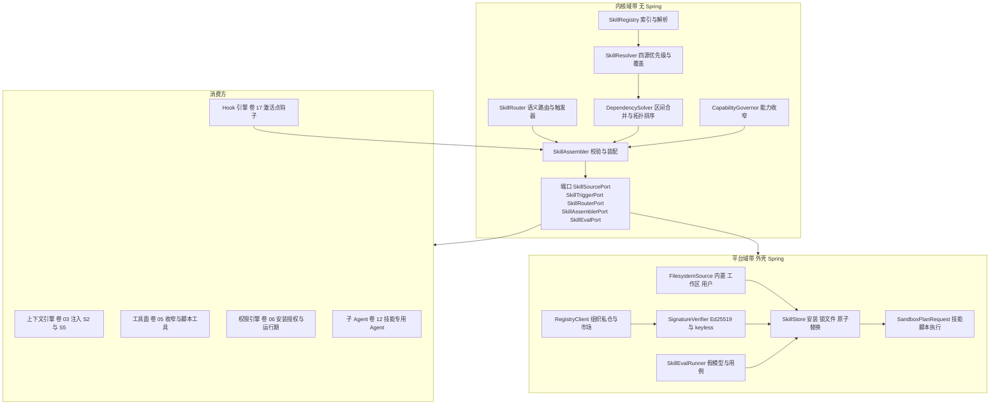
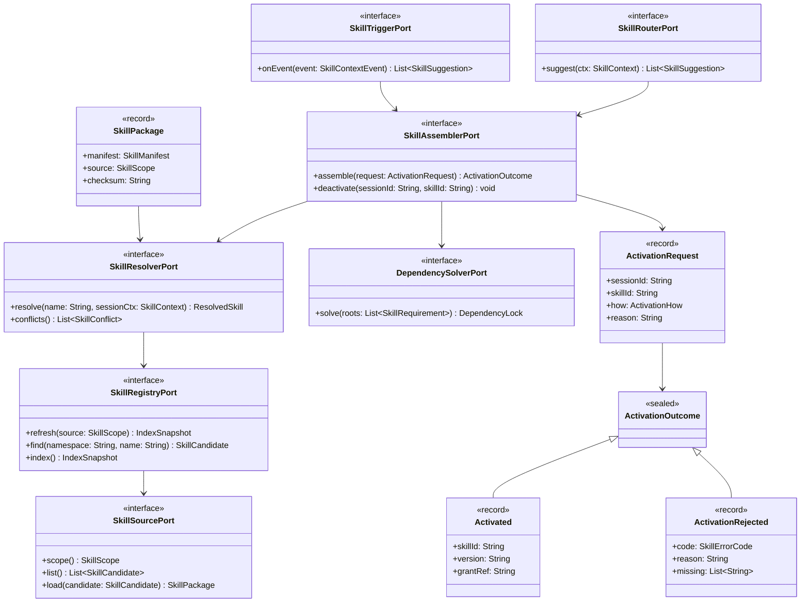
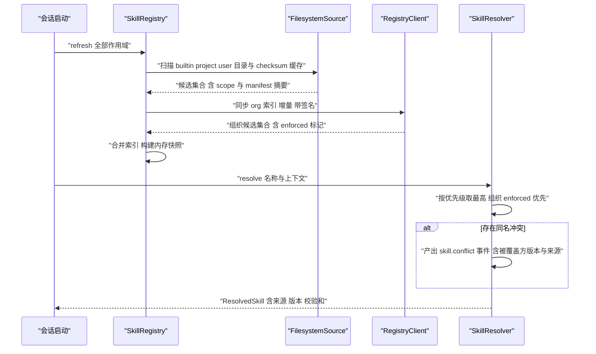
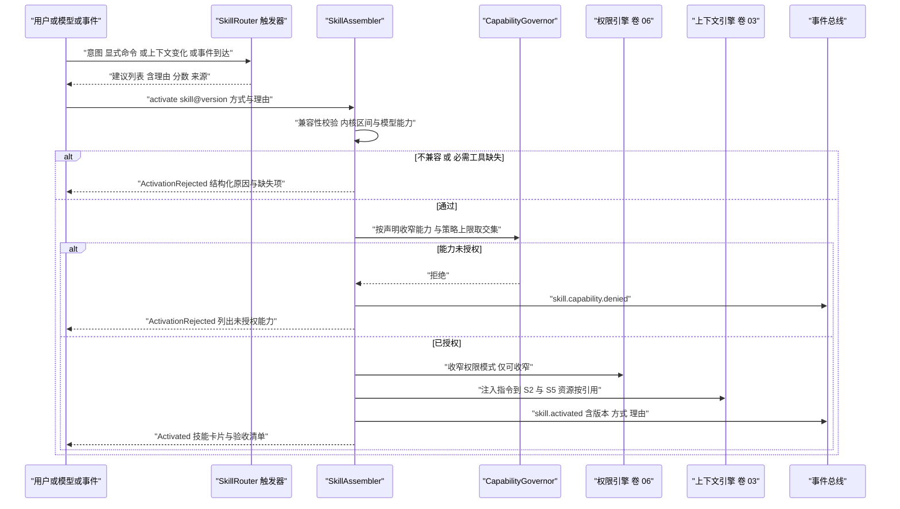
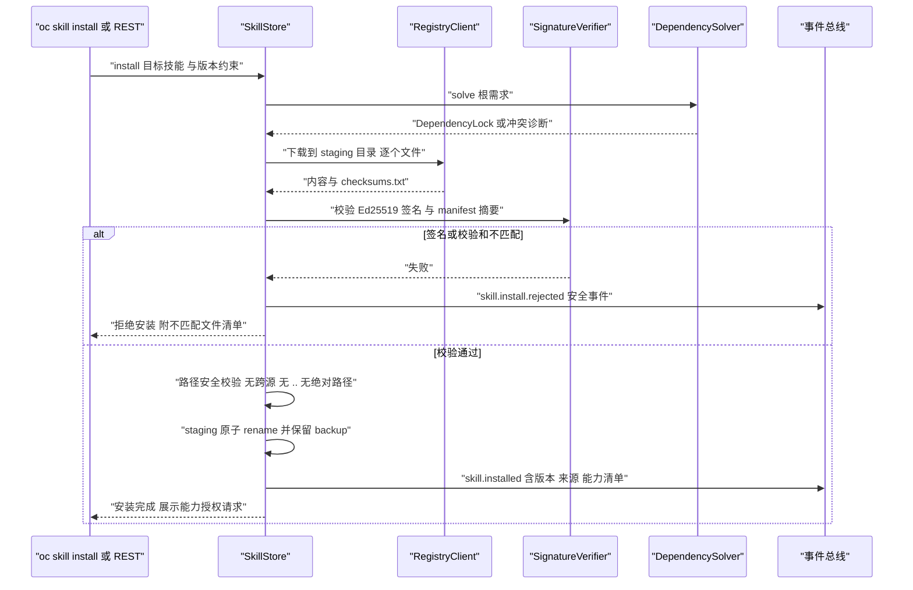
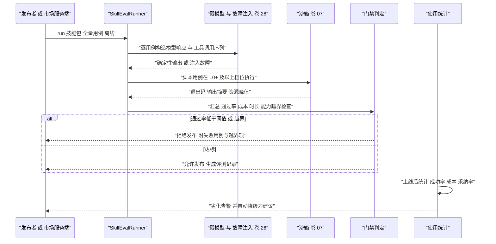
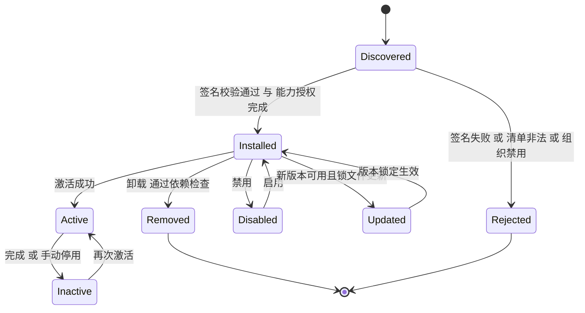
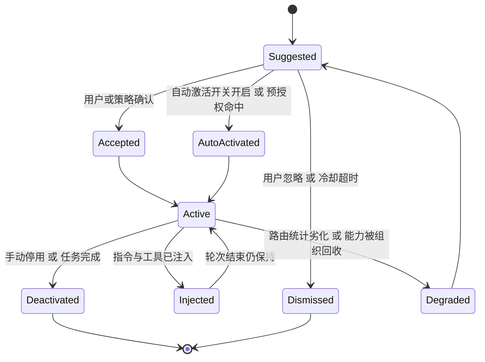

# Phase B 实现方案 08 · Skill 系统（Skill System）

> **上游契约**：Phase A 卷 08《Skill 系统》§2–§8（REQ-SKILL-1…10）、决策 D-SKILL-1…10；关联卷：04（提示词资产）、05（工具）、06（权限）、07（沙箱）、12（子 Agent）、17（Hooks）、18（插件）、26（评测）。
> **定位**：Phase A 回答「技能是什么、与插件/工具/提示词如何分层」，本文件回答**「技能包长什么样、如何被发现与激活、能力如何收窄、如何评测与签名分发、脚本在什么边界内执行」**。
> **竞品证据**：`research/competitors/01-claude-code-purpose-built.md`（E2：`SKILL.md` frontmatter 全可选、正文仅在使用时加载的渐进披露；E1 衍生品：目录扫描与 gitignore 规则）、`03-codex.md`（E1：`SkillMetadata`/`SkillScope{User,Repo,System,Admin}`/`SkillPolicy.allow_implicit_invocation` 默认 true、`SkillInterface` 品牌化卡片、`@` 提及与 `skills/list` RPC）、`04-deepseek-harness.md`（E1：`skill-filesystem` 形态、frontmatter 布尔解析**拒绝而非放行**、`disable-model-invocation`/`user-invocable`、目录注入上下文）、`08-gemini-cli.md`（E1：`activate_skill` 工具、内置仅两技能、扩展清单即发行单元 + 完整性哈希、Auto Memory 产出 `SKILL.md` 草稿需用户批准）、`02-opencode.md`（E1：四类发现源与同名处理、远程拉取四重安全校验与 staging→rename 原子替换、`skill` 权限被禁则跳过注入）。
> **不修改 Phase A**：选定分支均落在 D-SKILL-1…10 内；新增实现级决策登记为 `I-SKILL-n`。

---

## 1. 实现目标与范围

### 1.1 本组件解决什么

1. **内容层抽象**：把「过程知识 + 资源 + 脚本 + 工具声明 + 验收清单」打包为可版本化、可签名、可评测的单元，与插件（代码层）严格分工。
2. **可发现的装配**：四源发现与优先级、四种激活方式、能力收窄与工具集收窄，全部**可解释**（每次激活都能回答「为什么这条技能生效」）。
3. **供应链治理**：语义化版本 + 依赖求解 + 锁文件 + 签名校验 + 评测门禁，使技能可复现、可回滚、可审计。
4. **执行边界**：技能脚本与技能声明的工具调用一律经卷 07 沙箱与卷 06 权限治理，技能**只能收窄**权限。

### 1.2 本组件不解决什么

| 不解决 | 归属 |
| --- | --- |
| 提示词资产版本与组装流水线 | 卷 04（技能指令以「片段 + 模板」进入其资产系统） |
| 工具实现与执行管线 | 卷 05（技能只声明依赖与收窄，不定义新工具实现） |
| 代码级扩展装载（进程、依赖、SPI 注入） | 卷 18（插件可携带技能，技能不能反向携带插件） |
| 脚本与命令的隔离实现 | 卷 07（技能提供 `SandboxPlanRequest` 的意图，执行档位由沙箱选择） |

### 1.3 上下游依赖

| 方向 | 依赖方 | 契约 |
| --- | --- | --- |
| 上游 | 卷 04 提示词 | 技能指令 → 资产片段；技能版本锁定 ⇒ 提示词版本集合包含技能版本 |
| 上游 | 卷 03 上下文 | 技能指令注入 S2（模式与角色）与 S5（知识检索）区段；资源按需引用 |
| 上游 | 卷 05 工具 | `tools.required` 缺失 ⇒ 拒绝激活；技能脚本注册为受限「脚本工具」 |
| 上游 | 卷 06 权限 | 安装期能力授权 + 运行期逐动作决策；技能只能收窄模式 |
| 上游 | 卷 07 沙箱 | 技能脚本与命令走 `SandboxPlanRequest`（能力声明映射为网络/写范围/命令白名单） |
| 下游 | 卷 16/19 | `skill.*` 事件；`oc_skill_*` 表与锁文件 |
| 下游 | 卷 22/23/26 | CLI 与桌面端技能面板；评测运行器共用卷 26 的假模型与故障注入 |

### 1.4 归属分带与模块落位（卷 27 §4.1 权威名；v1 列为迁移来源）

| 组件 | 带 | 目标模块 | v1 仓模块（迁移来源） | 装配方式 |
| --- | --- | --- | --- | --- |
| 清单模型、注册表、解析器、求解器、路由与装配决策 | 内核域带 | `harness-contract`（`com.hk.opencoding.contract.skill`）+ `harness-kernel/kernel-agent`（纯函数决策） | `open-coding-core-api`（`com.hk.opencoding.core.skill`）+ `open-coding-core-agent` | 零 Spring，可单测 |
| 文件系统来源、registry 客户端、签名校验、评测运行器 | 平台域带 | `harness-platform/platform-skill`（`skill` 子包） | `open-coding-infrastructure` | Spring 装配，`@ConditionalOnMissingBean` |
| 安装记录、锁文件、激活记录 | 平台域带 | `harness-platform/platform-persistence`（`oc_skill_*` + Flyway） | `open-coding-domain` | MyBatis-Plus，`@TableName` 逐表声明 |
| REST/CLI/JSON-RPC 面 | 交互域带 | `harness-host/host-protocol` | `open-coding-interfaces` | Spring MVC + 会话协议 |

> 模块名桥接（R07 收敛）：目标名以卷 27 §4.1/§4.3 为准（卷 08 → `platform-skill`）；v1 名列仅供迁移期对账，**构建与 `-pl` 选择器只允许目标名**。

### 落地核对（R07：模块 / 顺序 / 批次 / 门禁 / I-* 落点）

- **实施顺序（卷 27 §4.5）**：第 17 步「Skill（装载 + 激活 + 用例）与 MCP（client）」，依赖第 4 步（工具运行时：技能声明的工具集）与第 14 步（任务/计划：技能的用例与触发面）。**与 impl/18 的关系**：技能可作为插件分发载体，故 08 早于 18（第 18 步），18 不得反向依赖 08 的实现类，只经 `SkillSourcePort` 端口。
- **数据批次（卷 27 §4.4）**：`oc_skill_package`、`oc_skill_version`、`oc_skill_activation`、`oc_skill_source`、`oc_skill_dependency_lock`、`oc_skill_eval_run` → **B6**（插件/Skill/Hook/MCP + 企业），依赖 B1–B5。
- **门禁映射（卷 27 §4.6）**：优先级/清单/求解单测 → 「单元测试 + 覆盖率门」；四源发现与签名/沙箱边界 → 「集成测试」；SPI 兼容与 `skill.*` 事件快照 → 「契约测试」；离线评测评测挂钩 → 「离线评测（核心集按变更矩阵选子集）」。
- **I-* 落点**：I-SKILL-1 → `kernel-agent`（`ProgressiveDisclosureLoader`）+ `harness-contract`（`SkillManifest`）；I-SKILL-2 → `kernel-agent`（`DependencySolver`）；I-SKILL-3 → `kernel-agent`（`SkillActivationAdvisor` 三段式）；I-SKILL-4 → `platform-skill`（`SkillSignatureVerifier`）+ `harness-contract`（信任根引用）；I-SKILL-5 → `platform-persistence`（`oc_skill_source` 作用域字段）；I-SKILL-6 → `harness-host/host-bootstrap`（草稿准入装配 + 用例强制）+ `platform-persistence`（`oc_skill_eval_run`）；I-SKILL-7 → `platform-sandbox`（复用 `SandboxPlanRequest`，最低 L0+）。

### 1.5 四条不可协商的不变式

| # | 不变式 | 违背后果 |
| --- | --- | --- |
| N1 | 技能**只能收窄**权限与工具集：`effective = declared ∩ policy ∩ userGrant`，任何路径不得放宽 | 视为权限系统缺陷（卷 06 交叉校验会拒绝装配） |
| N2 | 破损/未签名/能力未授权的技能**不得静默跳过装载**（Fail-Fast + 隔离并告警） | 供应链事故 |
| N3 | 每次激活（含自动激活）必须产生可解释事件（方式、命中依据、版本、能力授权引用） | 无法回溯「为什么这条技能生效」 |
| N4 | 技能正文与资源**按需加载**：索引常驻、正文仅激活时注入、资源按引用读取 | 上下文预算被技能洪泛击穿 |

---

## 2. 功能需求清单（REQ-SKILL-n）

| 编号 | 需求描述 | 来源 | 优先级 | 验收要点 |
| --- | --- | --- | --- | --- |
| REQ-SKILL-1 | 技能定义格式：`skill.md` + `manifest.yaml` + `resources/` + `scripts/` + `tools.yaml` + `tests/` + `policy.yaml`，缺必需文件装载期 Fail-Fast | 卷 08 §3 D-SKILL-1 | P1 | 7 类组成齐全；缺件报错含技能标识与缺失项 |
| REQ-SKILL-2 | 四源发现与优先级（内置 < 组织 < 工作区 < 用户），同名覆盖规则明确 | 卷 08 §3 D-SKILL-2、§4.1 | P1 | 覆盖用例全过；组织强制项不可被覆盖 |
| REQ-SKILL-3 | 四种激活方式（显式 / 模型自主 / 事件触发 / 上下文匹配）并存，默认「显式 + 建议」 | 卷 08 §3 D-SKILL-3 | P1 | 自动激活可开关；每次激活事件含理由 |
| REQ-SKILL-4 | 组合规则：技能可声明工具集收窄、必需工具、专用子 Agent、验收清单 | 卷 08 §3 D-SKILL-4 | P1 | 必需工具缺失拒绝激活；子 Agent 不继承更高权限 |
| REQ-SKILL-5 | 语义化版本 + 依赖锁定（技能/插件/工具/MCP）+ 兼容性声明（内核区间、模型能力） | 卷 08 §3 D-SKILL-5 | P1 | 同锁文件同行为；冲突输出结构化诊断 |
| REQ-SKILL-6 | 能力声明 + 安装授权 + 运行期治理（三重把关） | 卷 08 §3 D-SKILL-6 | P1 | 未授权能力导致 `skill.capability.denied`；不可绕过 |
| REQ-SKILL-7 | 评测：自带用例可离线运行 + 发布门禁（通过率/成本/时长）+ 在线反馈 | 卷 08 §3 D-SKILL-7 | P2 | 门禁阈值可配；劣化技能自动降级为「建议」 |
| REQ-SKILL-8 | 三层分发（本地/组织私仓/公共市场）+ 签名校验 + 企业可禁用公网 | 卷 08 §3 D-SKILL-8 | P2 | 未签名禁止装载（企业策略）；禁用公网生效 |
| REQ-SKILL-9 | 创作器：会话提炼草稿 + 脚手架 + 一键跑用例（人工评审后发布） | 卷 08 §3 D-SKILL-9 | P3 | 草稿可 diff；未过用例不可发布 |
| REQ-SKILL-10 | 使用统计与优化建议（激活次数/成功率/成本/时长/采纳率） | 卷 08 §3 D-SKILL-10 | P3 | 指标齐备；劣化检测可回放 |
| REQ-SKILL-11 | **渐进披露装载**：索引常驻（名称 + 描述 + 触发摘要），正文仅激活时加载；主指令长度上限默认 8k token | 竞品增量：01-claude-code §4.8 [E2]、04-deepseek §4.8 [E1] | P1 | 1k 技能索引构建 ≤ 300ms；超长技能拒绝激活并提示拆分 |
| REQ-SKILL-12 | **界面元数据内建**：`interface{displayName, icon, brandColor, defaultPrompt}` 供技能卡片与市场展示 | 竞品增量：03-codex §1 条目 8 [E1] | P2 | 卡片渲染字段完整；缺失时回退默认样式 |
| REQ-SKILL-13 | **清单严格校验**：未知字段告警、类型/枚举非法即**整体拒绝该技能**（不得静默沿用默认值放行） | 竞品增量：04-deepseek §4.8 [E1] | P1 | 非法布尔/拼写错误用例被拒并告警；不静默改正 |
| REQ-SKILL-14 | **远程拉取安全**：路径段安全校验、必须含 `SKILL.md`、拒绝跨源文件、staging → rename → backup 原子替换、失败回滚 | 竞品增量：02-opencode §4.8 [E1] | P1 | 四重校验用例全过；中断安装不残留半成品 |
| REQ-SKILL-15 | **激活工具化与权限门**：模型经 `skill` 工具请求激活；`skill` 能力被组织禁用时跳过注入且不可激活 | 竞品增量：08-gemini §4.8 [E1]（`activate_skill`）、02-opencode §4.8 [E1] | P1 | 工具调用可在审计中回溯；被禁能力无旁路 |
| REQ-SKILL-16 | **发行物完整性**：`checksums.txt`（BLAKE3 逐文件）+ 签名覆盖清单；扩展形态（插件携带技能）沿用同一完整性字段 | 竞品增量：08-gemini §1 条目 8 [E1] | P1 | 任一文件被篡改即拒绝安装 |
| REQ-SKILL-17 | **草稿生成回写审批**：从会话或 Auto Memory 类流程生成的技能草稿必须经人工批准后进入用户作用域 | 竞品增量：08-gemini §4.8 [E1] | P3 | 未批准草稿不参与发现；批准动作留痕 |

> 说明：REQ-SKILL-11…17 为竞品研究带来的增量需求，实现分别落在 §3.1（I-SKILL-1）、§8.1、§9.1（校验器）、§3.5（I-SKILL-5）、§3.3（I-SKILL-3）、§3.4（I-SKILL-4）、§3.6（I-SKILL-6）。

---

## 3. 技术方案选型（M×N 比选）

评分口径沿用 `README §4`：F 功能完备 ×30、U 用户体验 ×20、S 稳定与安全 ×25、M 可维护 ×25（满分 100）。

### 3.1 I-SKILL-1：主指令装载模型

| 分支 | 描述 | F | U | S | M | 加权 | 结论 |
| --- | --- | --- | --- | --- | --- | --- | --- |
| B1 全量注入 | 启动/装配时把全部技能正文塞入上下文 | 7 | 5 | 6 | 7 | 62.5 | 淘汰：上下文洪泛，与卷 03 预算冲突 |
| B2 渐进披露 | 索引常驻（名称 + 描述 + 触发摘要），正文仅激活时注入，资源按引用读取 | 9 | 8 | 9 | 8 | 85.5 | **选定** |
| B3 检索式 | 只给检索端点，模型按需检索技能片段 | 7 | 7 | 8 | 6 | 70 | 作为技能数量 > 5k 的扩展档保留 |

**选定 B2 的代价**：模型看不到全部技能细节，可能漏用；用「触发摘要 + 建议制 + 语义路由」补偿，并以使用统计（D-SKILL-10）持续调优。**上限硬约束**：单技能主指令默认 ≤ 8k token（卷 08 §10），超出拒绝激活并提示拆分到 `resources/`；激活注入总量受上下文预算二次校验（卷 03）。

### 3.2 I-SKILL-2：依赖求解策略

| 分支 | 描述 | F | U | S | M | 加权 | 结论 |
| --- | --- | --- | --- | --- | --- | --- | --- |
| B1 无求解（仅锁文件） | 实现最简 | 5 | 6 | 6 | 9 | 62.5 | 淘汰：无法处理安装期新增依赖 |
| B2 自研「区间合并 + 拓扑排序 + 显式冲突」求解器 | 依赖面小、可解释、无重依赖 | 8 | 8 | 8 | 9 | 82 | **选定** |
| B3 完整 PubGrub 类求解器 | 处理复杂回溯与多主版本 | 9 | 7 | 9 | 5 | 77.5 | 备选（依赖图 > 200 节点时启用） |

**选定 B2 的代价**：不支持复杂回溯（同一技能多主版本并存场景直接拒绝）；冲突诊断输出「约束来源链」而非自动回溯求解。**回退触发**（登记在 I-SKILL-2）：`dependencies` 图节点 > 200 或季度内冲突工单 > 20 时，引入 B3 并以同一锁文件格式输出。

### 3.3 I-SKILL-3：激活决策归属

| 分支 | 描述 | F | U | S | M | 加权 | 结论 |
| --- | --- | --- | --- | --- | --- | --- | --- |
| B1 纯规则（仅显式 + 触发器） | 可预测 | 6 | 6 | 9 | 8 | 71 | 基线 |
| B2 建议制三段式 | 规则/语义路由产出**建议**；模型可经 `skill` 工具**请求**激活；装配器校验能力与工具后生效；`autonomous` 下可按预授权自动激活 | 9 | 8 | 8 | 9 | 86 | **选定** |
| B3 模型完全自选 | 模型直接决定激活 | 8 | 8 | 5 | 6 | 68.5 | 淘汰：能力边界与上下文预算不可控 |

**选定 B2 的代价**：多一次建议交互（可被「自动激活」开关与预授权策略吸收）；语义路由需要模型调用（本地小模型或企业模型），引入延迟 → 用「异步路由 + 首轮前完成」缓解。

### 3.4 I-SKILL-4：签名与信任模型

| 分支 | 描述 | F | U | S | M | 加权 | 结论 |
| --- | --- | --- | --- | --- | --- | --- | --- |
| B1 仅内容哈希（无签名） | 最简 | 5 | 8 | 4 | 9 | 60 | 淘汰：无法验证发布者 |
| B2 Ed25519 + 组织信任根 + 摘要 pin | 离线可校验、密钥可控 | 9 | 8 | 9 | 8 | 86 | **选定** |
| B3 Sigstore keyless（OIDC 身份） | 无密钥管理、公共市场友好 | 8 | 7 | 8 | 6 | 74 | 作为公共市场可选通道叠加 |

**选定 B2 的代价**：组织需托管信任根与轮换流程（提供 `trust-root` 清单与轮换工具）；公共市场身份弱绑定 → 由 B3 叠加补齐（`marketplace` 作用域可用 keyless）。**选定 B2 的代价（I-SKILL-5）**：安装记录需区分「来源渠道」与「运行时作用域」两个维度（`oc_skill_source.channel` + `install_scope`，§8.1）；口径说明：任务书所称「市场来源」实现为获取通道，运行时优先级严格保持卷 08 §4.1 的「内置 < 组织 < 工作区 < 用户」四档。

### 3.5 I-SKILL-5：市场来源的运行时映射

| 分支 | 描述 | F | U | S | M | 加权 | 结论 |
| --- | --- | --- | --- | --- | --- | --- | --- |
| B1 市场作为第五运行时作用域 | 语义直观 | 6 | 6 | 6 | 7 | 62.5 | 淘汰：与卷 08 §4.1 四源优先级冲突，且优先级不可解释 |
| B2 市场仅作**获取通道**，安装物落入 `org` 或 `user` 作用域 | 优先级仍为四档，来源可回溯（`source` 字段） | 9 | 8 | 8 | 9 | 86 | **选定** |
| B3 市场技能以临时作用域挂载 | 不污染本地目录 | 6 | 5 | 7 | 7 | 63 | 淘汰：离线与复现不可控 |

**选定 B2 的代价**：需要在安装记录里区分「来源渠道（local/org-registry/marketplace）」与「运行时作用域（org/user）」两个维度；用 `oc_skill_source` + `install_scope` 双字段表达（§8.1）。
**口径说明**：本文件把任务书所称「市场来源」实现为获取通道，运行时优先级严格保持卷 08 §4.1 的「内置 < 组织 < 工作区 < 用户」四档。

### 3.6 I-SKILL-6：草稿与自动生成技能的准入门槛

| 分支 | 描述 | F | U | S | M | 加权 | 结论 |
| --- | --- | --- | --- | --- | --- | --- | --- |
| B1 自动生成并自动启用 | 门槛最低 | 7 | 8 | 3 | 6 | 59.5 | 淘汰（卷 08 D-SKILL-9 已排除） |
| B2 草稿 → 人工批准 → 用户作用域 + 强制跑用例 | 安全且降低创作门槛 | 8 | 9 | 8 | 8 | 82.5 | **选定** |
| B3 仅脚手架，不生成 | 最安全 | 5 | 5 | 9 | 9 | 68 | 基线 |

**选定 B2 的代价**：需要评审界面与 diff 视图（客户端工作量）；草稿状态需要持久化（`oc_skill_package.status = DRAFT`）。

---

## 4. 总体架构图

### 4.1 组件与数据流



**装配点**：`SkillAutoConfiguration`（`harness-host/host-bootstrap`）注册 `SkillSourcePort` 多实现（按 `scope` 排序）与 `SkillSignatureVerifier`；DB 版安装记录与锁文件位于 `harness-platform/platform-persistence`，以 `@ConditionalOnMissingBean` 覆盖内存实现。

### 4.2 四源发现与优先级

| 优先级 | 作用域 | 目录/来源 | 覆盖能力 | 典型内容 |
| --- | --- | --- | --- | --- |
| 1（最低） | `builtin` 内置 | 发行物内 `skills/builtin/`（只读） | 可被任何上层覆盖 | `skill-creator`、`repo-onboarding`、`release-notes` |
| 2 | `org` 组织 | 企业 registry 同步目录 + 组织策略下发 | 覆盖内置；`enforced: true` 时**不可**被上层覆盖 | 组织规范、合规检查、内部平台操作 |
| 3 | `project` 工作区 | `<workspace>/.oc/skills/`（随仓库提交，可评审） | 覆盖内置与组织（组织强制项除外） | 项目构建、测试、发布流程 |
| 4（最高） | `user` 用户 | `OC_HOME/skills/user/`（含从市场安装物） | 覆盖前三者（组织强制项除外） | 个人工作流、常用脚手架 |

**市场（marketplace / 组织私仓）不是运行时作用域**：它是获取通道；安装时按 `install_scope` 落盘到 `org` 或 `user` 目录，来源渠道记录在 `oc_skill_source.channel`（见 §3.5、§8.1）。同名技能在不同作用域并存时：取最高优先级；`org.enforced` 为真时取组织版本并产生 `skill.conflict` 事件（含被覆盖方版本与来源）。同作用域内同名多版本：锁文件裁决；无锁文件时取最高兼容版本并记录告警。

### 4.3 四种激活方式与默认策略

| 方式 | 触发面 | 默认行为 | 可解释字段 |
| --- | --- | --- | --- |
| 显式命令 | `/skill-name`、`oc skill run`、JSON-RPC `skill.activate`、`@` 提及 | 直接激活（仍需能力校验） | `how=EXPLICIT`、调用来源 |
| 模型自主 | `skill` 工具（`list`/`search`/`activate`） | 请求激活 → 装配器校验 → 生效 | `how=MODEL_REQUEST`、工具调用 ID |
| 事件触发 | 事件总线类型 + 条件表达式（如 `git.branch.created`、`task.completed`、`file.changed` 匹配 `**/Dockerfile`） | 生成**建议**（`autonomous` 预授权范围内可直接激活） | `how=EVENT`、事件 ID、条件求值结果 |
| 上下文匹配 | 文件模式、命令前缀、会话模式、关键词、语义路由分数 | 生成**建议**（默认）；开启自动激活后生效 | `how=CONTEXT_MATCH`、命中规则与分数 |

**统一约束**：自动激活必须可开关（用户级 + 组织级，组织可强制关闭）；每次激活产生 `skill.activated`（含版本、方式、理由、能力授权引用）；建议链路产生 `skill.suggested`/`suggestion.accepted`/`suggestion.rejected` 用于调优路由阈值。

### 4.4 能力声明 → 四类边界的映射（收窄）

| 声明 | 映射到卷 07 的边界 | 风险类（卷 06） | 收窄规则 |
| --- | --- | --- | --- |
| `capabilities.network.domains` | `NetworkSpec.allowlist`（L1+ 由 netns 强制；L0+ 为约定式并标注） | R2 | 与用户/租户白名单取交集 |
| `capabilities.exec.commands` | 命令白名单（精确或前缀） | R3 | 与策略命令黑名单取差集；未命中即拒绝（不落回通用 `run_command`） |
| `capabilities.fs.writeScopes` / `readScopes` | `MountSpec` 读写卷 | R1/R2 | 与工作区根取交集；治理路径与密钥文件恒排除 |
| `capabilities.secrets.refs` | `CredentialLeaseSpec`（仅引用，不含值） | R4 | 未授权引用直接拒绝；日志只出现 leaseId |
| `capabilities.subagent.spawn` | 子 Agent 定义（隔离档 ≥ 技能当前档） | R2 | 子 Agent **不继承**技能的更高权限 |
| `capabilities.mcp.servers` | MCP 网关连接白名单（卷 09） | R2 | 技能不得自带未声明连接 |
| `capabilities.tools.invoke` | 工具集收窄（`tools.yaml`） | R0–R3 | 只能收窄；必需工具缺失 ⇒ 拒绝激活 |

**双重把关**：安装期展示能力清单 + 请求范围 + 风险等级（由上表映射）→ 用户/管理员同意；运行期每次动作仍由卷 06 逐动作决策（N1 不变式）。

**未声明即拒绝（deny-by-default）**：除「读范围默认工作区根（只读）」外，未在清单声明的能力一律视为空集——网络域名、命令白名单、密钥引用、**写范围**、子 Agent 派生、MCP 连接均默认不可用（与 §4.5 默认值列逐项一致）；安装授权界面必须逐项展示「声明范围 vs 实际授予」，禁止以默认值代替显式同意，也禁止「先授予后补声明」。

### 4.5 技能包结构与 manifest 字段全表

```text
<package-root>/                 # 目录即包；安装后落盘 OC_HOME/skills/<install_scope>/<namespace>/<name>/<version>/
  manifest.yaml                 # 元数据与全部声明（必需）
  skill.md                      # 主指令：过程知识、检查清单、决策规则、输出规范（必需）
  resources/                    # 模板、示例、参考文档（按需引用，不默认注入）
  scripts/                      # 可执行脚本（经沙箱执行；解释器白名单）
  tools.yaml                    # 工具依赖与收窄声明（required / optional / denied）
  policy.yaml                   # 建议权限模式与网络白名单收窄建议
  tests/                        # 自带评测用例（发布到市场必需）
  checksums.txt                 # 逐文件 BLAKE3
  signatures/manifest.sig       # Ed25519 签名（org/marketplace 必需）
```

| 分组 | 字段 | 类型 | 必填 | 默认 | 说明 |
| --- | --- | --- | --- | --- | --- |
| 标识 | `namespace` | string | 是 | — | 三段式 `org.team`，防命名冲突 |
| 标识 | `name` | string | 是 | — | 技能名（小写连字符） |
| 标识 | `version` | semver | 是 | — | 语义化版本；锁文件按此求解 |
| 标识 | `description` | string | 是 | — | 一句话描述（索引常驻展示） |
| 标识 | `keywords` | string[] | 否 | `[]` | 检索与语义路由辅助 |
| 标识 | `author` / `license` / `homepage` / `repository` | string | 否 | 空 | 归属与合规信息 |
| 展示 | `interface.displayName` / `icon` / `brandColor` | string | 否 | 由 `name` 推导 | 技能卡片渲染（REQ-SKILL-12） |
| 展示 | `interface.defaultPrompt` | string | 否 | 空 | 卡片一键启用时的预填提示 |
| 兼容 | `compatibility.kernel` | range | 是 | — | 内核版本区间（如 `>=1.0 <2.0`），不符拒绝激活 |
| 兼容 | `compatibility.models` | string[] | 否 | `[]` | 必需模型能力（`tools`/`vision`/`thinking`），缺失拒绝激活 |
| 兼容 | `compatibility.platforms` | string[] | 否 | 全平台 | 限制操作系统（如仅 `linux`） |
| 作用域 | `scope` | enum | 否 | 由安装位置推导 | `builtin/org/project/user`（运行时不写入手动覆盖） |
| 作用域 | `enforced` | bool | 否 | `false` | 组织强制：不可被上层同名覆盖 |
| 触发 | `triggers[]` | object[] | 否 | `[]` | 每项含 `type` ∈ {`command`,`filePattern`,`eventType`,`mode`,`keyword`,`contextMatch`} 与参数 |
| 能力 | `capabilities.network.domains` | string[] | 否 | `[]` | 出网域名白名单（与租户白名单取交集） |
| 能力 | `capabilities.exec.commands` | string[] | 否 | `[]` | 命令白名单（精确或前缀）；未命中即拒绝 |
| 能力 | `capabilities.fs.readScopes` / `writeScopes` | string[] | 否 | 读默认工作区根（只读）；**写默认空——未声明即无写权** | 读写范围（与工作区根取交集）；写范围必须在安装授权中显式声明，治理路径与密钥文件恒排除 |
| 能力 | `capabilities.secrets.refs` | string[] | 否 | `[]` | 凭证引用名（只引用不取值） |
| 能力 | `capabilities.subagent.spawn` | bool | 否 | `false` | 允许派生专用子 Agent |
| 能力 | `capabilities.mcp.servers` | string[] | 否 | `[]` | 依赖的 MCP server 名（须已在网关声明） |
| 工具 | `tools.required` | string[] | 否 | `[]` | 缺失 ⇒ 拒绝激活 |
| 工具 | `tools.optional` | string[] | 否 | `[]` | 存在则收窄其权限 |
| 工具 | `tools.denied` | string[] | 否 | `[]` | 显式禁用（不得与 required 冲突） |
| 权限 | `permissions.recommendedMode` | enum | 否 | 不变更 | 仅可建议收窄，**不得放宽**用户当前模式 |
| 权限 | `permissions.maxMode` | enum | 否 | `default` | 声明可用上限；运行期以用户模式为准 |
| 脚本 | `scripts[]` | object[] | 否 | `[]` | 每项含 `path`/`runtime`/`timeoutSeconds`/`network`；runtime 须在解释器白名单内 |
| 子 Agent | `agents[]` | object[] | 否 | `[]` | 每项含 `name`/`systemPromptRef`/`tools`/`minIsolationTier` |
| 验收 | `acceptance[]` | object[] | 否 | `[]` | 每项含 `id`/`statement`/`evidence`（证据类型：命令输出、文件哈希、测试结果） |
| 评测 | `eval.entry` | string | 推荐 | `tests/` | 用例入口；市场发布必填 |
| 评测 | `eval.baseline` | object | 否 | 空 | 基线通过率/成本/时长，用于劣化检测 |
| 依赖 | `dependencies.skills` / `plugins` / `tools` / `mcp` | object[] | 否 | `[]` | 每项含 `id` + semver 区间；求解后写入锁文件 |
| 预算 | `budget.maxInstructionTokens` | int | 否 | `8000` | 主指令上限（全局上限为硬约束） |
| 预算 | `budget.maxResourceBytes` | long | 否 | `10485760` | 单次按需读取上限 |
| 生命周期 | `stability` | enum | 否 | `stable` | `experimental`/`stable`/`deprecated` |
| 生命周期 | `deprecatedBy` | string | 否 | 空 | 替代技能标识（`stability=deprecated` 时必填） |
| 分发 | `signature` / `publisher` / `visibility` | object/string | 否 | 空 | 签名引用、发布者身份、可见性（`private`/`org`/`public`） |

**校验语义（REQ-SKILL-13）**：未知字段 → WARN 并忽略（向前兼容）；已知字段类型/枚举非法、`required` 与 `denied` 冲突、`recommendedMode` 高于 `maxMode`、缺 `checksums.txt`/签名（受控作用域）→ **整体拒绝装载**并给出字段路径与技能标识，禁止静默改正。

### 4.6 与提示词、工具、Hooks、子 Agent 的关系

| 系统 | 关系 | 边界 |
| --- | --- | --- |
| 提示词（卷 04） | 技能指令作为「片段 + 模板」进入资产系统；技能版本锁定纳入提示词版本集合 | 技能不定义新的组装流水线；灰度与覆盖规则随卷 04 |
| 工具（卷 05） | 技能收窄工具集（`tools.yaml`）；技能脚本注册为受限「脚本工具」（`skill:<ns>:<name>:<script>`） | 技能不得定义新工具实现（必须走插件，卷 18） |
| Hooks（卷 17） | 技能可声明生命周期脚本；`skill.activate` 为 Hook 点，组织可用阻断性 Hook 否决激活 | Hook 判定优先于自动激活开关与预授权 |
| 子 Agent（卷 12） | 技能可声明专用子 Agent（工具集、隔离档、预算上限） | 子 Agent 不继承技能的更高权限（N1） |
| 上下文（卷 03） | 注入 S2（模式与角色）与 S5（知识检索）；`resources/` 以 `skill://<ns>/<name>@<ver>/resources/x.md` 引用 | 资源不默认全量注入（N4） |
| 记忆（卷 10） | 技能使用结果可写入记忆候选（如「该仓库用 pnpm」） | 写入仍需候选-确认链路 |

---

## 5. 类图与 Java 21 签名



**Java 21 关键签名**（节选；完整形态见 `com.hk.opencoding.core.skill`）

```java
/**
 * 技能作用域。
 * 声明顺序即优先级（序号大者覆盖序号小者）；市场是获取通道而非作用域（I-SKILL-5）。
 */
@Getter
@RequiredArgsConstructor
public enum SkillScope {
    /** 内置技能：随产品发行，只读 */
    BUILTIN("builtin", "内置"),
    /** 组织技能：企业 registry 同步，可标记 enforced 强制 */
    ORG("org", "组织"),
    /** 工作区技能：仓库内 .oc/skills，随代码评审 */
    PROJECT("project", "工作区"),
    /** 用户技能：用户目录，含从市场安装物 */
    USER("user", "用户");

    /** 作用域编码（DB 与事件只存 code） */
    private final String code;

    /** 中文描述（界面展示） */
    private final String desc;

    /**
     * 判断当前作用域优先级是否高于另一作用域。
     *
     * @param other 比较目标（必填）
     * @return 当前作用域优先级更高时为 true
     */
    public boolean outranks(SkillScope other) {
        return ordinal() > other.ordinal();
    }
}
```

```java
/**
 * 技能装配端口。
 * 唯一允许激活技能的入口；负责能力收窄、工具可用性、兼容性与依赖锁校验。
 */
public interface SkillAssemblerPort {

    /**
     * 装配并激活技能：校验兼容性 → 校验必需工具 → 收窄能力与权限 → 注入上下文与工具面。
     *
     * @param request 激活请求（必填；含会话、技能标识、激活方式与理由）
     * @return 激活成功返回 {@link Activated}；能力未授权、工具缺失或版本冲突返回 {@link ActivationRejected}
     */
    ActivationOutcome assemble(ActivationRequest request);

    /**
     * 停用技能并释放其注入的上下文与受限工具（幂等）。
     *
     * @param sessionId 会话标识（必填）
     * @param skillId 技能标识，形如 {@code org.team.skill-name}（必填）
     */
    void deactivate(String sessionId, String skillId);
}
```

```java
/**
 * 依赖求解端口。
 * 输入根需求集合，输出确定性锁文件；冲突时必须给出约束来源链而非静默取最高版本。
 */
public interface DependencySolverPort {

    /**
     * 求解依赖并生成锁文件。
     *
     * @param roots 根需求集合（必填，可为空集合表示仅求解当前安装集）
     * @return 依赖锁（含每个技能解析后的版本、来源、校验和与传递依赖）
     * @throws SkillDependencyException 区间交集为空、同一技能多主版本或存在硬循环依赖时抛出
     */
    DependencyLock solve(List<SkillRequirement> roots);
}
```

```java
/**
 * 技能清单（manifest.yaml 的强类型投影）。
 * 所有可选字段在缺失时取 YAML 中声明的默认值；类型/枚举非法一律拒绝整体装载（REQ-SKILL-13）。
 *
 * @param identity 标识与版本
 * @param compatibility 兼容性声明
 * @param capabilities 能力声明（只用于收窄）
 * @param tools 工具依赖与收窄声明
 * @param triggers 触发条件集合
 * @param budget 资源与上下文预算上限
 */
public record SkillManifest(
        SkillIdentity identity,
        SkillCompatibility compatibility,
        SkillCapabilities capabilities,
        SkillToolSpec tools,
        List<SkillTrigger> triggers,
        SkillBudget budget) {

    /**
     * 校验清单内部一致性。
     *
     * @throws SkillManifestException 必填字段缺失或类型非法时抛出（消息含字段路径与技能标识）
     */
    public SkillManifest {
        // 记录类型构造即校验：不合法直接抛业务异常，禁止带着半合法清单进入注册表
        SkillManifestValidator.requireValid(identity, compatibility, capabilities);
    }
}
```

> 异常纪律：技能相关失败统一抛 `SkillException extends HarnessException`（携带 `SkillErrorCode { SKILL_MANIFEST_INVALID, SKILL_CAPABILITY_DENIED, SKILL_DEPENDENCY_CONFLICT, SKILL_SIGNATURE_INVALID, SKILL_TOOL_MISSING, SKILL_BUDGET_EXCEEDED }`，映射到内核 `ErrorCode`）；`SkillManifestException` / `SkillDependencyException` 为其细化子类，不另立平行体系。**异常命名分层（全套统一）**：内核层（framework-free core，技能装载与激活的全部实现）失败抛 `HarnessException` 及上述子类；外壳层（domain / application / interfaces 的技能管理面、市场拉取、签名校验适配）失败抛 `BusinessException`；两侧均**禁止**裸 `RuntimeException`，禁止在装载循环里 `try-catch` 后静默跳过（N2）。**契约缺口指针（X-82）**：异常类名与冻结卷册 `ErrorCode` 映射的登记缺口已列为修订建议 **X-82**（`impl/IMPL-DECISIONS.md` §4；本文件不改台账）。

---

## 6. 核心流程时序图

### 6.1 四源发现、优先级解析与冲突裁决



- **前置条件**：各来源目录可读；组织索引可访问（离线时使用上次快照并告警）。
- **主路径**：扫描 → 合并 → 优先级裁决 → 缓存快照。**异常与补偿**：单个技能清单非法 ⇒ **隔离该技能**（不装载）+ 告警，不影响其他技能；目录不可读 ⇒ 记录并继续（不中断注册表构建）。
- **幂等与并发点**：`refresh` 以 checksum 去重（未变文件不重解析）；索引构建期间读到旧快照，构建完成原子替换。

### 6.2 激活（显式 / 建议确认 / 模型请求）与失败关闭



- **前置条件**：技能已安装且通过签名校验；锁文件已生成（存在依赖时）。
- **主路径**：建议/请求 → 兼容性 → 工具可用性 → 能力收窄 → 权限收窄 → 上下文注入 → 事件。**异常与补偿**：注入过程中上下文预算不足 ⇒ 回滚注入（幂等撤销）并返回 `SKILL_BUDGET_EXCEEDED`；激活成功后会话中断 ⇒ 重新 attach 时按激活记录重建注入。
- **幂等与并发点**：同会话重复激活同一版本幂等（返回既有激活记录）；并发激活按会话串行化（会话级单飞）；技能脚本工具注册与注销需成对。

### 6.3 安装、签名校验与原子替换



- **前置条件**：registry 凭据（组织私仓）或在允许的公网市场范围内；本地无同版本冲突。
- **主路径**：求解 → 下载 staging → 双校验 → 原子替换 → 事件 → 能力授权。**异常与补偿**：下载中断 ⇒ 清理 staging（不留半成品）；rename 失败 ⇒ 从 backup 回滚并以 `skill.install.failed` 记录根因（借鉴 opencode 的 staging→rename→backup 语义 [E1]）。
- **幂等与并发点**：同版本重复安装为 no-op（比对 checksum）；同一技能并发安装按技能级互斥锁串行。

### 6.4 评测门禁与劣化降级



- **前置条件**：用例可离线运行（假模型可用）；沙箱 L0+ 可用（不可用时用例标记 blocked 而非通过）。
- **主路径**：用例执行 → 断言 → 门禁 → 评测记录；上线后统计驱动降级。**异常与补偿**：用例超时 ⇒ 该用例失败并记录（不重试超过 1 次）；成本超基线 ⇒ 门禁失败（阈值可配）。
- **幂等与并发点**：同一版本评测结果按 checksum 缓存；评测运行持有版本级互斥锁（防重复跑）。

---

## 7. 状态机

### 7.1 `SkillPackage` 生命周期



不变式：(a) 进入 `Active` 前必须完成能力收窄与工具可用性校验并写入激活记录；(b) `Updated` 必须携带新旧版本与锁文件差异；(c) 卸载被依赖技能时必须显式强制并记录原因。

### 7.2 `ActivationRecord` 生命周期



不变式：`AutoActivated` 与 `Accepted` 都必须携带理由字段（触发规则 ID / 语义分数 / 事件 ID），用于回答「这条技能为什么生效」。

---

## 8. 数据模型

### 8.1 表（`oc_*`）

**类型约定（本节各表通用；逐列 DDL 以卷 19 的 Flyway 迁移脚本为准）**：内部主键 `id BIGINT`（Snowflake）或复合主键（如 `(tenant_id, …)`）；对外暴露的引用 ID 用不透明字符串 / `UUID`（防遍历）；时间列统一 `TIMESTAMPTZ`（UTC 存储、展示层本地化）；枚举列存 `VARCHAR(32)` 的 **code**（禁止存 desc）；结构化与可变结构用 `JSONB`；布尔列 `BOOLEAN NOT NULL DEFAULT false`；敏感字段（密钥 / Token）只存引用名 `*_ref`，明文永不入库；大对象（快照 / 录制 / 工件）外置并留指针；各表字段语义见「关键字段」列，索引与唯一约束见末列。

| 表 | 关键字段 | 索引与约束 |
| --- | --- | --- |
| `oc_skill_package` | `id`、`namespace`、`name`、`scope`、`status`、`enforced`、`install_scope`、`source_channel`、`checksum`、`signature_ref`、`publisher_ref`、`created_at` | UK(`namespace`,`name`,`scope`)；IDX(`status`)、IDX(`install_scope`,`source_channel`) |
| `oc_skill_version` | `id`、`package_id`、`version`、`manifest_json`、`skill_md_token_count`、`eval_report_ref`、`yanked`、`published_at` | UK(`package_id`,`version`)；IDX(`yanked`) |
| `oc_skill_dependency_lock` | `id`、`root_package_id`、`lock_json`、`resolved_count`、`generated_at` | UK(`root_package_id`)；`lock_json` 含每项 version/checksum/source |
| `oc_skill_activation` | `id`、`session_id`、`package_id`、`version`、`how`、`reason`、`grant_ref`、`active_from`、`active_to` | IDX(`session_id`,`active_from`)、IDX(`package_id`,`how`) |
| `oc_skill_eval_run` | `id`、`package_id`、`version`、`mode`、`pass_ratio`、`cost_micros`、`duration_ms`、`cases_json`、`created_at` | IDX(`package_id`,`version`,`created_at`) |
| `oc_skill_source` | `id`、`channel`、`url`、`trust_root_ref`、`enabled`、`sync_policy_json`、`last_sync_at` | UK(`channel`,`url`)；`enabled=false` 即禁用该通道 |

**字段约束**：`scope`/`status`/`how`/`channel` 全部存枚举 code（`SkillScope`/`SkillStatus`/`ActivationHow`/`SkillChannel`），禁止存 desc；`manifest_json` 为清单原文快照（用于复现与 diff），与 parsed 结构分离。

### 8.2 Redis Key（经统一 Key 工厂）

| Key 用途 | 生成方式 | TTL |
| --- | --- | --- |
| 技能索引快照版本号 | `RedisKeys.version(RedisKeys.Module.SKILL, "index")` | 无 TTL |
| 建议去抖（同技能冷却） | `RedisKeys.cooldown(RedisKeys.Module.SKILL, "suggest", skillId, sessionId)` | 可配（默认 300s） |
| 评测运行互斥锁 | `RedisKeys.lock(RedisKeys.Module.SKILL, "eval", packageId, version)` | 租约 600s |
| 远程拉取缓存 | `RedisKeys.cache(RedisKeys.Module.SKILL, "registry", channelHash)` | 1h |
| 使用统计计数器 | `RedisKeys.counter(RedisKeys.Module.SKILL, "usage", packageId)` | 24h 滚动 |

### 8.3 事件与指标

| 事件 | 载荷要点 | 消费者 |
| --- | --- | --- |
| `skill.discovered` / `installed` / `updated` / `removed` | 作用域、来源渠道、版本、校验和、能力清单 | 审计、UI 面板 |
| `skill.activated` / `deactivated` | 版本、`how`、理由、授权引用 | UI、路由调优、审计 |
| `skill.suggested` / `suggestion.accepted` / `suggestion.rejected` | 命中规则或分数、来源、冷却状态 | 路由调优、采纳率指标 |
| `skill.capability.denied` | 未授权能力项、策略引用、技能版本 | 审计、策略编辑引导 |
| `skill.eval.completed` | 通过率、成本、时长、失败用例 | 发布门禁、容量 |
| `skill.dependency.conflict` | 冲突技能、约束来源链、解决结论 | 审计、UI 诊断 |
| `skill.install.rejected` | 校验失败文件清单、签名主体 | 安全告警 |

**指标**：`oc_skill_active_total`、`oc_skill_activation_total{how}`、`oc_skill_eval_pass_ratio`、`oc_skill_cost_per_run`、`oc_skill_suggestion_accept_ratio`、`oc_skill_index_build_ms`。
**对象存储前缀**：技能归档 `skill/<channel>/<namespace>/<name>/<version>.tar.zst`；评测报告 `skill/<ns>/<name>/<version>/eval.json`。

---

## 9. 接口与扩展点

### 9.1 管理面（REST，权限点 `skill.manage` / `skill.read`）

| 端点 | 方法 | 说明 |
| --- | --- | --- |
| `/api/v1/skills` | GET / POST | 列表（按作用域、状态、标签过滤）与创建草稿 |
| `/api/v1/skills/{id}` | GET / PATCH / DELETE | 详情、编辑元数据、卸载（含依赖检查） |
| `/api/v1/skills/{id}/install` / `update` | POST | 安装/更新（携带版本约束与 `install_scope`） |
| `/api/v1/skills/{id}/enable` / `disable` | POST | 启用/禁用（组织策略可强制） |
| `/api/v1/skills/{id}/evaluate` | POST | 离线/在线评测并返回报告 |
| `/api/v1/skills/{id}/publish` | POST | 发布到私仓或市场（需签名与评测记录） |
| `/api/v1/skills/{id}/export` | GET | 导出技能包（含锁文件，可搬移复现） |
| `/api/v1/skill-sources` | CRUD | 通道管理（url、信任根、启用状态、企业禁用公网） |

### 9.2 会话面（JSON-RPC）

| 方法 | 方向 | 说明 |
| --- | --- | --- |
| `skill.activate` | C→S | 显式激活（含理由与方式） |
| `skill.deactivate` | C→S | 停用 |
| `skill.list` | C→S | 当前会话可用技能与激活状态 |
| `skill.suggest` | C→S | 请求一次建议计算（含阈值覆盖） |
| `skill.explain` | C→S | 解释某次激活或建议的依据（对齐 `permission.explain`） |
| `skill.suggested` | S→C | 建议通知（含理由与来源） |

### 9.3 CLI 命令面

| 命令 | 说明 |
| --- | --- |
| `oc skill list [--scope] [--status]` | 列出技能（默认四源合并视图，标注来源与优先级） |
| `oc skill show <ns.name>[@version]` | 展示清单、能力声明、授权状态、评测摘要 |
| `oc skill install <ns.name>[@range] [--scope org\|user]` | 安装（自动求解依赖并写锁文件） |
| `oc skill update / remove / enable / disable` | 生命周期操作（remove 有依赖检查） |
| `oc skill eval <ns.name>[@version] [--offline]` | 运行自带用例（默认离线假模型）；`--report` 输出评测工件 |
| `oc skill export / import <path>` | 技能包与锁文件的导出导入（跨实例复现） |
| `oc skill new / publish <path>` | 脚手架（含 7 类组成与示例用例）；发布（签名 + 评测门禁） |

### 9.4 SPI 扩展点（对齐卷 08 §5 与卷 18 目录）

| SPI | 签名要点 | 装配 |
| --- | --- | --- |
| `SkillSourceSPI` | `SkillScope scope(); List<SkillCandidate> list(); SkillPackage load(SkillCandidate c);` | 多实现按 scope 排序；目录/registry/插件内置各一 |
| `SkillTriggerSPI` | `Set<TriggerType> types(); List<SkillSuggestion> onEvent(SkillContextEvent e);` | 新事件源与新匹配模式 |
| `SkillRouterSPI` | `List<SkillSuggestion> suggest(SkillContext ctx);` | 语义路由实现（可接企业模型；离线时降级关键词匹配） |
| `SkillAssemblerSPI` | `ActivationOutcome around(ActivationRequest r, AssemblerChain next);` | 企业统一注入规范（如强制合规声明） |
| `SkillEvalSPI` | `EvalReport run(SkillPackage pkg, EvalMode mode);` | 评测运行器扩展（接入企业评测集群） |
| `SkillPublisherSPI` | `PublishResult publish(SkillPackage pkg, PublishTarget target);` | 私仓/市场发布通道 |
| `SkillSignatureVerifierSPI` | `VerifyResult verify(SkillPackage pkg, TrustRoot root);` | 叠加 keyless（Sigstore）验证通道（I-SKILL-4） |

### 9.5 配置项（`open-coding.*` + 环境变量）

```yaml
open-coding:
  skills:
    roots:
      builtin: ${OC_SKILLS_BUILTIN:classpath:skills/builtin}
      user: ${OC_SKILLS_USER:${OC_HOME}/skills/user}
    index-refresh-seconds: ${OC_SKILLS_INDEX_REFRESH:60}
    instruction-max-tokens: ${OC_SKILLS_INSTRUCTION_MAX_TOKENS:8000}   # 主指令上限，超出拒绝激活
    resources-max-bytes: ${OC_SKILLS_RESOURCE_MAX_BYTES:10485760}      # 单次按需读取上限
    auto-activation:
      enabled: ${OC_SKILLS_AUTO_ACTIVATE:false}                        # 组织可强制关闭
      suggestion-threshold: ${OC_SKILLS_SUGGEST_THRESHOLD:0.72}        # 语义路由建议阈值
      cooldown-seconds: ${OC_SKILLS_SUGGEST_COOLDOWN:300}
    eval:
      min-pass-ratio: ${OC_SKILLS_EVAL_MIN_PASS:0.9}
      timeout-seconds: ${OC_SKILLS_EVAL_TIMEOUT:600}
      block-on-sandbox-unavailable: ${OC_SKILLS_EVAL_STRICT:true}      # 沙箱不可用时用例标记 blocked
    registry:
      url: ${OC_SKILL_REGISTRY_URL:}
      trust-root: ${OC_SKILL_TRUST_ROOT:}
      allow-public-market: ${OC_SKILL_ALLOW_PUBLIC:false}            # 公共市场默认关闭；开启必须同时配置 trust-root 与签名要求
    signature:
      required-scopes: ${OC_SKILLS_SIGNATURE_REQUIRED:org,marketplace}  # 未签名禁止装载的作用域
    script:
      min-isolation-tier: ${OC_SKILLS_SCRIPT_MIN_TIER:L0+}             # 技能脚本最低隔离档
      interpreters: ${OC_SKILLS_INTERPRETERS:sh,python3}               # 解释器白名单
```

**必填校验（Fail-Fast）**：`signature.required-scopes` 含 `marketplace` 且 `registry.trust-root` 为空时启动失败；`registry.allow-public-market=true` 而未配置 `trust-root` 时同样启动失败（默认 `allow-public-market=false`，与卷 18 实现方案的 `marketplace.enabled=false` 口径一致）；`min-isolation-tier` 低于 `L0+` 的配置被拒绝（技能脚本不得无围栏执行）。

---

## 10. 非功能与工程细节

### 10.1 性能预算与并发

- 装载与解析：≤ 100ms/技能（懒加载；索引命中时 ≤ 20ms）；索引构建 ≤ 300ms / 1k 技能。
- 激活装配（不含模型）：≤ 50ms；建议计算（语义路由）≤ 300ms P95，超时降级为仅规则命中。
- 并发与缓存：注册表快照写时复制、会话级激活串行、评测版本级互斥锁、registry 同步单飞；manifest 按 `checksum` 缓存，建议结果按（会话，上下文指纹）短 TTL 缓存。
- 事务与外部调用纪律：安装记录与锁文件写入（`oc_skill_*`，平台/域层）由适配器以 `@Transactional(rollbackFor = Exception.class)` 实现；registry 拉取、签名校验、评测执行与脚本运行均为**外部调用**，一律移出事务边界，提交后以事件驱动快照失效。

### 10.2 失败隔离与降级

| 场景 | 行为 |
| --- | --- |
| 单技能清单非法 | 隔离该技能（`status=Rejected`）+ 告警，其余技能不受影响（N2） |
| registry 不可达 | 使用上次同步快照 + `skill.registry.degraded` 告警；禁用公网时静默继续 |
| 语义路由不可用（无模型/超时） | 退化为规则与关键词匹配；建议仍可产出 |
| 沙箱不可用 | 仅含脚本的技能标记不可激活（错误含 remediation）；纯指令技能不受影响 |
| 技能注入超预算 / 评测环境缺失 | 回滚注入并返回 `SKILL_BUDGET_EXCEEDED`，提示拆分到 `resources/`；用例标记 `blocked`，门禁按策略拒绝发布（默认拒绝） |
| 能力授权被撤销 / 版本被 yank | 运行期动作即拒（`skill.capability.denied`），活动激活转 `Degraded` 并提示；不静默沿用旧授权（撤销立即生效） |

### 10.3 安全（拒绝清单）

- 禁止技能携带可执行二进制（除插件形态）；`scripts/` 仅允许声明过的解释器白名单。
- 禁止技能在清单之外发起网络请求、读写工作区外路径、引用未声明密钥；三者由卷 07 边界强制（L1+ 由 netns 与挂载强制，L0+ 标注 `enforcement=partial`）。
- 禁止装载未签名技能（`signature.required-scopes` 覆盖的通道）；禁止跳过校验（无「信任本机」开关）。
- 禁止把技能清单中的敏感字段（凭证引用值、私有 registry token）写入日志；日志仅打印引用名与来源渠道。
- 禁止技能绕过 Hook 门禁：`skill.activate` 点上的阻断性 Hook 优先于自动激活开关（卷 17 语义）。
- **技能正文与资源按不可信内容处理**：注入检测（卷 03 `InjectionDetector`）在注入前扫描并标注来源；清单中出现 `systemPrefix` / `toolSchema` 等「覆盖系统提示词或工具 schema」的字段一律**装载期拒绝**（防内容层提权）；技能描述/触发摘要进入索引前同样过扫描。
- **能力授权可撤销且撤销立即生效**：组织禁用、卸载、版本 `yanked`、授权过期或组织策略回收后，运行期动作即被拒（`skill.capability.denied`），活动激活转 `Degraded` 并提示；撤销路径见 §9.1 `enable/disable`、`oc skill remove` 与 §10.2 降级表新增行，不得静默沿用旧授权。
- **来源 URL 脱敏存储**：`oc_skill_source.url` 中的 userinfo / token 查询参数剥离后再入库（只保留 host + 路径，与卷 09 的 MCP URL 同口径）；私仓令牌只存 `SecretPort` 引用，日志只打印渠道名与 host。

### 10.4 可观测

- 打点：装载（`log.info("技能装载完成，skill={}, scope={}, version={}, 耗时={}ms", …)`）、激活（`log.info("技能激活，skill={}, 方式={}, 版本={}, 理由={}", …)`）、拒绝（`log.warn` 附缺失项或未授权能力）、签名失败（`log.error` 附主体与文件清单）。
- 追踪 span：`skill.discover` / `skill.resolve` / `skill.solve` / `skill.activate` / `skill.inject` / `skill.eval`。
- 指标：§8.3 指标族 + `oc_skill_load_ms`、`oc_skill_conflict_total`、`oc_skill_signature_fail_total`。

---

### 10.5 错误矩阵（错误 → ErrorCode → 可重试 → 用户可见文案 → 恢复动作）

| 错误场景 | ErrorCode | retryable | 用户可见文案 | 恢复动作 |
| --- | --- | --- | --- | --- |
| 清单必填缺失 / 类型非法 / 未知字段 | `SKILL_MANIFEST_INVALID` | 否（装载期隔离） | 「技能 `<id>` 清单非法：`<fieldPath>` `<reason>`」 | 隔离该技能（`status=Rejected`）+ 告警；其余技能不受影响 |
| 依赖区间交集为空 / 多主版本 / 硬循环 | `SKILL_DEPENDENCY_CONFLICT` | 否 | 「技能 `<id>` 依赖冲突：`<冲突链>`」 | 拒绝激活并输出约束来源链；提示作者修版本约束 |
| 能力未授权（网络 / 命令 / 写范围 / 密钥） | `SKILL_CAPABILITY_DENIED` | 否 | 「技能 `<id>` 申请的能力未授权：`<capability>`」 | 拒绝执行该动作；提示用户在安装同意中显式授权 |
| 签名校验失败（受控作用域） | `SKILL_SIGNATURE_INVALID` | 否 | 「技能 `<id>` 签名无效（主体：`<subject>`），已拒绝装载」 | 拒绝 + `log.error` 附文件清单；无「信任本机」开关 |
| 技能引用工具缺失 | `SKILL_TOOL_MISSING` | 是（工具恢复后） | 「技能 `<id>` 依赖的工具 `<tool>` 当前不可用」 | 标记不可激活并给出 remediation；工具恢复后自动可激活 |
| 注入超预算 | `SKILL_BUDGET_EXCEEDED` | 否 | 「技能 `<id>` 超出注入预算（`<tokens>` > 上限），请拆分到 `resources/`」 | 回滚注入；提示拆分 |
| registry 不可达 | `DEPENDENCY_UNAVAILABLE` | 是 | 「技能市场暂不可达，已使用上次同步快照」 | 用快照继续 + `skill.registry.degraded`；禁用公网时静默继续 |
| 语义路由不可用（无模型 / 超时） | `DEPENDENCY_UNAVAILABLE` | 是 | 「技能建议已退化为规则匹配」 | 规则 + 关键词匹配产建议；模型恢复后自动恢复语义路由 |
| 沙箱不可用（含脚本的技能） | `SANDBOX_UNAVAILABLE` | 是 | 「脚本技能暂不可激活（隔离档不可用）；纯指令技能不受影响」 | 标记不可激活 + remediation；沙箱恢复后自动解除 |
| 评测环境缺失 / 用例 blocked | `SKILL_EVAL_BLOCKED` | 是 | 「技能 `<id>` 用例无法运行（环境缺失），门禁按策略拒绝发布」 | 默认拒绝发布；补齐环境后重跑；劣化技能降级为「仅建议」 |
| 草稿未获批准 | 非错误（准入策略） | — | 「草稿技能需人工批准后才参与发现」 | 进入待批准队列；批准后落用户作用域 |

### 10.6 容量估算（单实例口径）

- **技能索引**：常驻索引仅存「名称 + 描述 + 触发摘要」≈ 300–800B/技能；1k 技能 ≈ 0.5MB；索引构建 ≤ 300ms/1k 技能（目标值即门禁）。
- **正文装载**：单技能主指令长度上限默认 8k token（≈ 32KB 文本），懒加载后按会话缓存；50 会话同时激活 3 技能 ≈ 50 × 3 × 32KB ≈ 4.8MB 峰值（含解析中间量翻倍 ≈ 10MB）。
- **注册表快照**：写时复制（COW）快照，单次替换瞬时双份；全量技能清单（含 checksum 与作用域）≈ 1k × 1KB ≈ 1MB。
- **发现与建议**：目录扫描按 gitignore 过滤，10k 文件仓首次扫描 ≤ 2s（缓存后 ≤ 100ms）；语义路由 ≤ 300ms P95，超时降级规则匹配。
- **评测成本**：技能自带用例离线执行 ≈ 3–30s/技能（受用例数与沙箱档影响）；门禁按批并行（worker = `min(CPU, 4)`），1k 技能全量评测作为夜间任务（≈ 2–4 小时）。
- **延迟预算**：装载/解析 ≤ 100ms/技能（索引命中 ≤ 20ms）；激活装配（不含模型）≤ 50ms；能力收窄校验为内存集合运算 < 1ms。

### 10.7 与竞品对照的取舍

1. **渐进披露（REQ-SKILL-11）**：Claude Code 与 DeepSeek 的技能体系都是「索引常驻 + 正文按需」`[E1]`（01 §4.8、04 §4.8）。我们采纳同一形态并把「主指令 8k token 上限 + 超长拒绝激活」写成硬约束，代价是作者需拆分技能，收益是上下文成本可预算。
2. **能力收窄的强制力（REQ-SKILL-12/13 语义）**：gemini-cli 的技能/扩展面要求声明能力。我们采纳 `declared ∩ policy ∩ userGrant` 三重交集且**任何放宽路径必须失败**，代价是安装时多一轮授权交互。
3. **技能脚本复用卷 07 沙箱（I-SKILL-7）**：部分竞品在进程内直接执行技能脚本。我们强制脚本走沙箱（最低 L0+），代价是低风险脚本多一次围栏建立延迟，收益是能力边界（网络/命令/写范围）可被运行期强制而非靠自觉。
4. **依赖求解自研（I-SKILL-2）**：竞品多以「同名取最高版本」了事。我们做区间合并 + 拓扑排序 + 显式冲突诊断，代价是多主版本并存场景直接拒绝，收益是「同锁文件同行为」可复现。
5. **草稿准入（REQ-SKILL-17 / I-SKILL-6）**：Gemini 系把「从会话生成技能草稿」做成回写审批 `[E1]`（08 §4.8）。我们采纳「草稿 → 人工批准 → 用户作用域 + 强制跑用例」，放弃自动启用带来的「自进化」即时性，换取「未批准草稿不参与发现」的可验证断言。

## 11. 测试与验收（DoD）

### 11.1 测试分层清单

| 层 | 用例族 | 要点 |
| --- | --- | --- |
| 单测（纯内核） | 作用域优先级与覆盖 | 四源覆盖全矩阵；`org.enforced` 不可覆盖；同名冲突产出事件 |
| 单测 | 清单校验与依赖求解 | 必填缺失、类型非法、未知字段、布尔拼写错误（拒绝而非放行）；区间合并、多主版本与硬环拒绝、锁文件确定性 |
| 单测 | 能力收窄 | `declared ∩ policy ∩ userGrant` 全组合；任何放宽路径必须失败 |
| 集成 | 四源发现与安装签名 | 目录扫描、gitignore、校验和去重、索引刷新原子性；篡改文件/跨源重定向/路径逃逸被拒；staging→rename→backup 与回滚 |
| 集成 | 激活链路 | 显式/模型请求/事件/上下文四种方式；能力未授权与工具缺失的失败关闭 |
| 集成 | 脚本沙箱边界 | 未声明命令被拒、未声明域名被拒、写范围外被拒；本地日志与录制零明文 |
| 契约与回放 | SPI 与事件 | 7 个 SPI 兼容性测试；`skill.*` 事件 schema 快照；固定事件序列回放产出确定性结论 |
| 故障注入 | 降级矩阵 | registry 不可达、路由不可用、沙箱不可用、评测超时逐项断言 |
| 门禁演练 | 发布流程 | 通过率不足、成本超基线、能力越界三类拒发场景 |

### 11.2 性能门禁与验收命令

- 索引构建 ≤ 300ms/1k 技能；单技能装载 ≤ 100ms；激活装配 ≤ 50ms；语义路由 P95 ≤ 300ms。

```bash
# 门禁映射（卷 27 §4.6）：第 1 条 →「单元测试 + 覆盖率门」；第 2 条 →「集成测试」；第 3/4 条 →「集成测试」+「离线评测挂钩」
# 注：`-Dtest` 过滤跨 `-am` 上游模块时带 -DfailIfNoTests=false
# 内核：优先级、清单校验、依赖求解与能力收窄单测（零框架；决策纯函数在 kernel-agent 的 skill 子包）
mvn -pl harness-kernel/kernel-agent -am test -Dtest='SkillScopeTest,SkillManifestTest,DependencySolverTest,CapabilityGovernorTest' -DfailIfNoTests=false
# 平台层：四源发现、安装签名与脚本沙箱边界集成测试
mvn -pl harness-platform/platform-skill -am verify -Dtest='*SkillIntegrationTest' -DfailIfNoTests=false
# main 链路（装配 + 事件 + 持久化）与离线评测
mvn -pl harness-host/host-bootstrap -am test
mvn -pl harness-host/host-bootstrap -am test -Dtest='SkillEvalOfflineTest' -Dskill.eval.report=target/skill-eval.json -DfailIfNoTests=false
```

### 11.3 完成定义（对齐卷 08 §8 并补充实现级判据）

- [ ] 技能包 7 类组成齐全；缺件在装载期 Fail-Fast 且消息含技能标识与缺失项。
- [ ] 四源发现与优先级、覆盖规则与同名冲突用例全过；市场来源映射为获取通道（I-SKILL-5）。
- [ ] 四种激活方式可用；自动激活可开关；每次激活产生可解释事件（N3）。
- [ ] 能力声明授权链路端到端可用（安装同意 → 运行期决策），任何放宽尝试被拒（N1）。
- [ ] 锁文件可生成并复现（同锁文件同行为）；冲突输出约束来源链。
- [ ] 签名校验与原子替换可用；未签名技能在受控作用域被拒；安装中断不残留半成品。
- [ ] 技能自带用例可离线运行；发布门禁按通过率/成本/时长判定；劣化技能降级为建议。
- [ ] 技能脚本在 ≥ L0+ 沙箱内执行，未声明能力（网络/命令/写范围）被拒。
- [ ] 创作器草稿经人工批准后进入用户作用域（REQ-SKILL-17）；未批准草稿不参与发现。
- [ ] 用户可见面（技能卡片、建议卡片含理由、激活记录与 `oc skill explain`）在 CLI 与桌面端一致。

---

## 12. 实现级决策汇总（I-SKILL）

| ID | 主题 | 选定 | 被放弃分支的代价 | 回退触发 |
| --- | --- | --- | --- | --- |
| I-SKILL-1 | 主指令装载 | 渐进披露（索引常驻 + 正文按需 + 资源按引用） | 放弃全量注入：模型可能漏用技能（用触发摘要 + 建议补偿） | 技能数 > 5k 或漏用率超阈值 → 启用 B3 检索式扩展档 |
| I-SKILL-2 | 依赖求解 | 自研区间合并 + 拓扑排序 + 显式冲突诊断 | 放弃完整回溯：多主版本并存场景直接拒绝 | 依赖图 > 200 节点或季度冲突工单 > 20 → 引入 PubGrub 类求解器 |
| I-SKILL-3 | 激活决策 | 建议制三段式（规则/路由建议 + 模型请求 + 装配校验与预授权） | 放弃模型完全自选：牺牲一部分「自动化」体验 | 建议采纳率持续低于阈值 → 提高触发器权重，减少语义路由依赖 |
| I-SKILL-4 | 签名信任 | Ed25519 + 组织信任根 + 摘要 pin；市场叠加 keyless | 放弃零密钥管理：组织需维护信任根与轮换 | 公共市场要求强身份 → 全面切换到 keyless 并保留组织根兼容 |
| I-SKILL-5 | 市场来源 | 市场仅作获取通道，安装物落 `org`/`user` 作用域 | 放弃「第五作用域」：需要双字段表达来源与作用域 | 若企业要求市场技能独立治理 → 引入 `install_scope=market` 子作用域并回改卷 08 §4.1 |
| I-SKILL-6 | 草稿准入 | 草稿 → 人工批准 → 用户作用域 + 强制跑用例 | 放弃自动启用：牺牲「自进化」即时性换安全性 | 若企业要求全自动且具备强评测环境 → 允许「预授权 + 沙箱内自动启用」子模式 |
| I-SKILL-7 | 技能脚本执行 | 复用卷 07 `SandboxPlanRequest`，最低 L0+，能力映射为网络/写范围/命令白名单 | 放弃进程内快捷执行：牺牲脚本启动延迟（低风险脚本多一次围栏建立） | 脚本启动开销成为瓶颈 → 引入「常用解释器热实例池」（档位不变） |

**与 Phase A 的一致性声明**：I-SKILL-1…6 均落在 D-SKILL-1…10 的选定分支内（各自在 §3.1–§3.6 给出矩阵与代价）；I-SKILL-5 与 I-SKILL-7 是对卷 08 §4 的**口径细化**（市场＝获取通道、技能脚本最低隔离档 L0+），其中 I-SKILL-7 的论证落在 §4.4 能力映射（复用卷 07 沙箱、不引入独立容器实现），不改变已选分支语义，不需要回改 Phase A 卷册。
