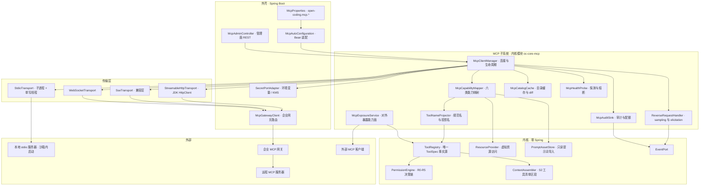
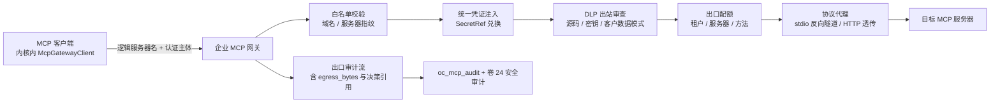
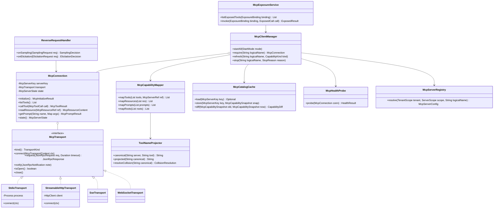
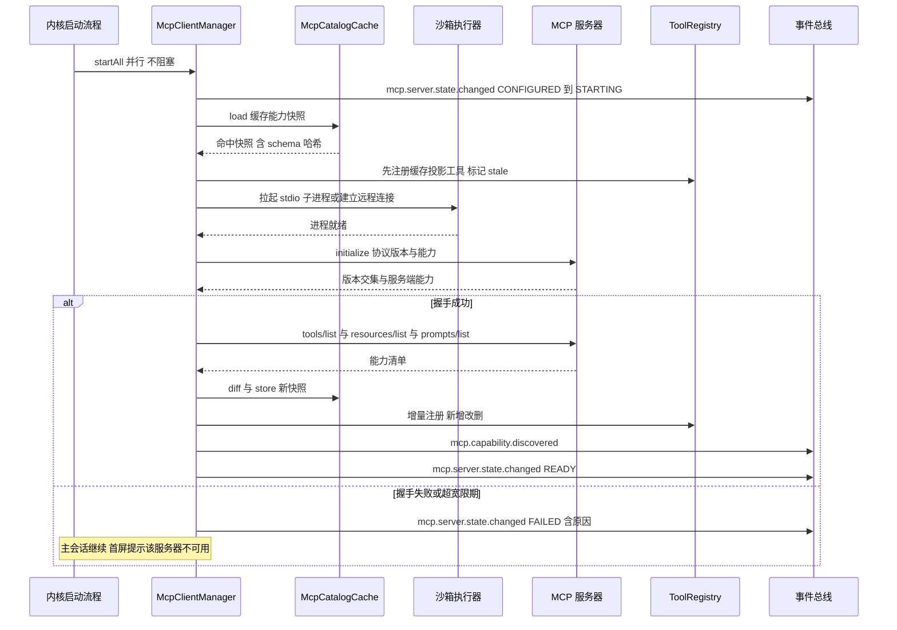
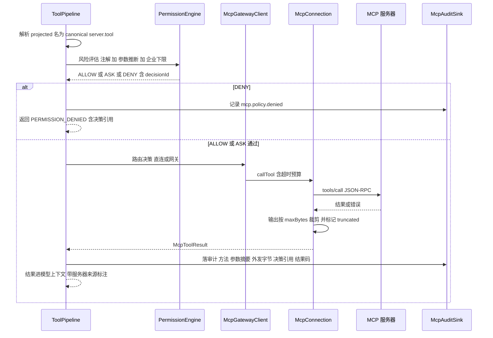
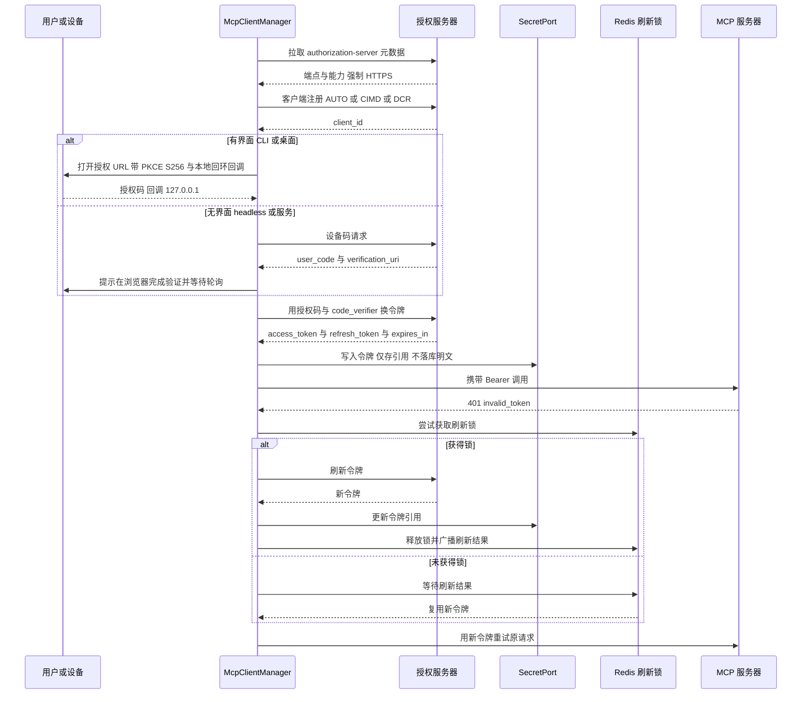
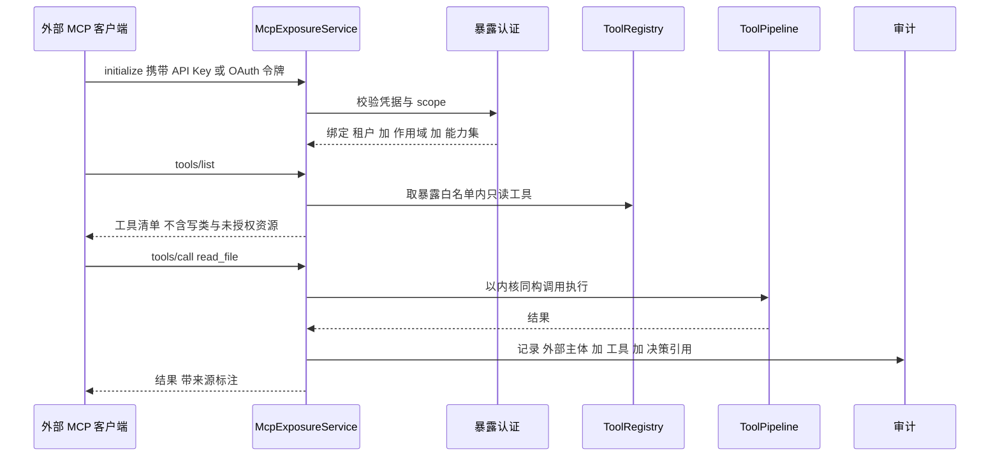
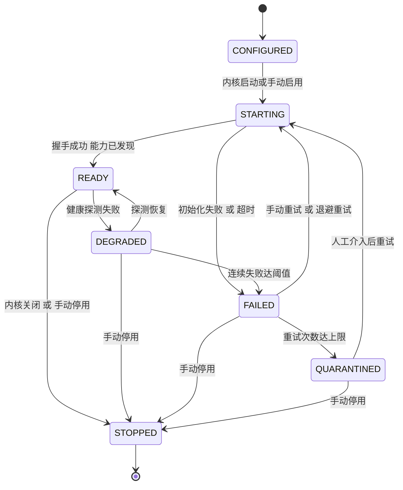
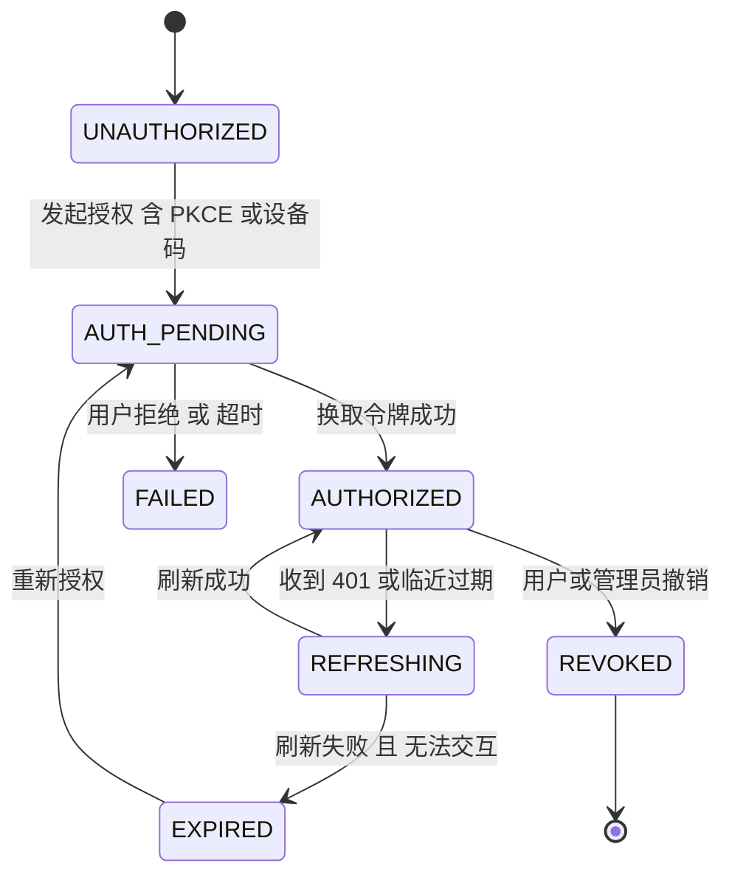
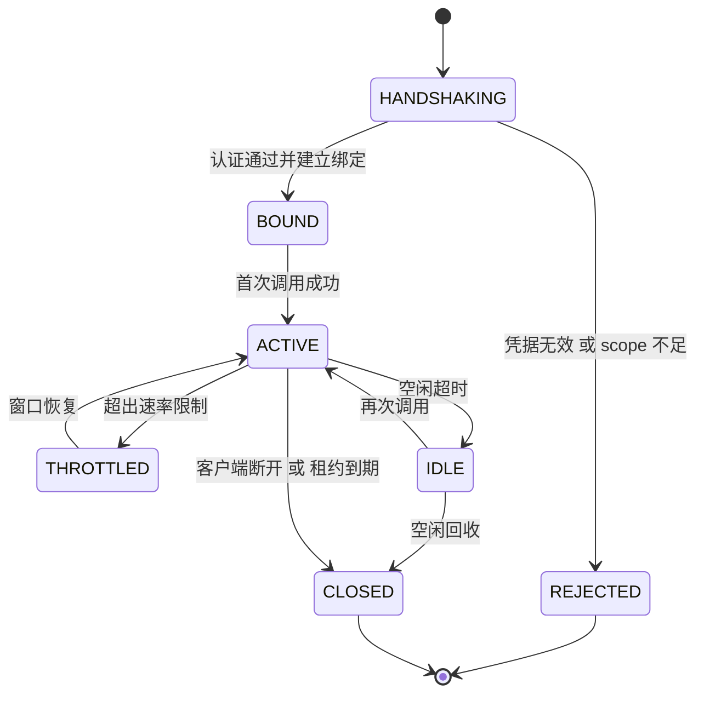

# 实现方案 09 · MCP 网关（四传输客户端 / 能力映射 / 企业网关 / 对外暴露）

> 上游契约：`docs/harness/09-mcp-system.md`（D-MCP-1…10）、`docs/harness/00-vision-and-product.md` §5.9（REQ-MCP-1…10）、`DECISIONS.md`（H-007 扩展模型、H-014 统一工具契约、H-018 双向互操作、H-019 三级租户）。
> 竞品证据：`research/competitors/03-codex.md`、`04-deepseek-harness.md`、`08-gemini-cli.md`、`01-claude-code-purpose-built.md`、`07-qoder.md`、`09-secondary-tier.md`（引用格式：`[E级] 文件 §节`）。
> 本文档只回答「怎么做」：实现原子、类与接口签名、数据落点、状态机、失败补偿、测试门禁。凡与 Phase A 冲突处登记 `I-MCP-*` 决策并给出回退路径，不直接改动 Phase A 卷册。

---

## 1. 实现目标与范围

### 1.1 对应 Phase A 卷与决策

| Phase A 锚点 | 本文实现映射 |
| --- | --- |
| 卷 09 §3 D-MCP-1 传输 | §3 `I-MCP-1` + §5 `McpTransport` 四实现 |
| 卷 09 D-MCP-2 生命周期 | §5 `McpConnection` + §7 生命周期状态机 |
| 卷 09 D-MCP-3 能力映射 | §5 `McpCapabilityMapper` 六类能力映射表（§4.3） |
| 卷 09 D-MCP-4 命名冲突 | §3 `I-MCP-3` + §9 `ToolNameProjector` |
| 卷 09 D-MCP-5 认证 | §6.3 OAuth 2.1 + PKCE 时序 + §8 `oc_mcp_auth_grant` |
| 卷 09 D-MCP-6 企业网关 | §3 `I-MCP-6` + §4.4 网关与出口审计 |
| 卷 09 D-MCP-7 对外暴露 | §3 `I-MCP-5` + §6.4 对外暴露时序 |
| 卷 09 D-MCP-8 故障隔离 | §7 熔断/退避/隔离 + §10 预算表 |
| 卷 09 D-MCP-9 反向请求 | §3 `I-MCP-4` + §6.4 sampling 时序 |
| 卷 09 D-MCP-10 版本协商 | §4.2 协议版本矩阵 + 能力子集降级留痕 |

### 1.2 本组件解决什么

- **接入与同构**：把任意 MCP 服务器的六类能力（tools / resources / prompts / roots / sampling / elicitation）无损映射为内核既有契约，使 MCP 工具与内置工具走同一 `ToolSpec`、同一执行管线、同一权限决策链。
- **韧性与治理**：连接、握手、能力刷新、熔断、退避自愈、降级路径全部有确定行为，单服务器崩溃不拖垮内核、启动不阻塞会话；企业网关模式下所有出口流量受白名单、DLP、配额、统一凭证约束，且任一调用可回溯到「服务器 + 方法 + 参数摘要（脱敏）+ 外发字节 + 决策引用」。
- **反向供给**：把本产品只读能力（读文件 / 检索 / 知识 / 记忆召回）以 MCP Server 形态暴露供外部 Agent 复用；任务级互操作坚持走卷 23（A2A），不在 MCP 面开任务提交口。

### 1.3 本组件不解决什么

- 工具管线、参数校验、结果规范化（卷 05）；权限决策链与审批编排（卷 06）；沙箱档位与网络策略（卷 07）。
- 插件装载、签名校验、依赖求解（卷 18）；Skill 包格式（卷 08）；A2A 任务语义与远程 Agent 认证（卷 23）；模型侧 tool-calling 协议差异（卷 02 投射器）。

### 1.4 上游 / 下游依赖

| 方向 | 依赖 | 形态 |
| --- | --- | --- |
| 上游 | `ToolRegistry`（注册投产后工具）、`ContextAssembler`（S2 工具清单区段）、`PermissionEngine`（风险分级与决策）、`SecretPort` / `EventPort` / `WorkspacePort` / `LlmPort`（sampling 受限调用） | 内核 SPI 与 Port（无 Spring） |
| 下游 | `McpExposureService`（被 `interfaces` 层 MCP 端点调用）、卷 24 审计、卷 31 配额计量、卷 26 评测（MCP 故障注入场景） | 外壳装配 + 事件 + REST |
| 横向 | 卷 16 事件总线（`mcp.*` 事件族）、卷 19 持久化（`oc_mcp_*` 表） | 表 + 事件 |

### 落地核对（R07：模块 / 顺序 / 批次 / 门禁 / I-* 落点）

- **模块（卷 27 §4.1 权威名）**：`harness-contract`（MCP 契约与能力映射模型，零框架）+ `harness-platform/platform-mcp`（传输/生命周期/暴露面实现，允许 Spring）+ `harness-platform/platform-persistence`（`oc_mcp_*` 表）+ `harness-host/host-bootstrap`（装配）+ `harness-host/host-protocol`（MCP 暴露端点）。
- **实施顺序（卷 27 §4.5）**：第 17 步「Skill 与 MCP（client）」，依赖第 4 步（工具运行时：MCP 工具经统一管线注册）与第 14 步（任务/计划：暴露面绑定任务作用域）。服务端暴露面（`mcp.exposure`）随第 20 步（企业）接入网关形态。
- **数据批次（卷 27 §4.4）**：`oc_mcp_server`、`oc_mcp_server_state`、`oc_mcp_capability`、`oc_mcp_tool_binding`、`oc_mcp_auth_grant`、`oc_mcp_exposure_grant`、`oc_mcp_audit`、`oc_mcp_quota_rollup` → **B6**（插件/Skill/Hook/MCP + 企业），依赖 B1–B5。
- **门禁映射（卷 27 §4.6）**：`platform-mcp` 单测 → 「单元测试 + 覆盖率门」；互操作集成（本地夹具 + ≥3 真实服务器）→ 「集成测试」；`mcp.*` 事件与能力映射契约 → 「契约测试」；故障注入与性能门禁 → 「集成测试」+「性能基准（抽样）」。
- **I-* 落点**：I-MCP-1 → `platform-mcp`（`McpConnection`：单写线程多路复用）；I-MCP-2 → `platform-mcp`（`CapabilityRefresher` + `platform-persistence` 目录缓存）；I-MCP-3 → `harness-contract`（`McpToolNaming` 双名规则）+ `platform-mcp`（投射实现）；I-MCP-4 → `platform-mcp`（反向请求调度通道 + 策略裁决器）；I-MCP-5 → `platform-mcp`（`McpExposureService` 暴露会话）+ `platform-persistence`（`oc_mcp_exposure_grant`）；I-MCP-6 → `platform-enterprise`（集中网关：白名单/凭证注入/DLP/配额）+ `platform-mcp`（旁路白名单降级）。

---

## 2. 功能需求清单（REQ-MCP-n）

优先级口径：P0 = MCP 首个可用版本必须交付；P1 = 与 P0 同批但允许特性门控关闭；P2 = 企业 / 后续版本。

| REQ | 需求描述 | 来源 | 优先级 | 验收要点 |
| --- | --- | --- | --- | --- |
| REQ-MCP-1 | 四传输客户端：stdio / SSE / streamable-HTTP / WebSocket，`McpTransport` 抽象可插拔，默认按服务器声明协商（HTTP 优先于 SSE，本地默认 stdio） | 卷 00 §5.9 REQ-MCP-1；卷 09 D-MCP-1；竞品复核：Claude Code 传输面含 `stdio/sse/http/ws` 四类 `[E1] 01 §4.7`；Qoder CLI 四传输 `-t stdio\|sse\|http\|ws` `[E2] 07 §4.7` | P0 | 四传输各有互操作用例；同一服务器切换传输不改上层行为 |
| REQ-MCP-2 | 服务器注册、生命周期托管（并行启动、不阻塞内核）、健康探测、崩溃自动重启与指数退避、连续失败达阈值转隔离并告警 | 卷 09 D-MCP-2 / D-MCP-8 | P0 | 故障注入：kill -9 后 ≤ 3 次退避内恢复；达阈值后不再重启并出 `mcp.server.state.changed` |
| REQ-MCP-3 | 能力发现与刷新：`tools/list` + `list_changed` 通知 + 能力哈希；当前轮次能力稳定，刷新只影响后续轮次 | 卷 09 §4.3；竞品：Claude `list_changed` 自动刷新 `[E2] 01`；DeepSeek 资源工具「首个 provider 进 scope 即启用」`[E1] 04 §4.7` | P0 | 刷新增删工具用例；轮次中途不变化有断言 |
| REQ-MCP-4 | 认证：OAuth 2.1 授权码 + PKCE（有界面）、设备码（无界面）、服务凭证（企业）；令牌经 `SecretPort` 存储，支持并发安全刷新 | 卷 09 D-MCP-5 | P0 | 授权/刷新/过期三重用例；日志与事件中零明文令牌 |
| REQ-MCP-5 | 企业网关：白名单、出口审计、DLP 规则、统一凭证、出口配额；企业形态默认开启，个人形态可关闭 | 卷 09 D-MCP-6 | P2 | 网关模式下直连被拒绝；DLP 命中阻断并可申诉查看 |
| REQ-MCP-6 | 作为 MCP Server 暴露：只读工具默认开启（需认证），资源需显式授权，提示词资产默认关闭，写类工具默认关闭 | 卷 09 D-MCP-7 | P2 | 外部客户端成功调用只读工具；越权调用返回 `PERMISSION_DENIED` |
| REQ-MCP-7 | 沙箱与权限集成：stdio 服务器在沙箱内启动；MCP 工具风险分级（R0–R5）与内置工具同权；参数可影响风险级别 | 卷 09 D-MCP-8 + §4.4；卷 06 §R0–R5 | P0 | 风险映射用例 ≥ 20 条（含外发 R3、破坏性 R4） |
| REQ-MCP-8 | 调用审计与配额：逐调用落审计（服务器 / 方法 / 参数摘要 / 外发字节 / 决策引用 / 结果码），按服务器与租户配额限流 | 卷 09 §6；卷 24 §4.10 租户化清单 | P0 | 任一调用可查到完整审计链；超配额返回 `RATE_LIMITED` |
| REQ-MCP-9 | 反向请求：sampling 计入会话预算且按策略允许/询问；elicitation 映射 `ask_user`，无人值守时排队或按策略拒绝 | 卷 09 D-MCP-9 | P2 | 无人值守下 elicitation 不挂起回合；sampling 用量计入计量 |
| REQ-MCP-10 | 协议版本矩阵 + 初始化协商 + 能力子集显式降级并留痕 | 卷 09 D-MCP-10；竞品：Codex 探测 2026-07-28 失败回退 Legacy 且开关不适用于第三方 server `[E1] 03 §4.7`；DeepSeek 由官方 SDK 选版并回退 `[E1] 04 §4.7` | P1 | 版本不兼容时给出可读降级报告，不得静默丢能力 |
| REQ-MCP-11 | **启动宽限期**：可选服务器启动失败或超时不得阻塞主会话，失败原因进入状态事件与会话首屏提示 | 竞品增量：Codex `mcp_optional_startup_grace_ms`（可选服务器启动宽限，不阻塞主会话）`[E1] 03 §4.7` | P0 | 冷启动注入「服务器 10s 不响应」时主会话 TTFB 不受影响 |
| REQ-MCP-12 | **工具目录缓存与增量刷新**：能力目录持久化缓存（含 schema 哈希），重连后先命中缓存再后台校准，`list_changed` 走增量 diff | 竞品增量：Codex `catalog.rs` / `tool_catalog_cache.rs` / `client_tool_catalog.rs` + `Op::RefreshMcpServers` `[E1] 03 §4.7`；DeepSeek「每 server 一个连接插件」`[E1] 04 §4.7` | P0 | 热重启后工具可见时间 ≤ 200ms（缓存命中路径） |
| REQ-MCP-13 | **惰性加载（Meta Tool）**：服务器数量超阈值时可只暴露元工具（列出/检索/调用），命中后再物化具体工具 | 竞品增量：Qoder `mcp.lazyLoad`（默认 false，开启后只暴露 Meta Tool）+ `QODER_MCP_LAZY=1` `[E2] 07 §4.7` | P1 | Meta Tool 模式下 S2 区段 token 占用下降 ≥ 60%（20 服务器场景） |
| REQ-MCP-14 | **共享资源工具的引用计数**：资源读取工具集按「首个启用该服务器的会话注册、最后一个移除即注销」，且连接失败**不移除**已注册的共享资源工具 | 竞品增量：DeepSeek `mcp-resources` 包生命周期语义 `[E1] 04 §4.7` | P1 | 会话并行进出时工具集无抖动；连接断开资源工具仍在但调用返回依赖错误 |
| REQ-MCP-15 | **instructions 注入上限与能力显式降级**：server instructions 作为字面文本注入并受字节上限约束；不支持的 MCP 能力（如 prompt templates）显式关闭并在诊断面留痕，不静默丢失 | 竞品增量：DeepSeek `maxInstructionBytes` 限制 + 「MCP prompt templates 不支持」`[E1] 04 §4.7` | P1 | 超长 instructions 被截断且事件携带截断字节数；不支持能力出现在能力报告 |
| REQ-MCP-16 | **准入完整性校验与来源检查**：服务器来源（npm/pip/容器/本地路径）记录并校验摘要；企业可要求签名或私有源；装载期拒绝未签名包 | 竞品增量：Goose `extension_malware_check.rs` / `validate_extensions.rs` `[E1] 09 §2.5`；gemini-cli 扩展完整性哈希 `[E1] 08 §④-8`；落地建议 S14 `[E1] 09 §⑤` | P0 | 摘要不符直接拒绝并出 `mcp.policy.denied` |
| REQ-MCP-17 | **诊断面**：一键握手、能力列表、延迟、认证状态、最近失败原因；支持导出诊断包（脱敏） | 竞品增量：Claude `services/mcp/doctor.ts` `[E1] 01 §4.7`；Codex `app-server` 暴露 `mcpServerStatus/list` 返回每 server 的 `serverCapabilities` `[E1] 03 §4.7` | P1 | `oc mcp doctor <server>` 在断网 / 过期令牌 / 版本不兼容三种故障下给出可执行建议 |
| REQ-MCP-18 | **令牌刷新并发去重**：同一服务器同一主体在刷新窗口内只允许一次刷新，其他等待复用结果（避免刷新风暴与令牌互相失效） | 竞品增量：Claude `services/mcp/auth.refreshLock.ts` `[E1] 01 §4.7` | P0 | 10 并发调用触发 401 时仅 1 次刷新请求（计数断言） |
| REQ-MCP-19 | 服务器配置三级合并（组织 / 项目 / 用户），组织可锁定；首次添加必须显式确认；每服务器独立执行域与输出限额 | 卷 09 §10 开放问题默认决策；卷 09 D-MCP-8 | P0 | 组织锁定项在用户层不可覆盖；10MB 输出被裁剪且事件携带原始字节数 |

---

## 3. 技术方案选型（M×N 比选）

评分口径沿用 `README.md` §4：`F 30% / U 20% / S 25% / M 25%`，总分 = `F×3 + U×2 + S×2.5 + M×2.5`（满分 100）。每维度给出选定分支与**被放弃分支的代价 + 回退触发条件**。**本节 6 个维度即本文件登记的 `I-MCP-1…I-MCP-6` 实现级决策**（汇总字段：主题 / 选定分支 / 被放弃分支代价 / 回退触发），供 `IMPL-DECISIONS.md` 直接收录。

### 3.1 I-MCP-1 连接与进程模型（传输实现）

| 分支 | 描述 | F | U | S | M | 总分 |
| --- | --- | --- | --- | --- | --- | --- |
| B1 | **每服务器一个连接对象 + 单写线程多路复用**（stdio 一个子进程，HTTP 一个 keep-alive 客户端，请求按 JSON-RPC id 复用） | 9 | 8 | 9 | 9 | **88** |
| B2 | 每请求起进程 / 每次调用新建连接（无复用） | 5 | 5 | 7 | 6 | 57.5 |
| B3 | 跨服务器共享底层连接池（HTTP 池 + 统一调度） | 8 | 7 | 6 | 6 | 68 |

**选定 B1**。理由：MCP 服务器有会话态（`initialize` → `initialized` 握手、订阅、能力缓存），跨服务器共享池会把故障域耦合并破坏会话语义；单写线程保证 stdio 的 JSON-RPC 顺序性（协议要求），读侧用虚拟线程解耦。
**放弃代价与回退**：B2 冷启动延迟与进程风暴不可接受（20 服务器 × 每轮 5 次调用 = 100 次进程创建）；B3 的故障隔离代价高于其连接复用收益。若单服务器 QPS > 500 且 P95 排队 > 50ms，启用「同服务器多路连接池（pool size ≤ 4）」，接口不变。

### 3.2 I-MCP-2 能力刷新粒度

| 分支 | 描述 | F | U | S | M | 总分 |
| --- | --- | --- | --- | --- | --- | --- |
| B1 | 全量重连刷新（收到通知即断开重连） | 7 | 6 | 9 | 8 | 75.5 |
| B2 | **增量 diff + 持久化目录缓存**：`list_changed` 只重拉对应能力域，diff 出增 / 删 / 改，未变项复用 schema 哈希 | 9 | 8 | 8 | 9 | **85.5** |
| B3 | 定时轮询全量（无通知依赖） | 8 | 7 | 9 | 7 | 78 |

**选定 B2**。理由：竞品两条独立证据同向——Codex 有 `tool_catalog_cache` 与显式 `RefreshMcpServers`，Claude 依赖 `list_changed` 自动刷新；增量 diff 让「当前轮次工具集不变」成为可实现约束（卷 09 §4.3）。
**放弃代价与回退**：B1 重连会打断订阅与在途请求；B3 无通知时延迟高、有通知时浪费。若某服务器不实现 `list_changed` 且工具变更频繁（> 1 次/分钟），退化为该服务器专属的 60s 轮询（配置项按服务器覆盖）。

### 3.3 I-MCP-3 工具命名与暴露面

| 分支 | 描述 | F | U | S | M | 总分 |
| --- | --- | --- | --- | --- | --- | --- |
| B1 | 直接使用服务器原始工具名 | 6 | 7 | 7 | 5 | 62 |
| B2 | **内部规范名 + 对外投影名双层**：内核规范名 `server.tool`（Phase A D-MCP-4），投射给模型与外部客户端的生态兼容名 `mcp__<server>__<tool>`，别名表保证可读性 | 9 | 8 | 9 | 9 | **88** |
| B3 | 仅命名空间 `server.tool`，不做生态兼容投影 | 8 | 7 | 9 | 8 | 80.5 |

**选定 B2**。理由：Claude / Qoder / DeepSeek 三家**一致**使用 `mcp__<server>__<tool>`（`[E2] 01 §4.7`、`[E2] 07 §4.7`、`[E1] 04 §4.7`），且 Qoder 的 MCP 规则匹配形如 `mcp__context7__*`，采用同构命名可让用户既有规则与 hook matcher 直接迁移；同时内核侧保持 `server.tool` 规范名以维持 Phase A 契约。**该映射登记为 I-MCP-3，不修改 D-MCP-4 的选定内容**。
**放弃代价**：B1 冲突与越权风险（同名工具覆盖内置）；B3 使社区 MCP 文档与用户规则无法直接复用。
**回退触发**：若投射名长度超过模型侧工具名上限（投射器报 `SCHEMA_UNSUPPORTED`），退化为可配置短哈希后缀。

### 3.4 I-MCP-4 反向请求调度模型

| 分支 | 描述 | F | U | S | M | 总分 |
| --- | --- | --- | --- | --- | --- | --- |
| B1 | 复用工具调用通道（反向请求在工具调用栈内同步阻塞等待） | 6 | 6 | 8 | 6 | 65 |
| B2 | **独立调度通道 + 策略裁决器**：sampling / elicitation 进入 `ReverseRequestHandler` 独立队列，与回合解耦；sampling 走预算计量、elicitation 走审批 UI 或排队 | 9 | 8 | 8 | 9 | **85.5** |
| B3 | 一律拒绝（能力面收敛） | 5 | 4 | 9 | 7 | 63 |

**选定 B2**。理由：Phase A D-MCP-9 明确要求策略化；竞品侧 Codex 有独立 `Op::ResolveElicitation` 与 `mcp_elicitations` 审批开关 `[E1] 03 §4.4`，说明反向请求必须与主回合解耦，否则 elicitation 丢失会导致服务器侧挂起。
**放弃代价**：B1 会让「无人值守」形态直接卡死；B3 与依赖 sampling 的服务器不兼容。
**回退触发**：若反向请求队列积压 > 32 且长期无人消费，降级为「拒绝 + 事件告知服务器」，并在会话首屏提示用户。

### 3.5 I-MCP-5 对外暴露的会话模型

| 分支 | 描述 | F | U | S | M | 总分 |
| --- | --- | --- | --- | --- | --- | --- |
| B1 | **一连接一暴露会话**：外部 MCP 客户端连接即建立绑定（租户 + 作用域 + 授权集）的暴露会话，工具调用以该绑定身份执行 | 8 | 8 | 9 | 9 | **85** |
| B2 | 共享内核会话（外部调用复用某个已存在会话的工作区与记忆上下文） | 7 | 6 | 6 | 6 | 63 |
| B3 | 每次调用新建临时会话（无状态短连） | 6 | 6 | 8 | 7 | 67.5 |

**选定 B1**。理由：外部客户端的 roots / 工作区语义必须显式协商，共享内部会话会造成上下文泄漏与审批错位；一连接一绑定让「能力 = 授权交集」可审计。
**放弃代价**：B2 越权面过大（外部 Agent 可读到内部会话内容）；B3 无法承载订阅（resources subscribe）与进度通知。
**回退触发**：若外部客户端并发连接 > 200，启用暴露会话租约池（LRU 上限 + 空闲回收）。

### 3.6 I-MCP-6 企业网关形态

| 分支 | 描述 | F | U | S | M | 总分 |
| --- | --- | --- | --- | --- | --- | --- |
| B1 | 客户端内嵌策略（无独立代理进程，策略在客户端求值） | 7 | 8 | 8 | 6 | 72 |
| B2 | **集中网关代理**：MCP 出口统一经网关（白名单 + 统一凭证注入 + DLP + 配额 + 审计），客户端只持服务器逻辑名 | 9 | 7 | 8 | 9 | **83.5** |
| B3 | Sidecar 代理（每客户端伴生一个代理进程） | 8 | 6 | 7 | 8 | 73.5 |

**选定 B2（企业形态默认），个人形态退化为 B1**。理由：Phase A D-MCP-6 已锁定网关模式；竞品对照显示治理深度差异极大（Qoder 有企业 MCP Access Control 与审计 `[E2] 07`；Codex 有 `mcp_enterprise_managed_auth`（EMA）与受管注册策略 `[E1] 03 §4.7`），集中代理是唯一能同时满足「统一凭证 + 出口审计 + 配额」的形态。
**放弃代价**：B1 使得每台客户端的凭证副本与审计面失控；B3 运维成本高且企业已有统一出口设施。
**回退触发**：若网关成为单点导致 MCP 可用性 < 99.5%，启用「网关旁路白名单 + 本地审计缓冲」的降级档。

---

## 4. 总体架构图



**内核 / 外壳边界**：`oc-core-mcp` 为独立内核模块，**零 Spring、零 domain 依赖**，只依赖 `common` + `core-api`；`McpAutoConfiguration`（bootstrap）负责把 `McpProperties`、`SecretPort` 实现、沙箱启动器注入内核模块。企业网关客户端在 `infrastructure` 实现，内核只见 `McpGatewayPort`。

### 4.1 六类能力映射表（D-MCP-3 落地细则）

| MCP 能力 | 内核映射产物 | 权限与治理 | 实现要点 |
| --- | --- | --- | --- |
| `tools` | `ToolSpec`（`source = mcp:<server>`），走统一管线 | 逐调用决策；风险由注解 + 参数推断，服务器自报风险**只降不升**（下限由本地推断兜底） | 输入 schema 送投射器做 canonical 子集校验；输出超限裁剪 |
| `resources` | `McpResourceRef`（`mcp://<server>/<uri>`）+ 内置 `read_resource` / `list_resources` 工具 | 读权限 + 服务器侧 ACL；订阅变更产生 `mcp.resource.changed` | 引用计数管理共享工具生命周期（REQ-MCP-14） |
| `prompts` | 只读 `PromptFragment` 导入（版本跟随服务器） | 无副作用；导入需用户确认；组织级提示词资产默认不反向共享 | 服务器不支持 prompt templates 时显式降级并留痕（REQ-MCP-15） |
| `roots` | 工作区路径暴露协商，映射为 `WorkspaceRootGrant` | 路径围栏校验（卷 07）；越界直接拒绝 | 仅暴露显式授权根，不暴露 HOME |
| `sampling` | 反向请求 → `LlmPort` 受限调用（模型白名单 + token 上限） | 计入会话预算与单服务器限额；默认「询问一次后按会话记忆」 | 独立调度通道；结果回传前做 DLP 出站检查 |
| `elicitation` | 反向请求 → `ask_user` 类交互 | 需用户在场；无人值守按策略拒绝或排队 | 排队上限 + 过期丢弃，避免服务器侧永久挂起 |

### 4.2 协议版本矩阵与降级

| 协议版本 | 支持度 | 说明 |
| --- | --- | --- |
| `2025-06-18` | 完整 | 基线版本：四传输 + 六能力 |
| `2026-07-28` | 完整 | 优先协商版本；探测失败回退基线并留痕 |
| 未知 / 未来版本 | 降级 | 初始化协商取交集；交集为空则拒绝该服务器并给出版本对不上的可执行报告 |

**协商实现**：`McpVersionNegotiator` 在 `initialize` 请求中声明 `protocolVersion` 与 `clientCapabilities`，以服务器返回为准落 `oc_mcp_server.protocol_version`；能力子集降级逐项记录到 `oc_mcp_capability` 的 `disabled_reason`，并计入诊断面。

### 4.3 与权限系统的联动（MCP 工具风险分级）

| 风险来源 | 规则 | 示例 |
| --- | --- | --- |
| 工具注解 | 服务器 `annotations.readOnlyHint=true` → 基准 R0；`destructiveHint=true` → 基准 R4 | `mcp__fs__read_file` → R0 |
| 参数推断 | 参数含 URL / 域名 → 至少 R3；参数含路径且落在工作区外 → R1 升 R4；参数命中命令解析（AST）→ R2/R4 取高 | `mcp__web__fetch(url=https://x)` → R3 |
| 服务器声明与企业基线 | 服务器可声明 `riskHint`（`oc_mcp_capability.risk_hint`），**只能提升**本地下限之上用于提示的等级，不能降低；组织策略可对整服务器设 `risk_ceiling`（如「该服务器的所有工具至少 R3」） | 声明 R2 的本地文件删除工具实际按 R4 决策；外网服务器整体抬到 R3 |
| 外发审计 | 风险 ≥ R3 的调用必须落 `egress_bytes` 与外发参数摘要，且受 DLP 规则约束 | 命中「源码外发」规则即阻断 |

**统一出口**：MCP 工具执行必须经 `ToolPipeline`，与内置工具共享 `PermissionEngine` 决策链；MCP 层**禁止**自行放行或旁路审批（对 `mcp.allowAlways` 类持久化授权，落盘为卷 06 的策略条目而非 MCP 私有状态）。

### 4.4 企业网关与出口审计



- 网关模式下，客户端**不持有**服务器真实凭证，只持有网关短期凭据（按会话租约签发）。
- 反向隧道：stdio 型服务器在企业内网由网关侧托管运行，客户端经流式 HTTP 隧道接入（解决「本地无法起进程」场景）。
- 审计字段与直连模式一致，保证「同一调用不论走哪条链路，审计 schema 相同」。

---

## 5. 类图



### 5.1 关键接口签名（Java 21）

> 异常约定：MCP 层异常统一表达为 `McpException extends HarnessException`（携带全局 `ErrorCode`：`DEPENDENCY_UNAVAILABLE` / `UNSUPPORTED_CAPABILITY` / `PERMISSION_DENIED` / `AUTH_REQUIRED`），**禁止裸抛**协议栈异常或 `RuntimeException`，由外壳全局异常处理器按附录 B.7 统一转换。**异常命名分层（全套统一）**：内核层（framework-free core，本域全部实现）失败抛 `HarnessException` 及其子类 `McpException`（`McpErrorCode` 仅作内部细分，出口一律映射为全局 `ErrorCode`）；外壳层（domain / application / interfaces 的管理面与网关代理、令牌存储）失败抛 `BusinessException`；两侧文案均为中文并含服务器逻辑名。**契约缺口指针（X-82）**：异常类名与冻结卷册 `ErrorCode` 映射的登记缺口已列为修订建议 **X-82**（`impl/IMPL-DECISIONS.md` §4；本文件不改台账）。

```java
/**
 * MCP 传输抽象。
 * 四类实现（stdio / streamable-HTTP / SSE / WebSocket）共享本契约；
 * 实现必须保证 request 与 notification 的发送顺序与协议一致（stdio 侧单写线程）。
 */
public interface McpTransport extends AutoCloseable {

    /**
     * 传输类型。
     *
     * @return 传输枚举，用于能力协商、诊断展示与审计归属
     */
    TransportKind kind();

    /**
     * 建立连接并完成传输层就绪（不含 MCP 握手）。
     *
     * @param context 连接上下文，含端点、启动命令引用、超时预算与租户信息（必填）
     * @throws McpException 连接失败、端点不可达、沙箱启动被拒时抛出
     */
    void connect(McpTransportContext context);

    /**
     * 发送请求并等待响应。
     *
     * @param request JSON-RPC 请求（必填，id 由调用方生成以保证幂等追踪）
     * @param timeout 单次调用超时预算（必填，来源于 McpProperties，禁止硬编码）
     * @return 服务器响应；服务器返回错误时由实现翻译为 McpException
     * @throws McpException 传输中断、超时、协议错误或服务器返回错误时抛出
     */
    JsonRpcResponse request(JsonRpcRequest request, Duration timeout);
}
```

```java
/**
 * MCP 服务器连接：负责握手、能力发现、请求编排与状态维护。
 * 一个连接对象对应一个服务器实例与一个租户作用域，禁止跨租户复用。
 */
public final class McpConnection implements AutoCloseable {

    /**
     * 完成 MCP 初始化握手并协商协议版本（交集为空则拒绝该服务器）。
     *
     * @return 初始化结果，含协商后的协议版本与服务端能力声明
     * @throws McpException 版本交集为空、能力声明非法或握手超时时抛出
     */
    public McpInitializeResult initialize() {
        log.info("MCP 握手开始，server={}, 传输={}, 期望协议版本={}",
                serverKey.logicalName(), transport.kind(), McpProtocolVersion.PREFERRED.code());
        JsonRpcResponse response = transport.request(
                JsonRpcRequests.initialize(McpProtocolVersion.PREFERRED.code(), clientCapabilities),
                properties.transport().handshakeTimeout());
        McpInitializeResult result = McpCodec.decodeInitialize(response);
        log.info("MCP 握手完成，server={}, 协议版本={}, 服务端能力={}",
                serverKey.logicalName(), result.protocolVersion(), result.capabilityNames());
        return result;
    }

    /**
     * 调用服务器工具。
     *
     * @param call 工具调用（必填，含工具名、参数与调用追踪 id）
     * @return 工具结果；结果超限时按 output.max-bytes 裁剪并标记 truncated
     * @throws McpException 服务器错误、超时或输出不可解析时抛出
     */
    public McpToolResult callTool(McpToolCall call) {
        // 审计只记参数摘要：参数可能含工作区内容与外发数据，禁止记录原文
        log.info("MCP 工具调用开始，server={}, tool={}, callId={}, 参数摘要={}",
                serverKey.logicalName(), call.toolName(), call.callId(), call.paramDigest());
        JsonRpcResponse response = transport.request(
                JsonRpcRequests.callTool(call), properties.transport().callTimeout());
        McpToolResult result = McpCodec.decodeToolResult(response, properties.output().maxBytes());
        log.info("MCP 工具调用完成，server={}, tool={}, callId={}, 结果字节={}, 耗时={}ms",
                serverKey.logicalName(), call.toolName(), call.callId(), result.byteSize(), result.latencyMs());
        return result;
    }

    @Override
    public void close() {
        transport.close();
    }
}
```

```java
/**
 * MCP 服务器生命周期枚举（与卷 09 §4.2 状态机一致）。
 * QUARANTINED 表示连续失败达上限后停止自愈并等待人工介入。
 */
@Getter
@RequiredArgsConstructor
public enum McpServerState {

    /** 已配置未启动 */ CONFIGURED("CONFIGURED", "已配置"),
    /** 启动中（含沙箱拉起与握手） */ STARTING("STARTING", "启动中"),
    /** 就绪，能力已发现 */ READY("READY", "就绪"),
    /** 降级：探测失败但连接可用，工具按最近能力快照保留可见 */ DEGRADED("DEGRADED", "降级"),
    /** 失败：启动或运行失败 */ FAILED("FAILED", "失败"),
    /** 隔离：连续失败达阈值，停止自动重启并告警 */ QUARANTINED("QUARANTINED", "已隔离"),
    /** 已停止（内核关闭或手动停用） */ STOPPED("STOPPED", "已停止");

    /** 持久化与事件载荷使用的编码 */
    private final String code;

    /** 面向用户的中文描述 */
    private final String desc;

    /**
     * 按编码解析状态。
     *
     * @param code 状态编码（必填）
     * @return 对应枚举项
     * @throws McpException 编码非法时抛出（文案含非法值，便于定位）
     */
    public static McpServerState of(String code) {
        for (McpServerState state : values()) {
            if (state.code.equals(code)) {
                return state;
            }
        }
        throw new McpException(McpErrorCode.STATE_UNKNOWN, "未知 MCP 服务器状态：" + code);
    }
}
```

---

## 6. 核心流程时序图

### 6.1 服务器启动与能力发现（含启动宽限与失败隔离）

**前置条件**：内核已装配 `McpProperties` 与至少一条服务器配置；租户上下文已建立。**主路径**：并行启动全部启用服务器，握手 → 协商 → 拉能力 → 命中缓存先注册 → 后台校准 → 投产后工具进 `ToolRegistry`。
**异常与补偿**：启动失败在宽限期内不阻塞主会话；失败原因入状态事件与首屏提示；手动重试或退避重试（幂等与并发点：同一服务器启动由 `RedisKeys.mcpStartLock(tenantId, serverKey)` 串行化，重复启动幂等返回当前状态）。



### 6.2 工具调用（权限决策 + 审计 + 输出裁剪）

**前置条件**：服务器处于 `READY`；模型请求的工具存在于当前轮次稳定工具集。**主路径**：风险分级 → 权限决策 → 沙箱/网关路由 → 调用 → 结果规范化 → 审计（MCP 层不得旁路权限）。
**异常与补偿**：超时按幂等性决定重试（只读方法可重试，写方法需幂等键）；连续失败触发熔断降级（幂等与并发点：同一 `callId` 重试由 `McpCallLedger` 去重；并发受 `limits.max-in-flight-per-server` 信号量约束）。



### 6.3 OAuth 2.1 授权（PKCE）与令牌刷新

**前置条件**：服务器声明需要授权；注册模式取自 `oauth.registration-mode`（`AUTO` / `CIMD` / `DCR`）。**主路径**：发现元数据 → 注册客户端 → PKCE 授权（回环回调或设备码）→ 换取令牌 → 落 `SecretPort` → 后续请求带 Bearer。
**异常与补偿**：`401 invalid_token` 触发一次刷新；刷新失败清理授权并要求重新授权（幂等与并发点：刷新由 `RedisKeys.mcpAuthRefreshLock(serverKey, subject)` 保护，等待者复用刷新结果，见 REQ-MCP-18）。



### 6.4 对外暴露（OpenCoding as MCP Server）

**前置条件**：`exposure.enabled` 为真，客户端完成认证并取得 scope。**主路径**：客户端连接 → 建立暴露绑定 → 列能力 → 调用只读工具 → 内部走同一 `ToolPipeline` 与权限链。
**异常与补偿**：越权调用返回 `PERMISSION_DENIED`（含决策引用）；写类工具未开启时**不出现在能力列表**而非返回后拒绝（幂等与并发点：暴露会话按连接隔离，并发受客户端 `rate_limit` 约束）。



**补充流程（sampling / elicitation，I-MCP-4 独立调度通道，不占主回合）**：服务器发起反向请求 → `ReverseRequestHandler` 入队 → 策略裁决（服务器预算 / 会话预算 / 模型白名单 / 是否允许询问）→ 允许则预扣预算并经 `LlmPort` 受限采样 → 出站 DLP → 回传；拒绝则回传明确 JSON-RPC 错误，服务器侧不得挂起。无人值守时 elicitation 按 `elicitation.mode`（`ask` / `queue` / `deny`）处置。

---

## 7. 状态机

### 7.1 服务器生命周期（与卷 09 §4.2 对齐并细化实现态）



**迁移副作用**：进入 `READY` 触发能力刷新与工具注册；离开 `READY` 时工具标记 `stale`（保留可见但调用返回依赖错误，避免模型侧工具集抖动）；进入 `QUARANTINED` 发布告警级事件并要求人工确认。

### 7.2 授权令牌状态机



### 7.3 暴露会话状态机



---

## 8. 数据模型

### 8.1 表设计（`oc_*`，PostgreSQL）

**类型约定（本节各表通用；逐列 DDL 以卷 19 的 Flyway 迁移脚本为准）**：内部主键 `id BIGINT`（Snowflake）或复合主键（如 `(tenant_id, …)`）；对外暴露的引用 ID 用不透明字符串 / `UUID`（防遍历）；时间列统一 `TIMESTAMPTZ`（UTC 存储、展示层本地化）；枚举列存 `VARCHAR(32)` 的 **code**（禁止存 desc）；结构化与可变结构用 `JSONB`；布尔列 `BOOLEAN NOT NULL DEFAULT false`；敏感字段（密钥 / Token）只存引用名 `*_ref`，明文永不入库；大对象（快照 / 录制 / 工件）外置并留指针；各表字段语义见「关键字段」列，索引与唯一约束见末列。

| 表 | 关键字段 | 索引 / 约束 | 备注 |
| --- | --- | --- | --- |
| `oc_mcp_server` | `id`、`tenant_id`、`scope`、`owner_ref`、`server_key`、`display_name`、`transport`、`endpoint_uri`、`command_ref`、`args_json`、`env_secret_refs`、`protocol_version`、`auth_mode`、`gateway_route`、`enabled`、`risk_ceiling`、`source_kind`、`source_digest`、`created_at`、`updated_at`、`version` | `uk_server(tenant_id, scope, owner_ref, server_key)`；`ix_tenant_enabled(tenant_id, enabled)` | 三级配置合并后的**物化视图**；组织级锁定项以 `locked=true` 标记 |
| `oc_mcp_server_state` | `server_id`、`state`、`last_error_code`、`consecutive_failures`、`next_retry_at`、`capabilities_hash`、`last_ready_at`、`updated_at` | 主键 `server_id`；`ix_retry(next_retry_at)` | 运行态同时写 Redis 热副本 |
| `oc_mcp_capability` | `id`、`server_id`、`kind`、`name`、`canonical_name`、`schema_hash`、`risk_hint`、`annotations_json`、`description_digest`、`disabled_reason`、`first_seen_at`、`last_seen_at`、`removed_at` | `uk_cap(server_id, kind, name)`；`ix_kind(kind)` | 能力**历史全留**，删除只置 `removed_at`（供审计与回归） |
| `oc_mcp_tool_binding` | `id`、`server_id`、`capability_id`、`canonical_name`、`projected_name`、`alias`、`spec_hash`、`exposure`、`risk_level` | `uk_projected(tenant_id, projected_name)`；`ix_server(server_id)` | 投影名全局唯一（避免模型侧歧义） |
| `oc_mcp_auth_grant` | `id`、`server_id`、`subject_ref`、`auth_mode`、`token_secret_ref`、`scopes`、`expires_at`、`refresh_state`、`metadata_url`、`updated_at` | `uk_grant(server_id, subject_ref)`；`ix_expire(expires_at)` | **只存 `SecretPort` 引用**，绝不存令牌明文；本地形态 `SecretPort` 后端默认 **OS 钥匙串**（`SecretStoreSPI`，卷 30 §10），环境变量仅作显式覆盖；`access_token` 与 `refresh_token` 同路径存储，撤销时一并清理 |
| `oc_mcp_audit` | `id`、`tenant_id`、`server_id`、`method`、`tool_name`、`decision_id`、`param_digest`、`result_digest`、`egress_bytes`、`latency_ms`、`outcome`、`trace_id`、`occurred_at` | 按月分区；`ix_tenant_time(tenant_id, occurred_at)`；`ix_server_time(server_id, occurred_at)` | 参数与结果只存摘要（HMAC），不存原文 |
| `oc_mcp_quota_rollup` | `tenant_id`、`server_id`、`metric`、`window_start`、`value` | `uk_quota(tenant_id, server_id, metric, window_start)` | 实时计数在 Redis，落库做日/月汇总与计费 |
| `oc_mcp_exposure_grant` | `id`、`tenant_id`、`client_id`、`scopes`、`capability_whitelist`、`rate_limit`、`expires_at` | `uk_client(tenant_id, client_id)` | 对外暴露的授权凭据（API Key 摘要 + scope） |

**租户隔离**：全部表含 `tenant_id` 并启用 PostgreSQL 行级安全（`app.tenant_id` 会话变量），审计与配额查询默认按租户过滤；`oc_mcp_audit` 的分区键含租户（避免跨租户扫描）。

### 8.2 Redis Key（统一 Key 工厂）

| Key 工厂方法 | 用途 | TTL |
| --- | --- | --- |
| `RedisKeys.mcpServerState(tenantId, serverKey)` | 服务器状态热副本（供健康接口快速读取） | 由状态事件刷新，无固定 TTL |
| `RedisKeys.mcpStartLock(tenantId, serverKey)` / `mcpAuthRefreshLock(serverKey, subject)` | 启动与重启串行化分布式锁；令牌刷新去重锁（REQ-MCP-18） | 启动超时预算的 2 倍 / 刷新超时预算 |
| `RedisKeys.mcpToolCatalog(tenantId, serverKey)` | 能力目录缓存（schema 哈希 + 投影名映射） | 7 天（LRU 淘汰） |
| `RedisKeys.mcpQuota(tenantId, serverKey, window)` | 调用次数 / 外发字节配额窗口计数 | 窗口长度 |
| `RedisKeys.mcpCallLedger(callId)` | 调用幂等账本（重试去重） | 10 分钟 |
| `RedisKeys.mcpElicitationQueue(tenantId, sessionId)` | elicitation 排队（无人值守场景） | 会话存活期 |
| `RedisKeys.mcpExposureSession(bindingId)` | 暴露会话绑定与限流状态 | 租约长度 |

### 8.3 事件与对象存储

| 事件 | 载荷要点 |
| --- | --- |
| `mcp.server.state.changed` | 服务器、旧态、新态、失败码、失败原因摘要、连续失败数 |
| `mcp.capability.discovered` / `mcp.capability.changed` | 能力 kind、增删改计数、被禁用能力与原因 |
| `mcp.tool.invoked` / `mcp.tool.failed` / `mcp.exposure.invoked` | 服务器、canonical 名、决策引用、耗时、结果码（**不含参数与结果原文**）；暴露面额外含外部主体 |
| `mcp.resource.read` / `mcp.resource.changed` | 资源 URI 摘要、订阅者会话 |
| `mcp.reverse.request` | 类型（sampling / elicitation）、预算影响、用户决定 |
| `mcp.auth.completed` / `mcp.auth.failed` | 授权模式、主体引用、失败原因（**不含令牌**） |
| `mcp.policy.denied` | 准入拒绝 / DLP 阻断 / 配额拒绝，含规则引用与阻断阶段 |

对象存储前缀：`mcp/diagnostics/<tenant>/<server>/<ts>.zip`（诊断包，脱敏后导出，保留 30 天由卷 19 保留策略管理）。

---

## 9. 接口与扩展点

### 9.1 REST 管理面（`/api/v1`，外壳层）

| 方法 | 路径 | 入参 | 出参 | 错误码 |
| --- | --- | --- | --- | --- |
| GET | `/mcp/servers` | `scope`、`enabled` | 服务器列表（含状态、协议版本、能力计数） | `DEPENDENCY_UNAVAILABLE` |
| POST | `/mcp/servers` | 服务器配置（transport、endpoint / command、风险上限、网关路由） | 创建结果 + `server_key` | `INVALID_ARGUMENT`、`PERMISSION_DENIED` |
| PATCH | `/mcp/servers/{serverKey}` | 局部更新（enabled、risk_ceiling、gateway_route） | 更新结果 | `RESOURCE_NOT_FOUND` |
| DELETE | `/mcp/servers/{serverKey}` | `purgeAudit` 布尔（默认 false） | 删除结果 | `RESOURCE_NOT_FOUND` |
| POST | `/mcp/servers/{serverKey}/restart` | 无 | 状态迁移结果 | `STATE_INVALID` |
| POST | `/mcp/servers/{serverKey}/authorize` | `authMode`（`AUTHORIZATION_CODE` / `DEVICE_CODE`） | 授权 URL 或设备码 | `AUTH_REQUIRED` |
| POST | `/mcp/servers/{serverKey}/auth/revoke` | 无 | 撤销该服务器授权与令牌引用（立即生效；进行中调用以当前令牌完成或失败，不续租） | `RESOURCE_NOT_FOUND` |
| GET | `/mcp/servers/{serverKey}/capabilities` \| `/doctor` | `kind`；`export`（布尔） | 能力清单（含禁用与原因）；诊断报告或诊断包地址 | — |
| POST | `/mcp/servers/{serverKey}/refresh` | `kind` | diff 结果（增 / 删 / 改） | `DEPENDENCY_UNAVAILABLE` |
| GET | `/mcp/audit` | `serverKey`、`from`、`to`、cursor | 审计页（参数与结果仅摘要） | `PERMISSION_DENIED` |
| GET / POST | `/mcp/exposure/grants` | POST：`clientId`、`scopes`、`capabilityWhitelist`、`rateLimit` | 对外暴露授权列表 / 新建授权（返回一次性密钥） | `PERMISSION_DENIED` |
| DELETE | `/mcp/exposure/grants/{clientId}` | 无 | 撤销对外暴露授权（立即生效；外部会话按租约到期回收，不再续期） | `PERMISSION_DENIED` |

**WS 端点**：`/ws/v1/mcp/state` 推送状态与能力变更事件（供桌面端状态面板实时刷新）。

### 9.2 SPI 扩展点（对接卷 18 目录）

| SPI | 稳定性 | 说明 |
| --- | --- | --- |
| `McpTransportSPI` | `evolving` | 新传输实现（如 UDS：Codex 以 `stdio-to-uds` 作为第三传输，理由是「长驻进程 + 文件权限限制访问」`[E1] 03 §4.7`） |
| `McpAuthSPI` | `evolving` | 自定义认证（企业 SSO / 受管凭证 EMA） |
| `McpCapabilityMapperSPI` | `experimental` | 自定义能力映射策略（如把某服务器的资源映射为知识源） |
| `McpPolicySPI` | `stable` | 准入与数据外发策略（白名单、DLP、签名要求） |
| `McpExposureSPI` / `McpNameProjectorSPI` | `experimental` | 对外暴露能力选择器（哪些工具 / 资源可被外部调用）；投影名策略（生态兼容名 vs 自定义短名） |

### 9.3 配置项（`open-coding.mcp.*`）

| 配置键 | 默认值 | 必填 | 说明 |
| --- | --- | --- | --- |
| `open-coding.mcp.enabled` | `true` | 否 | 启用 MCP 框架（默认无服务器，首次添加需显式配置） |
| `open-coding.mcp.servers` | 空列表 | 否 | 服务器配置（由组织 / 项目 / 用户三级合并生成） |
| `open-coding.mcp.transport.connect-timeout-ms` / `handshake-timeout-ms` / `call-timeout-ms` | `5000` / `10000` / `30000` | 否 | 连接 / 握手 / 单次调用超时 |
| `open-coding.mcp.startup.grace-ms` / `concurrency` | `3000` / `4` | 否 | 启动宽限（REQ-MCP-11）与并行启动数 |
| `open-coding.mcp.limits.max-in-flight-per-server` / `max-restart-attempts` | `8` / `5` | 否 | 在途上限；重启达上限转 `QUARANTINED` |
| `open-coding.mcp.limits.base-backoff-ms` / `max-backoff-ms` | `500` / `30000` | 否 | 指数退避区间 |
| `open-coding.mcp.circuit.failure-threshold` / `window-seconds` | `5` / `60` | 否 | 熔断阈值（与卷 09 §7 一致） |
| `open-coding.mcp.output.max-bytes` / `instructions.max-bytes` | `262144` / `8192` | 否 | 单次结果字节上限；instructions 注入上限（REQ-MCP-15） |
| `open-coding.mcp.lazy-load.enabled` / `server-threshold` | `false` / `8` | 否 | 惰性加载与触发阈值（REQ-MCP-13） |
| `open-coding.mcp.tool-name-format` | `mcp__{server}__{tool}` | 否 | 投影名格式（I-MCP-3） |
| `open-coding.mcp.gateway.mode` / `gateway.base-url` / `gateway.dlp.enabled` | `direct` / 空 / `true` | 网关模式下 base-url 必填 | 网关模式（`direct` / `gateway`）、地址（`@PostConstruct` 校验，缺失启动失败）、出站 DLP |
| `open-coding.mcp.quota.calls-per-minute-per-server` / `egress-bytes-per-day-per-server` | `120` / `104857600` | 否 | 调用与外发字节日配额 |
| `open-coding.mcp.oauth.registration-mode` / `callback-port` | `AUTO` / `0` | 否 | 注册模式（`AUTO` / `CIMD` / `DCR`，对齐 Codex `--oauth-client-registration` `[E1] 03 §4.7`）；回环回调端口 |
| `open-coding.mcp.sampling.enabled` / `max-tokens-per-server` | `true` / `8192` | 否 | sampling 开关与单服务器 token 限额 |
| `open-coding.mcp.elicitation.mode` | `ask` | 否 | `ask` / `queue` / `deny`（无人值守语义） |
| `open-coding.mcp.exposure.enabled` / `auth-mode` / `allow-write-tools` | `false` / `api-key` / `false` | 否 | 对外暴露总开关、认证模式（`api-key` / `oauth`）、写类工具暴露（开启需策略 + 每次审批） |

**环境变量族**：`OC_MCP_ENABLED`、`OC_MCP_GATEWAY_URL`、`OC_MCP_GATEWAY_TOKEN`（敏感，默认留空）、`OC_MCP_EXPOSURE_ENABLED`。新增变量必须同步 `.env.example`。

---

## 10. 非功能与工程细节

### 10.1 并发模型

- **连接与请求**：Java 21 虚拟线程；每服务器一个写序列化器（stdio 必须，HTTP/WS 复用同一序列化器以保持请求可追踪），读侧每请求一虚拟线程等待响应。
- **背压**：单服务器在途上限用 `Semaphore`；队列满时按风险等级排队（R0/R1 优先，R3+ 可被拒绝而非无限排队）；`startup.concurrency` 限流并行启动，避免同时拉起 20 个进程耗尽句柄。
- **刷新互斥**：能力刷新按服务器加锁，`list_changed` 高频通知做去抖（默认 500ms，经 `capability.refresh-debounce-ms` 配置）。
- **事务与外部调用纪律**：MCP 状态/目录缓存与审计投影的落库（`oc_mcp_*`）由平台适配器以 `@Transactional(rollbackFor = Exception.class)` 实现；MCP 服务器进程通信（stdio/HTTP/WS）、令牌刷新与启动探测全部是**外部调用**，不得包进数据库事务（审计写入为提交后的异步落库，≤ 50ms）。

### 10.2 性能预算

| 指标 | 预算 | 说明 |
| --- | --- | --- |
| stdio 调用附加开销 | ≤ 10ms（P95） | 卷 09 §7 约束；本地 IPC 序列化 + 事件落库异步 |
| 热启动工具可见时间 | ≤ 200ms | 目录缓存命中路径（REQ-MCP-12） |
| 能力刷新（增量） | ≤ 500ms | 单服务器 50 工具规模 |
| HTTP 调用附加开销 | ≤ 5ms（本地网络基线外） | 连接复用 + 无重复 TLS 握手 |
| 审计写入 | 异步 ≤ 50ms 落库延迟 | 不阻塞工具结果返回 |
| 暴露面调用 | 与内置工具同构，附加 ≤ 15ms | 认证绑定走缓存 |

### 10.3 容量估算

- 单实例支持 50 个服务器 / 2000 个工具（超过惰性加载阈值走 Meta Tool）；目录缓存单服务器 ≤ 256KB，受 Redis LRU 约束。
- 审计量：单服务器 1000 次调用/天 × 50 服务器 = 5 万行/天/租户；按月分区，保留期由卷 24 审计策略决定（安全审计 ≥ 180 天）。

### 10.4 失败与降级矩阵

| 故障 | 行为 | 用户可见 |
| --- | --- | --- |
| 握手失败 | 状态 `FAILED`，按退避重试；工具不注册 | 首屏提示「服务器 X 不可用」 |
| 运行中断连 | 转 `DEGRADED`；工具保留但标注 stale，调用返回 `DEPENDENCY_UNAVAILABLE`（含 `retryable=true`） | 模型收到依赖错误，可换工具 |
| 连续失败达阈值 | 转 `QUARANTINED`，停止自愈并告警 | 状态面板标红 + 一键重试入口 |
| 输出超限 | 裁剪 + `truncated=true` + 事件含原始字节数 | 模型收到裁剪结果与提示 |
| 配额耗尽 | 拒绝并返回 `RATE_LIMITED` + `retryAfterMs` | 提示配额与恢复时间 |
| 网关不可达 | 网关模式下降级为「MCP 不可用」而非直连（**禁止静默绕过网关**） | 明确提示并给出管理员操作建议 |
| 令牌失效且无法交互 | `EXPIRED`，工具调用返回 `AUTH_REQUIRED` | 提示重新授权入口 |

### 10.5 安全

- **命名与解析（防命名空间伪造）**：服务器名与工具名按白名单字符集校验（禁 `__`、`.`、控制字符与超长名）；投影名 `mcp__<server>__<tool>` 只由 `ToolNameProjector` 生成，**解析一律查投影表（`oc_mcp_tool_binding`）反查**而非再次切分字符串——防止服务器借名字拼接伪造他服务器命名空间或与内置工具撞名；内置保留名不可占用，冲突拒绝注册并告警（`uk_projected(tenant_id, projected_name)` 唯一约束兜底）。服务器自报的工具名与 `server` 字段不一致、或投影名落在保留前缀时，一律拒绝注册并记 `mcp.policy.denied`（与卷 05 实现方案 §9.2 的名称所有权同源）。
- **不可信内容（描述投毒与注入）**：server instructions、工具描述、prompts 均为**不可信内容**——注入检测在注册与注入两处执行，命中即 `mcp.policy.denied`；instructions 按字面文本注入并受 `instructions.max-bytes` 约束（REQ-MCP-15），**不得**作为系统指令或工具 schema 的一部分；`description_digest` 变化触发重新审查与审计告警（防「先注册良性描述、后改投毒描述」）。
- **出口与凭据**：直连模式下 HTTP/WS 出站经 `SandboxProxy` 的域名策略、审计与 DLP（L0/L0+ 为约定式，事件标注 `enforcement=partial`；`network-enforcement=strict` 时 R2+ 强制 ≥ L1）；stdio 服务器所需凭据经代理**哨兵**注入（卷 07 §6.2），MCP 层不向服务器进程/环境注入明文；令牌只经 `SecretPort` 传递（本地形态默认 OS 钥匙串，见 §8.1，环境变量仅显式覆盖）。
- **凭证与脱敏**：全部经 `SecretPort`，禁止进入上下文、事件、日志与审计原文（审计只存 HMAC 摘要）；日志与事件中服务器 URL 保留 host、隐去 query 中的令牌参数，`egress_bytes` 只记字节数不记内容。
- **越权**：暴露面的能力列表即授权交集（不列举未授权能力）；工作区资源路径做围栏校验；对外暴露的授权可撤销且**立即生效**（§9.1 新增撤销端点）。
- **供应链**：`source_kind` + `source_digest` 记录来源；企业可强制签名校验；未通过即 `mcp.policy.denied`。

### 10.6 可观测

- 指标：`oc_mcp_server_up{tenant,server}`、`oc_mcp_request_latency_ms{server,method}`、`oc_mcp_error_total{server,code}`、`oc_mcp_restart_total{server}`、`oc_mcp_egress_bytes{server}`（卷 09 §6），Phase B 增补 `oc_mcp_capability_refresh_total{server,result}`、`oc_mcp_tool_invoke_total{server,risk}`、`oc_mcp_quota_denied_total{server}`、`oc_mcp_auth_refresh_total{server,result}`、`oc_mcp_exposure_invoke_total{client}`。
- 日志打点与追踪：启动 / 握手 / 能力发现 / 每次调用（含耗时与结果码）/ 状态迁移 / 授权链路 / 策略拒绝，全部中文文案 + `{}` 占位符；每次调用一个 span，属性含服务器逻辑名、canonical 工具名、风险等级、决策 id、网关路由标记，跨进程经 `traceId` 透传。

---

### 10.7 错误矩阵（错误 → ErrorCode → 可重试 → 用户可见文案 → 恢复动作）

| 错误场景 | ErrorCode | retryable | 用户可见文案 | 恢复动作 |
| --- | --- | --- | --- | --- |
| 服务器进程不可达 / 握手失败 | `DEPENDENCY_UNAVAILABLE` | 是 | 「MCP 服务器 `<server>` 不可用，工具已临时下线」 | 按退避重试；工具不注册，首屏显式提示 |
| 运行中断连（工具保留但 stale） | `DEPENDENCY_UNAVAILABLE` | 是 | 「服务器连接已断，调用返回依赖错误（可换工具重试）」 | 状态转 `DEGRADED`；自愈后恢复 |
| 连续失败达阈值 | `DEPENDENCY_UNAVAILABLE`（熔断） | 是（冷却后） | 「服务器 `<server>` 已隔离，停止自愈并告警」 | 转 `QUARANTINED`；面板标红 + 一键重试 |
| 版本交集为空 | `UNSUPPORTED_PROTOCOL` | 否 | 「协议版本不兼容（支持 `<a>`，服务器要求 `<b>`）」 | 不注册任何工具；提示升级内核或服务器 |
| 能力不支持（sampling / elicitation 等） | `UNSUPPORTED_CAPABILITY` | 否 | 「该能力当前不可用：`<capability>`」 | 显式失败并可回喂替代路径（不静默降级） |
| 工具命名冲突 / 超长 | 非错误（投影与告警） | — | 「内置工具优先，服务器工具已投影为 `<projectedName>`」 | 投影名 + 告警事件；审计保留原名 |
| 输出超限 | `RESOURCE_EXCEEDED`（截断） | 否 | 「结果已裁剪（原始 `<bytes>` 字节）」 | 裁剪 + `truncated=true`；事件含原始字节数 |
| 配额耗尽 | `RATE_LIMITED` | 是 | 「配额已用尽，请 `<retryAfterMs>`ms 后重试」 | 返回 `retryAfterMs`；企业可提额 |
| 网关不可达（企业网关模式） | `DEPENDENCY_UNAVAILABLE` | 是 | 「MCP 网关不可达，已按不可用处理（未直连）」 | **禁止静默绕过网关**；提示管理员动作 |
| 令牌失效且无法交互 | `AUTH_REQUIRED` | 否（需人工授权） | 「授权已失效，请重新授权：`<authorizeUrl>`」 | 状态 `EXPIRED`；工具调用返回 `AUTH_REQUIRED` |
| 401 刷新并发（去重） | 非错误（内部去重） | — | 用户不可见 | 同服务器并发 401 仅 1 次刷新，其余等待结果 |
| 来源完整性校验失败（未签名 / 摘要不符） | `MCP_POLICY_DENIED` | 否 | 「服务器来源未通过完整性校验，已拒绝装载」 | 拒绝 + `mcp.policy.denied`；企业可配私有源白名单 |

### 10.8 与竞品对照的取舍

1. **准入完整性校验（REQ-MCP-16）**：Goose 的 `extension_malware_check.rs` / `validate_extensions.rs` 与 gemini-cli 的扩展哈希校验 `[E1]`（09 §2.5、08 §④-8）说明「装载期校验来源」是主流做法。我们采纳「来源 + 摘要 + 可选签名」，并对企业档强制签名或私有源，代价是接入摩擦，收益是供应链风险前移。
2. **第三传输 UDS**：Codex 以 `stdio-to-uds` 作为额外传输，理由是「长驻进程 + 文件权限限制访问」`[E1]`（03 §4.7）。我们把 UDS 保留为 `McpTransportSPI` 的演进实现而非默认面，避免三平台语义分叉（Windows 命名管道差异）。
3. **四传输齐备（REQ-MCP-1）**：Claude Code 支持 `stdio/sse/http/ws` 四类、Qoder CLI 提供 `-t stdio|sse|http|ws` 参数 `[E1]/[E2]`（01 §4.7、07 §4.7）。我们同样四传输齐备并强制「同一服务器切换传输不改上层行为」的契约用例，代价是四套编解码测试。
4. **对外暴露的只读默认（I-MCP-5）**：竞品暴露面多以「显式开启 + 能力子集」实现。我们采纳同样的能力交集 = 授权交集，并要求写类工具默认不可见（而非可见但拒绝），减少模型误试成本。
5. **反向请求（sampling / elicitation）**：竞品处理不一（部分仅支持 sampling）。我们把两类都做成一等公民并要求「无人值守时显式失败」，代价是策略面更复杂，收益是非交互档不会静默挂起。

## 11. 测试与验收（DoD）

### 11.1 单元测试

| 用例组 | 覆盖点 | 关键断言 |
| --- | --- | --- |
| `McpTransportTest` | 四传输的协议编解码、顺序、关闭 | stdio 发送顺序严格 FIFO；HTTP 并发 100 请求无串包 |
| `McpVersionNegotiatorTest` | 版本交集、空交集拒绝、降级留痕 | 空交集时抛 `McpException(UNSUPPORTED_PROTOCOL)` 且不注册任何工具 |
| `ToolNameProjectorTest` | 规范名 / 投影名 / 冲突 / 超长回退 | 与内置工具同名时内置优先且产生告警事件 |
| `McpRiskGradingTest` | 注解 + 参数推断 + 企业下限（≥ 20 条） | 含 URL 参数的工具判为 ≥ R3；工作区外路径判为 ≥ R4 |
| `McpCatalogDiffTest` | 增 / 删 / 改 / 未变复用 | 未变项 schema 哈希不变且不触发注册 |
| `ReverseRequestHandlerTest` / `McpQuotaTest` | 预算扣减、队列上限、窗口计数、超限拒绝 | 预算耗尽时服务器侧收到明确错误而非超时；超限返回 `RATE_LIMITED` 且携带 `retryAfterMs` |

### 11.2 集成与互操作测试

| 场景 | 方法 | 门禁 |
| --- | --- | --- |
| 真实服务器互操作 | 对接 ≥ 3 个真实 MCP 服务器（本地 stdio、公网 HTTP、WS 各一） | 六类能力各有成功用例 |
| 四传输一致性 | 同一服务器切换四种传输跑同一套工具调用用例 | 结果与审计字段一致 |
| 企业网关 | 网关模式跑通白名单 + DLP 阻断 + 配额，并验证直连被拒 | 断网网关时不发生旁路直连 |
| 对外暴露 | 用外部 MCP 客户端调用只读工具与资源 | 写类工具默认不可见；越权返回 `PERMISSION_DENIED` |
| OAuth 与令牌 | 授权码 + PKCE（回环）、设备码、401 刷新并发去重、全链路扫描 | 10 并发 401 仅 1 次刷新；日志 / 事件 / 审计无令牌明文 |

### 11.3 故障注入

| 注入 | 期望 |
| --- | --- |
| 服务器进程 `kill -9` | ≤ 3 次退避内恢复；期间工具调用返回 `retryable` 依赖错误 |
| 握手响应 20s 延迟 | 主会话 TTFB 不受影响；服务器进 `FAILED`；首屏提示 |
| 连续 10 次请求失败 | 熔断开启；后续请求快速失败；熔断恢复后自动半开探测 |
| `list_changed` 洪泛（100 次/秒） | 去抖后刷新 ≤ 2 次；工具集无抖动 |
| 输出 10MB | 裁剪到 `output.max-bytes` 且事件携带原始字节数 |
| 网关 500 / 令牌被提前撤销 | 明确降级不发生直连；401 → 刷新失败 → `AUTH_REQUIRED` 并给出重新授权入口 |

### 11.4 性能门禁

- stdio 附加开销 P95 ≤ 10ms（10 万次调用采样）；热启动工具可见 ≤ 200ms（20 服务器 × 50 工具）。
- 惰性加载模式下 S2 区段 token 占用下降 ≥ 60%；50 服务器并发启动总耗时 ≤ `startup.concurrency` × 单服务器启动预算。

### 11.5 可执行验收命令

```bash
# 门禁映射（卷 27 §4.6）：第 1 条 →「依赖规则校验（Enforcer R1–R5）」；第 2 条 →「单元测试 + 覆盖率门」；第 3 条 →「集成测试」；第 4 条 →「集成测试」+「性能基准（抽样）」
mvn -pl harness-platform/platform-mcp -am compile   # 平台域带实现编译（MCP 契约随 harness-contract，零框架校验在契约模块门禁）
mvn -pl harness-platform/platform-mcp -am test      # 单元测试（网关/传输/能力映射；-am 保证依赖模块随 reactor 构建，无需先 install）
mvn -pl harness-host/host-bootstrap -am test -Dgroups=mcp-integration   # 互操作集成测试（本地夹具）
mvn -pl harness-host/host-bootstrap -am verify -Dtest=McpFaultInjectionIT -DfailIfNoTests=false  # 故障注入与性能门禁
```

> 模块名对齐卷 27 §4.1 目标 reactor 结构（MCP 落 `platform-mcp`）；v1 仓对应模块映射见卷 27 §4.8.1。

### 11.6 完成定义（DoD 勾选表）

- [ ] 四传输实现齐全并有互操作测试（对接 ≥ 3 个真实服务器）。
- [ ] 六类能力映射全部落地；sampling / elicitation 有策略与无人值守用例。
- [ ] 生命周期状态机与自愈（重启 / 退避 / 熔断 / 隔离）在故障注入下通过。
- [ ] 企业网关模式可用（白名单 + 审计 + DLP + 配额），且不存在静默旁路。
- [ ] 作为 MCP Server 暴露只读能力，被外部客户端成功调用；写类默认关闭。
- [ ] 命名冲突、别名、投影名回退用例通过（I-MCP-3）；审计可回溯到服务器 / 方法 / 参数摘要（脱敏）/ 外发字节 / 决策引用。
- [ ] 命名反伪造用例：含 `__`/`.`/控制字符、占用内置保留名、自报 `server` 与投影不一致的注册请求全部被拒并告警；解析路径无字符串二次切分（§10.5）。
- [ ] 不可信内容用例：instructions / 工具描述 / prompts 注入检测拦截 + `description_digest` 变更告警；instructions 超限截断事件含字节数。
- [ ] 出口与凭据用例：直连模式 HTTP/WS 出站经代理并标注 `enforcement`；stdio 服务器凭据为哨兵注入（进程内无明文，扫描零命中）。
- [ ] 令牌全链路零明文；刷新并发去重有计数断言。
- [ ] 合规删除路径可执行：删除服务器（含 `purgeAudit=true`）后，配置、能力缓存、授权令牌引用、Redis Key、诊断包全部清除，并生成删除证明（范围 / 时间 / 执行者 / 清理计数）。
