# 实现方案 10 · 记忆系统（四层模型 / 候选写入 / 混合召回 / 遗忘合规）

> 上游契约：`docs/harness/10-memory-system.md`（D-MEM-1…11）、`docs/harness/00-vision-and-product.md` §5.10（REQ-MEM-1…11、REQ-CMP-10）、`DECISIONS.md`（H-005 状态存储分工、H-006 事件模型、H-019 三级租户、NFR-S-6 可证明删除）。
> 竞品证据：`research/competitors/03-codex.md`（两阶段记忆流水线 + git 基线目录）、`01-claude-code-purpose-built.md`（`memdir/` 四类记忆 + 负向清单）、`08-gemini-cli.md`（Auto Memory 补丁/技能候选 + 审批 + 锁）、`07-qoder.md`（Static Memory 与 Auto-Memory 双轨、`MEMORY.md` 索引预算）、`09-secondary-tier.md`（七家均无跨会话长期记忆的负证据）。
> 本文档只回答「怎么做」。凡 Phase B 新增分叉登记 `I-MEM-*` 决策，不修改 Phase A 既有选定分支。

---

## 1. 实现目标与范围

### 1.1 对应 Phase A 卷与决策

| Phase A 锚点 | 本文实现映射 |
| --- | --- |
| 卷 10 D-MEM-1 四层模型 | §4.1 四层路由表 + §5 `MemoryScope` 与存储分派 |
| 卷 10 D-MEM-2 候选写入 | §3 `I-MEM-2` + §6.1 写入时序 + §7.2 候选状态机 |
| 卷 10 D-MEM-3 文件为源 | §3 `I-MEM-1` + §8.3 文件布局与索引同步 |
| 卷 10 D-MEM-4 混合召回 | §3 `I-MEM-3` + §4.2 召回管线 + §6.2 时序 |
| 卷 10 D-MEM-5 冲突检测合并 | §3 `I-MEM-4` + §8.1 版本链表 |
| 卷 10 D-MEM-6 遗忘与删除 | §3 `I-MEM-5` + §6.3 删除时序 + §8.4 删除证明 |
| 卷 10 D-MEM-7 隐私脱敏 | §10.4 安全与合规 + `PiiDetectorSPI` |
| 卷 10 D-MEM-8 组织治理 | §7.2 审核流 + §9.1 组织提案端点 |
| 卷 10 D-MEM-9 与知识边界 | §4.3 边界规则（记忆 / 知识 / 历史三分） |
| 卷 10 D-MEM-10 质量评测 | §10.5 评测指标 + §9.1 评测端点 |
| 卷 10 D-MEM-11 导入导出 | §9.1 导出端点 + 开放格式（Markdown + JSON） |

### 1.2 本组件解决什么

- **跨会话复用**：把「用户偏好、项目约定、组织规范、已确认结论」沉淀为**简短可执行的记忆条目**，在任务开始时以受预算约束的方式注入上下文，并在每条注入上标注来源与置信度。
- **写入可控**：Agent 只**提议**候选，经去重、冲突检测、PII 过滤、评分与审核（或满足阈值的自动批准）后落库；每条记忆可追溯到来源会话 / 任务 / 工具 / 导入，且可撤销。
- **人可读可评审**：项目层与组织层记忆文件化为 `.oc/memory/*.md`（Markdown + YAML 头），随仓库版本化、可 diff、可 PR 评审；DB 只做索引与元数据。
- **可彻底删除**：合规删除穿透「文件 + DB + 向量索引 + 全文索引 + Redis 缓存 + 召回日志快照 + 导出物 + 备份」，并生成删除证明（范围 / 时间 / 执行者 / 清理计数）。

### 1.3 本组件不解决什么

- 知识文档与代码索引、切分、三路检索（卷 11）；两者**概念分离**，召回时分别标注来源类型（§4.3）。
- 会话历史持久化与「事实回溯」检索（卷 16 / 19）；历史是发生过什么的完整记录，不参与记忆打分。
- 提示词资产的版本与灰度（卷 04）；记忆注入的**区段预算**由卷 03 上下文引擎给定（S4 区段）。
- 权限策略存储（卷 06）；记忆**不是**强制策略（见 REQ-MEM-16）。
- 模型嵌入服务本身（卷 02）；本文只约束嵌入模型版本记录与重建流程。

### 1.4 上游 / 下游依赖

| 方向 | 依赖 | 形态 |
| --- | --- | --- |
| 上游 | `ContextAssembler`（S4 区段预算与注入位）、`SessionStore`（会话与工作记忆来源）、`EventPort`（写入 / 召回 / 删除事件） | 内核 SPI（无 Spring） |
| 上游 | `LlmPort`（候选抽取与冲突判定用的受限调用，模型白名单）、`StoragePort`（工作区文件读写）、`SecretPort`（租户级 KEK 引用） | 内核 Port |
| 下游 | `MemoryRecallService` 被 Agent 主循环与 `ask_user` 类工具调用；`MemoryAdminService` 被 `interfaces` 层 REST 调用 | 外壳装配 |
| 横向 | 卷 11 索引存储（`IndexStoreSPI` 共用 PG 向量与全文设施）、卷 19 保留与备份、卷 24 审计与合规、卷 26 质量评测 | 表 + 事件 + REST |

---

### 落地核对（R07：模块 / 顺序 / 批次 / 门禁 / I-* 落点）

- **模块（卷 27 §4.1 权威名）**：`harness-platform/platform-memory`（四层存储/写入候选/删除治理，允许 Spring）+ `harness-contract`（召回模型与评分接口，零框架）+ `harness-kernel/kernel-context`（S4 区段注入点）+ `harness-platform/platform-persistence`（`oc_memory_*` 表）+ `harness-host/host-protocol`（记忆管理端点）。
- **实施顺序（卷 27 §4.5）**：第 16 步「记忆（项目级 + 文件化）与知识库（代码索引）」，依赖第 6 步（上下文引擎给定注入预算）与第 9 步（持久化）。**与 impl/11 并行**：记忆与知识共用嵌入与检索基础设施，但表族、权限与生命周期独立（本文件 §1.3），两团队可分头开发、仅在 `EmbeddingProviderSPI` 与索引任务调度上对齐。
- **数据批次（卷 27 §4.4）**：`oc_memory_entry`、`oc_memory_version`、`oc_memory_candidate`、`oc_memory_correction`、`oc_memory_deletion_proof`、`oc_memory_feedback_rule`、`oc_memory_index_task`、`oc_memory_recall_log`、`oc_memory_fts` → **B5**（记忆/知识 + 索引元数据），依赖 B1。
- **门禁映射（卷 27 §4.6）**：召回/写入/治理单测 → 「单元测试 + 覆盖率门」；端到端与跨系统 → 「集成测试」；召回质量基线 → 「离线评测（核心集）」；合规删除穿透 → 「安全红队（增量用例）」。
- **I-* 落点**：I-MEM-1 → `platform-memory`（文件源读取器 + DB 索引同步器）；I-MEM-2 → `platform-memory`（回合内打标 + 会话结束后台批处理 + 单锁归并）；I-MEM-3 → `harness-contract`（`MemoryRecallFusion` 纯函数，RRF）+ `platform-memory`（候选加载）；I-MEM-4 → `platform-memory`（结构判定 + 受限语义判定，模型经 `LlmPort`）；I-MEM-5 → `platform-memory`（级联删除 + tombstone + 删除证明）+ `platform-persistence`（`oc_memory_deletion_proof`）；I-MEM-6 → `platform-persistence`（行级 `tenant_id` + RLS）+ `platform-runtime-store`（缓存键含租户）。

---

## 2. 功能需求清单（REQ-MEM-n）

优先级口径：P0 = 首个可用版本必须交付；P1 = 同批但允许特性门控；P2 = 企业 / 后续版本。

| REQ | 需求描述 | 来源 | 优先级 | 验收要点 |
| --- | --- | --- | --- | --- |
| REQ-MEM-1 | 四层记忆：工作 / 会话 / 项目 / 组织，各层有独立生命周期、权限与存储位置 | 卷 00 §5.10 REQ-MEM-1；卷 10 D-MEM-1 | P0 | 四层写入 / 召回 / 过期各有独立用例；工作记忆不持久化为记忆 |
| REQ-MEM-2 | 写入策略：显式指令 + 候选机制（策略过滤 → 确认 → 落库），高置信低风险可按阈值自动写入且可追溯可撤销 | 卷 10 D-MEM-2 | P0 | 默认全候选确认；开启自动后每条含 `auto` 标记与撤销入口 |
| REQ-MEM-3 | 召回：规则 + 全文 + 向量混合，重排后预算裁剪，结果带来源与置信度 | 卷 10 D-MEM-4 | P0 | 召回 P95 ≤ 150ms；每条注入可点回来源 |
| REQ-MEM-4 | 项目记忆文件化：`.oc/memory/*.md`，可评审、可版本化、可 diff，文件为源 | 卷 10 D-MEM-3 / REQ-MEM-4；REQ-CMP-10（Claude Code 指令文件可评审） | P0 | 外部修改文件后索引自动重建；界面编辑写回文件 |
| REQ-MEM-5 | 冲突检测与合并建议：同键不同值与语义矛盾分级处置，保留版本链 | 卷 10 D-MEM-5 | P1 | 低风险提示、高风险进入合并确认；历史版本可查 |
| REQ-MEM-6 | 遗忘与过期：TTL 归档 / 用户删除（软删 + 索引清理）/ 合规删除（穿透备份与投影 + 删除证明） | 卷 10 D-MEM-6；NFR-S-6 | P0 | 三种删除各有用例；合规删除后不可召回且证明可导出 |
| REQ-MEM-7 | 记忆可视化与人工编辑（桌面端面板 + CLI `/memory`） | 卷 10 §2 REQ-MEM-7 | P2 | 面板支持搜索、编辑、删除、查看版本链 |
| REQ-MEM-8 | 隐私与脱敏：写入前 PII 检测（可配置类型）+ 脱敏或拒绝 + 敏感级加密 + 访问审计 | 卷 10 D-MEM-7 | P0 | 手机号 / 邮箱 / 证件 / 密钥四类有正反用例 |
| REQ-MEM-9 | 导入导出与跨实例迁移：开放格式（Markdown + JSON），含版本与来源 | 卷 10 D-MEM-11；产品铁律 10 | P1 | 导出后可全量导入另一实例并保持版本链 |
| REQ-MEM-10 | 团队 / 组织记忆：提案-评审-发布流程，署名、理由、影响范围、评审人、版本化、可回滚 | 卷 10 D-MEM-8 | P2 | 未评审提案不可被召回；回滚后旧版本恢复为 active |
| REQ-MEM-11 | 质量评测：召回命中率、误用率、过期率、冲突率；「错误记忆一键纠正并反哺规则」 | 卷 10 D-MEM-10 | P2 | 指标面板可用；纠正后同类候选被降权或拦截 |
| REQ-MEM-12 | **候选挖掘双通道**：会话结束后台挖掘产出两类候选——「记忆补丁」（可 diff 文本）与「可复用技能候选」，进入待审 inbox，用户批准后才生效 | 竞品增量：gemini-cli Auto Memory（后台挖掘历史会话 → `GEMINI.md` unified diff `.patch` + `SKILL.md` 候选 → 项目本地 inbox → 批准生效）`[E1] 08 §④-18`；落地建议 G10 `[E1] 08 §⑤` | P1 | 拒绝补丁后不产生任何写入；技能候选走卷 08 安装链 |
| REQ-MEM-13 | **负向清单**：可从当前项目状态推导的内容（代码模式、架构、git 历史、文件结构）不得存为记忆；违规候选在过滤阶段直接拒绝 | 竞品增量：Claude Code `memdir` 明确「可从当前项目状态推导的内容不应存为记忆」`[E1] 01 §4.18`；采纳建议 12 `[E1] 01 §⑤` | P0 | 构造「记下本仓库的目录结构」类候选必须被拒并给出拒绝理由 |
| REQ-MEM-14 | **索引文件预算**：`MEMORY.md` 索引最多读取前 N 行 / N 字节（默认 200 行 / 25KB），超限截断并提示；删除主题文件会同时移除索引行 | 竞品增量：Qoder `MEMORY.md` 索引「最多读前 200 行或 ~25KB」+ `/memory manage` 删除文件同步移除索引行 `[E2] 07 §4.18` | P1 | 超限截断有断言；删除文件后索引无悬挂行 |
| REQ-MEM-15 | **开关与形态限定**：自动记忆默认关闭；开启可经配置或环境变量覆盖；仅交互式会话运行挖掘；显式声明不与 settings 冲突 | 竞品增量：Qoder `autoMemoryEnabled`（默认 false）+ `QODER_MEMORY=1`（覆盖 settings，仅交互式 TUI）+ `QODER_MEMORY_USER=1` `[E2] 07 §4.18` | P1 | 无头 / CI 形态默认不挖掘；环境变量覆盖有优先级用例 |
| REQ-MEM-16 | **记忆与权限解耦声明**：记忆只提供上下文，不作为强制策略；需要强约束时必须落到权限配置或 Hook | 竞品增量：Qoder 文档原话「Memory provides context to the model but is not a strict enforcement policy」`[E2] 07 §4.5` | P0 | 记忆条目形式的「禁止命令」不影响权限决策（负向用例） |
| REQ-MEM-17 | **受限归并子代理**：会话级抽取与全局归并分两阶段；归并阶段使用受限子代理（无审批、无网络、仅本地写），且全局归并单锁串行 | 竞品增量：Codex memories 两阶段流水线（Phase 1 按 rollout 并行抽取 + 密钥脱敏 + DB 租约 + 重试退避；Phase 2 单锁全局归并到 git 基线目录，受限 consolidation sub-agent）`[E1] 03 §1-9` | P1 | 归并并发注入测试：同一项目同时触发只产生一次归并 |
| REQ-MEM-18 | **抽取阶段密钥与凭据脱敏**：进入候选前先做密钥 / 令牌 / 连接串脱敏，命中即脱敏或丢弃并计数 | 竞品增量：Codex Phase 1「含密钥脱敏」`[E1] 03 §1-9`；Cowork 观察：脱敏必须在**抽取输出**而非仅日志侧 | P0 | 构造含 API Key 的会话，候选文本内不得出现原值（正则断言） |
| REQ-MEM-19 | **纠正反哺**：用户纠正生成负反馈记录，同键 / 同来源类型的后续候选自动降权或直接拦截，并可生成显式「不要记」规则 | 卷 10 D-MEM-10；竞品增量：gemini-cli 记忆校验状态 `MemoryValidationStatus` + Claude `memoryAge` / 形态遥测 `[E1] 08 §④-18`、`[E1] 01 §4.18` | P1 | 纠正后 7 天内同类候选拦截率 ≥ 80%（基准集断言） |
| REQ-MEM-20 | **团队记忆同步但不跨机静默漂移**：支持团队作用域记忆同步到共享源，同步冲突显式提示；不做「跨机器自动同步」的静默合并 | 竞品增量（反例改造）：Qoder 明确 Auto-Memory「不自动跨机器同步，可能过时」`[E2] 07 §4.18`；Claude `teamMemPaths` + `services/teamMemorySync` `[E1] 01 §4.18` | P2 | 同步冲突产生显式提示与差异视图，不静默覆盖 |
| REQ-MEM-21（**R05 新增**） | **索引代管理与可重建性**：索引（全文 / 向量）**不是真源**，可整体丢弃并从文件源 + 元数据重建；嵌入模型变更、维度变更、分词器变更三场景均有 SHADOW→ACTIVE 代迁移与重建计划，重建期旧代可召回 | 本文件 §10.10 数据与检索侧一致性镜头（对齐卷 11 REQ-KB-09/10 与卷 19 §⑥.1 迁移安全序列） | P0 | 三场景各有集成用例；代提升为 CAS（并发仅一次成功）；重建后 `content_digest` 逐条一致；`oc_memory_index_generation` 有 `state` 部分索引 |

---

## 3. 技术方案选型（M×N 比选）

评分口径与权重同 `README.md` §4：`F 30% / U 20% / S 25% / M 25%`，总分 = `F×3 + U×2 + S×2.5 + M×2.5`。**本节 6 个维度即本文件登记的 `I-MEM-1…I-MEM-6` 实现级决策**（汇总字段：主题 / 选定分支 / 被放弃分支代价 / 回退触发），供 `IMPL-DECISIONS.md` 直接收录。

### 3.1 I-MEM-1 真源与索引分离模型

| 分支 | 描述 | F | U | S | M | 总分 |
| --- | --- | --- | --- | --- | --- | --- |
| B1 | DB 为真源 + 按需导出文件（导出物为只读快照） | 7 | 7 | 9 | 7 | 75 |
| B2 | **文件为源（项目 / 组织层）+ DB 为索引与元数据**；工作 / 会话层仅 DB | 9 | 8 | 8 | 9 | **85.5** |
| B3 | 双写（文件与 DB 同时为真源，靠同步器收敛） | 6 | 6 | 5 | 6 | 57.5 |

**选定 B2**（与 D-MEM-3 一致，本文补充实现级细则）。理由：`REQ-CMP-10` 要求可评审可版本化，只有文件为源才能让 PR 评审与 `git diff` 天然生效；DB 承担检索、权限与版本链，不做文本真源。
**放弃代价与回退**：B1 使评审链路断裂（文件只是导出快照，编辑不回流）；B3 双写冲突不可收敛（离线编辑 + 界面编辑并存必冲突）。若某团队强制「禁止仓库内出现记忆文件」，退化为该项目的 B1 模式（配置项 `file.enabled=false`，仅该项目生效）。

### 3.2 I-MEM-2 候选抽取的触发与算力模型

| 分支 | 描述 | F | U | S | M | 总分 |
| --- | --- | --- | --- | --- | --- | --- |
| B1 | 回合内同步抽取（每回合结束立即抽取） | 7 | 6 | 8 | 7 | 70.5 |
| B2 | 仅会话结束后台批处理 | 8 | 7 | 9 | 8 | 80.5 |
| B3 | **两段式：回合内只打「候选标记」（零模型调用）+ 会话结束后台批处理抽取 + 全局归并单锁串行** | 9 | 9 | 8 | 9 | **87.5** |

**选定 B3**。理由：回合内做模型抽取会挤占交互预算与上下文缓存亲和；纯事后批处理会丢「用户当场说记住」的强信号。两段式让显式指令即时落候选、隐式信号在会话结束后统一挖掘，与 Codex 两阶段流水线同构 `[E1] 03 §1-9`，并可复用 gemini-cli 的 inbox + 锁语义 `[E1] 08 §④-18`。
**放弃代价与回退**：B1 每回合额外一次模型调用（成本与延迟）；B2 丢失会话内即时纠正窗口。若批处理积压导致候选延迟 > 24h，启用「近实时小批（每 5 分钟）」并按租户配额限流。

### 3.3 I-MEM-3 召回融合算法

| 分支 | 描述 | F | U | S | M | 总分 |
| --- | --- | --- | --- | --- | --- | --- |
| B1 | 线性加权（规则 / 全文 / 向量分数归一化后加权求和） | 7 | 6 | 8 | 7 | 70.5 |
| B2 | **RRF 融合 + 层级权重 + 时效衰减**（`score = Σ w_scope · 1/(k + rank) · decay(age) · confidence`） | 8 | 8 | 9 | 9 | **85** |
| B3 | 学习排序（LTR 模型，需训练数据与在线特征） | 8 | 7 | 5 | 7 | 68 |

**选定 B2**。理由：RRF 对分数量纲不敏感（全文 BM25 与向量余弦不可直接比较），无训练数据即可上线；层级权重体现「组织 > 项目 > 会话 > 工作」的稳定性差异，时效衰减抑制陈旧结论；全部参数配置化，便于后续以 B3 替换 `MemoryRankerSPI` 而不改管线。
**放弃代价与回退**：B1 需手工调分数量纲，换嵌入模型即失效；B3 冷启动无数据、可解释性差（召回原因无法展示给用户）。若 B2 命中率低于目标 10 个百分点以上，启用「重排模型」作为可选后置阶段（配置开关）。

### 3.4 I-MEM-4 冲突判定策略

| 分支 | 描述 | F | U | S | M | 总分 |
| --- | --- | --- | --- | --- | --- | --- |
| B1 | 仅同键精确判定（同 key 不同 value 即冲突） | 6 | 6 | 9 | 6 | 67.5 |
| B2 | **两阶段：结构判定（同键 / 同 tags+paths 高相似）→ 语义判定（受限模型调用，仅对候选冲突集）** | 9 | 8 | 7 | 8 | **80.5** |
| B3 | 全量交模型判定（每次写入都做语义比较） | 7 | 6 | 6 | 6 | 63 |

**选定 B2**。理由：同键冲突无需模型即可确定（成本零）；语义矛盾（如「禁止直连生产库」vs「可用只读账号连生产库」）必须模型参与，但只在结构判定筛出的少量候选中调用，成本可控且可解释（保留模型判定理由）。
**放弃代价与回退**：B1 漏检语义矛盾（用户困惑）；B3 每次写入一次模型调用（写入延迟与成本不可接受）。若模型不可用（离线 / 配额耗尽），降级为仅结构判定 + 标记 `semantic_check_deferred`，在模型恢复后补检。

### 3.5 I-MEM-5 合规删除实现路径

| 分支 | 描述 | F | U | S | M | 总分 |
| --- | --- | --- | --- | --- | --- | --- |
| B1 | **级联删除 + 备份 tombstone 重放 + 删除证明**（主路径） | 9 | 8 | 7 | 9 | **83** |
| B2 | 仅软删 + 索引清理（不穿透备份） | 6 | 7 | 9 | 5 | 67 |
| B3 | 以 crypto-shredding 为主（每条目独立 DEK，删除即销毁密钥） | 8 | 6 | 7 | 8 | 73.5 |

**选定 B1 为主路径，并对 `sensitivity=敏感` 条目叠加 B3 作为增强**（不是分支互斥，而是组合：普通条目级联删除，敏感条目在级联的同时销毁其 DEK，使不可变备份中的密文永久不可解）。
**理由**：备份通常按保留策略不可变（卷 19），无法在线重写；tombstone 重放保证「恢复后删除仍然生效」，crypto-shredding 覆盖「备份被整包恢复且 tombstone 丢失」的极端场景。
**回退触发**：若备份恢复演练显示 tombstone 重放不可靠，则对所有 `sensitivity ≥ 内部` 的条目强制 crypto-shredding（`I-MEM-5` 增强档升级为默认档）。

### 3.6 I-MEM-6 多租户隔离策略

| 分支 | 描述 | F | U | S | M | 总分 |
| --- | --- | --- | --- | --- | --- | --- |
| B1 | **行级 `tenant_id` + PostgreSQL RLS + 缓存键含租户** | 9 | 7 | 9 | 9 | **86** |
| B2 | 每租户独立 schema / 独立库 | 6 | 7 | 6 | 7 | 64.5 |
| B3 | 共享索引 + 应用层过滤（无 RLS） | 8 | 7 | 8 | 5 | 70.5 |

**选定 B1**。理由：与卷 24 §4.10 租户化清单一致（「知识 / 记忆索引标签含租户，前置过滤」「缓存键未含租户」是常见遗漏）；RLS 把隔离下沉到数据库层，应用层缺陷不会造成跨租户泄漏；高隔离客户可经 `MemoryStoreSPI` 切换 B2 而不改业务代码。
**放弃代价与回退**：B2 运维与迁移成本随租户线性增长；B3 依赖应用层自律（一次漏加 `WHERE` 即泄漏）。若 RLS 导致召回 P95 超预算 20ms 以上，改为「RLS + 租户分区表」组合。

---

## 4. 总体架构图

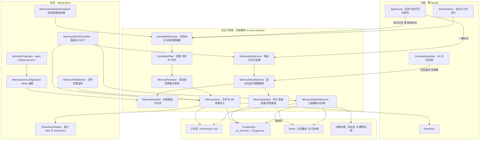

**内核 / 外壳边界**：`oc-core-memory` 零 Spring，仅依赖 `common` + `core-api`；文件读写经 `StoragePort`（工作区），嵌入经 `EmbeddingPort`（卷 02 提供），事件经 `EventPort`。Spring 侧只做配置绑定、定时触发、文件监听与 REST。

### 4.1 四层记忆路由表（D-MEM-1 落地细则）

| 层 | 存储 | 写入路径 | 召回权重 | 生命周期 | 典型条目 |
| --- | --- | --- | --- | --- | --- |
| 工作记忆 | 内存 + 事件（不落记忆库） | 任务黑板直接写；任务结束即释放 | 不参与记忆召回（走任务上下文） | 任务级 | 「假设 A 成立，待验证」 |
| 会话记忆 | 会话存储（卷 19） | 会话内决策与偏好，会话结束转候选 | 0.8 | 会话存活期 | 「用户偏好小步提交」 |
| 项目记忆 | `.oc/memory/*.md`（源）+ DB 索引 | 候选 → 评审 → 写文件 + 建索引 | 1.0 | 随项目（可设 `reviewAt`） | 「本项目禁止直接操作生产库」 |
| 组织记忆 | 组织库（文件为源 + 权限受控） | 提案 → 评审 → 发布（含署名与理由） | 1.2 | 组织级（复审提醒） | 「发布必须走双人评审」 |

**路由规则**：同一 key 在多层同时存在时按「组织 → 项目 → 会话 → 工作」合并（高优先层覆盖低层），合并结果记录 `shadowedBy`；被遮蔽条目不删除，仅不注入，供审计与解释。

### 4.2 召回管线

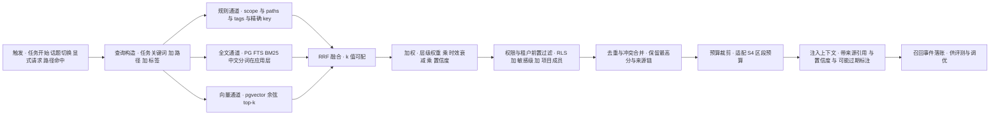

**预算与位置**：S4 区段预算由卷 03 给定（默认占窗口 5%，用户可调）；注入文案模板固定为「以下为可能过期的参考记忆（来源：…，置信度：…），冲突时以当前代码与用户指令为准」。

### 4.3 记忆 / 知识 / 历史三分边界（D-MEM-9 落地）

| 维度 | 记忆 | 知识（卷 11） | 历史（卷 16/19） |
| --- | --- | --- | --- |
| 形态 | 简短可执行结论（key/value，value 超长转知识库） | 文档与代码索引（块级） | 完整事件与会话记录 |
| 检索 | 混合召回 + 层级权重 | 三路检索（全文 / 向量 / 结构） | 按会话 / 时间 / 全文回溯 |
| 注入标注 | `来源类型=记忆` + 置信度 + 过期提示 | `来源类型=知识` + 可点开引用 | `来源类型=历史` + 时间戳 |
| 写入 | 候选 → 审核 | 连接器同步 | 自动追加，不可修改 |
| 删除 | 三级删除 + 证明 | 随源删除重建索引 | 按保留策略归档 |

**规则**：三类**分别召回、分别标注**，禁止相互替代；记忆条目 value 超长（默认 > 2000 字符，配置化）时提示「转知识库」而非截断存储。

---

## 5. 类图

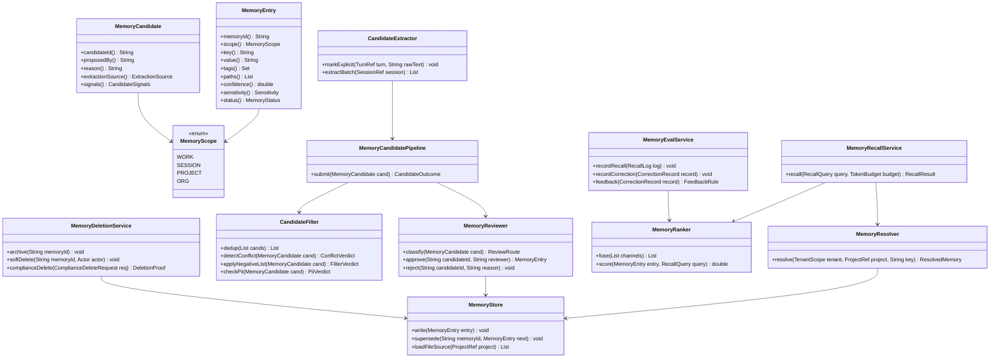

### 5.1 关键接口签名（Java 21）

> 异常约定：记忆层异常统一表达为 `MemoryException extends HarnessException`（携带全局 `ErrorCode`：`RESOURCE_NOT_FOUND` / `INVALID_ARGUMENT` / `PERMISSION_DENIED` / `MEMORY_DELETE_INCOMPLETE`），**禁止裸抛** `RuntimeException` / `IllegalArgumentException`，由外壳全局异常处理器按附录 B.7 统一转换。**异常命名分层（全套统一）**：内核层（framework-free core，召回/抽取/归并的全部实现）失败抛 `HarnessException` 及其子类 `MemoryException`；外壳层（domain / application / interfaces 的文件同步、导出导入、组织治理面）失败抛 `BusinessException`；两侧文案均为中文并含条目编号或 key 摘要（**不输出记忆原文**）。**契约缺口指针（X-82）**：异常类名与冻结卷册 `ErrorCode` 映射的登记缺口已列为修订建议 **X-82**（`impl/IMPL-DECISIONS.md` §4；本文件不改台账）。

```java
/**
 * 记忆存储端口。
 * 分层职责：工作层与会话层仅内存 / 会话存储；项目层与组织层以文件为源、DB 为索引。
 * 所有实现必须强制携带租户上下文，禁止跨租户读写。
 */
public interface MemoryStorePort {

    /**
     * 写入一条已通过审核的记忆。
     *
     * @param entry 记忆条目（必填，含租户、层级、key/value、来源与置信度）
     * @throws MemoryException 层级与存储不匹配、PII 未通过复检或文件写入失败时抛出
     */
    void write(MemoryEntry entry);

    /**
     * 用新版本取代既有条目（保留版本链，不物理覆盖）。
     *
     * @param memoryId 被取代条目编号（必填）
     * @param next     新版本条目（必填，key 必须与被取代条目一致）
     * @return 取代后的新条目编号
     * @throws MemoryException 条目不存在、已被合规删除或 key 不一致时抛出
     */
    String supersede(String memoryId, MemoryEntry next);

    /**
     * 从文件源加载指定项目的记忆条目。
     *
     * @param project 项目引用（必填，含租户与工作区路径）
     * @return 条目列表；文件不存在时返回空列表而非 null
     * @throws MemoryException 文件格式非法（YAML 头缺失或 key 重复）时抛出
     */
    List<MemoryEntry> loadFileSource(ProjectRef project);
}
```

```java
/**
 * 记忆召回服务：混合召回 + 预算裁剪，返回结果全部带来源与置信度。
 *
 * 层带归属（H-003）：本类属**平台域带**（`platform-memory`，允许 Spring 装配），与 §1.4「外壳装配」口径一致；
 * 内核侧零 Spring——`MemoryRanker`/`MemoryResolver`/`MemoryStorePort` 等纯逻辑与端口不带任何容器注解。
 */
@Service
@RequiredArgsConstructor
@Slf4j
public class MemoryRecallService {

    private final MemoryRanker ranker;
    private final MemoryResolver resolver;
    private final MemoryProperties properties;

    /**
     * 按查询与预算召回记忆。
     *
     * @param query  召回查询（必填，含租户、项目、任务关键词与路径集合）
     * @param budget token 预算（必填，由上下文引擎按 S4 区段下发）
     * @return 召回结果（按分数降序，受预算截断；无命中时为空列表）
     * @throws MemoryException 权限过滤配置缺失或向量维度与索引版本不一致时抛出
     */
    public RecallResult recall(RecallQuery query, TokenBudget budget) {
        log.info("记忆召回开始，tenantId={}, projectId={}, 预算 token={}",
                query.tenant().tenantId(), query.project().projectId(), budget.tokens());

        // 1. 三通道候选生成：规则优先（精确与路径），全文与向量并行
        Candidates candidates = ranker.generateCandidates(query, properties.recall().topK());

        // 2. 融合与加权：RRF + 层级权重 + 时效衰减 + 置信度
        List<ScoredMemory> fused = ranker.fuseAndScore(candidates, query);

        // 3. 权限与租户前置过滤：跨租户零共享，敏感级按角色过滤
        List<ScoredMemory> permitted = resolver.filterByPermission(fused, query.tenant());

        // 4. 预算裁剪：超预算时按分数截断并记录被丢弃条目（供评测）
        RecallResult result = ranker.trimToBudget(permitted, budget);
        log.info("记忆召回完成，候选={}, 命中={}, 注入={}, 丢弃={}",
                candidates.size(), permitted.size(), result.injected().size(), result.dropped().size());
        return result;
    }
}
```

```java
/**
 * 记忆状态枚举（数据库存 code，前端传 code）。
 * CANDIDATE 仅存在于候选链路；COMPLIANCE_DELETED 为终态，不可恢复。
 */
@Getter
@RequiredArgsConstructor
public enum MemoryStatus {

    /** 候选：待审核，不参与召回 */ CANDIDATE("CANDIDATE", "候选"),
    /** 生效：参与召回 */ ACTIVE("ACTIVE", "已生效"),
    /** 被取代：保留版本链，不参与召回 */ SUPERSEDED("SUPERSEDED", "已被取代"),
    /** 归档：过期不再召回，仍可查询 */ ARCHIVED("ARCHIVED", "已归档"),
    /** 软删：不可召回，界面可查，可恢复 */ DELETED("DELETED", "已删除"),
    /** 合规删除：全链路清除并留存证明，不可恢复 */ COMPLIANCE_DELETED("COMPLIANCE_DELETED", "合规删除");

    /** 持久化与事件载荷使用的编码 */
    private final String code;

    /** 面向用户的中文描述 */
    private final String desc;

    /**
     * 按编码解析状态。
     *
     * @param code 状态编码（必填）
     * @return 对应枚举项
     * @throws MemoryException 编码非法时抛出（文案含非法值，便于定位）
     */
    public static MemoryStatus of(String code) {
        for (MemoryStatus status : values()) {
            if (status.code.equals(code)) {
                return status;
            }
        }
        throw new MemoryException(MemoryErrorCode.STATUS_UNKNOWN, "未知记忆状态：" + code);
    }
}
```

---

## 6. 核心流程时序图

### 6.1 候选写入管线（抽取 → 去重 → 冲突 → 审核 → 落库）

**前置条件**：自动记忆开关开启（显式指令路径不依赖开关）；会话结束或用户显式「记住」。
**主路径**：抽取（受限批处理）→ 归一化与去重 → 冲突检测 → PII 与负向清单过滤 → 评分路由（自动 / 确认 / 拒绝）→ 写入文件或 DB → 建索引 → 发布事件。
**异常与补偿**：写入失败进入重试队列（指数退避）；文件写成功但索引失败时以文件为源补偿重建（记录 `memory.drift.detected`）。
**幂等与并发点**：候选以 `(tenantId, scope, key, valueDigest)` 幂等键去重；全局归并由 `RedisKeys.memoryConsolidateLock(tenantId, projectId)` 单锁串行（REQ-MEM-17）。

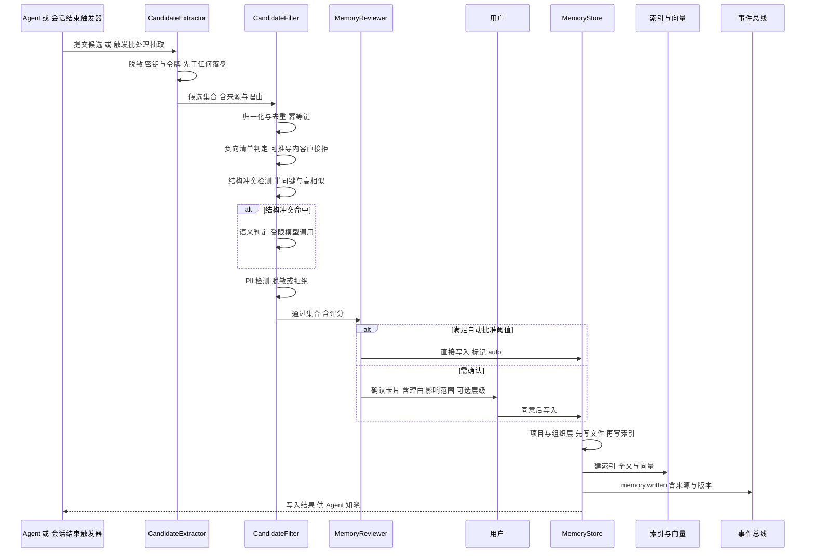

### 6.2 混合召回与注入（S4 预算内）

**前置条件**：上下文组装阶段已为 S4 区段分配预算；租户上下文已建立。
**主路径**：查询构造 → 三通道并行召回 → RRF 融合与加权 → 权限前置过滤 → 去重与冲突合并 → 预算裁剪 → 注入带标注。
**异常与补偿**：向量索引不可用时降级为「规则 + 全文」并在结果上标注降级；记忆系统整体不可用时进入「无记忆」模式并显式提示（卷 10 §7 可用性要求）。
**幂等与并发点**：召回结果按 `(tenantId, projectId, queryDigest)` 短时缓存（默认 30s，防同一轮重复召回）；缓存键含租户。

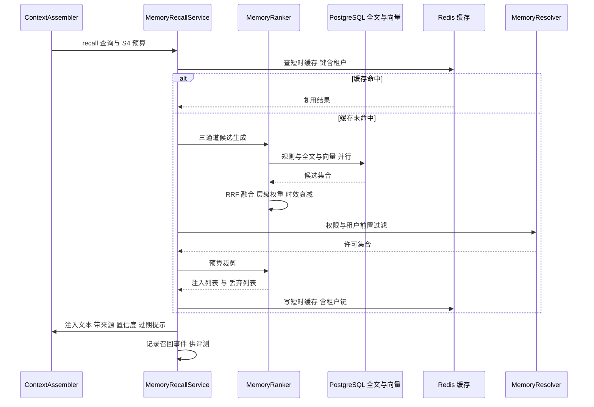

### 6.3 合规删除（含派生索引与备份穿透）

**前置条件**：删除请求者具备 `memory.delete` 权限；删除范围已确认（单条 / 同键全链 / 按来源批量）。
**主路径**：冻结条目（立即停止召回）→ 文件侧清除或改写 → DB 软删 → 向量与全文清除 → 缓存与召回日志快照清除 → 备份 tombstone 登记 → 敏感条目销毁 DEK → 生成删除证明并落审计。
**异常与补偿**：任一步失败即整体标记为「删除未完成」，进入补偿任务重试并告警；**证明只在全部步骤成功后生成**（避免假证明）。
**幂等与并发点**：删除请求带 `Idempotency-Key`；同一 `memoryId` 重复删除幂等返回既有证明。

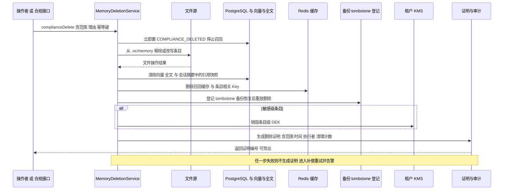

### 6.4 文件漂移检测与索引重建

**前置条件**：项目启用文件化记忆；`MemoryFileWatcher` 正在监听工作区 `.oc/memory/`。
**主路径**：检测到文件变更 → 解析 YAML 头与正文 → 与 DB 版本比对 → 以文件为准重建索引 → 发布 `memory.drift.detected`。
**异常与补偿**：文件格式非法时拒绝重建并保留旧索引 + 告警（不静默吞掉）；文件被外部删除时对应 DB 条目转 `DELETED` 并清索引。
**幂等与并发点**：变更事件去抖（默认 500ms），同一文件的连续变更只触发一次重建。

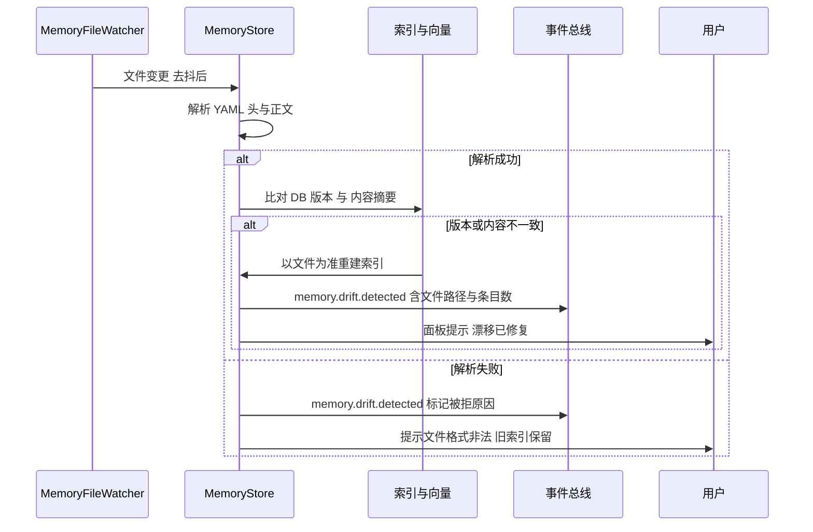

---

## 7. 状态机

### 7.1 记忆条目生命周期

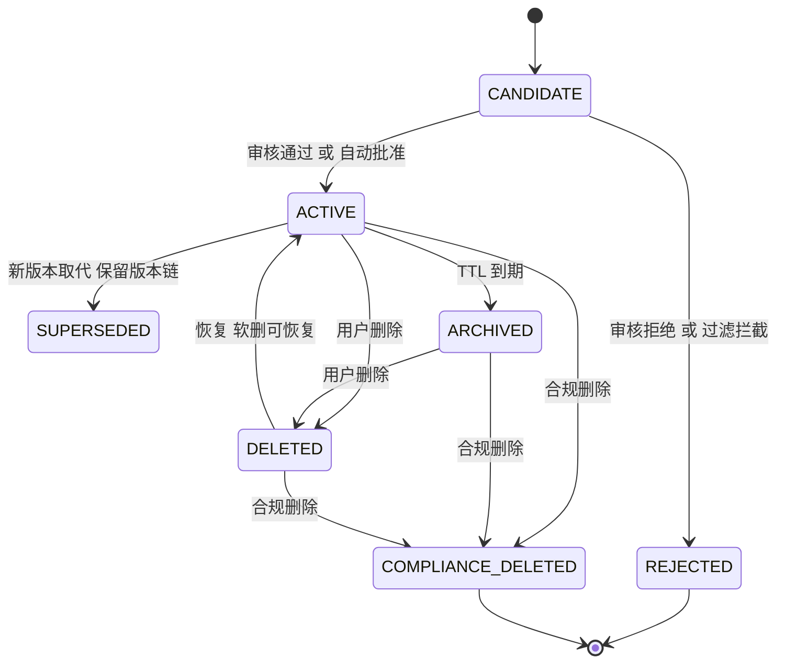

**约束**：`COMPLIANCE_DELETED` 为终态，任何路径不得回退；`SUPERSEDED` 条目不参与召回但必须可查（审计与解释需要）。

### 7.2 候选审核状态机

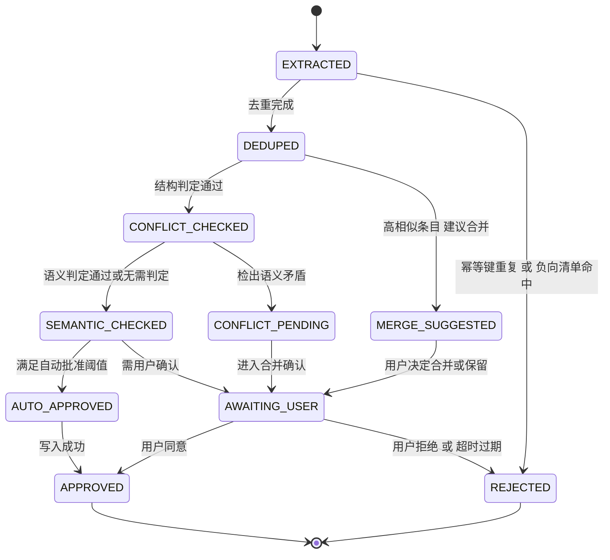

**约束**：`AWAITING_USER` 有 TTL（默认 7 天，配置化），超时转 `REJECTED` 并记录原因；审核卡片必须展示来源会话引用与影响范围。

### 7.3 索引任务状态机

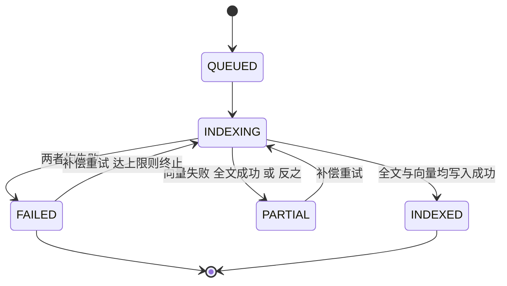

**约束**：`PARTIAL` 状态下条目**不参与召回**（避免半索引导致的不一致），但文件源与 DB 元数据已落；补偿任务从文件源重建。

---

## 8. 数据模型

### 8.1 表设计（`oc_*`，PostgreSQL）

**类型约定（本节各表通用；逐列 DDL 以卷 19 的 Flyway 迁移脚本为准）**：内部主键 `id BIGINT`（Snowflake）或复合主键（如 `(tenant_id, …)`）；对外暴露的引用 ID 用不透明字符串 / `UUID`（防遍历）；时间列统一 `TIMESTAMPTZ`（UTC 存储、展示层本地化）；枚举列存 `VARCHAR(32)` 的 **code**（禁止存 desc）；结构化与可变结构用 `JSONB`；布尔列 `BOOLEAN NOT NULL DEFAULT false`；敏感字段（密钥 / Token）只存引用名 `*_ref`，明文永不入库；大对象（快照 / 录制 / 工件）外置并留指针；各表字段语义见「关键字段」列，索引与唯一约束见末列。

| 表 | 关键字段 | 索引 / 约束 | 备注 |
| --- | --- | --- | --- |
| `oc_memory_entry` | `id`、`tenant_id`、`scope`、`owner_ref`、`project_id`、`mem_key`、`value_text`、`tags`、`paths`、`confidence`、`sensitivity`、`status`、`source_kind`、`source_ref`、`author_ref`、`ttl_at`、`review_at`、`supersedes`、`superseded_by`、`file_path`、`file_version`、`content_digest`、`created_at`、`updated_at`、`version` | `uk_active(tenant_id, scope, owner_ref, mem_key) WHERE status = 'ACTIVE'`；`ix_recall(tenant_id, project_id, status)`；`ix_review(review_at)` | 行级安全（RLS）强制 `tenant_id`；`value_text` 超长（> 2000 字符）转知识库 |
| `oc_memory_version` | `id`、`memory_id`、`version_no`、`value_digest`、`value_snapshot`、`changed_by`、`change_reason`、`created_at` | `uk_version(memory_id, version_no)` | 版本链与合并历史，供审计与回滚 |
| `oc_memory_candidate` | `id`、`tenant_id`、`scope`、`mem_key`、`value_text`、`reason`、`extraction_source`、`session_ref`、`confidence`、`signals_json`、`state`、`reviewer_ref`、`decided_at`、`expires_at` | `uk_candidate(tenant_id, scope, mem_key, value_digest)`；`ix_state(state, expires_at)` | 候选表**可物理清理**（终态保留 90 天后归档） |
| `oc_memory_index_task` | `id`、`memory_id`、`tenant_id`、`state`、`fulltext_done`、`vector_done`、`attempts`、`last_error`、`updated_at` | `ix_state(state)` | 索引补偿任务 |
| `oc_memory_recall_log` | `id`、`tenant_id`、`session_id`、`query_digest`、`memory_id`、`score`、`rank`、`injected`、`used`、`occurred_at` | 按日分区；`ix_tenant_time(tenant_id, occurred_at)` | **不存查询原文与记忆原文**（只存摘要与编号） |
| `oc_memory_correction` | `id`、`tenant_id`、`memory_id`、`correction_kind`、`reason_digest`、`actor_ref`、`feedback_rule_id`、`occurred_at` | `ix_memory(memory_id)` | 纠正反哺来源（REQ-MEM-19） |
| `oc_memory_deletion_proof` | `id`、`tenant_id`、`scope_ref`、`request_id`、`range_digest`、`steps_json`、`counts_json`、`executor_ref`、`tombstone_ref`、`proof_digest`、`created_at` | `uk_request(request_id)`；`ix_tenant_time(tenant_id, created_at)` | 删除证明不可修改；含各步清理计数与摘要 |
| `oc_memory_feedback_rule` | `id`、`tenant_id`、`rule_kind`、`match_key`、`match_source_kind`、`action`、`expires_at` | `ix_match(tenant_id, match_key)` | 纠正反哺生成的降权 / 拦截规则 |

**向量与全文**：复用卷 11 的 `IndexStoreSPI`（与卷 11 同一扩展点，切换后端接口不变）；记忆向量落 `oc_memory_embedding`（`memory_id`、`tenant_id`、`embedding vector(N)`、`dim`、`model_version`、`normalization`），全文落 `oc_memory_fts`（`tsvector` + 应用层中文分词 + `tokenizer_version`）；**索引不是真源**（真源 = 文件源 + `oc_memory_entry`），索引行可整体丢弃重建。

**索引代（generation）与迁移（R05 新增）**：新增 `oc_memory_index_generation`（`generation` PK、`kind`（VECTOR/FULLTEXT）、`model_version` / `tokenizer_version`、`dim`、`state`（SHADOW/ACTIVE/RETIRED）、`built_entries`、`started_at`、`promoted_at`），语义与卷 11 `oc_kb_embedding_generation` 对齐（`uk(generation)`；部分索引 `(kind, state)`）。三件事分别有明确迁移与重建计划：

| 变更 | 检测与触发 | 迁移步骤 | 重建期可用性 |
| --- | --- | --- | --- |
| 换嵌入模型（同维度） | 配置 `open-coding.memory.embedding.model` 变化 → 建 SHADOW 代 | 逐批重嵌 → `built_entries` 达标 → `POST /memory/index/generations/{id}/promote`（CAS：`UPDATE ... WHERE state='SHADOW'`，行数必须为 1）→ 旧代 RETIRED | 旧代继续服务；`/memory/eval/summary` 标注 `indexGeneration` |
| 换维度（跨代不可比） | `dim` 与活动代不一致 → 建新列/新分区（expand）→ 建 SHADOW 代 | expand-contract：新增 `embedding_v2` 列并双写 → 回填 → 读切换 → 观察期后移除旧列（卷 19 §⑥.1 迁移安全序列） | 双写窗口内按活动代检索；**禁止**在同一向量列混存不同维度 |
| 换分词器/切分配置（全文） | `tokenizer_version` 变化 → 建全文 SHADOW 代 | 逐批重算 `tsv` → 校验抽样（召回对比）→ 提升为 ACTIVE | 旧 `tsv` 继续服务；未提升前新代不参与召回 |

**路由规则（硬约束）**：检索必须携带 `generation` 过滤（`WHERE index_generation = :active`），禁止跨代混排；`oc_memory_entry.content_digest` 与 `oc_memory_version.value_digest` 是重建比对基准（重建后必须逐条一致）。

**重建路径（R05 新增，权威口径见 §10.10）**：索引损坏或维度错配时，先从 `oc_memory_entry` + `.oc/memory/*.md`（文件层）重建 `oc_memory_fts`，再逐批重嵌重建 `oc_memory_embedding`；**禁止**以索引行反向覆盖条目文本。

### 8.2 Redis Key（统一 Key 工厂）

| Key 工厂方法 | 用途 | TTL |
| --- | --- | --- |
| `RedisKeys.memoryRecallCache(tenantId, projectId, queryDigest)` | 召回结果短时缓存（键必含租户） | 30s（`recall.cache-ttl-seconds`） |
| `RedisKeys.memoryConsolidateLock(tenantId, projectId)` | 会话批次归并单锁（REQ-MEM-17） | 归并超时预算 |
| `RedisKeys.memoryCandidateQueue(tenantId)` | 候选抽取任务队列 | 队列长度 |
| `RedisKeys.memoryIndexRetry(tenantId, memoryId)` | 索引补偿退避计数 | 24h |
| `RedisKeys.memoryDeletionLock(tenantId, requestId)` / `memoryPanelSnapshot(tenantId, projectId)` | 合规删除幂等与串行化；面板列表快照（避免高频查库） | 删除超时预算 / 60s |

### 8.3 文件布局与格式（项目层 / 组织层）

```
<workspace>/.oc/memory/
├── MEMORY.md              # 索引文件：条目链接 + 一行摘要（默认最多读前 200 行 / 25KB）
├── user-preferences.md    # 主题文件（YAML 头 + 正文）
├── project-conventions.md
└── feedback-testing.md
```

**YAML 头字段**：`key`、`scope`、`tags`、`paths`、`sensitivity`、`ttl`、`status`、`author`、`updatedAt`、`version`、`source`。
**规则**：`sensitivity=敏感` 的条目默认**不写入文件**（仅本地加密 DB）；文件条目必须可被无工具环境人工阅读（正文为自然语言短句，禁止仅存 ID 与编码）；索引文件超预算时截断并提示（REQ-MEM-14）。

### 8.4 事件与对象存储

| 事件 | 载荷要点 |
| --- | --- |
| `memory.proposed` / `memory.written` / `memory.rejected` | 候选编号、层级、key 摘要、理由、审核路由（自动 / 确认 / 拒绝） |
| `memory.recalled` | 会话、查询摘要、条目编号、分数、是否注入、是否被使用 |
| `memory.conflict.detected` / `memory.conflict.resolved` | 冲突类型（同键 / 语义）、涉及条目编号、处置结论 |
| `memory.expired` / `memory.deleted` / `memory.compliance_deleted` | 删除级别、范围摘要、证明编号（合规删除） |
| `memory.corrected` | 纠正类型、生成的反哺规则编号（**不含记忆原文**） |
| `memory.drift.detected` | 文件路径、漂移条目数、处理结论（修复 / 拒绝） |

**对象存储前缀**：`memory/exports/<tenant>/<ts>.zip`（导出包，Markdown + JSON，含版本与来源）；`memory/deletion-proof/<tenant>/<proofId>.json`（删除证明，只读、按卷 24 保留策略长期保留）。

---

## 9. 接口与扩展点

### 9.1 REST 管理面（`/api/v1`，外壳层）

| 方法 | 路径 | 入参 | 出参 | 错误码 |
| --- | --- | --- | --- | --- |
| GET | `/memory/entries` | `scope`、`projectId`、`status`、`q`、cursor | 条目页（含层级、置信度、来源） | `PERMISSION_DENIED` |
| POST | `/memory/entries` | 显式创建条目（key / value / scope / tags） | 条目编号 | `INVALID_ARGUMENT`、`MEMORY_DUPLICATE` |
| PATCH | `/memory/entries/{id}` | 编辑值 / 标签 / 层级（走 supersede 链） | 新版本编号 | `RESOURCE_NOT_FOUND` |
| DELETE | `/memory/entries/{id}` | `mode`（`soft` / `compliance`）、`reason`、`Idempotency-Key` | 软删结果或删除证明编号 | `PERMISSION_DENIED`、`MEMORY_DELETE_INCOMPLETE` |
| GET | `/memory/candidates` | `state`、cursor | 候选页（含理由与影响范围） | — |
| POST | `/memory/candidates/{id}/approve` \| `/reject` | `scope` 覆盖（可选）、拒绝理由（reject 必填） | 写入结果或拒绝记录 | `MEMORY_CANDIDATE_EXPIRED` |
| POST | `/memory/corrections` | `memoryId`、`correctionKind`、`reason` | 反哺规则编号 | `RESOURCE_NOT_FOUND` |
| GET | `/memory/eval/summary` | `from`、`to`、`projectId` | 命中率 / 误用率 / 过期率 / 冲突率 | — |
| POST | `/memory/export` / `/import` | 导出范围；导入包（Markdown + JSON） | 导出包地址；导入统计 | `MEMORY_FORMAT_INVALID` |
| GET | `/memory/files` | `projectId` | 文件清单与漂移状态 | — |
| POST | `/memory/org/proposals` | 组织记忆提案（署名 / 理由 / 影响范围 / 评审人） | 提案编号 | `PERMISSION_DENIED` |
| POST | `/memory/org/proposals/{id}/publish` \| `/rollback` | 发布或回滚到指定版本 | 发布版本号 | `MEMORY_REVIEW_REQUIRED` |

**WS 端点**：`/ws/v1/memory/events` 推送候选、冲突、漂移与删除事件（桌面端面板实时刷新）。

### 9.2 SPI 扩展点（对接卷 18 目录）

| SPI | 稳定性 | 说明 |
| --- | --- | --- |
| `MemoryStoreSPI` | `stable` | 记忆后端（本地文件 + DB / 远端组织库） |
| `MemoryWriterSPI` | `evolving` | 写入策略（企业自定义审批流、自动批准阈值来源） |
| `MemoryRankerSPI` | `evolving` | 召回打分与重排（可替换为 LTR 或企业特征） |
| `PiiDetectorSPI` / `MemorySyncSPI` / `MemoryExtractionSPI` | `stable` / `experimental` | PII 识别（内置规则 + 企业规则 / 模型）；外部系统同步（企业 Wiki / Notion，冲突显式提示）；候选抽取策略（行业词表、领域规则） |

### 9.3 配置项（`open-coding.memory.*`）

| 配置键 | 默认值 | 必填 | 说明 |
| --- | --- | --- | --- |
| `open-coding.memory.enabled` | `true` | 否 | 记忆系统总开关；关闭时进入「无记忆」模式并显式提示 |
| `open-coding.memory.auto-memory.enabled` | `false` | 否 | 自动记忆（会话挖掘）默认关闭（REQ-MEM-15） |
| `open-coding.memory.auto-memory.session-types` | `interactive` | 否 | 允许挖掘的会话类型；无头 / CI 默认不挖掘 |
| `open-coding.memory.extraction.batch-cron` | `0 */5 * * * *` | 否 | 会话结束批处理抽取触发（配置化 cron） |
| `open-coding.memory.candidate.auto-approve.enabled` / `confidence-threshold` | `false` / `0.9` | 否 | 自动批准开关与置信度阈值 |
| `open-coding.memory.candidate.auto-approve.scope-allowlist` | `SESSION,PROJECT` | 否 | 允许自动批准的层级白名单 |
| `open-coding.memory.candidate.expire-days` | `7` | 否 | 候选审核 TTL |
| `open-coding.memory.dedup.similarity-threshold` | `0.92` | 否 | 去重与合并建议的相似度阈值 |
| `open-coding.memory.recall.budget-ratio` | `0.05` | 否 | S4 区段预算占比（上下文引擎可覆盖） |
| `open-coding.memory.recall.vector-top-k` / `fulltext-top-k` / `rule-max` | `30` / `30` / `50` | 否 | 三通道候选上限 |
| `open-coding.memory.recall.rrf-k` | `60` | 否 | RRF 平滑常数 |
| `open-coding.memory.recall.decay.half-life-days` | `90` | 否 | 时效衰减半衰期 |
| `open-coding.memory.recall.scope-weight.org` / `project` / `session` | `1.2` / `1.0` / `0.8` | 否 | 层级权重 |
| `open-coding.memory.recall.cache-ttl-seconds` | `30` | 否 | 召回短时缓存 |
| `open-coding.memory.file.enabled` / `index-max-lines` / `index-max-bytes` / `watch-debounce-ms` | `true` / `200` / `25600` / `500` | 否 | 文件化开关、索引预算（REQ-MEM-14）与文件监听去抖 |
| `open-coding.memory.retention.ttl-days.project` / `session` | `365` / `30` | 否 | 各层默认 TTL（到期转 `ARCHIVED`） |
| `open-coding.memory.pii.types` | `PHONE,EMAIL,ID_CARD,SECRET` | 否 | 检测的 PII 类型 |
| `open-coding.memory.sensitive.encrypt` | `true` | 否 | 敏感级加密（租户 KEK + 条目 DEK） |
| `open-coding.memory.compliance.tombstone.enabled` | `true` | 否 | 备份 tombstone 登记与恢复重放 |

**环境变量族**：`OC_MEMORY_ENABLED`、`OC_MEMORY_AUTO_MEMORY`（覆盖配置，优先级高于 yml；仅交互式会话生效）、`OC_MEMORY_SENSITIVE_KEK_REF`（敏感，默认留空）。新增变量必须同步 `.env.example`。

---

## 10. 非功能与工程细节

### 10.1 并发模型

- **召回**：读路径无锁，纯查询 + 缓存；向量与全文并行发起（虚拟线程），任一失败按降级策略继续。
- **写入**：候选抽取与索引更新**异步**，不阻塞对话；写入按 `(tenantId, scope, key)` 串行化（表级唯一约束 + 重试），避免并发 supersede 造成版本链分叉。
- **归并**：全局归并单锁（`RedisKeys.memoryConsolidateLock`），锁竞争时任务排队而非跳过（REQ-MEM-17）。
- **删除**：合规删除在租户内串行执行并带幂等键；删除期间该条目的召回请求直接跳过（先置终态再清理）。
- **事务与外部调用纪律**：记忆写入 / supersede / 删除的落库路径由平台适配器以 `@Transactional(rollbackFor = Exception.class)` 实现（先置终态再异步清理索引）；候选抽取的 `LlmPort` 调用、嵌入生成与文件源读取均为**外部调用**，先于事务执行，禁止在事务体内发起模型调用。

### 10.2 性能预算

| 指标 | 预算 | 说明 |
| --- | --- | --- |
| 召回 P95（含向量） | ≤ 150ms | 卷 10 §7 约束；缓存命中路径 ≤ 20ms |
| 缓存命中路径 | ≤ 20ms | 同一轮重复召回 |
| 写入落库（审核通过后） | ≤ 200ms 异步可延迟 | 不阻塞对话，确认卡片可延迟出现 |
| 索引重建（单项目 5k 条） | ≤ 60s 后台 | 分页与限速，避免打满连接池 |
| 合规删除（单条全链路） | ≤ 5s | 含向量与缓存清理；批量按条数线性 |
| 候选抽取批处理 | 每会话 ≤ 1 次模型调用 | 受限提示词，输出结构化候选 |

### 10.3 容量与降级

- 单项目默认上限 5k 条（超限提示归档）；组织记忆 ≥ 100k 条目仍可检索（分页与索引分区）。
- 降级矩阵：向量索引不可用 → 规则 + 全文并标注降级；模型不可用 → 语义冲突判定延后（标记 `semantic_check_deferred`）；记忆整体不可用 → 「无记忆」模式并显式提示；导出 / 导入服务不可用 → 不影响日常读写。

### 10.4 安全与合规

- **租户隔离**（强制）：所有表含 `tenant_id` + PostgreSQL RLS；所有 Redis Key 含租户；向量与全文索引标签含租户且**前置过滤**；跨租户零共享（含组织记忆只在租户内组织可见）；召回缓存键含租户，杜绝跨租户命中。
- **PII**：写入前检测（手机号 / 邮箱 / 证件 / 密钥四类默认开启），命中即脱敏或拒绝；日志与事件只输出条目编号与 key 摘要，**禁止输出记忆原文**。
- **加密**：`sensitivity ≥ 内部` 条目字段级加密（租户 KEK + 条目 DEK，KMS 管理）；敏感条目默认不落文件。
- **可信边界**：记忆注入文本视为**不可信输入**，不得作为策略依据（REQ-MEM-16），也不得直接拼接进工具参数（需经工具参数校验与权限决策）。
- **删除合规**：三级删除见 §6.3；删除证明与审计项经卷 24 导出。

### 10.5 质量评估与纠正反哺

- 指标：召回命中率（注入后被引用的比例）、误用率（注入后用户纠正 / 回滚）、过期率（`ARCHIVED` 占比）、冲突率（冲突检出 / 写入数）、纠正反哺命中率、召回 P95。
- 采样评测：按租户每日抽样 N 条召回记录（N 配置化）做人工或模型标注，落 `oc_memory_recall_log` 的 `used` 字段；`oc_memory_precision` 指标输出。
- 反哺：纠正 → `oc_memory_correction` → 生成 `oc_memory_feedback_rule`（按 key / 来源类型降权或拦截）→ 后续候选在过滤阶段生效（REQ-MEM-19）。

### 10.6 可观测

- 指标：`oc_memory_write_total{scope,how}`、`oc_memory_recall_total{scope}`、`oc_memory_recall_latency_ms`、`oc_memory_precision{scope}`（抽样）、`oc_memory_correction_total`、`oc_memory_conflict_total{kind}`、`oc_memory_index_task_failed_total`、`oc_memory_compliance_delete_total`、`oc_memory_drift_total`。
- 日志（全部中文文案 + 占位符，**零记忆原文**）：候选生命周期（提议 / 过滤结论 / 审核路由 / 写入）、召回（候选数 / 命中数 / 注入数 / 丢弃数 / 耗时）、删除（步骤与计数）、漂移（文件与条目数）；追踪：一次召回与一次删除各一个 span（属性含租户、项目、通道耗时、降级标记、步骤耗时与重试次数）。

---

### 10.7 错误矩阵（错误 → ErrorCode → 可重试 → 用户可见文案 → 恢复动作）

| 错误场景 | ErrorCode | retryable | 用户可见文案 | 恢复动作 |
| --- | --- | --- | --- | --- |
| 条目不存在 / 已被合规删除 | `RESOURCE_NOT_FOUND` | 否 | 「记忆条目不存在或已删除：`<keyHash>`」 | 提示刷新；`COMPLIANCE_DELETED` **不得**回退 |
| 层级与存储不匹配（如工作记忆试图持久化） | `INVALID_ARGUMENT` | 否 | 「该层记忆不支持持久化写入」 | 拒绝写入；返回合法层级清单 |
| 记忆文件格式非法（YAML 头缺失 / key 重复） | `MEMORY_FILE_INVALID` | 否（人工修复） | 「记忆文件 `<topic>` 格式非法：`<reason>`（已保留旧索引）」 | 保留旧索引 + 告警；面板提供修复入口 |
| PII 检测命中（手机号 / 邮箱 / 证件 / 密钥） | 非错误（脱敏或拒绝） | — | 「候选内容包含敏感信息，已脱敏 / 已拒绝入库」 | 脱敏后入库或拒绝；日志只记条目编号与 key 摘要 |
| 向量索引维度与索引版本不一致 | `DEPENDENCY_UNAVAILABLE` | 是 | 「语义召回暂不可用，已降级为规则 + 全文」 | 关向量路 + 标注；后台按新代重建 |
| 嵌入服务 5xx / 超时 | `DEPENDENCY_UNAVAILABLE` | 是 | 「记忆索引更新延迟（服务不可用），不影响对话」 | 索引任务退避重试（不丢任务）；召回走降级路径 |
| 归并锁竞争（10 并发） | 非错误（排队） | — | 用户不可见 | 任务排队执行（不跳过）；单锁 + 幂等保证不重复写入 |
| 候选冲突（语义判定延后） | `MEMORY_CONFLICT`（标记） | 是 | 「存在与既有记忆冲突的新候选，已挂起待判定」 | 标记 `semantic_check_deferred`；模型恢复后补判 |
| 合规删除任一步失败 | `MEMORY_DELETE_INCOMPLETE` | 是（补偿任务） | 「删除未完成（步骤 `<step>` 失败），已登记补偿任务」 | 不生成删除证明；补偿任务续跑直至完成 |
| 全量记忆子系统不可用 | `DEPENDENCY_UNAVAILABLE`（整体降级） | 是 | 「当前为无记忆模式（记忆服务不可用）」 | 会话可用 + 显式提示；恢复后自动接入 |
| 跨租户访问尝试 | `PERMISSION_DENIED` | 否 | 「无权访问该记忆」 | 拒绝 + 审计（含计数侧信道抑制：不返回过滤前条数） |
| 组织记忆提案未发布却被引用 | `RESOURCE_NOT_FOUND` | 否 | 「该组织记忆尚未发布，不可召回」 | 拒绝召回；提示走评审流程 |

### 10.8 容量估算（单租户与全局口径）

- **条目规模**：单项目默认上限 5k 条；单条 ≤ 1KB（项目文件形态超 200 行即截断并告警）→ 项目级 ≈ 5MB；组织记忆 ≥ 10 万条目仍可检索（分页 + 索引分区）。
- **向量与索引**：单条 1 个向量（≈ 1.5KB float32 + 索引开销）→ 5k 条 ≈ 7.5MB/项目；组织 10 万条 ≈ 150MB；HNSW 构建内存 ≈ 原始向量 × 1.5。
- **文件形态**：项目记忆按主题文件（`<topic>.md`），YAML 头 + 正文；10 个主题文件 × ≤ 200 行 ≈ 300KB/项目，随会话工作区同步。
- **吞吐与延迟**：召回 P95 ≤ 150ms（含向量；缓存命中 ≤ 20ms）；写入落库 ≤ 200ms（异步，不阻塞对话）；索引重建 5k 条 ≤ 60s（后台分页限速）；合规删除单条全链路 ≤ 5s（含向量与缓存清理，批量按条数线性）。
- **候选抽取成本**：每会话 ≤ 1 次受限模型调用（结构化输出），不受召回路径影响；抽取失败不影响主流程（候选批次重试）。
- **存储水位**：召回日志 + 反哺规则 + 冲突记录 ≈ 20–80MB/租户/月（按召回日志采样比例决定）；超配额优先裁剪日志与历史版本，**不裁剪**合规删除证明与审计项。

### 10.9 与竞品对照的取舍

1. **负向清单（REQ-MEM-13）**：Claude Code 的 `memdir` 明确「可从当前项目状态推导的内容不应存为记忆」`[E1]`（01 §4.18）。我们把它做成过滤阶段的硬拒绝并给拒绝理由，代价是候选择优率下降，收益是记忆不膨胀成「项目快照」。
2. **记忆非策略（REQ-MEM-16）**：Qoder 文档原话「Memory provides context to the model but is not a strict enforcement policy」`[E2]`（07 §4.5）。我们把该声明落成负向用例（「记忆里的禁止命令不影响权限决策」），代价是用户可能期望「写进记忆就生效」，收益是权限判定保持单一来源（卷 06）。
3. **可证明删除（NFR-S-6）**：竞品多以「逻辑删除 + 索引失效」实现。我们要求三步删除（文件 / DB / 向量 / 全文 / 缓存 / 导出物 / 备份 tombstone）+ 删除证明，代价是删除链路延迟升至 ≤ 5s，收益是「恢复演练后仍不可召回」可断言。
4. **反哺闭环（REQ-MEM-19）**：部分竞品只做「写入 + 召回」。我们增加「纠正 → 反馈规则 → 后续候选拦截/降权」闭环，代价是多一张规则表与一次过滤开销，收益是同类错误不重复。
5. **组织记忆治理**：企业面（Qoder 组织记忆等）偏向「共享即生效」。我们要求提案 → 评审 → 发布 + 版本回滚，未发布提案不可召回——用流程成本换取「组织级记忆不成为注入面」。

---

### 10.10 恢复、幂等与删除贯通（R05 数据与检索侧）

> 镜头：记忆是跨会话的长期状态，必须回答三个问题——**进程崩溃 / 索引损坏 / 迁移后各自怎么重建**；两条不变式：「索引不是真源」「删除贯通到派生层与快照层」。
> 权威单点：事件唯一事实源与投影重建 = `impl/16-event-bus-impl.md` §⑩.9 / §⑩.4；六层合规删除 / tombstone / 密钥销毁 = `impl/19-persistence-recovery-impl.md` §⑥.4 / §⑦.4；删除证明格式与取证 = 卷 24 审计面。

**真源分层（I-MEM-1 的恢复学推论）**

| 层 | 真源 | 派生物（可丢弃重建） |
| --- | --- | --- |
| 工作 / 会话记忆 | 会话存储（卷 19）与事件流；**不落记忆库** | 无（不参与记忆召回） |
| 项目 / 组织记忆 | `.oc/memory/*.md`（文件为源，含 YAML 头与 `version`/`content_digest`）+ `oc_memory_entry` 元数据 | `oc_memory_fts`、`oc_memory_embedding`、Redis 召回缓存/面板快照、`MEMORY.md` 索引（可由主题文件重生成） |
| 版本链与治理记录 | `oc_memory_version` / `oc_memory_candidate` / `oc_memory_correction` / `oc_memory_feedback_rule` / `oc_memory_recall_log`（追加型） | 评测投影与指标 |

规则：① **文件源与 DB 元数据互为校对基准**（`content_digest` 比对，§6.4）；② 索引（全文/向量）**永不作为真源**——索引损坏一律从文件源 + `oc_memory_entry` 重建；③ `oc_memory_candidate` 为可清理的临时态（终态 90 天后归档），不承担恢复职责；④ `oc_memory_recall_log` 只存摘要与编号，**不含记忆原文**（删除时无需重写正文，只清引用）。

**R05-表-1 · 三条重建路径**

| 存储 | (a) 进程崩溃 | (b) 索引 / 内容损坏 | (c) Schema 迁移 |
| --- | --- | --- | --- |
| 文件源（项目/组织层） | 写入为「先文件后索引」，崩溃后索引落后：`§6.4` 文件漂移检测按 `content_digest` 重建索引（幂等，去抖 500ms） | 文件非法 YAML → 保留旧索引 + 告警（不静默）；文件被外部删除 → 条目转 `DELETED` 并清索引 | YAML 头新增字段只增不改；缺字段取默认；`version` 单调（回退需显式 supersede） |
| `oc_memory_entry`（元数据） | 写事务未提交即不存在；提交后崩溃不影响 | 行损坏 → 以文件源为准重建该条；组织层无文件时以导出包/版本链重建 | 枚举 code 只增不改；`schema_version` 随行落库 |
| `oc_memory_fts` / `oc_memory_embedding` | 索引任务状态机 `QUEUED→INDEXING→INDEXED/PARTIAL/FAILED`，重启续跑；`PARTIAL` 不参与召回（§7.3） | 全量重建：全文先重建（秒级），向量按代逐批重嵌；重建与在线写并发时以 `content_digest` 判定是否需重嵌 | 维度变更走 `embedding_v2` 列 expand-contract；`tokenizer_version` 变更建全文 SHADOW 代（§8.1） |
| Redis（召回缓存 / 归并锁 / 删除锁 / 面板快照） | 全丢不影响正确性：缓存重建、锁按租约恢复 | 直接淘汰；**禁止**把 Redis 当作候选队列真相（队列以 `oc_memory_candidate.state` 为准） | Key 形态含租户与代（`generation`）、不含查询原文 |
| 对象存储（导出包 / 删除证明） | 导出任务可重跑（`Idempotency-Key`） | 导出包损坏 → 重新导出；删除证明不可重建（**必须**由备份仓与审计冗余保护） | 导出包格式版本协商（`MEMORY_FORMAT_INVALID` 显式拒绝） |

**R05-表-2 · 可竞争的写路径与并发控制**

| 写路径 | 风险 | 既有控制（落点） | R05 补充判定 |
| --- | --- | --- | --- |
| 候选写入（自动/审核） | 同候选重复落库、并发 supersede 分叉版本链 | 幂等键 `(tenantId, scope, key, valueDigest)`（§6.1）；`uk_active` 部分唯一索引 + `(tenantId, scope, key)` 串行化（§10.1） | supersede 必须**条件更新**（`WHERE status='ACTIVE' AND version=:expected`，行数 ≠ 1 抛 `MEMORY_CONFLICT`），禁止先查后写 |
| 索引更新 vs 删除 | 删除后索引任务回写“复活”条目 | 删除先置 `COMPLIANCE_DELETED` 终态再清索引（§10.1） | 索引任务提交前必须**二次校验条目状态**（非 ACTIVE 即丢弃该批），并在删除请求内清理 `oc_memory_index_task` 在途任务 |
| 文件写入 vs 面板编辑 | 两写者同时改同一主题文件 | 文件监听去抖 + 以文件为源重建（§6.4） | 写入必须经 `MemoryStore`（文件先写 + 原子替换），并以 `file_version` 做条件写；冲突时以文件为准 + 显式漂移事件 |
| 归并 | 同项目并发归并重复写入 | `RedisKeys.memoryConsolidateLock` 单锁串行（REQ-MEM-17） | 锁 + 幂等键双保险：锁丢失时靠幂等键去重（锁是性能手段，幂等是正确性手段） |
| 合规删除 | 重复请求 / 并发删除 | `Idempotency-Key` + `memoryDeletionLock`（§6.3） | 同 `requestId` 重放返回既有证明；不同范围并发删除按「条目 ID 升序」加锁，避免死锁 |
| 召回缓存 | 删除后命中旧缓存 | 删除时清缓存（§6.3） | 缓存键含 `generation` 与租户；**删除必须在同一请求内清缓存**，不得依赖 TTL 过期 |

**R05-表-3 · 删除贯通（cascade + tombstone + crypto-shredding，对齐 19 §⑥.4 六层）**

| 层 | 本域资源 | 处置 |
| --- | --- | --- |
| 在线表 | `oc_memory_entry`（含版本链 `oc_memory_version`）、候选与纠正记录 | 条目与版本链级联删 + 后台物理清理；`sensitivity ≥ 内部` 行叠加密文销毁（条目 DEK 销毁） |
| 文件源 | `.oc/memory/*.md` 对应条目与 `MEMORY.md` 索引行 | 移除或改写条目 + 同步移除索引行（REQ-MEM-14，无悬挂行）；文件随仓库版本化 → 一次性清除本地 + 标记远端（`memory.deleted` 事件） |
| 索引 | `oc_memory_fts` / `oc_memory_embedding`（所有代，含 SHADOW/RETIRED） | 按 `memory_id` 跨代删除；RETIRED 代同样清除（否则「已删内容仍可被旧代召回」） |
| 缓存 | 召回缓存、面板快照、候选队列条目 | 删除相关 Key；面板快照按租户+项目重建 |
| 日志 / 快照 | `oc_memory_recall_log`（无原文，只清记忆编号引用）、事件载荷中的 key 摘要 | 保留计数与摘要；若事件载荷含原文摘要则按 19 段内处置路径处理 |
| 导出物 | `memory/exports/<tenant>/*.zip`（含 Markdown + JSON 正文） | **删除请求内登记失效并物理清除**（导出包是新副本，不随源删除自动消失） |
| 备份 | 备份中的条目行与导出包 | tombstone 登记（恢复后重放删除）+ 敏感条目密钥销毁（I-MEM-5 增强档） |
| 证明 | `oc_memory_deletion_proof` | 不可修改；只在全部层成功后签发（§6.3），与 19 `oc_deletion_certificate` 哈希链对账（本域计数进 `layer_results`） |

**与 16 / 19 的一致性**：① 本域事件（`memory.*`）在卷 16 注册 Schema，`code` 只增不改；② 派生物（评测投影、面板视图）登记 `oc_projection_state` 并走投影重建协议；③ 删除**不**自行重写事件行（卷 16 §⑩.9「历史不可变」），只按 19 的段内处置路径执行；④ 索引重建属「安全修复」（19 §③ D-PERSI-8 三级修复的第一级：重建投影/重建索引，无需人工确认）。

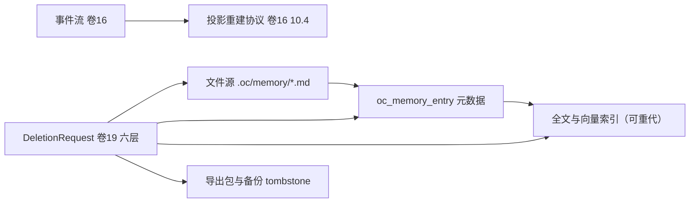

## 11. 测试与验收（DoD）

### 11.1 单元测试

| 用例组 | 覆盖点 | 关键断言 |
| --- | --- | --- |
| `CandidateFilterTest` | 去重、负向清单、PII、冲突结构判定 | 「记录本仓库目录结构」类候选被拒且理由为负向清单命中 |
| `MemoryExtractorTest` | 密钥脱敏、候选结构化输出、显式指令即时标记 | 含 API Key 的会话产出候选内无原值（正则断言） |
| `MemoryRankerTest` | RRF 融合、层级权重、时效衰减、预算裁剪 | 同分时组织层优先；同半衰期外条目分数单调下降 |
| `MemoryStoreFileTest` / `MemoryStatusTest` | YAML 头解析、索引预算截断、删除文件移除索引行、状态终态保护 | 超 200 行截断有告警；删除主题文件后索引无悬挂行；`COMPLIANCE_DELETED` 不得回退 |
| `MemoryDeletionServiceTest` | 三步删除、步骤失败不生成证明、幂等 | 任一步失败时证明未生成且状态为「删除未完成」 |
| `MemoryFeedbackTest` | 纠正生成规则、规则命中拦截 | 纠正后同键候选被拦截（REQ-MEM-19） |
| `MemoryRebuildTest`（R05 新增） | 索引重建（全文/向量）与代提升 | 清空索引后仅凭文件源与元数据重建出同 `content_digest` 结果；SHADOW 代提升为 CAS（`state='SHADOW'` 条件更新行数必须为 1），并发提升仅一次成功 |

### 11.2 集成与跨系统测试

| 场景 | 方法 | 门禁 |
| --- | --- | --- |
| 四层端到端 | 四层各写入 / 召回 / 过期一遍 | 层级合并与 `shadowedBy` 正确 |
| 文件双向同步 | 外部编辑文件 → 索引重建；面板编辑 → 写回文件 | 无内容不一致（比对 `content_digest`） |
| 合规删除穿透 | 删除后检查文件 / DB / 向量 / 全文 / Redis / 导出物 / 备份 tombstone | 全部清除或标记；恢复演练后仍不可召回 |
| 多租户隔离 | 构造跨租户查询与缓存键碰撞尝试 | 无跨租户命中（含缓存与向量） |
| 导入导出 | 导出后导入另一实例 | 版本链与来源完整保留 |
| 组织治理 | 提案 → 评审 → 发布 → 回滚 | 未发布提案不可召回；回滚恢复旧版本为 `ACTIVE` |
| 无记忆降级 | 关闭记忆子系统 | 会话可用并显式提示「无记忆模式」 |

### 11.3 故障注入

| 注入 | 期望 |
| --- | --- |
| 向量索引服务不可用 | 降级为规则 + 全文，结果标注降级，召回仍返回 |
| 嵌入模型版本切换 | 后台渐进重建；重建期旧版本可召回，不出现维度错误 |
| 文件被外部删除 / 改写为非法 YAML | 非法时保留旧索引 + 告警；删除时条目转 `DELETED` 并清索引 |
| 归并锁竞争（10 并发）/ 抽取模型超时 | 仅 1 次归并执行，其余排队且无重复写入；候选批次标记失败并重试，不影响会话主流程 |
| 合规删除中途 kill | 状态为「删除未完成」，补偿任务续跑，证明最终生成 |
| 备份整包恢复（含已删除条目） | tombstone 重放后条目仍不可召回（演练断言） |
| 索引重建与删除竞态（R05 新增） | 删除请求与在途索引任务并发：索引任务提交前二次校验条目状态，删除后无“复活”行；跨代（ACTIVE + RETIRED + SHADOW）删除后全代均不可召回 |
| 导出包残留（R05 新增） | 合规删除后重新扫描对象存储 `memory/exports/**`：命中已删条目的导出包被清除或登记失效，删除证明计数与之一致 |

### 11.4 性能门禁

- 召回 P95 ≤ 150ms（5k 项目条目 + 组织 100k 条目规模）；缓存命中路径 ≤ 20ms；合规删除单条 ≤ 5s；索引重建 5k 条 ≤ 60s。
- 候选抽取对交互延迟零影响（异步，回合 P95 无回归）。

### 11.5 可执行验收命令

```bash
# 门禁映射（卷 27 §4.6）：第 1 条 →「依赖规则校验（Enforcer R1–R5）」；第 2 条 →「单元测试 + 覆盖率门」；第 3 条 →「集成测试」；第 4 条 →「安全红队（增量用例：合规删除穿透）」
mvn -pl harness-platform/platform-memory -am compile    # 平台域带实现编译（Spring 允许；召回模型纯逻辑随 kernel 门禁）
mvn -pl harness-platform/platform-memory -am test       # 单元测试（召回/写入/删除/治理；-am 保证依赖模块随 reactor 构建）
mvn -pl harness-host/host-bootstrap -am test -Dgroups=memory-integration    # 端到端与跨系统
mvn -pl harness-host/host-bootstrap -am verify -Dtest=MemoryComplianceDeleteIT -DfailIfNoTests=false  # 删除穿透演练
```

> 模块名对齐卷 27 §4.1 目标 reactor 结构（记忆落 `platform-memory`，召回纯逻辑在 kernel 域）；v1 仓对应模块映射见卷 27 §4.8.1。

### 11.6 完成定义（DoD 勾选表）

- [ ] 四层记忆落地，每层有独立写入 / 召回 / 过期用例（工作记忆不持久化为记忆）。
- [ ] 候选写入链路（含自动批准阈值）可用，每次写入可追溯到来源；拒绝路径有理由。
- [ ] 混合召回实现并有质量基线（命中率由卷 26 定义）；降级路径可用。
- [ ] 项目记忆文件化双向同步可用；漂移检测与修复有效（非法文件不静默吞掉）。
- [ ] 合规删除穿透文件 / DB / 向量 / 全文 / 缓存 / 导出物 / 备份（演练证明），并生成删除证明；敏感条目叠加密钥销毁。
- [ ] PII 检测与脱敏覆盖四类默认类型；密钥脱敏发生在抽取输出。
- [ ] 组织记忆提案-评审-发布流程可用，含版本与回滚。
- [ ] 记忆纠正可反哺（纠正后同类提议被拦截或降级）。
- [ ] 多租户隔离经 RLS + 缓存键 + 向量标签三重验证，无跨租户命中。
- [ ] 记忆与权限解耦声明经负向用例验证（记忆文本不改变权限决策）。
- [ ] **索引可重建与代迁移（R05 新增）**：清空全文/向量索引后仅凭文件源 + 元数据重建成功；嵌入模型变更、维度变更、分词器变更三场景各有 SHADOW→ACTIVE 迁移用例，重建期旧代可召回且无维度错误。
- [ ] **删除贯通到派生层（R05 新增）**：导出包 / 全部索引代 / Redis 缓存 / 备份 tombstone 均被覆盖；删除与在途索引任务竞态不产生“复活”行。
