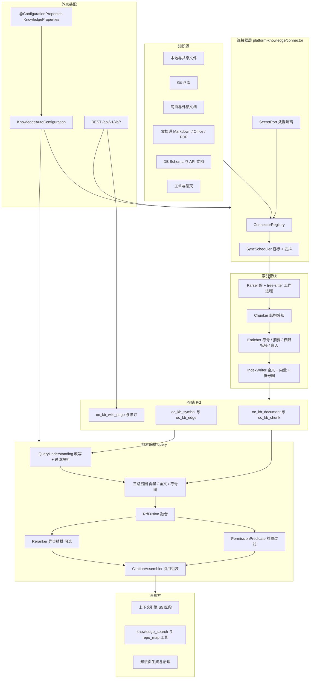
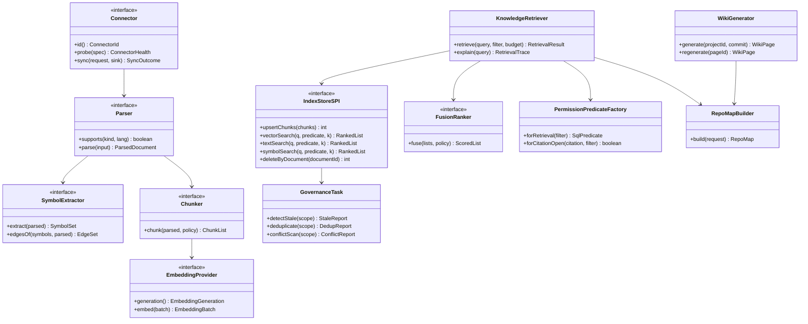
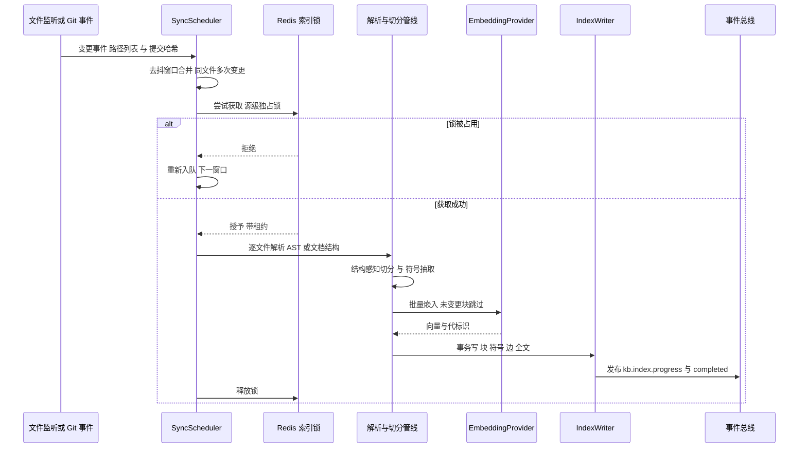
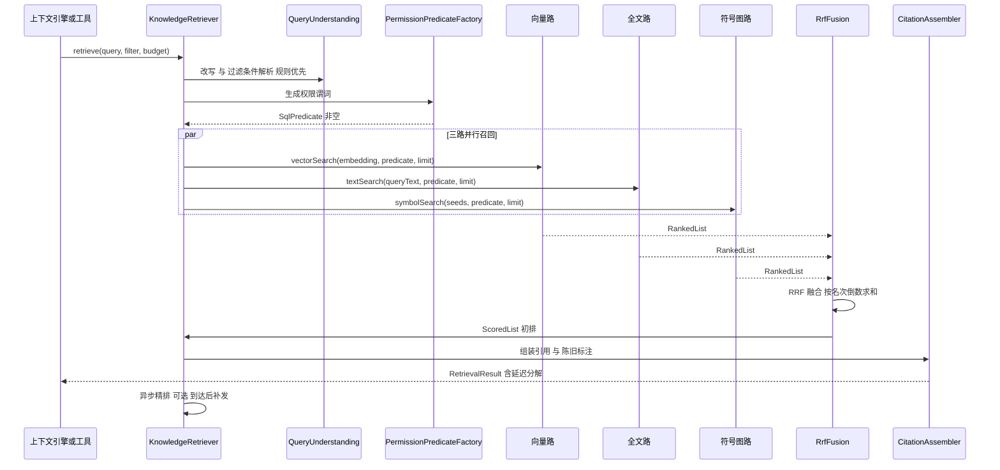
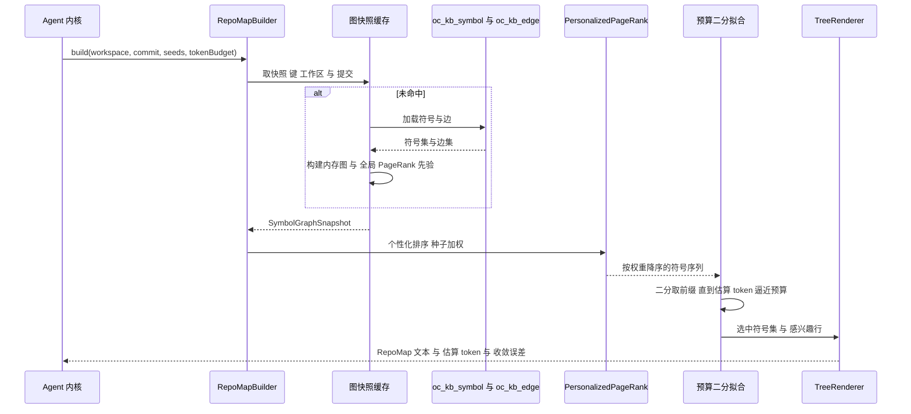
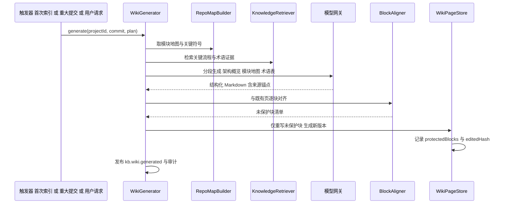
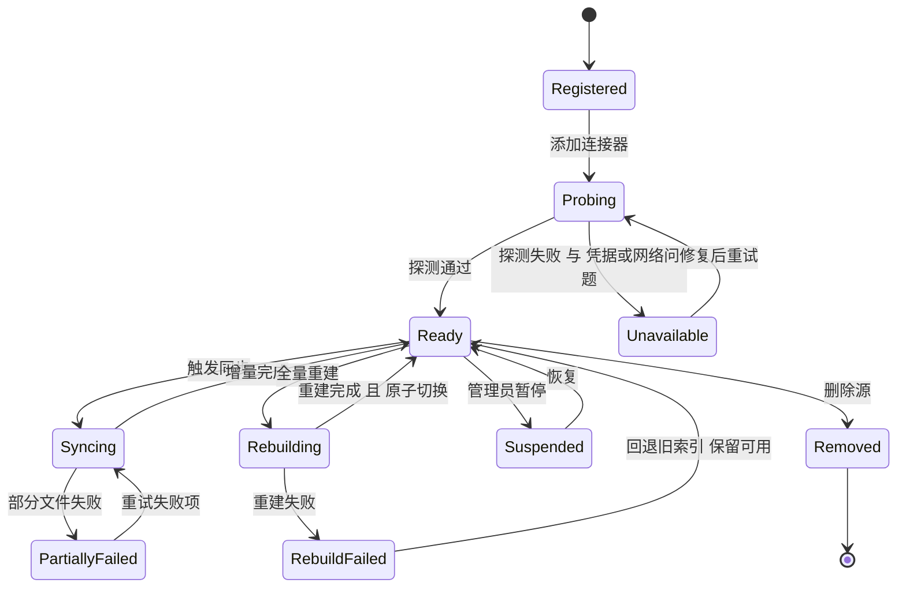
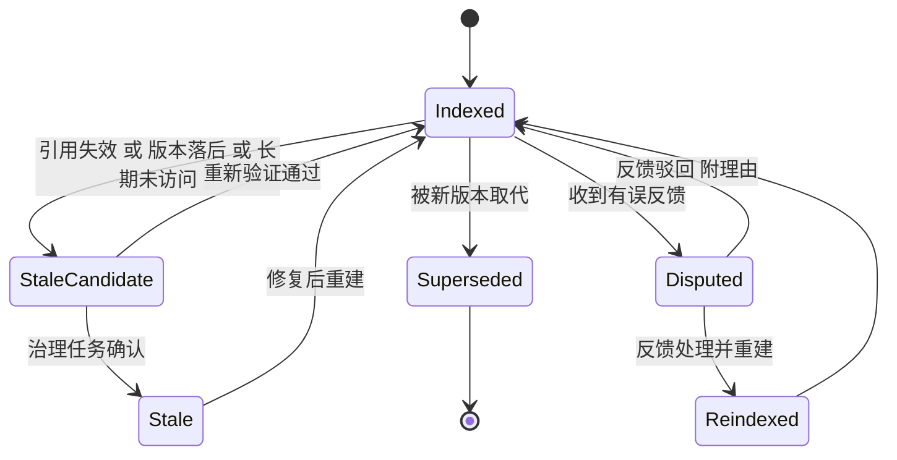
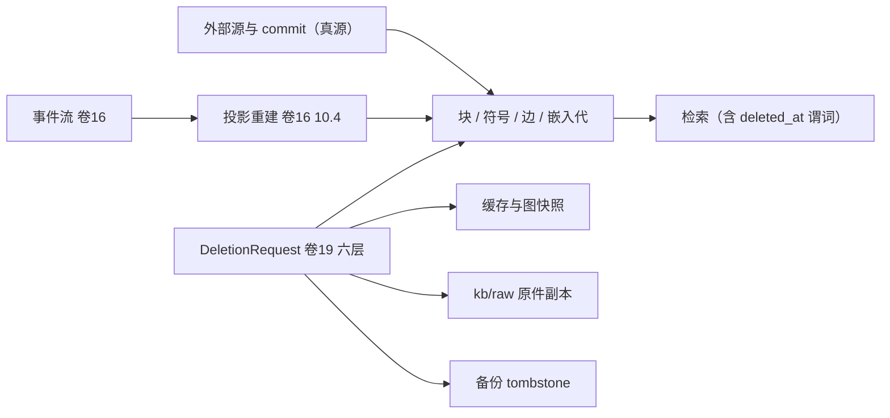

# 实现方案 11 · 知识库系统（Knowledge Base Implementation）

> 本文件是 Phase B 实现层方案，对应 Phase A 卷 11（`docs/harness/11-knowledge-system.md`）与全局决策 H-006 / H-017；
> 上游契约不可修改，凡与卷 11 冲突之处在本文件 ⑩.8 记录「反驳证据 + 建议修订」，并登记为 `I-KB-n`。
>
> 证据标记沿用 `00-research-plan.md` §2：`[E1]` 源码｜`[E2]` 官方文档｜`[E3]` 第三方｜`[E4]` 推断。
> 实现落点：契约 `harness-contract`（纯契约，零依赖）；实现 `harness-platform/platform-knowledge`（Spring 允许）；
> 用例编排 `harness-host/host-app`；装配 `harness-host/host-bootstrap`（见卷 27 §4.3 设计→代码映射）。

---

## ① 实现目标与范围

### 1.1 本组件解决什么

把「代码仓库 + 文档 + 工单/聊天 + 网页 + DB Schema / API 文档」五类知识源变成**可增量维护、可三路召回、可前置鉴权、可引用溯源**的检索底座，向上支撑两件事：

1. **上下文 S5 区段供给**：卷 03 上下文引擎按任务触发式检索，把带引用的知识块注入模型可见上下文（卷 03 §4.3）。
2. **模型主动检索**：暴露 `knowledge_search` / `repo_map` 工具（卷 05 三通道契约），让模型在推理中自行取回证据。

### 1.2 与 Phase A 的对应关系

| Phase A 决策 | 本文件落实位置 |
| --- | --- |
| D-KB-1 统一知识平台（多源统一检索） | §③ D-KBI-1、§④ 连接器族、§⑨ REST |
| D-KB-2 索引存储（PG 默认 + 规模触发切换） | §③ D-KBI-1/D-KBI-2、§⑨ `IndexStoreSPI` |
| D-KB-3 结构感知切分 | §③ D-KBI-3、§⑤ `ChunkerSPI`、§⑥.1 |
| D-KB-4 三路混合检索 + 融合重排 | §③ D-KBI-4、§⑥.2 |
| D-KB-5 符号级 + 结构图 + 模块摘要 | §③ D-KBI-5、§⑥.3、§⑧ `oc_kb_symbol` / `oc_kb_edge` |
| D-KB-6 增量索引（变更检测 + 事件驱动 + 去抖） | §③ D-KBI-5、§⑥.1、§⑦ 状态机 |
| D-KB-7 前置权限过滤 | §③ D-KBI-7、§⑩.6 |
| D-KB-8 连接器框架 + 内置连接器族 | §③、§⑤ `ConnectorSPI`、§⑨ |
| D-KB-9 强制引用 + 版本绑定 | §⑧ `oc_kb_citation_audit`、§⑩.6、§⑤ `Citation` |
| D-KB-10 知识页版本化生成 + 可编辑 + 溯源 | §③ D-KBI-8、§⑥.4、§⑦ |
| D-KB-11 治理（陈旧检测 + 降权 + 审核） | §⑥.1、§⑧ `oc_kb_stale_record`、§⑩.5 |
| D-KB-12 共享索引 + 租户字段 | §⑧ 每个表 `tenant_id` + 分区键 |
| H-017 混合检索（含图谱/结构） | §③ D-KBI-4/D-KBI-5 |

### 1.3 本组件不解决什么

- **不解决**记忆（卷 10）：记忆是「跨会话偏好与约定」，知识是「可检索事实」，两者的写入路径、权限模型、生命周期独立；知识不参与记忆召回排序。
- **不解决**上下文预算与注入位置（卷 03）：本组件只返回带引用的候选集与 token 估算，是否注入、注入多少由卷 03 的区段预算决定。
- **不解决**工作区文件操作（卷 20）：知识库**只读**业务数据；任何由知识驱动的代码改动必须走工具运行时 → 动作网关 → 权限决策（附录 A INV-1）。
- **不解决**模型嵌入服务的协议适配（卷 02）：本组件通过 `EmbeddingProviderSPI` 调用，凭证由 `SecretPort` 提供。

### 1.4 上下游依赖

| 方向 | 依赖对象 | 接口 |
| --- | --- | --- |
| 上游 | 事件系统（卷 16） | `EventPort.append`（索引与治理事件）、订阅 `git.commit.created` / `workspace.changed` 触发增量 |
| 上游 | 权限（卷 06） | `PermissionFilterProvider` 产出检索期权限谓词；引用打开时二次鉴权 |
| 上游 | 密钥（卷 30/内容 24） | `SecretPort.resolve(credentialRef)` 解析连接器与嵌入凭证 |
| 上游 | 工作区（卷 20） | `WorkspacePort` 读取本地/SSH 仓库文件与提交哈希 |
| 下游 | 上下文引擎（卷 03） | `KnowledgeRetriever.retrieve` → S5 区段 |
| 下游 | 工具运行时（卷 05） | `knowledge_search` / `repo_map` 工具实现 |
| 下游 | 评测（卷 26） | 检索质量基线、陈旧率、引用打开率指标消费 |

### 1.5 模块落点与分层

```text
harness-contract/src/main/java/.../contract/knowledge/
    KnowledgeQuery / KnowledgeHit / Citation / AclLabel / SourceKind / RetrievalBudget
    ConnectorSpec / ChunkSpec / SyncCursor
    ConnectorSPI / ParserSPI / ChunkerSPI / SymbolExtractorSPI / EmbeddingProviderSPI
    RerankerSPI / IndexStoreSPI / KnowledgePolicySPI（纯契约，零依赖）

harness-platform/platform-knowledge/src/main/java/.../platform/knowledge/
    connector/     本地文件 / Git 仓库 / 网页 / 文档源（Markdown/Office/PDF） / DB Schema / 工单与聊天
    parser/        解析器族 + tree-sitter 工作进程桥（符号抽取）
    chunker/       结构感知切分器（语言感知 + 文档结构 + 语义富化）
    embedding/     EmbeddingProvider 客户端 + 代（generation）管理 + 本地 ONNX 通道
    index/         PG 写入器（chunk/symbol/edge）、迁移、重建协调器
    query/         查询理解 → 三路召回 → RRF 融合 → 可选精排 → 权限过滤 → 引用组装
    repomap/       符号图 PageRank + token 预算二分渲染（Aider 式）
    wiki/          知识页生成、模板、块级保护、修订
    governance/    陈旧检测、去重、冲突、反馈队列
    KnowledgeProperties.java  KnowledgeAutoConfiguration.java
```

**分层纪律**：`query/` 与 `repomap/` 内的排序、融合、二分预算算法实现为**无 Spring 注解的普通 Java 类**，
由 `KnowledgeAutoConfiguration` 显式装配，保证算法可在无容器环境下单测（对齐卷 27 R1 精神与 H-003 边界意图）。

### 落地核对（R07：模块 / 顺序 / 批次 / 门禁 / I-* 落点）

- **模块（卷 27 §4.1 权威名）**：`harness-contract`（`contract/knowledge` 纯契约 + 7 个 SPI）+ `harness-platform/platform-knowledge`（连接器/解析/切分/索引/检索/repomap/wiki/治理）+ `harness-platform/platform-persistence`（`oc_kb_*` 表与 pgvector 迁移）+ `harness-host/host-app`（用例编排）+ `harness-host/host-protocol`（知识端点）。树形落点见本节目录树（已按目标模块名书写）。
- **实施顺序（卷 27 §4.5）**：第 16 步「记忆与知识库（代码索引）」，依赖第 6 步（上下文引擎：注入与预算）与第 9 步（持久化）。**与 impl/10 并行**（表族/权限独立，共用 `EmbeddingProviderSPI` 与索引任务调度）；`SymbolExtractorSPI` 为 impl/03 I-CTX-4 的结构索引提供者，故 11 的符号图部分需与 03 在**契约冻结后**并行，03 只依赖端口。
- **数据批次（卷 27 §4.4）**：`oc_kb_source`、`oc_kb_document`、`oc_kb_chunk`、`oc_kb_edge`、`oc_kb_symbol`、`oc_kb_wiki_page`、`oc_kb_wiki_revision`、`oc_kb_embedding_generation`、`oc_kb_stale_record`、`oc_kb_citation_audit`、`oc_kb_feedback` → **B5**（记忆/知识 + 索引元数据），依赖 B1。
- **门禁映射（卷 27 §4.6）**：单测 → 「单元测试 + 覆盖率门」；Testcontainers 集成（PG + pgvector）→ 「集成测试」；`kb-gate.sh` 降级矩阵/越权/基准 → 「集成测试」+「安全红队」+「性能基准（抽样）」；检索质量基线 → 「离线评测（核心集）」。
- **I-* 落点**：I-KB-1 → `platform-persistence`（`pg_search`/`ts_rank_cd` 双路 + `IndexStoreSPI`）；I-KB-2 → `platform-knowledge`（`parser/` tree-sitter 主引擎 + 工作进程桥）；I-KB-3 → `platform-knowledge`（`query/` RRF 融合 + 可选交叉编码器）；I-KB-4 → `platform-knowledge`（`repomap/` PageRank + 二分预算）；I-KB-5 → `platform-knowledge`（`embedding/` 本地 ONNX + 外部按源授权）；I-KB-6 → `platform-knowledge`（`query/` 单一谓词构造器 + 标签列物化）+ `platform-persistence`；I-KB-7 → `platform-knowledge`（`governance/` 三源增量触发 + 去抖）；I-KB-8 → `platform-knowledge`（`wiki/` 块级所有权哈希 + 保护清单）。

---

## ② 功能需求清单（REQ-KB-n）

| REQ | 需求描述 | 来源 | 优先级 | 验收要点 |
| --- | --- | --- | --- | --- |
| REQ-KB-01 | 连接器框架 + ≥6 内置连接器（本地文件、Git 仓库、网页、文档源、DB Schema、工单/聊天），支持增量同步与凭据隔离 | 卷 11 §3 D-KB-8；卷 11 §2 REQ-KB-1（Phase A 原编号，非补零）；卷 11 §8 DoD | P0 | 每个连接器有独立凭据引用与游标；断连后从游标续跑不重复 |
| REQ-KB-02 | 结构感知切分：代码按 AST 节点/函数/类，文档按标题层级，表格整块，聊天按会话窗口 | 卷 11 §3 D-KB-3 | P0 | 单函数不被跨界切开；引用行号区间与原文一致 |
| REQ-KB-03 | 长文档可选语义切分富化（模型判断边界），失败时回落到结构切分 | 卷 11 §3 D-KB-3 B3 | P2 | 富化超时不影响索引完成；结果标注 `chunk.origin=SEMANTIC` |
| REQ-KB-04 | 三类索引：全文、向量、符号/结构图，且任一路缺失时检索可降级不报错 | 卷 11 §2 REQ-KB-3（Phase A 原编号，非补零）、卷 11 §8 DoD | P0 | 关闭向量路后检索返回结果并标注 `degradedPaths` |
| REQ-KB-05 | 三路混合检索 + 融合排序，可选异步重排；P95 ≤ 300ms | 卷 11 §4.2、H-017 | P0 | 延迟分解打点齐全；重排异步时先返回初排 |
| REQ-KB-06 | 前置权限过滤：权限标签进索引，所有召回路径带权限谓词 | 卷 11 §3 D-KB-7 | P0 | 越权用例无法通过检索探测；**计数侧信道不可见** |
| REQ-KB-07 | 强制引用：每条结果携带来源与版本，注入上下文时保留可点开链接 | 卷 11 §3 D-KB-9、§4.3 | P0 | 5 类来源（repo/doc/url/ticket/chat）全部可跳转；无引用内容不得标为知识 |
| REQ-KB-08 | 增量索引：文件监听 + Git 变更事件 + 哈希校验三源触发，同文件变更去抖合并 | 卷 11 §3 D-KB-6 | P0 | 文件变更到可检索 ≤ 30s（大仓抽样） |
| REQ-KB-09 | 索引与工作区版本绑定（提交哈希），引用可解释；换嵌入模型渐进迁移 | 卷 11 §7、§8 DoD | P1 | 新旧代索引并存期检索可用；引用含 `@<commit>` |
| REQ-KB-10 | 索引健康：失败可断点续传、损坏可从源重建、后台重建不阻塞查询 | 卷 11 §7、§8 DoD | P1 | kill 索引进程后重启从断点继续；重建期旧索引仍可查 |
| REQ-KB-11 | 项目知识页：架构概览/模块地图/关键流程/术语表/常见变更点，版本化、可编辑、结论带溯源 | 卷 11 §3 D-KB-10、§4.4 | P1 | 无法溯源的结论标注「待确认」；人工编辑后不被自动覆盖 |
| REQ-KB-12 | **仓库符号图索引（repo map）**：tree-sitter 解析符号 + 调用/导入/继承边，输出可注入的结构化仓库地图 | 竞品 Aider `repomap.py:365 get_ranked_tags`、`:629 get_ranked_tags_map_uncached` [E1]（`research/competitors/09-secondary-tier.md` §2.1） | P0 | 10 万文件仓库首次符号扫描可完成并缓存；缓存按 `(文件, mtime)` 失效 |
| REQ-KB-13 | **个性化 PageRank**：以「当前上下文文件 + 用户/模型提及的标识符」为种子做加权，输出符号排序 | 竞品 Aider `personalize = 100 / len(fnames)` [E1]（同上） | P0 | 种子文件符号排名显著高于无关文件；权重可配 |
| REQ-KB-14 | **token 预算二分拟合**：按排名取符号渲染成树，直至逼近预算；空上下文时预算放大 | 竞品 Aider `pct_err < 0.15` 提前收敛、`map_mul_no_files=8` [E1]（同上） | P0 | 渲染结果 token 估算误差 ≤ 15%；预算放大系数可配 |
| REQ-KB-15 | **检索结果的 ACI 式呈现**：默认只给「命中的文件与符号」，不给每处匹配上下文；由模型按需再取 | 竞品 SWE-agent `aci.md`「Show more context … proved to be too confusing」[E2]（`09-secondary-tier.md` §① 第 9 条） | P1 | 默认返回不含逐处上下文；提供 `detail` 参数按需展开 |
| REQ-KB-16 | **知识页人工保护与反向同步**：手工修改内容被标记保护、自动更新不覆盖；修订可反向落到知识卡片 | 竞品 Qoder Repo Wiki [E2]（`research/competitors/07-qoder.md` §1 第 7 条、§4.18） | P1 | 受保护块在自动生成后内容字节一致；保护状态可在 UI 撤销 |
| REQ-KB-17 | 知识治理：陈旧检测（引用失效/版本落后/长期未访问）、降权标注、去重、冲突标记、反馈修复队列 | 卷 11 §3 D-KB-11、§4.6 | P1 | 删除被引用文件后知识被标记过时并降权 |
| REQ-KB-18 | 多租户共享索引 + 租户字段，高隔离客户可切独立索引实例 | 卷 11 §3 D-KB-12 | P1 | 跨租户用例返回空且审计留痕；索引实例切换仅改配置 |
| REQ-KB-19 | 索引与检索的计量：嵌入调用、索引块数、检索延迟分解全部计入用量与成本 | 卷 11 §7「成本」、卷 31 | P1 | 嵌入用量可按租户/源聚合；超预算时索引降档而非失败 |
| REQ-KB-20 | air-gapped 形态：默认禁用代码外发嵌入；外部嵌入需显式开启且按源/项目授权 | 卷 11 §7「安全」 | P0 | 未开启外发时无出网请求（抓包用例）；开启需管理员策略 |

**竞品增量需求说明**（≥2 条，均为 Phase A 未细化到机制层的实现级需求）：REQ-KB-12/13/14 来自 Aider Repo Map 的**三段式流水线**
（符号抽取 → 个性化 PageRank → 二分预算）[E1]；REQ-KB-15 来自 SWE-agent 的 ACI 呈现原则 [E2]；REQ-KB-16 来自 Qoder Repo Wiki 的
人工保护语义 [E2]。四条均已登记为 `I-KB-2` / `I-KB-4` / `I-KB-8` 的实现依据。

---

## ③ 技术方案选型（M×N 比选）

评分维度与权重沿用 `README.md` §4：**F 30% / U 20% / S 25% / M 25%**，满分 10，加权总分换算为百分制。

### D-KBI-1 索引存储引擎

| 分支 | 描述 | F | U | S | M | 加权 | 结论 |
| --- | --- | --- | --- | --- | --- | --- | --- |
| B1 | **PG 单栈**：pgvector（HNSW）+ 全文 + 边表 + 递归 CTE | 8 | 8 | 9 | 9 | 85.0 | **选定（默认）** |
| B2 | PG 元数据 + 专用检索引擎（ES/OpenSearch）+ 专用向量库 | 9 | 7 | 6 | 6 | 71.0 | 备选（规模阈值触发） |
| B3 | PG 元数据 + 分布式向量库（Milvus/Qdrant 类） | 9 | 7 | 6 | 7 | 73.5 | 备选（向量规模阈值触发） |

**选定 B1**：企业侧 PG 已在（H-005），单栈运维与事务一致性（文档正文 + 块 + 边 + 权限标签同事务）是 S/M 的决定性优势；
pgvector 的 HNSW 索引对 500 万块量级满足 P95 预算（见 §⑩.3 容量估算）。
**被放弃分支代价**：B2/B3 检索质量上限更高（真 BM25、专用 ANN 调优），但引入第二套运维对象与跨存储一致性窗口；
回退触发与切换规程沿用 D-KB-2：单租户文档块 > 500 万 或 检索 P95 连续 3 天超预算，经 `IndexStoreSPI` 切换实现，接口不变。

### D-KBI-2 PG 内全文检索实现

| 分支 | 描述 | F | U | S | M | 加权 | 结论 |
| --- | --- | --- | --- | --- | --- | --- | --- |
| B1 | `tsvector` + GIN + `ts_rank_cd` 近似打分 | 7 | 7 | 9 | 9 | 80.0 | 降级通路（能力探测失败时） |
| B2 | **`pg_search`（ParadeDB）真 BM25** | 9 | 8 | 7 | 8 | 80.5 | **选定** |
| B3 | 自研打分（归一化 ts_rank + 语义加权） | 6 | 7 | 6 | 6 | 62.0 | 淘汰（不可复现、无基线） |

**选定 B2**：BM25 的文档长度归一与词频饱和是代码检索（长文件 vs 短文件）质量的关键；扩展不可用时**启动期能力探测**
回落 B1 并在健康摘要与检索结果中显式标注 `textRank=TS_RANK_FALLBACK`（不静默降级，对齐卷 05 能力语义）。
**被放弃分支代价**：B1 无可移植依赖但排序质量对长文档偏置。

### D-KBI-3 代码解析引擎（符号抽取）

| 分支 | 描述 | F | U | S | M | 加权 | 结论 |
| --- | --- | --- | --- | --- | --- | --- | --- |
| B1 | **tree-sitter（JNI 绑定 + 多语言语法包）** | 9 | 8 | 7 | 8 | 80.5 | **选定（主引擎）** |
| B2 | JVM 原生解析器族（JavaParser/Spoon + 各语言独立库） | 6 | 6 | 7 | 6 | 62.5 | 淘汰（覆盖语言数不可持续） |
| B3 | 外置解析工作进程（Node/TS tree-sitter 服务，stdio JSON） | 8 | 7 | 8 | 8 | 78.0 | **同一接口的备用 Provider** |

**选定 B1 主 + B3 备用**：tree-sitter 与 Aider Repo Map 同源（`repomap.py` 用 tree-sitter 抽 tags [E1]），多语言覆盖面与
增量解析性能最佳；但 JNI 原生库在 Windows/macOS/Linux × x64/arm64 六目标分发是真实风险（M 项扣分）。
启动期做**能力探测**（加载语法库并解析一段内置样例），失败则切换 B3（工作进程），两者都不可用时退化为
「文件级 + 正则启发式符号抽取」并在索引元数据标注 `parser=none`，检索结果附「语义精度降级」提示。
**被放弃分支代价**：B2 无原生依赖但语言覆盖靠逐语言维护，长期成本不可控。

### D-KBI-4 多路结果融合排序

| 分支 | 描述 | F | U | S | M | 加权 | 结论 |
| --- | --- | --- | --- | --- | --- | --- | --- |
| B1 | **RRF（倒数排序融合，`k` 可配）** | 8 | 8 | 9 | 9 | 85.0 | **选定（初排）** |
| B2 | 加权分数线性融合（需跨路分数归一） | 7 | 7 | 6 | 6 | 65.0 | 淘汰（分数不可比、易过拟合） |
| B3 | 交叉编码器精排为主（同步等待） | 9 | 8 | 6 | 7 | 75.5 | **叠加为异步精排（可选）** |

**选定 B1 为初排 + B3 异步精排**：RRF 只用**名次**，对三路分数尺度不可比的问题天然免疫，且实现与调参成本最低；
精排作为「先返回初排、精排到达后补发」的第二段（卷 11 §2 已定「异步重排 + 流式返回」）。
**被放弃分支代价**：B2 理论上可压榨更高相关性，但需要持续标注与在线调参，超出 P0 交付能力。

### D-KBI-5 符号图物化与 repo map 预算拟合

| 分支 | 描述 | F | U | S | M | 加权 | 结论 |
| --- | --- | --- | --- | --- | --- | --- | --- |
| B1 | **构建期算 PageRank 并物化到符号表 + 检索期个性化重排 + 二分预算渲染** | 9 | 8 | 8 | 8 | 83.0 | **选定** |
| B2 | 每次查询全量重算 PageRank | 7 | 6 | 5 | 6 | 60.5 | 淘汰（大仓不可行） |
| B3 | 仅模块级静态摘要（不到符号级） | 6 | 7 | 9 | 8 | 74.5 | 淘汰（无法回答「谁调用我」） |

**选定 B1**：与 Aider 一致的两段式——第一段抽 tags 并按 `(文件, mtime)` 增量缓存，第二段以种子文件跑个性化 PageRank
再二分拟合 token 预算 [E1]（`09-secondary-tier.md` §2.1「落地建议」1–3 条）。物化策略：`pagerank`（全局先验）随索引写入，
个性化重排在检索期用内存图快照完成（快照按 commit 缓存，见 §⑥.3）。
**被放弃分支代价**：B3 成本极低但丢失调用关系，直接削弱 D-KB-5「谁调用我」类问题能力。

### D-KBI-6 嵌入计算位置

| 分支 | 描述 | F | U | S | M | 加权 | 结论 |
| --- | --- | --- | --- | --- | --- | --- | --- |
| B1 | 本地 ONNX 推理（DJL / onnxruntime） | 8 | 7 | 8 | 9 | 80.5 | 基础通路（默认本地） |
| B2 | 外部 Embedding API | 7 | 8 | 8 | 7 | 74.5 | 需显式开启 |
| B3 | **混合：本地默认 + 外部按源/项目策略可选** | 9 | 8 | 8 | 8 | 83.0 | **选定** |

**选定 B3**：`open-coding.knowledge.embedding.mode` 三态 `LOCAL / EXTERNAL / DISABLED`，默认 `LOCAL`；
`EXTERNAL` 需要管理员策略 `kb.external-embedding` 且按源二次授权（卷 11 §7 要求「代码外发默认禁用」）。
语义路不可用（模型缺失/推理失败/`DISABLED`）时**关闭语义召回**并在结果标注，不影响另两路。

### D-KBI-7 前置权限过滤实现

| 分支 | 描述 | F | U | S | M | 加权 | 结论 |
| --- | --- | --- | --- | --- | --- | --- | --- |
| B1 | **物化权限标签列 + 每条召回语句强制注入谓词** | 9 | 7 | 9 | 9 | 86.0 | **选定** |
| B2 | 检索后过滤 | 5 | 6 | 7 | 5 | 57.0 | 淘汰（存在侧信道 + 结果集不足） |
| B3 | 文档级 ACL 表 join（无物化列） | 8 | 7 | 6 | 7 | 70.5 | 淘汰（join 成本进热路径） |

**选定 B1**：`oc_kb_chunk` 与 `oc_kb_document` 冗余 `tenant_id / project_id / visibility / acl_digest / classification`，
所有召回 SQL **由同一构造器生成**（编译期禁止手写谓词，见 §⑩.6），杜绝「某一路忘记过滤」。
**被放弃分支代价**：物化列在 ACL 变更时需要批量回写（后台任务，秒级延迟），换来热路径零 join。

### D-KBI-8 知识页人工编辑保护

| 分支 | 描述 | F | U | S | M | 加权 | 结论 |
| --- | --- | --- | --- | --- | --- | --- | --- |
| B1 | **块级所有权哈希（人工块加锁，自动更新只写未锁块）** | 8 | 9 | 8 | 8 | 82.0 | **选定** |
| B2 | 整页保护（一旦手改即冻结自动更新） | 6 | 7 | 9 | 8 | 74.5 | 淘汰（页面很快全冻结、知识腐化） |
| B3 | 每次自动覆盖（diff 提示） | 6 | 6 | 7 | 6 | 62.5 | 淘汰（对齐 D-KB-10「编辑后不再被自动覆盖」的禁止项） |

**选定 B1**：Qoder 的实测语义是「手工修改内容被标记保护、不会被自动更新覆盖」[E2]；块级粒度同时保留了
「未编辑部分持续更新」的能力，是唯一能在 U 与 F 上同时达标的形态。

### 3.2 实现级决策登记（I-KB-n）

| ID | 主题 | 选定 | 理由与代价 | 回退触发 |
| --- | --- | --- | --- | --- |
| I-KB-1 | 检索存储与全文实现 | PG 单栈；全文优先 `pg_search` 真 BM25，不可用回落 `ts_rank_cd` 并显式标注 | 单栈运维 + 事务一致；代价是扩展依赖与降级路径差异 | 块量 > 500 万 或 P95 连续超预算 → `IndexStoreSPI` 切 B2/B3 |
| I-KB-2 | 代码解析引擎 | tree-sitter JNI 主引擎 + 外置工作进程备用 + 启发式最终降级（三级能力探测） | 语言覆盖与精度最优；代价是原生库多平台分发 | 六目标构建矩阵任一失败 → 该目标默认走工作进程 |
| I-KB-3 | 融合排序 | RRF 初排（`rrfK` 可配）+ 异步交叉编码器精排（可选、默认关闭） | 名次融合免归一化；代价是丢失分数幅度信息 | 评测显示精排带来 ≥5pp 命中提升 → 默认开启 |
| I-KB-4 | 符号图物化 | 全局 PageRank 物化 + 检索期个性化 + 二分预算渲染 | 大仓可行且可缓存；代价是构建期成本 | 构建 PageRank 超过索引总时长 30% → 降为按目录分片重算 |
| I-KB-5 | 嵌入位置 | 本地默认（ONNX）+ 外部按源授权 | 合规与离线可用；代价是本地模型质量弱于大模型 API | 评测语义路命中率低于阈值（配置）→ 建议启用外部（需管理员） |
| I-KB-6 | 权限前置过滤 | 物化标签列 + 单一谓词构造器 + **计数侧信道抑制**（不暴露过滤前计数，审计侧另记真实值） | 安全；代价是 ACL 变更需后台回写 | 回写延迟 > 30s → 改为按项目灰度重索引 |
| I-KB-7 | 增量触发 | 文件监听（JDK WatchService / 远端轮询）+ Git 提交事件 + 哈希校验三源 + 去抖窗口 | 及时性 + 正确性双保；代价是监听句柄与跨平台差异 | 监听不可用（网络盘/容器）→ 自动降级为轮询（间隔可配） |
| I-KB-8 | 知识页保护 | 块级所有权哈希 + 保护块清单 + 修订对比 | 兼顾持续更新与人工权威；代价是生成器需块级对齐 | 块对齐失败率 > 5% → 该页降级为整页保护并提示 |

---

## ④ 总体架构图



**装配点**：`KnowledgeAutoConfiguration` 是唯一 Spring 入口，用 `@ConfigurationPropertiesScan` 激活 `KnowledgeProperties`
（纯数据类不加 `@Component`，对齐卷 27 §4.3 与 `docs/design/core-api-contract-and-model-adapter.md` §12-10）；所有 SPI 用 `@ConditionalOnMissingBean` 装配内置实现，
数据库实现住 `platform-knowledge`，由 bootstrap 以条件装配优先。

---

## ⑤ 类图与关键契约



### 5.1 关键 Java 21 签名（契约层，零依赖）

```java
/**
 * 知识检索入口：三路召回 + 融合 + 前置权限过滤 + 引用组装。
 * 所有实现必须在同一调用内完成权限过滤，禁止返回未过滤候选。
 */
public interface KnowledgeRetriever {

    /**
     * 执行一次知识检索。
     *
     * @param query  检索请求（文本、种子文件与符号、来源类型、topK，必填）
     * @param filter 调用方权限过滤条件（由权限组件产出，必填，不可为 null）
     * @param budget 检索预算（超时、各路候选上限、是否允许异步精排，必填）
     * @return 带引用的命中集合与延迟分解；无命中时返回空集合而非 null
     */
    RetrievalResult retrieve(KnowledgeQuery query, PermissionFilter filter, RetrievalBudget budget);
}

/** 检索请求。seedPaths 与 seedSymbols 用于符号图个性化，允许为空集合。 */
public record KnowledgeQuery(
        String text,
        Set<String> seedPaths,
        Set<String> seedSymbols,
        Set<SourceKind> sourceKinds,
        int topK) {
}

/** 单条命中。citation 非空；text 已被裁剪到预算内。 */
public record KnowledgeHit(
        ChunkId chunkId,
        SourceKind sourceKind,
        String title,
        String text,
        Citation citation,
        double fusedScore,
        Map<RecallPath, Integer> ranks,
        boolean stale) {
}

/** 引用：五类来源统一表示，格式见 Phase A 卷 11 §4.3。 */
public record Citation(CitationScheme scheme, String ref, String display, Instant capturedAt) {
}

/** 索引存储扩展点（`IndexStoreSPI`）：向量/全文/符号图三路召回与写入的统一抽象，可整体切换后端。 */
public interface IndexStoreSPI {

    /**
     * 向量近邻召回。
     *
     * @param embedding 查询向量（必填，维度必须与活动代一致）
     * @param predicate 权限谓词（必填，由 PermissionPredicateFactory 生成）
     * @param limit     候选上限（正数）
     * @return 按相似度降序的名次列表；无命中返回空列表
     */
    RankedList vectorSearch(float[] embedding, SqlPredicate predicate, int limit);
}
```

**枚举与异常纪律**：`SourceKind`、`CitationScheme`、`EmbeddingGeneration.State`、`StaleReason` 全部 `code + desc` 并带
`of(String code)` 工厂，未知 code 一律抛 `HarnessException(ErrorCode.INVALID_ARGUMENT, …)`（未知状态不得回落默认值）；
业务失败统一抛内核基类 `HarnessException`（携带 `ErrorCode`，错误码口径见 §⑨.1 / §⑨.2），**禁止**裸抛 `RuntimeException` / `IllegalArgumentException`。
**异常命名分层（全套统一）**：内核层（framework-free core，本文件全部实现）抛 `HarnessException`；外壳层（domain / application / interfaces 的连接器凭据、REST 管理面、导出）抛 `BusinessException`，由外壳全局异常处理器按 `ErrorCode` 统一映射响应。**契约缺口指针（X-82）**：异常类名与冻结卷册 `ErrorCode` 映射的登记缺口已列为修订建议 **X-82**（`impl/IMPL-DECISIONS.md` §4；本文件不改台账）。

---

## ⑥ 核心流程时序图

### 6.1 增量索引（三方触发 + 去抖 + 版本绑定）

**前置条件**：源已注册且 `state=READY`；工作区提交哈希可读。
**主路径**：本地监听 / Git 事件 / 哈希扫描任一触发 → 去抖窗口合并 → 解析 → 切分 → 富化 → 写索引 → 绑定 commit。
**异常与补偿**：解析失败单文件隔离（不阻塞整批）；写入失败按批重试并保留游标；进程被杀后从游标续跑。
**幂等与并发点**：以 `(document_id, content_hash, embedding_generation)` 为幂等键；同一源用分布式锁串行化。



### 6.2 三路混合检索与融合（P95 ≤ 300ms）

**前置条件**：调用方已通过权限组件获得 `PermissionFilter`；租户上下文存在（INV-3）。
**主路径**：查询理解 → 三路并行召回（各自带权限谓词）→ RRF 融合 → 最终权限校验 → 引用组装 → 返回；精排异步补发。
**异常与补偿**：任一路失败 → 记录 `degradedPaths` 继续；三路全失败 → 抛 `KB_QUERY_UNAVAILABLE`（可重试）；
精排超时 → 放弃精排，保留初排结果并标注。
**幂等与并发点**：查询幂等（无副作用）；同一 `(tenant, queryDigest, filterDigest)` 命中查询缓存（TTL 可配）。



### 6.3 仓库符号图与 repo map 构建（个性化 PageRank + 二分预算）

**前置条件**：符号与边已随索引写入；内存图快照按 commit 缓存（LRU，容量可配）。
**主路径**：加载快照 → 种子（上下文文件 + 提及标识符）加权 → 个性化 PageRank → 按名次取前缀 → 二分拟合 token 预算 → 渲染树。
**异常与补偿**：快照缺失 → 现场从 PG 重建（有超时）；渲染超预算 → 收缩上下文行（lois）而非丢符号。
**幂等与并发点**：同一 `(workspace, commit, seedDigest, budget)` 命中 repo map 缓存；快照构建按 commit 加一次性锁。



**预算联动规则**（对齐 Aider `map_mul_no_files=8` [E1]）：当调用方上下文中**没有任何显式文件**时，
`effectiveBudget = min(baseBudget × noFileMultiplier, modelWindow × windowRatio)`，参数全部配置化（§⑨.3）。

### 6.4 知识页生成与人工保护

**前置条件**：项目索引完成度 ≥ 阈值；`wiki_plan`（页面白名单与模板）存在或按默认模板生成。
**主路径**：取符号图 + 检索摘要 → 按模板分段生成 → 标注来源 → 与既有页逐块对齐 → 仅重写未保护块 → 版本化落库。
**异常与补偿**：生成超时 → 保留旧版并告警（不写半成品）；无法溯源的结论块标注「待确认」。
**幂等与并发点**：同 `(pageId, sourceCommit, templateVersion)` 幂等；生成任务按页加锁。



---

## ⑦ 状态机

### 7.1 知识源与索引作业



### 7.2 知识块生命周期（含治理）



### 7.3 知识页版本

`Draft → Generated ⇄ Edited → Reviewed`；当源版本落后超过配置阈值进入 `Outdated`，重新生成后回到 `Generated`
（保护块保持 `Protected` 直至人工解锁）。状态迁移全部由 `kb.wiki.generated` / `kb.wiki.edited` 事件驱动，可回放重建。

---

## ⑧ 数据模型

### 8.1 表（`oc_*`，全部含 `tenant_id` 与审计字段，见附录 A §A.1）

**类型约定（本节各表通用；逐列 DDL 以卷 19 的 Flyway 迁移脚本为准）**：内部主键 `id BIGINT`（Snowflake）或复合主键（如 `(tenant_id, …)`）；对外暴露的引用 ID 用不透明字符串 / `UUID`（防遍历）；时间列统一 `TIMESTAMPTZ`（UTC 存储、展示层本地化）；枚举列存 `VARCHAR(32)` 的 **code**（禁止存 desc）；结构化与可变结构用 `JSONB`；布尔列 `BOOLEAN NOT NULL DEFAULT false`；敏感字段（密钥 / Token）只存引用名 `*_ref`，明文永不入库；大对象（快照 / 录制 / 工件）外置并留指针；各表字段语义见「关键字段」列，索引与唯一约束见末列。

| 表 | 关键字段 | 索引与约束 |
| --- | --- | --- |
| `oc_kb_source` | `source_id`、`kind`（LOCAL/GIT/WEB/DOC/DB_SCHEMA/TICKET_CHAT）、`uri`、`credential_ref`、`sync_policy jsonb`、`cursor jsonb`、`state`、`visibility`、`acl_digest` | `uk(tenant_id, project_id, kind, uri)`；`(tenant_id, state)` |
| `oc_kb_document` | `document_id`、`source_id`、`external_id`、`path`、`lang`、`doc_version`（提交哈希或文档版本）、`content_hash`、`kind`、`classification`、`visibility`、`acl_digest`、`deleted_at` | `uk(source_id, external_id)`；`(tenant_id, project_id, acl_digest)`；`(document_id) where deleted_at is null` |
| `oc_kb_chunk` | `chunk_id`、`document_id`、`chunk_no`、`chunk_kind`（CODE/DOC/TABLE/CHAT）、`symbol_ref`、`start_line`、`end_line`、`text`、`token_count`、`tsv tsvector`、`tsv_config_version`（**R05 新增**：分词/BM25 配置版本，变更即需重建全文列）、`embedding vector(N)`、`embedding_generation`、`content_hash`、`stale`、`deleted_at`（**R05 新增**：随源删除置位，检索谓词强制 `deleted_at is null`） | HNSW(`embedding`, cosine, 参数化)；GIN(`tsv`)；`(document_id, chunk_no)`；`(tenant_id, project_id, acl_digest)`；`(document_id) where deleted_at is null` |
| `oc_kb_symbol` | `symbol_id`、`document_id`、`qualified_name`、`symbol_kind`、`lang`、`start_line`、`end_line`、`signature`、`pagerank real`、`generation`、`parser_version`（**R05 新增**：符号抽取器版本，变更即需按文件重建符号与边）、`commit` | `uk(document_id, qualified_name, start_line)`；`(tenant_id, commit, pagerank desc)` |
| `oc_kb_edge` | `edge_id`、`workspace_id`、`commit`、`src_symbol_id`、`dst_symbol_id`、`edge_kind`（CALL/IMPORT/EXTENDS/IMPLEMENTS/REFERENCES）、`weight` | `(src_symbol_id)`、`(dst_symbol_id)`、`(workspace_id, commit)`；反向查询用递归 CTE |
| `oc_kb_wiki_page` | `page_id`、`project_id`、`slug`、`title`、`version`、`source_commit`、`template_version`、`protected_blocks jsonb`、`edited_hash`、`state` | `uk(project_id, slug)`；`(tenant_id, state)` |
| `oc_kb_wiki_revision` | `revision_id`、`page_id`、`version`、`content`（>64KB 转对象存储）、`diff_summary`、`author`、`reason` | `(page_id, version desc)` |
| `oc_kb_stale_record` | `record_id`、`chunk_id` 或 `document_id`、`reason`（CODE/STALE_REFS/VERSION_LAG/UNVISITED/SUPERSEDED）、`detected_at`、`resolved_at` | `(tenant_id, resolved_at)`；`(chunk_id)` |
| `oc_kb_feedback` | `feedback_id`、`chunk_id` 或 `page_id`、`kind`（WRONG/OUTDATED/MISSING）、`reporter`、`note`、`state` | `(tenant_id, state, created_at)` |
| `oc_kb_embedding_generation` | `generation`、`model_id`、`dim`、`state`（ACTIVE/SHADOW/RETIRED）、`built_chunks`、`started_at` | `uk(generation)`；部分索引 `(state)` |
| `oc_kb_citation_audit` | `audit_id`、`session_id`、`actor`、`citation_ref`、`opened_at`、`result`（OPENED/DENIED/GONE） | `(tenant_id, opened_at)`；`(session_id)` |

**分区与保留**：`oc_kb_chunk` 与 `oc_kb_edge` 随工作区版本滚动（保留当前 + 上一代），旧代由治理任务回收；
`oc_kb_citation_audit` 按 `(tenant_id, opened_at)` 月分区，保留策略随审计（卷 19）。

**真源与重建登记（R05 新增，权威口径见 §⑩.11）**：本域真源是**外部知识源 + 工作区 commit**（仓库文件、文档、工单、网页快照），`oc_kb_*` 全部表（含 `oc_kb_symbol` / `oc_kb_edge` / `oc_kb_wiki_page`）都是**派生索引与生成物**——`oc_kb_symbol`/`oc_kb_edge`/`oc_kb_chunk` 可整体丢弃并按文件重建；`oc_kb_wiki_page` 的**版本内容**是人工编辑产物（以 DB 为留存真源，但其「可再生成部分」可由符号图 + 检索证据重算），**唯一例外**是 `oc_kb_citation_audit`：它是审计事实，不可重建、不可修改（仅按删除流程处置）。所有派生物在卷 16 `oc_projection_state` 登记：`kb.chunk.index`、`kb.symbol.graph`、`kb.wikipage.current`，重建走卷 16 §⑩.4 投影重建隔离协议。

**删除贯通字段（R05 新增）**：源删除时 `oc_kb_source.state=Removed` → `oc_kb_document.deleted_at` → `oc_kb_chunk.deleted_at` 三级置位（同一事务/同一批次），检索谓词与 repo map 快照一律带 `deleted_at is null`；残留对象见 §⑩.11 删除矩阵。

**反模式禁止**（附录 A §A.8）：不在 `text` 上建通用 GIN；不用 `LIKE '%x%'`；不一致的列名拼写（统一由常量与迁移脚本生成）。

### 8.2 Redis Key（统一经 `RedisKeys` 工厂，禁止业务拼接）

| 语义 | Key 形态 | TTL |
| --- | --- | --- |
| 索引锁 | `RedisKeys.knowledgeIndexLock(tenantId, sourceId)` → `oc:kb:index:lock:{tenant}:{source}` | 租约 300s，续租 |
| 查询缓存 | `RedisKeys.knowledgeQueryCache(tenantId, digest)` → `oc:kb:query:{tenant}:{digest}` | 可配（默认 60s） |
| repo map 缓存 | `RedisKeys.knowledgeRepoMap(workspaceId, commit, digest)` | 可配（默认 900s） |
| 去抖队列 | `RedisKeys.knowledgeDebounceQueue(tenantId, sourceId)` | 不设 TTL（消费即删） |
| 嵌入批队列 | `RedisKeys.knowledgeEmbeddingQueue(tenantId, generation)` | 不设 TTL |
| 快照构建锁 | `RedisKeys.knowledgeSnapshotLock(workspaceId, commit)` | 租约 120s |

### 8.3 对象存储前缀与配置同步

`kb/raw/{tenant}/{source}/{documentId}/{contentHash}`（原件快照，用于引用失效后回溯）、`kb/wiki/{tenant}/{project}/{pageId}/v{version}.md`（大页正文）、`kb/report/{tenant}/stale/{yyyy-MM}.json`（治理报告）。

### 8.4 事件（沿用卷 11 §6 清单，本文件新增 2 条）

`kb.source.added` / `kb.source.removed` / `kb.source.sync.completed`、`kb.index.progress` / `kb.index.completed` /
`kb.index.failed`、`kb.query.executed`（含 `degradedPaths`、延迟分解、过滤计数仅审计侧）、`kb.citation.opened`、
`kb.stale.detected` / `kb.feedback.reported`、`kb.wiki.generated` / `kb.wiki.edited`、
**新增** `kb.repo_map.built`（工作区、提交、种子摘要、预算、收敛误差、耗时）、
**新增** `kb.index.rebuilt`（旧代与新代、块数、耗时、切换结果）。

---

## ⑨ 接口与扩展点

### 9.1 会话协议（JSON-RPC，沿用附录 B §B.2）

| 方法 | 入参 | 出参 | 错误码 |
| --- | --- | --- | --- |
| `kb.search` | `query`、`sourceKinds[]`、`topK`、`detail`（`FILES`\|`CHUNKS`）、`workspaceId?` | `hits[]`（含 `citation`、`fusedScore`、`stale`、`degradedPaths[]`） | `KB_QUERY_UNAVAILABLE`、`KB_INDEX_NOT_READY`、`UNSUPPORTED_CAPABILITY`（语义路关闭） |
| `kb.repoMap` | `workspaceId`、`commit?`、`seedPaths[]`、`seedSymbols[]`、`tokenBudget?` | `text`、`estimatedTokens`、`includedSymbols[]` | `KB_INDEX_NOT_READY`、`NOT_FOUND`（工作区或提交） |
| `kb.citation.open` | `citationRef` | `target`（文件+行 / 文档块 / URL 快照 / 工单条目 / 知识页） | `PERMISSION_DENIED`、`KB_CITATION_GONE` |
| `kb.feedback.report` | `chunkId` 或 `pageId`、`kind`、`note` | `feedbackId` | `INVALID_ARGUMENT` |

### 9.2 REST（管理面，权限点见附录 B §B.3）

| 端点 | 方法 | 说明 | 权限点 |
| --- | --- | --- | --- |
| `/api/v1/kb/sources` | CRUD + `POST {id}/sync` | 知识源管理与手动同步 | `kb.manage` |
| `/api/v1/kb/sources/{id}/cursor` | GET/PUT | 游标查看与重置（重置即触发增量重扫） | `kb.manage` |
| `/api/v1/kb/index/rebuild` | POST | 触发重建（`Idempotency-Key` 必填） | `kb.manage` |
| `/api/v1/kb/index/status` | GET | 索引代、进度、滞后秒数、解析器能力 | `kb.read` |
| `/api/v1/kb/wiki` / `/wiki/{pageId}/versions` | GET/PUT | 知识页与版本对比、撤销 | `kb.manage` |
| `/api/v1/kb/stale` / `/feedback` | GET + `POST {id}/resolve` | 治理队列 | `kb.manage` |
| `/api/v1/kb/embedding/generations` | GET + `POST {id}/promote` | 嵌入代管理与渐进迁移推进 | `kb.manage` |

### 9.3 配置项（`open-coding.knowledge.*`，纯数据类 `KnowledgeProperties`，不加 `@Component`）

| 字段 | 说明（默认值、必填性、影响面） | 环境变量 |
| --- | --- | --- |
| `enabled` | 是否启用知识库（默认 true）；关闭后工具不注册、S5 区段为空 | `KB_ENABLED` |
| `index.store` | 索引存储后端（默认 `POSTGRES`；`OPENSEARCH` 等为备选） | `KB_INDEX_STORE` |
| `index.fullTextRank` | 全文打分实现（默认 `PG_SEARCH_BM25`，回落 `TS_RANK_FALLBACK`） | `KB_FULLTEXT_RANK` |
| `index.snapshotCacheSize` | 内存图快照 LRU 容量（默认 4，按工作区数） | `KB_SNAPSHOT_CACHE_SIZE` |
| `index.rebuildBatchSize` | 重建批大小（默认 2000 块/批） | `KB_REBUILD_BATCH_SIZE` |
| `index.parser.mode` | 解析引擎（`TREE_SITTER` / `WORKER` / `HEURISTIC` / `AUTO`，默认 AUTO） | `KB_PARSER_MODE` |
| `index.parser.workerCommand` | 工作进程启动命令（AUTO 回落时使用；不含密钥） | `KB_PARSER_WORKER_CMD` |
| `chunk.codeMaxLines` / `chunk.codeMaxTokens` | 单代码块上限（默认 400 行 / 1200 token） | `KB_CHUNK_MAX_LINES` |
| `chunk.docMaxTokens` | 单文档块上限（默认 800 token） | `KB_CHUNK_MAX_TOKENS` |
| `retrieval.rrfK` | RRF 平滑常数（默认 60，越大越平滑） | `KB_RRF_K` |
| `retrieval.candidatesPerPath` | 每路候选上限（默认 50） | `KB_CANDIDATES_PER_PATH` |
| `retrieval.timeoutMs` | 单路召回超时（默认 120ms） | `KB_RETRIEVAL_TIMEOUT_MS` |
| `retrieval.rerank.enabled` / `.timeoutMs` | 异步精排开关与超时（默认 false / 400ms） | `KB_RERANK_ENABLED` |
| `embedding.mode` | `LOCAL` / `EXTERNAL` / `DISABLED`（默认 LOCAL） | `KB_EMBEDDING_MODE` |
| `embedding.modelId` / `embedding.dim` | 嵌入模型标识与维度（必填当 mode 非 DISABLED；换模型触发代迁移） | `KB_EMBEDDING_MODEL` |
| `embedding.external.endpoint` / `.apiKey` | 外部嵌入端点与密钥（敏感项，默认留空，经 `SecretPort` 注入） | `KB_EMBEDDING_ENDPOINT`、`KB_EMBEDDING_API_KEY` |
| `repomap.baseTokenBudget` | repo map 基准预算（默认 2048） | `KB_REPOMAP_TOKEN_BUDGET` |
| `repomap.noFileMultiplier` | 无显式文件时的预算放大系数（默认 8） | `KB_REPOMAP_NO_FILE_MULTIPLIER` |
| `repomap.windowRatio` | 预算相对模型窗口上限比例（默认 0.75） | `KB_REPOMAP_WINDOW_RATIO` |
| `repomap.convergenceTolerance` | 二分收敛误差上限（默认 0.15） | `KB_REPOMAP_TOLERANCE` |
| `governance.staleVersionLag` | 版本落后判定阈值（提交数，默认 50） | `KB_STALE_VERSION_LAG` |
| `governance.unvisitedDays` | 长期未访问阈值（天，默认 90） | `KB_UNVISITED_DAYS` |
| `governance.dedupThreshold` | 近似去重相似度阈值（默认 0.92） | `KB_DEDUP_THRESHOLD` |
| `governance.staleDownweight` | 陈旧项排序降权系数（默认 0.6） | `KB_STALE_DOWNWEIGHT` |
| `wiki.autoGenerateOnCommit` | 重大提交触发阈值（变更文件数，默认 200） | `KB_WIKI_COMMIT_THRESHOLD` |
| `audit.recordQuery` | 是否审计检索（默认 true；含过滤计数，仅审计可见） | `KB_AUDIT_QUERY` |

**模板同步**：以上变量必须同步 `.env.example`（AGENTS.md 硬性要求）；敏感项（`KB_EMBEDDING_API_KEY`、连接器凭据引用）
默认留空、由环境变量注入并在启动时 Fail-Fast 校验（缺失即启动失败）。

### 9.4 扩展点（登记进卷 18 目录）

| SPI | 对接卷 18 目录类目 | 说明 |
| --- | --- | --- |
| `ConnectorSPI` | 知识源提供方 | 新连接器（企业私有知识源） |
| `ParserSPI` | 解析器 | 新格式（如内部文档格式） |
| `ChunkerSPI` | 切分策略 | 企业内部切分规范 |
| `SymbolExtractorSPI` | 符号抽取 | 内部 DSL / 领域语言 |
| `EmbeddingProviderSPI` | 嵌入来源 | 私有嵌入服务（与卷 02 共用凭证引用） |
| `RerankerSPI` | 重排策略 | 企业精排模型 |
| `IndexStoreSPI` | 索引后端 | 检索引擎 / 向量库切换（I-KB-1 回退路径） |
| `KnowledgePolicySPI` | 可见性与治理策略 | 企业知识分级、跨域共享域 |
| `WikiTemplateSPI` | 知识页模板 | 组织文档规范 |

**错误码新增登记**（附录 B §B.11 规则：新增须同时登记文案要点、可重试标记、建议动作）：
`KB_QUERY_UNAVAILABLE`（可重试，建议稍后重试或缩小范围）、`KB_INDEX_NOT_READY`（不可重试，建议等待索引或手动同步）、
`KB_CITATION_GONE`（不可重试，建议重新检索）、`KB_SOURCE_UNAVAILABLE`（可重试，建议检查凭据与网络）、
`KB_EXTERNAL_EMBEDDING_DENIED`（不可重试，建议联系管理员开启外发授权）。

---

## ⑩ 非功能与工程细节

### 10.1 并发模型

- **索引侧**：`SyncScheduler` 用虚拟线程承载每源同步；源级独占锁（Redis 租约）保证串行；批处理并发度可配
  （默认 `min(CPU 核数, 8)`），写库批内单事务、批间独立提交（可断点）。
- **嵌入侧**：有界队列 + 背压；队列满时同步降速而不丢任务（拒绝策略=调用方阻塞等待，绝不静默丢弃）。
- **检索侧**：三路召回用虚拟线程并行；总超时用外层 deadline 控制，任一路超时即降级返回；无共享可变状态。
- **背压信号**：队列水位与 P95 延迟进入健康摘要（`diagnostics.get`），超阈值时索引降档（只索引变更文件）。
- **事务与外部调用纪律**：批内单事务的适配器方法标注 `@Transactional(rollbackFor = Exception.class)`（批间独立提交即天然短事务）；
  嵌入调用（嵌入服务）与远端解析器属**外部调用**，先于事务批量产出结果、再统一写库，禁止把嵌入请求包进写库事务（否则长事务占连接池）。

### 10.2 性能预算（与卷 11 §4.2 对齐，直接作为压测门禁）

| 阶段 | 预算 | 实测门禁 |
| --- | --- | --- |
| 查询理解 | ≤ 30ms | 规则路径 P95 ≤ 30ms（模型改写默认关闭） |
| 三路召回 | ≤ 100ms | 单路 P95 ≤ 120ms，任一路超时不影响总数 |
| 融合 + 重排 | ≤ 120ms | RRF 计算 P95 ≤ 20ms；精排异步 ≤ 400ms |
| 权限过滤 + 引用组装 | ≤ 50ms | 谓词注入后 SQL 计划无全表扫描 |
| 合计 | ≤ 300ms（P95） | CI 门禁脚本跑混合检索基准 |
| 首次全量索引 | ≤ 10min / 10 万文件 | 抽样仓基准 |
| 增量端到端 | ≤ 30s | 单文件变更到可检索 |
| repo map 构建 | ≤ 200ms（缓存命中 ≤ 20ms） | 10 万符号（10 万文件仓）抽样 |

### 10.3 容量估算（单租户）

- 块量上限按 D-KB-2 阈值 500 万；单块平均 400 token → 向量 1024 维 float32 ≈ 4KB/块（含索引开销约 6KB）
  → 500 万 × 6KB ≈ 30GB 向量存储；正文与倒排约 20GB；符号 100 万 × 200B ≈ 200MB；边 500 万 × 80B ≈ 400MB。
- HNSW 构建内存 ≈ 原始向量 × 1.5，需在重建窗口预留（重建按批做，峰值受控）。
- 索引滞后指标 `oc_kb_index_lag_seconds` 用于容量告警（阈值：持续 > 120s）。

### 10.4 缓存策略

查询缓存（键含权限摘要，避免跨权限复用）、repo map 缓存（按 commit）、图快照 LRU、嵌入缓存（按内容哈希，跨代失效）、
解析结果缓存（按 `(路径, mtime, 解析器版本)`，对齐 Aider 的 tags 缓存失效口径 `[E1]`）。
**失效纪律**：任何缓存键必须包含「版本维度」（commit / generation / parserVersion），禁止裸文本键。

### 10.5 失败与降级

| 失败 | 降级 | 用户/模型可见性 |
| --- | --- | --- |
| 嵌入不可用 | 关闭语义路，保留全文 + 符号图 | 结果含 `degradedPaths=["VECTOR"]`；UI 提示 |
| `pg_search` 缺失 | 回落 `ts_rank_cd` | `textRank=TS_RANK_FALLBACK` 标注 |
| tree-sitter 不可用 | 工作进程 → 启发式抽取 | 索引元数据 `parser=none` + 检索精度提示 |
| 精排超时 | 放弃精排返回初排 | 无错误，`rerank=SKIPPED` |
| PG 主库不可用 | 返回 `KB_QUERY_UNAVAILABLE`（可重试） | 不返回空结果冒充「无知识」 |
| 索引重建中 | 旧代继续服务，新代影子写入 | 状态页显示「重建中，旧索引可用」 |

**硬规则**：任何降级都**不得**静默返回空结果；空结果与「降级导致无结果」必须可区分（对齐卷 05 能力语义与 REQ-KB-04）。

### 10.6 安全

- **前置过滤**：所有召回语句由 `PermissionPredicateFactory` 生成谓词，构造器是唯一点；
  **计数侧信道抑制**：向调用方只返回过滤后结果与 `hits.length`，**不返回过滤前候选数**；真实过滤数仅写入审计（`sensitivity=internal`）。
- **越权防护**：引用打开时**二次鉴权**（外置引用 ID 不含敏感信息，防借旧引用越权，对齐卷 03 §4.5）。
- **凭据隔离**：连接器凭据只以 `credentialRef` 存储，解析经 `SecretPort`；日志与事件中禁止明文（INV-9）。
- **外发控制**：`embedding.mode=LOCAL` 时保证零出网（网络策略 + 抓包用例）；`EXTERNAL` 需管理员策略与按源授权。
- **注入防护**：检索到的知识文本进入上下文时标注来源边界，由卷 03 注入检测处理；本组件不得把知识文本标记为系统指令。
- **审计**：`kb.query.executed`（含过滤计数）与 `kb.citation.opened` 全量入库；企业可导出。

### 10.7 可观测

**指标**（沿用卷 11 §6 并补齐）：`oc_kb_index_chunks_total{source,kind}`、`oc_kb_index_lag_seconds`、
`oc_kb_query_latency_ms{phase}`、`oc_kb_recall_hit_ratio{path}`、`oc_kb_degraded_paths_total{path}`、
`oc_kb_citation_open_total{result}`、`oc_kb_stale_ratio`、`oc_kb_embedding_tokens_total{generation}`、
`oc_kb_repomap_convergence_error`、`oc_kb_dedup_removed_total`。

**日志打点**（`@Slf4j`，中文文案，占位符，异常传 `Throwable`）：索引开始/结束（源、文件数、块数、耗时）；单文件解析失败
（`log.warn` 含路径与异常）；降级生效（`log.warn` 含原因）；检索完成（`log.debug` 含三路命中数、融合后数量、耗时分解，
**不打印命中正文**）；引用打开（`log.info` 审计语义）。

**追踪**：`kb.index.*` 与 `kb.query.*` 各为独立 span；三路召回是子 span；跨进程（工作进程）用 W3C traceparent 透传。

### 10.8 最难权衡

1. **单栈运维 vs 检索上限**：PG 单栈换来了事务一致与零新增运维，代价是 BM25/ANN 调优空间受限于扩展生态；
   回退路径（`IndexStoreSPI`）是这一权衡的保险，但切换成本真实存在（需重索引）。
2. **符号图精度 vs 索引成本**：PageRank 物化 + 快照缓存把「谁调用我」变成毫秒级能力，代价是首次扫描与内存占用；
   分片重算（I-KB-4 回退）是成本上限的刹车。
3. **知识页持续更新 vs 人工权威**：块级保护是唯一同时满足两者的形态，但对齐失败会退化；因此把「对齐失败率」做成指标并配整页保护兜底。
4. **越权安全 vs 结果可用性**：前置过滤必然带来「结果偏少」的体验损失；本方案选择**显式标注降级/权限收敛**而不是放宽过滤。

---

### 10.9 错误矩阵（错误 → ErrorCode → 可重试 → 用户可见文案 → 恢复动作）

| 错误场景 | ErrorCode | retryable | 用户可见文案 | 恢复动作 |
| --- | --- | --- | --- | --- |
| 三路召回全失败 | `KB_QUERY_UNAVAILABLE` | 是 | 「知识检索暂不可用（三路召回均失败），请稍后重试」 | 退避重试；**不返回空结果冒充「无知识」** |
| 索引未就绪（首次构建中） | `KB_INDEX_NOT_READY` | 是 | 「索引构建中（进度 `<p>`%），稍后可用」 | 状态页显示进度；`kb.repoMap` 同语义 |
| 语义路关闭（嵌入不可用 / 通道禁用） | `UNSUPPORTED_CAPABILITY` | 否（降级继续） | 「语义检索已关闭，已用全文 + 符号图（`degradedPaths=["VECTOR"]`）」 | 降级返回并标注；嵌入恢复后自动开启 |
| `pg_search` 扩展缺失 | 非错误（降级） | — | 「全文检索已回落 `ts_rank_cd`」 | 标注 `textRank=TS_RANK_FALLBACK`；建议安装扩展 |
| tree-sitter 解析器不可用 | 非错误（降级） | — | 「解析器不可用，已用启发式抽取（精度下降）」 | 索引元数据 `parser=none` + 精度提示；工作进程自动重启 ≤ 3 次 |
| 精排超时 | 非错误（跳过） | — | 用户不可见（结果标注 `rerank=SKIPPED`） | 返回初排；下一轮可命中缓存 |
| 引用已失效（文件删除 / 块被删） | `KB_CITATION_GONE` | 否 | 「引用目标已不存在：`<citationRef>`」 | 标注失效；陈旧检测降权被引用块 |
| 引用打开越权 | `PERMISSION_DENIED` | 否 | 「无权打开该引用」 | 拒绝 + 审计；响应体与「不存在」结构一致（无侧信道） |
| 工作区 / 提交不存在 | `NOT_FOUND` | 否 | 「工作区或提交不存在：`<workspaceId>` / `<commit>`」 | 提示可用工作区与提交清单 |
| 嵌入服务 5xx / 超时 | `DEPENDENCY_UNAVAILABLE` | 是 | 「嵌入服务不可用，索引任务已挂起（不影响检索降级结果）」 | 退避重试（不丢任务）；语义路关闭 |
| 磁盘写满 / 索引写入失败 | `INTERNAL_ERROR` | 是 | 「索引已停止（存储不可用），检索只读不受影响」 | 停止索引并告警；恢复后续跑（游标保留） |
| 连接器凭据失效 | `AUTH_REQUIRED` | 否 | 「连接器 `<source>` 凭据失效，请重新授权」 | 该源暂停同步，其余源不受影响；重新授权后从游标续跑 |
| 知识页保护块对齐失败 | 非错误（回退） | — | 「知识页块对齐失败，已回退为整页保护（人工确认后可重生成）」 | 整页保护兜底；对齐失败率进指标 |

### 10.10 与竞品对照的取舍

1. **符号图与 repo map（REQ-KB-12/13）**：Aider 的 `repomap.py` 用 `get_ranked_tags` / `get_ranked_tags_map_uncached` 做「仓库地图」`[E1]`（09-secondary-tier §2.1）。我们采纳「tree-sitter 符号图 + 个性化 PageRank + 二分预算拟合」，代价是首次符号扫描与内存占用（8–25MB/10 万行仓），收益是「谁调用我」变成毫秒级能力。
2. **知识页人工保护与反向同步（REQ-KB-16）**：Qoder 的 Repo Wiki 属「自动生成 + 人工修订」形态 `[E2]`（07 §1 第 7 条、§4.18）。我们把「块级保护 + 保护块不被重写」写成可断言项，并允许修订反向落到知识卡片，代价是对齐失败时退化为整页保护。
3. **单栈 PG vs 专用检索栈（D-KBI-1）**：多数竞品（及 Aider 的 tags 缓存）没有独立检索服务；我们选择 PG + pgvector + `pg_search` 单栈，代价是 BM25/ANN 调优空间受限（保留 `IndexStoreSPI` 作为回退），收益是事务一致与零新增运维。
4. **前置权限过滤而非后置裁剪（D-KBI-7）**：竞品多在检索后过滤（容易暴露"存在但无权"的信号）。我们把谓词注入 SQL 构造器设为唯一点并抑制计数侧信道，代价是结果可能偏少（体验损失），收益是越权不可探测。
5. **嵌入位置可切换（D-KBI-6）**：部分竞品强制外部嵌入服务。我们提供 `LOCAL` / `EXTERNAL` / `DISABLED` 三档，`LOCAL` 承诺零出网（网络策略 + 抓包用例），`EXTERNAL` 需管理员策略与按源授权——把「数据出网」变成显式决策而非默认行为。

---

### 10.11 恢复、幂等与删除贯通（R05 数据与检索侧）

> 镜头：知识索引是**全系统最大的派生状态**，必须逐存储回答「崩溃 / 索引损坏 / 迁移后怎么重建」，并证明「索引不是真源」「删除贯通到快照、缓存与旧代索引」。
> 权威单点：事件唯一事实源与投影重建 = `impl/16-event-bus-impl.md` §⑩.9 / §⑩.4；六层合规删除 / tombstone = `impl/19-persistence-recovery-impl.md` §⑥.4；慢变真源（外部源与 commit）由卷 20 工作区与连接器游标承载。

**不变式**

1. **索引不是真源**：`oc_kb_chunk` / `oc_kb_tsv` / `oc_kb_embedding` / `oc_kb_symbol` / `oc_kb_edge` 全部可由「源 + commit + 解析器/嵌入器版本」重建；任何「索引查不到就当作源里没有」的推理都是缺陷（引用失效必须区分 `KB_CITATION_GONE` 与「索引降级」）。
2. **重建与查询隔离**：重建走影子代（`state=SHADOW`）+ 原子切换（§⑦.1 `Rebuilding → Ready`），重建期旧代**继续服务**且 `oc_kb_index_lag_seconds` 可观测（REQ-KB-10）。
3. **版本键必须齐备**：任何缓存与索引行的键必须含版本维度（commit / `embedding_generation` / `parser_version` / `tsv_config_version`），禁止裸文本键（§10.4）。
4. **删除是三级置位 + 跨代清除**：源 → 文档 → 块 三级显式置位，且对**所有代**生效（含 RETIRED 与 SHADOW），否则「已删内容仍可被旧代召回」。

**R05-表-1 · 存储 × 三条重建路径**

| 存储 | 真源 | (a) 进程崩溃 | (b) 索引 / 内容损坏 | (c) Schema 迁移 |
| --- | --- | --- | --- | --- |
| `oc_kb_source` / `cursor` | 源注册信息（配置面）+ 连接器游标 | 游标事务内推进，崩溃后从上次游标续跑（不重复索引、不丢批次） | 游标损坏 → 重置游标触发增量重扫（`PUT /sources/{id}/cursor`），**显式**告知重扫范围 | `sync_policy` JSONB 含 `schema_version`；新字段只增不改 |
| `oc_kb_document` / `oc_kb_chunk` | 源内容 + commit（`content_hash`/`doc_version` 绑定） | 批内单事务、批间独立提交（§⑩.1）→ 崩溃后从游标续跑，无半批次可见 | 块内容损坏（`content_hash` 不符）→ 按 `document_id` 重解析该文档（最小重建单位）；`tsv` 与 embedding 分别重建 | 全文列与向量列变更走 expand-contract（新增列 + 双写 + 回填 + 切换）；`tsv_config_version` 变更 → 全文列整体重建 |
| `oc_kb_symbol` / `oc_kb_edge` | 源 + commit + `parser_version` | 随索引批次同事务写入；崩溃续跑 | 符号图损坏或 `parser_version` 升级 → 按文件粒度重建符号与边，再重算 PageRank；图快照缓存（内存/Redis）直接淘汰 | `parser_version` 变更即触发该仓重建（新列 `parser_version` 落库，旧行按版本判定为陈旧） |
| `oc_kb_wiki_page` / `revision` | **DB 为留存真源**（人工编辑不可重建）；可再生成块由符号图 + 检索证据重算 | 生成任务按页加锁 + 幂等键 `(pageId, sourceCommit, templateVersion)`；崩溃后重跑不产生重复版本 | 页内容损坏 → 从 `revision` 版本链回退/重建（历史不可变）；保护块永不自动覆盖（REQ-KB-16） | `protected_blocks` JSONB 含 `schema_version`；版本链只追加 |
| `oc_kb_embedding_generation` | 配置 + 块正文 | 状态机持久化（SHADOW/ACTIVE/RETIRED），崩溃后按 `built_chunks` 续建 | 代数据损坏 → 该代标记失败并重建；**活动代损坏**时必须显式关闭语义路（`degradedPaths=["VECTOR"]`）而非返回空结果 | 维度变更 → 新列/新分区 `embedding_v2`（expand-contract）；`uk(generation)` 保证代唯一 |
| Redis（查询缓存 / repo map / 去抖队列 / 快照锁 / 嵌入队列） | DB + 索引 | 全丢不影响正确性：队列以 `oc_kb_source.cursor` 与 DB 状态为准；去抖任务丢失由下一次触发补齐 | 直接淘汰；**禁止**把嵌入队列当作唯一待办真相（`oc_kb_embedding_generation.built_chunks` 是进度真源） | Key 含 generation / parserVersion / commit，跨版本不误用 |
| 对象存储 `kb/raw/...`（原件快照） | 源（保留副本，**非**权威真源） | 上传幂等（`contentHash` 命名） | 缺失 → 引用回退为「源不可达」显式提示（不伪造内容） | 前缀含 `contentHash`，无就地重写 |

**R05-表-2 · 可竞争的写路径与并发控制**

| 写路径 | 风险 | 既有控制（落点） | R05 补充判定 |
| --- | --- | --- | --- |
| 源级索引 | 同源并发同步 / 重建 | `RedisKeys.knowledgeIndexLock` 源级独占锁（300s 租约 + 续租）；锁被占则重新入队（§6.1） | **重建与增量必须互斥**（同一把源级锁）；重建进行中的增量变更入待办队列，重建完成后重放，禁止双写同一 `document_id` |
| 块写入 | 重复写入 / 半批次 | 幂等键 `(document_id, content_hash, embedding_generation)`；批内单事务（§⑥.1） | 幂等命中必须复用既有 `chunk_id`（不新建行），保证引用稳定 |
| 嵌入代提升 | 并发 promote | `POST /kb/embedding/generations/{id}/promote` | 必须 **CAS**：`UPDATE ... SET state='ACTIVE' WHERE generation=:id AND state='SHADOW'`，行数 ≠ 1 抛业务异常；旧 ACTIVE 转 RETIRED（同事务） |
| repo map 快照构建 | 同 commit 并发构建 | `knowledgeSnapshotLock(workspaceId, commit)` 租约 120s（§8.2） | 快照必须绑定 `parser_version` 与 commit：**跨 parser 版本的快照禁止复用**（否则符号集静默陈旧） |
| 知识页生成 vs 人工编辑 | 自动生成覆盖人工 | 页级锁 + 块级保护（D-KBI-8） | 生成写回必须条件更新（`edited_hash` 未变才覆盖未保护块），行数 ≠ 1 即中止该页重生成 |
| 源删除 vs 重建 | 删除期间重建复活内容 | §11.4「重新索引期间删除源 → 删除优先，重建任务收到源缺失即终止」 | 删除置位 + `oc_kb_source.state=Removed` 后，**任何**写入（含重建）必须校验源状态；残留清理见下表 |

**R05-表-3 · 删除贯通（对齐 19 §⑥.4 六层）**

| 层 | 本域资源 | 处置 |
| --- | --- | --- |
| 在线表 | `oc_kb_source` / `document` / `chunk`（**全部代**）/ `symbol` / `edge` / `stale_record` / `feedback` | 源删除：状态置 `Removed` + 文档/块 `deleted_at` + 后台物理清理（分批，可续跑）；审计行（`citation_audit`）按 19 六层路径处置 |
| 索引（就地） | HNSW 向量索引、GIN 全文索引、`tsv`、`embedding` | 随行删除；旧代（RETIRED/SHADOW）与滚动保留的上一代**必须同批清除**（这是本域最常见的漏删点） |
| 缓存 | 查询缓存、repo map 缓存、图快照 LRU、嵌入缓存、解析缓存 | 按 `(tenant, project)` 与版本键定向失效 + 广播失效（§⑥.4 第 3 层「缓存失效广播」）；图快照按 workspace 淘汰 |
| 生成物 | 知识页中由被删源生成的块与引用 | 陈旧检测标记 + 降权（REQ-KB-17），并按模板重生成；**不可溯源**的结论块显式标注「待确认」，不得静默保留旧引用 |
| 对象存储 | `kb/raw/{tenant}/{source}/{documentId}/{contentHash}`（原件快照）、`kb/wiki/.../v{n}.md` 大页正文、`kb/report/...` | `kb/raw` 副本**随源删除一并清除**（副本不因「源已删」而豁免）；wiki 大页正文随修订链保留（人工产物），删除时按主体过滤 |
| 事件 | `kb.*` 事件载荷（含 `citation_ref`、路径、符号名） | 按 19 路径执行段内处置（`TOMBSTONED → ARCHIVED`）；**不重写**历史事件行（16 §⑩.9） |
| 备份 | 备份中的索引行与对象 | tombstone 登记（恢复后重放删除）+ 证明签发（19 §⑦.4）；本域清理计数进 `layer_results` |

**恢复期检索语义（对齐 REQ-KB-04 / §10.5 硬规则）**：索引缺失/降级时**必须**返回 `degradedPaths`，**禁止**以「无结果」冒充「无知识」；`KB_INDEX_NOT_READY` 用于首次构建，`KB_QUERY_UNAVAILABLE` 用于三路全失败。

**与 16 / 19 的一致性**

| 假设 | 权威源 | 本文件口径 |
| --- | --- | --- |
| 事件只增不改；投影可重建 | 16 §⑩.9 / §⑩.10 | 本域派生物登记 `oc_projection_state`；`kb.index.rebuilt` 事件与投影重建事件并存但不互相替代 |
| 删除层清单与证明 | 19 §⑥.4 / §⑦.4 | 本域只提交清理计数与残留清单，**不另立证明**；`kb.*` 事件不得作为删除证明的替代 |
| 保留与归档节奏 | 16 §⑧.1（领域 1 年在线 → 归档 → 可回读） | `oc_kb_citation_audit` 月分区保留随审计（≥3 年）；`kb/report` 月度报告按同一节奏归档 |
| 至少一次 + 消费幂等 | 16 §⑥.1 | 索引消费者以幂等键 `(document_id, content_hash, generation)` 吸收重复投递 |



## ⑪ 测试与验收（DoD）

### 11.1 单元测试（纯逻辑，无容器）

- `ChunkerTest`：代码（Java/Python/TS 各 3 例）、Markdown 层级、宽表格整块、聊天窗口边界；断言不跨界、行号一致。
- `RrfFusionTest` / `PersonalizedPageRankTest` / `BudgetBinarySearchTest`：三路名次组合期望序、种子加权与悬挂节点、
  预算单调性与收敛误差 ≤ 配置值、空上下文放大分支（与手算小图对照）。
- `PermissionPredicateFactoryTest`：谓词生成完整性（对照表全字段）、禁止空谓词（返回空即抛异常）、计数抑制。
- `StaleDetectorTest` / `BlockAlignerTest`：四类陈旧原因的判定与降权系数；知识页块对齐、保护块不被重写、对齐失败回退整页保护。

### 11.2 集成测试（Testcontainers：PG + pgvector；可选 `pg_search` 镜像）

- 连接器：本地文件、Git（含大仓子集）、网页（本地 mock server）、文档、DB Schema 六类各自同步与增量。
- 索引降级矩阵：向量关闭 / `pg_search` 缺失 / 解析器不可用 / 精排超时四种降级下检索均返回且标注正确。
- 引用端到端：五类来源引用生成 → 打开 → 失效后 `KB_CITATION_GONE`。
- 权限用例：跨租户、跨项目、分级（internal/confidential）三组越权用例返回空且**返回体不含过滤前计数**；
  计数侧信道测试：构造「存在但无权」与「不存在」两种查询，断言响应字段与结构完全一致（除审计）。
- 迁移：嵌入代切换（SHADOW → ACTIVE → RETIRE）期间新旧索引并存可查。
- 重建（R05 新增）：清空块/符号/边 + 翻转图快照缓存 + 模拟 HNSW 索引损坏 → 仅凭源与 commit 重建成功，`kb.index.rebuilt` 记录旧代/新代块数与切换结果；重建期间检索由旧代服务且 `degradedPaths` 为空。
- 删除贯通（R05 新增）：源删除后扫描全部代（ACTIVE/SHADOW/RETIRED）、Redis 缓存、`kb/raw` 副本与备份 tombstone → 全代不可召回、无残留对象；`kb/raw` 副本被清除（演练断言）。
- 解析器/分词器升级（R05 新增）：提升 `parser_version` 与 `tsv_config_version` 后按文件重建符号与全文列，`oc_kb_index_lag_seconds` 全程可观测且旧快照缓存不复用。

### 11.3 契约与回放测试

- SPI 契约测试：每个 `ConnectorSPI` / `ParserSPI` / `EmbeddingProviderSPI` 实现需通过统一契约套件（含异常路径）。
- 事件 Schema 通过 Registry 兼容性校验（只追加）；以固定种子与假模型回放「检索 → 注入 S5 → 引用打开」链路，断言引用链完整。

### 11.4 故障注入

| 场景 | 期望 |
| --- | --- |
| 索引进程被 kill（写入中途） | 重启从游标续跑；查询继续服务旧索引；无半成品块可见 |
| PG 连接闪断 | 检索返回 `KB_QUERY_UNAVAILABLE`（可重试），不返回空 |
| 工作进程崩溃（解析器） | 自动重启 ≤ 3 次，失败后切启发式并标注 |
| 嵌入服务 5xx / 超时 | 语义路关闭 + 标注；索引任务挂起重试（退避，不丢任务） |
| 磁盘写满 | 索引停止并告警；检索只读不受影响 |
| 重新索引期间删除源 | 幂等：删除优先，重建任务收到源缺失即终止 |
| 索引损坏 / 旧代残留（R05 新增） | 打散 HNSW 与 GIN 索引并重建：检索降级显式标注（不返回空冒充无知识）；删除后旧代（SHADOW/RETIRED）与滚动上一代同样不可召回 |
| 并发代提升（R05 新增） | 两个 promote 请求并发：CAS 行数校验保证仅一次成功，失败方收到 `CONFLICT`；活动代在任一时刻唯一 |

### 11.5 性能门禁与验收命令

- 混合检索基准：10 万块数据集，P95 ≤ 300ms（脚本 `./scripts/ci/kb-bench.sh`）。
- 首次索引：10 万文件抽样仓 ≤ 10min；增量 ≤ 30s。
- repo map：10 万符号，缓存命中 ≤ 20ms，未命中 ≤ 200ms，收敛误差 ≤ 0.15。
- 验收命令：

```bash
# 门禁映射（卷 27 §4.6）：第 1 条 →「单元测试 + 覆盖率门」+「集成测试」；第 2 条 →「集成测试」+「安全红队」+「性能基准（抽样）」；第 3 条 →「集成测试」
mvn -pl harness-platform/platform-knowledge -am test          # 单元 + 集成（Testcontainers：PG + pgvector）
./scripts/ci/kb-gate.sh                                       # 降级矩阵 + 权限越权 + 基准
mvn -pl harness-host/host-app -am test                        # 用例编排与协议面
```

### 11.6 DoD 清单（对应卷 11 §8）

- [ ] ≥6 连接器可用且支持增量续跑；凭据全部经 `SecretPort`。
- [ ] 三路检索可用；任一路缺失时降级并显式标注（集成矩阵覆盖）。
- [ ] 权限前置过滤有效；越权不可探测且无计数侧信道（含结构一致性断言）。
- [ ] 五类引用全部可跳转；失效引用可检测并标注 `KB_CITATION_GONE`。
- [ ] 知识页可生成、可编辑、可对比；保护块不被覆盖；不可溯源结论标注「待确认」。
- [ ] 陈旧检测与降权生效（删除被引用文件后块被标记并降权）。
- [ ] 增量索引 ≤ 30s；首次全量 ≤ 10min（10 万文件抽样）。
- [ ] 嵌入代渐进迁移可用（SHADOW 期新旧并存检索可用）。
- [ ] repo map（REQ-KB-12/13/14）落地并通过预算收敛与缓存失效用例。
- [ ] `kb.*` 事件与指标上线；延迟分解与降级标注可在桌面端与 CLI 查看（`oc kb status`）。
- [ ] 全部配置项进入 `.env.example`；敏感项启动 Fail-Fast；`open-coding.knowledge.*` 均有 JavaDoc。
- [ ] **索引可重建与版本化（R05 新增）**：三条重建路径（崩溃 / 索引损坏 / Schema 迁移）各有集成用例；解析器与分词器版本升级触发重建且历史引用可读；重建期旧代服务不中断。
- [ ] **删除贯通跨代与副本（R05 新增）**：源删除对全部索引代、缓存、`kb/raw` 副本与备份 tombstone 生效；删除与在途重建竞态不产生残留。
