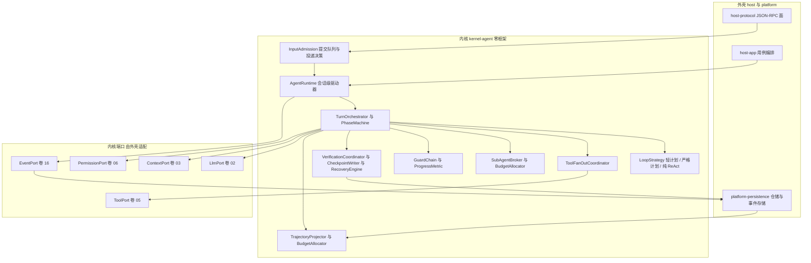
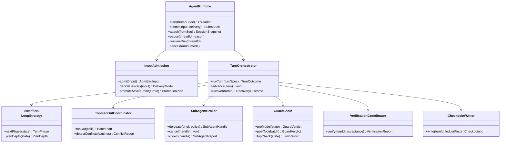
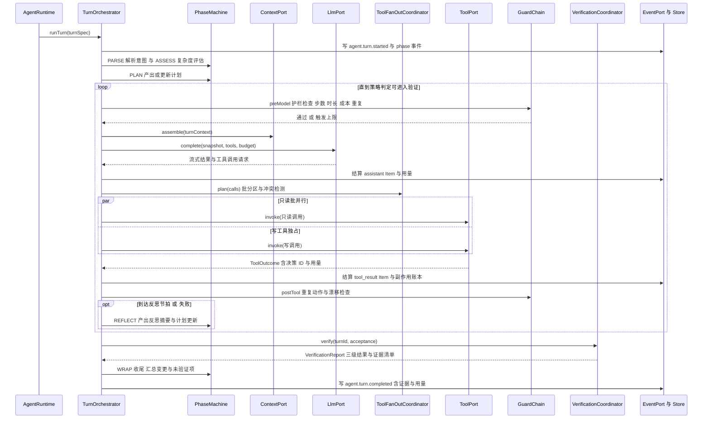
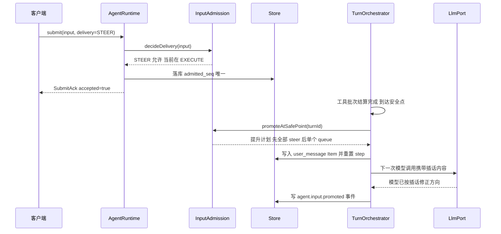
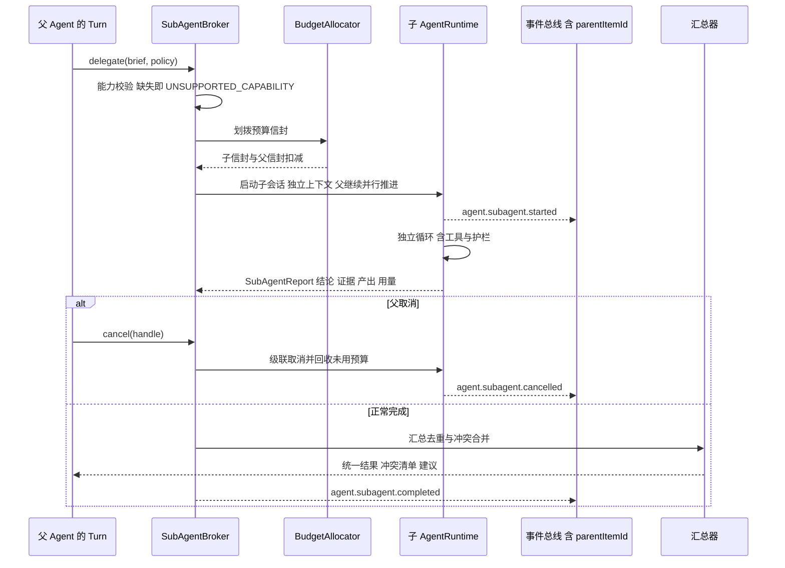
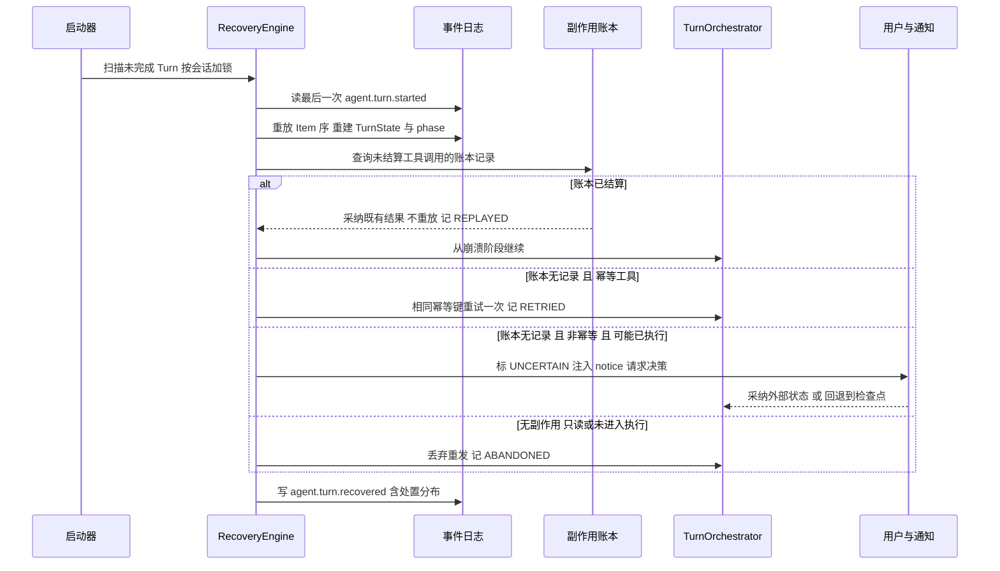
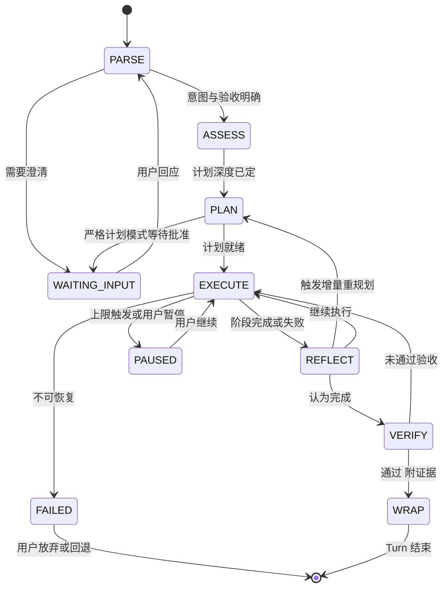
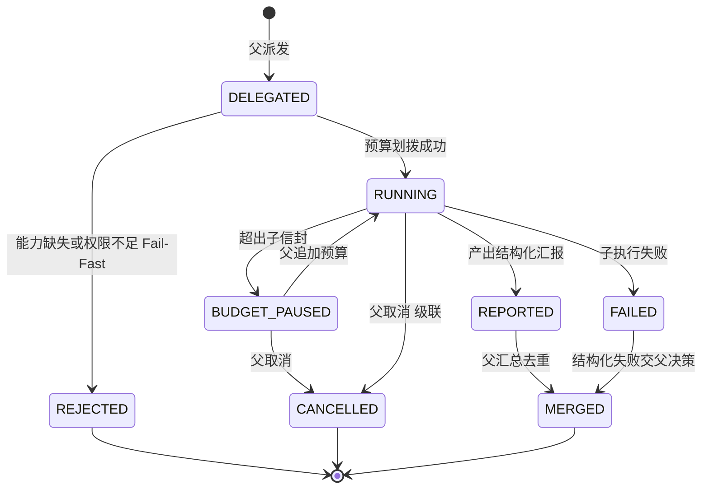

# 实现方案 12 · Agent 运行时（Agent Runtime Implementation）

> 本文件是 Phase B 实现层方案，对应 Phase A 卷 12（`docs/harness/12-agent-core.md`）与全局决策 H-003 / H-006 / H-011 / H-012；
> 上游契约不可修改，凡与卷 12 冲突之处在 §⑩.9 记录「反驳证据 + 建议修订」并登记 `I-AG-n`。
>
> 证据标记沿用 `00-research-plan.md` §2：`[E1]` 源码｜`[E2]` 官方文档｜`[E3]` 第三方｜`[E4]` 推断。
> 实现落点：`harness-kernel/kernel-agent`（零框架、零 IO 实现，见卷 27 §4.3）；编排服务与协议面落 `harness-host/host-app` 与 `host-protocol`。

---

## ① 实现目标与范围

### 1.1 本组件解决什么

把「一次干活」变成**可观测、可中断、可恢复、可评测**的过程：定义 Thread / Turn / Item 三段生命周期原语，
用一个阶段化状态机串起「解析 → 评估 → 规划 → 执行 → 反思 → 验证 → 收尾」，并把每一次状态变更写成事件，
使「模型看到的历史」与「落库的事实」严格一一对应。

### 1.2 与 Phase A 的对应关系

| Phase A 决策 | 本文件落实位置 |
| --- | --- |
| D-AG-1 混合状态机 + 可插拔策略（三策略） | §③ D-AGI-1、§⑦.1、§⑨ SPI |
| D-AG-2 Thread / Turn / Item 三段原语 | §⑤ 契约、§⑧ 表模型 |
| D-AG-3 自适应计划（复杂度驱动 + 触发式重规划） | §⑥.1、§⑨ `PlanningStrategySPI` |
| D-AG-4 SubAgent = 子会话（独立 Thread） | §⑥.3、§⑧ `oc_subagent_link` |
| D-AG-5 选择性继承（结构化简报 + 显式引用） | §⑤ `SubAgentBrief`、§⑥.3 |
| D-AG-6 并行扇出 + 结构化汇总 + 冲突前置拦截 | §③ D-AGI-4、§⑥.1、§⑩.7 |
| D-AG-7 人工介入三类（插话 / 暂停接管 / 审批） | §⑩.4 投递语义、§⑥.2 |
| D-AG-8 失败恢复四级（重试/换路/回退/人工） | §⑩.3 恢复协议、§⑩.6 |
| D-AG-9 多维循环防护 | §③ D-AGI-7、§⑦.1、§⑩.4 |
| D-AG-10 自主度三档动态可调 | §⑤ `AutonomyLevel`、§⑩.5 |
| D-AG-11 三级验证 + 证据强制 | §⑤ `VerificationService`、§⑥.1、§⑪ |
| D-AG-12 长任务：检查点 + 心跳 + 暂停续跑 | §⑧ `oc_checkpoint`、§⑩.3 |
| D-AG-13 声明式 Agent 定义四级作用域 | §⑧ `oc_agent_definition`、§⑨ |
| D-AG-14 全量轨迹 + 标准导出 + 可重放 | §⑧ `oc_trajectory_export`、§⑩.5 |
| H-006 追加事件日志 + 投影 | §⑩.5「模型可见 ⟺ 已记录」 |

### 1.3 本组件不解决什么

- **不解决**单次模型调用细节（卷 02）：内核只消费 `LlmPort.complete(...)` 的流式结果与用量。
- **不解决**上下文九区段组装与压缩（卷 03）：内核在每次模型调用前请求 `ContextPort.assemble(...)` 并原样投递。
- **不解决**工具执行与权限决策（卷 05/06）：内核只发起 `ToolPort.invoke(...)`，等待 `ToolOutcome`（含 SQL 与决策 ID）。
- **不解决**团队级编排（卷 13）与工作对象持久模型（卷 14）：内核只提供「派生、汇报、预算划拨、取消级联」四类原语。
- **不解决**沙箱选档（卷 07）与工作区实现（卷 20）。

### 1.4 上下游依赖

| 方向 | 依赖对象 | 接口 |
| --- | --- | --- |
| 上游 | 事件（卷 16） | `EventPort.append`（Item 与阶段事件）、分区序 = 会话内 `seq` |
| 上游 | 持久化（卷 19） | `ThreadStore` / `TurnStore` / `ItemStore` / `CheckpointStore` 端口 |
| 上游 | 模型（卷 02） | `LlmPort.complete(request, budgetEnvelope)` |
| 上游 | 上下文（卷 03） | `ContextPort.assemble(turnContext)` / `feedback(usage)` |
| 上游 | 工具与权限（卷 05/06） | `ToolPort.invoke(toolCall, resourceClaim)` / `cancel(callId)`；`PermissionPort.modeOf(session)` 与审批回调 |
| 下游 | 任务（卷 14） | Turn 推进 Task；验收标准进入验证阶段 |
| 下游 | Teams（卷 13） | 派生成员 Agent、汇报与黑板写入 |
| 下游 | Goal（卷 15） | 自治轮次驱动 `runTurn(goalContext)` |
| 下游 | 评测（卷 26） | 轨迹导出与回放 |

### 1.5 模块落点

```text
harness-contract/.../contract/agent/
    ThreadId / TurnId / ItemId / ItemType / TurnPhase / AutonomyLevel / DeliveryMode
    ThreadSpec / TurnSpec / ItemPayload / SubAgentBrief / SubAgentReport / EvidenceRef
    LoopStrategySPI / PlanningStrategySPI / SubAgentPolicySPI / VerificationProviderSPI
    ProgressMetricSPI / AgentDefinitionSourceSPI / TrajectoryExporterSPI
    InputAdmissionPolicySPI / ToolFanOutPolicySPI

harness-kernel/kernel-agent/src/main/java/.../kernel/agent/
    runtime/    AgentRuntime、TurnOrchestrator、PhaseMachine、SafePointCoordinator
    primitives/ ThreadState、TurnState、ItemLog（纯内存模型，可重放）
    loop/       ReActStrategy、PlanExecuteReflectStrategy、StrictPlanStrategy
    input/      InputAdmission（steer / queue / interrupt 决策与提升）
    tools/      ToolFanOutCoordinator（批分区 + 资源声明冲突 + 背压）
    subagent/   SubAgentBroker、BudgetAllocator、LineageTracker
    guard/      GuardChain、RepeatActionGuard、DriftGuard、BudgetCircuitBreaker
    verify/     VerificationCoordinator（L1 静态 / L2 可执行 / L3 语义）
    checkpoint/ CheckpointWriter（账本先行）、RecoveryEngine；trajectory/ TrajectoryProjector
```

**分层纪律**：`kernel-agent` 不依赖 Spring/Jackson/JDBC/HTTP（卷 27 R1）；表结构、迁移、REST 面在外壳。

### 落地核对（R07：模块 / 顺序 / 批次 / 门禁 / I-* 落点）

- **模块（卷 27 §4.1 权威名）**：`harness-kernel/kernel-agent`（主循环/原语/策略/输入投递/扇出/SubAgent/护栏/验证/检查点/轨迹）+ `harness-contract`（`contract/agent` 契约与 9 个 SPI）+ `harness-platform/platform-persistence`（Thread/Turn/Item 投影与 `oc_checkpoint`）+ `harness-host/host-protocol`（会话面）+ `harness-host/host-bootstrap`（装配）。目录树已按目标模块名书写。
- **实施顺序（卷 27 §4.5）**：第 5 步「Agent 主循环（单策略）+ 检查点」，依赖第 2 步（事件写入端口，与 impl/01 同批）、第 3 步（模型网关）、第 4 步（工具运行时）。第 10 步（上下文压缩）与第 14 步（任务模型）依赖本层；**本层是 02/03/04/05/06 之后的第一个集成点**，其 DoD 全绿是第 8 步（协议面 + CLI）的前置。
- **数据批次（卷 27 §4.4）**：`oc_thread`、`oc_turn`、`oc_item`、`oc_checkpoint`、`oc_agent_input`、`oc_subagent_link`、`oc_tool_side_effect` → **B1/B2**（B1 会话基础结构；副作用账本随 B2）；`oc_agent_definition`、`oc_guard_trip`、`oc_trajectory_export` → **B4**（Agent/团队域）——`oc_guard_trip`/`oc_trajectory_export` 未在 B1–B6 明列，已登记为 X 修订项（见 `reviews/R07-scope-build-kernel.md`）。
- **门禁映射（卷 27 §4.6）**：`kernel-agent` 单测 → 「单元测试 + 覆盖率门」；PG/Redis 集成 → 「集成测试」；`agent-gate.sh`（崩溃注入矩阵 + 插话 + 扇出 + 回放）→ 「集成测试」+「契约测试」；轨迹导出 → 「离线评测（核心集）」。
- **I-* 落点**：I-AG-1 → `kernel-agent`（`PhaseMachine` + `LoopStrategySPI` 实现）；I-AG-2 → `platform-persistence`（`oc_event_log` + Item 投影）+ `kernel-agent`（`TrajectoryProjector`）；I-AG-3 → `kernel-agent`（`InputAdmission`）；I-AG-4 → `kernel-agent`（`ToolFanOutCoordinator`）；I-AG-5 → `kernel-agent`（`SubAgentBroker` + `SubAgentPolicySPI` 注册表）；I-AG-6 → `kernel-agent`（`RecoveryEngine` + 账本先行）+ `platform-persistence`（`oc_tool_side_effect`）；I-AG-7 → `kernel-agent`（双信封预算 + `BudgetCircuitBreaker`）+ `kernel-model`（结算回冲）；I-AG-8 → `kernel-agent`（轨迹投影）+ `harness-contract`（`TrajectoryExporterSPI`）；I-AG-9 → `platform-persistence`（`oc_checkpoint` 唯一物理表，与 impl/01/03 列名别名对齐）。

---

## ② 功能需求清单（REQ-AG-n）

| REQ | 需求描述 | 来源 | 优先级 | 验收要点 |
| --- | --- | --- | --- | --- |
| REQ-AG-01 | Thread / Turn / Item 三段原语落地，UI 与事件日志可按三层渲染与统计 | 卷 12 §3 D-AG-2 | P0 | 成本/时长/工具数可按 Turn 归因；Item 可独立渲染 |
| REQ-AG-02 | 三种循环策略（轻计划 / 严格计划 / 纯 ReAct）可切换且共享同一状态机与恢复能力 | 卷 12 §3 D-AG-1、§8 DoD | P0 | 同一故障场景在三策略下恢复行为一致 |
| REQ-AG-03 | 阶段化主循环七阶段（解析/评估/规划/执行/反思/验证/收尾），阶段迁移有理由字段 | 卷 12 §4.2 | P0 | 每阶段有对应事件与指标；阶段切换 ≤ 5ms |
| REQ-AG-04 | **事件溯源式回合持久化**：模型可见内容必须已落库；历史由 Item 投影得到，禁止临时拼接 | 竞品 DeepSeek Harness "Model-visible means logged"、`deriveMessages()` [E1]（`research/competitors/04-deepseek-harness.md` §1 第 3 条）；OpenCode V2 会话事件溯源 + `session_message` 投影 [E1]（`02-opencode.md` §1 第 4 条） | P0 | 抽取模型请求历史与自身投影逐字节一致（对拍用例） |
| REQ-AG-05 | **三档输入投递（STEER / QUEUE / INTERRUPT）**，提升顺序「先 steer 全部、后 queue 一个」，提升即重置 step | 竞品 OpenCode `promoteSteers` 优先与 `promoteNextQueued` 单条提升 [E1]（`02-opencode.md` §⑦ 走读要点 2）；Codex `input_queue` 的 `steered user input` 语义 [E1]（`03-codex.md` §4.10） | P0 | 插话在 ≤1 次模型调用内可见；队列输入不丢且不打断当前 Turn |
| REQ-AG-06 | **单一提交队列入口**：所有外部输入（用户消息、审批回执、工具结果、系统输入）进同一队列，受理结果同步回执 | 竞品 Codex `Submission{id, op, trace}` + `submission_loop` 单点 dispatch + `oneshot` 回执 [E1]（`03-codex.md` §4.2、§5.1） | P0 | 提交方能区分「已受理」与「未受理」；非法 Op 不出队列 |
| REQ-AG-07 | **并行工具扇出与冲突消解**：只读批并行、写动作独占；同资源声明冲突在扇出前拦截 | 竞品 Claude Code 批分区 + 并发上限 10 [E1]（`01-claude-code-purpose-built.md` §1 第 3 条）；Codex 用单一 `RwLock` 实现并行闸门 [E1]（`03-codex.md` §1 第 7 条） | P0 | 同文件并发写用例被前置拦截并给出冲突清单 |
| REQ-AG-08 | **SubAgent 协议**：结构化简报委派、结构化汇报、预算独立信封、级联取消、嵌套深度上限 | 卷 12 §4.3；竞品 DeepSeek `ctx.subagents` 六 provider 注册表 + 能力缺失 `SubagentError('UNSUPPORTED_CAPABILITY')` 响亮拒绝 [E1]（`04-deepseek-harness.md` §4.9） | P0 | 子 Agent 权限 ⊆ 父权限；父取消级联；超限暂停并回报 |
| REQ-AG-09 | 检查点与中断恢复：账本先行写入（INV-6），崩溃后按 Item 粒度续跑不重复副作用 | 卷 12 §4.6、附录 A INV-6 | P0 | kill 进程用例：已结算工具不重放；未结算工具按分级处理 |
| REQ-AG-10 | 循环护栏：重复动作检测（相同工具+参数计数）、步数/时长/成本三重上限、目标漂移检测 | 卷 12 §3 D-AG-9；竞品 DeepSeek `guard/repeat-tool-reminder` 3/5/8 次阈值、纯建议不阻塞 [E1]（`04-deepseek-harness.md` §4.4）；Claude Code `resetDoomLoop` / 工具失败循环护栏 [E1]（`01-claude-code-purpose-built.md` §4.2） | P0 | 越界触发后**暂停 + 摘要 + 请求决策**，不静默终止 |
| REQ-AG-11 | 三级验证（静态 / 可执行 / 语义）+ 证据强制：声称完成必须附证据，未验证项显式标注 | 卷 12 §4.5、附录 A INV-10 | P0 | `done` 无证据即非法（写入层拒绝） |
| REQ-AG-12 | 与 Teams / Goal / 任务系统接口：Turn 可推进 Task、可作团队成员、可被 Goal 轮次驱动 | 卷 12 §1 边界、卷 14 §4.5 | P1 | 三接口各有契约测试；跨系统不共享内存状态 |
| REQ-AG-13 | **轨迹导出与回放**：全量事件级轨迹可导出标准格式，评测/训练/审计可消费与重放 | 卷 12 §3 D-AG-14；竞品 Codex rollout JSONL + SQLite 索引双轨与迁移模式 [E1]（`03-codex.md` §1 第 8 条） | P1 | 导出包可离线重放出等价历史（对拍断言） |
| REQ-AG-14 | **能力不支持时 Fail-Fast**：声称不支持的能力必须显式拒绝，禁止 accept-then-ignore | 竞品 DeepSeek "需要但缺失 → 以 `UNSUPPORTED_CAPABILITY` 响亮拒绝" [E1]（`04-deepseek-harness.md` §4.9） | P0 | 契约测试覆盖每个可选能力的缺失路径 |
| REQ-AG-15 | 集成测试基建：可编程假模型 + 确定性回放 + 事件序列断言 | 竞品 Codex 以集成测试驱动内核重构 [E1]（`03-codex.md` 全文多处测试与 mock）；卷 27 §4.7 `tools/fake-llm` | P0 | 全部内核用例离线可跑，无真实模型调用 |
| REQ-AG-16 | 自定义 Agent 定义：声明式四作用域（内置/组织/项目/用户），含工具收窄与权限上限 | 卷 12 §3 D-AG-13、§4.7 | P1 | 定义变更生效且权限只减不增（INV-4） |
| REQ-AG-17 | 自主度三档（建议/协作/自治）会话内可调，且与权限模式对齐 | 卷 12 §3 D-AG-10 | P1 | 档位变更写事件并在下一安全点生效 |
| REQ-AG-18 | 长任务：心跳、暂停续跑、跨端接管（attach + resume(fromSeq)） | 卷 12 §3 D-AG-12、§4.6 | P1 | 断连后另一端可从 `lastEventSeq` 续接且不丢 Item |

**竞品增量需求说明**：REQ-AG-04/05/06/07/10/13/14 来自竞品源码事实（DeepSeek / OpenCode / Codex / Claude Code 的 E1 证据），
是 Phase A 未下沉到机制层的实现级需求，已在 §③ 各自登记 `I-AG-n`。

---

## ③ 技术方案选型（M×N 比选）

评分沿用 `README.md` §4：**F 30% / U 20% / S 25% / M 25%**。

### D-AGI-1 循环实现形态

| 分支 | 描述 | F | U | S | M | 加权 | 结论 |
| --- | --- | --- | --- | --- | --- | --- | --- |
| B1 | `while` + 多个跨迭代状态字段（Claude Code `src/query.ts:629` 式 `State`） | 8 | 7 | 8 | 7 | 75.5 | 淘汰（状态散落、恢复语义弱） |
| B2 | **显式阶段状态机 + 可插拔策略（策略只决定「下一步走哪个阶段」）** | 9 | 9 | 8 | 9 | 87.5 | **选定** |
| B3 | 可重入流水线「效果即数据」（Goose `state_machine/ops_*` 式） | 9 | 7 | 7 | 8 | 78.5 | 吸收其「阶段输入输出均为数据」用于重放 |

**选定 B2**：状态机让「中断/恢复/暂停」在任一策略下语义一致（D-AG-1 的硬要求：三策略共享同一状态机）；
吸收 B3 的「阶段输入输出落库为数据」，使阶段可重放而无需重跑副作用。

### D-AGI-2 回合持久化模型

| 分支 | 描述 | F | U | S | M | 加权 | 结论 |
| --- | --- | --- | --- | --- | --- | --- | --- |
| B1 | 纯关系表 Item 行（可查询，无回放语义） | 8 | 8 | 8 | 8 | 80.0 | 淘汰（无法重放，H-006 要求追加日志） |
| B2 | **事件日志为源 + Item 投影 + JSONL 导出（兼容 rollout 风格）** | 9 | 8 | 8 | 9 | 85.5 | **选定** |
| B3 | 仅 append-only JSONL + 独立索引库（Codex / DeepSeek 式） | 8 | 7 | 7 | 7 | 73.0 | 吸收其「导出格式」到 `TrajectoryExporterSPI` |

**选定 B2**：与 H-006、卷 19 一致；`oc_event_log` 提供分区序与回放，`oc_item` 提供低成本读模型（UI 渲染与统计），
JSONL 仅作为**导出格式**（评测与迁移）。

### D-AGI-3 输入投递语义

| 分支 | 描述 | F | U | S | M | 加权 | 结论 |
| --- | --- | --- | --- | --- | --- | --- | --- |
| B1 | 立即中断注入（模型请求中途插入文本） | 7 | 8 | 5 | 6 | 64.5 | 淘汰（破坏 provider 缓存与历史一致性） |
| B2 | **安全点提升 + 优先级（steer 全提、queue 单提）** | 9 | 9 | 9 | 8 | 87.5 | **选定** |
| B3 | 仅队列（无插话） | 6 | 6 | 9 | 7 | 70.0 | 淘汰（违背 D-AG-7 插话要求） |

**选定 B2**：与 OpenCode 的 `promoteSteers` / `promoteNextQueued` 顺序一致 [E1]，与 Codex 的 `steered user input` 语义对齐 [E1]；
安全点定义见 §⑩.4，插话可见延迟 ≤ 1 次模型调用。

### D-AGI-4 并行工具扇出

| 分支 | 描述 | F | U | S | M | 加权 | 结论 |
| --- | --- | --- | --- | --- | --- | --- | --- |
| B1 | 全并行（任意工具同时执行） | 8 | 7 | 5 | 5 | 63.0 | 淘汰（写冲突与资源争用） |
| B2 | **批分区（连续只读并行 / 写工具切批独占）+ 资源声明冲突前置拦截** | 9 | 8 | 8 | 8 | 83.0 | **选定** |
| B3 | 单一读写锁（Codex `RwLock<()>` 式闸门，不做批分区） | 8 | 7 | 9 | 8 | 80.5 | 吸收为「写范围锁」用于同文件互斥 |

**选定 B2**：批分区在吞吐与安全间最优，且与「只读/写」的 `ToolSpec` 声明天然对齐（卷 05）；B3 的锁语义下沉为
`ResourceClaim` 的互斥实现，用于跨批的同一文件/工作区互斥。

### D-AGI-5 SubAgent 隔离形态

| 分支 | 描述 | F | U | S | M | 加权 | 结论 |
| --- | --- | --- | --- | --- | --- | --- | --- |
| B1 | 同进程子会话（独立 Thread + 独立预算 + 权限收窄） | 9 | 8 | 8 | 8 | 83.0 | 基础 Provider（默认） |
| B2 | 独立进程 / 沙箱会话 | 8 | 7 | 5 | 7 | 68.0 | 用于不可信任务与跨机并行 |
| B3 | **Provider 注册表（同进程 + 远程 + 异种 Agent 可插拔）** | 10 | 8 | 7 | 9 | 86.0 | **选定** |

**选定 B3**：DeepSeek 的六 provider 注册表证明「同一子 Agent 接口背后可换实现」是长期正确形态 [E1]；
默认装配同进程 Provider（B1），远程与异种 Agent（ACP / 外部 CLI）作为可选 Provider，能力缺失一律 Fail-Fast（REQ-AG-14）。

### D-AGI-6 崩溃恢复策略

| 分支 | 描述 | F | U | S | M | 加权 | 结论 |
| --- | --- | --- | --- | --- | --- | --- | --- |
| B1 | 从最近检查点重跑当前 Turn | 7 | 6 | 7 | 6 | 65.5 | 淘汰（可能重复副作用） |
| B2 | **事件重放 + 副作用账本 + 幂等键（已结算不重放）** | 9 | 8 | 8 | 9 | 85.5 | **选定** |
| B3 | 本地 WAL 双写（文件 + 库） | 8 | 7 | 6 | 7 | 70.5 | 淘汰（一致性与运维成本） |

**选定 B2**：满足 INV-6「先账本后检查点」与 D-AG-8 的四级分级；恢复粒度到 Item（§⑩.3）。

### D-AGI-7 预算熔断位置

| 分支 | 描述 | F | U | S | M | 加权 | 结论 |
| --- | --- | --- | --- | --- | --- | --- | --- |
| B1 | 仅模型网关层事后计量 | 6 | 7 | 8 | 7 | 69.5 | 淘汰（超限才发现） |
| B2 | 仅循环层前置检查（信封本地扣减） | 7 | 8 | 7 | 7 | 72.0 | 淘汰（与真实用量漂移） |
| B3 | **双层：循环层信封前置扣减 + 网关层实际结算 + 差异回冲** | 9 | 8 | 8 | 9 | 85.5 | **选定** |

**选定 B3**：信封保证「永不超支」（成本可控），结算保证「不虚报」（对齐卷 31 计量口径 ≤ 0.5%）。

### D-AGI-8 轨迹导出形态

| 分支 | 描述 | F | U | S | M | 加权 | 结论 |
| --- | --- | --- | --- | --- | --- | --- | --- |
| B1 | 专有 JSON 快照（不可回放） | 7 | 7 | 9 | 7 | 75.0 | 淘汰 |
| B2 | **事件流原生格式 + 规范化投影（可重建模型可见面）** | 9 | 8 | 8 | 9 | 85.5 | **选定** |
| B3 | 直接输出训练格式（SFT 轨迹） | 7 | 6 | 6 | 6 | 63.0 | 作为 B2 之上的可选适配器 |

### 3.2 实现级决策登记（I-AG-n）

| ID | 主题 | 选定 | 理由与代价 | 回退触发 |
| --- | --- | --- | --- | --- |
| I-AG-1 | 循环实现 | 显式阶段状态机 + 策略插件（阶段 I/O 落库为数据） | 三策略共享恢复语义；代价是阶段边界需统一抽象 | 某策略无法用阶段表达 → 允许该策略自定义阶段集（仍走同一事件契约） |
| I-AG-2 | 持久化 | PG 事件日志为源 + Item 投影 + JSONL 导出 | 满足 H-006 与可回放；代价是投影延迟 | 投影延迟 > 500ms → 改为写路径同步投影（牺牲吞吐换一致性） |
| I-AG-3 | 输入投递 | 三档语义 + 安全点提升 + 「steer 全提、queue 单提」 | 可预测且不打断；代价是队列输入时延不保证 | 交互端要求更低时延 → 允许 `STEER` 用于队列（仍走安全点） |
| I-AG-4 | 扇出 | 批分区 + 资源声明冲突前置拦截 + 权限上限度可配 | 吞吐与安全兼得；代价是批边界降低并行度 | 只读批平均利用率 < 50% → 调大批上限或改用依赖图调度 |
| I-AG-5 | SubAgent | Provider 注册表（默认同进程子会话）+ 能力 Fail-Fast + 血缘 | 隔离与可扩展；代价是多 Provider 需统一契约测试 | 远程 Provider 延迟劣化 → 默认禁用该 Provider（配置） |
| I-AG-6 | 恢复 | 事件重放 + 账本先行 + 幂等键，Item 粒度；不确定动作标记 `UNCERTAIN` 并请求决策 | 不重复副作用；代价是恢复路径分支多 | 恢复时间 > 30s → 引入周期性全量快照加速 |
| I-AG-7 | 预算 | 双信封（循环前置 + 网关结算），熔断在循环层 | 永不超支且不虚报；代价是差异回冲逻辑 | 回冲偏差 > 2% → 提高信封预留比例 |
| I-AG-8 | 轨迹 | 事件原生 + 投影重建模型可见面；导出格式可插拔 | 可回放可评测；代价是导出包体积 | 导出体积 > 阈值 → 分段导出 + 压缩（不影响语义） |
| I-AG-9 | 检查点唯一口径（R05 新增） | `oc_checkpoint` 唯一物理表 + 业务幂等键 `(session_id, seq)` + 锚定事件判完整性 + 检查点只做加速不回锚正确性；01/03 的 `payload_ref`/`workspace_version` 视为列名别名（迁移以本表为准） | 收益：消除三处各一套检查点语义；代价：迁移脚本需做列名映射与一次性列补齐 | 若 01/03 的检查点载荷无法映射到本表列（出现第三种语义）→ 新增 `payload_ref` 保留列并登记 Phase A 修订建议（不新建第二张检查点表） |

---

## ④ 总体架构图



**内核/外壳边界**：内核只依赖端口接口与纯内存模型；`host-bootstrap` 用显式装配计划（D-ARC-9）把
`LlmPort`/`ContextPort`/`ToolPort`/`EventPort`/Store 端口的实现注入，进程内嵌档直接复用同一装配。

---

## ⑤ 类图与关键契约



（`RecoveryEngine`、`TrajectoryProjector`、`BudgetAllocator` 见 §1.5 模块落点与 §⑧ 表模型，此处从略以保持图可读。）

### 5.1 关键 Java 21 签名（内核契约，零框架依赖）

```java
/**
 * 会话级 Agent 运行时：持有线程状态、接受输入、驱动 Turn、提供恢复与接管。
 * 实现必须保证「模型可见 ⟺ 已记录」，且对外暴露的均为已提交事实。
 */
public interface AgentRuntime {

    /**
     * 提交一条外部输入。
     *
     * @param threadId 目标会话（必填）
     * @param input    输入载荷（必填，含 delivery 与来源分类）
     * @return 受理回执：accepted 为 false 时携带原因；受理不代表已执行
     * @throws HarnessException 会话不存在或状态非法时抛出，错误码 NOT_FOUND / CONFLICT
     */
    SubmitAck submit(ThreadId threadId, UserInput input);

    /**
     * 从指定事件序恢复一个 Turn（崩溃重启或跨端接管）。
     *
     * @param threadId 会话标识（必填）
     * @param fromSeq  起始事件序（0 表示从头重放）
     * @return 恢复结果：重放条目数、被采纳的未结算调用、待决策项
     */
    RecoveryOutcome recover(ThreadId threadId, long fromSeq);
}

/** 输入投递语义。STEER 在安全点插入当前 Turn；QUEUE 成为后续 Turn 首输入；INTERRUPT 安全点终止当前 Turn。 */
public enum DeliveryMode { STEER, QUEUE, INTERRUPT }

/** Turn 阶段全集。策略决定可达路径，但状态机保证任一策略下都可中断与恢复。 */
public enum TurnPhase { PARSE, ASSESS, PLAN, EXECUTE, REFLECT, VERIFY, WRAP }

/** Item 载荷：密封接口 + record 实现，序列化即事件载荷。 */
public sealed interface ItemPayload
        permits UserMessagePayload, AssistantMessagePayload, ToolCallPayload, ToolResultPayload,
                ApprovalPayload, CheckpointPayload, NoticePayload, SubAgentPayload {
}

/** 子 Agent 派发简报：结构化、可序列化、不含父对话原文。 */
public record SubAgentBrief(
        String objective,
        List<String> acceptance,
        List<String> knownFacts,
        List<String> constraints,
        List<String> forbidden,
        List<ArtifactRef> references,
        BudgetEnvelope budget,
        int maxDepth) {
}

/** 子 Agent 汇报契约：结论 + 证据 + 产出 + 未决问题 + 置信度 + 用量。 */
public record SubAgentReport(
        SubAgentHandle handle,
        String conclusion,
        List<EvidenceRef> evidence,
        List<ArtifactRef> artifacts,
        List<String> openQuestions,
        Confidence confidence,
        UsageSummary usage) {
}

/** 工具扇出策略：只读批并行、写工具独占，同资源写冲突在扇出前拦截并抛 HarnessException。 */
public interface ToolFanOutPolicy {
    BatchPlan plan(List<ToolInvocation> calls);
}

```

**枚举与常量纪律**：`TurnPhase`、`DeliveryMode`、`LimitKind`（`STEPS`/`DURATION`/`COST`）、`RecoveryDisposition`
（`REPLAYED`/`ADOPTED`/`RETRIED`/`UNCERTAIN`/`ABANDONED`）全部 `code + desc` 且带 `of(String code)`；
所有阈值（步数/时长/成本/重复次数/漂移阈值）进 `AgentProperties`，代码内不得出现字面量。
**处置域语义与跨域映射（唯一口径，见 §⑩.3 第 13 条与卷 19 §⑩.3.3）**：`REPLAYED` = 采纳既有结果不重放；
`ADOPTED` = 人工确认后采纳外部状态继续；`RETRIED` = 以**同一幂等键**重试一次（仅 `IDEMPOTENT`）；`UNCERTAIN` = 不可判定，挂起自动推进等人工；
`ABANDONED` **仅**表示「无记录且已证明无副作用的丢弃重发」，与卷 19 判定域的同名 `ABANDONED`（不可恢复需人工处置）**语义不同域，禁止互相复用**。

**异常命名分层（全套统一）**：本域属内核层（framework-free core），业务失败统一抛内核基类 `HarnessException(ErrorCode, message)`（本文件示例已按此命名）；域内不另立平行异常体系，能力缺失一律 `UNSUPPORTED_CAPABILITY`（附 `alternatives[]`）、并发抢占与状态非法一律 `CONFLICT`、资源不存在一律 `NOT_FOUND`。外壳层（domain / application / interfaces 的会话编排、协议面、持久化适配）对应位置抛 `BusinessException`，由外壳全局异常处理器把 `HarnessException` 按 `ErrorCode` 映射为统一响应；两侧**禁止**用裸 `RuntimeException` / `IllegalArgumentException` 表达业务失败；可重试只认 `ErrorCode.retryable`（D14）。**契约缺口指针（X-82）**：异常类名与冻结卷册 `ErrorCode` 映射的登记缺口已列为修订建议 **X-82**（`impl/IMPL-DECISIONS.md` §4；本文件不改台账）。

---

## ⑥ 核心流程时序图

### 6.1 一次 Turn 的完整阶段流转（含并行工具扇出与验证）

**前置条件**：会话存在且 `state=IDLE` 或 `RUNNING`；预算信封可划拨。
**主路径**：解析意图 → 复杂度评估（决定计划深度）→ 规划 → 执行（上下文装配 → 模型调用 → 工具扇出 → 观察）→ 反思 → 验证 → 收尾。
**异常与补偿**：模型调用失败按 D-AG-8 分级；工具失败回流为观察并在反思阶段处理；护栏触发则暂停并请求决策。
**幂等与并发点**：Turn 内 `seq` 单调；工具调用带幂等键；同一会话内 Turn 串行（会话级锁），不同会话可并发。



### 6.2 插话（STEER）在安全点生效

**前置条件**：存在运行中的 Turn；输入 `delivery=STEER` 且策略允许（交互端）。
**主路径**：输入先入队（落库）→ 当前迭代跑到安全点 → 提升计划（steer 优先）→ 注入为下一次模型调用的用户消息。
**异常与补偿**：若当前 Turn 已进入 `WRAP`，steer 降级为队列并成为下一 Turn 首输入（并写事件告知）。
**幂等与并发点**：输入在 `oc_agent_input` 有唯一 `admitted_seq`；提升是幂等状态迁移（重复提升同一输入不产生第二条 Item）。



### 6.3 SubAgent 派发、汇合与级联取消

**前置条件**：父 Agent 有派生权限（`delegation` 允许且未达深度/数量上限）；预算可划拨。
**主路径**：父生成结构化简报 → Broker 校验能力并划拨预算 → 子会话独立运行 → 结构化汇报 → 父合并去重。
**异常与补偿**：子失败不炸父（父收结构化失败并决定重试/换路/自做）；子超预算暂停并回报；父取消级联到所有子孙。
**幂等与并发点**：同一 `briefDigest + parentItemId` 的重复派发视为同一子会话（幂等）；并行派发数受上限约束。



### 6.4 崩溃恢复（账本先行 + Item 粒度续跑）

**前置条件**：进程重启；`oc_thread`/`oc_turn` 有未完成记录；事件日志完整到最后一个已提交 `seq`。**驱动方**：卷 19 §⑩.3 恢复协调器（唯一协调者，见 §⑩.3 第 2 条）；本域不实现第二个扫描器。
**主路径**：读最后一次 `agent.turn.started` → 重放该 Turn 的 Item → 结算未结算项（按账本与幂等键）→ 从崩溃阶段继续。
**异常与补偿**：重放期间再次崩溃 → 恢复本身幂等（`agent.turn.recovered` 唯一）；无法判定 → 标 `UNCERTAIN` 并请求用户决策。
**幂等与并发点**：恢复以 Turn 级分布式锁串行；同一 Turn 的恢复只执行一次。



---

## ⑦ 状态机

### 7.1 Turn 阶段状态机（三策略共享）



### 7.2 SubAgent 生命周期



### 7.3 Item 结算状态

`PENDING → SETTLED`（写入并已确认）；`PENDING → DISCARDED`（无副作用且崩溃未提交）；
`PENDING → UNCERTAIN`（可能已产生副作用但无法确认）→ 只能经用户决策转向 `SETTLED` 或触发回退。
**不变量**：`SETTLED` 的 Item 永不重写（只追加）；`UNCERTAIN` 必须挂起对应 Turn 的自动推进。

---

## ⑧ 数据模型

### 8.1 表（`oc_*`，全部含 `tenant_id` 与审计字段）

**类型约定（本节各表通用；逐列 DDL 以卷 19 的 Flyway 迁移脚本为准）**：内部主键 `id BIGINT`（Snowflake）或复合主键（如 `(tenant_id, …)`）；对外暴露的引用 ID 用不透明字符串 / `UUID`（防遍历）；时间列统一 `TIMESTAMPTZ`（UTC 存储、展示层本地化）；枚举列存 `VARCHAR(32)` 的 **code**（禁止存 desc）；结构化与可变结构用 `JSONB`；布尔列 `BOOLEAN NOT NULL DEFAULT false`；敏感字段（密钥 / Token）只存引用名 `*_ref`，明文永不入库；大对象（快照 / 录制 / 工件）外置并留指针；各表字段语义见「关键字段」列，索引与唯一约束见末列。

| 表 | 关键字段 | 索引与约束 |
| --- | --- | --- |
| `oc_thread` | `thread_id`、`session_id`、`workspace_id`、`mode`、`autonomy`、`budget_total jsonb`、`state`、`last_event_seq` | `uk(thread_id)`；`(tenant_id, session_id, state)` |
| `oc_turn` | `turn_id`、`thread_id`、`intent`、`plan_ref`、`phase`、`planned_depth`、`started_at`、`ended_at`、`usage jsonb`、`outcome` | `uk(turn_id)`；`(thread_id, started_at)`；部分索引 `(tenant_id, phase)` 仅未完成 |
| `oc_item` | `item_id`、`turn_id`、`seq`、`item_type`、`payload_ref`（>64KB 转对象存储）、`parent_item_id`、`actor`、`sensitivity` | `uk(turn_id, seq)`；`(turn_id, item_type)`；**唯一** `(item_id)` |
| `oc_agent_input` | `input_id`、`thread_id`、`admitted_seq`、`delivery`、`source`（USER/APPROVAL/TOOL/SYSTEM）、`payload_ref`、`state`（ADMITTED/PROMOTED/DROPPED） | `uk(thread_id, admitted_seq)`；`(thread_id, state)` |
| `oc_checkpoint` | `checkpoint_id`、`thread_id`、`turn_id`、`seq`、`plan_snapshot`、`workspace_ref`、`context_digest`、`side_effect_ledger jsonb`、`usage jsonb`、`open_questions jsonb` | `(thread_id, seq desc)`；`(turn_id)` |
| `oc_tool_side_effect` | `effect_id`、`turn_id`、`call_id`、`idempotency_key`、`tool_name`、`resource`、`state`（EXECUTING/SETTLED/UNCERTAIN）、`result_ref` | `uk(idempotency_key)`；`(turn_id, state)` |
| `oc_subagent_link` | `link_id`、`parent_thread_id`、`child_thread_id`、`parent_item_id`、`depth`、`budget_alloc jsonb`、`state`、`report_ref` | `(parent_thread_id)`；`(child_thread_id)`；`(parent_item_id)` |
| `oc_agent_definition` | `definition_id`、`scope`（BUILTIN/ORG/PROJECT/USER）、`name`、`prompt_role_ref`、`tools_allow`、`tools_deny`、`permission_ceiling`、`delegation jsonb`、`budget_default jsonb` | `uk(scope, owner_ref, name)` |
| `oc_trajectory_export` | `export_id`、`thread_id`、`from_seq`、`to_seq`、`format`、`object_ref`、`checksum`、`created_by` | `(thread_id, created_at desc)` |
| `oc_guard_trip` | `trip_id`、`turn_id`、`kind`（REPEAT_ACTION/STEPS/DURATION/COST/DRIFT）、`detail jsonb`、`disposition` | `(tenant_id, kind, created_at)`；`(turn_id)` |

**分区与保留**：`oc_item` 随会话保留（与事件归档一致，卷 19）；`oc_guard_trip` 保留 90 天明细 + 长期聚合；
`oc_trajectory_export` 产物入对象存储并按保留策略回收。

**检查点表唯一口径（跨 01/03/12/19，补注，不新增表）**：`oc_checkpoint` 全仓**唯一物理表**，本文件是唯一写入者；
业务幂等键 `(session_id, seq)`（`seq` = 写入时的会话事件序，与卷 03 §6.4 一致），对外身份 `checkpoint_id`（不透明引用），
`thread_id`/`turn_id` 仅为归属列（跨端接管后 thread 归属可变，**不得作为身份**）；01/03 的 `payload_ref`/`workspace_version`
与本表 `plan_snapshot`/`workspace_ref` 为同一语义的**列名别名**（迁移脚本以本表为准，登记 `I-AG-9`）。
**完整性判据**：仅当锚定事件 `agent.item.committed`（Type=CHECKPOINT，等价于卷 03 的 `context.checkpoint.written`）已提交，
该检查点才算「已提交」；半写记录（有行无锚定事件）一律忽略并清理。**检查点只提供加速与回退锚点，不提供正确性**
（正确性由事件 + 账本保证，INV-6）。**外置阈值说明**：`oc_item.payload_ref` 的超阈值（> 64KB）外置与事件
`EVENT_MAX_PAYLOAD_BYTES`（默认 262144）外置**有意不同层级**；外置件是 CAS 引用、属「已记录」的一部分，
故「模型可见 ⟺ 已记录」不因外置被破坏（对拍断言须解析引用后再比对）。

### 8.2 Redis Key（统一 `RedisKeys` 工厂）

| 语义 | Key 形态 | TTL |
| --- | --- | --- |
| 会话运行锁 | `RedisKeys.agentRunLock(threadId)` → `oc:agent:run:lock:{thread}` | 租约 60s，心跳续租 |
| 输入收件箱 | `RedisKeys.agentInbox(threadId)` → `oc:agent:inbox:{thread}`（列表，值=admittedSeq） | 无（持久在库，仅作快速唤醒） |
| 心跳 | `RedisKeys.agentHeartbeat(turnId)` → `oc:agent:heartbeat:{turn}` | 30s（过期即视为崩溃候选） |
| 预算余量 | `RedisKeys.agentBudget(turnId)` → `oc:agent:budget:{turn}` | 随 Turn 生命周期 |
| 恢复互斥 | `RedisKeys.agentRecoveryLock(threadId)` → `oc:agent:recover:lock:{thread}` | 租约 120s |

### 8.3 事件（卷 12 §6 清单 + 本文件新增 6 条）

`agent.turn.started` / `agent.turn.completed`、`agent.phase.changed`、`agent.plan.updated`、`agent.reflection.produced`、
`agent.subagent.started` / `completed` / `failed` / `cancelled`、`agent.verification.completed`、`agent.limit.reached`、
`agent.steering.applied`；
**新增** `agent.input.admitted`（投递语义与来源）、`agent.input.promoted`（提升点与重置 step）、
`agent.item.committed`（Item 结算，含类型与 seq）、`agent.turn.recovered`（恢复明细与处置分布）、
`agent.guard.tripped`（护栏类型与处置）、`agent.budget.settled`（信封扣减 vs 实际结算与偏差）。

### 8.4 指标（卷 12 §6 清单 + 补齐）

`oc_agent_turn_duration_ms{phase}`、`oc_agent_turns_total{outcome,strategy}`、`oc_agent_tool_calls_per_turn`、
`oc_agent_subagent_total{state}`、`oc_agent_verification_pass_ratio{level}`、`oc_agent_cost_per_turn`、
**新增** `oc_agent_steer_latency_ms`、`oc_agent_queue_depth`、`oc_agent_recovery_total{disposition}`、`oc_agent_guard_trip_total{kind}`、`oc_agent_budget_drift_ratio`。

---

## ⑨ 接口与扩展点

### 9.1 会话协议（JSON-RPC，沿用附录 B §B.2）

| 方法 | 关键入参 | 出参 | 错误码 |
| --- | --- | --- | --- |
| `session.sendMessage` | `blocks`、`attachments`、`delivery?`（默认按 §⑩.4 决策）、`budgetOverride?` | `SubmitAck{accepted, inputId, admittedSeq, delivery}` | `NOT_FOUND`、`CONFLICT`、`INVALID_ARGUMENT` |
| `session.steer` | `text` | `SubmitAck`（`delivery=STEER`） | `CONFLICT`（Turn 已收尾 → 自动转 QUEUE 并回执说明） |
| `session.interrupt` | `mode`（`SAFE_POINT`\|`HARD`） | `TurnOutcome`（已完成 Item 保留） | `CONFLICT` |
| `session.pause` / `session.resumeRun` | `threadId`、`reason?` | `ThreadState` | `CONFLICT` |
| `session.attach` / `session.resume` | `sessionId`、`fromSeq?` | `SessionSnapshot{lastEventSeq, threadState, phase}` | `NOT_FOUND` |
| `session.fork` / `session.rewind` | `itemId` / `checkpointId` | 新会话或回退结果 | `CONFLICT`、`UNSUPPORTED_CAPABILITY`（回退含不确定副作用时要求确认） |
| `agent.phase`（通知） | `turnId`、`phase`、`reason` | — | — |
| `event`（通知） | 事件信封（含 `seq`） | — | — |

### 9.2 REST（管理面）

| 端点 | 方法 | 说明 | 权限点 |
| --- | --- | --- | --- |
| `/api/v1/agents` | CRUD | Agent 定义（四作用域） | `agent.manage` |
| `/api/v1/agent-runs/{threadId}/trajectory` | GET + `POST export` | 轨迹查看与导出（`Idempotency-Key`） | `agent.read` / `agent.export` |
| `/api/v1/agent-runs/{threadId}/recover` | POST | 手动触发恢复（运维） | `agent.manage` |
| `/api/v1/agent-guards` | GET/PUT | 护栏阈值与处置策略（企业基线） | `policy.edit` |

### 9.3 配置项（`open-coding.agent.*`，`AgentProperties`，纯数据类不加 `@Component`）

| 字段 | 说明（默认值、必填性、影响面） | 环境变量 |
| --- | --- | --- |
| `defaultStrategy` | 默认循环策略（`LIGHT_PLAN` / `STRICT_PLAN` / `REACT`，默认 LIGHT_PLAN） | `AGENT_DEFAULT_STRATEGY` |
| `reflection.everyNToolCalls` | 反思节拍（默认 8，失败立即反思） | `AGENT_REFLECTION_EVERY_N` |
| `limits.maxStepsPerTurn` | 单 Turn 步数上限（默认 200） | `AGENT_MAX_STEPS` |
| `limits.maxDurationMinutes` | 单 Turn 时长上限（默认 60） | `AGENT_MAX_DURATION_MIN` |
| `limits.maxCostPerTurn` | 单 Turn 成本上限与 token 上限（默认 5.00 / 2_000_000） | `AGENT_MAX_COST_PER_TURN`、`AGENT_MAX_TOKENS` |
| `limits.warningRatio` | 上限预警比例（默认 0.8，触发提醒模型收敛） | `AGENT_LIMIT_WARN_RATIO` |
| `guard.repeatActionThresholds` | 重复动作提醒阈值序列（默认 `3,5,8`，纯建议不阻塞） | `AGENT_REPEAT_THRESHOLDS` |
| `guard.driftThreshold` | 目标漂移相似度下限（默认 0.55，低于即提醒） | `AGENT_DRIFT_THRESHOLD` |
| `fanout.maxParallelReadOnly` / `fanout.maxParallelSubAgents` | 只读批并发与并行子 Agent 上限（默认 10 / 4） | `AGENT_MAX_PARALLEL_READONLY`、`AGENT_MAX_PARALLEL_SUBAGENTS` |
| `subagent.maxDepth` | 嵌套深度上限（默认 3） | `AGENT_SUBAGENT_MAX_DEPTH` |
| `subagent.budgetShareRatio` | 子信封占父信封比例上限（默认 0.5） | `AGENT_SUBAGENT_BUDGET_SHARE` |
| `subagent.defaultTimeoutMinutes` | 子会话默认超时（默认 30） | `AGENT_SUBAGENT_TIMEOUT_MIN` |
| `input.defaultDelivery` / `input.nonInteractiveForceQueue` | 默认投递与非交互强制 QUEUE（默认 QUEUE / true） | `AGENT_DEFAULT_DELIVERY`、`AGENT_NONINTERACTIVE_QUEUE` |
| `checkpoint.everyNItems` / `heartbeat.intervalSeconds` | 检查点节拍与心跳间隔（默认 8 个 Item / 10s） | `AGENT_CHECKPOINT_EVERY_N`、`AGENT_HEARTBEAT_SECONDS` |
| `recovery.retryIdempotentOnce` | 崩溃后幂等工具重试次数（默认 1） | `AGENT_RECOVERY_RETRY_IDEMPOTENT` |
| `verification.commandTimeoutSeconds` | L2 可执行验证超时（默认 1800） | `AGENT_VERIFY_TIMEOUT_SEC` |
| `trajectory.exportFormat` | 默认导出格式（默认 `OC_EVENTS_V1`，可插拔） | `AGENT_TRAJECTORY_FORMAT` |

**模板同步**：新增变量必须同步 `.env.example`；`AgentProperties` 每个字段带 JavaDoc（用途/默认值/影响范围），
必填项（如自定义策略名）在 `@PostConstruct` 校验并 Fail-Fast。

**层带归属（H-003）**：`AgentProperties` 落外壳/平台域带的属性包（`harness-host` 装配，`@ConfigurationPropertiesScan` 激活），
**不在内核模块内编译**——内核只接收换算后的 `AgentRuntimeLimits` 值对象，保证 `kernel-agent` 零 Spring（Enforcer R1）。

### 9.4 扩展点（登记进卷 18 目录）

| SPI | 说明 |
| --- | --- |
| `LoopStrategySPI` | 新循环范式（阶段可达集与步进决策） |
| `PlanningStrategySPI` | 计划深度与重规划触发策略 |
| `SubAgentPolicySPI` | 派生策略（预算/隔离/深度/数量上限） |
| `VerificationProviderSPI` | 企业自定义验证器（检查清单/合规扫描） |
| `ProgressMetricSPI` | 进展度量与漂移检测算法 |
| `AgentDefinitionSourceSPI` | Agent 定义来源（组织/项目/远端） |
| `TrajectoryExporterSPI` | 导出格式（评测/训练/审计） |
| `InputAdmissionPolicySPI` | 投递语义决策策略（企业可收紧为「一律 QUEUE」） |
| `ToolFanOutPolicySPI` | 扇出与冲突策略（自定义资源声明语义） |

**能力拒绝契约**：任何 Provider 能力缺失（如远程 SubAgent 不支持 `agentOptions`、策略不支持某阶段）
必须返回 `UNSUPPORTED_CAPABILITY` 并附 `capability` 与 `alternatives[]`（附录 B §B.7），**禁止静默忽略**。

---

## ⑩ 非功能与工程细节

### 10.1 并发模型

- **会话级串行**：同一 Thread 的 Turn 由会话锁串行（`oc:agent:run:lock`）——该 Redis 锁仅为跨实例**加速**；正确性锚点是 `oc_session.runner_epoch` 条件更新（更新行数必须为 1，impl/01 §8.1/§8.2），Redis 丢失不回退正确性，杜绝并发 Turn 造成的历史交错。
- **并行点仅三处**：① 只读工具批（虚拟线程，上限 `fanout.maxParallelReadOnly`）；② 并行子 Agent（上限 `fanout.maxParallelSubAgents`，各自独立锁）；
  ③ 三路知识/上下文装配等纯只读拉取。
- **结构化并发**：扇出用 `Executors.newVirtualThreadPerTaskExecutor()` 承载，取消语义由 `SubAgentBroker`/`ToolFanOutCoordinator`
  自行实现「作用域对象 + 级联取消」（Java 21 的 `StructuredTaskScope` 仍为 preview，内核不使用 preview API，保持编译面干净）。
- **事务与外部调用纪律**：Turn/Item 的写入一律经 `EventAppender` + `TransactionPort`（内核无注解事务），外壳适配器方法标注
  `@Transactional(rollbackFor = Exception.class)`；模型调用与工具执行属**外部调用**，发生在事务之外——先结算、后写账本与事件，禁止把外部调用包进事务体。
- **背压与恢复串行**：输入队列有界（默认 256/会话），满时 `submit` 返回 `RATE_LIMITED`（含 `retryAfterMs`）而不丢输入；
  同一 Thread 的恢复由恢复锁串行且幂等。

### 10.2 性能预算

| 项 | 预算 | 说明 |
| --- | --- | --- |
| 阶段切换开销 | ≤ 5ms | 纯状态迁移 + 事件写入（异步批量） |
| 插话生效延迟 | ≤ 1 次模型调用（P95 ≤ 1s 于安全点后） | STEER 语义 |
| 工具扇出调度开销 | ≤ 10ms/批 | 批分区与冲突检测 |
| 检查点写入 | ≤ 50ms（异步，确认后声明进展） | 账本先行 |
| 恢复重放 | ≤ 1s / 千 Item | 只读重放，无副作用重算 |

### 10.3 崩溃恢复协议（精确）

1. **事实源**：`oc_event_log`（会话分区，`seq` 单调）为唯一顺序；`oc_item` 是其投影，`oc_turn.phase` 亦由事件推导，
   启动时不信任任何内存态。
2. **触发**：由**卷 19 §⑩.3 恢复协调器**（唯一协调者）在启动扫描中采集本域候选（`session:<id>` / `turn:<id>`）并回调本引擎；触发条件为 `state IN (RUNNING, PAUSED)` 且心跳过期；或客户端 `session.resume` 显式触发。本引擎**不另起扫描器**（避免两套恢复同时跑）。
3. **重放范围（与卷 19 §⑩.3 R2 唯一口径）**：`recoveryPoint = min( max(最后一次 `agent.turn.started` 的 seq，本 Turn 区间内最后**已提交**检查点的 seq)， 最早未结算副作用 Item 之前一个已结算 Item 的 seq )`——无未结算项时后项视为 `+∞`，**整体取更早者（保守）**；重放区间 `(recoveryPoint, eventTail]`，重放产出 `TurnState{phase, step, planRef, pendingCalls}`。检查点仅在同时满足①锚定事件已提交、②`(session_id, seq)` 落在本 Turn 区间内时才可用于加速；任一不满足即退化到 `agent.turn.started` 起点——**检查点缺失/半写不改变判定结果**（未结算副作用处置仍走第 4 条表）。
4. **未结算工具处置**（分派规则，确定性）：

| 账本状态 | 工具幂等性 | 处置 | Item 标记 |
| --- | --- | --- | --- |
| 已有 `SETTLED` 记录 | 任意 | **采纳结果，绝不重放** | `REPLAYED` |
| `EXECUTING` 且无结算 | 幂等（`idempotency_key` 可用） | 以相同幂等键重试一次 | `RETRIED` |
| `EXECUTING` 且无结算 | 非幂等且可能有副作用 | **不重试**，注入 `notice` Item 请求决策 | `UNCERTAIN` |
| `EXECUTING`/`UNCERTAIN` 且用户确认**采纳外部状态** | 任意 | 采纳既有外部状态继续（不再重试、不再回退） | `ADOPTED` |
| `EXECUTING` 且无结算 | 纯只读或无副作用 | 丢弃重发 | `ABANDONED` |
| 无记录（尚未进入执行） | 任意 | 丢弃重发 | `ABANDONED` |

> 与 19/16 的 token 映射（唯一口径）：`RETRIED`/`ABANDONED`（本域）与 `REPLAYED` 一律映射 `REPLAYABLE`；`UNCERTAIN` 映射 `NEEDS_CONFIRMATION` 且重放面记为 `UNKNOWN_ABANDONED`；`ADOPTED` 只在人工确认后出现。**19 判定 `ABANDONED`（不可恢复）禁止映射为本域 `ABANDONED`，必须映射 `UNCERTAIN` 并挂起。**

5. **阶段续跑**：`PARSE`/`ASSESS`/`PLAN`/`REFLECT`/`VERIFY`/`WRAP` 崩溃 → 安全重跑该阶段（均无副作用，`PLAN` 重跑结果覆盖旧计划并写 `agent.plan.updated`）；
   `EXECUTE` 崩溃 → 按上表处置未结算项后**从当前 step 继续**，不重跑已完成 step。
6. **模型调用**：无副作用。崩溃时未结算的流式响应**整体丢弃**（其内容从未进入历史，因为「模型可见 ⟺ 已记录」）；
   已结算的 assistant Item 保留。
7. **恢复本身的幂等**：恢复写 `agent.turn.recovered`（含处置分布）；恢复期间再次崩溃 → 重放幂等收敛到同一 `phase`，
   不产生第二条 recovered 事件（以 `(turnId, recoveryAttempt)` 作幂等键，重复尝试只追加明细）。
8. **不确定项的收口**：任何 `UNCERTAIN` Item 必须挂起该 Turn 的自动推进；用户可在 UI 选择「采纳外部状态继续」「回退到最近检查点」
   （走 `session.rewind` 语义，含副作用提示）。选择结果写事件，长期作为审计证据。
9. **与检查点的关系**：检查点提供**加速**（避免长重放）与**回退锚点**；账本提供**正确性**。顺序恒为「先写账本、后写检查点」（INV-6）。
10. **检查点写入协议（本文件是唯一写入者，跨 03/12/19 唯一口径）**：单事务 + 事件锚定——先写账本，再同事务 upsert `oc_checkpoint`（幂等键 `(session_id, seq)`）并追加 `agent.item.committed`（Type=CHECKPOINT）；**锚定事件提交才算「已提交检查点」**，半写记录由恢复扫描忽略并清理。触发点取并集（Turn 结束 / 每 N 个 Item / 每 N 次工具调用（卷 03）/ 用户介入与计划变更 / 压缩完成 / 心跳兜底），**取更频繁者**。
11. **审批等待中崩溃**：审批请求与结论均为已记录 Item（`ApprovalPayload`，`correlationId = approvalId`）。恢复时先按 `approvalId` 向卷 06 查询既有结论：有结论 → 回填 Item 并续行；无结论 → 重新进入等待并提示「等待审批」。**禁止默认放行、禁止重复发起第二条审批、禁止把等待态当作 Turn 结束。**
12. **自动续跑的边界（与卷 19 的唯一开关对齐）**：恢复分两类——(a) **只读重放**（重建 `TurnState` 与投影，第 3 条）**恒自动**；(b) **继续执行**（含 `RETRIED` 的真实重试与后续模型/工具调用）仅在 `RecoveryPolicySPI`（卷 19 装配，`open-coding.persistence.recovery.auto-resume` 默认 `false`）允许，或由用户显式 `session.resume` / 在线客户端触发；headless / Goal / 调度驱动的 Thread 默认停在中断阶段并产出「需确认」提示（对齐卷 15 的「崩溃不自驱」）。
13. **账本物理表与跨域 token（唯一口径）**：`oc_tool_side_effect` ≡ 卷 19 §⑧.1 `oc_side_effect_ledger`（**同一物理表**，`idempotency_key` ≡ `effect_key`），本文件是唯一写入者（工具结算路径），19 只读；本域 `RecoveryDisposition` 与 19 `RecoveryVerdict`、16 重放面 token 的三方映射见 §⑤ 末注与卷 19 §⑩.3.3，**禁止任何一方另立第四个名字**。

### 10.4 输入投递语义（精确选择规则）

| 输入来源 | 允许 delivery | 决策规则（确定性，`InputAdmissionPolicySPI` 可覆盖） |
| --- | --- | --- |
| 交互端用户消息（显式指定） | STEER / QUEUE / INTERRUPT | 采纳指定值；`INTERRUPT` 需 UI 二次确认 |
| 交互端用户消息（未指定） | STEER / QUEUE | 若当前无运行 Turn → QUEUE；若有 Turn 且输入被判定为「纠正/追加约束/停止」意图（规则 + 可配关键词/正则 + UI 插话按钮）→ STEER；否则 QUEUE |
| 审批回执 | QUEUE（`source=APPROVAL`） | 恒为 QUEUE；作为当前 Turn 的续行输入（不新开 Turn） |
| 工具结果 / 系统注入 | QUEUE（`source=TOOL` / `SYSTEM`） | 恒为 QUEUE；显式标记不入用户可见消息流（除审计） |
| 非交互形态（headless / CI / Webhook / A2A） | QUEUE | **强制 QUEUE**（`input.nonInteractiveForceQueue=true`），确定性优先，不允许插话打断 |
| Goal / Schedule 轮次驱动 | QUEUE | 每次轮次边界提交一条；不与用户输入交错 |

**提升算法（安全点内执行）**：① 取全部 `state=ADMITTED` 且 `delivery=STEER` 的输入，按 `admitted_seq` 升序**全部**提升为
`user_message` Item（重置 `step=1`）；② 若提升后 Turn 无需继续且队列非空，取**一个**最早的 `delivery=QUEUE` 输入提升为新 Turn 的首输入；
③ 其余保持不变。**安全点定义**：一次模型调用返回并结算后、一次工具批次全部结算后、检查点写入确认后。**绝不在**模型流式过程中或工具执行中注入。

### 10.5 保证矩阵（模型 vs 用户）

| 保证对象 | 保证内容 | 实现手段 | 违反后果（测试门禁） |
| --- | --- | --- | --- |
| 模型 | **可见 ⟺ 已记录**：进入模型请求历史的每个 Item 必已持久化；投影函数是唯一来源 | `ItemLog.project()` 只读已结算 Item；禁止运行时拼接临时文本 | 对拍用例失败即 CI 阻断（REQ-AG-04） |
| 模型 | **策略稳定**：Turn 内预算信封与权限模式为不可变快照；变更在下一安全点生效并写事件 | `TurnSpec` 冻结；`agent.phase.changed` 携带变更 | 同一 Turn 内两次模型调用策略摘要不一致即失败 |
| 模型 | **工具结果语义完整**：失败/阻断/超时结果不得被丢弃或改写为成功 | `ToolOutcome` 三态（成功/失败/阻断）原样入库 | 事件与模型历史逐条对拍 |
| 用户 | **已提交才可见**：UI 只渲染已 `committed` 的 Item；流式内容标 `provisional`，重连后丢弃并重放 | `attach/resume` 返回 `lastEventSeq` + 快照对齐 | 断连重连后 UI 与事件流不一致即失败（对齐「状态不可编造」） |
| 用户 | **输入不丢**：受理即落库（`admitted_seq` 唯一）；未受理必回执原因 | `oc_agent_input` 先写后回执 | 崩溃后输入数量与库内一致 |
| 用户 | **可解释**：每阶段迁移、每次计划变更、每次插话生效都有理由字段与事件 | `reason` 必填字段 | 无理由的迁移在写入层拒绝 |
| 用户 | **完成即证据**：`done` 无证据非法；未验证项显式标注 | INV-10 在写入层强制；完成报告模板 | 无证据完成请求被拒绝（REQ-AG-11） |
| 用户 | **成本可见**：Turn 归因含模型/工具/子 Agent 分项与预算余量 | `agent.budget.settled` + 投影 | 分项之和与总额偏差 > 0.5% 即失败 |

### 10.6 失败与降级（对应 D-AG-8 四级）

| 失败 | 分级 | 处置 |
| --- | --- | --- |
| 模型 5xx / 超时（可重试错误码） | ① 重试 | 网关退避重试（上限可配），Turn 内计次 |
| 模型能力不支持（视觉/工具）或沙箱档不可用 | ② 换路 | 抛 `UNSUPPORTED_CAPABILITY` 附替代方案，由策略决定换模型/转文本/换隔离档；用户可见原因 |
| 副作用已发生且失败 | ③ 回退 | 依账本回滚到检查点；不可回滚项标 `UNCERTAIN` 请求决策 |
| 无法判定（语义/权限争议） | ④ 人工 | 暂停 + 摘要 + 请求决策（不静默终止，D-AG-9） |

### 10.7 安全

- **权限只减不增**：子 Agent 工具集与权限上限 ⊆ 父（INV-4）；Agent 定义加载时做收窄校验，越界定义拒绝加载并报 `POLICY_OVERRIDE_DENIED`。
- **不可信输入**：外部驱动任务（Webhook / A2A / 非交互）默认在更强沙箱档运行，且强制 QUEUE 投递。
- **副作用账本不可伪造**：账本只能由 `ToolPort` 结算路径写入（写入接口不暴露给插件）。
- **敏感内容**：日志与事件禁止明文密钥；Item 载荷标 `sensitivity`，`sensitive` 级别的载荷进入事件时按策略加密（卷 19）。
- **越权防护**：`session.rewind` / `fork` 需所有权校验；跨会话读取轨迹需 `agent.read` + 项目成员校验。

### 10.8 可观测

**日志打点**（`@Slf4j`，中文文案，占位符，异常传 `Throwable`，禁止拼接）：Turn 开始/结束（threadId、turnId、策略、预算）；
阶段迁移（含 phase 与 reason）；工具批次（批大小、并发度、冲突数、耗时）；护栏触发（`log.warn`，类型与处置）；
恢复（`log.warn`，处置分布与 `UNCERTAIN` 数量）；插话生效（inputId 与安全点位置）；模型调用耗时与用量（`log.debug`，不含正文）。

**追踪**：每个 Turn 一个 span，阶段与工具批次为子 span；SubAgent 为独立 trace 段并以 `parentItemId` 关联；W3C traceparent 透传。

### 10.9 最难权衡

1. **模型可见 ⟺ 已记录的严格性 vs 首字延迟**：严格投影意味着流式内容在结算前不可进入历史，用户看到的 `provisional`
   与模型历史存在短暂差异；我们选择**语义正确优先**，用 UI 层标注而非放松记录约束。
2. **STEER 的及时性 vs 历史稳定**：安全点注入牺牲 0.5–2s 的及时性，换来 provider 缓存亲和与历史可重放；
   B1（立即注入）被淘汰的代价就是这个延迟窗口。
3. **扇出并行度 vs 冲突可控**：批分区与写范围锁降低了理论并发上限，但把冲突从「运行时抢」变成「调度前拦」，
   复盘成本显著下降。
4. **Provider 注册表 vs 一致性 vs 恢复的保守性**：多 SubAgent Provider 打开了远程与异种 Agent 的大门，代价是每个 Provider 都要过
   同一套契约测试，且拒绝路径（`UNSUPPORTED_CAPABILITY`）成为唯一可行的一致性手段；`UNCERTAIN` 一栏宁可停机询问也不自动重试
   非幂等动作，代价是长任务可能卡在人工确认——缓解手段是把「可判定性」前移（工具尽可能携带幂等键与可查询状态）。

### 10.10 错误矩阵（错误 → ErrorCode → 可重试 → 用户可见文案 → 恢复动作）

| 错误场景 | ErrorCode | retryable | 用户可见文案 | 恢复动作 |
| --- | --- | --- | --- | --- |
| 会话 / Thread 不存在或已归档 | `NOT_FOUND` | 否 | 「会话不存在或已归档：`<threadId>`」 | 重新 `session.attach` 或新建会话 |
| 并发 Turn 抢占（会话锁被占） | `CONFLICT` | 是 | 「该会话正在执行一轮，输入已排队（位置 N）」 | 转 QUEUE / STEER；`INTERRUPT` 需二次确认 |
| 阶段迁移非法（外部改库 / 陈旧接入） | `CONFLICT` | 否 | 「Turn 状态已变更：当前 `<cur>`，期望 `<expected>`，请刷新后重试」 | 重新加载 Turn 快照；拒绝写入并留痕 |
| 输入队列满（默认 256/会话） | `RATE_LIMITED` | 是 | 「输入队列已满，请 `<retryAfterMs>`ms 后重试」 | 退避重试；**不丢输入**（满即拒绝受理） |
| 模型能力不支持（视觉 / 工具 / 结构化输出） | `UNSUPPORTED_CAPABILITY` | 否 | 「当前模型不支持 `<capability>`；可选替代：`<alternatives>`」 | 由策略决定换模型 / 转文本 / 换隔离档；不静默降级 |
| 预算耗尽（步数 / 时长 / 成本） | `BUDGET_EXHAUSTED` | 否（可追加） | 「本轮预算已用尽（`<kind>`：`<used>`/`<limit>`），已暂停并输出摘要」 | Turn 进 `PAUSED`；用户追加预算或收敛目标后继续 |
| 沙箱档不可用（扇出前拦截） | `SANDBOX_UNAVAILABLE` | 是 | 「部分工具因隔离档不可用被跳过（`<tools>`）」 | 按降级地板重选档；低于地板即显式失败 |
| 同资源写冲突（扇出前拦截） | `CONFLICT` | 否 | 「同一资源存在并发写，已串行化：`<resourceKey>`」 | 调度器改串行执行；记 `tool.concurrency.serialized` |
| 重复动作护栏触发（3/5/8 次） | 非错误（提醒） | — | 「检测到重复动作（第 N 次），已提醒」 | 不阻塞；达上限即暂停 + 摘要 + 请求决策 |
| 目标漂移检测命中 | `AGENT_DRIFT_DETECTED` | 否 | 「检测到目标漂移，已暂停并请求决策」 | 暂停 + 摘要（对齐 D-AG-9 人工介入） |
| `done` 无证据 | `VERIFICATION_MISSING` | 否 | 「完成声明缺少验证证据，已拒绝」 | 拒绝写入完成态；提示补验证或标注未验证项 |
| 不可判定副作用（恢复期 `UNCERTAIN`） | `SIDE_EFFECT_UNCERTAIN` | 否 | 「存在不确定的副作用，需人工确认（采纳外部状态 / 回退检查点）」 | 挂起自动推进；用户选择结果写事件作审计 |
| 检查点 / 事件写失败（存储故障） | `DEPENDENCY_UNAVAILABLE` | 是 | 「存储暂不可用，本轮进展已保留在账本，将在恢复后补齐」 | 重试写入；账本先行保证不丢副作用 |
| 子 Agent 越权（工具集超出父） | `POLICY_OVERRIDE_DENIED` | 否 | 「子 Agent 定义超出父级权限上限，已拒绝加载」 | 拒绝加载并列出越界项（INV-4） |
| 恢复重放失败（再次崩溃或数据缺口） | `INTERNAL_ERROR` | 否 | 「恢复未能收敛，已保留现场（可导出轨迹）」 | Turn 进 `FAILED`；人工确认后 `session.rewind` |

### 10.11 容量估算（单实例与单会话口径）

- **Turn 与 Item 体量**：单 Turn 平均 6–40 个 Item（含工具结果摘要），Item 摘要 ≈ 0.3–2KB；模型可见历史按上下文引擎预算收敛（卷 03），本域只保证「已记录」集合与投影一致。
- **事件量**：单 Turn ≈ 30–120 条 `agent.*` 事件；50 会话 × 6 Turn/小时 ≈ 1–3.6 万事件/小时/实例（并入 `oc_event_log` 同分区口径）。
- **输入队列**：单会话队列上限 256（`input.queue-max`），单条输入 ≤ 32KB（超出走附件引用）→ 单会话上限 ≈ 8MB（内存态 + 落库）。
- **恢复成本**：重放 ≈ 1s / 千 Item；10 万 Item 长线程依赖检查点加速（检查点间隔 `checkpoint.everyNItems`，默认 8 个 Item，见 §9.3），无检查点全量重放 ≈ 100s（仅作为最坏值告警阈值）。
- **子 Agent 扇出**：并行子 Agent 上限 `fanout.maxParallelSubAgents`（默认 4）× 每子 Agent 独立预算信封；每子 Agent ≈ 1 个虚拟线程 + 独立 Turn 记录，嵌套深度上限默认 3（`subagent.maxDepth`，对齐 Phase A 卷 12 §4「默认 3；企业可配」，防爆炸）。
- **内存**：单活跃 Turn 常驻 ≈ 4–12MB（Item 缓冲 + 计划 + 预算账本）；50 活跃 Turn 按 12MB 上限 ≈ 600MB 峰值（与卷 01 §10.3「单会话 6–10MB、50 会话 ≈ 500MB」同源估算，量级一致）。
- **延迟预算**：阶段切换 ≤ 5ms；工具扇出调度 ≤ 10ms/批；检查点写入 ≤ 50ms（异步）；插话在安全点后 ≤ 1s 生效（P95）；并发 16 会话下调度开销 P95 ≤ 10ms。

### 10.12 与竞品对照的取舍

1. **三档输入投递（REQ-AG-05）**：OpenCode 的 `promoteSteers`（优先全量提升插话）与 `promoteNextQueued`（单条提升队列）`[E1]`（02-opencode §⑦ 走读要点 2）、Codex 的 `input_queue`「steered user input」语义 `[E1]`（03-codex §4.10）。我们采纳「先全 STEER、后一个 QUEUE + 提升即重置 step」，代价是安全点注入带来 0.5–2s 延迟，收益是历史可重放与 provider 缓存亲和。
2. **循环护栏只建议不阻塞（REQ-AG-10）**：DeepSeek 的 `guard/repeat-tool-reminder` 用 3/5/8 次阈值且**纯建议不阻塞** `[E1]`（04-deepseek §4.4）。我们采纳阈值但补上「三重上限（步数/时长/成本）触发后暂停 + 摘要 + 请求决策」，代价是长任务可能停在人工确认，收益是「不静默终止也不无限烧钱」。
3. **能力缺失响亮拒绝（REQ-AG-14）**：DeepSeek 明确「需要但缺失 → 以 `UNSUPPORTED_CAPABILITY` 响亮拒绝」`[E1]`（04 §4.9）。我们把它写成契约测试（每个可选能力的缺失路径），禁止 accept-then-ignore。
4. **单一事实源（对齐 OpenCode 事件溯源语义，REQ-AG-04）**：OpenCode V2 采用会话事件溯源 + `session_message` 投影 `[E1]`（`02-opencode.md` §1 第 4 条）；DeepSeek Harness 的「Model-visible means logged」与之同向。我们把 `oc_event_log` 定为唯一顺序来源、`oc_item` 仅作投影，代价是读取多一层投影，收益是恢复期「不信任任何内存态」可落地。
5. **不做 provider 自动降级链**：与模型网关 D14 一致，Turn 内失败按四级（重试 → 换路 → 回退 → 人工）显式推进，代价是某些场景需要用户决策，收益是不会在用户不知情时静默换模型。

## ⑪ 测试与验收（DoD）

### 11.1 单元测试（纯内核，无 IO、无线程外依赖）

- `PhaseMachineTest`：三策略下的可达路径、非法迁移拒绝、任一阶段可暂停/恢复。
- `InputAdmissionTest`：投递决策表逐行覆盖（含非交互强制 QUEUE）；提升算法「先全 STEER 后单个 QUEUE」与 step 重置。
- `ToolFanOutTest` / `GuardChainTest`：批分区与冲突前置拦截、上限度；重复动作 3/5/8 阈值提醒（不阻塞）、三重上限触发后的摘要、
  漂移检测。
- `BudgetEnvelopeTest` / `VerificationCoordinatorTest`：信封扣减与结算回冲、偏差比例上报、子信封划拨回收；三级验证、
  无证据 `done` 被拒、未验证项标注。
- `TrajectoryProjectorTest`：投影与事件序列等价（逐条对拍），模型可见面可重建。

### 11.2 集成测试（Testcontainers：PG + Redis；假模型）

- 全 Turn 旅程：读文件 → 改文件 → 跑测试 → 收尾，断言 Item 序列、事件序列、成本归因一致。
- SubAgent：派生/隔离/预算划拨/结构化汇报/级联取消/深度上限六用例；能力缺失走 `UNSUPPORTED_CAPABILITY`。
- 扇出与插话：只读批并行 + 写独占 + 冲突拦截 + 背压；Turn 运行中 STEER 在 ≤1 次模型调用内可见，`WRAP` 阶段 STEER 自动转 QUEUE。
- 长任务与接管：A 端 attach → 断连 → B 端 `resume(fromSeq)` 续接（Item 不丢不重）；暂停 → 隔日续跑 → 跨端接管。

### 11.3 崩溃恢复专项（故障注入，DoD 硬项）

| 注入点 | 期望 |
| --- | --- |
| 模型调用返回前 kill | 该响应整体丢弃；重启重发；不产生半条 assistant Item |
| 只读工具执行中 kill | 账本无结算 → 丢弃重发（`ABANDONED`） |
| 幂等写工具执行中 kill | 以同幂等键重试一次（`RETRIED`），外部效果恰好一次 |
| 非幂等工具执行中 kill | 不重试；注入 `notice`，Turn 暂停；用户选择后写事件 |
| 账本写成功后、检查点前 kill | 重放采纳既有结果（`REPLAYED`），不重复调用 |
| 恢复过程中再次 kill | 恢复幂等：收敛到同一 phase，`agent.turn.recovered` 不重复 |
| 事件日志尾部撕裂 | 丢弃撕裂尾后重放（不伪造已提交事件）；**注意**：事件**表**追加是单事务、不存在撕裂（16 §⑪.3），撕裂只发生在段文件与导出 JSONL（19 §⑩.3 R5 截断到最后一个完整帧） |
| 检查点写入中 kill（半写检查点） | 半写记录被忽略并清理，`recoveryPoint` 回退到上一已提交检查点或 Turn 起点；**不得**以半写检查点做加速（判定与处置均不变） |
| 审批等待中 kill | 按 `approvalId` 复用既有结论续行；无结论则重新等待；**不重复发起审批、不默认放行** |
| 恢复期自动续跑被策略拒绝（headless / `auto-resume=false`） | 只读重放照常完成；含副作用的续跑**不执行**，Turn 停在中断阶段并产出「需确认」；出现自动重试即缺陷 |

### 11.4 契约与回放

- 端口契约测试：`LlmPort` / `ContextPort` / `ToolPort` / `EventPort` / Store 端口各有契约套件（含错误路径）。
- 事件 Schema：`agent.*` 全部通过 Registry 兼容性校验（只追加）；`version` 递增有兼容性报告。
- 轨迹回放：导出包离线重放，断言重建的模型可见历史与线上逐字节一致（REQ-AG-04/13）。

### 11.5 性能门禁与验收命令

- 阶段切换 ≤ 5ms；插话安全点后 ≤ 1s 生效；恢复重放 ≤ 1s/千 Item；并发 16 会话时 P95 调度开销 ≤ 10ms。
- 验收命令：

```bash
# 门禁映射（卷 27 §4.6）：第 1 条 →「单元测试 + 覆盖率门」；第 2 条 →「集成测试」；第 3 条 →「集成测试」+「契约测试」；第 4 条 →「契约测试」
mvn -pl harness-kernel/kernel-agent -am test                 # 单元（无 IO）
mvn -pl harness-platform/platform-persistence -am test       # 集成（PG/Redis 容器）
./scripts/ci/agent-gate.sh                                   # 崩溃注入矩阵 + 插话 + 扇出 + 回放
mvn -pl harness-host/host-protocol -am test                  # 协议面契约测试
```

### 11.6 DoD 清单（对应卷 12 §8）

- [ ] Thread / Turn / Item 原语落地；三策略可切换且共享状态机与恢复能力（同一故障场景行为一致）。
- [ ] SubAgent：派生、隔离、预算划拨、结果契约、级联取消、深度上限全部有测试。
- [ ] 并行扇出冲突检测有效；汇总去重正确；上限度与背压生效。
- [ ] 人工介入三类可用：插话在安全点生效（≤1 次模型调用）、暂停接管、审批。
- [ ] 恢复四级实现；崩溃注入矩阵全绿；不重复副作用（含非幂等 `UNCERTAIN` 路径）。
- [ ] 护栏越界后输出摘要并暂停（不静默终止）；重复动作阈值提醒不阻塞。
- [ ] 三级验证可用；`done` 必须附证据；未验证项被显式标注；轨迹可导出并用于评测（与卷 26 对齐，可离线重放）。
- [ ] 「模型可见 ⟺ 已记录」「已提交才可见」两条不变式有对拍用例并在 CI 常驻。
- [ ] 全部阈值进 `AgentProperties` 并同步 `.env.example`；敏感项无明文；内核零框架依赖（Enforcer R1 通过）。
