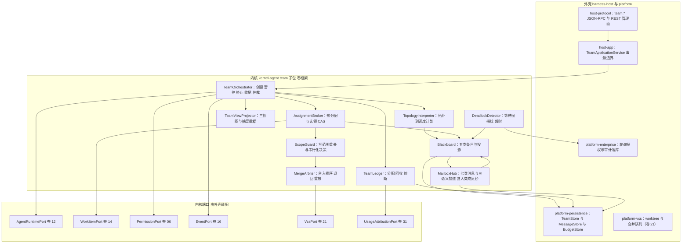
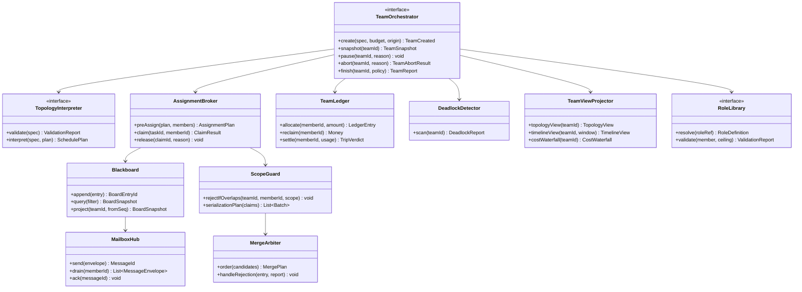
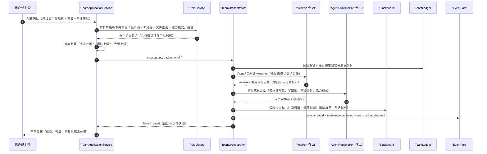
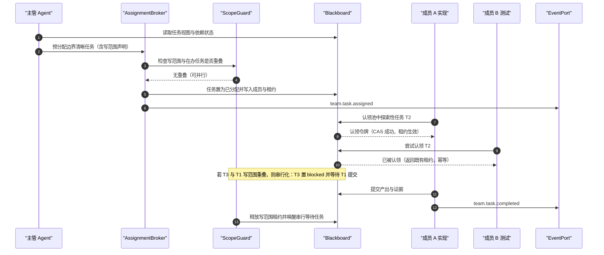
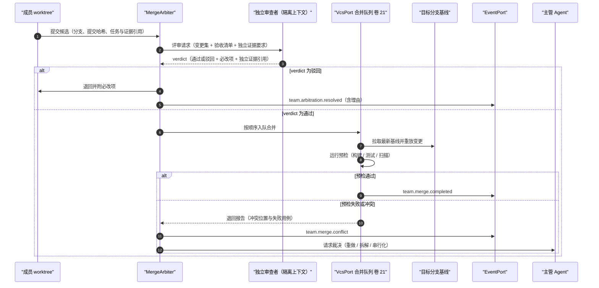
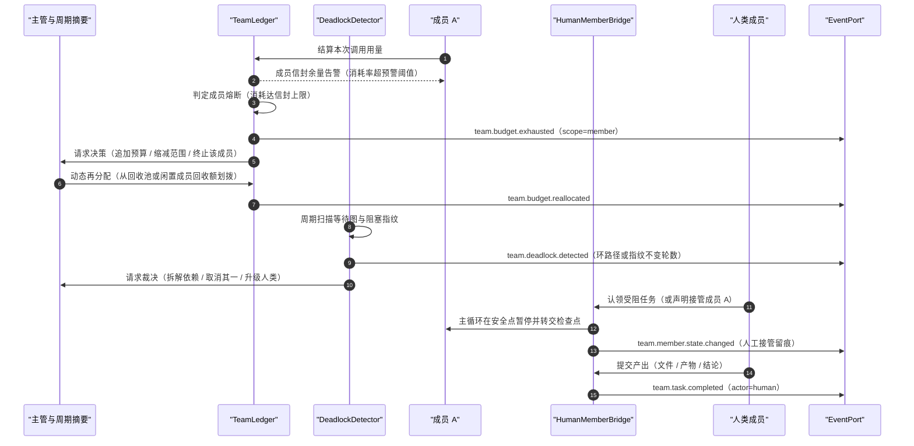
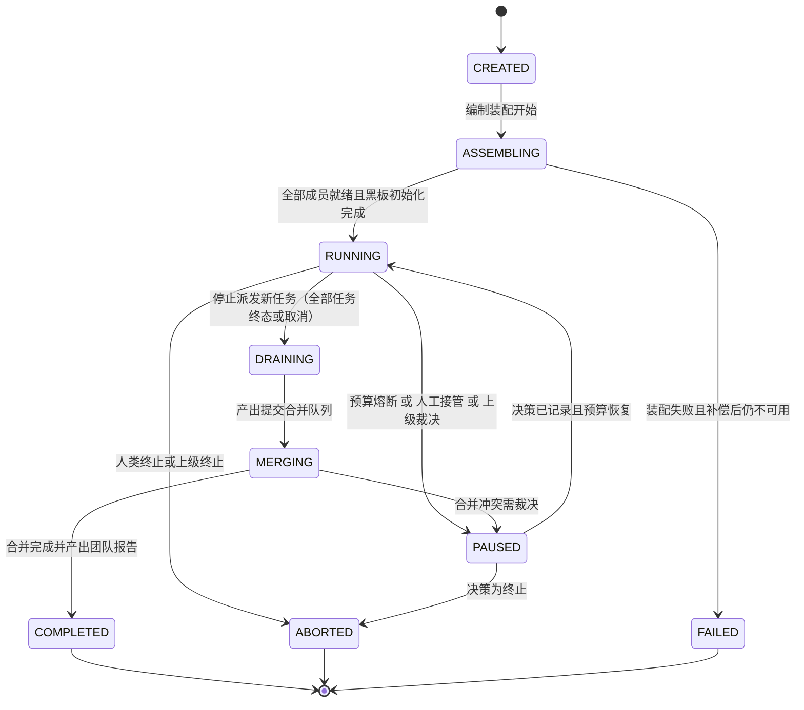
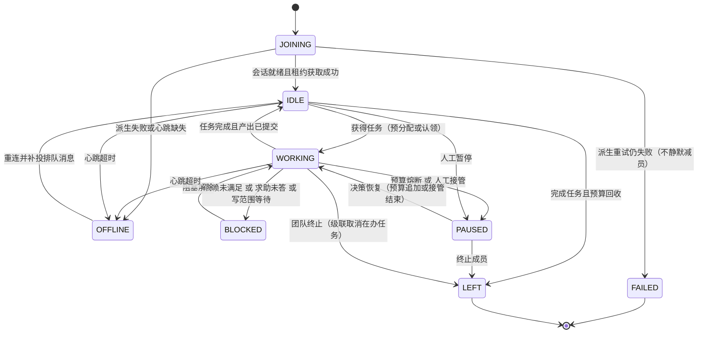
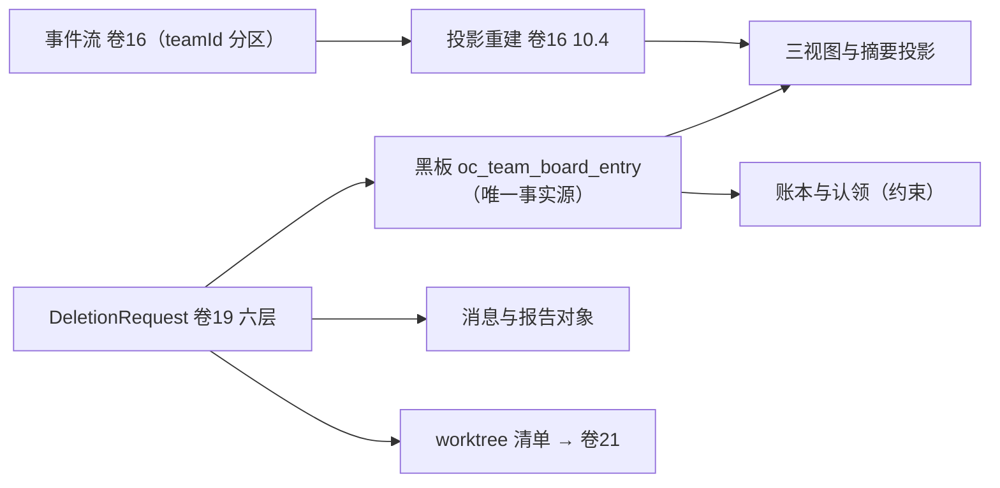

# 实现方案 13 · Agent Teams 与多智能体编排（Agent Teams Implementation）

> 本文件是 Phase B 实现层方案，对应 Phase A 卷 13（`docs/harness/13-agent-teams.md`）与全局决策 H-001 / H-004 / H-005 / H-006 / H-008 / H-011 / H-019；
> 上游契约不可修改，凡与卷 13 冲突或存在缺口之处在 §⑩.6 记录「反驳证据 + 建议修订」并登记 `I-TEAM-n`。
>
> 证据标记沿用 `00-research-plan.md` §2：`[E1]` 源码｜`[E2]` 官方文档｜`[E3]` 第三方｜`[E4]` 推断。
> 必须消化的台账行（`research/LESSONS-AND-ADOPTIONS.md` §6.4）：**L-010、L-038、L-039、L-041、L-043、L-078**。
> 实现落点：`harness-kernel/kernel-agent`（`team` 子包，编排主干与拓扑解释）+ `harness-host/host-app`（团队编排应用服务）+ `harness-host/host-protocol`（协议面）；隔离与合并的物理能力来自 `harness-platform/platform-vcs`（卷 21）。

---

## ① 实现目标与范围

### 1.1 本组件解决什么

把「一个 Agent 干活」升级为「一支可编制、可隔离、可观测、可熔断、可被人接管的团队」：

1. **编制与角色库**：按任务装配角色（实现者 / 测试者 / 审查者 / 安全审查者 / 性能专家 / 文档者 / 自定义）；角色 = 提示词角色引用 + 工具组 + 文件正则 + 能力模式 + 审批剖面；
2. **六类拓扑的解释执行**：并行扇出、主管-工作者、评审/辩论、竞标市场、流水线、自由市场，全部为**声明式数据**而非硬编码流程；
3. **分配与认领协议 + 黑板 + 七类消息**：黑板（计划 / 任务 / 证据 / 裁决 / 阻塞）是唯一事实源；消息是结构化、可寻址、可重放、可限额的补充通道；
4. **隔离与合并仲裁**：每成员独立 worktree + 写范围前置声明 + 合并队列串行 + 冲突退回，把冲突消灭在执行前；
5. **预算熔断与死锁检测**：团队总额 → 成员信封 → 动态回收 → 双层熔断；等待图环 + 阻塞指纹识别死锁与饥饿；
6. **人机混合与观测**：人类成员与 Agent 成员在事件与审计上同构；拓扑 / 时间线 / 成本瀑布三视图 + 主管周期摘要；
7. **对外接口**：向卷 12（SubAgent 原语）、卷 14（WorkItem）、卷 15（Goal 轮次）、卷 16（事件）、卷 21（worktree/合并队列）、卷 31（计量归因）提供稳定契约。

### 1.2 与 Phase A 的对应关系

| Phase A 决策 | 本文件落实位置 |
| --- | --- |
| D-TEAM-1 声明式编制 + 可组合角色库 | §③ D-TEAMI-1/D-TEAMI-8、§⑤ `RoleLibrary`、§⑧ `oc_team_role` |
| D-TEAM-2 拓扑可声明 + 混合编排 | §③ D-TEAMI-1、§⑤ `TopologySpec`、§⑥.1 |
| D-TEAM-3 中心分配 + 任务池认领 | §③ D-TEAMI-2、§⑥.2、§⑧ `oc_team_claim` |
| D-TEAM-4 三层通信 + 七类结构消息 | §③ D-TEAMI-5、§⑤ `MessageEnvelope`、§⑧.1 `oc_team_message` |
| D-TEAM-5 隔离优先 + 写范围声明 + 主管裁决 | §③ D-TEAMI-3、§⑥.2/§⑥.3、§⑧ `oc_team_merge_entry` |
| D-TEAM-6 团队总额 + 分配 + 回收 + 熔断 | §③ D-TEAMI-4、§⑥.4、§⑧ `oc_team_budget_ledger` |
| D-TEAM-7 三视图 + 主管摘要 | §③ D-TEAMI-7、§⑨.1 `team.view`、§⑩.5 |
| D-TEAM-8/9 人机混合 + 团队模板 | §⑤ `HumanMemberBridge`、§⑧ `oc_team_template`、§⑨.2 `/api/v1/team-templates` |
| D-TEAM-10 权限上限单调 + 责任链 + 审计 | §③ D-TEAMI-8、§⑩.4、§⑪.1 不变式断言 |
| D-TEAM-11 上级协调者 + 升级人类 + A2A | §⑤ `EscalationRouter`、§⑨.1 `team.escalate` |
| H-011 三层编排（SubAgent → Team → Peer） | §1.3 降级关系、§⑩.3 团队不可用时降级为 SubAgent |
| H-006 事件为源；卷 21 D-GIT-5 合并队列 | §⑧.3 事件清单；合并走 `platform-vcs` 队列，团队只做排序与退回 |

### 1.3 本组件不解决什么

- **不解决**单 Agent 主循环、回合、检查点（卷 12）：团队只调用 `AgentRuntimePort` 的「派生成员 / 提交输入 / 取消」三类原语；
- **不解决** WorkItem 本体与状态机（卷 14）：黑板上的任务是对 `oc_work_item` 的**团队作用域视图**，团队不复制任务状态；
- **不解决** worktree 与合并队列的物理实现（卷 21）：团队只做「写范围声明、串行化决策、合并排序与退回」；
- **不解决**跨实例对等协作（卷 23）与 Goal 自治判定（卷 15）：跨实例成员由 `RemoteMemberProviderSPI` 承载；团队可被 Goal 轮次驱动但不做 Goal 判定。

### 1.4 上下游依赖与模块落点

| 方向 | 依赖对象 | 接口 |
| --- | --- | --- |
| 上游 | Agent 运行时（卷 12） | `AgentRuntimePort.spawn / submit / cancel`；SubAgent 简报与汇报结构体 |
| 上游 | 任务系统（卷 14） | `WorkItemPort.requireById / transition / attachEvidence`；写范围与依赖从任务字段读取 |
| 上游 | 权限（卷 06）/ 事件（卷 16） | `PermissionPort.ceilingOf / modeOf`；`EventPort.append`（分区键 = `teamId`，团队内 `seq` 单调） |
| 上游 | 持久化（卷 19）/ VCS（卷 21）/ 计量（卷 31） | `TeamStore` 等端口；`VcsPort`；`UsageAttributionPort.attribute(teamId, memberId, taskId)` |
| 下游 | Goal（卷 15）、端与交互（卷 22/33）、评测（卷 26） | Goal 轮次驱动团队；三视图 WS 帧与人工认领入口；团队轨迹导出与回放 |

| 内容 | 模块落点 | 说明 |
| --- | --- | --- |
| `TeamSpec` / `TopologySpec` / `RoleDefinition` / `MessageEnvelope` / `TeamReport` / 各 SPI | `harness-contract`（`team` 包） | 纯契约，零 Spring、零 IO |
| `TeamOrchestrator` / `TopologyInterpreter` / `AssignmentBroker` / `Blackboard` / `MailboxHub` / `TeamLedger` / `ScopeGuard` / `MergeArbiter` / `DeadlockDetector` | `harness-kernel/kernel-agent`（`team` 子包） | 编排主干，纯内存模型 + 端口调用 |
| 团队持久化；worktree 与合并执行；编排应用服务；协议面 | `platform-persistence` / `platform-vcs` / `host-app` / `host-protocol` | 写路径 `@Transactional` 在 `host-app`；内核不开启事务 |

**分层纪律**：`kernel-agent/team` 不得依赖 Spring / Jackson / JDBC / HTTP 客户端（卷 27 R1）；三视图只做**投影计算**，渲染在端。

### 落地核对（R07：模块 / 顺序 / 批次 / 门禁 / I-* 落点）

- **模块（卷 27 §4.1 权威名，全路径）**：`harness-contract`（`contract/team`）+ `harness-kernel/kernel-agent`（`team` 子包）+ `harness-platform/platform-persistence`（团队表与消息）+ `harness-platform/platform-vcs`（worktree 与合并队列）+ `harness-host/host-app`（编排应用服务，事务边界）+ `harness-host/host-protocol`（三视图 WS 帧）。`harness-core` 为别名，禁作路径。
- **实施顺序（卷 27 §4.5）**：第 19 步「Teams + Goal + Schedule」，依赖第 14 步（任务/计划：团队任务池与证据）、第 16 步（记忆/知识：角色上下文）、第 18 步（插件：自定义节点策略与角色库分发）。**物理前置**：隔离与合并依赖第 13 步（Git + worktree + 合并队列），故 13 的最早可集成点是第 13 步完成后（并行开始，第 19 步收口）。
- **数据批次（卷 27 §4.4）**：`oc_team`、`oc_team_member`、`oc_team_role`、`oc_team_message`、`oc_team_board_entry`、`oc_team_claim`、`oc_team_arbitration`、`oc_team_merge_entry`、`oc_team_report`、`oc_team_template` → **B4**（工作对象 + 团队 + 调度记录）；`oc_team_budget_ledger` → **B4/B6 边界**（团队账本随 B4，企业配额汇总随 B6），已登记为 X 修订项（见 `reviews/R07-scope-build-kernel.md`）。
- **门禁映射（卷 27 §4.6）**：`kernel-agent` 团队单测（不变式断言）→ 「单元测试 + 覆盖率门」；PG/Redis 与临时 Git 仓集成 → 「集成测试」；worktree 与合并队列 → 「集成测试」；`team.*` 协议契约 → 「契约测试」；死锁/权限差集断言 → 「安全红队（增量用例）」。
- **I-* 落点**：I-TEAM-1 → `harness-contract`（`TopologySpec`）+ `kernel-agent`（`TopologyInterpreter` + 节点策略注册）；I-TEAM-2 → `kernel-agent`（`AssignmentBroker`）+ `platform-persistence`（`oc_team_claim` CAS）；I-TEAM-3 → `platform-vcs`（worktree + `MergeArbiter` 合并队列）；I-TEAM-4 → `kernel-agent`（`TeamLedger` 双层熔断）+ `platform-persistence`（`oc_team_budget_ledger`）；I-TEAM-5 → `kernel-agent`（`Blackboard`/`MailboxHub`）+ `platform-persistence`（`oc_team_message`）；I-TEAM-6 → `kernel-agent`（`DeadlockDetector` 等待图）；I-TEAM-7 → `host-app`（三视图投影）+ `host-protocol`（差量推送）；I-TEAM-8 → `kernel-agent`（`ScopeGuard` 差集断言）+ `kernel-permission`（审批剖面校验）。

### 1.5 依赖的修订建议与阻塞项

- **阻塞项（须先裁决）**：`LESSONS-AND-ADOPTIONS.md` §5 的 `D-AG-4 / D-AG-5` 修订建议要求「子代理能力模式由 Agent 定义声明且模型不可自选 + 子 ≤ 父 deny 差集不变量」。本文件按该建议落地（REQ-TEAM-12/13），**标注依赖修订 X**：若裁决改为「能力模式可配置」，`CapabilityMode` 仍保留为只减不增的封顶字段，禁止由 spawn 参数或模型设定。
- **缺口（增量，不阻塞）**：卷 13 §6 未列死锁/饥饿检测机制与事件 → 本文件补 REQ-TEAM-16 与 `team.deadlock.detected`；§4.4 未定义消息投递语义与在途配额 → 补三语义与配额（REQ-TEAM-05，L-041）。

---

## ② 功能需求清单（REQ-TEAM-n）

| REQ | 需求描述 | 来源 | 优先级 | 验收要点 |
| --- | --- | --- | --- | --- |
| REQ-TEAM-01 | 声明式编制 + 可组合角色库：角色 = 提示词角色 + 工具组 + 文件正则 + 能力模式 + 审批剖面；内置/组织/项目三级来源与版本化 | 卷 13 D-TEAM-1、§4.1；L-010 `[E1]`（`research/competitors/09-secondary-tier.md` §⑤ S4 roo `ModeConfig.groups`） | P0 | 同目标换角色库产出不同编制；角色版本可回滚 |
| REQ-TEAM-02 | 六类拓扑（扇出 / 主管 / 评审 / 竞标 / 流水线 / 自由市场）可声明、可混合、可校验（含环拒绝） | 卷 13 D-TEAM-2、§3 拓扑表 | P0 | 六拓扑各一条端到端用例；混合拓扑（主管 + 扇出 + 高风险辩论）一条 |
| REQ-TEAM-03 | 分配协议：主管分配边界清晰任务 + 任务池认领（条件写 + 租约 + 写范围声明）；认领登记防重复 | 卷 13 D-TEAM-3；Claude Code 任务目录 + `claimTask` `[E1]`（`01-claude-code-purpose-built.md` §4.10） | P0 | 并发认领仅一人成功；重复认领返回既有租约（幂等） |
| REQ-TEAM-04 | 黑板为唯一事实源：计划 / 任务 / 证据 / 裁决 / 阻塞五类条目；读模型由事件投影；禁成员私有任务账本 | 卷 13 D-TEAM-4、§4.1；deepseek agent-team「共享任务板 + 持久 mailbox」`[E1]`（`04-deepseek-harness.md` §4.9） | P0 | 主管崩溃后仅凭黑板恢复调度；黑板与事件重放一致 |
| REQ-TEAM-05 | 七类结构消息 + 三语义投递（steer / queue / interject）+ 每 sender-target 在途配额 | 卷 13 D-TEAM-4、§4.4；L-041 `[E1]`（`09-secondary-tier.md` §⑤ S13 goose `subagent_handler.rs`） | P0 | 结构校验拒绝自由文本载荷；配额打满按语义降级并记录；掉线重连收到排队消息 |
| REQ-TEAM-06 | worktree 隔离 + 写范围前置 + 重叠串行化 + 合并队列串行 + 冲突退回（不强行覆盖） | 卷 13 D-TEAM-5、§4.3；卷 21 D-GIT-5 | P0 | 同文件并行任务被串行化；冲突产生退回报告并可重放 |
| REQ-TEAM-07 | 预算：团队总额 + 成员分配 + 完成/闲置回收 + 单成员熔断（暂停请求决策）+ 团队熔断（整体暂停汇报） | 卷 13 D-TEAM-6、§4.5 | P0 | 单成员超限不影响他人；团队超限整体暂停并产出汇报 |
| REQ-TEAM-08 | 三视图（拓扑 / 时间线 / 成本瀑布）+ 主管周期摘要 | 卷 13 D-TEAM-7、§4.5 | P0 | 三视图由服务端投影提供；摘要在 N 分钟内产出且可中止 |
| REQ-TEAM-09 | 人机混合：人类成员可认领、提交产出、裁决、接管；人类任务有 SLA 与超时转派 | 卷 13 D-TEAM-8、§4.6 | P0 | 人类任务在事件与审计中与 Agent 同构；接管期间成员冻结 |
| REQ-TEAM-10 | 团队模板（编制 + 拓扑 + 预算 + 角色库 + 验收策略）可版本化、可组织共享、可从成功运行提炼 | 卷 13 D-TEAM-9 | P1 | 同模板在另一仓库跑通；提炼模板含引用角色版本 |
| REQ-TEAM-11 | 权限上限单调（成员 ⊆ 团队 ⊆ 会话）+ 责任链（任务 → 成员 → 人类委托者）+ 团队级审计 | 卷 13 D-TEAM-10、§7；L-039 `[E1]`（`02-opencode.md` §4.8 `subagent-permissions.ts:20-27`） | P0 | 越权尝试被拒并留痕；启动期不变式断言通过 |
| REQ-TEAM-12 | 能力模式（read-only / read-write / execute / all）由**角色定义**声明，spawn 参数与模型不可自选；缺失能力响亮拒绝 | L-038 `[E2]`、`04-deepseek-harness.md` §4.9 `SubagentError('UNSUPPORTED_CAPABILITY')` `[E1]`；卷 12 D-AG-13 | P0 | 模型请求提权被拒；能力缺失返回 `UNSUPPORTED_CAPABILITY` 且不静默降级 |
| REQ-TEAM-13 | 权限差集不变量：成员会话权限 = 父的 deny 集合 + 外部目录规则 + 默认补丁（新增能力默认 deny、显式声明解除） | L-039 `[E1]`（`02-opencode.md` §4.8 走读） | P0 | 断言 `MemberPerms ⊆ ParentDenySet` 在派生与继承两处均成立 |
| REQ-TEAM-14 | 角色审批剖面：动作类别 × 越工作区 × 受保护文件开关 + 命令白/黑名单 + ask/deny 分离；剖面打包分发并做组合合法性校验 | L-010 `[E1]`（`09-secondary-tier.md` §⑤ S4 自动批准矩阵）、L-078 `[E1]`（Roo `ModeConfig.groups`） | P1 | 20+ 设置项收敛为剖面；非法组合（如 execute + 受保护文件可写）装配期拒绝 |
| REQ-TEAM-15 | 汇报独立验证：verifier 不得与被验证成员共享上下文；`verdict` 必须含独立证据引用，否则任务不可置 `done` | L-043 `[E1]`（`04-deepseek-harness.md` §4.9 ralph「报告不被独立验证」为反面教材） | P0 | 自证 `verdict` 被拒；verifier 上下文隔离用例 |
| REQ-TEAM-16 | 死锁与饥饿检测：等待图环 + 阻塞指纹周期扫描 + 超时兜底；检出后主管裁决或升级人类 | 卷 13 §7 可靠性 + 本文件增量 | P0 | 构造环等待被检出；指纹稳定 N 轮触发暂停而非空转 |
| REQ-TEAM-17 | 跨团队协调与升级：上级协调者裁决跨团队冲突；升级人类；跨实例团队走 A2A（卷 23） | 卷 13 D-TEAM-11 | P2 | 两团队争同一目标分支时由协调者裁决并留痕 |
| REQ-TEAM-18 | 编排脚本化（受限）：拓扑节点可携带受限指令序列（调用成员 / 并行 / 流水线 / 记录阶段），**不作为代码求值**，子调用重入完整受守卫管线 | deepseek `workflow` 工具（脚本编排 + 子调用重入受守卫管线 + 父回合只见最终结果）`[E1]`（`04-deepseek-harness.md` §4.9） | P1 | 脚本越界（文件/网络）被拒；子调用权限与审计不旁路 |

**竞品增量需求说明**：REQ-TEAM-03/04/05/12/13/14/15/18 来源于竞品源码事实（`[E1]`/`[E2]`），是 Phase A 未下沉到机制层的实现级需求，已在 §③ 各自登记 `I-TEAM-n`。

---

## ③ 技术方案选型（M×N 比选）

评分沿用 `README.md` §4：**F 30% / U 20% / S 25% / M 25%**。每条被采纳/适配的台账行（L-010/038/039/041/043/078）均以候选分支形式参与评分。

### D-TEAMI-1 编排引擎形态

| 分支 | 描述 | F | U | S | M | 加权 | 结论 |
| --- | --- | --- | --- | --- | --- | --- | --- |
| B1 | 每类拓扑一个硬编码状态机（六份实现） | 8 | 7 | 6 | 7 | 70.5 | 淘汰（新增拓扑即改主干） |
| B2 | **拓扑即数据：`TopologySpec` + 解释器 + 节点策略插件** | 9 | 8 | 9 | 9 | 88.0 | **选定** |
| B3 | 脚本化编排（deepseek `workflow`：模型写脚本 + `agent()/parallel()`）`[E1]` | 8 | 6 | 6 | 7 | 68.0 | 吸收为受限指令序列节点（REQ-TEAM-18），不作自由脚本 |

**选定 B2**：拓扑声明化使「六类 + 混合」在同一主干上可验收（卷 13 §8 DoD 第 1 条）；B3 的收益以**受限 DSL** 吸收——节点动作是枚举化指令，禁止图灵完备，子调用复用同一权限与审计管线。

### D-TEAMI-2 分配载体

| 分支 | 描述 | F | U | S | M | 加权 | 结论 |
| --- | --- | --- | --- | --- | --- | --- | --- |
| B1 | 纯中心队列（主管逐个派发） | 8 | 7 | 8 | 7 | 75.5 | 淘汰（主管瓶颈、成员空转） |
| B2 | **黑板任务池 + 认领 CAS + 主管预分配** | 8 | 8 | 8 | 8 | 80.0 | **选定** |
| B3 | 纯竞标市场（出价 → 择优） | 7 | 6 | 6 | 6 | 63.5 | 保留为竞标拓扑内的模式（`market-max-bids`），非默认 |

**选定 B2**（对齐 D-TEAM-3）：边界清晰任务由主管指定（可解释、可追责），探索性任务进池认领（负载自平衡）；认领必须是**条件写 + 行数校验**（`claim_if_ready`），禁止「先查后写」。

### D-TEAMI-3 隔离与合并

| 分支 | 描述 | F | U | S | M | 加权 | 结论 |
| --- | --- | --- | --- | --- | --- | --- | --- |
| B1 | 共享工作区 + 事后合并 | 7 | 6 | 6 | 7 | 65.0 | 淘汰（丢改动风险不可接受） |
| B2 | **隔离优先：独立 worktree + 写范围前置 + 合并队列串行 + 冲突退回** | 9 | 8 | 9 | 9 | 88.0 | **选定** |
| B3 | 全局文件锁（粗粒度） | 7 | 7 | 9 | 8 | 77.0 | 降级兜底（无 Git 时启用，串行 + 显式提示） |

**选定 B2**：与卷 21 D-GIT-5 共用同一合并队列（预检失败即退回并附报告）；B3 仅作 `platform-vcs` 不可用时的降级路径（§⑩.3）。

### D-TEAMI-4 预算治理位置

| 分支 | 描述 | F | U | S | M | 加权 | 结论 |
| --- | --- | --- | --- | --- | --- | --- | --- |
| B1 | 仅会话级预算（团队共享一个信封） | 7 | 6 | 8 | 7 | 70.0 | 淘汰（单成员可耗尽全队） |
| B2 | **团队账本 + 成员信封 + 双层熔断** | 9 | 8 | 8 | 9 | 85.5 | **选定** |
| B3 | 事后告警（无硬约束） | 5 | 7 | 9 | 8 | 71.0 | 淘汰（成本不可控） |

**选定 B2**（对齐 D-TEAM-6）：记账在**调用结算点**（卷 31 归因），信封扣减在网关侧；差异回冲复用卷 12 `I-AG-7` 双信封思路。

### D-TEAMI-5 消息与邮箱

| 分支 | 描述 | F | U | S | M | 加权 | 结论 |
| --- | --- | --- | --- | --- | --- | --- | --- |
| B1 | 全联通消息（无结构约束） | 6 | 5 | 5 | 6 | 55.0 | 淘汰（消息风暴、不可审计） |
| B2 | **黑板 + 持久邮箱：三语义 + 在途配额 + 结构校验** | 9 | 8 | 9 | 8 | 86.0 | **选定** |
| B3 | 仅黑板（无消息） | 7 | 6 | 9 | 8 | 75.5 | 淘汰（无法协商与求助） |

**选定 B2**：消息是**补充通道**，事实仍在黑板；三语义沿用 L-041：`INTERJECT`（立即打断，仅限人类与主管）、`STEER`（安全点生效）、`QUEUE`（排队）；掉线重连按邮箱顺序补投（对齐 deepseek agent-team `[E1]`）。

### D-TEAMI-6 死锁与饥饿检测

| 分支 | 描述 | F | U | S | M | 加权 | 结论 |
| --- | --- | --- | --- | --- | --- | --- | --- |
| B1 | 纯超时兜底（等待超 N 分钟即升级） | 6 | 7 | 8 | 8 | 71.0 | 基线（保留为最后一道） |
| B2 | **等待图环检测 + 阻塞指纹 + 超时兜底三层** | 8 | 8 | 8 | 8 | 80.0 | **选定** |
| B3 | 人工巡检（依赖观测者发现） | 5 | 7 | 9 | 8 | 71.0 | 淘汰（无人值守必卡死） |

**选定 B2**：与卷 15「空转指纹自动暂停」同构（L-044 思想迁移：连续 N 轮指纹不变即判定死锁并暂停请求裁决）；扫描低频执行（`deadlock-scan-interval-seconds`），不在成员热路径。

### D-TEAMI-7 观测投影

| 分支 | 描述 | F | U | S | M | 加权 | 结论 |
| --- | --- | --- | --- | --- | --- | --- | --- |
| B1 | 仅事件流（端自行聚合） | 7 | 6 | 8 | 6 | 67.5 | 淘汰（多端重复实现、口径漂移） |
| B2 | **服务端投影三视图 + 摘要生成 + 差量推送** | 9 | 9 | 8 | 8 | 85.0 | **选定** |
| B3 | 轮询查询（无推送） | 6 | 6 | 9 | 8 | 71.0 | 仅作离线/回放兜底 |

**选定 B2**：投影是纯函数（事件 + 黑板 → 视图快照），可离线重放校验；摘要生成是**可中止的异步任务**，失败降级为统计摘要。

### D-TEAMI-8 角色权限承载

| 分支 | 描述 | F | U | S | M | 加权 | 结论 |
| --- | --- | --- | --- | --- | --- | --- | --- |
| B1 | 成员继承会话权限（无团队层） | 6 | 6 | 7 | 6 | 62.0 | 淘汰（成员放大风险） |
| B2 | **能力模式声明 + 权限封顶（成员 ⊆ 团队 ⊆ 会话）+ 差集断言 + 审批剖面** | 9 | 7 | 9 | 9 | 86.5 | **选定** |
| B3 | 团队统一权限（全成员同权） | 6 | 7 | 8 | 8 | 71.0 | 淘汰（违背最小权限） |

**选定 B2**（对齐 D-TEAM-10 + L-038/039/078）：能力模式写在**角色定义**里，随角色版本冻结；差集断言在「角色装配、成员派生、成员继承」三处各执行一次，命中违规即拒绝装配并产出 `team.permission.denied`。

### 3.2 实现级决策登记（I-TEAM-n）

| ID | 主题 | 选定 | 理由与代价 | 回退触发 |
| --- | --- | --- | --- | --- |
| I-TEAM-1 | 编排引擎 | 拓扑即数据（规格 + 解释器 + 节点策略）；受限指令序列吸收 workflow 形态 | 新增拓扑零主干改动；代价是解释层需处理组合校验与环检测 | 混合拓扑表达不足 → 该拓扑注册自定义节点策略（仍走同一事件契约） |
| I-TEAM-2 | 分配 | 主管预分配 + 任务池认领 CAS（租约制） | 可解释 + 负载均衡；代价是认领竞争需重试语义 | 认领冲突率 > 20% → 提高预分配占比或引入分区排队 |
| I-TEAM-3 | 隔离 | 隔离优先 + 写范围前置 + 合并队列；无 Git 时降级全局互斥 | 冲突消灭在执行前；代价是磁盘与创建时延 | worktree 创建 P95 > 5s 或磁盘超水位 → 切 `ON_DEMAND` 并限量并发成员 |
| I-TEAM-4 | 预算 | 团队账本 + 成员信封 + 双层熔断，记账在调用结算点 | 单成员不可能耗尽全队；代价是回冲与对账 | 回冲偏差 > 2% → 提高信封预留比例并缩短结算窗口 |
| I-TEAM-5 | 消息 | 黑板事实源 + 持久邮箱三语义 + 在途配额 | 可审计、防风暴、掉线可补投；代价是语义优先级硬编码 | `QUEUE` 时延超阈值且空转率 > 30% → 提高 `STEER` 占比（仍走安全点） |
| I-TEAM-6 | 死锁 | 等待图环 + 阻塞指纹 + 超时三层 | 无人值守可自愈；代价是扫描开销与误报暂停 | 误报 > 5% → 指纹窗口加长或降级为「只告警不暂停」 |
| I-TEAM-7 | 观测 | 服务端三视图投影 + 差量推送 + 摘要异步生成 | 多端口径一致、可重放；代价是投影维护成本 | 推送带宽超预算 → 降帧频并改为按需拉取 |
| I-TEAM-8 | 权限 | 能力模式由角色声明 + 权限封顶 + 差集断言 + 审批剖面组合校验 | 消除静默提权路径；代价是角色定义更复杂 | 断言误伤正常装配 → 收紧差集定义（不改「只减不增」原则） |

**与竞品对照的取舍**：多智能体编排在九组竞品中呈三种形态——① 子代理委派 + 工具白名单 `[E2]`（`research/competitors/01-claude-code-purpose-built.md`）；② Roo 系「模式配置」：角色 = 提示词 + 工具组 + 文件正则（`research/competitors/09-secondary-tier.md` §⑤ S4 `ModeConfig.groups`，L-010）；③ 通用流程框架的「工作流即数据」形态。**取舍**：不引入独立编排 DSL 运行时（成本高、与事件/权限两套内核重复），改为「拓扑即数据 + 解释器 + 节点策略」，直接复用黑板与权限封顶，新增拓扑零主干改动；吸收 Roo 的「角色 = 五元组」（REQ-TEAM-01），但把其可配置的能力模式改为**只减不增的封顶字段**（I-TEAM-8，L-038：竞品的模型自选能力模式是提权面，反证输入）。

---

## ④ 总体架构图



**内核/外壳边界**：内核只持有团队状态机与纯函数投影，全部 IO（Store / Vcs / 事件落库 / 授权查询）经端口；`host-bootstrap` 按装配计划注入端口实现（进程内嵌档复用同一装配）；团队写路径的事务边界在 `host-app`。

---

## ⑤ 类图与关键契约



### 5.1 关键 Java 21 签名（内核契约，零框架依赖）

```java
/**
 * 团队编排器：团队生命周期的唯一入口。
 * 负责编制装配、拓扑驱动、成员派发与收尾汇总；实现必须保证「黑板是唯一事实源」，
 * 且任何对外可见的成员状态都可由团队事件流重建。
 */
public interface TeamOrchestrator {

    /**
     * 创建团队并完成编制装配（角色解析 → 成员创建 → 工作区隔离 → 预算分配）。
     *
     * @param spec   团队规格（编制、拓扑、角色引用；必填，引用的角色必须存在于角色库）
     * @param budget 团队预算信封（必填，总额为正；成员配额按 TeamBudgetPolicySPI 切分）
     * @param origin 创建来源（人类 / 主管 Agent / 上级团队；用于责任链与审计）
     * @return 团队标识与初始快照
     * @throws HarnessException 角色不存在、编制组合非法、预算不足或工作区不可用时抛出
     */
    TeamCreated create(TeamSpec spec, BudgetEnvelope budget, TeamOrigin origin);

    /**
     * 查询团队快照（拓扑视图数据源，含成员状态、当前任务、阻塞清单与预算余量）。
     *
     * @param teamId 团队标识（必填）
     * @return 团队快照；团队不存在时抛业务异常而非返回 null
     * @throws HarnessException 团队不存在或调用方无可见权限时抛出
     */
    TeamSnapshot snapshot(TeamId teamId);

    /** 暂停团队（预算熔断、人工接管或上级裁决触发）：进行中的成员在安全点暂停并保留检查点。 */
    void pause(TeamId teamId, PauseReason reason);

    /** 终止团队：级联取消成员、回收预算、按策略处置各自工作区（默认保留分支供审计）。 */
    TeamAbortResult abort(TeamId teamId, AbortReason reason);

    /** 收尾：把成员产出按合并策略提交合并队列，并产出团队报告（证据 / 成本 / 未决项）。 */
    TeamReport finish(TeamId teamId, FinishPolicy policy);
}

/**
 * 拓扑解释器：把声明式拓扑规格解释为可执行调度计划。
 * 拓扑是数据而非代码：新增拓扑只需扩展 TopologySpec 与节点策略，禁止改动编排主干。
 */
public interface TopologyInterpreter {

    /** 校验拓扑规格（节点、边、角色引用、汇聚策略、并行窗口）；边集必须构成 DAG。 */
    ValidationReport validate(TopologySpec spec);

    /**
     * 生成初始调度计划。
     *
     * @param spec 拓扑规格（必填；须先通过 validate）
     * @param plan 计划引用（卷 14 的 Plan；节点需映射到计划内任务）
     * @return 调度计划（节点执行顺序、并行窗口、汇聚点与裁决点）
     * @throws HarnessException 拓扑含环、节点与计划任务不匹配、或并行窗口超过成员上限时抛出
     */
    SchedulePlan interpret(TopologySpec spec, PlanRef plan);
}

/**
 * 团队账本：预算分配、回收、结算与熔断判定的唯一记账点。
 * 所有金额使用最小货币单位整数，禁止浮点；记账与事件同事务。
 */
public interface TeamLedger {

    /**
     * 向成员分配预算（创建或追加信封）。
     *
     * @param memberId 成员标识（必填，须属于该团队）
     * @param amount   分配金额（必填，正数；不得超过团队剩余额）
     * @return 账本条目（含分配后余额）
     * @throws HarnessException 金额非法或团队余额不足时抛出
     */
    LedgerEntry allocate(MemberId memberId, Money amount);

    /** 回收成员剩余预算回团队池（成员完成或闲置超时触发；回收额可为 0 但不为负）。 */
    Money reclaim(MemberId memberId);

    /** 结算一次调用消耗；@return 熔断判定（含是否触发成员级熔断）。 */
    TripVerdict settle(MemberId memberId, UsageAttribution usage);
}
```

**枚举与封印类型（`harness-contract`；均含 `code` + `desc` 与 `of(String)` 工厂，`code` 存库、`desc` 仅展示）**：

```java
/** 七类结构消息：禁止自由文本泛滥，载荷按类型收敛。 */
public enum TeamMessageType {
    HANDOFF("HANDOFF", "交接"), QUESTION("QUESTION", "求助"), BLOCKER("BLOCKER", "阻塞"),
    PROPOSAL("PROPOSAL", "方案提议"), REVIEW_REQUEST("REVIEW_REQUEST", "评审请求"),
    VERDICT("VERDICT", "裁决"), BUDGET_ALERT("BUDGET_ALERT", "预算告警");
}

/** 消息投递语义：INTERJECT 仅人类与主管可用且须经权限判定。 */
public enum DeliverySemantic {
    INTERJECT("INTERJECT", "立即打断"), STEER("STEER", "安全点生效"), QUEUE("QUEUE", "排队");
}

/** 成员能力模式：由角色定义声明，spawn 参数与模型不可自选（L-038），只减不增。 */
public enum CapabilityMode {
    READ_ONLY("READ_ONLY", "只读"), READ_WRITE("READ_WRITE", "读写"),
    EXECUTE("EXECUTE", "可执行"), ALL("ALL", "全能力");
}

// 六个拓扑 record（FanOut / Supervisor / Review / Pipeline / Market / FreeMarket）均为同包（contract.team）
// **各自独立编译单元**；本示例展示 3 个，另 3 个形态同上。显式 `permits` 全列出六者（禁止跨包/跨模块新增实现）。
/** 六类拓扑的声明式表达；`MarketTopology` / `PipelineTopology` / `FreeMarketTopology` 形态同上，此处从略。 */
public sealed interface TopologySpec
        permits FanOutTopology, SupervisorTopology, ReviewTopology,
                PipelineTopology, MarketTopology, FreeMarketTopology {

    /** 拓扑种类标识，用于投影与指标分面。 */
    TopologyKind kind();
}

/** 并行扇出：同质任务并行，汇聚点合并产出。 */
public record FanOutTopology(PlanRef plan, WriteScopeMerge merge, int maxParallel) implements TopologySpec { }

/** 主管-工作者：主管分解与分派，工作者执行并回报。 */
public record SupervisorTopology(MemberId leader, PlanRef plan, AssignmentStrategy strategy) implements TopologySpec { }

/** 评审/辩论：关键节点由多个评审者互评，达到法定票数方可推进。 */
public record ReviewTopology(PlanRef plan, MemberId subject, List<MemberId> reviewers, int quorum) implements TopologySpec { }
```

**异常与编码约定（本文件全部示例遵循 `.qoder/rules/`）**：异常按层分工——**内核与契约侧（`harness-kernel` / `harness-contract`，零框架）统一抛 `HarnessException` 并携带 `ErrorCode`**；**外壳侧（`harness-platform` / `harness-host`，Spring）统一抛 `BusinessException`（同携带 `ErrorCode`）**，由外壳全局异常处理器按 `ErrorCode` 映射为统一错误响应（错误模型见附录 B §B.7）；**禁止裸抛 `RuntimeException` / `IllegalArgumentException`**（`AiException` 仅用于模型/适配层）。常量类 `final` + 私有构造；阈值一律进 `TeamProperties`（§⑨.3）；写路径 `@Transactional(rollbackFor = Exception.class)`；外部调用（Vcs / HTTP / SDK）一律移出事务，经 `AFTER_COMMIT` 事件异步触发；`MemberType`（AGENT/HUMAN）与其余拓扑 record 同属契约包，形态一致不再展开。

---

## ⑥ 核心流程时序图

### 6.1 团队创建与编制装配

**前置条件**：会话存在且具备团队创建权限；`TeamSpec` 合法；目标工作区可写。**主路径**：校验角色 → 切分预算 → 预创建 worktree（或按需）→ 成员派生 → 黑板初始化 → 事件与摘要。
**异常与补偿**：角色/组合校验失败 → 拒绝创建（不产生成员与 worktree）；成员派生部分失败 → 回收已派生成员与其 worktree，团队保持 `CREATED` 并请求决策。**幂等与并发点**：`idempotencyKey` 唯一约束去重。



### 6.2 任务分配、认领与写范围串行化

**前置条件**：黑板已有任务视图；目标任务处于 `ready` 且依赖满足；成员空闲（含人类成员）。**主路径**：主管预分配边界清晰任务；探索性任务进池由成员认领（条件写 + 租约）；写范围重叠则串行化或拆分。
**异常与补偿**：认领失败（已被认领）→ 业务异常提示刷新（幂等：重复认领返回既有租约）；写范围重叠 → 交由主管裁决（拆分或排队），不静默抢占。**幂等与并发点**：`claim_if_ready` 条件更新，更新行数必须为 1；租约到期由心跳与死锁扫描回收。



### 6.3 提交、评审与合并仲裁

**前置条件**：成员任务完成并附证据；写范围租约有效；目标分支受护栏保护（卷 21）。**主路径**：独立审查 → 高风险节点辩论 → 合入排序 → 拉取基线重放 → 预检 → 合并完成。
**异常与补偿**：预检失败 → 退回并附报告（成员重做或主管重排）；语义冲突（设计决策冲突）→ 主管裁决并记录理由；禁止强行覆盖。**幂等与并发点**：合并队列按仓库串行（`RedisKeys.lock(Module.TEAM, "merge", repoId)`）；同一提交以 `commitSha` 去重。



### 6.4 预算熔断、死锁检测与人机接管

**前置条件**：团队处于 `RUNNING`；账本持续结算；人类成员在编制内或已声明为值日接管者。**主路径**：结算 → 成员熔断（暂停并请求决策）→ 主管再分配或升级；死锁扫描命中 → 暂停并请求裁决；人类接管 → 关联成员在安全点暂停。
**异常与补偿**：账本结算失败 → 冻结该成员（fail-closed，不允许继续消耗）；摘要生成失败 → 降级为统计摘要；人类 SLA 超时 → 提醒或转派 Agent。**幂等与并发点**：熔断判定按成员串行（`RedisKeys.lock(Module.TEAM, "trip", memberId)`）；接管加锁，同一成员同时仅一个接管者。



---

## ⑦ 状态机

### 7.1 团队生命周期



**规则**：每次迁移写入事件（含操作者、理由、当时预算余量）；`COMPLETED` 必须附团队报告与合并结果；`ABORTED` 默认保留 worktree 分支供审计（清理策略可配）。

### 7.2 成员状态机



**级联取消路径**：团队进入 `ABORTED` 时，任意非终态成员按「取消在办任务 → 回收预算 → 释放/保留 worktree → 置 `LEFT`」强制收敛；未达安全点的在途消息标记 `DROPPED`（持久邮箱保留审计）。**超时路径**：心跳缺失 ≥2 个周期判 `OFFLINE`（认领租约不立即抢占，等到期回收，避免抖动）；重连重试超上限（默认 3 次）后 `OFFLINE → LEFT` 并交回收任务。

**成员迁移补全矩阵（触发 / 守卫 / 副作用）**：

| 迁移 | 触发 | 守卫 | 副作用 |
| --- | --- | --- | --- |
| `OFFLINE → LEFT` | 重连重试超上限，或 `DRAINING` 结束后仍未回归 | 无在途任务（有则先回 `ready`） | 预算回收、`team.member.left`、worktree 交回收任务 |
| `WORKING → OFFLINE` | 心跳缺失 ≥2 周期 | — | 认领租约保留至到期；`team.member.offline`（非抢占式回收） |
| `BLOCKED → OFFLINE` | 心跳缺失且阻塞点无事件推进 | — | 死锁扫描将该环等待标记为「可打破」（超时兜底） |
| `PAUSED → OFFLINE` | 暂停期间进程崩溃 | — | 检查点保留；恢复时走 `OFFLINE → IDLE` 重连补投 |
| `任意非终态 → LEFT` | 团队 `ABORTED`（级联取消） | 人类或上级权限 | 取消在办任务、回收预算、分支保留供审计；消息 `DROPPED` |
| `JOINING → FAILED` | 派生失败且重试 1 次仍失败 | — | 团队不静默减员：保持 `CREATED/ASSEMBLING` 并请求决策（回滚已派生成员） |

**消息状态**（持久邮箱）：`PENDING → ADMITTED → DELIVERED → CONSUMED`，分支为 `REJECTED`（结构非法/配额超限）、`EXPIRED`（确认超时，窗口内可补投）、`DROPPED`（团队终止前未达安全点）。

### 7.3 迁移合法性矩阵（团队状态，节选）

| 当前 | 目标 | 允许 | 前置条件与附加动作 |
| --- | --- | --- | --- |
| CREATED | ASSEMBLING | 是 | 角色与组合校验通过；写 `team.created` |
| ASSEMBLING | RUNNING | 是 | 成员全部就绪；黑板初始化；预算分配完成 |
| RUNNING | DRAINING | 是 | 停止新派发；未完成任务保持推进 |
| RUNNING | PAUSED | 是 | 熔断/接管/裁决；成员在安全点暂停并保留检查点 |
| PAUSED | RUNNING | 是 | 决策记录必须存在，否则拒绝（并发语义同上） |
| PAUSED | MERGING | 否 | 必须先 `RUNNING → DRAINING`（防止半途合入） |
| MERGING | COMPLETED | 是 | 报告已产出且合并队列为空 |
| 任意非终态 | ABORTED | 是 | 需人类或上级权限；级联取消并回收预算 |
| COMPLETED | 任意 | 否 | 终态不可逆（如需继续，新建派生团队并引用前人报告） |

---

## ⑧ 数据模型

### 8.1 表（`oc_*`，全部含 `tenant_id` 与审计字段，枚举存 `code`）

**字段类型约定（全表适用）**：标识符统一 `text`（`team_id`/`member_id` 等，短 ID + UUID 形态见卷 14 §8）；时间为 `timestamptz`；枚举列一律 `text` 存 `code`（禁止存 `desc`）；金额 / 预算 / 用量结构为 `jsonb`，其数值以最小货币单位整数或 token 整数承载；结构体列（`topology` / `acceptance_policy` / `write_scope` / `spec`）为 `jsonb` 且内含 Schema 版本号，读取时校验版本。

| 表 | 关键字段 | 索引与约束 |
| --- | --- | --- |
| `oc_team` | `team_id`、`project_id`、`session_id`、`template_ref`、`topology jsonb`、`acceptance_policy jsonb`、`state`、`budget_total jsonb`、`budget_used jsonb`、`leader_member_id`、`idempotency_key`、`permission_ceiling jsonb` | `uk(team_id)`；`uk(idempotency_key)`；`(tenant_id, project_id, state)`；`(session_id)` |
| `oc_team_member` | `member_id`、`team_id`、`member_type`、`role_id`、`role_version`、`capability_mode`、`worktree_ref`、`branch_ref`、`budget_alloc jsonb`、`state`、`current_task_id`、`human_assignee_ref`、`last_heartbeat_at` | `uk(member_id)`；`(team_id, state)`；`(team_id, current_task_id)` |
| `oc_team_role` | `role_id`、`scope`、`name`、`version`、`prompt_role_ref`、`tools_allow jsonb`、`tools_deny jsonb`、`file_patterns jsonb`、`capability_mode`、`approval_profile jsonb`、`state` | `uk(scope, owner_ref, name, version)` |
| `oc_team_claim` | `claim_id`、`team_id`、`task_id`、`member_id`、`write_scope jsonb`、`state`（ACTIVE/RELEASED/EXPIRED）、`lease_expire_at`、`claimed_via`（ASSIGN/CLAIM/BID） | `uk(claim_id)`；部分唯一 `(team_id, task_id) where state='ACTIVE'`；`(team_id, member_id, state)` |
| `oc_team_board_entry`（**R05 新增：黑板的持久化载体**） | `entry_id`、`team_id`、`seq`（团队内单调，`oc_event_seq` 同款行级分配）、`entry_kind`（PLAN/TASK/EVIDENCE/VERDICT/BLOCK）、`ref_type`/`ref_id`（任务 / 消息 / 裁决 / 证据引用，不复制 `oc_work_item` 状态）、`payload_ref`、`actor_ref`、`created_at` | `uk(team_id, seq)`；`(team_id, entry_kind, seq desc)`；**只追加**（禁止 UPDATE / DELETE，纠错以新条目表达） |
| `oc_team_message` | `message_id`、`team_id`、`sender_ref`、`recipient_ref`、`msg_type`、`delivery_semantic`、`task_id`、`payload_ref`、`state`、`sent_at`、`acked_at` | `uk(message_id)`；`(team_id, recipient_ref, state)`；`(team_id, sent_at)` |
| `oc_team_arbitration` | `arbitration_id`、`team_id`、`dispute_ref`、`participants jsonb`、`positions jsonb`、`verdict`、`verdict_code`、`rationale`、`decided_by`、`decided_at`、`impact jsonb` | `uk(arbitration_id)`；`(team_id, decided_at)` |
| `oc_team_budget_ledger` | `entry_id`、`team_id`、`member_id`、`direction`（ALLOC/RECLAIM/SETTLE/TRIP）、`amount jsonb`、`balance_after jsonb`、`reason`、`usage_ref` | `uk(entry_id)`；**部分唯一 `(member_id, usage_ref) where direction='SETTLE'`**（R05 新增：结算幂等，防同一用量重复扣减）；`(team_id, created_at)`；`(member_id, created_at)` |
| `oc_team_merge_entry` | `entry_id`、`team_id`、`member_id`、`task_id`、`branch_ref`、`commit_sha`、`base_sha`、`state`、`precheck_result jsonb`、`conflict_ref`、`attempt_count` | `uk(entry_id)`；`uk(team_id, commit_sha)`；`(team_id, state)` |
| `oc_team_template` | `template_id`、`scope`、`name`、`version`、`spec jsonb`、`role_refs jsonb`、`derived_from_team_id`、`state` | `uk(scope, owner_ref, name, version)` |
| `oc_team_report` | `report_id`、`team_id`、`kind`（STAGE/FINAL）、`content_ref`、`summary`、`cost jsonb`、`evidence_refs jsonb`、`open_items jsonb` | `uk(report_id)`；`(team_id, kind, created_at desc)` |

**分区与保留**：`oc_team_message` 按团队保留（重大团队 365 天 / 其余 90 天，可配）；`oc_team_budget_ledger` 长期保留（成本对账）；`oc_team_arbitration` 不可删（仅随租户合规删除流程处理）；`oc_team_report.content_ref` 入对象存储并按保留策略回收。

**真源与重建登记（R05 新增，权威口径见 §10.7）**：**黑板（`oc_team_board_entry`）是团队调度的唯一事实源**（REQ-TEAM-04 的持久化落点），`oc_team`/`oc_team_member`/`oc_team_claim`/`oc_team_budget_ledger` 是与之同事务写入的约束与账本；三视图投影、主管摘要、时间线、`team.view.updated` 差量**全部是派生物**，可丢弃并仅凭黑板 + 事件重建（投影登记卷 16 `oc_projection_state`：`team.board.view`、`team.cost.waterfall`、`team.timeline`）。`oc_team_message` 是补充通道（持久邮箱），其 `payload_ref` 指向对象存储的大载荷；**任何成员私有任务账本都不存在**（REQ-TEAM-04 禁止项）。

**删除与留存分层（R05 新增）**：`oc_team_arbitration` 与 `oc_team_report` 属审计留存（不可修改，仅随合规删除流程处置）；`oc_team_message`/`oc_team_board_entry` 含任务内容与证据引用，随团队/项目合规删除**级联清除**（见 §10.7 删除矩阵）。

### 8.2 Redis Key（统一 `RedisKeys` 工厂，格式 `oc:{module}:{type}:{business}`）

| 语义 | Key 形态 | TTL |
| --- | --- | --- |
| 黑板写入互斥（团队内串行） | `RedisKeys.lock(RedisKeys.Module.TEAM, "board", teamId)` | 租约 10s，随写释放 |
| 认领竞争锁 / 合并串行（按仓库） | `RedisKeys.lock(RedisKeys.Module.TEAM, "claim", taskId)` / `RedisKeys.lock(RedisKeys.Module.TEAM, "merge", repoId)` | 5s / 300s（看门狗续约） |
| 成员心跳 | `RedisKeys.teamMemberHeartbeat(memberId)` | 30s（过期视为掉线候选）；**全仓心跳约定**：心跳间隔统一 ≤30s（租约类 = `min(租约/10, 30s)`），失联判定以「连续缺失 3 个心跳 ≈90s」为上限、成员类可收紧到 2 个周期（≈60s）——与卷 14 §⑧.2（执行租约心跳 30s）＋ §⑨.4（租约 900s / 心跳 30s 配置）与卷 21 §⑩.1 同一规则 |
| 消息在途配额计数 | `RedisKeys.counter(RedisKeys.Module.TEAM, "inflight", senderRef, recipientRef)` | 随配额窗口滚动 |
| 消息去重窗口 | `RedisKeys.teamMessageDedup(teamId, messageId)` | 24h |
| 成员熔断锁 | `RedisKeys.lock(RedisKeys.Module.TEAM, "trip", memberId)` | 租约 60s |
| 死锁扫描水位 / 三视图投影版本 | `RedisKeys.teamDeadlockWatermark(teamId)` / `RedisKeys.version(RedisKeys.Module.TEAM, "view", teamId)` | 无 TTL |
| 冲突计数（告警去抖） | `RedisKeys.counter(RedisKeys.Module.TEAM, "conflict", teamId)` | 1h 滚动 |

### 8.3 事件（卷 13 §6 清单 + 本文件新增）

`team.created` / `team.completed` / `team.aborted`、`team.member.joined` / `left` / `state.changed`、`team.task.assigned` / `claimed` / `completed`、`team.message.sent`、`team.arbitration.resolved`、`team.budget.allocated` / `reallocated` / `exhausted`、`team.merge.started` / `conflict` / `completed`、`team.report.published`；
**新增**：`team.permission.denied`（差集断言或能力缺失拒绝，含 capability 与 alternatives）、`team.deadlock.detected`（环路径或指纹轮数）、`team.message.rejected`（结构非法或配额超限）、`team.member.offline` / `reconnected`、`team.handover.started` / `ended`、`team.claim.expired`。

### 8.4 指标（卷 13 §6 清单 + 补齐）

`oc_team_active`、`oc_team_members{state}`、`oc_team_task_throughput`、`oc_team_cost_total{member}`、`oc_team_conflict_total`、`oc_team_merge_queue_depth`、`oc_team_wait_time_ms`；
**新增**：`oc_team_message_inflight{recipient}`、`oc_team_message_rejected_total{reason}`、`oc_team_deadlock_detected_total{kind}`、`oc_team_budget_trip_total{scope}`、`oc_team_claim_contention_total`、`oc_team_verify_pass_ratio`、`oc_team_handover_total`、`oc_team_summary_latency_ms`、`oc_team_worktree_disk_bytes`。

---

## ⑨ 接口与扩展点

### 9.1 会话协议（JSON-RPC，扩展附录 B §B.2 的 `team.*`）

| 方法 | 入参要点 | 出参 | 错误码 |
| --- | --- | --- | --- |
| `team.create` | `spec`（或 `templateRef`）、`budget`、`idempotencyKey` | `teamId` + 快照 | `INVALID_ARGUMENT`、`NOT_FOUND`（角色/模板）、`PERMISSION_DENIED` |
| `team.get` / `team.list` | `teamId` / 过滤与 cursor | 快照 / 分页列表 | `NOT_FOUND` |
| `team.claim` | `teamId`、`taskId`、`memberId` | 认领结果（租约与写范围） | `CONFLICT`（已被认领）、`PERMISSION_DENIED` |
| `team.assign` | `teamId`、`taskId`、`memberId`、`writeScope` | 分配结果 | `CONFLICT`（写范围重叠）、`UNSUPPORTED_CAPABILITY` |
| `team.message` | `teamId`、`type`、`recipient`、`semantic`、`payloadRef` | `messageId` | `INVALID_ARGUMENT`、`RATE_LIMITED`（配额） |
| `team.verdict` | `teamId`、`reviewRequestId`、`verdict`、`evidenceRefs` | 裁决记录 | `PERMISSION_DENIED`（自证）、`INVALID_ARGUMENT`（缺独立证据） |
| `team.arbitrate` | `teamId`、`disputeRef`、`verdict`、`rationale` | 仲裁记录 | `PERMISSION_DENIED`（非主管/上级） |
| `team.view` | `teamId`、`view`（topology/timeline/cost） | 视图快照 + `lastSeq` | `NOT_FOUND` |
| `team.pause` / `team.resumeRun` / `team.abort` | `teamId`、`reason` | 新状态 | `CONFLICT`（非法迁移） |
| `team.merge` | `teamId`、`entryId` 或 `commitSha` | 合并条目状态 | `GIT_CONFLICT`、`GIT_PROTECTED_BRANCH` |
| `team.escalate` | `teamId`、`target`（上级团队 / 人类）、`reason` | 升级受理回执 | `RATE_LIMITED`、`PERMISSION_DENIED` |

**错误矩阵（`team.*` 会话面与管理面 REST 共用；`retryable` 供端侧重试判定）**：

| 错误码 | 触发场景 | retryable | 面向用户的恢复动作 |
| --- | --- | --- | --- |
| `INVALID_ARGUMENT` | 规格非法（角色名 / 拓扑 / 写范围格式 / 未知枚举 code） | 否 | 修正参数后重试 |
| `NOT_FOUND` | 团队 / 角色 / 模板 / 任务不存在 | 否 | 刷新列表并选择存在的对象 |
| `CONFLICT` | 认领竞争失败、非法状态迁移、写范围重叠、幂等键载荷不一致 | 否（认领可即时重试一次） | 刷新后重试（`team.get` 取最新快照） |
| `PERMISSION_DENIED` | 越权操作（非主管仲裁、自证裁决、组织策略被下级绕过） | 否 | 申请授权或改用具备权限的角色 |
| `UNSUPPORTED_CAPABILITY` | 能力缺失（成员 / 远端成员不支持所声明能力模式） | 否 | 按 `alternatives` 显式降级（禁止静默降级） |
| `RATE_LIMITED` | 消息在途配额打满、升级频次超限 | 是（带 `Retry-After`） | 等待窗口后重试（`STEER` 已降级为 `QUEUE`） |
| `DEPENDENCY_UNAVAILABLE` | `platform-vcs` / 账本 / 事件存储不可用 | 是 | 自动重试；持续失败进入 §10.2 降级阶梯 |
| `A2A_DEPTH_EXCEEDED` | 跨实例成员跳数超限 | 否 | 改为本地成员或拆为两级团队 |

### 9.2 管理面 REST（`/api/v1`，遵循附录 B §B.9）与 SPI 扩展点

| 端点 | 方法 | 说明 | 权限点 |
| --- | --- | --- | --- |
| `/api/v1/team-templates` | CRUD + `derive` | 团队模板与从运行提炼 | `team.template.manage` |
| `/api/v1/team-roles` | CRUD + `validate` | 角色库与组合合法性校验（L-078） | `team.role.manage` |
| `/api/v1/teams`、`/{id}/board`、`/{id}/cost`、`/{id}/report` | GET | 只读投影（列表 / 黑板增量 / 成本瀑布 / 报告） | `team.read`（成本另需 `billing.read`） |
| `/api/v1/teams/{id}/arbitrations` | GET | 仲裁记录（含理由与影响范围） | `audit.read` |
| `/api/v1/teams/{id}/handover` | POST | 人工接管（声明接管者与范围） | `team.handover` |
| `/api/v1/teams/{id}/abort` | POST | 管控终止（需理由，写审计） | `team.manage` |

| SPI 扩展点 | 职责 | 关键约束 |
| --- | --- | --- |
| `RoleLibrarySPI` | 角色库来源（内置 / 组织 / 项目） | 必须返回版本化角色；解析失败 fail-fast |
| `TopologySPI` | 自定义编排拓扑 | 必须提供 `validate`（环检测）与节点策略；不得绕过黑板 |
| `AssignmentStrategySPI` | 分配策略（含竞标出价策略） | 只能操作 `AssignmentBroker` 契约，不得直接写任务状态 |
| `ArbitrationPolicySPI` | 仲裁规则（企业自定义） | 必须产出结构化理由；不得绕过审计 |
| `TeamBudgetPolicySPI` | 预算切分、回收与熔断阈值策略 | 阈值来自配置，不得硬编码 |
| `TeamViewSPI` | 观测视图扩展（桌面面板） | 只读投影，禁止在视图中执行业务写 |
| `TeamReportVerifierSPI` | 团队报告独立验证器（L-043） | 必须使用与被验证者**隔离的上下文**；缺证据即驳回 |
| `RemoteMemberProviderSPI` | 跨实例成员（走 A2A，卷 23） | 能力声明与本地成员同构；`UNSUPPORTED_CAPABILITY` 响亮拒绝 |

**WS 帧（服务端推送，`lastSeq` 对齐）**：`team.view.updated`（三视图差量，含 `viewKind`）、`team.board.changed`（黑板条目变更）、
`team.budget.alert`（预警与熔断）、`team.message.received`（定向消息投递，端可静默展示）。

### 9.3 配置项（`open-coding.team.*`，`TeamProperties` 纯数据类不加 `@Component`）

| 配置项 | 默认值 | 必填 | 说明与环境变量 |
| --- | --- | --- | --- |
| `open-coding.team.member-max` / `team-max-per-instance` | `16` / `20` | 否 | 团队与实例上限（NFR-C-4）｜`OC_TEAM_MEMBER_MAX` / `OC_TEAM_MAX_PER_INSTANCE` |
| `open-coding.team.claim-lease-seconds` | `900` | 否 | 认领租约，到期回收｜`OC_TEAM_CLAIM_LEASE_SECONDS` |
| `open-coding.team.member-idle-reclaim-seconds` | `600` | 否 | 闲置成员预算回收阈值｜`OC_TEAM_IDLE_RECLAIM_SECONDS` |
| `open-coding.team.budget-warn-ratio` | `0.8` | 否 | 消耗率预警阈值｜`OC_TEAM_BUDGET_WARN_RATIO` |
| `open-coding.team.message-inflight-quota` / `message-ack-timeout-seconds` | `32` / `120` | 否 | 在途配额（L-041）与确认超时｜`OC_TEAM_INFLIGHT_QUOTA` / `OC_TEAM_MESSAGE_ACK_TIMEOUT` |
| `open-coding.team.workspace-mode` / `merge-strategy` | `ON_DEMAND` / `SQUASH` | 否 | worktree 创建时机与合并策略｜`OC_TEAM_WORKSPACE_MODE` / `OC_TEAM_MERGE_STRATEGY` |
| `open-coding.team.review-quorum` / `market-max-bids` | `1` / `3` | 否 | 评审法定票数（高风险节点覆盖为 2）与竞标出价上限｜`OC_TEAM_REVIEW_QUORUM` / `OC_TEAM_MARKET_MAX_BIDS` |
| `open-coding.team.deadlock-scan-interval-seconds` / `deadlock-fingerprint-rounds` | `60` / `3` | 否 | 死锁扫描周期与指纹轮数｜`OC_TEAM_DEADLOCK_SCAN_INTERVAL` / `OC_TEAM_DEADLOCK_FINGERPRINT_ROUNDS` |
| `open-coding.team.human-task-sla-seconds` / `summary-interval-seconds` | `3600` / `600` | 否 | 人类任务 SLA 与摘要周期｜`OC_TEAM_HUMAN_TASK_SLA` / `OC_TEAM_SUMMARY_INTERVAL` |
| `open-coding.team.escalation-target` / `interject-allowlist` | `LEAD_HUMAN` / `HUMAN,LEADER` | 否 | 默认升级目标与 `INTERJECT` 允许者（最小权限）｜`OC_TEAM_ESCALATION_TARGET` / `OC_TEAM_INTERJECT_ALLOWLIST` |

**必填校验（Fail-Fast）**：`team-max-per-instance`、`workspace-mode`、`merge-strategy` 在 `@PostConstruct` 校验枚举合法性；缺省使用默认值并在启动日志打印生效清单；新增项同步 `.env.example`。

---

## ⑩ 非功能与工程细节

### 10.1 并发模型与性能预算

- **并发**：每成员一个虚拟线程驱动其回合（继承卷 12 模型）；团队主干（黑板、账本、仲裁）**单写者串行**，写路径经 `RedisKeys.lock(Module.TEAM, "board", teamId)` 短临界区 + 团队内事件 `seq` 单调；黑板读走无锁投影（滞后以 `lastProjectedSeq` 暴露，端可据事件补齐）。
- **背压**：消息在途配额与成员并发上限双层背压；配额打满时 `STEER` 降级为 `QUEUE` 并记事件。
- **事务边界**：成员/黑板/账本写在同一事务（`host-app` 层 `@Transactional(rollbackFor = Exception.class)`）；worktree 创建、合并预检、回调等外部动作**移出事务**，经 `AFTER_COMMIT` 事件异步触发；认领与状态流转使用条件更新，**更新行数必须为 1**，否则抛业务异常。

| 指标 | 目标 | 验证方式 |
| --- | --- | --- |
| 黑板操作 P95 | ≤ 20ms（单团队，含投影更新） | 集成压测 `team-board-bench` |
| 消息投递 P95 | ≤ 100ms（`STEER` 至安全点入队；`INTERJECT` 至打断信号） | 集成压测 |
| 规模 | 16 成员 / 团队；20 团队 / 实例（NFR-C-4） | 容量门禁脚本 |
| 摘要生成 | P95 ≤ 60s 且可中止，失败降级统计摘要 | 假模型用例 |
| 合并队列吞吐 / worktree 创建 | ≥ 10 次/分钟/仓库；`EAGER` ≤ 2s/个 | 与卷 21 共用压测 |

**容量估算（单实例 / 单租户默认）**：并发上限 16 成员 × 20 团队 = 320 个成员会话（虚拟线程，栈按 1MB 预留 ≈ 320MB，加投影与队列常驻内存目标 ≤ 1.5GB）；**该 320 计入 NFR-P-9「≥500 并发活跃会话」同一口径**（卷 31 §4.1 的 ≈500 为集群峰值，团队形态占用其中一部分，由租户配额收敛，禁止与个人会话各算一套配额）；黑板写在 P95 ≤ 20ms 下每团队 ≥ 50 ops/s、20 团队合计 ≥ 1000 ops/s（单写者串行预算内）；消息在途上限 ≈ 32（配额）× 320（成员）≈ 1 万个在途项；`oc_team_message` 按 1 万条/团队/日、90 天保留 ≈ 90 万行/团队（重大团队 365 天，按月分区）；worktree 并发目标 ≤ 8 个/团队（磁盘 ≈ 仓库体积 × 1.2/个，超水位自动收紧，I-TEAM-3），**且合计受卷 21 §⑩.2 单实例/单仓上限（`git.worktree.max-per-repo`，默认 20；热池默认 2）钳制——不得按「团队数 × 8」线性放大**；Redis 常驻键 ≈ 成员 320×4 + 团队 20×6 ≈ 1500。

**死锁检测与预算熔断（精确算法，可复算 / 可证伪）**：

- **检测窗口**：每 `deadlock-scan-interval-seconds`（默认 60s）一轮，对每个 `RUNNING` 团队构建等待图 `G=(成员, 等待边)`；等待边 = 成员 M 处于 `BLOCKED` 且其阻塞源（依赖任务 / 求助应答 / 写范围等待）当前被成员 N 持有。
- **算法接口（输入 / 输出，可单测）**：输入 `TeamWaitSnapshot{G: 成员 × 等待边, 各成员当前任务与写范围, 各边阻塞起始时刻, now, 配置(rounds=3, claimLease=900s, humanSla=3600s)}`；输出 `Optional<DeadlockFinding{kind ∈ {CYCLE, FINGERPRINT_STALL, STARVATION}, cyclePath[], fingerprint, stableRounds, since}>`。纯函数、无 IO（快照由外壳注入），同一快照重复调用必须得到同一结果（幂等可回放）。
- **判定规则**（三者任一命中即检出，命中即写 `team.deadlock.detected` 并请求裁决）：① **环**——G 中存在长度 ≥2 的环（含自环：成员等待自己持有的写范围）；② **指纹**——`FP = SHA-256(排序后的等待边集合 + 各成员当前任务与写范围)`，连续 `deadlock-fingerprint-rounds`（默认 3）轮 FP 不变且 G 非空即判定停滞死锁；③ **超时兜底**——阻塞时长 > `claim-lease-seconds`（默认 900s）或人类任务 SLA（默认 3600s）即判定饥饿并升级。
- **可证伪判据（单测 / 回放必须能构造反例）**：双成员环 → ① 必须检出且环路径与图一致；FP 连续 2 轮不变 → **不得**检出（第 3 轮才检出）；短暂 GC 导致的假阻塞 → ② 不得在窗口内误报（抽样误报率 ≤ 5%，超限按 I-TEAM-6 回退「只告警不暂停」）。
- **预算熔断（可复算）**：成员信封 E、已结算消耗 C、预警线 = `budget-warn-ratio` × E（默认 0.8）；`C ≥ E` 时以 `RedisKeys.lock(TEAM,"trip",memberId)` 串行判定并置 `PAUSED`，写 `team.budget.exhausted(scope=member)`；团队总额同理（`scope=team`）。**证伪条件**：回冲（RECLAIM）后 `C < E` 而成员仍为 `PAUSED` → 判为缺陷（恢复必须按余额重新评估）；账本不可用期间出现任何一次成功结算 → 判为缺陷（fail-closed 断言）。

### 10.2 失败与降级

| 失败面 | 处置 |
| --- | --- |
| `platform-vcs` 不可用 | 降级为全局写范围互斥（串行化）+ 显式提示「已降级，不保证隔离」；合并延后并入补偿队列 |
| 成员崩溃 | 任务回 `ready` 并解除认领（`team.claim.expired`）；重派同名角色并继承黑板上下文 |
| 主管崩溃 | 从黑板快照重建调度（黑板是事实源）；重建期间不接受新认领（短窗 `PAUSED`） |
| 账本/计量不可用 | 冻结所有成员新调用（fail-closed），不允许无账本消耗；恢复后按事件补齐 |
| 消息通道中断 | `QUEUE` 消息持久化在库、重连补投；`INTERJECT` 失败降级为 `STEER` 并记事件 |
| 团队级熔断 / 大面积故障 | 整体暂停并产出成本瀑布与恢复建议；按 H-011 回退触发降级为单 Agent + SubAgent 形态，任务不丢失 |

**降级阶梯（由轻到重，任一级触发即写事件并告警）**：① **消息降级** `INTERJECT → STEER → QUEUE`；② **隔离降级** worktree 不可用 → 全局写范围互斥（显式提示「已降级，不保证隔离」）；③ **调度降级** 主管崩溃 → 凭黑板快照重建（短窗 `PAUSED` 不接受新认领）；④ **记账降级** 账本不可用 → 全员冻结（fail-closed，禁止无账本消耗）；⑤ **形态降级** 团队整体不可用 → 按 H-011 回退单 Agent + SubAgent（任务与黑板上下文不丢失）；⑥ **终止** 人类终止（`ABORTED`）保留分支供审计。回退触发条件见 I-TEAM-3/5/6 的「回退触发」列。

### 10.3 安全、审计与可观测

- **不变式断言**：装配期与运行期各执行 `assert(Subset(member.perms, team.ceiling) && Subset(team.ceiling, session.ceiling))`，违反即拒绝装配/拒绝提升（`team.permission.denied`）——**该断言不是可配开关**（L-039）。
- **能力模式**：只减不增；模型提出的提权请求一律忽略或拒绝；缺失能力返回 `UNSUPPORTED_CAPABILITY` 并附替代方案。
- **可见性与脱敏**：成员仅能读与本团队任务相关的黑板条目（按 `task_id` / `write_scope` 过滤）；跨租户纵深隔离；消息载荷入日志前脱敏；大载荷只存引用。
- **审计**：消息、裁决、接管、权限拒绝、合并退回全部不可变落库；责任链 `task → member → 人类委托者` 可追溯。
- **日志**（`@Slf4j`，中文文案，占位符，异常传 `Throwable`）：团队创建/暂停/终止；认领与分配（写范围与租约）；熔断（`log.warn`，作用域与余量）；死锁检出（`log.warn`，环路径/指纹轮数）；合并退回（失败用例与冲突位置）；人工接管（who/what/why）。
- **追踪**：团队为独立 trace 段，成员为子 span（`parentTeamId` 关联），消息投递与合并入队各有子 span；W3C traceparent 透传。

### 10.4 编码规约落地示例（写路径范式）

**分层标注（对齐卷 27 §4.2 依赖铁律 R1–R5）**：本示例位于**外壳侧**（`harness-host/host-app`，Spring 允许），包名 `com.hk.opencoding.host.app.team`；其中 `TeamClaimMapper` 属 `harness-platform/platform-persistence`（ORM 只在平台带），`TeamProperties` 属配置 properties 包。**内核侧（`harness-kernel/kernel-agent`）与契约侧（`harness-contract`）示例见 §5.1——零 Spring、零 ORM、零 Redis/HTTP 客户端；契约类型（`TeamId` / `TaskId` / `MemberId` / `WriteScope`）由外壳实现类按 R3「端口-适配器」注入，内核不得反向依赖本示例所在模块。**

```java
package com.hk.opencoding.host.app.team;

/**
 * 团队任务认领应用服务。
 * 事务边界在本层；认领是「条件写 + 行数校验」的乐观并发控制，禁止先查后写的非原子实现。
 */
@Slf4j
@Service
@RequiredArgsConstructor
public class TeamClaimService {

    private final TeamClaimMapper claimMapper;
    private final TeamQueryService teamQueryService;
    private final ScopeGuard scopeGuard;
    private final TeamProperties teamProperties;
    private final ApplicationEventPublisher eventPublisher;

    /**
     * 成员认领黑板任务。
     *
     * @param teamId   团队标识（必填）
     * @param taskId   任务标识（必填，须处于 ready 且无有效租约）
     * @param memberId 认领成员标识（必填，须属于该团队且状态空闲）
     * @return 认领结果（含写范围快照与租约到期时间）
     * @throws BusinessException 任务已被认领、成员不属团队、写范围与在办任务重叠时抛出
     */
    @Transactional(rollbackFor = Exception.class)
    public ClaimResult claim(TeamId teamId, TaskId taskId, MemberId memberId) {
        log.info("成员认领任务开始，teamId={}, taskId={}, memberId={}", teamId, taskId, memberId);

        // 1. 身份与写范围校验：成员须空闲；写范围与在办任务重叠则转串行（不得静默抢占）
        teamQueryService.requireIdleMember(teamId, memberId);
        WriteScope declared = teamQueryService.requireWriteScope(taskId);
        scopeGuard.rejectIfOverlaps(teamId, memberId, declared);

        // 2. 乐观锁认领：仅当任务仍处于 READY 且无有效租约时写入，更新行数必须为 1
        int updated = claimMapper.claimIfReady(taskId, memberId, teamProperties.claimLease());
        if (updated != 1) {
            log.warn("任务认领失败，taskId={}, memberId={}，任务已被其他成员认领", taskId, memberId);
            throw new BusinessException("任务已被认领，请刷新后重试");
        }

        // 3. 事件发布：外部动作（worktree 预热）由 AFTER_COMMIT 监听器异步执行，不占用本事务
        eventPublisher.publishEvent(new TeamTaskClaimedEvent(teamId, taskId, memberId));

        log.info("成员认领任务完成，taskId={}, memberId={}, 租约秒={}", taskId, memberId,
                teamProperties.claimLease().toSeconds());
        return new ClaimResult(taskId, memberId, declared, claimMapper.expireAt(taskId));
    }
}
```

### 10.5 最难权衡

1. **拓扑灵活性 vs 可验证性**：声明式拓扑让新增编排零主干改动，但组合空间变大后「哪些组合安全」需校验器承担；我们把安全性下沉为「节点策略 + 写范围 + 权限封顶」三条硬约束，而非在拓扑层穷举。
2. **隔离成本 vs 冲突成本**：每成员 worktree 的磁盘与时延开销显著，但对长任务的返工成本是数量级下降；折中是 `ON_DEMAND` 模式与磁盘水位自动收紧。
3. **预算硬约束 vs 长任务连续性**：熔断会打断进行中的工作，我们用**安全点暂停 + 检查点**把「打断」变为「可续」，代价是复用卷 12 检查点写入与恢复路径。
4. **消息及时性 vs 历史稳定**：`INTERJECT` 立即打断破坏历史一致性与 provider 缓存，故仅对人类与主管开放；`STEER` 的延迟窗口（≤1 次模型调用）就是这条权衡的价格。
5. **人机同构 vs 责任链清晰**：人类成员与 Agent 同构降低实现复杂度，但必须维护「人类决策的委托来源」（`human_assignee_ref` 与接管记录），否则审计出现「无主体决策」。

### 10.6 与 Phase A 的差异与修订建议

| # | 议题 | Phase A 现状 | 本文件做法 | 修订建议（不改 Phase A，登记供 `IMPL-DECISIONS.md` 汇总） |
| --- | --- | --- | --- | --- |
| 1 | 死锁/饥饿检测 | 卷 13 §7 仅要求「成员崩溃不影响团队」 | 等待图环 + 阻塞指纹 + 超时三层（REQ-TEAM-16） | 建议卷 13 §4.5 增补「死锁检测」小节与 `team.deadlock.detected` 事件 |
| 2 | 消息投递语义 | §4.4 仅定义七类类型与处理 | 增加三语义与在途配额（REQ-TEAM-05，L-041） | 建议卷 13 §4.4 增补「投递语义」列与配额默认值 |
| 3 | 能力模式 | D-TEAM-10 只讲权限上限 | 能力模式由角色声明（REQ-TEAM-12，L-038），依赖 §1.5 阻塞项裁决 | 已在 `LESSONS-AND-ADOPTIONS.md` §5 登记；本文件只标注依赖，不重开裁决 |
| 4 | 团队降级路径 | §7 未定义团队不可用时的回退 | §10.2 按 H-011 回退为 SubAgent 形态并保留任务 | 建议卷 13 §7 增补「降级」段落，与 H-011 回退触发对齐 |

---

### 10.7 恢复、幂等与删除贯通（R05 数据与检索侧）

> 镜头：团队是**长时间运行的协作状态**，必须在崩溃/损坏/迁移三种情形下都能回答「谁在等谁、谁欠谁、板上有几条」。
> 权威单点：黑板是唯一事实源（REQ-TEAM-04，本文件不能改动该语义）；事件唯一事实源与投影重建 = `impl/16-event-bus-impl.md` §⑩.9 / §⑩.4；六层合规删除 / tombstone = `impl/19-persistence-recovery-impl.md` §⑥.4。分区与 `seq`：本域事件分区键 = `teamId`，**团队内 `seq` 单调且不得与其他分区比较**（与卷 03 的 `sessionId` 分区互不可比）。

**R05-表-1 · 存储 × 三条重建路径**

| 存储 | 真源 | (a) 进程崩溃 | (b) 内容 / 索引损坏 | (c) Schema 迁移 |
| --- | --- | --- | --- | --- |
| `oc_team_board_entry`（黑板） | 自主持久（团队调度的唯一事实源）+ 事件流镜像 | 与事件同事务：崩溃回滚后「板有事件无 / 事件有板无」均不可能（§11.3 已列断言）；重启从 `max(seq)` 续写 | 条目损坏 → 以事件流（`team.task.*` / `team.arbitration.*` / `team.member.*`）重建该 `seq` 区间；**只追加**语义禁止就地修补 | `payload_ref` 指向的外置载荷带格式版本；`entry_kind` 枚举只增不改 |
| `oc_team` / `oc_team_member` / `oc_team_claim` | 黑板 + 事件（状态由状态机事件驱动） | 重启扫描 `RUNNING` 团队：成员状态按「心跳 + 认领租约」归一到 `OFFLINE`（**不以 Redis 心跳为唯一依据**）；认领保留至租约到期再回收（非抢占） | 状态与黑板不一致 → **以黑板为准**修正状态列（投影性质），冲突记 `team.member.state.changed` | `topology`/`write_scope`/`spec` JSONB 内含 `schema_version`，读取校验版本 |
| `oc_team_budget_ledger` | 账本自持久（金额事实）；结算来自卷 31 归因 | 结算与事件同事务；崩溃后重启按 `usage_ref` 续算 | 账本行缺失 → 从卷 31 `UsageAttributionPort` 归因记录对账补齐并告警（**不静默**）；余额与 `balance_after` 不一致即冻结该成员（fail-closed，§10.2） | 金额结构 `jsonb` 含 `schema_version`；单位语义变更必须新列 |
| `oc_team_message`（持久邮箱）+ `payload_ref` | 自持久（消息是投递事实） | 状态机 `PENDING→ADMITTED→DELIVERED→CONSUMED` 持久化；重启后按状态补投（`QUEUE` 不丢） | 载荷对象缺失 → 消息置 `EXPIRED` 并显式提示（不伪造空载荷） | `msg_type`/`delivery_semantic` 只增不改 |
| 三视图 / 摘要 / 时间线投影 | 黑板 + 事件 | 重放重建（投影纯函数，D-TEAMI-7） | 任意损坏直接丢弃重建（登记 `oc_projection_state`） | 投影声明「所需最小事件版本」，上线新版走重建回放（16 §⑩.9） |
| Redis（黑板锁 / 认领锁 / 心跳 / 在途配额 / 熔断锁 / 水位） | DB + 事件 | 全丢不影响正确性：锁按租约恢复、心跳按 DB 判定；**在途配额计数丢失即重建**（以 `oc_team_message` 未确认行数重算，避免配额被清零绕过） | 直接淘汰 | Key 含 `teamId` / `memberId`，无跨版本语义 |

**R05-表-2 · 可竞争的写路径与并发控制**

| 写路径 | 风险 | 既有控制（落点） | R05 补充判定 |
| --- | --- | --- | --- |
| 黑板追加 | 多成员并发写、`seq` 重复 | 团队内单写者串行（`RedisKeys.lock(TEAM,"board",teamId)` 短临界区）+ `seq` 行级分配（§10.1） | 追加必须 `uk(team_id, seq)` 冲突即重试分配；**禁止**先查 `max(seq)` 再写（非原子） |
| 认领 | 并发认领同一任务 | `claim_if_ready` 条件更新 + `uk(team_id, task_id) where ACTIVE`，行数必须为 1（§6.2 / §10.4 样例） | 幂等路径：重复认领返回既有租约（`team.claim.expired` 后重认领视为新租约） |
| 预算结算 | 同一 `usage_ref` 重复结算 / 并发结算导致余额错 | 成员级串行（`lock(TEAM,"trip",memberId)`）；记账在调用结算点 | **`uk(member_id, usage_ref) where direction='SETTLE'`**（本节新增）：重复结算命中唯一约束即拒绝并返回既有条目；余额更新必须条件写（`balance_after` 由 CAS 计算，禁止读改写） |
| 预算再分配 / 回收 | 与熔断并发 | 熔断串行锁 + 账本追加 | 回收与结算按「先结算后回收」次序在同一成员锁内执行；回收额不得为负（`reclaim` 语义已在 §5.1 声明） |
| 合并入队 | 同 `commitSha` 重复入队 | 团队侧 `uk(team_id, commit_sha)`；仓库级串行由卷 21 `(repoId,targetBranch)` 租约承载（§6.3） | 卷 21 队列是**唯一**合并执行者；团队侧禁止自行 merge（防止两套串行语义） |
| 人工接管 | 多接管者 | `lock(TEAM,"handover",memberId)` + `oc_team_arbitration` 记录 | 接管者身份与范围必须落库（`human_assignee_ref` + 接管记录），否则审计出现「无主体决策」（§10.5-5） |
| 死锁扫描 | 多实例重复扫描 / 重复暂停 | 扫描低频 + 水位键（`teamDeadlockWatermark`） | 检出后的暂停动作须幂等（重复检出不重复暂停与重复事件） |

**R05-表-3 · 删除贯通（对齐 19 §⑥.4 六层）**

| 层 | 本域资源 | 处置 |
| --- | --- | --- |
| 在线表 | `oc_team` / `oc_team_board_entry` / `oc_team_message` / `oc_team_claim` / `oc_team_report`（DB 行） | 团队或项目合规删除：级联置位 + 后台物理清理；**审计留存类**（`oc_team_arbitration` / 报告正文）按 19 主体范围过滤视图 |
| 投影 | 三视图、时间线、成本瀑布、摘要缓存 | 派生数据随在线层清除；重建不得从残留事件复活已删内容 |
| 缓存 | 全部 `oc:team:*` Key（板锁/认领/心跳/配额/熔断/水位/版本） | 按团队定向删除 + 广播失效；`counter` 类键必须删（防配额残留） |
| 对象存储 | `oc_team_report.content_ref`、消息大载荷 `payload_ref`、导出/回放包 | 随团队删除清除；报告正文中若含被删主体的证据引用，按 19 段内处置路径处理 |
| 事件 | `team.*` 载荷（含 `verdict` / `rationale` / 任务摘要） | 段内处置（`TOMBSTONED → ARCHIVED`），**不重写**历史事件行（16 §⑩.9） |
| 备份 | 本域全部表 + 对象 | tombstone 登记 + 证明签发（19 §⑦.4）；本域清理计数进 `layer_results` |
| **工作区/分支（跨域）** | 成员 worktree 分支与 attic 归档 | 由卷 21 §⑩.11 的 worktree/ref 删除矩阵承接；团队侧只提交「待清理 worktree 清单」，不得直接删分支（§7.1 `ABORTED` 默认保留供审计） |
| 拒绝「静默减员」 | 成员 `FAILED` 路径 | 团队成员删除（合规）与**运行期减员**语义分离：前者走删除流程，后者必须显式请求决策（§7.2 `JOINING → FAILED`），禁止用「删成员」掩盖派生失败 |

**与 16 / 19 的一致性**

| 假设 | 权威源 | 本文件口径 |
| --- | --- | --- |
| 事件只增不改、投影可重建 | 16 §⑩.9 / §⑩.10 | 三视图/摘要登记 `oc_projection_state`；`team.view.updated` 差量只是推送投影，不构成事实 |
| 分区与 `seq` 可比性 | 16 §⑧.1 / §⑩.4 | 团队内 `seq` 单调；跨分区不比较（`teamId` 与 `sessionId` 分区不可混比） |
| 至少一次 + 消费幂等 | 16 §⑥.1 | 黑板/账本消费者以 `(teamId, seq)` 与业务唯一键双层兜底 |
| 删除层清单与证明 | 19 §⑥.4 / §⑦.4 | 本域不另立证明；`oc_team_arbitration`「不可删」的例外仅在**无主体数据**时成立，含主体数据时按 19 过滤视图处置（本文件不设第二套合规语义） |



## ⑪ 测试与验收（DoD）

### 11.1 单元测试（纯内核，无 IO、无线程外依赖）

- `TopologyInterpreterTest`：六类拓扑的校验与解释、含环拒绝、节点与计划不匹配拒绝、并行窗口超限拒绝；
- `AssignmentBrokerTest`：预分配 + 认领 CAS 幂等（重复认领返回既有租约）、租约到期回收、写范围重叠串行化计划；
- `TeamLedgerTest`：切分/回收/结算/回冲、成员熔断与团队熔断边界（恰好在阈值上）；
- `DeadlockDetectorTest`：双成员环等待、指纹连续 N 轮不变、超时兜底三者各一例；
- `RoleLibraryTest`：角色组合合法性（非法组合拒绝）、能力模式只减不增、差集断言 `MemberPerms ⊆ ParentDenySet`；
- `MessageValidationTest`：七类载荷结构校验、三语义优先级、配额降级路径、`team.permission.denied` 产出。
- `TeamLedgerIdempotencyTest`（R05 新增）：同一 `usage_ref` 重复结算被部分唯一索引拒绝并返回既有条目；回收与结算并发下 `balance_after` 由条件写得出（读改写即失败）；账本不可用期间任何结算成功即缺陷（fail-closed 断言）。

### 11.2 集成测试（Testcontainers：PG + Redis；临时 Git 仓；假模型）

- 端到端四拓扑：主管 + 扇出 + 流水线 + 高风险辩论各一条（对齐卷 13 §8 DoD 第 1 条）；
- 隔离与合并：同文件并行任务被串行化；合并预检失败产生退回报告；重放后冲突可解；
- 人机混合：人类认领 → 提交产出 → 事件与审计与 Agent 同构；接管期间成员冻结并在结束后恢复；
- 掉线与补投：成员进程中断 → 心跳超时 → 重连后收到排队消息且不重复；
- 预算熔断：单成员超限不影响其他成员；团队超限整体暂停并产出汇报（DoD 第 5 条）；
- 契约与回放：端口契约套件（含错误路径）；`team.*` 事件 Schema 通过 Registry 兼容性校验（只追加）；三视图投影离线重放与线上快照逐字段一致；`TeamReportVerifierSPI` 用隔离上下文复验，缺独立证据的报告被驳回（L-043）；
- 模板复用：同一模板在另一临时仓库跑通（DoD 第 8 条）。

### 11.3 故障注入与压力

| 注入点 | 期望 |
| --- | --- |
| 成员在写 worktree 时 kill | 认领租约到期回收；任务回 `ready`；无半提交进入合并队列 |
| 主管在派发中途 kill | 从黑板恢复调度；`team.task.assigned` 不重复派发（幂等键） |
| 合并队列执行中 kill | 队列条目保持 `PRECHECKING`，重启后按租约判定重放或退回 |
| 黑板写与事件落库之间 kill | 事务回滚，黑板与事件一致（不出现「板有事件无」） |
| 消息通道中断 | `QUEUE` 消息不丢；`INTERJECT` 降级为 `STEER` 并记事件 |
| 并发认领风暴（16 成员抢 1 任务） | 恰好 1 次成功；其余返回冲突；无死锁 |
| 黑板「事件有板无」反向校验（R05 新增） | 删除黑板行后重放该 `seq` 区间：条目可重建且 `uk(team_id, seq)` 无重复；投影重建期间追加被互斥（卷 16 §⑩.4） |
| Redis 全丢（R05 新增） | 在途配额按 `oc_team_message` 未确认行数重建（配额不被清零绕过）；心跳缺失改以认领租约判定成员 `OFFLINE`；无重复认领、无重复结算 |
| 并行团队域删除（R05 新增） | 团队/项目合规删除：全部 `oc:team:*` 键、消息载荷、报告正文与备份 tombstone 覆盖；删除期间重建任务被源缺失终止 |

### 11.4 性能门禁与验收命令

- 黑板操作 P95 ≤ 20ms；消息投递 P95 ≤ 100ms；16 成员 × 20 团队压测下调度开销 P95 ≤ 5ms；
- 验收命令：

```bash
mvn -pl harness-kernel/kernel-agent -am test           # 单元（无 IO）
mvn -pl harness-platform/platform-persistence -am test # 集成（PG/Redis 容器）
mvn -pl harness-platform/platform-vcs -am test         # worktree 与合并队列
./scripts/ci/team-gate.sh                              # 四拓扑 + 隔离合并 + 熔断 + 死锁 + 接管矩阵
./scripts/ci/team-fault-inject.sh --case member-kill-during-write,leader-kill-mid-dispatch,claim-storm-16x1
mvn -pl harness-host/host-protocol -am test            # team.* 协议契约
```

### 11.5 DoD 清单（对应卷 13 §8 + 增量）

- [ ] 六类拓扑可声明与执行；主管、流水线、扇出、辩论四类有端到端测试；
- [ ] 成员隔离：每成员独立 worktree；合并队列串行；冲突检测有效并产生退回报告；
- [ ] 写范围声明与重叠检测在调度层生效（重叠任务被串行化或拆分）；
- [ ] 七类消息 + 三语义 + 在途配额落地；结构校验拒绝非法载荷；消息风暴防护（限流 + 配额）生效；
- [ ] 黑板为唯一事实源：主管崩溃后仅凭黑板恢复；黑板与事件重放一致；
- [ ] 预算分配/回收/熔断在压力测试下生效（单成员超限不影响团队，团队超限整体暂停）；
- [ ] 死锁与饥饿检测三层生效，误报率 ≤ 5%（抽样窗口），误报可回落为只告警；
- [ ] 三视图可用（拓扑/时间线/成本瀑布），主管摘要在 `summary-interval-seconds` 内产出且可中止；
- [ ] 人类成员可认领与提交产出，接管留痕，事件与审计与 Agent 同构；团队模板可从运行提炼并复用（另一仓库跑通）；
- [ ] 权限上限单调性与「能力模式不可模型自选」两条不变量有断言测试与 CI 常驻用例；
- [ ] 汇报独立验证（L-043）落地：自证判决被拒；verifier 上下文隔离有测试；
- [ ] **黑板持久化与恢复（R05 新增）**：`oc_team_board_entry` 只追加、`uk(team_id, seq)` 生效；进程 kill 后仅凭黑板 + 事件重建三视图与调度（重启恢复用例）；「事件有板无 / 板有事件无」两个方向的断言均通过。
- [ ] **幂等与并发（R05 新增）**：结算唯一约束拒绝重复扣减；Redis 全丢后配额与心跳判定仍正确；删除贯通覆盖缓存、对象、备份与 worktree 清单（跨域交接卷 21）。
- [ ] 全部阈值进 `TeamProperties` 并同步 `.env.example`；内核零框架依赖（Enforcer R1 通过）。
