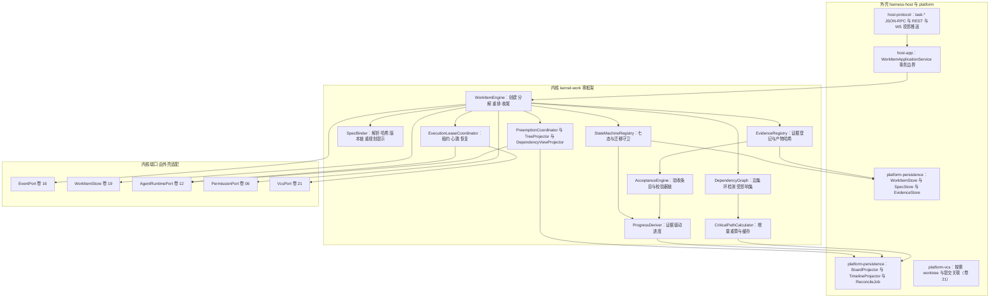
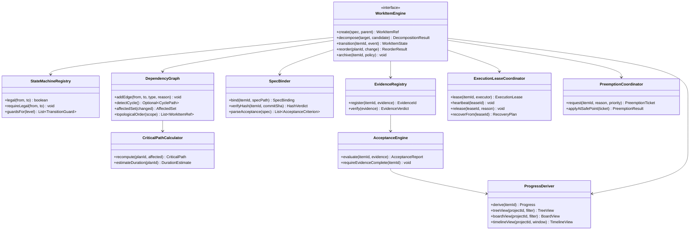
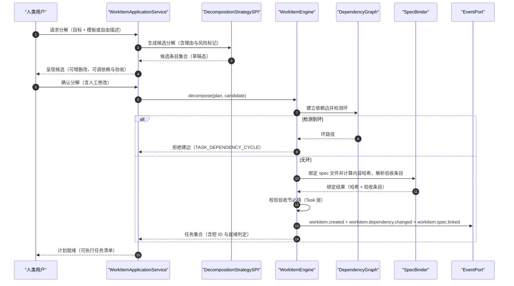
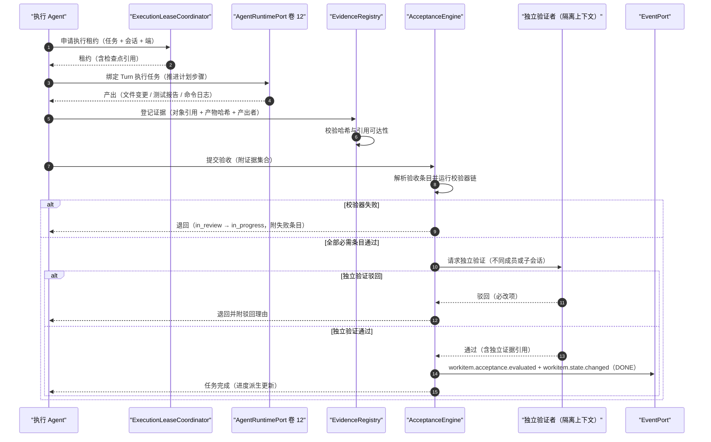
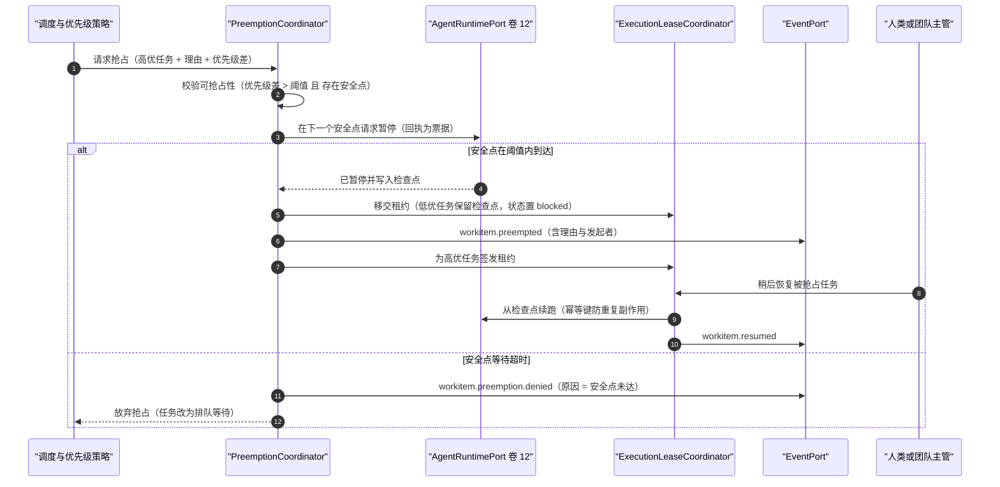
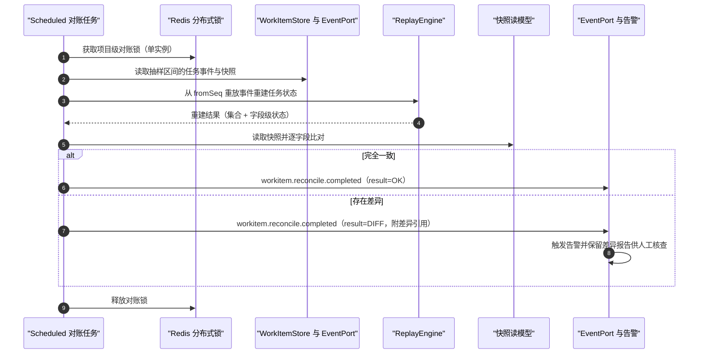
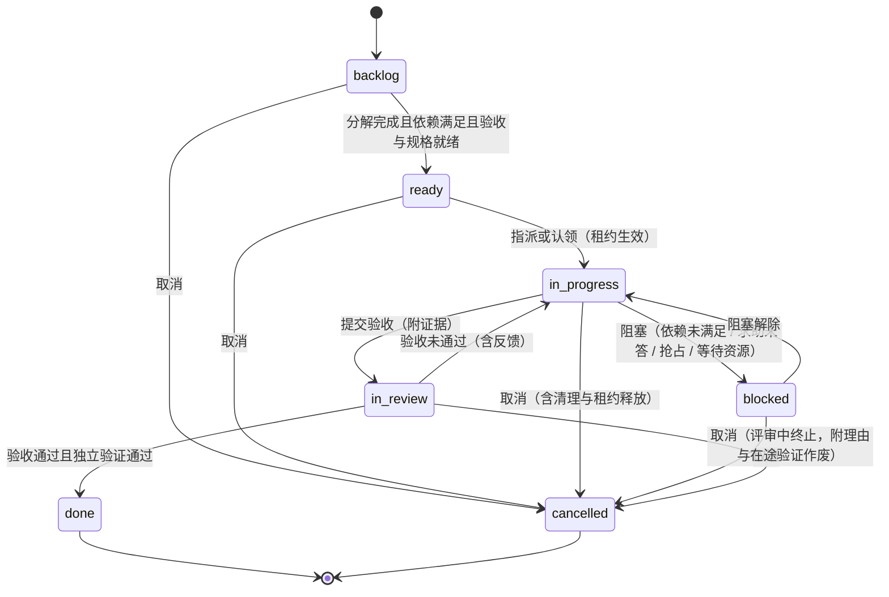
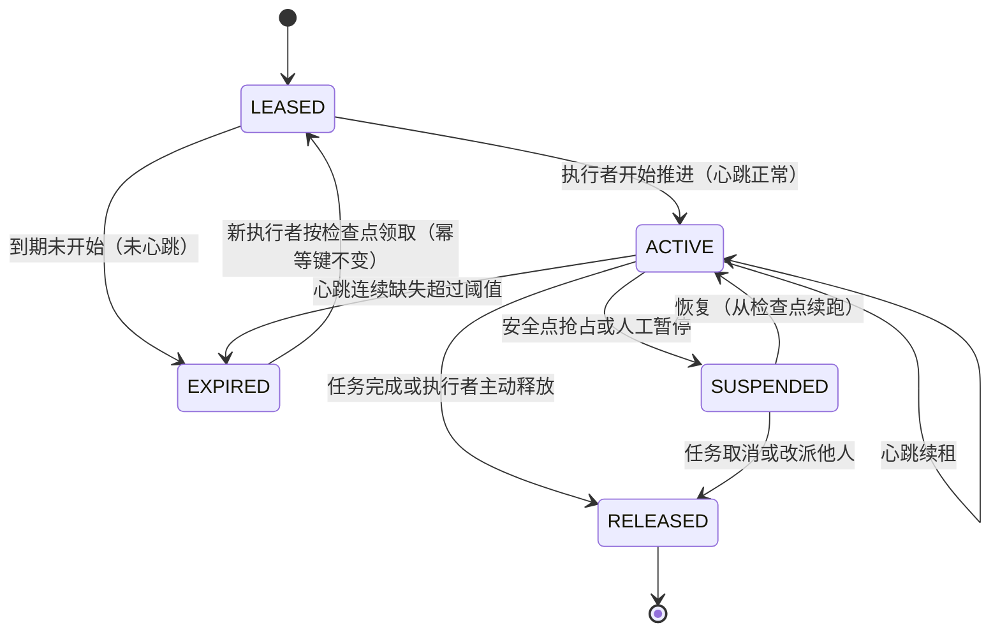

# 实现方案 14 · 任务与计划引擎（Task / Plan Engine Implementation）

> 本文件是 Phase B 实现层方案，对应 Phase A 卷 14（`docs/harness/14-task-and-plan.md`）与全局决策 H-005 / H-006 / H-008 / H-011 / H-019；
> 上游契约不可修改，凡与卷 14 冲突或存在缺口之处在 §⑩.7 记录「反驳证据 + 建议修订」并登记 `I-TASK-n`。
>
> 证据标记沿用 `00-research-plan.md` §2：`[E1]` 源码｜`[E2]` 官方文档｜`[E3]` 第三方｜`[E4]` 推断。
> 必须消化的台账行（`research/LESSONS-AND-ADOPTIONS.md` §6.4）：**L-042、L-043、L-047、L-076**。
> 实现落点：`harness-kernel/kernel-work`（WorkItem 引擎、状态机、DAG、证据与验收）；持久化与投影落 `harness-platform/platform-persistence`；
> 协议面（JSON-RPC `task.*` 与 REST）落 `harness-host/host-protocol`；看板 / 时间线渲染在 `client/*`（卷 22）。

---

## ① 实现目标与范围

### 1.1 本组件解决什么

把「干活」变成**可描述、可拆解、可排序、可追踪、可验收、可恢复、可复盘**的工程过程：

1. **四层统一模型**：Goal（目标）→ Plan（计划）→ Task（任务）→ Step（步骤）同源建模，一处建模、多视图呈现、可递归分解；
2. **七态状态机**：`backlog → ready → in_progress → blocked → in_review → done / cancelled`，非法迁移拒绝并记录理由；
3. **DAG 依赖与关键路径**：依赖类型（`finish_to_start` / `artifact` / `decision`）、环检测拒绝、资源约束（写范围 / 工作区 / 成员）与关键路径优先调度；
4. **规格驱动**：Task 绑定工作区 spec 文件（含内容哈希与版本链），四段结构（需求 / 设计 / 分解 / 验收标准），变更触发重规划提示；
5. **证据验收**：产物哈希 + 校验器注册表 + 独立验证者；`done` 必须附证据，否则写入层拒绝；
6. **视图投影**：CLI 树形/列表、桌面看板（列 = 状态）、甘特式时间线、依赖图与会话内联计划卡，全部为服务端投影；
7. **任务与 Agent 回合的绑定与恢复**：任务属项目 + 执行租约 + 检查点指针，一个 Turn 推进一个 Task，可跨会话/跨成员/跨端接续；
8. **批量重排与优先级**：优先级 + 安全点抢占 + 依赖变更重算关键路径与受影响任务集。

### 1.2 与 Phase A 的对应关系

| Phase A 决策 | 本文件落实位置 |
| --- | --- |
| D-TASK-1 统一聚合 WorkItem（四层） | §③ D-TASKI-1、§⑤ `WorkItem` 封印类型、§⑧ `oc_work_item` |
| D-TASK-2 人机协同分解 + 模板加速 | §③ D-TASKI-5、§⑥.1、§⑧ `oc_work_item_template` |
| D-TASK-3 DAG + 关键路径 + 资源约束 | §③ D-TASKI-3、§⑤ `DependencyGraph`、§⑥.4 |
| D-TASK-4 七态状态机 | §③ D-TASKI-1、§⑦.1、§⑦.3 合法性矩阵 |
| D-TASK-5 事件为源 + 状态快照 | §③ D-TASKI-2、§⑥.4、§⑧.3 事件清单 |
| D-TASK-6 逻辑绑定（工作区 + 写范围）+ worktree 按需 | §⑤ `ExecutionLease`、§⑧.1 字段、§⑩.1 |
| D-TASK-7 证据驱动进度 + 验收标准强制 | §③ D-TASKI-4、§⑥.2、§⑤ `AcceptanceEngine` |
| D-TASK-8 多视图（CLI 树 / 看板 / 时间线 / 依赖图） | §③ D-TASKI-8、§⑨.2、§⑩.3 投影一致性 |
| D-TASK-9 规格文件（可评审、版本化） | §③ D-TASKI-5、§⑥.1、§⑧ `oc_work_item_spec`（含 L-047 修订建议：验收节必填） |
| D-TASK-10 任务属项目、会话附着 | §③ D-TASKI-6、§⑥.2、§⑧ `oc_work_item_execution` |
| D-TASK-11 优先级 + 安全点抢占 | §③ D-TASKI-7、§⑥.3、§⑤ `PreemptionCoordinator` |
| D-TASK-12 模板库 + 组织共享 | §⑧ `oc_work_item_template`、§⑨.3 `TaskTemplateProviderSPI` |
| H-006 追加事件 + 投影；H-011 团队/子代理接口 | §⑧.3、§⑥.4 事件重建校验；§⑨.1 Task 作为团队认领对象 |

### 1.3 本组件不解决什么

- **不解决** Goal 的自治循环、终止判定与调度触发（卷 15）：Goal 只是 WorkItem 的最高层类型，其循环由卷 15 驱动；
- **不解决**团队编排与成员管理（卷 13）：本引擎提供「可认领、可分配、可写范围声明」的任务视图；
- **不解决** Agent 主循环与工具执行（卷 12/05）：本引擎只绑定 Turn 与检查点引用，不解释循环语义；
- **不解决** Git/worktree 的物理隔离（卷 21）与工作区连接（卷 20）：写范围是**逻辑声明**，物理隔离由卷 21 按需创建。

### 1.4 上下游依赖与模块落点

| 方向 | 依赖对象 | 接口 |
| --- | --- | --- |
| 上游 | 事件（卷 16）/ 持久化（卷 19） | `EventPort.append`（分区键 = `projectId`，`seq` 单调；任务事件进主事件流）；`WorkItemStore` / `SpecStore` / `EvidenceStore` / `ExecutionStore` 端口 |
| 上游 | 权限（卷 06）/ Agent 运行时（卷 12） | 「任务级授权范围」（如「允许本任务在 `src/` 内写」）；计划模式为权限模式投影（L-076）；`AgentRuntimePort.runTurn(taskRef)`、检查点引用、取消 |
| 下游 | 团队（卷 13） | 黑板即任务视图；分配 / 认领 / 写范围经任务字段表达 |
| 下游 | Git（卷 21）/ 知识库（卷 11）/ 端（卷 22） | 任务关联分支与提交；任务完成生成知识条目；看板/时间线投影推送 |

| 内容 | 模块落点 | 说明 |
| --- | --- | --- |
| `WorkItem` / `WorkItemState` / `Dependency` / `AcceptanceCriterion` / `EvidenceRef` / 各 SPI | `harness-contract`（`work` 包） | 纯契约，零 Spring、零 IO |
| `WorkItemEngine` / `StateMachineRegistry` / `DependencyGraph` / `CriticalPathCalculator` / `SpecBinder` / `EvidenceRegistry` / `AcceptanceEngine` / `ProgressDeriver` / `PreemptionCoordinator` / 各 Projector | `harness-kernel/kernel-work` | 引擎主干，纯内存 + 端口调用 |
| 实例化 Store、投影表、对账任务 | `platform-persistence`（含 `@Scheduled` 对账） | 唯一写者；投影基于事件增量折叠 |
| `task.*` 协议与 REST 面 | `host-app`（事务边界）+ `host-protocol` | 写路径 `@Transactional`；外部校验器执行在 `AFTER_COMMIT` 异步 |

**分层纪律**：`kernel-work` 不依赖 Spring / Jackson / JDBC / HTTP（卷 27 R1）；投影是纯函数（事件 + 快照 → 视图），可在端离线重放。

### 落地核对（R07：模块 / 顺序 / 批次 / 门禁 / I-* 落点）

- **模块（卷 27 §4.1 权威名，全路径）**：`harness-contract`（`contract/work`）+ `harness-kernel/kernel-work`（引擎主干）+ `harness-platform/platform-persistence`（实例化 Store/投影/对账 `@Scheduled`）+ `harness-host/host-app`（事务边界）+ `harness-host/host-protocol`（`task.*` 协议）。短名已在表内，统一展开如左。
- **实施顺序（卷 27 §4.5）**：第 14 步「任务/计划模型 + 规格文件」，依赖第 5 步（Agent 主循环：执行者与证据产生）与第 9 步（持久化）。**下游**：第 17 步（Skill/MCP 绑定任务）、第 19 步（Teams/Goal 以 WorkItem 为工作对象）、第 19 步的抢占与租约复用本层 `oc_work_item_execution`。
- **数据批次（卷 27 §4.4）**：`oc_work_item`、`oc_work_item_dependency`、`oc_work_item_acceptance`、`oc_work_item_evidence`、`oc_work_item_execution`、`oc_work_item_spec`、`oc_work_item_view_watermark`、`oc_work_item_template` → **B4**（工作对象 + 团队 + 调度记录）。**命名对账**：附录 A.6 示例为 `oc_workitem`/`oc_workitem_dep`/`oc_evidence`，本文件用显式长前缀名；两套名字属同一表族的**命名分歧**，需在 B4 脚本落地前统一（建议以本文件为准并登记 X 修订，见 `reviews/R07-scope-build-kernel.md`）。
- **门禁映射（卷 27 §4.6）**：kernel-work 单测 → 「单元测试 + 覆盖率门」；PG/Redis 集成 + 对账 → 「集成测试」；`task-gate.sh`（迁移矩阵/依赖环/抢占恢复/投影一致性）→ 「集成测试」+「契约测试」；故障注入脚本 → 「集成测试（故障注入层）」。
- **I-* 落点**：I-TASK-1 → `kernel-work`（单表 WorkItem + 物化路径）+ `platform-persistence`；I-TASK-2 → `platform-persistence`（事件投影 + 对账任务）+ `kernel-work`（读模型折叠）；I-TASK-3 → `kernel-work`（`DependencyGraph` + `CriticalPathCalculator`）；I-TASK-4 → `kernel-work`（`AcceptanceEngine` + 校验器注册表）+ `host-app`（外部校验器 `AFTER_COMMIT`）；I-TASK-5 → `kernel-work`（`SpecBinder`）+ `platform-workspace`（spec 文件内容哈希）；I-TASK-6 → `platform-persistence`（`oc_work_item_execution` 租约）+ `kernel-agent`（检查点指针）；I-TASK-7 → `kernel-work`（`PreemptionCoordinator` 安全点抢占）+ `kernel-agent`（安全点）；I-TASK-8 → `host-app`（视图投影与差量推送）+ `host-protocol`。

### 1.5 依赖的修订建议与阻塞项

- **修订建议（不阻塞，登记备案）**：卷 14 D-TASK-9 称规格文件「可选但推荐」；L-047 要求「四段 Spec + 验收标准设为**必填节**」。本文件按 `open-coding.task.spec-required`（默认 `true`，Task 层生效、Step 层豁免）落地，并在 §⑩.7 记录建议。
- **修订建议（不阻塞）**：卷 14 未定义「任务 → 执行者」的**执行租约**与过期回收；本文件补 `oc_work_item_execution` 与 `workitem.execution.leased / released` 事件（REQ-TASK-10）。
- **对齐项（无冲突）**：L-076 要求「计划模式是权限模式的投影而非新实体」——本文件不新增 `PlanMode` 实体，`in_review` 与只读计划模式互不代替；计划模式状态只存在于卷 06 的模式枚举中。
- **对齐项（R05 新增，无冲突）**：执行租约与非终态执行明细必须进入卷 19 §⑩.3 R1 的**跨域候选采集**（`item_ref = lease:<exec_id>`），由恢复协调器统一「扫描 → 判定 → 报告」；本文件**不新建第二个扫描器**，只提供「失联判定 + 领取 + 恢复计划」三项能力（`ExecutionLeaseCoordinator`）。

---

## ② 功能需求清单（REQ-TASK-n）

| REQ | 需求描述 | 来源 | 优先级 | 验收要点 |
| --- | --- | --- | --- | --- |
| REQ-TASK-01 | 四层统一模型（Goal / Plan / Task / Step）+ 递归分解；人类可读短 ID（`G-` / `P-` / `T-`）+ 全局 UUID | 卷 14 D-TASK-1、§4.1；附录 A §A.1 短 ID 约定 | P0 | 递归分解到 Step；短 ID 与 UUID 双向解析；层级不可跨越（Step 下不可再挂 Plan） |
| REQ-TASK-02 | 七态状态机与迁移规则：非法迁移拒绝、迁移理由强制、`done` 必附证据 | 卷 14 D-TASK-4、§4.2 | P0 | 非法迁移（如 `backlog → done`）抛 `TASK_STATE_INVALID`；理由缺失被拒 |
| REQ-TASK-03 | DAG 依赖（`finish_to_start` / `artifact` / `decision`）+ 环检测拒绝（给出环路径）+ 关键路径计算 | 卷 14 D-TASK-3、§4.3 | P0 | 建环被拒并返回环路径；关键路径随依赖变更重算 |
| REQ-TASK-04 | 事件为源 + 状态快照：每次状态/字段变更产出事件；快照供快速读取；两者可校验 | 卷 14 D-TASK-5、§7 一致性 | P0 | 事件重放重建的任务状态与快照逐字段一致（对账工具） |
| REQ-TASK-05 | 规格驱动：spec 文件（`.oc/tasks/<shortId>.md`）+ 内容哈希 + 版本链；spec 变更触发「重规划」提示；验收标准为必填节 | 卷 14 D-TASK-9、§4.4；L-047 `[E2]`（`07-qoder.md` §8-2 四段 Spec + 验收必填） | P0 | 缺验收节的 spec 被拒；spec 哈希与提交号可追溯；变更产 `workitem.spec.changed` |
| REQ-TASK-06 | 证据验收：证据类型（产物哈希 / 测试报告 / 命令日志 / 评审结论）+ 校验器注册表；`done` 无证据即拒绝；完成信号双口径（工具 + 事件）一致 | 卷 14 D-TASK-7；L-042 `[E1]`（`09-secondary-tier.md` §④.1-6 各家 submit / attempt_completion / final_output_tool 双口径） | P0 | 无证据 `done` 被写入层拒绝；「工具说完成」与「事件置 done」不一致时告警 |
| REQ-TASK-07 | 独立验证：verifier 不得与被验证者共享上下文；`in_review → done` 必须有独立验证结论 | L-043 `[E1]`（`04-deepseek-harness.md` §4.9 ralph「报告不被独立验证」的反面教材） | P0 | 自证结论被拒；verifier 由不同成员/子会话承担 |
| REQ-TASK-08 | 人机协同分解：AI 产出候选分解（含理由与风险标记）→ 人类可编辑（增删改、调依赖、设验收）→ 模板加速常见任务 | 卷 14 D-TASK-2、D-TASK-12 | P1 | 候选分解可整体采纳/部分采纳；模板实例化后仍可编辑 |
| REQ-TASK-09 | 逻辑绑定：任务声明「工作区 + 写范围」；worktree/分支按需创建；写范围不重叠的任务可共享同一 worktree | 卷 14 D-TASK-6 | P0 | 写范围重叠检测生效；共享 worktree 的并发写被串行化 |
| REQ-TASK-10 | 任务属项目 + 执行租约：任务可被多会话/多成员/多端接续；执行者持租约，崩溃后按检查点恢复；同会话重入 join 既有执行 | 卷 14 D-TASK-10；opencode `SessionRunCoordinator` 同会话 join 与空闲 drain（**仅进程内、不跨重启**）`[E1]`（`02-opencode.md` §1 走读、§4.12） | P0 | 两端接续同一任务历史完整；租约过期自动回收；join 不产生双执行者 |
| REQ-TASK-11 | 多视图投影：CLI 树形/列表、看板（列 = 状态）、时间线（成员 × 时间泳道）、依赖图（关键路径高亮）；会话内联计划卡 | 卷 14 D-TASK-8、§4.6 | P0 | 四视图均由服务端投影；看板拖拽改状态走状态机校验 |
| REQ-TASK-12 | 优先级 + 安全点抢占 + 检查点恢复；抢占需记录理由；被抢占任务可续 | 卷 14 D-TASK-11 | P1 | 抢占仅发生在安全点；恢复后不重复副作用 |
| REQ-TASK-13 | 批量重排：依赖变更 / 优先级变更后重算关键路径与受影响任务集；禁止「整表替换」式覆盖（与竞品的 last-write-wins Todo 相反） | 卷 14 §4.3；竞品反面证据：`todo_write` 整表替换、条目无 id/优先级、last-write-wins `[E1]`（`04-deepseek-harness.md` §4.10；`02-opencode.md` §4.10） | P1 | 依赖变更后受影响任务集与关键路径同步更新；重排有审计记录 |
| REQ-TASK-14 | 只读计划模式：作为权限模式的投影 + 计划文件落盘 + 进出计划的专用工具；进出不影响工具目录 | L-076 `[E1]`（`08-gemini-cli.md` §⑧ G13 `enter-plan-mode.ts`）；deepseek plan mode「整值替换 log-only 事件 + 软引导」`[E1]`（`04-deepseek-harness.md` §4.10） | P1 | 计划模式与 Plan/Todo 语义对齐不双源；模式切换有事件无工具目录漂移 |
| REQ-TASK-15 | 任务模板库：常见类型（新增 API / 重构 / 修 Bug / 依赖升级 / 文档同步 / 迁移）含标准步骤、验收清单与风险提示；组织共享与版本化 | 卷 14 D-TASK-12、§8 DoD | P1 | 模板实例化产出可执行任务与验收清单；版本演进可追溯 |
| REQ-TASK-16 | 视图一致性：看板/时间线只读投影、禁止双写；投影滞后可观测；离线重放可校验 | 卷 14 H-006 语义 + 本文件增量 | P0 | 任何写路径不直接改投影表；`oc_workitem_projection_lag_seq` 有指标 |
| REQ-TASK-17 | 归档与容量：单项目 ≥ 100 万任务（含历史）；完成后 90 天归档（可配）且仍可检索 | 卷 14 §7 容量、§10 开放问题 | P2 | 归档后树查询延迟不劣化；归档任务仍可被引用为依赖 |
| REQ-TASK-18 | 可用性降级：任务系统不可用时 Agent 仍可运行（降级为「无持久计划」模式并显式提示） | 卷 14 §7 可用性 | P1 | 断开任务存储后会话可继续；界面显式标注「本次不记录任务」 |

**竞品增量需求说明**：REQ-TASK-05/06/07/10/13/14 来源于竞品源码事实（`[E1]`/`[E2]`），是 Phase A 未下沉到机制层的实现级需求，已在 §③ 各自登记 `I-TASK-n`。

---

## ③ 技术方案选型（M×N 比选）

评分沿用 `README.md` §4：**F 30% / U 20% / S 25% / M 25%**。每条被采纳/适配的台账行（L-042/043/047/076）均以候选分支形式参与评分。

### D-TASKI-1 模型承载形态

| 分支 | 描述 | F | U | S | M | 加权 | 结论 |
| --- | --- | --- | --- | --- | --- | --- | --- |
| B1 | 四类对象四张表（Goal/Plan/Task/Step 各一套） | 6 | 6 | 6 | 6 | 60.0 | 淘汰（语义重叠、状态同步困难） |
| B2 | **单表 `oc_work_item` + 层级判别 + 物化路径 + 递归 CTE** | 9 | 9 | 8 | 9 | 88.5 | **选定** |
| B3 | 邻接表 + 闭包表（查询快、写放大） | 8 | 8 | 7 | 7 | 75.5 | 吸收其「祖先查询」思路到物化路径索引 |

**选定 B2**（对齐 D-TASK-1）：单表使状态机与事件契约只实现一次；层级差异用判别字段 + 层类型专用扩展（`jsonb`）表达；物化路径（`path`）+ `(parent_id)` 索引支撑树加载，闭包表仅在深度超阈值时评估。

### D-TASKI-2 持久化与一致性

| 分支 | 描述 | F | U | S | M | 加权 | 结论 |
| --- | --- | --- | --- | --- | --- | --- | --- |
| B1 | 仅状态快照（可查询，无追溯） | 7 | 7 | 6 | 7 | 68.0 | 淘汰（违背 H-006 与不可追溯） |
| B2 | **事件为源 + 快照投影 + 读模型；对账任务校验一致性** | 9 | 8 | 9 | 9 | 88.0 | **选定** |

**选定 B2**（对齐 D-TASK-5 与 H-006）：写路径只写事件与快照（**同事务**，事件先行），投影由折叠器消费；双写形态被淘汰（事件与快照互为真相，冲突不可判定）；对账任务按日抽样重放事件并比对快照，差异产 `workitem.reconcile.completed{result=DIFF}` 并告警。

### D-TASKI-3 依赖与关键路径计算

| 分支 | 描述 | F | U | S | M | 加权 | 结论 |
| --- | --- | --- | --- | --- | --- | --- | --- |
| B1 | 纯应用层内存图，每次加载重建 | 8 | 8 | 7 | 7 | 76.0 | 基线（万级节点时加载成本高） |
| B2 | **DB 侧依赖边 + 应用侧增量重算 + 去抖窗口 + 结果缓存** | 9 | 8 | 8 | 9 | 85.5 | **选定** |
| B3 | 每次变更全量重算关键路径 | 6 | 9 | 9 | 8 | 78.5 | 降级兜底（依赖边异常时使用） |

**选定 B2**：增量重算只影响「变更节点的祖先/后继闭包」，去抖窗口（`critical-path-debounce-ms`）合并连续变更；全量重算仅在缓存失效或对账失败时触发，作为确定性兜底。

### D-TASKI-4 验收证据形态

| 分支 | 描述 | F | U | S | M | 加权 | 结论 |
| --- | --- | --- | --- | --- | --- | --- | --- |
| B1 | 文本描述（人工判断） | 6 | 6 | 8 | 7 | 66.0 | 淘汰（不可校验、易产生「看起来完成」） |
| B2 | **结构化证据 + 产物哈希 + 校验器注册表（可按组织扩展）** | 9 | 8 | 8 | 9 | 85.5 | **选定** |
| B3 | 人工勾选清单 | 7 | 8 | 9 | 7 | 76.5 | 仅作 L1 静态级验收的降级形态 |

**选定 B2**（对齐 D-TASK-7 + L-042）：证据是「可复查的引用」而非「结论」；每条验收标准映射到校验器（内置 + 企业扩展），校验器失败即 `in_review → in_progress`（附反馈），不允许人工越权置 `done`（除审计留痕的例外路径）。

### D-TASKI-5 规格绑定形态

| 分支 | 描述 | F | U | S | M | 加权 | 结论 |
| --- | --- | --- | --- | --- | --- | --- | --- |
| B1 | 规格内联在任务字段（`jsonb`） | 7 | 7 | 8 | 7 | 72.0 | 淘汰（不可评审、不可 PR 化） |
| B2 | **工作区 spec 文件 + 内容哈希 + 版本链（提交号）** | 9 | 8 | 8 | 9 | 85.5 | **选定** |
| B3 | 外部链接（Wiki / 工单系统） | 6 | 7 | 7 | 6 | 64.5 | 备选（企业已有工单系统时挂引用，不替代 spec） |

**选定 B2**（对齐 D-TASK-9 + L-047）：spec 与代码同仓可评审（PR 化）；绑定记录**内容哈希 + 提交号**，任何变更都可见且可回溯；spec 的「验收标准」节解析为结构化验收条目，写入 `oc_work_item_acceptance`（必填校验在此执行）。

### D-TASKI-6 任务与执行者的绑定

| 分支 | 描述 | F | U | S | M | 加权 | 结论 |
| --- | --- | --- | --- | --- | --- | --- | --- |
| B1 | 任务属会话（会话关闭即失效） | 6 | 6 | 8 | 7 | 66.0 | 淘汰（不可协作、不可接续） |
| B2 | **任务属项目 + 执行租约 + 检查点指针 + Turn 附着** | 9 | 9 | 8 | 9 | 88.0 | **选定** |

**选定 B2**（对齐 D-TASK-10）：一个 Turn 推进一个 Task，但 Task 生命周期独立于 Turn 与会话；「任务 = Turn」形态被淘汰（长任务被回合切碎、语义错位）；执行租约对齐卷 13 的认领语义；同会话重入必须 **join 既有执行**（禁止起第二个执行者），崩溃后按检查点恢复（对齐 opencode 的 join/drain 行为，但我们是跨进程持久租约）。

### D-TASKI-7 优先级与抢占

| 分支 | 描述 | F | U | S | M | 加权 | 结论 |
| --- | --- | --- | --- | --- | --- | --- | --- |
| B1 | 仅排序（不抢占） | 7 | 7 | 9 | 8 | 76.5 | 基线（紧急任务需等待） |
| B2 | **优先级 + 安全点抢占 + 检查点保留 + 抢占理由** | 8 | 8 | 8 | 8 | 80.0 | **选定** |

**选定 B2**（对齐 D-TASK-11）：抢占点仅在安全点（工具结算后、模型调用前）；被抢占任务进入 `blocked`（原因 = 抢占）并保留检查点；抢占必须记录理由与发起者，进入审计（硬中断形态被淘汰：破坏工具结算与安全点语义）。

### D-TASKI-8 视图投影

| 分支 | 描述 | F | U | S | M | 加权 | 结论 |
| --- | --- | --- | --- | --- | --- | --- | --- |
| B1 | 客户端聚合（多端各算一遍） | 7 | 6 | 8 | 6 | 67.5 | 淘汰（口径漂移、重复实现） |
| B2 | **服务端投影 + 差量推送 + `lastSeq` 对齐** | 9 | 9 | 8 | 8 | 85.0 | **选定** |
| B3 | 轮询查询（无推送） | 6 | 6 | 9 | 8 | 71.0 | 仅作离线/回放与降级兜底 |

**选定 B2**：投影表以 `(project_id, view_kind)` 维度存增量与水位；端持有 `lastSeq`，断线后按事件补齐（复用卷 16 回放能力）。

### 3.2 实现级决策登记（I-TASK-n）

| ID | 主题 | 选定 | 理由与代价 | 回退触发 |
| --- | --- | --- | --- | --- |
| I-TASK-1 | 模型承载 | 单表 WorkItem + 层级判别 + 物化路径；闭包表按深度阈值评估 | 状态机与事件契约只实现一次；代价是层专用字段进 `jsonb` | 树查询 P95 > 800ms → 引入闭包表并保留单表模型 |
| I-TASK-2 | 持久化 | 事件为源 + 快照 + 读模型；对账任务校验 | 满足 H-006 与可追溯；代价是投影延迟 | 投影滞后 > 3s → 读路径退化为事件即时折叠（牺牲读吞吐） |
| I-TASK-3 | 依赖计算 | DB 边集 + 应用增量重算 + 去抖 + 缓存 | 变更快、结果确定；代价是缓存失效逻辑 | 增量重算出现偏差 → 全量重算兜底并告警（B3） |
| I-TASK-4 | 验收 | 结构化证据 + 产物哈希 + 校验器注册表 | 可机械复查、可企业扩展；代价是校验器需版本化 | 校验器不可用（外部依赖挂）→ 标记 `UNCERTAIN` 并请求人工裁决，不默认放行 |
| I-TASK-5 | 规格 | 工作区 spec 文件 + 内容哈希 + 版本链；验收节必填（Task 层） | 可评审、可版本化；代价是文件与记录需对账 | spec 缺失或哈希不符 → 任务保持 `backlog` 并提示补规格（不静默放行） |
| I-TASK-6 | 执行绑定 | 项目属 + 执行租约 + 检查点指针；同会话重入 join | 可接续、无重复执行者；代价是租约与心跳维护 | 租约风暴（频繁过期重领）→ 延长租约或引入续租心跳间隔配置 |
| I-TASK-7 | 抢占 | 优先级 + 安全点抢占 + 检查点 + 理由审计 | 紧急任务可插队且不丢工作；代价是抢占引入暂停时长 | 抢占平均暂停 > 阈值 → 降低抢占频率（改为排序 + 加急队列） |
| I-TASK-8 | 视图 | 服务端投影 + 差量推送 + `lastSeq` | 口径唯一、断线可补；代价是投影存储与维护 | 投影存储超水位 → 只保留水位与最近窗口，历史按事件回放 |

**与竞品对照的取舍**：任务/计划形态在竞品中分两档——① **会话内 TODO 列表**（Claude Code `TodoWrite` 系 `[E2]`，`research/competitors/01-claude-code-purpose-built.md`）：轻、零持久化，但会话结束即失，无法跨端接续；② **待办/任务双轨**（Roo 系 TODO 与子任务 `[E1]`，`research/competitors/09-secondary-tier.md` §④：完成信号需显式提交，L-042 的来源）。**取舍**：把「任务」升格为**持久工作对象树**（单表 + 物化路径 + 事件为源，I-TASK-1/2），换取跨会话接续与可对账；代价（投影延迟、层专用字段进 `jsonb`）以「水位显式化 + 即时折叠兜底」消化。规格与验收把 Qoder 的「四段 Spec + 验收标准必填」（`research/competitors/07-qoder.md` §8-2 `[E2]`，L-047）落为 `spec-required` 默认开；计划模式对齐 Gemini CLI 的 plan mode（`research/competitors/08-gemini-cli.md` §⑧ G13 `[E1]`，L-076）但**实现为权限模式的投影**而非新实体，避免状态双源。

---

## ④ 总体架构图



**内核/外壳边界**：内核只做状态机、图算法、验收编排与投影计算；全部 IO 经端口；`platform-persistence` 是唯一写者，
投影表由事件折叠器增量维护；`host-app` 承载事务边界与 `AFTER_COMMIT` 事件（外部校验器、通知、worktree 创建均在事务外）。

---

## ⑤ 类图与关键契约



### 5.1 关键 Java 21 签名（内核契约，零框架依赖）

```java
/**
 * 工作对象引擎：Goal / Plan / Task / Step 四层的唯一写入口。
 * 负责分解、状态迁移、依赖重算与归档；所有迁移必须经 StateMachineRegistry 守卫并产出事件。
 */
public interface WorkItemEngine {

    /**
     * 创建工作对象（自动选择层级与短 ID 前缀）。
     *
     * @param spec   工作对象规格（标题、层级、工作区与写范围、指派、优先级、预算；必填）
     * @param parent 父对象引用（Plan 必填 Goal；Task 必填 Plan；Step 必填 Task；Goal 为 null）
     * @return 工作对象引用（短 ID + UUID）
     * @throws HarnessException 层级不合法、父对象不存在或写范围非法（绝对路径/越出工作区）时抛出
     */
    WorkItemRef create(WorkItemSpec spec, WorkItemRef parent);

    /**
     * 把 AI 候选分解写入计划（人机协同：候选需经人类确认，未确认保持草稿态）。
     *
     * @param target    目标对象（Plan 或 Task；必填，须处于可分解状态）
     * @param candidate 候选分解（含理由与风险标记；条目为空或引用了非法写范围时拒绝）
     * @return 分解结果（新增对象与依赖边；含被拒绝条目及原因）
     */
    DecompositionResult decompose(WorkItemRef target, DecompositionCandidate candidate);

    /**
     * 状态迁移（唯一入口）。
     *
     * @param itemId 对象标识（必填）
     * @param event  迁移意图（目标状态、理由、操作者；目标状态与理由均必填）
     * @return 迁移后的状态
     * @throws HarnessException 迁移非法（`TASK_STATE_INVALID`）、缺理由、`done` 缺证据或依赖未满足时抛出
     */
    WorkItemState transition(WorkItemRef itemId, TransitionIntent event);

    /**
     * 批量重排：按依赖变更 / 优先级变更重算关键路径与受影响集（禁止整表替换式覆盖）。
     *
     * @param planId 计划标识（必填）
     * @param change 重排请求（依赖增删、优先级调整、资源约束变更；至少一项）
     * @return 重排结果（受影响对象、新关键路径、被推迟对象与原因）
     */
    ReorderResult reorder(PlanRef planId, ReorderRequest change);
}

/**
 * 依赖图：边集管理、环检测、受影响集与拓扑序。
 * 所有依赖变更必须记录理由；环检测失败必须给出完整环路径（供 UI 提示与审计）。
 */
public interface DependencyGraph {

    /**
     * 新增依赖边。
     *
     * @param from   前置对象（必填）
     * @param to     后继对象（必填；不得与 from 相同）
     * @param type   依赖类型（finish_to_start / artifact / decision；必填）
     * @param reason 变更理由（必填，进审计）
     * @throws HarnessException 形成环（返回环路径）、跨计划引用或对象不存在时抛出
     */
    void addEdge(WorkItemRef from, WorkItemRef to, DependencyType type, String reason);

    /** 检测当前图中的环；@return 环路径（无环返回空） */
    Optional<CyclePath> detectCycle();

    /** 计算某变更对象的受影响集（祖先与后继闭包，用于增量重算与重规划提示）。 */
    AffectedSet affectedSet(WorkItemRef changed);
}

/**
 * 执行租约协调器：任务与执行者（会话 / 成员 / 端）的绑定与恢复。
 * 同会话重入必须 join 既有租约（禁止双执行者）；租约过期由心跳判定回收。
 */
public interface ExecutionLeaseCoordinator {

    /**
     * 为任务获取执行租约（幂等：同会话同任务重复调用返回既有租约）。
     *
     * @param itemId   任务标识（必填，须处于 ready 或 in_progress）
     * @param executor 执行者描述（会话 / 成员 / 端；必填）
     * @return 执行租约（含到期时间与检查点引用）
     * @throws HarnessException 已有其他执行者持有效租约（返回持有者信息）或任务状态非法时抛出
     */
    ExecutionLease lease(WorkItemRef itemId, ExecutorRef executor);

    /** 续租心跳；连续缺失超过阈值即判定执行者失联。 */
    void heartbeat(LeaseId leaseId);

    /** 生成恢复计划（检查点 → 未结算动作 → 续跑起点），供卷 12 恢复流程消费。 */
    RecoveryPlan recoverFrom(LeaseId leaseId);
}
```

**枚举与关键 record（`harness-contract`；枚举含 `code` + `desc` 与 `of(String)` 工厂）**：

```java
/** 七态状态机：失败态与重试由 blocked 的 failed 标记与 in_progress 的重试表达，不新增状态。 */
@Getter
@RequiredArgsConstructor
public enum WorkItemState {
    BACKLOG("BACKLOG", "待规划"), READY("READY", "可执行"), IN_PROGRESS("IN_PROGRESS", "进行中"),
    BLOCKED("BLOCKED", "阻塞"), IN_REVIEW("IN_REVIEW", "待验收"), DONE("DONE", "已完成"), CANCELLED("CANCELLED", "已取消");

    private final String code;
    private final String desc;

    /** 按 code 解析状态；@throws HarnessException 未知状态码时抛出（含原始值便于定位） */
    public static WorkItemState of(String code) {
        for (WorkItemState state : values()) {
            if (state.code.equals(code)) {
                return state;
            }
        }
        throw new HarnessException("未知任务状态：" + code);
    }
}

// 四层专用 record（GoalItem / PlanItem / TaskItem / StepItem）为**同包（contract.work）各自独立编译单元**，
// 字段与不变量见 §8.1 与 §7.1；Java 21 `sealed` 的被允许类型必须与本接口同包/同模块，故不得跨包实现。
/** 四层同源：层级判别 + 层专用扩展（Goal 预算 / Plan DAG / Task 验收 / Step 工具提示）。 */
public sealed interface WorkItem permits GoalItem, PlanItem, TaskItem, StepItem {

    /** 层级：GOAL / PLAN / TASK / STEP。 */
    WorkItemLevel level();
}

/** 依赖类型：默认 finish_to_start；artifact 需要产物存在；decision 需要裁决结果。 */
public enum DependencyType {
    FINISH_TO_START("FINISH_TO_START", "完成后开始"),
    ARTIFACT("ARTIFACT", "需要产物存在"),
    DECISION("DECISION", "需要裁决结果");
}

/** 验收条目：可检验条目 + 校验器引用 + 是否必需。 */
public record AcceptanceCriterion(String statement, ValidatorRef validator, boolean required) { }

/** 证据引用：类型 + 对象引用 + 哈希 + 产出者（证据是引用而非结论）。 */
public record EvidenceRef(EvidenceKind kind, String objectRef, String sha256, ActorRef producedBy) { }
```

**异常与编码约定（本文件全部示例遵循 `.qoder/rules/`）**：异常按层分工——**内核与契约侧（`harness-kernel` / `harness-contract`，零框架）统一抛 `HarnessException` 并携带 `ErrorCode`**；**外壳侧（`harness-platform` / `harness-host`，Spring）统一抛 `BusinessException`（同携带 `ErrorCode`）**，由外壳全局异常处理器按码映射（错误模型见附录 B §B.7）；**禁止裸抛 `RuntimeException` / `IllegalArgumentException`**。阈值一律进 `TaskProperties`（§⑨.4）；写路径 `@Transactional(rollbackFor = Exception.class)`；外部调用（校验器进程、Git、通知）一律移出事务并经 `AFTER_COMMIT` 异步触发；状态迁移与租约更新使用条件写并校验行数。

---

## ⑥ 核心流程时序图

### 6.1 分解、规格绑定与就绪判定

**前置条件**：目标或计划已确认；模板或候选分解可用；工作区可写（spec 落盘）。**主路径**：候选分解 → 人类编辑确认 → 依赖建边（环检测）→ spec 落盘 + 哈希 → 验收条目解析 → ready。
**异常与补偿**：依赖成环 → 拒绝建边并返回环路径；spec 缺验收节 → 任务保持 `backlog` 并提示补规格（不静默放行）。**幂等与并发点**：分解以 `(parent, candidateHash)` 去重；spec 绑定以内容哈希防重放。



### 6.2 执行、证据采集与验收

**前置条件**：任务 `ready` 或 `in_progress`；执行者持有效租约；验收条目与校验器可用。**主路径**：租约绑定 Turn → 执行 → 证据登记（哈希）→ 校验器链 → `in_review` → 独立验证 → `done`。
**异常与补偿**：校验器失败 → 退回 `in_progress` 并附反馈；`done` 缺证据 → 写入层拒绝；校验器不可用 → 标记 `UNCERTAIN` 并请求人工裁决，不默认放行。**幂等与并发点**：证据以 `(itemId, objectRef, sha256)` 唯一；状态迁移条件写 + 行数校验。



### 6.3 优先级抢占与恢复

**前置条件**：新任务优先级高于在办任务；被抢占任务存在可写检查点。**主路径**：优先级比较 → 抢占票据 → 安全点生效 → 租约移交（保留检查点）→ 高优任务执行 → 被抢占任务恢复。
**异常与补偿**：安全点等待超时 → 放弃抢占（记录原因）而非硬中断；恢复时发现副作用未结算 → 按卷 12 分级（幂等重试 / 请求裁决）。**幂等与并发点**：抢占票据唯一；同一任务同时仅一张有效票据；恢复以 `(leaseId, checkpointRef)` 幂等。



### 6.4 事件重建与快照对账

**前置条件**：事件流完整（`fromSeq → toSeq` 在保留窗口内）；快照表可读。**主路径**：抽样计划 → 重放事件 → 重建状态 → 与快照逐字段比对 → 差异登记。
**异常与补偿**：出现差异 → 产 `DIFF` 结果并告警（不改写快照，交人工/工具修复）；事件窗口外 → 跳过并记录「不可对账区间」。**幂等与并发点**：对账任务单实例（`RedisKeys.lock(Module.TASK, "reconcile", projectId)`）；重放只读，不产生新事件。



---

## ⑦ 状态机

### 7.1 七态状态机（统一骨架）



**规则**：状态迁移全部产出事件（含操作者、理由、当时依赖快照）；`done` 必须附证据与独立验证结论；
`metadata.failed` 标记运行失败（不等于任务失败，可重试）；`blocked` 的 `reason_code` 用于指标聚合。
**取消/超时路径补全（触发 / 守卫 / 副作用）**：① `任意非终态 → cancelled`——触发：人类或授权方取消 / 计划废弃；守卫：`done` 禁止取消（终态不可逆）；副作用：释放执行租约（`oc_work_item_execution → RELEASED`）、作废 `PENDING` 验收条目、写 `workitem.state.changed(reason=cancelled)` 并回收未用预算；② **超时路径**——执行租约 `ACTIVE → EXPIRED`（心跳缺失 > `lease-heartbeat-seconds` × 3 判定）后，任务不进 `cancelled` 而是保持原态并允许新执行者按检查点领取（`EXPIRED → LEASED`，幂等键不变）；③ **失败路径**——校验器/执行器失败折叠为 `metadata.failed` 标记 + 事件，任务回 `in_progress`（不引入新状态，保证七态骨架稳定）。

### 7.2 执行租约状态机



> **重启纪律（R05 补全）**：服务重启时进程内所有「谁在跑」的信息作废，只以 DB 为准——在途条目 → `EXPIRED`（判据 `lease_expire_at`，幂等可重复）；
> `EXPIRED → LEASED` **只在显式领取时发生**（`task.resume` / 调度新运行），且必须携带检查点引用与**不变的幂等键**；`SUSPENDED` 是抢占/人工暂停的保留态，重启后**不自动转回 `ACTIVE`**。
> 与卷 19 的关系：本状态机的非终态条目全部进恢复候选（`lease:<exec_id>`），处置结论由 12 恢复流程消费。

### 7.3 迁移合法性矩阵（节选）

| 当前 | 目标 | 允许 | 前置条件与附加动作 |
| --- | --- | --- | --- |
| backlog | ready | 是 | 分解完成 + 依赖满足 + 规格绑定 + 验收条目齐备；否则保持 `backlog` 并记原因 |
| ready | in_progress | 是 | 指派或认领成功 + 执行租约生效 |
| in_progress | in_review | 是 | 证据齐备（`requireEvidenceComplete`），否则拒绝 |
| in_review | done | 是 | 必需验收条目全通过 + 独立验证通过 + 有完成信号（工具与事件双口径一致） |
| in_review | in_progress | 是 | 必须附反馈（驳回条目或必改项） |
| in_progress | done | 否 | 绕过验收被禁止（`TASK_ACCEPTANCE_MISSING`）；`blocked → ready` 亦禁止（须先回 `in_progress`，保留阻塞历史） |
| in_review | cancelled | 是 | 取消需理由；作废在途验证请求并释放租约（副作用见 §7.1 取消路径） |
| EXPIRED（租约） | LEASED | 是 | 新执行者持有效租约 + 检查点引用；幂等键不变（防重复副作用） |
| done | 任意 | 否 | 终态不可逆；需要追加工作则新建关联任务（`metadata.reopens`） |

---

## ⑧ 数据模型

### 8.1 表（`oc_*`，全部含 `tenant_id` 与审计字段，枚举存 `code`）

**字段类型约定（全表适用）**：标识符统一 `text`（`item_id` 短 ID + UUID 双形态；`short_id` 仅项目内唯一）；时间为 `timestamptz`；枚举列一律 `text` 存 `code`；`priority` 为整数（越大越优先）；`write_scope` / `budget` / `metadata` / `validators` / `params` 为 `jsonb`（内含 Schema 版本号）；`sha256` 为定长 `char(64)`；`path` 物化路径为 `text`（`/` 分隔）。

| 表 | 关键字段 | 索引与约束 |
| --- | --- | --- |
| `oc_work_item` | `item_id`、`short_id`、`project_id`、`parent_id`、`level`、`path`（物化路径）、`title`、`description_ref`、`state`、`priority`、`workspace_id`、`write_scope jsonb`、`assignee_type` / `assignee_ref`、`team_id`、`budget jsonb`、`metadata jsonb`、`archived_at`、`version` | `uk(item_id)`；`uk(project_id, short_id)`；`(tenant_id, project_id, state)`；`(parent_id)`；`(project_id, path)`；`(project_id, priority desc, created_at)` |
| `oc_work_item_dependency` | `dep_id`、`from_item_id`、`to_item_id`、`dep_type`、`reason`、`created_by` | `uk(dep_id)`；`uk(from_item_id, to_item_id, dep_type)`；`(to_item_id)`（后继查询） |
| `oc_work_item_acceptance` | `acceptance_id`、`item_id`、`ordinal`、`statement`、`validator_ref`、`params jsonb`、`required`、`state`（PENDING/PASSED/FAILED/UNCERTAIN） | `uk(acceptance_id)`；`(item_id, ordinal)`；`(item_id, state)` |
| `oc_work_item_evidence` | `evidence_id`、`item_id`、`kind`（ARTIFACT_HASH/TEST_REPORT/COMMAND_LOG/REVIEW_VERDICT）、`object_ref`、`sha256`、`produced_by`、`produced_at`、`verified_by`、`state`、`validators jsonb` | `uk(evidence_id)`；`uk(item_id, object_ref, sha256)`；`(item_id, state)` |
| `oc_work_item_spec` | `spec_id`、`item_id`、`path`、`commit_sha`、`content_hash`、`version_no`、`state`（DRAFT/REVIEWED/SUPERSEDED）、`reviewed_by` | `uk(item_id, version_no)`；`(item_id, state)` |
| `oc_work_item_execution` | `exec_id`、`item_id`、`thread_id`、`turn_id`、`executor_ref`、`lease_owner`、`lease_expire_at`、`checkpoint_ref`、`state`（LEASED/ACTIVE/SUSPENDED/EXPIRED/RELEASED）、`started_at`、`ended_at` | `uk(exec_id)`；部分唯一 `(item_id) where state in (LEASED, ACTIVE, SUSPENDED)`；`(lease_expire_at)` |
| `oc_work_item_template` | `template_id`、`scope`、`name`、`category`、`steps jsonb`、`acceptance jsonb`、`risks jsonb`、`version`、`state` | `uk(scope, owner_ref, name, version)` |
| `oc_work_item_view_watermark` / `oc_work_item_reconcile` | `project_id`、`view_kind`、`last_seq`、`payload_ref`、`updated_at` / `reconcile_id`、`from_seq`、`to_seq`、`diff_count`、`diff_ref`、`result` | `uk(project_id, view_kind)` / `uk(reconcile_id)`；`(project_id, created_at desc)` |

**分区与保留**：`oc_work_item_evidence` 随任务保留（默认 365 天，可配）；`oc_work_item` 完成 90 天后归档（`archived_at`，归档仍可检索与引用）；
`oc_work_item_execution` 保留最近 180 天明细 + 长期聚合；`oc_work_item_view_watermark` 只保留水位与最近窗口。

### 8.2 Redis Key（统一 `RedisKeys` 工厂，格式 `oc:{module}:{type}:{business}`）

| 语义 | Key 形态 | TTL |
| --- | --- | --- |
| 看板/时间线投影版本 | `RedisKeys.version(RedisKeys.Module.TASK, "view", projectId, viewKind)` | 无 TTL |
| 关键路径缓存 / 依赖闭包缓存 | `RedisKeys.taskCriticalPath(planId)` / `RedisKeys.taskDependencyClosure(planId)` | 随依赖变更失效（或 300s 兜底） |
| 执行租约心跳 | `RedisKeys.taskLeaseHeartbeat(execId)` | 30s（过期视为失联候选）；心跳间隔与失联判定遵循全仓统一规则 `min(租约/10, 30s)` + 「连续缺失 3 个心跳（≈90s）判失联」——900s 租约 / 30s 心跳 / 90s 失联，与卷 13 §⑧.2、卷 21 §⑩.1 一致；**`leaseId` ≡ `oc_work_item_execution.exec_id`（全仓唯一定义，禁止另起第二套租约 ID）** |
| 规格哈希去重 / 重排去抖水位 | `RedisKeys.taskSpecHash(itemId, contentHash)` / `RedisKeys.counter(RedisKeys.Module.TASK, "reorder", planId)` | 24h / 去抖窗口滚动 |
| 对账互斥锁 | `RedisKeys.lock(RedisKeys.Module.TASK, "reconcile", projectId)` | 租约 600s，看门狗续约 |

### 8.3 事件（卷 14 §6 清单 + 本文件新增）

`workitem.created` / `updated` / `state.changed` / `deleted`、`workitem.dependency.changed`、`workitem.assigned` / `claimed`、
`workitem.evidence.attached`、`workitem.acceptance.evaluated`、`workitem.preempted` / `resumed`、`workitem.spec.linked` / `spec.changed`；
**新增**：`workitem.progress.derived`（进度派生结果与依据）、`workitem.execution.leased` / `released` / `expired`、`workitem.spec.hash.mismatch`（哈希不符，拒绝放行）、
`workitem.reconcile.completed`（对账结果）、`workitem.view.projected`（投影水位推进）、`workitem.preemption.denied`（安全点未达）、`workitem.archive.requested`。

### 8.4 指标（卷 14 §6 清单 + 补齐）

`oc_workitem_active{level}`、`oc_workitem_cycle_time_ms{level}`、`oc_workitem_blocked_total{reason}`、`oc_workitem_acceptance_pass_ratio`、`oc_workitem_rework_rate`；
**新增**：`oc_workitem_preempt_total{result}`、`oc_workitem_lease_expired_total`、`oc_workitem_projection_lag_seq{view}`、
`oc_workitem_reconcile_diff_total`、`oc_workitem_spec_required_violation_total`、`oc_workitem_evidence_uncertain_total`、
`oc_workitem_kanban_drag_latency_ms`。

---

## ⑨ 接口与扩展点

### 9.1 会话协议（JSON-RPC，扩展附录 B §B.2 的 `task.*`）

| 方法 | 入参要点 | 出参 | 错误码 |
| --- | --- | --- | --- |
| `task.create` | `spec`（层级、标题、工作区、写范围、优先级）、`parentRef`、`idempotencyKey` | `shortId` + UUID | `INVALID_ARGUMENT`、`NOT_FOUND`（父对象）、`PERMISSION_DENIED` |
| `task.update` | `itemId`、字段增量、`reason`（必填） | 更新后的对象 | `CONFLICT`（版本冲突）、`TASK_STATE_INVALID` |
| `task.get` / `task.list` / `task.tree` | `itemId` / 过滤（状态、指派、工作区）与 cursor / 根对象 | 对象 / 分页列表 / 子树（分页与懒加载） | `NOT_FOUND` |
| `task.transition` | `itemId`、`targetState`、`reason`、`evidenceRefs` | 新状态 | `TASK_STATE_INVALID`、`TASK_ACCEPTANCE_MISSING`、`CONFLICT` |
| `task.assign` / `task.claim` | `itemId`、`assignee` / `memberId` | 指派 / 认领结果（含租约） | `CONFLICT`（已被占用）、`PERMISSION_DENIED` |
| `task.evidence.attach` | `itemId`、`kind`、`objectRef`、`sha256` | `evidenceId` | `INVALID_ARGUMENT`（哈希格式）、`CONFLICT`（重复） |
| `task.acceptance.evaluate` | `itemId`、`evidenceIds` | 验收报告（逐条结果） | `UNSUPPORTED_CAPABILITY`（校验器缺失）、`TASK_ACCEPTANCE_MISSING` |
| `task.spec.link` | `itemId`、`path`、`commitSha` | 绑定结果（哈希 + 版本） | `NOT_FOUND`（文件/提交）、`TASK_ACCEPTANCE_MISSING`（缺验收节） |
| `task.reorder` / `task.preempt` / `task.resume` | `planId`+`change` / `itemId`+`reason` / `checkpointRef` | 重排结果 / 抢占票据 / 恢复结果 | `TASK_DEPENDENCY_CYCLE`、`CONFLICT`（无安全点）、`NOT_FOUND` |
| `task.template.list` / `task.template.instantiate` | `category` / `templateId`、参数 | 模板列表 / 新任务集合 | `NOT_FOUND` |

**错误矩阵（`task.*` 会话面与管理面 REST 共用；`retryable` 供端侧重试判定）**：

| 错误码 | 触发场景 | retryable | 面向用户的恢复动作 |
| --- | --- | --- | --- |
| `INVALID_ARGUMENT` | 规格非法（层级、写范围格式、哈希格式、未知枚举 code） | 否 | 修正参数后重试 |
| `NOT_FOUND` | 任务 / 父对象 / 模板 / spec 文件或提交不存在 | 否 | 刷新树并选择存在的对象 |
| `TASK_STATE_INVALID` | 非法迁移（含 `in_progress → done` 跳过验收）、理由缺失 | 否 | 按提示补齐前置条件（证据 / 理由）后重试 |
| `TASK_ACCEPTANCE_MISSING` | Task 层缺验收节或证据不完整 | 否 | 补规格验收节 / 登记证据后重试 |
| `TASK_DEPENDENCY_CYCLE` | 建边或重排形成环 | 否 | 按返回环路径调整依赖后重试 |
| `CONFLICT` | 版本冲突、认领竞争、安全点未达抢占放弃 | 是（版本冲突需刷新） | 刷新最新版本后重试；抢占改排队 |
| `PERMISSION_DENIED` | 越出写范围、非授权方操作、`done` 例外放行未双人确认 | 否 | 申请授权或改由具备权限者操作 |
| `UNSUPPORTED_CAPABILITY` | 验收校验器缺失（未注册的能力） | 否 | 按 `alternatives` 改用内置校验器或人工裁决（`UNCERTAIN`） |
| `DEPENDENCY_UNAVAILABLE` | 任务存储 / 校验器进程不可用 | 是 | 自动重试；持续失败进入 §10.3 降级阶梯 |

### 9.2 管理面 REST 与 WS 投影（遵循附录 B §B.9）

| 端点 | 方法 | 说明 | 权限点 |
| --- | --- | --- | --- |
| `/api/v1/projects/{id}/tasks` | GET | 任务分页（cursor）与过滤（状态 / 指派 / 范围） | `task.read` |
| `/api/v1/teams` 等价只读投影：`/api/v1/projects/{id}/board`、`/{id}/timeline`、`/{id}/dependencies` | GET | 看板 / 时间线泳道（成员×时间，窗口可配）/ 依赖图（关键路径高亮），均带 `lastSeq` 增量 | `task.read` |
| `/api/v1/task-templates` | CRUD + `instantiate` | 模板库与实例化 | `task.template.manage` |
| `/api/v1/workitems/{id}/evidence` | GET | 证据清单（含哈希与验证状态） | `task.read` |
| `/api/v1/workitems/{id}/reconcile` | POST | 手动触发对账（管理员） | `task.admin` |

**WS**：`task.view.updated`（差量投影帧，含 `viewKind` 与 `lastSeq`）、`task.state.changed`（状态流转通知帧）。

### 9.3 SPI 扩展点（登记进卷 18 目录）

| SPI 扩展点 | 职责 | 关键约束 |
| --- | --- | --- |
| `WorkItemTypeSPI` | 自定义工作对象类型（扩展 Step 语义） | 不得改变四层主干；自定义字段进 `metadata` 并声明校验 |
| `DecompositionStrategySPI` | 自定义分解策略（AI 候选 / 模板 / 规则） | 只产出候选；写入必须经 `WorkItemEngine.decompose` |
| `PriorityPolicySPI` | 优先级与抢占策略 | 只能请求安全点抢占；禁止硬中断 |
| `AcceptanceValidatorSPI` | 自定义验收校验（企业检查项） | 必须幂等且可超时；不可用时返回 `UNCERTAIN` 而非通过 |
| `TaskTemplateProviderSPI` | 任务模板来源（内置 / 组织 / 项目） | 必须版本化；实例化不得绕过状态机 |
| `WorkItemViewSPI` | 视图扩展（端面板） | 只读投影；禁止在视图中执行业务写 |
| `EvidenceKindSPI` | 证据类型扩展（如截图 / 火焰图） | 必须携带可达 `objectRef` 与哈希；缺失哈希即拒绝 |

### 9.4 配置项（`open-coding.task.*`，`TaskProperties` 纯数据类不加 `@Component`）

| 配置项 | 默认值 | 必填 | 说明与环境变量 |
| --- | --- | --- | --- |
| `open-coding.task.archive-after-days` | `90` | 否 | 完成后归档阈值｜`OC_TASK_ARCHIVE_AFTER_DAYS` |
| `open-coding.task.max-parallel-per-plan` | `8` | 否 | 单计划并行任务上限（资源约束入口）｜`OC_TASK_MAX_PARALLEL_PER_PLAN` |
| `open-coding.task.critical-path-debounce-ms` | `300` | 否 | 关键路径重算去抖窗口｜`OC_TASK_CP_DEBOUNCE_MS` |
| `open-coding.task.execution-lease-seconds` / `lease-heartbeat-seconds` | `900` / `30` | 否 | 执行租约时长与心跳间隔（缺失判定失联）｜`OC_TASK_EXECUTION_LEASE_SECONDS` / `OC_TASK_LEASE_HEARTBEAT_SECONDS` |
| `open-coding.task.spec-required` / `acceptance-required` | `true` / `true` | 否 | Task 层规格必填（Step 层豁免）与验收条目必填｜`OC_TASK_SPEC_REQUIRED` / `OC_TASK_ACCEPTANCE_REQUIRED` |
| `open-coding.task.evidence-retention-days` / `view-cache-window` | `365` / `2000` | 否 | 证据明细保留期与投影保留窗口｜`OC_TASK_EVIDENCE_RETENTION_DAYS` / `OC_TASK_VIEW_CACHE_WINDOW` |
| `open-coding.task.board-page-size` / `timeline-window-days` | `200` / `30` | 否 | 看板页大小与时间线窗口｜`OC_TASK_BOARD_PAGE_SIZE` / `OC_TASK_TIMELINE_WINDOW_DAYS` |
| `open-coding.task.preempt-enabled` / `preempt-max-wait-ms` | `true` / `5000` | 否 | 抢占开关与安全点等待上限｜`OC_TASK_PREEMPT_ENABLED` / `OC_TASK_PREEMPT_MAX_WAIT_MS` |
| `open-coding.task.reconcile-interval-hours` / `reconcile-sample-ratio` | `24` / `0.1` | 否 | 对账周期与抽样比例（1.0 = 全量）｜`OC_TASK_RECONCILE_INTERVAL_HOURS` / `OC_TASK_RECONCILE_SAMPLE_RATIO` |

**必填校验（Fail-Fast）**：`spec-required`、`acceptance-required`、`preempt-enabled` 在 `@PostConstruct` 校验（不得为空）；
阈值一律来自本配置类，禁止在代码中出现裸数字（对齐 `config-extraction-rules.md`）；新增项同步 `.env.example`。

---

## ⑩ 非功能与工程细节

### 10.1 并发模型与事务边界

- **写路径**：任务创建 / 迁移 / 证据登记在同一事务（`host-app` 层 `@Transactional(rollbackFor = Exception.class)`），
  事件与快照同事务写入（事件先行）；**外部动作**（校验器进程、Git 提交、通知）经 `AFTER_COMMIT` 事件异步触发，杜绝长事务；
- **乐观锁**：`oc_work_item.version` 参与条件更新；迁移语句为 `update ... where item_id = ? and state = ? and version = ?`，
  **更新行数必须为 1**，否则抛 `CONFLICT` 语义的业务异常（提示刷新重试）；
- **并发控制点**：执行租约部分唯一索引保证「一任务一执行者」；依赖建边在计划级串行（`RedisKeys.lock` 或 DB 唯一约束兜底）；
  重排经去抖窗口合并（`critical-path-debounce-ms`），避免高频依赖变更放大重算；
- **对账任务**：`@Scheduled` 单实例（分布式锁），全流程只读事件与快照，异常在任务内捕获并 `log.error` 记录堆栈，不向上抛。
- **重启与租约接管（R05 补全，与卷 19 §⑩.3.2 唯一口径）**：服务重启后**不信任任何内存态**——所有 `oc_work_item_execution` 非终态条目（`LEASED`/`ACTIVE`/`SUSPENDED`）一律视为「在途」，以 **DB `lease_expire_at`**（而非进程内计时器）判定失联；失联条目置 `EXPIRED` 并写 `workitem.execution.expired`。接管语义严格二分：① **收敛**（必做，幂等）——把 `EXPIRED` 条目暴露为「可领取」；② **续跑**（**禁止自动**）——新执行者必须经 `task.resume`（人类/主管）或调度器以**新运行**签发租约，**禁止「重启即自动重领」**（否则与旧执行者构成双写者）。领取时以 `(execId, checkpointRef)` 幂等；未结算副作用的处置按卷 12 §⑩.3 处置表 + 卷 19 三值判定执行，本文件不重复定义副作用语义。

### 10.2 性能预算与容量

| 指标 | 目标 | 验证方式 |
| --- | --- | --- |
| 任务树加载 | 10k 节点 ≤ 500ms（分页/懒加载，物化路径） | 集成压测 `workitem-tree-bench` |
| 状态迁移写入 | ≤ 10ms（事件追加 + 快照更新同事务） | 集成压测 |
| 关键路径增量重算 | ≤ 200ms / 千节点（含缓存写回） | 单测 + 基准 |
| 看板差量推送 | ≤ 300ms（从事件产生到端收到帧，P95） | 端到端计时 |
| 容量 | 单项目 ≥ 100 万任务（含历史）；归档后不劣化 | 容量门禁脚本 + 归档演练 |

**容量估算（单实例 / 单项目默认）**：树加载 10k 节点 ≤ 500ms（物化路径 + 分页）⇒ 100 万节点项目按 100 页懒加载仍可用；写吞吐按迁移 ≤ 10ms 计，单项目 ≈ 100 迁移/s、单实例多项目合计目标 ≥ 500 迁移/s（事件追加为写主路径，PG 单库按 WAL 批量提交预算）；证据行按 `evidence-retention-days`（默认 365）计，1 万任务/项目 × 平均 3 条证据 ≈ 3 万行/项目/年；执行租约明细 `oc_work_item_execution` 保留 180 天 ≈ 6 万行/项目；依赖边 ≈ 任务数 × 1.2；Redis 键 ≈ 项目数 ×（水位 4 + 锁 1 + 缓存 2）≈ 千级；投影推送带宽按 300ms 差量帧、单帧 ≤ 64KB 设计。

### 10.3 失败与降级

| 失败面 | 处置 |
| --- | --- |
| 任务存储不可用 | 降级为「无持久计划」模式：会话可继续，界面显式标注「本次不记录任务」，恢复后提示可补录 |
| 投影滞后 | 读路径按 `lastSeq` 提示「投影滞后」，可切换为事件即时折叠（牺牲读吞吐换一致性） |
| 校验器不可用 | 相关验收条目置 `UNCERTAIN`，任务暂停在 `in_review` 并请求人工裁决（**不默认放行**） |
| 关键路径缓存失效或偏差 | 回退全量重算（B3 兜底）并告警；重算结果与缓存比对差异进审计 |
| 对账发现快照与事件不一致 | 产 `DIFF` 报告并告警；**不改写快照**，交人工/工具按报告修复（保留原始证据） |
| spec 文件缺失或哈希不符 | 任务保持 `backlog`（不静默放行），产 `workitem.spec.hash.mismatch` 并提示补规格 |

**降级阶梯（由轻到重，任一级触发即写事件并告警）**：① **读降级** 投影滞后 → 端侧按 `lastSeq` 提示或切「事件即时折叠」；② **缓存降级** 关键路径缓存失效/偏差 → 全量重算兜底（I-TASK-3 B3）；③ **验收降级** 校验器不可用 → `UNCERTAIN` + 人工裁决（**不默认放行**）；④ **持久化降级** 任务存储不可用 → 「无持久计划」模式（界面显式标注「本次不记录任务」，恢复后可补录）；⑤ **对账降级** 快照与事件不一致 → `DIFF` 报告 + 告警，**快照不被自动改写**，交人工/工具修复；⑥ **只读收口** 上述任一持续恶化 → 计划置只读（禁写、可读、可导出），等待恢复。

### 10.4 安全、审计与可观测

- **任务级授权**：写范围声明参与权限判定（如「允许本任务在 `src/` 内写」）；越出写范围的工具动作被卷 06 决策链拒绝；
- **跨租户隔离**：全部查询强制 `tenant_id` 过滤；跨项目引用（依赖 / 证据）禁止，除非显式授权（企业配置）；
- **计划模式**：只读计划模式是权限模式的投影（L-076），与 `in_review` 语义正交；计划文件落盘走 spec 绑定同一哈希机制；
- **审计**：状态迁移、依赖变更、抢占、证据登记、验收结论、对账差异全部不可变留痕；`done` 的例外放行（管理员）必须双人确认并进审计；
- **日志**（`@Slf4j`，中文文案，占位符，异常传 `Throwable`，禁止 `e.getMessage()` 拼接）：迁移（对象、旧态 → 新态、理由）；
  依赖变更（含环检测结果）；验收（逐条结果与失败原因）；抢占（安全点位置与结果）；对账（抽样区间与差异数）；
  降级（`log.warn`，降级原因与影响范围）；
- **追踪**：一次任务生命周期一个 span（跨多次执行以 `itemId` 关联），验收与校验器为子 span；与卷 12 回合 span 以 `turnId` 关联。

### 10.5 编码规约落地示例（状态迁移写路径）

**分层标注（对齐卷 27 §4.2 依赖铁律 R1–R5）**：本示例位于**外壳侧**（`harness-host/host-app` + `harness-platform/platform-persistence`，Spring/ORM 允许），包名 `com.hk.opencoding.host.app.work`；`WorkItemMapper` 属平台带，`WorkItemRef` / `WorkItemState` / `EvidenceBundle` 属 `harness-contract` 契约。**内核侧（`harness-kernel/kernel-work`）只做纯决策与守卫，不出现 `@Service` / `Mapper` / `@Transactional`；外部校验器、Git、通知一律经 `AFTER_COMMIT` 移出事务。**

```java
package com.hk.opencoding.host.app.work;

/**
 * 工作对象状态迁移应用服务。
 * 事务边界在本层；迁移一律「条件写 + 行数校验」，禁止先读后写的无条件覆盖。
 */
@Slf4j
@Service
@RequiredArgsConstructor
public class WorkItemTransitionService {

    private final WorkItemMapper workItemMapper;
    private final WorkItemQueryService workItemQueryService;
    private final AcceptanceEngine acceptanceEngine;
    private final StateMachineRegistry stateMachineRegistry;
    private final ApplicationEventPublisher eventPublisher;

    /**
     * 提交验收（in_progress → in_review）。
     *
     * @param itemId   任务标识（必填）
     * @param evidence 证据集合（必填，须含产物哈希或测试报告，且引用可达）
     * @param actor    操作者（执行者或人类成员；必填）
     * @return 迁移后的任务简要信息
     * @throws BusinessException 任务不存在、状态非法、证据不完整或并发冲突时抛出
     */
    @Transactional(rollbackFor = Exception.class)
    public WorkItemBrief submitForReview(WorkItemRef itemId, EvidenceBundle evidence, ActorRef actor) {
        log.info("提交任务验收开始，itemId={}, actor={}", itemId.shortId(), actor.id());

        // 1. 加载与规则校验：迁移合法性由状态机守卫统一裁决（非法迁移返回 TASK_STATE_INVALID）
        WorkItemRef task = workItemQueryService.requireTask(itemId);
        stateMachineRegistry.requireLegal(task.state(), WorkItemState.IN_REVIEW);

        // 2. 证据强制：验收标准驱动，证据不完整直接拒绝（D-TASK-7，禁止「看起来完成」）
        acceptanceEngine.requireEvidenceComplete(itemId, evidence);

        // 3. 乐观锁条件更新：仅当仍处于 in_progress 且版本未变时迁移，行数必须为 1
        int updated = workItemMapper.transitionIf(itemId, WorkItemState.IN_PROGRESS,
                WorkItemState.IN_REVIEW, task.version());
        if (updated != 1) {
            log.warn("任务状态迁移失败，itemId={}，状态或版本已被并发变更", itemId.shortId());
            throw new BusinessException("任务状态已变更，请刷新后重试");
        }

        // 4. 事件发布：校验器执行与通知等外部动作由 AFTER_COMMIT 监听器异步触发
        eventPublisher.publishEvent(new WorkItemStateChangedEvent(itemId, WorkItemState.IN_REVIEW, actor));

        log.info("提交任务验收完成，itemId={}, 新状态={}", itemId.shortId(), WorkItemState.IN_REVIEW.getDesc());
        return workItemQueryService.brief(itemId);
    }
}
```

### 10.6 最难权衡

1. **统一模型 vs 层专用语义**：单表 + 四层统一状态机让事件与投影只实现一次，代价是层专用字段进 `jsonb` 且无法强类型索引；
   折中是「高频查询字段列化（状态 / 优先级 / 指派 / 路径），其余进扩展」，并以视图层保证层内语义。
2. **证据驱动 vs 交付速度**：`done` 强制证据拖慢了「先做完再补证据」的工作方式，换来进度可信与复盘可用；
   缓解是模板内置验收清单与「证据随手采集」（命令日志与测试报告自动登记）。
3. **事件为源 vs 读取延迟**：投影滞后是事件溯源的固有代价；我们以「水位 + 可选即时折叠」把代价显式化给读路径，而非隐藏它。
4. **租约可接续 vs 双写者风险**：跨会话接续要求租约可移交，但移交窗口是双写者风险区；我们用「部分唯一索引 + 状态机守卫 + 幂等键」三重防线，代价是恢复路径分支变多。
5. **抢占及时性 vs 安全点**：安全点抢占把「立刻响应」变成「最多等待 `preempt-max-wait-ms`」，超时改为排队——这条权衡决定紧急任务的最坏等待时间。

### 10.7 与 Phase A 的差异与修订建议

| # | 议题 | Phase A 现状 | 本文件做法 | 修订建议（不改 Phase A，登记供 `IMPL-DECISIONS.md` 汇总） |
| --- | --- | --- | --- | --- |
| 1 | 规格必填性 | D-TASK-9 称 spec「可选但推荐」 | Task 层默认必填（`spec-required=true`），Step 层豁免；缺验收节拒绝 Ready | L-047 要求验收标准必填节；建议卷 14 §4.4 将「必需字段」单列（含验收节） |
| 2 | 执行租约 | 卷 14 §4.5 只讲「任务作为 Turn 载体」 | 增加 `oc_work_item_execution` 与租约状态机（REQ-TASK-10） | 建议卷 14 §4.5 增补「执行租约与恢复」接口约定，与卷 12 恢复协议对齐 |
| 3 | 完成信号双口径 | D-TASK-7 只要求证据 | 增加「工具 + 事件」双口径一致性校验（L-042） | 建议卷 14 §4.2 规则段增补「完成信号双口径」约束 |
| 4 | 视图一致性 | D-TASK-8 只列视图形态 | 增补「投影只读、禁止双写、水位可观测」约束与对账任务（REQ-TASK-16） | 建议卷 14 §4.6 增补「投影约束」段落 |

---

## ⑪ 测试与验收（DoD）

### 11.1 单元测试（纯内核，无 IO、无线程外依赖）

- `StateMachineRegistryTest`：七态全迁移表逐格覆盖（合法/非法）、理由缺失拒绝、`done` 缺证据拒绝；
- `DependencyGraphTest` / `CriticalPathCalculatorTest`：三类依赖建边、环检测（给出环路径）、受影响集闭包正确、拓扑序稳定（同优先级按创建时间）；增量重算与全量重算结果一致（随机图对拍）、去抖合并、缓存失效路径；
- `SpecBinderTest` / `AcceptanceEngineTest`：四段 spec 解析、验收节缺失拒绝、内容哈希与提交号绑定、哈希不符产事件；证据完整性校验、校验器链顺序、校验器不可用 → `UNCERTAIN` 不通过；
- `PreemptionCoordinatorTest`：优先级比较、安全点等待超时放弃、抢占理由必填、恢复幂等键不变。

### 11.2 集成测试（Testcontainers：PG + Redis；假模型；临时 Git 仓）

- 端到端旅程：分解 → 规格绑定 → 认领 → 执行 → 证据 → 验收 → `done`（断言事件序列、进度派生、视图水位推进）；
- 跨会话延续与抢占：A 端中断 → B 端接续（历史完整、无第二执行者）→ 完成；高优到达 → 安全点抢占 → 检查点恢复 → 无重复副作用；租约过期回收用例；
- 依赖变更重排：改依赖 → 关键路径重算 → 受影响任务重规划提示（含被推迟原因）；
- 人机协同分解与规格驱动：AI 候选 + 人工编辑（含拒绝条目）落库与审计一致；spec 变更触发重规划提示且旧版本保留；
- 视图一致性：看板拖拽改状态走状态机校验（非法拖拽被拒并回滚 UI）；投影离线重放与快照一致。

### 11.3 故障注入与对账

| 注入点 | 期望 |
| --- | --- |
| 迁移事务提交前 kill | 事件与快照同时回滚；不出现「有事件无状态」或反之 |
| 事件已写、投影未折叠时 kill | 重启后投影从水位继续折叠；`lastSeq` 单调不跳跃 |
| 执行者心跳中断 | 租约到期 → `workitem.execution.expired`；新执行者按检查点领取（幂等键不变） |
| 校验器进程挂起 | 验收条目置 `UNCERTAIN`；任务停留 `in_review` 并请求人工裁决 |
| 对账发现差异 / 依赖边被人为写入成环 | `DIFF` 报告产出 + 告警且快照不被自动改写；环被检测拒绝并返回环路径，重排请求被拒 |
| 服务重启（全体执行租约在途） | 以 DB `lease_expire_at` 判定 → 在途租约幂等收敛为 `EXPIRED` 并写事件；**不自动重领**（需 `task.resume` 或调度以新运行签发）；部分唯一索引保证无第二执行者 |
| 合并队列中崩溃（任务已提交合并） | 任务**停留 `in_review`**（合并终态前禁止置 `done`）；队列条目由卷 21 租约判定重放或退回，退回报告作为 `in_review → in_progress` 的反馈依据 |
| `checkpoint_ref` 悬空（半写检查点 / 记录已清理） | 拒绝按该引用领取并写 `workitem.execution.lease.rejected`；退化为「无检查点恢复」（以事件重放重建）；**不得**按空状态静默续跑 |

### 11.4 性能门禁与验收命令

- 树加载 ≤ 500ms / 10k 节点；迁移写入 ≤ 10ms；关键路径增量重算 ≤ 200ms / 千节点；看板推送 P95 ≤ 300ms；
- 验收命令：

```bash
mvn -pl harness-kernel/kernel-work -am test            # 单元（无 IO）
mvn -pl harness-platform/platform-persistence -am test # 集成（PG/Redis 容器）+ 对账用例
./scripts/ci/task-gate.sh                              # 迁移矩阵 + 依赖环 + 抢占恢复 + 投影一致性
./scripts/ci/task-fault-inject.sh --case tx-kill-before-commit,lease-heartbeat-loss,validator-hang,cycle-injection
mvn -pl harness-host/host-protocol -am test            # task.* 协议契约
```

### 11.5 DoD 清单（对应卷 14 §8 + 增量）

- [ ] 统一模型落地：Goal / Plan / Task / Step 四层同源，递归分解可用（短 ID 与 UUID 双向解析）；
- [ ] 七态状态机与迁移规则实现（非法迁移拒绝、理由记录、`done` 缺证据被拒）；DAG 依赖与关键路径可用（环检测拒绝并给路径，依赖变更触发增量重算与重规划提示）；
- [ ] 证据驱动进度：`done` 无证据被写入层拒绝；「工具 + 事件」完成信号双口径不一致时告警（L-042）；独立验证落地（L-043：自证被拒 + verifier 上下文隔离有测试）；
- [ ] 规格文件绑定与版本记录可用；spec 变更触发重规划提示；验收节缺失拒绝 Ready（L-047）；
- [ ] 跨会话延续：任务在多端/多会话接续，历史完整且无第二执行者；抢占在安全点生效且可从检查点恢复（不重复副作用）；租约过期可回收；
- [ ] 视图四类（CLI 树 / 看板 / 时间线 / 依赖图）至少 CLI 与看板可用；投影只读、可观测滞后；
- [ ] 事件重建任务状态与快照一致（对账工具通过；差异有报告且快照不被自动改写）；
- [ ] 只读计划模式为权限模式投影（不产生 `PlanMode` 实体），进出有事件且工具目录不漂移（L-076）；
- [ ] 任务模板可从组织共享并实例化；归档后树查询不劣化且仍可检索；
- [ ] 全部阈值进 `TaskProperties` 并同步 `.env.example`；内核零框架依赖（Enforcer R1 通过）。
