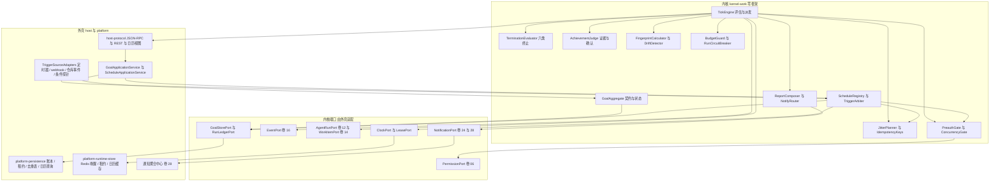
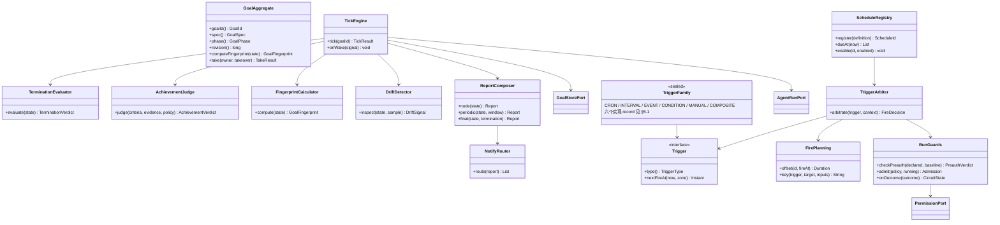
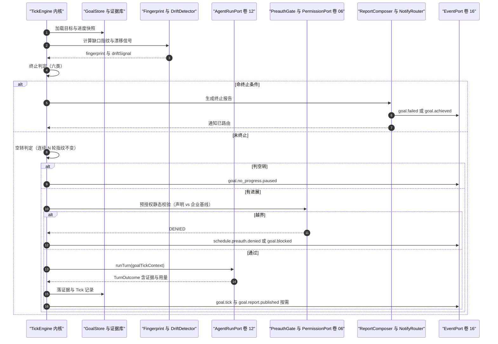
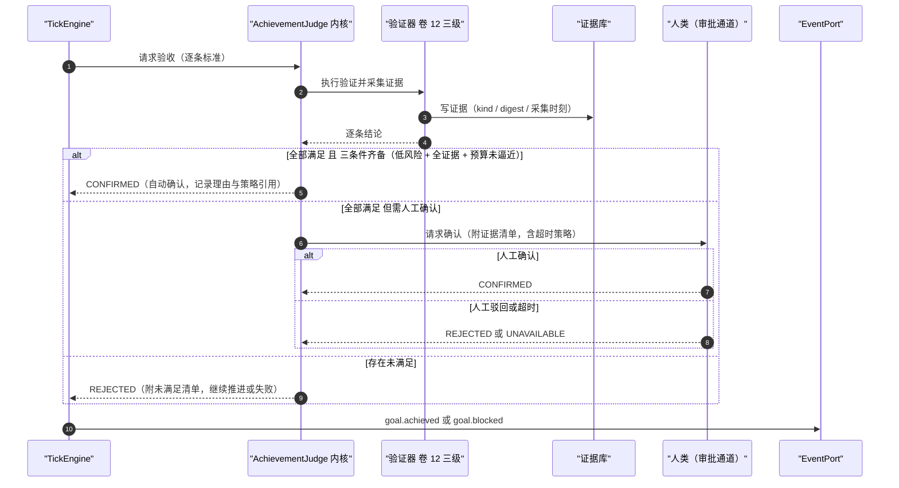
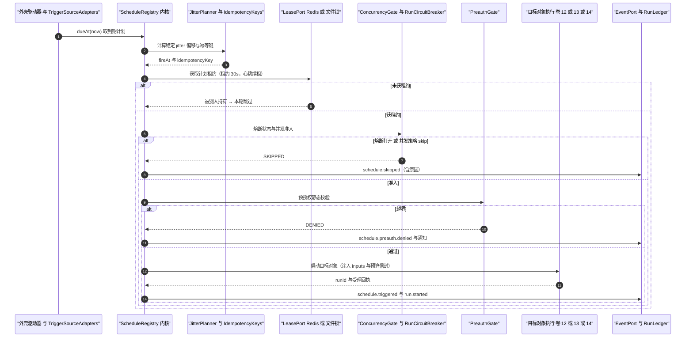
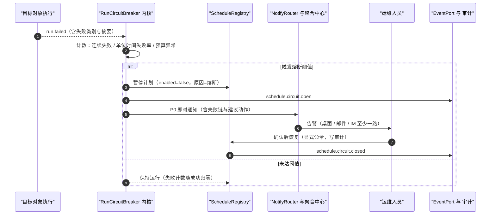
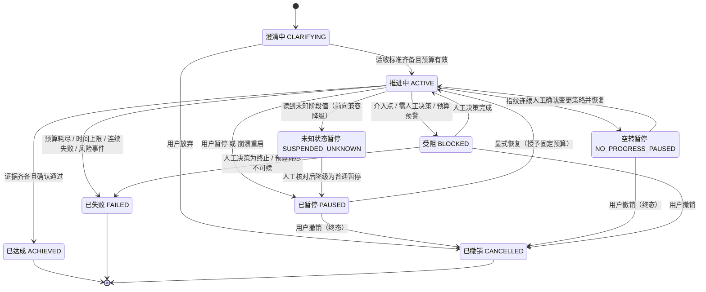
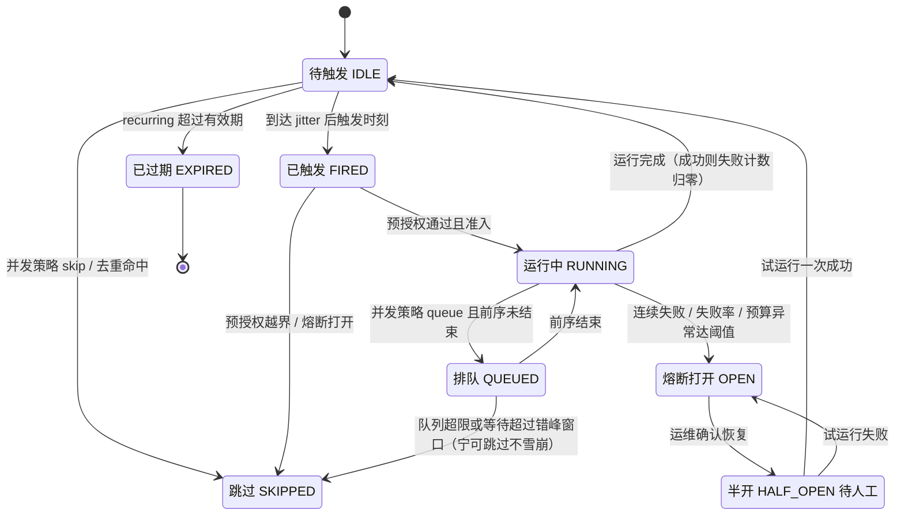

# 实现方案 15 · Goal 自治循环与 Schedule 调度（Goal & Scheduler Implementation）

> 本文件是 Phase B 实现层方案，对应 Phase A 卷 15（`docs/harness/15-goal-and-schedule.md`）的域内决策 D-GOAL-1…6 与 D-SCH-1…7，
> 并落实研究台账 `research/LESSONS-AND-ADOPTIONS.md` 中落在本文件的四行采纳项 **L-032 / L-044 / L-045 / L-046 / L-083**
> 与一条 Phase A 修订建议（D-SCH-1…7 缺 jitter / 锁 / 过期 / 上限 / 错过提示，见 §⑩.9）。
>
> 上游契约不可修改：凡与卷 15 表述冲突之处，本文件只记录「反驳证据 + 建议修订」，不改 Phase A 卷册。
> 证据标记沿用 `00-research-plan.md` §2：`[E1]` 源码｜`[E2]` 官方文档｜`[E3]` 第三方｜`[E4]` 推断。
> 实现落点：`harness-kernel/kernel-work`（Tick 引擎、判定与护栏，零框架零 IO）＋ `harness-platform/platform-persistence`（Run 账本与租约）
> ＋ `harness-platform/platform-runtime-store`（Redis 唤醒与租约）＋ `harness-host/host-app` ＋ `harness-host/host-protocol`（触发源接入与通知编排）。

---

## ① 实现目标与范围

### 1.1 本组件解决什么

把「无人值守」做成**可终止、可解释、可熔断、可审计**的两条路径：

- **Goal 模式**：围绕一个带验收标准与约束的目标长期自治推进——每轮 Tick 评估「进展 / 预算 / 失败计数 / 漂移」，
  命中终止条件即停止并汇报，绝不无限空转；达成判定以**可检验证据**为准，模型自评不构成完成依据。
- **Schedule 模式**：按「时间 / 事件 / 条件 / 手动 / 组合」五类触发器唤醒既定对象（任务模板 / 计划模板 / Goal / 会话模板），
  带预授权边界、并发策略、幂等去重、熔断与通知路由——无人批准时仍然可控，有人干预时立即让位。

两条路径共享同一套**治理设施**：预算硬上限、预授权网闸、失败熔断、通知与升级、全量审计与事件化。

### 1.2 与 Phase A 的对应关系

| Phase A 决策 | 本文件落实位置 |
| --- | --- |
| D-GOAL-1 分档自治（受企业基线钳制） | §③ D-GSI-8、§⑤ `AutonomyLevel`、§⑨ `AutonomyPolicySPI` |
| D-GOAL-2 多重终止（六类） | §⑤ `TerminationReason`、§⑦.1 状态机、§⑥.1 Tick 时序 |
| D-GOAL-3 证据优先达成判定 + 低风险自动确认 | §⑥.2、§⑧ `oc_goal_criterion` / `oc_goal_evidence` |
| D-GOAL-4 周期对照漂移检测 | §③ D-GSI-4、§⑥.4、§⑧ `oc_goal_tick.drift_score` |
| D-GOAL-5 三级汇报（节点/周期/结束） | §⑥.1、§⑨ `ReportFormatterSPI`、§⑧ 通知路由 |
| D-GOAL-6 显式介入点 + 随时介入 | §⑤ `InterventionPoint`、§⑦.1 `BLOCKED`、§⑥.1 |
| D-SCH-1 五类触发器统一模型 | §⑤ `Trigger` sealed 族、§③ D-GSI-2、§⑧ `oc_schedule_trigger` |
| D-SCH-2 四类触发对象 | §⑤ `TriggerTarget`、§⑧ `oc_schedule.target_type` |
| D-SCH-3 并发策略 + 幂等键去重 | §⑥.3、§⑧ `oc_schedule_run.uk(idempotency_key)` |
| D-SCH-4 预授权边界 + 越界即停 + 全审计 | §③ D-GSI-7、§⑧ `oc_schedule_preauth`、§⑥.3 |
| D-SCH-5 五通道通知 + 级别路由 + 聚合静默 | §⑨ 配置、§⑩.6；聚合中心复用卷 28 D-DIST-10 |
| D-SCH-6 熔断（失败阈值/失败率/预算异常） | §⑤ `CircuitBreakerPolicy`、§⑥.4、§⑦.2 |
| D-SCH-7 计划日历 + 资源冲突检测 | §⑥.3、§⑧ Redis 日历视图、§⑨ 日历端点 |
| H-006 追加事件日志 + 投影 | §⑧.3 事件清单、§⑩.5 审计与投影 |
| 卷 28 D-DIST-10 通知聚合中心 | §⑨ `NotificationChannelSPI`、§⑩.6 |
| 卷 34 D-AUTO-1/2 模板即配置 | §③ D-GSI-9、§⑤ `TriggerTarget.TEMPLATE` |

### 1.3 本组件不解决什么

- **不解决**单轮执行（卷 12）：Tick 只做「选下一步 + 校验 + 派发」，执行细节与恢复由 `AgentRuntime` 承担。
- **不解决**任务模型与 DAG（卷 14）：Goal 通过 `WorkItemPort` 读写任务树，自己不实现状态机。
- **不解决**团队编排（卷 13）：复杂计划以 `team.run` 触发对象委托，预算信封复用卷 13 熔断。
- **不解决**权限决策本身（卷 06）与沙箱档位（卷 07）：预授权只是**前置静态门**，动作仍走完整决策链。
- **不解决**通知传输实现（卷 24/28）：本组件只做「级别 → 渠道」路由与聚合语义，投递交给聚合中心。

### 1.4 上下游依赖

| 方向 | 依赖对象 | 接口 |
| --- | --- | --- |
| 上游 | 事件（卷 16） | `EventPort.append`（`goal.*` / `schedule.*` 全部事件）、分区键 = `goalId` / `scheduleId` |
| 上游 | 持久化（卷 19） | `GoalStore` / `ScheduleStore` / `RunLedger` / `TickStore` 端口；写操作由外壳实现事务 |
| 上游 | Agent 运行时（卷 12） | `AgentRunPort.runTurn(goalTickContext)`；返回 `TurnOutcome`（含证据与用量） |
| 上游 | 任务（卷 14） | `WorkItemPort.nextExecutable(planId)` / `markEvidence` / `stateOf` |
| 上游 | 权限（卷 06） | `PermissionPort.decide(action, context)`；预授权越界以 `SCHEDULE_PREAUTH_DENIED` 返回 |
| 上游 | 模型（卷 02） | 仅用于汇报生成与漂移语义比对（可降级为词面相似度，不阻塞主链路） |
| 上游 | 时钟与租约 | `ClockPort`（可注入假时钟，保证测试确定性）、`LeasePort`（Redis 或 DB 实现） |
| 下游 | 通知（卷 24/28） | `NotificationPort.notify(route, message)`；渠道不可用降级为界面提示 + 日志 |
| 下游 | 自动化模板（卷 34） | 模板 `triggers[]` / `target` / `permissions` / `budget` 直接映射为 `ScheduleDefinition` |
| 下游 | 运维（卷 32） | 日历视图、熔断状态、错过触发明细供值班排查 |

### 1.5 模块落点

```text
harness-contract/.../contract/goal/       枚举 GoalId/GoalPhase/AutonomyLevel/TerminationReason/VerdictValue；record GoalSpec/AcceptanceCriterion/GoalBudget/InterventionPoint/ReportingPolicy/TickResult/GoalFingerprint/DriftSignal/GoalReport；SPI GoalTickEngineSPI/FingerprintPolicySPI/DriftPolicySPI/AchievementPolicySPI
harness-contract/.../contract/schedule/   枚举 ScheduleId/TriggerType/ConcurrencyPolicy/RunOutcome/CircuitState；sealed Trigger 族；record ScheduleDefinition/TriggerSpec/PreauthPolicy/NotificationRoute/CircuitBreakerPolicy；SPI TriggerSPI/TriggerEvaluatorSPI/CircuitBreakerPolicySPI/NotificationChannelSPI/ReportFormatterSPI
harness-kernel/kernel-work/.../work/
    goal/     GoalAggregate、TickEngine、TerminationEvaluator、AchievementJudge、DriftDetector、FingerprintCalculator
    sched/    ScheduleRegistry、TriggerArbiter、JitterPlanner、IdempotencyKeys、ConcurrencyGate、PreauthGate
    guard/    BudgetGuard、RunCircuitBreaker、NoProgressGuard、ConvergenceGuard
    report/   ReportComposer（节点/周期/结束三级）、NotifyRouter（级别 → 路由）；state/ 纯内存聚合与迁移表（可重放）
harness-platform/platform-persistence/... goal/ GoalJdbcStore、TickJdbcStore、EvidenceJdbcStore；sched/ ScheduleJdbcStore、RunLedgerJdbcStore、PreauthAuditJdbcStore、MissedFireReconciler
harness-platform/platform-runtime-store/...  LeaseRedisAdapter、WakeChannel、ScheduleCalendarCache
harness-host/host-app/...                    GoalApplicationService、ScheduleApplicationService、TriggerSourceAdapters
harness-host/host-server/...                 SchedulerRunner（`@Scheduled` 扫描与租约抢占的宿主侧驱动器；卷 27 §4.3 卷 15 → `kernel-work` + `host-server`）
harness-host/host-protocol/...               goal.* / schedule.* JSON-RPC、管理面 REST、日历视图
```

**分层纪律**：`kernel-work` 不依赖 Spring / JDBC / Redis / HTTP（卷 27 R1）；所有时间获取走 `ClockPort`，所有锁与唤醒走 `LeasePort`，
内核在单测中可直接内嵌内存实现，不引入容器。**调度器宿主落点（R07 补）**：`@Scheduled` 触发入口只在 `harness-host/host-server` 的 `SchedulerRunner`，内核与平台层不得自带定时器（嵌入式/CLI 档由 `host-app` 显式驱动同一端口）。

### 落地核对（R07：模块 / 顺序 / 批次 / 门禁 / I-* 落点）

- **模块（卷 27 §4.1/§4.3 权威名）**：`harness-contract`（`contract/goal`、`contract/schedule`）+ `harness-kernel/kernel-work`（`work/goal|sched|guard|report`）+ `harness-platform/platform-persistence` + `harness-platform/platform-runtime-store` + `harness-host/host-app` + **`harness-host/host-server`（调度器宿主，R07 新增）** + `harness-host/host-protocol`。
- **实施顺序（卷 27 §4.5）**：第 19 步「Teams + Goal + Schedule（自治与编排）」，依赖第 14 步（WorkItem/调度记录）、第 16 步（记忆/知识：目标上下文与证据）、第 18 步（插件：触发器与报告格式化扩展）。**前置校正**：本层复用第 5 步的 `oc_checkpoint`（不新建检查点，见 §⑦ 唯一口径），故 15 不在第 14 步之前开工。
- **数据批次（卷 27 §4.4）**：`oc_goal`、`oc_goal_criterion`、`oc_goal_evidence`、`oc_goal_session`、`oc_goal_tick`、`oc_schedule`、`oc_schedule_trigger`、`oc_schedule_run`、`oc_schedule_missed`、`oc_schedule_preauth` → **B4**（工作对象 + 团队 + 调度记录），依赖 B1。
- **门禁映射（卷 27 §4.6）**：kernel-work 单元（假时钟）→ 「单元测试 + 覆盖率门」；PG + Redis 集成 → 「集成测试」；`goal-gate.sh`（长跑/故障注入/回放）→ 「集成测试」+「契约测试」；Tick/触发时延门禁 → 「性能基准（抽样）」。
- **I-* 落点**：I-GOAL-1 → `harness-kernel/kernel-work`（`TickEngine`）+ `harness-host/host-server`（`SchedulerRunner` 外壳驱动器，文件锁/租约双形态）；I-GOAL-2 → `kernel-work`（节流：周期 + 事件唤醒 + 退避）+ `platform-runtime-store`（`WakeChannel`）；I-GOAL-3 → `kernel-work`（`NoProgressGuard` 复合指纹 + `FingerprintCalculator`）；I-GOAL-4 → `kernel-work`（`DriftDetector` 规则锚 + 语义可降级）；I-GOAL-5 → `kernel-work`（`IdempotencyKeys` + `JitterPlanner`）+ `platform-persistence`（唯一约束）；I-GOAL-6 → `kernel-work`（`PreauthGate`）+ `kernel-permission`（动作前权限链）+ `platform-persistence`（`oc_schedule_preauth`）；I-GOAL-7 → `kernel-work`（`AchievementJudge` 三条件 + fail-closed）；I-GOAL-8 → `kernel-work`（`ReportComposer`/`NotifyRouter`）+ `host-protocol`（通知路由）；I-GOAL-9 → `harness-contract`（`TargetInvocation` 统一四类对象，验收语义与 14/34 同源）。

---

## ② 功能需求清单（REQ-GOAL-n）

| REQ | 需求描述 | 来源 | 优先级 | 验收要点 |
| --- | --- | --- | --- | --- |
| REQ-GOAL-01 | Goal 契约九要素落地（objective / acceptanceCriteria / constraints / budget / autonomyLevel / interventionPoints / reportingPolicy / termination / stateRef） | 卷 15 §4.1 | P0 | 契约缺验收标准时进入「澄清」而非直接开跑；字段非法在装载期拒绝 |
| REQ-GOAL-02 | 分档自治（建议 / 协作 / 自治）由「任务类型 × 风险 × 用户信任」决定，企业基线钳制且不可被计划放宽 | 卷 15 §3 D-GOAL-1、§4.5；卷 06 | P0 | 越权放宽尝试返回 `POLICY_OVERRIDE_DENIED` 并记安全审计 |
| REQ-GOAL-03 | 多重终止六类：验收达成 / 预算耗尽 / 时间上限 / 连续失败 / 目标撤销 / 风险事件；任一命中即停并生成终止报告 | 卷 15 §3 D-GOAL-2、§8 DoD | P0 | 六类各有单测用例；终止报告含触发类别与证据快照 |
| REQ-GOAL-04 | 达成判定「证据优先 + 人工确认（低风险可豁免）」；确认结果为**封闭结果集**且 fail-closed | 卷 15 §4.3；竞品 DeepSeek 审批封闭结果集 `allowed-once/rejected/cancelled/unavailable` 与「应答者缺失/抛异常一律降级」[E1]（`04-deepseek-harness.md` §4.4） | P0 | 「假完成」用例被拦截：声称达成但证据缺失 → 拒绝且不推进状态 |
| REQ-GOAL-05 | 漂移检测周期对照（验收进展 / 目标语义 / 约束扫描），检出即暂停并汇报 | 卷 15 §3 D-GOAL-4 | P0 | 用例：执行偏离目标（改无关模块）在 N 轮内被检出 |
| REQ-GOAL-06 | 三级汇报：节点（阶段完成/阻塞/风险即时）+ 周期（默认 30 分钟或每 10 步）+ 结束（完整报告） | 卷 15 §3 D-GOAL-5、§10 | P1 | 汇报进预算计量且不刷屏（聚合去重） |
| REQ-GOAL-07 | 显式介入点（如上线前、数据迁移前）必须人工确认，同时保留随时插话/接管 | 卷 15 §3 D-GOAL-6；卷 12 D-AG-7 | P0 | 介入点未确认前不允许越过；确认结果写事件 |
| REQ-GOAL-08 | **空转检测**：连续 N 轮「缺口指纹」不变即自动暂停（`NO_PROGRESS_PAUSED`），暂停原因带指纹与未满足清单 | 研究台账 L-044 `[E1]`（`06 §8-4` goal_tracker 缺口指纹 + NoProgressPaused）；卷 15 D-GOAL-2/4 | P0 | 长任务不误暂停（指纹防抖）；空转用例必暂停 |
| REQ-GOAL-09 | **未知状态一律降级为可恢复暂停**（版本回滚 / 新状态被旧内核读到 → 暂停而非按默认分支自驱） | 研究台账 L-044 `[E1]`；`research/LESSONS-AND-ADOPTIONS.md` §3.13 | P0 | 注入未知 `phase` 值 → 暂停 + 告警，不继续执行 |
| REQ-GOAL-10 | **Goal 归属与夺取**：`ownerSessionId` 单一所有者 + 显式 `take` 夺取（需确认）+ 崩溃后 `ACTIVE → PAUSED` + resume 授予固定预算 | 研究台账 L-045 `[E2]`（`07 §8-3`）；卷 15 D-GOAL-6 | P0 | 双端同时推进被 owner 检查拦截；崩溃重启后 Goal 为 `PAUSED` 而非自驱 |
| REQ-GOAL-11 | **Goal 契约 kickoff 一次注入、续跑仅追加短提示**，避免改写系统提示前缀击穿缓存 | 研究台账 L-032 `[E1]`（Claude Code 缓存前缀契约）；卷 03 D-CTX-6 | P0 | 缓存命中率指标 `oc_goal_contract_cache_hit_ratio` 可观测；续跑不重写契约节点 |
| REQ-GOAL-12 | 五类触发器统一模型（时间/事件/条件/手动/组合），组合支持 AND/OR + 去抖 + 节流 | 卷 15 §3 D-SCH-1、§8 DoD | P0 | 五类各自用例 + 组合用例；去抖窗口生效 |
| REQ-GOAL-13 | 四类触发对象（任务模板 / 计划模板 / Goal / 会话模板），对象由触发器决定、输入由计划注入 | 卷 15 §3 D-SCH-2 | P0 | 四类各一个端到端用例；目标不存在时触发失败并通知 |
| REQ-GOAL-14 | **触发抖动与治理**：按计划 ID 稳定 jitter（recurring ≤10% 封顶 15 分钟、一次性 ≤90 秒）＋ 单进程文件锁 / 集群 Redisson 租约 ＋ recurring 7 天过期 ＋ 在册计划数上限 ＋ 错过触发提示 | 研究台账 L-045 `[E2]`；Phase A 修订建议 D-SCH-1…7 增量（`research/LESSONS-AND-ADOPTIONS.md` §5） | P0 | jitter 对同一计划幂等可重算（非随机）；上限与过期可配且生效 |
| REQ-GOAL-15 | 并发策略四值（skip 默认 / queue / replace / parallel）＋ 幂等键（触发源 + 目标 + 输入哈希）去重 | 卷 15 §3 D-SCH-3 | P0 | 重复触发在去重窗口内产生 `schedule.deduplicated` 而非第二次运行 |
| REQ-GOAL-16 | 预授权边界（Allowlist Policy）：触发前静态校验 + 动作前经权限链 + 越界暂停并通知 + 全审计 | 卷 15 §3 D-SCH-4、§4.5 | P0 | 越界用例：计划声明外动作被拒并记 `schedule.preauth.denied` |
| REQ-GOAL-17 | 通知五通道（桌面 / CLI / 邮件 / IM / Webhook）+ 级别路由 + 聚合去重 + 静默时段 | 卷 15 §3 D-SCH-5；卷 28 §4.7 D-DIST-10 | P1 | 至少三通道可用；P0 可穿透静默；去重窗口内同类通知合并 |
| REQ-GOAL-18 | 熔断：连续失败 N 次（默认 3）/ 单位时间失败率超阈 / 预算消耗异常 → 自动暂停计划并告警，恢复需人工确认 | 卷 15 §3 D-SCH-6、§8 DoD | P0 | 熔断打开后不再触发；关闭需显式确认并写审计 |
| REQ-GOAL-19 | 计划日历视图 + 资源冲突检测（同工作区 / 同分支 / 同环境 / 同预算池），冲突给错峰建议 | 卷 15 §3 D-SCH-7 | P2 | 冲突用例：两计划同分支 03:00 触发 → 视图标红并给建议 |
| REQ-GOAL-20 | **模板作为可调度资产**：`instructions + prompt + parameters + response(JSON schema) + sub_recipes + cron + deeplink` 一一映射到 `ScheduleDefinition` 的字段集 | 研究台账 L-046 `[E1]`（`09 §⑤ S12` Goose `recipe/mod.rs:43-210`、`scheduler.rs:275-320`）；卷 34 D-AUTO-1/2 | P1 | 模板 `verification` 与 Goal `acceptanceCriteria` 统一为同一契约（禁止两套） |
| REQ-GOAL-21 | **会话归属三态**：默认保留 N（=3）个会话 / `null` 全留 / `>=1` 保留并归档更早；禁止隐式无限增长 | 研究台账 L-083 `[E1]`（`05 §8 M15` keepSessions 判别联合）；卷 15 D-SCH-2 | P2 | 三态各有用例；归档产生 `schedule.sessions.archived` 事件并进保留策略 |
| REQ-GOAL-22 | **自治推进必须自建**：Goal 不是元数据 CRUD——必须有 Tick 循环、进展度量与终止判定 | 竞品反面证据：Codex Goal 仅 `thread/goal/{set,get,clear}` + `ThreadGoalUpdated` 广播、无自治循环 [E1]（`03-codex.md` §4.10、§7-5）；OpenCode 明确无 Goal/Schedule [E1]（`02-opencode.md` §7 L6） | P0 | 长跑用例：Goal 在无人工干预下推进 ≥ 20 轮并正确终止 |
| REQ-GOAL-23 | Tick 节流：定时唤醒（默认 1 分钟，仅评估）+ 事件唤醒（子任务完成/失败即时推进）+ 空闲退避（无进展退避至 5 分钟） | 卷 15 §4.2、§10 | P0 | 空闲退避生效且不丢事件唤醒；评估耗时 ≤ 200ms |
| REQ-GOAL-24 | 与 Teams / 任务协同：Schedule 可触发任务/计划模板与团队执行；Goal 推进任务 DAG 并消费团队汇报 | 卷 15 §4.6；卷 13 D-TEAM-* | P1 | 跨系统只经端口与事件，不共享内存状态 |
| REQ-GOAL-25 | 手动触发与调度器降级：调度器不可用时手动触发仍可用；通知渠道不可用时降级为界面提示 + 日志 | 卷 15 §7 可用性 | P1 | 停 Redis 后手动触发链路可达；渠道失败不阻塞运行 |

**竞品与台账增量需求说明**：REQ-GOAL-04/08/09/10/14/20/21/22 来自竞品源码事实与 `LESSONS-AND-ADOPTIONS.md`
落点矩阵（L-032 / L-044 / L-045 / L-046 / L-083），是 Phase A 未下沉到机制层的实现级需求；其中 REQ-GOAL-14 与 §⑩.9 的修订建议同源。
REQ-GOAL-11 与卷 03/04 共享同一条 L-032 落点，本文件以「引用 L-032 + §⑨ 配置项」方式落地，首次 `I-` 登记在 `03-context-engine-impl.md`。

---

## ③ 技术方案选型（M×N 比选）

评分沿用 `README.md` §4：**F 30% / U 20% / S 25% / M 25%**；加权总分 = `30F+20U+25S+25M` / 10。

### 3.1 九维分叉矩阵（D-GSI-1…9，每维 3 分支）

| 维度 | 分支 | 描述 | F | U | S | M | 加权 | 结论 |
| --- | --- | --- | --- | --- | --- | --- | --- | --- |
| D-GSI-1 Tick 宿主形态 | B1 | 进程内固定线程池（应用内直接调内核） | 7 | 7 | 8 | 6 | 70.0 | 淘汰（多实例重复触发不可解） |
| | B2 | 独立调度服务（调度与 Agent 分进程，Agent 为被调方） | 9 | 8 | 6 | 8 | 78.0 | 吸收其「职责边界」用于 server 形态 |
| | B3 | **双形态：核内 Tick 引擎（纯逻辑）+ 外壳驱动器（local 内嵌线程池 / server 独立 scheduler worker + 分布式租约）** | 9 | 9 | 8 | 9 | **87.5** | **选定** |
| D-GSI-2 Tick 节流与唤醒 | B1 | 固定周期轮询（每 60s 全量扫描） | 6 | 7 | 9 | 8 | 74.5 | 淘汰（事件到达后最多等 60s，且空扫浪费） |
| | B2 | 纯事件驱动（无定时评估） | 7 | 8 | 6 | 7 | 70.5 | 淘汰（无事件时无法评估预算/漂移） |
| | B3 | **混合：周期评估（默认 60s）+ 事件唤醒（即时）+ 空闲退避（至 300s）+ 稳定抖动错峰** | 9 | 9 | 8 | 8 | **85.0** | **选定** |
| D-GSI-3 空转判定 | B1 | 无空转检测 | 5 | 6 | 9 | 5 | 62.0 | 淘汰（烧钱且无产出） |
| | B2 | 单一指纹（验收项状态向量哈希） | 8 | 8 | 8 | 7 | 77.5 | 淘汰（换路线但同状态无法识别，长任务易误停） |
| | B3 | **复合指纹（验收状态 + 未满足集合 + 计划版本 + 关键产物 digest）+ 连续 N 轮不变 + 防抖窗口 + 变化即清零** | 9 | 8 | 8 | 9 | **85.5** | **选定** |
| D-GSI-4 漂移检测 | B1 | 仅模型自评（每轮问模型「是否偏离目标」） | 5 | 7 | 9 | 5 | 64.0 | 淘汰（不可信且每轮加成本） |
| | B2 | 纯规则（进展停滞 + 约束静态扫描） | 8 | 8 | 9 | 8 | 82.5 | 淘汰（漏检语义漂移） |
| | B3 | **复合三路：规则为锚 + 语义相似（嵌入，可降级为词面）+ 约束静态扫描；双阈值仲裁** | 9 | 8 | 8 | 9 | **85.5** | **选定** |
| D-GSI-5 单写者与重复防护 | B1 | 仅 DB 行锁（`SELECT ... FOR UPDATE`） | 8 | 7 | 8 | 7 | 75.5 | 淘汰（长事务占连接池，违卷 06 事务纪律） |
| | B2 | 仅单进程文件锁 | 7 | 7 | 9 | 6 | 72.5 | 保留为 local 形态实现（见 B3） |
| | B3 | **分层：进程内单写者 +（local 文件锁 / server Redisson 租约）+ 幂等键唯一约束 + 错过对账** | 9 | 8 | 9 | 9 | **88.0** | **选定** |
| D-GSI-6 jitter 策略 | B1 | 无 jitter（到点即触发） | 6 | 7 | 9 | 7 | 72.0 | 淘汰（整点风暴） |
| | B2 | 随机 jitter | 8 | 7 | 8 | 6 | 73.0 | 淘汰（同一计划抖动不可重算、不可审计） |
| | B3 | **按「计划 ID + 触发点」稳定哈希的确定性抖动（recurring ≤10% 封顶 15 分钟、一次性 ≤90 秒）** | 9 | 8 | 9 | 9 | **88.0** | **选定** |
| D-GSI-7 预授权校验位置 | B1 | 仅触发前静态校验（计划声明 vs 企业基线） | 7 | 8 | 8 | 7 | 74.5 | 淘汰（运行期可漂移到未声明动作） |
| | B2 | **双层：触发前静态校验 + 每次动作前经卷 06 权限链（含预授权网闸）** | 9 | 8 | 8 | 9 | **85.5** | **选定** |
| | B3 | 仅执行中由权限链兜底（无静态前置） | 8 | 7 | 7 | 8 | 75.5 | 淘汰（越界到执行期才暴露，破坏面大） |
| D-GSI-8 达成确认结果 | B1 | 布尔（达成 / 未达成） | 6 | 7 | 8 | 6 | 67.0 | 淘汰（无法表达「等人确认」与「无人应答」） |
| | B2 | 三值（达成 / 待确认 / 未达成） | 8 | 8 | 8 | 8 | 80.0 | 淘汰（无应答与驳回混为一谈） |
| | B3 | **封闭结果集 `CONFIRMED` / `REJECTED` / `UNAVAILABLE` + 自动确认三条件 + fail-closed** | 9 | 8 | 9 | 9 | **88.0** | **选定** |
| D-GSI-9 模板契约映射 | B1 | 触发对象自带独立字段集（各写一套） | 7 | 7 | 7 | 6 | 67.5 | 淘汰（两套契约必漂移） |
| | B2 | **统一契约：Goal 验收标准 = 模板 `verification` = 任务验收（同一 `AcceptanceCriterion` 语义）** | 9 | 8 | 8 | 9 | **85.5** | **选定** |
| | B3 | 模板只做提示词，其余运行时生成 | 6 | 7 | 8 | 6 | 67.0 | 淘汰（不可治理、不可审计） |

**选定要点、被放弃代价与回退触发**：

| 维度 | 选定要点（对齐依据） | 被放弃分支代价 | 回退触发 |
| --- | --- | --- | --- |
| D-GSI-1 | 核内逻辑 + 外壳驱动器双形态；server 形态对齐「核内循环 + 独立调度服务」职责边界（`CROSS-COMPARISON.md` M25 `[E1]` OpenHands Automation Server） | B1 的简单性被放弃，代价是必须实现租约与幂等两套机制 | 租约争用率 > 5%（`oc_schedule_lease_contention_total`）→ 租户分片调度 worker 池（接口不变） |
| D-GSI-2 | 卷 15 §4.2 的 Tick 频率语义完整落地；唤醒走 `WakeChannel` 边沿触发（容量 1），周期评估兜底预算与漂移 | B1 的可预测性被放弃，代价是「空闲退避 + 事件唤醒」需可观测（`oc_goal_tick_interval_seconds`）以免误判卡死 | `oc_goal_tick_latency_ms` P95 > 2s → 退化纯周期扫描 + 漂移抽样 |
| D-GSI-3 | 对齐 L-044「缺口指纹连续不变即暂停」，并处理其自陈风险（防抖）：连续 N 轮（默认 3）指纹完全相同且距上次产出变化 ≥ 防抖窗口（默认 600s）才判空转 | B2 的实现简单被放弃，代价是四分量需稳定序列化规范（`FingerprintPolicySPI` 可替换算法） | 空转误判率（恢复后 1 轮内即产生新产出）> 10% → 提高 N 或移除语义分量 |
| D-GSI-4 | 语义分量**默认降级可用**（无嵌入模型时用词面 Jaccard / 路径集合重叠度）；规则命中即暂停，仅语义越界先「观察一次」 | B1 的低成本被放弃（每轮约 0.3–1 次模型调用），代价是语义漂移可能延迟一到两轮 | 误报率 > 20% → 关闭语义分量（配置开关），仅保留规则路 |
| D-GSI-5 | L-045 的「文件锁单进程驱动」升级为双形态：local 文件锁（`FileLockPort`）、server Redisson 租约（30s + 心跳）；两层之外以幂等键唯一约束兜底 | B1 的强一致被放弃（锁只保证单写者）；代价是必须有去重表，Redis 故障时降级为「排队 + 人工确认」 | Redis 不可用 → `lease.mode=DB_ADVISORY`（PG advisory lock）并降并发；再不可用 → 暂停自动触发只保手动 |
| D-GSI-6 | L-045 的核心教训「随机 jitter 会造成同时刻风暴」：稳定哈希保证任意实例、任意时刻算出同一偏移，可重算可审计 | B1/B2 的低成本被放弃，代价是必须实现 `JitterPlanner` 并记录触发时刻以便复盘 | 对账类业务要求准点 → 允许 `jitterPolicy=STRICT_AT`（默认关闭，企业显式开启并记审计） |
| D-GSI-7 | 卷 15 §4.5 五层模型的精确落地：静态校验保证不合规触发**根本不会启动**，动作前网闸拦截运行期漂移；越界一律暂停 + 通知（`SCHEDULE_PREAUTH_DENIED`） | B3 的实现简单被放弃，代价是每动作一次网闸校验（0.2–1ms 纯内存判定） | 网闸误报率 > 1% → 收紧声明生成器（模板 `permissions.allow` 预填）而非放宽网闸 |
| D-GSI-8 | 对齐 DeepSeek 审批封闭结果集与「应答者缺失/非持有/抛异常/不合规一律降级」的 fail-closed 语义 [E1]；自动确认仅限低风险 + 全证据 + 预算未逼近三条件（卷 15 §10） | B2 的简单被放弃，代价是 UI 与通知必须区分三种结果（含「无人应答」升级路径） | `UNAVAILABLE` 占比 > 30% → 降级为「节点汇报 + 继续推进」并告警 |
| D-GSI-9 | 对齐 L-046「响应 schema 与验收标准须统一」；四类对象共用 `TargetInvocation{targetType, targetRef, inputs, acceptanceOverride?, sessionPolicy?}`，模板 YAML 直接解析为该结构 | B1/B3 的自由度被放弃，代价是模板表达力受契约约束（经 `inputs` schema 扩展缓解） | 表达力不足 → 只扩展 `inputs` schema，不新增字段 |

### 3.2 实现级决策登记（I-GOAL-n）

| ID | 主题 | 选定 | 理由与代价 | 回退触发 |
| --- | --- | --- | --- | --- |
| I-GOAL-1 | 循环宿主 | 核内 Tick 引擎 + 外壳驱动器双形态（local 文件锁 / server 租约） | 同一判定逻辑单测可覆盖两形态；代价是两套锁实现 | 租约争用 > 5% → 租户分片 worker |
| I-GOAL-2 | 节流 | 周期评估 + 事件唤醒（边沿触发）+ 空闲退避 + 稳定抖动 | 及时且省资源；代价是需可观测唤醒延迟 | 评估 P95 > 2s → 退化为纯周期 + 抽样漂移 |
| I-GOAL-3 | 空转判定 | 复合指纹 + 连续 N 轮不变 + 防抖窗口；**未知状态降级为暂停** | 拦截空转且不误停；代价是指纹需稳定序列化 | 误判率 > 10% → 调 N 或去语义分量 |
| I-GOAL-4 | 漂移检测 | 规则为锚 + 语义可降级 + 双阈值仲裁 | 离线可用、可解释；代价是有观察窗口 | 误报 > 20% → 关闭语义分量 |
| I-GOAL-5 | 触发去重 | 幂等键（源+目标+输入哈希）唯一约束 + 稳定 jitter + 过期与上限 | 不重不漏；代价是去重表需保留窗口 | 去重表膨胀 → 仅留「最近窗口 + 运行记录」两级 |
| I-GOAL-6 | 预授权 | 触发前静态校验 + 动作前权限链 + 越界即停 | 越界不落地；代价是声明生成需模板预填 | 误报 > 1% → 改声明生成器 |
| I-GOAL-7 | 达成确认 | 封闭结果集 + 自动确认三条件 + fail-closed；未确认即 `UNAVAILABLE` | 不失真完成；代价是可能阻塞等待人工 | `UNAVAILABLE` > 30% → 降级为汇报继续 + 告警 |
| I-GOAL-8 | 汇报与通知 | 三级汇报 + 级别路由 + 聚合去重 + 静默；聚合复用卷 28 中心 | 不刷屏且不丢关键 | 通知渠道长期不可用 → 只保留界面 + 日志并告警 |
| I-GOAL-9 | 模板契约 | `TargetInvocation` 统一四类对象；验收语义与卷 14/34 同源 | 一套契约、可治理；代价是跨卷一致性测试 | 表达力不足 → 只扩展 `inputs` schema |

**与竞品对照的取舍**：自治循环路线以 Grok CLI 的 goal_tracker 为最主要正面来源（`research/competitors/06-grok-cli-and-build.md` §8-4 `[E1]`：空转即暂停 + 未知状态降级暂停，L-044；崩溃后 active→paused + 固定预算 resume，L-045），并吸收 MiniMax CLI 的会话归属三态（`research/competitors/05-minimax-cli.md` §8 M15 `[E1]`，L-083）与 goose 系「模板 / Recipe = 可调度资产」（`research/competitors/09-secondary-tier.md` §⑤ S12 `[E1]`，L-046）。**取舍**：保留「单写者 + 稳定抖动」的竞品共识，但把单进程文件锁升级为三形态租约（Redis / 本地文件 / PG advisory）以覆盖 server 形态（D-GSI-5）；**显式放弃**随机抖动与「无限补跑」——前者造成同时刻风暴（L-045 反证），后者在时钟跳变下会叠放大量运行（本文件以 `CATCH_UP_ONE` 封顶）；语义漂移仲裁为增量差异化项（竞品仅做空转判定，无漂移分路）。

---

## ④ 总体架构图



**内核/外壳边界**：内核只做「判定 + 编排 + 组装」，全部 IO 经端口；`host-bootstrap` 以显式装配计划注入端口实现
（local 内嵌档复用同一装配，只是把 `LeasePort` 换成文件锁实现）。
**Spring 装配点**：`platform-persistence`（`@Transactional(rollbackFor = Exception.class)` 的写操作适配器）、
`platform-runtime-store`（Redisson 租约与唤醒）、`host-app`（触发源适配器与通知路由）；配置类为纯数据类（不加 `@Component`），由 `@ConfigurationPropertiesScan` 激活。

---

## ⑤ 类图与关键契约



### 5.1 关键 Java 21 签名（内核契约，零框架依赖）

```java
// GoalAggregate（见 §⑤ 类图）：goalId() / spec() / phase() / revision() /
// computeFingerprint(GoalProgressSnapshot) / take(owner, takeover)——
// 契约要求 computeFingerprint 幂等且可重放，phase() 对未知持久化值必须降级为 SUSPENDED_UNKNOWN。

/** Goal 阶段（DB 存 code，前端传 code；desc 仅展示，禁止入库）。 */
@Getter
@RequiredArgsConstructor
public enum GoalPhase {
    CLARIFYING("CLARIFYING", "澄清中"),
    ACTIVE("ACTIVE", "推进中"),
    PAUSED("PAUSED", "已暂停"),
    NO_PROGRESS_PAUSED("NO_PROGRESS_PAUSED", "空转暂停"),
    SUSPENDED_UNKNOWN("SUSPENDED_UNKNOWN", "未知状态暂停"),
    BLOCKED("BLOCKED", "受阻"),
    ACHIEVED("ACHIEVED", "已达成"),
    FAILED("FAILED", "已失败"),
    CANCELLED("CANCELLED", "已撤销");

    private final String code;
    private final String desc;

    /**
     * 按业务码解析阶段。
     *
     * @param code 持久化或事件携带的业务码（必填）
     * @return 对应阶段
     * @throws HarnessException 未知 code；调用方必须降级为 {@link #SUSPENDED_UNKNOWN} 并告警，禁止按默认分支自驱
     */
    public static GoalPhase of(String code) {
        for (GoalPhase phase : values()) {
            if (phase.code.equals(code)) {
                return phase;
            }
        }
        throw new HarnessException(ErrorCode.NOT_FOUND, "未知 Goal 阶段：" + code);
    }
}

/** 多类终止原因（任一命中即停止，可多条并存）。 */
public enum TerminationReason { ACHIEVED, BUDGET_EXHAUSTED, TIME_LIMIT, CONSECUTIVE_FAILURES, GOAL_REVOKED, RISK_EVENT }

// 六类触发器实现（CronTrigger / IntervalTrigger / EventTrigger / ConditionTrigger / ManualTrigger / CompositeTrigger）
// 均为同包（contract.schedule）**各自独立编译单元**，字段与构造见 §3.1 D-GSI-2 与 §⑧ 数据模型；
// Java 21 `sealed` 的 permits 类型必须与本接口同包/同模块——**不得**在别包新增实现（新增须改本文件契约）。
/** 一类触发器（sealed 族：五类统一模型 + 组合）。 */
public sealed interface Trigger
        permits CronTrigger, IntervalTrigger, EventTrigger, ConditionTrigger, ManualTrigger, CompositeTrigger {

    /** @return 触发器类型（不可变） */
    TriggerType type();

    /**
     * 计算下一次触发时刻。
     *
     * @param now  当前时刻（注入时钟，非系统时间）
     * @param zone 计划声明的时区（默认用户时区）
     * @return 下一次触发时刻；无未来触发点时返回空
     */
    Optional<Instant> nextFireAt(Instant now, ZoneId zone);
}

/** Goal Tick 引擎：单次评估与派发，须保证「评估幂等」与「派发至多一次」。 */
public interface GoalTickEngine {

    /**
     * 执行一轮评估并按结论派发（或暂停）。
     *
     * @param goalId 目标标识（必填）
     * @return 本轮结论（终止判定、漂移信号、预算快照与派发结果）
     * @throws HarnessException 目标不存在或当前阶段不允许 Tick（文案含当前阶段与期望阶段）
     */
    TickResult tick(GoalId goalId);

    /**
     * 事件唤醒：子任务完成/失败、审批回执、外部条件达成时即时推进。
     *
     * @param signal 唤醒信号（边沿触发、容量 1；重复投递无害）
     */
    void onWake(WakeSignal signal);
}

/** 达成判定结果（封闭结果集，fail-closed）。 */
public record AchievementVerdict(VerdictValue value, List<CriterionVerdict> criteria, String reason) {

    /** 封闭三值：确认 / 驳回 / 不可用（应答缺失、异常、不合规一律降级为后者）。 */
    public enum VerdictValue { CONFIRMED, REJECTED, UNAVAILABLE }
}
```

**异常与契约纪律**：异常按层分工——**内核与契约侧（`harness-kernel` / `harness-contract`，零框架）统一抛 `HarnessException` 并携带 `ErrorCode`**；**外壳侧（`harness-platform` / `harness-host`，Spring）统一抛 `BusinessException`（同携带 `ErrorCode`）**，由外壳全局异常处理器按码映射（错误模型见附录 B §B.7）；内核签名不出现裸 `RuntimeException` / `IllegalArgumentException`；
所有阈值来自 `GoalProperties` / `ScheduleProperties`（§⑨.3），源码内不出现无注释数字。

---

## ⑥ 核心流程时序图

### 6.1 Goal Tick：评估 → 判定 → 预授权 → 派发 → 汇报



**前置条件**：目标处于 `ACTIVE`（其他阶段 Tick 返回 `CONFLICT` 语义的业务异常）。
**主路径**：如上；每轮固定写 `goal.tick`（含进度、预算、漂移与指纹），成为空转判定的输入。
**异常与补偿**：`runTurn` 抛依赖类错误（`DEPENDENCY_UNAVAILABLE`）→ 计一次失败并按熔断策略处理，不立即终止；非幂等动作 `UNCERTAIN` → 暂停为 `BLOCKED` 并生成询问（卷 12 §7）；通知失败仅降级为界面与日志，不影响状态迁移。
**幂等与并发点**：同一目标由 `LeasePort` 租约串行；Tick 以 `(goalId, revision)` 乐观更新，失败重读重算；唤醒信号为边沿触发（容量 1），重复唤醒不产生第二轮派发。

### 6.2 达成判定：证据优先 + 自动确认三条件



**前置条件**：`acceptanceCriteria` 齐备（缺失时目标停在 `CLARIFYING`）。
**主路径**：证据先落库、结论后产生——「先有证据，后有判定」的顺序不可颠倒（否则回放无法复现判定）。
**异常与补偿**：验证器不可用（沙箱/命令超时）→ 该条结论为 `UNAVAILABLE`，整体判定降级 `UNAVAILABLE` 并暂停（fail-closed），禁止按「未验证即通过」处理。
**幂等与并发点**：同一 `(goalId, criterionId, fingerprint)` 的验证结果可复用（缓存盘）；确认事件以 `(goalId, revision)` 唯一，重复确认产生 `CONFLICT` 而非二次迁移。

### 6.3 Schedule 触发：jitter → 锁 → 去重 → 并发策略 → 预授权 → 启动



**前置条件**：计划 `enabled=true` 且未过期（recurring 默认 7 天有效期，过期产生 `schedule.expired`）。
**主路径**：jitter 与幂等键**在取锁之前**计算（纯函数，不依赖锁），因此重复驱动不会产生不同触发时刻。
**异常与补偿**：目标启动失败 → `run.failed` 并按熔断策略累计；错过触发（进程宕机、退避超窗）由 `MissedFireReconciler` 对账：默认**不补跑**，只生成「错过提示」通知（可配 `missedPolicy=CATCH_UP_ONE` 补跑最近一次）。
**幂等与并发点**：`oc_schedule_run.uk(idempotency_key)` 是第二道闸——即使租约失效、两个实例同时触发也只会有一条运行记录；`concurrencyPolicy=queue` 时排队并在前序结束后按序执行（队列深度有上限，超限转 skip 并告警）。

**错过与重复触发处置矩阵（逐格可复算，为 §⑪.3 故障注入的断言依据）**：

| 场景 | 检测方式 | 处置（默认策略） | 幂等保证 | 事件与指标 |
| --- | --- | --- | --- | --- |
| 进程宕机错过触发（单次） | `MissedFireReconciler` 扫描 `expectedAt ∈ (lastScan, now]` 与 `oc_schedule_run` 的差集 | `NOTIFY_ONLY`：不补跑，只生成错过提示 | 不产生运行记录 | `schedule.missed(policy=NOTIFY_ONLY)`；`oc_schedule_missed_total` |
| 错过触发（可配补跑） | 同上 | `CATCH_UP_ONE`：仅补跑最近一次（`expectedAt` 最大者），更早的只提示 | 补跑同样走 `uk(idempotency_key)`；键冲突即判 `DEDUPLICATED` | `schedule.missed(policy=CATCH_UP_ONE, disposition=RUN_ONE)` |
| 双实例同时到期（锁失效） | `oc_schedule_run` 唯一键冲突 | 后到者捕获冲突 → 返回既有 `runId`，**不启动**新运行 | DB 唯一约束为最终兜底（Redis 标记只是快路径） | `schedule.deduplicated`；`oc_schedule_lease_contention_total` |
| 驱动器重放同一 `fireAt` | `RedisKeys.scheduleFired(scheduleId, fireAt)` 命中 | 直接跳过（不取锁、不评估） | 去重窗口 = 2 × 触发周期（封顶 24h） | `schedule.deduplicated` |
| 时钟前跳 | 扫描发现 `expectedAt` 落在过去且无运行记录 | 按错过策略处置（默认仅提示）；**每次扫描最多补 1 次**，禁止连续补跑 | 补跑上限 1 次/计划/扫描 | `schedule.missed` + 告警 |
| 手动 `schedule.fire` 与自动触发同刻 | 幂等键域隔离：手动键由调用方提供（`Idempotency-Key`），自动键 = `hash(scheduleId, triggerId, fireAt)` | 两者可各执行一次（人工意图优先）；**同一调用方重复手动触发**被去重 | 手动键由调用方保证唯一；冲突返回既有 `runId` | `schedule.deduplicated`（手动域） |

**幂等键登记（本文件唯一口径；全表见卷 19 §⑩.3.4）**：自动触发键 = `hash(scheduleId, triggerId, fireAt)`（载体 `oc_schedule_run.uk(idempotency_key)`）；手动触发键 = 调用方 `Idempotency-Key`（**独立域，禁止与自动键混用**）；快速去重标记 = `RedisKeys.scheduleFired(scheduleId, fireAt)`（TTL = 去重窗口，DB 唯一约束为最终兜底）；错过记录 = `uk(schedule_id, trigger_id, expected_at)`；Goal Tick = `(goalId, revision)` 乐观锁；达成确认 = `(goalId, revision)` 唯一（重复确认返回 `CONFLICT`）。**触发键与租约的关系**：jitter 与幂等键在取锁**之前**计算（纯函数），租约只减少并发尝试，**正确性恒由唯一键兜底**。

**Goal 检查点边界（与卷 12 唯一口径）**：Goal **不自建检查点体系**——恢复加速与回退锚点复用卷 12 §⑧.1 `oc_checkpoint`（业务幂等键 `(session_id, seq)`，完整性以锚定事件为准）；本文件只保证 `oc_goal_tick` 序列可重放「进度曲线 + 漂移判定 + 终止判定」（§⑪.4），**禁止引入第二套检查点**。

**算法输入 / 输出与可证伪断言（§⑪.3 故障注入的断言依据）**：

- **输入**：`FireDecision{scheduleId, triggerId, expectedAt, jitterOffset, concurrencyPolicy, leaseState, circuitState, missedPolicy}`；**输出**：`FireOutcome ∈ {FIRED(runId), SKIPPED(reason), DENIED(reason), DEDUPLICATED(existingRunId), MISSED(policy)}`。
- **可证伪断言**（每条都能被具体反例打破）：a) 稳定 jitter 对同一 `(scheduleId, fireAt)` **恒等**（1000 次随机种子下偏移不变；两次驱动得到不同 `fireAt` 即缺陷）；b) 双实例同刻只允许产生 **1 条** `oc_schedule_run`（唯一键冲突返回既有 `runId`；出现第二条或第二次启动即缺陷）；c) `NOTIFY_ONLY` 下出现任何补跑即缺陷；`CATCH_UP_ONE` 单次扫描补跑 **>1 次** 即缺陷；d) 时钟前跳必须按错过策略处置且「每次扫描最多补 1 次」，连续补跑即缺陷；e) 熔断 `OPEN` 期间出现 `schedule.triggered`（新运行）即缺陷；f) 手动域与自动域幂等键混用（人工触发被自动键吞掉）即缺陷；g) 租约失效且唯一键未命中却产生两次启动即缺陷（两层闸门缺一不可）。

### 6.4 熔断与恢复：连续失败 → 打开 → 人工关闭



**前置条件**：熔断策略可由 `CircuitBreakerPolicySPI` 替换；企业基线可强制更严格阈值。**主路径**：失败计数（连续失败 / 窗口失败率 / 预算异常）→ 达阈值置 `OPEN` 并暂停计划（`enabled=false`，原因=熔断）→ P0 通知（失败链 + 建议动作）→ 运维确认后恢复（授予固定预算）→ 半开试运行 → 成功回 `CLOSED`。**异常与补偿**：恢复不是「清零重来」——恢复时授予固定预算信封（与首次触发相同的初始信封），避免无法收敛的任务反复烧钱（L-045「resume 给回固定预算」）。
**幂等与并发点**：熔断状态机为「关闭 → 打开 → 半开（待人工）」；同一失败事件重复投递不重复计数（按 `runId` 去重）。

---

## ⑦ 状态机

### 7.1 Goal 生命周期



**迁移纪律**：`ACHIEVED` / `FAILED` / `CANCELLED` 为终态，**禁止**回退（与「已支付订单禁止回退」同类的资金/审计硬约束语义）；
非法迁移在 `TransferTable` 静态表中拒绝并抛 `HarnessException(CONFLICT, ...)`，迁移与拒绝都写事件。
**重启收敛规则（R05 补全）**：`ACTIVE` 在服务重启后**一律经「收敛接管」置 `PAUSED`**（`goal.paused{reason=CRASH}`），**禁止自动继续推进**；`BLOCKED` 保持原态并向人工重发介入提示（幂等）；`PAUSED` / `NO_PROGRESS_PAUSED` / `SUSPENDED_UNKNOWN` 保持不变（收敛为幂等操作，重复接管不产生第二条事件）。

**Goal 迁移补全（触发 / 守卫 / 副作用）**：`Blocked → Failed`——触发：人工裁决终止；守卫：终态语义（无更多可执行动作）；副作用：写 `goal.failed(reason=ESCALATED)` + 归档证据链；`Paused → Cancelled` 与 `NoProgress → Cancelled`——触发：用户撤销；守卫：非 `ACHIEVED`（已达成不可撤销）；副作用：回收预算信封、写 `goal.cancelled`；**超时路径**：`Unknown` 停留超过 `goal.tick.idleBackoffSeconds` 上限仍无人工核对 → 保持暂停并升级 P0 通知（**禁止**自动降级为可控状态）。

### 7.2 触发器运行与熔断状态



**触发器迁移补全（触发 / 守卫 / 副作用）**：`Queued → Skipped`——触发：队列超限或等待超过错峰窗口；守卫：`concurrencyPolicy=queue`；副作用：写 `schedule.skipped{reason=QUEUE_FULL}` 并告警（宁可跳过不雪崩）。**Goal 侧对应补全**见 §7.1 迁移纪律后的补全表。

**不变量**：`OPEN` 状态下**任何**自动触发都不产生运行记录（`schedule.skipped` 带 `CIRCUIT_OPEN` 原因）；
`HALF_OPEN` 只允许一次试运行（令牌桶容量 1），失败立即回到 `OPEN`。

---

## ⑧ 数据模型

### 8.1 表（`oc_*`，全部含 `tenant_id` 与审计字段 `created_at/created_by/updated_at/updated_by`）

| 表 | 关键字段 | 索引与约束 |
| --- | --- | --- |
| `oc_goal` | `goal_id`、`project_id`、`owner_session_id`、`objective`、`autonomy`、`risk_level`、`phase`、`fingerprint`、`no_progress_rounds`、`budget jsonb`、`termination jsonb`、`reporting_policy jsonb`、`intervention_points jsonb`、`revision`、`last_tick_seq` | `uk(goal_id)`；`(tenant_id, phase)`；`(owner_session_id, phase)`；`revision` 乐观锁 |
| `oc_goal_criterion` | `criterion_id`、`goal_id`、`seq`、`description`、`verifier_kind`（STATIC/EXECUTABLE/SEMANTIC）、`verifier_ref`、`evidence_required`、`state` | `uk(goal_id, seq)`；`(goal_id, state)` |
| `oc_goal_evidence` | `evidence_id`、`goal_id`、`criterion_id`、`kind`、`object_ref`（大对象转对象存储）、`digest`、`collected_at`、`verdict`、`collected_by` | `uk(goal_id, criterion_id, digest)`；`(goal_id, collected_at desc)` |
| `oc_goal_tick` | `tick_id`、`goal_id`、`seq`、`decided_at`、`fingerprint`、`drift_score`、`drift_signals jsonb`、`budget_snapshot jsonb`、`decision`（DISPATCH/PAUSE/TERMINATE/WAIT_HUMAN）、`dispatch_ref` | `uk(goal_id, seq)`；`(goal_id, decided_at desc)`；`(tenant_id, decision)` 部分索引 |
| `oc_goal_session` | `link_id`、`goal_id`、`session_id`、`keep_policy`（KEEP_N=3 默认 / KEEP_ALL=null / KEEP_SINCE=n）、`archived_at`、`is_owner` | `uk(goal_id, session_id)`；`(goal_id, archived_at)` |
| `oc_schedule` | `schedule_id`、`name`、`enabled`、`target_type`（TASK_TEMPLATE/PLAN_TEMPLATE/GOAL/SESSION_TEMPLATE/TEAM_RUN）、`target_ref`、`inputs jsonb`、`workspace_binding jsonb`、`permissions jsonb`、`concurrency_policy`、`notifications jsonb`、`circuit_breaker jsonb`、`budget_default jsonb`、`retention_days`、`expires_at`、`jitter_policy`、`owner_ref` | `uk(schedule_id)`；`(tenant_id, enabled)`；`(tenant_id, expires_at)` 部分索引 `enabled=true` |
| `oc_schedule_trigger` | `trigger_id`、`schedule_id`、`type`、`spec jsonb`（cron/间隔/事件过滤/条件表达式）、`timezone`、`debounce_seconds`、`throttle jsonb`、`enabled` | `uk(trigger_id)`；`(schedule_id, enabled)` |
| `oc_schedule_run` | `run_id`、`schedule_id`、`trigger_id`、`idempotency_key`、`fired_at`、`started_at`、`ended_at`、`outcome`（STARTED/COMPLETED/FAILED/SKIPPED/DEDUPLICATED/CONFIRM_PENDING）、`cause`（含 CIRCUIT_OPEN/PREAUTH_DENIED/SKIPPED_OVERLAP/MISSED）、`cost jsonb`、`error_ref`、`session_ref` | **`uk(idempotency_key)`**；`(schedule_id, fired_at desc)`；`(tenant_id, outcome, fired_at)` |
| `oc_schedule_preauth` | `record_id`、`run_id`、`action_type`、`decision`（ALLOW/DENY）、`policy_ref`、`reason`、`occurred_at` | `(run_id)`；`(tenant_id, decision, occurred_at)`（安全审计视图） |
| `oc_schedule_missed` | `missed_id`、`schedule_id`、`trigger_id`、`expected_at`、`detected_at`、`policy`（NOTIFY_ONLY/CATCH_UP_ONE）、`disposition` | `uk(schedule_id, trigger_id, expected_at)`；`(tenant_id, detected_at desc)` |

**分区与保留**：`oc_goal_tick` 与 `oc_schedule_run` 按月分区（`decided_at` / `fired_at`），保留期跟随计划 `retention_days`（默认 90 天，
审计事件不受此限，走事件日志留存）；`oc_goal_evidence` 的对象引用随目标保留，对象本体按卷 19 生命周期回收。
**对象存储前缀**：`oc-goal-evidence/{tenant}/{goalId}/{criterionId}/{digest}.json`、
`oc-schedule-report/{tenant}/{scheduleId}/{runId}/report.{md,json}`。

### 8.2 Redis Key（统一 `RedisKeys` 工厂，禁止业务代码拼接）

| 语义 | Key 形态 | TTL |
| --- | --- | --- |
| Goal 推进租约 | `RedisKeys.goalRunLease(goalId)` → `oc:goal:run:lock:{goal}` | 租约 30s，心跳每 10s 续租 |
| 计划触发租约 | `RedisKeys.scheduleLease(scheduleId)` → `oc:schedule:lease:{sched}` | 租约 30s，心跳续租 |
| 触发去重标记 | `RedisKeys.scheduleFired(scheduleId, fireAt)` → `oc:schedule:fired:{sched}:{fireAt}` | 2 × 触发周期（封顶 24h）；DB 唯一约束为最终兜底 |
| 唤醒通道 | `RedisKeys.goalWake(goalId)` → `oc:goal:wake:{goal}`（列表，容量 1 边沿触发） | 无（消费即删） |
| 熔断状态缓存 | `RedisKeys.scheduleCircuit(scheduleId)` → `oc:schedule:circuit:{sched}` | 与计划生命周期一致 |
| 日历视图缓存 | `RedisKeys.scheduleCalendar(tenantId, day)` → `oc:schedule:cal:{tenant}:{day}` | 60s（读多写少，短 TTL 抗抖动） |

**降级**：Redis 不可用时租约退化为 PG advisory lock、唤醒退化为 5 秒轮询、去重完全依赖 DB 唯一约束（功能不丢，时延变差）。

### 8.3 事件（卷 15 §6 清单 + 本文件新增 8 条）

`goal.created` / `started` / `paused` / `resumed` / `achieved` / `failed` / `cancelled`、`goal.tick`、`goal.drift.detected`、
`goal.report.published`、`schedule.triggered` / `skipped` / `deduplicated`、`schedule.run.started` / `completed` / `failed`、
`schedule.circuit.open` / `closed`、`schedule.preauth.denied`；
**新增** `goal.owner.taken`（夺取，含前所有者）、`goal.no_progress.paused`（含指纹与连续轮数）、
`goal.fingerprint.changed`（进展信号，含前后指纹）、`goal.budget.clamped`（固定预算与配额取更小者，含两者数值）、
`goal.intervention.requested`（介入点到达）、`schedule.missed`（错过触发与处置）、`schedule.expired`（recurring 超期）、
`schedule.sessions.archived`（会话归属三态归档）。

**事件载荷纪律**：载荷只含业务编号、枚举 code、数值与对象引用，**不含**目标全文中的敏感内容、凭证、外发地址明文
（通知正文经脱敏后再进事件；密钥类字段一律以引用形式出现，见 `.qoder/rules/logging-rules.md` §6）。

### 8.4 指标（卷 15 §6 清单 + 补齐）

`oc_goal_active`、`oc_goal_progress_ratio`、`oc_goal_cost_total`、`oc_goal_ticks_total`、`oc_schedule_runs_total{outcome}`、
`oc_schedule_skip_total{reason}`、`oc_schedule_circuit_open_total`、`oc_schedule_notify_total{channel}`；
**新增** `oc_goal_no_progress_pause_total`、`oc_goal_drift_detected_total{signal}`、`oc_goal_tick_interval_seconds`、
`oc_goal_contract_cache_hit_ratio`（REQ-GOAL-11）、`oc_schedule_fire_lag_seconds`（计划触发时刻 vs 实际启动，暴露 jitter 与锁等待）、
`oc_schedule_lease_contention_total`、`oc_schedule_missed_total{policy}`、`oc_schedule_achievement_confirm_total{value}`。

---

## ⑨ 接口与扩展点

### 9.1 会话协议（JSON-RPC，沿用附录 B §B.2）

| 方法 | 关键入参 | 出参 | 错误码 |
| --- | --- | --- | --- |
| `goal.create` | `objective`、`acceptanceCriteria?`、`constraints?`、`budget`、`autonomy`、`interventionPoints?`、`reportingPolicy?` | `GoalId` + `phase` | `INVALID_ARGUMENT`（无验收标准则返回 `CLARIFYING` + 候选清单） |
| `goal.pause` / `goal.resume` | `goalId`、`reason?` | `GoalPhase` | `CONFLICT`（终态不可暂停） |
| `goal.take` | `goalId`、`fromSessionId`、`takeover=true` | `TakeResult` | `PERMISSION_DENIED`、`CONFLICT`（需显式 takeover） |
| `goal.report` | `goalId`、`kind`（NODE/PERIODIC/FINAL） | `GoalReport` | `NOT_FOUND` |
| `goal.cancel` | `goalId`、`reason` | `GoalPhase` | `CONFLICT` |
| `schedule.create` / `schedule.update` | `ScheduleDefinition`（含 `triggers[]`/`target`/`permissions`/`budget`） | `ScheduleId` | `INVALID_ARGUMENT`、`POLICY_OVERRIDE_DENIED`（尝试放宽企业基线） |
| `schedule.fire`（手动触发） | `scheduleId`、`inputs?`、`Idempotency-Key` | `RunId` | `SCHEDULE_CIRCUIT_OPEN`、`SCHEDULE_PREAUTH_DENIED`、`SCHEDULE_DUPLICATED` |
| `schedule.pause` / `schedule.enable` | `scheduleId` | `ScheduleDefinition` | `CONFLICT` |
| `schedule.runs` | `scheduleId`、`cursor`、`outcome?` | 分页运行记录 | `NOT_FOUND` |
| `schedule.calendar` | `from`、`to`、`projectId?` | 日历 + 冲突清单 + 错峰建议 | `INVALID_ARGUMENT`（窗口 > 31 天） |
| `schedule.circuit.reset`（恢复） | `scheduleId`、`confirm=true`、`budgetOverride?` | `CircuitState` | `PERMISSION_DENIED`（需运维权限点） |

**通知帧**：`goal.phase`（阶段迁移）、`schedule.run.state`（运行状态变化）、`schedule.circuit`（熔断变化）——
均携带 `goalId`/`scheduleId` 与事件 `seq` 供断线续传。

**错误矩阵（`goal.*` / `schedule.*` 与管理面共用；`retryable` 供端侧重试判定）**：

| 错误码 | 触发场景 | retryable | 面向用户的恢复动作 |
| --- | --- | --- | --- |
| `INVALID_ARGUMENT` | 规格非法（无验收标准、日历窗口 > 31 天、未知枚举 code） | 否 | 补齐验收标准 / 缩小窗口后重试 |
| `NOT_FOUND` | Goal / Schedule / 运行记录不存在 | 否 | 刷新列表并选择存在的对象 |
| `CONFLICT` | 终态暂停 / 重复确认 / 非法阶段迁移 / 会话归属冲突 | 否 | 刷新最新阶段后重试（`goal.report` 取现状） |
| `PERMISSION_DENIED` | 非所有者推进未夺取、缺运维权限点（熔断恢复）、跨用户访问 | 否 | 显式 `goal.take` 或申请权限点 |
| `POLICY_OVERRIDE_DENIED` | 计划尝试放宽企业基线（预授权 / 通知路由 / 熔断阈值） | 否 | 按基线收敛配置（只可加严，不可放宽） |
| `SCHEDULE_CIRCUIT_OPEN` | 熔断打开期间手动或自动触发 | 否 | 运维确认后 `schedule.circuit.reset`（授予固定预算） |
| `SCHEDULE_PREAUTH_DENIED` | 声明外动作（发布 / 删除 / 外发）触发前静态校验拒绝 | 否 | 调整计划声明并重走企业批准流程 |
| `SCHEDULE_DUPLICATED` | 幂等键命中（重复触发 / 重复手动触发） | 否（返回既有 `runId`） | 直接读取既有运行记录 |
| `UNSUPPORTED_CAPABILITY` | 渠道不支持优先级、触发器不支持组合语义 | 否 | 按 `alternatives` 显式改配（禁止静默丢弃） |
| `DEPENDENCY_UNAVAILABLE` | 目标执行体 / 验证器 / 通知渠道不可用 | 是 | 自动重试；持续失败进入 §10.5 降级阶梯（验证器场景 fail-closed 转人工） |

### 9.2 REST（管理面）

| 端点 | 方法 | 说明 | 权限点 |
| --- | --- | --- | --- |
| `/api/v1/goals` | GET / POST | 列表（按阶段/项目/所有者过滤）与创建 | `goal.read` / `goal.manage` |
| `/api/v1/goals/{goalId}` | GET / PATCH | 详情（含证据清单与 Tick 历史）与更新（仅 `CLARIFYING`/`PAUSED`） | `goal.read` / `goal.manage` |
| `/api/v1/schedules` | GET / POST | 计划 CRUD（写操作要求 `Idempotency-Key`） | `schedule.read` / `schedule.manage` |
| `/api/v1/schedules/{scheduleId}/runs` | GET | 运行记录（cursor 分页） | `schedule.read` |
| `/api/v1/schedules/{scheduleId}/missed` | GET | 错过触发明细与处置 | `schedule.read` |
| `/api/v1/scheduler/health` | GET | 调度器租约健康、在册计划数、过期计划数、错过数 | `system.read` |
| `/api/v1/notifications/routes` | GET / PUT | 级别 → 渠道路由与静默时段（企业基线可锁定） | `policy.edit` |

### 9.3 配置项（`open-coding.goal.*` 与 `open-coding.schedule.*`，纯数据类不加 `@Component`）

| 字段 | 说明（默认值、必填性、影响面） | 环境变量 |
| --- | --- | --- |
| `goal.tick.intervalSeconds` | Tick 周期（默认 60；仅评估） | `GOAL_TICK_INTERVAL_SECONDS` |
| `goal.tick.idleBackoffSeconds` | 无进展退避上限（默认 300） | `GOAL_TICK_IDLE_BACKOFF_SECONDS` |
| `goal.noProgress.rounds` | 空转判定连续轮数（默认 3） | `GOAL_NO_PROGRESS_ROUNDS` |
| `goal.noProgress.debounceSeconds` | 指纹防抖窗口（默认 600） | `GOAL_NO_PROGRESS_DEBOUNCE_SECONDS` |
| `goal.drift.semanticThreshold` | 语义漂移阈值（默认 0.45，越低越宽松） | `GOAL_DRIFT_SEMANTIC_THRESHOLD` |
| `goal.drift.semanticEnabled` | 是否启用语义分量（默认 true；无嵌入模型时自动降级为词面） | `GOAL_DRIFT_SEMANTIC_ENABLED` |
| `goal.report.periodicSeconds` / `periodicSteps` | 周期汇报双阈值（默认 1800s / 10 步，先到者为准） | `GOAL_REPORT_PERIODIC_SECONDS`、`GOAL_REPORT_PERIODIC_STEPS` |
| `goal.autoConfirm.enabled` / `requireLowRisk` | 自动确认开关与风险上限（默认 true / LOW） | `GOAL_AUTOCONFIRM_ENABLED`、`GOAL_AUTOCONFIRM_MAX_RISK` |
| `goal.budget.defaultTokenLimit` / `defaultCostLimit` | 默认信封（默认 2_000_000 token / 50.00 单位） | `GOAL_DEFAULT_TOKEN_LIMIT`、`GOAL_DEFAULT_COST_LIMIT` |
| `goal.sessionKeepPolicy` | 会话归属三态（默认 KEEP_N，N=3；`null` 表全留） | `GOAL_SESSION_KEEP_POLICY` |
| `schedule.jitter.recurringRatio` / `recurringCapSeconds` / `oneShotMaxSeconds` | 稳定抖动比例与封顶（默认 0.10 / 900 / 90） | `SCHEDULE_JITTER_RATIO`、`SCHEDULE_JITTER_CAP_SECONDS`、`SCHEDULE_JITTER_ONESHOT_SECONDS` |
| `schedule.expire.recurringDays` | recurring 有效期（默认 7） | `SCHEDULE_RECURRING_EXPIRE_DAYS` |
| `schedule.maxSchedulesPerTenant` | 在册计划上限（默认 50） | `SCHEDULE_MAX_PER_TENANT` |
| `schedule.dedup.windowSeconds` | 去重窗口（默认 **2 × 触发周期**，封顶 86400）——必须 ≥ 1 个完整周期 + 抖动/重试窗口，否则边界处会重复触发 | `SCHEDULE_DEDUP_WINDOW_SECONDS` |
| `schedule.lease.mode` / `leaseSeconds` | 租约模式（`REDIS` / `LOCAL_FILE` / `DB_ADVISORY`）与租期（默认 30） | `SCHEDULE_LEASE_MODE`、`SCHEDULE_LEASE_SECONDS` |
| `schedule.missed.policy` | 错过处置（`NOTIFY_ONLY` 默认 / `CATCH_UP_ONE`） | `SCHEDULE_MISSED_POLICY` |
| `schedule.circuit.failureThreshold` / `failureRateThreshold` / `windowSeconds` | 熔断阈值（默认 3 / 0.5 / 3600） | `SCHEDULE_CIRCUIT_FAILURES`、`SCHEDULE_CIRCUIT_RATE`、`SCHEDULE_CIRCUIT_WINDOW` |
| `schedule.notify.routes` / `silenceWindow` | 级别路由与静默时段（默认 P0 即时、P1 摘要、P2 静默；静默默认关闭） | `SCHEDULE_NOTIFY_ROUTES`、`SCHEDULE_NOTIFY_SILENCE` |

**模板同步与 Fail-Fast**：新增变量必须同步 `.env.example`（模板是唯一权威清单）；每个字段带 JavaDoc（用途/默认值/影响范围）；
`@PostConstruct` 校验非法组合（如 `lease.mode=LOCAL_FILE` 而拓扑为 server → 启动失败并给出明确文案）。

### 9.4 扩展点（登记进卷 18 目录）

| SPI | 说明 |
| --- | --- |
| `TriggerSPI` | 自定义触发器（新事件源 / 外部系统 / 第三方 webhook 语义） |
| `TriggerEvaluatorSPI` | 条件表达式求值器（默认内置表达式引擎，可替换为组织自有规则引擎） |
| `AutonomyPolicySPI` | 自治级别判定（任务类型 × 风险 × 信任，企业治理入口） |
| `FingerprintPolicySPI` | 缺口指纹算法（分量集合与序列化规范） |
| `DriftPolicySPI` | 漂移检测与仲裁策略 |
| `AchievementPolicySPI` | 达成判定与自动确认条件 |
| `ReportFormatterSPI` | 汇报模板与格式（Markdown / JSON / 组织自有模板） |
| `NotificationChannelSPI` | 通知渠道实现（企业 IM 机器人 / 短信网关 / 工单系统） |
| `CircuitBreakerPolicySPI` | 熔断策略（阈值、窗口、恢复令牌） |

**能力拒绝契约**：渠道不支持某优先级、触发器不支持组合语义等情况一律返回 `UNSUPPORTED_CAPABILITY`（附 `capability` 与
`alternatives[]`），禁止静默降级为「丢弃通知」或「忽略组合」。

---

## ⑩ 非功能与工程细节

### 10.1 并发模型

- **单写者**：每个 Goal / Schedule 由 `LeasePort` 租约串行（local 文件锁 / server Redisson / 降级 PG advisory lock）；租约 30s + 心跳 10s 续租。**「崩溃后最长 30s 可被接管」的接管语义严格二分（R05 补全，消除与 L-045「崩溃不前向自驱」的表面矛盾）**：① **收敛接管**（自动、幂等）——新实例把在途记录收敛为终态/暂停态：Goal → `PAUSED`（`goal.paused{reason=CRASH}`，**不自驱**）、`oc_schedule_run` 的 `STARTED` 无终态者 → `FAILED(ORPHANED)` 并写事件；② **继续推进**（**禁止自动**）——只允许显式 `goal.resume`、下一次到期触发（走 `missed.policy`）或人工确认推进。**禁止把「接管」等同于「自动续跑中断的工作」**（对齐 L-045：崩溃后 `ACTIVE → PAUSED` + resume 授予固定预算）。
- **驱动器并发**：`local` 档为单线程调度器 + 虚拟线程执行体（`Executors.newVirtualThreadPerTaskExecutor()`）；`server` 档为 `maxParallelRuns`（默认 4）受限并发，超限按 `concurrencyPolicy` 处理而非无界堆积。
- **Tick 与执行解耦**：Tick 评估为纯内存计算（目标 ≤ 200ms），派发后立即释放评估线程；长执行在独立执行体中并以事件唤醒下一轮。
- **退避与错峰**：空闲退避（60s → 300s）+ 稳定 jitter（同刻不齐步）；两者叠加后同一分钟内的触发抖动分散在 ≤ 10% 周期内，且分布可由计划 ID 预测（便于容量规划）。
- **背压**：运行队列有界（`queueDepth` 默认 32/计划、全局 256）；满时 `concurrencyPolicy=queue` 降级为 skip 并记 `schedule.skipped{reason=QUEUE_FULL}`（宁可跳过也不雪崩）。

### 10.2 性能预算

| 指标 | 预算 | 测量点 |
| --- | --- | --- |
| Tick 评估耗时（不含模型调用） | P95 ≤ 200ms | `oc_goal_tick_latency_ms` |
| 触发判定到执行体启动 | P95 ≤ 500ms | `oc_schedule_fire_lag_seconds` 的 P95 |
| 单实例在册计划扫描（50 计划） | ≤ 20ms | 每秒扫描一次的成本可忽略 |
| 稳定 jitter / 预授权静态校验 / 熔断判定 | 各 ≤ 1ms | 单测断言 |

### 10.3 容量估算

- 单租户 50 计划 × 平均 24 次触发/天 ≈ 1200 次运行/天；每次运行平均 6 分钟、30 个工具调用，与卷 31 的容量模型对齐。
- 事件量：运行事件 ≈ 1200 运行/日 × 10 条 ≈ **1.2 万条/日**；Tick 事件按 **卷 31 D-CAP-3「高频中间态折叠」** 只保留状态迁移与最终值（`decision` / `fingerprint` / `drift_score` 变化才落 `oc_goal_tick`，稳态折叠）——按 ≤10% 落地率折算 ≤0.7 万条/日，合计 **≈2 万条/日**，属事件总线低占比类别（卷 16 容量模型 10 亿条量级）。**口径前提（可证伪）**：若不折叠、每次 Tick 全量落库，则为 50 Goal × 1440 次/日 ≈ **7.2 万行/日**（约为上值 3.6 倍）——实现期必须以「折叠落地率 ≤10%」为验收断言，否则本估算失效。
- 存储：`oc_goal_tick` / `oc_schedule_run` 90 天明细 + 月分区滚动；`oc_goal_evidence` 本体入对象存储（平均 20KB/条）。
- 日历视图缓存的读放大受 60s TTL 约束，管理台轮询不会击穿数据库。

### 10.4 缓存策略

- **契约缓存亲和**：Goal 契约（objective / criteria / constraints / budget）走「kickoff 一次注入，续跑仅追加短提示」（REQ-GOAL-11），由上下文引擎缓存前缀保护；本组件只负责**不重写契约节点**并上报命中率指标。
- **进展快照缓存**：Tick 评估读取的进度快照在进程内缓存 1 个 Tick 周期，写后失效；不跨实例共享（避免一致性窗口）。
- **日历缓存**：`oc:schedule:cal:{tenant}:{day}` TTL 60s，写计划时主动失效。
- **不做**：不缓存预授权判定结果（安全判定必须实时）；不缓存熔断状态（必须强一致读取）。

### 10.5 失败与降级

| 故障 | 降级行为 | 可观测 |
| --- | --- | --- |
| Redis 不可用 | 租约 → PG advisory lock；唤醒 → 5s 轮询；去重 → DB 唯一约束 | `oc_schedule_lease_contention_total` 上升 + WARN |
| 通知渠道不可用 | 降级为界面提示 + 结构化日志；重试 3 次后转邮件摘要 | `oc_schedule_notify_total{channel=FAILED}` |
| 调度器整体不可用 | 手动触发链路仍可用；错过触发明细在恢复后统一提示 | `scheduler/health` 端点 + `schedule.missed` 事件 |
| 模型汇报生成失败 | 用模板化汇报（无模型）兜底，内容含进度与证据清单 | WARN + `oc_goal_report_fallback_total` |
| 验证器不可用 | 该条结论 `UNAVAILABLE`，整体判定阻塞等待人工（fail-closed） | `goal.blocked` 事件 + P0 通知 |
| 未知阶段值 | 降级 `SUSPENDED_UNKNOWN` 暂停并告警（禁止自驱） | ERROR 日志含原值 + 事件 |

**降级阶梯（由轻到重，任一级触发即写事件并告警）**：① **通知降级**——渠道不可用 → 界面提示 + 结构化日志 → 重试 3 次后转邮件摘要（P0 保留界面穿透）；② **汇报降级**——模型汇报失败 → 模板化汇报（无模型，含进度与证据清单）；③ **存储/锁降级**——Redis 不可用 → 租约退 PG advisory lock、唤醒退 5s 轮询、去重退 DB 唯一约束（功能不丢、时延变差）；④ **调度器降级**——整体不可用 → 手动触发链路保留，错过触发明细恢复后统一提示；⑤ **判定降级（fail-closed）**——验证器不可用 → `UNAVAILABLE` 阻塞待人工，**禁止**按「未验证即通过」；⑥ **前向兼容降级**——未知阶段值 → `SUSPENDED_UNKNOWN` 暂停并告警（禁止自驱，L-044）。

### 10.6 安全

- **预授权三重**：计划声明（模板预填）→ 触发前静态校验（企业基线优先且不可放宽）→ 动作前权限链（卷 06）；越界即停 + 通知 + 审计（`oc_schedule_preauth`），禁止静默跳过。
- **高风险动作默认不在预授权范围**（发布、删除、外发），除非企业显式开启并强制人工确认点。
- **归属校验**：Goal 推进要求 `owner_session_id` 匹配或经显式 `take`；跨用户操作返回「无权操作该目标」并记安全审计。
- **敏感信息**：事件与日志禁止出现凭证、Token、外发地址明文；通知正文经统一脱敏工具处理（`logging-rules.md` §6）；**审计不可绕过**：触发、预授权、熔断、恢复、夺取全写审计事件，审计视图带哈希链（卷 24 D-ENT-4）。

### 10.7 日志打点（`@Slf4j`，中文，占位符，异常传 `Throwable`）

- 入口/出口：`Tick 开始`（goalId、phase、revision、预算余量）、`Tick 结束`（decision、耗时、是否派发）；
  `触发开始`（scheduleId、triggerId、firedAt、idempotencyKey）、`触发结束`（outcome、耗时、sessionRef）。
- 关键步骤：指纹与漂移分数（`log.info`，含分量摘要）；空转判定（`log.warn`，含轮数与指纹）；预授权越界（`log.warn`，含 actionType 与策略引用）；
  熔断打开/关闭（`log.warn`，含失败链摘要）；错过触发对账（`log.warn`，含 expectedAt）；通知路由（`log.info`，含级别与渠道，不含正文）。
- 禁止：打印目标全文、凭证、外发地址明文；循环内逐条 `log.info`（Tick 内明细走 `log.debug` 或事件）。

### 10.8 可观测与追踪

每个 Tick 一个 span（`goal.tick`），其下「指纹计算 / 漂移检测 / 预授权 / 派发」为子 span；每次触发一个 span（`schedule.fire`），
其下「jitter / 租约 / 去重 / 准入 / 启动」为子 span；跨实例以 `traceparent` 透传并与事件 `traceId` 互查（卷 16 D-EVT-10）。

### 10.9 最难权衡

1. **自治强度 vs 安全边界**：分档自治提高了无人值守价值，但每放宽一档都扩大越权面；我们用「企业基线不可放宽 + 高风险动作永在预授权之外 + 全量审计」把风险锁在可审计范围内，代价是部分场景仍需人工在场。
2. **空转暂停的灵敏度 vs 长任务不误停**：指纹越灵敏越容易把「换了路线但同样有价值」的推进判成空转；我们选择复合指纹 + 防抖 + 连续 N 轮，代价是空转平均晚 2–3 轮被发现（多花 2–3 轮预算，换取不打断长任务）。
3. **事件唤醒的即时性 vs 一致性**：即时唤醒让子任务完成立刻推进 Tick，但唤醒信号可能早于投影可见；我们让 Tick 在评估前**强制读取最新已提交状态**（账本先行），代价是每轮一次额外读。
4. **稳定 jitter vs 业务准点诉求**：确定性抖动消除整点风暴，但对账类任务需要准点；我们用 `jitterPolicy=STRICT_AT` 作为显式例外（企业开启 + 审计），默认关闭，代价是保留一个可能被滥用的开关。
5. **模板复用 vs 契约一致性**：模板是「拿来即用」的关键（卷 34），但模板字段与 Goal/任务契约重叠；我们选择单一契约（REQ-GOAL-20），代价是模板表达力受契约约束（通过 `inputs` schema 扩展缓解）。

### 10.10 与 Phase A 的差异与修订建议（只记录，不改 Phase A）

| 项 | Phase A 现状 | 本文件落地 | 建议 |
| --- | --- | --- | --- |
| D-SCH-1…7 | 五类触发器 + 幂等 + 熔断；**无** jitter / 锁 / 过期 / 上限 / 错过提示 | §③ D-GSI-5/6、§⑨ 配置项（jitter 稳定哈希、租约双形态、7 天过期、50 上限、错过提示） | 采纳 `research/LESSONS-AND-ADOPTIONS.md` §5 现有修订建议，登记进 `IMPL-DECISIONS.md`（编号引用既有条目，不新增） |
| D-CTX-6 / D-CTX-7 | 稳定前缀分区 + 断点标记；压缩预览 | §⑩.4 契约缓存亲和（kickoff 一次注入、续跑追加短提示） | 与 `03/04-impl` 共享 L-032 落点；本文件只做 Goal 侧约束，不改 Phase A 表述 |
| 卷 15 §7 性能 | 「触发到启动 ≤ 500ms」 | §⑩.2 拆分为「jitter 计算 / 租约获取 / 准入 / 启动」四段预算 | 增量：分段预算更利于定位，建议回补进卷 15 §7（非阻塞） |
| 卷 15 §10 默认决策 | 默认 Tick 1 分钟、汇报 30 分钟或 10 步 | §⑨.3 全部配置化（含空闲退避、防抖窗口） | 增量：把「默认值表」显式指向 `open-coding.goal.*` / `open-coding.schedule.*` |

---

## ⑪ 测试与验收（DoD）

### 11.1 单元测试（纯内核，假时钟，无 IO）

- `TerminationEvaluatorTest`：六类终止条件逐类用例 + 多条件并存时优先级（风险事件 > 预算 > 验收达成）+ 终态不可回退。
- `FingerprintCalculatorTest`：指纹幂等（同输入同输出）、四分量任一变化即变化、跨进程序列化稳定（golden 文件比对）。
- `NoProgressGuardTest`：连续 3 轮不变 → 暂停；第 3 轮前有任意产出变化 → 不暂停；防抖窗口内的假变化不重置计数。
- `GoalPhaseMigrationTest`：合法/非法迁移全覆盖；未知 code → `SUSPENDED_UNKNOWN`（断言**不**继续执行）。
- `DriftDetectorTest`：规则命中即暂停；仅语义越界先观察一轮；语义分量关闭时降级为规则路。
- `JitterPlannerTest`：同一 `(scheduleId, fireAt)` 在 1000 次随机种子下偏移恒等（确定性）；上限封顶生效；`STRICT_AT` 例外路径。
- `IdempotencyKeysTest`：输入哈希对键序不敏感（规范化排序）、对语义变化敏感；同键在去重窗口内判定重复。
- `PreauthGateTest`：声明内动作放行、声明外拒绝（含原因与策略引用）、企业基线收紧后原本合法动作被拒。
- `TriggerArbiterTest` / `RunCircuitBreakerTest`：五类触发器各自到期判定、组合 AND/OR、去抖与节流窗口；熔断连续失败 3 次打开、成功归零、失败率窗口、半开令牌容量 1、重复失败事件不重复计数。

### 11.2 集成测试（Testcontainers：PG + Redis；假模型；假时钟推进）

- **Goal 长跑与达成判定**：20 轮推进（含人工介入、漂移检出、空转暂停与恢复）断言事件序列与状态轨迹一致；证据齐备 + 低风险 → 自动确认，证据缺失 → 拒绝（「假完成」被拦截），验证器不可用 → `UNAVAILABLE` 阻塞。
- **Schedule 五类触发器**：cron / 间隔 / 事件 / 条件 / 手动各一个端到端用例；组合（AND）与去抖生效。
- **并发策略四值与预授权链路**：skip / queue / replace / parallel 各有用例（queue 上限溢出降级 skip 并告警）；声明外动作被拒 + 通知 + 审计三元组齐全，尝试放宽企业基线返回 `POLICY_OVERRIDE_DENIED`。
- **熔断与恢复**：连续失败打开 → 自动触发全部 skip → 人工恢复授予固定预算 → 试运行成功回到 `IDLE`。
- **会话归属三态与日历冲突**：KEEP_N 归档更早会话并产生 `schedule.sessions.archived`，`null` 全留，`n>=1` 保留并归档；同分支/同工作区两计划重叠 → 视图标红 + 错峰建议 + 强制并行时给出风险提示。

### 11.3 故障注入（DoD 硬项）

| 注入点 | 期望 |
| --- | --- |
| Goal 推进中 kill 进程 | 重启后阶段为 `PAUSED`（崩溃降级，不自驱）；resume 授予固定预算 |
| 触发前 kill（锁已获取） | 租约到期后自动接管；不产生重复运行（幂等键兜底） |
| 触发后、运行写入前 kill | `oc_schedule_run` 无记录或记录为 `STARTED` 后按对账转为 `FAILED`；不重复启动 |
| Redis 宕机 30 分钟 | 租约退化、唤醒退化为轮询、去重依赖 DB；功能可用且日志有明确降级提示 |
| 通知渠道全不可用 | 运行不受影响；恢复后补发摘要（P1 聚合）；P0 有界面兜底 |
| 时钟跳变（前跳 1 小时） | 错过触发明细生成 + 默认不补跑；无重复触发 |
| 未知阶段值注入（模拟版本回滚） | `SUSPENDED_UNKNOWN` + 告警，绝不自驱继续 |
| 验证器持续不可用 | 判定 `UNAVAILABLE` 阻塞等待人工，不误判达成 |
| 服务重启（在途运行 `STARTED` 无终态） | 按 `runId` 幂等收敛为 `FAILED(ORPHANED)` 并写 `schedule.run.failed`；**不自动补跑**（补跑只由 `missed.policy` 对「错过触发」决策，两件事不混用）；结果未知的运行在 UI 显式标注 |
| 介入点等待中崩溃（`goal.intervention.requested` 已发、结论未回） | 重启后 Goal 置 `PAUSED`；介入请求由事件重放重建（幂等键 `(goalId, interventionId)`，不重复通知）；结论到达后经 `goal.resume` 授予**固定预算**再继续 |
| Goal Tick 派发后崩溃（`runTurn` 已受理、Tick 记录未落） | 该轮执行由卷 12 的 Turn 恢复接管（12 §⑩.3）；Tick 侧以 `(goalId, revision)` 乐观更新，重读重算后重放该轮判定（评估无副作用、可重跑）；**禁止**产生第二轮派发 |

### 11.4 契约与回放

- 端口契约测试：`GoalStorePort` / `RunLedgerPort` / `AgentRunPort` / `WorkItemPort` / `PermissionPort` / `NotificationPort` 各有契约套件（含错误路径与幂等路径）。
- 事件 Schema：`goal.*` / `schedule.*` 全部通过 Registry 兼容性校验（只追加）；已发布枚举 code **永不重编号**（wire 标签固定化测试，见 `16-event-bus-impl.md` §⑪）。
- 回放：由 `goal.tick` 序列可重建「进度曲线 + 漂移判定 + 终止判定」（离线回放门禁，不触发任何副作用）。
- 模板映射：卷 34 模板 YAML → `ScheduleDefinition` → 反向导出，往返测试一致（对齐模板即配置的治理要求）。

### 11.5 性能门禁与验收命令

- 门禁：Tick 评估 P95 ≤ 200ms；触发到启动 P95 ≤ 500ms；50 计划扫描 ≤ 20ms；jitter/预授权/熔断判定各 ≤ 1ms。
- 验收命令：

```bash
# 门禁映射（卷 27 §4.6）：第 1 条 →「单元测试 + 覆盖率门」；第 2 条 →「集成测试」；第 3 条 →「集成测试」+「契约测试」；第 4 条 →「集成测试（故障注入层）」；第 5 条 →「契约测试」
mvn -pl harness-kernel/kernel-work -am test                        # 单元（假时钟、无 IO）
mvn -pl harness-platform/platform-persistence -am test             # 集成（PG + Redis 容器）
./scripts/ci/goal-gate.sh                                          # 长跑 + 故障注入矩阵 + 回放门禁
./scripts/ci/schedule-fault-inject.sh --case kill-before-fire,lock-expire-mid-fire,clock-jump-1h,double-instance-fire
mvn -pl harness-host/host-protocol -am test                        # 协议面与日历端点契约测试
mvn -pl harness-host/host-server -am test                          # 调度器宿主（SchedulerRunner）单测：租约抢占与错过补跑
```

### 11.6 DoD 清单（对应卷 15 §8）

- [ ] Goal 契约与自治循环落地；六类终止条件全部可用且写事件；达成判定逐条证据 + 自动确认三条件可用，「假完成」被拦截，`UNAVAILABLE` fail-closed 生效。
- [ ] 漂移检测触发并暂停（用例：执行偏离目标被检出）；漂移信号可解释（含分量明细）。
- [ ] 五类触发器全部可用；组合与去抖生效；手动触发在调度器不可用时仍可用。
- [ ] 并发策略四值行为正确；幂等键去重生效（重复触发产生 `deduplicated`）。
- [ ] 预授权：越界触发被拒并通知；企业基线不可被计划放宽（用例）；全量审计可查。
- [ ] 熔断：连续失败自动暂停并告警；恢复需人工确认且授予固定预算。
- [ ] 通知至少三通道可用；级别路由、聚合去重、静默时段生效；P0 可穿透静默。
- [ ] 计划日历与资源冲突检测可用，冲突给错峰建议。
- [ ] 空转暂停与「未知状态降级暂停」两条前向兼容安全默认有专项用例（L-044）。
- [ ] 会话归属三态（KEEP_N / 全留 / KEEP_SINCE）生效且归档可审计（L-083）；模板 → `ScheduleDefinition` 映射往返一致，验收契约与卷 14/34 同源（L-046）。
